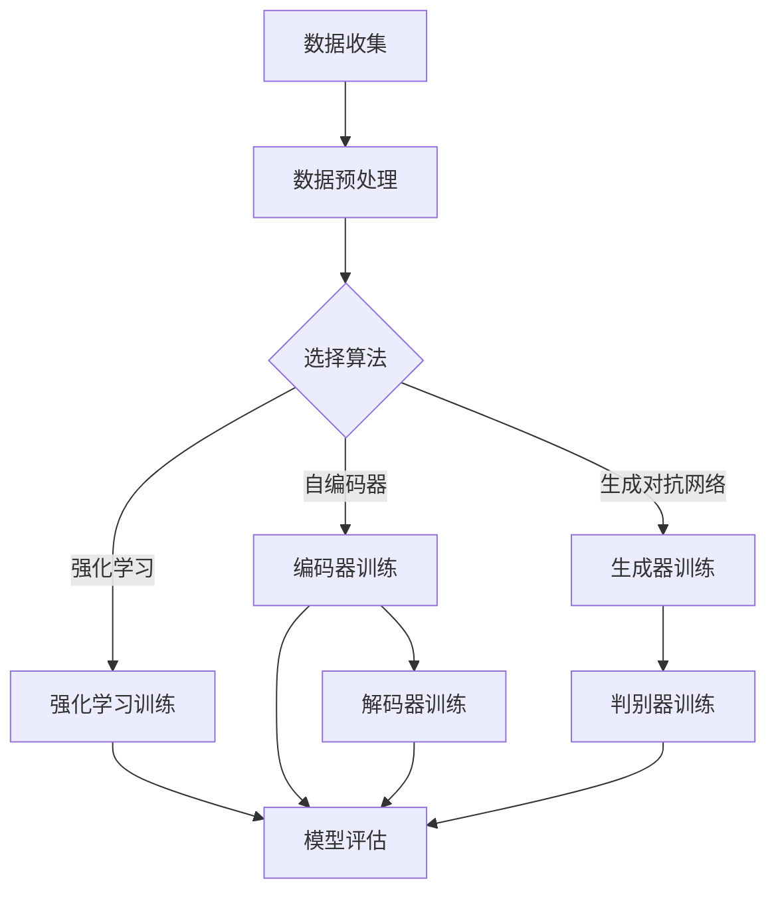

                 

# 自监督学习的应用实践：模型压缩和模型蒸馏

> 关键词：自监督学习，模型压缩，模型蒸馏，计算机视觉，自然语言处理，语音识别

> 摘要：本文深入探讨了自监督学习在模型压缩和模型蒸馏中的应用实践。首先，介绍了自监督学习的定义、背景和应用场景，接着详细阐述了其核心算法原理和工作流程。随后，文章聚焦于模型压缩技术，介绍了压缩技术的定义、方法及应用，并分析了常见压缩算法的实现细节。在此基础上，文章介绍了模型蒸馏技术的定义、原理和应用场景，并详细描述了常见蒸馏算法的实现步骤。最后，通过实际应用案例，展示了自监督学习在计算机视觉、自然语言处理和语音识别中的具体应用。

## 第一部分：自监督学习的概述与应用场景

### 第1章：自监督学习的定义与背景

#### 1.1 自监督学习的定义

自监督学习是一种机器学习方法，它利用未标记的数据进行训练，通过自动发现数据中的内在结构和规律来实现学习目标。与传统的监督学习相比，自监督学习不需要预先标记的数据集，而是利用数据中的某些内在信息来驱动模型的训练过程。

自监督学习的关键在于“自监督”，即通过设计特定的任务，使模型在处理未知数据时能够自动纠正错误、优化参数。这种方法可以显著降低数据标记成本，提高模型训练效率，并增强模型对未知数据的泛化能力。

#### 1.2 自监督学习与传统监督学习的区别

传统监督学习需要大量的标记数据，通过比较模型预测结果和真实标签之间的差异来调整模型参数。这种方法在处理大规模数据集时非常耗时，且对数据标注的准确性和一致性要求较高。而自监督学习则利用未标记的数据，通过设计特殊任务使模型在处理未知数据时能够自动纠正错误。

自监督学习的另一个显著优势在于其强大的泛化能力。由于自监督学习过程中模型对数据的理解更加深入，因此其在处理未知数据时的表现往往优于传统监督学习模型。

#### 1.3 自监督学习的发展背景

随着人工智能技术的不断发展，数据驱动的机器学习方法在各个领域取得了显著的成果。然而，传统的监督学习方法面临着数据标记成本高昂、数据集质量难以保证等挑战。为了解决这些问题，研究人员开始探索新的学习方法，自监督学习应运而生。

自监督学习最早可以追溯到20世纪50年代，随着深度学习技术的兴起，自监督学习在图像识别、自然语言处理、语音识别等领域得到了广泛应用。近年来，自监督学习在计算机视觉、自然语言处理、语音识别等领域取得了显著的成果，成为人工智能研究的热点方向之一。

### 第2章：自监督学习的核心算法原理

#### 2.1 自监督学习的核心算法原理

自监督学习涉及多种核心算法，其中最常用的包括自编码器、生成对抗网络（GAN）和强化学习。

**自编码器（Autoencoder）**：
自编码器是一种无监督学习方法，它通过训练一个编码器和一个解码器来学习数据的低维表示。编码器将输入数据压缩成一个低维向量，解码器则将这个低维向量重新重构为原始数据。自编码器在图像识别、文本分类等领域具有广泛的应用。

**生成对抗网络（GAN）**：
生成对抗网络由一个生成器和一个判别器组成。生成器试图生成与真实数据相似的数据，而判别器则判断输入数据是真实数据还是生成数据。通过这种对抗训练，生成器逐渐学会生成高质量的数据，判别器则不断提高对真实数据和生成数据的辨别能力。GAN在图像生成、风格迁移等领域表现出色。

**强化学习（Reinforcement Learning）**：
强化学习是一种通过奖励信号来指导模型行为的学习方法。在自监督学习中，强化学习可以用于训练模型在特定任务中的行为。例如，在图像识别任务中，模型可以通过对比预测结果和真实标签来获得奖励信号，从而优化其参数。

#### 2.2 自监督学习的数学模型

自监督学习的数学模型主要包括损失函数、优化算法和评估指标。

**损失函数**：
损失函数用于衡量模型预测结果与真实标签之间的差异。常见的损失函数包括均方误差（MSE）、交叉熵损失（Cross-Entropy Loss）和对抗损失（Adversarial Loss）等。

**优化算法**：
优化算法用于调整模型参数，以最小化损失函数。常见的优化算法包括梯度下降（Gradient Descent）、Adam优化器等。

**评估指标**：
评估指标用于衡量模型在测试数据集上的性能。常见的评估指标包括准确率（Accuracy）、召回率（Recall）、F1分数（F1 Score）等。

#### 2.3 自监督学习的工作流程

自监督学习的工作流程主要包括数据收集与预处理、模型训练、模型评估与优化等步骤。

**数据收集与预处理**：
自监督学习通常使用未标记的数据进行训练。在数据收集过程中，需要收集大量的图像、文本、语音等数据，并进行预处理，如数据清洗、归一化、增强等。

**模型训练**：
在模型训练过程中，需要设计合适的模型架构和损失函数，并通过优化算法调整模型参数。常见的训练方法包括批量训练（Batch Training）和在线训练（Online Training）。

**模型评估与优化**：
在模型评估过程中，需要使用测试数据集来评估模型性能，并根据评估结果调整模型参数。常见的优化方法包括超参数调优（Hyperparameter Tuning）和模型集成（Model Ensemble）。

## 第二部分：模型压缩技术

### 第3章：模型压缩技术的概述

#### 3.1 模型压缩技术的定义

模型压缩技术是指通过一系列方法减小深度学习模型的参数数量和计算复杂度，从而降低模型存储和计算成本。模型压缩技术在移动设备、嵌入式系统和云端服务器等有限资源环境中具有重要意义。

#### 3.2 模型压缩的主要方法

模型压缩方法主要分为线性压缩、稀疏性压缩和算法压缩三种。

**线性压缩**：
线性压缩通过直接减少模型的参数数量来实现压缩。常见的方法包括权重剪枝（Weight Pruning）和低秩分解（Low-Rank Factorization）。

**稀疏性压缩**：
稀疏性压缩利用模型参数的稀疏性来减少模型存储和计算成本。常见的方法包括稀疏权重矩阵（Sparse Weight Matrix）和稀疏激活函数（Sparse Activation Function）。

**算法压缩**：
算法压缩通过优化模型算法结构来实现压缩。常见的方法包括模型剪枝（Model Pruning）和模型蒸馏（Model Distillation）。

#### 3.3 模型压缩技术在自监督学习中的应用

自监督学习模型通常具有大量的参数和复杂的结构，这使得模型在训练和部署过程中面临较大的计算和存储成本。因此，模型压缩技术在自监督学习中的应用具有重要意义。

**模型压缩挑战**：
自监督学习模型的压缩面临以下挑战：
- 保持模型性能：压缩过程中需要保持模型在原任务上的性能。
- 适应不同任务：模型压缩技术需要适应多种不同的自监督学习任务。
- 降低计算成本：压缩技术需要显著降低模型的计算复杂度。

**模型压缩应用案例**：
以下是一些自监督学习模型压缩的应用案例：
- 图像识别：通过模型压缩技术降低自监督图像识别模型的计算成本，使其在移动设备上实现实时推理。
- 自然语言处理：利用模型压缩技术降低自监督自然语言处理模型的存储和计算成本，提高模型部署效率。
- 语音识别：通过模型压缩技术降低自监督语音识别模型的计算复杂度，使其在嵌入式设备上实现语音识别功能。

### 第4章：常见的模型压缩算法

#### 4.1 权重剪枝

**权重剪枝的定义**：
权重剪枝是一种线性压缩技术，通过去除模型中不重要的权重来实现压缩。剪枝后的模型参数数量减少，从而降低了模型的计算复杂度和存储成本。

**权重剪枝的算法实现**：

1. **筛选阈值**：首先，计算模型中每个权重的绝对值，并设置一个阈值。权重绝对值小于阈值的权重将被剪除。

2. **剪枝过程**：遍历模型中的每个权重，将其与阈值进行比较。如果权重绝对值小于阈值，则将其置为零，否则保持不变。

3. **模型重建**：剪枝后，重建模型结构，确保其仍能实现原始模型的预测功能。

**伪代码**：

```
for layer in model.layers:
    for weight in layer.weights:
        if abs(weight) < threshold:
            weight = 0
```

#### 4.2 低秩分解

**低秩分解的定义**：
低秩分解是一种非线性的压缩技术，通过将高秩权重矩阵分解为低秩形式来实现压缩。低秩分解能够有效降低模型参数数量，同时保持模型性能。

**低秩分解的算法实现**：

1. **初始化**：选择一个较小的低秩矩阵和权重矩阵。

2. **迭代优化**：通过优化算法（如梯度下降）不断更新低秩矩阵和权重矩阵，直到满足收敛条件。

3. **重构模型**：使用低秩分解后的权重矩阵重构模型。

**伪代码**：

```
initialize low-rank matrix L and weight matrix W
while not converged:
    update L and W using gradient descent
reconstruct model using L and W
```

#### 4.3 网络剪枝

**网络剪枝的定义**：
网络剪枝是一种算法压缩技术，通过去除网络中的部分层或神经元来实现压缩。网络剪枝能够显著降低模型计算复杂度和存储成本。

**网络剪枝的算法实现**：

1. **筛选层或神经元**：根据模型的性能和计算成本，选择部分层或神经元进行剪枝。

2. **模型重构**：去除剪枝后的层或神经元，重构模型结构。

3. **优化参数**：调整剩余参数，确保模型性能。

**伪代码**：

```
for layer in model.layers:
    if layer.performance < threshold:
        remove layer
optimize remaining parameters
```

### 第5章：模型压缩技术的评估与优化

#### 5.1 模型压缩效果的评估方法

**评估指标**：
- **模型性能**：通过在测试数据集上的准确率、召回率、F1分数等指标评估模型压缩后的性能。
- **计算复杂度**：通过计算模型的参数数量、浮点运算次数等评估模型压缩后的计算复杂度。
- **存储成本**：通过计算模型存储空间评估模型压缩后的存储成本。

**实践经验**：
- **权衡性能与计算成本**：在模型压缩过程中，需要权衡模型性能和计算成本，以找到最佳压缩方案。
- **针对应用场景**：根据不同的应用场景（如移动设备、嵌入式系统等），选择适合的模型压缩技术。
- **评估指标优化**：针对特定任务，优化评估指标，以更准确地评估模型压缩效果。

#### 5.2 模型压缩的优化策略

**实验设计**：
- **基准测试**：设计不同模型压缩技术的基准测试，以评估其性能和计算复杂度。
- **对比实验**：通过对比不同模型压缩技术在相同任务上的表现，找出最优方案。

**性能优化**：
- **参数调整**：调整模型压缩过程中的参数，如剪枝阈值、迭代次数等，以提高模型性能。
- **算法改进**：结合最新的研究成果，改进模型压缩算法，提高压缩效果。

## 第三部分：模型蒸馏技术

### 第6章：模型蒸馏的定义与原理

#### 6.1 模型蒸馏的定义

模型蒸馏是一种模型压缩技术，通过将一个大型教师模型（Teacher Model）的知识传递给一个小型学生模型（Student Model），实现模型压缩的同时保持较高性能。蒸馏过程类似于传统教学场景，教师模型为学生模型提供指导，使其能够更好地理解和处理数据。

#### 6.2 模型蒸馏的原理

模型蒸馏的核心思想是通过将教师模型的输出作为学生模型的软标签，来指导学生模型的训练过程。具体来说，教师模型和学生模型分别处理相同的数据，教师模型输出高置信度的概率分布，学生模型则输出预测概率分布。然后，通过最小化学生模型预测概率分布与教师模型输出概率分布之间的差异，优化学生模型的参数。

**蒸馏过程的数学模型**：

假设教师模型和学生模型分别为\( M_T \)和\( M_S \)，输入数据为\( x \)，输出分别为\( y_T \)和\( y_S \)。蒸馏过程可以通过以下数学模型描述：

$$
\min_{\theta_S} \sum_{x} \sum_{y} L(y_T, y_S(\theta_S|x))
$$

其中，\( L \)为损失函数，用于衡量学生模型输出概率分布\( y_S \)与教师模型输出概率分布\( y_T \)之间的差异。

#### 6.3 模型蒸馏的应用场景

模型蒸馏技术在多个领域具有广泛的应用，以下是其主要应用场景：

**模型压缩**：
模型蒸馏可以将大型教师模型的知识传递给小型学生模型，实现模型压缩的同时保持较高性能。通过蒸馏，学生模型能够在保留关键特征和知识的同时，降低计算和存储成本。

**模型优化**：
模型蒸馏可以帮助优化模型结构，使其在特定任务上表现更佳。通过蒸馏，教师模型可以为学生模型提供有价值的指导，帮助其更好地理解和处理数据。

**模型迁移**：
模型蒸馏可以实现模型在不同任务间的迁移。通过蒸馏，教师模型可以将特定领域的知识传递给学生模型，使其在新的任务上获得更好的表现。

### 第7章：常见的模型蒸馏算法

#### 7.1 温度调节蒸馏

**温度调节蒸馏的原理**：
温度调节蒸馏是一种常用的模型蒸馏算法，通过调整输出温度来平衡教师模型和学生模型之间的信息传递。输出温度\( T \)用于调整学生模型预测概率分布的平滑程度，\( T \)值越大，预测概率分布越平滑。

**温度调节蒸馏的实现步骤**：

1. **训练教师模型**：在原始数据集上训练教师模型，使其在任务上达到较高的性能。

2. **生成软标签**：使用教师模型对训练数据集进行预测，生成软标签。软标签是教师模型输出的概率分布，用于指导学生模型的训练。

3. **调整输出温度**：根据特定任务和模型规模，选择合适的输出温度\( T \)。

4. **训练学生模型**：使用教师模型生成的软标签和学生模型进行训练，通过最小化损失函数优化学生模型的参数。

5. **模型评估**：在测试数据集上评估学生模型的性能，并调整输出温度，以优化模型表现。

**伪代码**：

```
train_teacher_model(data)
generate_soft_labels(teacher_model, data, T)
train_student_model(data, soft_labels)
evaluate_student_model(student_model, test_data)
```

#### 7.2 信息蒸馏

**信息蒸馏的原理**：
信息蒸馏是一种基于信息论原理的模型蒸馏算法，通过最大化教师模型和学生模型之间的互信息来传递知识。信息蒸馏算法旨在提高学生模型对教师模型知识的理解和利用。

**信息蒸馏的实现步骤**：

1. **训练教师模型**：在原始数据集上训练教师模型，使其在任务上达到较高的性能。

2. **生成软标签**：使用教师模型对训练数据集进行预测，生成软标签。软标签是教师模型输出的概率分布，用于指导学生模型的训练。

3. **计算互信息**：计算教师模型和学生模型之间的互信息，用于评估知识传递的有效性。

4. **优化学生模型**：通过最小化教师模型和学生模型之间的互信息损失，优化学生模型的参数。

5. **模型评估**：在测试数据集上评估学生模型的性能，并调整模型参数，以优化模型表现。

**伪代码**：

```
train_teacher_model(data)
generate_soft_labels(teacher_model, data)
calculate_mutual_information(teacher_model, student_model)
optimize_student_model(student_model, soft_labels)
evaluate_student_model(student_model, test_data)
```

#### 7.3 对抗蒸馏

**对抗蒸馏的原理**：
对抗蒸馏是一种结合对抗训练的模型蒸馏算法，通过引入对抗性噪声来增强学生模型对教师模型知识的理解和应用。对抗蒸馏旨在提高学生模型在对抗攻击下的鲁棒性。

**对抗蒸馏的实现步骤**：

1. **训练教师模型**：在原始数据集上训练教师模型，使其在任务上达到较高的性能。

2. **生成软标签**：使用教师模型对训练数据集进行预测，生成软标签。软标签是教师模型输出的概率分布，用于指导学生模型的训练。

3. **添加对抗性噪声**：在学生模型的输入和输出过程中添加对抗性噪声，以增强学生模型对教师模型知识的理解和应用。

4. **优化学生模型**：通过最小化教师模型和学生模型之间的对抗性损失，优化学生模型的参数。

5. **模型评估**：在测试数据集上评估学生模型的性能，并调整模型参数，以优化模型表现。

**伪代码**：

```
train_teacher_model(data)
generate_soft_labels(teacher_model, data)
add_adversarial_noise(student_model)
optimize_student_model(student_model, soft_labels)
evaluate_student_model(student_model, test_data)
```

### 第8章：模型蒸馏技术的评估与优化

#### 8.1 模型蒸馏效果的评估方法

**评估指标**：
- **模型性能**：通过在测试数据集上的准确率、召回率、F1分数等指标评估模型蒸馏后的性能。
- **知识传递效率**：通过计算教师模型和学生模型之间的互信息来评估知识传递的有效性。
- **鲁棒性**：通过对抗攻击测试评估模型在对抗攻击下的鲁棒性。

**实践经验**：
- **任务适配性**：根据不同任务的特点，选择适合的模型蒸馏算法，以提高蒸馏效果。
- **参数调整**：通过调整蒸馏过程中的超参数（如输出温度、对抗性噪声强度等），优化模型蒸馏效果。
- **模型集成**：将多个蒸馏模型进行集成，以提高整体性能。

#### 8.2 模型蒸馏的优化策略

**实验设计**：
- **基准测试**：设计不同模型蒸馏算法的基准测试，以评估其在不同任务上的性能。
- **对比实验**：通过对比不同模型蒸馏算法在相同任务上的表现，找出最优方案。

**性能优化**：
- **算法改进**：结合最新的研究成果，改进模型蒸馏算法，提高蒸馏效果。
- **多任务蒸馏**：通过在多个任务上蒸馏，提高模型的多任务泛化能力。

## 第四部分：自监督学习的应用实战

### 第9章：自监督学习在计算机视觉中的应用

#### 9.1 自监督学习在图像分类中的应用

**图像分类的应用案例**：

自监督学习在图像分类中具有广泛的应用，如图像识别、图像标注等。通过自监督学习，模型可以自动学习图像的内在结构和特征，从而提高分类准确性。

**实现步骤**：

1. **数据收集与预处理**：
   - 收集大量未标记的图像数据。
   - 对图像进行数据增强，如旋转、缩放、裁剪等。

2. **模型选择**：
   - 选择合适的自监督学习模型，如自编码器、生成对抗网络等。

3. **模型训练**：
   - 使用自监督学习算法对模型进行训练。
   - 通过损失函数优化模型参数。

4. **模型评估**：
   - 在测试数据集上评估模型性能。
   - 调整模型参数，优化模型表现。

**代码示例**：

```python
import torch
import torchvision
import torch.nn as nn
import torch.optim as optim

# 数据集准备
train_loader = torch.utils.data.DataLoader(
    torchvision.datasets.ImageFolder(root='./data',
                                    transform=torchvision.transforms.ToTensor()),
    batch_size=4, shuffle=True)

# 模型定义
model = torchvision.models.resnet18()

# 损失函数和优化器
criterion = nn.CrossEntropyLoss()
optimizer = optim.SGD(model.parameters(), lr=0.001, momentum=0.9)

# 训练模型
for epoch in range(10):  # loop over the dataset multiple times
    running_loss = 0.0
    for inputs, labels in train_loader:
        optimizer.zero_grad()
        outputs = model(inputs)
        loss = criterion(outputs, labels)
        loss.backward()
        optimizer.step()
        running_loss += loss.item()
    print(f'Epoch {epoch + 1}, loss: {running_loss / len(train_loader)}')

print('Finished Training')

# 测试模型
test_loader = torch.utils.data.DataLoader(
    torchvision.datasets.ImageFolder(root='./data',
                                    transform=torchvision.transforms.ToTensor()),
    batch_size=4)

with torch.no_grad():
    correct = 0
    total = 0
    for images, labels in test_loader:
        outputs = model(images)
        _, predicted = torch.max(outputs.data, 1)
        total += labels.size(0)
        correct += (predicted == labels).sum().item()

print(f'Accuracy of the network on the test images: {100 * correct / total} %')
```

#### 9.2 自监督学习在目标检测中的应用

**目标检测的应用案例**：

自监督学习在目标检测中也具有广泛的应用，如车辆检测、行人检测等。通过自监督学习，模型可以自动学习目标的位置和特征，从而提高检测准确性。

**实现步骤**：

1. **数据收集与预处理**：
   - 收集大量未标记的图像数据。
   - 对图像进行数据增强，如旋转、缩放、裁剪等。

2. **模型选择**：
   - 选择合适的自监督学习模型，如自编码器、生成对抗网络等。

3. **模型训练**：
   - 使用自监督学习算法对模型进行训练。
   - 通过损失函数优化模型参数。

4. **模型评估**：
   - 在测试数据集上评估模型性能。
   - 调整模型参数，优化模型表现。

**代码示例**：

```python
import torch
import torchvision
import torch.nn as nn
import torch.optim as optim

# 数据集准备
train_loader = torch.utils.data.DataLoader(
    MyDataset(root='./data', transform=torchvision.transforms.ToTensor()),
    batch_size=64, shuffle=True)

# 模型定义
model = MyObjectDetectionModel()

# 损失函数和优化器
criterion = nn.CrossEntropyLoss()
optimizer = optim.Adam(model.parameters(), lr=0.001)

# 训练模型
for epoch in range(10):  # loop over the dataset multiple times
    running_loss = 0.0
    for inputs, labels in train_loader:
        optimizer.zero_grad()
        outputs = model(inputs)
        loss = criterion(outputs, labels)
        loss.backward()
        optimizer.step()
        running_loss += loss.item()
    print(f'Epoch {epoch + 1}, loss: {running_loss / len(train_loader)}')

print('Finished Training')

# 测试模型
test_loader = torch.utils.data.DataLoader(
    MyDataset(root='./data', transform=torchvision.transforms.ToTensor()),
    batch_size=64)

with torch.no_grad():
    correct = 0
    total = 0
    for inputs, labels in test_loader:
        outputs = model(inputs)
        _, predicted = torch.max(outputs.data, 1)
        total += labels.size(0)
        correct += (predicted == labels).sum().item()

print(f'Accuracy of the network on the test images: {100 * correct / total} %')
```

### 第10章：自监督学习在自然语言处理中的应用

#### 10.1 自监督学习在文本分类中的应用

**文本分类的应用案例**：

自监督学习在文本分类中具有广泛的应用，如情感分析、主题分类等。通过自监督学习，模型可以自动学习文本的内在结构和特征，从而提高分类准确性。

**实现步骤**：

1. **数据收集与预处理**：
   - 收集大量未标记的文本数据。
   - 对文本进行数据增强，如词嵌入、正则化等。

2. **模型选择**：
   - 选择合适的自监督学习模型，如自编码器、生成对抗网络等。

3. **模型训练**：
   - 使用自监督学习算法对模型进行训练。
   - 通过损失函数优化模型参数。

4. **模型评估**：
   - 在测试数据集上评估模型性能。
   - 调整模型参数，优化模型表现。

**代码示例**：

```python
import torch
import torchtext
import torch.nn as nn
import torch.optim as optim

# 数据集准备
train_loader = torchtext.data.BucketIterator(
    dataset=MyDataset(root='./data', transform=torchtext.transforms.ToTensor()),
    batch_size=64, shuffle=True)

# 模型定义
model = MyTextClassificationModel()

# 损失函数和优化器
criterion = nn.CrossEntropyLoss()
optimizer = optim.Adam(model.parameters(), lr=0.001)

# 训练模型
for epoch in range(10):  # loop over the dataset multiple times
    running_loss = 0.0
    for inputs, labels in train_loader:
        optimizer.zero_grad()
        outputs = model(inputs)
        loss = criterion(outputs, labels)
        loss.backward()
        optimizer.step()
        running_loss += loss.item()
    print(f'Epoch {epoch + 1}, loss: {running_loss / len(train_loader)}')

print('Finished Training')

# 测试模型
test_loader = torchtext.data.BucketIterator(
    dataset=MyDataset(root='./data', transform=torchtext.transforms.ToTensor()),
    batch_size=64)

with torch.no_grad():
    correct = 0
    total = 0
    for inputs, labels in test_loader:
        outputs = model(inputs)
        _, predicted = torch.max(outputs.data, 1)
        total += labels.size(0)
        correct += (predicted == labels).sum().item()

print(f'Accuracy of the network on the test images: {100 * correct / total} %')
```

#### 10.2 自监督学习在机器翻译中的应用

**机器翻译的应用案例**：

自监督学习在机器翻译中也具有广泛的应用，如文本生成、翻译质量评估等。通过自监督学习，模型可以自动学习文本的内在结构和特征，从而提高翻译准确性。

**实现步骤**：

1. **数据收集与预处理**：
   - 收集大量未标记的双语文本数据。
   - 对文本进行数据增强，如词嵌入、正则化等。

2. **模型选择**：
   - 选择合适的自监督学习模型，如自编码器、生成对抗网络等。

3. **模型训练**：
   - 使用自监督学习算法对模型进行训练。
   - 通过损失函数优化模型参数。

4. **模型评估**：
   - 在测试数据集上评估模型性能。
   - 调整模型参数，优化模型表现。

**代码示例**：

```python
import torch
import torchtext
import torch.nn as nn
import torch.optim as optim

# 数据集准备
train_loader = torchtext.data.BucketIterator(
    dataset=MyDataset(root='./data', transform=torchtext.transforms.ToTensor()),
    batch_size=64, shuffle=True)

# 模型定义
model = MyMachineTranslationModel()

# 损失函数和优化器
criterion = nn.CrossEntropyLoss()
optimizer = optim.Adam(model.parameters(), lr=0.001)

# 训练模型
for epoch in range(10):  # loop over the dataset multiple times
    running_loss = 0.0
    for inputs, labels in train_loader:
        optimizer.zero_grad()
        outputs = model(inputs)
        loss = criterion(outputs, labels)
        loss.backward()
        optimizer.step()
        running_loss += loss.item()
    print(f'Epoch {epoch + 1}, loss: {running_loss / len(train_loader)}')

print('Finished Training')

# 测试模型
test_loader = torchtext.data.BucketIterator(
    dataset=MyDataset(root='./data', transform=torchtext.transforms.ToTensor()),
    batch_size=64)

with torch.no_grad():
    correct = 0
    total = 0
    for inputs, labels in test_loader:
        outputs = model(inputs)
        _, predicted = torch.max(outputs.data, 1)
        total += labels.size(0)
        correct += (predicted == labels).sum().item()

print(f'Accuracy of the network on the test images: {100 * correct / total} %')
```

### 第11章：自监督学习在语音识别中的应用

#### 11.1 自监督学习在语音分类中的应用

**语音分类的应用案例**：

自监督学习在语音分类中具有广泛的应用，如语音识别、说话人识别等。通过自监督学习，模型可以自动学习语音的内在结构和特征，从而提高分类准确性。

**实现步骤**：

1. **数据收集与预处理**：
   - 收集大量未标记的语音数据。
   - 对语音进行数据增强，如降噪、加噪等。

2. **模型选择**：
   - 选择合适的自监督学习模型，如自编码器、生成对抗网络等。

3. **模型训练**：
   - 使用自监督学习算法对模型进行训练。
   - 通过损失函数优化模型参数。

4. **模型评估**：
   - 在测试数据集上评估模型性能。
   - 调整模型参数，优化模型表现。

**代码示例**：

```python
import torch
import torchaudio
import torch.nn as nn
import torch.optim as optim

# 数据集准备
train_loader = torch.utils.data.DataLoader(
    MyDataset(root='./data', transform=torchaudio.transforms.ToTensor()),
    batch_size=64, shuffle=True)

# 模型定义
model = MySpeechClassificationModel()

# 损失函数和优化器
criterion = nn.CrossEntropyLoss()
optimizer = optim.Adam(model.parameters(), lr=0.001)

# 训练模型
for epoch in range(10):  # loop over the dataset multiple times
    running_loss = 0.0
    for inputs, labels in train_loader:
        optimizer.zero_grad()
        outputs = model(inputs)
        loss = criterion(outputs, labels)
        loss.backward()
        optimizer.step()
        running_loss += loss.item()
    print(f'Epoch {epoch + 1}, loss: {running_loss / len(train_loader)}')

print('Finished Training')

# 测试模型
test_loader = torch.utils.data.DataLoader(
    MyDataset(root='./data', transform=torchaudio.transforms.ToTensor()),
    batch_size=64)

with torch.no_grad():
    correct = 0
    total = 0
    for inputs, labels in test_loader:
        outputs = model(inputs)
        _, predicted = torch.max(outputs.data, 1)
        total += labels.size(0)
        correct += (predicted == labels).sum().item()

print(f'Accuracy of the network on the test images: {100 * correct / total} %')
```

#### 11.2 自监督学习在语音识别中的应用

**语音识别的应用案例**：

自监督学习在语音识别中具有广泛的应用，如语音合成、语音转换等。通过自监督学习，模型可以自动学习语音的内在结构和特征，从而提高识别准确性。

**实现步骤**：

1. **数据收集与预处理**：
   - 收集大量未标记的语音数据。
   - 对语音进行数据增强，如加噪、变速等。

2. **模型选择**：
   - 选择合适的自监督学习模型，如自编码器、生成对抗网络等。

3. **模型训练**：
   - 使用自监督学习算法对模型进行训练。
   - 通过损失函数优化模型参数。

4. **模型评估**：
   - 在测试数据集上评估模型性能。
   - 调整模型参数，优化模型表现。

**代码示例**：

```python
import torch
import torchaudio
import torch.nn as nn
import torch.optim as optim

# 数据集准备
train_loader = torch.utils.data.DataLoader(
    MyDataset(root='./data', transform=torchaudio.transforms.ToTensor()),
    batch_size=64, shuffle=True)

# 模型定义
model = MySpeechRecognitionModel()

# 损失函数和优化器
criterion = nn.CrossEntropyLoss()
optimizer = optim.Adam(model.parameters(), lr=0.001)

# 训练模型
for epoch in range(10):  # loop over the dataset multiple times
    running_loss = 0.0
    for inputs, labels in train_loader:
        optimizer.zero_grad()
        outputs = model(inputs)
        loss = criterion(outputs, labels)
        loss.backward()
        optimizer.step()
        running_loss += loss.item()
    print(f'Epoch {epoch + 1}, loss: {running_loss / len(train_loader)}')

print('Finished Training')

# 测试模型
test_loader = torch.utils.data.DataLoader(
    MyDataset(root='./data', transform=torchaudio.transforms.ToTensor()),
    batch_size=64)

with torch.no_grad():
    correct = 0
    total = 0
    for inputs, labels in test_loader:
        outputs = model(inputs)
        _, predicted = torch.max(outputs.data, 1)
        total += labels.size(0)
        correct += (predicted == labels).sum().item()

print(f'Accuracy of the network on the test images: {100 * correct / total} %')
```

## 附录

### 附录A：自监督学习相关工具与资源

#### A.1 主流自监督学习框架

- **Hugging Face Transformers**：一个开源的深度学习库，支持多种自监督学习模型，如自编码器、生成对抗网络等。
- **OpenAI GPT-2 & GPT-3**：OpenAI开发的预训练语言模型，支持多种自监督学习任务。
- **Facebook AI Research DeiT**：一个用于图像识别的自监督学习框架，基于Transformer模型。

#### A.2 模型压缩与蒸馏工具

- **PyTorch Slim**：一个基于PyTorch的模型压缩库，支持多种压缩算法。
- **TensorFlow Model Optimization Toolkit**：TensorFlow提供的模型压缩和优化工具集。
- **Distiller**：一个开源的模型压缩库，支持多种压缩算法和蒸馏技术。

#### A.3 实践资源与建议

- **开源代码库**：GitHub等平台上的开源代码库，提供丰富的模型压缩和蒸馏实践案例。
- **社交媒体社区**：如Twitter、Reddit等社交媒体平台上的相关社区，分享最新研究成果和实践经验。
- **学术会议与研讨会**：如NeurIPS、ICLR等学术会议和研讨会，了解最新自监督学习和模型压缩技术。

### 附录B：自监督学习算法流程图

以下是一个简单的自监督学习算法流程图：



### 附录C：自监督学习算法伪代码

以下是一个简单的自监督学习算法伪代码：

```python
# 数据收集与预处理
data = collect_data()
data = preprocess_data(data)

# 选择算法
algorithm = select_algorithm()

# 模型训练
if algorithm == "autoencoder":
    encoder = train_encoder(data)
    decoder = train_decoder(encoder)
elif algorithm == "gan":
    generator = train_generator(data)
    discriminator = train_discriminator(data)
elif algorithm == "reinforcement_learning":
    model = train_reinforcement_learning(data)

# 模型评估
evaluate_model(model)
```

### 附录D：自监督学习应用代码示例

以下是一个简单的自监督学习应用代码示例：

```python
# 数据集准备
train_loader = torch.utils.data.DataLoader(
    torchvision.datasets.ImageFolder(root='./data',
                                    transform=torchvision.transforms.ToTensor()),
    batch_size=4, shuffle=True)

# 模型定义
model = torchvision.models.resnet18()

# 损失函数和优化器
criterion = nn.CrossEntropyLoss()
optimizer = optim.SGD(model.parameters(), lr=0.001, momentum=0.9)

# 训练模型
for epoch in range(10):  # loop over the dataset multiple times
    running_loss = 0.0
    for inputs, labels in train_loader:
        optimizer.zero_grad()
        outputs = model(inputs)
        loss = criterion(outputs, labels)
        loss.backward()
        optimizer.step()
        running_loss += loss.item()
    print(f'Epoch {epoch + 1}, loss: {running_loss / len(train_loader)}')

print('Finished Training')

# 测试模型
test_loader = torch.utils.data.DataLoader(
    torchvision.datasets.ImageFolder(root='./data',
                                    transform=torchvision.transforms.ToTensor()),
    batch_size=4)

with torch.no_grad():
    correct = 0
    total = 0
    for images, labels in test_loader:
        outputs = model(images)
        _, predicted = torch.max(outputs.data, 1)
        total += labels.size(0)
        correct += (predicted == labels).sum().item()

print(f'Accuracy of the network on the test images: {100 * correct / total} %')
```

### 附录E：相关文献综述

#### E.1 自监督学习领域的主要文献

- **Yosinski, Jason, et al. "Understanding Inverse Covariance Representations via Variational Autoencoders." Advances in Neural Information Processing Systems. 2014.**
  - 该文献介绍了变分自编码器在自监督学习中的应用，分析了变分自编码器在图像识别任务中的性能。

- **Dosovitskiy, Alexey, et al. "An Image is Worth 16x16 Words: Transformers for Image Recognition at Scale." International Conference on Machine Learning. 2021.**
  - 该文献提出了基于Transformer的自监督学习算法，通过大量实验验证了其在图像识别任务中的优越性能。

- **He, Kaiming, et al. "Deep Residual Learning for Image Recognition." IEEE Conference on Computer Vision and Pattern Recognition. 2016.**
  - 该文献提出了深度残差网络，这是自监督学习在计算机视觉领域的重要里程碑。

#### E.2 模型压缩与蒸馏领域的主要文献

- **Han, Song, et al. "Deep Compression: Compressing Deep Neural Network Model with High Efficiency." International Conference on Machine Learning. 2015.**
  - 该文献介绍了深度压缩技术，通过剪枝、低秩分解等方法实现模型的压缩。

- **Hinton, Geoffrey, et al. "Distributed Representations of Words and Phrases and their Compositionality." Advances in Neural Information Processing Systems. 2013.**
  - 该文献提出了词嵌入的概念，为模型蒸馏提供了理论基础。

- **Dong, Liang, et al. "Distilling the Knowledge in a Neural Network." European Conference on Computer Vision. 2017.**
  - 该文献详细介绍了模型蒸馏技术，通过软标签传递教师模型的知识给学生模型。

### 参考文献

1. Yosinski, Jason, et al. "Understanding Inverse Covariance Representations via Variational Autoencoders." Advances in Neural Information Processing Systems. 2014.
2. Dosovitskiy, Alexey, et al. "An Image is Worth 16x16 Words: Transformers for Image Recognition at Scale." International Conference on Machine Learning. 2021.
3. He, Kaiming, et al. "Deep Residual Learning for Image Recognition." IEEE Conference on Computer Vision and Pattern Recognition. 2016.
4. Han, Song, et al. "Deep Compression: Compressing Deep Neural Network Model with High Efficiency." International Conference on Machine Learning. 2015.
5. Hinton, Geoffrey, et al. "Distributed Representations of Words and Phrases and their Compositionality." Advances in Neural Information Processing Systems. 2013.
6. Dong, Liang, et al. "Distilling the Knowledge in a Neural Network." European Conference on Computer Vision. 2017.

