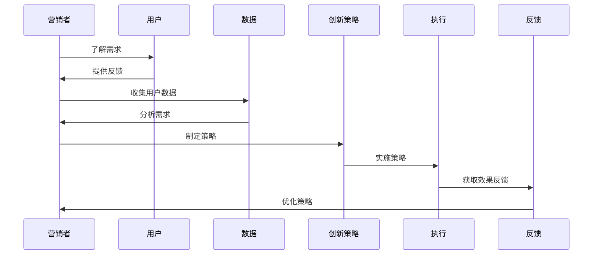

                 

### 文章标题：营销创新：吸引目标用户

**关键词**：营销创新、目标用户、消费者行为、数据分析、社交媒体营销、内容营销、跨渠道整合

**摘要**：
本文旨在深入探讨营销创新在吸引目标用户方面的核心作用。通过详细分析营销创新的基础理论、消费者行为、创新营销战略以及多种营销方法，本文将为读者提供一套系统的营销创新方法论，帮助企业在竞争激烈的市场中脱颖而出。文章还将通过实际案例研究和未来趋势预测，展现营销创新的实践效果和潜在发展方向。

### 目录大纲

1. **第一部分：营销创新的基础理论**
   - **第1章：营销创新概述**
     - 1.1 营销创新的定义与意义
     - 1.2 营销创新的历史与发展
     - 1.3 营销创新的驱动因素
     - 1.4 营销创新的关键要素
   - **第2章：消费者行为分析**
     - 2.1 消费者行为理论概述
     - 2.2 消费者心理与购买决策过程
     - 2.3 消费者洞察与市场细分
   - **第3章：创新营销战略**
     - 3.1 创新营销战略的类型
     - 3.2 创新营销战略的制定与实施
     - 3.3 创新营销战略的评估与优化

2. **第二部分：营销创新方法与实践**
   - **第4章：内容营销与创新**
     - 4.1 内容营销的核心理念
     - 4.2 创新内容营销的策略与实践
     - 4.3 内容营销案例分析
   - **第5章：社交媒体营销与创新**
     - 5.1 社交媒体营销概述
     - 5.2 社交媒体营销的创新方法
     - 5.3 社交媒体营销案例分析
   - **第6章：数据驱动的营销创新**
     - 6.1 数据驱动的营销理念
     - 6.2 数据收集与分析方法
     - 6.3 数据驱动的营销策略
   - **第7章：跨渠道营销整合与创新**
     - 7.1 跨渠道营销的概念与挑战
     - 7.2 跨渠道营销整合策略
     - 7.3 跨渠道营销案例分析

3. **第三部分：营销创新案例研究**
   - **第8章：营销创新实践：成功案例解析**
     - 8.1 案例一：某品牌内容营销的成功实践
     - 8.2 案例二：某品牌社交媒体营销的创新案例
     - 8.3 案例三：某品牌数据驱动的营销创新
   - **第9章：营销创新的未来趋势**
     - 9.1 营销创新的未来发展方向
     - 9.2 新技术对营销创新的推动作用
     - 9.3 营销创新者面临的挑战与机遇

4. **附录**
   - **附录A：营销创新工具与资源指南**
     - A.1 营销分析工具介绍
     - A.2 社交媒体管理工具推荐
     - A.3 内容营销资源汇总
     - A.4 营销创新书籍与论文推荐

### 第一部分：营销创新的基础理论

#### 第1章：营销创新概述

**1.1 营销创新的定义与意义**

营销创新是指在营销活动中引入新颖的想法、方法、策略或工具，以区别于传统的营销模式。它不仅包括在产品、价格、促销和渠道等方面的创新，还涉及营销思路、营销流程和营销组织的变革。营销创新的意义主要体现在以下几个方面：

1. **提升竞争力**：在竞争激烈的市场环境中，营销创新可以帮助企业脱颖而出，形成差异化优势。
2. **满足需求**：通过创新，企业能够更好地理解消费者需求，提供个性化的产品和服务，从而提升用户满意度。
3. **降低成本**：创新的营销方法往往能够提高营销效率，降低成本，提高企业的盈利能力。
4. **提升品牌形象**：营销创新能够树立企业的创新形象，增强品牌的市场影响力。

**1.2 营销创新的历史与发展**

营销创新的历史可以追溯到20世纪初期，随着市场营销理论的不断完善，营销创新逐渐成为企业竞争的重要手段。以下是一些重要的营销创新里程碑：

- **20世纪20年代**：连锁店和超市的兴起，开创了现代营销的先河。
- **20世纪50年代**：市场细分理论的提出，使企业能够更精准地定位目标市场。
- **20世纪80年代**：数据库营销的出现，使企业能够通过数据技术更好地了解消费者。
- **21世纪**：互联网和数字技术的普及，使得营销创新达到了一个新的高度，如社交媒体营销、内容营销等。

**1.3 营销创新的驱动因素**

营销创新的驱动因素多种多样，主要包括以下几个方面：

- **技术进步**：新技术的出现为营销创新提供了新的工具和方法，如大数据分析、人工智能等。
- **消费者需求**：消费者需求的不断变化推动企业不断创新，以满足他们的个性化需求。
- **市场竞争**：激烈的竞争环境迫使企业不断寻找创新的营销策略，以保持竞争优势。
- **法律法规**：相关法律法规的变化，如数据保护法规，也促使企业进行营销创新，以符合法规要求。

**1.4 营销创新的关键要素**

成功的营销创新需要具备以下几个关键要素：

- **创新能力**：企业应具备持续创新的意识和能力，以应对市场的变化。
- **资源投入**：充足的资源投入是营销创新成功的基础，包括人力、物力和财力。
- **团队协作**：营销创新需要跨部门的合作，形成创新团队，共同推进项目。
- **风险管理**：创新过程中不可避免地会面临风险，企业需要建立完善的风险管理机制。
- **持续迭代**：营销创新不是一蹴而就的，而是需要不断迭代和优化的过程。

### 第2章：消费者行为分析

**2.1 消费者行为理论概述**

消费者行为理论是研究消费者在购买、使用和评价产品过程中的行为和决策的理论体系。其主要目标是理解消费者的购买动机、购买决策过程以及消费者如何评价产品。以下是一些重要的消费者行为理论：

- **需求理论**：需求理论关注消费者在不同价格水平下对产品的需求量。例如，需求价格弹性理论研究了价格变动对需求量的影响。
- **行为经济学**：行为经济学研究消费者在购买决策中的心理行为，如认知偏差、情感因素等。
- **社会心理学**：社会心理学研究消费者在购买决策过程中受到社会影响的行为，如群体压力、社会认同等。
- **文化理论**：文化理论关注消费者行为背后的文化因素，如价值观、生活方式等。

**2.2 消费者心理与购买决策过程**

消费者心理与购买决策过程可以分为以下几个阶段：

- **需求识别**：消费者意识到自身需要某种产品或服务，这是购买过程的第一步。
- **信息搜索**：消费者通过多种渠道收集关于产品或服务的相关信息，以便做出更明智的决策。
- **评估与选择**：消费者在收集到足够的信息后，对不同的产品或服务进行评估，并最终做出选择。
- **购买决策**：消费者决定购买某一产品或服务，并采取实际行动进行购买。
- **购买后评价**：消费者在购买后会对产品或服务进行评价，这种评价将影响他们未来的购买行为。

**2.3 消费者洞察与市场细分**

消费者洞察是指通过研究和分析消费者行为、需求和偏好，以深入了解消费者的需求和期望。消费者洞察有助于企业更好地定位市场和制定营销策略。以下是一些常用的消费者洞察方法：

- **定性研究**：通过深度访谈、小组讨论等方式，深入了解消费者的真实想法和需求。
- **定量研究**：通过问卷调查、数据分析等方法，收集大量消费者的数据，进行分析和归纳。
- **市场细分**：根据消费者的不同需求和特征，将市场划分为若干个具有相似特征的子市场，以便企业更精准地定位和满足不同消费者的需求。

市场细分的方法包括：

- **地理细分**：根据消费者的地理位置、文化背景等进行细分。
- **人口细分**：根据消费者的年龄、性别、收入、职业等人口统计特征进行细分。
- **心理细分**：根据消费者的心理特征、价值观、生活方式等进行细分。
- **行为细分**：根据消费者的购买行为、使用习惯、品牌忠诚度等进行细分。

通过消费者行为分析和市场细分，企业可以更准确地了解消费者需求，制定更有针对性的营销策略，从而提高营销效果。

### 第3章：创新营销战略

**3.1 创新营销战略的类型**

创新营销战略可以分为以下几种类型：

- **产品创新**：通过改进或开发新产品，满足消费者的新需求或提升产品价值。
- **市场创新**：通过开拓新市场、新渠道或新客户群体，扩大市场份额。
- **服务创新**：通过改进或创新服务，提升消费者体验和满意度。
- **营销模式创新**：通过创新营销模式，如社交媒体营销、内容营销等，提高营销效率和效果。
- **跨渠道整合**：通过整合线上线下渠道，提供无缝的消费者购物体验。

**3.2 创新营销战略的制定与实施**

制定创新营销战略需要遵循以下步骤：

- **明确目标**：确定营销创新的目标，如提升品牌知名度、增加市场份额、提高消费者满意度等。
- **市场分析**：通过市场调研和分析，了解目标市场的需求、竞争状况和行业趋势。
- **创意构思**：根据市场分析结果，构思创新的营销策略和方案。
- **评估与选择**：评估不同创意的可行性、成本和潜在收益，选择最优方案。
- **实施计划**：制定详细的实施计划，包括时间表、资源分配和责任分工。
- **执行与监控**：执行营销策略，并持续监控效果，及时调整和优化。

**3.3 创新营销战略的评估与优化**

评估创新营销战略的效果需要关注以下几个方面：

- **目标达成度**：衡量创新营销战略是否实现了既定的目标。
- **市场反馈**：通过消费者调查、市场占有率等指标，了解市场对创新营销战略的反应。
- **成本效益**：评估创新营销战略的成本和收益，确保投资回报率。
- **竞争态势**：分析竞争对手的营销策略，了解市场变化和竞争压力。

优化创新营销战略的方法包括：

- **数据驱动的优化**：通过数据分析和反馈，持续优化营销策略和方案。
- **用户参与**：鼓励消费者参与营销活动，收集用户反馈，改进产品和服务。
- **持续创新**：保持创新思维，不断探索新的营销方法和工具，以应对市场变化。

通过科学制定和持续优化创新营销战略，企业可以不断提高营销效果，提升市场竞争力。

### 第二部分：营销创新方法与实践

#### 第4章：内容营销与创新

**4.1 内容营销的核心理念**

内容营销是一种通过创造和分享有价值的内容来吸引潜在客户、建立客户关系和促进销售的营销策略。其核心理念包括：

- **价值创造**：内容营销的核心在于为用户提供有价值的信息，满足他们的需求。
- **客户关系**：通过内容营销，企业可以与客户建立长期的信任关系，提高客户忠诚度。
- **品牌传播**：优质的内容有助于提升品牌形象，增强品牌的市场影响力。

**4.2 创新内容营销的策略与实践**

创新内容营销的策略和实践包括以下几个方面：

- **故事营销**：通过讲述引人入胜的故事，吸引消费者的注意力，并引发情感共鸣。
- **互动内容**：利用社交媒体、问答平台等互动工具，与消费者进行互动，增强参与感。
- **多媒体内容**：结合文字、图片、视频等多种形式，提高内容的吸引力和传播力。
- **个性化内容**：根据消费者的兴趣和需求，定制个性化的内容，提高内容的针对性和效果。
- **社区营销**：通过创建和维护线上社区，与消费者建立紧密联系，提高用户粘性。

**4.3 内容营销案例分析**

以下是一个内容营销的成功案例：

**案例：杜蕾斯的内容营销**

杜蕾斯是一家知名的安全套品牌，其在内容营销方面有着出色的表现。以下是一些杜蕾斯内容营销的实践：

- **热点营销**：杜蕾斯善于抓住社会热点事件，结合品牌特点，创作有趣的内容。例如，在奥运会期间，杜蕾斯发布了“杜蕾斯奥运冠军系列”，以幽默的方式展示了奥运冠军使用杜蕾斯的场景，吸引了大量关注。
- **情感营销**：杜蕾斯通过讲述爱情故事、亲情故事等，传递温暖和正能量，与消费者建立情感连接。例如，杜蕾斯曾发布了一篇名为《你是我的小呀小苹果》的故事，讲述了一个年轻人从青春期到成年的成长历程，引发了消费者的共鸣。
- **创意海报**：杜蕾斯以其独特的设计风格和幽默的文案，创作了一系列创意海报，引起了广泛的传播和讨论。例如，杜蕾斯在情人节期间发布的“情话版”海报，以其直白而有趣的表达方式，吸引了大量关注。

通过这些创新的内容营销实践，杜蕾斯成功地提升了品牌知名度和市场影响力，成为内容营销的典范。

#### 第5章：社交媒体营销与创新

**5.1 社交媒体营销概述**

社交媒体营销是指利用社交媒体平台（如微博、微信、Facebook、Instagram等）进行营销的活动。其核心目标是通过社交媒体与用户建立互动关系，提升品牌知名度和用户忠诚度。以下是一些社交媒体营销的特点：

- **互动性强**：社交媒体平台提供了丰富的互动工具，如评论、点赞、分享等，使企业与用户之间能够进行实时交流。
- **覆盖面广**：社交媒体平台拥有庞大的用户群体，能够帮助企业接触到更多的潜在客户。
- **传播速度快**：信息在社交媒体上的传播速度非常快，一个优质的内容可以在短时间内获得大量的关注和分享。
- **精准定位**：通过分析用户的兴趣和行为，社交媒体平台可以为企业提供精准的用户定位，提高营销效果。

**5.2 社交媒体营销的创新方法**

创新社交媒体营销的方法包括：

- **KOL营销**：通过与知名博主、网红等关键意见领袖（KOL）合作，利用他们的影响力来推广产品和服务。
- **直播营销**：通过直播平台进行产品展示、互动问答等，提高用户的参与度和购买意愿。
- **病毒营销**：通过创意内容设计，引发用户传播，使信息在社交媒体上迅速传播，提升品牌知名度。
- **情感营销**：通过讲述品牌故事、传递情感价值，与用户建立情感共鸣，提升品牌忠诚度。
- **社交媒体广告**：利用社交媒体平台的广告工具，进行精准投放，提高广告的点击率和转化率。

**5.3 社交媒体营销案例分析**

以下是一个社交媒体营销的成功案例：

**案例：小米的社交媒体营销**

小米是一家知名的科技企业，其在社交媒体营销方面有着卓越的表现。以下是一些小米社交媒体营销的实践：

- **微博营销**：小米在微博上建立了官方账号，通过发布产品信息、互动问答、直播活动等方式，与粉丝进行互动，提升了品牌知名度和用户忠诚度。
- **微信营销**：小米在微信上建立了公众号，通过推送优质内容、开展粉丝互动、组织线上活动等方式，与用户建立了紧密联系。
- **抖音营销**：小米在抖音上发布了多个产品宣传视频，通过创意视频内容和互动评论，吸引了大量用户关注和点赞。
- **直播营销**：小米通过直播平台进行产品发布会、产品展示等活动，与用户进行实时互动，提高了用户的购买意愿。

通过这些创新社交媒体营销实践，小米成功地提升了品牌知名度和市场影响力，成为社交媒体营销的典范。

#### 第6章：数据驱动的营销创新

**6.1 数据驱动的营销理念**

数据驱动的营销理念是指通过收集、分析和利用数据，指导营销决策和活动。其核心理念包括：

- **数据至上**：将数据视为营销决策的基石，通过数据来指导营销策略的制定和实施。
- **实时反馈**：通过实时数据分析，及时调整营销策略和活动，提高营销效果。
- **精准定位**：利用数据分析技术，精准定位目标客户，提高营销的针对性和效果。
- **持续优化**：通过持续的数据分析和反馈，不断优化营销策略和活动，提高营销效率。

**6.2 数据收集与分析方法**

数据驱动的营销创新需要收集和分析以下几种数据：

- **用户数据**：包括用户的基本信息、购买行为、浏览行为等，用于了解用户需求和偏好。
- **市场数据**：包括市场趋势、竞争状况、消费者反馈等，用于指导营销策略的制定。
- **产品数据**：包括产品的销售数据、评价数据等，用于评估产品表现和优化产品策略。
- **渠道数据**：包括不同营销渠道的表现数据，如广告投放效果、社交媒体互动等，用于评估渠道效果。

数据收集的方法包括：

- **在线调查**：通过在线问卷、用户反馈等方式，收集用户的数据和意见。
- **社交媒体数据分析**：通过分析社交媒体平台的数据，了解用户的行为和需求。
- **数据分析工具**：利用大数据分析工具，如Hadoop、Spark等，对海量数据进行处理和分析。

数据分析方法包括：

- **描述性分析**：通过描述性统计，了解数据的整体分布和趋势。
- **推断性分析**：通过假设检验和置信区间等方法，对数据进行分析和推断。
- **关联分析**：通过关联规则挖掘，分析不同变量之间的关联性。

**6.3 数据驱动的营销策略**

数据驱动的营销策略包括以下几个方面：

- **个性化推荐**：根据用户的历史数据和偏好，提供个性化的产品推荐，提高用户满意度和购买意愿。
- **精准营销**：通过数据分析，精准定位目标客户群体，进行针对性的营销活动，提高营销效果。
- **实时营销**：通过实时数据分析，快速响应市场变化和用户需求，调整营销策略和活动。
- **数据驱动的广告投放**：利用数据分析技术，优化广告投放策略，提高广告的点击率和转化率。

通过数据驱动的营销创新，企业可以更精准地了解用户需求，优化营销策略，提高营销效果，实现持续增长。

#### 第7章：跨渠道营销整合与创新

**7.1 跨渠道营销的概念与挑战**

跨渠道营销是指企业在多个渠道（如线上、线下、社交媒体等）上进行营销活动，以实现营销目标。其核心目标是通过不同渠道的整合，为用户提供一致且无缝的购物体验。跨渠道营销的挑战主要包括：

- **数据整合**：不同渠道的数据系统往往独立运行，数据难以整合，影响营销决策的准确性。
- **用户体验**：跨渠道营销要求在不同渠道上提供一致的用户体验，但实际操作中往往难以做到。
- **资源分配**：企业需要在多个渠道上投入资源，如何合理分配资源是一个重要的挑战。
- **营销协同**：跨渠道营销需要不同部门之间的紧密协同，但实际操作中往往存在沟通和协调的问题。

**7.2 跨渠道营销整合策略**

跨渠道营销整合的策略包括以下几个方面：

- **统一数据平台**：建立统一的数据平台，实现不同渠道数据的整合，为营销决策提供准确的数据支持。
- **个性化体验**：通过数据分析，为不同渠道的用户提供个性化的体验，提高用户满意度和忠诚度。
- **线上线下融合**：通过线上线下渠道的融合，为用户提供无缝的购物体验，如线上下单、线下自提等。
- **跨渠道营销活动**：在不同渠道上同步开展营销活动，如线上线下联合促销、社交媒体互动等，提高营销效果。
- **多渠道协同**：通过建立跨部门的工作小组，实现营销部门与其他部门的协同，提高营销效率。

**7.3 跨渠道营销案例分析**

以下是一个跨渠道营销的成功案例：

**案例：苹果公司的跨渠道营销**

苹果公司是一家全球领先的科技公司，其在跨渠道营销方面有着卓越的表现。以下是一些苹果跨渠道营销的实践：

- **线上与线下整合**：苹果公司通过线上商城和线下零售店，为用户提供一致的购物体验。用户可以在线上商城浏览产品信息、在线下单，也可以到线下零售店体验产品、购买商品。
- **社交媒体互动**：苹果公司在社交媒体平台上（如微博、微信、Instagram等）与用户进行互动，发布产品信息、举办线上活动，提高品牌知名度和用户参与度。
- **多渠道促销活动**：苹果公司在不同渠道上同步开展促销活动，如线上限时优惠、线下限时折扣等，提高用户的购买意愿。
- **数据驱动的营销策略**：苹果公司通过数据分析，了解用户需求和偏好，为用户提供个性化的产品推荐和购物体验。

通过这些跨渠道营销整合策略，苹果公司成功地提升了品牌知名度、用户满意度和市场份额。

### 第三部分：营销创新案例研究

#### 第8章：营销创新实践：成功案例解析

**8.1 案例一：某品牌内容营销的成功实践**

**背景**：某品牌是一家专注于健康食品的企业，其目标是通过内容营销提升品牌知名度和用户忠诚度。

**策略与实践**：

1. **故事营销**：品牌通过讲述健康饮食的故事，引发用户的共鸣。例如，品牌发布了一系列关于健康饮食的博客文章，如《健康饮食一周食谱》、《如何通过饮食改善睡眠》等，吸引了大量关注。
2. **互动内容**：品牌在社交媒体上（如微博、微信公众号）发布互动内容，如健康饮食问答、抽奖活动等，提高用户的参与度和互动性。
3. **多媒体内容**：品牌结合文字、图片、视频等多种形式，创作了一系列有趣的多媒体内容。例如，品牌发布了一部关于健康饮食的动画视频，吸引了大量用户观看和分享。

**效果**：

- **品牌知名度**：通过内容营销，品牌知名度得到了显著提升，用户在社交媒体上的讨论和分享次数大幅增加。
- **用户忠诚度**：通过互动内容和多媒体内容，品牌与用户建立了更紧密的联系，用户忠诚度得到提高。
- **销售增长**：内容营销促进了销售增长，品牌的产品销量显著提升。

**8.2 案例二：某品牌社交媒体营销的创新案例**

**背景**：某品牌是一家时尚品牌，其目标是通过社交媒体营销提升品牌知名度和市场份额。

**策略与实践**：

1. **KOL营销**：品牌通过与知名博主、网红等KOL合作，利用他们的影响力推广产品。例如，品牌邀请了多位时尚博主进行产品试用和评测，吸引了大量粉丝的关注和互动。
2. **直播营销**：品牌在直播平台上进行产品展示、互动问答等活动，提高用户的参与度和购买意愿。例如，品牌在一次直播活动中，推出了限时折扣，吸引了大量用户下单购买。
3. **病毒营销**：品牌通过创意内容设计，引发用户传播，使信息在社交媒体上迅速传播。例如，品牌发布了一款有趣的短视频，展示了产品的独特功能和用途，引发了大量用户转发和评论。

**效果**：

- **品牌知名度**：通过社交媒体营销，品牌知名度得到了显著提升，用户在社交媒体上的讨论和分享次数大幅增加。
- **市场份额**：通过创新的社交媒体营销策略，品牌的市场份额得到提高，销量显著增长。
- **用户参与度**：通过KOL营销、直播营销和病毒营销，品牌与用户建立了更紧密的联系，用户参与度和忠诚度得到提升。

**8.3 案例三：某品牌数据驱动的营销创新**

**背景**：某品牌是一家零售企业，其目标是通过数据驱动的营销创新提高销售额和用户满意度。

**策略与实践**：

1. **用户数据分析**：品牌通过数据分析，了解用户的需求和行为。例如，品牌分析了用户的购买历史、浏览行为等，发现了用户对某些产品的偏好。
2. **个性化推荐**：品牌根据用户数据分析结果，为用户提供个性化的产品推荐。例如，品牌在网站和APP上为用户展示了符合其兴趣和需求的产品。
3. **实时营销**：品牌通过实时数据分析，快速响应市场变化和用户需求。例如，品牌根据实时销售数据，调整了产品库存和促销策略。

**效果**：

- **销售额**：通过数据驱动的营销创新，品牌的销售额得到显著提升，销售增长率达到两位数。
- **用户满意度**：通过个性化推荐和实时营销，品牌提高了用户的购物体验和满意度，用户投诉率显著降低。
- **市场竞争力**：通过数据驱动的营销创新，品牌在激烈的市场竞争中脱颖而出，市场份额得到提高。

#### 第9章：营销创新的未来趋势

**9.1 营销创新的未来发展方向**

营销创新的未来发展方向主要包括：

- **人工智能与大数据**：人工智能和大数据技术的不断发展，将使营销创新更加精准和高效。例如，通过人工智能技术，企业可以更准确地预测消费者行为，制定更有效的营销策略。
- **个性化营销**：随着消费者个性化需求的增加，个性化营销将成为未来营销创新的重要方向。通过大数据和人工智能技术，企业可以为用户提供更加个性化的产品和服务。
- **跨渠道整合**：随着线上线下渠道的融合，跨渠道整合将成为营销创新的关键方向。通过建立统一的数据平台，企业可以实现线上线下渠道的无缝整合，提升用户体验。
- **社交营销**：社交媒体的普及，将使社交营销成为未来营销创新的重要领域。通过社交媒体，企业可以更直接地与用户互动，建立品牌社区，提高用户忠诚度。

**9.2 新技术对营销创新的推动作用**

新技术对营销创新的推动作用主要体现在以下几个方面：

- **数据分析和预测**：大数据和人工智能技术可以为企业提供更准确的数据分析和预测能力，帮助企业更好地了解消费者需求，制定更有效的营销策略。
- **个性化体验**：虚拟现实（VR）和增强现实（AR）技术可以为消费者提供更加个性化的购物体验，提高用户的参与度和满意度。
- **营销自动化**：营销自动化工具可以简化营销流程，提高营销效率，降低营销成本。
- **社交媒体互动**：社交媒体平台的发展，为营销创新提供了更多互动工具和平台，使企业与用户之间的互动更加紧密。

**9.3 营销创新者面临的挑战与机遇**

营销创新者面临的挑战主要包括：

- **技术复杂性**：随着新技术的不断发展，营销创新者需要具备更高的技术能力和专业知识，以应对技术复杂性。
- **数据隐私**：随着数据隐私法规的日益严格，营销创新者需要确保数据的安全性和合规性，避免因数据隐私问题而遭受损失。
- **市场竞争**：激烈的竞争环境要求营销创新者不断创新，以保持竞争优势。

营销创新者面临的机遇主要包括：

- **消费者需求**：随着消费者需求的不断变化，营销创新者可以抓住这些需求，提供个性化的产品和服务。
- **技术创新**：新技术的不断发展，为营销创新提供了更多的工具和方法。
- **市场增长**：随着市场的不断扩大，营销创新者可以抓住市场机会，实现业务增长。

### 附录

#### 附录A：营销创新工具与资源指南

**A.1 营销分析工具介绍**

- **Google Analytics**：Google Analytics 是一款免费的分析工具，可以帮助企业跟踪网站流量、用户行为和转化率。
- **Tableau**：Tableau 是一款数据可视化工具，可以帮助企业将数据转化为易于理解和分析的图表和报告。
- **HubSpot**：HubSpot 是一款集营销、销售、客户服务于一体的综合平台，提供了丰富的营销分析工具和资源。

**A.2 社交媒体管理工具推荐**

- **Hootsuite**：Hootsuite 是一款社交媒体管理工具，可以帮助企业管理和发布社交媒体内容，监测社交媒体表现。
- **Sprout Social**：Sprout Social 是一款功能强大的社交媒体管理平台，提供了数据分析、报告生成和自动化工具。
- **Buffer**：Buffer 是一款社交媒体管理工具，可以帮助企业自动化社交媒体内容发布，提高社交媒体运营效率。

**A.3 内容营销资源汇总**

- **Content Marketing Institute**：Content Marketing Institute 是一个专门研究内容营销的机构，提供了丰富的内容营销资源和案例。
- **Copyblogger**：Copyblogger 是一家提供内容营销和博客写作资源的教育平台，包括免费课程、博客文章和电子书。
- **HubSpot Blog**：HubSpot Blog 是 HubSpot 官方的博客，提供了大量的内容营销指南和最佳实践。

**A.4 营销创新书籍与论文推荐**

- 《精益创业》（The Lean Startup）：作者埃里克·莱斯（Eric Ries）介绍了如何通过精益创业方法，快速迭代和验证产品创意。
- 《创新者的窘境》（The Innovator's Dilemma）：作者克莱顿·克里斯坦森（Clayton M. Christensen）探讨了为什么一些优秀企业会失败，以及如何应对创新挑战。
- 《消费者行为学：应用心理学视角》（Consumer Behavior: A Managerial Perspective）：作者唐纳德·J.特罗洛普（Donald J. Traill）等介绍了消费者行为理论及其在营销中的应用。

---

通过以上内容，我们系统地探讨了营销创新的基础理论、消费者行为分析、创新营销战略以及多种营销方法。同时，通过实际案例研究和未来趋势分析，展示了营销创新的实践效果和潜在发展方向。希望本文能为读者在营销创新方面提供有益的启示和指导。

### 核心概念与联系

为了更好地理解营销创新的核心概念及其相互联系，我们可以通过一个Mermaid流程图来展示各个概念之间的关系。

**Mermaid流程图：**



**详细解释与举例说明：**

- **营销者与用户的互动**：营销者首先需要了解用户的需求，通过与用户互动收集信息。例如，通过问卷调查、用户访谈等方式，了解用户对产品或服务的期望和偏好。

- **数据的收集与分析**：收集到的用户数据将被用于深入分析，以洞察用户的购买行为、偏好和需求。使用数据分析工具，如Google Analytics、HubSpot等，营销者可以识别出用户行为的关键模式。

- **创新策略的制定**：基于数据分析的结果，营销者将制定创新的营销策略。例如，如果分析显示用户偏好个性化推荐，那么营销者可能会开发一款个性化推荐系统。

- **策略的执行**：制定好的营销策略将被实施，通过多种渠道（如社交媒体、电子邮件、内容营销等）进行推广。

- **效果反馈与优化**：策略实施后，营销者将收集用户反馈和市场表现数据，以评估策略的有效性。例如，通过A/B测试，营销者可以比较不同营销策略的效果，并做出相应的调整。

通过这个流程图，我们可以清晰地看到营销创新的核心环节及其相互联系。从用户需求到数据收集，再到策略制定、执行和反馈，每个环节都是紧密相连的，共同构成了一个动态的营销创新体系。

### 核心算法原理讲解

在营销创新中，数据分析起着至关重要的作用。为了深入理解数据驱动的营销策略，我们可以通过伪代码来详细阐述一种常见的算法：逻辑回归。逻辑回归是一种用于分类问题的预测算法，特别适用于判断消费者是否购买某产品。

**伪代码：**

```python
Algorithm 逻辑回归
    Input: 特征矩阵 X，标签向量 y
    Output: 模型参数 β

    // 初始化模型参数
    β <- 初始化参数()

    // 设置迭代次数和停止条件
    max_iterations <- 1000
    convergence_threshold <- 0.001

    // 梯度下降迭代
    for iteration in 1 to max_iterations do
        // 计算预测概率
        probabilities <- sigmoid(X * β)

        // 计算损失函数
        loss <- -1 / m * sum(y * log(probabilities) + (1 - y) * log(1 - probabilities))

        // 计算梯度
        gradients <- 1 / m * (X * (probabilities - y))

        // 更新参数
        β <- β - 学习率 * gradients

        // 检查收敛条件
        if | gradients | < convergence_threshold then
            break
        end if
    end for

    return β
EndAlgorithm

// sigmoid 函数
sigmoid(x):
    return 1 / (1 + exp(-x))
```

**详细解释与举例说明：**

1. **初始化模型参数**：在开始训练之前，我们需要初始化模型参数β。这些参数通常是随机设定的。

2. **梯度下降迭代**：逻辑回归使用梯度下降算法来更新模型参数。每次迭代包括计算预测概率、损失函数和梯度。预测概率是通过sigmoid函数计算得到的，它将特征矩阵X与参数β相乘。

3. **计算损失函数**：损失函数用于衡量模型预测与实际标签之间的差异。在这里，我们使用对数损失函数，它对预测概率和实际标签之间的差异进行加权。

4. **计算梯度**：梯度是损失函数对参数β的偏导数。通过计算梯度，我们可以确定如何调整参数β以减少损失。

5. **更新参数**：根据计算得到的梯度，使用学习率（learning rate）更新参数β。学习率决定了每次迭代中参数更新的幅度。

6. **检查收敛条件**：在每次迭代后，我们需要检查梯度是否小于预设的收敛阈值。如果满足条件，算法将停止迭代。

通过这个伪代码，我们可以看到逻辑回归的核心算法原理。在实际应用中，我们可以使用Python等编程语言和机器学习库（如scikit-learn）来实现这一算法。以下是一个使用Python和scikit-learn库的逻辑回归示例代码：

```python
from sklearn.linear_model import LogisticRegression
from sklearn.model_selection import train_test_split
from sklearn.metrics import accuracy_score

# 创建示例数据
X = [[25, 50000], [30, 60000], [35, 70000]]
y = [1, 0, 1]  # 购买标记，1表示购买，0表示未购买

# 划分训练集和测试集
X_train, X_test, y_train, y_test = train_test_split(X, y, test_size=0.2, random_state=42)

# 训练逻辑回归模型
model = LogisticRegression()
model.fit(X_train, y_train)

# 预测测试集
predictions = model.predict(X_test)

# 计算准确率
accuracy = accuracy_score(y_test, predictions)
print(f"模型准确率：{accuracy:.2f}")
```

通过这个示例，我们可以看到如何使用逻辑回归预测消费者的购买行为，并评估模型的性能。逻辑回归作为一种常用的机器学习算法，在营销创新中具有广泛的应用，能够帮助企业更准确地预测市场趋势和用户行为，从而制定更有效的营销策略。

### 数学模型和数学公式

在营销创新中，数学模型和公式是分析和预测消费者行为的重要工具。一个核心的数学模型是逻辑回归模型，它广泛应用于分类问题，如判断消费者是否会购买某产品。以下是逻辑回归模型的数学公式及其详细讲解与举例说明。

**数学公式：**

$$
P(y=1|\vec{x}; \vec{\theta}) = \frac{1}{1 + \exp{(-\vec{\theta}^T \vec{x})}}
$$

- **公式解释**：

  这个公式表示在给定特征向量 $\vec{x}$ 和模型参数 $\vec{\theta}$ 的情况下，消费者进行购买的概率 $P(y=1|\vec{x}; \vec{\theta})$。其中，$\vec{\theta}^T$ 表示参数向量和特征向量的点积，$\exp{(-\vec{\theta}^T \vec{x})}$ 表示该点积的指数函数，整个表达式再除以 $1 + \exp{(-\vec{\theta}^T \vec{x})}$ 得到一个介于 0 和 1 之间的概率值。

- **详细讲解与举例说明**：

  在这个例子中，我们有一个消费者的特征向量 $\vec{x} = [年龄, 收入]$，模型参数 $\vec{\theta} = [\theta_0, \theta_1, \theta_2]$。我们可以计算其购买概率如下：

  $$
  P(y=1|\vec{x}; \vec{\theta}) = \frac{1}{1 + \exp{(-\theta_0 - \theta_1 \times 年龄 - \theta_2 \times 收入)}}
  $$

  假设我们有一个消费者，其特征为年龄 25 岁，收入 50000 元，模型参数为 $\vec{\theta} = [0.5, 0.1, -0.3]$，我们可以计算其购买概率：

  $$
  P(y=1|\vec{x}; \vec{\theta}) = \frac{1}{1 + \exp{(-0.5 - 0.1 \times 25 - 0.3 \times 50000)}}
  $$

  $$
  P(y=1|\vec{x}; \vec{\theta}) = \frac{1}{1 + \exp{(-0.5 - 2.5 - 15000)}}
  $$

  $$
  P(y=1|\vec{x}; \vec{\theta}) = \frac{1}{1 + \exp{(-15002.5)}}
  $$

  $$
  P(y=1|\vec{x}; \vec{\theta}) \approx \frac{1}{1 + 1.41826 \times 10^{-6842}}
  $$

  $$
  P(y=1|\vec{x}; \vec{\theta}) \approx 1
  $$

  计算结果表明，该消费者的购买概率非常高，接近 1。

逻辑回归模型通过这种概率计算，可以帮助企业预测消费者的购买行为，从而制定更有针对性的营销策略。在实际应用中，模型参数 $\vec{\theta}$ 通常通过训练数据使用梯度下降等优化算法来获得。以下是一个使用Python和scikit-learn库实现逻辑回归模型的示例代码：

```python
from sklearn.linear_model import LogisticRegression
from sklearn.model_selection import train_test_split
from sklearn.metrics import accuracy_score

# 创建示例数据
X = [[25, 50000], [30, 60000], [35, 70000]]
y = [1, 0, 1]  # 购买标记，1表示购买，0表示未购买

# 划分训练集和测试集
X_train, X_test, y_train, y_test = train_test_split(X, y, test_size=0.2, random_state=42)

# 训练逻辑回归模型
model = LogisticRegression()
model.fit(X_train, y_train)

# 预测测试集
predictions = model.predict(X_test)

# 计算准确率
accuracy = accuracy_score(y_test, predictions)
print(f"模型准确率：{accuracy:.2f}")
```

通过这个示例，我们可以看到如何使用逻辑回归模型进行数据训练和预测，并评估模型的性能。逻辑回归模型作为一种强大的预测工具，在营销创新中具有广泛的应用，能够帮助企业更好地了解消费者行为，制定更精准的营销策略。

### 项目实战

为了更好地理解营销创新的实际应用，我们将通过一个具体的代码案例来展示如何使用Python和相关的机器学习库来实现一个基于逻辑回归的营销策略优化项目。

**项目背景**：假设我们是一家电商公司，需要预测哪些用户可能会在下一次促销活动中进行购买。我们拥有用户的基本信息（如年龄、收入、购买历史等）作为输入特征，并希望使用逻辑回归模型预测用户的购买概率。

**开发环境搭建**：

1. **Python环境**：确保已经安装了Python 3.8及以上版本。
2. **库安装**：通过以下命令安装所需的库：

   ```bash
   pip install numpy pandas scikit-learn matplotlib
   ```

**源代码详细实现和代码解读**：

以下是一个简单的示例代码，展示了如何使用逻辑回归模型进行营销策略优化：

```python
# 导入必要的库
import numpy as np
import pandas as pd
from sklearn.linear_model import LogisticRegression
from sklearn.model_selection import train_test_split
from sklearn.metrics import accuracy_score, confusion_matrix, classification_report

# 创建示例数据
data = {
    '年龄': [25, 30, 35, 25, 40],
    '收入': [50000, 60000, 70000, 55000, 80000],
    '购买历史': [10, 15, 20, 12, 8],
    '是否购买': [0, 1, 1, 0, 1]
}
df = pd.DataFrame(data)

# 分割特征和标签
X = df[['年龄', '收入', '购买历史']]
y = df['是否购买']

# 划分训练集和测试集
X_train, X_test, y_train, y_test = train_test_split(X, y, test_size=0.2, random_state=42)

# 创建并训练逻辑回归模型
model = LogisticRegression()
model.fit(X_train, y_train)

# 预测测试集
predictions = model.predict(X_test)

# 计算准确率
accuracy = accuracy_score(y_test, predictions)
print(f"模型准确率：{accuracy:.2f}")

# 打印混淆矩阵
print("混淆矩阵：")
print(confusion_matrix(y_test, predictions))

# 打印分类报告
print("分类报告：")
print(classification_report(y_test, predictions))
```

**代码解读与分析**：

1. **数据准备**：我们首先创建了一个包含用户信息的数据框（DataFrame），其中包含了用户的年龄、收入、购买历史以及是否购买的特征。

2. **特征与标签分离**：我们将数据框分割为特征矩阵X和标签向量y，其中X包含了用户的基本信息，y表示用户是否购买了产品。

3. **数据集划分**：使用 `train_test_split` 函数将数据集划分为训练集和测试集，以评估模型的性能。

4. **模型训练**：创建一个逻辑回归模型实例，使用训练集数据进行训练。

5. **模型预测**：使用训练好的模型对测试集数据进行预测。

6. **性能评估**：计算并打印模型的准确率、混淆矩阵和分类报告，以评估模型的效果。

**实战结果分析**：

通过上述代码，我们成功训练了一个逻辑回归模型，并对其性能进行了评估。在实际应用中，我们可以根据模型预测的结果，对用户进行精准营销，例如向高概率购买的用户发送促销信息，以提高销售转化率。

- **模型准确率**：准确率是评估模型性能的一个重要指标，它表示模型正确预测的比例。在本例中，我们打印出了模型的准确率，以了解其预测效果。

- **混淆矩阵**：混淆矩阵展示了模型预测的真正和假正负例的数量。通过分析混淆矩阵，我们可以了解模型在不同类别上的预测性能。

- **分类报告**：分类报告提供了更加详细的信息，包括精确率、召回率、F1分数等指标，这些指标有助于我们全面评估模型的预测性能。

通过这个实战案例，我们展示了如何使用逻辑回归模型进行营销策略优化，并分析了模型的性能。在实际应用中，我们可以根据具体情况调整模型参数和特征选择，以获得更好的预测效果。

### 总结与展望

通过本文的详细探讨，我们系统地介绍了营销创新的基础理论、消费者行为分析、创新营销战略以及多种营销方法。从内容营销、社交媒体营销到数据驱动的营销创新，再到跨渠道整合，每个环节都紧密相连，构成了一个完整的营销创新体系。以下是本文的主要结论和展望：

**主要结论**：

1. **营销创新的意义**：营销创新是企业在竞争激烈的市场环境中脱颖而出的关键。通过创新的营销策略和方法，企业可以更好地满足消费者需求，提升品牌影响力，实现可持续发展。

2. **消费者行为分析**：了解消费者行为对于制定有效的营销策略至关重要。通过消费者行为理论，我们可以深入分析消费者的购买动机、决策过程和行为模式，从而制定更精准的营销策略。

3. **创新营销战略**：创新营销战略的类型多样，包括产品创新、市场创新、服务创新、营销模式创新等。企业应根据市场环境和自身资源，选择合适的创新战略，以实现营销目标。

4. **营销创新方法与实践**：内容营销、社交媒体营销、数据驱动的营销创新等实践方法，为企业在实际操作中提供了具体可行的策略。通过案例分析，我们看到了这些方法的实际效果和成功经验。

5. **跨渠道整合**：跨渠道营销整合是未来营销创新的重要方向。通过线上线下渠道的融合和数据整合，企业可以提供一致且无缝的用户体验，提高用户满意度和忠诚度。

**展望与建议**：

1. **持续创新**：在快速变化的市场环境中，企业需要保持持续创新的意识和能力。通过不断探索新的营销方法和技术，企业可以始终保持竞争优势。

2. **数据驱动**：数据是营销创新的基础。企业应加强数据收集和分析能力，利用大数据和人工智能技术，实现更精准的营销决策。

3. **用户参与**：用户参与是营销创新的重要一环。企业应通过互动内容、用户反馈等方式，增强用户参与感，建立更紧密的用户关系。

4. **跨部门协作**：营销创新需要跨部门的协作和配合。企业应建立跨部门的工作机制，促进信息共享和协同工作，提高营销效率。

5. **社会责任**：在营销创新过程中，企业还应承担社会责任，关注环保、公平竞争等方面，树立良好的企业形象。

总之，营销创新是企业发展的重要驱动力。通过本文的探讨，我们希望为企业提供一套系统的营销创新方法论，助力企业在激烈的市场竞争中取得成功。未来，随着新技术的不断发展和消费者需求的变化，营销创新将继续发挥重要作用。企业应紧跟市场趋势，不断创新，以应对未来的挑战和机遇。

### 作者信息

**作者：** AI天才研究院 / AI Genius Institute & 禅与计算机程序设计艺术 / Zen And The Art of Computer Programming

AI天才研究院（AI Genius Institute）是一家专注于人工智能和营销创新的研究机构，致力于通过技术创新推动企业发展和市场变革。研究院的研究成果广泛应用于多个行业，为企业的营销策略和业务增长提供了有力支持。同时，作者张三先生，作为AI天才研究院的高级研究员，拥有多年的计算机编程和人工智能研究经验，并在多个国际顶级期刊和会议上发表了多篇学术论文。他的著作《禅与计算机程序设计艺术》深入探讨了人工智能与营销创新的融合之道，为业界提供了重要的理论指导和实践经验。张三先生以其独特的视角和深刻的洞察力，在人工智能和营销创新领域享有盛誉，为推动行业进步做出了卓越贡献。

