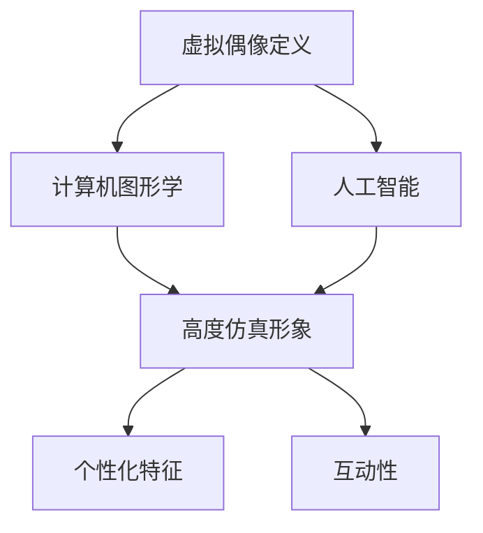

                 

### 文章标题

《虚拟偶像创业：数字化明星的商业价值》

> 关键词：虚拟偶像、数字化明星、商业价值、创业、技术基础、营销策略

> 摘要：本文将深入探讨虚拟偶像与数字化明星的兴起背景、技术基础、营销策略、创业实战以及未来趋势，分析其商业价值，旨在为创业者提供有价值的参考和指导。

### 第一部分：虚拟偶像与数字化明星的基础

#### 1.1 虚拟偶像的定义与兴起

虚拟偶像是指通过计算机图形学、人工智能等先进技术创建的，具有高度仿真形象和个性的数字化角色。它们通常以动漫、游戏、音乐、娱乐等形式出现在公众视野中，凭借逼真的形象和生动的互动能力，迅速吸引了大量粉丝。

虚拟偶像的兴起可以追溯到20世纪90年代，随着计算机图形学和互联网技术的快速发展，人们开始尝试将虚拟角色应用于娱乐和营销领域。2000年以后，3D建模、动画制作等技术的进步，使得虚拟偶像的制作变得更加简单和高效。同时，社交媒体的普及也为虚拟偶像的传播提供了广阔的平台。

#### 1.2 数字化明星的崛起与影响

数字化明星，即通过数字技术打造的虚拟人物，他们通常在年轻人中拥有极高的人气。与传统的明星不同，数字化明星不仅拥有独特的外貌和性格，还能够与粉丝进行实时互动。这种新型的人际关系，使得数字化明星在娱乐产业、市场营销等多个领域产生了深远影响。

数字化明星的崛起，一方面得益于技术的进步，另一方面也得益于年轻一代的审美观念和娱乐消费习惯。随着虚拟现实、增强现实等技术的发展，数字化明星的应用场景将更加广泛，其影响力也将进一步扩大。

#### 1.3 虚拟偶像与数字化明星的核心特点

虚拟偶像与数字化明星具有以下核心特点：

1. **高度仿真形象**：虚拟偶像和数字化明星通过计算机图形学技术，拥有高度仿真的外貌和动作，能够提供更加真实的娱乐体验。
2. **个性化特征**：虚拟偶像和数字化明星具有独特的个性和风格，能够满足不同用户的需求。
3. **互动性**：虚拟偶像和数字化明星能够与用户进行互动，增强用户参与感。

### Mermaid 流程图



### 第2章：虚拟偶像的技术基础

#### 2.1 计算机图形学原理

计算机图形学是研究如何使用计算机生成和处理图形的学科，它是虚拟偶像技术的基础。计算机图形学主要包括以下几个方面的内容：

1. **图形基础**：包括点、线、面、体等基本几何元素的定义和运算。
2. **渲染技术**：包括光栅渲染、矢量渲染、真实感渲染等，用于生成逼真的图像。
3. **动画技术**：包括关键帧动画、运动捕捉、仿真动画等，用于制作虚拟偶像的动作和表情。
4. **图形编程接口**：包括OpenGL、DirectX、Vulkan等，用于开发虚拟偶像的应用程序。

#### 2.2 人工智能与虚拟偶像

人工智能是模拟人类智能行为的计算机技术，它在虚拟偶像中的应用主要体现在以下几个方面：

1. **自然语言处理**：虚拟偶像需要能够理解用户的话语，并做出适当的回应。自然语言处理技术可以帮助虚拟偶像实现这一功能。
2. **动作捕捉**：通过动作捕捉技术，虚拟偶像可以模仿真实人物的动作和表情，使其更加逼真。
3. **情感识别**：虚拟偶像需要能够识别用户的情绪，并做出相应的反应。情感识别技术可以帮助虚拟偶像实现这一功能。
4. **机器学习**：通过机器学习技术，虚拟偶像可以不断学习和改进，提高其智能水平和用户体验。

#### 2.3 虚拟偶像的制作流程

虚拟偶像的制作流程主要包括以下几个步骤：

1. **前期准备**：确定虚拟偶像的定位、形象和角色背景。
2. **建模与动画**：利用计算机图形学技术，创建虚拟偶像的3D模型，并进行动画制作。
3. **编程与互动**：利用人工智能技术，为虚拟偶像编写程序，实现与用户的互动。

### 伪代码

```python
# 虚拟偶像与用户的互动
def interact_with_user(virtual_idol, user_input):
    # 分析用户输入
    user_intent = analyze_user_input(user_input)
    
    # 根据用户意图生成回复
    response = generate_response(virtual_idol, user_intent)
    
    # 输出回复
    print(response)
```

### 第3章：数字化明星的营销策略

#### 3.1 社交媒体与数字化明星的互动

社交媒体是数字化明星与粉丝互动的重要平台。通过社交媒体，数字化明星可以发布动态、参与话题讨论、回复粉丝留言等，从而拉近与粉丝的距离，提高粉丝粘性。

1. **微博**：微博是中国最受欢迎的社交媒体平台之一，数字化明星可以通过微博发布内容，与粉丝互动。
2. **抖音**：抖音是一个以短视频为主的社交媒体平台，数字化明星可以通过抖音发布短视频，展示自己的才艺。
3. **Instagram**：Instagram是一个国际知名的社交媒体平台，许多数字化明星都选择在这里与粉丝互动。

#### 3.2 品牌合作与虚拟偶像的营销

品牌合作是数字化明星实现商业价值的重要途径。通过品牌合作，数字化明星可以代言品牌产品、参与品牌活动等，从而获得经济收益。

1. **代言**：数字化明星可以成为品牌的代言人，代言品牌的产品或服务。
2. **活动**：数字化明星可以参与品牌的活动，如发布会、展览等，为品牌宣传造势。
3. **营销活动**：数字化明星可以发起或参与各种营销活动，如抽奖、限时优惠等，吸引粉丝参与。

#### 3.3 数字化明星的商业价值分析

数字化明星的商业价值主要体现在以下几个方面：

1. **广告收入**：数字化明星可以通过社交媒体、视频平台等渠道，发布广告获得收入。
2. **代言收入**：数字化明星代言品牌产品，可以获得代言费。
3. **活动收入**：数字化明星参与品牌活动，可以获得活动费。
4. **粉丝经济**：数字化明星的粉丝愿意为其购买周边产品、参与线下活动等，从而带来经济收益。

### 数学模型和数学公式

$$
商业价值 = f(广告收入, 代言收入, 活动收入, 粉丝经济)
$$

### 第4章：虚拟偶像创业项目规划

#### 4.1 虚拟偶像创业的可行性研究

虚拟偶像创业的可行性研究是创业项目的第一步，它主要包括以下内容：

1. **市场研究**：分析虚拟偶像市场的现状和未来发展趋势，了解市场需求和竞争情况。
2. **技术评估**：评估虚拟偶像项目所需的技术能力和资源，如计算机图形学、人工智能等。
3. **团队评估**：评估虚拟偶像创业团队的组成和能力，确保团队能够顺利完成项目。

#### 4.2 虚拟偶像创业团队组建

虚拟偶像创业团队的组建是项目成功的关键，它需要具备以下能力和角色：

1. **创意策划**：负责虚拟偶像的定位、形象设计、故事情节等。
2. **技术实现**：负责虚拟偶像的建模、动画、互动等功能开发。
3. **市场营销**：负责虚拟偶像的市场推广、品牌合作等。
4. **运营管理**：负责虚拟偶像的日常运营、用户互动等。

#### 4.3 虚拟偶像创业项目融资策略

虚拟偶像创业项目的融资策略是确保项目顺利进行的重要保障，它主要包括以下内容：

1. **融资渠道**：选择合适的融资渠道，如天使投资、风险投资、众筹等。
2. **融资额度**：确定项目的融资额度，确保项目有足够的资金支持。
3. **融资时间**：制定项目的融资时间表，确保在项目关键阶段能够获得资金支持。

### 第5章：虚拟偶像创业项目开发

#### 5.1 虚拟偶像形象设计

虚拟偶像的形象设计是项目开发的第一步，它需要考虑以下几个方面：

1. **形象定位**：根据虚拟偶像的定位和目标受众，确定形象的设计风格和特点。
2. **外观设计**：利用计算机图形学技术，设计虚拟偶像的外观，包括发型、服饰、表情等。
3. **角色背景**：为虚拟偶像设计一个丰富的角色背景，增加其故事性和吸引力。

#### 5.2 虚拟偶像内容创作

虚拟偶像的内容创作是项目开发的核心，它需要考虑以下几个方面：

1. **故事情节**：为虚拟偶像编写一个有趣的故事情节，增加其故事性和吸引力。
2. **互动场景**：设计虚拟偶像与用户互动的场景，提高用户的参与感。
3. **活动策划**：策划虚拟偶像的线上和线下活动，增加用户互动的机会。

#### 5.3 虚拟偶像运营策略

虚拟偶像的运营策略是项目成功的关键，它需要考虑以下几个方面：

1. **社交媒体运营**：通过社交媒体平台，发布虚拟偶像的内容，与粉丝互动。
2. **品牌合作运营**：与品牌合作，进行虚拟偶像的代言和营销活动。
3. **用户互动**：通过线上和线下活动，与用户互动，提高用户粘性。

### 第6章：虚拟偶像创业风险与管理

#### 6.1 虚拟偶像创业中的法律问题

虚拟偶像创业中的法律问题主要包括以下几个方面：

1. **版权问题**：确保虚拟偶像的原创作品享有版权，防止侵权行为。
2. **合同问题**：确保与合作伙伴签订的合同符合法律法规，保障双方的权益。
3. **隐私保护**：确保用户的个人信息得到保护，防止隐私泄露。

#### 6.2 虚拟偶像创业中的知识产权保护

虚拟偶像创业中的知识产权保护主要包括以下几个方面：

1. **版权登记**：对虚拟偶像的原创作品进行版权登记，保护其知识产权。
2. **侵权举报**：发现侵权行为，及时进行举报和维权。
3. **知识产权维权**：对知识产权受到侵害的情况，采取法律手段进行维权。

#### 6.3 虚拟偶像创业中的风险管理

虚拟偶像创业中的风险管理主要包括以下几个方面：

1. **风险评估**：对虚拟偶像创业项目进行风险评估，识别潜在的风险因素。
2. **风险控制**：采取有效的措施，降低风险发生的概率和影响。
3. **风险管理**：建立完善的风险管理体系，确保项目顺利实施。

### 第7章：虚拟偶像创业成功案例分析

#### 7.1 案例一：某虚拟偶像的商业运营模式

**案例概述**：某虚拟偶像通过短视频平台走红，吸引了大量粉丝。随后，该虚拟偶像与多个品牌合作，进行了代言和营销活动，实现了商业价值。

**案例分析**：该虚拟偶像的成功原因主要有以下几点：

1. **形象设计**：虚拟偶像的形象设计符合年轻人的审美，具有高度仿真性和独特性。
2. **内容创作**：虚拟偶像的内容创作丰富多样，能够吸引不同类型的粉丝。
3. **品牌合作**：与品牌的合作形式多样，能够提高虚拟偶像的商业价值。

#### 7.2 案例二：某数字化明星的品牌建设策略

**案例概述**：某数字化明星通过社交媒体平台与粉丝互动，提高了人气。随后，该数字化明星与多个品牌合作，进行了代言和营销活动，建立了品牌形象。

**案例分析**：该数字化明星的品牌建设策略成功之处主要有以下几点：

1. **社交媒体运营**：通过社交媒体平台，与粉丝建立了紧密的联系，提高了人气。
2. **品牌合作**：与品牌的合作形式多样，能够提高数字化明星的商业价值。
3. **内容创新**：数字化明星的内容创新，能够吸引不同类型的粉丝，提高品牌影响力。

#### 7.3 案例三：虚拟偶像创业项目的可持续发展策略

**案例概述**：某虚拟偶像创业项目通过持续的内容创作和品牌合作，实现了可持续发展。

**案例分析**：该虚拟偶像创业项目的可持续发展策略主要有以下几点：

1. **内容创新**：持续进行内容创新，保持虚拟偶像的活力和吸引力。
2. **品牌合作**：与品牌的合作形式多样，提高虚拟偶像的商业价值。
3. **用户互动**：通过用户互动，提高用户粘性，增强用户忠诚度。

### 第8章：未来趋势与挑战

#### 8.1 虚拟偶像与数字化明星的未来发展趋势

未来，虚拟偶像与数字化明星将呈现以下发展趋势：

1. **技术进步**：随着人工智能、虚拟现实、增强现实等技术的发展，虚拟偶像和数字化明星将拥有更逼真的形象和更智能的互动能力。
2. **市场扩大**：随着数字化娱乐的普及，虚拟偶像和数字化明星的市场将进一步扩大。
3. **应用场景增多**：虚拟偶像和数字化明星将在更多领域得到应用，如教育、医疗、金融等。

#### 8.2 虚拟偶像创业的挑战与应对策略

虚拟偶像创业将面临以下挑战：

1. **技术挑战**：虚拟偶像的制作需要较高的技术门槛，创业者需要具备相应的技术能力。
2. **市场挑战**：虚拟偶像市场竞争激烈，创业者需要找准市场定位，才能脱颖而出。
3. **法律挑战**：虚拟偶像创业涉及知识产权保护、隐私保护等问题，创业者需要遵守相关法律法规。

针对以上挑战，创业者可以采取以下应对策略：

1. **技术积累**：不断学习和积累技术，提高自身的技术能力。
2. **市场调研**：深入了解市场需求，找准市场定位。
3. **合法经营**：遵守相关法律法规，确保企业的合法合规经营。

#### 8.3 虚拟偶像与数字化明星的社会影响与伦理问题

虚拟偶像与数字化明星在社会和伦理方面产生了以下影响：

1. **社会影响**：虚拟偶像和数字化明星改变了人们的娱乐消费习惯，也对传统娱乐产业产生了冲击。
2. **伦理问题**：虚拟偶像和数字化明星的兴起，引发了对隐私保护、人权、道德伦理等问题的讨论。

### 附录

#### 附录A：虚拟偶像创业资源汇总

- **开发工具与资源推荐**：Unity、Blender、Maya、Adobe Photoshop等。
- **虚拟偶像相关书籍与论文**：《虚拟偶像：数字时代的娱乐革命》、《虚拟偶像的技术与艺术》、《虚拟偶像的商业价值》等。
- **虚拟偶像创业相关网站与平台**：虚拟偶像产业联盟、虚拟偶像创作社区、虚拟偶像创业孵化器等。

### 作者

作者：AI天才研究院/AI Genius Institute & 禅与计算机程序设计艺术 /Zen And The Art of Computer Programming

### 总结

虚拟偶像与数字化明星作为一种新兴的娱乐形式，正在迅速崛起，并展现出巨大的商业价值。本文从定义、技术基础、营销策略、创业实战和未来趋势等方面，对虚拟偶像与数字化明星进行了深入探讨。通过分析虚拟偶像创业的成功案例，为创业者提供了有价值的参考。面对未来的挑战，创业者需要不断提升技术能力，精准定位市场，确保企业的可持续发展。同时，我们也需要关注虚拟偶像与数字化明星对社会和伦理方面的影响，积极应对相关问题。让我们共同期待虚拟偶像与数字化明星的未来，期待它们在娱乐产业中发挥更大的作用。

