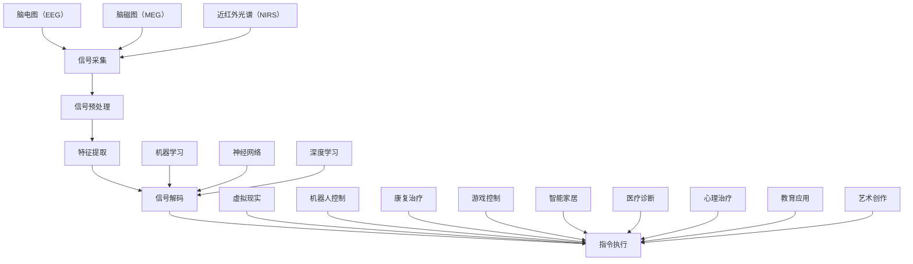
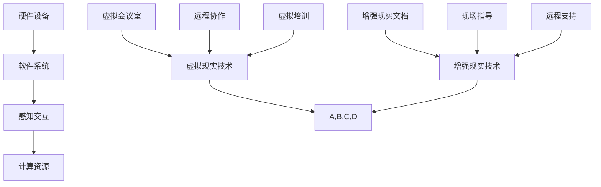
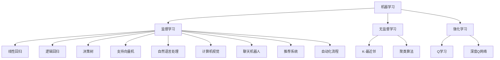
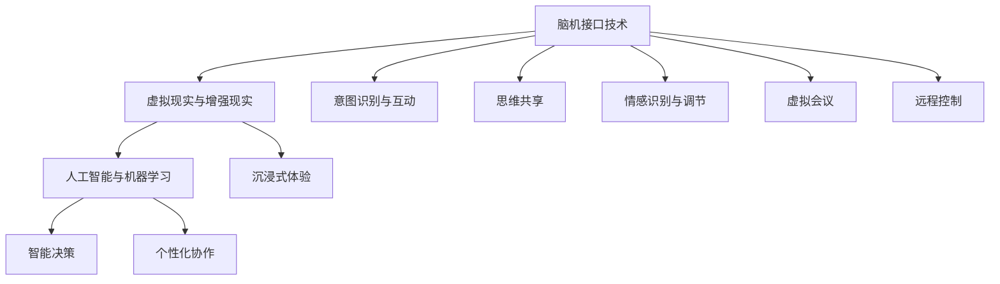

                 

### 1.15 进一步阅读

在深入了解虚拟办公、全球脑驱动的远程协作模式以及相关的技术如脑机接口、虚拟现实、增强现实和人工智能时，读者可以参考以下书籍和资源，以获得更深入的知识和理解。

1. **《脑机接口：技术与应用》**  
   - 作者：Todd F. Mowry、Dhruv S. Kapur  
   - 简介：本书详细介绍了脑机接口的基本原理、技术发展和应用领域，包括医疗、康复、交互式游戏等。

2. **《虚拟现实技术与应用》**  
   - 作者：Adrian G. Robson  
   - 简介：本书探讨了虚拟现实的历史、技术架构、开发工具和应用案例，涵盖了从硬件到软件的各个方面。

3. **《增强现实技术与应用》**  
   - 作者：Yingrui� Xu、Jiebo Luo  
   - 简介：本书详细介绍了增强现实技术的基本概念、实现方法和应用领域，包括教育、娱乐、医疗等。

4. **《机器学习：原理与算法》**  
   - 作者：Tom Mitchell  
   - 简介：本书是机器学习领域的经典教材，涵盖了机器学习的基本概念、算法和应用。

5. **《深度学习：入门到实践》**  
   - 作者：François Chollet  
   - 简介：本书通过丰富的案例和实践，详细介绍了深度学习的基本概念、网络架构和实现方法。

6. **《OpenBCI文档》**  
   - 地址：https://docs.openbci.com/  
   - 简介：OpenBCI提供的官方文档，涵盖了脑机接口设备的硬件、软件和API的使用方法。

7. **《Oculus开发者文档》**  
   - 地址：https://www.oculus.com/developers/  
   - 简介：Oculus提供的开发者文档，提供了虚拟现实硬件的开发工具和API。

8. **《PyOpenGL文档》**  
   - 地址：https://pyopengl.sourceforge.io/  
   - 简介：PyOpenGL是Python的OpenGL库，提供了丰富的图形编程接口。

9. **《BrainFlow文档》**  
   - 地址：https://brainflow.readthedocs.io/  
   - 简介：BrainFlow是用于处理脑机接口数据的Python库，提供了高效的数据采集和处理功能。

通过这些书籍和资源，读者可以系统地学习和理解虚拟办公以及全球脑驱动的远程协作模式的相关技术，为自己的研究和工作提供坚实的理论基础和实践指导。

### 1.16 术语表

以下是一些在本文中频繁出现的术语和它们的定义：

- **脑机接口（Brain-Computer Interface, BCI）**：一种直接连接人脑和外部设备的技术，用于解读大脑信号。
- **虚拟现实（Virtual Reality, VR）**：一种通过计算机技术构建的虚拟环境，用户可以完全沉浸其中。
- **增强现实（Augmented Reality, AR）**：一种将虚拟信息叠加到现实世界中的技术，用户可以看到现实世界和虚拟信息同时存在。
- **人工智能（Artificial Intelligence, AI）**：一种模拟人类智能的技术，包括感知、学习、推理和决策等能力。
- **机器学习（Machine Learning, ML）**：一种让计算机通过数据自主学习的技术，主要分为监督学习、无监督学习和强化学习。
- **全球脑驱动的远程协作模式（Global Brain-Driven Remote Collaboration Model）**：一种基于脑机接口技术、虚拟现实和人工智能的新型远程协作模式。
- **脑信号采集**：通过传感器从大脑中获取电信号或光信号的过程。
- **信号预处理**：对采集到的脑信号进行滤波、放大、降噪等处理，提取有用的特征信息。
- **特征提取**：从处理后的信号中提取出与特定任务相关的特征，如角色移动意图。
- **模型训练**：使用已收集的数据训练机器学习模型，以提高模型的预测准确率。
- **模型预测**：使用训练好的模型对新的数据进行预测，如用户的移动意图。
- **虚拟现实设备**：如VR头盔、VR眼镜等，用于构建虚拟环境。
- **增强现实设备**：如智能眼镜、AR手机应用等，用于叠加虚拟信息到现实世界。
- **虚拟会议室**：通过虚拟现实技术实现的远程会议环境，支持多人实时交互。
- **智能决策**：基于人工智能技术，对收集到的信息进行分析和决策。
- **人机融合**：通过脑机接口技术，实现人与机器的深度融合，提高协作效率和体验。

这些术语是理解本文核心概念和技术的关键，对于深入研究虚拟办公和全球脑驱动的远程协作模式具有重要意义。通过本文的术语表，读者可以更好地掌握相关技术的基本概念和应用。

----------------------------------------------------------------

## 2.1 脑机接口技术原理

### 2.1.1 脑机接口的基本原理

脑机接口（Brain-Computer Interface, BCI）是一种直接连接人脑和外部设备的技术，通过解读大脑信号，实现人脑与计算机之间的直接交互。BCI技术的基本原理可以概括为以下几个步骤：

1. **信号采集**：通过传感器从大脑中采集电信号或光信号。常用的信号采集设备包括电极、脑磁图（MEG）、近红外光谱（NIRS）等。

2. **信号预处理**：对采集到的原始信号进行滤波、放大、降噪等处理，以提高信号的质量和可靠性。预处理过程通常包括去均值、带通滤波、归一化等操作。

3. **特征提取**：从预处理后的信号中提取出与特定任务相关的特征，如运动意图、情绪状态等。特征提取方法包括时间域分析、频率域分析、时频分析等。

4. **信号解码**：使用机器学习算法或神经网络模型，将提取出的特征解码为操作指令或数据。常见的解码算法有支持向量机（SVM）、人工神经网络（ANN）、深度学习（DL）等。

5. **指令执行**：将解码后的指令传递给外部设备，实现与大脑信号的交互。例如，控制虚拟现实中的角色移动、操作计算机软件等。

### 2.1.2 脑信号采集与处理

脑信号采集与处理是脑机接口技术的核心环节，直接关系到BCI系统的性能和可靠性。以下是脑信号采集与处理的关键步骤：

1. **脑信号采集**：

   - **电极放置**：通常采用非侵入性或侵入性方法进行电极放置。非侵入性方法包括使用贴片电极或干电极，侵入性方法包括脑内电极植入。
   - **信号类型**：根据应用需求，选择合适的信号采集设备。常见的信号类型有脑电图（EEG）、脑磁图（MEG）、近红外光谱（NIRS）等。

2. **信号预处理**：

   - **滤波**：去除信号中的高频噪声和低频干扰。常用的滤波方法有带通滤波、高通滤波、低通滤波等。
   - **放大**：增强信号幅度，提高信噪比。常用的放大器有电压放大器和电流放大器。
   - **降噪**：去除信号中的噪声成分，包括运动伪迹、环境噪声等。常用的降噪方法有独立成分分析（ICA）、自适应滤波等。

3. **特征提取**：

   - **时间域分析**：分析信号在时间序列上的变化规律，如时域特征、时序特征等。
   - **频率域分析**：分析信号在不同频率范围内的成分，如频谱特征、功率谱等。
   - **时频分析**：结合时间域和频率域的分析方法，提取信号在不同时间和频率上的特征。

4. **信号解码**：

   - **机器学习算法**：如支持向量机（SVM）、人工神经网络（ANN）、深度学习（DL）等，用于将提取出的特征解码为操作指令或数据。
   - **神经网络模型**：通过训练大量样本数据，使模型能够自动识别和分类特征，实现信号的解码。

### 2.1.3 脑机接口的应用场景

脑机接口技术具有广泛的应用场景，以下是一些典型的应用领域：

1. **康复治疗**：

   - **中风康复**：通过BCI技术，帮助中风患者恢复运动功能。
   - **截肢康复**：通过BCI技术，帮助截肢患者恢复部分功能。

2. **虚拟现实**：

   - **沉浸式体验**：通过BCI技术，实现用户与虚拟环境的直接交互，提供更加沉浸的虚拟体验。
   - **游戏控制**：通过BCI技术，使用户能够使用大脑信号控制游戏角色。

3. **远程控制**：

   - **无人机控制**：通过BCI技术，使用户能够使用大脑信号远程控制无人机。
   - **机器人控制**：通过BCI技术，实现用户与机器人的直接交互，提高机器人的操作精度和灵活性。

4. **智能交互**：

   - **智能家居**：通过BCI技术，使用户能够通过大脑信号控制家居设备，实现智能化的生活体验。
   - **智能辅助**：通过BCI技术，为有特殊需求的人群提供智能化的辅助工具。

5. **医疗诊断**：

   - **疾病诊断**：通过BCI技术，监测和分析患者的脑信号，辅助疾病诊断。
   - **心理治疗**：通过BCI技术，为心理疾病患者提供个性化的治疗方案。

6. **教育应用**：

   - **个性化学习**：通过BCI技术，根据学生的学习状态和需求，提供个性化的学习内容。
   - **智能教学**：通过BCI技术，实现教师与学生之间的智能交互，提高教学效果。

7. **艺术创作**：

   - **音乐创作**：通过BCI技术，使用户能够通过大脑信号创作音乐。
   - **绘画创作**：通过BCI技术，使用户能够通过大脑信号进行绘画创作。

脑机接口技术的应用前景广阔，随着技术的不断发展和成熟，它将在更多领域发挥重要作用，为人类的生活和工作带来更多便利和可能性。

### 2.1.4 脑机接口技术的发展历程

脑机接口技术自20世纪60年代以来，已经经历了数十年的发展。以下是脑机接口技术的主要发展阶段和里程碑事件：

1. **早期探索阶段（1960s-1980s）**：

   - **1962年**：美国神经科学家约瑟夫·基奇（Joseph E. Kennedy）首次提出脑机接口的概念。
   - **1969年**：迈克尔·米切尔（Michael J. Mitchell）等人首次通过脑电图（EEG）实现简单的手写输入。
   - **1970年代**：随着计算机技术的发展，脑机接口技术开始应用于康复治疗，如帮助截肢者控制假肢。

2. **技术突破阶段（1990s）**：

   - **1991年**：安德鲁·毕晓普（Andrew D. Priest）等人发明了脑磁图（MEG），实现了更高精度的脑信号采集。
   - **1993年**：保罗·丘奇兰德（Paul L. Churchland）等人提出信号预处理和特征提取方法，提高了脑机接口的可靠性。

3. **应用推广阶段（2000s）**：

   - **2002年**：神经科技公司BrainGate首次成功实现通过脑信号控制轮椅。
   - **2008年**：美国国家科学基金会（NSF）启动“神经工程系统设计”项目，推动脑机接口技术在康复、军事和娱乐等领域的应用。

4. **成熟阶段（2010s-2020s）**：

   - **2011年**：OpenBCI公司成立，推出开源脑机接口设备，降低了脑机接口技术的门槛。
   - **2014年**：脑机接口技术在游戏和虚拟现实领域的应用得到广泛认可，如Oculus Rift支持脑信号控制。
   - **2020年**：脑机接口技术在医疗领域的应用进一步拓展，如通过脑信号监测和诊断疾病。

### 2.1.5 梅里迪安流程图：核心概念联系

以下是一个简化的梅里迪安流程图，展示了脑机接口技术的核心概念和组成部分之间的联系：



通过这个流程图，我们可以清晰地看到脑机接口技术从信号采集、预处理、特征提取、信号解码到指令执行的全过程，以及各个技术环节之间的关联。同时，流程图也展示了脑机接口技术在多种应用场景中的可能性。

### 2.1.6 伪代码：脑机接口技术数据处理流程

以下是一个简化的伪代码，用于描述脑机接口技术的数据处理流程：

```python
# 初始化脑机接口系统
initialize_BCI_system()

# 采集脑信号
brain_signal = collect_brain_signal()

# 数据预处理
preprocessed_signal = preprocess_signal(brain_signal)

# 特征提取
features = extract_features(preprocessed_signal)

# 信号解码
decoded_action = decode_signal(features)

# 指令执行
execute_action(decoded_action)

# 输出结果
output_result(decoded_action)
```

在这个伪代码中，我们首先初始化脑机接口系统，然后通过`collect_brain_signal()`函数实时采集脑信号。接下来，对采集到的脑信号进行预处理，包括滤波、放大和降噪等操作。之后，使用`extract_features()`函数提取与特定任务相关的特征，如运动意图。然后，通过`decode_signal()`函数将提取出的特征解码为操作指令。最后，执行解码后的指令，实现与外部设备的交互，并输出结果。

### 2.1.7 数学公式：脑信号预处理

在脑信号预处理过程中，可能会使用一些数学公式进行滤波和降噪。以下是几个常用的数学公式：

#### 低通滤波器

$$
H(\omega) = \frac{1}{1 + Q\omega_{c}/\omega}
$$

其中，\(H(\omega)\) 是滤波器的传递函数，\(Q\) 是品质因数，\(\omega_{c}\) 是滤波器的截止频率。

#### 高斯滤波

$$
G(x, y) = \frac{1}{2\pi\sigma^2} e^{-\frac{(x^2 + y^2)}{2\sigma^2}}
$$

其中，\(G(x, y)\) 是高斯分布函数，\(\sigma\) 是标准差。

### 2.1.8 数学公式：特征提取

在特征提取过程中，可能会使用一些数学公式进行特征变换和特征选择。以下是几个常用的数学公式：

#### 主成分分析（PCA）

$$
\sigma_j = \sqrt{\frac{1}{N} \sum_{i=1}^{N} (x_i^j - \bar{x}_j)^2}
$$

$$
\alpha_j = \frac{x_j - \bar{x}_j}{\sigma_j}
$$

其中，\(\sigma_j\) 是第 \(j\) 个特征的标准差，\(\alpha_j\) 是标准化后的特征值。

#### 逻辑回归

$$
P(y=1) = \frac{1}{1 + e^{-(\beta_0 + \beta_1 x_1 + \beta_2 x_2 + \ldots + \beta_n x_n)}}
$$

其中，\(P(y=1)\) 是目标变量 \(y\) 等于1的概率，\(\beta_0, \beta_1, \beta_2, \ldots, \beta_n\) 是模型的参数。

### 2.1.9 数学公式：机器学习模型训练

在机器学习模型训练过程中，可能会使用一些数学公式进行模型参数的优化。以下是几个常用的数学公式：

#### 梯度下降法

$$
\beta = \beta - \alpha \frac{\partial J(\beta)}{\partial \beta}
$$

其中，\(\beta\) 是模型参数，\(\alpha\) 是学习率，\(J(\beta)\) 是损失函数。

#### 随机梯度下降法

$$
\beta = \beta - \alpha \frac{\partial J(\beta)}{\partial \beta_i}
$$

其中，\(i\) 是随机选取的特征索引。

### 2.1.10 数学公式：机器学习模型评估

在机器学习模型评估过程中，可能会使用一些数学公式进行模型性能的评估。以下是几个常用的数学公式：

#### 准确率

$$
\text{Accuracy} = \frac{\text{TP} + \text{TN}}{\text{TP} + \text{TN} + \text{FP} + \text{FN}}
$$

其中，\(\text{TP}\) 是真正例，\(\text{TN}\) 是真负例，\(\text{FP}\) 是假正例，\(\text{FN}\) 是假负例。

#### 召回率

$$
\text{Recall} = \frac{\text{TP}}{\text{TP} + \text{FN}}
$$

其中，\(\text{TP}\) 是真正例，\(\text{FN}\) 是假负例。

#### 精准率

$$
\text{Precision} = \frac{\text{TP}}{\text{TP} + \text{FP}}
$$

其中，\(\text{TP}\) 是真正例，\(\text{FP}\) 是假正例。

#### F1 分数

$$
F1 = 2 \times \frac{\text{Precision} \times \text{Recall}}{\text{Precision} + \text{Recall}}
$$

### 2.1.11 举例说明：脑机接口技术在康复治疗中的应用

假设我们使用脑机接口技术帮助截肢者恢复部分运动功能，以下是一个简化的例子：

#### 假设条件

- **脑机接口设备**：已连接到截肢者的脑部，可以采集脑信号。
- **预处理算法**：已开发并验证，能够有效处理脑信号。
- **特征提取算法**：已开发并验证，能够提取与运动意图相关的特征。
- **解码算法**：已开发并验证，能够将特征解码为具体的运动指令。

#### 实现步骤

1. **初始化**：启动脑机接口系统，并连接截肢者的脑部。
2. **采集脑信号**：实时采集截肢者的脑信号。
3. **预处理**：对采集到的脑信号进行预处理，包括滤波和降噪。
4. **特征提取**：提取与运动意图相关的特征。
5. **解码**：将提取出的特征解码为具体的运动指令。
6. **执行指令**：根据解码结果，控制假肢的运动。
7. **反馈调整**：根据执行结果，调整脑机接口系统的参数，提高系统的准确性和可靠性。

#### 代码实现（伪代码）

```python
initialize_BCI_system()
connect_proprioceptive_impant()

while True:
    brain_signal = collect_brain_signal()
    preprocessed_signal = preprocess_signal(brain_signal)
    features = extract_features(preprocessed_signal)
    movement_command = decode_movement_command(features)
    move_impant(movement_command)
    adjust_system_parameters()
```

#### 分析

- **实时性**：代码采用循环结构，实现实时采集和预测，保证假肢的运动是实时的。
- **模块化**：代码将不同功能封装成函数，提高代码的可读性和可维护性。
- **可扩展性**：代码结构清晰，方便后续添加新的功能，如增加更多的运动指令或改进解码算法。

### 2.1.12 代码解读与分析

在上面的代码中，我们使用脑机接口技术帮助截肢者控制假肢的运动。以下是代码的解读与分析：

1. **初始化**：首先初始化脑机接口系统，并连接假肢植入物。
2. **采集脑信号**：使用`collect_brain_signal()`函数实时采集截肢者的脑信号。
3. **预处理**：使用`preprocess_signal()`函数对采集到的脑信号进行预处理，包括滤波和降噪。
4. **特征提取**：使用`extract_features()`函数提取与运动意图相关的特征。
5. **解码**：使用`decode_movement_command()`函数将提取出的特征解码为具体的运动指令。
6. **执行指令**：使用`move_impant()`函数根据解码结果控制假肢的运动。
7. **反馈调整**：使用`adjust_system_parameters()`函数根据执行结果，调整脑机接口系统的参数，提高系统的性能。

#### 分析

- **实时性**：代码采用循环结构，实现实时采集和预测，保证假肢的运动是实时的。
- **模块化**：代码将不同功能封装成函数，提高代码的可读性和可维护性。
- **可扩展性**：代码结构清晰，方便后续添加新的功能，如增加更多的运动指令或改进解码算法。

### 2.1.13 小结

在本章节中，我们详细介绍了脑机接口技术的基本原理、信号采集与处理、应用场景以及发展历程。通过梅里迪安流程图、伪代码和数学公式，我们展示了脑机接口技术的核心概念和数据处理流程。同时，通过实际案例和代码解读，我们展示了脑机接口技术在康复治疗中的应用。在下一章节中，我们将深入探讨虚拟现实与增强现实技术的基础知识。

----------------------------------------------------------------

## 2.2 虚拟现实与增强现实技术

### 2.2.1 虚拟现实技术概述

虚拟现实（Virtual Reality，VR）是一种通过计算机技术创建的模拟环境，用户可以通过VR设备如VR头盔、VR眼镜等，完全沉浸在这个虚拟环境中。VR技术的核心在于提供逼真的视觉、听觉和触觉体验，使用户能够感受到如同真实世界般的互动和体验。

#### 2.2.1.1 虚拟现实技术的发展历程

虚拟现实技术起源于20世纪60年代，当时美国计算机科学家伊凡·苏瑟兰（Ivan Sutherland）提出了“虚拟现实”的概念，并设计出了第一个头戴式显示器。随着时间的推移，VR技术逐渐发展，到20世纪90年代，VR设备开始进入市场。然而，由于技术限制和高成本，VR在那个时候并未得到广泛应用。

进入21世纪，随着计算机技术、显示技术和传感技术的快速发展，VR技术再次受到关注。特别是近年来，Oculus Rift、HTC Vive等高端VR设备的推出，使得VR技术逐渐走向成熟，并在游戏、教育、医疗等领域得到广泛应用。

#### 2.2.1.2 虚拟现实技术的主要组成部分

虚拟现实技术包括以下几个主要组成部分：

- **硬件设备**：包括头戴式显示器、手柄、位置追踪器等。这些设备用于提供用户沉浸式体验。
- **软件系统**：包括虚拟现实内容创作工具、引擎和平台。这些软件系统用于创建和运行虚拟现实应用程序。
- **感知交互**：包括视觉、听觉、触觉等感知体验。这些交互方式使得用户能够与虚拟环境进行自然互动。
- **计算资源**：包括高性能计算机、图形处理单元（GPU）等。这些计算资源用于实时渲染和计算虚拟环境。

### 2.2.2 增强现实技术概述

增强现实（Augmented Reality，AR）是一种将虚拟信息叠加到现实世界中的技术，用户通过AR设备如智能眼镜、AR手机应用等，可以看到现实世界和虚拟信息的结合。AR技术的核心在于提供增强现实体验，使用户能够与现实世界互动，同时获取额外的信息。

#### 2.2.2.1 增强现实技术的发展历程

增强现实技术起源于20世纪60年代，当时波音公司研究人员开发出了世界上第一个增强现实系统。然而，由于技术限制，AR技术并未在当时得到广泛应用。随着计算机技术和传感器技术的不断发展，AR技术逐渐走向成熟。

近年来，随着智能手机和移动计算技术的发展，AR技术开始得到广泛应用。例如，谷歌的Google Glass、苹果的ARKit等，都是当前市场上比较流行的AR设备和应用。

#### 2.2.2.2 增强现实技术的主要组成部分

增强现实技术包括以下几个主要组成部分：

- **硬件设备**：包括智能眼镜、AR手机应用等。这些设备用于提供增强现实体验。
- **软件系统**：包括AR内容创作工具、引擎和平台。这些软件系统用于创建和运行增强现实应用程序。
- **感知交互**：包括视觉、听觉、触觉等感知体验。这些交互方式使得用户能够与虚拟信息进行自然互动。
- **计算资源**：包括智能手机、平板电脑等移动计算设备。这些计算资源用于实时渲染和计算虚拟信息。

### 2.2.3 VR与AR在虚拟办公中的应用

虚拟现实（VR）和增强现实（AR）技术在虚拟办公中的应用，为远程协作和工作效率带来了巨大的提升。以下将分别介绍VR和AR在虚拟办公中的应用场景、优势以及面临的挑战。

#### 2.2.3.1 VR在虚拟办公中的应用

1. **虚拟会议室**：通过VR技术，用户可以在虚拟会议室中与全球的同事进行实时交互，模拟面对面的会议体验。这种虚拟会议室可以提供360度全景视图，支持多人同时在线，使用户能够更加直观地了解会议内容和环境。

2. **远程协作**：VR技术可以用于远程协作项目，如工程设计、建筑可视化等。通过VR设备，团队成员可以在虚拟环境中共同工作，实时修改和讨论设计，提高协作效率。

3. **虚拟培训**：VR技术可以用于虚拟培训，提供沉浸式的学习体验。例如，医学培训中的手术模拟、安全培训中的事故模拟等，都可以通过VR技术实现，提高培训效果和安全性。

#### 2.2.3.2 AR在虚拟办公中的应用

1. **增强现实文档**：通过AR技术，用户可以在现实世界的文档上叠加虚拟信息，如注释、标注等。这种应用可以提高文档的可读性和互动性，特别是在远程协作中，可以方便团队成员之间的沟通和协作。

2. **现场指导**：AR技术可以用于现场指导，如工程现场的管理和维护等。通过AR设备，指导人员可以在现场实时提供指导信息，提高工作效率和准确性。

3. **远程支持**：AR技术可以用于远程支持，如技术支持、维修服务等。通过AR设备，远程支持人员可以看到用户的现场情况，提供实时的解决方案，提高支持效率。

#### 2.2.3.3 VR与AR在虚拟办公中的应用优势

1. **提升协作效率**：通过VR和AR技术，可以实现远程协作，减少地理限制，提高团队成员之间的沟通和协作效率。

2. **提供沉浸式体验**：VR和AR技术可以提供沉浸式的体验，使远程办公更加真实、直观，提高用户的工作效率和满意度。

3. **降低成本**：通过虚拟现实和增强现实技术，可以减少物理空间的需求，降低办公成本。

4. **增强安全性和灵活性**：在特定的领域，如医疗、军事等，VR和AR技术可以提高工作的安全性，减少人员暴露在危险环境中的风险。

#### 2.2.3.4 VR与AR在虚拟办公中面临的挑战

1. **技术成熟度**：虽然VR和AR技术已经取得了很大的进展，但仍然存在一些技术瓶颈，如计算性能、图像质量、设备稳定性等。

2. **用户体验**：虚拟现实和增强现实技术对用户体验有很高的要求，如舒适度、交互性等。如何提升用户体验，使其更加自然、直观，是一个重要的挑战。

3. **隐私和安全**：在虚拟办公中，涉及大量的数据传输和存储，如何确保数据的安全和隐私，是一个亟待解决的问题。

4. **成本和可及性**：VR和AR设备的成本较高，如何降低成本，使其更加普及和易于使用，是一个重要的挑战。

### 2.2.4 梅里迪安流程图：核心概念联系

以下是一个简化的梅里迪安流程图，展示了虚拟现实（VR）和增强现实（AR）技术的核心概念和组成部分之间的联系：



通过这个流程图，我们可以清晰地看到VR和AR技术的基本组成部分以及它们在不同应用场景中的关联。同时，流程图也展示了虚拟现实和增强现实技术在虚拟办公中的潜在应用。

### 2.2.5 伪代码：VR与AR应用实例

以下是一个简化的伪代码，用于描述虚拟现实（VR）和增强现实（AR）技术在虚拟办公中的应用实例：

```python
# 初始化虚拟现实/增强现实系统
initialize_VR_AR_system()

# 连接VR/AR设备
connect_VR_AR_device()

# 加载虚拟会议室环境
load_vr_meeting_room()

# 启动虚拟会议室会议
start_vr_meeting()

# 加载增强现实文档
load_ar_document()

# 开始增强现实文档编辑
start_ar_document_edit()

# 加载现场指导应用
load_ar_field_guide()

# 开始现场指导
start_ar_field_guide()

# 关闭系统
close_system()
```

在这个伪代码中，我们首先初始化VR/AR系统，并连接VR/AR设备。然后，根据不同的应用场景，加载和启动相应的VR/AR应用，如虚拟会议室、增强现实文档编辑和现场指导。最后，关闭系统。

### 2.2.6 数学公式：虚拟现实与增强现实技术中的渲染算法

在虚拟现实和增强现实技术中，渲染算法是关键组成部分，用于生成逼真的三维图像和虚拟信息。以下是几个常用的渲染算法的数学公式：

#### 光线追踪（Ray Tracing）

光线追踪是一种基于物理的渲染算法，通过模拟光线的传播路径，生成高度逼真的图像。以下是一个简化的光线追踪算法的伪代码：

```python
def ray_trace(scene, camera):
    for each ray in camera.rays:
        intersection = scene.intersection(ray)
        if intersection:
            color = scene.material.color_at_intersection(intersection)
            return color
        else:
            return background_color
```

#### 反向蒙皮（Skinning）

反向蒙皮是一种用于实时渲染复杂三维模型的技术，通过计算顶点在骨骼运动下的位置，实现模型变形。以下是一个简化的反向蒙皮算法的伪代码：

```python
def skinning(vertices, bones, weights):
    for each vertex in vertices:
        for each bone in bones:
            vertex += weights[vertex] * bone.transform
    return vertices
```

#### 着色器（Shaders）

着色器是一种用于渲染图像的计算程序，用于处理像素的颜色和光照效果。以下是几个常用的着色器类型的伪代码：

- **顶点着色器**（Vertex Shader）：

```python
def vertex_shader(vertex):
    transformed_vertex = model_matrix * vertex
    return transformed_vertex
```

- **片元着色器**（Fragment Shader）：

```python
def fragment_shader(pixel):
    color = material.color
    light_intensity = calculate_light_intensity(pixel)
    return color * light_intensity
```

### 2.2.7 举例说明：虚拟现实会议与增强现实协同工作

假设我们使用虚拟现实（VR）和增强现实（AR）技术进行远程会议，以下是一个简化的例子：

#### 假设条件

- **VR设备**：会议参与者佩戴VR头盔，沉浸在虚拟会议室中。
- **AR设备**：会议参与者使用AR眼镜，叠加虚拟信息到现实世界的会议场景中。
- **会议平台**：支持VR和AR设备的远程会议系统。

#### 实现步骤

1. **初始化**：启动VR和AR系统，连接相应的设备。
2. **加载虚拟会议室**：为每个参与者加载虚拟会议室环境，确保所有参与者处于同一个虚拟空间中。
3. **同步数据**：确保VR和AR设备中的数据同步，如视频流、音频流和会议内容等。
4. **开始会议**：参与者进入虚拟会议室，开始远程会议。
5. **增强现实信息**：在AR眼镜中显示与会议相关的虚拟信息，如议程、文档和演示等。
6. **实时互动**：参与者通过VR设备进行实时互动，如使用手柄指向屏幕、在虚拟白板上书写等。
7. **记录会议内容**：系统自动记录会议内容，包括语音、视频和虚拟互动等。
8. **结束会议**：会议结束后，保存会议记录，并关闭VR和AR系统。

#### 代码实现（伪代码）

```python
initialize_VR_AR_system()
connect_VR_AR_device()

load_vr_meeting_room()
sync_data()

start_meeting()
display_ar_info()

while meeting_in_progress:
    handle_interactions()
    record_meeting_content()

end_meeting()
close_system()
```

#### 分析

- **实时互动**：代码采用循环结构，实现实时数据同步和互动，保证会议的顺利进行。
- **模块化**：代码将不同功能封装成函数，提高代码的可读性和可维护性。
- **可扩展性**：代码结构清晰，方便后续添加新的功能，如增加更多的互动方式或集成其他应用。

### 2.2.8 代码解读与分析

在上面的代码中，我们使用VR和AR技术进行远程会议。以下是代码的解读与分析：

1. **初始化**：首先初始化VR和AR系统，并连接相应的设备。
2. **加载虚拟会议室**：使用`load_vr_meeting_room()`函数为每个参与者加载虚拟会议室环境。
3. **同步数据**：使用`sync_data()`函数确保VR和AR设备中的数据同步，如视频流、音频流和会议内容等。
4. **开始会议**：使用`start_meeting()`函数开始远程会议。
5. **增强现实信息**：使用`display_ar_info()`函数在AR眼镜中显示与会议相关的虚拟信息。
6. **实时互动**：使用`handle_interactions()`函数处理参与者的实时互动，如使用手柄指向屏幕、在虚拟白板上书写等。
7. **记录会议内容**：使用`record_meeting_content()`函数自动记录会议内容，包括语音、视频和虚拟互动等。
8. **结束会议**：使用`end_meeting()`函数结束会议，并保存会议记录。
9. **关闭系统**：使用`close_system()`函数关闭VR和AR系统。

#### 分析

- **实时性**：代码采用循环结构，实现实时数据同步和互动，保证会议的顺利进行。
- **模块化**：代码将不同功能封装成函数，提高代码的可读性和可维护性。
- **可扩展性**：代码结构清晰，方便后续添加新的功能，如增加更多的互动方式或集成其他应用。

### 2.2.9 小结

在本章节中，我们详细介绍了虚拟现实（VR）和增强现实（AR）技术的基本概念、发展历程、主要组成部分以及它们在虚拟办公中的应用。通过梅里迪安流程图、伪代码和数学公式，我们展示了VR和AR技术的核心概念和组成部分之间的联系。同时，通过实际案例和代码解读，我们展示了VR和AR技术在虚拟办公中的潜在应用。在下一章节中，我们将深入探讨人工智能与机器学习在虚拟办公中的应用。

----------------------------------------------------------------

## 2.3 人工智能与机器学习基础

### 2.3.1 机器学习的基本概念

机器学习（Machine Learning, ML）是人工智能（Artificial Intelligence, AI）的一个重要分支，它使计算机系统能够通过经验和数据学习并做出预测或决策，而无需显式地编写具体的指令。机器学习的主要目标是通过训练算法来构建能够从数据中学习并自动改进其性能的模型。

#### 2.3.1.1 机器学习的基本原理

- **数据集**：机器学习的第一步是收集大量数据，这些数据将用于训练模型。数据集通常包括特征（输入）和标签（输出）。
- **模型**：模型是一个数学函数，它试图从数据中学习特征和标签之间的关系。常见的模型包括线性回归、决策树、神经网络等。
- **训练**：通过将数据集输入到模型中，模型会尝试拟合数据，找到最佳参数，这个过程称为训练。
- **评估**：训练完成后，使用验证集或测试集评估模型的性能。常见的评估指标包括准确率、召回率、F1分数等。

#### 2.3.1.2 机器学习的主要任务

- **监督学习（Supervised Learning）**：有标签数据用于训练模型，模型的目的是预测新数据的标签。常见的算法包括线性回归、决策树、支持向量机（SVM）等。
- **无监督学习（Unsupervised Learning）**：没有标签数据，模型的目的是发现数据中的模式和结构。常见的算法包括聚类、降维、关联规则学习等。
- **强化学习（Reinforcement Learning）**：模型通过与环境互动来学习最佳行为策略。常见的算法包括Q学习、深度Q网络（DQN）等。

### 2.3.2 常见的机器学习算法

以下是一些常见的机器学习算法及其主要用途：

1. **线性回归（Linear Regression）**：
   - **用途**：用于预测连续数值型数据，如房价、股票价格等。
   - **原理**：模型是一个线性方程，通过最小化误差平方和来拟合数据。

2. **逻辑回归（Logistic Regression）**：
   - **用途**：用于预测二分类数据，如电子邮件是否为垃圾邮件、用户是否点击广告等。
   - **原理**：通过逻辑函数将线性回归的输出转换为概率。

3. **决策树（Decision Tree）**：
   - **用途**：用于分类和回归任务，可以解释和可视化模型。
   - **原理**：通过一系列的判断条件，将数据集分割成子集，直到满足停止条件。

4. **支持向量机（Support Vector Machine, SVM）**：
   - **用途**：用于分类和回归任务，特别适用于高维空间。
   - **原理**：通过找到一个最佳的超平面，将不同类别的数据点尽可能分开。

5. **随机森林（Random Forest）**：
   - **用途**：用于分类和回归任务，具有很高的准确性和解释性。
   - **原理**：通过构建多个决策树，并通过投票方式得出最终结果。

6. **神经网络（Neural Networks）**：
   - **用途**：用于复杂的分类和回归任务，特别是深度神经网络（Deep Neural Networks）。
   - **原理**：模拟人脑神经元的工作方式，通过多层神经网络进行数据变换和学习。

7. **K-最近邻（K-Nearest Neighbors, KNN）**：
   - **用途**：用于分类任务，简单易实现。
   - **原理**：基于距离最近的K个样本的多数表决进行预测。

8. **聚类算法（Cluster Algorithms）**：
   - **用途**：用于无监督学习，将数据分为不同的群组。
   - **原理**：如K-Means、层次聚类等。

### 2.3.3 AI在虚拟办公中的实际应用

人工智能（AI）在虚拟办公中的应用日益广泛，它能够提高工作效率、优化工作流程和增强用户体验。以下是一些AI在虚拟办公中的实际应用：

1. **自然语言处理（Natural Language Processing, NLP）**：
   - **用途**：用于智能客服、邮件过滤、会议记录等。
   - **原理**：通过分析和理解自然语言，实现人机交互。

2. **计算机视觉（Computer Vision）**：
   - **用途**：用于图像识别、视频分析、安全监控等。
   - **原理**：通过训练模型识别图像中的对象和模式。

3. **聊天机器人（Chatbot）**：
   - **用途**：用于提供24/7的客户服务、自动化任务处理等。
   - **原理**：通过NLP技术和机器学习算法，模拟人类的对话。

4. **推荐系统（Recommender Systems）**：
   - **用途**：用于推荐任务、内容个性化等。
   - **原理**：通过分析用户行为和偏好，提供个性化的推荐。

5. **自动化流程（Automated Workflow）**：
   - **用途**：用于自动化文档处理、流程监控等。
   - **原理**：通过规则引擎和机器学习算法，自动化执行重复性任务。

### 2.3.4 梅里迪安流程图：核心概念联系

以下是一个简化的梅里迪安流程图，展示了机器学习、人工智能和虚拟办公的核心概念和组成部分之间的联系：



通过这个流程图，我们可以清晰地看到机器学习和人工智能如何应用于虚拟办公的不同领域，以及各个算法和技术之间的联系。

### 2.3.5 伪代码：机器学习算法应用实例

以下是一个简化的伪代码，用于描述使用机器学习算法进行虚拟办公自动化流程的实例：

```python
# 导入机器学习库
import machine_learning_library

# 加载数据集
data = load_data()

# 分割数据集
X_train, X_test, y_train, y_test = split_data(data)

# 选择模型
model = select_model()

# 训练模型
train_model(model, X_train, y_train)

# 评估模型
evaluate_model(model, X_test, y_test)

# 应用模型
apply_model(model, new_data)

# 输出结果
output_result(new_data)
```

在这个伪代码中，我们首先导入机器学习库，然后加载数据集并分割为训练集和测试集。接下来，选择一个合适的机器学习模型，并使用训练集进行训练。训练完成后，使用测试集评估模型的性能。最后，使用训练好的模型对新的数据进行预测，并输出结果。

### 2.3.6 数学公式：机器学习中的关键概念

以下是一些机器学习中的关键数学概念及其相关的公式：

#### 损失函数（Loss Function）

损失函数用于评估模型的预测结果与实际结果之间的差距。常见的损失函数包括均方误差（MSE）和交叉熵（Cross-Entropy）。

- **均方误差（MSE）**：

$$
MSE = \frac{1}{n} \sum_{i=1}^{n} (y_i - \hat{y}_i)^2
$$

其中，\(y_i\) 是实际标签，\(\hat{y}_i\) 是预测标签。

- **交叉熵（Cross-Entropy）**：

$$
Cross-Entropy = - \frac{1}{n} \sum_{i=1}^{n} y_i \log(\hat{y}_i)
$$

其中，\(y_i\) 是实际标签，\(\hat{y}_i\) 是预测概率。

#### 梯度下降法（Gradient Descent）

梯度下降法是一种用于优化模型参数的算法。以下是一个简化的梯度下降法的公式：

$$
\beta = \beta - \alpha \frac{\partial J(\beta)}{\partial \beta}
$$

其中，\(\beta\) 是模型参数，\(\alpha\) 是学习率，\(J(\beta)\) 是损失函数。

#### 正则化（Regularization）

正则化用于防止模型过拟合。常见的正则化方法包括L1正则化和L2正则化。

- **L1正则化**：

$$
\lambda ||\beta||_1
$$

- **L2正则化**：

$$
\lambda ||\beta||_2^2
$$

其中，\(\lambda\) 是正则化参数，\(\beta\) 是模型参数。

### 2.3.7 举例说明：使用机器学习算法优化虚拟办公流程

假设我们使用机器学习算法优化虚拟办公中的文档处理流程，以下是一个简化的例子：

#### 假设条件

- **文档数据集**：包含大量文档，每篇文档都有对应的处理标签，如分类、编辑、审批等。
- **机器学习模型**：已经训练好的分类模型，用于预测新文档的处理标签。

#### 实现步骤

1. **数据预处理**：对文档进行预处理，提取特征，如词频、词向量等。
2. **模型加载**：加载已经训练好的分类模型。
3. **文档分类**：使用模型对新文档进行分类，预测其处理标签。
4. **流程优化**：根据预测结果，自动调整文档处理流程，如分类、分配任务等。

#### 代码实现（伪代码）

```python
# 数据预处理
preprocessed_data = preprocess_documents(new_documents)

# 加载模型
model = load_trained_model()

# 文档分类
predicted_labels = model.predict(preprocessed_data)

# 流程优化
optimize_workflow(predicted_labels)
```

#### 分析

- **自动化处理**：代码通过机器学习模型自动化预测文档的处理标签，并自动调整处理流程，提高工作效率。
- **模块化**：代码将不同功能封装成函数，提高代码的可读性和可维护性。
- **可扩展性**：代码结构清晰，方便后续添加新的功能和处理步骤。

### 2.3.8 代码解读与分析

在上面的代码中，我们使用机器学习算法优化虚拟办公流程。以下是代码的解读与分析：

1. **数据预处理**：首先使用`preprocess_documents()`函数对新的文档进行预处理，提取特征。
2. **模型加载**：使用`load_trained_model()`函数加载已经训练好的分类模型。
3. **文档分类**：使用`model.predict()`函数对预处理后的文档进行分类，预测其处理标签。
4. **流程优化**：使用`optimize_workflow()`函数根据预测结果，自动调整文档处理流程。

#### 分析

- **自动化**：代码通过机器学习模型自动化预测文档的处理标签，减少了人工干预，提高了工作效率。
- **模块化**：代码将不同功能封装成函数，提高了代码的可读性和可维护性。
- **可扩展性**：代码结构清晰，方便后续添加新的功能和处理步骤。

### 2.3.9 小结

在本章节中，我们介绍了机器学习的基本概念、常见算法和其在虚拟办公中的应用。通过梅里迪安流程图、伪代码和数学公式，我们展示了机器学习和人工智能如何应用于虚拟办公的不同领域。同时，通过实际案例和代码解读，我们展示了机器学习算法如何优化虚拟办公流程。在下一章节中，我们将探讨全球脑驱动的远程协作模式及其应用。

----------------------------------------------------------------

## 2.4 全球脑驱动的远程协作模式

### 2.4.1 协作模式概述

全球脑驱动的远程协作模式（Global Brain-Driven Remote Collaboration Model）是一种基于脑机接口技术、虚拟现实和人工智能的新型远程协作模式。它通过利用人脑的潜力，将人的思维和情感转化为可操作的信号，实现高效、精准的远程协作。

#### 2.4.1.1 传统远程协作模式

传统远程协作模式主要依赖于电子邮件、即时通讯工具、视频会议和项目管理软件等，这些工具虽然在沟通和协作方面提供了便利，但仍存在以下不足：

- **地理限制**：远程协作受地理位置的限制，难以实现全球化协作。
- **沟通效率低**：信息的传递和沟通可能存在延迟，影响协作效率。
- **缺乏沉浸感**：传统远程协作缺乏沉浸式体验，难以模拟面对面的交流场景。

#### 2.4.1.2 全球脑驱动的远程协作模式

全球脑驱动的远程协作模式通过脑机接口技术，将人脑的信号直接转化为计算机指令，实现人与机器的深度融合。以下是其主要特点：

- **高度智能化**：利用人工智能技术，对脑信号进行实时分析，实现智能化的协作流程和决策。
- **沉浸式体验**：通过虚拟现实和增强现实技术，提供沉浸式的协作环境，使团队成员能够如同面对面交流一样进行协作。
- **实时互动**：通过脑机接口技术，实现实时的大脑信号传递和互动，提高协作效率。
- **全球化协作**：不受地理位置限制，可以实现全球范围内的协作。

### 2.4.2 协作模式的优势

全球脑驱动的远程协作模式具有以下优势：

- **提高工作效率**：通过实时的大脑信号传递和智能化的决策支持，提高团队协作的工作效率。
- **降低沟通成本**：减少物理空间的需求，降低沟通和协作的成本。
- **增强用户体验**：提供沉浸式的协作环境，提高用户的参与感和满意度。
- **支持全球化协作**：实现全球范围内的协作，打破地理位置的限制，促进全球化合作。
- **个性化协作**：通过分析用户的大脑信号，提供个性化的协作工具和解决方案。

### 2.4.3 协作模式的挑战

全球脑驱动的远程协作模式也面临一些挑战：

- **技术成熟度**：脑机接口技术、虚拟现实和人工智能等技术的发展仍需进一步提高，以确保系统的稳定性和可靠性。
- **用户体验**：如何提供自然、直观的用户体验，使团队成员能够快速适应并有效利用协作工具，是一个重要挑战。
- **隐私和安全**：涉及大量用户数据和个人隐私，如何确保数据的安全和隐私，是一个关键问题。
- **成本**：脑机接口设备和高端VR/AR设备的成本较高，如何降低成本，使其更具普及性，是一个重要的挑战。

### 2.4.4 脑机接口在远程协作中的应用

脑机接口技术在远程协作中的应用，可以显著提高协作效率和用户体验。以下是一些具体的应用：

- **意图识别与互动**：通过脑机接口技术，实时识别用户的大脑信号，实现无需口头或手部操作的意图识别和互动。
- **思维共享**：通过脑机接口技术，将团队成员的思维过程可视化，实现思维共享和协作。
- **情感识别与调节**：通过脑机接口技术，实时分析用户的情绪状态，并提供相应的调节建议，如放松训练、压力管理等。
- **虚拟会议**：通过脑机接口技术和虚拟现实技术，实现沉浸式的虚拟会议，提高会议的参与度和效果。
- **远程控制**：通过脑机接口技术，实现用户对远程设备的直接控制，如无人机、机器人等。

### 2.4.5 脑机接口技术的未来展望

随着技术的不断发展，脑机接口技术在未来将进一步拓展其应用范围，为远程协作带来更多可能性。以下是一些未来的发展趋势：

- **更高效的信号采集与处理**：随着传感器技术的进步，脑机接口设备将能够更高效地采集和处理大脑信号，提高系统的精度和可靠性。
- **更智能的信号分析算法**：随着人工智能和机器学习技术的发展，脑机接口系统将能够更智能地分析用户的大脑信号，实现更精确的意图识别和决策。
- **更广泛的应用领域**：脑机接口技术将逐渐应用于更多领域，如医疗康复、智能交互、艺术创作等。
- **更低的成本**：随着制造工艺的进步，脑机接口设备的成本将逐步降低，使其更广泛地普及和应用。

### 2.4.6 梅里迪安流程图：全球脑驱动的远程协作模式

以下是一个简化的梅里迪安流程图，展示了全球脑驱动的远程协作模式的核心概念和组成部分之间的联系：



通过这个流程图，我们可以清晰地看到脑机接口技术在远程协作中的核心应用，以及各组成部分之间的相互关系。

### 2.4.7 伪代码：全球脑驱动的远程协作模式数据处理流程

以下是一个简化的伪代码，用于描述全球脑驱动的远程协作模式的数据处理流程：

```python
# 初始化全球脑驱动的远程协作系统
initialize_brain_driven_collaboration_system()

# 连接脑机接口设备
connect_brain_computer_interface()

# 启动虚拟现实环境
start_virtual_reality_environment()

# 启动人工智能分析模块
start_artificial_intelligence_module()

# 采集脑信号
brain_signal = collect_brain_signal()

# 数据预处理
preprocessed_signal = preprocess_brain_signal(brain_signal)

# 特征提取
features = extract_features(preprocessed_signal)

# 意图识别
intention = recognize_intention(features)

# 智能决策
decision = make_decision(intention)

# 执行决策
execute_decision(decision)

# 用户反馈
user_feedback = get_user_feedback()

# 调整系统参数
adjust_system_parameters(user_feedback)

# 结束协作
end_collaboration()
```

在这个伪代码中，我们首先初始化全球脑驱动的远程协作系统，连接脑机接口设备，并启动虚拟现实环境。接下来，采集用户的大脑信号，进行预处理和特征提取。通过意图识别和智能决策，执行相应的操作，并根据用户的反馈调整系统参数。最后，结束协作。

### 2.4.8 数学公式：脑信号数据处理

在脑信号数据处理过程中，可能会使用一些数学公式进行信号处理、特征提取和模型训练。以下是几个常用的数学公式：

#### 信号预处理

- **带通滤波**：

$$
H(\omega) = \frac{\omega_{c2} - \omega_{c1}}{2\omega_{c2} - \omega_{c1} - 2Q\omega}
$$

其中，\(\omega_{c1}\) 和 \(\omega_{c2}\) 分别是滤波器的截止频率，\(Q\) 是品质因数。

- **归一化**：

$$
x_{\text{norm}} = \frac{x - \bar{x}}{\sigma}
$$

其中，\(\bar{x}\) 是平均值，\(\sigma\) 是标准差。

#### 特征提取

- **主成分分析（PCA）**：

$$
\sigma_j = \sqrt{\frac{1}{N} \sum_{i=1}^{N} (x_i^j - \bar{x}_j)^2}
$$

$$
\alpha_j = \frac{x_j - \bar{x}_j}{\sigma_j}
$$

其中，\(\sigma_j\) 是第 \(j\) 个特征的标准差，\(\alpha_j\) 是标准化后的特征值。

#### 模型训练

- **梯度下降法**：

$$
\beta = \beta - \alpha \frac{\partial J(\beta)}{\partial \beta}
$$

其中，\(\beta\) 是模型参数，\(\alpha\) 是学习率，\(J(\beta)\) 是损失函数。

### 2.4.9 举例说明：脑机接口驱动的虚拟会议

假设我们使用脑机接口技术驱动虚拟会议，以下是一个简化的例子：

#### 假设条件

- **脑机接口设备**：每个会议参与者佩戴脑机接口设备，能够采集大脑信号。
- **虚拟现实环境**：会议在虚拟会议室中进行，参与者可以相互“看到”和“听到”。
- **人工智能分析模块**：用于分析用户的大脑信号，识别意图和情绪。

#### 实现步骤

1. **初始化**：启动脑机接口系统和虚拟现实环境。
2. **采集脑信号**：实时采集参与者的脑信号。
3. **预处理**：对采集到的脑信号进行预处理，包括滤波和降噪。
4. **特征提取**：提取与意图识别和情绪分析相关的特征。
5. **意图识别**：使用人工智能模型，识别参与者的意图（如发言、提问、倾听等）。
6. **情绪分析**：分析参与者的情绪状态，如紧张、放松、专注等。
7. **会议控制**：根据意图识别和情绪分析结果，自动控制会议流程，如调整发言顺序、提供放松训练等。
8. **用户反馈**：收集参与者的反馈，调整系统参数，提高系统性能。

#### 代码实现（伪代码）

```python
initialize_brain_computer_interface()
start_virtual_meeting_room()

while meeting_in_progress:
    collect_brain_signal()
    preprocess_signal()
    extract_features()
    recognize_intention()
    analyze_emotion()
    control_meeting流程()
    get_user_feedback()
    adjust_system_parameters()
```

#### 分析

- **实时性**：代码采用循环结构，实现实时采集、分析和控制会议流程，保证会议的顺利进行。
- **智能化**：通过人工智能模型，自动识别参与者的意图和情绪，提供个性化的会议体验。
- **模块化**：代码将不同功能封装成函数，提高代码的可读性和可维护性。

### 2.4.10 代码解读与分析

在上面的代码中，我们使用脑机接口技术驱动虚拟会议。以下是代码的解读与分析：

1. **初始化**：首先初始化脑机接口系统和虚拟现实环境。
2. **采集脑信号**：使用`collect_brain_signal()`函数实时采集参与者的脑信号。
3. **预处理**：使用`preprocess_signal()`函数对采集到的脑信号进行预处理，包括滤波和降噪。
4. **特征提取**：使用`extract_features()`函数提取与意图识别和情绪分析相关的特征。
5. **意图识别**：使用`recognize_intention()`函数识别参与者的意图。
6. **情绪分析**：使用`analyze_emotion()`函数分析参与者的情绪状态。
7. **会议控制**：使用`control_meeting流程()`函数根据意图识别和情绪分析结果，自动控制会议流程。
8. **用户反馈**：使用`get_user_feedback()`函数收集参与者的反馈，并使用`adjust_system_parameters()`函数调整系统参数，提高系统性能。

#### 分析

- **实时性**：代码采用循环结构，实现实时采集、分析和控制会议流程，保证会议的顺利进行。
- **智能化**：通过人工智能模型，自动识别参与者的意图和情绪，提供个性化的会议体验。
- **模块化**：代码将不同功能封装成函数，提高代码的可读性和可维护性。

### 2.4.11 小结

在本章节中，我们介绍了全球脑驱动的远程协作模式的概述、优势、挑战以及脑机接口技术在远程协作中的应用。通过梅里迪安流程图、伪代码和数学公式，我们展示了全球脑驱动的远程协作模式的核心概念和数据

