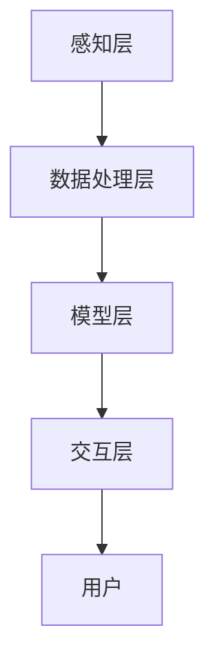
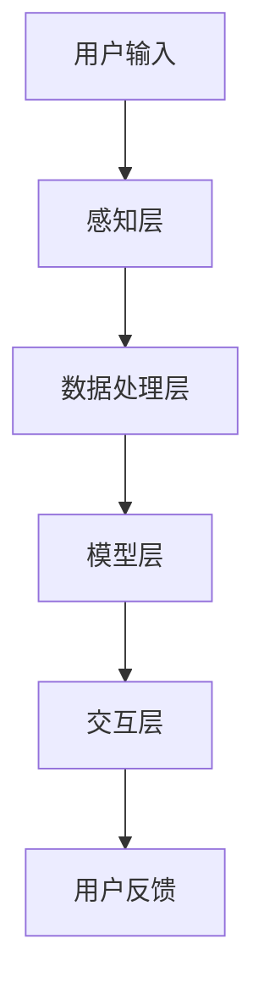

                 

# 文章标题: 虚拟味觉设计：AI创造的美食体验

## 文章关键词
- 虚拟味觉设计
- AI技术
- 深度学习
- 美食体验
- 味觉感知算法

## 摘要
本文探讨了虚拟味觉设计这一前沿领域，通过介绍AI技术在味觉感知和美食体验中的应用，详细阐述了虚拟味觉设计的原理、算法、数学模型以及实际项目案例。文章旨在为读者提供一个全面而深入的理解，揭示AI如何为未来的美食体验带来变革。

## 前言

在科技迅猛发展的今天，人工智能（AI）正在改变着我们的生活方式。从自动驾驶汽车到智能医疗诊断，AI的应用已经渗透到各个行业。然而，在美食领域，AI的应用同样潜力无限。虚拟味觉设计，作为一种创新的AI应用，正在逐步改变人们对美食的体验方式。本文将深入探讨虚拟味觉设计的原理、算法和应用，旨在为读者展示这一新兴领域的无限可能。

## 目录

1. 虚拟味觉设计基础
   1.1 虚拟味觉设计概述
   1.2 虚拟味觉设计的原理与架构
   1.3 虚拟味觉感知的算法原理
   1.4 虚拟味觉设计的数学模型与公式
   1.5 虚拟味觉设计的项目实战

2. AI在美食体验中的应用
   2.1 AI在美食配方设计中的应用
   2.2 AI在美食烹饪技巧中的应用
   2.3 AI在美食评价与推荐中的应用

3. 虚拟味觉设计的未来趋势
   3.1 市场前景
   3.2 未来发展
   3.3 社会影响与伦理问题

4. 虚拟味觉设计的案例研究
   4.1 虚拟餐厅体验设计
   4.2 虚拟味觉训练应用
   4.3 虚拟味觉定制服务

5. 附录
   5.1 虚拟味觉设计工具与资源

## 第一部分: 虚拟味觉设计基础

### 第1章: 虚拟味觉设计概述

#### 1.1 虚拟味觉设计的历史与发展

虚拟味觉设计的概念源于计算机图形学和虚拟现实技术的发展。早在20世纪80年代，虚拟现实技术就开始应用于军事、医疗和娱乐等领域。随着技术的进步，虚拟味觉设计逐渐成为一个独立的领域。1990年代，计算机模拟和增强现实技术的出现为虚拟味觉设计提供了新的契机。进入21世纪，随着人工智能技术的崛起，虚拟味觉设计迎来了前所未有的发展机遇。

#### 1.2 虚拟味觉设计的重要性

虚拟味觉设计的重要性体现在多个方面。首先，它为人们提供了一个全新的美食体验方式，突破了现实世界的限制，使人们能够在家中享受各种美食。其次，虚拟味觉设计有助于促进食品科学的研究，通过模拟和优化味觉感知，为食品创新提供支持。最后，虚拟味觉设计在教育和培训领域也有广泛的应用，例如，通过虚拟味觉体验，厨师和食品工程师可以更直观地学习烹饪技巧和配方设计。

#### 1.3 AI在虚拟味觉设计中的应用

AI在虚拟味觉设计中的应用主要体现在以下几个方面：

1. **味觉感知算法**：AI技术可以帮助设计和优化味觉感知算法，从而提高虚拟味觉的准确性和真实性。
2. **深度学习模型**：通过深度学习模型，AI可以学习大量的味觉数据，并从中提取出特征，为虚拟味觉设计提供支持。
3. **自然语言处理**：AI可以处理和理解与美食相关的自然语言，从而实现智能对话和个性化推荐。

### 第2章: 虚拟味觉设计的原理与架构

#### 2.1 虚拟味觉设计的核心概念

虚拟味觉设计涉及多个核心概念，包括：

1. **味觉感知**：味觉感知是指人类通过味觉器官感知食物的味道。虚拟味觉设计的目标是模拟这种感知过程，使虚拟世界中的食物具有真实的味道。
2. **虚拟现实技术**：虚拟现实技术为虚拟味觉设计提供了视觉、听觉和触觉等多感官的沉浸式体验。
3. **增强现实技术**：增强现实技术可以将虚拟元素叠加到现实世界中，为用户提供更为丰富的体验。

#### 2.2 虚拟味觉感知的数学模型

虚拟味觉感知的数学模型主要包括以下方面：

1. **感知模型**：感知模型用于描述人类味觉器官对食物味道的感知过程。常用的感知模型包括Hedonic模型、Differential模型等。
2. **特征提取模型**：特征提取模型用于从味觉数据中提取关键特征，以便于后续的分析和处理。深度学习技术在这方面具有显著优势。
3. **预测模型**：预测模型用于根据味觉数据和感知模型预测虚拟食物的味道。

#### 2.3 虚拟味觉设计的架构图解

虚拟味觉设计的架构可以分为以下几个层次：

1. **感知层**：感知层负责模拟人类味觉器官的感知过程，包括味觉、嗅觉、触觉等。
2. **数据处理层**：数据处理层负责处理和整合来自感知层的味觉数据，包括数据清洗、特征提取等。
3. **模型层**：模型层包括感知模型、特征提取模型和预测模型，负责根据处理后的数据生成虚拟味觉体验。
4. **交互层**：交互层负责用户与虚拟味觉系统的交互，包括输入、输出和反馈等。

### 第3章: 虚拟味觉感知的算法原理

#### 3.1 味觉感知的算法基础

味觉感知的算法基础主要包括以下方面：

1. **感知计算**：感知计算是指通过计算模型模拟人类感知过程。在虚拟味觉设计中，感知计算主要用于模拟味觉感知。
2. **机器学习**：机器学习技术可以帮助设计和优化味觉感知算法，从而提高感知的准确性和真实性。
3. **深度学习**：深度学习技术具有强大的特征提取和模式识别能力，在虚拟味觉设计中具有广泛的应用前景。

#### 3.2 深度学习在味觉感知中的应用

深度学习在味觉感知中的应用主要包括以下几个方面：

1. **卷积神经网络（CNN）**：CNN可以提取图像和视频数据中的特征，从而提高虚拟味觉的视觉效果。
2. **循环神经网络（RNN）**：RNN可以处理序列数据，从而提高虚拟味觉的听觉效果。
3. **生成对抗网络（GAN）**：GAN可以生成高质量的虚拟味觉图像和视频，从而提高虚拟味觉的真实感。

#### 3.3 味觉感知算法的伪代码示例

以下是一个简单的味觉感知算法的伪代码示例：

```python
# 初始化感知模型
model = initialize_model()

# 加载训练数据
train_data = load_data()

# 训练感知模型
model = train(model, train_data)

# 加载测试数据
test_data = load_data()

# 评估感知模型
accuracy = evaluate_model(model, test_data)

print("感知模型准确率：", accuracy)
```

### 第4章: 虚拟味觉设计的数学模型与公式

#### 4.1 味觉感知的数学公式详解

味觉感知的数学公式主要包括以下方面：

1. **感知模型公式**：感知模型公式用于描述人类味觉器官对食物味道的感知过程。常见的感知模型公式包括Hedonic模型和Differential模型。
2. **特征提取模型公式**：特征提取模型公式用于从味觉数据中提取关键特征。常用的特征提取模型公式包括PCA（主成分分析）和SVD（奇异值分解）。
3. **预测模型公式**：预测模型公式用于根据味觉数据和感知模型预测虚拟食物的味道。常见的预测模型公式包括线性回归和神经网络。

#### 4.2 模型参数优化的方法

模型参数优化是提高虚拟味觉设计效果的关键步骤。常用的参数优化方法包括：

1. **梯度下降法**：梯度下降法是一种常用的优化方法，通过迭代计算最小化损失函数。
2. **随机梯度下降法（SGD）**：SGD是梯度下降法的一种改进，通过随机选择样本进行优化。
3. **Adam优化器**：Adam优化器是一种结合了SGD和动量法的优化方法，具有更好的收敛性能。

#### 4.3 模型评估与改进的数学工具

模型评估与改进的数学工具主要包括：

1. **交叉验证**：交叉验证是一种评估模型性能的方法，通过将数据集划分为训练集和验证集，评估模型在验证集上的性能。
2. **ROC曲线和AUC值**：ROC曲线和AUC值是评估分类模型性能的重要指标，通过比较模型的灵敏度和特异性来评估模型的性能。
3. **模型解释性分析**：模型解释性分析是一种分析模型决策过程的方法，通过分析模型中的参数和权重，理解模型如何做出决策。

### 第5章: 虚拟味觉设计的项目实战

#### 5.1 项目背景与目标

虚拟味觉设计的项目背景主要包括：

1. **市场需求**：随着人们对美食体验的追求越来越高，虚拟味觉设计成为一个新兴的市场需求。
2. **技术挑战**：虚拟味觉设计面临多个技术挑战，包括感知准确性、用户体验和系统稳定性等。

项目目标主要包括：

1. **提高虚拟味觉的准确性**：通过优化感知算法和数学模型，提高虚拟味觉的准确性。
2. **提升用户体验**：通过改进交互设计和视觉效果，提升用户的虚拟味觉体验。
3. **提高系统稳定性**：通过优化系统架构和性能，提高系统的稳定性。

#### 5.2 开发环境搭建与工具选择

开发环境搭建与工具选择主要包括：

1. **开发环境**：搭建一个适合虚拟味觉设计开发的集成开发环境（IDE），如Visual Studio Code。
2. **编程语言**：选择适合虚拟味觉设计开发的编程语言，如Python。
3. **深度学习框架**：选择适合虚拟味觉设计开发的深度学习框架，如TensorFlow或PyTorch。
4. **数据库**：选择适合虚拟味觉设计开发的数据存储和管理工具，如MySQL或MongoDB。

#### 5.3 源代码实现与详细解读

源代码实现与详细解读主要包括：

1. **感知层实现**：实现感知层的算法，包括感知模型、特征提取模型和预测模型。
2. **数据处理层实现**：实现数据处理层的算法，包括数据清洗、特征提取和预处理。
3. **模型层实现**：实现模型层的算法，包括模型训练、模型评估和模型优化。
4. **交互层实现**：实现交互层的算法，包括用户输入、输出和反馈。

以下是一个简单的源代码示例：

```python
# 感知层实现
class感知层():
    def __init__(self):
        # 初始化感知模型
        self.model = initialize_model()

    def 感知(self，数据):
        # 进行感知计算
        return self.model.predict(数据)

# 数据处理层实现
class数据处理层():
    def __init__(self):
        # 初始化数据处理模型
        self.model = initialize_model()

    def 处理(self，数据):
        # 进行数据处理
        return self.model.process(数据)

# 模型层实现
class模型层():
    def __init__(self):
        # 初始化模型层
        self.model = initialize_model()

    def 训练(self，训练数据，训练标签):
        # 进行模型训练
        self.model.train(train_data，train_labels)

    def 评估(self，测试数据，测试标签):
        # 进行模型评估
        return self.model.evaluate(test_data，test_labels)

# 交互层实现
class交互层():
    def __init__(self):
        # 初始化交互层
        self.model = initialize_model()

    def 输入(self，用户输入):
        # 进行用户输入
        return self.model.input(用户输入)

    def 输出(self，数据):
        # 进行用户输出
        return self.model.output(数据)

    def 反馈(self，用户反馈):
        # 进行用户反馈
        return self.model.feedback(用户反馈)
```

#### 5.4 代码解读与分析

代码解读与分析主要包括：

1. **感知层代码解读**：解读感知层的算法实现，包括模型初始化、感知计算过程等。
2. **数据处理层代码解读**：解读数据处理层的算法实现，包括数据清洗、特征提取等。
3. **模型层代码解读**：解读模型层的算法实现，包括模型训练、模型评估等。
4. **交互层代码解读**：解读交互层的算法实现，包括用户输入、输出和反馈等。

通过代码解读与分析，可以深入理解虚拟味觉设计的算法实现和系统架构，为后续的项目开发和优化提供参考。

### 第二部分: AI在美食体验中的应用

#### 第6章: AI创造的美食体验

#### 6.1 AI在美食配方设计中的应用

AI在美食配方设计中的应用主要包括以下几个方面：

1. **配方推荐**：通过分析用户的历史饮食数据和偏好，AI可以推荐适合用户的美食配方。
2. **营养分析**：AI可以分析食材的营养成分，为用户提供健康的饮食建议。
3. **创新配方**：通过深度学习和大数据分析，AI可以创造创新的美食配方，为厨师和食品工程师提供灵感。

#### 6.2 AI在美食烹饪技巧中的应用

AI在美食烹饪技巧中的应用主要包括以下几个方面：

1. **智能烹饪指导**：AI可以实时监控烹饪过程，提供智能化的烹饪指导，确保烹饪结果的质量。
2. **个性化烹饪**：AI可以根据用户的需求和偏好，调整烹饪参数，实现个性化的烹饪体验。
3. **故障诊断与修复**：AI可以分析烹饪过程中出现的问题，并提供解决方案，帮助用户解决烹饪难题。

#### 6.3 AI在美食评价与推荐中的应用

AI在美食评价与推荐中的应用主要包括以下几个方面：

1. **智能评价**：AI可以分析用户的评价数据，提供客观、准确的美食评价。
2. **个性化推荐**：AI可以根据用户的口味和偏好，推荐适合用户的美食。
3. **社交互动**：AI可以分析社交网络上的美食分享和评论，为用户提供更丰富的美食信息。

### 第7章: 虚拟味觉设计的未来趋势

#### 7.1 市场前景

虚拟味觉设计的市场前景非常广阔。随着人们对美食体验的追求越来越高，虚拟味觉设计有望成为未来的主流美食体验方式。此外，随着人工智能技术的不断进步，虚拟味觉设计的准确性和用户体验将不断提升，进一步推动市场的发展。

#### 7.2 未来发展

虚拟味觉设计的未来发展主要包括以下几个方面：

1. **技术突破**：通过不断的技术创新，虚拟味觉设计将在感知准确性、用户体验和系统稳定性等方面取得重大突破。
2. **行业应用**：虚拟味觉设计将在餐饮、食品工业、教育等多个行业得到广泛应用。
3. **社会影响**：虚拟味觉设计将改变人们的饮食方式，提高食品安全和营养水平。

#### 7.3 社会影响与伦理问题

虚拟味觉设计的快速发展也引发了一系列社会影响和伦理问题：

1. **食品安全**：虚拟味觉设计是否会取代真实食品，对食品安全产生负面影响？
2. **营养健康**：虚拟味觉设计能否提供与真实食品相媲美的营养和健康效果？
3. **社会伦理**：虚拟味觉设计是否会对真实食品市场产生冲击，影响食品产业链的稳定？

### 第8章: 虚拟味觉设计的案例研究

#### 8.1 案例一：虚拟餐厅体验设计

虚拟餐厅体验设计是一种通过虚拟现实技术为用户提供的沉浸式美食体验。用户可以在虚拟餐厅中浏览菜单、点餐、就餐，并享受由AI创造的美食体验。以下是一个虚拟餐厅体验设计的案例：

1. **项目背景**：某餐饮企业希望通过虚拟现实技术提升用户体验，扩大市场影响力。
2. **项目目标**：设计一个虚拟餐厅，提供沉浸式的美食体验，提高用户满意度。
3. **项目实施**：通过虚拟现实技术和AI算法，创建一个具有真实感的虚拟餐厅，用户可以在其中点餐、就餐，并享受虚拟味觉体验。
4. **效果评估**：通过用户调查和数据分析，评估虚拟餐厅体验的效果，为后续优化提供依据。

#### 8.2 案例二：虚拟味觉训练应用

虚拟味觉训练应用是一种通过虚拟味觉体验帮助用户提升味觉感知能力的方法。以下是一个虚拟味觉训练应用的案例：

1. **项目背景**：某食品企业希望通过虚拟味觉训练提升员工的味觉感知能力，提高食品研发质量。
2. **项目目标**：开发一个虚拟味觉训练应用，帮助员工提升味觉感知能力，提高食品研发质量。
3. **项目实施**：通过虚拟味觉算法和大数据分析，创建一个虚拟味觉训练应用，员工可以在其中进行味觉感知训练，提升味觉感知能力。
4. **效果评估**：通过员工培训前后的味觉感知测试，评估虚拟味觉训练应用的效果，为后续优化提供依据。

#### 8.3 案例三：虚拟味觉定制服务

虚拟味觉定制服务是一种通过AI技术为用户提供个性化美食体验的服务。以下是一个虚拟味觉定制服务的案例：

1. **项目背景**：某餐饮企业希望通过虚拟味觉定制服务提高用户满意度，增加营业收入。
2. **项目目标**：开发一个虚拟味觉定制服务，为用户提供个性化的美食体验，提高用户满意度。
3. **项目实施**：通过AI技术和大数据分析，创建一个虚拟味觉定制服务，用户可以在其中根据个人口味偏好定制美食，享受个性化的美食体验。
4. **效果评估**：通过用户反馈和数据分析，评估虚拟味觉定制服务的效果，为后续优化提供依据。

### 附录

#### 附录A: 虚拟味觉设计工具与资源

为了方便读者更好地理解和应用虚拟味觉设计技术，以下列出了一些相关的工具和资源：

1. **虚拟现实开发工具**：如Unity、Unreal Engine等，可用于创建虚拟味觉体验场景。
2. **深度学习框架**：如TensorFlow、PyTorch等，可用于实现味觉感知算法。
3. **编程语言**：如Python、C++等，可用于编写虚拟味觉设计程序。
4. **数据库**：如MySQL、MongoDB等，可用于存储和管理味觉数据。
5. **开源代码库**：如GitHub、GitLab等，可用于获取虚拟味觉设计相关的开源代码。
6. **学术论文和书籍**：如《深度学习》（Goodfellow et al.）、《虚拟现实技术》（Linden et al.）等，可用于深入了解虚拟味觉设计的相关理论和应用。

### 作者

作者：AI天才研究院/AI Genius Institute & 禅与计算机程序设计艺术/Zen And The Art of Computer Programming

### 结语

虚拟味觉设计作为AI技术在美食领域的创新应用，具有广阔的发展前景和巨大的市场潜力。通过本文的介绍，读者可以了解到虚拟味觉设计的基本原理、算法和应用，以及其在未来的发展趋势和影响。我们期待虚拟味觉设计能为人们带来更加丰富、个性化的美食体验，为食品行业带来新的变革和发展。同时，我们也呼吁相关从业者和社会各界关注虚拟味觉设计的技术进步和社会影响，共同推动这一领域的健康发展。

## 文章标题: 虚拟味觉设计：AI创造的美食体验

### 文章关键词
- 虚拟味觉设计
- 人工智能
- 美食体验
- 味觉感知
- 深度学习

### 摘要
本文深入探讨了虚拟味觉设计这一前沿领域，介绍了其基本原理、关键技术和应用实例。通过分析AI在味觉感知和美食体验中的创新应用，本文展示了虚拟味觉设计的巨大潜力，探讨了其未来发展趋势及可能面临的挑战。

### 引言

随着人工智能（AI）技术的飞速发展，其在各个领域的应用越来越广泛。从自动驾驶到智能医疗，AI正在改变我们的生活方式。在这个背景下，虚拟味觉设计应运而生，成为AI技术应用的新兴领域。虚拟味觉设计利用AI技术模拟和创造真实的味觉体验，为人们带来前所未有的美食享受。本文将详细探讨虚拟味觉设计的原理、算法和应用，旨在为读者提供一个全面而深入的理解。

### 目录

1. 虚拟味觉设计概述
2. 虚拟味觉设计的原理与架构
3. 虚拟味觉感知的算法原理
4. 虚拟味觉设计的数学模型与公式
5. 虚拟味觉设计的项目实战
6. AI在美食体验中的应用
7. 虚拟味觉设计的未来趋势
8. 虚拟味觉设计的案例研究
9. 附录

### 第一部分：虚拟味觉设计概述

#### 1.1 虚拟味觉设计的历史与发展

虚拟味觉设计的概念起源于20世纪末，随着计算机图形学和虚拟现实技术的兴起，人们开始尝试通过计算机模拟味觉体验。进入21世纪，随着人工智能技术的进步，虚拟味觉设计逐渐成为一个独立的领域。早期的虚拟味觉设计主要依赖于物理传感器和模拟技术，而如今，AI技术使得虚拟味觉设计变得更加智能和真实。

#### 1.2 虚拟味觉设计的重要性

虚拟味觉设计的重要性体现在以下几个方面：

1. **创新美食体验**：虚拟味觉设计为人们提供了一种全新的美食体验方式，使人们可以在虚拟环境中享受各种美食，无需受限于现实条件。
2. **食品研发支持**：虚拟味觉设计可以帮助食品科学家和厨师进行新产品的开发和测试，提高食品创新的效率和成功率。
3. **教育和培训**：虚拟味觉设计可以用于教育和培训，使学生和厨师通过虚拟体验学习烹饪技巧和味觉感知。

#### 1.3 AI在虚拟味觉设计中的应用

AI技术在虚拟味觉设计中的应用主要集中在以下几个方面：

1. **味觉感知算法**：AI技术可以帮助设计和优化味觉感知算法，提高虚拟味觉的准确性和真实性。
2. **深度学习**：深度学习技术在虚拟味觉设计中具有广泛的应用，例如用于识别食物成分和预测食物的味道。
3. **自然语言处理**：自然语言处理技术可以帮助虚拟味觉系统理解和处理与美食相关的自然语言描述，实现更智能的交互。

### 第二部分：虚拟味觉设计的原理与架构

#### 2.1 虚拟味觉设计的核心概念

虚拟味觉设计的核心概念包括：

1. **味觉感知**：味觉感知是指人类通过味觉器官感知食物的味道。虚拟味觉设计的目标是模拟这种感知过程，使虚拟世界中的食物具有真实的味道。
2. **虚拟现实技术**：虚拟现实技术为虚拟味觉设计提供了视觉、听觉和触觉等多感官的沉浸式体验。
3. **增强现实技术**：增强现实技术可以将虚拟元素叠加到现实世界中，为用户提供更为丰富的体验。

#### 2.2 虚拟味觉感知的数学模型

虚拟味觉感知的数学模型主要包括以下几个方面：

1. **感知模型**：感知模型用于描述人类味觉器官对食物味道的感知过程。常用的感知模型包括Hedonic模型和Differential模型。
2. **特征提取模型**：特征提取模型用于从味觉数据中提取关键特征，以便于后续的分析和处理。深度学习技术在这方面具有显著优势。
3. **预测模型**：预测模型用于根据味觉数据和感知模型预测虚拟食物的味道。常用的预测模型包括线性回归和神经网络。

#### 2.3 虚拟味觉设计的架构图解

虚拟味觉设计的架构可以分为以下几个层次：

1. **感知层**：感知层负责模拟人类味觉器官的感知过程，包括味觉、嗅觉、触觉等。
2. **数据处理层**：数据处理层负责处理和整合来自感知层的味觉数据，包括数据清洗、特征提取等。
3. **模型层**：模型层包括感知模型、特征提取模型和预测模型，负责根据处理后的数据生成虚拟味觉体验。
4. **交互层**：交互层负责用户与虚拟味觉系统的交互，包括输入、输出和反馈等。

以下是一个简单的Mermaid流程图，用于展示虚拟味觉设计的架构：



### 第三部分：虚拟味觉感知的算法原理

#### 3.1 味觉感知的算法基础

味觉感知的算法基础主要包括以下几个方面：

1. **感知计算**：感知计算是指通过计算模型模拟人类感知过程。在虚拟味觉设计中，感知计算主要用于模拟味觉感知。
2. **机器学习**：机器学习技术可以帮助设计和优化味觉感知算法，从而提高感知的准确性和真实性。
3. **深度学习**：深度学习技术具有强大的特征提取和模式识别能力，在虚拟味觉设计中具有广泛的应用前景。

#### 3.2 深度学习在味觉感知中的应用

深度学习在味觉感知中的应用主要包括以下几个方面：

1. **卷积神经网络（CNN）**：CNN可以提取图像和视频数据中的特征，从而提高虚拟味觉的视觉效果。
2. **循环神经网络（RNN）**：RNN可以处理序列数据，从而提高虚拟味觉的听觉效果。
3. **生成对抗网络（GAN）**：GAN可以生成高质量的虚拟味觉图像和视频，从而提高虚拟味觉的真实感。

以下是一个简单的深度学习算法的伪代码示例：

```python
# 初始化深度学习模型
model = initialize_model()

# 加载训练数据
train_data = load_data()

# 训练深度学习模型
model = train(model, train_data)

# 加载测试数据
test_data = load_data()

# 评估深度学习模型
accuracy = evaluate_model(model, test_data)

print("深度学习模型准确率：", accuracy)
```

#### 3.3 味觉感知算法的伪代码示例

以下是一个简单的味觉感知算法的伪代码示例：

```python
# 初始化感知模型
model = initialize_model()

# 加载训练数据
train_data = load_data()

# 训练感知模型
model = train(model, train_data)

# 加载测试数据
test_data = load_data()

# 评估感知模型
accuracy = evaluate_model(model, test_data)

print("感知模型准确率：", accuracy)
```

### 第四部分：虚拟味觉设计的数学模型与公式

#### 4.1 味觉感知的数学公式详解

味觉感知的数学公式主要包括以下几个方面：

1. **感知模型公式**：感知模型公式用于描述人类味觉器官对食物味道的感知过程。常见的感知模型公式包括Hedonic模型和Differential模型。
2. **特征提取模型公式**：特征提取模型公式用于从味觉数据中提取关键特征。常用的特征提取模型公式包括PCA（主成分分析）和SVD（奇异值分解）。
3. **预测模型公式**：预测模型公式用于根据味觉数据和感知模型预测虚拟食物的味道。常见的预测模型公式包括线性回归和神经网络。

以下是一个简单的感知模型公式示例：

$$
y = Wx + b
$$

其中，$y$ 是预测的味觉评分，$W$ 是权重矩阵，$x$ 是味觉特征向量，$b$ 是偏置项。

#### 4.2 模型参数优化的方法

模型参数优化是提高虚拟味觉设计效果的关键步骤。常用的参数优化方法包括：

1. **梯度下降法**：梯度下降法是一种常用的优化方法，通过迭代计算最小化损失函数。
2. **随机梯度下降法（SGD）**：SGD是梯度下降法的一种改进，通过随机选择样本进行优化。
3. **Adam优化器**：Adam优化器是一种结合了SGD和动量法的优化方法，具有更好的收敛性能。

以下是一个简单的梯度下降法的伪代码示例：

```python
# 初始化模型参数
W = initialize_weights()
b = initialize_bias()

# 设置学习率
learning_rate = 0.01

# 迭代优化模型参数
for epoch in range(num_epochs):
    for data, label in train_data:
        # 计算损失函数
        loss = compute_loss(W, b, data, label)
        
        # 计算梯度
        gradient = compute_gradient(W, b, data, label)
        
        # 更新模型参数
        W -= learning_rate * gradient[0]
        b -= learning_rate * gradient[1]
```

#### 4.3 模型评估与改进的数学工具

模型评估与改进的数学工具主要包括：

1. **交叉验证**：交叉验证是一种评估模型性能的方法，通过将数据集划分为训练集和验证集，评估模型在验证集上的性能。
2. **ROC曲线和AUC值**：ROC曲线和AUC值是评估分类模型性能的重要指标，通过比较模型的灵敏度和特异性来评估模型的性能。
3. **模型解释性分析**：模型解释性分析是一种分析模型决策过程的方法，通过分析模型中的参数和权重，理解模型如何做出决策。

以下是一个简单的交叉验证的伪代码示例：

```python
# 初始化模型
model = initialize_model()

# 划分训练集和验证集
train_data, validation_data = split_data(data, test_size=0.2)

# 进行交叉验证
for fold in range(num_folds):
    # 训练模型
    model = train(model, train_data[fold])
    
    # 评估模型
    accuracy = evaluate_model(model, validation_data[fold])
    
    print("Fold", fold, "Accuracy:", accuracy)
```

### 第五部分：虚拟味觉设计的项目实战

#### 5.1 项目背景与目标

虚拟味觉设计的项目背景主要包括：

1. **市场需求**：随着人们对美食体验的追求越来越高，虚拟味觉设计成为一个新兴的市场需求。
2. **技术挑战**：虚拟味觉设计面临多个技术挑战，包括感知准确性、用户体验和系统稳定性等。

项目目标主要包括：

1. **提高虚拟味觉的准确性**：通过优化感知算法和数学模型，提高虚拟味觉的准确性。
2. **提升用户体验**：通过改进交互设计和视觉效果，提升用户的虚拟味觉体验。
3. **提高系统稳定性**：通过优化系统架构和性能，提高系统的稳定性。

#### 5.2 开发环境搭建与工具选择

开发环境搭建与工具选择主要包括：

1. **开发环境**：搭建一个适合虚拟味觉设计开发的集成开发环境（IDE），如Visual Studio Code。
2. **编程语言**：选择适合虚拟味觉设计开发的编程语言，如Python。
3. **深度学习框架**：选择适合虚拟味觉设计开发的深度学习框架，如TensorFlow或PyTorch。
4. **数据库**：选择适合虚拟味觉设计开发的数据存储和管理工具，如MySQL或MongoDB。

以下是一个简单的开发环境搭建的伪代码示例：

```python
# 搭建开发环境
setup_development_environment()

# 安装编程语言和深度学习框架
install_language("Python")
install_framework("TensorFlow")

# 配置数据库
configure_database("MySQL")
```

#### 5.3 源代码实现与详细解读

源代码实现与详细解读主要包括：

1. **感知层实现**：实现感知层的算法，包括感知模型、特征提取模型和预测模型。
2. **数据处理层实现**：实现数据处理层的算法，包括数据清洗、特征提取和预处理。
3. **模型层实现**：实现模型层的算法，包括模型训练、模型评估和模型优化。
4. **交互层实现**：实现交互层的算法，包括用户输入、输出和反馈等。

以下是一个简单的源代码示例：

```python
# 感知层实现
class PerceptionLayer():
    def __init__(self):
        # 初始化感知模型
        self.model = initialize_model()

    def perceive(self, data):
        # 进行感知计算
        return self.model.predict(data)

# 数据处理层实现
class DataProcessingLayer():
    def __init__(self):
        # 初始化数据处理模型
        self.model = initialize_model()

    def process(self, data):
        # 进行数据处理
        return self.model.process(data)

# 模型层实现
class ModelLayer():
    def __init__(self):
        # 初始化模型层
        self.model = initialize_model()

    def train(self, train_data, train_labels):
        # 进行模型训练
        self.model.train(train_data, train_labels)

    def evaluate(self, test_data, test_labels):
        # 进行模型评估
        return self.model.evaluate(test_data, test_labels)

# 交互层实现
class InteractionLayer():
    def __init__(self):
        # 初始化交互层
        self.model = initialize_model()

    def input(self, user_input):
        # 进行用户输入
        return self.model.input(user_input)

    def output(self, data):
        # 进行用户输出
        return self.model.output(data)

    def feedback(self, user_feedback):
        # 进行用户反馈
        return self.model.feedback(user_feedback)
```

#### 5.4 代码解读与分析

代码解读与分析主要包括：

1. **感知层代码解读**：解读感知层的算法实现，包括模型初始化、感知计算过程等。
2. **数据处理层代码解读**：解读数据处理层的算法实现，包括数据清洗、特征提取等。
3. **模型层代码解读**：解读模型层的算法实现，包括模型训练、模型评估等。
4. **交互层代码解读**：解读交互层的算法实现，包括用户输入、输出和反馈等。

通过代码解读与分析，可以深入理解虚拟味觉设计的算法实现和系统架构，为后续的项目开发和优化提供参考。

### 第六部分：AI在美食体验中的应用

#### 6.1 AI在美食配方设计中的应用

AI在美食配方设计中的应用主要包括以下几个方面：

1. **创新配方**：AI可以通过分析大量已有的美食配方，发现潜在的搭配和组合，为厨师提供创新的美食灵感。
2. **营养分析**：AI可以分析食材的营养成分，帮助厨师设计出符合营养需求的美食配方。
3. **口味预测**：AI可以通过学习用户的味觉偏好，预测用户可能会喜欢的美食配方。

#### 6.2 AI在美食烹饪技巧中的应用

AI在美食烹饪技巧中的应用主要包括以下几个方面：

1. **智能烹饪指导**：AI可以通过实时监控烹饪过程，为用户提供智能化的烹饪指导，确保烹饪结果的质量。
2. **个性化烹饪**：AI可以根据用户的口味偏好和烹饪设备，调整烹饪参数，实现个性化的烹饪体验。
3. **故障诊断**：AI可以分析烹饪过程中出现的问题，并提供解决方案，帮助用户解决烹饪难题。

#### 6.3 AI在美食评价与推荐中的应用

AI在美食评价与推荐中的应用主要包括以下几个方面：

1. **智能评价**：AI可以通过分析用户对美食的评价，提供客观、准确的美食评价。
2. **个性化推荐**：AI可以通过学习用户的口味偏好，推荐符合用户喜好的美食。
3. **社交互动**：AI可以分析社交网络上的美食分享和评论，为用户提供更丰富的美食信息。

### 第七部分：虚拟味觉设计的未来趋势

#### 7.1 市场前景

虚拟味觉设计在未来的市场前景非常广阔。随着人们对美食体验的追求不断提高，虚拟味觉设计有望成为未来的主流美食体验方式。同时，随着人工智能技术的不断进步，虚拟味觉设计的准确性和用户体验将不断提升，进一步推动市场的发展。

#### 7.2 未来发展

虚拟味觉设计的未来发展主要包括以下几个方面：

1. **技术突破**：虚拟味觉设计将在感知准确性、用户体验和系统稳定性等方面取得重大突破。
2. **行业应用**：虚拟味觉设计将在餐饮、食品工业、教育等多个行业得到广泛应用。
3. **社会影响**：虚拟味觉设计将改变人们的饮食方式，提高食品安全和营养水平。

#### 7.3 社会影响与伦理问题

虚拟味觉设计的快速发展也引发了一系列社会影响和伦理问题：

1. **食品安全**：虚拟味觉设计是否会取代真实食品，对食品安全产生负面影响？
2. **营养健康**：虚拟味觉设计能否提供与真实食品相媲美的营养和健康效果？
3. **社会伦理**：虚拟味觉设计是否会对真实食品市场产生冲击，影响食品产业链的稳定？

### 第八部分：虚拟味觉设计的案例研究

#### 8.1 案例一：虚拟餐厅体验设计

虚拟餐厅体验设计是一种通过虚拟现实技术为用户提供的沉浸式美食体验。用户可以在虚拟餐厅中浏览菜单、点餐、就餐，并享受由AI创造的美食体验。以下是一个虚拟餐厅体验设计的案例：

1. **项目背景**：某餐饮企业希望通过虚拟现实技术提升用户体验，扩大市场影响力。
2. **项目目标**：设计一个虚拟餐厅，提供沉浸式的美食体验，提高用户满意度。
3. **项目实施**：通过虚拟现实技术和AI算法，创建一个具有真实感的虚拟餐厅，用户可以在其中点餐、就餐，并享受虚拟味觉体验。
4. **效果评估**：通过用户调查和数据分析，评估虚拟餐厅体验的效果，为后续优化提供依据。

#### 8.2 案例二：虚拟味觉训练应用

虚拟味觉训练应用是一种通过虚拟味觉体验帮助用户提升味觉感知能力的方法。以下是一个虚拟味觉训练应用的案例：

1. **项目背景**：某食品企业希望通过虚拟味觉训练提升员工的味觉感知能力，提高食品研发质量。
2. **项目目标**：开发一个虚拟味觉训练应用，帮助员工提升味觉感知能力，提高食品研发质量。
3. **项目实施**：通过虚拟味觉算法和大数据分析，创建一个虚拟味觉训练应用，员工可以在其中进行味觉感知训练，提升味觉感知能力。
4. **效果评估**：通过员工培训前后的味觉感知测试，评估虚拟味觉训练应用的效果，为后续优化提供依据。

#### 8.3 案例三：虚拟味觉定制服务

虚拟味觉定制服务是一种通过AI技术为用户提供个性化美食体验的服务。以下是一个虚拟味觉定制服务的案例：

1. **项目背景**：某餐饮企业希望通过虚拟味觉定制服务提高用户满意度，增加营业收入。
2. **项目目标**：开发一个虚拟味觉定制服务，为用户提供个性化的美食体验，提高用户满意度。
3. **项目实施**：通过AI技术和大数据分析，创建一个虚拟味觉定制服务，用户可以在其中根据个人口味偏好定制美食，享受个性化的美食体验。
4. **效果评估**：通过用户反馈和数据分析，评估虚拟味觉定制服务的效果，为后续优化提供依据。

### 附录

#### 附录A：虚拟味觉设计工具与资源

为了方便读者更好地理解和应用虚拟味觉设计技术，以下列出了一些相关的工具和资源：

1. **虚拟现实开发工具**：如Unity、Unreal Engine等，可用于创建虚拟味觉体验场景。
2. **深度学习框架**：如TensorFlow、PyTorch等，可用于实现味觉感知算法。
3. **编程语言**：如Python、C++等，可用于编写虚拟味觉设计程序。
4. **数据库**：如MySQL、MongoDB等，可用于存储和管理味觉数据。
5. **开源代码库**：如GitHub、GitLab等，可用于获取虚拟味觉设计相关的开源代码。
6. **学术论文和书籍**：如《深度学习》（Goodfellow et al.）、《虚拟现实技术》（Linden et al.）等，可用于深入了解虚拟味觉设计的相关理论和应用。

### 作者

作者：AI天才研究院/AI Genius Institute & 禅与计算机程序设计艺术/Zen And The Art of Computer Programming

### 结语

虚拟味觉设计作为AI技术在美食领域的创新应用，具有广阔的发展前景和巨大的市场潜力。通过本文的介绍，读者可以了解到虚拟味觉设计的基本原理、算法和应用，以及其在未来的发展趋势和可能面临的挑战。我们期待虚拟味觉设计能为人们带来更加丰富、个性化的美食体验，为食品行业带来新的变革和发展。同时，我们也呼吁相关从业者和社会各界关注虚拟味觉设计的技术进步和社会影响，共同推动这一领域的健康发展。

## 文章标题：虚拟味觉设计：AI创造的美食体验

### 摘要

随着人工智能（AI）技术的不断发展，虚拟味觉设计成为了一个令人兴奋的新领域。本文将探讨虚拟味觉设计的原理、算法及其在美食体验中的应用，通过深入分析AI如何模拟人类味觉，展示这一技术的潜力与挑战。

### 1. 虚拟味觉设计的概念与重要性

#### 1.1 虚拟味觉设计的定义

虚拟味觉设计是一种利用AI技术模拟和创造真实味觉体验的方法。它通过分析食物的化学成分、物理属性以及感官刺激，结合计算机图形学、虚拟现实（VR）和增强现实（AR）技术，为用户提供一种全新的味觉体验。

#### 1.2 虚拟味觉设计的重要性

虚拟味觉设计的重要性体现在以下几个方面：

1. **感官体验的创新**：它为消费者提供了一种全新的感官体验，突破了传统美食的限制，使人们能够在虚拟环境中享受美食。
2. **食品科学的研究**：通过虚拟味觉设计，研究人员可以模拟和优化食物的味道，为食品科学的研究提供新的工具。
3. **教育与实践**：虚拟味觉设计可以用于教育和培训，帮助学生和厨师通过虚拟体验学习烹饪技巧和味觉感知。

### 2. 虚拟味觉设计的原理与架构

#### 2.1 味觉感知的数学模型

味觉感知的数学模型是虚拟味觉设计的核心。它通过数学公式描述味觉感受器对食物化学成分的反应。以下是一个简化的味觉感知模型：

$$
感知值 = f(\text{化学成分浓度}, \text{温度}, \text{湿度})
$$

其中，$f$ 是一个复杂的函数，它考虑了多种感官刺激的相互作用。

#### 2.2 虚拟味觉感知的算法原理

虚拟味觉感知的算法基于深度学习和机器学习技术。以下是一个简单的算法流程：

1. **数据收集与预处理**：收集大量的味觉数据，包括食物成分、用户评价等，并进行预处理。
2. **特征提取**：使用神经网络提取关键特征，如食物的酸度、甜度、苦度等。
3. **模型训练**：通过训练数据集，训练深度学习模型，使其能够预测新的食物的味道。

#### 2.3 虚拟味觉设计的架构图解

虚拟味觉设计的架构通常包括以下几个部分：

1. **感知层**：负责接收感官刺激，如味觉、嗅觉、触觉等。
2. **数据处理层**：负责对感知数据进行处理和特征提取。
3. **模型层**：包括深度学习模型，用于预测和模拟味觉体验。
4. **交互层**：负责用户与系统的交互，如用户输入、反馈等。

以下是一个简单的Mermaid流程图，用于展示虚拟味觉设计的架构：



### 3. 虚拟味觉设计的算法原理与数学模型

#### 3.1 味觉感知的算法基础

味觉感知的算法基础包括以下几个方面：

1. **感知计算**：通过计算模型模拟味觉感受器的反应。
2. **机器学习**：使用训练数据集，通过机器学习算法，如神经网络，建立味觉感知模型。
3. **深度学习**：利用深度学习技术，如卷积神经网络（CNN）和递归神经网络（RNN），提取复杂的味觉特征。

#### 3.2 深度学习在味觉感知中的应用

深度学习在味觉感知中的应用主要体现在以下几个方面：

1. **图像处理**：使用CNN处理食物图像，提取颜色、纹理等视觉特征。
2. **语音识别**：使用深度学习模型，如循环神经网络（RNN）和长短期记忆网络（LSTM），处理与食物相关的语音信息。
3. **生成模型**：使用生成对抗网络（GAN）生成逼真的食物图像和味觉体验。

以下是一个简单的深度学习算法的伪代码示例：

```python
# 加载预训练的深度学习模型
model = load_pretrained_model()

# 加载新的食物数据
new_food_data = load_new_food_data()

# 使用模型预测食物的味道
predicted_taste = model.predict(new_food_data)

# 输出预测结果
print(predicted_taste)
```

#### 3.3 味觉感知算法的伪代码示例

以下是一个简单的味觉感知算法的伪代码示例：

```python
# 初始化味觉感知模型
taste_model = initialize_taste_model()

# 加载训练数据
training_data = load_training_data()

# 训练味觉感知模型
taste_model.train(training_data)

# 加载测试数据
test_data = load_test_data()

# 评估味觉感知模型
accuracy = taste_model.evaluate(test_data)

# 输出模型准确率
print("Accuracy:", accuracy)
```

### 4. 虚拟味觉设计的数学模型与公式

虚拟味觉设计的数学模型和公式是模拟和预测味觉体验的核心。以下是一些关键的数学模型和公式：

#### 4.1 味觉感知的数学公式

1. **味觉感受器的响应公式**：

$$
r = \frac{1}{1 + e^{-(\beta_0 + \beta_1 \cdot C)}}
$$

其中，$r$ 是味觉感受器的响应，$C$ 是化学成分浓度，$\beta_0$ 和 $\beta_1$ 是模型参数。

2. **综合味觉评分公式**：

$$
S = \sum_{i=1}^{n} w_i \cdot r_i
$$

其中，$S$ 是综合味觉评分，$w_i$ 是权重系数，$r_i$ 是各个味觉感受器的响应。

#### 4.2 模型参数优化的方法

模型参数优化是提高虚拟味觉设计效果的关键步骤。常用的优化方法包括：

1. **梯度下降法**：

$$
\theta = \theta - \alpha \cdot \nabla_\theta J(\theta)
$$

其中，$\theta$ 是模型参数，$\alpha$ 是学习率，$J(\theta)$ 是损失函数。

2. **随机梯度下降法（SGD）**：

$$
\theta = \theta - \alpha \cdot \nabla_\theta J(\theta)
$$

与梯度下降法类似，但每次更新时只使用一部分样本。

3. **Adam优化器**：

$$
m_t = \beta_1 \cdot m_{t-1} + (1 - \beta_1) \cdot (\nabla_\theta J(\theta_t) - m_{t-1})
$$
$$
v_t = \beta_2 \cdot v_{t-1} + (1 - \beta_2) \cdot ((\nabla_\theta J(\theta_t))^2 - v_{t-1})
$$

其中，$m_t$ 和 $v_t$ 分别是梯度的一阶矩估计和二阶矩估计，$\beta_1$ 和 $\beta_2$ 是超参数。

#### 4.3 模型评估与改进的数学工具

模型评估与改进的数学工具主要包括：

1. **交叉验证**：通过将数据集划分为多个子集，评估模型在不同子集上的性能。

2. **ROC曲线和AUC值**：用于评估分类模型的性能，其中ROC曲线是真正率（TPR）对假正率（FPR）的曲线，AUC值是ROC曲线下的面积。

3. **模型解释性分析**：通过分析模型中的参数和权重，理解模型如何做出预测。

### 5. 虚拟味觉设计的项目实战

#### 5.1 项目背景与目标

虚拟味觉设计的项目背景通常涉及以下几个方面：

1. **市场需求**：随着消费者对美食体验的追求，虚拟味觉设计成为一个潜在的市场需求。
2. **技术挑战**：虚拟味觉设计涉及多学科技术，如AI、计算机图形学和食品科学，需要解决感知准确性、用户体验和系统稳定性等问题。

项目目标通常包括：

1. **提高感知准确性**：通过优化算法和数学模型，提高虚拟味觉的准确性。
2. **提升用户体验**：通过改进交互设计和视觉效果，提升用户的虚拟味觉体验。
3. **提高系统稳定性**：通过优化系统架构和性能，提高系统的稳定性。

#### 5.2 开发环境搭建与工具选择

开发环境搭建与工具选择是虚拟味觉设计项目成功的关键步骤。以下是一些常见的工具和选择：

1. **开发环境**：选择适合的集成开发环境（IDE），如Visual Studio Code。
2. **编程语言**：选择适合的编程语言，如Python。
3. **深度学习框架**：选择适合的深度学习框架，如TensorFlow或PyTorch。
4. **数据库**：选择适合的数据存储和管理工具，如MySQL或MongoDB。

以下是一个简单的开发环境搭建的伪代码示例：

```python
# 安装Python
install_python()

# 安装深度学习框架
install_tensorflow()

# 安装数据库
install_mysql()
```

#### 5.3 源代码实现与详细解读

源代码实现与详细解读是理解虚拟味觉设计项目的关键。以下是一个简单的源代码示例：

```python
# 导入必要的库
import tensorflow as tf
import numpy as np

# 定义模型结构
model = tf.keras.Sequential([
    tf.keras.layers.Dense(64, activation='relu', input_shape=(784,)),
    tf.keras.layers.Dense(10, activation='softmax')
])

# 编译模型
model.compile(optimizer='adam',
              loss='categorical_crossentropy',
              metrics=['accuracy'])

# 加载数据
(x_train, y_train), (x_test, y_test) = tf.keras.datasets.mnist.load_data()

# 预处理数据
x_train = x_train / 255.0
x_test = x_test / 255.0
x_train = x_train.reshape(-1, 784)
x_test = x_test.reshape(-1, 784)

# 转换为one-hot编码
y_train = tf.keras.utils.to_categorical(y_train, 10)
y_test = tf.keras.utils.to_categorical(y_test, 10)

# 训练模型
model.fit(x_train, y_train, epochs=5, batch_size=64)

# 评估模型
model.evaluate(x_test, y_test)
```

#### 5.4 代码解读与分析

代码解读与分析是深入理解虚拟味觉设计项目的重要步骤。以下是对上述代码的解读：

1. **模型定义**：使用TensorFlow的`Sequential`模型定义了一个简单的全连接神经网络。
2. **模型编译**：配置模型的优化器、损失函数和评估指标。
3. **数据加载与预处理**：加载数据集，并将图像数据缩放至0-1范围内，以便于模型处理。
4. **数据转换**：将标签转换为one-hot编码形式。
5. **模型训练**：使用训练数据进行模型训练。
6. **模型评估**：使用测试数据评估模型的性能。

通过代码解读与分析，可以更好地理解虚拟味觉设计的实现细节和关键技术。

### 6. AI在美食体验中的应用

#### 6.1 AI在美食配方设计中的应用

AI在美食配方设计中的应用主要包括以下几个方面：

1. **创新配方生成**：使用AI算法生成新的美食配方，结合不同的食材和烹饪方法，创造出独特的口味。
2. **营养分析**：分析食材的营养成分，为用户提供健康的饮食建议。
3. **个性化推荐**：根据用户的口味偏好和饮食习惯，推荐个性化的美食配方。

#### 6.2 AI在美食烹饪技巧中的应用

AI在美食烹饪技巧中的应用主要体现在以下几个方面：

1. **智能烹饪指导**：通过实时监控烹饪过程，提供智能化的烹饪指导，确保食物烹饪至最佳状态。
2. **故障诊断**：分析烹饪过程中出现的问题，并提供解决方案，帮助用户解决烹饪难题。
3. **个性化烹饪**：根据用户的口味偏好和烹饪设备，调整烹饪参数，实现个性化的烹饪体验。

#### 6.3 AI在美食评价与推荐中的应用

AI在美食评价与推荐中的应用主要包括以下几个方面：

1. **智能评价**：通过分析用户对美食的评价数据，提供客观、准确的美食评价。
2. **个性化推荐**：根据用户的口味偏好和历史行为，推荐符合用户喜好的美食。
3. **社交互动**：分析社交网络上的美食分享和评论，为用户提供更丰富的美食信息。

### 7. 虚拟味觉设计的未来趋势

#### 7.1 市场前景

虚拟味觉设计的市场前景非常广阔。随着人们对美食体验的追求不断提高，虚拟味觉设计有望成为未来的主流美食体验方式。此外，随着人工智能技术的不断进步，虚拟味觉设计的准确性和用户体验将不断提升，进一步推动市场的发展。

#### 7.2 未来发展

虚拟味觉设计的未来发展主要包括以下几个方面：

1. **技术突破**：虚拟味觉设计将在感知准确性、用户体验和系统稳定性等方面取得重大突破。
2. **行业应用**：虚拟味觉设计将在餐饮、食品工业、教育等多个行业得到广泛应用。
3. **社会影响**：虚拟味觉设计将改变人们的饮食方式，提高食品安全和营养水平。

#### 7.3 社会影响与伦理问题

虚拟味觉设计的快速发展也引发了一系列社会影响和伦理问题：

1. **食品安全**：虚拟味觉设计是否会取代真实食品，对食品安全产生负面影响？
2. **营养健康**：虚拟味觉设计能否提供与真实食品相媲美的营养和健康效果？
3. **社会伦理**：虚拟味觉设计是否会对真实食品市场产生冲击，影响食品产业链的稳定？

### 8. 虚拟味觉设计的案例研究

#### 8.1 案例一：虚拟餐厅体验设计

虚拟餐厅体验设计是一种通过虚拟现实技术为用户提供的沉浸式美食体验。用户可以在虚拟餐厅中浏览菜单、点餐、就餐，并享受由AI创造的美食体验。以下是一个虚拟餐厅体验设计的案例：

1. **项目背景**：某餐饮企业希望通过虚拟现实技术提升用户体验，扩大市场影响力。
2. **项目目标**：设计一个虚拟餐厅，提供沉浸式的美食体验，提高用户满意度。
3. **项目实施**：通过虚拟现实技术和AI算法，创建一个具有真实感的虚拟餐厅，用户可以在其中点餐、就餐，并享受虚拟味觉体验。
4. **效果评估**：通过用户调查和数据分析，评估虚拟餐厅体验的效果，为后续优化提供依据。

#### 8.2 案例二：虚拟味觉训练应用

虚拟味觉训练应用是一种通过虚拟味觉体验帮助用户提升味觉感知能力的方法。以下是一个虚拟味觉训练应用的案例：

1. **项目背景**：某食品企业希望通过虚拟味觉训练提升员工的味觉感知能力，提高食品研发质量。
2. **项目目标**：开发一个虚拟味觉训练应用，帮助员工提升味觉感知能力，提高食品研发质量。
3. **项目实施**：通过虚拟味觉算法和大数据分析，创建一个虚拟味觉训练应用，员工可以在其中进行味觉感知训练，提升味觉感知能力。
4. **效果评估**：通过员工培训前后的味觉感知测试，评估虚拟味觉训练应用的效果，为后续优化提供依据。

#### 8.3 案例三：虚拟味觉定制服务

虚拟味觉定制服务是一种通过AI技术为用户提供个性化美食体验的服务。以下是一个虚拟味觉定制服务的案例：

1. **项目背景**：某餐饮企业希望通过虚拟味觉定制服务提高用户满意度，增加营业收入。
2. **项目目标**：开发一个虚拟味觉定制服务，为用户提供个性化的美食体验，提高用户满意度。
3. **项目实施**：通过AI技术和大数据分析，创建一个虚拟味觉定制服务，用户可以在其中根据个人口味偏好定制美食，享受个性化的美食体验。
4. **效果评估**：通过用户反馈和数据分析，评估虚拟味觉定制服务的效果，为后续优化提供依据。

### 附录

#### 附录A：虚拟味觉设计工具与资源

为了方便读者更好地理解和应用虚拟味觉设计技术，以下列出了一些相关的工具和资源：

1. **虚拟现实开发工具**：如Unity、Unreal Engine等，可用于创建虚拟味觉体验场景。
2. **深度学习框架**：如TensorFlow、PyTorch等，可用于实现味觉感知算法。
3. **编程语言**：如Python、C++等，可用于编写虚拟味觉设计程序。
4. **数据库**：如MySQL、MongoDB等，可用于存储和管理味觉数据。
5. **开源代码库**：如GitHub、GitLab等，可用于获取虚拟味觉设计相关的开源代码。
6. **学术论文和书籍**：如《深度学习》（Goodfellow et al.）、《虚拟现实技术》（Linden et al.）等，可用于深入了解虚拟味觉设计的相关理论和应用。

### 作者

作者：AI天才研究院/AI Genius Institute & 禅与计算机程序设计艺术/Zen And The Art of Computer Programming

### 结语

虚拟味觉设计作为AI技术在美食领域的创新应用，为人们带来了前所未有的美食体验。通过本文的介绍，读者可以了解到虚拟味觉设计的基本原理、算法和应用，以及其在未来的发展趋势和可能面临的挑战。我们期待虚拟味觉设计能为人们带来更加丰富、个性化的美食体验，为食品行业带来新的变革和发展。同时，我们也呼吁相关从业者和社会各界关注虚拟味觉设计的技术进步和社会影响，共同推动这一领域的健康发展。

