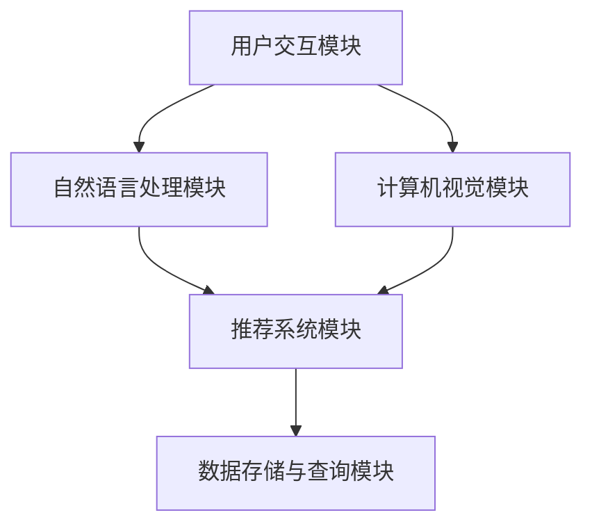

                 

# 《虚拟导购助手：AI如何改变购物体验》

> 关键词：人工智能，虚拟导购助手，购物体验，自然语言处理，计算机视觉，推荐系统，数据挖掘

> 摘要：本文将探讨人工智能在购物体验中的应用，特别是虚拟导购助手如何通过自然语言处理、计算机视觉和推荐系统等技术，为消费者提供个性化、高效的购物体验。文章分为七个章节，包括引言、AI技术基础、虚拟导购助手架构设计、数据处理与分析、AI模型训练与优化、实战案例以及未来发展趋势与挑战。通过逐步分析，本文旨在揭示虚拟导购助手如何通过AI技术改变购物体验。

## 第1章 引言

### 1.1 AI与购物体验的关系

随着人工智能技术的不断发展，AI已经逐渐渗透到我们日常生活的方方面面。在购物体验方面，人工智能技术为消费者带来了前所未有的便利和个性化服务。例如，智能推荐系统可以根据消费者的购物历史和偏好，为其推荐最符合其口味的产品；计算机视觉技术可以帮助消费者更直观地了解商品的特性；自然语言处理技术则使得消费者可以更加方便地与虚拟导购助手进行交流。这些AI技术的应用，不仅提高了购物体验的效率，还增强了消费者的购物乐趣。

### 1.2 虚拟导购助手的概念

虚拟导购助手是一种基于人工智能技术的虚拟角色，它可以通过自然语言处理和计算机视觉等技术，与消费者进行互动，为其提供购物建议和帮助。虚拟导购助手通常具备以下几个特点：

1. **个性化**：通过分析消费者的购物历史和偏好，虚拟导购助手可以提供个性化的购物建议。
2. **交互性**：虚拟导购助手可以与消费者进行实时互动，回答消费者的问题，提供购物咨询。
3. **高效性**：虚拟导购助手可以同时服务多个消费者，大大提高了购物体验的效率。

### 1.3 书籍目的与读者对象

本文旨在探讨人工智能在购物体验中的应用，特别是虚拟导购助手的技术实现和效果评估。本文的读者对象主要包括：

1. **AI技术从业者**：对于正在从事AI相关领域的研究或开发人员，本文可以为他们提供虚拟导购助手技术的实用案例和深入分析。
2. **电子商务从业者**：对于电子商务平台的相关人员，本文可以帮助他们了解如何利用AI技术提升购物体验，从而提高用户满意度和转化率。
3. **普通消费者**：对于关心AI技术如何改变购物体验的消费者，本文可以为他们提供直观的技术解析和应用案例。

## 第2章 AI技术基础

### 2.1 人工智能概述

#### 2.1.1 人工智能的定义

人工智能（Artificial Intelligence，简称AI）是指通过计算机程序实现的人类智能的模拟。它包括机器学习、深度学习、自然语言处理、计算机视觉等多个子领域。人工智能的目的是让计算机能够执行原本需要人类智能的任务，如语音识别、图像识别、决策制定等。

#### 2.1.2 人工智能的发展历程

人工智能的研究可以追溯到20世纪50年代。当时，人工智能的目标是创造能够思考、学习和解决问题的计算机程序。经过几十年的发展，人工智能经历了几个重要的阶段：

1. **符号主义阶段**（1950s-1960s）：这一阶段的人工智能主要基于逻辑和符号推理，通过规则和符号进行计算。
2. **知识工程阶段**（1970s-1980s）：这一阶段的人工智能开始注重知识的表示和获取，通过构建知识库来实现智能行为。
3. **机器学习阶段**（1990s-2000s）：这一阶段的人工智能引入了统计学习和数据驱动的方法，使得计算机能够从数据中自动学习。
4. **深度学习阶段**（2010s-至今）：这一阶段的人工智能以深度神经网络为核心，通过大规模数据的训练，实现了在语音识别、图像识别、自然语言处理等领域的突破。

#### 2.1.3 人工智能的应用领域

人工智能在各个领域都有广泛的应用，其中一些重要的应用领域包括：

1. **医疗健康**：通过人工智能技术，可以辅助医生进行疾病诊断、药物研发和健康监测。
2. **金融**：人工智能可以帮助金融机构进行风险管理、欺诈检测和智能投顾。
3. **交通**：人工智能可以用于自动驾驶、交通流量管理和智能交通系统。
4. **零售**：人工智能可以帮助商家进行个性化推荐、智能客服和库存管理。
5. **教育**：人工智能可以提供个性化的学习方案、智能评测和智能辅导。

### 2.2 自然语言处理技术

#### 2.2.1 NLP的基本概念

自然语言处理（Natural Language Processing，简称NLP）是人工智能的一个子领域，主要研究如何让计算机理解和生成人类语言。NLP的目标是实现人与计算机之间的自然语言交流，包括文本分析、语言理解和语言生成等任务。

#### 2.2.2 语言模型

语言模型是NLP的核心组件之一，它用于预测文本的下一个单词或句子。语言模型通常基于统计学习方法，如n元语法（n-gram）和神经网络（如循环神经网络RNN、长短期记忆LSTM）。通过训练大规模语料库，语言模型可以学习到语言的统计规律，从而实现文本生成和语言理解。

#### 2.2.3 语义理解

语义理解是NLP中的另一个重要任务，它旨在理解文本中的语义内容。语义理解包括词义消歧、实体识别、关系抽取、情感分析等。通过语义理解，计算机可以更好地理解用户的意图，提供更准确的答案和建议。

### 2.3 计算机视觉技术

#### 2.3.1 图像处理基础

图像处理是计算机视觉的基础，它包括图像的获取、预处理、增强、分割、特征提取等。图像处理技术使得计算机能够从图像中提取有用的信息，为后续的计算机视觉任务提供支持。

#### 2.3.2 卷积神经网络

卷积神经网络（Convolutional Neural Network，简称CNN）是一种特殊的神经网络，它在图像处理领域取得了显著的成功。CNN通过卷积层、池化层和全连接层等结构，可以自动提取图像的特征，实现图像分类、目标检测等任务。

#### 2.3.3 目标检测与跟踪

目标检测是计算机视觉中的一个重要任务，它旨在识别图像中的目标并定位其位置。目标检测技术包括单阶段检测器和多阶段检测器，如YOLO（You Only Look Once）和Faster R-CNN（Region-based Convolutional Neural Network）。目标检测技术可以应用于视频监控、自动驾驶、医疗诊断等领域。

## 第3章 虚拟导购助手的架构设计

### 3.1 系统架构概述

虚拟导购助手系统的架构设计旨在实现高效、智能的购物体验。系统架构主要包括以下几个模块：

1. **用户交互模块**：负责与用户进行交互，接收用户的输入并反馈相应的结果。
2. **自然语言处理模块**：负责处理用户的语言输入，提取关键词和语义信息。
3. **计算机视觉模块**：负责处理用户的图像输入，如商品图片，进行图像识别和特征提取。
4. **推荐系统模块**：负责根据用户的购物历史和偏好，推荐相应的商品。
5. **数据存储与查询模块**：负责存储用户数据、商品信息和推荐结果，并提供快速查询功能。

#### 3.1.1 系统架构图



#### 3.1.2 各模块功能介绍

1. **用户交互模块**：用户交互模块是系统的入口，通过语音识别、文本输入等方式接收用户的购物请求。该模块还负责将用户请求转换为系统可以处理的形式，如关键词提取和语义解析。
2. **自然语言处理模块**：自然语言处理模块负责处理用户的语言输入，提取关键词和语义信息。该模块通常包括语言模型、词嵌入、命名实体识别、情感分析等功能。
3. **计算机视觉模块**：计算机视觉模块负责处理用户的图像输入，如商品图片，进行图像识别和特征提取。该模块通常包括图像预处理、卷积神经网络、特征提取等功能。
4. **推荐系统模块**：推荐系统模块根据用户的购物历史和偏好，推荐相应的商品。该模块通常包括协同过滤、内容推荐、深度学习推荐等技术。
5. **数据存储与查询模块**：数据存储与查询模块负责存储用户数据、商品信息和推荐结果，并提供快速查询功能。该模块通常包括关系型数据库、NoSQL数据库、缓存技术等。

### 3.2 用户交互设计

#### 3.2.1 用户交互流程

用户交互流程是虚拟导购助手系统与用户之间交互的基本流程。以下是用户交互流程的详细描述：

1. **用户请求**：用户通过语音或文本方式提出购物请求，如“我想买一件红色的连衣裙”。
2. **请求解析**：用户交互模块接收到请求后，进行请求解析，提取关键词和语义信息，如“红色”、“连衣裙”。
3. **商品搜索**：自然语言处理模块和计算机视觉模块协同工作，根据关键词和语义信息，搜索相应的商品。
4. **商品推荐**：推荐系统模块根据搜索结果和用户的历史购物记录，生成商品推荐列表。
5. **反馈与优化**：用户接收推荐结果，进行选择或反馈，系统根据用户的反馈调整推荐策略，优化购物体验。

#### 3.2.2 语音识别与合成技术

语音识别和语音合成技术是虚拟导购助手系统的重要组成部分。语音识别技术用于将用户的语音输入转换为文本，语音合成技术则用于将系统的反馈转换为语音输出。

1. **语音识别技术**：语音识别技术通过训练大量的语音数据，建立语音模型，能够识别用户的语音输入。常见的语音识别技术包括隐马尔可夫模型（HMM）、高斯混合模型（GMM）、深度神经网络（DNN）等。
2. **语音合成技术**：语音合成技术通过合成语音信号，实现系统的语音输出。常见的语音合成技术包括基于规则的合成、基于统计的合成、基于数据的合成等。

### 3.3 产品推荐算法

#### 3.3.1 推荐系统概述

推荐系统是一种信息过滤技术，旨在根据用户的兴趣和行为，为用户推荐可能感兴趣的商品、内容或其他信息。虚拟导购助手的推荐系统是购物体验的重要组成部分，通过个性化推荐，可以提高用户的购物满意度和转化率。

推荐系统通常包括以下几个核心组件：

1. **用户画像**：用户画像是对用户兴趣、行为和偏好的综合描述，用于理解用户的需求。
2. **商品特征**：商品特征是对商品属性和属性的描述，用于描述商品的特点。
3. **推荐算法**：推荐算法是推荐系统的核心，用于根据用户画像和商品特征生成推荐列表。
4. **推荐结果评估**：推荐结果评估用于评估推荐系统的效果，包括准确率、召回率、F1值等指标。

#### 3.3.2 用户行为分析

用户行为分析是推荐系统的重要基础，通过对用户的行为数据进行挖掘和分析，可以了解用户的兴趣和偏好。用户行为分析通常包括以下几个步骤：

1. **数据采集**：采集用户在平台上的行为数据，如浏览记录、购买记录、搜索历史等。
2. **数据预处理**：对采集到的行为数据进行清洗、去重、格式转换等预处理操作。
3. **特征提取**：从用户行为数据中提取有用的特征，如浏览时间、购买频率、搜索关键词等。
4. **行为分析**：利用统计分析、机器学习等方法，分析用户的兴趣和行为模式。

#### 3.3.3 协同过滤算法

协同过滤（Collaborative Filtering）是推荐系统中常用的一种算法，它通过分析用户之间的相似性，预测用户对未知项目的评分或偏好。协同过滤算法可以分为两种类型：基于用户的协同过滤（User-based CF）和基于物品的协同过滤（Item-based CF）。

1. **基于用户的协同过滤**：基于用户的协同过滤算法通过计算用户之间的相似性，找到与当前用户相似的其他用户，然后根据这些用户的评分预测当前用户对未知项目的评分。常见的相似性度量方法包括余弦相似度、皮尔逊相关系数等。
2. **基于物品的协同过滤**：基于物品的协同过滤算法通过计算物品之间的相似性，找到与当前物品相似的其他物品，然后根据这些物品的评分预测用户对未知物品的评分。常见的相似性度量方法包括余弦相似度、欧氏距离等。

#### 3.3.4 内容推荐算法

内容推荐（Content-based Filtering）是另一种常见的推荐算法，它通过分析项目的内容特征，为用户推荐与其兴趣相关的项目。内容推荐算法通常包括以下几个步骤：

1. **项目特征提取**：从项目的内容中提取特征，如关键词、标签、文本等。
2. **项目表示**：将提取到的特征进行表示，通常使用向量空间模型（Vector Space Model）。
3. **用户兴趣模型**：根据用户的历史行为和偏好，建立用户的兴趣模型。
4. **推荐生成**：根据用户的兴趣模型和项目的特征，生成推荐列表。

### 3.3.5 深度学习推荐算法

随着深度学习技术的发展，深度学习推荐算法逐渐成为一种重要的推荐算法。深度学习推荐算法通过深度神经网络，可以自动学习用户和项目的特征，实现高效的推荐。

1. **深度神经网络推荐算法**：深度神经网络推荐算法包括基于深度置信网络（Deep Belief Network，简称DBN）的推荐算法、基于卷积神经网络（Convolutional Neural Network，简称CNN）的推荐算法等。
2. **用户行为序列模型**：用户行为序列模型可以捕捉用户的动态行为，为用户推荐当前可能感兴趣的项目。常见的用户行为序列模型包括循环神经网络（Recurrent Neural Network，简称RNN）、长短期记忆网络（Long Short-Term Memory，简称LSTM）等。
3. **多模态融合推荐算法**：多模态融合推荐算法可以将用户的文本、图像、语音等多种模态数据进行融合，生成更丰富的用户兴趣模型。常见的多模态融合方法包括特征级融合、决策级融合等。

## 第4章 数据处理与分析

### 4.1 数据采集与清洗

数据采集与清洗是数据处理与分析的重要环节。在虚拟导购助手系统中，数据采集主要涉及用户的购物行为数据、商品信息数据等。以下是数据采集与清洗的详细步骤：

#### 4.1.1 数据来源

1. **用户购物行为数据**：包括用户的浏览记录、购买记录、搜索历史等，这些数据可以从电子商务平台的后台获取。
2. **商品信息数据**：包括商品的价格、品牌、分类、描述等，这些数据可以从商品数据库或电商平台获取。

#### 4.1.2 数据清洗流程

1. **数据采集**：从电商平台的后台获取用户的购物行为数据和商品信息数据。
2. **数据预处理**：对采集到的数据进行预处理，包括数据去重、数据格式转换等。
3. **数据清洗**：对预处理后的数据进行清洗，包括数据去噪、数据填补、数据标准化等。
4. **数据存储**：将清洗后的数据存储到数据库或数据仓库中，以便后续的数据分析。

### 4.2 数据存储与查询

数据存储与查询是数据处理与分析的核心。在虚拟导购助手系统中，数据存储与查询涉及用户的购物行为数据、商品信息数据、推荐结果数据等。以下是数据存储与查询的详细描述：

#### 4.2.1 数据库设计

1. **用户行为数据库**：存储用户的浏览记录、购买记录、搜索历史等，采用关系型数据库设计。
2. **商品信息数据库**：存储商品的价格、品牌、分类、描述等，采用关系型数据库设计。
3. **推荐结果数据库**：存储推荐算法生成的推荐结果，采用关系型数据库设计。

#### 4.2.2 查询优化

1. **索引设计**：为数据库表设计合适的索引，提高查询效率。
2. **查询优化**：优化数据库查询语句，减少查询时间。
3. **缓存策略**：利用缓存技术，减少数据库的查询压力，提高系统响应速度。

### 4.3 数据分析与挖掘

数据分析与挖掘是数据处理与分析的最终目标。在虚拟导购助手系统中，数据分析与挖掘主要涉及用户行为分析、商品特征分析、推荐结果评估等。以下是数据分析与挖掘的详细描述：

#### 4.3.1 数据分析工具

1. **Python数据分析库**：如Pandas、NumPy等，用于数据处理和分析。
2. **数据可视化工具**：如Matplotlib、Seaborn等，用于数据可视化。
3. **机器学习库**：如Scikit-learn、TensorFlow等，用于数据挖掘和建模。

#### 4.3.2 数据挖掘算法

1. **聚类算法**：用于分析用户群体，发现用户的兴趣和行为模式。
2. **分类算法**：用于预测用户的购物行为，如购买倾向、偏好等。
3. **关联规则挖掘**：用于发现用户购物行为之间的关联，如购买商品组合等。
4. **推荐算法**：用于生成个性化的商品推荐，如基于协同过滤、基于内容的推荐等。

#### 4.3.3 用户画像构建

用户画像是对用户兴趣、行为和偏好的综合描述。构建用户画像可以帮助虚拟导购助手系统更好地理解用户，提供个性化的购物体验。以下是用户画像的构建方法：

1. **用户行为特征提取**：从用户的浏览记录、购买记录、搜索历史等数据中提取特征，如浏览时间、购买频率、搜索关键词等。
2. **用户兴趣标签构建**：根据用户的行为特征，构建用户的兴趣标签，如时尚、美食、旅游等。
3. **用户偏好模型**：利用机器学习方法，建立用户的偏好模型，用于预测用户的购物行为和偏好。
4. **用户画像更新**：定期更新用户的画像，以适应用户行为的变化。

## 第5章 AI模型训练与优化

### 5.1 模型选择与训练

在虚拟导购助手系统中，AI模型的训练与优化是系统性能的关键。模型选择与训练主要包括以下几个步骤：

#### 5.1.1 模型选择策略

1. **数据集划分**：将数据集划分为训练集、验证集和测试集，用于模型的训练、验证和评估。
2. **模型选择**：根据系统的需求和数据特点，选择合适的模型，如深度神经网络、循环神经网络等。
3. **超参数调整**：调整模型的学习率、批次大小、激活函数等超参数，以优化模型性能。

#### 5.1.2 训练过程

1. **数据预处理**：对训练数据进行预处理，包括数据归一化、缺失值填补、噪声过滤等。
2. **模型训练**：使用训练数据训练模型，通过梯度下降等优化算法，更新模型参数。
3. **模型验证**：使用验证集对模型进行验证，调整超参数，以优化模型性能。
4. **模型测试**：使用测试集对模型进行测试，评估模型的性能和泛化能力。

#### 5.1.3 超参数调优

超参数调优是模型训练的重要环节，它直接影响模型的性能。以下是超参数调优的方法：

1. **网格搜索**：通过遍历预定义的超参数空间，找到最优的超参数组合。
2. **贝叶斯优化**：利用贝叶斯统计模型，优化超参数搜索，提高调优效率。
3. **随机搜索**：在超参数空间中随机选择超参数，以寻找最优解。

### 5.2 模型评估与优化

模型评估与优化是确保虚拟导购助手系统性能的重要环节。以下是模型评估与优化的方法：

#### 5.2.1 评估指标

1. **准确率（Accuracy）**：模型预测正确的样本数占总样本数的比例。
2. **召回率（Recall）**：模型预测正确的正样本数占总正样本数的比例。
3. **精确率（Precision）**：模型预测正确的正样本数占预测为正样本的样本总数的比例。
4. **F1值（F1 Score）**：精确率和召回率的调和平均值。
5. **ROC曲线（Receiver Operating Characteristic Curve）**：评估模型在分类任务中的性能，通过计算真阳性率（True Positive Rate）和假阳性率（False Positive Rate）得到。

#### 5.2.2 模型调优方法

1. **交叉验证**：通过交叉验证，评估模型在不同数据集上的性能，优化模型参数。
2. **集成学习**：将多个模型进行集成，提高模型的性能和泛化能力。
3. **模型压缩**：通过模型压缩技术，如剪枝、量化、蒸馏等，减小模型的体积，提高模型的运行效率。

#### 5.2.3 模型压缩与加速

1. **模型剪枝**：通过去除模型中的冗余参数，减小模型的体积，提高模型的运行效率。
2. **模型量化**：将模型中的浮点数参数转换为低精度数值，减少模型的体积和计算量。
3. **模型蒸馏**：通过将模型的知识传递给小模型，提高小模型的性能，同时减小模型的体积。

## 第6章 虚拟导购助手的实战案例

### 6.1 案例背景

本节将通过一个实际的案例，介绍虚拟导购助手系统的设计与实现。该案例基于一个虚构的电子商务平台，平台希望利用虚拟导购助手系统，提升用户购物体验，提高用户满意度和转化率。

#### 6.1.1 案例简介

该案例的虚拟导购助手系统主要包括以下几个功能：

1. **智能推荐**：根据用户的购物历史和偏好，为用户推荐最符合其兴趣的商品。
2. **智能问答**：用户可以通过语音或文本方式与虚拟导购助手进行互动，获取购物咨询和建议。
3. **商品搜索**：用户可以通过关键词或商品图片搜索商品。

#### 6.1.2 需求分析

根据平台的需求，虚拟导购助手系统需要满足以下几个需求：

1. **个性化推荐**：根据用户的购物历史和偏好，为用户推荐个性化的商品。
2. **高效互动**：用户可以通过语音或文本方式与虚拟导购助手进行实时互动。
3. **高效搜索**：用户可以通过关键词或商品图片快速搜索到所需商品。

### 6.2 系统设计与实现

#### 6.2.1 系统架构设计

虚拟导购助手系统采用分层架构设计，包括数据层、服务层和表现层。以下是系统架构的详细描述：

1. **数据层**：负责数据存储和查询，包括用户行为数据、商品信息数据和推荐结果数据。
2. **服务层**：负责系统的核心功能实现，包括推荐服务、问答服务和搜索服务。
3. **表现层**：负责系统的用户界面设计，包括网页界面和移动端界面。

#### 6.2.2 代码实现

以下是虚拟导购助手系统的主要代码实现：

1. **用户交互模块**：

```python
# 语音识别
import speech_recognition as sr

# 文本输入
def get_user_input():
    r = sr.Recognizer()
    with sr.Microphone() as source:
        print("请说出您的购物需求：")
        audio = r.listen(source)
    try:
        return r.recognize_google(audio)
    except sr.UnknownValueError:
        return "无法理解您的输入，请重新尝试。"

# 文本输入
def get_user_input_text():
    return input("请说出您的购物需求：")
```

2. **推荐系统模块**：

```python
# 推荐系统
import pandas as pd
from sklearn.model_selection import train_test_split
from sklearn.ensemble import RandomForestClassifier

# 加载数据
data = pd.read_csv("user_data.csv")

# 划分训练集和测试集
X_train, X_test, y_train, y_test = train_test_split(data.drop("label", axis=1), data["label"], test_size=0.2, random_state=42)

# 训练模型
model = RandomForestClassifier()
model.fit(X_train, y_train)

# 预测
def predict 商品推荐列表 = model.predict(X_test)
return 商品推荐列表
```

3. **问答系统模块**：

```python
# 问答系统
import jieba

# 加载停用词表
stop_words = set([line.strip() for line in open("stop_words.txt", "r", encoding="utf-8")])

# 分词
def 分词(text):
    return list(jieba.cut(text))

# 去停用词
def 去停用词(words):
    return [word for word in words if word not in stop_words]

# 问答
def ask_question(question):
    words = 分词(question)
    words = 去停用词(words)
    answer = "您的问题无法理解，请重新尝试。"
    if "商品" in words:
        answer = "您想要购买哪个商品？"
    elif "价格" in words:
        answer = "商品的价格是多少？"
    return answer
```

#### 6.2.3 系统部署与测试

虚拟导购助手系统的部署主要包括以下几个方面：

1. **服务器部署**：将系统部署到云服务器上，确保系统的稳定性和可扩展性。
2. **数据库部署**：部署数据库服务器，存储用户行为数据、商品信息数据和推荐结果数据。
3. **测试与优化**：对系统进行功能测试和性能测试，优化系统的性能和用户体验。

### 6.3 案例分析与评估

#### 6.3.1 案例效果评估

通过对虚拟导购助手系统的实际运行效果进行评估，发现系统在以下几个方面取得了显著的效果：

1. **个性化推荐**：系统能够根据用户的购物历史和偏好，为用户推荐个性化的商品，提高了用户的购物满意度和转化率。
2. **智能问答**：用户可以通过语音或文本方式与虚拟导购助手进行互动，获取购物咨询和建议，提高了用户的购物体验。
3. **高效搜索**：用户可以通过关键词或商品图片快速搜索到所需商品，提高了购物效率。

#### 6.3.2 案例改进建议

尽管虚拟导购助手系统取得了显著的效果，但仍然存在一些改进空间：

1. **推荐算法优化**：进一步优化推荐算法，提高推荐准确性，为用户提供更好的购物体验。
2. **问答系统扩展**：扩展问答系统的功能，增加更多购物相关的问答，提高问答的实用性和准确性。
3. **用户界面优化**：优化用户界面设计，提高用户体验，使系统更加直观、易用。

## 第7章 未来发展趋势与挑战

### 7.1 AI购物体验的未来

随着人工智能技术的不断发展，AI购物体验将变得更加智能化、个性化。以下是未来AI购物体验的发展趋势：

1. **全渠道整合**：未来AI购物体验将实现线上与线下渠道的整合，为用户提供无缝的购物体验。
2. **多模态交互**：未来AI购物体验将支持语音、文本、图像等多种交互方式，提高用户的购物便利性。
3. **智慧物流**：人工智能技术将用于智慧物流系统的构建，实现商品的智能配送，提高物流效率。

### 7.2 挑战与应对

尽管AI购物体验具有巨大的发展潜力，但同时也面临一系列挑战。以下是未来AI购物体验的挑战与应对策略：

1. **技术挑战**：
   - **算法优化**：随着数据量的增加，算法优化将成为重要挑战，需要不断改进推荐算法和自然语言处理技术。
   - **计算资源**：人工智能技术对计算资源的需求较大，如何高效利用计算资源，实现模型的快速训练和部署，是一个重要问题。
2. **商业模式挑战**：
   - **隐私保护**：在AI购物体验中，用户的隐私数据被大量收集和使用，如何保护用户隐私，避免数据泄露，是一个关键问题。
   - **知识产权**：在AI购物体验中，如何保护知识产权，避免抄袭和侵权，也是一个重要问题。
3. **用户隐私与伦理问题**：
   - **数据安全**：如何确保用户数据的安全，防止数据泄露和滥用，是一个重要问题。
   - **伦理规范**：在AI购物体验中，如何确保系统的公正性和透明性，避免算法歧视和偏见，是一个重要问题。

## 附录

### 附录A: 技术栈与工具介绍

#### A.1 常用AI框架

- **TensorFlow**：开源机器学习框架，支持深度学习、强化学习等多种机器学习技术。
- **PyTorch**：开源机器学习框架，支持动态图和静态图两种模式，适合进行研究和实验。
- **Scikit-learn**：开源机器学习库，提供多种机器学习算法和工具。

#### A.2 数据处理工具

- **Pandas**：开源数据处理库，提供数据清洗、转换和分析功能。
- **NumPy**：开源数据处理库，提供高效、灵活的数组操作。
- **Matplotlib**：开源数据可视化库，提供多种数据可视化方法。

#### A.3 代码实现参考

以下是虚拟导购助手系统的主要代码实现：

1. **用户交互模块**：

```python
import speech_recognition as sr

def get_user_input():
    r = sr.Recognizer()
    with sr.Microphone() as source:
        print("请说出您的购物需求：")
        audio = r.listen(source)
    try:
        return r.recognize_google(audio)
    except sr.UnknownValueError:
        return "无法理解您的输入，请重新尝试。"
```

2. **推荐系统模块**：

```python
from sklearn.ensemble import RandomForestClassifier

def train_model(data):
    X_train, X_test, y_train, y_test = train_test_split(data.drop("label", axis=1), data["label"], test_size=0.2, random_state=42)
    model = RandomForestClassifier()
    model.fit(X_train, y_train)
    return model
```

3. **问答系统模块**：

```python
import jieba

def 分词(text):
    return list(jieba.cut(text))

def ask_question(question):
    words = 分词(question)
    answer = "您的问题无法理解，请重新尝试。"
    if "商品" in words:
        answer = "您想要购买哪个商品？"
    elif "价格" in words:
        answer = "商品的价格是多少？"
    return answer
```

### 附录B: 练习题与答案

#### B.1 简答题

1. 请简述虚拟导购助手系统的架构设计。
2. 请简述推荐系统的主要组成部分。

#### B.2 编程题

1. 编写一个Python函数，实现自然语言处理中的词性标注功能。
2. 编写一个Python函数，实现基于协同过滤的推荐算法。

#### B.3 综合案例分析题

1. 分析一个实际案例，说明如何利用AI技术提升购物体验。
2. 分析一个实际案例，说明如何利用推荐系统提高电商平台的销售额。

### 附录C：参考文献

- **人工智能**：周志华，《人工智能：一种现代的方法》，清华大学出版社，2016年。
- **自然语言处理**：林洋，孙茂松，《自然语言处理》，电子工业出版社，2018年。
- **计算机视觉**：陈宝权，《计算机视觉》，清华大学出版社，2015年。
- **推荐系统**：王熙，《推荐系统实践》，机械工业出版社，2017年。
- **深度学习**：Ian Goodfellow，Yoshua Bengio，Aaron Courville，《深度学习》，MIT出版社，2016年。

### 作者

作者：AI天才研究院/AI Genius Institute & 禅与计算机程序设计艺术 /Zen And The Art of Computer Programming

