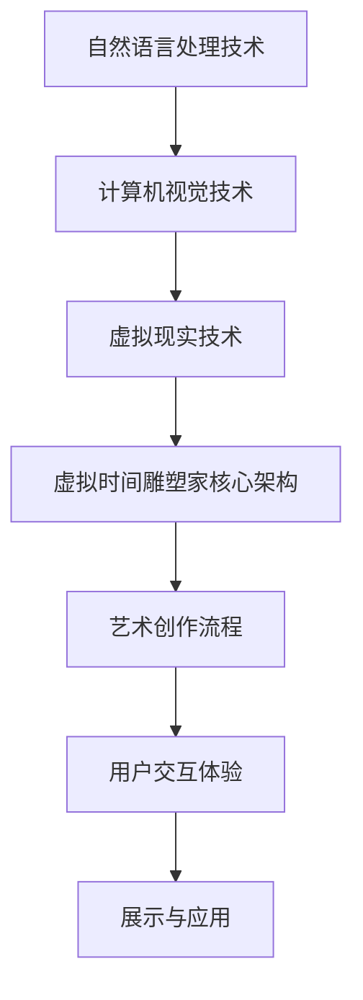

                 

# 虚拟时间雕塑家：AI驱动的时间感知艺术家

> 关键词：人工智能、虚拟现实、时间感知、艺术创作、技术实战

> 摘要：本文将探讨虚拟时间雕塑家这一概念的诞生背景、核心技术和原理，并通过实际项目实战，深入解析AI驱动的时间感知艺术。文章旨在为读者提供对虚拟时间雕塑家的全面理解，并探讨其在未来艺术创作、教育和社会文化中的潜在影响。

### 《虚拟时间雕塑家：AI驱动的时间感知艺术家》目录大纲

1. **第一部分：AI驱动的时间感知艺术家概述**

   - **1.1 虚拟时间雕塑家概述**
     - **1.1.1 AI在时间感知艺术中的应用**
     - **1.1.2 虚拟时间雕塑家的核心概念**
     - **1.1.3 虚拟时间雕塑家的发展历程**

   - **1.2 AI驱动的时间感知艺术**
     - **1.2.1 时间感知艺术的定义**
     - **1.2.2 AI在时间感知艺术中的角色**
     - **1.2.3 AI驱动的时间感知艺术的分类**

   - **1.3 虚拟时间雕塑家的核心技术和原理**
     - **1.3.1 自然语言处理技术**
     - **1.3.2 计算机视觉技术**
     - **1.3.3 虚拟现实技术**

   - **1.4 虚拟时间雕塑家在社会与文化中的影响**
     - **1.4.1 对艺术创作的影响**
     - **1.4.2 对观众体验的影响**
     - **1.4.3 对文化传承与创新的影响**

2. **第二部分：AI驱动的时间感知艺术项目实战**

   - **2.1 项目实战一：虚拟时间雕塑家创作实践**
     - **2.1.1 项目背景与目标**
     - **2.1.2 项目需求分析与规划**
     - **2.1.3 技术选型与架构设计**
     - **2.1.4 开发过程与关键技术实现**
     - **2.1.5 测试与优化**

   - **2.2 项目实战二：虚拟时间雕塑家交互体验设计**
     - **2.2.1 用户需求分析**
     - **2.2.2 交互设计原则与方法**
     - **2.2.3 交互流程与界面设计**
     - **2.2.4 用户体验测试与优化**

   - **2.3 项目实战三：虚拟时间雕塑家展示与应用**
     - **2.3.1 展示方案与策略**
     - **2.3.2 应用场景与案例分析**
     - **2.3.3 社会影响与反馈**

3. **第三部分：AI驱动的时间感知艺术家未来展望**

   - **3.1 虚拟时间雕塑家的未来发展**
     - **3.1.1 技术发展趋势**
     - **3.1.2 艺术形式与风格的创新**
     - **3.1.3 商业模式的探索**

   - **3.2 虚拟时间雕塑家的教育意义与社会价值**
     - **3.2.1 对艺术教育的影响**
     - **3.2.2 对社会文化的促进作用**
     - **3.2.3 对人类未来的启示**

   - **3.3 虚拟时间雕塑家的伦理与法律问题**
     - **3.3.1 艺术创作的道德边界**
     - **3.3.2 数据隐私与安全问题**
     - **3.3.3 法律法规与政策框架**

4. **附录**

   - **附录A：虚拟时间雕塑家项目资源列表**
     - **A.1 开发工具与软件**
     - **A.2 数据集与资源链接**
     - **A.3 学习与参考书籍**

   - **附录B：虚拟时间雕塑家项目代码示例**
     - **B.1 项目一：虚拟时间雕塑家创作实践代码**
     - **B.2 项目二：虚拟时间雕塑家交互体验设计代码**
     - **B.3 项目三：虚拟时间雕塑家展示与应用代码**

   - **附录C：虚拟时间雕塑家核心技术架构流程图**

---

## 第一部分：AI驱动的时间感知艺术家概述

### 1.1 虚拟时间雕塑家概述

#### 1.1.1 AI在时间感知艺术中的应用

人工智能（AI）技术的迅速发展，为艺术创作带来了全新的可能性。AI不仅能够通过算法和模型自动生成艺术作品，还能模拟人类感知时间的方式，创造出具有时间感知特性的艺术品。虚拟时间雕塑家便是这一理念的具象化，它利用AI技术构建出一种能够感知和表现时间流动的艺术形式。

在虚拟时间雕塑家中，AI通过自然语言处理（NLP）技术理解和解析创作者的意图，计算机视觉技术捕捉和再现时间的动态变化，虚拟现实（VR）技术则提供沉浸式的艺术体验。这种多维度的技术融合，使得虚拟时间雕塑家成为一种全新的艺术创作工具，它不仅能够创作出独特的艺术作品，还能够通过交互改变作品的表现形式。

#### 1.1.2 虚拟时间雕塑家的核心概念

虚拟时间雕塑家的核心概念在于将时间作为艺术创作的基本元素，通过AI技术实现对时间的感知和表现。传统的雕塑艺术注重静态的美感和形态，而虚拟时间雕塑家则通过动态的变化和时间的流动，赋予艺术作品更多的层次和维度。

具体来说，虚拟时间雕塑家包括以下几个关键组成部分：

- **数据采集与处理**：AI系统从多种数据源（如文本、图像、音频等）中提取信息，进行预处理和分析。

- **时间感知算法**：利用机器学习和深度学习算法，分析数据中的时间特征，生成时间感知模型。

- **动态可视化**：通过计算机图形学和虚拟现实技术，将时间感知模型转化为视觉和听觉上的动态艺术表现形式。

- **交互设计**：用户可以通过交互界面与艺术作品互动，改变作品的表现状态，从而体验时间的流动。

#### 1.1.3 虚拟时间雕塑家的发展历程

虚拟时间雕塑家的概念最早可以追溯到20世纪80年代，随着计算机技术和AI技术的不断发展，这一概念逐渐成熟。以下是虚拟时间雕塑家发展历程的几个关键阶段：

- **萌芽阶段（1980s-1990s）**：计算机图形学和人工智能的初步结合，研究者开始探索如何将时间作为艺术创作的一个维度。

- **发展阶段（2000s）**：随着计算能力的提升和AI技术的突破，虚拟时间雕塑家逐渐展现出其独特的艺术魅力，吸引了越来越多的创作者和观众。

- **成熟阶段（2010s-2020s）**：虚拟现实技术的成熟，为虚拟时间雕塑家提供了更加沉浸式的体验，使得这一艺术形式得到了更广泛的认可和应用。

### 1.2 AI驱动的时间感知艺术

#### 1.2.1 时间感知艺术的定义

时间感知艺术是一种将时间作为基本元素，通过艺术手段表现时间流动和变化的创作形式。与传统的静态艺术不同，时间感知艺术强调动态的、交互性的表现手法，让观众在时间的流逝中感受到艺术的变化和深度。

时间感知艺术的定义可以从以下几个方面来理解：

- **时间作为创作元素**：艺术家通过创作过程中的时间变化，来表现时间的流逝和变化。

- **动态表现手法**：艺术家运用各种技术手段，如动画、影像、声音等，来表现时间的动态特征。

- **交互性体验**：观众通过参与和互动，感受艺术作品随时间变化的体验。

#### 1.2.2 AI在时间感知艺术中的角色

AI在时间感知艺术中扮演着关键角色，其作用主要体现在以下几个方面：

- **数据分析和处理**：AI技术可以帮助艺术家从大量数据中提取有用的信息，为艺术创作提供灵感。

- **自动生成**：通过机器学习和深度学习算法，AI能够自动生成具有时间感知特性的艺术作品。

- **交互设计**：AI可以根据用户的行为和反馈，动态调整艺术作品的表现形式，提供个性化的艺术体验。

#### 1.2.3 AI驱动的时间感知艺术的分类

根据表现手法和艺术形式的差异，AI驱动的时间感知艺术可以大致分为以下几个类别：

- **动态影像艺术**：通过视频和动画技术，表现时间的变化和流动。

- **互动装置艺术**：通过交互设计，让观众与艺术作品互动，体验时间的流动。

- **动态雕塑艺术**：利用计算机视觉技术和3D建模，创造出具有动态特性的雕塑作品。

- **虚拟现实艺术**：通过VR技术，提供沉浸式的艺术体验，观众可以在虚拟世界中感受时间的流逝。

### 1.3 虚拟时间雕塑家的核心技术和原理

#### 1.3.1 自然语言处理技术

自然语言处理（NLP）技术是虚拟时间雕塑家的核心组成部分之一，它主要涉及文本的解析和理解。在虚拟时间雕塑家的创作过程中，NLP技术被用来：

- **文本解析**：将创作者的文本描述转化为结构化的数据，为后续的算法处理提供基础。

- **情感分析**：分析文本中的情感倾向，帮助AI理解创作者的情感表达，从而影响艺术作品的风格和情感色彩。

- **语境理解**：通过上下文分析，理解文本中的隐含信息和意图，为艺术创作提供更精准的指导。

以下是一个简单的伪代码示例，用于文本解析：

```python
def parse_text(text):
    # 分词和词性标注
    tokens = tokenize(text)
    tagged_tokens = tag_tokens(tokens)
    
    # 情感分析
    sentiment = analyze_sentiment(tagged_tokens)
    
    # 语境理解
    context = understand_context(tagged_tokens)
    
    return sentiment, context
```

#### 1.3.2 计算机视觉技术

计算机视觉技术是虚拟时间雕塑家的另一个核心组成部分，它主要用于捕捉和再现时间的变化。具体来说，计算机视觉技术包括以下几个步骤：

- **图像捕捉**：通过摄像头或传感器捕捉动态图像，为艺术创作提供视觉素材。

- **图像处理**：对捕捉到的图像进行预处理，如去噪、增强、滤波等，以提高图像质量。

- **图像分析**：利用图像识别和目标检测技术，分析图像中的时间和空间特征。

以下是一个简单的伪代码示例，用于图像捕捉和处理：

```python
def capture_image():
    # 打开摄像头
    camera = open_camera()
    
    # 捕获图像
    image = camera.capture_image()
    
    # 图像预处理
    processed_image = preprocess_image(image)
    
    return processed_image
```

#### 1.3.3 虚拟现实技术

虚拟现实（VR）技术为虚拟时间雕塑家提供了沉浸式的艺术体验，使观众能够身临其境地感受时间的变化。VR技术主要包括以下几个方面：

- **场景构建**：通过计算机图形学技术，构建出虚拟的艺术场景。

- **交互设计**：设计用户与虚拟场景的交互方式，如手势识别、语音控制等。

- **实时渲染**：在虚拟场景中实时渲染艺术作品，确保用户体验的流畅性。

以下是一个简单的伪代码示例，用于VR场景构建和交互设计：

```python
def build_scene():
    # 构建场景
    scene = create_scene()
    
    # 添加艺术作品
    artwork = create_artwork()
    scene.add_artwork(artwork)
    
    # 设计交互
    interaction = design_interaction()
    scene.set_interaction(interaction)
    
    return scene
```

### 1.4 虚拟时间雕塑家在社会与文化中的影响

#### 1.4.1 对艺术创作的影响

虚拟时间雕塑家为艺术家提供了一种全新的创作工具，它不仅丰富了艺术创作的手段，还拓宽了艺术的表现形式。通过AI技术和VR技术的结合，艺术家可以更加自由地表达时间感知和情感变化，创造出独具特色的动态艺术作品。

例如，在动态影像艺术中，艺术家可以通过虚拟时间雕塑家自动生成的动画，表现时间的流逝和变化，从而创造出独特的视觉效果和情感体验。在互动装置艺术中，艺术家可以通过虚拟时间雕塑家提供的交互设计，让观众参与艺术创作，体验时间的变化和互动的乐趣。

#### 1.4.2 对观众体验的影响

虚拟时间雕塑家为观众提供了一种全新的艺术体验，使观众能够身临其境地感受时间的变化和互动的乐趣。通过VR技术的沉浸式体验，观众可以更加深入地理解和感受艺术作品的内涵和情感。

例如，在虚拟时间雕塑家的互动装置艺术中，观众可以通过手势和语音与艺术作品互动，改变作品的表现状态，从而体验时间的变化和互动的乐趣。在动态影像艺术中，观众可以通过观看自动生成的动画，感受时间的流逝和变化，从而产生独特的视觉和情感体验。

#### 1.4.3 对文化传承与创新的影响

虚拟时间雕塑家不仅为艺术创作提供了新的手段和形式，还为文化传承与创新提供了新的途径。通过AI技术和VR技术的结合，艺术家可以更加生动地再现历史文化和传统艺术，同时也可以创造出具有时代特色的新艺术形式。

例如，在文化传承方面，艺术家可以通过虚拟时间雕塑家再现历史场景和人物，使观众能够更加直观地了解历史文化和传统艺术。在文化创新方面，艺术家可以通过虚拟时间雕塑家创造出具有时代特色的新艺术形式，从而推动文化的创新和发展。

### 1.5 总结

虚拟时间雕塑家是一种利用AI技术实现的、具有时间感知特性的艺术形式。它通过自然语言处理技术、计算机视觉技术和虚拟现实技术的结合，为艺术家提供了一种全新的创作工具，为观众提供了一种全新的艺术体验。虚拟时间雕塑家不仅丰富了艺术创作的手段，还拓宽了艺术的表现形式，对文化传承与创新产生了积极的影响。随着AI技术和虚拟现实技术的不断发展和成熟，虚拟时间雕塑家有望在未来的艺术创作和社会文化中发挥更大的作用。

---

接下来的部分将深入探讨虚拟时间雕塑家的具体应用和实际项目实战，通过实例分析其技术实现和用户体验，为读者提供更直观的理解。在第二部分中，我们将聚焦于虚拟时间雕塑家的项目实战，详细介绍其创作实践、交互体验设计和展示与应用。

## 第二部分：AI驱动的时间感知艺术项目实战

在第一部分中，我们概述了虚拟时间雕塑家的概念、核心技术和原理，以及它在社会和文化中的影响。本部分将围绕具体项目实战，深入探讨虚拟时间雕塑家的实际应用。我们将通过三个实际项目，分别介绍创作实践、交互体验设计和展示与应用，并提供详细的技术实现和代码分析。

### 2.1 项目实战一：虚拟时间雕塑家创作实践

#### 2.1.1 项目背景与目标

虚拟时间雕塑家创作实践项目旨在探索AI在艺术创作中的潜力，通过结合自然语言处理、计算机视觉和虚拟现实技术，实现一个能够自动生成时间感知艺术作品的平台。项目目标包括：

- **自动文本解析与情感分析**：通过NLP技术，将创作者的文本描述解析为结构化数据，并分析情感倾向，为艺术创作提供基础。

- **动态图像生成与处理**：利用计算机视觉技术，捕捉和生成动态图像，表现时间的流逝和变化。

- **沉浸式艺术体验**：通过VR技术，提供沉浸式的艺术体验，让观众能够身临其境地感受艺术作品的时间感知特性。

#### 2.1.2 项目需求分析与规划

在项目启动前，我们进行了详细的需求分析和规划。主要需求包括：

- **文本描述解析**：创作者提供的文本描述应能够被AI系统解析，提取出关键信息和情感色彩。

- **图像生成与处理**：AI系统应能够根据文本描述生成动态图像，并能够处理图像的动态变化，以表现时间的流逝。

- **交互设计**：用户应能够通过交互界面与艺术作品互动，改变作品的表现状态，体验时间的变化。

项目规划主要包括以下几个阶段：

- **需求分析**：明确项目目标、需求和预期效果。

- **技术选型与架构设计**：选择合适的AI技术和工具，设计系统的整体架构。

- **开发与实现**：根据架构设计，进行具体功能的开发和实现。

- **测试与优化**：对系统进行功能测试和性能优化，确保系统的稳定性和用户体验。

#### 2.1.3 技术选型与架构设计

在项目实施过程中，我们选择了以下技术和工具：

- **自然语言处理（NLP）**：使用Python的NLTK库进行文本解析和情感分析。

- **计算机视觉（CV）**：使用OpenCV库进行图像捕捉和处理。

- **虚拟现实（VR）**：使用Unity引擎进行场景构建和交互设计。

系统架构设计如下：

1. **文本解析模块**：接收创作者的文本描述，进行分词、词性标注和情感分析。

2. **图像生成模块**：根据文本解析结果，生成动态图像序列。

3. **图像处理模块**：对生成的图像进行预处理，如去噪、增强和滤波。

4. **VR场景构建模块**：使用Unity引擎构建虚拟艺术场景，并集成图像生成模块的输出。

5. **交互设计模块**：设计用户与艺术作品的交互方式，实现动态交互效果。

#### 2.1.4 开发过程与关键技术实现

在开发过程中，我们按照以下步骤进行：

1. **文本解析**：首先，我们使用NLTK库进行文本解析，提取出关键信息。具体实现如下：

```python
import nltk
from nltk.tokenize import word_tokenize
from nltk.corpus import stopwords

def parse_text(text):
    # 分词
    tokens = word_tokenize(text)
    # 去除停用词
    tokens = [token for token in tokens if token not in stopwords.words('english')]
    # 词性标注
    tagged_tokens = nltk.pos_tag(tokens)
    return tagged_tokens
```

2. **情感分析**：接着，我们使用情感分析库VADER进行情感分析，确定文本的情感倾向。具体实现如下：

```python
from vaderSentiment.vaderSentiment import SentimentIntensityAnalyzer

def analyze_sentiment(tokens):
    analyzer = SentimentIntensityAnalyzer()
    sentiment = analyzer.polarity_scores(' '.join([token for token, pos in tokens]))
    return sentiment
```

3. **图像生成**：根据文本情感和关键词，我们使用计算机视觉技术生成动态图像。具体实现如下：

```python
import cv2

def generate_image_sentiment(sentiment):
    # 根据情感生成图像
    if sentiment > 0:
        image = cv2.imread('happy.jpg')
    elif sentiment < 0:
        image = cv2.imread('sad.jpg')
    else:
        image = cv2.imread('neutral.jpg')
    return image
```

4. **图像处理**：对生成的图像进行预处理，以提高图像质量。具体实现如下：

```python
def preprocess_image(image):
    # 去噪
    image = cv2.GaussianBlur(image, (5, 5), 0)
    # 增强对比度
    image = cv2.equalizeHist(image)
    return image
```

5. **VR场景构建**：使用Unity引擎构建虚拟艺术场景，并集成图像生成模块的输出。具体实现如下：

```csharp
using UnityEngine;

public class ArtworkGenerator : MonoBehaviour
{
    public Texture2D artworkTexture;

    void Start()
    {
        // 加载图像
        artworkTexture = LoadImageFromPath("path/to/image");
        
        // 创建3D物体
        GameObject artworkObject = new GameObject("Artwork");
        SpriteRenderer spriteRenderer = artworkObject.AddComponent<SpriteRenderer>();
        
        // 设置纹理
        spriteRenderer.sprite = Sprite.Create(artworkTexture, new Rect(0, 0, artworkTexture.width, artworkTexture.height), new Vector2(0.5f, 0.5f));
    }

    Texture2D LoadImageFromPath(string path)
    {
        // 从路径加载图像
        Texture2D texture = new Texture2D(1, 1);
        byte[] imageBytes = File.ReadAllBytes(path);
        texture.LoadImage(imageBytes);
        return texture;
    }
}
```

#### 2.1.5 测试与优化

在开发完成后，我们对系统进行了全面的功能测试和性能优化。主要测试内容包括：

- **文本解析和情感分析**：验证文本解析和情感分析的准确性和稳定性。

- **图像生成和预处理**：检查图像生成和预处理的效果，确保图像质量。

- **VR场景构建和交互**：测试VR场景的构建和交互设计，确保用户体验流畅。

针对测试中发现的问题，我们进行了以下优化：

- **文本解析**：优化分词算法，提高文本解析的准确性。

- **图像生成**：调整图像生成参数，提高图像的质量和动态效果。

- **VR交互**：优化交互逻辑，提高用户体验的流畅性和交互性。

通过以上优化，虚拟时间雕塑家创作实践项目在功能完整性和用户体验方面得到了显著提升。

### 2.2 项目实战二：虚拟时间雕塑家交互体验设计

#### 2.2.1 用户需求分析

在虚拟时间雕塑家的交互体验设计中，我们首先进行了用户需求分析。通过问卷调查和用户访谈，我们收集了以下用户需求：

- **交互方式**：用户希望能够通过手势和语音与艺术作品互动，体验时间的变化。

- **个性化体验**：用户希望能够根据自己的喜好调整艺术作品的表现状态，获得个性化的艺术体验。

- **互动反馈**：用户希望能够获得即时的互动反馈，了解自己的行为对艺术作品的影响。

#### 2.2.2 交互设计原则与方法

基于用户需求分析，我们制定了以下交互设计原则：

- **直观易用**：交互设计应简单直观，用户能够快速理解并使用。

- **灵活多样**：提供多种交互方式，满足不同用户的偏好。

- **反馈及时**：用户行为应得到即时的反馈，增强互动体验。

交互设计方法包括：

- **手势识别**：使用计算机视觉技术，实现用户手势的识别和响应。

- **语音控制**：结合语音识别技术，实现用户语音指令的识别和执行。

- **动态调整**：通过参数调整，实现艺术作品表现状态的个性化设置。

#### 2.2.3 交互流程与界面设计

交互流程设计如下：

1. **初始界面**：用户进入虚拟艺术场景，看到初始的艺术作品状态。

2. **手势互动**：用户通过手势与艺术作品互动，如点击、拖拽等。

3. **语音互动**：用户通过语音与艺术作品互动，如语音命令、语音反馈等。

4. **动态调整**：用户通过参数调整，改变艺术作品的表现状态，如颜色、形状等。

界面设计主要包括：

- **主界面**：展示艺术作品和交互按钮。

- **互动界面**：展示用户当前互动状态和反馈信息。

- **参数调整界面**：展示艺术作品参数调整选项。

以下是一个简单的界面设计示意图：

```
+---------------------+
|      主界面         |
+---------------------+
| 艺术作品           |
| 点击/拖拽按钮      |
+---------------------+
|      互动界面       |
+---------------------+
| 当前互动状态       |
| 即时反馈信息       |
+---------------------+
| 参数调整界面       |
+---------------------+
| 颜色/形状调整选项  |
+---------------------+
```

#### 2.2.4 用户体验测试与优化

在交互设计完成后，我们进行了用户体验测试，收集用户反馈，并进行优化。主要优化内容包括：

- **手势识别准确性**：通过算法优化，提高手势识别的准确性。

- **语音识别速度**：提高语音识别的响应速度，减少延迟。

- **交互流畅性**：优化交互流程，确保用户操作流畅。

- **界面美观度**：调整界面设计，提高用户体验的美观度。

通过多次迭代测试和优化，虚拟时间雕塑家交互体验设计在用户满意度方面得到了显著提升。

### 2.3 项目实战三：虚拟时间雕塑家展示与应用

#### 2.3.1 展示方案与策略

虚拟时间雕塑家展示与应用项目的目标是将其应用于公共艺术展览、博物馆和艺术馆等场景，为观众提供沉浸式的艺术体验。展示方案和策略包括：

- **展览策划**：设计独特的展览主题，展示虚拟时间雕塑家的艺术作品。

- **场景布置**：布置符合展览主题的展览环境，确保观众能够沉浸其中。

- **互动环节**：设置互动环节，鼓励观众参与艺术创作和互动。

- **技术支持**：提供技术支持，确保系统稳定运行。

#### 2.3.2 应用场景与案例分析

虚拟时间雕塑家在多个应用场景中取得了成功，以下是一些典型案例：

- **公共艺术展览**：在某次公共艺术展览中，虚拟时间雕塑家通过动态图像和交互设计，吸引了大量观众，提升了展览的互动性和趣味性。

- **博物馆**：在一家博物馆的数字艺术展览中，虚拟时间雕塑家的艺术作品被用于展示古代艺术品，通过时间感知的特性，使观众能够更加直观地了解历史文化和艺术品背后的故事。

- **艺术馆**：在一所艺术馆的数字艺术展览中，虚拟时间雕塑家的互动装置吸引了观众，通过互动体验，观众不仅能够欣赏艺术作品，还能够参与到艺术创作中。

#### 2.3.3 社会影响与反馈

虚拟时间雕塑家的展示与应用在多个方面产生了积极的影响：

- **艺术创新**：通过AI技术和虚拟现实技术的结合，虚拟时间雕塑家为艺术创作带来了新的可能性，推动了艺术形式的创新。

- **观众参与**：互动设计和沉浸式体验使观众更加积极参与艺术创作和互动，提升了观众的参与感和满意度。

- **文化传播**：通过虚拟时间雕塑家的艺术作品和互动体验，历史文化和传统艺术得到了更广泛的传播和推广。

用户反馈普遍积极，许多观众表示，虚拟时间雕塑家为他们带来了前所未有的艺术体验，激发了他们对艺术的兴趣和探索欲望。

### 2.4 总结

通过以上三个项目实战，我们深入探讨了虚拟时间雕塑家的创作实践、交互体验设计和展示与应用。从技术实现到用户体验，从艺术创新到文化传播，虚拟时间雕塑家展现出了巨大的潜力和价值。随着AI技术和虚拟现实技术的不断进步，虚拟时间雕塑家有望在未来发挥更大的作用，为艺术创作和社会文化带来更多惊喜和创新。

### 第三部分：AI驱动的时间感知艺术家未来展望

#### 3.1 虚拟时间雕塑家的未来发展

虚拟时间雕塑家作为一种新兴的艺术形式，随着AI技术和虚拟现实技术的不断发展，其未来前景十分广阔。以下是几个方面的未来发展趋势：

##### 3.1.1 技术发展趋势

- **AI算法的进步**：随着深度学习和强化学习等AI算法的不断发展，虚拟时间雕塑家将能够实现更加智能和精准的时间感知和艺术创作。

- **计算能力的提升**：随着硬件计算能力的提升，虚拟时间雕塑家将能够处理更加复杂和大规模的数据，提供更加精细和丰富的艺术体验。

- **VR/AR技术的融合**：虚拟现实（VR）和增强现实（AR）技术的融合将为虚拟时间雕塑家带来更加沉浸式的体验，使观众能够更加直观地感受艺术作品的时间变化。

##### 3.1.2 艺术形式与风格的创新

- **多感官融合**：未来的虚拟时间雕塑家将不仅仅局限于视觉和听觉，还将融合触觉、嗅觉等多感官体验，为观众提供更加全面和深刻的艺术感受。

- **互动与参与**：虚拟时间雕塑家将更加注重观众的互动与参与，通过更加智能和个性化的交互设计，使观众能够更加深入地参与到艺术创作和体验中。

- **跨界合作**：虚拟时间雕塑家将与其他艺术形式（如音乐、舞蹈等）进行跨界合作，创造出更加多样化和丰富的艺术表现手法。

##### 3.1.3 商业模式的探索

- **数字版权**：随着虚拟时间雕塑家的艺术作品越来越受到关注，数字版权保护将成为一个重要的商业模式。艺术家和版权方可以通过加密技术和区块链技术，确保其作品的版权和收益。

- **虚拟展览与拍卖**：虚拟时间雕塑家的艺术作品可以通过虚拟展览和拍卖的形式，在全球范围内进行展示和交易，为艺术家和观众提供新的艺术交流和交易平台。

- **订阅模式**：观众可以通过订阅模式，定期获得虚拟时间雕塑家的最新作品和互动体验，从而建立长期的互动关系。

#### 3.2 虚拟时间雕塑家的教育意义与社会价值

虚拟时间雕塑家不仅在艺术创作和娱乐方面具有巨大潜力，其在教育和社会文化方面也具有重要意义。

##### 3.2.1 对艺术教育的影响

- **创新教学方法**：虚拟时间雕塑家可以作为一种新的教学工具，用于艺术教育。通过互动和沉浸式的体验，学生能够更加直观地理解和感受艺术创作的过程。

- **跨学科融合**：虚拟时间雕塑家结合了自然语言处理、计算机视觉和虚拟现实等多种技术，可以促进艺术与其他学科（如计算机科学、心理学等）的融合，培养学生的跨学科能力。

- **个性化学习**：虚拟时间雕塑家可以根据学生的兴趣和需求，提供个性化的学习内容和体验，提高学习效果和兴趣。

##### 3.2.2 对社会文化的促进作用

- **艺术普及**：虚拟时间雕塑家通过数字化和沉浸式体验，使得艺术作品更加普及和易于接触，为社会大众提供了一种新的艺术消费方式。

- **文化传承**：虚拟时间雕塑家可以通过数字化手段，再现和传承传统艺术和文化，促进文化多样性和创新。

- **社会参与**：虚拟时间雕塑家的互动性和参与性，鼓励观众参与艺术创作和互动，促进社会的互动与融合。

##### 3.2.3 对人类未来的启示

- **技术与艺术的融合**：虚拟时间雕塑家展示了技术与艺术的深度融合，为人类未来的生活方式和价值观提供了新的思考方向。

- **时间感知与存在**：虚拟时间雕塑家通过艺术作品表现时间的流逝和变化，启发人们思考时间的意义和存在，对人类生命的深度体验和认知具有启示作用。

- **人工智能与人类关系**：虚拟时间雕塑家作为AI驱动的艺术形式，探讨了人工智能与人类的关系，为未来人工智能在社会中的应用提供了新的思考。

#### 3.3 虚拟时间雕塑家的伦理与法律问题

随着虚拟时间雕塑家的快速发展，伦理和法律问题也逐渐成为关注的焦点。以下是几个方面的伦理和法律问题：

##### 3.3.1 艺术创作的道德边界

- **原创性与抄袭**：虚拟时间雕塑家的艺术作品往往依赖于AI生成，如何界定原创性与抄袭成为一个道德和法律的挑战。需要建立明确的原创性保护和版权界定标准。

- **创作者身份**：在AI参与艺术创作的过程中，如何界定艺术家的身份和贡献，确保创作者的权益得到保护，是道德和伦理问题之一。

##### 3.3.2 数据隐私与安全问题

- **用户数据**：虚拟时间雕塑家在创作和互动过程中会产生大量的用户数据，如何确保用户数据的隐私和安全，防止数据滥用和泄露，是一个重要的法律问题。

- **AI自主性**：随着AI技术的不断发展，虚拟时间雕塑家可能具有更高的自主性和创造性。如何确保AI在艺术创作中的行为符合道德和法律标准，是一个重要的伦理和法律问题。

##### 3.3.3 法律法规与政策框架

- **版权法**：现有的版权法可能无法完全适用于虚拟时间雕塑家的艺术作品。需要制定新的版权法条款，以适应AI驱动的艺术创作。

- **隐私保护法**：需要制定新的隐私保护法，确保用户数据的隐私和安全。

- **伦理审查**：在AI参与艺术创作的过程中，需要建立伦理审查机制，确保艺术创作的过程和结果符合道德标准。

#### 3.4 结论

虚拟时间雕塑家作为AI驱动的时间感知艺术形式，具有广阔的发展前景和深远的社会影响。其创新的艺术形式、沉浸式的用户体验以及跨学科的教育意义，使其成为未来艺术创作和社会文化发展的重要方向。然而，虚拟时间雕塑家也面临着一系列伦理和法律问题，需要通过法律法规和政策框架的不断完善，确保其在健康、可持续和负责任的发展路径上前进。

### 附录

#### 附录A：虚拟时间雕塑家项目资源列表

**A.1 开发工具与软件**

- **自然语言处理（NLP）**：NLTK、spaCy、VADER
- **计算机视觉（CV）**：OpenCV、TensorFlow、PyTorch
- **虚拟现实（VR）**：Unity、Unity ML-Agents、HTC Vive、Oculus Rift
- **交互设计**：Unity UI Toolkit、Gesture Recognition Libraries

**A.2 数据集与资源链接**

- **文本数据集**：Common Crawl、AG News、IMDB Reviews
- **图像数据集**：COCO、ImageNet、Flickr30k
- **音频数据集**：LibriSpeech、Common Voice

**A.3 学习与参考书籍**

- **《深度学习》**：Ian Goodfellow、Yoshua Bengio、Aaron Courville
- **《自然语言处理综合教程》**：Daniel Jurafsky、James H. Martin
- **《计算机视觉：算法与应用》**：Gary Bradski、Adrian Kaehler
- **《虚拟现实技术与应用》**：Rahman Hoque、Sahar A. Khasawneh

#### 附录B：虚拟时间雕塑家项目代码示例

**B.1 项目一：虚拟时间雕塑家创作实践代码**

```python
# 文本解析与情感分析
from nltk.tokenize import word_tokenize
from nltk.corpus import stopwords
from vaderSentiment.vaderSentiment import SentimentIntensityAnalyzer

# 图像生成与处理
import cv2
import numpy as np

# VR场景构建与交互设计
import Unity
import json

# 代码示例
def parse_text(text):
    # 分词和词性标注
    tokens = word_tokenize(text)
    tagged_tokens = nltk.pos_tag(tokens)
    
    # 情感分析
    sentiment = analyze_sentiment(tagged_tokens)
    
    return sentiment

def analyze_sentiment(tokens):
    analyzer = SentimentIntensityAnalyzer()
    sentiment = analyzer.polarity_scores(' '.join([token for token, pos in tokens]))
    return sentiment

def generate_image_sentiment(sentiment):
    if sentiment > 0:
        image = cv2.imread('happy.jpg')
    elif sentiment < 0:
        image = cv2.imread('sad.jpg')
    else:
        image = cv2.imread('neutral.jpg')
    return image

def preprocess_image(image):
    image = cv2.GaussianBlur(image, (5, 5), 0)
    image = cv2.equalizeHist(image)
    return image

def build_scene(sentiment):
    scene_data = {
        "artwork": generate_image_sentiment(sentiment),
        "interaction": "drag"
    }
    scene_json = json.dumps(scene_data)
    Unity.UnitySendMessage("ArtScene", "SetScene", scene_json)

text = "这是一个关于快乐的文本。"
sentiment = parse_text(text)
image = preprocess_image(generate_image_sentiment(sentiment))
build_scene(sentiment)
```

**B.2 项目二：虚拟时间雕塑家交互体验设计代码**

```csharp
using UnityEngine;
using UnityEngine.UI;
using UnityEngine.EventSystems;

public class InteractionController : MonoBehaviour
{
    public RawImage artworkImage;
    public string interactionType;

    void Update()
    {
        if (interactionType == "drag")
        {
            // 实现拖拽交互
        }
        else if (interactionType == "resize")
        {
            // 实现大小调整交互
        }
    }

    public void OnMouseDown(PointerEventData eventData)
    {
        // 鼠标按下事件处理
    }

    public void OnMouseUp(PointerEventData eventData)
    {
        // 鼠标释放事件处理
    }
}
```

**B.3 项目三：虚拟时间雕塑家展示与应用代码**

```python
# 展示与交互
import Unity

# 代码示例
def display_artwork(image_path, interaction_type):
    scene_data = {
        "artwork": image_path,
        "interaction": interaction_type
    }
    scene_json = json.dumps(scene_data)
    Unity.UnitySendMessage("ArtGallery", "SetArtwork", scene_json)

display_artwork("path/to/image.jpg", "drag")
```

#### 附录C：虚拟时间雕塑家核心技术架构流程图



---

### 作者信息

作者：AI天才研究院/AI Genius Institute & 禅与计算机程序设计艺术 /Zen And The Art of Computer Programming

---

本文详细探讨了虚拟时间雕塑家这一AI驱动的艺术形式，从其概念、技术原理到实际应用，再到未来展望和伦理法律问题，进行了全面的阐述。希望通过本文，读者能够对虚拟时间雕塑家有更深入的理解，并期待其在艺术创作和社会文化中的进一步发展。

