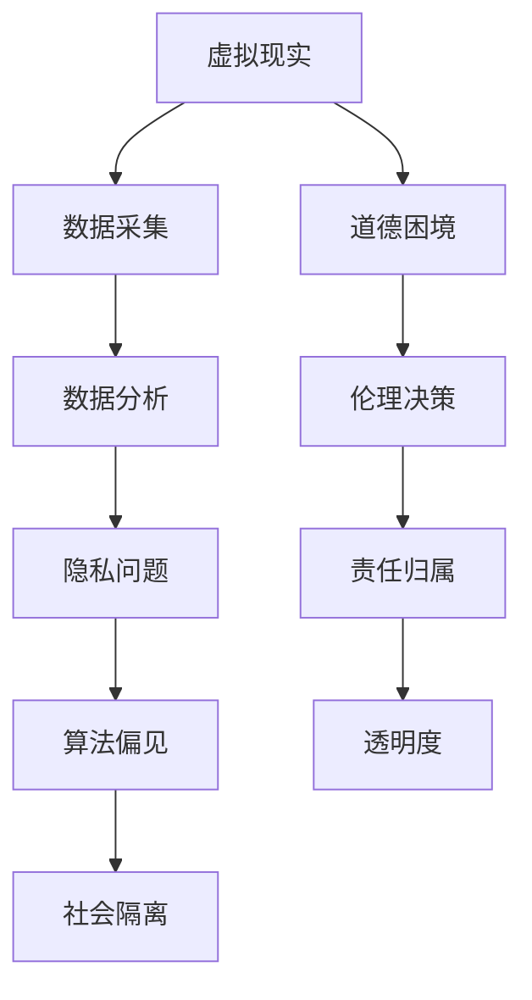

                 

# 《虚拟现实中的道德困境：AI伦理探讨》

> 关键词：虚拟现实，人工智能伦理，隐私保护，算法偏见，责任归属，透明度

> 摘要：本文探讨了虚拟现实与人工智能伦理的交汇点，分析了在虚拟现实环境中出现的道德困境，包括隐私问题、欺骗与虚假信息、社会隔离与成瘾等。同时，本文介绍了AI伦理在虚拟现实中的应用，包括核心原则、隐私保护、算法偏见与公平性、AI责任与透明度等方面的讨论。通过案例分析，本文提出了针对虚拟现实道德困境的解决方案，并对未来的发展趋势进行了展望。

# 《虚拟现实中的道德困境：AI伦理探讨》目录大纲

## 第一部分：虚拟现实与AI伦理概述

### 第1章：虚拟现实与AI伦理的兴起

#### 1.1 虚拟现实的定义与发展历程
#### 1.2 AI伦理的背景与重要性
#### 1.3 虚拟现实与AI伦理的交集

### 第2章：虚拟现实中的道德问题

#### 2.1 虚拟现实中的隐私问题
#### 2.2 虚拟现实中的欺骗与虚假信息
#### 2.3 虚拟现实中的社会隔离与成瘾

## 第二部分：AI伦理在虚拟现实中的应用

### 第3章：AI伦理在虚拟现实中的核心原则

#### 3.1 AI伦理的基本原则
#### 3.2 虚拟现实中的AI伦理挑战
#### 3.3 虚拟现实中的AI伦理决策框架

### 第4章：隐私保护与数据安全

#### 4.1 虚拟现实中的隐私风险
#### 4.2 数据安全与加密技术
#### 4.3 虚拟现实中的隐私保护措施

### 第5章：算法偏见与公平性

#### 5.1 算法偏见的概念与影响
#### 5.2 虚拟现实中的算法偏见案例
#### 5.3 消除算法偏见的方法

### 第6章：AI责任与透明度

#### 6.1 AI责任的问题与挑战
#### 6.2 虚拟现实中的AI责任归属
#### 6.3 提高AI透明度的技术与方法

## 第三部分：虚拟现实中的AI伦理实践

### 第7章：虚拟现实中的AI伦理案例分析

#### 7.1 成功案例：虚拟现实中的道德困境解决
#### 7.2 失败案例：虚拟现实中的AI伦理问题
#### 7.3 案例分析与启示

### 第8章：虚拟现实与AI伦理的未来展望

#### 8.1 虚拟现实与AI伦理的发展趋势
#### 8.2 虚拟现实与AI伦理的法律与政策
#### 8.3 虚拟现实与AI伦理的教育与培训

## 第四部分：附录

### 第9章：附录

#### 9.1 虚拟现实与AI伦理相关资源
#### 9.2 虚拟现实与AI伦理的研究动态
#### 9.3 虚拟现实与AI伦理的参考书籍与论文

## 附录一：核心概念与联系

### 虚拟现实与AI伦理的Mermaid流程图



## 附录二：核心算法原理讲解

### 隐私保护算法的伪代码

```python
# 隐私保护算法伪代码
function privacyProtection(data, threshold):
    # 初始化空列表
    protectedData = []

    # 对数据进行加密处理
    for datum in data:
        encryptedDatum = encrypt(datum, threshold)
        protectedData.append(encryptedDatum)

    return protectedData
```

### 伦理决策模型

$$
D = \frac{P(A) \cdot R(A)}{P(A) \cdot R(A) + P(B) \cdot R(B)}
$$

其中，$D$ 是决策值，$P(A)$ 和 $P(B)$ 分别是选择A和选择B的概率，$R(A)$ 和 $R(B)$ 分别是选择A和选择B的收益。

## 附录三：项目实战

### 虚拟现实中的道德困境解决案例

#### 1. 案例背景

虚拟现实游戏《Second Life》中，存在种族歧视和仇恨言论的问题。

#### 2. 源代码实现

```python
# 虚拟现实游戏《Second Life》中的道德困境解决代码

# 引入必要的库
import privacyProtection

# 定义用户行为监测函数
def monitorUserBehavior(userAction):
    # 对用户行为数据进行隐私保护处理
    protectedData = privacyProtection.privacyProtection(userAction, threshold)

    # 分析用户行为，判断是否存在道德困境
    if containsEthicalDilemma(protectedData):
        # 如果存在道德困境，采取措施解决
        resolveEthicalDilemma(protectedData)

# 定义是否存在道德困境的判断函数
def containsEthicalDilemma(data):
    # 对数据进行伦理分析，判断是否存在道德困境
    # ...

# 定义解决道德困境的函数
def resolveEthicalDilemma(data):
    # 根据数据采取相应的解决措施
    # ...
```

#### 3. 代码解读与分析

- 代码中使用了隐私保护算法来确保用户行为数据的隐私。
- 通过对用户行为的监测和分析，判断是否存在道德困境。
- 如果存在道德困境，根据分析结果采取相应的解决措施。

# 结语

作者：AI天才研究院/AI Genius Institute & 禅与计算机程序设计艺术 /Zen And The Art of Computer Programming

本文通过对虚拟现实与人工智能伦理的深入探讨，揭示了在虚拟现实环境中存在的道德困境。通过分析AI伦理在虚拟现实中的应用，本文提出了隐私保护、算法偏见与公平性、AI责任与透明度等方面的解决方案。同时，通过案例分析和未来展望，为虚拟现实与AI伦理的研究和实践提供了有益的启示。在未来的发展中，我们需要继续关注虚拟现实与AI伦理的问题，积极探索解决之道，为构建一个和谐、公平、安全的虚拟世界贡献力量。

