                 

# 虚拟现实音乐会创业：沉浸式音乐体验

> 关键词：虚拟现实，沉浸式音乐体验，创业，技术实现，商业模式，市场分析

> 摘要：本文将深入探讨虚拟现实音乐会的创业机会，分析沉浸式音乐体验的核心技术，探讨商业模式和市场潜力，并提供创业者所需的实战指南。

## 第一部分：虚拟现实与沉浸式音乐体验基础

### 第1章：虚拟现实技术概述

#### 1.1 虚拟现实技术发展历程

虚拟现实（VR）技术起源于20世纪50年代的计算机模拟领域。自那时以来，VR技术经历了从简单的视觉模拟到复杂的全身感知模拟的演变。20世纪80年代，VR技术开始应用于娱乐、教育和医疗等多个领域。1990年代初，VR设备如VR头盔和手柄问世，为用户提供了初步的沉浸式体验。21世纪初，随着计算机性能的提升和显示技术的进步，VR技术进入了一个新的发展时期。近年来，VR技术的不断成熟，使得沉浸式体验变得更加真实和广泛。特别是5G网络的普及和人工智能的进步，为虚拟现实音乐会提供了前所未有的发展机遇。

#### 1.2 虚拟现实技术核心原理

虚拟现实技术的核心原理包括图像生成、传感器追踪、实时渲染和交互设计。图像生成是通过计算机图形学生成虚拟环境的三维图像。传感器追踪是通过各种传感器（如摄像头、加速度计、陀螺仪等）捕捉用户的运动和头部位置，以实时更新虚拟环境。实时渲染则是通过图形处理器（GPU）快速计算并生成图像，确保虚拟环境与现实世界同步。交互设计则是通过用户界面和输入设备（如手柄、手势识别等）与虚拟环境进行交互。

#### 1.3 沉浸式音乐体验的概念与特点

沉浸式音乐体验是指通过虚拟现实技术，将用户完全沉浸在音乐表演的场景中，提供比传统音乐会更加丰富和真实的听觉和视觉体验。沉浸式音乐体验的特点包括：

1. **空间感**：通过空间音频处理技术，模拟音乐在真实环境中的声音传播效果，提供高度的空间感。
2. **互动性**：用户可以与虚拟音乐家互动，改变音乐的表现形式，甚至参与到音乐创作中。
3. **个人化**：虚拟现实音乐会可以根据用户的喜好和反应，动态调整音乐内容和表现方式。
4. **多维感官**：除了视觉和听觉，还可以通过触觉、嗅觉等感官增强体验，创造更加全面和深刻的沉浸式体验。

### 第2章：沉浸式音乐体验技术基础

#### 2.1 声音的虚拟现实处理

##### 2.1.1 空间混音技术

空间混音技术（Spatial Audio Mixing）是沉浸式音乐体验的关键组成部分。它通过模拟真实环境中声音的传播特性，如反射、折射、吸收等，为用户提供逼真的听觉体验。空间混音技术包括以下步骤：

1. **声音捕获**：通过多个麦克风或虚拟麦克风捕获原始音频信号。
2. **声音预处理**：对音频信号进行去噪、增益等处理，以消除干扰和增强音乐信号。
3. **空间化处理**：通过算法将单声道的音频信号转换为多声道的空间化音频信号，模拟不同声源的位置和距离。
4. **输出**：将处理后的音频信号输出到虚拟现实音频硬件设备，如耳机或扬声器系统。

Mermaid 流程图：

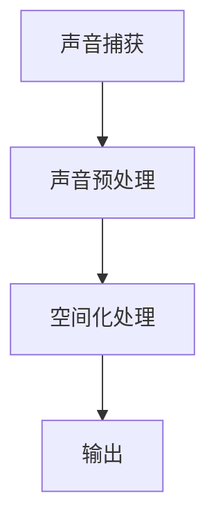

伪代码讲解：

```python
def spatial_audio_mixing(input_audio):
    # 声音捕获
    captured_audio = capture_audio(input_audio)
    # 声音预处理
    preprocessed_audio = preprocess_audio(captured_audio)
    # 空间化处理
    spatial_audio = spatialize_audio(preprocessed_audio)
    # 输出
    output_audio = render_audio(spatial_audio)
    return output_audio
```

##### 2.1.2 声音定位技术

声音定位技术（Audio Localization）是确定声音来源方向的关键技术。它通过分析音频信号的频率、相位和时间差等信息，确定声音在三维空间中的位置。声音定位技术包括以下步骤：

1. **音频信号分析**：分析音频信号的频率、相位和时间差，提取与声音定位相关的特征。
2. **计算时间差**：通过比较不同麦克风接收到的音频信号的时间差，估计声音到达不同麦克风的时间差。
3. **计算声音方向**：根据时间差和音频信号特征，计算声音的方向。
4. **更新用户界面**：根据计算出的声音方向，更新虚拟现实头盔中的声音指向。

Mermaid 流程图：

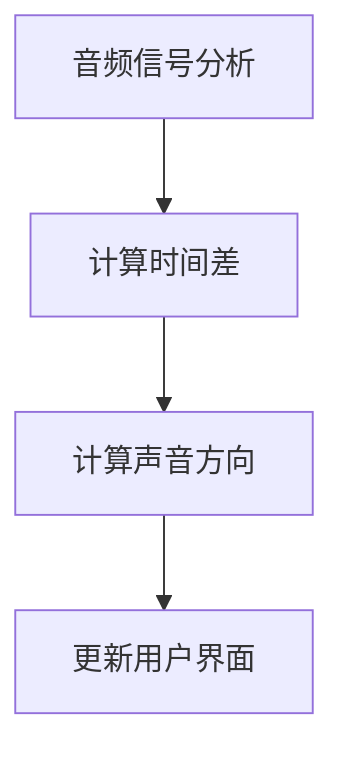

伪代码讲解：

```python
def audio_localization(audio_signal):
    # 音频信号分析
    features = analyze_audio_signal(audio_signal)
    # 计算时间差
    time_difference = calculate_time_difference(features)
    # 计算声音方向
    sound_direction = calculate_direction(time_difference)
    # 更新用户界面
    update_user_interface(sound_direction)
```

##### 2.1.3 声音渲染算法

声音渲染算法（Audio Rendering）是将音频信号转换为虚拟现实环境中的声音效果。它通过空间混音、声音定位和渲染效果调整等步骤，为用户提供逼真的听觉体验。声音渲染算法包括以下步骤：

1. **空间混音**：将原始音频信号通过空间混音技术转换为多声道的空间化音频信号。
2. **声音定位**：通过声音定位技术确定声音在虚拟环境中的位置。
3. **渲染效果调整**：根据用户的喜好和虚拟环境的特点，调整音频信号的音量、均衡和动态范围等参数。
4. **输出**：将渲染后的音频信号输出到虚拟现实音频硬件设备，如耳机或扬声器系统。

Mermaid 流程图：

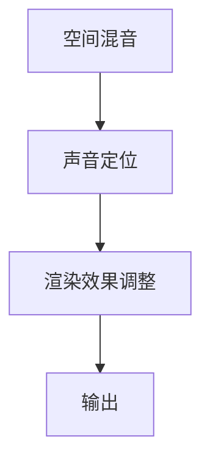

伪代码讲解：

```python
def audio_rendering(audio_signal, user_preferences, virtual_environment):
    # 空间混音
    spatial_audio = spatial_mixing(audio_signal)
    # 声音定位
    sound_direction = audio_localization(spatial_audio)
    # 渲染效果调整
    rendered_audio = adjust_rendering_effects(spatial_audio, sound_direction, user_preferences)
    # 输出
    output_audio = render_audio(rendered_audio)
    return output_audio
```

#### 2.2 虚拟现实音频硬件设备

##### 2.2.1 耳机与扬声器系统

耳机与扬声器系统是沉浸式音乐体验的核心硬件设备。高质量的耳机和扬声器系统可以提供逼真的音频效果，提升用户的沉浸体验。耳机和扬声器系统的主要组成部分包括：

1. **耳机**：包括耳罩、耳垫、驱动单元等，用于捕捉和传输音频信号。
2. **扬声器系统**：包括多个扬声器单元，用于放大和传输音频信号。
3. **音频处理芯片**：用于处理音频信号，实现空间混音、声音定位等功能。

##### 2.2.2 虚拟现实头盔

虚拟现实头盔是用户进入虚拟现实环境的主要入口。高质量的虚拟现实头盔可以提供清晰的视觉和逼真的音频效果，增强用户的沉浸体验。虚拟现实头盔的主要组成部分包括：

1. **显示器**：用于显示虚拟环境的三维图像。
2. **光学系统**：包括透镜和光学元件，用于优化图像的亮度和清晰度。
3. **传感器**：包括摄像头、加速度计、陀螺仪等，用于捕捉用户的头部和身体运动。

##### 2.2.3 运动追踪设备

运动追踪设备用于跟踪用户的头部和身体运动，实时更新虚拟环境中的视角。运动追踪设备的主要组成部分包括：

1. **运动传感器**：包括摄像头、红外发射器等，用于捕捉用户的运动轨迹。
2. **数据处理单元**：用于处理传感器数据，计算用户的运动轨迹。
3. **无线传输模块**：用于将运动轨迹数据传输到虚拟现实头盔或其他设备。

### 第3章：虚拟现实音乐内容创作

#### 3.1 音乐内容的虚拟现实化

音乐内容的虚拟现实化是将传统音乐内容通过虚拟现实技术进行改造，以提供更加沉浸式的音乐体验。音乐内容的虚拟现实化包括以下步骤：

1. **音频信号处理**：对原始音乐信号进行预处理，包括去噪、增益、均衡等，以优化音频质量。
2. **空间混音**：通过空间混音技术，将单声道的音乐信号转换为多声道的空间化音频信号，模拟音乐在真实环境中的声音传播效果。
3. **声音定位**：通过声音定位技术，确定音乐中不同声源的位置和方向。
4. **虚拟现实渲染**：将处理后的音乐信号渲染到虚拟现实环境中，为用户提供逼真的听觉体验。

Mermaid 流程图：

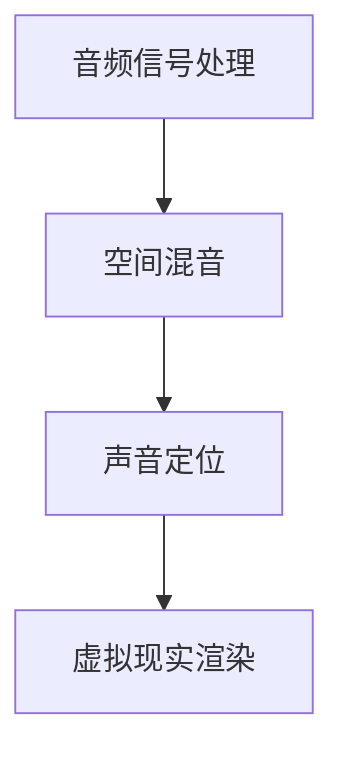

伪代码讲解：

```python
def virtual_reality_music_content(audio_signal):
    # 音频信号处理
    processed_audio = preprocess_audio(audio_signal)
    # 空间混音
    spatial_audio = spatial_mixing(processed_audio)
    # 声音定位
    sound_direction = audio_localization(spatial_audio)
    # 虚拟现实渲染
    rendered_audio = render_audio(spatial_audio, sound_direction)
    return rendered_audio
```

##### 3.1.1 虚拟乐队与虚拟歌手

虚拟乐队与虚拟歌手是通过虚拟现实技术创建的虚拟音乐家，用于在虚拟现实音乐会上进行表演。虚拟乐队与虚拟歌手的创建包括以下步骤：

1. **虚拟角色设计**：设计虚拟乐队成员或虚拟歌手的3D模型，包括外观、服装、动作等。
2. **动作捕捉**：通过动作捕捉设备记录真实的乐队成员或歌手的表演动作，为虚拟角色提供真实的动作表现。
3. **声音采集**：采集真实的乐队成员或歌手的声音，用于虚拟乐队或虚拟歌手的表演。
4. **虚拟现实渲染**：将虚拟角色和声音渲染到虚拟现实环境中，为用户提供逼真的表演体验。

Mermaid 流程图：

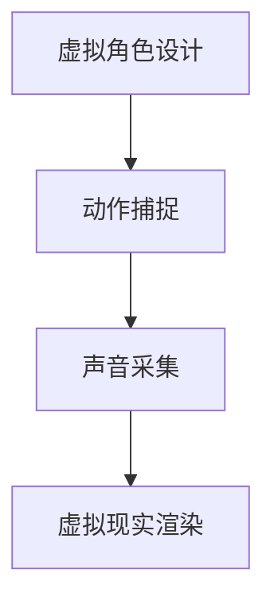

伪代码讲解：

```python
def virtual_band_or_singer(role_design, action_capture, voice_capture):
    # 虚拟角色设计
    virtual_role = design_role(role_design)
    # 动作捕捉
    action_data = capture_action(action_capture)
    # 声音采集
    voice_data = capture_voice(voice_capture)
    # 虚拟现实渲染
    rendered_performance = render_performance(virtual_role, action_data, voice_data)
    return rendered_performance
```

##### 3.1.2 沉浸式音乐视频制作

沉浸式音乐视频制作是将音乐表演与虚拟现实技术相结合，创建一种全新的音乐表演形式。沉浸式音乐视频制作包括以下步骤：

1. **音乐视频拍摄**：通过虚拟现实摄像机拍摄音乐表演的场景，包括乐队成员、虚拟歌手和观众等。
2. **场景渲染**：将拍摄到的场景渲染到虚拟现实环境中，包括空间化音频处理和声音定位。
3. **后期制作**：对渲染后的视频进行剪辑、调色、添加特效等后期处理，以提升视觉效果。
4. **虚拟现实输出**：将处理后的视频输出到虚拟现实头盔或显示器上，为用户提供沉浸式的音乐视频体验。

Mermaid 流程图：

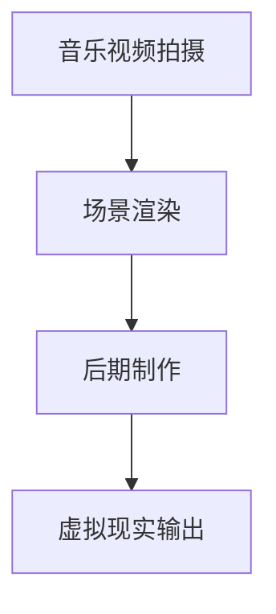

伪代码讲解：

```python
def immersive_music_video(shooting, scene_rendering, post_production):
    # 音乐视频拍摄
    captured_video = shoot_video(shooting)
    # 场景渲染
    rendered_video = render_scene(captured_video)
    # 后期制作
    processed_video = post_production(rendered_video)
    # 虚拟现实输出
    output_video = render_to_vr(processed_video)
    return output_video
```

##### 3.1.3 虚拟现实音乐互动设计

虚拟现实音乐互动设计是将用户与虚拟现实音乐会场景进行交互，提供更加丰富和个性化的音乐体验。虚拟现实音乐互动设计包括以下步骤：

1. **用户交互设计**：设计用户与虚拟现实音乐会场景的交互方式，包括手势识别、语音控制等。
2. **互动功能实现**：实现用户与虚拟现实音乐会场景的交互功能，如改变音乐节奏、调整音量、与虚拟音乐家互动等。
3. **用户反馈**：收集用户的反馈信息，根据用户的喜好和行为，动态调整音乐内容和互动方式。
4. **用户体验优化**：根据用户反馈，优化虚拟现实音乐互动设计，提高用户的沉浸感和满意度。

Mermaid 流程图：

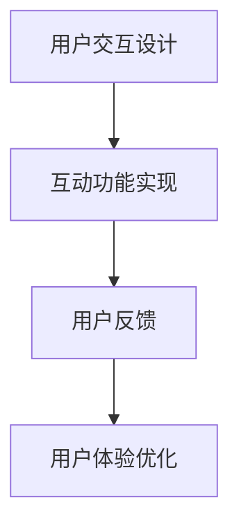

伪代码讲解：

```python
def virtual_reality_music_interactive_design(交互设计, interactive_function, user_feedback, user_experience):
    # 用户交互设计
    user_interaction = design_user_interaction(交互设计)
    # 互动功能实现
    interactive_functions = implement_interactive_functions(互动功能实现)
    # 用户反馈
    feedback = collect_user_feedback(user_feedback)
    # 用户体验优化
    optimized_design = optimize_user_experience(user_interaction, interactive_functions, feedback)
    return optimized_design
```

### 第4章：虚拟现实音乐会商业模式分析

#### 4.1 虚拟现实音乐会的市场潜力

虚拟现实音乐会作为一种新兴的音乐表演形式，具有巨大的市场潜力。随着虚拟现实技术的不断成熟和消费者对沉浸式体验需求的增加，虚拟现实音乐会市场呈现出快速增长的趋势。以下是虚拟现实音乐会的市场潜力分析：

1. **消费者需求**：随着虚拟现实技术的普及，越来越多的消费者对沉浸式音乐体验产生了浓厚的兴趣。虚拟现实音乐会提供了比传统音乐会更加丰富和真实的听觉和视觉体验，吸引了大量音乐爱好者的关注。
2. **技术进步**：虚拟现实技术的不断进步，使得虚拟现实音乐会的内容和形式更加多样化和逼真。高质量的虚拟现实头盔、耳机和扬声器系统为用户提供更加逼真的沉浸体验，推动了虚拟现实音乐会市场的发展。
3. **市场容量**：虚拟现实音乐会市场容量巨大。根据市场研究机构的预测，全球虚拟现实市场规模将在未来几年内持续增长，为虚拟现实音乐会提供了广阔的发展空间。

#### 4.2 消费者需求分析

虚拟现实音乐会的主要消费者包括以下几类：

1. **音乐爱好者**：音乐爱好者是虚拟现实音乐会的核心消费者。他们对音乐有浓厚的兴趣，追求高质量的音乐体验。虚拟现实音乐会为他们提供了更加丰富和真实的音乐体验，满足了他们的需求。
2. **技术爱好者**：技术爱好者对虚拟现实技术充满好奇，追求最新科技体验。虚拟现实音乐会为他们提供了一个结合音乐和科技的全新娱乐方式，吸引了他们的关注。
3. **年轻一代**：年轻一代是虚拟现实音乐会的重要消费者。他们成长在数字时代，对新技术和新体验有较高的接受度和探索欲望。虚拟现实音乐会为他们提供了一个新颖的娱乐方式，吸引了他们的兴趣。

#### 4.3 行业竞争格局

虚拟现实音乐会行业目前处于快速发展阶段，市场竞争格局尚未完全形成。以下是虚拟现实音乐会行业的竞争格局分析：

1. **国内外企业竞争**：国内外企业都在虚拟现实音乐会领域进行了积极的布局和探索。国内企业如腾讯、阿里巴巴等在虚拟现实技术和内容制作方面具有较强的优势，而国外企业如Facebook、谷歌等在虚拟现实技术和硬件设备方面具有领先地位。
2. **内容创作者竞争**：虚拟现实音乐会的核心竞争力在于内容和体验。因此，内容创作者之间的竞争尤为激烈。一些知名音乐人、音乐制作人和虚拟现实公司纷纷推出自己的虚拟现实音乐会项目，争夺市场份额。
3. **平台竞争**：虚拟现实音乐会平台也成为了行业竞争的重要领域。一些大型互联网公司如腾讯、阿里巴巴等推出了自己的虚拟现实音乐会平台，提供在线观看和互动功能，争夺用户资源。

#### 4.4 营销策略与渠道

虚拟现实音乐会的营销策略和渠道选择对市场推广至关重要。以下是虚拟现实音乐会营销策略与渠道分析：

1. **线上营销**：线上营销是虚拟现实音乐会推广的主要渠道。通过社交媒体平台、音乐平台、虚拟现实平台等，发布虚拟现实音乐会的预告、花絮和演出内容，吸引消费者的关注。同时，通过线上广告和推广活动，提高虚拟现实音乐会的知名度和吸引力。
2. **线下活动**：线下活动是虚拟现实音乐会营销的重要补充。通过举办虚拟现实音乐会的发布会、体验活动、音乐会现场表演等，让消费者亲身体验虚拟现实音乐会的魅力，提高消费者的购买意愿。
3. **合作伙伴**：虚拟现实音乐会可以与音乐制作公司、演出公司、虚拟现实设备制造商等建立合作伙伴关系，共同推广虚拟现实音乐会项目。通过合作伙伴的资源和渠道，扩大虚拟现实音乐会的影响力和市场占有率。

### 第5章：虚拟现实音乐会技术实现

#### 5.1 音乐会虚拟场景设计

音乐会虚拟场景设计是虚拟现实音乐会的重要环节，直接影响用户的沉浸体验。音乐会虚拟场景设计包括以下步骤：

1. **场景建模**：通过三维建模软件创建音乐会的虚拟场景，包括舞台、观众席、灯光效果等。场景建模要考虑真实场景的细节和比例，确保虚拟场景的逼真度。
2. **场景渲染**：将场景建模数据导入虚拟现实引擎，进行场景渲染。场景渲染要考虑光影效果、材质表现等，提升虚拟场景的视觉效果。
3. **互动元素设计**：在虚拟场景中设计互动元素，如虚拟音乐家、虚拟观众、互动道具等。互动元素要具有真实感和互动性，增强用户的沉浸体验。
4. **场景优化**：对虚拟场景进行性能优化，包括降低场景模型复杂度、优化渲染管线等，提高虚拟场景的运行效率和流畅度。

Mermaid 流程图：

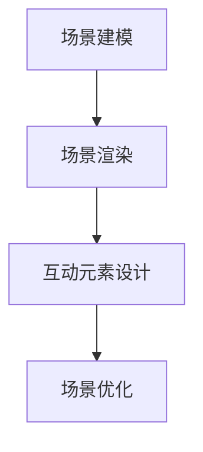

伪代码讲解：

```python
def virtual_concert_scene_design(modeling, rendering, interactive_elements, optimization):
    # 场景建模
    scene_model = model_scene(modeling)
    # 场景渲染
    rendered_scene = render_scene(rendering, scene_model)
    # 互动元素设计
    interactive_elements = design_interactive_elements(interactive_elements)
    # 场景优化
    optimized_scene = optimize_scene(optimization, rendered_scene)
    return optimized_scene
```

##### 5.1.1 虚拟舞台设计

虚拟舞台设计是音乐会虚拟场景设计的关键部分，直接影响音乐表演的效果。虚拟舞台设计包括以下步骤：

1. **舞台布局**：设计虚拟舞台的布局，包括舞台大小、形状、灯光布局等。舞台布局要考虑音乐表演的需求和观众的观看体验。
2. **舞台效果**：设计虚拟舞台的特效，如投影、灯光秀、烟雾等。舞台效果要符合音乐表演的主题和氛围。
3. **互动设计**：在虚拟舞台上设计互动元素，如虚拟乐器、虚拟观众互动等。互动设计要增强音乐表演的互动性和趣味性。
4. **优化性能**：对虚拟舞台进行性能优化，确保虚拟舞台的运行效率和流畅度。

Mermaid 流程图：

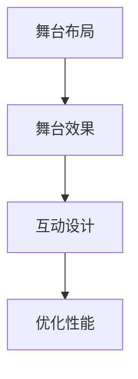

伪代码讲解：

```python
def virtual_stage_design(stage_layout, stage_effects, interactive_design, performance_optimization):
    # 舞台布局
    stage_layout = design_stage_layout(stage_layout)
    # 舞台效果
    stage_effects = design_stage_effects(stage_effects)
    # 互动设计
    interactive_design = design_interactive_elements(interactive_design)
    # 优化性能
    optimized_stage = optimize_stage_performance(performance_optimization)
    return optimized_stage
```

##### 5.1.2 虚拟观众席设计

虚拟观众席设计是音乐会虚拟场景设计的重要组成部分，直接影响观众的沉浸体验。虚拟观众席设计包括以下步骤：

1. **观众席布局**：设计虚拟观众席的布局，包括座位数量、座位分布、视角等。观众席布局要考虑观众观看体验和音乐会现场的需求。
2. **观众互动**：设计虚拟观众席的互动元素，如观众互动游戏、观众互动投票等。观众互动要增强观众的参与感和沉浸体验。
3. **场景渲染**：对虚拟观众席进行场景渲染，包括观众模型、观众行为等。场景渲染要确保虚拟观众席的真实感和互动性。
4. **性能优化**：对虚拟观众席进行性能优化，确保虚拟观众席的运行效率和流畅度。

Mermaid 流程图：

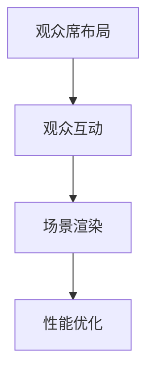

伪代码讲解：

```python
def virtual_venue_design(venue_layout, interactive_design, scene_rendering, performance_optimization):
    # 观众席布局
    venue_layout = design_venue_layout(venue_layout)
    # 观众互动
    interactive_design = design_interactive_elements(interactive_design)
    # 场景渲染
    rendered_venue = render_venue(scene_rendering, venue_layout)
    # 性能优化
    optimized_venue = optimize_venue_performance(performance_optimization, rendered_venue)
    return optimized_venue
```

##### 5.1.3 音乐会互动功能开发

音乐会互动功能开发是虚拟现实音乐会的重要环节，提供用户与虚拟现实音乐会场景的互动体验。音乐会互动功能开发包括以下步骤：

1. **交互设计**：设计用户与虚拟现实音乐会场景的交互方式，如手势识别、语音控制、触摸等。交互设计要考虑用户的操作习惯和虚拟现实技术的特点。
2. **功能实现**：实现用户与虚拟现实音乐会场景的交互功能，如改变音乐节奏、调整音量、与虚拟音乐家互动等。功能实现要确保交互的实时性和流畅性。
3. **用户体验优化**：根据用户反馈，优化音乐会互动功能，提高用户的沉浸感和满意度。用户体验优化包括界面设计、操作流程、反馈机制等。
4. **性能优化**：对音乐会互动功能进行性能优化，确保功能的运行效率和流畅度。

Mermaid 流�程图：

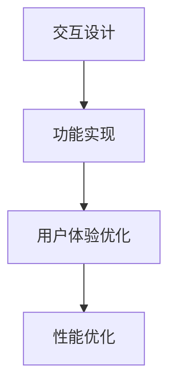

伪代码讲解：

```python
def interactive_function_development(交互设计, 功能实现, user_experience_optimization, performance_optimization):
    # 交互设计
    user_interactions = design_user_interactions(交互设计)
    # 功能实现
    interactive_functions = implement_interactive_functions(功能实现)
    # 用户体验优化
    optimized_user_experience = optimize_user_experience(user_experience_optimization)
    # 性能优化
    optimized_interactive_functions = optimize_performance(performance_optimization, interactive_functions)
    return optimized_interactive_functions
```

#### 5.2 音乐会虚拟现实系统架构

音乐会虚拟现实系统架构是虚拟现实音乐会的核心组成部分，决定了音乐会的性能和稳定性。音乐会虚拟现实系统架构包括以下层次：

1. **硬件层**：包括虚拟现实头盔、耳机、运动追踪设备等硬件设备。硬件层负责音频和视频的输入输出，以及用户动作的捕捉和反馈。
2. **音频层**：包括音频处理模块，负责音频信号的捕获、预处理、空间混音和声音渲染。音频层要确保音频效果的逼真度和实时性。
3. **视频层**：包括视频处理模块，负责视频信号的捕获、预处理、渲染和输出。视频层要确保视频画面的清晰度和流畅度。
4. **交互层**：包括用户交互模块，负责用户与虚拟现实音乐会场景的交互。交互层要确保交互的实时性和流畅性。
5. **内容层**：包括音乐会内容模块，负责音乐表演的虚拟现实化处理。内容层要确保音乐内容的多样性和逼真度。
6. **网络层**：包括网络通信模块，负责虚拟现实音乐会场景的数据传输和同步。网络层要确保网络的稳定性和低延迟。

Mermaid 流程图：

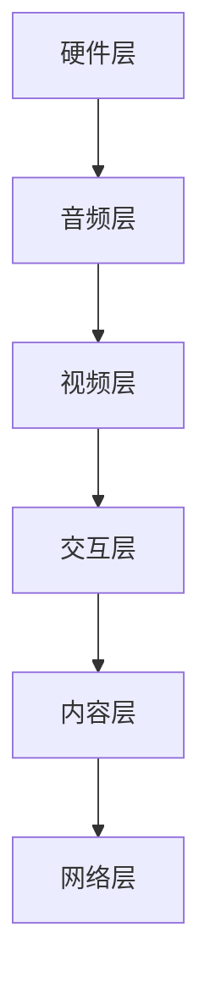

伪代码讲解：

```python
def virtual_concert_system_architecture(hardware_layer, audio_layer, video_layer, interaction_layer, content_layer, network_layer):
    # 硬件层
    hardware_devices = setup_hardware_layer(hardware_layer)
    # 音频层
    audio_system = setup_audio_layer(audio_layer)
    # 视频层
    video_system = setup_video_layer(video_layer)
    # 交互层
    interaction_system = setup_interaction_layer(interaction_layer)
    # 内容层
    content_system = setup_content_layer(content_layer)
    # 网络层
    network_system = setup_network_layer(network_layer)
    # 系统整合
    integrated_system = integrate_system(hardware_devices, audio_system, video_system, interaction_system, content_system, network_system)
    return integrated_system
```

### 第6章：虚拟现实音乐会案例分析

#### 6.1 国内外虚拟现实音乐会成功案例

国内外虚拟现实音乐会的成功案例众多，以下列举几个具有代表性的案例：

##### 6.1.1 VR/AR音乐节

VR/AR音乐节是将虚拟现实和增强现实技术应用于音乐节，为观众提供全新的视听体验。VR/AR音乐节的成功案例包括：

1. **虚拟音乐节**：通过虚拟现实技术，将全球各地的音乐节场景虚拟化，观众可以在虚拟环境中观看音乐表演，享受沉浸式的音乐体验。
2. **增强现实音乐会**：通过增强现实技术，将音乐表演与真实环境相结合，观众可以在现实世界中看到虚拟音乐家的表演。

##### 6.1.2 虚拟歌手演唱会

虚拟歌手演唱会是通过虚拟现实技术创建虚拟音乐家进行表演，为观众带来全新的视听体验。虚拟歌手演唱会成功案例包括：

1. **虚拟偶像演唱会**：通过虚拟现实技术，将虚拟偶像的音乐表演虚拟化，观众可以在虚拟环境中观看虚拟偶像的表演。
2. **虚拟歌手直播**：通过虚拟现实技术，将虚拟歌手的直播场景虚拟化，观众可以通过虚拟现实头盔观看虚拟歌手的直播。

##### 6.1.3 线上音乐会互动平台

线上音乐会互动平台是将虚拟现实技术应用于线上音乐会，为观众提供互动体验。线上音乐会互动平台成功案例包括：

1. **虚拟音乐会直播**：通过虚拟现实技术，将音乐会的直播场景虚拟化，观众可以通过虚拟现实头盔观看音乐会直播。
2. **线上互动音乐会**：通过虚拟现实技术，观众可以在虚拟音乐会场景中与其他观众互动，改变音乐表演的形式和内容。

#### 6.2 案例分析与启示

通过分析国内外虚拟现实音乐会成功案例，可以得出以下启示：

1. **技术创新**：虚拟现实音乐会的成功离不开技术创新。空间混音、声音定位、虚拟现实头盔等技术为虚拟现实音乐会提供了强大的技术支持，提升了观众的沉浸体验。
2. **内容创新**：虚拟现实音乐会的成功还依赖于内容创新。虚拟偶像、虚拟乐队、互动音乐游戏等新型音乐内容为观众带来了全新的视听体验，吸引了大量观众的关注。
3. **商业模式创新**：虚拟现实音乐会通过线上直播、虚拟演唱会、互动平台等新型商业模式，打破了传统音乐会的时空限制，为观众提供了更加灵活和便捷的音乐体验。
4. **用户体验**：虚拟现实音乐会的成功离不开良好的用户体验。虚拟现实音乐会的互动性、个性化、多维感官等特点，为观众提供了全新的音乐体验，增强了观众的参与感和满意度。

### 第7章：虚拟现实音乐会创业指南

#### 7.1 创业初期准备

虚拟现实音乐会创业初期需要做好充分的准备，以下是一些关键步骤：

##### 7.1.1 团队组建

团队组建是虚拟现实音乐会创业的重要环节。创业者需要组建一支具有多方面技能的团队，包括虚拟现实技术专家、音乐制作专家、市场营销专家等。团队成员要具备良好的合作精神和创新能力，共同推动虚拟现实音乐会的研发和推广。

##### 7.1.2 资金筹集

虚拟现实音乐会创业需要大量的资金投入，包括硬件设备采购、软件开发、市场营销等。创业者可以通过风险投资、政府资助、众筹等渠道筹集资金。在筹集资金时，创业者需要准备详细的商业计划书，展示项目的市场潜力、技术优势和盈利模式。

##### 7.1.3 市场调研

市场调研是虚拟现实音乐会创业的重要步骤。创业者需要对目标市场进行深入研究，了解消费者的需求和偏好，分析竞争对手的优势和不足，为虚拟现实音乐会项目的定位和推广策略提供依据。

#### 7.2 运营与推广策略

虚拟现实音乐会创业的运营与推广策略至关重要，以下是一些关键点：

##### 7.2.1 音乐会策划与执行

音乐会策划与执行是虚拟现实音乐会运营的核心环节。创业者需要精心策划音乐会的主题、形式和内容，确保音乐会的独特性和吸引力。在音乐会执行过程中，创业者需要确保技术设备的正常运行，提供高质量的沉浸式音乐体验。

##### 7.2.2 社交媒体营销

社交媒体营销是虚拟现实音乐会推广的重要渠道。创业者可以通过微信公众号、微博、抖音、快手等社交媒体平台，发布虚拟现实音乐会的预告、花絮和演出内容，吸引消费者的关注。同时，创业者可以通过社交媒体进行互动，收集消费者的反馈，优化虚拟现实音乐会的内容和形式。

##### 7.2.3 用户互动与反馈

用户互动与反馈是虚拟现实音乐会运营的重要环节。创业者需要通过虚拟现实音乐会场景中的互动元素，与用户进行实时互动，提高用户的参与感和满意度。在音乐会结束后，创业者需要收集用户的反馈信息，分析用户的喜好和需求，为后续的音乐会策划和运营提供依据。

#### 7.3 创业者需注意的法律问题

虚拟现实音乐会创业涉及多个法律问题，以下是一些关键点：

##### 7.3.1 著作权保护

虚拟现实音乐会中涉及的音乐、视频、图像等内容需要遵守著作权法。创业者需要确保音乐、视频、图像等内容的版权归属明确，避免侵犯他人的著作权。在音乐会策划和推广过程中，创业者需要遵守著作权法的相关规定，避免侵权行为。

##### 7.3.2 隐私保护

虚拟现实音乐会中涉及的用户数据和隐私保护问题需要引起重视。创业者需要建立健全的用户隐私保护机制，确保用户的个人信息不会被泄露或滥用。在用户互动和反馈过程中，创业者需要告知用户隐私保护的措施和范围，提高用户的信任感。

##### 7.3.3 合同法律风险

虚拟现实音乐会创业过程中涉及多个合同，如供应商合同、合作伙伴合同、员工劳动合同等。创业者需要确保合同内容的合法性和合理性，避免合同纠纷和法律风险。在签订合同前，创业者需要仔细审查合同条款，确保自己的合法权益得到保护。

### 第三部分：虚拟现实音乐会未来发展趋势

#### 8.1 新型VR/AR设备与技术

随着虚拟现实技术的不断发展，新型VR/AR设备与技术将不断涌现，为虚拟现实音乐会带来更多的可能性。以下是一些新型VR/AR设备与技术的展望：

##### 8.1.1 全息投影

全息投影技术是一种将三维图像投影到空中，形成立体影像的技术。未来，全息投影技术有望在虚拟现实音乐会上得到广泛应用，为观众带来更加逼真的音乐表演体验。

##### 8.1.2 空间音频

空间音频技术是一种通过多通道音频信号处理，模拟真实环境中声音传播效果的技术。未来，空间音频技术将进一步提升虚拟现实音乐会的沉浸体验，为观众带来更加真实的听觉感受。

##### 8.1.3 脑机接口

脑机接口技术是一种将大脑信号转换为计算机指令的技术。未来，脑机接口技术有望实现用户通过思维控制虚拟现实音乐会中的音乐表演，为观众带来更加个性化和互动的音乐体验。

#### 8.2 音乐与虚拟现实融合的创新形式

音乐与虚拟现实技术的融合将创造出一系列创新形式，为虚拟现实音乐会带来更多的发展机遇。以下是一些创新形式的展望：

##### 8.2.1 虚拟现实音乐游戏

虚拟现实音乐游戏是一种将音乐与虚拟现实技术相结合的游戏形式。玩家可以在虚拟环境中演奏乐器、创作音乐，与其他玩家互动，享受音乐与游戏的乐趣。

##### 8.2.2 虚拟现实音乐剧

虚拟现实音乐剧是一种将音乐剧与虚拟现实技术相结合的表演形式。虚拟现实技术将为观众带来全新的观演体验，使音乐剧更加生动和互动。

##### 8.2.3 虚拟现实音乐治疗

虚拟现实音乐治疗是一种将音乐与虚拟现实技术相结合的治疗形式。虚拟现实技术将创造一种新的音乐治疗环境，帮助患者缓解压力、改善情绪。

#### 8.3 虚拟现实音乐会市场规模预测

随着虚拟现实技术的不断成熟和消费者对沉浸式体验需求的增加，虚拟现实音乐会市场规模将呈现出快速增长的趋势。以下是对虚拟现实音乐会市场规模的预测：

##### 8.3.1 市场规模与增长率

根据市场研究机构的预测，全球虚拟现实音乐会市场规模将在未来几年内持续增长。预计到2025年，全球虚拟现实音乐会市场规模将达到数十亿美元，年复合增长率达到20%以上。

##### 8.3.2 潜在市场机会

虚拟现实音乐会的潜在市场机会包括：

1. **演唱会市场**：虚拟现实音乐会将为演唱会市场带来新的机遇，吸引大量演唱会观众。
2. **音乐教育市场**：虚拟现实音乐会将为音乐教育市场带来创新的教学模式，提高音乐学习效果。
3. **音乐旅游市场**：虚拟现实音乐会将吸引音乐爱好者前往虚拟音乐会现场，带动音乐旅游市场的发展。

##### 8.3.3 行业发展趋势

虚拟现实音乐会行业的发展趋势包括：

1. **技术融合**：虚拟现实技术与其他技术的融合，如人工智能、大数据等，将进一步提升虚拟现实音乐会的沉浸体验。
2. **内容创新**：虚拟现实音乐会将不断推出新的内容形式，满足消费者的多样化需求。
3. **商业模式创新**：虚拟现实音乐会将探索新的商业模式，如虚拟演唱会、线上互动音乐会等，提高盈利能力。

### 第10章：虚拟现实音乐会创业的机会与挑战

#### 10.1 技术挑战与突破

虚拟现实音乐会创业面临着一系列技术挑战，但同时也存在着突破的机会。以下是一些主要的技术挑战与突破：

##### 10.1.1 渲染效率

虚拟现实音乐会中，场景的渲染效率是一个重要的技术挑战。高质量的音频和视频渲染需要大量的计算资源，对硬件性能提出了较高的要求。为了提高渲染效率，可以采取以下措施：

1. **优化渲染算法**：通过优化空间混音、声音定位和图像渲染等算法，减少计算复杂度，提高渲染速度。
2. **硬件加速**：利用GPU和其他硬件加速技术，提高渲染效率，减轻CPU的负担。
3. **并行计算**：通过并行计算技术，将渲染任务分布到多个计算节点上，提高整体渲染速度。

##### 10.1.2 网络延迟

虚拟现实音乐会中，网络延迟是影响用户体验的重要因素。为了保证实时性和互动性，需要采取以下措施：

1. **优化网络架构**：通过优化网络架构和协议，减少数据传输的延迟和抖动。
2. **内容分发**：通过内容分发网络（CDN）等技术，将虚拟现实音乐会的数据分发到全球各地的节点，降低用户的网络延迟。
3. **边缘计算**：通过边缘计算技术，将部分计算任务转移到网络边缘，减少数据传输的距离和时间。

##### 10.1.3 硬件成本

虚拟现实音乐会创业需要大量的硬件设备，包括虚拟现实头盔、耳机、运动追踪设备等。硬件成本是一个重要的经济挑战。为了降低硬件成本，可以采取以下措施：

1. **规模化生产**：通过规模化生产，降低硬件设备的单位成本。
2. **技术创新**：通过技术创新，研发出更加高效、低成本的硬件设备。
3. **租赁模式**：通过租赁模式，降低创业者的硬件投入，提高设备的利用效率。

#### 10.2 市场挑战与应对策略

虚拟现实音乐会创业不仅面临技术挑战，还面临一系列市场挑战。以下是一些主要的

