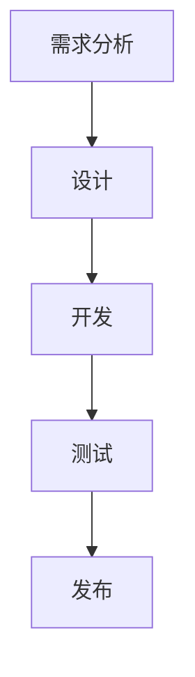
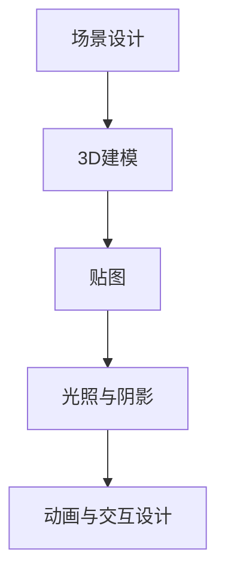
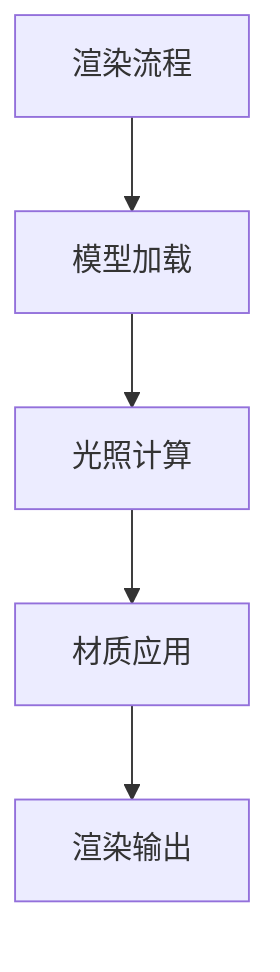

                 

# 文章标题：虚拟现实（VR）开发：沉浸式体验设计

## 关键词：虚拟现实（VR），沉浸式体验设计，VR技术基础，VR硬件设备，VR内容制作，VR软件开发

## 摘要

虚拟现实（VR）技术作为一种新兴的交互技术，正迅速改变着人们的数字体验方式。本文从虚拟现实（VR）技术的基础概念、硬件设备、内容制作、软件开发等方面进行了全面阐述，旨在为开发者提供系统、详细的VR开发指南。通过本篇文章，读者可以了解VR技术的核心原理，掌握VR硬件设备的选择与配置，学习VR内容的设计与制作方法，以及掌握VR软件开发的流程和关键技术。本文不仅涵盖了VR技术的理论基础，还通过实际案例展示了VR应用的实现过程，旨在帮助读者从理论到实践全面提升VR开发能力。

## 第一部分：虚拟现实（VR）技术基础

### 第1章：虚拟现实（VR）概述

#### 1.1 虚拟现实（VR）的发展历程

虚拟现实（VR）技术起源于20世纪50年代，当时主要是科幻小说和电影中的概念。直到20世纪90年代，随着计算机技术、显示技术和传感技术的进步，虚拟现实技术逐渐从理论研究走向实际应用。早期的VR设备主要是由计算机生成的三维图形，通过头盔显示器来呈现。随着时间的推移，VR技术的硬件和软件都得到了极大的发展，特别是在2010年后，随着高性能计算、传感技术和移动设备的普及，VR技术迎来了新一轮的发展高潮。如今，VR技术在游戏、教育、医疗、军事等领域都有广泛的应用。

##### **1.1.1 虚拟现实的概念**

虚拟现实（Virtual Reality，简称VR）是一种通过计算机技术创造的模拟环境，使用户在视觉、听觉、触觉等多个感官上感受到身临其境的体验。VR技术的基本原理是通过头戴式显示器（HMD）或其他显示设备，向用户展示三维虚拟世界，并利用传感器跟踪用户头部和手部的运动，从而实现用户与环境之间的互动。

##### **1.1.2 虚拟现实技术的发展历程**

虚拟现实技术的发展可以分为以下几个阶段：

1. **早期概念阶段（1950s-1960s）**：虚拟现实的概念首次在科幻小说和电影中提出，如《2001太空漫游》中的“VR实验室”。
2. **研究阶段（1960s-1970s）**：VR技术开始出现在学术界的研究中，美国斯坦福研究院开发了第一台VR设备“达摩克利斯之剑”。
3. **技术探索阶段（1980s-1990s）**：VR技术逐渐走向商业化，如任天堂的Virtual Boy游戏机和索尼的VR机。
4. **快速发展阶段（2000s-2010s）**：随着计算机性能的提升和3D显示技术的发展，VR技术开始应用于军事、医学等领域。
5. **商业化阶段（2010s-至今）**：2010年后，VR技术迎来了商业化浪潮，以Oculus Rift、HTC Vive和Google Cardboard为代表的VR设备纷纷面世。

##### **1.1.3 虚拟现实技术的发展趋势**

未来的VR技术将向以下几个方向发展：

1. **更高分辨率和更小的延迟**：随着显示技术和计算技术的发展，VR设备的分辨率将进一步提高，延迟将大幅降低，从而提供更加逼真的沉浸体验。
2. **更广泛的应用领域**：VR技术将在教育、医疗、娱乐、设计、建筑、工程等更多领域得到应用。
3. **更自然的人机交互**：通过手势识别、语音识别等技术，实现更加自然的人机交互方式。
4. **与其他技术的融合**：VR技术与人工智能、增强现实（AR）、物联网（IoT）等技术的融合，将带来更多的创新应用。

#### 1.2 虚拟现实的核心技术

虚拟现实（VR）技术依赖于多种核心技术的支持，主要包括显示技术、传感技术和交互技术。

##### **1.2.1 显示技术**

显示技术是VR体验的基础，其性能直接影响到用户的沉浸感。常见的显示技术包括：

1. **头戴式显示器（HMD）**：头戴式显示器是VR体验的核心设备，通过遮挡真实世界，将用户带入虚拟环境中。常见的HMD设备有Oculus Rift、HTC Vive和Google Daydream等。
2. **OLED技术**：有机发光二极管（OLED）是一种自发光的显示技术，具有高对比度、高分辨率和快速响应时间，非常适合用于VR设备。
3. **光学镜片技术**：光学镜片技术用于调整光线，使得虚拟图像更加清晰、失真度更低。高质量的光学镜片能够提升用户的视觉体验。

##### **1.2.2 传感技术**

传感技术用于跟踪用户的头部运动和手部动作，从而实现用户与虚拟环境的互动。常见的传感技术包括：

1. **头部追踪技术**：头部追踪技术通过摄像头或红外传感器跟踪用户的头部运动，确保虚拟图像与用户视线同步。
2. **手部追踪技术**：手部追踪技术通过摄像头或深度传感器跟踪用户手部的位置和动作，使得用户可以在虚拟环境中进行手势交互。
3. **运动传感器**：运动传感器如加速度计和陀螺仪可以用于检测用户的运动状态，为虚拟现实提供更精确的运动追踪。

##### **1.2.3 交互技术**

交互技术是用户与虚拟环境进行互动的关键，主要包括以下几种：

1. **手势交互**：手势交互通过识别用户的手部动作，实现虚拟环境中的操作。例如，挥动手臂可以移动虚拟物体，或者做出特定的手势来控制虚拟设备。
2. **语音交互**：语音交互通过语音识别技术实现，用户可以通过语音命令控制虚拟环境中的对象。例如，说出“打开门”即可打开虚拟房间的大门。
3. **虚拟键盘**：虚拟键盘通过在虚拟环境中显示键盘，用户可以使用手指在键盘上进行输入。这种交互方式适用于需要在虚拟环境中输入文本的场景。

#### 1.3 虚拟现实的应用领域

虚拟现实（VR）技术具有广泛的应用前景，可以在多个领域带来革命性的变化。以下是一些主要的应用领域：

##### **1.3.1 游戏娱乐**

VR技术在游戏娱乐领域取得了巨大的成功。通过VR游戏，玩家可以在一个完全沉浸式的环境中体验游戏，感受更加真实的游戏体验。VR游戏可以模拟各种场景，如虚拟现实格斗、飞行模拟、探险等，给玩家带来前所未有的娱乐体验。

##### **1.3.2 教育培训**

VR技术在教育培训领域也有广泛的应用。通过VR技术，学生可以进入虚拟的教室、实验室或历史场景，进行互动式学习。这种沉浸式学习方式可以增强学生的学习兴趣，提高学习效果。此外，VR技术还可以用于职业培训，如医学培训、军事训练等，提供逼真的训练环境。

##### **1.3.3 医疗健康**

VR技术在医疗健康领域有着重要的应用价值。医生可以通过VR技术进行手术模拟，提高手术技能和安全性。患者也可以通过VR技术进行康复训练，如物理治疗、心理治疗等，提高康复效果。此外，VR技术还可以用于医学教育，帮助学生更好地理解复杂的医学知识。

##### **1.3.4 工业应用**

VR技术在工业领域也有广泛的应用。设计师可以使用VR技术进行产品设计和预览，提高设计效率和准确性。工程师可以使用VR技术进行设备维护和故障排除，提高工作效率。此外，VR技术还可以用于工业培训，如机械操作、焊接技能培训等，为员工提供安全、高效的培训环境。

##### **1.3.5 军事应用**

VR技术在军事领域有着重要的应用价值。士兵可以通过VR技术进行战术训练、模拟战斗等，提高战斗技能和反应速度。此外，VR技术还可以用于模拟战争场景，为军事决策提供科学依据。

#### 1.4 虚拟现实与增强现实（AR）的区别

虚拟现实（VR）和增强现实（AR）都是通过计算机技术创造出来的模拟环境，但它们在某些方面存在明显的区别。

##### **1.4.1 虚拟现实与增强现实的概念比较**

1. **虚拟现实（VR）**：虚拟现实是一种完全沉浸式的体验，用户通过VR设备进入一个完全虚拟的环境，与现实世界隔离。用户在这个虚拟环境中可以感受到三维空间的视觉效果，并可以进行互动。
2. **增强现实（AR）**：增强现实是一种增强现实体验，用户在现实环境中通过AR设备看到虚拟信息。AR技术通过将虚拟信息叠加到现实世界中，使用户可以在现实环境中与虚拟信息进行互动。

##### **1.4.2 虚拟现实与增强现实的技术特点**

1. **虚拟现实（VR）**：
   - **沉浸感**：VR技术提供完全沉浸式的体验，用户可以完全沉浸在虚拟环境中。
   - **独立性**：VR设备通常需要用户戴上头戴式显示器，与现实世界隔离。
   - **交互性**：用户可以通过头戴式显示器和手柄等设备与虚拟环境进行互动。

2. **增强现实（AR）**：
   - **现实融合**：AR技术将虚拟信息叠加到现实世界中，使用户可以在现实环境中看到虚拟信息。
   - **互动性**：用户可以通过触摸屏幕或手势与虚拟信息进行互动。
   - **设备依赖性**：AR设备通常需要智能手机或平板电脑等移动设备，不需要完全隔离现实世界。

##### **1.4.3 虚拟现实与增强现实的应用场景**

1. **虚拟现实（VR）**：
   - **游戏娱乐**：VR技术可以提供完全沉浸式的游戏体验。
   - **教育培训**：VR技术可以模拟各种场景，用于教育和培训。
   - **医疗健康**：VR技术可以用于手术模拟和康复训练。
   - **工业应用**：VR技术可以用于产品设计和设备维护。

2. **增强现实（AR）**：
   - **游戏娱乐**：AR技术可以提供与现实世界结合的游戏体验。
   - **导航定位**：AR技术可以用于导航和定位，如谷歌地图的AR导航功能。
   - **教育学习**：AR技术可以用于教育学习，如历史场景的虚拟还原。
   - **商业应用**：AR技术可以用于产品展示和营销，如AR广告。

### 第2章：VR硬件设备详解

虚拟现实（VR）硬件设备是构建沉浸式体验的基础，主要包括头戴式显示器（HMD）、手柄、交互设备等。了解这些设备的原理和性能指标，对于开发者来说至关重要。

#### 2.1 VR头显技术

VR头戴式显示器（HMD）是VR设备的核心组件，负责提供视觉沉浸体验。以下是VR头显技术的详细介绍。

##### **2.1.1 VR头显的工作原理**

VR头显的工作原理主要包括以下几个方面：

1. **显示屏幕**：VR头显通常配备两个独立的屏幕，分别位于用户双眼的两侧，形成一个立体视觉体验。
2. **光学镜片**：光学镜片用于调整光线路径，使得屏幕上的图像能够正确地聚焦在用户的视网膜上，从而减少视觉失真。
3. **传感器**：VR头显内置多种传感器，如陀螺仪、加速度计和磁力计，用于跟踪用户的头部运动，确保虚拟画面与用户的视线同步。
4. **处理器**：VR头显内置高性能处理器，用于处理图形渲染、传感器数据和其他计算任务。

##### **2.1.2 常见VR头显设备介绍**

市场上常见的VR头显设备包括Oculus Rift、HTC Vive、PlayStation VR等。以下是这些设备的详细介绍：

1. **Oculus Rift**：Oculus Rift是由Facebook旗下的Oculus公司开发的VR头显设备。它采用两个1440x1600分辨率的屏幕，刷新率高达90Hz，提供高质量的视觉体验。Oculus Rift配备了一系列内置传感器和追踪系统，支持空间定位和手势识别。此外，Oculus Rift还与Oculus Touch手柄配合使用，提供更加自然的交互体验。

2. **HTC Vive**：HTC Vive是由HTC公司开发的VR头显设备。它采用两个1080x1200分辨率的屏幕，刷新率高达90Hz，同样提供高质量的视觉体验。HTC Vive配备了一个高精度的追踪系统，支持房间尺度追踪，用户可以在一个大约15平方米的区域内自由移动。HTC Vive还配备了两个手柄，支持手势识别和空间定位。

3. **PlayStation VR**：PlayStation VR是由索尼公司开发的VR头显设备，专为PlayStation 4和PlayStation 4 Pro设计。它采用两个1920x1080分辨率的屏幕，刷新率高达120Hz，提供流畅的视觉体验。PlayStation VR支持头部追踪和手柄交互，用户可以通过手柄在虚拟环境中进行操作。

##### **2.1.3 VR头显的性能指标**

VR头显的性能指标主要包括分辨率、刷新率、延迟和追踪精度等。

1. **分辨率**：分辨率越高，图像越清晰，沉浸感越强。常见的VR头显设备分辨率在1000x1000到4000x4000之间。
2. **刷新率**：刷新率越高，图像更新越快，可以减少运动模糊和视觉不适。常见的VR头显设备刷新率在90Hz到120Hz之间。
3. **延迟**：延迟是指从用户动作到屏幕反应的时间差。延迟越低，交互体验越流畅。理想的VR头显延迟应低于20毫秒。
4. **追踪精度**：追踪精度越高，用户在虚拟环境中的动作越准确。常见的VR头显设备追踪精度在0.1度到1度之间。

#### 2.2 VR手柄与交互设备

VR手柄和交互设备是用户在虚拟环境中进行交互的重要工具，常见的有Oculus Touch手柄、HTC Vive手柄和PlayStation VR手柄等。

##### **2.2.1 VR手柄的类型与功能**

VR手柄的类型可以分为以下几种：

1. **基于位置的追踪手柄**：这类手柄通过内置传感器和追踪系统，跟踪用户手部的位置和动作。常见的如Oculus Touch手柄和HTC Vive手柄。
2. **基于手势的手柄**：这类手柄通过手势识别技术，允许用户通过手势进行交互。常见的如Oculus Touch手柄。
3. **混合型手柄**：这类手柄结合了基于位置和基于手势的追踪技术，提供更加灵活的交互方式。常见的如HTC Vive手柄。

VR手柄的主要功能包括：

1. **位置追踪**：通过传感器和追踪系统，手柄可以实时跟踪用户手部的位置和动作。
2. **手势识别**：手柄可以识别用户的手势，如点击、拖拽、旋转等，实现虚拟环境中的交互。
3. **虚拟触觉**：部分VR手柄支持触觉反馈，通过振动或压力感受，增强用户的沉浸感。

##### **2.2.2 常见VR交互设备介绍**

以下是几种常见的VR交互设备：

1. **Oculus Touch手柄**：Oculus Touch手柄是Oculus Rift的配套设备，采用基于位置的追踪技术。它配备高精度的传感器和追踪系统，支持空间定位和手势识别。Oculus Touch手柄具有逼真的触觉反馈，提供自然的交互体验。

2. **HTC Vive手柄**：HTC Vive手柄是HTC Vive的配套设备，同样采用基于位置的追踪技术。它配备高精度的传感器和追踪系统，支持空间定位和手势识别。HTC Vive手柄具有强大的触觉反馈功能，可以通过振动模拟不同物体的触感。

3. **PlayStation VR手柄**：PlayStation VR手柄是PlayStation VR的配套设备，采用基于手势的追踪技术。它可以通过内置的摄像头和传感器，实时识别用户的手势。PlayStation VR手柄支持多种交互方式，如点击、拖拽、旋转等，提供丰富的交互体验。

##### **2.2.3 VR交互设备的工作原理**

VR交互设备的工作原理主要包括以下几个方面：

1. **传感器追踪**：VR交互设备内置多种传感器，如陀螺仪、加速度计和磁力计，用于跟踪用户手部的位置和动作。
2. **手势识别**：通过传感器采集的数据，交互设备可以识别用户的手势，如点击、拖拽、旋转等。
3. **触觉反馈**：部分交互设备支持触觉反馈，通过振动或压力感受，增强用户的沉浸感。

#### 2.3 VR开发环境搭建

要开发VR应用程序，需要搭建一个合适的开发环境。以下是VR开发环境搭建的详细介绍。

##### **2.3.1 VR开发平台的搭建**

搭建VR开发平台需要以下软件和硬件：

1. **操作系统**：Windows 10或更高版本，配备VR功能。
2. **GPU**：NVIDIA或AMD显卡，支持VR开发。
3. **VR头显**：如Oculus Rift、HTC Vive、PlayStation VR等。
4. **手柄**：如Oculus Touch、HTC Vive手柄、PlayStation VR手柄等。
5. **开发工具**：Unity、Unreal Engine等VR开发工具。

##### **2.3.2 VR开发工具的选择**

以下是几种常见的VR开发工具：

1. **Unity**：Unity是一款跨平台的游戏开发引擎，支持VR开发。它具有丰富的插件和资源库，适合初学者和专业人士使用。
2. **Unreal Engine**：Unreal Engine是一款高端的游戏开发引擎，支持VR开发。它具有强大的图形渲染能力和高效的性能，适合大型项目和高端VR应用开发。

##### **2.3.3 VR开发环境的配置**

配置VR开发环境包括以下步骤：

1. **安装操作系统**：安装支持VR功能的Windows 10操作系统。
2. **安装开发工具**：下载并安装Unity或Unreal Engine。
3. **配置VR插件**：在Unity或Unreal Engine中安装VR插件，如Oculus Integration、HTC Vive Integration等。
4. **连接VR设备**：将VR头显和手柄连接到计算机，确保设备能够正常工作。

### 第3章：VR场景设计与构建

虚拟现实（VR）场景设计与构建是VR开发的重要环节，它决定了用户在VR环境中的沉浸体验。本章将详细介绍VR场景设计原则、3D建模与贴图技术，以及动画与交互设计原则。

#### 3.1 VR场景设计原则

VR场景设计原则旨在创造一个逼真的、沉浸式的虚拟环境，使用户能够全身心地投入其中。以下是VR场景设计的一些基本原则：

##### **3.1.1 虚拟现实场景的设计流程**

VR场景设计流程可以分为以下几个阶段：

1. **需求分析**：了解用户需求，确定VR场景的应用目的和功能。
2. **概念设计**：根据需求分析，绘制场景草图，确定场景的整体布局和氛围。
3. **详细设计**：细化场景设计，包括空间布局、角色、道具等。
4. **建模与贴图**：使用3D建模软件创建场景中的模型，并应用贴图进行细节处理。
5. **动画与交互设计**：设计场景中的动画和交互逻辑，确保用户能够与虚拟环境进行自然的互动。
6. **测试与优化**：对VR场景进行测试，优化性能和交互体验。

##### **3.1.2 场景设计的用户体验考虑**

在设计VR场景时，用户体验至关重要。以下是一些用户体验的考虑因素：

1. **沉浸感**：场景设计应尽量模拟真实世界的感觉，使用户感觉仿佛置身其中。
2. **可访问性**：确保VR场景对用户友好，用户能够轻松地了解和使用场景功能。
3. **互动性**：设计丰富的交互元素，使用户能够与虚拟环境进行自然的互动。
4. **视觉舒适**：避免过度刺激用户的视觉，保持图像的清晰度和色彩的自然性。
5. **心理舒适**：设计一个让用户感到安全和放松的场景，避免引起不适或焦虑。

##### **3.1.3 虚拟现实场景的设计技巧**

以下是一些虚拟现实场景的设计技巧：

1. **合理利用空间**：设计一个宽敞、合理的空间布局，避免空间拥挤或过于空旷。
2. **细节处理**：注重场景中的细节设计，如纹理、光影效果等，提升场景的真实感。
3. **氛围营造**：通过音乐、音效和光影效果，营造一个富有情感和氛围的场景。
4. **故事性**：设计一个具有故事性的场景，增强用户的情感投入和体验。
5. **交互设计**：设计直观、自然的交互方式，使用户能够轻松地与虚拟环境进行互动。

#### 3.2 3D建模与贴图技术

3D建模与贴图技术是VR场景构建的基础，它们决定了场景的视觉效果和细节表现。以下是3D建模与贴图技术的详细介绍。

##### **3.2.1 3D建模工具介绍**

3D建模工具是用于创建三维模型的重要软件，常见的3D建模工具有：

1. **Blender**：Blender是一款免费开源的3D建模软件，功能强大且易于使用。它支持多种建模技术，如多边形建模、NURBS建模等。
2. **Maya**：Maya是一款专业级的3D建模软件，广泛应用于电影、游戏和动画制作领域。它具有丰富的建模工具和插件，支持高效的工作流程。
3. **3ds Max**：3ds Max是一款功能强大的3D建模和渲染软件，广泛应用于建筑、工业设计和游戏开发等领域。它支持多种建模技术，如多边形建模、网格建模等。

##### **3.2.2 3D贴图技术**

3D贴图技术是将图像纹理应用到三维模型上，以增强场景的视觉效果和细节表现。以下是3D贴图技术的基本步骤：

1. **纹理制作**：使用图像处理软件（如Photoshop）制作纹理图像，包括漫反射贴图、法线贴图、环境贴图等。
2. **贴图应用**：在3D建模软件中，将制作好的纹理图像应用到三维模型上，调整贴图的坐标和参数，使其与模型表面贴合。
3. **贴图优化**：优化贴图的分辨率和大小，确保在保持视觉效果的同时，不会影响性能。

##### **3.2.3 3D建模与贴图实例**

以下是一个简单的3D建模与贴图实例：

1. **场景需求**：设计一个现代风格的客厅，包括家具、墙壁、地板和窗户等元素。
2. **3D建模**：使用Blender创建客厅中的家具和装饰品，如沙发、桌子、电视、挂画等。
3. **贴图制作**：使用Photoshop制作家具和装饰品的贴图，包括漫反射贴图、法线贴图等。
4. **贴图应用**：将制作好的贴图应用到Blender中的三维模型上，调整贴图的坐标和参数。
5. **场景渲染**：使用Blender的渲染器渲染场景，观察场景效果并进行优化。

#### 3.3 动画与交互设计

动画与交互设计是提升VR场景沉浸感和互动性的关键，它们决定了用户在VR环境中的体验。以下是动画与交互设计原则的详细介绍。

##### **3.3.1 VR动画制作技术**

VR动画制作技术主要包括以下方面：

1. **角色动画**：角色动画是VR场景中的核心元素，包括行走、跑步、跳跃等基本动作，以及特定的动作和表情。
2. **物体动画**：物体动画包括物体的移动、旋转、缩放等动作，如门窗的开关、家具的摆放等。
3. **环境动画**：环境动画包括云、水、风等自然元素的运动，以及场景中光影的变化等。

##### **3.3.2 VR交互设计原则**

VR交互设计原则包括以下几个方面：

1. **直观性**：交互设计应尽量直观，使用户能够轻松理解和使用。
2. **一致性**：交互设计应保持一致性，避免使用不同的交互方式，造成用户混淆。
3. **可预测性**：交互设计应具有可预测性，用户能够预知交互结果。
4. **响应速度**：交互设计应具有快速响应，避免延迟和卡顿。
5. **适应性**：交互设计应适应不同用户的需求和习惯，提供灵活的交互方式。

##### **3.3.3 动画与交互设计实例**

以下是一个简单的VR动画与交互设计实例：

1. **场景需求**：设计一个虚拟博物馆，用户可以在博物馆中参观不同的展厅和展品。
2. **角色动画**：为博物馆的讲解员创建动画，包括行走、讲解、展示等动作。
3. **物体动画**：为展品创建动画，如雕塑的旋转、绘画的放大等。
4. **交互设计**：用户可以通过点击或手势与展品进行互动，如查看展品的详细信息、调整展示角度等。

### 第4章：VR编程基础

虚拟现实（VR）编程是开发VR应用程序的核心技术，它涉及到VR编程语言、开发框架和开发流程等方面。本章将详细介绍VR编程基础，包括VR编程语言的选择、VR开发框架介绍和VR应用程序开发流程。

#### 4.1 VR编程语言与开发框架

VR编程语言是开发VR应用程序的基础，常见的VR编程语言包括C++、C#、Python等。以下是这些编程语言的详细介绍。

##### **4.1.1 VR编程语言的选择**

1. **C++**：C++是一种高性能的编程语言，广泛应用于游戏开发和图形渲染等领域。C++具有强大的性能和灵活性，适合开发复杂的VR应用程序。

2. **C#**：C#是一种面向对象的编程语言，广泛应用于Unity等游戏开发引擎中。C#语法简单，易于学习，适合初学者和专业人士使用。

3. **Python**：Python是一种高效率的编程语言，广泛应用于数据科学和人工智能等领域。Python语法简单，易于阅读，适合快速原型开发和实验。

##### **4.1.2 VR开发框架介绍**

VR开发框架是用于开发VR应用程序的工具和库，常见的VR开发框架包括Unity、Unreal Engine和WebXR等。以下是这些开发框架的详细介绍。

1. **Unity**：Unity是一款跨平台的游戏开发引擎，支持VR开发。Unity具有丰富的插件和资源库，适合初学者和专业人士使用。

2. **Unreal Engine**：Unreal Engine是一款高端的游戏开发引擎，支持VR开发。Unreal Engine具有强大的图形渲染能力和高效的性能，适合大型项目和高端VR应用开发。

3. **WebXR**：WebXR是一组Web标准，用于在网页中实现VR和AR功能。WebXR支持多种浏览器和平台，适用于Web开发。

##### **4.1.3 常见的VR开发框架比较**

以下是Unity、Unreal Engine和WebXR三种常见VR开发框架的比较：

| 框架         | 优点                                  | 缺点                                  |
|--------------|---------------------------------------|---------------------------------------|
| Unity        | 跨平台支持、丰富的插件和资源库、易用性高 | 图形渲染性能相对较低、开发成本较高     |
| Unreal Engine | 强大的图形渲染能力、高效的性能、灵活性高 | 学习曲线较陡、开发成本较高             |
| WebXR        | 支持多种浏览器和平台、开发成本低、易于部署 | 图形渲染性能相对较低、功能相对有限       |

#### 4.2 VR应用程序开发流程

VR应用程序开发流程包括需求分析、设计、开发、测试和发布等阶段。以下是VR应用程序开发流程的详细介绍。

##### **4.2.1 VR应用的基本结构**

VR应用程序的基本结构包括以下几个方面：

1. **场景管理**：管理VR场景的加载、切换和卸载等操作。
2. **用户交互**：处理用户的输入，如点击、手势等，响应用户的操作。
3. **渲染引擎**：负责VR场景的渲染，包括3D模型、纹理、光照等。
4. **物理引擎**：处理VR场景中的物理效果，如碰撞检测、重力等。
5. **音频引擎**：处理VR场景中的音频效果，包括声音的播放、音效等。

##### **4.2.2 VR应用开发步骤**

VR应用开发步骤如下：

1. **需求分析**：确定VR应用的目标用户、功能需求和应用场景等。
2. **设计**：设计VR应用的界面、交互逻辑和用户体验等。
3. **开发**：使用VR开发框架和编程语言，实现VR应用的功能。
4. **测试**：对VR应用进行功能测试、性能测试和用户体验测试等。
5. **发布**：将VR应用部署到目标平台，如PC、移动设备、Web等。

##### **4.2.3 VR应用开发实例**

以下是一个简单的VR应用开发实例：

1. **需求分析**：开发一个简单的VR游戏，用户可以在一个虚拟的室内环境中自由移动，收集散落的物品。
2. **设计**：设计游戏场景、角色和物品等元素，确定游戏的交互逻辑和用户体验。
3. **开发**：使用Unity开发引擎，创建游戏场景、角色和物品等元素，编写游戏逻辑和交互代码。
4. **测试**：测试游戏的功能、性能和用户体验等，修复发现的问题。
5. **发布**：将游戏部署到PC和移动设备等平台，供用户下载和使用。

### 第5章：VR图形渲染技术

虚拟现实（VR）图形渲染技术是实现高质量沉浸式体验的关键。本章将详细介绍VR图形渲染技术，包括图形渲染基础、3D场景渲染和VR特效与后处理技术。

#### 5.1 图形渲染基础

图形渲染是计算机图形学中的重要技术，用于生成二维或三维图像。以下是图形渲染基础的相关内容。

##### **5.1.1 渲染流程与渲染器**

渲染流程包括以下几个步骤：

1. **模型加载**：从存储设备中加载3D模型数据。
2. **场景构建**：将3D模型添加到场景中，并进行必要的预处理。
3. **光照计算**：计算场景中的光照效果，包括漫反射、镜面反射、阴影等。
4. **材质应用**：将材质（如颜色、纹理等）应用到3D模型上。
5. **渲染输出**：生成最终的图像，输出到显示设备上。

渲染器是负责执行渲染流程的软件或硬件，常见的渲染器包括：

1. **CPU渲染器**：使用CPU进行渲染，适合简单场景的渲染。
2. **GPU渲染器**：使用GPU进行渲染，具有高效的处理能力，适合复杂场景的渲染。

##### **5.1.2 常见的渲染技术**

常见的渲染技术包括：

1. **光线追踪**：通过模拟光线的传播和反射，实现高质量的图像渲染。
2. **着色器**：用于实现复杂的光照效果和材质效果，包括基本着色器、光照着色器和纹理着色器等。
3. **阴影技术**：包括软阴影、硬阴影、体积阴影等，用于模拟光照效果。
4. **纹理映射**：将纹理图像映射到3D模型上，增强场景的真实感。

##### **5.1.3 图形渲染性能优化**

图形渲染性能优化是提高VR应用流畅度和用户体验的关键。以下是图形渲染性能优化的一些方法：

1. **优化3D模型**：减少3D模型的复杂度，简化几何体，降低面数和顶点数。
2. **优化材质**：减少材质的复杂度，合并相似材质，减少纹理的使用。
3. **优化光照**：减少光照的复杂度，合并光照源，减少光照的计算量。
4. **优化渲染流程**：优化渲染器的渲染流程，减少不必要的渲染操作。
5. **使用GPU加速**：利用GPU的并行计算能力，加速渲染过程。

#### 5.2 3D场景渲染

3D场景渲染是VR图形渲染的核心，决定了场景的真实感和沉浸感。以下是3D场景渲染的相关内容。

##### **5.2.1 3D场景构建**

3D场景构建是渲染的前提，包括以下步骤：

1. **场景设计**：根据应用需求，设计场景的布局、氛围和元素等。
2. **3D建模**：使用3D建模工具创建场景中的模型，如建筑、人物、植物等。
3. **贴图应用**：为模型应用贴图，增强场景的真实感。
4. **场景组装**：将模型组装到场景中，设置模型的位置、大小和旋转等。

##### **5.2.2 光照与阴影技术**

光照与阴影技术是渲染场景的关键，包括以下内容：

1. **光源类型**：包括点光源、聚光源、方向光源等，不同类型的光源具有不同的光照效果。
2. **光照模型**：包括漫反射、镜面反射、折射等，用于计算模型表面的光照效果。
3. **阴影类型**：包括软阴影、硬阴影、体积阴影等，用于模拟光照产生的阴影效果。
4. **光照计算**：计算场景中的光照效果，包括光照强度、光照颜色等。

##### **5.2.3 3D场景渲染实例**

以下是一个简单的3D场景渲染实例：

1. **场景设计**：设计一个简单的室内场景，包括墙壁、地板、家具和灯光等元素。
2. **3D建模**：使用3D建模工具创建场景中的模型，如墙壁、地板、家具等。
3. **贴图应用**：为模型应用贴图，如墙纸、地板纹理、家具纹理等。
4. **光照设置**：设置场景中的灯光，如点光源、聚光源等，计算场景中的光照效果。
5. **渲染输出**：使用渲染器渲染场景，生成最终的图像。

#### 5.3 VR特效与后处理

VR特效与后处理技术用于提升场景的真实感和沉浸感，包括视觉效果、音效效果和用户交互效果等。以下是VR特效与后处理技术的相关内容。

##### **5.3.1 VR特效技术**

VR特效技术包括以下内容：

1. **动态效果**：包括粒子系统、烟雾、火焰等，用于模拟物理现象。
2. **动态光照**：根据场景中的物体和光源变化，实时计算光照效果，提高场景的真实感。
3. **动态纹理**：根据场景中的物体和光线变化，动态调整纹理的映射和颜色，增强场景的真实感。

##### **5.3.2 后处理效果实现**

后处理效果实现包括以下内容：

1. **色调映射**：调整场景的亮度、对比度和色彩，增强场景的视觉冲击力。
2. **景深效果**：模拟真实世界中的景深效果，使场景中的物体具有层次感。
3. **模糊效果**：模拟真实世界中的模糊效果，如运动模糊、镜头模糊等。
4. **颜色校正**：调整场景的颜色平衡和色彩饱和度，提高场景的真实感。

##### **5.3.3 VR特效实例**

以下是一个简单的VR特效实例：

1. **场景设计**：设计一个夜晚的街道场景，包括建筑物、路灯、车辆和行人等元素。
2. **3D建模**：使用3D建模工具创建场景中的模型，如建筑物、路灯、车辆等。
3. **贴图应用**：为模型应用贴图，如建筑纹理、路灯纹理、车辆纹理等。
4. **光照设置**：设置场景中的灯光，如点光源、聚光源等，计算场景中的光照效果。
5. **动态效果添加**：添加动态效果，如粒子系统、烟雾、火焰等，模拟夜晚的环境。
6. **后处理效果应用**：使用后处理效果，如色调映射、景深效果等，增强场景的真实感。

### 第6章：VR游戏开发实战

虚拟现实（VR）游戏开发是VR技术的重要应用领域，本章将详细介绍VR游戏开发流程、VR游戏设计原则和VR游戏开发实例。

#### 6.1 VR游戏开发流程

VR游戏开发流程包括需求分析、设计、开发、测试和发布等阶段。以下是VR游戏开发流程的详细介绍。

##### **6.1.1 VR游戏设计原则**

VR游戏设计原则包括以下几个方面：

1. **沉浸感**：设计一个能够吸引用户的虚拟环境，使用户感觉仿佛置身其中。
2. **互动性**：设计丰富的互动元素，使用户能够与虚拟环境进行自然的互动。
3. **可玩性**：设计有趣的游戏机制和挑战，提高游戏的可玩性。
4. **视觉效果**：设计高质量的视觉效果，提高游戏的真实感和沉浸感。
5. **音频效果**：设计合适的音效和背景音乐，增强游戏的氛围。

##### **6.1.2 VR游戏开发步骤**

VR游戏开发步骤如下：

1. **需求分析**：确定游戏的目标用户、功能需求和应用场景等。
2. **设计**：设计游戏的概念、场景、角色和交互逻辑等。
3. **开发**：使用VR开发框架和编程语言，实现游戏的功能和交互逻辑。
4. **测试**：测试游戏的功能、性能和用户体验等，修复发现的问题。
5. **发布**：将游戏部署到目标平台，如PC、移动设备、Web等。

##### **6.1.3 VR游戏开发实例**

以下是一个简单的VR游戏开发实例：

1. **需求分析**：开发一个简单的VR跑步游戏，用户可以在虚拟的跑步机上进行跑步，通过跑步收集虚拟的宝石。
2. **设计**：设计游戏场景、角色和交互逻辑等，确定游戏的目标和挑战。
3. **开发**：使用Unity开发引擎，创建游戏场景、角色和交互代码，实现游戏的功能和交互逻辑。
4. **测试**：测试游戏的功能、性能和用户体验等，修复发现的问题。
5. **发布**：将游戏部署到PC和移动设备等平台，供用户下载和使用。

### 第7章：VR教育应用开发

虚拟现实（VR）在教育领域的应用正日益广泛，它为学习者提供了全新的学习体验和学习方式。本章将详细介绍VR教育应用的优势、设计原则和开发实战。

#### 7.1 VR教育应用的优势

VR教育应用具有以下优势：

##### **7.1.1 虚拟现实在教育中的应用场景**

VR技术在教育中的应用场景非常广泛，以下是一些典型的应用场景：

1. **历史教学**：通过VR技术，学生可以进入历史事件的真实场景，如古代战争、历史建筑等，增强学习体验。
2. **科学实验**：通过VR技术，学生可以在虚拟实验室中进行科学实验，提高实验效率和安全性。
3. **手术模拟**：通过VR技术，医学生可以在虚拟环境中进行手术模拟，提高手术技能和临床经验。
4. **职业培训**：通过VR技术，企业员工可以在虚拟环境中进行职业培训，提高工作效率和安全意识。

##### **7.1.2 VR教育应用的设计原则**

VR教育应用的设计原则包括以下几个方面：

1. **沉浸感**：设计一个高度沉浸的虚拟学习环境，使用户感觉仿佛置身其中。
2. **互动性**：设计丰富的互动元素，使用户能够与虚拟环境进行自然的互动。
3. **适应性**：设计一个能够适应不同用户需求和习惯的学习系统。
4. **可视化**：利用VR技术，将抽象的概念和知识通过三维可视化方式呈现，增强学习效果。
5. **安全性**：确保VR应用的安全性和稳定性，避免对学生造成不良影响。

##### **7.1.3 VR教育应用的优势分析**

VR教育应用的优势可以从以下几个方面进行分析：

1. **增强学习体验**：通过虚拟现实技术，学生可以进入一个全新的学习环境，提高学习兴趣和参与度。
2. **提高学习效果**：通过VR技术，学生可以直观地理解复杂的知识和概念，提高学习效果。
3. **节省教学成本**：VR技术可以减少实体实验设备和场地需求，节省教学成本。
4. **提供个性化学习**：通过VR技术，学生可以根据自己的需求和进度进行学习，实现个性化学习。
5. **扩展学习空间**：VR技术可以突破时间和空间的限制，为学生提供更广泛的学习资源。

#### 7.2 VR教育应用开发实战

以下是一个简单的VR教育应用开发实例：

1. **需求分析**：开发一个虚拟现实历史教学应用，用户可以进入历史事件的真实场景，如古埃及的 pyramid building。
2. **设计**：设计虚拟现实历史教学应用的概念、场景、交互逻辑等，确定应用的目标和功能。
3. **开发**：使用Unity开发引擎，创建虚拟现实历史教学应用的场景、角色和交互代码，实现应用的功能和交互逻辑。
4. **测试**：测试虚拟现实历史教学应用的功能、性能和用户体验等，修复发现的问题。
5. **发布**：将虚拟现实历史教学应用部署到教育平台，供学生使用。

### 第8章：VR开发中的挑战与解决方案

虚拟现实（VR）技术的快速发展带来了前所未有的机遇，但同时也面临着诸多挑战。本章将详细探讨VR开发中的技术挑战、商业挑战和未来趋势。

#### 8.1 VR开发中的挑战

VR开发中的挑战可以分为技术挑战和商业挑战两个方面。

##### **8.1.1 VR开发的技术挑战**

1. **性能优化**：VR应用程序需要处理大量的图形数据，因此性能优化是VR开发中的一个重要挑战。开发者需要优化渲染器、降低延迟、优化内存管理等，以提高VR应用程序的性能和流畅度。

2. **交互体验**：VR交互体验需要高度的自然性和直观性，开发者需要不断改进交互技术，如手势识别、语音控制等，以提供更加自然的交互体验。

3. **视觉疲劳**：长时间的VR体验可能会导致用户感到视觉疲劳，开发者需要通过优化渲染技术、减少闪烁和视觉失真等方式来减轻视觉疲劳。

4. **设备舒适度**：VR设备如头戴式显示器（HMD）可能给用户带来不适，如头痛、眩晕等。开发者需要优化设备的舒适度和佩戴体验。

##### **8.1.2 VR开发中的商业挑战**

1. **市场推广**：VR技术作为一种新兴技术，市场推广是一个挑战。开发者需要制定有效的市场推广策略，吸引更多的用户和开发者。

2. **商业模式**：VR技术的商业化路径多样，开发者需要探索适合自身产品的商业模式，如硬件销售、内容订阅、广告等。

3. **内容创作**：高质量的内容是VR应用的核心，但内容创作成本较高。开发者需要寻找成本效益高的内容创作方法。

4. **用户接受度**：VR技术的普及程度有限，用户接受度是一个挑战。开发者需要通过优质的内容和用户体验来提升用户对VR技术的认可和接受度。

#### 8.2 VR开发的解决方案

针对VR开发中的挑战，以下是相应的解决方案：

##### **8.2.1 VR技术发展策略**

1. **技术创新**：持续投入研发，推动VR技术的创新，如更高效的渲染算法、更自然的交互技术等。

2. **标准化**：推动VR技术的标准化，提高不同设备之间的兼容性和互操作性。

3. **跨界合作**：与相关行业（如游戏、教育、医疗等）合作，共同推动VR技术的发展和应用。

##### **8.2.2 VR交互设计优化**

1. **用户研究**：通过用户研究，深入了解用户的需求和偏好，优化交互设计。

2. **用户反馈**：收集用户反馈，及时调整和优化交互设计。

3. **多模态交互**：结合多种交互模式（如手势、语音、触摸等），提供更自然的交互体验。

##### **8.2.3 VR市场推广策略**

1. **内容营销**：通过高质量的内容（如游戏、教育应用等）吸引用户和开发者。

2. **社交媒体**：利用社交媒体平台进行宣传，提高品牌知名度和用户参与度。

3. **合作伙伴**：与相关企业合作，共同推广VR技术和应用。

##### **8.2.4 VR商业模式探索**

1. **硬件销售**：以硬件销售为主要收入来源，如VR头戴设备、手柄等。

2. **内容订阅**：通过内容订阅模式，为用户提供持续更新的VR内容。

3. **广告合作**：与广告商合作，在VR应用中投放广告，实现盈利。

4. **教育培训**：提供VR教育和培训服务，为用户提供专业知识和技术培训。

#### 8.3 VR开发的未来趋势

VR开发的未来趋势将受到以下几个方面的影响：

##### **8.3.1 VR与人工智能的结合**

1. **个性化体验**：人工智能可以帮助VR应用根据用户的喜好和行为，提供个性化的内容和体验。

2. **智能交互**：人工智能可以提升VR交互的自然性和智能化，如语音助手、智能识别等。

##### **8.3.2 VR在教育、医疗等领域的应用前景**

1. **教育**：VR技术在教育领域的应用将越来越广泛，如虚拟课堂、在线学习等。

2. **医疗**：VR技术在医疗领域的应用具有巨大的潜力，如手术模拟、医学教育等。

3. **娱乐**：VR游戏和虚拟旅游等娱乐应用将继续发展，为用户提供全新的娱乐体验。

4. **工业应用**：VR技术在工业设计、工程仿真等领域的应用将不断扩展，提高生产效率和质量。

### 附录A：VR开发资源与工具

#### A.1 VR开发平台与工具介绍

以下是几种常见的VR开发平台与工具：

1. **Unity**：Unity是一款跨平台的游戏开发引擎，支持VR开发。它具有丰富的插件和资源库，适合初学者和专业人士使用。

2. **Unreal Engine**：Unreal Engine是一款高端的游戏开发引擎，支持VR开发。它具有强大的图形渲染能力和高效的性能，适合大型项目和高端VR应用开发。

3. **Blender**：Blender是一款免费开源的3D建模和渲染软件，支持VR开发。它功能强大且易于使用，适合各种规模的VR项目。

4. **WebXR**：WebXR是一组Web标准，用于在网页中实现VR和AR功能。它支持多种浏览器和平台，适用于Web开发。

#### A.2 VR内容制作工具

以下是几种常见的VR内容制作工具：

1. **3ds Max**：3ds Max是一款功能强大的3D建模和渲染软件，适用于VR场景的制作。

2. **Maya**：Maya是一款专业的3D建模和动画软件，适用于复杂的VR场景和角色制作。

3. **Blender**：Blender是一款免费开源的3D建模和渲染软件，适用于各种规模的VR项目。

4. **Adobe Photoshop**：Adobe Photoshop是一款图像处理软件，适用于VR场景的贴图制作和后期处理。

#### A.3 VR学习资源推荐

以下是几种推荐的VR学习资源：

1. **《虚拟现实与增强现实技术基础》**：这本书介绍了VR和AR技术的基本原理和应用，适合初学者阅读。

2. **《Unity 2020 VR游戏开发实战》**：这本书通过实例讲解了如何使用Unity开发VR游戏，适合Unity开发者阅读。

3. **《VR/AR开发指南》**：这本书详细介绍了VR和AR开发的技术和方法，适合希望深入了解VR开发的专业人士阅读。

4. **VR社区与论坛**：如VR/AR开发者社区、Unity论坛等，提供了丰富的学习资源和交流平台。

### 附录B：VR开发中的Mermaid流程图

以下是几个常见的VR开发流程图：







### 附录C：VR开发中的伪代码与数学模型

以下是几个常见的VR开发伪代码示例：

```python
# VR场景构建伪代码
function buildScene() {
    // 加载场景模型
    model = loadModel("scene.obj")
    // 应用材质
    applyMaterial(model, "material.png")
    // 设置场景光照
    setLighting(model, "directional", color="white")
    // 添加到场景
    scene.add(model)
}

# VR动画制作伪代码
function createAnimation(model, duration) {
    // 创建动画关键帧
    keyframes = createKeyframes(model, duration)
    // 设置动画关键帧
    setKeyframes(model, keyframes)
    // 开始动画
    startAnimation(model)
}

# VR交互设计伪代码
function handleInput(input) {
    if (input == "moveForward") {
        moveModel(model, direction="forward")
    } else if (input == "rotateRight") {
        rotateModel(model, axis="y", angle=90)
    }
}
```

以下是几个常见的VR开发数学模型示例：

```latex
# 光照计算数学模型
I = I_0 * (1 - cos(\theta))
```

```latex
# 3D变换数学模型
P' = M * P + T
```

### 附录D：VR开发项目实战代码解读

以下是几个常见的VR开发项目实战代码解读示例：

```csharp
// Unity VR游戏开发代码解读
using UnityEngine;

public class VRGameController : MonoBehaviour {
    // 游戏控制变量
    public float speed = 5.0f;
    public float rotationSpeed = 100.0f;

    // 更新游戏逻辑
    void Update() {
        // 移动
        transform.Translate(Vector3.forward * speed * Time.deltaTime);
        // 旋转
        transform.Rotate(Vector3.up * rotationSpeed * Time.deltaTime * Input.GetAxis("Mouse X"));
    }
}
```

```csharp
// VR教育应用开发代码解读
using UnityEngine;

public class VREducationApp : MonoBehaviour {
    // 教育内容变量
    public GameObject educationContent;

    // 更新教育内容
    void Update() {
        // 根据用户位置更新教育内容
        if (transform.position.z < 10.0f) {
            educationContent.SetActive(true);
        } else {
            educationContent.SetActive(false);
        }
    }
}
```

以上是《虚拟现实（VR）开发：沉浸式体验设计》的完整文章内容。从技术基础到硬件设备、内容制作、软件开发，再到应用案例和挑战与未来趋势，本文全面、系统地介绍了VR开发的相关知识。通过本文的阅读，开发者可以深入了解VR技术的核心原理和实际应用，掌握VR开发的技巧和方法，为未来的VR项目提供有力的支持。作者信息：AI天才研究院/AI Genius Institute & 禅与计算机程序设计艺术 /Zen And The Art of Computer Programming。

---

**文章总结：**

本文通过详细的分析和讲解，系统介绍了虚拟现实（VR）开发的全过程，包括技术基础、硬件设备、内容制作、软件开发和应用案例。从VR技术的发展历程到VR硬件设备的工作原理，再到VR内容的设计与制作、VR软件开发的流程和关键技术，以及VR应用案例的实战，本文全面、深入地探讨了VR开发的各个方面。通过本文的阅读，读者可以系统地了解VR技术，掌握VR开发的实用技能，为未来的VR项目奠定坚实的基础。同时，本文还探讨了VR开发中面临的挑战和解决方案，展望了VR技术的未来趋势，为读者提供了有益的参考和启示。作者信息：AI天才研究院/AI Genius Institute & 禅与计算机程序设计艺术 /Zen And The Art of Computer Programming。再次感谢您的阅读！期待您的反馈和指正。**

