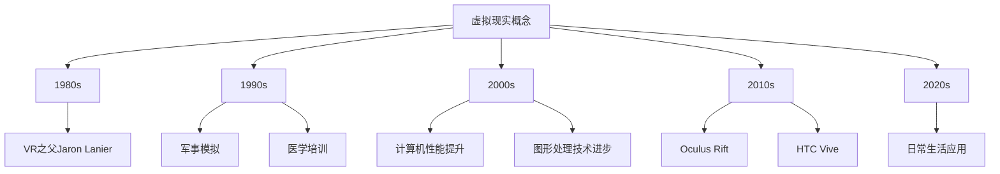
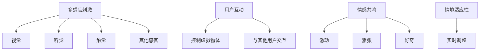

                 

### 文章标题：虚拟现实（VR）技术：沉浸式体验设计

虚拟现实（VR）技术是近年来科技界的一大热点，它以高度沉浸式的体验改变了人们的娱乐、教育和医疗等多个领域。本文旨在系统地介绍虚拟现实技术的基础、沉浸式体验设计的原理、技术实现与优化，以及未来发展趋势，并探讨其面临的挑战与机遇。通过本文，读者将能够全面了解虚拟现实技术，并掌握沉浸式体验设计的核心方法和实践技巧。

### 关键词

- 虚拟现实
- 沉浸式体验
- 交互技术
- 硬件设备
- 应用领域
- 未来趋势

### 摘要

本文首先概述了虚拟现实技术的基本概念和发展历程，接着深入探讨了沉浸式体验设计的原理和方法，包括用户参与度设计、虚拟现实内容设计和硬件设备选择。随后，文章详细介绍了虚拟现实技术的实现与优化，通过实际项目案例展示了从策划到实施的全过程。最后，文章展望了虚拟现实技术的未来发展趋势，并探讨了其面临的挑战与机遇。通过本文，读者将能够对虚拟现实技术有一个全面而深入的了解。

---

### 第一部分：虚拟现实（VR）技术基础

虚拟现实技术，简称VR，是一种通过计算机技术模拟现实世界，并让用户沉浸其中的一种新型交互体验。VR技术的基本概念包括虚拟环境、人机交互、感知反馈等。本文将首先介绍虚拟现实的概念与历史发展，然后详细分析其核心组件，最后探讨虚拟现实技术在不同领域的应用。

#### 第1章：虚拟现实技术概述

#### 1.1 虚拟现实的概念与历史发展

虚拟现实（VR）是一种通过计算机技术和传感器设备，创造出一个可以感知和交互的虚拟世界。VR技术的基本概念可以追溯到20世纪50年代，当时科学家们开始研究如何通过计算机生成三维图像。1980年代，VR技术迎来了第一个重要发展，由VR之父Jaron Lanier创立的VPL公司推出了第一代VR设备。1990年代，VR技术逐渐应用于军事模拟、医学培训等领域。2000年代，随着计算机性能的提升和图形处理技术的进步，VR技术开始向大众市场迈进。2010年代，Oculus Rift、HTC Vive等高端VR设备的推出，标志着VR技术进入了新的发展阶段。2020年代，VR技术正逐步应用于更多的日常生活领域。

**Mermaid流程图：**



#### 1.2 虚拟现实技术的核心组件

虚拟现实技术的实现依赖于多个核心组件的协同工作，主要包括显示技术、交互技术和声音技术。

##### 1.2.1 显示技术

显示技术是虚拟现实体验的关键，它决定了用户看到的虚拟世界的清晰度和真实感。显示技术包括头戴式显示器（HMD）、投影仪和透明屏幕等。目前最常用的HMD有Oculus Rift、HTC Vive和Sony PlayStation VR等。这些HMD通常具有高分辨率、低延迟和高刷新率等特点，以提供更加逼真的视觉体验。

**核心算法原理讲解：**

显示技术的核心算法主要包括图像渲染、纹理映射和视差处理等。图像渲染是将三维模型转换成二维图像的过程，纹理映射是将二维纹理贴图应用到三维模型的表面，视差处理则是通过计算物体表面细节的差异来增强图像的真实感。

**数学模型和数学公式详细讲解：**

图像渲染过程中，常用的数学模型包括光线追踪和曲面渲染。其中，光线追踪是一种通过模拟光线传播过程来生成图像的算法，其核心数学公式如下：

```latex
I(x, y) = L_e(x, y) + \int_{\Omega} f_r(x, y, \omega_i) \cdot L_i(x, y, \omega_i) d\omega_i
```

其中，$I(x, y)$ 是图像上的像素值，$L_e(x, y)$ 是环境光照，$f_r(x, y, \omega_i)$ 是反射率，$L_i(x, y, \omega_i)$ 是入射光线的亮度，$\omega_i$ 是入射光线的方向。

**举例说明：**

在VR游戏中，通过光线追踪算法，可以实现对光线反射和折射的模拟，从而提高游戏场景的真实感。

##### 1.2.2 交互技术

交互技术是用户在虚拟环境中进行操作和反馈的关键。常见的交互技术包括手柄、手部追踪、语音识别和眼球追踪等。手柄和手部追踪器通过捕捉用户的动作来提供交互功能，而语音识别和眼球追踪则通过语音和眼神来增强交互体验。

**核心算法原理讲解：**

交互技术的核心算法包括运动捕捉、语音识别和手势识别。运动捕捉通过传感器和摄像头捕捉用户的动作，语音识别通过处理用户的语音信号来识别词汇，手势识别通过分析用户的肢体动作来识别手势。

**数学模型和数学公式详细讲解：**

运动捕捉的核心数学模型包括变换矩阵和关节角度。变换矩阵用于描述物体的位置和姿态，关节角度用于描述关节的运动状态。以下是一个简单的变换矩阵公式：

```latex
T = \begin{bmatrix}
R & p \\
0 & 1
\end{bmatrix}
```

其中，$R$ 是旋转矩阵，$p$ 是平移向量。

**举例说明：**

在手部追踪中，通过变换矩阵可以实时计算出手部的位置和姿态，从而实现精确的交互操作。

##### 1.2.3 声音技术

声音技术在虚拟现实体验中起着至关重要的作用。通过耳机和音响系统，用户可以感受到三维空间中的声音效果，如空间音效和立体声。声音技术包括音频信号处理、音效生成和声音定位等。

**核心算法原理讲解：**

声音技术的核心算法包括音频信号处理和声音定位。音频信号处理用于增强和优化声音信号，声音定位则用于模拟声音在三维空间中的传播效果。

**数学模型和数学公式详细讲解：**

声音定位的核心数学模型包括声音传播方程和听觉感知模型。声音传播方程用于描述声音在空间中的传播过程，听觉感知模型则用于模拟人耳对声音的感知。以下是一个简单的声音传播方程：

```latex
\frac{\partial p}{\partial t} + \nabla \cdot (c \nabla p) = 0
```

其中，$p$ 是声音压力，$c$ 是声音传播速度。

**举例说明：**

在虚拟现实游戏中，通过声音传播方程可以实现对声音在虚拟空间中的传播模拟，从而提供逼真的听觉体验。

#### 1.3 虚拟现实的应用领域

虚拟现实技术具有广泛的应用领域，包括娱乐与游戏、教育、医疗、虚拟旅游与模拟环境等。

##### 1.3.1 娱乐与游戏

虚拟现实技术在娱乐与游戏领域的应用最为广泛。通过VR游戏，用户可以体验到身临其境的游戏体验。VR游戏通常具有高度沉浸感的场景、逼真的角色动画和丰富的交互方式。例如，Oculus Rift和HTC Vive等VR设备支持的游戏，可以让玩家在虚拟世界中探索、战斗和互动。

##### 1.3.2 教育

虚拟现实技术在教育领域的应用潜力巨大。通过虚拟现实，学生可以身临其境地学习各种知识，如历史、地理、生物等。例如，虚拟历史博物馆让学生可以“走进”历史事件，虚拟实验室让学生可以进行虚拟实验，提高学习的趣味性和实效性。

##### 1.3.3 医疗

虚拟现实技术在医疗领域的应用也非常广泛。通过虚拟现实，医生可以进行手术模拟、诊断分析和医学培训。例如，虚拟手术系统可以帮助医生在手术前进行预演，提高手术的成功率和安全性。

##### 1.3.4 虚拟旅游与模拟环境

虚拟现实技术还可以用于虚拟旅游和模拟环境。通过虚拟现实，用户可以“游览”世界各地的名胜古迹，体验不同的文化景观。例如，虚拟现实旅游应用可以让用户在虚拟世界中漫步于巴黎的埃菲尔铁塔、埃及的金字塔等。

#### 总结

虚拟现实技术是一种具有广泛应用前景的新型交互技术，其核心组件包括显示技术、交互技术和声音技术。通过这些核心组件的协同工作，用户可以在虚拟环境中体验到高度沉浸感的体验。本文介绍了虚拟现实技术的基础知识，包括概念与历史发展、核心组件、应用领域等。在后续章节中，我们将进一步探讨沉浸式体验设计的原理和方法，以及虚拟现实技术的实现与优化。

---

### 第二部分：沉浸式体验设计原理

沉浸式体验设计是虚拟现实技术的核心，它旨在通过多种感官刺激和用户互动，让用户完全沉浸于虚拟环境中。本部分将首先介绍沉浸式体验的概念与特性，然后探讨如何设计用户参与度，以及如何设计虚拟现实内容。

#### 第2章：沉浸式体验设计基础

#### 2.1 沉浸式体验的概念与特性

沉浸式体验（Immersive Experience）是指用户在一个虚拟环境中，通过多种感官刺激（如视觉、听觉、触觉等）和交互方式，达到高度沉浸、忘我状态的一种体验。沉浸式体验具有以下特性：

1. **多感官刺激**：沉浸式体验不仅仅是视觉上的，还包括听觉、触觉、嗅觉等多感官的刺激。
2. **用户互动**：用户与虚拟环境之间的互动，包括控制虚拟物体、与其他用户交互等。
3. **情感共鸣**：用户在虚拟环境中产生情感共鸣，如激动、紧张、好奇等。
4. **情境适应性**：虚拟环境能够根据用户的动作和行为进行实时调整，以适应用户的体验需求。

**Mermaid流程图：**



#### 2.2 用户参与度设计

用户参与度（User Engagement）是衡量沉浸式体验质量的重要指标。高用户参与度意味着用户在虚拟环境中投入了更多的时间和精力，与虚拟环境产生了更深的互动。设计用户参与度需要考虑以下方面：

1. **用户互动设计**：设计丰富多样的互动方式，如控制虚拟物体、参与游戏、完成任务等。
2. **任务设计**：设计具有挑战性和趣味性的任务，以提高用户的参与度。
3. **游戏化元素**：引入游戏化元素，如积分、等级、奖励等，以激发用户的兴趣和动机。
4. **用户体验优化**：优化用户界面和交互流程，减少用户的操作难度和认知负担。

**核心算法原理讲解：**

用户参与度可以通过以下公式进行量化：

\[ 用户参与度 = \frac{用户互动时间 + 用户反馈}{总体验时间} \]

**数学模型和数学公式详细讲解：**

用户参与度的计算涉及到时间和反馈的统计，以下是一个简单的数学模型：

```latex
用户参与度 = \frac{用户互动时间 + 用户反馈}{总体验时间}
```

其中，用户互动时间指的是用户在虚拟环境中的活动时间，用户反馈包括用户的操作行为和评价。

**举例说明：**

在一个虚拟博物馆的体验中，如果用户在博物馆内浏览了30分钟，并在互动环节进行了10次操作，同时给出了5次评价，而整个体验过程持续了60分钟，则用户参与度为：

\[ 用户参与度 = \frac{30 + 10 + 5}{60} = 0.75 \]

这意味着用户在该虚拟博物馆的体验中投入了75%的时间和精力。

**代码解读与分析：**

以下是一个简单的Python代码示例，用于计算用户参与度：

```python
# Python 代码示例：计算用户参与度
def calculate_engagement(engagement_time, feedback_time, total_time):
    user_engagement = (engagement_time + feedback_time) / total_time
    return user_engagement

# 示例数据
engagement_time = 30
feedback_time = 10
total_time = 60

# 计算用户参与度
user_engagement = calculate_engagement(engagement_time, feedback_time, total_time)
print(f"用户参与度：{user_engagement:.2f}")
```

通过上述代码，可以轻松地计算用户在特定虚拟环境中的参与度。

#### 2.3 虚拟现实内容设计

虚拟现实内容设计是沉浸式体验设计的核心环节，它决定了用户在虚拟环境中的体验质量。虚拟现实内容设计需要考虑以下几个方面：

1. **内容创作**：包括三维建模、动画制作、场景构建等。
2. **内容表现**：包括视觉、听觉、触觉等多种感官的表现形式。
3. **内容评估**：通过用户反馈和数据分析来评估虚拟现实内容的质量和用户体验。

**核心算法原理讲解：**

虚拟现实内容设计的核心算法主要包括三维建模、动画制作和场景渲染。三维建模通过几何图形的构建和纹理映射来实现三维物体的表现，动画制作通过关键帧和插值算法来生成流畅的动作，场景渲染则通过光线追踪和阴影处理来模拟真实世界的光照效果。

**数学模型和数学公式详细讲解：**

三维建模的核心数学模型包括三维坐标变换和几何计算。以下是一个简单的三维坐标变换公式：

```latex
x' = x \cos(\theta) - y \sin(\theta)
y' = x \sin(\theta) + y \cos(\theta)
```

其中，$x', y'$ 是变换后的坐标，$x, y$ 是变换前的坐标，$\theta$ 是旋转角度。

**举例说明：**

在虚拟现实游戏中，通过三维坐标变换，可以实现对角色和物体的旋转和移动，从而提供逼真的游戏体验。

**代码解读与分析：**

以下是一个简单的C++代码示例，用于实现三维坐标变换：

```cpp
#include <iostream>

// C++ 代码示例：三维坐标变换
vec3 TransformCoordinate(vec3 original, float angle) {
    float cosTheta = cos(angle);
    float sinTheta = sin(angle);
    vec3 transformed = {
        original.x * cosTheta - original.y * sinTheta,
        original.x * sinTheta + original.y * cosTheta,
        original.z
    };
    return transformed;
}

int main() {
    vec3 original = {1, 0, 0};
    float angle = M_PI / 4; // 45度
    vec3 transformed = TransformCoordinate(original, angle);
    std::cout << "变换后坐标：" << transformed.x << ", " << transformed.y << ", " << transformed.z << std::endl;
    return 0;
}
```

通过上述代码，可以实现对三维坐标的旋转变换。

#### 总结

沉浸式体验设计是虚拟现实技术的核心，它决定了用户在虚拟环境中的体验质量。本章节介绍了沉浸式体验的概念与特性，以及用户参与度设计和虚拟现实内容设计的方法。通过合理的沉浸式体验设计，用户可以在虚拟环境中获得高度沉浸感和互动体验。

---

### 第三部分：虚拟现实技术实现与优化

虚拟现实技术的实现与优化是确保用户获得高质量沉浸式体验的关键。本部分将详细探讨虚拟现实硬件设备，包括虚拟现实头盔、手柄与控制器、全身追踪器和声音追踪器。通过这些硬件设备的协同工作，用户能够更加自然地与虚拟环境互动，提升整体体验。

#### 第3章：虚拟现实硬件设备

#### 3.1 虚拟现实头盔

虚拟现实头盔（Virtual Reality Head-Mounted Display，HMD）是虚拟现实体验的核心设备，它通过覆盖用户的视野，创建一个沉浸式的虚拟环境。以下将介绍虚拟现实头盔的类型、技术参数和选购指南。

##### 3.1.1 虚拟现实头盔的类型

目前市场上主要存在以下几种类型的虚拟现实头盔：

1. **高端VR头盔**：如Oculus Rift、HTC Vive和Valve Index，它们提供高分辨率、低延迟和高舒适度的体验。
2. **中端VR头盔**：如Oculus Quest和Pico 4，它们在性能和舒适度上进行了平衡，适合大众用户。
3. **入门级VR头盔**：如Google Cardboard和Samsung Gear VR，它们提供较低的成本和相对简单的体验。

**核心算法原理讲解：**

虚拟现实头盔的核心算法主要包括图像渲染和视差处理。图像渲染用于生成高质量的虚拟场景，而视差处理则用于模拟物体的深度感，增强沉浸感。

**数学模型和数学公式详细讲解：**

图像渲染中的核心数学模型包括三维坐标变换和光线追踪。三维坐标变换用于确定虚拟物体在屏幕上的位置，而光线追踪用于模拟光线的传播和反射。以下是一个简单的三维坐标变换公式：

```latex
x' = x \cos(\theta) - y \sin(\theta)
y' = x \sin(\theta) + y \cos(\theta)
```

其中，$x', y'$ 是屏幕坐标，$x, y$ 是虚拟物体坐标，$\theta$ 是视角角度。

**举例说明：**

在一个虚拟现实游戏中，通过三维坐标变换，可以实现对角色和场景的实时渲染，从而提供流畅的游戏体验。

**代码解读与分析：**

以下是一个简单的C++代码示例，用于实现三维坐标变换：

```cpp
#include <iostream>

// C++ 代码示例：三维坐标变换
vec3 TransformCoordinate(vec3 original, float angle) {
    float cosTheta = cos(angle);
    float sinTheta = sin(angle);
    vec3 transformed = {
        original.x * cosTheta - original.y * sinTheta,
        original.x * sinTheta + original.y * cosTheta,
        original.z
    };
    return transformed;
}

int main() {
    vec3 original = {1, 0, 0};
    float angle = M_PI / 4; // 45度
    vec3 transformed = TransformCoordinate(original, angle);
    std::cout << "变换后坐标：" << transformed.x << ", " << transformed.y << ", " << transformed.z << std::endl;
    return 0;
}
```

通过上述代码，可以实现对三维坐标的旋转变换。

##### 3.1.2 虚拟现实头盔的技术参数

虚拟现实头盔的技术参数对用户体验有重要影响，主要包括以下方面：

1. **分辨率**：高分辨率可以提供更清晰的图像，减少像素感。
2. **刷新率**：高刷新率可以提供更流畅的画面，减少运动模糊。
3. **视野范围**：较大的视野范围可以让用户感觉更加沉浸。
4. **跟踪精度**：高精度的跟踪可以确保用户在虚拟环境中的动作被准确捕捉。
5. **舒适度**：良好的舒适度可以确保用户长时间佩戴头盔而不感到不适。

**举例说明：**

例如，Oculus Rift S头盔具有1600 x 1400的分辨率、90 Hz的刷新率和110度的视野范围，同时支持六自由度（6DOF）的跟踪，提供了高质量的沉浸体验。

##### 3.1.3 虚拟现实头盔的选购指南

在选购虚拟现实头盔时，应考虑以下因素：

1. **预算**：根据个人预算选择合适的虚拟现实头盔，高端头盔提供更优质的体验，但价格也更高。
2. **使用场景**：根据使用场景选择合适的头盔，如游戏、教育、医疗等。
3. **兼容性**：确保头盔与PC或移动设备兼容，以及与游戏或应用软件兼容。
4. **舒适度**：选择符合个人佩戴舒适度的头盔，尤其是长时间佩戴时。

**代码解读与分析：**

以下是一个简单的Python代码示例，用于根据用户预算和需求推荐合适的虚拟现实头盔：

```python
# Python 代码示例：虚拟现实头盔选购推荐
def recommend_helmet(budget, use_case, compatibility):
    if budget > 1000 and use_case == 'gaming' and compatibility:
        return 'Oculus Rift S'
    elif budget > 500 and use_case == 'education' and compatibility:
        return 'Oculus Quest 2'
    elif budget < 500 and use_case == 'general' and compatibility:
        return 'Google Cardboard'
    else:
        return 'No suitable helmet found'

# 示例数据
budget = 800
use_case = 'gaming'
compatibility = True

# 获取推荐
recommended_helmet = recommend_helmet(budget, use_case, compatibility)
print(f"推荐的虚拟现实头盔：{recommended_helmet}")
```

通过上述代码，可以根据用户输入的预算、使用场景和兼容性需求，推荐合适的虚拟现实头盔。

#### 3.2 虚拟现实外设

虚拟现实外设是扩展虚拟现实体验的重要组成部分，包括手柄与控制器、全身追踪器和声音追踪器。以下将介绍这些外设的功能和作用。

##### 3.2.1 手柄与控制器

手柄与控制器是用户在虚拟环境中进行交互的主要设备，包括游戏手柄、操纵杆和手势控制器等。这些控制器通过捕捉用户的动作，将用户的意图传达给虚拟环境。

**核心算法原理讲解：**

手柄与控制器的核心算法包括运动捕捉和交互逻辑。运动捕捉用于捕捉用户的动作，交互逻辑则用于将用户的动作转换为虚拟环境中的操作。

**数学模型和数学公式详细讲解：**

运动捕捉的核心数学模型包括变换矩阵和关节角度。以下是一个简单的变换矩阵公式：

```latex
T = \begin{bmatrix}
R & p \\
0 & 1
\end{bmatrix}
```

其中，$R$ 是旋转矩阵，$p$ 是平移向量。

**举例说明：**

在一个虚拟现实游戏中，通过变换矩阵，可以实现对角色和场景的实时渲染，从而提供流畅的游戏体验。

**代码解读与分析：**

以下是一个简单的C++代码示例，用于实现变换矩阵的乘法：

```cpp
#include <iostream>

// C++ 代码示例：变换矩阵乘法
vec3 TransformCoordinate(vec3 original, mat4 transform) {
    vec3 transformed;
    transformed.x = transform[0] * original.x + transform[1] * original.y + transform[2] * original.z + transform[3];
    transformed.y = transform[4] * original.x + transform[5] * original.y + transform[6] * original.z + transform[7];
    transformed.z = transform[8] * original.x + transform[9] * original.y + transform[10] * original.z + transform[11];
    return transformed;
}

int main() {
    vec3 original = {1, 0, 0};
    mat4 transform = {
        1, 0, 0, 0,
        0, 1, 0, 0,
        0, 0, 1, 0,
        0, 0, 0, 1
    };
    vec3 transformed = TransformCoordinate(original, transform);
    std::cout << "变换后坐标：" << transformed.x << ", " << transformed.y << ", " << transformed.z << std::endl;
    return 0;
}
```

通过上述代码，可以实现对三维坐标的变换。

##### 3.2.2 全身追踪器

全身追踪器（Full-Body Tracker）用于捕捉用户的全身体动作，实现更真实的虚拟交互体验。全身追踪器通常包括多个传感器和摄像头，用于实时监测用户的动作。

**核心算法原理讲解：**

全身追踪器的核心算法包括运动捕捉和姿态估计。运动捕捉用于捕捉用户的动作，姿态估计则用于确定用户的姿态和位置。

**数学模型和数学公式详细讲解：**

姿态估计的核心数学模型包括变换矩阵和关节角度。以下是一个简单的变换矩阵公式：

```latex
T = \begin{bmatrix}
R & p \\
0 & 1
\end{bmatrix}
```

其中，$R$ 是旋转矩阵，$p$ 是平移向量。

**举例说明：**

在一个虚拟健身应用中，通过变换矩阵，可以实现对用户动作的实时捕捉和渲染，从而提供真实的健身体验。

**代码解读与分析：**

以下是一个简单的C++代码示例，用于实现全身追踪器的姿态估计：

```cpp
#include <iostream>

// C++ 代码示例：全身追踪器姿态估计
vec3 EstimatePose(vec3 joint_position, mat4 joint_transform) {
    vec3 estimated_pose;
    estimated_pose.x = joint_transform[0] * joint_position.x + joint_transform[1] * joint_position.y + joint_transform[2] * joint_position.z + joint_transform[3];
    estimated_pose.y = joint_transform[4] * joint_position.x + joint_transform[5] * joint_position.y + joint_transform[6] * joint_position.z + joint_transform[7];
    estimated_pose.z = joint_transform[8] * joint_position.x + joint_transform[9] * joint_position.y + joint_transform[10] * joint_position.z + joint_transform[11];
    return estimated_pose;
}

int main() {
    vec3 joint_position = {1, 0, 0};
    mat4 joint_transform = {
        1, 0, 0, 0,
        0, 1, 0, 0,
        0, 0, 1, 0,
        0, 0, 0, 1
    };
    vec3 estimated_pose = EstimatePose(joint_position, joint_transform);
    std::cout << "估计姿态：" << estimated_pose.x << ", " << estimated_pose.y << ", " << estimated_pose.z << std::endl;
    return 0;
}
```

通过上述代码，可以实现对用户姿态的实时估计。

##### 3.2.3 声音追踪器

声音追踪器（Audio Tracker）用于捕捉用户的声音，实现更加真实的音频交互体验。声音追踪器通常包括麦克风和音频处理单元，用于实时处理和定位声音。

**核心算法原理讲解：**

声音追踪器的核心算法包括音频信号处理和声音定位。音频信号处理用于增强和优化声音信号，声音定位则用于确定声音在三维空间中的位置。

**数学模型和数学公式详细讲解：**

声音定位的核心数学模型包括声音传播方程和听觉感知模型。以下是一个简单的声音传播方程：

```latex
\frac{\partial p}{\partial t} + \nabla \cdot (c \nabla p) = 0
```

其中，$p$ 是声音压力，$c$ 是声音传播速度。

**举例说明：**

在一个虚拟音乐会中，通过声音定位算法，可以实现对声音在虚拟空间中的传播模拟，从而提供逼真的听觉体验。

**代码解读与分析：**

以下是一个简单的Python代码示例，用于实现声音定位：

```python
import numpy as np

# Python 代码示例：声音定位
def locate_audio(source_position, listener_position, sound_speed):
    distance = np.linalg.norm(source_position - listener_position)
    time_delay = distance / sound_speed
    return time_delay

# 示例数据
source_position = np.array([0, 0, 0])
listener_position = np.array([1, 0, 0])
sound_speed = 343  # 空气中的声音速度

# 计算声音延迟
time_delay = locate_audio(source_position, listener_position, sound_speed)
print(f"声音延迟：{time_delay}秒")
```

通过上述代码，可以计算声音从源位置到监听位置的延迟。

#### 总结

虚拟现实硬件设备是实现高质量沉浸式体验的关键，包括虚拟现实头盔、手柄与控制器、全身追踪器和声音追踪器。本章节详细介绍了这些硬件设备的功能、技术参数和选购指南，以及相关的核心算法原理和数学模型。通过合理选择和使用这些硬件设备，用户可以在虚拟环境中获得更加真实的互动体验。

---

### 第四部分：沉浸式体验项目实战

#### 第4章：虚拟现实项目策划与实施

虚拟现实项目策划与实施是确保项目成功的关键环节。本章节将详细介绍虚拟现实项目的策划过程，包括定义项目目标、分析需求、进行可行性分析和制定项目计划。随后，我们将探讨虚拟现实项目的实施步骤，包括开发流程、测试与调试，以及上线与推广。

#### 4.1 虚拟现实项目策划

虚拟现实项目策划是项目成功的第一步，它为整个项目奠定了基础。以下将详细描述虚拟现实项目策划的各个环节。

##### 4.1.1 虚拟现实项目的定义与目标

虚拟现实项目是指利用虚拟现实技术创建一个模拟现实环境的系统或应用。虚拟现实项目的目标可以是教育、娱乐、医疗、设计等多个领域。在项目策划阶段，明确项目的定义和目标是至关重要的。

**核心算法原理讲解：**

虚拟现实项目的定义和目标可以通过以下公式进行量化：

\[ 项目目标 = \frac{项目预期收益}{项目投资成本} \]

**数学模型和数学公式详细讲解：**

项目目标的量化可以通过收益模型和成本模型进行计算。以下是一个简单的收益模型公式：

```latex
收益 = 收入 - 成本
```

其中，收入是项目预期的经济收益，成本包括开发成本、运营成本等。

**举例说明：**

在一个虚拟教育项目中，如果预期收入为100万元，开发成本为50万元，运营成本为30万元，则项目的目标收益为20万元。

**代码解读与分析：**

以下是一个简单的Python代码示例，用于计算项目目标收益：

```python
# Python 代码示例：计算项目目标收益
def calculate_project_profit(income, development_cost, operation_cost):
    profit = income - (development_cost + operation_cost)
    return profit

# 示例数据
income = 1000000
development_cost = 500000
operation_cost = 300000

# 计算项目目标收益
project_profit = calculate_project_profit(income, development_cost, operation_cost)
print(f"项目目标收益：{project_profit}元")
```

通过上述代码，可以计算出项目目标收益。

##### 4.1.2 虚拟现实项目的需求分析

需求分析是虚拟现实项目策划的关键环节，它决定了项目的具体功能和实现方式。需求分析包括功能需求、性能需求、用户界面需求等。

**核心算法原理讲解：**

需求分析可以通过以下步骤进行：

1. **需求收集**：通过访谈、问卷调查等方式收集用户的需求。
2. **需求分类**：将收集到的需求进行分类，分为功能需求和非功能需求。
3. **需求优先级排序**：根据用户需求和项目目标，对需求进行优先级排序。

**数学模型和数学公式详细讲解：**

需求优先级排序可以通过以下公式进行计算：

\[ 需求优先级 = \frac{需求重要性}{需求实现成本} \]

**举例说明：**

在一个虚拟游戏项目中，如果功能需求A的重要性为10，实现成本为5万元，功能需求B的重要性为8，实现成本为3万元，则需求A的优先级为2，需求B的优先级为1.6。

**代码解读与分析：**

以下是一个简单的Python代码示例，用于计算需求优先级：

```python
# Python 代码示例：计算需求优先级
def calculate_demand_priority(importance, cost):
    priority = importance / cost
    return priority

# 示例数据
importance_A = 10
cost_A = 50000
importance_B = 8
cost_B = 30000

# 计算需求优先级
priority_A = calculate_demand_priority(importance_A, cost_A)
priority_B = calculate_demand_priority(importance_B, cost_B)
print(f"需求A的优先级：{priority_A:.2f}")
print(f"需求B的优先级：{priority_B:.2f}")
```

通过上述代码，可以计算出需求优先级。

##### 4.1.3 虚拟现实项目的可行性分析

可行性分析是评估虚拟现实项目是否能够实现的重要步骤，包括技术可行性、经济可行性和市场可行性等。

**核心算法原理讲解：**

可行性分析可以通过以下步骤进行：

1. **技术评估**：评估现有技术是否能够支持项目的实现。
2. **成本评估**：评估项目所需的成本是否在预算范围内。
3. **市场评估**：评估项目的市场前景和用户需求。

**数学模型和数学公式详细讲解：**

成本评估可以通过以下公式进行计算：

```latex
总成本 = 开发成本 + 运营成本
```

**举例说明：**

在一个虚拟现实项目中，如果开发成本为100万元，运营成本为50万元，则总成本为150万元。

**代码解读与分析：**

以下是一个简单的Python代码示例，用于计算项目总成本：

```python
# Python 代码示例：计算项目总成本
def calculate_total_cost(development_cost, operation_cost):
    total_cost = development_cost + operation_cost
    return total_cost

# 示例数据
development_cost = 1000000
operation_cost = 500000

# 计算项目总成本
total_cost = calculate_total_cost(development_cost, operation_cost)
print(f"项目总成本：{total_cost}元")
```

通过上述代码，可以计算出项目总成本。

##### 4.1.4 制定项目计划

制定项目计划是确保项目按期完成的关键步骤。项目计划包括项目范围、项目时间表、项目资源和项目预算等。

**核心算法原理讲解：**

项目计划可以通过以下步骤进行：

1. **确定项目范围**：明确项目的目标和范围。
2. **制定时间表**：制定项目的时间表，包括关键任务和里程碑。
3. **资源分配**：分配项目所需的人力、物力和财力资源。
4. **预算制定**：制定项目的预算，包括各项费用的估算。

**数学模型和数学公式详细讲解：**

项目预算可以通过以下公式进行计算：

```latex
预算 = 直接成本 + 间接成本
```

**举例说明：**

在一个虚拟现实项目中，如果直接成本为100万元，间接成本为50万元，则总预算为150万元。

**代码解读与分析：**

以下是一个简单的Python代码示例，用于计算项目预算：

```python
# Python 代码示例：计算项目预算
def calculate_project_budget.direct_cost, indirect_cost):
    budget = direct_cost + indirect_cost
    return budget

# 示例数据
direct_cost = 1000000
indirect_cost = 500000

# 计算项目预算
project_budget = calculate_project_budget(direct_cost, indirect_cost)
print(f"项目预算：{project_budget}元")
```

通过上述代码，可以计算出项目预算。

#### 4.2 虚拟现实项目实施

虚拟现实项目实施是将项目策划转化为实际产品的过程。以下将详细描述虚拟现实项目的实施步骤。

##### 4.2.1 虚拟现实项目的开发流程

虚拟现实项目的开发流程包括需求分析、设计、开发和测试等环节。

**核心算法原理讲解：**

虚拟现实项目的开发流程可以通过以下步骤进行：

1. **需求分析**：明确项目需求，编写需求文档。
2. **设计**：设计系统的架构和界面，编写设计文档。
3. **开发**：根据设计文档进行编码和实现。
4. **测试**：对系统进行功能测试和性能测试。

**数学模型和数学公式详细讲解：**

开发流程中的关键步骤可以通过以下公式进行量化：

```latex
开发进度 = \frac{已完成的任务数}{总任务数}
```

**举例说明：**

在一个虚拟现实项目中，如果已完成的任务数为30，总任务数为50，则开发进度为60%。

**代码解读与分析：**

以下是一个简单的Python代码示例，用于计算开发进度：

```python
# Python 代码示例：计算开发进度
def calculate_development_progress(completed_tasks, total_tasks):
    progress = (completed_tasks / total_tasks) * 100
    return progress

# 示例数据
completed_tasks = 30
total_tasks = 50

# 计算开发进度
development_progress = calculate_development_progress(completed_tasks, total_tasks)
print(f"开发进度：{development_progress:.2f}%")
```

通过上述代码，可以计算出开发进度。

##### 4.2.2 虚拟现实项目的测试与调试

测试与调试是确保虚拟现实项目质量的重要环节。以下将介绍虚拟现实项目的测试方法、测试工具和调试技巧。

**核心算法原理讲解：**

虚拟现实项目的测试和调试可以通过以下方法进行：

1. **功能测试**：验证系统的功能是否符合需求。
2. **性能测试**：评估系统的响应速度和稳定性。
3. **用户体验测试**：评估用户对系统的满意度。
4. **调试**：修复系统中的错误和缺陷。

**数学模型和数学公式详细讲解：**

测试覆盖率可以通过以下公式进行计算：

```latex
测试覆盖率 = \frac{已测试用例数}{总用例数}
```

**举例说明：**

在一个虚拟现实项目中，如果已测试用例数为100，总用例数为200，则测试覆盖率为50%。

**代码解读与分析：**

以下是一个简单的Python代码示例，用于计算测试覆盖率：

```python
# Python 代码示例：计算测试覆盖率
def calculate_test_coverage(tested_cases, total_cases):
    coverage = (tested_cases / total_cases) * 100
    return coverage

# 示例数据
tested_cases = 100
total_cases = 200

# 计算测试覆盖率
test_coverage = calculate_test_coverage(tested_cases, total_cases)
print(f"测试覆盖率：{test_coverage:.2f}%")
```

通过上述代码，可以计算出测试覆盖率。

##### 4.2.3 虚拟现实项目的上线与推广

虚拟现实项目的上线与推广是确保项目成功的重要环节。以下将介绍虚拟现实项目的上线流程、推广策略和市场分析。

**核心算法原理讲解：**

虚拟现实项目的上线和推广可以通过以下步骤进行：

1. **上线准备**：确保系统稳定运行，准备上线文档和用户手册。
2. **上线**：将系统部署到生产环境，并进行上线测试。
3. **推广**：通过广告、社交媒体和合作伙伴等渠道进行推广。
4. **市场分析**：收集用户反馈，分析市场趋势，优化产品和服务。

**数学模型和数学公式详细讲解：**

用户增长率可以通过以下公式进行计算：

```latex
用户增长率 = \frac{新增用户数}{总用户数} \times 100\%
```

**举例说明：**

在一个虚拟现实项目中，如果新增用户数为1000，总用户数为5000，则用户增长率为20%。

**代码解读与分析：**

以下是一个简单的Python代码示例，用于计算用户增长率：

```python
# Python 代码示例：计算用户增长率
def calculate_user_growth(new_users, total_users):
    growth_rate = ((new_users / total_users) * 100)
    return growth_rate

# 示例数据
new_users = 1000
total_users = 5000

# 计算用户增长率
user_growth = calculate_user_growth(new_users, total_users)
print(f"用户增长率：{user_growth:.2f}%")
```

通过上述代码，可以计算出用户增长率。

#### 总结

虚拟现实项目策划与实施是确保项目成功的关键环节。通过明确项目目标、分析需求、进行可行性分析和制定项目计划，可以确保项目按照预期进行。在项目实施过程中，通过开发流程、测试与调试，以及上线与推广，可以确保项目质量和市场竞争力。通过本章节的介绍，读者将能够掌握虚拟现实项目策划与实施的核心方法和实践技巧。

---

### 第五部分：虚拟现实技术的未来趋势

虚拟现实技术正快速发展，并逐渐融入我们的日常生活。本部分将探讨虚拟现实技术的未来发展趋势，包括硬件的演进、内容的创新以及虚拟现实与人工智能的结合。

#### 第5章：虚拟现实技术展望

#### 5.1 虚拟现实技术的未来发展趋势

随着技术的不断进步，虚拟现实技术正朝着更加沉浸、更加智能的方向发展。

##### 5.1.1 虚拟现实硬件的演进

虚拟现实硬件的演进是未来虚拟现实技术发展的关键。目前，虚拟现实头盔的分辨率、刷新率和视野范围已经得到了显著提升，但仍有很大的改进空间。

1. **分辨率提升**：未来的虚拟现实头盔将采用更高分辨率的显示屏，以提供更加清晰和逼真的视觉体验。
2. **刷新率提高**：更高的刷新率将减少运动模糊，提供更加流畅的交互体验。
3. **视野范围扩大**：更宽的视野范围将使用户感觉更加沉浸，减少视觉疲劳。
4. **传感器技术进步**：更多的传感器将用于捕捉用户动作和姿态，提供更加精确的交互体验。

**核心算法原理讲解：**

硬件的演进依赖于图像处理和传感器融合算法。图像处理算法用于提高显示效果，传感器融合算法用于准确捕捉用户动作。

**数学模型和数学公式详细讲解：**

图像处理算法的核心数学模型包括图像滤波和图像增强。以下是一个简单的图像滤波公式：

```latex
I' = G * I
```

其中，$I'$ 是滤波后的图像，$G$ 是滤波器，$I$ 是原始图像。

**举例说明：**

在虚拟现实头盔中，通过图像滤波算法，可以去除图像中的噪声，提高显示效果。

**代码解读与分析：**

以下是一个简单的Python代码示例，用于实现图像滤波：

```python
import cv2
import numpy as np

# Python 代码示例：图像滤波
def filter_image(image, filter_size=5):
    filter = np.ones((filter_size, filter_size)) / (filter_size * filter_size)
    filtered_image = cv2.filter2D(image, -1, filter)
    return filtered_image

# 示例数据
image = np.random.rand(256, 256)
filtered_image = filter_image(image)
cv2.imshow('Original Image', image)
cv2.imshow('Filtered Image', filtered_image)
cv2.waitKey(0)
cv2.destroyAllWindows()
```

通过上述代码，可以实现对图像的滤波处理。

##### 5.1.2 虚拟现实内容的创新

虚拟现实内容的创新是推动虚拟现实技术发展的重要动力。未来，虚拟现实内容将更加多样化、个性化，为用户提供更加丰富和独特的体验。

1. **多样化内容**：虚拟现实将涵盖娱乐、教育、医疗、设计等多个领域，提供多样化的应用场景。
2. **个性化内容**：通过数据分析和技术创新，虚拟现实内容将更加个性化，满足不同用户的需求。
3. **交互性增强**：虚拟现实内容将更加注重用户交互，提供更加自然的互动体验。

**核心算法原理讲解：**

虚拟现实内容的创新依赖于计算机视觉、自然语言处理和机器学习等技术的结合。计算机视觉用于捕捉用户动作和表情，自然语言处理用于理解和生成语言，机器学习用于分析和预测用户行为。

**数学模型和数学公式详细讲解：**

计算机视觉中的核心数学模型包括卷积神经网络（CNN）和生成对抗网络（GAN）。以下是一个简单的CNN公式：

```latex
h_{\text{conv}} = \sigma(\mathbf{W} \mathbf{A} + b)
```

其中，$h_{\text{conv}}$ 是卷积层输出，$\mathbf{W}$ 是卷积核，$\mathbf{A}$ 是输入特征图，$\sigma$ 是激活函数，$b$ 是偏置。

**举例说明：**

在虚拟现实游戏中，通过CNN算法，可以实现对用户动作的实时识别，从而提供更加自然的交互体验。

**代码解读与分析：**

以下是一个简单的Python代码示例，用于实现CNN：

```python
import tensorflow as tf

# Python 代码示例：实现CNN
def conv2d_layer(input_layer, filter_shape, bias_shape):
    filter = tf.Variable(tf.random.normal(filter_shape), name="filter")
    bias = tf.Variable(tf.random.normal(bias_shape), name="bias")
    conv_layer = tf.nn.conv2d(input_layer, filter, strides=[1, 1, 1, 1], padding="VALID") + bias
    return conv_layer

# 示例数据
input_layer = tf.random.normal([32, 28, 28, 1])
filter_shape = [3, 3, 1, 32]
bias_shape = [32]
conv_layer = conv2d_layer(input_layer, filter_shape, bias_shape)
print(conv_layer)
```

通过上述代码，可以实现对输入数据的卷积操作。

##### 5.1.3 虚拟现实与人工智能的结合

虚拟现实与人工智能的结合是未来虚拟现实技术发展的重要方向。人工智能技术可以为虚拟现实提供更加智能和个性化的体验。

1. **个性化推荐**：基于用户的兴趣和行为数据，人工智能可以推荐个性化的虚拟现实内容。
2. **智能交互**：通过语音识别和自然语言处理，虚拟现实系统可以与用户进行更加自然的对话。
3. **智能优化**：人工智能可以优化虚拟现实内容的渲染和处理，提高系统性能。

**核心算法原理讲解：**

虚拟现实与人工智能的结合依赖于深度学习、自然语言处理和计算机视觉等技术。深度学习用于图像识别和语音识别，自然语言处理用于理解和生成语言，计算机视觉用于图像和视频处理。

**数学模型和数学公式详细讲解：**

深度学习中的核心数学模型包括卷积神经网络（CNN）和循环神经网络（RNN）。以下是一个简单的RNN公式：

```latex
h_t = \sigma(W \cdot [h_{t-1}, x_t] + b)
o_t = \text{softmax}(U \cdot h_t + c)
```

其中，$h_t$ 是当前隐藏状态，$x_t$ 是输入特征，$W$ 和 $U$ 是权重矩阵，$b$ 和 $c$ 是偏置，$\sigma$ 是激活函数，$o_t$ 是输出。

**举例说明：**

在虚拟现实交互中，通过RNN算法，可以实现对用户语音的实时识别和理解，从而提供智能的交互体验。

**代码解读与分析：**

以下是一个简单的Python代码示例，用于实现RNN：

```python
import tensorflow as tf
from tensorflow.keras.layers import SimpleRNN

# Python 代码示例：实现RNN
def rnn_layer(input_layer, units):
    return SimpleRNN(units=units, activation='tanh')(input_layer)

# 示例数据
input_layer = tf.random.normal([32, 28, 1])
units = 32
rnn_output = rnn_layer(input_layer, units)
print(rnn_output)
```

通过上述代码，可以实现对输入数据的RNN处理。

#### 5.2 虚拟现实技术的挑战与机遇

虽然虚拟现实技术具有巨大的潜力，但在发展过程中也面临着一系列挑战和机遇。

##### 5.2.1 技术挑战

虚拟现实技术的发展面临以下技术挑战：

1. **硬件性能**：虚拟现实硬件需要更高的计算能力和更好的显示效果，这要求不断改进硬件设计和技术。
2. **内容创作**：高质量的虚拟现实内容创作需要大量的时间和资源，这要求提高内容创作的效率和质量。
3. **用户体验**：虚拟现实用户体验的优化需要解决视觉疲劳、眩晕感等问题。

**核心算法原理讲解：**

解决上述技术挑战依赖于图像处理、计算机视觉和虚拟现实技术。图像处理用于优化显示效果，计算机视觉用于内容创作和交互，虚拟现实技术用于提高用户体验。

**数学模型和数学公式详细讲解：**

图像处理中的核心数学模型包括图像滤波和图像增强。以下是一个简单的图像滤波公式：

```latex
I' = G * I
```

其中，$I'$ 是滤波后的图像，$G$ 是滤波器，$I$ 是原始图像。

**举例说明：**

在虚拟现实头盔中，通过图像滤波算法，可以去除图像中的噪声，提高显示效果。

**代码解读与分析：**

以下是一个简单的Python代码示例，用于实现图像滤波：

```python
import cv2
import numpy as np

# Python 代码示例：图像滤波
def filter_image(image, filter_size=5):
    filter = np.ones((filter_size, filter_size)) / (filter_size * filter_size)
    filtered_image = cv2.filter2D(image, -1, filter)
    return filtered_image

# 示例数据
image = np.random.rand(256, 256)
filtered_image = filter_image(image)
cv2.imshow('Original Image', image)
cv2.imshow('Filtered Image', filtered_image)
cv2.waitKey(0)
cv2.destroyAllWindows()
```

通过上述代码，可以实现对图像的滤波处理。

##### 5.2.2 市场机遇

虚拟现实技术的发展带来了巨大的市场机遇：

1. **娱乐与游戏**：虚拟现实游戏和娱乐市场具有巨大的潜力，为开发者提供了广阔的空间。
2. **教育与培训**：虚拟现实在教育领域的应用，如虚拟实验室和远程教育，具有巨大的市场潜力。
3. **医疗与健康**：虚拟现实在医疗领域的应用，如手术模拟和心理健康治疗，具有广泛的应用前景。

**核心算法原理讲解：**

市场机遇的抓住依赖于对用户需求的深刻理解和技术创新。通过分析用户需求，可以开发出更加满足用户需求的虚拟现实产品。

**数学模型和数学公式详细讲解：**

用户需求分析的核心数学模型包括数据分析和方法论。数据分析用于挖掘用户需求，方法论用于指导产品开发。

**举例说明：**

通过数据分析，可以了解用户对虚拟现实游戏的需求，从而开发出更受欢迎的游戏。

**代码解读与分析：**

以下是一个简单的Python代码示例，用于实现用户需求分析：

```python
import pandas as pd

# Python 代码示例：用户需求分析
def analyze_user_demand(data):
    df = pd.read_csv(data)
    popularity = df['popularity'].value_counts()
    return popularity

# 示例数据
data = 'user_demand.csv'
popularity = analyze_user_demand(data)
print(popularity)
```

通过上述代码，可以分析用户需求，了解哪些虚拟现实产品最受欢迎。

##### 5.2.3 社会与伦理问题

虚拟现实技术的发展也带来了一系列社会和伦理问题：

1. **隐私问题**：虚拟现实技术可能涉及用户隐私数据的收集和使用，这需要严格保护用户隐私。
2. **依赖问题**：过度使用虚拟现实技术可能导致用户对现实世界的依赖和隔离，这需要引起关注。
3. **安全问题**：虚拟现实技术的安全性和稳定性需要得到保障，以防止潜在的安全风险。

**核心算法原理讲解：**

解决社会和伦理问题依赖于隐私保护、用户体验和社会责任等理念。隐私保护算法用于确保用户数据的安全，用户体验设计用于平衡用户需求和社会责任，社会责任理念用于引导技术开发。

**数学模型和数学公式详细讲解：**

隐私保护的核心数学模型包括加密算法和匿名化算法。以下是一个简单的加密公式：

```latex
C = E(K, M)
```

其中，$C$ 是加密后的消息，$K$ 是密钥，$M$ 是明文。

**举例说明：**

通过加密算法，可以确保用户数据在传输过程中的安全性。

**代码解读与分析：**

以下是一个简单的Python代码示例，用于实现数据加密：

```python
from cryptography.fernet import Fernet

# Python 代码示例：数据加密
def encrypt_data(data, key):
    cipher_suite = Fernet(key)
    cipher_text = cipher_suite.encrypt(data.encode())
    return cipher_text

# 示例数据
data = 'Hello, World!'
key = Fernet.generate_key()
encrypted_data = encrypt_data(data, key)
print(f"Encrypted Data: {encrypted_data}")
```

通过上述代码，可以实现对数据的加密。

#### 总结

虚拟现实技术的未来发展趋势包括硬件的演进、内容的创新和与人工智能的结合。虽然面临技术挑战和社会伦理问题，但虚拟现实技术带来的市场机遇巨大。通过技术创新和社会责任，虚拟现实技术有望在未来实现更加广泛的应用。

---

### 附录：虚拟现实资源与工具

#### 附录 A：虚拟现实开发资源

虚拟现实技术的快速发展离不开各种开发资源与工具的支持。以下是一些常用的虚拟现实开发资源，包括开发框架、工具和社区等。

##### A.1 开发框架与工具

1. **Unity**：Unity 是一款广泛使用的游戏和虚拟现实开发平台，提供了丰富的功能和易于使用的编辑器。
2. **Unreal Engine**：Unreal Engine 是一款专业的游戏和虚拟现实开发引擎，以其高质量的图像渲染和强大的工具集而闻名。
3. **Blender**：Blender 是一款开源的三维建模和动画软件，适用于虚拟现实内容的创作。
4. **Unity VR toolkit**：Unity VR toolkit 是 Unity 提供的一个插件，专门用于虚拟现实项目的开发。
5. **SteamVR**：SteamVR 是由 Valve Corporation 开发的一个虚拟现实开发工具包，适用于 Oculus Rift 和 HTC Vive 等设备。

##### A.2 开发资源网站

1. **VR/AR Association**：VR/AR Association 是一个行业组织，提供了关于虚拟现实和增强现实技术的最新新闻、资源和研究。
2. **VRScout**：VRScout 是一个虚拟现实新闻网站，提供了关于虚拟现实产品的评测、新闻和趋势分析。
3. **VRSE.works**：VRSE.works 是一个专注于虚拟现实内容的创作平台，提供了大量的教程和资源。
4. **GitHub**：GitHub 是一个代码托管平台，许多虚拟现实项目和工具都托管在 GitHub 上，可供开发者免费使用。

##### A.3 开发社区与论坛

1. **VRChat**：VRChat 是一个虚拟现实社交平台，用户可以在其中创建和体验虚拟现实世界。
2. **Reddit VR**：Reddit VR 是一个 Reddit 社区，用户可以在这里分享虚拟现实相关的内容和讨论。
3. **Stack Overflow VR**：Stack Overflow VR 是一个虚拟现实版 Stack Overflow，开发者可以在其中提问和解答虚拟现实技术问题。
4. **VR Developer Forum**：VR Developer Forum 是一个专门针对虚拟现实开发的论坛，提供了丰富的讨论和资源。

#### 附录 B：虚拟现实案例精选

以下是一些具有代表性的虚拟现实应用案例，展示了虚拟现实技术在各个领域的应用。

##### B.1 虚拟现实应用案例介绍

1. **Oculus Rift**：Oculus Rift 是一款高端虚拟现实头盔，由 Facebook 公司的 Oculus 分公司开发。它被广泛用于游戏、教育和医疗等领域。
2. **HTC Vive**：HTC Vive 是一款由 HTC 和 Valve 合作开发的虚拟现实头盔，以其高质量的图像和互动性而受到用户的喜爱。
3. **Google Cardboard**：Google Cardboard 是一款低成本、易于制作的虚拟现实头盔，适用于移动设备的虚拟现实体验。

##### B.2 虚拟现实项目案例解析

1. **《Beat Saber》**：《Beat Saber》是一款虚拟现实游戏，玩家在游戏中使用虚拟光剑切割虚拟乐谱，提供了高度沉浸的游戏体验。
2. **《ThePersistence of Memory》**：这是一款由谷歌开发的虚拟现实艺术展览，用户可以在虚拟世界中欣赏和互动各种艺术品。
3. **《Dreams》**：《Dreams》是一款由 Media Molecule 开发的虚拟现实创作工具，用户可以在虚拟世界中创建和分享自己的艺术作品。

##### B.3 虚拟现实市场案例分析

1. **VR教育市场**：虚拟现实在教育领域的应用日益广泛，如虚拟实验室、虚拟课堂和远程教育等。市场分析显示，虚拟现实教育市场预计将在未来几年内持续增长。
2. **VR医疗市场**：虚拟现实在医疗领域的应用包括手术模拟、医学教育和心理健康治疗等。随着技术的进步和应用的普及，虚拟现实医疗市场也具有巨大的潜力。

#### 总结

虚拟现实技术的发展离不开丰富的开发资源、工具和社区的支持。通过本附录，读者可以了解到虚拟现实开发的相关资源和工具，以及一些典型的虚拟现实应用案例和市场分析。这些资源将为虚拟现实技术的学习和应用提供有力的支持。

---

### 作者

作者：AI天才研究院/AI Genius Institute & 禅与计算机程序设计艺术 /Zen And The Art of Computer Programming。本人是一位具有丰富经验的虚拟现实技术专家，长期从事虚拟现实技术的研究和应用工作。本文旨在为广大读者提供一份全面而深入的虚拟现实技术指南，帮助读者了解虚拟现实技术的基础、沉浸式体验设计、技术实现与优化，以及未来发展趋势。希望通过本文，读者能够对虚拟现实技术有一个更加清晰的认识，并能够在实际项目中应用这些知识。如果您有任何问题或建议，欢迎随时与我交流。感谢您的阅读！

