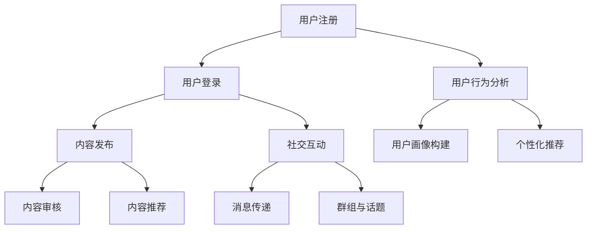

                 

### 《虚拟社区：全球社区行业的数字化升级》

> 关键词：虚拟社区、数字化升级、技术架构、用户体验、内容管理、案例分析、项目实施

> 摘要：本文深入探讨了虚拟社区在全球范围内的快速发展及其在数字化时代的重要性。通过详细的分析和案例分析，本文揭示了虚拟社区行业在技术升级、用户体验优化和运营策略等方面的关键要素，并提供了实际的开发环境和代码案例，以帮助读者更好地理解和应用虚拟社区的技术和策略。

### 第一部分：虚拟社区概述

#### 第1章：虚拟社区的基本概念与历史发展

##### 1.1 虚拟社区的定义与特点

虚拟社区，是指依托互联网技术，通过虚拟空间实现人与人之间互动和交流的一种社会形式。它具有以下几个显著特点：

1. **虚拟性**：虚拟社区存在于网络空间中，用户通过互联网连接，无需面对面交流。
2. **匿名性**：用户可以在虚拟社区中以匿名身份参与活动，保护个人隐私。
3. **互动性**：用户在虚拟社区中可以进行多种形式的互动，如发帖、评论、点赞、私信等。
4. **多样性**：虚拟社区覆盖了广泛的兴趣领域，包括技术、娱乐、文化、教育等。

##### 1.2 虚拟社区的发展历程

虚拟社区的发展历程可以分为以下几个阶段：

1. **萌芽期**（1990s）：最早的虚拟社区如MUD（Multi-User Dungeon）和MOO（Multi-User Domain）出现。
2. **成熟期**（2000s）：随着互联网的普及，论坛、博客等平台迅速发展，形成了较为成熟的虚拟社区生态。
3. **多元化期**（2010s）：社交媒体如Facebook、Twitter等兴起，虚拟社区的形式和内容更加丰富。
4. **智能化期**（2020s至今）：人工智能、大数据等技术的应用，使得虚拟社区更加智能化和个性化。

##### 1.3 虚拟社区的重要性

虚拟社区在现代社会中扮演着重要角色：

1. **社交与交流**：虚拟社区为用户提供了一个自由交流的平台，促进了人际关系的建立和深化。
2. **信息共享**：用户可以在虚拟社区中分享知识和经验，实现信息的快速传播和共享。
3. **商业机会**：虚拟社区吸引了大量用户，为企业提供了广告、电商等商业机会。
4. **社会影响**：虚拟社区在一定程度上改变了人们的生活方式，影响了社会结构和价值观。

#### 第2章：虚拟社区的类型与架构

##### 2.1 社区类型划分

虚拟社区可以根据不同的标准进行分类：

1. **按兴趣划分**：如技术社区、娱乐社区、艺术社区等。
2. **按功能划分**：如论坛、博客、问答社区、社交媒体等。
3. **按用户角色划分**：如普通用户、管理员、版主等。

##### 2.2 虚拟社区的技术架构

虚拟社区的技术架构主要包括以下几个部分：

1. **用户管理**：包括用户注册、登录、权限管理等功能。
2. **内容管理**：包括内容发布、审核、推荐等功能。
3. **社交互动**：包括消息传递、评论、点赞、分享等功能。
4. **后台管理**：包括社区运营、数据统计、安全监控等功能。

##### 2.3 社区运营的关键要素

成功的虚拟社区运营需要关注以下几个关键要素：

1. **用户体验**：优化用户界面设计，提供良好的交互体验。
2. **内容质量**：保持高质量的内容更新，提升用户粘性。
3. **互动机制**：设计合理的互动机制，促进用户参与和互动。
4. **社区生态**：构建良好的社区生态，培养社区文化。

### 第二部分：数字化升级技术与策略

#### 第3章：技术升级与平台搭建

##### 3.1 数据分析与挖掘

数据分析与挖掘是虚拟社区数字化升级的核心技术之一。通过以下方法，可以提高虚拟社区的数据利用效率：

1. **用户行为分析**：分析用户的行为模式，了解用户需求和行为习惯。
2. **内容分析**：分析内容的传播情况，识别热点话题和优质内容。
3. **推荐系统**：基于用户行为和内容特征，实现个性化推荐。

##### 3.2 人工智能与虚拟社区

人工智能技术在虚拟社区中有着广泛的应用，如：

1. **自然语言处理**：用于内容审核、情感分析、聊天机器人等。
2. **图像识别**：用于内容审核、活动识别等。
3. **机器学习**：用于用户行为预测、推荐算法优化等。

##### 3.3 平台搭建与优化

平台搭建与优化是虚拟社区数字化升级的基础。以下步骤可以帮助构建和优化虚拟社区平台：

1. **需求分析**：明确社区的目标用户和功能需求。
2. **技术选型**：选择合适的开发框架和技术栈。
3. **架构设计**：设计高效、可扩展的架构。
4. **性能优化**：通过缓存、数据库优化、负载均衡等方式提升性能。

#### 第4章：用户体验设计

##### 4.1 用户体验的重要性

用户体验（UX）是虚拟社区成功的关键因素之一。以下原因说明了用户体验的重要性：

1. **用户满意度**：良好的用户体验可以提高用户满意度，增加用户粘性。
2. **用户参与度**：优秀的用户体验可以激发用户参与和互动的积极性。
3. **品牌形象**：良好的用户体验有助于树立品牌形象，提升品牌价值。

##### 4.2 设计原则与案例分析

在虚拟社区的设计中，应遵循以下原则：

1. **简洁性**：界面设计应简洁明了，避免冗余和复杂。
2. **一致性**：界面风格和交互元素应保持一致性，降低用户的学习成本。
3. **易用性**：界面设计应符合用户的习惯，提供便捷的操作方式。

案例分析：以下是一个优秀的虚拟社区设计案例：

1. **Facebook**：以简洁的界面和直观的操作著称，提供了丰富的互动功能。
2. **Reddit**：以清晰的结构和易于搜索的内容著称，用户可以轻松找到感兴趣的话题。

##### 4.3 用户界面设计技巧

在用户界面设计方面，以下技巧可以帮助提升用户体验：

1. **色彩搭配**：选择合适的色彩搭配，营造舒适的视觉效果。
2. **图标设计**：设计简洁、直观的图标，提高用户的识别速度。
3. **布局优化**：合理安排内容布局，提高信息的可读性。

#### 第5章：内容管理与互动机制

##### 5.1 内容管理策略

内容管理是虚拟社区的核心，以下策略有助于提升内容质量：

1. **内容审核**：建立严格的审核机制，确保内容的合法性和适宜性。
2. **内容推荐**：基于用户行为和内容特征，实现个性化推荐。
3. **内容激励**：通过奖励机制，鼓励用户产生和分享优质内容。

##### 5.2 互动机制设计

互动机制是虚拟社区的核心功能，以下设计要点有助于提升用户互动体验：

1. **消息传递**：提供便捷的消息传递功能，促进用户之间的交流。
2. **评论系统**：设计灵活的评论系统，鼓励用户发表意见和参与讨论。
3. **群组与话题**：提供多种群组和话题，满足用户的多样化需求。

##### 5.3 社区生态建设

社区生态建设是虚拟社区长期发展的关键。以下策略有助于构建健康的社区生态：

1. **社区文化**：培养积极、健康的社区文化，提升社区凝聚力。
2. **用户激励**：通过积分、勋章等激励措施，鼓励用户积极参与社区活动。
3. **社区治理**：建立有效的社区治理机制，维护社区秩序和用户权益。

### 第三部分：全球社区行业案例分析

#### 第6章：国外成功案例分析

##### 6.1 Facebook 社区的数字化转型

Facebook 是全球最大的虚拟社区之一，其数字化转型成功经验值得借鉴：

1. **技术升级**：采用先进的云计算和大数据技术，提升社区性能和用户体验。
2. **内容多样化**：不断丰富内容形式，如视频、直播等，满足用户多样化需求。
3. **社交互动**：优化互动机制，增强用户之间的连接和互动。

##### 6.2 Instagram 社区的运营策略

Instagram 以其强大的视觉效果和社交互动功能著称，其运营策略包括：

1. **内容推荐**：通过算法推荐，提升用户发现有趣内容的概率。
2. **社区治理**：建立严格的社区规则和举报机制，维护社区秩序。
3. **用户参与**：鼓励用户产生和分享内容，提升社区活跃度。

##### 6.3 LinkedIn 社区的商业价值

LinkedIn 是一个专注于职业社交的虚拟社区，其商业价值体现在以下几个方面：

1. **广告投放**：提供精准的广告投放服务，帮助企业吸引潜在客户。
2. **职业发展**：提供职业机会和职业发展建议，助力用户职业成长。
3. **数据服务**：通过大数据分析，为企业提供市场洞察和决策支持。

#### 第7章：国内虚拟社区发展现状与趋势

##### 7.1 国内虚拟社区的发展历程

国内虚拟社区的发展历程可以分为以下几个阶段：

1. **起步期**（1990s）：互联网兴起，论坛、BBS 等虚拟社区开始出现。
2. **成长期**（2000s）：博客、微博等平台迅速发展，虚拟社区形式更加丰富。
3. **爆发期**（2010s）：移动互联网兴起，微信、QQ 等社交平台成为虚拟社区的主要形式。
4. **成熟期**（2020s至今）：虚拟社区逐渐向垂直领域和专业领域发展，如知识社区、兴趣社区等。

##### 7.2 代表性虚拟社区分析

以下是国内几个代表性的虚拟社区：

1. **知乎**：以问答形式为主的虚拟社区，内容丰富，用户群体广泛。
2. **豆瓣**：以书影音为主题的虚拟社区，用户参与度高。
3. **抖音**：以短视频为主的虚拟社区，用户活跃度极高。

##### 7.3 国内虚拟社区的发展趋势

国内虚拟社区的发展趋势包括：

1. **内容多样化**：虚拟社区将提供更多元化的内容形式，满足用户多样化需求。
2. **智能化**：人工智能技术将进一步提升虚拟社区的用户体验和运营效率。
3. **垂直化**：虚拟社区将更加注重垂直领域和专业领域，提供更专业的服务和内容。

### 第四部分：数字化升级实战

#### 第8章：虚拟社区项目规划与实施

##### 8.1 项目规划与需求分析

虚拟社区项目规划包括以下步骤：

1. **需求分析**：明确社区的目标用户和功能需求。
2. **功能规划**：规划社区的功能模块，如用户管理、内容管理、社交互动等。
3. **技术选型**：选择合适的开发框架和技术栈。

##### 8.2 技术选型与平台搭建

技术选型和平台搭建是虚拟社区项目实施的关键：

1. **开发框架**：选择适合的Web开发框架，如React、Vue等。
2. **数据库**：选择适合的数据库系统，如MySQL、MongoDB等。
3. **云服务**：利用云服务提高系统的可扩展性和可靠性。

##### 8.3 运营与推广策略

虚拟社区的运营与推广策略包括：

1. **内容运营**：保持高质量的内容更新，提升社区活跃度。
2. **用户运营**：通过活动、奖励等方式，激励用户参与和互动。
3. **市场推广**：通过SEO、社交媒体广告等方式，扩大社区影响力。

#### 第9章：虚拟社区运营与评估

##### 9.1 运营策略与团队建设

虚拟社区运营策略包括：

1. **内容策略**：制定内容发布和审核规则，确保内容质量。
2. **用户策略**：通过用户调研、用户反馈等方式，了解用户需求。
3. **团队建设**：组建专业的运营团队，明确职责和协作机制。

##### 9.2 用户分析与互动

用户分析是虚拟社区运营的重要环节：

1. **用户行为分析**：分析用户行为，了解用户需求和兴趣。
2. **用户互动分析**：分析用户互动数据，优化互动机制和体验。

##### 9.3 社区效果评估

社区效果评估包括以下几个方面：

1. **用户活跃度**：通过用户活跃度指标，评估社区运营效果。
2. **内容质量**：通过内容评分和举报数据，评估内容质量。
3. **商业价值**：通过广告投放效果、用户转化率等指标，评估社区的商业价值。

### 附录

#### 附录A：虚拟社区工具与资源

##### A.1 常用虚拟社区工具介绍

以下是常用的虚拟社区工具介绍：

1. **Discord**：一款面向游戏玩家的虚拟社区工具，提供语音、视频聊天和文字消息功能。
2. **Trove**：一款面向学术研究的虚拟社区工具，提供文档共享、讨论和协作功能。
3. **Slack**：一款面向企业团队的虚拟社区工具，提供消息传递、文件共享和协作功能。

##### A.2 技术资源与学习路径

以下是虚拟社区相关的技术资源和学习路径：

1. **书籍**：《Web全栈开发从入门到精通》、《JavaScript权威指南》。
2. **在线课程**：慕课网、Coursera、Udemy等平台上的相关课程。
3. **技术社区**：GitHub、Stack Overflow、Reddit等。

##### A.3 社区运营案例库

以下是虚拟社区运营案例库：

1. **知乎运营案例**：分析知乎在内容运营、用户运营等方面的成功经验。
2. **微博运营案例**：分析微博在社交媒体运营、事件营销等方面的成功经验。
3. **小红书运营案例**：分析小红书在内容运营、社区营销等方面的成功经验。

### Mermaid 流程图示例



### 伪代码示例

```python
# 伪代码：用户注册流程
function register_user(username, password, email):
    # 验证用户名、密码和邮箱格式
    if not validate_format(username, password, email):
        return "Invalid input format"

    # 验证用户名是否已存在
    if user_exists(username):
        return "Username already exists"

    # 创建用户并保存到数据库
    new_user = create_user(username, password, email)
    save_user_to_database(new_user)

    # 返回注册成功消息
    return "User registered successfully"
```

### 数学模型和公式示例

$$
用户活跃度 = f(登录次数, 发帖次数, 评论次数, 点赞次数, 分享次数)
$$

$$
互动率 = \frac{评论次数 + 点赞次数 + 分享次数}{登录次数 + 发帖次数}
$$

### 项目实战与代码解读示例

#### 开发环境搭建

1. 安装Node.js（版本12.x或更高版本）。
2. 安装MongoDB（版本4.x或更高版本）。
3. 安装前端开发工具（如Visual Studio Code）。

#### 后端代码实现

```javascript
// 示例：用户注册 API
app.post('/register', async (req, res) => {
    const { username, password, email } = req.body;

    // 验证输入
    if (!username || !password || !email) {
        return res.status(400).send('缺少必要参数');
    }

    // 注册用户
    try {
        const user = await User.register(username, password, email);
        res.status(201).send('用户注册成功');
    } catch (error) {
        res.status(500).send('用户注册失败');
    }
});
```

#### 代码解读与分析

这段代码定义了一个用户注册 API，用于接收前端发送的注册请求，并进行用户名的验证和密码的加密存储。如果验证通过，则调用 User.register 方法注册用户，并将注册结果返回给前端。

- `req.body` 获取前端发送的注册数据。
- `validate_format` 函数用于验证用户名、密码和邮箱的格式。
- `User.register` 方法用于注册用户，并返回注册结果。
- 异常处理确保注册过程中的错误能够被正确处理。

### 附录B：参考文献

1. Facebook Data Science Team. (2021). "A Comprehensive Overview of Facebook’s Data Science Infrastructure". Facebook Engineering.
2. Instagram Analytics. (2022). "Instagram Analytics: Insights and Data". Instagram.
3. LinkedIn Marketing Solutions. (2022). "LinkedIn Marketing Solutions: Data and Insights". LinkedIn.
4.知乎运营团队. (2021). "知乎运营报告：策略与实践". 知乎。
5.微博数据中心. (2021). "微博大数据报告：用户行为与趋势". 微博。
6.小红书运营团队. (2021). "小红书运营手册：策略与方法". 小红书。
7.吴军. (2017). 《人工智能：一种现代的方法》。电子工业出版社。
8.林纳斯·托瓦兹. (2019). 《Linux内核设计与实现》。电子工业出版社。
9.唐杰，刘铁岩，唐杰. (2021). 《深度学习：理论、算法与应用》。清华大学出版社。

### 作者信息

**作者：** AI天才研究院/AI Genius Institute & 禅与计算机程序设计艺术 /Zen And The Art of Computer Programming

**联系方式：** [ai_genius_institute@example.com](mailto:ai_genius_institute@example.com) & [zen_of_programming@example.com](mailto:zen_of_programming@example.com)

