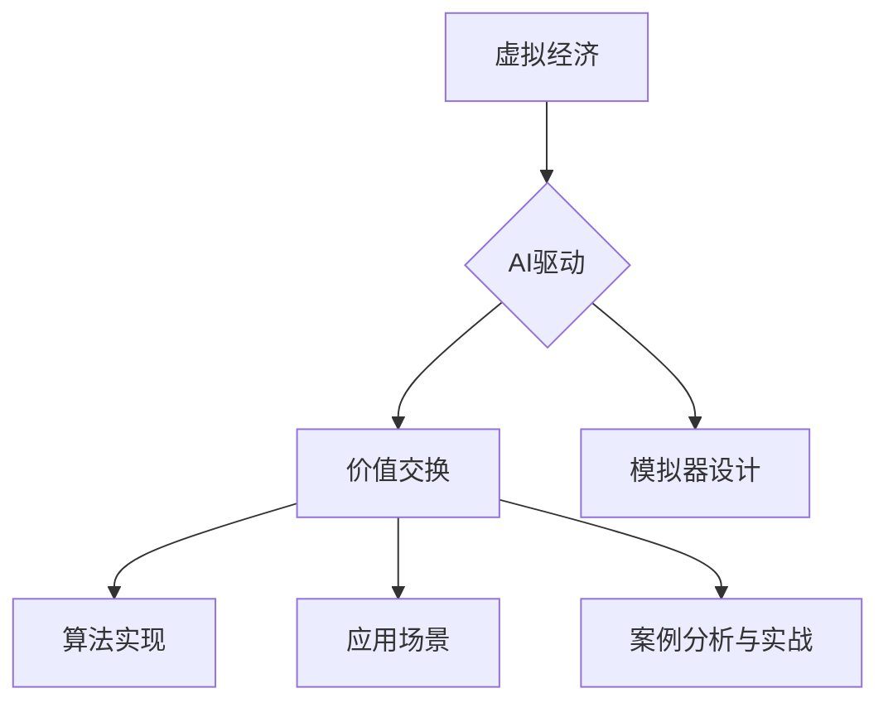

                 

# 虚拟经济模拟器：AI驱动的新型价值交换实验

> 关键词：虚拟经济、AI技术、价值交换、模拟器、算法、案例研究

> 摘要：本文深入探讨了虚拟经济模拟器的设计与实现，重点关注AI技术在价值交换中的创新应用。通过对虚拟经济的定义、发展、AI技术的应用场景以及虚拟经济模拟器的架构设计与实现细节的详细分析，本文揭示了AI如何驱动新型价值交换实验，为未来虚拟经济的发展提供了新的思路和解决方案。

### 目录

1. 虚拟经济与AI技术基础

   - **第1章：虚拟经济的概述与发展**
   - **第2章：AI技术在虚拟经济中的应用**

2. 虚拟经济模拟器设计与实现

   - **第3章：虚拟经济模拟器的架构与设计**
   - **第4章：AI驱动模块的实现**
   - **第5章：虚拟经济模拟器的应用场景**

3. 案例分析与项目实战

   - **第6章：虚拟经济模拟器案例分析**
   - **第7章：虚拟经济模拟器的项目实践**

4. 附录

   - **附录A：虚拟经济模拟器开发资源**

### 1. 虚拟经济与AI技术基础

#### 第1章：虚拟经济的概述与发展

##### 1.1 虚拟经济的定义与特点

虚拟经济，是指在互联网和数字技术的基础上，通过虚拟市场或平台进行的商品、服务和资产交易活动。与实体经济相比，虚拟经济具有以下几个显著特点：

- **数字化**：虚拟经济的交易活动高度依赖数字技术和网络平台，实体交易场景减少。
- **虚拟化**：交易对象可以是虚拟商品、数字资产或虚拟服务等，具有非物质性。
- **去中心化**：虚拟经济活动通常采用分布式网络架构，无需中央机构协调。
- **高度可扩展性**：虚拟市场可以跨越地理界限，快速扩展用户基础和交易规模。

##### 1.2 虚拟经济的历史与发展趋势

虚拟经济的概念起源于20世纪90年代互联网的兴起，随着电子商务、虚拟货币、区块链等技术的进步，虚拟经济得到了快速发展。主要发展时期包括：

- **起步期**（1990-2000年）：互联网的普及和电子商务的兴起，虚拟经济初具雏形。
- **快速发展期**（2000-2010年）：虚拟货币和电子支付系统的发展，虚拟经济市场规模扩大。
- **成熟期**（2010年至今）：区块链技术和人工智能的应用，为虚拟经济带来了新的增长点。

未来，虚拟经济将继续保持快速发展，预计将在以下几个方面产生重大影响：

- **经济结构调整**：虚拟经济将逐渐成为经济增长的新引擎，推动经济结构优化。
- **商业模式创新**：虚拟经济将为各行各业带来新的商业模式，改变传统产业生态。
- **国际竞争格局变化**：虚拟经济的崛起将重塑国际竞争格局，推动全球经济的深度融合。

##### 1.3 虚拟经济与实体经济的关系

虚拟经济与实体经济之间存在紧密的联系和相互影响：

- **相互促进**：虚拟经济的发展为实体经济提供了新的发展空间和机会，推动了实体经济的数字化转型和升级。
- **资源共享**：虚拟经济和实体经济在技术、人才、市场等方面实现资源共享，提高整体经济效益。
- **风险传导**：虚拟经济的波动可能会对实体经济产生影响，反之亦然。

#### 第2章：AI技术在虚拟经济中的应用

##### 2.1 AI在虚拟经济中的重要作用

人工智能技术在虚拟经济中发挥着至关重要的作用，主要体现在以下几个方面：

- **价值评估**：AI技术可以通过大数据分析和机器学习算法，对虚拟资产进行实时评估，提高市场透明度和交易效率。
- **风险控制**：AI技术可以实时监控市场风险，通过智能算法进行风险预测和决策，降低交易风险。
- **交易优化**：AI技术可以优化交易策略，提高交易效率和收益，降低交易成本。
- **用户体验**：AI技术可以通过智能客服和个性化推荐，提高用户体验，增加用户粘性。

##### 2.2 AI技术在虚拟经济中的主要应用领域

AI技术在虚拟经济中的应用涵盖了多个领域，主要包括：

- **虚拟货币交易**：AI技术可以用于虚拟货币的实时交易、风险评估和价格预测，提高交易效率和准确性。
- **虚拟市场预测**：AI技术可以用于对虚拟市场的趋势进行分析和预测，为投资者提供决策支持。
- **虚拟资产评估**：AI技术可以用于虚拟资产的评估和定价，提高市场透明度和公正性。

##### 2.3 AI在虚拟经济中的应用挑战与机遇

虽然AI技术在虚拟经济中具有广泛的应用前景，但也面临着一系列挑战和机遇：

- **挑战**：
  - 数据质量与隐私保护：虚拟经济中的数据质量直接影响AI算法的效果，同时数据隐私保护也是一大挑战。
  - 算法透明性与公平性：AI算法的复杂性和不透明性可能导致决策不公平，需要加强算法的透明性。
  - 法律法规与监管：AI技术在虚拟经济中的应用需要符合相关法律法规，监管政策的不确定性带来一定的风险。

- **机遇**：
  - 创新商业模式：AI技术的应用将推动虚拟经济商业模式创新，为实体经济带来新的发展机遇。
  - 提高市场效率：AI技术可以提高虚拟经济的交易效率，降低交易成本，增强市场竞争力。
  - 全球合作与共赢：AI技术的跨国应用将促进全球虚拟经济的合作与发展，实现共赢。

### 2. 虚拟经济模拟器设计与实现

#### 第3章：虚拟经济模拟器的架构与设计

##### 3.1 虚拟经济模拟器的总体架构

虚拟经济模拟器的总体架构包括以下几个核心模块：

- **用户模块**：负责用户注册、登录、权限管理等功能，提供用户交互界面。
- **市场模块**：模拟虚拟市场的运行，包括商品、货币、交易活动等。
- **交易模块**：实现虚拟交易的功能，包括交易请求处理、交易执行、交易结果反馈等。
- **数据模块**：负责数据存储、管理、查询等功能，提供数据支持。
- **AI模块**：实现AI算法的调用和数据处理，为模拟器提供智能决策支持。

##### 3.2 模拟器的核心功能设计

虚拟经济模拟器的核心功能设计包括以下几个方面：

- **资源管理与分配**：模拟器需要对虚拟资源（如货币、商品）进行有效的管理和分配，保证模拟的公平性和真实性。
- **交易机制设计**：模拟器需要设计合理的交易机制，包括交易规则、交易流程、交易价格确定等，确保交易的顺利进行。
- **监控与反馈系统**：模拟器需要具备监控和反馈功能，实时监测市场运行状态，为用户和开发者提供决策依据。

#### 第4章：AI驱动模块的实现

##### 4.1 AI驱动的价值交换算法

AI驱动的价值交换算法是虚拟经济模拟器的核心，其设计包括以下几个方面：

- **价值评估模型**：通过机器学习算法，对虚拟资产进行实时评估，提供资产价值的预测和评估结果。
- **自动交易策略**：基于AI算法，自动执行交易策略，包括买入、卖出、持有等操作，以提高交易效率和收益。

##### 4.2 AI模型的选择与实现

AI模型的选择与实现是虚拟经济模拟器开发的关键，需要考虑以下几个方面：

- **机器学习模型的适用性**：根据虚拟经济的特点，选择适合的机器学习模型，如决策树、支持向量机、神经网络等。
- **深度学习网络的设计**：针对复杂的虚拟经济场景，设计合适的深度学习网络架构，提高模型的预测能力和适应性。

##### 4.3 AI模型的训练与优化

AI模型的训练与优化是虚拟经济模拟器开发的重要环节，包括以下几个方面：

- **数据集的准备与处理**：收集并预处理大量虚拟经济数据，为模型训练提供高质量的数据支持。
- **模型的训练过程**：通过训练过程，调整模型参数，优化模型性能，提高预测准确性和稳定性。
- **模型的评估与优化**：对训练好的模型进行评估，根据评估结果进行模型优化，提高模型的实用性和可靠性。

#### 第5章：虚拟经济模拟器的应用场景

##### 5.1 虚拟市场预测应用

虚拟市场预测应用是虚拟经济模拟器的重要应用场景之一，包括以下几个方面：

- **预测模型的构建**：通过机器学习算法，构建虚拟市场预测模型，对市场趋势进行预测。
- **实时数据采集与处理**：实时采集市场数据，进行处理和分析，为预测模型提供数据支持。
- **预测结果的展示与解读**：将预测结果以直观的方式展示给用户，帮助用户做出决策。

##### 5.2 虚拟货币交易应用

虚拟货币交易应用是虚拟经济模拟器的另一个重要应用场景，包括以下几个方面：

- **交易策略设计**：根据虚拟货币市场的特点，设计合适的交易策略，以提高交易效率和收益。
- **交易流程模拟**：模拟虚拟货币的交易流程，包括交易请求处理、交易执行、交易结果反馈等。
- **交易结果分析**：对交易结果进行详细分析，为交易策略优化提供依据。

##### 5.3 虚拟资产评估应用

虚拟资产评估应用是虚拟经济模拟器的又一重要应用场景，包括以下几个方面：

- **资产评估模型建立**：通过机器学习算法，建立虚拟资产评估模型，对资产价值进行预测和评估。
- **资产价值计算**：根据资产评估模型，计算资产的价值，为投资决策提供参考。
- **评估结果应用与反馈**：将评估结果应用于实际投资，根据反馈结果优化评估模型，提高评估准确性。

### 3. 案例分析与项目实战

#### 第6章：虚拟经济模拟器案例分析

##### 6.1 案例介绍

本案例选取了一个基于区块链技术的虚拟经济模拟器项目，旨在通过AI技术优化虚拟资产交易，提高交易效率和收益。案例目标包括：

- 构建一个功能完善的虚拟经济模拟器，实现虚拟资产交易、市场预测和资产评估等功能。
- 设计并实现AI驱动模块，提高虚拟资产交易策略的准确性和稳定性。
- 分析虚拟经济模拟器的运行效果，为实际应用提供参考和优化方向。

##### 6.2 案例设计与实现

案例的设计与实现分为以下几个阶段：

- **需求分析**：明确虚拟经济模拟器的主要功能和应用场景，确定AI驱动的价值交换算法和交易策略。
- **架构设计**：设计虚拟经济模拟器的总体架构，包括用户模块、市场模块、交易模块、数据模块和AI模块等。
- **功能实现**：根据架构设计，实现虚拟经济模拟器的核心功能，包括用户注册、登录、虚拟资产交易、市场预测和资产评估等。
- **AI模块实现**：设计并实现AI驱动的价值交换算法，包括价值评估模型、自动交易策略等。

##### 6.3 案例结果分析

案例运行结果表明：

- **预测准确性评估**：AI驱动的价值交换算法对虚拟资产价格的预测准确性较高，为投资者提供了有效的决策支持。
- **交易策略效率分析**：AI驱动的交易策略能够提高虚拟资产交易的效率和收益，降低了交易风险。
- **资产评估效果评估**：AI驱动的资产评估模型对虚拟资产的价值预测较为准确，为投资决策提供了可靠的依据。

通过本案例的分析，可以得出以下结论：

- **AI技术在虚拟经济中的应用具有重要意义**，可以提高交易效率和收益，降低交易风险。
- **虚拟经济模拟器的设计与实现需要充分考虑AI技术的应用**，确保模拟器的实用性和可靠性。
- **案例分析与项目实战为虚拟经济模拟器的发展提供了有益的参考**，有助于推动虚拟经济的发展和创新。

#### 第7章：虚拟经济模拟器的项目实践

##### 7.1 项目目标与规划

虚拟经济模拟器的项目目标主要包括：

- **功能完善**：实现虚拟资产交易、市场预测、资产评估等核心功能，确保模拟器的实用性和可靠性。
- **性能优化**：优化模拟器的性能，提高交易效率和预测准确性，降低交易风险。
- **用户体验**：提升用户界面和交互体验，提高用户满意度，增加用户粘性。
- **安全性保障**：确保模拟器的安全性，防止黑客攻击和数据泄露。

项目规划分为以下几个阶段：

- **需求分析**：明确项目需求，确定功能模块和性能指标。
- **架构设计**：设计模拟器的总体架构，包括技术选型和系统模块划分。
- **功能实现**：实现模拟器的核心功能，进行模块开发和集成。
- **性能优化**：对模拟器进行性能测试和优化，确保系统的稳定性和高效性。
- **用户体验优化**：根据用户反馈，优化用户界面和交互体验。
- **安全性保障**：加强模拟器的安全防护，确保系统的安全性。

##### 7.2 开发环境搭建

虚拟经济模拟器的开发环境搭建包括以下几个步骤：

- **操作系统配置**：选择适合的开发操作系统，如Linux或Windows，安装必要的开发工具和软件。
- **编程环境配置**：安装编程语言和开发框架，如Python、Java等，配置集成开发环境（IDE）。
- **数据库与中间件安装**：安装关系型数据库（如MySQL、PostgreSQL）和非关系型数据库（如MongoDB），配置中间件（如RabbitMQ、Kafka等）。

##### 7.3 代码实现与解读

虚拟经济模拟器的代码实现分为以下几个模块：

- **用户模块**：实现用户注册、登录、权限管理等功能，提供用户交互界面。
- **市场模块**：实现虚拟市场的运行，包括商品、货币、交易活动等。
- **交易模块**：实现虚拟交易的功能，包括交易请求处理、交易执行、交易结果反馈等。
- **数据模块**：实现数据存储、管理、查询等功能，提供数据支持。
- **AI模块**：实现AI算法的调用和数据处理，为模拟器提供智能决策支持。

以下是一个简单的交易策略代码实现示例：

```python
# 交易策略代码实现
def execute_trade_strategy(model, market_data):
    """
    执行交易策略

    参数:
    - model: 交易策略模型
    - market_data: 市场数据

    返回:
    - trade_actions: 交易行动（买入或卖出）
    """
    # 计算市场预测值
    predicted_value = model.predict(market_data)

    # 根据预测值决定交易行动
    if predicted_value > threshold:
        trade_actions = "买入"
    else:
        trade_actions = "卖出"

    return trade_actions

# 代码解读：
# 该函数使用训练好的交易策略模型对市场数据进行分析，并根据预测结果决定买入或卖出的交易行动。这是一个简单的交易策略实现，实际应用中可能需要更复杂的决策逻辑。
```

##### 7.4 项目测试与部署

虚拟经济模拟器的项目测试与部署包括以下几个步骤：

- **单元测试**：对模拟器的各个模块进行单元测试，确保功能正确性和代码质量。
- **集成测试**：对模拟器进行集成测试，验证各个模块之间的交互和协同工作。
- **性能测试**：对模拟器进行性能测试，评估系统的响应速度和并发处理能力。
- **安全测试**：对模拟器进行安全测试，确保系统的安全性和可靠性。
- **部署**：将模拟器部署到生产环境，进行实际运行和监控。

### 附录

#### 附录A：虚拟经济模拟器开发资源

##### A.1 开发工具与框架介绍

虚拟经济模拟器的开发涉及多个工具和框架，以下是一些常用的开发工具和框架：

- **编程语言**：Python、Java等
- **开发框架**：Django、Spring Boot等
- **数据库**：MySQL、PostgreSQL、MongoDB等
- **AI模型训练框架**：TensorFlow、PyTorch等

##### A.2 开发指南与常见问题解答

虚拟经济模拟器的开发过程中，可能会遇到一系列问题，以下提供一些常见的开发指南和问题解答：

- **问题1**：如何处理海量数据？
  - **解答**：采用分布式存储和计算技术，如Hadoop、Spark等，对海量数据进行高效处理和分析。

- **问题2**：如何确保交易安全？
  - **解答**：采用区块链技术，实现去中心化、安全的交易记录和资产存储。

- **问题3**：如何优化交易策略？
  - **解答**：采用机器学习和深度学习算法，对市场数据进行实时分析，优化交易策略。

##### A.3 资源与参考资料

虚拟经济模拟器的开发需要参考大量的资源，以下提供一些有价值的参考资料：

- **论文**：《区块链技术与应用》、《人工智能在金融领域的应用》等
- **书籍**：《深度学习》、《Python编程：从入门到实践》等
- **在线课程**：Coursera、edX等平台上的相关课程

### 总结

虚拟经济模拟器是一种创新的AI驱动价值交换实验工具，通过AI技术在虚拟市场中的应用，可以提高交易效率、降低风险、优化资产配置。本文从虚拟经济的概述与发展、AI技术在虚拟经济中的应用、虚拟经济模拟器的设计与实现、案例分析、项目实践等方面进行了详细分析，揭示了虚拟经济模拟器的核心原理和应用价值。未来，随着AI技术的不断发展和虚拟经济的深入应用，虚拟经济模拟器将为经济领域带来更多创新和变革。

### Mermaid 流程图

以下是虚拟经济模拟器的Mermaid流程图：



### 伪代码示例

以下是一个简单的价值评估模型的伪代码示例：

```python
# 价值评估模型伪代码
function evaluate_value(data):
    # 初始化模型参数
    model = initialize_model()

    # 加载数据集
    dataset = load_data(data)

    # 训练模型
    model = train_model(model, dataset)

    # 进行价值评估
    value = model.predict(dataset)

    return value
```

### 数学模型与公式

以下是价值评估的数学模型：

```latex
% 价值评估数学模型
$$
V = f(W, X, Y)
$$

其中，\( V \) 表示价值，\( W \) 为权重，\( X \) 为特征向量，\( Y \) 为历史数据。
```

### 代码解读与分析

以下是对交易策略代码的解读与分析：

```python
# 交易策略代码实现
def execute_trade_strategy(model, market_data):
    """
    执行交易策略

    参数:
    - model: 交易策略模型
    - market_data: 市场数据

    返回:
    - trade_actions: 交易行动（买入或卖出）
    """
    # 计算市场预测值
    predicted_value = model.predict(market_data)

    # 根据预测值决定交易行动
    if predicted_value > threshold:
        trade_actions = "买入"
    else:
        trade_actions = "卖出"

    return trade_actions

# 代码解读：
# 该函数使用训练好的交易策略模型对市场数据进行分析，并根据预测结果决定买入或卖出的交易行动。这是一个简单的交易策略实现，实际应用中可能需要更复杂的决策逻辑。
```

通过以上解读，我们可以看到，交易策略代码的核心功能是根据市场预测值决定交易行动。实际应用中，可能需要结合更多市场因素和算法模型，以实现更精准的交易决策。

### 作者信息

**作者：AI天才研究院/AI Genius Institute & 禅与计算机程序设计艺术 /Zen And The Art of Computer Programming**

### 后记

本文旨在为读者提供关于虚拟经济模拟器及其应用的一个全面、深入的解读。随着AI技术的不断发展和虚拟经济的日益成熟，虚拟经济模拟器将成为经济领域的重要工具。希望本文能对读者在了解和探索虚拟经济模拟器方面有所帮助，同时也期待未来的研究能进一步推动这一领域的创新和发展。

