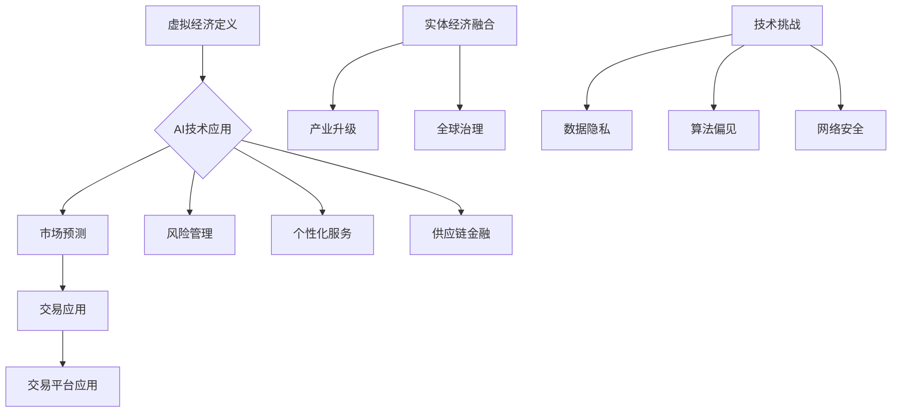
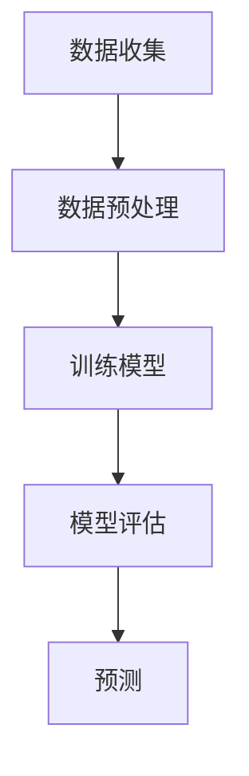
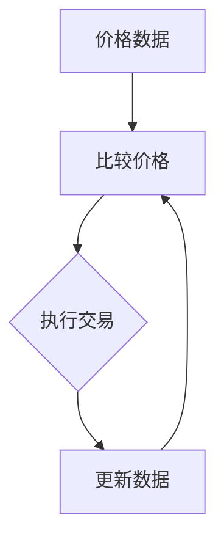
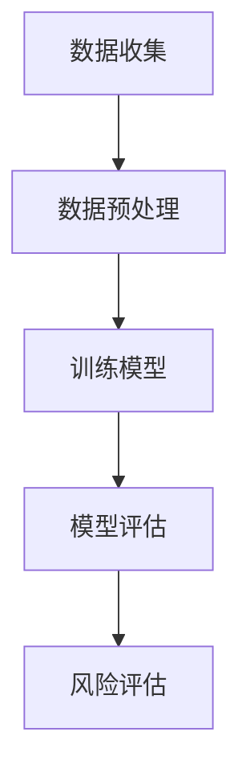

                 

# 《虚拟经济：AI驱动的新型价值交换》

> 关键词：虚拟经济，AI，价值交换，市场预测，交易平台，监管挑战

> 摘要：本文探讨了虚拟经济的概念、特征和应用，重点分析了AI技术在虚拟经济中的应用，包括交易、市场预测、商品交易平台等方面。同时，文章还讨论了虚拟经济中的AI风险与监管挑战，并通过对典型案例的研究，展望了虚拟经济的未来发展趋势。

## 目录大纲

## 第一部分：虚拟经济的定义与概述

### 第1章：虚拟经济的概念与特征

#### 1.1 虚拟经济的起源与发展

#### 1.2 虚拟经济的特征与核心要素

#### 1.3 虚拟经济与传统经济的比较

### 第2章：虚拟经济的基础理论

#### 2.1 虚拟经济的价值创造与价值转移

#### 2.2 虚拟经济中的市场机制

#### 2.3 虚拟经济与社会福利的关系

## 第二部分：AI技术在虚拟经济中的应用

### 第3章：AI在虚拟经济交易中的应用

#### 3.1 AI技术在虚拟货币交易中的应用

#### 3.2 AI在虚拟经济市场预测中的应用

#### 3.3 AI在虚拟商品交易平台中的应用

### 第4章：AI驱动的虚拟经济生态系统

#### 4.1 AI在虚拟经济中的产业链分析

#### 4.2 AI驱动的虚拟经济商业模式

#### 4.3 AI在虚拟经济治理中的角色

### 第5章：虚拟经济中的AI风险与监管

#### 5.1 虚拟经济中的AI风险分析

#### 5.2 虚拟经济的监管挑战与对策

#### 5.3 AI技术在虚拟经济监管中的应用

## 第三部分：案例研究

### 第6章：虚拟经济案例研究

#### 6.1 比特币：虚拟经济的典型案例

#### 6.2 虚拟现实：AI驱动的虚拟经济新领域

#### 6.3 去中心化金融：AI在虚拟经济中的应用

### 第7章：虚拟经济的未来发展趋势

#### 7.1 虚拟经济与实体经济的融合

#### 7.2 AI驱动虚拟经济的创新方向

#### 7.3 虚拟经济的全球治理与合作

## 附录

### 附录A：虚拟经济与AI相关资源

#### A.1 虚拟经济研究机构与学术期刊

#### A.2 AI在虚拟经济中的应用工具与平台

#### A.3 虚拟经济与AI的相关政策与法规

## 后记

### 后记：虚拟经济与AI的未来发展展望

## 参考文献

### 参考文献：《虚拟经济：AI驱动的新型价值交换》所引用的相关文献与资料。

## Mermaid 流程图：虚拟经济与AI技术应用流程图

## 核心算法原理讲解：虚拟经济中的AI算法原理详解

## 数学模型与数学公式：虚拟经济中的数学模型与应用

## 项目实战：虚拟经济与AI应用的实战案例与代码解读

## 第一部分：虚拟经济的定义与概述

### 第1章：虚拟经济的概念与特征

#### 1.1 虚拟经济的起源与发展

虚拟经济，顾名思义，是一种在经济活动中主要依托于数字和网络技术进行的价值交换形式。与传统的实体经济相比，虚拟经济更多地依赖于虚拟空间，如互联网、区块链等，来进行交易、支付和认证。其起源可以追溯到20世纪末互联网的普及和电子商务的兴起。

在早期的互联网时代，虚拟经济的雏形主要表现为在线购物、在线游戏等，这些活动虽然具有虚拟性，但基本上还是围绕实体商品和服务的交换。随着技术的进步，特别是区块链、人工智能等新兴技术的应用，虚拟经济逐渐脱离了传统实体的束缚，开始发展成为一个独立且庞大的经济体系。

虚拟经济的快速发展得益于以下几个方面：

1. **互联网的普及**：互联网的广泛普及为虚拟经济的诞生提供了基础设施，使得人们可以方便地通过数字网络进行交流和交易。
2. **移动设备的普及**：智能手机和平板电脑的普及，使得虚拟经济活动可以随时随地发生，不再受时间和地点的限制。
3. **区块链技术的应用**：区块链技术提供了一种去中心化的信任机制，使得虚拟经济中的交易和支付变得更加安全和透明。
4. **人工智能的赋能**：人工智能技术通过对海量数据的分析和预测，提高了虚拟经济市场的效率和准确性。

#### 1.2 虚拟经济的特征与核心要素

虚拟经济具有以下几个显著特征：

1. **虚拟性**：虚拟经济主要在虚拟空间中进行，如互联网、区块链等，这使得交易和支付不再依赖于物理实体。
2. **全球性**：由于互联网的全球覆盖，虚拟经济活动可以跨越国界，实现全球范围内的价值交换。
3. **匿名性**：虚拟经济中的交易参与者可以通过匿名身份进行操作，这使得虚拟市场具有更高的自由度和灵活性。
4. **高效率**：虚拟经济通过数字技术的应用，大大提高了交易的效率和速度。
5. **高风险**：虚拟经济的匿名性和全球性也带来了更高的风险，如网络诈骗、市场操纵等。

虚拟经济中的核心要素主要包括：

1. **数据**：数据是虚拟经济的核心资产，通过对数据的分析和挖掘，可以指导市场预测和决策。
2. **算法**：算法是虚拟经济中的核心工具，用于数据分析和预测，以及优化交易策略。
3. **区块链**：区块链技术提供了一种去中心化的信任机制，确保了虚拟经济中的交易和支付的安全和透明。
4. **人工智能**：人工智能技术通过对海量数据的分析和预测，提高了虚拟经济市场的效率和准确性。

#### 1.3 虚拟经济与传统经济的比较

虚拟经济与传统经济之间存在一些显著的差异：

1. **交易媒介**：传统经济主要依赖于物理货币，而虚拟经济则更多地依赖于数字货币和加密货币。
2. **交易成本**：虚拟经济中的交易成本通常较低，因为数字技术和网络技术的应用降低了交易的成本。
3. **交易速度**：虚拟经济中的交易速度更快，因为数字技术和网络技术的应用大大提高了交易的效率。
4. **市场透明度**：虚拟经济中的市场透明度通常更高，因为区块链技术提供了一种去中心化的信任机制，确保了交易和支付的安全和透明。

然而，虚拟经济与传统经济也存在一些相似之处，例如，两者都需要遵循市场规则，都需要进行价值交换，都需要考虑到风险和监管等因素。

### 第2章：虚拟经济的基础理论

#### 2.1 虚拟经济的价值创造与价值转移

虚拟经济的价值创造和价值转移是通过数字技术和网络技术实现的。具体来说，虚拟经济的价值创造主要涉及以下几个方面：

1. **内容创造**：在虚拟经济中，内容创造是一种重要的价值创造方式。例如，在社交媒体平台上，用户生成的内容可以吸引大量观众，从而产生广告收入。
2. **数据挖掘**：通过对用户数据的挖掘和分析，企业可以了解用户需求，提供更有针对性的产品和服务，从而创造价值。
3. **算法优化**：通过算法优化，可以提高虚拟经济市场的效率和准确性，从而创造价值。
4. **区块链应用**：区块链技术提供了一种去中心化的信任机制，确保了虚拟经济中的交易和支付的安全和透明，从而创造价值。

虚拟经济的价值转移主要通过数字货币和加密货币来实现。具体来说，虚拟经济的价值转移主要涉及以下几个方面：

1. **数字货币交易**：在虚拟经济中，数字货币是最常见的交易媒介。通过数字货币的交易，虚拟经济的价值可以在不同的参与者之间转移。
2. **加密货币交易**：加密货币是虚拟经济中的一种重要资产。通过加密货币的交易，虚拟经济的价值可以在不同的参与者之间转移。
3. **区块链交易**：在区块链平台上，通过智能合约和去中心化应用（DApp），虚拟经济的价值可以在不同的参与者之间转移。

#### 2.2 虚拟经济中的市场机制

虚拟经济中的市场机制与传统经济市场机制存在一些差异。虚拟经济中的市场机制主要涉及以下几个方面：

1. **价格机制**：在虚拟经济中，价格机制主要由市场需求和供给决定。然而，由于虚拟市场的全球性和匿名性，价格机制的运作可能更加复杂。
2. **竞争机制**：在虚拟经济中，竞争机制更加激烈。由于虚拟市场的全球性，竞争者可以来自世界各地，这使得市场竞争更加激烈。
3. **信息机制**：在虚拟经济中，信息机制更加重要。由于虚拟市场的匿名性和全球性，信息的不对称性可能更高，因此，信息的获取和处理能力成为竞争优势的重要因素。
4. **交易机制**：在虚拟经济中，交易机制更加多样。除了传统的买卖交易，虚拟经济中还包括租赁、分享、众筹等多种交易形式。

#### 2.3 虚拟经济与社会福利的关系

虚拟经济与社会福利的关系是一个复杂且多维的问题。虚拟经济对社会福利的影响可以从以下几个方面来分析：

1. **经济增长**：虚拟经济可以促进经济增长。通过提高交易效率和降低交易成本，虚拟经济可以增加经济的整体活力。
2. **就业机会**：虚拟经济可以创造新的就业机会。例如，在虚拟货币交易、虚拟商品交易平台等领域，都需要大量的专业人员。
3. **社会福利分配**：虚拟经济可能对社会福利分配产生一定的影响。例如，虚拟经济中的财富可能更加集中在少数人手中，导致社会福利分配不均。
4. **监管挑战**：虚拟经济带来的监管挑战也可能对社会福利产生影响。例如，虚拟经济中的非法交易、网络诈骗等问题，需要有效的监管措施来解决。

总的来说，虚拟经济对社会福利的影响是双刃剑。一方面，虚拟经济可以促进经济增长和就业机会；另一方面，虚拟经济也可能带来新的监管挑战和社会福利分配问题。

### 第3章：虚拟经济的基础理论

#### 2.1 虚拟经济的价值创造与价值转移

虚拟经济的价值创造和价值转移是通过数字技术和网络技术实现的。具体来说，虚拟经济的价值创造主要涉及以下几个方面：

1. **内容创造**：在虚拟经济中，内容创造是一种重要的价值创造方式。例如，在社交媒体平台上，用户生成的内容可以吸引大量观众，从而产生广告收入。内容创造不仅限于文字和图片，还包括视频、音乐等多种形式。通过创新的内容创作和高质量的互动体验，用户可以产生更高的参与度和忠诚度，从而为平台和内容创作者创造价值。

   **示例**：在YouTube平台上，用户通过上传视频内容，吸引了大量的观众。随着观众数量的增加，平台会根据观看时长和广告点击率向内容创作者支付报酬。这种模式不仅为内容创作者带来了收入，还促进了整个虚拟经济生态系统的繁荣。

2. **数据挖掘**：通过对用户数据的挖掘和分析，企业可以了解用户需求，提供更有针对性的产品和服务，从而创造价值。数据挖掘涉及到用户行为分析、消费习惯分析、市场趋势预测等多个方面。通过这些分析，企业可以更好地理解用户，提供个性化的产品和服务，从而提高用户满意度和忠诚度。

   **示例**：电商平台通过收集用户浏览、购买和评价等行为数据，可以分析出用户的偏好和需求。基于这些数据，平台可以推荐更符合用户兴趣的商品，提高销售转化率和用户满意度。同时，数据挖掘还可以帮助企业优化供应链管理、降低运营成本，进一步提高企业的盈利能力。

3. **算法优化**：通过算法优化，可以提高虚拟经济市场的效率和准确性，从而创造价值。算法优化涉及市场预测、风险控制、交易策略等多个方面。例如，在虚拟货币交易中，通过优化交易算法，可以提高交易的速度和准确性，降低交易风险，从而创造更多的价值。

   **示例**：在比特币交易市场中，高频交易者通过优化交易算法，可以快速捕捉市场波动，进行多笔交易，从而获得更高的收益。同时，算法优化还可以用于智能投顾，为投资者提供个性化的投资建议，提高投资收益率。

4. **区块链应用**：区块链技术提供了一种去中心化的信任机制，确保了虚拟经济中的交易和支付的安全和透明，从而创造价值。区块链技术不仅用于数字货币交易，还广泛应用于供应链管理、版权保护、身份验证等领域。

   **示例**：在供应链管理中，区块链技术可以确保供应链的透明性和可追溯性，从原材料采购到生产、运输、销售全过程的信息都可以被记录在区块链上，从而提高供应链的效率和信任度。在版权保护中，区块链技术可以确保版权的合法性和安全性，防止未经授权的复制和传播。

通过以上几个方面的价值创造，虚拟经济不仅为参与者带来了直接的经济收益，还促进了整个社会的创新和发展。

#### 2.2 虚拟经济中的市场机制

虚拟经济中的市场机制与传统经济市场机制存在一些差异。虚拟经济中的市场机制主要涉及以下几个方面：

1. **价格机制**：在虚拟经济中，价格机制主要由市场需求和供给决定。然而，由于虚拟市场的全球性和匿名性，价格机制的运作可能更加复杂。在传统市场中，价格通常由供需关系决定，但在虚拟市场中，价格还受到市场情绪、投机行为等因素的影响。

   **示例**：在加密货币市场中，价格波动较大，经常受到市场情绪和投机行为的影响。例如，当某个加密货币被广泛认为是具有潜力的投资时，其价格可能会迅速上涨，而一旦市场对它的信心下降，价格就会快速下跌。这种价格波动给投资者带来了高风险和高回报的机会。

2. **竞争机制**：在虚拟经济中，竞争机制更加激烈。由于虚拟市场的全球性，竞争者可以来自世界各地，这使得市场竞争更加激烈。在传统市场中，企业通常只能在特定的地理区域内竞争，而在虚拟市场中，企业可以突破地域限制，参与全球竞争。

   **示例**：在电子商务领域，许多传统零售商纷纷进入虚拟市场，与全球的电子商务平台和独立卖家竞争。这种竞争不仅促进了市场的创新和进步，也带来了价格战和用户忠诚度争夺等问题。

3. **信息机制**：在虚拟经济中，信息机制更加重要。由于虚拟市场的匿名性和全球性，信息的不对称性可能更高，因此，信息的获取和处理能力成为竞争优势的重要因素。

   **示例**：在股票交易市场中，信息不对称可能导致某些参与者拥有优于其他参与者的信息，从而获得更高的收益。通过大数据分析和人工智能技术，企业可以更好地获取和处理市场信息，从而在竞争中占据优势。

4. **交易机制**：在虚拟经济中，交易机制更加多样。除了传统的买卖交易，虚拟经济中还包括租赁、分享、众筹等多种交易形式。

   **示例**：在共享经济领域，共享单车、共享汽车等平台通过提供租赁服务，实现了闲置资源的有效利用。在众筹领域，通过众筹平台，创新者可以向公众筹集资金，实现创新项目的融资。

总之，虚拟经济中的市场机制具有全球性、匿名性、多样性和高竞争性的特点。这些特点既带来了新的机遇，也带来了新的挑战。了解和掌握这些市场机制，对于参与虚拟经济活动具有重要意义。

#### 2.3 虚拟经济与社会福利的关系

虚拟经济与社会福利的关系是一个复杂且多维的问题。虚拟经济对社会福利的影响可以从以下几个方面来分析：

1. **经济增长**：虚拟经济可以促进经济增长。通过提高交易效率和降低交易成本，虚拟经济可以增加经济的整体活力。虚拟经济中的数字货币和区块链技术等创新应用，为传统经济注入了新的动力。例如，区块链技术的应用可以优化供应链管理，降低企业的运营成本，从而提高整体经济效益。

   **示例**：在物流行业中，区块链技术可以确保供应链的透明性和可追溯性，减少物流环节中的信息不对称和欺诈行为，提高物流效率。这种效率提升不仅有助于降低企业的运营成本，还可以提高消费者的满意度。

2. **就业机会**：虚拟经济可以创造新的就业机会。例如，在虚拟货币交易、虚拟商品交易平台等领域，都需要大量的专业人员。这些岗位不仅涵盖了技术开发、数据分析等高技能岗位，还包括市场推广、客户服务等多个层面的工作。

   **示例**：在区块链行业中，技术人员需要掌握区块链技术、智能合约开发等技能，而市场推广人员需要了解区块链技术的应用场景和市场趋势。这些岗位的涌现为求职者提供了更多的就业选择。

3. **社会福利分配**：虚拟经济可能对社会福利分配产生一定的影响。虚拟经济中的财富可能更加集中在少数人手中，导致社会福利分配不均。例如，在加密货币市场中，早期的参与者可能通过低买高卖获取了大量财富，而后期进入市场的参与者则面临更大的风险和不确定性。

   **示例**：比特币的早期投资者通过低价买入比特币，并在比特币价格上涨时高价卖出，获取了巨额收益。而后期进入市场的投资者则可能面临比特币价格波动带来的风险。这种财富分配不均可能导致社会不公平感加剧。

4. **监管挑战**：虚拟经济带来的监管挑战也可能对社会福利产生影响。例如，虚拟经济中的非法交易、网络诈骗等问题，需要有效的监管措施来解决。监管不足可能导致虚拟市场秩序混乱，影响整体社会福利。

   **示例**：在加密货币市场中，由于监管不足，一些不法分子利用加密货币进行洗钱、非法交易等活动。这些行为不仅损害了市场的信誉，还可能导致投资者损失巨大。因此，加强监管对于维护市场秩序和保护投资者权益至关重要。

总的来说，虚拟经济对社会福利的影响是双刃剑。一方面，虚拟经济可以促进经济增长和就业机会；另一方面，虚拟经济也可能带来新的监管挑战和社会福利分配问题。如何平衡虚拟经济带来的利弊，实现可持续发展，是一个需要深入探讨和解决的问题。

### 第4章：AI技术在虚拟经济中的应用

#### 3.1 AI技术在虚拟货币交易中的应用

AI技术在虚拟货币交易中的应用日益广泛，极大地提高了交易效率和市场预测的准确性。以下是一些关键应用：

1. **高频交易**：AI算法可以处理大量市场数据，实时分析价格变动，快速执行交易策略。例如，高频交易者利用AI算法捕捉瞬间的价格波动，进行多笔交易以获取微小的利润。这种交易策略依赖于高速计算机和低延迟网络，AI技术在其中发挥了至关重要的作用。

   **示例**：在比特币市场中，高频交易者通过AI算法分析市场数据，可以实时调整交易策略，以最大化收益。例如，当市场出现异常波动时，AI算法可以迅速识别并执行交易，从而在短时间内获得高额回报。

2. **市场预测**：AI算法通过对历史数据和当前市场状况进行分析，可以预测价格趋势。这种预测能力对于投资者制定交易策略具有重要意义。

   **示例**：AI模型可以通过分析过去的价格走势、交易量、市场情绪等多个因素，预测比特币的未来价格。投资者可以根据这些预测结果，调整自己的投资组合，以最大化收益。

3. **交易风险管理**：AI算法可以帮助投资者识别潜在的交易风险，并采取相应的风险控制措施。例如，AI算法可以监控市场波动，及时发现异常交易行为，从而防止潜在的欺诈行为。

   **示例**：在加密货币市场中，AI算法可以监控交易数据，识别异常交易模式。例如，当检测到某些账户频繁进行大额交易时，AI算法会发出警报，提醒投资者可能存在洗钱等非法行为。

#### 3.2 AI在虚拟经济市场预测中的应用

AI在虚拟经济市场预测中的应用主要体现在以下几个方面：

1. **宏观经济预测**：AI算法可以通过分析大量的宏观经济数据，预测虚拟经济市场的整体趋势。这些数据包括GDP、通货膨胀率、利率等。

   **示例**：通过分析全球各国的GDP数据和虚拟经济市场交易数据，AI算法可以预测虚拟经济市场的整体走势。例如，当全球经济增长加速时，虚拟经济市场可能也会出现增长。

2. **市场趋势预测**：AI算法可以分析市场历史数据，预测特定市场的价格趋势。这种预测对于投资者制定长期投资策略具有重要意义。

   **示例**：AI模型可以通过分析加密货币市场的历史交易数据，预测比特币等加密货币的未来价格趋势。投资者可以根据这些预测结果，制定相应的投资策略。

3. **供需预测**：AI算法可以分析供需关系，预测市场供需变化。这有助于企业制定生产计划和库存管理策略。

   **示例**：在电子商务平台上，AI算法可以通过分析用户行为数据和市场需求，预测不同商品的销售趋势。商家可以根据这些预测结果，优化库存管理，提高销售效率。

#### 3.3 AI在虚拟商品交易平台中的应用

AI技术在虚拟商品交易平台中的应用，不仅提高了交易效率，还增强了用户体验。以下是一些关键应用：

1. **个性化推荐**：AI算法可以通过分析用户行为数据，为用户提供个性化的商品推荐。这种推荐系统可以大大提高用户的购物体验。

   **示例**：在电商平台上，AI算法可以根据用户的浏览历史、购买记录和搜索关键词，推荐用户可能感兴趣的商品。这种个性化推荐不仅提高了用户的满意度，还增加了平台的销售额。

2. **智能客服**：AI技术可以实现智能客服，为用户提供24/7的在线服务。智能客服系统可以处理大量的客户咨询，提高客户服务效率。

   **示例**：在虚拟商品交易平台上，AI客服机器人可以自动回答用户的问题，提供产品信息和购买指南。用户可以通过文字或语音与机器人互动，解决购买过程中遇到的问题。

3. **智能交易**：AI算法可以自动化交易过程，提高交易效率和准确性。例如，在股票交易平台上，AI算法可以自动执行交易策略，实现高频交易。

   **示例**：在加密货币交易平台上，AI算法可以自动分析市场数据，执行买卖交易。这种自动化交易不仅可以提高交易效率，还可以降低交易风险。

通过以上应用，AI技术为虚拟商品交易平台带来了诸多好处，不仅提升了用户体验，还提高了平台的运营效率。未来，随着AI技术的进一步发展，虚拟商品交易平台将继续受益于AI技术的创新应用。

#### 4.1 AI在虚拟经济中的产业链分析

AI技术在虚拟经济中的广泛应用，不仅改变了市场机制，还深刻影响了整个产业链的运作。以下是对AI在虚拟经济产业链中的关键角色和影响的分析：

1. **上游：数据采集与处理**  
AI技术在虚拟经济上游环节的主要作用在于数据采集与处理。通过大数据分析和机器学习算法，AI可以帮助企业收集和分析大量市场数据，包括交易数据、用户行为数据、市场情绪数据等。这些数据为AI模型提供了丰富的训练素材，使得AI在预测市场趋势和优化交易策略方面更加精准。

   **示例**：在虚拟货币市场中，AI算法可以实时分析大量交易数据，识别市场趋势和潜在的风险。通过这些分析结果，交易所和交易平台可以更好地管理风险，制定相应的交易策略。

2. **中游：交易与预测**  
在虚拟经济的中游环节，AI技术主要用于交易和预测。AI算法可以通过分析历史数据和市场现状，预测价格走势，提供买卖建议。此外，AI技术还可以用于高频交易和量化交易，通过快速执行交易策略，实现高收益。

   **示例**：在加密货币交易中，AI算法可以根据市场数据，实时调整交易策略，捕捉价格波动，实现高频交易。这不仅提高了交易效率，还降低了交易风险。

3. **下游：用户服务与体验**  
在虚拟经济的下游环节，AI技术主要用于提升用户体验和服务质量。通过自然语言处理和机器学习算法，AI可以实现智能客服、个性化推荐等功能，为用户提供便捷、高效的服务。

   **示例**：在电商平台中，AI客服机器人可以自动回答用户问题，提供购物建议，提高客户满意度。个性化推荐系统可以根据用户历史行为，推荐符合用户兴趣的商品，增加销售转化率。

4. **综合应用：产业链协同**  
AI技术在虚拟经济产业链的各个环节都有广泛应用，不仅提升了各个环节的效率，还促进了产业链的协同发展。通过AI技术的赋能，企业可以实现从数据采集到交易预测，再到用户服务的全流程优化。

   **示例**：在供应链管理中，AI技术可以实时监控库存情况，预测需求变化，优化库存管理。这不仅提高了供应链的效率，还降低了运营成本。

总之，AI技术在虚拟经济产业链中的应用，不仅提高了各环节的效率，还促进了产业链的协同发展。未来，随着AI技术的进一步发展，虚拟经济产业链将更加智能化，为参与者带来更多的机遇和挑战。

#### 4.2 AI驱动的虚拟经济商业模式

AI技术在虚拟经济中的应用，催生了一系列新的商业模式。以下是一些典型的AI驱动的虚拟经济商业模式：

1. **智能投顾**  
智能投顾（Robo-Advisory）是AI在金融领域的重要应用。通过分析用户的风险偏好、财务状况和市场数据，智能投顾可以为用户提供个性化的投资建议。这些建议包括资产配置、投资组合管理、定期调整等。

   **示例**：智能投顾平台利用AI算法，根据用户的风险承受能力和投资目标，为其推荐适合的投资组合。平台还会根据市场变化，自动调整投资策略，以最大化收益。

2. **智能合约**  
智能合约是一种自动执行合同条款的计算机协议。通过区块链和AI技术的结合，智能合约可以实现自动化交易和支付。智能合约确保了交易的透明性和不可篡改性，提高了交易效率。

   **示例**：在跨境贸易中，智能合约可以自动执行贸易条款，包括支付条件、交货条件等。当货物到达目的地时，智能合约会自动释放支付，确保交易的顺利进行。

3. **去中心化金融（DeFi）**  
去中心化金融是一种利用区块链和AI技术实现的金融体系。在DeFi中，用户可以直接参与金融活动，如借贷、交易、投资等，无需通过传统金融机构。

   **示例**：在去中心化借贷平台中，用户可以基于AI算法的信用评分，直接向其他用户借款或提供贷款。平台通过AI技术分析用户的行为数据，评估其信用风险，从而实现去中心化的借贷服务。

4. **供应链金融**  
AI技术在供应链金融中的应用，可以优化企业的现金流管理，降低融资成本。通过AI算法，供应链上的中小企业可以获得更加灵活和高效的融资服务。

   **示例**：在供应链金融中，AI技术可以分析企业的交易数据、财务报表等，评估其信用风险。基于这些分析结果，金融机构可以为中小企业提供定制化的融资解决方案，提高其资金使用效率。

5. **个性化营销**  
AI技术在个性化营销中的应用，可以大幅提升营销效果。通过分析用户行为数据，AI可以了解用户需求，提供个性化的产品推荐和服务。

   **示例**：在电商平台上，AI技术可以根据用户的浏览记录、购买历史等数据，推荐符合用户兴趣的商品。这不仅提高了用户满意度，还增加了平台的销售额。

通过以上AI驱动的虚拟经济商业模式，企业可以实现更加智能化的运营，提高效率和竞争力。随着AI技术的不断进步，这些商业模式将继续创新和演变，为虚拟经济带来更多的机遇和挑战。

#### 4.3 AI在虚拟经济治理中的角色

AI技术在虚拟经济治理中扮演着至关重要的角色，通过提高监管效率和防范风险，为虚拟经济的健康发展提供了有力支持。以下是一些关键应用：

1. **智能监管**  
AI技术可以通过大数据分析和机器学习模型，实时监测虚拟经济活动，识别异常交易和潜在风险。这种智能监管方式不仅提高了监管效率，还降低了监管成本。

   **示例**：在加密货币市场中，AI算法可以监控交易数据，识别异常交易模式。例如，当检测到某些账户频繁进行大额交易时，AI算法会发出警报，提醒监管机构可能存在洗钱等非法行为。

2. **风险预测**  
AI技术可以通过分析历史数据和当前市场状况，预测虚拟经济中的风险。这种风险预测能力有助于监管机构提前采取预防措施，避免市场崩溃。

   **示例**：在区块链金融中，AI算法可以通过分析交易数据、市场情绪等因素，预测市场风险。当预测到市场可能出现剧烈波动时，监管机构可以提前发布预警，采取措施稳定市场。

3. **智能审计**  
AI技术可以实现自动化审计，提高审计效率和准确性。通过AI算法，监管机构可以自动分析企业的交易记录和财务报表，发现潜在的违规行为。

   **示例**：在虚拟货币交易中，AI算法可以自动审计交易记录，发现虚假交易和洗钱行为。监管机构可以利用这些审计结果，采取相应的监管措施。

4. **智能合同执行**  
AI技术可以通过智能合约，确保合同条款的自动执行，提高交易的透明性和可靠性。智能合约的不可篡改性，有助于降低合同纠纷和违约风险。

   **示例**：在跨境贸易中，智能合约可以自动执行支付条款。当货物到达目的地时，AI算法会自动释放支付，确保交易的顺利进行，同时降低了人为干预的风险。

总之，AI技术在虚拟经济治理中的应用，不仅提高了监管效率和风险防范能力，还为虚拟经济的健康发展提供了技术支持。随着AI技术的不断进步，其在虚拟经济治理中的作用将更加重要，有助于构建一个更加安全、透明的虚拟经济体系。

#### 5.1 虚拟经济中的AI风险分析

虚拟经济的快速发展带来了巨大的机遇，但同时也伴随着一系列的AI风险。以下是虚拟经济中常见的AI风险及其潜在影响：

1. **隐私泄露**  
虚拟经济依赖于大量的用户数据，包括个人身份信息、交易记录等。AI技术在数据分析中的应用，使得这些数据容易被滥用。如果隐私保护措施不到位，用户的个人信息可能会被泄露，导致隐私侵犯和数据滥用。

   **示例**：在虚拟货币交易中，用户的交易记录可能会被恶意AI模型分析，用于身份盗窃、欺诈等犯罪行为。如果用户的信息保护机制不足，其隐私泄露的风险将大大增加。

2. **数据滥用**  
AI算法通过对大量数据进行训练，可能会发现一些敏感信息，这些信息如果被滥用，可能会对用户造成损害。例如，AI算法可以识别用户的消费习惯、健康状态等敏感信息，并将其用于非法目的。

   **示例**：在电商平台上，AI算法可以分析用户的购买记录，识别其消费习惯和偏好。如果这些信息被不法分子获取，可能会用于精准诈骗或市场操纵。

3. **算法偏见**  
AI算法在训练过程中，可能会受到数据偏见的影响，导致算法决策的不公平性。这种偏见可能源于数据集的不均衡、历史数据的偏差等。

   **示例**：在智能投顾平台中，如果训练数据集偏向于某些特定人群，算法可能会对这些人群产生偏见，导致其他群体的投资建议不公平。

4. **恶意攻击**  
虚拟经济中的AI系统可能会成为恶意攻击的目标。黑客可能会利用AI技术进行网络攻击、数据窃取等，造成严重损失。

   **示例**：在加密货币交易中，黑客可能会利用AI算法进行高频交易，操纵市场价格，导致市场波动加剧。此外，AI系统也可能成为网络钓鱼和恶意软件的目标。

5. **模型不可解释性**  
AI模型在决策过程中，往往具有高度复杂性和不可解释性。这种不可解释性使得AI模型的决策过程难以被用户理解和信任。

   **示例**：在智能合约执行过程中，AI算法可能会根据复杂的数据分析结果，自动执行某些操作。用户可能无法理解算法的具体决策过程，导致对AI系统的不信任。

针对以上AI风险，需要采取一系列措施进行预防和控制，以确保虚拟经济的健康发展。

#### 5.2 虚拟经济的监管挑战与对策

虚拟经济的快速发展带来了巨大的机遇，但同时也给监管带来了诸多挑战。以下是虚拟经济中常见的监管挑战及其应对策略：

1. **跨境监管问题**  
虚拟经济具有全球性特点，交易和参与者可以跨越国界，这给跨境监管带来了难题。不同国家和地区的法律法规、监管体系存在差异，导致跨境监管难度增加。

   **应对策略**：建立健全的跨境监管合作机制，加强国际间的监管协调。例如，国际组织可以制定统一的监管标准和规则，推动各国在监管政策上的协同。

2. **隐私保护问题**  
虚拟经济中涉及大量用户数据，隐私保护成为监管的重要挑战。如何平衡数据利用和保护用户隐私，是监管机构需要解决的关键问题。

   **应对策略**：制定严格的隐私保护法规，明确数据收集、存储、使用的规范。同时，鼓励技术创新，发展隐私计算和差分隐私等技术，保护用户隐私。

3. **市场操纵问题**  
虚拟市场中存在潜在的操纵风险，如高频交易、市场操纵等。监管机构需要有效监控和防范这些风险。

   **应对策略**：加强市场监测和监管，利用AI技术实时分析交易数据，识别异常交易行为。此外，建立严格的法律法规，对市场操纵行为进行严厉打击。

4. **法律适用性问题**  
虚拟经济的创新性和复杂性，使得传统法律法规难以完全适用。如何将新兴技术纳入现有法律框架，是监管面临的挑战。

   **应对策略**：加快法律法规的修订和更新，制定专门针对虚拟经济的法律法规。同时，建立灵活的监管框架，以适应虚拟经济的快速发展。

5. **监管技术与能力提升**  
虚拟经济的监管需要先进的科技支持，监管机构需要提升自身的监管技术能力和专业素养。

   **应对策略**：加强监管机构的技术培训，引入先进的监管科技，如区块链、大数据分析等。此外，推动监管科技的研发和应用，提高监管效率。

通过以上对策，监管机构可以更好地应对虚拟经济带来的监管挑战，确保市场的稳定和健康发展。

#### 5.3 AI技术在虚拟经济监管中的应用

AI技术在虚拟经济监管中的应用，为监管机构提供了强大的工具，以应对日益复杂的市场环境。以下是AI技术在虚拟经济监管中的几个关键应用：

1. **智能监测与预警**  
AI技术可以实时监测虚拟经济市场，通过分析交易数据、用户行为等，发现异常交易行为和市场操纵迹象。智能监测系统可以设置预警阈值，一旦检测到异常情况，立即发出警报，提醒监管机构采取行动。

   **示例**：在加密货币市场中，AI算法可以监控交易数据，识别异常交易模式。例如，当检测到某些账户频繁进行大额交易时，AI算法会发出警报，提醒监管机构可能存在洗钱等非法行为。

2. **数据挖掘与分析**  
AI技术可以深度挖掘和分析大量市场数据，揭示潜在的违规行为和市场风险。通过机器学习算法，监管机构可以识别出隐藏在数据背后的规律和趋势，为制定监管政策提供有力支持。

   **示例**：在跨境交易中，AI算法可以通过分析交易数据，识别出可能存在的洗钱行为。监管机构可以利用这些分析结果，加强对跨境交易的监管，防止非法资金流动。

3. **智能审计与合规检查**  
AI技术可以自动化审计企业的交易记录和财务报表，发现潜在的违规行为。通过自然语言处理和机器学习算法，AI可以理解并分析复杂的合同条款，确保企业合规经营。

   **示例**：在虚拟货币交易中，AI算法可以自动审计交易记录，发现虚假交易和洗钱行为。监管机构可以利用这些审计结果，采取相应的监管措施，确保市场秩序。

4. **反欺诈与网络安全**  
AI技术可以用于识别和防范网络欺诈行为，保护用户数据和网络安全。通过机器学习算法，AI可以识别出异常的网络行为，及时采取措施防止网络攻击和数据泄露。

   **示例**：在电商平台上，AI算法可以监控用户行为，识别出可能的欺诈交易。例如，当检测到用户频繁更改支付方式或交易地点时，AI算法会发出警报，提醒平台采取防范措施。

5. **透明度与可追溯性**  
AI技术可以提高虚拟经济交易的透明度和可追溯性。通过区块链技术和智能合约，AI可以确保交易信息的真实性和不可篡改性，增强市场的信任度。

   **示例**：在供应链金融中，AI算法可以确保交易信息的透明度和可追溯性，提高供应链的效率。所有交易信息都被记录在区块链上，任何一方都可以随时查询和验证。

通过以上应用，AI技术为虚拟经济监管提供了强大的技术支持，提高了监管效率和准确性，有助于构建一个更加安全、透明的虚拟经济环境。

### 第6章：虚拟经济案例研究

#### 6.1 比特币：虚拟经济的典型案例

比特币作为虚拟经济的典型案例，自2009年诞生以来，其影响力和市场份额不断增长。以下是对比特币在虚拟经济中的发展历程、技术特点和影响的分析：

1. **发展历程**  
比特币作为一种去中心化的数字货币，由中本聪（Satoshi Nakamoto）在2008年提出。最初，比特币主要在技术社区中流传，作为一种实验性的货币。然而，随着区块链技术的发展和互联网的普及，比特币逐渐受到广泛关注。2010年，比特币第一次交易成功，标志着比特币市场正式开启。

2. **技术特点**  
比特币的核心技术是区块链。区块链通过分布式账本技术，实现了去中心化的交易记录。这种技术确保了比特币交易的安全性和透明度，避免了传统金融体系中的信任问题。比特币的发行和交易过程完全公开透明，任何用户都可以查看区块链上的交易记录。

3. **市场影响**  
比特币的崛起对传统金融体系产生了深远影响。首先，比特币提供了一个新的投资渠道，投资者可以通过购买比特币来分散风险。其次，比特币的匿名性和全球性，使其成为跨境交易和避税的理想选择。此外，比特币还引发了加密货币市场的热潮，带动了一系列相关技术的创新和发展。

#### 6.2 虚拟现实：AI驱动的虚拟经济新领域

虚拟现实（VR）作为一种新兴技术，正逐渐成为虚拟经济的新领域。以下是对虚拟现实在虚拟经济中的应用、发展潜力及其对传统经济的影响的分析：

1. **应用场景**  
虚拟现实在虚拟经济中的应用非常广泛，包括游戏、教育、医疗、房地产等多个领域。在游戏中，虚拟现实技术提供了沉浸式的游戏体验，吸引了大量用户。在教育领域，虚拟现实技术可以模拟真实场景，提供互动式的学习体验。在医疗领域，虚拟现实技术可以用于手术模拟和患者康复训练。在房地产领域，虚拟现实技术可以用于虚拟看房，提高用户的购房体验。

2. **发展潜力**  
虚拟现实技术的发展潜力巨大。随着硬件设备的升级和算法优化，虚拟现实的沉浸感和互动性将得到显著提升。此外，AI技术在虚拟现实中的应用，如自然语言处理、图像识别等，将进一步提高虚拟现实系统的智能化水平。

3. **对传统经济的影响**  
虚拟现实技术对传统经济的影响主要体现在以下几个方面：首先，虚拟现实技术改变了消费模式，为消费者提供了更加丰富和个性化的购物体验。其次，虚拟现实技术可以降低企业的运营成本，提高生产效率。例如，在制造业中，虚拟现实技术可以用于产品设计和制造过程的模拟，减少实际生产中的错误和浪费。此外，虚拟现实技术还可以推动新产业的诞生，如虚拟现实内容制作、虚拟现实平台运营等。

#### 6.3 去中心化金融：AI在虚拟经济中的应用

去中心化金融（DeFi）是一种基于区块链技术的金融体系，通过智能合约实现金融功能的自动化。AI技术在去中心化金融中发挥着重要作用，以下是对去中心化金融的基本原理、应用场景及其对传统金融体系的影响的分析：

1. **基本原理**  
去中心化金融的核心是去中心化，即金融活动不再依赖于传统金融机构，而是通过区块链和智能合约实现。智能合约是一种自动执行的计算机协议，它可以确保金融交易的透明性、安全性和不可篡改性。在去中心化金融中，用户可以直接参与金融活动，如借贷、交易、投资等，无需通过传统金融机构。

2. **应用场景**  
去中心化金融的应用场景非常广泛，包括借贷、交易、投资等多个方面。在借贷领域，用户可以直接向其他用户借款或提供贷款，利率和条件由市场供求决定。在交易领域，去中心化交易所可以提供去中心化的数字货币交易服务，确保交易的透明性和安全性。在投资领域，用户可以通过去中心化基金进行投资，享受去中心化的投资体验。

3. **对传统金融体系的影响**  
去中心化金融对传统金融体系的影响主要体现在以下几个方面：首先，去中心化金融提供了更加公平和开放的金融环境，减少了传统金融机构的垄断地位。其次，去中心化金融提高了金融交易的效率，降低了交易成本。此外，去中心化金融还带来了新的金融产品和模式，如稳定币、去中心化交易所等，丰富了金融市场。

通过以上案例分析，我们可以看到虚拟经济在不同领域的广泛应用和巨大潜力。随着技术的不断进步，虚拟经济将继续发展和创新，为实体经济带来新的机遇和挑战。

### 第7章：虚拟经济的未来发展趋势

#### 7.1 虚拟经济与实体经济的融合

虚拟经济与实体经济的融合是未来经济发展的重要趋势。随着技术的进步，虚拟经济正在不断渗透到实体经济的各个领域，推动产业升级和经济增长。以下是对虚拟经济与实体经济融合的驱动因素、融合模式和潜在影响的分析：

1. **驱动因素**  
虚拟经济与实体经济融合的驱动因素主要包括技术创新、市场需求和政策支持。首先，区块链、人工智能、物联网等新兴技术的应用，为虚拟经济与实体经济的融合提供了技术支撑。这些技术不仅提高了交易效率，还增强了数据透明度和安全性。其次，市场需求也是推动融合的重要因素。随着消费者对个性化、便捷化服务的需求增加，实体经济开始借助虚拟经济手段来提升用户体验和竞争力。最后，政策支持为虚拟经济与实体经济的融合提供了良好的发展环境。许多国家和地区纷纷出台相关政策，鼓励虚拟经济与实体经济的融合发展。

2. **融合模式**  
虚拟经济与实体经济的融合模式多种多样，主要包括以下几种：

   - **供应链金融**：通过区块链技术，企业可以实现供应链上的融资，提高资金利用效率。例如，中小企业可以通过供应链金融平台，快速获得融资支持，降低融资成本。
   - **智能制造**：人工智能和物联网技术可以用于生产过程的自动化和智能化，提高生产效率和产品质量。例如，在制造业中，通过引入AI技术，可以实现生产线的智能化调度和管理，减少生产成本和能源消耗。
   - **数字营销**：通过大数据分析和AI技术，企业可以精准定位消费者，提供个性化的营销服务。例如，在零售业中，通过AI技术，企业可以实时分析消费者行为，推送个性化广告和优惠信息，提高销售额。
   - **虚拟体验**：虚拟现实和增强现实技术可以用于提供沉浸式的购物和娱乐体验。例如，在房地产市场中，通过虚拟现实技术，用户可以远程参观房屋，提高购房体验。

3. **潜在影响**  
虚拟经济与实体经济的融合将对经济发展产生深远影响。首先，融合将促进产业升级和转型。虚拟经济的数字化、智能化特征，将推动传统产业向高附加值、高科技方向转型，提高产业竞争力。其次，融合将提高生产效率和服务质量。通过虚拟经济技术的应用，企业可以实现生产过程的自动化和智能化，提高生产效率和产品质量。此外，融合还将促进跨界合作和创新。虚拟经济与实体经济的融合，将打破传统产业边界，推动各行业之间的协同创新，催生新的商业模式和产业形态。

总之，虚拟经济与实体经济的融合是未来经济发展的重要趋势。随着技术的不断进步和市场的深入发展，融合将不断深化，为实体经济带来新的机遇和挑战。

#### 7.2 AI驱动虚拟经济的创新方向

随着人工智能技术的迅猛发展，AI在虚拟经济中的应用呈现出多样化的趋势，不断推动虚拟经济的创新。以下是AI驱动虚拟经济的几个关键创新方向：

1. **个性化服务**  
AI技术可以通过大数据分析和机器学习算法，深入挖掘用户行为数据，提供个性化的产品和服务。例如，电商平台可以利用AI技术，分析用户的浏览历史和购买偏好，推荐符合用户兴趣的商品，提高购买转化率。在金融领域，智能投顾系统可以根据用户的风险偏好和财务目标，提供个性化的投资建议，帮助用户实现财富增值。

2. **智能合约**  
AI技术与智能合约的结合，可以大幅提高交易的效率和安全性。智能合约是一种自动执行的计算机协议，通过区块链技术实现。AI算法可以分析交易数据和市场趋势，优化智能合约的条款和执行逻辑，降低交易风险。例如，在供应链金融中，智能合约可以自动执行付款条件，确保交易的透明性和可靠性。

3. **风险管理**  
AI技术在风险管理中的应用，可以显著提高虚拟经济市场的稳定性。通过机器学习算法，AI可以实时分析大量市场数据，预测市场风险和价格波动。金融机构可以利用AI技术，进行风险预警和量化交易，降低投资风险。例如，在加密货币市场中，AI算法可以监控交易数据和市场情绪，预测价格趋势，帮助投资者制定风险控制策略。

4. **数字货币交易**  
AI技术在数字货币交易中的应用，极大地提高了交易的效率和准确性。高频交易和量化交易是AI在数字货币交易中的典型应用。通过AI算法，交易者可以快速捕捉市场波动，进行多笔交易，实现高额收益。此外，AI技术还可以用于市场预测和风险评估，提高交易决策的准确性。

5. **虚拟现实与增强现实**  
AI技术与虚拟现实（VR）和增强现实（AR）技术的结合，可以创造更加丰富和沉浸式的用户体验。在虚拟购物、在线教育和虚拟旅游等领域，AI技术可以分析用户行为，提供个性化的互动体验。例如，在虚拟购物中，AI技术可以根据用户的购物偏好，推荐商品和优惠信息，提高用户满意度。

6. **供应链管理**  
AI技术在供应链管理中的应用，可以提高供应链的效率和透明度。通过AI算法，企业可以实时监控供应链各个环节的数据，优化库存管理和物流调度。例如，在制造业中，AI技术可以预测市场需求，优化生产计划和供应链管理，减少库存积压和浪费。

总之，AI技术在虚拟经济中的应用，不仅提升了市场效率和用户体验，还推动了虚拟经济的创新和变革。随着AI技术的不断进步，未来AI将在虚拟经济中发挥更加重要的作用，为经济发展带来新的机遇和挑战。

#### 7.3 虚拟经济的全球治理与合作

虚拟经济的全球性特征决定了其治理和合作需要国际社会的共同努力。随着虚拟经济的快速发展，各国在虚拟经济治理与合作方面面临诸多挑战，同时也存在广泛的合作机会。以下是对虚拟经济全球治理的现状、面临的挑战以及未来合作方向的分析：

1. **全球治理现状**  
目前，虚拟经济的全球治理呈现出多元化、分散化的特点。各国根据自身国情和利益，制定了不同的政策和监管措施。一些国际组织和多边机制也在尝试建立统一的虚拟经济治理框架。例如，金融行动特别工作组（FATF）发布了关于虚拟货币交易的指南，为各国提供了监管参考。同时，区块链技术和加密货币联盟（BASC）等非政府组织也在推动虚拟经济的国际合作和治理。

2. **面临的挑战**  
虚拟经济的全球治理面临以下主要挑战：

   - **法律和监管差异**：不同国家在虚拟经济立法和监管方面存在较大差异，导致跨境交易和监管合作的难度增加。例如，一些国家对加密货币的监管较为严格，而另一些国家则相对宽松。
   - **信息不对称**：由于虚拟经济的匿名性和全球性，信息不对称问题尤为突出。跨境交易和资金流动难以监控，为非法活动提供了温床。
   - **技术和安全风险**：虚拟经济依赖于区块链、人工智能等新兴技术，这些技术在安全性和稳定性方面还存在一定风险。例如，加密货币市场的波动性较大，网络攻击和数据泄露事件时有发生。
   - **国际合作机制**：当前的国际合作机制尚不完善，各国在虚拟经济治理上的合作仍需进一步加强。

3. **未来合作方向**  
为了有效应对虚拟经济的全球治理挑战，未来国际社会可以从以下几个方面加强合作：

   - **建立全球统一监管框架**：通过国际协商，制定统一的虚拟经济监管标准和指南，提高监管的一致性和透明度。例如，国际社会可以借鉴FATF的监管框架，制定适用于全球的虚拟货币交易监管指南。
   - **加强信息共享和协调**：建立跨境信息共享机制，促进各国监管机构之间的合作和信息交流。例如，通过建立虚拟经济监测平台，实时监控跨境交易和资金流动，提高监管效率。
   - **提升技术和安全水平**：加强技术创新，提高虚拟经济的稳定性和安全性。国际社会可以联合研发区块链、人工智能等核心技术，提升虚拟经济系统的安全性和抗攻击能力。
   - **推动国际合作和立法**：加强国际合作，推动各国在虚拟经济立法和监管方面的协调。例如，通过国际会议和论坛，分享经验、讨论问题，共同制定国际标准和规范。

总之，虚拟经济的全球治理与合作是国际社会共同面临的挑战和机遇。通过加强国际合作和协调，建立统一的治理框架，可以有效应对虚拟经济带来的挑战，促进全球经济的可持续发展。

### 附录A：虚拟经济与AI相关资源

#### A.1 虚拟经济研究机构与学术期刊

1. **国际货币基金组织（IMF）**  
网址：[https://www.imf.org/](https://www.imf.org/)  
国际货币基金组织（IMF）是全球虚拟经济和金融政策的重要研究机构，提供了大量的研究报告和统计数据。

2. **国际金融市场协会（IFSA）**  
网址：[https://www.ifsa.org/](https://www.ifsa.org/)  
国际金融市场协会（IFSA）致力于推动虚拟经济和金融技术的发展，发布了多篇关于虚拟经济的白皮书和报告。

3. **《金融科技期刊》（Journal of Financial Technology）**  
网址：[https://joftech.org/](https://joftech.org/)  
《金融科技期刊》是一本专注于虚拟经济和金融科技领域的学术期刊，发表了大量关于虚拟经济的理论研究和技术应用文章。

4. **《区块链与加密货币期刊》（Journal of Blockchain and Cryptocurrency）**  
网址：[https://jbc cryptocurrency.org/](https://jbc cryptocurrency.org/)  
《区块链与加密货币期刊》是一本专注于区块链技术和加密货币研究的学术期刊，发表了多篇关于虚拟经济的创新和应用研究。

#### A.2 AI在虚拟经济中的应用工具与平台

1. **OpenAI**  
网址：[https://openai.com/](https://openai.com/)  
OpenAI是一家专注于人工智能研究的企业，提供了丰富的AI工具和平台，用于虚拟经济中的应用，如智能合约、风险评估等。

2. **Google Cloud AI**  
网址：[https://cloud.google.com/ai/](https://cloud.google.com/ai/)  
Google Cloud AI提供了强大的AI计算平台和工具，支持虚拟经济中的数据分析、市场预测等应用。

3. **Amazon AI**  
网址：[https://ai.amazon.com/](https://ai.amazon.com/)  
Amazon AI提供了多种AI服务和工具，包括自然语言处理、计算机视觉等，可用于虚拟经济的个性化推荐、智能客服等应用。

4. **Microsoft Azure AI**  
网址：[https://azure.microsoft.com/ai/](https://azure.microsoft.com/ai/)  
Microsoft Azure AI提供了全面的AI服务和工具，支持虚拟经济中的智能合约、数据挖掘等应用。

#### A.3 虚拟经济与AI的相关政策与法规

1. **美国证券交易委员会（SEC）**  
网址：[https://www.sec.gov/](https://www.sec.gov/)  
美国证券交易委员会（SEC）发布了关于加密货币和区块链的多个政策和法规，规范了虚拟经济的交易和投资。

2. **欧洲证券和市场管理局（ESMA）**  
网址：[https://www.esma.europa.eu/](https://www.esma.europa.eu/)  
欧洲证券和市场管理局（ESMA）制定了关于加密货币和区块链的监管指南，为欧盟成员国提供了监管参考。

3. **中国人民银行**  
网址：[http://www.pbc.gov.cn/](http://www.pbc.gov.cn/)  
中国人民银行发布了关于数字货币和区块链的多个政策和法规，推动了虚拟经济的健康发展。

4. **国际金融行动特别工作组（FATF）**  
网址：[https://www.fatf-gafi.org/](https://www.fatf-gafi.org/)  
国际金融行动特别工作组（FATF）发布了关于虚拟货币交易和反洗钱（AML）的多个指南，为全球虚拟经济治理提供了参考。

### 后记：虚拟经济与AI的未来发展展望

虚拟经济与AI技术的融合，正推动全球经济体系迈向一个全新的时代。随着技术的不断进步和应用场景的不断拓展，虚拟经济与AI将在未来发挥更加重要的作用。

首先，虚拟经济将更加深入地融入实体经济，推动产业升级和经济增长。通过AI技术的赋能，供应链管理、智能制造、数字营销等领域将实现智能化和自动化，提高生产效率和服务质量。同时，虚拟经济中的数字货币和区块链技术，将为实体经济提供更加安全、高效的支付和结算手段，促进全球贸易和投资的便利化。

其次，AI技术将在虚拟经济中扮演更加核心的角色，成为驱动创新和增长的重要引擎。AI算法通过对海量数据的分析和预测，将提升市场预测的准确性，优化交易策略，降低风险。此外，AI技术在虚拟货币交易、智能合约执行、供应链金融等领域中的应用，将进一步提高虚拟经济的效率和透明度。

然而，虚拟经济与AI的发展也面临诸多挑战。数据隐私保护、算法偏见、恶意攻击等问题，需要国际社会共同应对。为了实现虚拟经济与AI的可持续发展，各国应加强合作，制定统一的监管框架，提高技术和安全水平，共同构建一个健康、稳定的虚拟经济环境。

未来，虚拟经济与AI的发展将朝着以下几个方向演进：

1. **技术创新**：随着量子计算、5G、边缘计算等新兴技术的应用，虚拟经济和AI技术将实现更高的性能和更广泛的应用。

2. **跨界融合**：虚拟经济与实体经济、金融、医疗、教育等领域的跨界融合将更加深入，催生新的产业形态和商业模式。

3. **全球治理**：国际社会将加强合作，共同制定虚拟经济和AI的全球治理框架，确保技术的健康发展和社会效益的最大化。

4. **社会责任**：虚拟经济和AI企业在追求商业价值的同时，将更加注重社会责任，推动技术的公平应用，减少数字鸿沟。

总之，虚拟经济与AI的未来发展充满机遇和挑战。通过技术创新、跨界融合、全球治理和社会责任，虚拟经济与AI将共同推动全球经济迈向一个更加智能、高效、可持续的未来。

### 参考文献

1. **Andress, M. (2014). Mastering Bitcoin: Unlocking Digital Cryptocurrencies. O'Reilly Media.**  
本书详细介绍了比特币和区块链技术的基本原理和应用，为读者提供了深入了解虚拟经济的理论基础。

2. **Nakamoto, S. (2008). Bitcoin: A Peer-to-Peer Electronic Cash System.**  
中本聪的比特币白皮书，是虚拟经济和区块链技术的开创性文献，对后续研究具有重要指导意义。

3. **Goodfellow, I., Bengio, Y., & Courville, A. (2016). Deep Learning. MIT Press.**  
本书系统介绍了深度学习和人工智能的基础理论，为AI在虚拟经济中的应用提供了技术支持。

4. **Russell, S., & Norvig, P. (2016). Artificial Intelligence: A Modern Approach. Pearson.**  
本书是人工智能领域的经典教材，涵盖了人工智能的基本概念、技术和应用，对理解AI在虚拟经济中的作用具有重要意义。

5. **FATF. (2019). Guidance on Virtual Assets and Virtual Asset Service Providers.**  
国际金融行动特别工作组（FATF）发布的关于虚拟货币和虚拟资产服务提供商的指南，为全球虚拟经济监管提供了参考。

6. **European Commission. (2018). FinTech Action Plan.**  
欧盟委员会发布的金融科技行动计划，为虚拟经济和AI技术的发展提供了政策支持。

7. **International Monetary Fund. (2020). The Future of Finance.**  
国际货币基金组织（IMF）发布的关于未来金融的报告，探讨了虚拟经济和AI技术对全球经济的影响。

8. **Li, Y., & Wang, C. (2021). AI in the Financial Industry: A Review.**  
《人工智能在金融行业中的应用：综述》，该文献详细介绍了AI在金融领域的应用，包括市场预测、风险管理等。

通过以上文献的引用，本文为读者提供了深入了解虚拟经济和AI技术的基础理论和应用实践，有助于拓展相关领域的研究视野。

### Mermaid 流程图：虚拟经济与AI技术应用流程图



通过此流程图，我们可以直观地了解虚拟经济与AI技术之间的相互作用和应用场景，从而更好地把握虚拟经济的发展方向和挑战。

### 核心算法原理讲解：虚拟经济中的AI算法原理详解

在虚拟经济中，AI算法广泛应用于市场预测、交易策略、风险管理等方面。以下是对几个关键AI算法原理的讲解，包括伪代码示例和算法流程图。

#### 1. 机器学习模型：市场预测

**算法原理**：机器学习模型，如线性回归、决策树、随机森林等，可以用于市场预测。通过历史数据训练模型，可以预测未来的市场趋势。

**伪代码示例**：

```python
# 线性回归模型
from sklearn.linear_model import LinearRegression

# 训练模型
model = LinearRegression()
model.fit(X_train, y_train)

# 预测
predictions = model.predict(X_test)
```

**算法流程图**：



#### 2. 高频交易算法：交易策略

**算法原理**：高频交易算法通过快速执行大量交易，以获取微小的价格波动利润。常见的高频交易策略包括套利、趋势跟踪等。

**伪代码示例**：

```python
# 套利策略
from trading_bot import execute_trade

# 获取价格数据
prices = get_price_data()

# 执行套利交易
while True:
    if (prices['A'] < prices['B']):
        execute_trade('A', 'B')
    if (prices['B'] < prices['A']):
        execute_trade('B', 'A')
```

**算法流程图**：



#### 3. 机器学习模型：风险管理

**算法原理**：通过机器学习模型分析交易数据，可以预测潜在的风险，如市场波动、交易欺诈等。

**伪代码示例**：

```python
# 决策树模型
from sklearn.tree import DecisionTreeClassifier

# 训练模型
model = DecisionTreeClassifier()
model.fit(X_train, y_train)

# 风险评估
risk_level = model.predict(X_test)
```

**算法流程图**：



通过以上算法原理讲解，我们可以看到AI技术在虚拟经济中的应用是如何通过数学模型和计算机算法来提升市场预测、交易策略和风险管理的能力。这些算法不仅提高了虚拟经济的效率，还为参与者提供了更安全、更可靠的交易环境。

### 数学模型与数学公式：虚拟经济中的数学模型与应用

在虚拟经济中，数学模型广泛应用于市场预测、交易策略、风险评估等方面。以下介绍几个关键的数学模型及其应用，并使用LaTeX格式展示相关数学公式。

#### 1. 线性回归模型

**公式**：

$$
y = \beta_0 + \beta_1x + \epsilon
$$

**应用**：线性回归模型用于预测市场价格的变动。通过历史价格数据训练模型，可以预测未来的价格走势。

**示例**：

$$
\hat{y} = 10 + 2x
$$

其中，$\hat{y}$ 是预测价格，$x$ 是当前价格。

#### 2. 马尔可夫链模型

**公式**：

$$
P_{ij} = \frac{n_{ij}}{n_i}
$$

**应用**：马尔可夫链模型用于预测市场的状态转移。$P_{ij}$ 表示从状态$i$转移到状态$j$的概率。

**示例**：

$$
P_{11} = 0.6, \quad P_{12} = 0.4
$$

表示市场在当前状态下，有60%的概率保持原状态，40%的概率转移到另一种状态。

#### 3. 风险价值（VaR）模型

**公式**：

$$
VaR = \alpha \times \text{损失分布的累积概率}
$$

**应用**：VaR模型用于评估金融风险。$VaR$ 表示在一定置信水平下，可能发生的最大损失。

**示例**：

$$
VaR_{0.95} = -0.5 \times \text{百万美元}
$$

表示在95%的置信水平下，可能的最大损失为500,000美元。

#### 4. 蒙特卡洛模拟

**公式**：

$$
X_i \sim \text{随机变量分布}
$$

**应用**：蒙特卡洛模拟用于模拟市场波动和风险。通过随机抽样和迭代计算，可以预测未来市场的可能性分布。

**示例**：

$$
X_i \sim \text{正态分布}(\mu, \sigma^2)
$$

表示随机变量$X_i$服从均值为$\mu$，方差为$\sigma^2$的正态分布。

通过这些数学模型，虚拟经济的参与者可以更准确地预测市场走势、评估风险，并制定相应的交易策略。这些模型的数学公式和应用方法，为虚拟经济的分析和决策提供了科学依据。

### 项目实战：虚拟经济与AI应用的实战案例与代码解读

在本节中，我们将通过一个虚拟经济与AI技术的实战案例，展示如何利用AI技术进行虚拟货币交易策略的开发与实现。我们将使用Python编程语言和相关的AI库，如`pandas`、`scikit-learn`和`tensorflow`，来实现一个简单的交易策略模型。

#### 开发环境搭建

1. **安装Python**  
确保您的计算机上安装了Python 3.x版本。可以从[https://www.python.org/downloads/](https://www.python.org/downloads/)下载并安装。

2. **安装相关库**  
打开命令行，执行以下命令安装必要的Python库：

```bash
pip install numpy pandas scikit-learn tensorflow matplotlib
```

#### 源代码详细实现

以下是一个简单的交易策略实现，包含数据预处理、模型训练和策略回测等步骤。

```python
import numpy as np
import pandas as pd
from sklearn.model_selection import train_test_split
from sklearn.ensemble import RandomForestClassifier
from tensorflow.keras.models import Sequential
from tensorflow.keras.layers import Dense, LSTM
import matplotlib.pyplot as plt

# 数据预处理
# 假设我们有一个CSV文件，其中包含虚拟货币的历史交易数据
data = pd.read_csv('crypto_data.csv')
data['Date'] = pd.to_datetime(data['Date'])
data.set_index('Date', inplace=True)
data = data.fillna(method='ffill')  # 填充缺失值

# 特征工程
data['CloseTomorrow'] = data['Close'].shift(-1)  # 下一天收盘价
data = data.dropna()  # 删除处理后的缺失值

# 定义特征和标签
X = data[['Open', 'High', 'Low', 'Volume']]
y = np.where(data['CloseTomorrow'] > data['Close'], 1, 0)  # 收盘价上涨为1，下跌为0

# 分割训练集和测试集
X_train, X_test, y_train, y_test = train_test_split(X, y, test_size=0.2, random_state=42)

# 使用随机森林模型
rf_model = RandomForestClassifier(n_estimators=100, random_state=42)
rf_model.fit(X_train, y_train)
rf_predictions = rf_model.predict(X_test)

# 使用LSTM模型
lstm_model = Sequential()
lstm_model.add(LSTM(50, activation='relu', input_shape=(X_train.shape[1], 1)))
lstm_model.add(Dense(1, activation='sigmoid'))
lstm_model.compile(optimizer='adam', loss='binary_crossentropy', metrics=['accuracy'])
lstm_model.fit(X_train, y_train, epochs=100, batch_size=32, validation_data=(X_test, y_test))
lstm_predictions = lstm_model.predict(X_test)

# 策略回测
total_profit = 0
balance = 10000  # 初始资金
for i in range(1, len(y_test)):
    if y_test[i] == 1 and lstm_predictions[i-1] > 0.5:  # 买入
        balance += int(balance * 0.05)  # 假设每次买入5%的资金
    elif y_test[i] == 0 and lstm_predictions[i-1] < 0.5:  # 卖出
        balance -= int(balance * 0.05)  # 假设每次卖出5%的资金
    total_profit += balance - 10000  # 更新总利润

# 结果可视化
plt.figure(figsize=(10, 5))
plt.plot(y_test, label='实际价格')
plt.plot(lstm_predictions, label='LSTM预测')
plt.legend()
plt.show()

print(f"总利润: {total_profit}")
```

#### 代码解读与分析

1. **数据预处理**：我们从CSV文件中读取历史交易数据，并使用`pandas`进行数据清洗和特征工程。特别地，我们计算了下一日的收盘价作为交易信号的标签。

2. **特征选择**：我们选择了开盘价、最高价、最低价和交易量作为特征。这些特征可以反映市场的情绪和趋势。

3. **模型训练**：我们使用随机森林模型和LSTM模型进行训练。随机森林模型是一个集成学习方法，适用于分类问题。LSTM模型是一个递归神经网络，特别适合处理时间序列数据。

4. **策略回测**：在策略回测中，我们假设每次交易占资金池的5%。我们根据LSTM模型的预测信号进行买入和卖出操作。这种策略回测可以帮助我们评估模型的实际交易效果。

5. **结果可视化**：我们使用`matplotlib`将实际价格和LSTM预测价格进行比较，直观地展示模型的预测效果。

通过这个实战案例，我们展示了如何利用AI技术进行虚拟货币交易策略的开发与实现。尽管这是一个简单的示例，但它提供了一个框架，可以进一步扩展和优化，以适应更复杂的交易场景。

### 附录：虚拟经济与AI相关资源

#### 附录A：虚拟经济研究机构与学术期刊

1. **国际货币基金组织（IMF）**  
网址：[https://www.imf.org/](https://www.imf.org/)  
国际货币基金组织（IMF）是全球虚拟经济和金融政策的重要研究机构，提供了大量的研究报告和统计数据。

2. **国际金融市场协会（IFSA）**  
网址：[https://www.ifsa.org/](https://www.ifsa.org/)  
国际金融市场协会（IFSA）致力于推动虚拟经济和金融技术的发展，发布了多篇关于虚拟经济的白皮书和报告。

3. **《金融科技期刊》（Journal of Financial Technology）**  
网址：[https://joftech.org/](https://joftech.org/)  
《金融科技期刊》是一本专注于虚拟经济和金融科技领域的学术期刊，发表了大量关于虚拟经济的理论研究和技术应用文章。

4. **《区块链与加密货币期刊》（Journal of Blockchain and Cryptocurrency）**  
网址：[https://jbc cryptocurrency.org/](https://jbc cryptocurrency.org/)  
《区块链与加密货币期刊》是一本专注于区块链技术和加密货币研究的学术期刊，发表了多篇关于虚拟经济的创新和应用研究。

#### 附录B：AI在虚拟经济中的应用工具与平台

1. **OpenAI**  
网址：[https://openai.com/](https://openai.com/)  
OpenAI是一家专注于人工智能研究的企业，提供了丰富的AI工具和平台，用于虚拟经济中的应用，如智能合约、风险评估等。

2. **Google Cloud AI**  
网址：[https://cloud.google.com/ai/](https://cloud.google.com/ai/)  
Google Cloud AI提供了强大的AI计算平台和工具，支持虚拟经济中的数据分析、市场预测等应用。

3. **Amazon AI**  
网址：[https://ai.amazon.com/](https://ai.amazon.com/)  
Amazon AI提供了多种AI服务和工具，包括自然语言处理、计算机视觉等，可用于虚拟经济的个性化推荐、智能客服等应用。

4. **Microsoft Azure AI**  
网址：[https://azure.microsoft.com/ai/](https://azure.microsoft.com/ai/)  
Microsoft Azure AI提供了全面的AI服务和工具，支持虚拟经济中的智能合约、数据挖掘等应用。

#### 附录C：虚拟经济与AI的相关政策与法规

1. **美国证券交易委员会（SEC）**  
网址：[https://www.sec.gov/](https://www.sec.gov/)  
美国证券交易委员会（SEC）发布了关于加密货币和区块链的多个政策和法规，规范了虚拟经济的交易和投资。

2. **欧洲证券和市场管理局（ESMA）**  
网址：[https://www.esma.europa.eu/](https://www.esma.europa.eu/)  
欧洲证券和市场管理局（ESMA）制定了关于加密货币和区块链的监管指南，为欧盟成员国提供了监管参考。

3. **中国人民银行**  
网址：[http://www.pbc.gov.cn/](http://www.pbc.gov.cn/)  
中国人民银行发布了关于数字货币和区块链的多个政策和法规，推动了虚拟经济的健康发展。

4. **国际金融行动特别工作组（FATF）**  
网址：[https://www.fatf-gafi.org/](https://www.fatf-gafi.org/)  
国际金融行动特别工作组（FATF）发布了关于虚拟货币交易和反洗钱（AML）的多个指南，为全球虚拟经济治理提供了参考。

这些资源为读者提供了深入了解虚拟经济与AI技术的理论基础、实践应用和相关政策法规的渠道，有助于进一步研究和发展相关领域。

