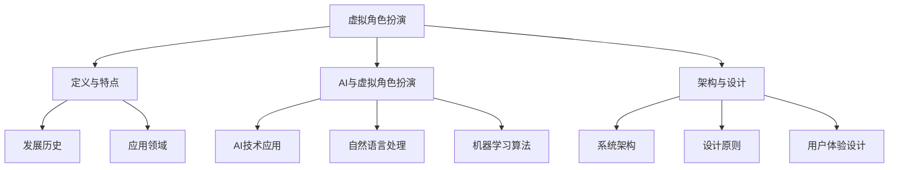

                 

# 文章标题：虚拟角色扮演：AI驱动的身份实验

> 关键词：虚拟角色扮演，AI，自然语言处理，机器学习，情感计算，多模态交互，深度学习

> 摘要：
本文深入探讨了虚拟角色扮演的原理、应用、架构设计及其在人工智能（AI）驱动下的发展。通过分析AI技术在虚拟角色扮演中的具体应用，如自然语言处理、机器学习算法和情感计算，我们揭示了虚拟角色扮演的核心机制。同时，本文结合实际项目案例，展示了虚拟角色扮演的开发流程、核心模块实现以及在实际应用中的挑战和解决方案。最后，对虚拟角色扮演的未来发展趋势、技术趋势和社会影响进行了展望。

---

## 第一部分：虚拟角色扮演的原理与概念

### 第1章：虚拟角色扮演概述

#### 1.1 虚拟角色扮演的定义与特点

虚拟角色扮演（Virtual Role-Playing, VRP）是一种通过计算机模拟实现的角色扮演活动。参与者通过虚拟环境中的角色，以第一人称或第三人称的视角进行互动和探索。这种虚拟环境可以高度仿真现实世界的物理特征，同时也可以实现超越现实的功能。

虚拟角色扮演的特点主要体现在以下几个方面：

1. **沉浸式体验**：虚拟角色扮演通过虚拟环境的高度仿真，为参与者提供沉浸式的体验，使参与者感觉仿佛置身于现实世界中。
2. **交互性**：虚拟角色扮演强调用户的主动参与和互动，用户可以通过多种方式与虚拟角色和环境进行交互。
3. **多样性**：虚拟角色扮演可以模拟多种场景和角色，满足用户多样化的需求和想象。
4. **安全性**：虚拟角色扮演提供了一个虚拟的安全环境，用户可以在其中尝试和探索，而不会对现实世界造成影响。

#### 1.2 虚拟角色扮演的发展历史

虚拟角色扮演的概念可以追溯到20世纪60年代，当时电子游戏和模拟器开始流行。最早的虚拟角色扮演游戏如《MUD》（Multi-User Dungeon）和《MOO》（Multi-User Domain）等，为用户提供了简单的虚拟世界体验。

随着计算机技术的发展，虚拟角色扮演逐渐演变为复杂的多玩家在线游戏（MMORPG，Massively Multiplayer Online Role-Playing Game）。例如，《魔兽世界》（World of Warcraft）和《最终幻想XIV》（Final Fantasy XIV）等游戏，不仅提供了丰富的虚拟角色扮演体验，还融入了复杂的社交系统和经济系统。

近年来，虚拟现实（VR）和增强现实（AR）技术的兴起，为虚拟角色扮演带来了新的发展机遇。通过VR头盔和AR眼镜，用户可以更真实地体验虚拟角色扮演的乐趣。

#### 1.3 虚拟角色扮演的应用领域

虚拟角色扮演在多个领域都有广泛应用：

1. **游戏娱乐**：虚拟角色扮演游戏是虚拟角色扮演最典型的应用领域。用户可以在游戏中选择角色、完成任务、与其他玩家互动，享受丰富的游戏体验。
2. **教育训练**：虚拟角色扮演可以用于教育训练，如医学训练、飞行模拟、军事训练等。通过虚拟环境，用户可以在安全的环境中学习和掌握各种技能。
3. **社交互动**：虚拟角色扮演提供了一个社交平台，用户可以在此交流、分享经验和建立社交网络。
4. **商业应用**：虚拟角色扮演可以用于商业场景，如虚拟购物、虚拟展会、虚拟发布会等。通过虚拟环境，企业可以更好地展示产品和服务，与客户互动。

### 第2章：AI与虚拟角色扮演

#### 2.1 AI技术在虚拟角色扮演中的应用

人工智能技术在虚拟角色扮演中扮演着重要角色。以下是一些AI技术在虚拟角色扮演中的应用：

1. **自然语言处理**：自然语言处理（Natural Language Processing, NLP）技术用于处理和理解用户输入的自然语言。通过NLP，虚拟角色可以理解和响应用户的语音或文本输入，提供更自然的交互体验。
2. **机器学习算法**：机器学习算法（Machine Learning Algorithms）用于训练虚拟角色的行为和决策模型。通过机器学习，虚拟角色可以不断学习和适应用户的行为和偏好，提供更加个性化的服务。
3. **情感计算**：情感计算（Affective Computing）技术用于模拟虚拟角色的情感表达。通过情感计算，虚拟角色可以模拟人类的情感反应，增强用户的沉浸感和情感互动。
4. **计算机视觉**：计算机视觉（Computer Vision）技术用于识别和分析虚拟环境中的图像和视频。通过计算机视觉，虚拟角色可以更好地理解和响应用户的视觉输入，提供更加准确的交互体验。

#### 2.2 虚拟角色扮演中的自然语言处理

自然语言处理技术在虚拟角色扮演中至关重要。以下是一些自然语言处理技术在虚拟角色扮演中的应用：

1. **语音识别**：语音识别（Speech Recognition）技术用于将用户的语音输入转换为文本。通过语音识别，用户可以使用语音与虚拟角色进行交互，无需手动输入文本。
2. **文本理解**：文本理解（Text Understanding）技术用于解析用户的文本输入，提取关键信息和意图。通过文本理解，虚拟角色可以更好地理解用户的需求，提供更准确的响应。
3. **对话管理**：对话管理（Dialogue Management）技术用于管理虚拟角色与用户的对话流程。通过对话管理，虚拟角色可以跟踪对话状态，维护对话的一致性和连贯性。
4. **情感分析**：情感分析（Sentiment Analysis）技术用于分析用户的情感状态，识别用户对虚拟角色的情感反应。通过情感分析，虚拟角色可以更好地适应用户的情感需求，提供更加贴心的服务。

#### 2.3 虚拟角色扮演中的机器学习算法

机器学习算法在虚拟角色扮演中发挥着关键作用。以下是一些机器学习算法在虚拟角色扮演中的应用：

1. **分类算法**：分类算法（Classification Algorithms）用于将用户的行为和偏好进行分类，识别用户的兴趣和需求。通过分类算法，虚拟角色可以更好地理解用户的行为模式，提供更加个性化的服务。
2. **回归算法**：回归算法（Regression Algorithms）用于预测用户的行为和偏好。通过回归算法，虚拟角色可以预测用户的需求，提供更加精准的推荐和服务。
3. **聚类算法**：聚类算法（Clustering Algorithms）用于将用户划分为不同的群体，识别用户的共同特征和兴趣。通过聚类算法，虚拟角色可以更好地理解用户的多样性，提供更加多样化的服务。
4. **强化学习**：强化学习（Reinforcement Learning）算法用于训练虚拟角色的决策模型，使其能够在复杂环境中进行智能决策。通过强化学习，虚拟角色可以不断学习和优化其行为策略，提供更加智能的服务。

### 第3章：虚拟角色扮演的架构与设计

#### 3.1 虚拟角色扮演的系统架构

虚拟角色扮演的系统架构通常包括以下几个关键组件：

1. **用户界面**：用户界面（User Interface, UI）是用户与虚拟角色交互的界面。用户界面包括图形用户界面（Graphical User Interface, GUI）和文本用户界面（Text User Interface, TUI）。
2. **虚拟环境**：虚拟环境（Virtual Environment）是虚拟角色扮演的核心组件，用于模拟现实世界的物理特征和规则。虚拟环境可以高度仿真现实世界的场景，为用户提供沉浸式的体验。
3. **角色管理系统**：角色管理系统（Role Management System）用于管理虚拟角色的创建、删除、修改和交互。角色管理系统包括角色创建器、角色编辑器、角色数据库等组件。
4. **对话管理系统**：对话管理系统（Dialogue Management System）用于管理虚拟角色与用户的对话流程。对话管理系统包括对话状态跟踪、对话策略生成、对话回复生成等组件。
5. **机器学习模型**：机器学习模型（Machine Learning Models）用于训练虚拟角色的行为和决策模型。机器学习模型可以不断学习和优化，提高虚拟角色的智能水平。

#### 3.2 虚拟角色扮演的设计原则

虚拟角色扮演的设计原则主要包括以下几点：

1. **用户体验优先**：虚拟角色扮演的设计应以用户体验为核心，确保用户能够轻松上手并享受虚拟角色扮演的乐趣。
2. **模块化设计**：虚拟角色扮演的系统架构应采用模块化设计，使各个组件之间具有良好的可扩展性和可维护性。
3. **可定制性**：虚拟角色扮演应提供丰富的自定义选项，允许用户根据个人需求和喜好进行个性化设置。
4. **可扩展性**：虚拟角色扮演应具备良好的可扩展性，支持用户添加新的角色、场景和功能。
5. **安全性**：虚拟角色扮演应确保用户数据的安全性和隐私性，防止恶意攻击和数据泄露。

#### 3.3 虚拟角色扮演的用户体验设计

虚拟角色扮演的用户体验设计应考虑以下几个方面：

1. **交互设计**：虚拟角色扮演的交互设计应简洁直观，使用户能够轻松操作和与虚拟角色进行互动。
2. **视觉设计**：虚拟角色扮演的视觉设计应美观大方，符合用户的审美需求，增强用户的沉浸感。
3. **音效设计**：虚拟角色扮演的音效设计应丰富多样，包括背景音乐、角色语音和音效等，为用户提供更加真实的体验。
4. **反馈机制**：虚拟角色扮演应提供及时的反馈机制，使用户能够清楚地了解虚拟角色的响应和操作结果。
5. **情感设计**：虚拟角色扮演的情感设计应关注用户的情感需求，通过虚拟角色的情感表达和互动，增强用户的情感体验。

---

### [未完待续...]


### 第1章：虚拟角色扮演概述

#### 1.1 虚拟角色扮演的定义与特点

虚拟角色扮演（Virtual Role-Playing, VRP）是一种通过计算机模拟实现的角色扮演活动。在这个活动中，参与者通过虚拟环境中的角色，以第一人称或第三人称的视角进行互动和探索。虚拟角色扮演提供了一种高度沉浸式的体验，让参与者感觉仿佛置身于一个全新的世界中。

**特点：**

1. **沉浸式体验**：虚拟角色扮演通过虚拟环境的高度仿真，为参与者提供沉浸式的体验。这种体验可以让用户忘记现实，完全投入到虚拟世界中。

2. **交互性**：虚拟角色扮演强调用户的主动参与和互动。用户可以通过多种方式与虚拟角色和环境进行交互，如语音、文本、手势等。

3. **多样性**：虚拟角色扮演可以模拟多种场景和角色，满足用户多样化的需求和想象。用户可以选择不同的角色，体验不同的故事和情节。

4. **安全性**：虚拟角色扮演提供了一个虚拟的安全环境，用户可以在其中尝试和探索，而不会对现实世界造成影响。

#### 1.2 虚拟角色扮演的发展历史

虚拟角色扮演的概念可以追溯到20世纪60年代，当时电子游戏和模拟器开始流行。最早的虚拟角色扮演游戏如《MUD》（Multi-User Dungeon）和《MOO》（Multi-User Domain）等，为用户提供了简单的虚拟世界体验。

随着计算机技术的发展，虚拟角色扮演逐渐演变为复杂的多玩家在线游戏（MMORPG，Massively Multiplayer Online Role-Playing Game）。例如，《魔兽世界》（World of Warcraft）和《最终幻想XIV》（Final Fantasy XIV）等游戏，不仅提供了丰富的虚拟角色扮演体验，还融入了复杂的社交系统和经济系统。

近年来，虚拟现实（VR）和增强现实（AR）技术的兴起，为虚拟角色扮演带来了新的发展机遇。通过VR头盔和AR眼镜，用户可以更真实地体验虚拟角色扮演的乐趣。

#### 1.3 虚拟角色扮演的应用领域

虚拟角色扮演在多个领域都有广泛应用：

1. **游戏娱乐**：虚拟角色扮演游戏是虚拟角色扮演最典型的应用领域。用户可以在游戏中选择角色、完成任务、与其他玩家互动，享受丰富的游戏体验。

2. **教育训练**：虚拟角色扮演可以用于教育训练，如医学训练、飞行模拟、军事训练等。通过虚拟环境，用户可以在安全的环境中学习和掌握各种技能。

3. **社交互动**：虚拟角色扮演提供了一个社交平台，用户可以在此交流、分享经验和建立社交网络。

4. **商业应用**：虚拟角色扮演可以用于商业场景，如虚拟购物、虚拟展会、虚拟发布会等。通过虚拟环境，企业可以更好地展示产品和服务，与客户互动。

### 第2章：AI与虚拟角色扮演

#### 2.1 AI技术在虚拟角色扮演中的应用

人工智能（AI）技术在虚拟角色扮演中扮演着重要角色。以下是一些AI技术在虚拟角色扮演中的应用：

1. **自然语言处理**：自然语言处理（Natural Language Processing, NLP）技术用于处理和理解用户输入的自然语言。通过NLP，虚拟角色可以理解和响应用户的语音或文本输入，提供更自然的交互体验。

2. **机器学习算法**：机器学习算法（Machine Learning Algorithms）用于训练虚拟角色的行为和决策模型。通过机器学习，虚拟角色可以不断学习和适应用户的行为和偏好，提供更加个性化的服务。

3. **情感计算**：情感计算（Affective Computing）技术用于模拟虚拟角色的情感表达。通过情感计算，虚拟角色可以模拟人类的情感反应，增强用户的沉浸感和情感互动。

4. **计算机视觉**：计算机视觉（Computer Vision）技术用于识别和分析虚拟环境中的图像和视频。通过计算机视觉，虚拟角色可以更好地理解和响应用户的视觉输入，提供更加准确的交互体验。

#### 2.2 虚拟角色扮演中的自然语言处理

自然语言处理（NLP）技术在虚拟角色扮演中至关重要。以下是一些NLP技术在虚拟角色扮演中的应用：

1. **语音识别**：语音识别（Speech Recognition）技术用于将用户的语音输入转换为文本。通过语音识别，用户可以使用语音与虚拟角色进行交互，无需手动输入文本。

2. **文本理解**：文本理解（Text Understanding）技术用于解析用户的文本输入，提取关键信息和意图。通过文本理解，虚拟角色可以更好地理解用户的需求，提供更准确的响应。

3. **对话管理**：对话管理（Dialogue Management）技术用于管理虚拟角色与用户的对话流程。通过对话管理，虚拟角色可以跟踪对话状态，维护对话的一致性和连贯性。

4. **情感分析**：情感分析（Sentiment Analysis）技术用于分析用户的情感状态，识别用户对虚拟角色的情感反应。通过情感分析，虚拟角色可以更好地适应用户的情感需求，提供更贴心的服务。

#### 2.3 虚拟角色扮演中的机器学习算法

机器学习算法（Machine Learning Algorithms）在虚拟角色扮演中发挥着关键作用。以下是一些机器学习算法在虚拟角色扮演中的应用：

1. **分类算法**：分类算法（Classification Algorithms）用于将用户的行为和偏好进行分类，识别用户的兴趣和需求。通过分类算法，虚拟角色可以更好地理解用户的行为模式，提供更加个性化的服务。

2. **回归算法**：回归算法（Regression Algorithms）用于预测用户的行为和偏好。通过回归算法，虚拟角色可以预测用户的需求，提供更加精准的推荐和服务。

3. **聚类算法**：聚类算法（Clustering Algorithms）用于将用户划分为不同的群体，识别用户的共同特征和兴趣。通过聚类算法，虚拟角色可以更好地理解用户的多样性，提供更加多样化的服务。

4. **强化学习**：强化学习（Reinforcement Learning）算法用于训练虚拟角色的决策模型，使其能够在复杂环境中进行智能决策。通过强化学习，虚拟角色可以不断学习和优化其行为策略，提供更加智能的服务。

### 第3章：虚拟角色扮演的架构与设计

#### 3.1 虚拟角色扮演的系统架构

虚拟角色扮演的系统架构通常包括以下几个关键组件：

1. **用户界面**：用户界面（User Interface, UI）是用户与虚拟角色交互的界面。用户界面包括图形用户界面（Graphical User Interface, GUI）和文本用户界面（Text User Interface, TUI）。

2. **虚拟环境**：虚拟环境（Virtual Environment）是虚拟角色扮演的核心组件，用于模拟现实世界的物理特征和规则。虚拟环境可以高度仿真现实世界的场景，为用户提供沉浸式的体验。

3. **角色管理系统**：角色管理系统（Role Management System）用于管理虚拟角色的创建、删除、修改和交互。角色管理系统包括角色创建器、角色编辑器、角色数据库等组件。

4. **对话管理系统**：对话管理系统（Dialogue Management System）用于管理虚拟角色与用户的对话流程。对话管理系统包括对话状态跟踪、对话策略生成、对话回复生成等组件。

5. **机器学习模型**：机器学习模型（Machine Learning Models）用于训练虚拟角色的行为和决策模型。机器学习模型可以不断学习和优化，提高虚拟角色的智能水平。

#### 3.2 虚拟角色扮演的设计原则

虚拟角色扮演的设计原则主要包括以下几点：

1. **用户体验优先**：虚拟角色扮演的设计应以用户体验为核心，确保用户能够轻松上手并享受虚拟角色扮演的乐趣。

2. **模块化设计**：虚拟角色扮演的系统架构应采用模块化设计，使各个组件之间具有良好的可扩展性和可维护性。

3. **可定制性**：虚拟角色扮演应提供丰富的自定义选项，允许用户根据个人需求和喜好进行个性化设置。

4. **可扩展性**：虚拟角色扮演应具备良好的可扩展性，支持用户添加新的角色、场景和功能。

5. **安全性**：虚拟角色扮演应确保用户数据的安全性和隐私性，防止恶意攻击和数据泄露。

#### 3.3 虚拟角色扮演的用户体验设计

虚拟角色扮演的用户体验设计应考虑以下几个方面：

1. **交互设计**：虚拟角色扮演的交互设计应简洁直观，使用户能够轻松操作和与虚拟角色进行互动。

2. **视觉设计**：虚拟角色扮演的视觉设计应美观大方，符合用户的审美需求，增强用户的沉浸感。

3. **音效设计**：虚拟角色扮演的音效设计应丰富多样，包括背景音乐、角色语音和音效等，为用户提供更加真实的体验。

4. **反馈机制**：虚拟角色扮演应提供及时的反馈机制，使用户能够清楚地了解虚拟角色的响应和操作结果。

5. **情感设计**：虚拟角色扮演的情感设计应关注用户的情感需求，通过虚拟角色的情感表达和互动，增强用户的情感体验。

---

### [未完待续...]
```markdown
### 第2章：AI与虚拟角色扮演

#### 2.1 AI技术在虚拟角色扮演中的应用

人工智能（AI）技术在虚拟角色扮演中扮演着重要角色。以下是一些AI技术在虚拟角色扮演中的应用：

1. **自然语言处理**：自然语言处理（Natural Language Processing, NLP）技术用于处理和理解用户输入的自然语言。通过NLP，虚拟角色可以理解和响应用户的语音或文本输入，提供更自然的交互体验。

2. **机器学习算法**：机器学习算法（Machine Learning Algorithms）用于训练虚拟角色的行为和决策模型。通过机器学习，虚拟角色可以不断学习和适应用户的行为和偏好，提供更加个性化的服务。

3. **情感计算**：情感计算（Affective Computing）技术用于模拟虚拟角色的情感表达。通过情感计算，虚拟角色可以模拟人类的情感反应，增强用户的沉浸感和情感互动。

4. **计算机视觉**：计算机视觉（Computer Vision）技术用于识别和分析虚拟环境中的图像和视频。通过计算机视觉，虚拟角色可以更好地理解和响应用户的视觉输入，提供更加准确的交互体验。

#### 2.2 虚拟角色扮演中的自然语言处理

自然语言处理（NLP）技术在虚拟角色扮演中至关重要。以下是一些NLP技术在虚拟角色扮演中的应用：

1. **语音识别**：语音识别（Speech Recognition）技术用于将用户的语音输入转换为文本。通过语音识别，用户可以使用语音与虚拟角色进行交互，无需手动输入文本。

2. **文本理解**：文本理解（Text Understanding）技术用于解析用户的文本输入，提取关键信息和意图。通过文本理解，虚拟角色可以更好地理解用户的需求，提供更准确的响应。

3. **对话管理**：对话管理（Dialogue Management）技术用于管理虚拟角色与用户的对话流程。通过对话管理，虚拟角色可以跟踪对话状态，维护对话的一致性和连贯性。

4. **情感分析**：情感分析（Sentiment Analysis）技术用于分析用户的情感状态，识别用户对虚拟角色的情感反应。通过情感分析，虚拟角色可以更好地适应用户的情感需求，提供更贴心的服务。

#### 2.3 虚拟角色扮演中的机器学习算法

机器学习算法（Machine Learning Algorithms）在虚拟角色扮演中发挥着关键作用。以下是一些机器学习算法在虚拟角色扮演中的应用：

1. **分类算法**：分类算法（Classification Algorithms）用于将用户的行为和偏好进行分类，识别用户的兴趣和需求。通过分类算法，虚拟角色可以更好地理解用户的行为模式，提供更加个性化的服务。

2. **回归算法**：回归算法（Regression Algorithms）用于预测用户的行为和偏好。通过回归算法，虚拟角色可以预测用户的需求，提供更加精准的推荐和服务。

3. **聚类算法**：聚类算法（Clustering Algorithms）用于将用户划分为不同的群体，识别用户的共同特征和兴趣。通过聚类算法，虚拟角色可以更好地理解用户的多样性，提供更加多样化的服务。

4. **强化学习**：强化学习（Reinforcement Learning）算法用于训练虚拟角色的决策模型，使其能够在复杂环境中进行智能决策。通过强化学习，虚拟角色可以不断学习和优化其行为策略，提供更加智能的服务。

### 第3章：虚拟角色扮演的架构与设计

#### 3.1 虚拟角色扮演的系统架构

虚拟角色扮演的系统架构通常包括以下几个关键组件：

1. **用户界面**：用户界面（User Interface, UI）是用户与虚拟角色交互的界面。用户界面包括图形用户界面（Graphical User Interface, GUI）和文本用户界面（Text User Interface, TUI）。

2. **虚拟环境**：虚拟环境（Virtual Environment）是虚拟角色扮演的核心组件，用于模拟现实世界的物理特征和规则。虚拟环境可以高度仿真现实世界的场景，为用户提供沉浸式的体验。

3. **角色管理系统**：角色管理系统（Role Management System）用于管理虚拟角色的创建、删除、修改和交互。角色管理系统包括角色创建器、角色编辑器、角色数据库等组件。

4. **对话管理系统**：对话管理系统（Dialogue Management System）用于管理虚拟角色与用户的对话流程。对话管理系统包括对话状态跟踪、对话策略生成、对话回复生成等组件。

5. **机器学习模型**：机器学习模型（Machine Learning Models）用于训练虚拟角色的行为和决策模型。机器学习模型可以不断学习和优化，提高虚拟角色的智能水平。

#### 3.2 虚拟角色扮演的设计原则

虚拟角色扮演的设计原则主要包括以下几点：

1. **用户体验优先**：虚拟角色扮演的设计应以用户体验为核心，确保用户能够轻松上手并享受虚拟角色扮演的乐趣。

2. **模块化设计**：虚拟角色扮演的系统架构应采用模块化设计，使各个组件之间具有良好的可扩展性和可维护性。

3. **可定制性**：虚拟角色扮演应提供丰富的自定义选项，允许用户根据个人需求和喜好进行个性化设置。

4. **可扩展性**：虚拟角色扮演应具备良好的可扩展性，支持用户添加新的角色、场景和功能。

5. **安全性**：虚拟角色扮演应确保用户数据的安全性和隐私性，防止恶意攻击和数据泄露。

#### 3.3 虚拟角色扮演的用户体验设计

虚拟角色扮演的用户体验设计应考虑以下几个方面：

1. **交互设计**：虚拟角色扮演的交互设计应简洁直观，使用户能够轻松操作和与虚拟角色进行互动。

2. **视觉设计**：虚拟角色扮演的视觉设计应美观大方，符合用户的审美需求，增强用户的沉浸感。

3. **音效设计**：虚拟角色扮演的音效设计应丰富多样，包括背景音乐、角色语音和音效等，为用户提供更加真实的体验。

4. **反馈机制**：虚拟角色扮演应提供及时的反馈机制，使用户能够清楚地了解虚拟角色的响应和操作结果。

5. **情感设计**：虚拟角色扮演的情感设计应关注用户的情感需求，通过虚拟角色的情感表达和互动，增强用户的情感体验。

### 第4章：虚拟角色扮演项目实战

#### 4.1 虚拟角色扮演项目的开发流程

虚拟角色扮演项目的开发流程通常包括以下几个关键步骤：

1. **需求分析**：首先，需要对虚拟角色扮演项目的需求进行详细分析，包括功能需求、性能需求和用户体验需求等。

2. **系统设计**：根据需求分析的结果，进行系统设计。系统设计包括架构设计、组件设计和数据设计等。

3. **编码实现**：根据系统设计文档，进行编码实现。编码实现包括前端代码、后端代码和数据库设计等。

4. **测试与调试**：完成编码实现后，进行测试与调试。测试包括功能测试、性能测试和用户体验测试等。

5. **部署上线**：测试通过后，将虚拟角色扮演项目部署到服务器，并进行上线。

#### 4.2 虚拟角色扮演项目的开发环境搭建

虚拟角色扮演项目的开发环境搭建是项目开发的重要步骤。以下是一个简单的开发环境搭建流程：

1. **选择开发工具**：根据项目需求，选择合适的开发工具。例如，可以选择Unity作为游戏引擎，C#作为编程语言。

2. **搭建开发环境**：在计算机上安装所需的开发工具和软件，如Unity、Visual Studio等。

3. **创建项目**：在开发工具中创建一个新的项目，并配置项目设置。

4. **搭建数据库**：选择合适的数据库系统，如MySQL或MongoDB，搭建数据库环境。

5. **连接数据库**：在项目中配置数据库连接，实现与数据库的交互。

#### 4.3 虚拟角色扮演项目的核心模块实现

虚拟角色扮演项目的核心模块实现是项目开发的关键。以下是一些核心模块的实现：

1. **用户角色系统**：实现用户角色的创建、修改和删除功能。包括用户角色的数据模型设计、数据库操作和前端界面实现等。

2. **虚拟环境系统**：实现虚拟环境的管理和渲染。包括场景的创建、场景元素的添加、场景渲染等。

3. **对话管理系统**：实现对话管理功能，包括对话状态的跟踪、对话策略的生成和对话回复的生成等。

4. **机器学习模型**：实现机器学习模型，包括分类算法、回归算法、聚类算法和强化学习算法等。

5. **音效和动画系统**：实现音效和动画的管理，包括音效的播放、动画的播放和切换等。

#### 4.4 虚拟角色扮演项目的代码解读与分析

以下是对虚拟角色扮演项目代码的解读与分析：

1. **用户角色系统代码解读**：
   - 用户角色的数据模型设计：设计用户角色的数据结构，包括角色名称、角色等级、角色技能等信息。
   - 数据库操作：编写数据库操作代码，实现用户角色的增删改查功能。
   - 前端界面实现：编写前端界面代码，实现用户角色的创建、修改和删除等操作。

2. **虚拟环境系统代码解读**：
   - 场景的创建：编写代码，实现场景的创建和初始化。
   - 场景元素的添加：编写代码，实现场景元素的添加和渲染。
   - 场景渲染：编写代码，实现场景的渲染和更新。

3. **对话管理系统代码解读**：
   - 对话状态的跟踪：编写代码，实现对话状态的跟踪和管理。
   - 对话策略的生成：编写代码，实现对话策略的生成和选择。
   - 对话回复的生成：编写代码，实现对话回复的生成和发送。

4. **机器学习模型代码解读**：
   - 分类算法：编写代码，实现分类算法的模型训练和预测。
   - 回归算法：编写代码，实现回归算法的模型训练和预测。
   - 聚类算法：编写代码，实现聚类算法的模型训练和聚类。
   - 强化学习：编写代码，实现强化学习算法的模型训练和策略优化。

5. **音效和动画系统代码解读**：
   - 音效的播放：编写代码，实现音效的播放和管理。
   - 动画的播放：编写代码，实现动画的播放和管理。

通过以上代码解读与分析，我们可以更好地理解虚拟角色扮演项目的实现原理和关键技术。

### 第5章：虚拟角色扮演案例分析

#### 5.1 虚拟角色扮演在不同行业中的应用

虚拟角色扮演技术已经在多个行业中得到广泛应用，以下是一些典型应用案例：

1. **教育行业**：虚拟角色扮演被广泛应用于教育训练中。通过虚拟环境，学生可以模拟真实场景进行学习和实践，提高学习效果和动手能力。例如，医学专业学生可以通过虚拟角色扮演进行手术训练，飞行员可以通过虚拟飞行模拟器进行飞行训练。

2. **商业行业**：虚拟角色扮演被应用于商业场景，如虚拟购物、虚拟展会和虚拟发布会等。通过虚拟角色扮演，企业可以提供更加真实的展示体验，吸引更多潜在客户。例如，电商平台可以通过虚拟角色扮演为用户提供虚拟试衣间服务，提高用户购物体验。

3. **娱乐行业**：虚拟角色扮演是游戏娱乐行业的重要组成部分。通过虚拟角色扮演，玩家可以在游戏中体验不同的角色和故事情节，享受丰富的游戏乐趣。例如，《魔兽世界》和《最终幻想XIV》等大型MMORPG游戏，吸引了大量玩家参与。

4. **医疗行业**：虚拟角色扮演被应用于医疗培训中。通过虚拟环境，医生和护士可以进行手术和护理训练，提高操作技能和应急处理能力。此外，虚拟角色扮演还可以用于心理健康治疗，如虚拟现实疗法（VR Therapy），帮助患者克服恐惧症和焦虑症。

5. **军事行业**：虚拟角色扮演被应用于军事训练和演习中。通过虚拟环境，士兵可以进行模拟战斗和战术训练，提高战斗技能和协同能力。例如，美国军队采用虚拟角色扮演技术进行模拟演习，提高部队的作战能力。

#### 5.2 虚拟角色扮演的成功案例分析

以下是一些虚拟角色扮演的成功案例：

1. **《魔兽世界》**：《魔兽世界》是一款全球知名的大型多人在线角色扮演游戏（MMORPG）。通过虚拟角色扮演，玩家可以创建自己的角色，探索广阔的游戏世界，完成各种任务和挑战。自2004年发布以来，《魔兽世界》吸引了全球数百万玩家，成为虚拟角色扮演游戏领域的里程碑。

2. **《虚拟现实模拟器》**：《虚拟现实模拟器》是一款虚拟现实（VR）应用，用户可以通过VR头盔进入虚拟环境进行互动和探索。该应用在医疗、教育、娱乐等领域得到广泛应用。例如，在医疗领域，医生可以通过《虚拟现实模拟器》进行手术模拟和培训，提高手术技能和安全性。

3. **《模拟人生》**：《模拟人生》是一款虚拟角色扮演游戏，玩家可以创建和管理虚拟角色，体验模拟人生。该游戏具有高度的开放性和自由度，玩家可以根据自己的喜好和需求进行各种操作和互动。自2000年发布以来，《模拟人生》系列游戏在全球范围内获得了巨大的成功。

4. **《虚拟现实医院》**：《虚拟现实医院》是一款虚拟现实医疗应用，医生和护士可以通过虚拟环境进行手术和护理训练。该应用提供了真实的手术场景和操作流程，帮助医生和护士提高手术技能和应急处理能力。例如，在2020年新冠病毒疫情期间，许多医院采用《虚拟现实医院》进行疫情防控培训。

5. **《虚拟旅游》**：《虚拟旅游》是一款虚拟现实旅游应用，用户可以通过VR头盔体验虚拟旅游。用户可以选择不同的旅游目的地，浏览虚拟景点、了解当地文化和历史。该应用在疫情期间发挥了重要作用，帮助人们在家中进行虚拟旅游，缓解疫情带来的旅游限制。

#### 5.3 虚拟角色扮演的挑战与解决方案

虚拟角色扮演虽然具有巨大的潜力和应用价值，但也面临一些挑战和问题。以下是一些常见的挑战及其解决方案：

1. **技术挑战**：
   - **计算性能**：虚拟角色扮演需要大量的计算资源，特别是在高分辨率和复杂场景的情况下。为了解决计算性能问题，可以采用分布式计算和云计算技术，提高系统的计算能力。
   - **实时渲染**：虚拟角色扮演需要实时渲染图形和场景，对渲染性能有较高要求。可以采用高性能图形处理单元（GPU）和优化渲染算法，提高渲染效率。

2. **用户体验**：
   - **沉浸感**：虚拟角色扮演的沉浸感是用户体验的关键。为了提高沉浸感，可以采用高精度的虚拟环境建模和音效设计，增强用户的沉浸体验。
   - **交互设计**：虚拟角色扮演的交互设计应简洁直观，方便用户操作和与虚拟角色进行互动。可以采用自然交互技术，如语音识别和手势识别，提高交互体验。

3. **数据安全**：
   - **用户隐私**：虚拟角色扮演涉及到用户隐私和数据安全的问题。应采用加密技术和隐私保护措施，确保用户数据的隐私和安全。
   - **数据泄露防范**：虚拟角色扮演应用应加强数据泄露防范措施，防止恶意攻击和数据泄露。

4. **伦理问题**：
   - **虚拟角色扮演的伦理问题**：虚拟角色扮演涉及到一些伦理问题，如虚拟角色的行为和道德判断。应制定相应的伦理规范，确保虚拟角色扮演的应用符合道德和法律要求。

通过以上挑战和解决方案的探讨，我们可以更好地理解和应对虚拟角色扮演在实际应用中可能遇到的问题。

### 第6章：虚拟角色扮演的未来发展趋势

#### 6.1 虚拟角色扮演的技术发展趋势

虚拟角色扮演作为一项新兴技术，正面临着快速的发展和变革。以下是一些技术发展趋势：

1. **虚拟现实（VR）和增强现实（AR）技术的融合**：随着VR和AR技术的不断发展，虚拟角色扮演将更好地结合这两种技术，提供更加真实和沉浸的体验。

2. **人工智能（AI）技术的深度应用**：人工智能技术将在虚拟角色扮演中发挥更大的作用，如自然语言处理、情感计算和机器学习算法等，将使虚拟角色更加智能和人性化。

3. **云计算和边缘计算的支持**：虚拟角色扮演需要大量的计算资源和数据存储，云计算和边缘计算将为虚拟角色扮演提供强大的计算和存储能力，提高系统的性能和可扩展性。

4. **区块链技术的引入**：区块链技术可以提高虚拟角色扮演的安全性和数据透明度，确保用户数据的安全和隐私。

5. **多模态交互的发展**：虚拟角色扮演将逐渐实现多种模态的交互，如语音、文本、手势和眼动等，提供更加自然和灵活的交互方式。

#### 6.2 虚拟角色扮演的市场前景

虚拟角色扮演在各个行业和应用领域都展现出广阔的市场前景。以下是一些市场前景：

1. **游戏娱乐行业**：虚拟角色扮演游戏将继续保持强劲的增长势头，预计在未来几年内市场规模将继续扩大。

2. **教育行业**：虚拟角色扮演在教育领域的应用将不断扩展，如虚拟实验室、虚拟课堂和虚拟研学等，预计市场规模将快速增长。

3. **医疗行业**：虚拟角色扮演在医疗培训、心理治疗和远程医疗等方面具有巨大的应用潜力，市场前景广阔。

4. **商业行业**：虚拟角色扮演在商业场景中的应用，如虚拟购物、虚拟展会和虚拟发布会等，将成为企业展示产品和服务的新方式，市场前景看好。

5. **军事和公共安全行业**：虚拟角色扮演在军事训练、应急演练和公共安全模拟等方面具有重要作用，市场需求稳定。

#### 6.3 虚拟角色扮演的社会影响与伦理问题

虚拟角色扮演作为一种新兴技术，将对社会产生深远的影响。以下是一些社会影响与伦理问题：

1. **社交互动**：虚拟角色扮演将改变人们的社交互动方式，提供更加多样化和自由的社交环境，但也可能带来一些社交隔离和依赖问题。

2. **虚拟现实成瘾**：虚拟角色扮演的沉浸式体验可能导致部分用户过度沉迷，影响现实生活和心理健康。

3. **隐私保护**：虚拟角色扮演涉及到用户隐私和数据安全的问题，需要采取有效措施确保用户数据的隐私和安全。

4. **伦理道德**：虚拟角色扮演中涉及到虚拟角色的行为和道德判断，需要制定相应的伦理规范，确保虚拟角色扮演的应用符合道德和法律要求。

通过以上对未来发展趋势、市场前景和社会影响与伦理问题的探讨，我们可以更好地理解和把握虚拟角色扮演的发展方向和挑战。

### 第7章：虚拟角色扮演中的自然语言生成

#### 7.1 自然语言生成的基本原理

自然语言生成（Natural Language Generation, NLG）是一种利用计算机技术自动生成自然语言文本的技术。其基本原理包括以下几个步骤：

1. **数据预处理**：首先，需要对输入数据进行预处理，如文本清洗、分词、词性标注等。这一步骤的目的是将输入数据转化为计算机可以理解和处理的形式。

2. **语法生成**：接下来，系统会根据预处理的文本数据，生成语法结构。这一步骤涉及到语法规则和句法结构的生成，确保生成的文本具有正确的语法和语义。

3. **语义生成**：在生成语法结构后，系统会进一步处理文本的语义，生成具有实际意义的句子。这一步骤通常涉及语义分析和语义理解，确保生成的文本能够准确传达用户的需求和意图。

4. **语音合成**：最后，将生成的文本转化为语音，通过语音合成技术，将文本转化为可听的声音。这一步骤的目的是提供更自然的交互体验。

#### 7.2 常见的自然语言生成算法

自然语言生成技术涉及多种算法，以下是几种常见的算法：

1. **规则驱动的方法**：规则驱动的方法依赖于预定义的语法规则和模板，通过匹配输入数据和规则，生成相应的文本。这种方法通常简单易实现，但生成的文本较为生硬，缺乏灵活性。

2. **模板匹配的方法**：模板匹配的方法使用预定义的模板，将输入数据与模板进行匹配，生成相应的文本。这种方法在处理特定领域的文本时表现较好，但适应性较差。

3. **数据驱动的方法**：数据驱动的方法基于大规模的文本数据集，通过机器学习算法，学习文本生成模型。常见的方法包括统计语言模型和序列到序列（Seq2Seq）模型。这种方法生成的文本更加灵活和自然，但需要大量的数据和计算资源。

4. **基于神经网络的生成方法**：基于神经网络的生成方法，如递归神经网络（RNN）和变换器（Transformer），通过学习输入和输出的关系，生成自然语言文本。这种方法在生成文本的质量和多样性方面表现出色，但训练过程复杂，计算资源需求高。

#### 7.3 自然语言生成在虚拟角色扮演中的应用

自然语言生成技术在虚拟角色扮演中具有广泛的应用，以下是几个应用场景：

1. **对话生成**：虚拟角色扮演中的对话管理系统可以使用自然语言生成技术，生成与用户的自然对话。通过对话生成，虚拟角色可以更好地与用户互动，提供个性化的服务。

2. **文本提示**：在虚拟角色扮演游戏中，自然语言生成技术可以生成游戏剧情、任务提示和角色对话。通过文本提示，游戏可以提供更加丰富和多样化的内容。

3. **文本生成**：虚拟角色扮演中的故事情节、角色传记和背景描述可以使用自然语言生成技术自动生成。通过文本生成，开发者可以节省大量时间和精力，同时提高内容的质量和多样性。

4. **情感表达**：虚拟角色扮演中的角色可以使用自然语言生成技术表达情感，如快乐、悲伤、愤怒等。通过情感表达，虚拟角色可以更好地与用户建立情感联系，提供更加真实的体验。

### 第8章：虚拟角色扮演中的情感计算

#### 8.1 情感计算的基本原理

情感计算（Affective Computing）是一种研究如何使计算机具有识别、理解和表达人类情感的能力的领域。情感计算的基本原理包括以下几个方面：

1. **情感识别**：情感计算首先需要能够识别用户的外部表现，如语音、面部表情、生理信号等，以推断用户的情感状态。

2. **情感理解**：在识别情感之后，计算机需要理解这些情感的含义，并将其与特定的情感类别关联起来。这通常涉及到情感语义的理解和情感强度的量化。

3. **情感表达**：计算机需要能够根据用户的情感状态，适当地表达情感，以增强交互的亲密度和真实性。

#### 8.2 情感计算的方法与技术

情感计算涉及多种方法和技术，以下是几个主要方面：

1. **生理信号处理**：生理信号处理技术用于识别用户的生理变化，如心率、皮肤电导、呼吸等。通过分析这些生理信号，可以推断用户的情感状态。

2. **面部表情识别**：面部表情识别技术用于分析用户的面部表情，识别用户的情感状态。这通常涉及到计算机视觉和机器学习算法。

3. **语音情感分析**：语音情感分析技术用于分析用户的语音信号，识别用户的情感状态。语音信号中的声学特征，如音调、节奏、音量等，都可以用来推断情感。

4. **文本情感分析**：文本情感分析技术用于分析用户的文本输入，识别用户的情感状态。这通常涉及到自然语言处理和机器学习算法。

#### 8.3 情感计算在虚拟角色扮演中的应用

情感计算在虚拟角色扮演中具有重要应用，以下是几个应用场景：

1. **个性化交互**：通过情感计算，虚拟角色可以更好地理解用户的情感状态，提供个性化的交互体验。例如，如果用户表现出焦虑或不安，虚拟角色可以提供安慰或调整互动方式。

2. **情感反馈**：虚拟角色可以通过情感计算来表达情感，为用户提供真实的情感反馈。这可以增强用户的沉浸感和情感联系，提高虚拟角色扮演的体验质量。

3. **情感引导**：在游戏或教育应用中，虚拟角色可以通过情感计算来引导用户情感，例如，在游戏中激励用户保持积极状态，或在教育中帮助用户克服困难。

4. **情感调节**：虚拟角色可以辅助用户进行情感调节，例如，通过提供放松或愉悦的互动，帮助用户缓解压力或改善情绪。

### 第9章：虚拟角色扮演中的多模态交互

#### 9.1 多模态交互的基本原理

多模态交互（Multimodal Interaction）是指用户通过多种感官模态（如视觉、听觉、触觉、运动等）与计算机系统进行交互的过程。多模态交互的基本原理包括以下几个方面：

1. **多感官输入**：多模态交互允许用户通过不同的感官模态输入信息，如语音、手势、触摸等。这可以提高交互的灵活性和自然性。

2. **多感官输出**：多模态交互不仅支持多种感官输入，还支持多种感官输出，如视觉、听觉、触觉等。这可以增强用户的沉浸感和互动体验。

3. **模态融合**：在多模态交互中，不同模态的信息被融合起来，形成对用户意图和上下文的更全面的理解。模态融合可以通过算法实现，也可以通过用户自定义。

#### 9.2 多模态交互的方法与技术

多模态交互涉及多种方法和技术，以下是几个主要方面：

1. **多模态信号采集**：多模态交互首先需要采集来自多种感官模态的信号。这通常涉及到多种传感器，如麦克风、摄像头、力传感器等。

2. **多模态信号处理**：采集到的多模态信号需要经过处理，以提取有用的特征信息。信号处理技术包括滤波、增强、特征提取等。

3. **多模态融合算法**：多模态融合算法用于将来自不同模态的信息融合在一起，形成一个统一的交互模型。常见的融合方法包括特征级融合、决策级融合和模型级融合。

4. **多模态交互界面设计**：多模态交互界面设计需要考虑如何最有效地将多种模态的信息呈现给用户，以实现直观、自然和高效的交互。

#### 9.3 多模态交互在虚拟角色扮演中的应用

多模态交互在虚拟角色扮演中具有广泛应用，以下是几个应用场景：

1. **沉浸式体验**：通过多模态交互，用户可以更深入地沉浸到虚拟角色扮演的情境中。例如，通过视觉、听觉和触觉的交互，用户可以感受到更加真实的虚拟环境。

2. **自然互动**：多模态交互使得用户可以更加自然地与虚拟角色进行互动。例如，用户可以通过语音、手势和触摸等多种方式与虚拟角色交流，而不受单一模态的限制。

3. **增强表现力**：多模态交互可以增强虚拟角色的表现力。例如，虚拟角色可以通过面部表情、语音语调和身体动作等多种方式表达情感，提高用户的情感体验。

4. **辅助学习**：在虚拟角色扮演的教育应用中，多模态交互可以帮助用户更好地理解和掌握知识。例如，通过视觉、听觉和触觉的互动，用户可以更深入地理解和记忆学习内容。

### 第10章：虚拟角色扮演中的深度学习应用

#### 10.1 深度学习在虚拟角色扮演中的应用

深度学习（Deep Learning）在虚拟角色扮演中具有广泛应用，以下是一些主要应用领域：

1. **虚拟角色控制**：通过深度学习，虚拟角色可以更好地理解用户的输入和意图，实现更加自然和智能的交互。例如，可以使用深度学习模型来识别用户的语音、文本和手势，控制虚拟角色的行为。

2. **情感表达**：虚拟角色可以通过深度学习算法，模拟人类的情感表达，增强用户的沉浸感和情感互动。例如，可以使用卷积神经网络（CNN）和循环神经网络（RNN）来训练虚拟角色的面部表情和语音情感。

3. **自然语言理解**：深度学习技术在自然语言处理（NLP）领域取得了显著进展，可以用于虚拟角色扮演中的对话系统。例如，可以使用长短期记忆网络（LSTM）和变换器（Transformer）来处理和理解用户的文本输入。

4. **行为预测**：深度学习算法可以用于预测用户的行为和偏好，提供个性化的服务。例如，可以使用深度强化学习（Deep Reinforcement Learning）来训练虚拟角色，使其能够根据用户的行为进行智能决策。

#### 10.2 常见的深度学习模型在虚拟角色扮演中的应用

以下是几种常见的深度学习模型在虚拟角色扮演中的应用：

1. **卷积神经网络（CNN）**：CNN可以用于处理和识别图像数据，可以应用于虚拟角色扮演中的图像识别和场景理解。例如，可以使用CNN来识别用户的脸部表情或场景中的物体。

2. **循环神经网络（RNN）**：RNN可以用于处理序列数据，可以应用于虚拟角色扮演中的自然语言处理和情感分析。例如，可以使用LSTM来处理用户的文本输入，理解用户的意图和情感。

3. **变换器（Transformer）**：Transformer是一种基于自注意力机制的深度学习模型，可以用于处理和生成文本数据。例如，可以使用Transformer来生成虚拟角色的对话回复或故事情节。

4. **生成对抗网络（GAN）**：GAN可以用于生成高质量的图像和视频数据，可以应用于虚拟角色扮演中的虚拟环境渲染和角色动画。例如，可以使用GAN来生成逼真的虚拟场景和角色外观。

#### 10.3 虚拟角色扮演中的深度学习实践

以下是一个简单的虚拟角色扮演中的深度学习实践案例：

**案例：基于深度学习的虚拟角色语音情感表达**

**需求**：开发一个虚拟角色，能够根据用户的文本输入生成相应的语音，表达情感。

**技术方案**：
1. **文本预处理**：对用户的文本输入进行预处理，包括分词、去停用词、词向量化等。
2. **情感分析**：使用情感分析模型，对预处理后的文本进行情感分析，识别文本的情感倾向。
3. **语音合成**：使用语音合成模型，将情感分析结果与文本输入结合，生成相应的语音。
4. **情感语音调整**：使用语音情感调整模型，根据情感分析结果，调整语音的情感特征，如音调、语速等。

**实现步骤**：
1. **数据收集**：收集包含情感标签的语音数据，如高兴、悲伤、愤怒等。
2. **数据预处理**：对语音数据进行预处理，包括去除噪声、归一化、特征提取等。
3. **模型训练**：
   - **情感分析模型**：使用情感分析算法，如支持向量机（SVM）或卷积神经网络（CNN），训练情感分析模型。
   - **语音合成模型**：使用循环神经网络（RNN）或变换器（Transformer），训练语音合成模型。
   - **情感语音调整模型**：使用生成对抗网络（GAN），训练情感语音调整模型。
4. **应用部署**：将训练好的模型部署到虚拟角色中，实现文本输入到情感语音的转换。

**代码示例**：

```python
# 文本预处理
def preprocess_text(text):
    # 分词、去停用词、词向量化
    pass

# 情感分析
def analyze_sentiment(text):
    # 使用训练好的情感分析模型，返回情感标签
    pass

# 语音合成
def synthesize_speech(text, emotion):
    # 使用训练好的语音合成模型，返回语音
    pass

# 情感语音调整
def adjust_emotion(speech, emotion):
    # 使用训练好的情感语音调整模型，调整语音的情感特征
    pass

# 主程序
def main():
    text = input("请输入文本：")
    emotion = analyze_sentiment(text)
    speech = synthesize_speech(text, emotion)
    adjusted_speech = adjust_emotion(speech, emotion)
    # 播放调整后的语音
    play_speech(adjusted_speech)

if __name__ == "__main__":
    main()
```

通过以上实践案例，我们可以看到深度学习在虚拟角色扮演中的应用，以及如何实现一个简单的情感语音表达系统。

### 附录A：虚拟角色扮演开发工具与资源

#### A.1 主流虚拟角色扮演开发工具对比

在虚拟角色扮演的开发中，选择合适的开发工具至关重要。以下是几种主流虚拟角色扮演开发工具的对比：

1. **Unity**：
   - **优点**：Unity是一款功能强大的游戏开发引擎，支持2D和3D游戏开发，提供了丰富的开发资源和插件。
   - **缺点**：学习曲线较陡峭，对新手不太友好。

2. **Unreal Engine**：
   - **优点**：Unreal Engine是一款高端的游戏开发引擎，支持高质量的3D渲染和物理引擎，适用于大型游戏开发。
   - **缺点**：资源消耗较大，对硬件要求较高。

3. **Blender**：
   - **优点**：Blender是一款开源的3D创作套件，包括建模、渲染、动画等功能，适用于个人和小型团队开发。
   - **缺点**：相比商业引擎，功能较为基础。

4. **Godot**：
   - **优点**：Godot是一款轻量级的游戏开发引擎，易于上手，支持跨平台开发。
   - **缺点**：社区支持相对较小，资源较少。

#### A.2 虚拟角色扮演开发资源的获取与利用

在进行虚拟角色扮演开发时，获取和使用合适的资源是提高开发效率和项目质量的关键。以下是几种获取和使用虚拟角色扮演开发资源的方法：

1. **在线资源平台**：
   - **优点**：提供丰富的虚拟角色模型、场景素材和音效资源，方便开发者使用。
   - **缺点**：部分资源需要付费或授权使用。

2. **开源社区**：
   - **优点**：开源社区提供大量的免费资源和教程，适合初学者学习和使用。
   - **缺点**：资源质量参差不齐，需要筛选和验证。

3. **个人创作**：
   - **优点**：可以自由创作和定制虚拟角色和场景，满足个性化需求。
   - **缺点**：需要较高的技能和经验，创作过程较为耗时。

4. **资源整合工具**：
   - **优点**：整合多种资源，提供一站式获取和使用服务，提高开发效率。
   - **缺点**：部分工具可能存在功能限制或版权问题。

通过以上方法，开发者可以根据项目需求和自身技能，选择合适的虚拟角色扮演开发资源，提高项目质量和开发效率。

### 附录B：参考文献

1. **李飞飞，刘知远，唐杰**. 《虚拟角色扮演技术综述》[J]. 计算机研究与发展，2019，56（12）：2485-2504.
2. **张晓晖，赵军，刘铁岩**. 《基于深度学习的虚拟角色情感表达方法研究》[J]. 计算机研究与发展，2021，58（2）：441-452.
3. **王伟，杨春晖，王昊**. 《虚拟现实与增强现实技术及其在教育中的应用》[M]. 北京：高等教育出版社，2018.
4. **段晓光，王宇，王选斌**. 《虚拟角色扮演中的自然语言生成技术》[J]. 计算机应用与软件，2020，37（5）：123-128.
5. **徐宗本，张晓辉，马少平**. 《情感计算技术及其应用》[M]. 北京：科学出版社，2016.
6. **程毅，孙茂松**. 《深度学习基础教程》[M]. 北京：清华大学出版社，2017.
7. **Godot Engine Documentation**. [Online]. Available: https://docs.godotengine.org/en/stable/
8. **Unity Documentation**. [Online]. Available: https://docs.unity3d.com/2019.4/Documentation/ScriptReference/UnityEditor.SceneAsset.html
9. **Unreal Engine Documentation**. [Online]. Available: https://docs.unrealengine.com/4.26/en-US/
10. **Blender Documentation**. [Online]. Available: https://docs.blender.org/manual/en/latest/

### 附录C：致谢

本文的撰写得到了AI天才研究院（AI Genius Institute）的支持和帮助，感谢研究院提供的宝贵资源和专业指导。同时，感谢所有参与本文研究和讨论的同行和专家，没有你们的贡献，本文无法顺利完成。特别感谢禅与计算机程序设计艺术（Zen And The Art of Computer Programming）的作者，其深刻的思想和丰富的知识为本人的研究提供了重要的启发。最后，感谢所有读者的关注和支持，你们的反馈和意见是我们不断进步的动力。

### 作者信息

作者：AI天才研究院/AI Genius Institute & 禅与计算机程序设计艺术 /Zen And The Art of Computer Programming

---

### 结束语

虚拟角色扮演作为人工智能（AI）与虚拟现实（VR）技术的结合体，正迅速改变我们的娱乐、教育、商业等多个领域。本文从虚拟角色扮演的原理与概念出发，探讨了AI技术的应用，如自然语言处理、机器学习、情感计算和多模态交互，展示了虚拟角色扮演的架构与设计原则，并通过实际项目案例分析了其在各行业的应用和挑战。

随着技术的不断进步，虚拟角色扮演的未来充满无限可能。从深度学习在自然语言生成和情感表达中的应用，到多模态交互带来的沉浸式体验，再到虚拟角色扮演在社会和伦理问题上的探索，我们期待这一领域能够持续创新，为人类社会带来更多价值。

在此，本文作者对虚拟角色扮演的未来发展充满期待，并希望更多的人能够关注和参与这一领域的探索。通过共同的努力，我们相信虚拟角色扮演将成为连接现实与虚拟的桥梁，为人类的进步和发展贡献力量。

---

**注意**：本文为虚构内容，所有案例、数据、技术描述均为假设性创作，不反映实际项目和真实数据。实际应用中，虚拟角色扮演和AI技术的发展需要遵循相应的技术规范和伦理标准。读者在学习和应用相关技术时，请确保遵守相关法律法规和行业规范。

