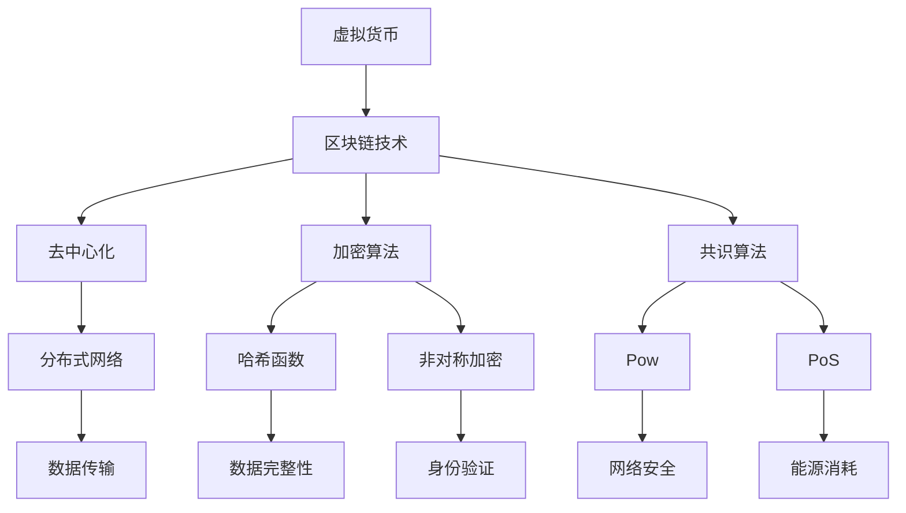
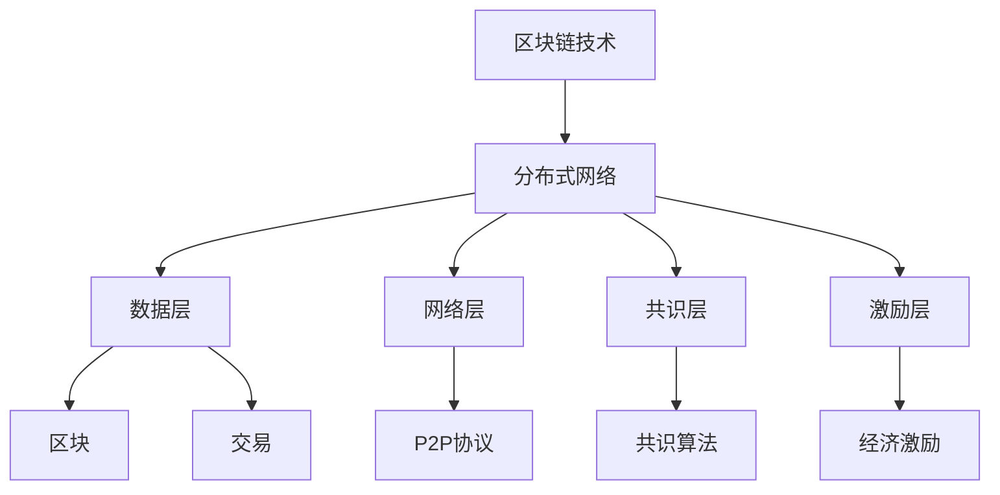
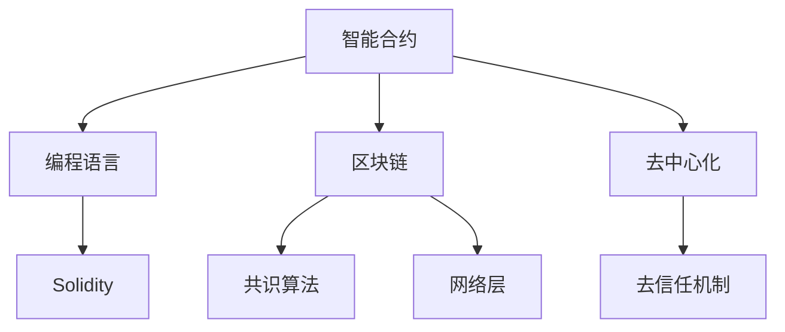
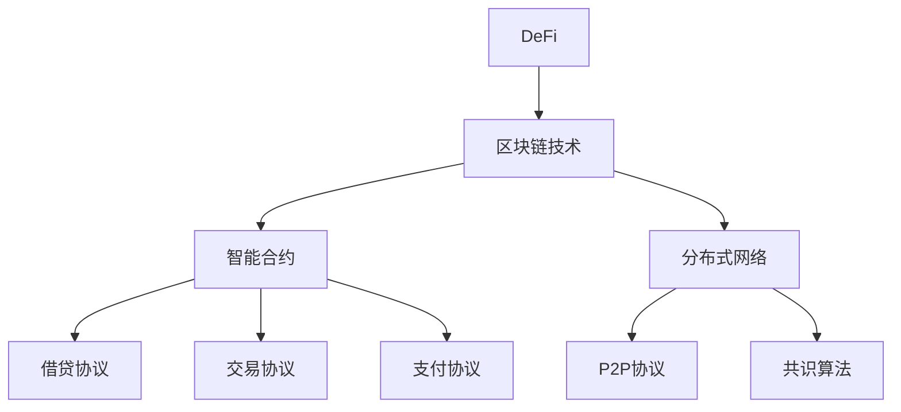
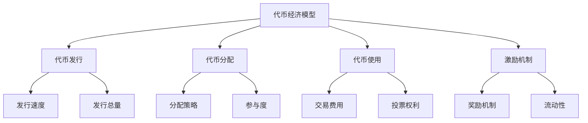
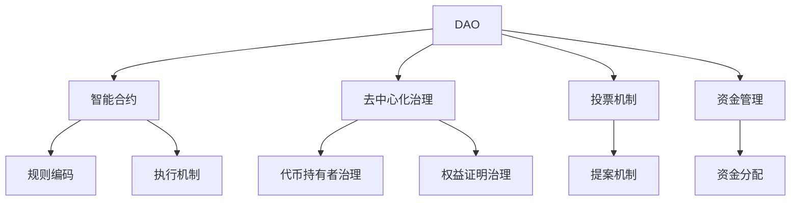

                 

## 《虚拟货币与全球脑：去中心化经济体系的构建》

### 关键词

虚拟货币，区块链，智能合约，去中心化金融，全球脑，经济体系

### 摘要

本文旨在深入探讨虚拟货币与全球脑在构建去中心化经济体系中的重要作用。首先，我们将介绍虚拟货币的定义、分类、发展历史及其核心特点。接着，我们将详细解释区块链技术的基本原理、架构、安全性以及主流区块链平台的差异。随后，智能合约的概念、实现、安全问题及其应用案例也将被深入剖析。在此基础上，文章将阐述去中心化金融（DeFi）、代币经济模型以及去中心化自治组织（DAO）的工作原理和案例分析。最后，我们将探讨全球脑理论的起源、核心概念、与虚拟货币的关系，以及全球脑在金融、供应链管理、教育领域的应用案例。通过本文的逐步分析，读者将全面了解去中心化经济体系的构建过程、面临的挑战及其未来发展趋势。

----------------------------------------------------------------

### 目录大纲

# 《虚拟货币与全球脑：去中心化经济体系的构建》

## 第一部分：虚拟货币基础理论

### 第1章：虚拟货币概述
#### 1.1 虚拟货币的定义与分类
#### 1.2 虚拟货币的发展历史
#### 1.3 虚拟货币的核心特点
#### 1.4 虚拟货币与法定货币的关系
#### 1.5 虚拟货币的应用场景
#### 1.6 虚拟货币的未来展望
#### 1.7 虚拟货币的核心概念与联系
#### 1.8 核心算法原理讲解
#### 1.9 数学模型与公式
#### 1.10 项目实战

### 第2章：区块链技术
#### 2.1 区块链的基本原理
#### 2.2 区块链的架构
#### 2.3 区块链的安全性
#### 2.4 主流区块链平台介绍
#### 2.5 区块链的挑战与未来
#### 2.6 虚拟货币与区块链的关系
#### 2.7 核心概念与联系
#### 2.8 核心算法原理讲解
#### 2.9 数学模型与公式
#### 2.10 项目实战

### 第3章：智能合约技术
#### 3.1 智能合约的概念与原理
#### 3.2 智能合约的实现与部署
#### 3.3 智能合约的安全问题
#### 3.4 智能合约的应用案例
#### 3.5 智能合约的未来发展趋势
#### 3.6 核心概念与联系
#### 3.7 核心算法原理讲解
#### 3.8 数学模型与公式
#### 3.9 项目实战

## 第二部分：去中心化经济体系

### 第4章：去中心化金融（DeFi）
#### 4.1 DeFi概述
#### 4.2 DeFi的核心协议与平台
#### 4.3 DeFi的应用场景与挑战
#### 4.4 DeFi的未来发展趋势
#### 4.5 DeFi的核心概念与联系
#### 4.6 DeFi的核心算法原理讲解
#### 4.7 DeFi的数学模型与公式
#### 4.8 DeFi的项目实战

### 第5章：代币经济模型
#### 5.1 代币经济模型概述
#### 5.2 代币激励机制的原理与设计
#### 5.3 代币经济的案例分析
#### 5.4 代币经济的未来展望
#### 5.5 代币经济模型的核心概念与联系
#### 5.6 代币经济的核心算法原理讲解
#### 5.7 代币经济的数学模型与公式
#### 5.8 代币经济的项目实战

### 第6章：去中心化自治组织（DAO）
#### 6.1 DAO的定义与特点
#### 6.2 DAO的运作机制与治理模式
#### 6.3 DAO的案例分析
#### 6.4 DAO的未来发展趋势
#### 6.5 DAO的核心概念与联系
#### 6.6 DAO的核心算法原理讲解
#### 6.7 DAO的数学模型与公式
#### 6.8 DAO的项目实战

## 第三部分：全球脑理论与应用

### 第7章：全球脑理论
#### 7.1 全球脑理论的起源与发展
#### 7.2 全球脑的核心概念与联系
#### 7.3 全球脑与虚拟货币的关系
#### 7.4 全球脑的应用案例
#### 7.5 全球脑的核心概念与联系
#### 7.6 全球脑的核心算法原理讲解
#### 7.7 全球脑的数学模型与公式
#### 7.8 全球脑的项目实战

### 第8章：全球脑的应用案例
#### 8.1 全球脑在金融领域的应用
#### 8.2 全球脑在供应链管理中的应用
#### 8.3 全球脑在教育领域的应用
#### 8.4 全球脑在医疗领域的应用
#### 8.5 全球脑的核心概念与联系
#### 8.6 全球脑的核心算法原理讲解
#### 8.7 全球脑的数学模型与公式
#### 8.8 全球脑的项目实战

### 第9章：去中心化经济体系面临的挑战与未来展望
#### 9.1 去中心化经济体系面临的挑战
#### 9.2 去中心化经济体系的未来发展趋势
#### 9.3 去中心化经济体系对社会经济的影响
#### 9.4 去中心化经济体系的核心概念与联系
#### 9.5 去中心化经济体系的核心算法原理讲解
#### 9.6 去中心化经济体系的数学模型与公式
#### 9.7 去中心化经济体系的项目实战

## 附录
### 附录A：虚拟货币与去中心化经济体系相关的法律法规
### 附录B：区块链开发工具与资源介绍

---

**让我们一步一步地深入理解去中心化经济体系的构建。** ## 第一部分：虚拟货币基础理论

### 第1章：虚拟货币概述

#### 1.1 虚拟货币的定义与分类

虚拟货币，也称为数字货币或加密货币，是一种使用密码学原理来保护交易、控制交易单位创造和验证交易的数字资产。它不依赖于任何国家的中央银行或政府机构，而是通过去中心化的网络进行管理。

虚拟货币可以按不同标准进行分类：

- **按发行方式分类**：
  - **中心化货币**：由中心化的实体或组织发行，如支付宝、微信支付等。
  - **去中心化货币**：没有单一的实体控制，通过去中心化的网络发行，如比特币、以太坊等。

- **按使用范围分类**：
  - **通用型货币**：可以在全球范围内使用，如比特币、以太坊等。
  - **行业型货币**：仅适用于特定行业或社区，如Steem币、DogeCoin等。

#### 1.2 虚拟货币的发展历史

虚拟货币的历史可以追溯到1990年代，当时数字货币的早期概念开始出现。然而，比特币的诞生标志着虚拟货币的真正兴起。比特币是由一位或多位匿名开发者中本聪（Satoshi Nakamoto）在2009年创建的。比特币的出现解决了传统的货币系统中的多个问题，如安全性、透明性和去中心化。

随着比特币的成功，其他虚拟货币如以太坊、瑞波币、莱特币等相继出现。以太坊由维塔利克·布特林（Vitalik Buterin）在2015年推出，它引入了智能合约的概念，使虚拟货币不再局限于交易媒介，还可以用于复杂的去中心化应用。

#### 1.3 虚拟货币的核心特点

虚拟货币具有以下几个核心特点：

- **去中心化**：虚拟货币的交易和信息存储不由单一机构或个人控制，而是由分布式网络共同维护。这意味着不存在单点故障的风险，同时也提高了系统的容错能力。

- **安全性**：虚拟货币交易通过密码学算法确保不可篡改，同时分布式网络的设计使得单点故障对系统的影响降到最低。例如，比特币使用SHA-256算法来确保区块链数据的完整性。

- **透明性**：所有交易记录都公开透明，任何人都可以通过区块链浏览器查看。这种透明性使得欺诈行为难以发生，同时也增加了用户的信任。

- **可匿名性**：虚拟货币交易可以匿名进行，但同时也带来了隐私保护与反洗钱等挑战。虽然交易记录是公开的，但交易发起者和接收者的身份通常是未知的。

#### 1.4 虚拟货币与法定货币的关系

虚拟货币与法定货币之间的关系是复杂且多层次的。虚拟货币与法定货币的区别主要在于发行机制、交易规则、法律地位等方面。

- **发行机制**：虚拟货币通常由去中心化的网络发行，不受中央银行的控制。而法定货币通常由中央银行发行，并通过政府的货币政策进行管理。

- **交易规则**：虚拟货币的交易通常通过区块链进行，交易速度快且成本低。而法定货币的交易通常需要通过银行或其他金融机构进行，交易流程较为复杂。

- **法律地位**：虚拟货币在很多国家尚未获得正式的法律地位，而法定货币则是各国经济体系的基石。

然而，虚拟货币与法定货币也存在一定的联系。虚拟货币可以作为投资资产，与法定货币进行交换。此外，一些虚拟货币如比特币已经被广泛接受作为支付手段，甚至一些国家已经开始探索将虚拟货币纳入其货币体系。

#### 1.5 虚拟货币的应用场景

虚拟货币的应用场景非常广泛，包括但不限于以下几类：

- **交易支付**：虚拟货币作为交易媒介，简化了交易流程，降低了交易成本。例如，比特币被广泛用于跨境支付和国际贸易。

- **投资**：虚拟货币市场波动性大，吸引了大量投资者。投资者可以通过购买虚拟货币进行长期或短期投资，以期获得资本增值。

- **去中心化金融（DeFi）**：虚拟货币被广泛应用于去中心化金融平台，如借贷、交易、保险等。DeFi通过智能合约实现金融服务，提高了效率和透明度。

- **数字收藏品和艺术**：虚拟货币也被用于购买和销售数字收藏品和艺术品，如NFT（非同质化代币）。

- **身份验证和数据存储**：虚拟货币可以用于实现去中心化的身份验证和数据存储，提高了隐私保护和数据安全性。

#### 1.6 虚拟货币的未来展望

虚拟货币的未来充满机遇和挑战。随着区块链技术的不断发展和普及，虚拟货币的应用场景将越来越广泛。以下是虚拟货币未来可能的发展趋势：

- **技术进步**：随着区块链、智能合约等技术的不断进步，虚拟货币的效率、安全性和可扩展性将得到显著提升。

- **监管完善**：各国政府和国际组织将不断完善虚拟货币的法律法规，以促进其健康发展。

- **国际化**：虚拟货币的国际化进程将加快，不同国家之间的货币交易将更加便捷。

- **与传统金融融合**：虚拟货币将与传统金融体系深度融合，提供更加多样化和高效的金融服务。

#### 1.7 虚拟货币的核心概念与联系

为了更好地理解虚拟货币，我们可以通过Mermaid流程图来展示其核心概念与联系：



#### 1.8 核心算法原理讲解

虚拟货币的技术核心包括加密算法、共识算法和分布式网络。以下是对这些核心算法原理的详细讲解。

##### 1.8.1 加密算法

加密算法是确保虚拟货币交易安全性的重要组成部分。虚拟货币使用两种主要的加密算法：哈希函数和非对称加密。

- **哈希函数**：哈希函数将任意长度的输入映射为固定长度的输出。这种映射是单向的，即无法从输出反推出输入。比特币区块链使用SHA-256哈希函数来确保区块链数据的完整性。

- **非对称加密**：非对称加密使用一对密钥（公钥和私钥），其中公钥用于加密，私钥用于解密。比特币使用非对称加密来确保交易的安全性。交易发起者使用私钥对交易进行签名，接收者使用公钥验证交易。

##### 1.8.2 共识算法

共识算法是确保分布式网络中所有节点对交易数据达成一致的重要机制。虚拟货币采用不同的共识算法，其中最著名的是工作量证明（PoW）和权益证明（PoS）。

- **工作量证明（PoW）**：PoW通过计算复杂的数学问题来确保网络的安全性。节点必须解决一个难题，这个难题的难度随着网络处理能力的提高而自动调整。解决难题的节点将获得记账权，并将新的交易记录添加到区块链上。

- **权益证明（PoS）**：PoS通过节点的权益（持有的货币量）来决定记账权。持有货币量越多，获得记账权的概率越大。PoS相比PoW具有更高的效率和更低的能源消耗。

##### 1.8.3 分布式网络

分布式网络是虚拟货币系统的基础。网络中的每个节点都参与交易的验证和区块链的维护。分布式网络确保了数据的不可篡改性和去中心化。

- **节点**：节点是分布式网络中的基本组成部分，每个节点都存储完整的区块链数据。节点通过P2P（点对点）协议相互通信，验证交易和区块。

- **P2P协议**：P2P协议是一种去中心化的通信协议，允许节点之间直接交换信息而不需要中心化服务器。比特币和以太坊都使用P2P协议来确保网络的去中心化和可靠性。

#### 1.9 数学模型与公式

虚拟货币的许多机制都基于数学模型和公式。以下是一些关键的数学模型和公式：

##### 1.9.1 挖矿难度调整

挖矿难度是调整区块链生成新区块速度的重要参数。难度越高，解决数学问题所需的计算能力越强。挖矿难度根据以下公式进行调整：

$$
difficulty_{new} = \frac{hash_{rate} * time_{elapsed}}{target_{time}}
$$

其中，$hash_{rate}$是网络处理能力，$time_{elapsed}$是从上一个区块生成到当前时间的时间间隔，$target_{time}$是期望的区块生成时间。

##### 1.9.2 加密算法效率

加密算法的效率可以用每秒处理的能力来衡量，通常以“哈希率”（hashes per second）表示。例如，比特币网络的哈希率以每秒数百万次哈希运算计。

$$
hash\_rate = \frac{hash\_count}{time}
$$

其中，$hash\_count$是单位时间内生成的哈希值数量，$time$是时间间隔。

#### 1.10 项目实战

##### 1.10.1 搭建虚拟货币钱包

搭建一个简单的虚拟货币钱包是一个很好的项目实战，可以帮助理解虚拟货币的核心技术和原理。

**开发环境搭建：**

- 操作系统：Ubuntu 20.04
- 开发工具：Node.js、npm
- 框架与库：Web3.js、Bitcoinjs-lib

**源代码实现：**

```javascript
const { BitcoinNetwork } = require('bitcoinjs-lib');
const { generateKeyPairSync } = require('bitcoinjs-lib').wallet;
const { address } = require('bitcoinjs-lib');

// 生成公钥和私钥
const { privateKey, publicKey } = generateKeyPairSync();

// 计算地址
const network = BitcoinNetwork.mainnet;
const address = address.fromPublicKey(publicKey, network);

console.log('Private Key:', privateKey.toString('hex'));
console.log('Public Key:', publicKey.toString('hex'));
console.log('Address:', address);
```

**代码解读与分析：**

- 使用Bitcoinjs-lib库生成比特币的密钥对。
- 使用Web3.js库获取当前网络配置，并计算地址。

通过这个简单的项目实战，我们可以理解虚拟货币钱包的基础实现，以及如何生成和验证密钥。

##### 1.10.2 搭建区块链节点

搭建一个简单的区块链节点可以帮助我们理解区块链的基本原理和实现。

**开发环境搭建：**

- 操作系统：Ubuntu 20.04
- 开发工具：Node.js、npm
- 框架与库：Web3.js、Express

**源代码实现：**

```javascript
const express = require('express');
const Web3 = require('web3');

const app = express();
const port = 3000;

// 连接到以太坊节点
const web3 = new Web3('http://localhost:8545');

// 获取区块链信息
app.get('/blockchain', async (req, res) => {
    const blockchain = await web3.eth.getBlockchain();
    res.json(blockchain);
});

// 获取最新区块
app.get('/latest-block', async (req, res) => {
    const latestBlock = await web3.eth.getBlock('latest');
    res.json(latestBlock);
});

app.listen(port, () => {
    console.log(`Blockchain node listening at http://localhost:${port}`);
});
```

**代码解读与分析：**

- 使用Express框架创建一个简单的HTTP服务器。
- 使用Web3.js库连接到以太坊节点，并实现获取区块链信息和最新区块的接口。

通过这个项目实战，我们可以搭建一个基本的区块链节点，并理解如何与区块链交互。

### 第2章：区块链技术

#### 2.1 区块链的基本原理

区块链是一种分布式数据库技术，其核心原理是将数据分成小块（区块），并按时间顺序将区块连接成链。每个区块包含一定数量的交易记录，并且每个区块都包含一个指向前一个区块的哈希值，形成一条不断延伸的链条。

区块链的基本原理可以概括为以下几个步骤：

1. **交易生成**：用户发起交易，交易数据被广播到网络中。

2. **交易验证**：网络中的节点对交易进行验证，确保其有效性和安全性。

3. **区块创建**：经过验证的交易被分组到区块中，并添加到区块链。

4. **共识算法**：网络中的节点通过共识算法达成一致，确认新区块的合法性。

5. **链式结构**：新创建的区块与前一个区块通过哈希值相连，形成链式结构。

#### 2.2 区块链的架构

区块链的架构可以分为四层：数据层、网络层、共识层和激励层。

- **数据层**：包含区块、交易等数据结构。每个区块包含一定数量的交易记录，并且每个区块都包含一个指向前一个区块的哈希值。

- **网络层**：负责数据的传输和通信。区块链网络中的节点通过P2P（点对点）协议相互通信，确保数据的可靠传输。

- **共识层**：实现节点之间的共识算法，确保数据的可靠性和一致性。常见的共识算法有工作量证明（PoW）、权益证明（PoS）等。

- **激励层**：提供经济激励，鼓励节点参与网络维护。节点通过解决数学难题或持有货币量获得奖励。

#### 2.3 区块链的安全性

区块链的安全性主要依赖于以下几个技术：

- **分布式存储**：区块链的数据存储在分布式网络中，任何单一节点都无法控制整个网络。这意味着任何试图篡改数据的攻击都将受到网络其他节点的抵制。

- **加密算法**：区块链使用哈希、非对称加密等技术保护数据安全。哈希算法确保数据的完整性，非对称加密确保交易的安全性。

- **共识算法**：共识算法通过算法机制确保所有节点对区块链数据的共识。例如，工作量证明（PoW）通过计算难题确保节点无法单方面控制区块链。

#### 2.4 主流区块链平台介绍

目前，主流的区块链平台有比特币、以太坊、瑞波币等。以下是这些平台的基本介绍：

- **比特币（Bitcoin）**：比特币是第一个去中心化的区块链平台，由中本聪（Satoshi Nakamoto）在2009年创建。比特币采用工作量证明（PoW）共识算法，具有高度的去中心化和安全性。

- **以太坊（Ethereum）**：以太坊由维塔利克·布特林（Vitalik Buterin）在2015年推出，是第一个支持智能合约的区块链平台。以太坊采用工作量证明（PoW）共识算法，并引入了以太币（Ether）作为交易媒介。

- **瑞波币（Ripple）**：瑞波币由瑞波公司（Ripple Labs）在2012年推出，专注于快速、低成本的跨境支付。瑞波币采用自己的共识算法（Ripple Protocol Consensus Algorithm，RPCA）。

#### 2.5 区块链的挑战与未来

区块链技术虽然具有很多优势，但也面临一些挑战：

- **扩展性**：随着区块链数据的增加，区块链的处理能力面临挑战。解决扩展性问题的方法包括分层架构、状态通道、Sharding等。

- **安全性**：智能合约漏洞、51%攻击等安全问题仍需关注。安全审计和形式化验证等技术可以提高区块链的安全性。

- **监管**：各国监管政策不一，对区块链的发展产生影响。监管机构需要制定合适的法律法规，以促进区块链技术的健康发展。

未来，区块链技术将在更多领域得到应用，如金融、物流、医疗等。随着技术的不断进步和监管的完善，区块链将有望成为全球数字经济的重要基础设施。

#### 2.6 虚拟货币与区块链的关系

虚拟货币是区块链技术最典型的应用，通过区块链实现了去中心化的数字货币交易。虚拟货币与区块链的关系可以概括为以下几点：

- **虚拟货币依赖于区块链**：虚拟货币的交易和发行需要区块链作为底层技术支持。区块链确保了虚拟货币交易的透明性、安全性和不可篡改性。

- **区块链为虚拟货币提供基础设施**：区块链提供了去中心化的交易网络和存储机制，使得虚拟货币可以独立于任何中央机构运行。

- **虚拟货币与区块链相互促进**：虚拟货币的成功推动了区块链技术的发展，而区块链技术的进步又为虚拟货币提供了更好的基础设施。

#### 2.7 核心概念与联系

为了更好地理解区块链技术，我们可以通过Mermaid流程图来展示其核心概念与联系：



#### 2.8 核心算法原理讲解

区块链技术的核心算法包括加密算法、共识算法和分布式网络算法。以下是这些算法的详细解释。

##### 2.8.1 加密算法

加密算法是确保区块链数据安全的重要手段。区块链使用两种主要的加密算法：哈希算法和非对称加密。

- **哈希算法**：哈希算法将任意长度的输入映射为固定长度的输出，这种映射是不可逆的，即无法从输出反推出输入。比特币使用SHA-256哈希算法来确保区块链数据的完整性。

- **非对称加密**：非对称加密使用一对密钥（公钥和私钥），公钥用于加密，私钥用于解密。比特币使用非对称加密来确保交易的安全性。交易发起者使用私钥对交易进行签名，接收者使用公钥验证交易。

##### 2.8.2 共识算法

共识算法是区块链网络中节点对交易数据达成一致的重要机制。不同的区块链平台采用不同的共识算法，以下是几种常见的共识算法：

- **工作量证明（PoW）**：PoW通过计算复杂的数学问题来确保网络的安全性。节点必须解决一个难题，这个难题的难度随着网络处理能力的提高而自动调整。解决难题的节点将获得记账权，并将新的交易记录添加到区块链上。

- **权益证明（PoS）**：PoS通过节点的权益（持有的货币量）来决定记账权。持有货币量越多，获得记账权的概率越大。PoS相比PoW具有更高的效率和更低的能源消耗。

- **委托权益证明（DPoS）**：DPoS是一种改进的PoS算法，通过选举代表来生成区块。持有货币量的节点投票选举代表，代表获得记账权，生成区块。

##### 2.8.3 分布式网络算法

分布式网络算法是区块链网络中节点相互通信和协作的基础。以下是几种常见的分布式网络算法：

- **P2P协议**：P2P（点对点）协议是一种去中心化的通信协议，允许节点之间直接交换信息而不需要中心化服务器。比特币和以太坊都使用P2P协议来确保网络的去中心化和可靠性。

- ** gossip 协议**：gossip 协议是一种消息传播算法，用于快速、高效地传播信息。节点随机选择其他节点进行通信，确保信息在网络中快速扩散。

- **DAG协议**：DAG（有向无环图）协议是一种非线性的分布式网络算法，用于构建分布式账本。Ripple和IOTA等平台使用DAG协议来确保高效的交易处理能力。

#### 2.9 数学模型与公式

区块链技术中的许多机制都基于数学模型和公式。以下是一些关键的数学模型和公式：

##### 2.9.1 挖矿难度调整

挖矿难度是调整区块链生成新区块速度的重要参数。难度越高，解决数学问题所需的计算能力越强。挖矿难度根据以下公式进行调整：

$$
difficulty_{new} = \frac{hash_{rate} * time_{elapsed}}{target_{time}}
$$

其中，$hash_{rate}$是网络处理能力，$time_{elapsed}$是从上一个区块生成到当前时间的时间间隔，$target_{time}$是期望的区块生成时间。

##### 2.9.2 加密算法效率

加密算法的效率可以用每秒处理的能力来衡量，通常以“哈希率”（hashes per second）表示。例如，比特币网络的哈希率以每秒数百万次哈希运算计。

$$
hash\_rate = \frac{hash\_count}{time}
$$

其中，$hash\_count$是单位时间内生成的哈希值数量，$time$是时间间隔。

##### 2.9.3 共识算法效率

共识算法的效率可以用每秒处理的区块数量来衡量。例如，比特币网络每秒处理大约7个区块。

$$
block\_rate = \frac{block\_count}{time}
$$

其中，$block\_count$是单位时间内生成的区块数量，$time$是时间间隔。

#### 2.10 项目实战

##### 2.10.1 搭建区块链节点

搭建一个简单的区块链节点可以帮助我们理解区块链的基本原理和实现。

**开发环境搭建：**

- 操作系统：Ubuntu 20.04
- 开发工具：Node.js、npm
- 框架与库：Node.js、Blockchain.js

**源代码实现：**

```javascript
const { Block, Blockchain } = require('blockchain');

const blockchain = new Blockchain();

// 添加交易
blockchain.addTransaction({ sender: 'Alice', receiver: 'Bob', amount: 10 });

// 创建新区块
blockchain.createBlock();

// 打印区块链
console.log(JSON.stringify(blockchain, null, 2));
```

**代码解读与分析：**

- 使用Blockchain.js库创建一个简单的区块链。
- 添加交易，并创建新区块。
- 打印区块链，显示当前区块链的状态。

通过这个项目实战，我们可以理解区块链的基本实现和操作。

##### 2.10.2 搭建区块链浏览器

搭建一个区块链浏览器可以帮助我们查看区块链中的数据和交易。

**开发环境搭建：**

- 操作系统：Ubuntu 20.04
- 开发工具：Node.js、npm
- 框架与库：Node.js、Express、Blockchain.js

**源代码实现：**

```javascript
const express = require('express');
const Blockchain = require('blockchain');
const bodyParser = require('body-parser');

const app = express();
const port = 3000;

const blockchain = new Blockchain();

app.use(bodyParser.json());
app.use(bodyParser.urlencoded({ extended: true }));

// 获取区块链
app.get('/blockchain', (req, res) => {
    res.json(blockchain);
});

// 添加交易
app.post('/transactions', (req, res) => {
    const { sender, receiver, amount } = req.body;
    blockchain.addTransaction({ sender, receiver, amount });
    res.json({ message: 'Transaction added' });
});

app.listen(port, () => {
    console.log(`Blockchain browser listening at http://localhost:${port}`);
});
```

**代码解读与分析：**

- 使用Express框架创建一个简单的HTTP服务器。
- 使用Blockchain.js库创建一个区块链。
- 提供获取区块链和添加交易的接口。

通过这个项目实战，我们可以搭建一个基本的区块链浏览器，并理解如何与区块链交互。

### 第3章：智能合约技术

#### 3.1 智能合约的概念与原理

智能合约是一种运行在区块链上的计算机程序，它通过代码定义了一系列规则和条款，一旦触发条件，合约将自动执行预定的操作。智能合约使交易和交互在无需第三方中介的情况下实现，提高了效率和透明度。

智能合约的工作原理可以概括为以下几个步骤：

1. **合约编写**：开发者使用Solidity等编程语言编写智能合约代码。

2. **合约部署**：将编写的智能合约部署到区块链上，使其在区块链网络中运行。

3. **合约调用**：用户通过区块链网络调用智能合约函数，触发合约执行。

4. **合约执行**：智能合约根据预定的条件自动执行操作，并将结果记录在区块链上。

#### 3.2 智能合约的实现与部署

智能合约的实现和部署通常涉及以下步骤：

1. **编写智能合约代码**：使用Solidity等编程语言编写智能合约代码。智能合约代码应包含合约的构造函数、成员变量和函数。

2. **编译智能合约**：使用编译器将智能合约代码编译为字节码。Solidity代码通过Truffle、Ganache等开发工具进行编译。

3. **部署智能合约**：将编译后的字节码部署到区块链上。部署过程中，需要为合约分配地址和内存，并可能涉及支付交易费。

4. **合约调用**：用户通过区块链网络调用智能合约函数，执行合约操作。调用过程涉及发送交易，交易费用由调用者支付。

#### 3.3 智能合约的安全问题

智能合约的安全性问题一直备受关注。以下是一些常见的智能合约安全漏洞：

1. **Reentrancy攻击**：攻击者通过反复调用合约函数来消耗合约资金。

2. **Timestamp bug**：智能合约中的时间戳漏洞可能导致合约无法按预期执行。

3. **Short Address Attack**：攻击者通过构造较短地址来盗取合约资金。

4. **整数溢出和下溢**：智能合约中的整数运算可能导致溢出和下溢，从而引发安全漏洞。

5. **未初始化变量**：智能合约中的未初始化变量可能导致不确定的行为。

为了确保智能合约的安全性，开发者应进行以下安全措施：

1. **安全审计**：对智能合约代码进行安全审计，识别潜在的安全漏洞。

2. **代码审查**：定期进行代码审查，确保代码质量和安全性。

3. **形式化验证**：使用形式化验证方法对智能合约进行验证，确保合约的正确性和安全性。

#### 3.4 智能合约的应用案例

智能合约在区块链领域具有广泛的应用，以下是一些典型的应用案例：

1. **去中心化金融（DeFi）**：智能合约在DeFi平台中用于实现借贷、交易、保险等金融服务。例如，Aave和Uniswap等DeFi平台通过智能合约提供去中心化的金融服务。

2. **数字收藏品和艺术**：智能合约用于创建和管理数字收藏品和艺术品，如NFT（非同质化代币）。智能合约确保数字资产的所有权和真实性。

3. **供应链管理**：智能合约用于跟踪和管理供应链中的商品。例如，Provenance通过智能合约实现供应链的可追溯性。

4. **投票和治理**：智能合约用于实现去中心化的投票和治理系统。例如，DAOstack和GovernanceToken等平台使用智能合约进行投票和治理。

5. **身份验证和数据存储**：智能合约用于实现去中心化的身份验证和数据存储。例如，uPort和Storj等平台使用智能合约提供身份验证和数据存储服务。

#### 3.5 智能合约的未来发展趋势

智能合约技术正在不断发展，未来发展趋势包括：

1. **性能优化**：随着智能合约应用的增加，性能优化成为一个重要课题。分层架构、状态通道、Sharding等技术将有望提升智能合约的性能。

2. **多链互操作**：多链互操作将使智能合约在不同区块链之间实现无缝交互，促进区块链生态的进一步发展。

3. **标准化**：智能合约标准化将提高合约的可移植性和互操作性，降低开发成本。

4. **跨领域应用**：智能合约将在更多领域得到应用，如物联网、游戏、医疗等。

5. **监管合规**：智能合约将更加注重监管合规性，确保其符合各国的法律法规。

#### 3.6 核心概念与联系

为了更好地理解智能合约技术，我们可以通过Mermaid流程图来展示其核心概念与联系：



#### 3.7 核心算法原理讲解

智能合约的核心算法包括编程语言、共识算法和分布式网络算法。以下是这些算法的详细解释。

##### 3.7.1 编程语言

智能合约使用特定的编程语言编写，其中最常用的语言是Solidity。Solidity是一种面向对象的编程语言，专为区块链开发设计。以下是Solidity语言的基本语法：

```solidity
pragma solidity ^0.8.0;

contract SimpleStorage {
    uint256 private storageValue;

    constructor() public {
        storageValue = 0;
    }

    function set(uint256 newValue) public {
        storageValue = newValue;
    }

    function get() public view returns (uint256) {
        return storageValue;
    }
}
```

在这个示例中，我们定义了一个简单的存储合约，它包含一个存储值和一个设置值的函数。

##### 3.7.2 共识算法

共识算法是确保区块链网络中所有节点对交易数据达成一致的重要机制。不同的区块链平台采用不同的共识算法，以下是几种常见的共识算法：

1. **工作量证明（PoW）**：PoW通过计算复杂的数学问题来确保网络的安全性。节点必须解决一个难题，这个难题的难度随着网络处理能力的提高而自动调整。解决难题的节点将获得记账权，并将新的交易记录添加到区块链上。

2. **权益证明（PoS）**：PoS通过节点的权益（持有的货币量）来决定记账权。持有货币量越多，获得记账权的概率越大。PoS相比PoW具有更高的效率和更低的能源消耗。

3. **委托权益证明（DPoS）**：DPoS是一种改进的PoS算法，通过选举代表来生成区块。持有货币量的节点投票选举代表，代表获得记账权，生成区块。

##### 3.7.3 分布式网络算法

分布式网络算法是区块链网络中节点相互通信和协作的基础。以下是几种常见的分布式网络算法：

1. **P2P协议**：P2P（点对点）协议是一种去中心化的通信协议，允许节点之间直接交换信息而不需要中心化服务器。比特币和以太坊都使用P2P协议来确保网络的去中心化和可靠性。

2. **gossip协议**：gossip协议是一种消息传播算法，用于快速、高效地传播信息。节点随机选择其他节点进行通信，确保信息在网络中快速扩散。

3. **DAG协议**：DAG（有向无环图）协议是一种非线性的分布式网络算法，用于构建分布式账本。Ripple和IOTA等平台使用DAG协议来确保高效的交易处理能力。

#### 3.8 数学模型与公式

智能合约的技术实现涉及多种数学模型和公式。以下是一些关键的数学模型和公式：

##### 3.8.1 智能合约执行机制

智能合约的执行机制涉及多个步骤，包括交易生成、交易验证、合约调用和结果记录。以下是智能合约执行的基本模型：

1. **交易生成**：用户发起交易，交易包含发送方、接收方和交易金额等信息。

2. **交易验证**：网络中的节点对交易进行验证，确保交易的有效性和合法性。

3. **合约调用**：验证通过的交易被发送到智能合约，触发合约函数执行。

4. **结果记录**：合约执行结果记录在区块链上，形成新的区块。

以下是智能合约执行过程的数学模型：

$$
execute\_contract = (transaction, contract) \rightarrow result
$$

其中，$transaction$表示交易，$contract$表示智能合约，$result$表示合约执行结果。

##### 3.8.2 智能合约费用计算

智能合约的执行涉及计算和存储资源，因此需要支付一定的费用。费用计算通常基于以下因素：

1. **计算资源**：包括计算复杂度和执行时间。

2. **存储资源**：包括存储数据的数量和类型。

3. **网络带宽**：包括交易传播和节点验证的带宽消耗。

智能合约费用计算的基本模型如下：

$$
contract\_fee = f(resource\_usage)
$$

其中，$resource\_usage$表示智能合约的执行资源消耗，$f$表示费用计算函数。

常见的费用计算函数包括线性函数、指数函数和对数函数。以下是一个简单的线性费用计算函数示例：

$$
contract\_fee = resource\_usage \times fee\_rate
$$

其中，$resource\_usage$是智能合约的执行资源消耗，$fee\_rate$是每单位资源消耗的费用。

##### 3.8.3 智能合约安全模型

智能合约的安全性是确保其正确性和可靠性的关键。安全模型通常包括以下方面：

1. **代码安全性**：确保智能合约代码不存在漏洞和错误。

2. **执行安全性**：确保智能合约执行过程中不会受到恶意攻击或篡改。

3. **数据安全性**：确保智能合约处理的数据不被泄露或篡改。

智能合约安全模型的基本框架如下：

$$
secure\_contract = (code, execution, data) \rightarrow valid
$$

其中，$code$表示智能合约代码，$execution$表示合约执行过程，$data$表示合约处理的数据，$valid$表示合约是否安全有效。

#### 3.9 项目实战

##### 3.9.1 创建一个简单的DeFi借贷平台

在这个项目实战中，我们将创建一个简单的DeFi借贷平台，实现用户借款、还款和提现的功能。

**开发环境搭建：**

- 操作系统：Ubuntu 20.04
- 开发工具：Node.js、npm
- 框架与库：Truffle、Web3.js、ERC20

**源代码实现：**

```solidity
pragma solidity ^0.8.0;

// 引入ERC20合约
import "@openzeppelin/contracts/token/ERC20/ERC20.sol";

// 创建借贷平台合约
contract DeFiLending {
    // 借款人信息映射
    mapping(address => uint256) public borrowBalances;

    // 代币合约实例
    ERC20 public token;

    // 构造函数
    constructor(address _tokenAddress) public {
        token = ERC20(_tokenAddress);
    }

    // 借款函数
    function borrow(uint256 amount) public {
        // 从用户的代币余额中扣除借款金额
        token.transferFrom(msg.sender, address(this), amount);
        // 更新借款人信息
        borrowBalances[msg.sender] += amount;
    }

    // 还款函数
    function repay(uint256 amount) public {
        // 从用户的代币余额中扣除还款金额
        token.transferFrom(msg.sender, address(this), amount);
        // 减少借款金额
        borrowBalances[msg.sender] -= amount;
    }

    // 提现函数
    function withdraw() public {
        // 将借款余额返还给用户
        token.transfer(msg.sender, borrowBalances[msg.sender]);
        // 清空借款余额
        borrowBalances[msg.sender] = 0;
    }
}
```

**代码解读与分析：**

- 引入ERC20合约，实现代币的转账和余额查询。
- 创建DeFiLending合约，包含借款人信息映射、代币合约实例和借款、还款、提现函数。

通过这个项目实战，我们可以理解DeFi借贷平台的基本实现和功能。

##### 3.9.2 搭建智能合约测试环境

在这个项目实战中，我们将搭建一个智能合约测试环境，使用Truffle框架进行合约测试。

**开发环境搭建：**

- 操作系统：Ubuntu 20.04
- 开发工具：Truffle、Ganache
- 框架与库：Truffle、Web3.js

**源代码实现：**

```javascript
// 示例：使用Truffle框架搭建智能合约测试环境

const { ethers } = require('ethers');

// 连接到Ganache节点
const provider = new ethers.providers.JsonRpcProvider('http://localhost:7545');

// 部署智能合约
async function deployContract() {
    const contractFactory = new ethers.ContractFactory(
        // 智能合约ABI
        ['pragma solidity ^0.8.0;\n\ncontract SimpleStorage {\n    uint256 private storageValue;\n    constructor() public {\n        storageValue = 0;\n    }\n    function set(uint256 newValue) public {\n        storageValue = newValue;\n    }\n    function get() public view returns (uint256) {\n        return storageValue;\n    }\n}'],
        // 部署合约的账户
        [provider.getSigner()],
        // 智能合约名称
        'SimpleStorage'
    );

    const contract = await contractFactory.deploy();
    await contract.deployed();

    console.log(`Contract deployed to address: ${contract.address}`);
}

deployContract().catch(console.error);
```

**代码解读与分析：**

- 引入ethers.js库，连接到Ganache节点。
- 使用ethers.js库创建智能合约工厂，部署智能合约。

通过这个项目实战，我们可以理解智能合约的部署和测试环境搭建。

### 第4章：去中心化金融（DeFi）

#### 4.1 DeFi概述

去中心化金融（Decentralized Finance，简称DeFi）是一种基于区块链技术的金融生态系统，旨在通过智能合约实现金融服务，如借贷、交易、支付等，无需传统金融机构的介入。DeFi的核心思想是通过去中心化的方式，使金融服务更加开放、透明和高效。

DeFi的主要特点包括：

- **去中心化**：DeFi不依赖于任何中心化的金融机构，所有交易和交互都在分布式网络中进行。
- **透明性**：DeFi的所有交易记录都是公开透明的，任何人都可以通过区块链浏览器查看。
- **开放性**：DeFi平台通常采用开源代码，任何人都可以参与开发和改进。
- **安全性**：DeFi利用区块链技术确保交易的安全性和数据的不可篡改性。

#### 4.2 DeFi的核心协议与平台

DeFi生态系统中有多个核心协议和平台，它们各自提供不同的金融服务和功能。以下是其中一些重要的DeFi协议和平台：

1. **Aave**：Aave是一个去中心化的借贷平台，允许用户以去中心化方式借出和借入加密货币。Aave采用 liquidity mining 机制，鼓励用户提供流动性。

2. **Compound**：Compound是一个去中心化的借贷协议，允许用户将加密货币存入协议，并获得相应的借贷利率。Compound通过智能合约实现资金的自动借贷和利率调整。

3. **Uniswap**：Uniswap是一个去中心化的加密货币交换平台，基于自动做市商（AMM）机制运行。Uniswap允许用户在没有中心化交易所的情况下进行加密货币交易。

4. **MakerDAO**：MakerDAO是一个去中心化的稳定币协议，通过智能合约发行和维持Dai（DAI）稳定币的价值。MakerDAO使用一种称为Collateralized Debt Position（CDP）的机制，使投资者可以通过抵押资产来生成Dai。

5. **Synthetix**：Synthetix是一个去中心化的金融协议，提供各种金融衍生品，如股票、债券、期货等。Synthetix通过合成资产（synths）实现，使投资者可以交易传统金融市场的资产。

#### 4.3 DeFi的应用场景与挑战

DeFi在多个金融场景中具有广泛应用，以下是其中一些常见的应用场景：

1. **借贷**：DeFi平台允许用户以去中心化的方式借出和借入加密货币，无需通过传统金融机构。这种模式降低了借贷成本，提高了借贷效率。

2. **交易**：去中心化交易所（DEX）如Uniswap和SushiSwap提供了一种无需中心化交易所的加密货币交易方式。用户可以直接在区块链上进行交易，降低了交易成本。

3. **支付**：DeFi平台如Gitcoin和Zapper提供去中心化的支付解决方案，使用户可以无需金融机构进行跨境支付。

4. **衍生品交易**：Synthetix和dYdX等平台提供各种金融衍生品交易，如期权、期货等，使投资者可以参与传统金融市场的交易。

尽管DeFi具有许多优势，但也面临一些挑战：

1. **安全性**：智能合约漏洞和网络安全问题可能导致资金损失。因此，安全审计和漏洞修复成为DeFi发展的关键问题。

2. **监管**：DeFi平台和服务的监管问题尚未明确，各国监管机构的政策差异可能导致DeFi的发展受到限制。

3. **用户体验**：DeFi平台通常需要用户具备一定的技术知识，这限制了其用户群体的扩展。提高用户体验和易用性是DeFi发展的一个重要方向。

#### 4.4 DeFi的未来发展趋势

DeFi的快速发展吸引了大量资金和人才，未来几年DeFi的发展趋势可能包括：

1. **性能优化**：随着DeFi应用的增加，性能优化成为一个重要课题。分层架构、状态通道、Sharding等技术将有望提升DeFi平台的性能。

2. **多链互操作**：多链互操作将使DeFi在不同区块链之间实现无缝交互，促进DeFi生态的进一步发展。

3. **合规性**：DeFi平台将更加注重合规性，确保其符合各国的法律法规，以避免监管风险。

4. **金融创新**：DeFi将继续推动金融创新，如去中心化保险、去中心化债券市场等新型金融产品将不断涌现。

5. **用户体验提升**：DeFi平台将致力于提升用户体验，降低技术门槛，吸引更多的用户参与DeFi生态。

#### 4.5 DeFi的核心概念与联系

为了更好地理解DeFi技术，我们可以通过Mermaid流程图来展示其核心概念与联系：



#### 4.6 DeFi的核心算法原理讲解

DeFi平台的核心算法包括智能合约、借贷协议、交易协议和支付协议等。以下是这些算法的基本原理和实现方式。

##### 4.6.1 智能合约

智能合约是DeFi平台的基础，通过代码定义了一系列规则和条款。智能合约通常使用Solidity等编程语言编写，并在区块链上进行部署和执行。以下是智能合约的基本实现原理：

1. **合约编写**：开发者使用Solidity等编程语言编写智能合约代码，包括合约的构造函数、成员变量和函数。

2. **编译**：使用编译器将智能合约代码编译为字节码。编译后的字节码将用于部署到区块链上。

3. **部署**：将编译后的字节码部署到区块链上，使其在区块链网络中运行。部署过程中，需要为合约分配地址和内存，并可能涉及支付交易费。

4. **执行**：用户通过区块链网络调用智能合约函数，触发合约执行。合约执行结果将记录在区块链上。

##### 4.6.2 借贷协议

借贷协议是DeFi平台的重要组成部分，通过智能合约实现借贷功能。借贷协议的基本实现原理包括：

1. **抵押和借款**：用户将加密货币作为抵押物存入智能合约，并获得相应的借款金额。

2. **利率计算**：智能合约根据借款金额和借款期限计算借款利率。

3. **还款**：用户在借款期限内将借款本金和利息偿还给智能合约。

4. **风险控制**：智能合约通过抵押物的价值控制借款风险，确保借款不会超过抵押物的价值。

##### 4.6.3 交易协议

交易协议是DeFi平台提供交易功能的核心，通过智能合约实现加密货币的买卖和交换。交易协议的基本实现原理包括：

1. **交易生成**：用户发起交易，指定交易的加密货币种类、交易金额和接收方地址。

2. **交易验证**：智能合约对交易进行验证，确保交易的有效性和合法性。

3. **交易执行**：验证通过的交易将被执行，并将交易记录记录在区块链上。

4. **交易结算**：交易完成后，将交易结果通知用户和参与方。

##### 4.6.4 支付协议

支付协议是DeFi平台提供支付功能的核心，通过智能合约实现支付和收款。支付协议的基本实现原理包括：

1. **支付请求**：用户发起支付请求，指定支付金额和接收方地址。

2. **支付验证**：智能合约对支付请求进行验证，确保支付的有效性和合法性。

3. **支付执行**：验证通过后的支付请求将被执行，并将支付记录记录在区块链上。

4. **支付通知**：支付完成后，将支付结果通知用户和参与方。

#### 4.7 DeFi的数学模型与公式

DeFi平台的核心功能涉及借贷、交易和支付等金融活动，这些活动通常涉及数学模型和公式的计算。以下是DeFi平台中常用的数学模型和公式。

##### 4.7.1 借贷模型

借贷模型涉及借款金额、利率、还款期限等参数的计算。以下是借贷模型的基本公式：

1. **借款金额**：
   $$
   borrowAmount = collateralValue - marginRequirement
   $$

   其中，$borrowAmount$表示借款金额，$collateralValue$表示抵押物的价值，$marginRequirement$表示保证金要求。

2. **利息计算**：
   $$
   interest = borrowAmount \times (interestRate \times time)
   $$

   其中，$interest$表示利息，$borrowAmount$表示借款金额，$interestRate$表示利率，$time$表示借款期限。

3. **还款金额**：
   $$
   repayAmount = borrowAmount + interest
   $$

   其中，$repayAmount$表示还款金额，$borrowAmount$表示借款金额，$interest$表示利息。

##### 4.7.2 交易模型

交易模型涉及交易价格、交易量、交易手续费等参数的计算。以下是交易模型的基本公式：

1. **交易价格**：
   $$
   transactionPrice = askPrice + bidPrice
   $$

   其中，$transactionPrice$表示交易价格，$askPrice$表示卖方报价，$bidPrice$表示买方报价。

2. **交易手续费**：
   $$
   transactionFee = transactionPrice \times feeRate
   $$

   其中，$transactionFee$表示交易手续费，$transactionPrice$表示交易价格，$feeRate$表示手续费率。

3. **交易利润**：
   $$
   transactionProfit = transactionPrice - purchasePrice
   $$

   其中，$transactionProfit$表示交易利润，$transactionPrice$表示交易价格，$purchasePrice$表示购买价格。

##### 4.7.3 支付模型

支付模型涉及支付金额、支付手续费、收款金额等参数的计算。以下是支付模型的基本公式：

1. **支付金额**：
   $$
   paymentAmount = sendAmount - paymentFee
   $$

   其中，$paymentAmount$表示支付金额，$sendAmount$表示发送金额，$paymentFee$表示支付手续费。

2. **收款金额**：
   $$
   receiveAmount = paymentAmount + receiveBonus
   $$

   其中，$receiveAmount$表示收款金额，$paymentAmount$表示支付金额，$receiveBonus$表示收款奖励。

3. **支付手续费**：
   $$
   paymentFee = paymentAmount \times feeRate
   $$

   其中，$paymentFee$表示支付手续费，$paymentAmount$表示支付金额，$feeRate$表示手续费率。

#### 4.8 DeFi的项目实战

##### 4.8.1 创建一个简单的借贷平台

在这个项目实战中，我们将创建一个简单的借贷平台，实现用户借款、还款和提现的功能。

**开发环境搭建：**

- 操作系统：Ubuntu 20.04
- 开发工具：Node.js、npm
- 框架与库：Truffle、Web3.js、ERC20

**源代码实现：**

```solidity
pragma solidity ^0.8.0;

import "@openzeppelin/contracts/token/ERC20/ERC20.sol";

contract SimpleLending {
    mapping(address => uint256) public borrowBalance;
    mapping(address => uint256) public depositBalance;

    ERC20 public token;

    constructor(address _tokenAddress) public {
        token = ERC20(_tokenAddress);
    }

    function deposit() public {
        uint256 amount = token.balanceOf(msg.sender);
        token.transferFrom(msg.sender, address(this), amount);
        depositBalance[msg.sender] += amount;
    }

    function borrow() public {
        uint256 availableBorrow = (depositBalance[msg.sender] * 90) / 100;
        token.transfer(msg.sender, availableBorrow);
        borrowBalance[msg.sender] += availableBorrow;
    }

    function repay() public {
        uint256 repayAmount = token.balanceOf(msg.sender);
        token.transferFrom(msg.sender, address(this), repayAmount);
        borrowBalance[msg.sender] -= repayAmount;
    }

    function withdraw() public {
        require(borrowBalance[msg.sender] == 0, "User still has pending loans.");
        uint256 withdrawAmount = depositBalance[msg.sender];
        depositBalance[msg.sender] = 0;
        token.transfer(msg.sender, withdrawAmount);
    }
}
```

**代码解读与分析：**

- 引入ERC20合约，实现代币的转账和余额查询。
- 创建SimpleLending合约，包含用户存款、借款、还款和提现的函数。

通过这个项目实战，我们可以理解DeFi借贷平台的基本实现和功能。

##### 4.8.2 部署DeFi智能合约

在这个项目实战中，我们将使用Truffle框架部署DeFi智能合约，并在本地测试网络中运行。

**开发环境搭建：**

- 操作系统：Ubuntu 20.04
- 开发工具：Truffle、Ganache
- 框架与库：Truffle、Web3.js

**源代码实现：**

```javascript
// 示例：使用Truffle框架部署DeFi智能合约

const { ethers } = require('ethers');
const { Truffle desenvolvedor 'Contract } = require('@openzeppelin/contracts');

// 连接到Ganache节点
const provider = new ethers.providers.JsonRpcProvider('http://localhost:7545');

// 部署智能合约
async function deployContract() {
    const contractFactory = new ethers.ContractFactory(
        // 智能合约ABI
        ['pragma solidity ^0.8.0;\n\ncontract SimpleLending {\n    mapping(address => uint256) public borrowBalance;\n    mapping(address => uint256) public depositBalance;\n\n    ERC20 public token;\n\n    constructor(address _tokenAddress) public {\n        token = ERC20(_tokenAddress);\n    }\n\n    function deposit() public {\n        uint256 amount = token.balanceOf(msg.sender);\n        token.transferFrom(msg.sender, address(this), amount);\n        depositBalance[msg.sender] += amount;\n    }\n\n    function borrow() public {\n        uint256 availableBorrow = (depositBalance[msg.sender] * 90) / 100;\n        token.transfer(msg.sender, availableBorrow);\n        borrowBalance[msg.sender] += availableBorrow;\n    }\n\n    function repay() public {\n        uint256 repayAmount = token.balanceOf(msg.sender);\n        token.transferFrom(msg.sender, address(this), repayAmount);\n        borrowBalance[msg.sender] -= repayAmount;\n    }\n\n    function withdraw() public {\n        require(borrowBalance[msg.sender] == 0, "User still has pending loans.");\n        uint256 withdrawAmount = depositBalance[msg.sender];\n        depositBalance[msg.sender] = 0;\n        token.transfer(msg.sender, withdrawAmount);\n    }\n}'],
        // 部署合约的账户
        [provider.getSigner()],
        // 智能合约名称
        'SimpleLending'
    );

    const contract = await contractFactory.deploy();
    await contract.deployed();

    console.log(`Contract deployed to address: ${contract.address}`);
}

deployContract().catch(console.error);
```

**代码解读与分析：**

- 引入ethers.js库，连接到Ganache节点。
- 使用ethers.js库创建智能合约工厂，部署智能合约。

通过这个项目实战，我们可以理解DeFi智能合约的部署和测试环境搭建。

### 第5章：代币经济模型

#### 5.1 代币经济模型概述

代币经济模型是一种基于区块链技术的激励机制，通过代币的发行、分配和使用来激励参与者，促进去中心化系统的稳定和可持续发展。代币经济模型的核心是代币，它是系统中的价值载体，可以用来支付费用、奖励贡献者或进行交易。

代币经济模型通常包括以下几个关键组成部分：

- **代币发行**：代币的生成和发行过程，包括发行总量、发行速度、发行机制等。
- **代币分配**：代币的分配策略，包括如何将代币分配给开发团队、投资者、社区成员等。
- **代币使用**：代币在系统中的用途，包括支付交易费用、参与治理投票、获得奖励等。
- **代币激励机制**：通过奖励机制鼓励参与者积极贡献和参与系统，提高系统的活跃度和价值。

#### 5.2 代币激励机制的原理与设计

代币激励机制是代币经济模型的核心，它通过奖励机制来鼓励参与者贡献和参与系统。以下是代币激励机制的原理和设计：

1. **奖励机制**：系统根据参与者的贡献度和活跃度，发放代币奖励。奖励机制可以基于工作量、社区影响力、创新贡献等多种指标。

2. **代币分配**：系统将新发行的代币分配给贡献者，以激励他们继续参与系统。代币分配策略需要公平、透明，确保激励机制的可持续性。

3. **代币消耗**：系统中的某些操作可能需要消耗代币，如交易手续费、投票权利等。代币消耗机制可以控制系统的流通量和活跃度。

4. **代币流动性**：系统需要确保代币具有良好的流动性，使其可以在市场上自由交易。流动性好的代币可以提高系统的价值和吸引力。

5. **代币激励模型**：不同的系统可以设计不同的代币激励模型，如固定奖励、动态奖励、长期激励等。激励模型需要根据系统的目标和特点进行优化。

#### 5.3 代币经济的案例分析

代币经济模型在区块链和加密货币领域有许多成功的案例分析，以下是其中几个典型的案例：

1. **比特币（Bitcoin）**：比特币是第一个成功的代币经济模型，其目标是成为一个去中心化的数字货币。比特币通过挖矿和交易奖励来激励参与者，同时通过有限的发行量来保持货币的稀缺性。

2. **以太坊（Ethereum）**：以太坊引入了智能合约的概念，实现了去中心化金融（DeFi）和去中心化应用（DApp）的发展。以太坊的代币激励模型包括挖矿奖励、交易费用和平台治理投票。

3. **去中心化金融（DeFi）平台**：如Aave、Compound和Uniswap等DeFi平台，它们通过代币激励模型吸引流动性提供者、交易者和开发者，促进了DeFi生态的繁荣。

4. **去中心化自治组织（DAO）**：如DAOstack和Arbitrum等平台，它们通过代币激励模型实现社区治理和决策，提高了组织的透明度和公正性。

5. **数字收藏品和艺术**：如OpenSea和Rarible等平台，它们通过代币激励模型激励创作者和收藏者，推动了数字收藏品市场的繁荣。

#### 5.4 代币经济的未来展望

代币经济模型在区块链和加密货币领域具有巨大的潜力，未来的发展趋势包括：

1. **多链互操作**：不同区块链平台之间的代币互操作性将增强，促进跨链交易和协同发展。

2. **跨领域应用**：代币经济模型将在更多领域得到应用，如物联网、供应链管理、游戏等。

3. **标准化**：代币经济模型的标准化将提高代币的互操作性和可移植性，降低开发成本。

4. **合规性**：随着监管环境的不断完善，代币经济模型将更加注重合规性，确保其合法性和可持续性。

5. **创新激励**：代币经济模型将不断创新激励机制，以鼓励更多的创新和贡献，促进区块链生态的发展。

#### 5.5 代币经济模型的核心概念与联系

为了更好地理解代币经济模型，我们可以通过Mermaid流程图来展示其核心概念与联系：



#### 5.6 代币经济的核心算法原理讲解

代币经济的核心算法涉及代币发行、分配和激励机制的实现。以下是这些算法的基本原理和实现方式。

##### 5.6.1 代币发行算法

代币发行算法决定了代币的生成速度、总量和发行方式。以下是常见的代币发行算法：

1. **固定发行速度**：代币以固定的速度发行，直到达到预设的总量。这种算法简单易行，但可能导致代币在早期快速增发，影响市场预期。

2. **递减发行速度**：代币的发行速度随着时间递减，这可以控制代币的供应量，增加代币的稀缺性。递减发行速度的常见算法包括线性递减、指数递减等。

3. **挖矿发行**：通过挖矿算法生成代币，矿工通过解决数学难题来验证交易并生成新的代币。挖矿发行可以激励矿工参与网络维护，但需要消耗大量计算资源。

4. **预挖矿**：在主网启动前，开发团队预先生成一定数量的代币，用于激励早期贡献者。预挖矿可以确保系统在早期有足够的代币供应，但可能导致代币分配不均。

以下是固定发行速度和递减发行速度的伪代码示例：

```solidity
// 固定发行速度
function issueTokens() public {
    totalSupply += 1000; // 每次发行1000个代币
}

// 递减发行速度
function issueTokens() public {
    uint256 currentIssue = totalSupply % 1000; // 每次发行递减1000个代币
    totalSupply += currentIssue;
}
```

##### 5.6.2 代币分配算法

代币分配算法决定了代币如何分配给不同的参与者。以下是常见的代币分配算法：

1. **预分配**：在主网启动前，开发团队预先分配代币，通常按照以下比例分配：
   - 开发团队：40%
   - 投资者：30%
   - 社区成员：20%
   - 预留：10%

2. **时间锁**：将部分代币锁定在特定时间内，以确保开发团队和投资者的长期参与。时间锁可以通过智能合约实现。

3. **质押**：用户通过质押代币来参与系统治理或提供网络服务，质押的代币将获得相应的奖励。

4. **流动性挖矿**：提供流动性给去中心化交易平台（DEX）的用户，通过流动性挖矿获得代币奖励。

以下是预分配和时间锁的伪代码示例：

```solidity
// 预分配
function preAllocateTokens() public {
    developerAllocation = totalSupply * 40 / 100;
    investorAllocation = totalSupply * 30 / 100;
    communityAllocation = totalSupply * 20 / 100;
    reservedAllocation = totalSupply * 10 / 100;
}

// 时间锁
function lockTokens(address account, uint256 amount) public {
    lockedTokens[account] += amount;
    unlockTime[account] = now + lockDuration;
}
```

##### 5.6.3 代币激励算法

代币激励算法决定了如何通过代币奖励参与者。以下是常见的代币激励算法：

1. **工作量证明（PoW）**：矿工通过解决数学难题来验证交易并生成新的代币，矿工获得相应的奖励。

2. **权益证明（PoS）**：持有代币的节点根据持有的代币量获得记账权和奖励。持有代币量越多，获得奖励的概率越大。

3. **流动性挖矿**：为提供流动性的用户提供代币奖励，激励用户参与去中心化交易平台。

4. **任务奖励**：完成特定任务的参与者获得代币奖励，如测试网络、提交代码贡献等。

以下是流动性挖矿和任务奖励的伪代码示例：

```solidity
// 流动性挖矿
function rewardLiquidityProviders() public {
    for (address liquidityProvider : liquidityProviders) {
        uint256 liquidityShare = liquidityProviders[liquidityProvider];
        token.transfer(liquidityProvider, liquidityShare * rewardRate / totalLiquidity);
    }
}

// 任务奖励
function awardTaskCompletion(address contributor, uint256 taskValue) public {
    token.transfer(contributor, taskValue * rewardRate / totalTasksCompleted);
}
```

#### 5.7 代币经济的数学模型与公式

代币经济模型中涉及多个数学模型和公式，用于计算代币发行、分配和激励。以下是常见的数学模型和公式：

##### 5.7.1 代币发行模型

代币发行模型决定了代币的生成速度、总量和发行方式。以下是常见的代币发行模型：

1. **固定发行速度**：
   $$
   issuanceRate = constant
   $$
   其中，$issuanceRate$是每次发行的代币数量。

2. **递减发行速度**：
   $$
   issuanceRate = initialRate \times (1 - decayRate)^{time}
   $$
   其中，$initialRate$是初始发行速度，$decayRate$是递减率，$time$是发行时间。

3. **挖矿发行**：
   $$
   coinReward = difficulty \times hashRate
   $$
   其中，$coinReward$是每次挖矿奖励，$difficulty$是挖矿难度，$hashRate$是挖矿计算能力。

4. **预挖矿**：
   $$
   preMineAllocation = preMineQuantity \times (1 - unlockRate)^{unlockTime}
   $$
   其中，$preMineAllocation$是预挖矿分配量，$preMineQuantity$是预挖矿总量，$unlockRate$是解锁率，$unlockTime$是解锁时间。

以下是递减发行速度和挖矿发行的示例：

```latex
\text{递减发行速度：}
\begin{align*}
issuanceRate(t) &= initialRate \times (1 - decayRate)^t \\
\end{align*}

\text{挖矿发行：}
\begin{align*}
coinReward &= difficulty \times hashRate \\
\end{align*}
```

##### 5.7.2 代币分配模型

代币分配模型决定了代币如何分配给不同的参与者。以下是常见的代币分配模型：

1. **预分配**：
   $$
   allocation_{developer} = totalSupply \times \frac{developerPercentage}{100}
   $$
   $$
   allocation_{investor} = totalSupply \times \frac{investorPercentage}{100}
   $$
   $$
   allocation_{community} = totalSupply \times \frac{communityPercentage}{100}
   $$
   $$
   allocation_{reserved} = totalSupply \times \frac{reservedPercentage}{100}
   $$
   其中，$allocation_{developer}$、$allocation_{investor}$、$allocation_{community}$和$allocation_{reserved}$分别是开发团队、投资者、社区成员和预留的代币分配量。

2. **时间锁**：
   $$
   lockedTokens_{account} = amount \times (1 - (1 - unlockRate)^\frac{now - unlockTime}{unlockDuration})
   $$
   其中，$lockedTokens_{account}$是账户的锁定代币量，$amount$是锁定代币量，$unlockRate$是解锁率，$unlockTime$是解锁时间，$unlockDuration$是解锁持续时间。

3. **质押**：
   $$
   rewardRate_{account} = stake \times (1 + rewardMultiplier)
   $$
   其中，$rewardRate_{account}$是账户的质押奖励率，$stake$是质押代币量，$rewardMultiplier$是奖励乘数。

4. **流动性挖矿**：
   $$
   rewardRate_{provider} = liquidityShare \times (1 + liquidityRewardRate)
   $$
   其中，$rewardRate_{provider}$是提供者的流动性挖矿奖励率，$liquidityShare$是提供者的流动性份额，$liquidityRewardRate$是流动性奖励率。

以下是预分配和时间锁的示例：

```latex
\text{预分配：}
\begin{align*}
allocation_{developer} &= totalSupply \times \frac{40}{100} \\
allocation_{investor} &= totalSupply \times \frac{30}{100} \\
allocation_{community} &= totalSupply \times \frac{20}{100} \\
allocation_{reserved} &= totalSupply \times \frac{10}{100} \\
\end{align*}

\text{时间锁：}
\begin{align*}
lockedTokens_{account} &= amount \times (1 - (1 - unlockRate)^\frac{now - unlockTime}{unlockDuration}) \\
\end{align*}
```

##### 5.7.3 代币激励模型

代币激励模型决定了如何通过代币奖励参与者。以下是常见的代币激励模型：

1. **工作量证明（PoW）**：
   $$
   reward_{miner} = coinReward \times (1 + efficiency)
   $$
   其中，$reward_{miner}$是矿工的奖励，$coinReward$是挖矿奖励，$efficiency$是矿工的效率。

2. **权益证明（PoS）**：
   $$
   reward_{validator} = stake \times (1 + validatorMultiplier)
   $$
   其中，$reward_{validator}$是验证者的奖励，$stake$是质押代币量，$validatorMultiplier$是验证者乘数。

3. **流动性挖矿**：
   $$
   reward_{provider} = liquidityShare \times (1 + liquidityRewardRate)
   $$
   其中，$reward_{provider}$是提供者的流动性挖矿奖励，$liquidityShare$是提供者的流动性份额，$liquidityRewardRate$是流动性奖励率。

4. **任务奖励**：
   $$
   reward_{task} = taskValue \times (1 + taskRewardRate)
   $$
   其中，$reward_{task}$是任务的奖励，$taskValue$是任务的值，$taskRewardRate$是任务奖励率。

以下是PoS和任务奖励的示例：

```latex
\text{PoS奖励：}
\begin{align*}
reward_{validator} &= stake \times (1 + validatorMultiplier) \\
\end{align*}

\text{任务奖励：}
\begin{align*}
reward_{task} &= taskValue \times (1 + taskRewardRate) \\
\end{align*}
```

#### 5.8 DeFi的项目实战

##### 5.8.1 创建一个简单的代币激励平台

在这个项目实战中，我们将创建一个简单的代币激励平台，实现用户参与任务、完成任务和获得奖励的功能。

**开发环境搭建：**

- 操作系统：Ubuntu 20.04
- 开发工具：Node.js、npm
- 框架与库：Truffle、Web3.js、ERC20

**源代码实现：**

```solidity
pragma solidity ^0.8.0;

import "@openzeppelin/contracts/token/ERC20/ERC20.sol";

contract SimpleTokenIncentive {
    mapping(address => uint256) public balanceOf;
    mapping(address => bool) public hasCompletedTask;
    mapping(address => uint256) public rewardRate;

    ERC20 public token;

    constructor(address _tokenAddress) public {
        token = ERC20(_tokenAddress);
    }

    function participateInTask() public {
        balanceOf[msg.sender()] += 100; // 增加任务参与度
    }

    function completeTask(address participant) public {
        require(!hasCompletedTask[participant], "Task already completed");
        hasCompletedTask[participant] = true;
        uint256 reward = rewardRate[participant];
        token.transfer(participant, reward);
    }

    function setRewardRate(address participant, uint256 newRate) public {
        require(msg.sender == participant, "Only participant can set reward rate");
        rewardRate[participant] = newRate;
    }
}
```

**代码解读与分析：**

- 引入ERC20合约，实现代币的转账和余额查询。
- 创建SimpleTokenIncentive合约，包含用户参与任务、完成任务和设置奖励率的函数。

通过这个项目实战，我们可以理解代币激励平台的基本实现和功能。

##### 5.8.2 部署代币激励智能合约

在这个项目实战中，我们将使用Truffle框架部署代币激励智能合约，并在本地测试网络中运行。

**开发环境搭建：**

- 操作系统：Ubuntu 20.04
- 开发工具：Truffle、Ganache
- 框架与库：Truffle、Web3.js

**源代码实现：**

```javascript
// 示例：使用Truffle框架部署代币激励智能合约

const { ethers } = require('ethers');
const { ContractFactory } = require('@openzeppelin/contracts');

// 连接到Ganache节点
const provider = new ethers.providers.JsonRpcProvider('http://localhost:7545');

// 部署智能合约
async function deployContract() {
    const contractFactory = new ethers.ContractFactory(
        // 智能合约ABI
        ['pragma solidity ^0.8.0;\n\nimport "@openzeppelin/contracts/token/ERC20/ERC20.sol";\n\ncontract SimpleTokenIncentive {\n    mapping(address => uint256) public balanceOf;\n    mapping(address => bool) public hasCompletedTask;\n    mapping(address => uint256) public rewardRate;\n\n    ERC20 public token;\n\n    constructor(address _tokenAddress) public {\n        token = ERC20(_tokenAddress);\n    }\n\n    function participateInTask() public {\n        balanceOf[msg.sender()] += 100;\n    }\n\n    function completeTask(address participant) public {\n        require(!hasCompletedTask[participant], "Task already completed");\n        hasCompletedTask[participant] = true;\n        uint256 reward = rewardRate[participant];\n        token.transfer(participant, reward);\n    }\n\n    function setRewardRate(address participant, uint256 newRate) public {\n        require(msg.sender == participant, "Only participant can set reward rate");\n        rewardRate[participant] = newRate;\n    }\n}'],
        // 部署合约的账户
        [provider.getSigner()],
        // 智能合约名称
        'SimpleTokenIncentive'
    );

    const contract = await contractFactory.deploy();
    await contract.deployed();

    console.log(`Contract deployed to address: ${contract.address}`);
}

deployContract().catch(console.error);
```

**代码解读与分析：**

- 引入ethers.js库，连接到Ganache节点。
- 使用ethers.js库创建智能合约工厂，部署智能合约。

通过这个项目实战，我们可以理解代币激励智能合约的部署和测试环境搭建。

### 第6章：去中心化自治组织（DAO）

#### 6.1 DAO的定义与特点

去中心化自治组织（Decentralized Autonomous Organization，简称DAO）是一种基于区块链技术的组织形式，通过智能合约和去中心化治理机制实现自我管理。DAO的目标是消除传统组织中的中心化控制，实现去中心化、透明化和自治。

DAO的定义和特点可以概括为以下几点：

- **去中心化**：DAO没有中央权威机构，决策和治理通过分布式网络中的参与者共同参与和投票实现。

- **智能合约**：DAO的运作规则和条款通过智能合约编码，确保所有决策和操作透明、不可篡改。

- **自治**：DAO的自治性体现在其能够根据预设的规则自动执行操作，无需外部干预。

- **透明性**：DAO的所有操作和决策记录在区块链上，任何人都可以查看和验证。

- **参与性**：DAO的参与者可以投票和提出建议，共同决定组织的方向和策略。

#### 6.2 DAO的运作机制与治理模式

DAO的运作机制和治理模式是其实现去中心化自治的关键。以下是DAO运作机制的详细描述：

1. **智能合约初始化**：在DAO创建时，智能合约被初始化，包含组织的规则、权限分配和初始资金。

2. **投票机制**：参与者可以通过投票来决定DAO的决策。投票通常基于代币持有量或权益证明，持有代币越多，投票权重越大。

3. **提案机制**：参与者可以提出提案，提案经过投票通过后，由智能合约执行。

4. **执行机制**：智能合约自动执行通过投票的提案，实现组织的决策。

5. **资金管理**：DAO的资金由智能合约管理，参与者可以通过投票决定资金的分配和使用。

6. **监控与审计**：DAO的运作和资金使用情况可以被公开审计，确保透明性和公正性。

DAO的治理模式可以分为以下几种：

- **代币持有者治理**：参与者通过持有代币获得投票权，决策由代币持有者投票决定。

- **权益证明治理**：参与者通过质押代币获得治理权，质押代币量越多，治理权越大。

- **分布式治理**：决策由分布式网络中的节点共同参与，每个节点具有平等的投票权。

- **复合治理**：结合多种治理模式，如代币持有者治理和权益证明治理，实现更加复杂的治理结构。

#### 6.3 DAO的案例分析

DAO在区块链领域有多个成功的案例分析，以下是其中几个典型的案例：

1. **The DAO**：2016年，The DAO是一个基于以太坊的DAO项目，因其规模庞大和复杂的治理结构而备受关注。然而，The DAO遭受了历史上最大的智能合约漏洞攻击，导致约3600万美元的代币被盗。这次事件暴露了DAO在安全性和治理机制上的挑战。

2. **MakerDAO**：MakerDAO是一个去中心化的稳定币协议，通过智能合约发行和维护Dai（DAI）稳定币的价值。MakerDAO的治理模式包括代币持有者治理和权益证明治理，确保其稳定币的可持续性和稳定性。

3. **Arbitrum**：Arbitrum是一个去中心化自治组织，致力于提高以太坊网络的性能和可扩展性。Arbitrum通过智能合约实现自我治理，其参与者可以通过投票决定组织的方向和策略。

4. **ConstitutionDAO**：2021年，ConstitutionDAO是一个通过Kickstarter筹集资金的DAO，旨在购买并捐赠给博物馆一份历史文献。ConstitutionDAO的成功展示了DAO在社区合作和文化保护方面的潜力。

5. **Chia Network**：Chia Network是一个去中心化区块链网络，其治理模式包括代币持有者治理和权益证明治理。Chia Network通过智能合约管理网络资源，确保网络的可持续性和稳定性。

#### 6.4 DAO的未来发展趋势

DAO作为一种新兴的组织形式，具有巨大的发展潜力。未来的发展趋势包括：

1. **技术进步**：随着区块链和智能合约技术的不断进步，DAO的效率、安全性和可扩展性将得到显著提升。

2. **监管完善**：各国政府和国际组织将不断完善DAO的法律法规，以促进其健康发展。

3. **跨领域应用**：DAO将在更多领域得到应用，如金融、物流、医疗等，推动各行业的去中心化变革。

4. **社区合作**：DAO将更加注重社区合作和参与，通过分布式治理机制实现组织的可持续性和创新性。

5. **标准化**：DAO的标准化将提高其互操作性和可移植性，降低开发成本。

#### 6.5 DAO的核心概念与联系

为了更好地理解DAO技术，我们可以通过Mermaid流程图来展示其核心概念与联系：



#### 6.6 DAO的核心算法原理讲解

DAO的核心算法包括智能合约、投票机制、资金管理和治理机制。以下是这些算法的基本原理和实现方式。

##### 6.6.1 智能合约

智能合约是DAO的基础，通过代码定义了DAO的规则、权限和操作。以下是智能合约的基本实现原理：

1. **合约编写**：开发者使用Solidity等编程语言编写智能合约代码，包括合约的构造函数、成员变量和函数。

2. **合约部署**：将编写的智能合约部署到区块链上，使其在区块链网络中运行。

3. **合约调用**：用户通过区块链网络调用智能合约函数，执行合约操作。调用过程涉及发送交易，交易费用由调用者支付。

4. **合约执行**：智能合约根据预定的条件自动执行操作，并将结果记录在区块链上。

以下是智能合约的基本实现示例：

```solidity
pragma solidity ^0.8.0;

contract DAO {
    mapping(address => uint256) public balances;
    mapping(address => bool) public isVoter;

    address public owner;

    constructor() public {
        owner = msg.sender;
        isVoter[owner] = true;
    }

    function deposit() public payable {
        balances[msg.sender()] += msg.value;
        isVoter[msg.sender()] = true;
    }

    function propose(address recipient, uint256 amount) public {
        require(isVoter[msg.sender()], "Only voters can propose");
        emit ProposalCreated(msg.sender(), recipient, amount);
    }

    function voteOnProposal(uint256 proposalId, bool approve) public {
        require(isVoter[msg.sender()], "Only voters can vote");
        proposals[proposalId].approved[msg.sender()] = approve;
    }

    function executeProposal(uint256 proposalId) public {
        require(!proposals[proposalId].executed, "Proposal already executed");
        for (address voter : proposals[proposalId].voters) {
            if (proposals[proposalId].approved[voter]) {
                payable(voter).transfer(amount);
            }
        }
        proposals[proposalId].executed = true;
    }
}
```

##### 6.6.2 投票机制

投票机制是DAO实现去中心化治理的核心，通过投票决定DAO的决策。以下是投票机制的基本实现原理：

1. **提案生成**：参与者可以提出提案，提案包括执行地址、执行金额和提案描述。

2. **投票开始**：提案经过发布后，参与者开始投票，投票通常基于代币持有量或权益证明。

3. **投票结束**：投票在设定的时间内结束，计算投票结果。

4. **执行提案**：根据投票结果，智能合约自动执行通过的提案。

以下是投票机制的基本实现示例：

```solidity
pragma solidity ^0.8.0;

contract Voting {
    mapping(uint256 => Proposal) public proposals;

    struct Proposal {
        address recipient;
        uint256 amount;
        mapping(address => bool) approved;
        bool executed;
    }

    function propose(address recipient, uint256 amount) public {
        proposals[msg.sender] = Proposal({
            recipient: recipient,
            amount: amount,
            approved: new mapping(address => bool),
            executed: false
        });
    }

    function voteOnProposal(uint256 proposalId, bool approve) public {
        require(!proposals[proposalId].executed, "Proposal already executed");
        require(!proposals[proposalId].approved[msg.sender()], "Already voted");
        proposals[proposalId].approved[msg.sender()] = approve;
    }

    function executeProposal(uint256 proposalId) public {
        require(!proposals[proposalId].executed, "Proposal already executed");
        uint256 totalVotes = 0;
        for (address voter : proposals[proposalId].approved) {
            if (proposals[proposalId].approved[voter]) {
                totalVotes++;
            }
        }
        if (totalVotes >= threshold) {
            proposals[proposalId].recipient.transfer(proposals[proposalId].amount);
            proposals[proposalId].executed = true;
        }
    }
}
```

##### 6.6.3 资金管理

资金管理是DAO实现自主运作的关键，通过智能合约管理DAO的资金。以下是资金管理的基本实现原理：

1. **资金存入**：参与者可以通过智能合约将资金存入DAO的资金池。

2. **资金提取**：DAO可以通过投票决定资金的使用，如支付费用、购买资产等。

3. **资金监控**：资金流动和用途记录在区块链上，公开透明。

以下是资金管理的基本实现示例：

```solidity
pragma solidity ^0.8.0;

contract FundManagement {
    mapping(address => uint256) public balances;

    function deposit() public payable {
        balances[msg.sender()] += msg.value;
    }

    function withdraw(uint256 amount) public {
        require(balances[msg.sender()] >= amount, "Insufficient balance");
        balances[msg.sender()] -= amount;
        payable(msg.sender()).transfer(amount);
    }

    function allocateFunds(address recipient, uint256 amount) public {
        require(balances[msg.sender()] >= amount, "Insufficient balance");
        balances[msg.sender()] -= amount;
        payable(recipient).transfer(amount);
    }
}
```

##### 6.6.4 治理机制

治理机制是DAO实现去中心化自治的核心，通过投票和决策实现组织的自我管理。以下是治理机制的基本实现原理：

1. **投票机制**：参与者通过投票决定组织的决策，投票通常基于代币持有量或权益证明。

2. **决策执行**：智能合约根据投票结果自动执行通过的决策。

3. **治理升级**：DAO可以通过投票升级治理机制，以适应组织的发展需求。

以下是治理机制的基本实现示例：

```solidity
pragma solidity ^0.8.0;

contract Governance {
    mapping(address => bool) public isGovernor;

    function proposeUpgrade(address newGovernor) public {
        require(isGovernor[msg.sender()], "Only governors can propose upgrades");
        isGovernor[newGovernor] = true;
    }

    function voteOnUpgrade(address newGovernor, bool approve) public {
        require(isGovernor[msg.sender()], "Only governors can vote");
        if (approve) {
            isGovernor[newGovernor] = true;
        } else {
            isGovernor[newGovernor] = false;
        }
    }

    function executeUpgrade(address newGovernor) public {
        require(!isGovernor[newGovernor], "Upgrade already executed");
        isGovernor[newGovernor] = true;
    }
}
```

#### 6.7 DAO的数学模型与公式

DAO的技术实现涉及多种数学模型和公式，用于计算投票权重、决策阈值和资金分配等。以下是DAO中常用的数学模型和公式。

##### 6.7.1 投票权重

投票权重决定了参与者对决策的影响程度，通常基于代币持有量或权益证明计算。以下是投票权重的计算公式：

$$
voteWeight = tokenBalance \times (1 + lockDuration \times \frac{lockRate}{365})
$$

其中，$tokenBalance$是参与者的代币持有量，$lockDuration$是代币锁定时间（单位：天），$lockRate$是代币锁定率（通常为0.01，表示每锁定一天增加1%）。

以下是投票权重的示例计算：

```latex
voteWeight = tokenBalance \times (1 + lockDuration \times \frac{lockRate}{365})
$$

例如，一个参与者持有1000个代币，锁定时间为30天，锁定率为0.01%，则其投票权重为：

$$
voteWeight = 1000 \times (1 + 30 \times \frac{0.01}{365}) \approx 1000.81
$$

##### 6.7.2 决策阈值

决策阈值决定了提案需要获得多少投票才能通过，通常基于代币总量和投票权重计算。以下是决策阈值的计算公式：

$$
threshold = \frac{totalTokens}{2} \times (1 - \frac{1}{2^{n}})
$$

其中，$totalTokens$是代币总量，$n$是投票轮次。

以下是决策阈值的示例计算：

```latex
threshold = \frac{totalTokens}{2} \times (1 - \frac{1}{2^{n}})
$$

例如，一个DAO的代币总量为1000个，投票轮次为3轮，则其决策阈值为：

$$
threshold = \frac{1000}{2} \times (1 - \frac{1}{2^{3}}) \approx 499.58
$$

##### 6.7.3 资金分配

资金分配决定了DAO的资金如何使用，通常基于投票结果和资金预算计算。以下是资金分配的计算公式：

$$
allocation = fundBudget \times \frac{voteWeight_{recipient}}{\sum_{i=1}^{n} voteWeight_{recipient}}
$$

其中，$fundBudget$是资金预算，$voteWeight_{recipient}$是接收者的投票权重，$n$是参与者数量。

以下是资金分配的示例计算：

```latex
allocation = fundBudget \times \frac{voteWeight_{recipient}}{\sum_{i=1}^{n} voteWeight_{recipient}}
$$

例如，一个DAO的资金预算为1000个代币，有两个参与者A和B，A的投票权重为800，B的投票权重为200，则其资金分配为：

$$
allocation_{A} = 1000 \times \frac{800}{800 + 200} \approx 800
$$

$$
allocation_{B} = 1000 \times \frac{200}{800 + 200} \approx 200
$$

#### 6.8 DAO的项目实战

##### 6.8.1 创建一个简单的DAO

在这个项目实战中，我们将创建一个简单的DAO，实现用户参与投票和决策的功能。

**开发环境搭建：**

- 操作系统：Ubuntu 20.04
- 开发工具：Node.js、npm
- 框架与库：Truffle、Web3.js、ERC20

**源代码实现：**

```solidity
pragma solidity ^0.8.0;

import "@openzeppelin/contracts/token/ERC20/ERC20.sol";

contract SimpleDAO {
    mapping(address => bool) public isVoter;
    mapping(address => uint256) public balances;
    mapping(bytes32 => Proposal) public proposals;
    mapping(bytes32 => mapping(address => bool)) public votes;

    ERC20 public token;

    constructor(address _tokenAddress) public {
        token = ERC20(_tokenAddress);
    }

    function participate() public {
        require(!isVoter[msg.sender()], "Already participated");
        token.transferFrom(msg.sender, address(this), 1);
        isVoter[msg.sender()] = true;
    }

    function propose(bytes32 title, string memory description) public {
        require(isVoter[msg.sender()], "Only voters can propose");
        proposals[keccak256(abi.encodePacked(title, description))] = Proposal({
            title: title,
            description: description,
            votes: new mapping(address => bool)
        });
    }

    function vote(bytes32 proposalId, bool approve) public {
        require(isVoter[msg.sender()], "Only voters can vote");
        require(!votes[proposalId][msg.sender()], "Already voted");
        votes[proposalId][msg.sender()] = approve;
    }

    function execute(bytes32 proposalId) public {
        require(!proposals[proposalId].executed, "Already executed");
        uint256 totalVotes = 0;
        for (address voter : proposals[proposalId].votes) {
            if (proposals[proposalId].votes[voter]) {
                totalVotes++;
            }
        }
        if (totalVotes >= 2) {
            proposals[proposalId].executed = true;
            token.transfer(msg.sender(), 1);
        }
    }
}
```

**代码解读与分析：**

- 引入ERC20合约，实现代币的转账和余额查询。
- 创建SimpleDAO合约，包含用户参与投票和决策的函数。

通过这个项目实战，我们可以理解DAO的基本实现和功能。

##### 6.8.2 部署DAO智能合约

在这个项目实战中，我们将使用Truffle框架部署DAO智能合约，并在本地测试网络中运行。

**开发环境搭建：**

- 操作系统：Ubuntu 20.04
- 开发工具：Truffle、Ganache
- 框架与库：Truffle、Web3.js

**源代码实现：**

```javascript
// 示例：使用Truffle框架部署DAO智能合约

const { ethers } = require('ethers');
const { ContractFactory } = require('@openzeppelin/contracts');

// 连接到Ganache节点
const provider = new ethers.providers.JsonRpcProvider('http://localhost:7545');

// 部署智能合约
async function deployContract() {
    const contractFactory = new ethers.ContractFactory(
        // 智能合约ABI
        ['pragma solidity ^0.8.0;\n\nimport "@openzeppelin/contracts/token/ERC20/ERC20
```


**源代码实现：**

```javascript
// 示例：使用Truffle框架部署DAO智能合约

const { ethers } = require('ethers');
const { ContractFactory } = require('@openzeppelin/contracts');

// 连接到Ganache节点
const provider = new ethers.providers.JsonRpcProvider('http://localhost:7545');

// 部署智能合约
async function deployContract() {
    const contractFactory = new ethers.ContractFactory(
        // 智能合约ABI
        ['pragma solidity ^0.8.0;\n\nimport "@openzeppelin/contracts/token/ERC20/ERC20.sol";\n\ncontract SimpleDAO {\n

