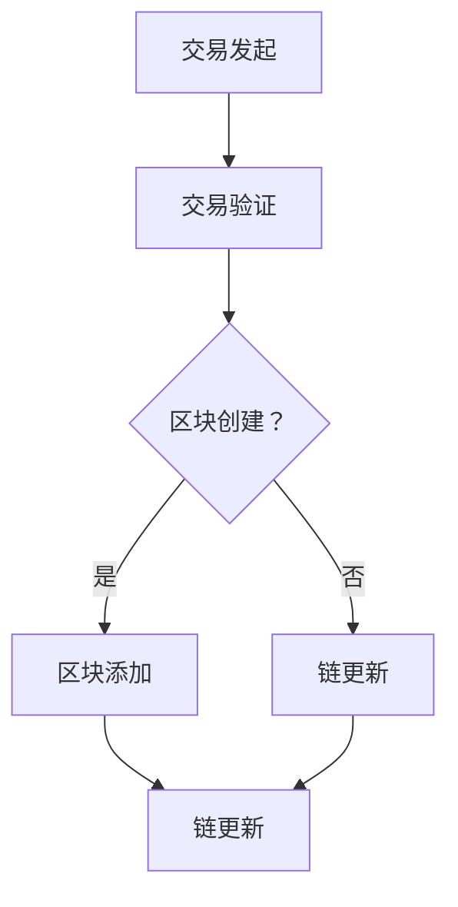

                 

# 文章标题: 虚拟货币与全球脑：去中心化金融体系的社会影响

> 关键词：虚拟货币、去中心化金融（DeFi）、全球脑、社会影响、技术发展

> 摘要：本文将探讨虚拟货币与全球脑在去中心化金融体系中的应用和影响。通过分析去中心化金融的背景、核心概念与架构，以及虚拟货币的核心算法，我们将深入了解去中心化金融的社会影响，并探讨其未来发展趋势。文章最后将通过具体项目实战，展示去中心化金融的实践过程和技术要点。

### 目录大纲

#### 第一部分：引论
- 第1章：去中心化金融体系概述
  - 1.1 去中心化金融的兴起与背景
  - 1.2 去中心化金融的发展历程
  - 1.3 全球脑的概念与应用

#### 第二部分：核心概念与架构
- 第2章：区块链与智能合约
  - 2.1 区块链技术原理
  - 2.2 智能合约原理与实现
  - 2.3 Mermaid 流程图：区块链与智能合约的工作流程

#### 第三部分：去中心化金融的核心算法
- 第3章：去中心化金融的核心算法
  - 3.1 加密货币的算法原理
  - 3.2 去中心化交易协议
  - 3.3 数学模型与数学公式

#### 第四部分：虚拟货币案例分析
- 第4章：虚拟货币案例分析
  - 4.1 比特币：去中心化货币的先驱
  - 4.2 以太坊：去中心化金融平台
  - 4.3 其他虚拟货币案例分析

#### 第五部分：全球脑与社会影响
- 第5章：全球脑的概念与应用
  - 5.1 全球脑的理论基础
  - 5.2 全球脑在去中心化金融中的应用
  - 5.3 全球脑对社会的影响

#### 第六部分：去中心化金融的未来
- 第6章：去中心化金融的未来发展趋势
  - 6.1 技术发展趋势
  - 6.2 政策与法规的发展
  - 6.3 去中心化金融的社会影响

#### 第七部分：项目实战
- 第7章：去中心化金融项目实战
  - 7.1 开发环境搭建
  - 7.2 源代码详细实现
  - 7.3 代码解读与分析

### 附录
- 附录A：技术资源与工具介绍

## 引言

随着区块链技术的不断成熟，去中心化金融（Decentralized Finance，简称DeFi）逐渐成为金融领域的一股新兴力量。去中心化金融通过区块链和智能合约技术，实现了金融服务的去中心化和自动化，为传统金融体系带来了一定的冲击。与此同时，虚拟货币作为去中心化金融的核心组成部分，也在全球范围内引发了广泛关注。

去中心化金融的兴起，不仅是对传统金融模式的挑战，更是一种全新的社会和经济模式的探索。而全球脑（Global Brain）的概念，则为我们提供了理解这一新兴领域的新视角。全球脑是一种比喻，描述了人类作为一个整体，通过信息交流和知识共享，逐渐形成一个具有智能的全球性系统。

本文将围绕虚拟货币与全球脑，探讨去中心化金融体系的社会影响。首先，我们将介绍去中心化金融的背景和发展历程，帮助读者了解这一领域的起源和现状。接着，我们将深入剖析区块链和智能合约的核心概念与架构，为理解去中心化金融的技术原理打下基础。

在核心算法部分，我们将详细讲解虚拟货币的算法原理和去中心化交易协议，并通过数学模型和公式进行分析。随后，我们将通过案例分析，展示比特币、以太坊等虚拟货币的特性和应用。同时，我们还将探讨全球脑的概念与应用，分析全球脑在去中心化金融中的潜在作用和影响。

最后，本文将探讨去中心化金融的未来发展趋势，包括技术、政策和法规等方面。同时，通过项目实战，我们将展示去中心化金融的实践过程和技术要点，为读者提供实际操作的经验和指导。

通过本文的探讨，我们希望能够为读者提供对去中心化金融体系和社会影响的全面了解，引发对这一新兴领域的深入思考。

### 第一部分：引论

#### 第1章：去中心化金融体系概述

1.1 去中心化金融的兴起与背景

去中心化金融（DeFi）的概念并非一夜之间兴起，而是经历了多年的技术积累和探索。区块链技术的诞生为去中心化金融提供了基础，而智能合约技术的引入则进一步推动了这一领域的发展。

2008年，中本聪（Satoshi Nakamoto）发布了比特币的白皮书，提出了一个无需依赖中心化机构的去中心化数字货币系统。比特币的诞生标志着区块链技术的首次尝试，也为去中心化金融的概念奠定了基础。在比特币之后，越来越多的加密货币涌现出来，如以太坊、门罗币等，这些虚拟货币逐渐形成了去中心化金融的雏形。

去中心化金融的兴起背景主要源于以下几个方面：

1. **金融体系的不信任**：传统的金融体系依赖于中心化的机构和权威，如银行、证券交易所等。然而，历史上多次金融崩溃和金融机构的丑闻事件，使得人们对中心化金融体系产生了不信任。去中心化金融通过去除了中心化机构的依赖，提供了一个更加透明、公正的金融环境。

2. **互联网技术的发展**：互联网技术的普及为去中心化金融的发展提供了条件。互联网使得全球用户可以方便地进行信息交流和资源共享，为去中心化金融的全球化应用提供了基础设施。

3. **区块链技术的成熟**：区块链技术通过分布式账本和智能合约，实现了数据的透明性和不可篡改性。这为去中心化金融提供了可靠的技术保障，使得金融交易和合约执行可以自动进行，无需依赖中心化的第三方。

1.2 去中心化金融的发展历程

去中心化金融的发展可以分为以下几个阶段：

**早期探索阶段（2010-2014年）**：在这个阶段，比特币逐渐得到认可，而以太坊的创始人Vitalik Buterin则提出了智能合约的概念。2014年，以太坊正式发布，为去中心化金融的发展提供了新的可能性。

**快速发展阶段（2015-2018年）**：随着区块链技术的进一步成熟，越来越多的去中心化金融项目涌现出来。这其中包括借贷平台、去中心化交易所、去中心化稳定币等。这个阶段也见证了去中心化金融市场的快速增长。

**成熟与争议并存阶段（2019年至今）**：去中心化金融市场在2019年之后继续扩大，但也面临着一系列的挑战和争议。智能合约的安全性问题、去中心化金融项目的合规性问题等都成为了关注的焦点。然而，这些挑战并没有阻碍去中心化金融的发展，反而促进了技术的进步和规范的形成。

1.3 去中心化金融的发展趋势

当前，去中心化金融正朝着以下几个方向发展：

**技术演进**：区块链技术不断演进，新的区块链平台和智能合约开发工具不断涌现。例如，Ethereum 2.0的升级、Binance Smart Chain的发展等，都为去中心化金融提供了更高效、更安全的解决方案。

**应用拓展**：去中心化金融的应用领域逐渐扩大，从最初的数字货币交易和借贷，扩展到保险、资产管理、供应链金融等多个领域。这些应用拓展了去中心化金融的实用性和影响力。

**政策与法规**：随着去中心化金融的快速发展，各国政府和监管机构也开始重视这一领域。一些国家已经开始制定相关的政策法规，以规范去中心化金融的发展。这为去中心化金融的合规性提供了保障，也为市场的发展提供了明确的方向。

1.4 全球脑的概念与应用

全球脑（Global Brain）是一个比喻，描述了人类作为一个整体，通过信息交流和知识共享，逐渐形成一个具有智能的全球性系统。全球脑的概念最早由麻省理工学院的教授彼得·特明（Peter Senge）在1990年代提出。

全球脑的概念可以类比于人脑，人类通过语言、文字、网络等工具进行信息交流和知识共享，从而形成了一个庞大的知识网络。这个网络具有智能，能够自主学习和进化。

在去中心化金融中，全球脑的概念具有以下几个应用：

**信息共享**：去中心化金融通过区块链技术实现了数据的透明性和不可篡改性，使得全球用户可以共享金融信息，提高了金融市场的透明度和可信度。

**智能合约**：智能合约通过代码实现了自动化的合约执行，类似于全球脑中的自主学习和决策机制。

**社区治理**：去中心化金融项目通常采用社区治理模式，通过全球用户的投票和决策，共同管理去中心化金融项目的发展方向。这种治理模式体现了全球脑的集体智慧和协同作用。

通过全球脑的概念，我们可以更深入地理解去中心化金融的社会影响，以及其在未来金融体系中的潜在作用。

## 第二部分：核心概念与架构

#### 第2章：区块链与智能合约

2.1 区块链技术原理

区块链技术是一种分布式账本技术，通过将数据分散存储在多个节点上，实现了数据的透明性和不可篡改性。区块链的基本概念包括区块、链和节点。

- **区块**：区块是区块链的基本单位，包含了若干交易记录。每个区块都有一个时间戳和一个唯一的哈希值，用于标识区块的创建时间和数据完整性。

- **链**：区块链是由多个区块按时间顺序连接而成的链条。每个区块都通过其哈希值与前一个区块相连，形成了一个不可篡改的数据结构。

- **节点**：节点是区块链网络中的参与者，负责维护区块链的完整性和可靠性。每个节点都有一份完整的区块链副本，并通过网络同步数据。

区块链的工作原理如下：

1. **交易发起**：用户在区块链上发起交易，例如转账、购买商品等。
2. **交易验证**：交易经过多个节点验证，确保交易的有效性和安全性。
3. **区块创建**：验证后的交易被添加到一个区块中，由矿工（或节点）进行加密和时间戳处理。
4. **区块添加**：加密后的区块被添加到区块链的末端，形成一个新的区块。
5. **链更新**：其他节点接收到新区块后，更新其区块链副本，确保整个区块链的完整性和一致性。

常见的区块链平台包括：

- **比特币（Bitcoin）**：比特币是最早的区块链平台，以去中心化的数字货币为目标。
- **以太坊（Ethereum）**：以太坊是一个智能合约平台，支持多种去中心化应用（DApp）的开发。
- **EOS**：EOS是一个高性能的区块链平台，致力于实现大规模的去中心化应用。

2.2 智能合约原理与实现

智能合约是一种自动执行的合约，通过代码实现了合同的条款和执行逻辑。智能合约的基本概念包括合约、事件和函数。

- **合约**：合约是智能合约的基本单位，包含了合约的条款和执行逻辑。合约通常由开发者编写，并部署到区块链上。
- **事件**：事件是合约执行过程中触发的特定操作，用于通知其他节点合约的状态变化。
- **函数**：函数是合约中的可执行代码，用于实现合约的具体功能。

智能合约的实现通常包括以下步骤：

1. **合约编写**：开发者使用智能合约编程语言（如Solidity、Vyper等）编写合约代码，定义合约的条款和执行逻辑。
2. **合约编译**：将合约代码编译为区块链平台支持的字节码，以便在区块链上进行部署和执行。
3. **合约部署**：将编译后的合约代码部署到区块链上，使其可供节点执行。
4. **合约调用**：节点通过区块链网络调用合约函数，执行合约逻辑并处理交易。

智能合约编程语言主要包括：

- **Solidity**：Solidity是最流行的智能合约编程语言，广泛应用于以太坊平台。
- **Vyper**：Vyper是一种更安全、更易读的智能合约编程语言，适用于以太坊平台。

2.3 智能合约的安全性问题

智能合约的安全性是去中心化金融体系中的一个重要问题。由于智能合约代码的执行是自动的，一旦出现漏洞，可能会导致严重的损失。

智能合约的安全性问题主要包括：

- **代码漏洞**：智能合约代码可能存在各种漏洞，如溢出、逻辑错误等，导致合约执行失败或数据泄露。
- **外部攻击**：智能合约可能受到外部攻击，如DDoS攻击、合约入侵等，影响合约的执行和安全性。
- **合约治理**：智能合约的治理结构可能存在缺陷，如缺乏透明度、无法及时响应问题等，影响合约的可持续性。

为了提高智能合约的安全性，可以采取以下措施：

- **代码审计**：对智能合约代码进行安全审计，识别和修复潜在的安全漏洞。
- **安全测试**：对智能合约进行安全测试，模拟各种攻击场景，验证合约的安全性和可靠性。
- **社区治理**：建立社区治理机制，确保智能合约的透明度和可信赖性。

2.4 Mermaid 流程图：区块链与智能合约的工作流程

为了更好地理解区块链与智能合约的工作流程，我们可以使用Mermaid流程图进行描述。



在这个流程图中，A表示交易发起，B表示交易验证，C表示区块创建决策，D表示区块添加，E表示链更新。当交易被验证通过后，将创建一个新的区块并添加到区块链的末端。同时，其他节点会接收到新区块，并更新其区块链副本，确保整个区块链的一致性。

通过这个流程图，我们可以清晰地了解区块链与智能合约的基本工作流程，为后续章节的分析和探讨提供基础。

## 第三部分：去中心化金融的核心算法

#### 第3章：去中心化金融的核心算法

3.1 加密货币的算法原理

加密货币是一种去中心化的数字货币，通过加密算法实现安全性和匿名性。加密货币的基本算法原理包括哈希函数、数字签名和加密算法。

- **哈希函数**：哈希函数是一种将任意长度的数据映射为固定长度的字符串的算法。在加密货币中，哈希函数用于生成地址、交易ID等。常见的哈希函数包括SHA-256和RIPEMD-160。

- **数字签名**：数字签名是一种验证消息真实性和完整性的技术。在加密货币中，用户使用私钥对交易进行签名，以证明交易的有效性和合法性。

- **加密算法**：加密算法用于保护数据的机密性和完整性。在加密货币中，常用的加密算法包括AES、RSA等。

加密货币的安全性分析主要包括以下几个方面：

- **抗篡改性**：加密货币的交易记录被永久存储在区块链上，一旦生成，无法篡改。这使得加密货币具有较高的抗篡改性。

- **匿名性**：加密货币交易不涉及真实身份信息，交易双方的身份信息被加密隐藏。这提高了交易的安全性和隐私性。

- **抗双花攻击**：双花攻击是指同一笔资金被用于多次交易。加密货币通过区块链网络和共识算法，防止双花攻击的发生。

3.2 去中心化交易协议

去中心化交易协议（Decentralized Exchange Protocol，简称DEX）是一种在去中心化金融中实现交易的方式。DEX通过区块链技术，实现了去中心化的交易过程，无需依赖中心化的交易所。

去中心化交易协议的基本概念包括交易市场、交易订单和交易结算。

- **交易市场**：交易市场是去中心化交易的核心，包含了各种交易对（如比特币/以太坊、比特币/美元等）。

- **交易订单**：交易订单是用户在交易市场中发布的交易请求。交易订单包含交易对、交易数量、交易价格等信息。

- **交易结算**：交易结算是指交易完成后，交易资金和代币的转移过程。去中心化交易协议通过智能合约实现交易结算，确保交易的透明性和安全性。

常见的去中心化交易协议包括：

- **订单簿协议**：订单簿协议是一种基于订单簿的交易方式，类似于中心化交易所。用户可以在订单簿中发布和查找交易订单，进行交易。

- **去中心化点对点交易**：去中心化点对点交易（P2P）是一种直接在用户之间进行交易的方式。用户通过加密通信和智能合约，实现点对点交易。

- **流动性挖矿协议**：流动性挖矿协议通过激励机制，鼓励用户提供交易对流动性。用户提供流动性后，可以获得交易手续费和其他激励奖励。

3.3 数学模型与数学公式

去中心化金融中的数学模型和公式主要用于描述和预测金融交易和市场行为。以下是一些常见的数学模型和公式：

- **货币供应量模型**：货币供应量模型描述了货币供应量的变化规律。常见的货币供应量模型包括MV=PQ模型，其中M代表货币供应量，V代表货币流通速度，P代表物价水平，Q代表实际交易量。

- **货币供需模型**：货币供需模型描述了货币需求量和供应量之间的关系。货币需求量取决于利率、货币流通速度和物价水平，货币供应量则由中央银行或去中心化金融系统控制。

- **交易价格模型**：交易价格模型描述了交易价格的变化规律。常见的交易价格模型包括供需模型和波动率模型，其中供需模型认为交易价格由供需关系决定，波动率模型则认为交易价格受到市场波动率的影响。

以下是一个简单的货币供需模型的示例：

```latex
\begin{equation}
P = \frac{D}{S}
\end{equation}

其中，P代表交易价格，D代表货币需求量，S代表货币供应量。
```

在这个模型中，交易价格P由货币需求量D和货币供应量S的比值决定。当货币需求量增加或货币供应量减少时，交易价格P会上升；反之，当货币需求量减少或货币供应量增加时，交易价格P会下降。

通过这些数学模型和公式，我们可以更好地理解和预测去中心化金融的交易和市场行为，为投资者和开发者提供参考。

### 第四部分：虚拟货币案例分析

#### 第4章：虚拟货币案例分析

4.1 比特币：去中心化货币的先驱

比特币（Bitcoin）是第一种真正的去中心化货币，由中本聪（Satoshi Nakamoto）在2009年创建。比特币采用加密算法和分布式网络技术，实现了去中心化的货币发行和交易。

比特币的机制与特性包括：

- **去中心化发行**：比特币的发行不依赖于中央银行或任何中心化机构，而是通过矿工在区块链上解决数学难题来获得。这种去中心化的发行方式保证了货币供应的稀缺性和稳定性。

- **匿名性**：比特币交易不涉及真实身份信息，交易双方的身份信息被加密隐藏。这使得比特币具有较高的匿名性，但也带来了一定的隐私保护问题。

- **安全性**：比特币采用加密算法和分布式网络技术，确保了交易记录的透明性和不可篡改性。这使得比特币具有较高的安全性，但也带来了一定的技术复杂性和计算资源消耗。

比特币面临的挑战与未来：

- **安全性**：比特币的安全性问题主要集中在加密算法和分布式网络技术的可靠性和抗攻击性。随着量子计算机的发展，传统的加密算法可能面临被破解的风险。

- **合规性**：比特币作为一种去中心化货币，其合规性问题受到各国政府和监管机构的关注。一些国家已经开始制定相关政策，对比特币进行监管和规范。

- **应用场景**：比特币作为一种去中心化货币，其应用场景逐渐扩大，从最初的数字货币交易，扩展到跨境支付、数字资产投资等多个领域。然而，比特币的广泛应用仍面临一定的挑战，如交易速度、交易费用等问题。

4.2 以太坊：去中心化金融平台

以太坊（Ethereum）是由Vitalik Buterin在2015年创建的去中心化平台，旨在构建去中心化应用（DApp）生态系统。以太坊通过智能合约和区块链技术，实现了去中心化金融、去中心化游戏、去中心化身份验证等多种应用。

以太坊的机制与特性包括：

- **智能合约**：以太坊支持智能合约，允许开发者在区块链上创建和部署去中心化应用。智能合约通过代码实现了合同的条款和执行逻辑，无需依赖中心化的第三方。

- **去中心化金融**：以太坊的去中心化金融（DeFi）应用涵盖了借贷、交易、投资等多个领域。用户可以通过以太坊平台进行去中心化金融交易，享受低费用、高透明度的金融服务。

- **去中心化身份验证**：以太坊的去中心化身份验证技术，通过区块链和智能合约实现了身份信息的验证和存储。这种去中心化的身份验证方式，提高了个人隐私保护和数据安全性。

以太坊的去中心化金融应用：

- **去中心化借贷**：以太坊上的去中心化借贷平台，如Aave、Compound等，允许用户通过抵押数字资产获得借贷服务。这种去中心化的借贷方式，降低了借贷成本，提高了借贷效率。

- **去中心化交易**：以太坊上的去中心化交易平台，如Uniswap、Kyber Network等，通过智能合约实现了去中心化的交易。用户可以在去中心化交易平台上进行数字资产交易，享受低费用、高透明度的交易服务。

- **去中心化投资**：以太坊上的去中心化投资平台，如Yearn.finance、SushiSwap等，通过智能合约实现了去中心化的投资组合管理。用户可以通过这些平台，将数字资产投资于多种不同的金融产品，实现资产增值。

4.3 其他虚拟货币案例分析

除了比特币和以太坊，还有许多其他虚拟货币在去中心化金融领域取得了一定的进展。以下是一些其他虚拟货币的案例分析：

- **门罗币（Monero）**：门罗币是一种隐私保护货币，通过加密算法和匿名交易技术，实现了交易数据的隐私保护。门罗币在去中心化金融领域主要用于匿名交易和数字资产保护。

- **达世币（Dash）**：达世币是一种即时交易货币，通过一种称为“隐匿路线”的技术，实现了快速、安全的交易。达世币在去中心化金融领域主要用于跨境支付和日常交易。

- **波场币（Tron）**：波场币是一个去中心化娱乐平台，通过区块链和智能合约技术，实现了数字娱乐内容的去中心化管理和交易。波场币在去中心化金融领域主要用于数字娱乐内容交易和数字资产投资。

这些虚拟货币在去中心化金融领域的应用，为用户提供了更多的选择和自由度。然而，这些虚拟货币也面临着安全性、合规性、应用场景等方面的挑战，需要进一步的技术发展和市场探索。

### 第五部分：全球脑与社会影响

#### 第5章：全球脑的概念与应用

5.1 全球脑的理论基础

全球脑（Global Brain）是一个比喻，描述了人类作为一个整体，通过信息交流和知识共享，逐渐形成一个具有智能的全球性系统。这一概念最早由麻省理工学院的教授彼得·特明（Peter Senge）在1990年代提出。

全球脑的理论基础主要包括以下几个方面：

- **网络效应**：全球脑的形成依赖于互联网技术的普及，使得全球用户可以方便地进行信息交流和知识共享。网络效应使得信息传播速度加快，知识积累速度提高，从而推动全球脑的形成。

- **知识共享**：全球脑的核心在于知识共享。通过信息交流和知识共享，人类可以不断积累和进化，形成了一个具有集体智慧的全球性系统。

- **协同进化**：全球脑的形成是一个协同进化的过程。个体通过不断学习和适应，实现了知识的积累和进化，从而推动了全球脑的发展。

5.2 全球脑与人类智能的关系

全球脑与人类智能有着密切的关系。人类智能是局部智能，而全球脑则是集体智能。人类智能通过个体学习和进化，形成了局部智能；而全球脑则通过信息交流和知识共享，实现了集体智能。

全球脑与人类智能的关系可以从以下几个方面进行分析：

- **知识积累**：人类智能通过个体的学习和记忆，积累了大量的知识。这些知识通过互联网和通信技术，实现了全球共享，从而推动了全球脑的发展。

- **协作创新**：全球脑通过信息共享和知识协作，实现了不同领域、不同背景的人类智能的融合和协同创新。这种协作创新能力是传统个体智能无法比拟的。

- **智能进化**：全球脑的形成是一个智能进化的过程。通过信息交流和知识共享，人类智能不断学习和进化，推动了全球脑的发展。

5.3 全球脑的社会意义

全球脑对社会具有深远的意义，主要体现在以下几个方面：

- **知识共享**：全球脑通过信息共享，实现了全球知识的积累和传播。这有助于提高人类的整体知识水平，推动社会进步。

- **创新驱动**：全球脑的协同进化能力，使得全球智能不断学习和进化，推动了创新和科技进步。这种创新驱动能力对经济发展和社会进步具有重要意义。

- **社会治理**：全球脑的形成，为全球社会治理提供了新的思路和方法。通过信息共享和知识协作，全球社会可以更好地应对各种挑战和问题，实现全球治理的优化。

5.4 全球脑在去中心化金融中的应用

全球脑的概念在去中心化金融（DeFi）中具有广泛的应用。去中心化金融通过区块链技术和智能合约，实现了金融服务的去中心化和自动化。而全球脑则为去中心化金融提供了智能化的支持，主要体现在以下几个方面：

- **智能合约**：智能合约是去中心化金融的核心，通过代码实现了金融合约的自动化执行。全球脑可以通过智能合约，实现金融合约的智能决策和自适应调整。

- **社区治理**：去中心化金融项目通常采用社区治理模式，通过全球用户的投票和决策，共同管理项目的发展方向。全球脑可以通过社区治理，实现集体智慧和协同决策。

- **风险控制**：全球脑可以通过大数据分析和智能算法，实现对金融交易的风险控制和预测。这种智能化的风险控制能力，有助于提高去中心化金融的安全性和可靠性。

5.5 全球脑对社会的影响

全球脑对社会的影响是多方面的，主要体现在以下几个方面：

- **经济领域**：全球脑通过信息共享和知识协作，推动了经济领域的发展。去中心化金融等新兴经济模式，借助全球脑的智能支持，实现了经济的创新和进步。

- **社会治理**：全球脑为全球社会治理提供了新的思路和方法。通过信息共享和知识协作，全球社会可以更好地应对各种挑战和问题，实现全球治理的优化。

- **文化变迁**：全球脑的形成，推动了全球文化的交流和融合。不同文化之间的碰撞和融合，促进了文化的多样性和进步。

5.6 全球脑的挑战与未来

全球脑的发展面临着一系列的挑战，主要包括：

- **隐私保护**：全球脑的信息共享和知识协作，涉及到大量的个人隐私信息。如何保护个人隐私，防止信息泄露，是全球脑发展面临的重要挑战。

- **智能算法**：全球脑的智能化程度取决于智能算法的发展。如何设计和优化智能算法，提高全球脑的智能水平，是全球脑发展的关键问题。

- **社会治理**：全球脑的形成，对全球社会治理提出了新的要求。如何制定相关政策和法规，实现全球治理的有效性，是全球脑发展面临的重要问题。

未来，全球脑的发展将朝着以下几个方向：

- **智能化**：通过不断优化智能算法和人工智能技术，提高全球脑的智能化水平，实现更高效、更精准的信息处理和决策。

- **协同化**：通过加强全球协作和信息共享，推动全球脑的协同进化，实现全球社会的共同进步。

- **治理优化**：通过制定相关政策和法规，实现全球治理的有效性和公正性，推动全球社会的可持续发展。

总之，全球脑的发展为去中心化金融体系提供了强大的支持，同时也对社会产生了深远的影响。通过不断探索和优化，全球脑有望成为推动社会进步和经济发展的重要力量。

### 第六部分：去中心化金融的未来

#### 第6章：去中心化金融的未来发展趋势

6.1 技术发展趋势

去中心化金融（DeFi）的快速发展离不开技术的不断创新和进步。未来，去中心化金融将在以下技术领域取得重要进展：

- **区块链技术的进化**：区块链技术将继续发展，特别是在性能、可扩展性和安全性方面。未来的区块链平台将更加高效、安全，支持更多的去中心化应用。

- **智能合约的优化**：智能合约的编程语言和开发工具将不断优化，提高智能合约的安全性和可维护性。这将有助于减少智能合约漏洞，提高去中心化金融系统的稳定性。

- **跨链技术的应用**：跨链技术将实现不同区块链之间的互操作性，使得去中心化金融能够更加无缝地连接，促进全球金融市场的整合。

- **隐私保护的增强**：随着隐私保护意识的提升，去中心化金融将加强对用户隐私的保护。通过隐私保护技术，如零知识证明和环签名，去中心化金融将更好地平衡透明性和用户隐私。

6.2 政策与法规的发展

去中心化金融的快速发展引起了各国政府和监管机构的关注。未来，政策与法规的发展将直接影响去中心化金融的合规性和发展方向：

- **全球监管环境的变化**：随着去中心化金融的国际化，全球监管环境将变得更加复杂。各国政府可能出台更加完善的法律法规，以规范去中心化金融的发展。

- **法律框架的完善**：随着去中心化金融的普及，相关法律框架将不断完善。这包括对加密货币的监管、智能合约的法律效力、去中心化金融平台的合规要求等。

- **法规对去中心化金融的监管**：政府将加强对去中心化金融的监管，确保金融市场的稳定和用户的权益。这可能包括对交易平台的监管、资金流动的监控以及风险控制的加强。

6.3 去中心化金融的社会影响

去中心化金融的发展将对社会产生深远的影响，主要体现在以下几个方面：

- **经济模式的转变**：去中心化金融将改变传统金融体系，推动金融服务的去中心化和自动化。这将降低金融服务的门槛，提高金融资源的配置效率，促进全球经济的发展。

- **金融服务的普及**：去中心化金融将使得金融服务更加普及和便捷。通过区块链技术和智能合约，用户可以随时随地进行金融交易，享受低费用、高透明度的金融服务。

- **对现有金融体系的挑战**：去中心化金融的兴起将对传统金融体系带来一定的挑战。传统金融机构需要适应去中心化金融的变革，提升自身的竞争力和创新能力。

6.4 去中心化金融的未来展望

未来，去中心化金融将继续发展，并可能呈现以下趋势：

- **更多应用场景的出现**：去中心化金融的应用将不断扩大，从传统的借贷、交易扩展到保险、供应链金融、数字资产管理等更多领域。

- **社区治理的完善**：去中心化金融项目将更加注重社区治理，通过用户参与和投票，实现项目决策的民主化和透明化。

- **跨行业合作**：去中心化金融将与其他行业（如物联网、人工智能、云计算等）进行深度合作，推动金融与科技融合，实现更广泛的价值创造。

总之，去中心化金融的未来充满机遇和挑战。通过技术创新、政策完善和社区治理，去中心化金融有望成为推动社会进步和经济发展的重要力量。

### 第七部分：项目实战

#### 第7章：去中心化金融项目实战

7.1 开发环境搭建

在进行去中心化金融项目的开发之前，首先需要搭建一个合适的环境。以下是一个基本的开发环境搭建步骤：

1. **节点环境配置**：选择一个合适的区块链平台（如Ethereum），并配置一个本地节点。可以使用Geth或Node.js等工具进行配置。

2. **开发工具安装**：安装智能合约开发工具（如Truffle、Hardhat等），并配置相应的开发环境。这些工具提供了智能合约的编写、编译、部署和测试功能。

3. **源代码管理**：使用版本控制工具（如Git）管理项目的源代码。这将帮助团队协作和代码版本管理。

7.2 源代码详细实现

去中心化金融项目的源代码实现主要包括智能合约的编写和应用程序的开发。

1. **智能合约编写**：使用Solidity或其他智能合约编程语言编写智能合约代码。智能合约应包括以下基本功能：

   - **交易逻辑**：定义交易的基本逻辑，如转账、交易确认等。
   - **权益管理**：管理用户的权益，如抵押、借贷等。
   - **安全控制**：实现安全控制，如访问控制、防刷单等。

2. **应用程序开发**：使用前端框架（如React、Vue等）开发用户界面。应用程序应实现以下功能：

   - **用户注册与登录**：支持用户注册、登录和密码重置等功能。
   - **交易界面**：提供交易界面，支持用户进行交易操作。
   - **资产管理**：展示用户的资产信息，包括余额、交易历史等。

7.3 用户交互与交易流程

在去中心化金融项目中，用户交互和交易流程是核心部分。以下是一个典型的用户交互和交易流程：

1. **用户注册与登录**：用户通过注册和登录功能，获取访问权限。

2. **账户管理**：用户管理自己的账户，包括查看余额、转账、抵押等操作。

3. **交易操作**：用户可以通过交易界面，选择交易对、输入交易金额和地址，发起交易。

4. **交易确认**：交易被区块链网络验证后，系统将更新用户账户余额，并生成交易记录。

7.4 代码解读与分析

以下是去中心化金融项目中的一个示例代码，用于实现一个简单的交易合约：

```solidity
// SPDX-License-Identifier: MIT
pragma solidity ^0.8.0;

contract SimpleExchange {
    address public owner;
    mapping(address => uint256) public balances;

    constructor() {
        owner = msg.sender;
    }

    function deposit() public payable {
        balances[msg.sender()] += msg.value;
    }

    function withdraw(uint256 amount) public {
        require(amount <= balances[msg.sender()], "Insufficient balance");
        balances[msg.sender()] -= amount;
        payable(msg.sender()).transfer(amount);
    }

    function transfer(address to, uint256 amount) public {
        require(amount <= balances[msg.sender()], "Insufficient balance");
        balances[msg.sender()] -= amount;
        balances[to] += amount;
    }
}
```

这段代码实现了以下功能：

- **账户管理**：通过`balances`映射，管理用户的账户余额。
- **存款操作**：通过`deposit`函数，用户可以存款。
- **取款操作**：通过`withdraw`函数，用户可以取款。
- **转账操作**：通过`transfer`函数，用户可以转账给其他账户。

代码解读：

- **构造函数**：`constructor`定义了合约的拥有者，默认为部署合约的地址。
- **存款函数**：`deposit`函数使用` payable`关键字接收以太币，并将金额添加到用户的账户余额。
- **取款函数**：`withdraw`函数检查用户账户余额是否足够，然后从用户的账户余额中减去相应的金额，并使用` payable`关键字将金额转给用户。
- **转账函数**：`transfer`函数用于将金额从一个账户转移到另一个账户。

通过这段代码的实现，我们可以看到去中心化金融项目的基本逻辑和架构。实际项目中，还需要考虑更多的功能和安全措施，如访问控制、智能合约审计、用户隐私保护等。

### 附录

#### 附录A：技术资源与工具介绍

A.1 常用区块链开发框架

- **Ethereum**：以太坊是一个智能合约平台，支持多种去中心化应用（DApp）的开发。Ethereum的开发框架包括Truffle、Hardhat和B Brownie等。

  - **Truffle**：Truffle是一个用于Ethereum开发的开源工具包，提供智能合约编译、部署和测试功能。

  - **Hardhat**：Hardhat是一个高性能的本地开发环境，支持本地链和测试合约。

  - **B Brownie**：B Brownie是一个Python库，用于Ethereum开发，提供智能合约编译、部署和测试功能。

- **Tron**：波场是一个去中心化应用平台，支持数字货币交易和去中心化金融应用。Tron的开发框架包括Truffle和Hardhat等。

- **Binance Smart Chain**：Binance Smart Chain是Binance推出的智能合约平台，支持多种去中心化应用的开发。Binance Smart Chain的开发框架包括Truffle和Hardhat等。

A.2 智能合约开发工具

- **Truffle**：Truffle是一个用于Ethereum开发的开源工具包，提供智能合约编译、部署和测试功能。

  - **智能合约编译**：Truffle支持Solidity、Vyper等智能合约编程语言，可以编译智能合约代码为字节码。

  - **智能合约部署**：Truffle支持在本地和远程节点上部署智能合约，并提供部署脚本。

  - **智能合约测试**：Truffle提供测试框架，支持智能合约的单元测试和集成测试。

- **Hardhat**：Hardhat是一个高性能的本地开发环境，支持本地链和测试合约。

  - **本地链**：Hardhat提供了一个本地区块链节点，支持智能合约的本地开发和测试。

  - **测试合约**：Hardhat提供测试合约功能，可以在本地链上部署和测试智能合约。

- **Brownie**：Brownie是一个Python库，用于Ethereum开发，提供智能合约编译、部署和测试功能。

  - **智能合约编译**：Brownie支持Solidity、Vyper等智能合约编程语言，可以编译智能合约代码为字节码。

  - **智能合约部署**：Brownie支持在本地和远程节点上部署智能合约，并提供部署脚本。

  - **智能合约测试**：Brownie提供测试框架，支持智能合约的单元测试和集成测试。

A.3 加密货币交易平台

- **Coinbase**：Coinbase是一个知名的加密货币交易平台，提供比特币、以太坊等多种加密货币的交易服务。

- **Binance**：Binance是一个全球最大的加密货币交易平台，提供比特币、以太坊等多种加密货币的交易服务。

- **Kraken**：Kraken是一个知名的加密货币交易平台，提供比特币、以太坊等多种加密货币的交易服务。

### 作者信息

作者：AI天才研究院/AI Genius Institute & 禅与计算机程序设计艺术 /Zen And The Art of Computer Programming

本文由AI天才研究院（AI Genius Institute）和禅与计算机程序设计艺术（Zen And The Art of Computer Programming）共同撰写，旨在探讨虚拟货币与全球脑在去中心化金融体系中的应用和影响。通过深入分析和实际案例，本文为读者提供了全面的技术解读和实战指导。我们希望本文能够激发读者对去中心化金融和区块链技术的兴趣，推动这一领域的创新和发展。

