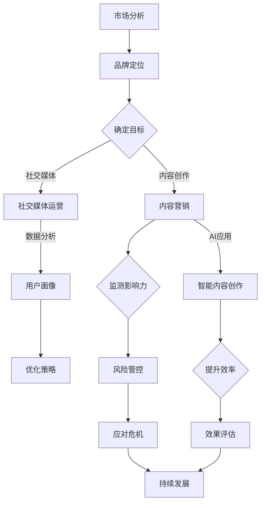

                 

### 文章标题：虚拟身份市场动态：AI时代的个人品牌经济

#### 关键词：
- 虚拟身份
- AI
- 个人品牌
- 数字经济
- 社交媒体

#### 摘要：
本文深入探讨了AI时代下虚拟身份市场的动态变化及其对个人品牌经济的影响。通过分析虚拟身份市场的背景、AI技术的应用、个人品牌构建策略，以及风险管理和未来展望，揭示了虚拟身份与个人品牌在数字经济中的核心作用。文章采用逐步推理的方式，结合具体案例，详细阐述了虚拟身份市场与个人品牌构建的流程、核心算法、数学模型和实际应用，为读者提供了全面而深入的技术见解。

### 目录大纲：
1. **第一部分：虚拟身份市场概述**
   1.1 虚拟身份市场背景
   1.2 AI在虚拟身份中的应用
   1.3 虚拟身份市场的现状与未来
2. **第二部分：AI时代的个人品牌构建**
   2.1 个人品牌经济概述
   2.2 AI技术在个人品牌构建中的应用
   2.3 AI时代的个人品牌策略
3. **第三部分：虚拟身份与个人品牌风险管理**
   3.1 虚拟身份安全风险
   3.2 AI时代的隐私保护
   3.3 个人品牌风险管理与应对
4. **第四部分：案例分析**
   4.1 虚拟身份市场成功案例分析
   4.2 个人品牌构建成功案例
5. **第五部分：未来展望**
   5.1 虚拟身份市场的发展趋势
   5.2 个人品牌经济的未来
6. **附录**
   6.1 虚拟身份与个人品牌相关资源
   6.2 虚拟身份市场与个人品牌工具箱
7. **Mermaid流程图：虚拟身份市场与个人品牌构建流程**

### 第一部分：虚拟身份市场概述

#### 1.1 虚拟身份市场背景

虚拟身份市场是随着互联网和数字技术的快速发展而逐渐兴起的一个领域。它不仅仅是指虚拟世界中的角色或形象，更是一个涵盖了用户在数字空间中所有身份特征的综合体系。虚拟身份的定义与演变是一个复杂的过程，它涉及到多个层面的融合。

首先，虚拟身份可以视为实体身份在数字空间的映射。实体身份指的是现实世界中的个体，包括姓名、性别、年龄、职业等基本信息。而数字身份则是通过电子设备、互联网服务和个人数据所构建的一个抽象身份，它通常表现为用户名、密码、电子邮箱、社交媒体账号等。

其次，社交身份是虚拟身份的一个重要组成部分。社交身份是在社交媒体平台上形成的，它通过用户的互动、分享、评论等行为来展现其个性、价值观和社会角色。社交网络中的身份认证与数据隐私是社交身份构建的基础。身份认证确保用户身份的真实性，而数据隐私则保障用户个人信息的安全。

以下是虚拟身份定义的一个公式化表达：

$$
虚拟身份 = 实体身份 + 数字身份 + 社交身份
$$

其中，实体身份是基础，数字身份是桥梁，社交身份是扩展。这种三层结构的虚拟身份模型为用户在数字空间的身份管理提供了理论框架。

在讨论社交网络中的身份认证与数据隐私时，我们需要关注几个关键问题。首先，身份认证是为了防止非法用户入侵，保障网络安全。常见的身份认证方法包括密码认证、双因素认证、生物识别等。每种方法都有其优缺点，需要根据具体应用场景进行选择。

其次，数据隐私是用户在社交网络中最为关心的问题之一。随着大数据和人工智能技术的发展，用户数据的价值愈发凸显，但同时也带来了隐私泄露的风险。为了保护用户隐私，需要从技术、法律和管理等多方面进行综合防护。例如，采用数据加密、匿名化处理等技术手段，以及制定相关法律法规，如《通用数据保护条例》（GDPR），来规范数据收集和使用行为。

#### 1.2 AI在虚拟身份中的应用

人工智能（AI）在虚拟身份市场中扮演着越来越重要的角色。AI技术的应用不仅改变了身份验证的方式，还推动了身份管理和服务的发展。以下是AI在虚拟身份中的应用：

首先，AI在身份验证与身份管理中的作用至关重要。传统的身份验证方法主要依赖于密码和身份认证，而AI技术可以提供更加智能和安全的验证方式。例如，通过人脸识别、指纹识别、声纹识别等技术，AI能够实时验证用户身份，提高安全性和用户体验。以下是一个简单的人脸识别算法伪代码：

```python
def facial_recognition(image, database):
    # 提取图像特征
    features = extract_features(image)
    # 比对特征库中的数据
    match_score = compare_features(features, database)
    # 判断是否匹配
    if match_score > threshold:
        return "身份验证成功"
    else:
        return "身份验证失败"
```

其次，AI在身份管理中的应用也非常广泛。通过大数据分析和机器学习算法，AI可以动态调整身份权限，实现精细化的身份管理。例如，在一个企业内部网络中，AI可以根据员工的职责和工作内容，自动调整其访问权限。以下是一个简单的身份管理算法伪代码：

```python
def identity_management(employee_role, access_logs):
    # 分析员工角色和访问日志
    role_permissions = analyze_role(employee_role, access_logs)
    # 根据权限分配资源
    resource_allocation = assign_permissions(role_permissions)
    return resource_allocation
```

最后，AI在虚拟人格中的应用为虚拟身份市场带来了新的可能性。虚拟人格是通过AI技术模拟出的具有人类思维和行为特征的数字化实体。这些虚拟人格可以用于游戏、虚拟客服、社交媒体等多个场景。以下是一个简单的虚拟人格交互算法伪代码：

```python
def virtual_personality_interaction(user_input, personality_model):
    # 分析用户输入
    intent = analyze_intent(user_input)
    # 根据意图生成响应
    response = generate_response(intent, personality_model)
    return response
```

#### 1.3 虚拟身份市场的现状与未来

当前，虚拟身份市场正处于快速发展阶段。随着人工智能、区块链、虚拟现实等技术的不断进步，虚拟身份市场展现出巨大的潜力和广阔的应用前景。

首先，从市场规模来看，虚拟身份市场的规模正在迅速扩大。据相关报告显示，虚拟身份市场的年复合增长率（CAGR）预计将在未来几年内达到20%以上。这一增长趋势主要得益于数字经济的快速发展和用户对隐私保护意识的提高。

其次，未来虚拟身份市场的发展前景十分广阔。随着5G技术的普及和物联网（IoT）的进一步发展，虚拟身份的应用场景将变得更加多样化和复杂化。例如，在智能城市、智慧医疗、智能交通等领域，虚拟身份将扮演关键角色，提升用户体验和服务效率。

然而，虚拟身份市场也面临一些挑战。首先，数据安全和隐私保护是当前市场亟需解决的问题。随着用户对个人隐私的重视，如何确保虚拟身份数据的安全和隐私成为了一个重要的课题。其次，虚拟身份市场的法律法规尚未完全健全，需要各国政府和企业共同推进相关法规的制定和执行。

总体来说，虚拟身份市场在AI时代的驱动下，具有巨大的发展潜力和广泛的应用前景。通过对AI技术的深入应用和不断探索，虚拟身份市场将迎来更加繁荣的未来。

### 第二部分：AI时代的个人品牌构建

#### 2.1 个人品牌经济概述

个人品牌经济是21世纪数字化时代的重要经济现象，它源于个人在数字世界中的影响力和社会价值的体现。个人品牌可以被定义为一个人在公众视野中的独特形象和价值认同，它不仅包含了个人专业技能、知识和经验，还包括了个人的价值观、人格特质和社交网络影响力。

个人品牌的价值在于它能够为个人带来经济利益和职业发展机会。一个强大的个人品牌能够帮助个人在竞争激烈的职场中脱颖而出，吸引更多的机会和资源。此外，个人品牌还可以转化为商业价值，通过知识付费、咨询、代言等方式实现经济回报。

个人品牌与职业发展之间存在着密切的联系。一个成功的个人品牌能够提升个人的市场价值，增加职业竞争力。同时，职业发展也可以为个人品牌提供内容和支持，形成正向循环。例如，一位在技术领域具有深厚积累的专家，通过持续的技术分享和博客写作，逐渐建立起自己的技术品牌，这不仅提升了他的知名度，也为他在职业发展中赢得了更多的机会。

品牌塑造与市场影响力是个人品牌构建的两个关键方面。品牌塑造是指通过一系列策略和行动，打造出个人品牌的独特形象和价值主张。这包括个人形象设计、内容创作、社交媒体运营等。市场影响力则是指个人品牌在市场中的传播和接受程度，它决定了个人品牌的经济价值和职业发展潜力。

#### 2.2 AI技术在个人品牌构建中的应用

AI技术在个人品牌构建中发挥着重要作用，特别是在内容创作、数据分析、用户画像等方面。以下是AI技术在这些领域的具体应用：

首先，AI在内容创作中的应用。AI技术可以自动生成高质量的内容，包括文章、博客、视频脚本等。通过自然语言处理（NLP）和生成对抗网络（GAN），AI能够根据用户的兴趣和行为，创作出符合其口味的内容。例如，AI写作助手可以分析大量的文章数据，自动生成一篇针对特定主题的博客文章。以下是一个简单的AI写作算法伪代码：

```python
def ai_content_creation(topic, data_source):
    # 分析数据源中的内容
    content_data = analyze_data(data_source, topic)
    # 生成文章
    article = generate_text(content_data)
    return article
```

其次，AI在数据分析中的应用。个人品牌构建需要大量的数据支持，包括用户行为数据、社交媒体互动数据、市场趋势数据等。AI技术可以帮助个人快速分析和解读这些数据，提取有价值的信息。例如，通过机器学习算法，可以分析用户在不同平台上的互动行为，识别出最具影响力的粉丝群体。以下是一个简单的数据分析算法伪代码：

```python
def data_analysis(user_interactions, social_media_data):
    # 分析用户互动数据
    interaction_patterns = analyze_interactions(user_interactions)
    # 分析社交媒体数据
    social_impact = analyze_social_media(social_media_data)
    # 提取有价值信息
    valuable_insights = extract_insights(interaction_patterns, social_impact)
    return valuable_insights
```

最后，AI在用户画像中的应用。用户画像是指通过对用户数据进行分析，构建出用户的行为特征、兴趣偏好和需求模型。AI技术可以帮助个人品牌构建者更准确地了解其受众群体，从而制定更加精准的营销策略。例如，通过深度学习算法，可以构建一个多维的用户画像模型，用于个性化内容推荐和营销。以下是一个简单的用户画像算法伪代码：

```python
def user_segmentation(user_data, behavior_patterns):
    # 分析用户数据
    user_features = analyze_user_data(user_data)
    # 构建用户画像
    user_profile = build_user_profile(user_features, behavior_patterns)
    # 用户分群
    segments = segment_users(user_profile)
    return segments
```

通过上述应用，AI技术为个人品牌构建提供了强大的支持，使得个人品牌能够在数字世界中更加精准、高效地传播和成长。

#### 2.3 AI时代的个人品牌策略

在AI时代，个人品牌构建的策略需要结合AI技术进行创新和优化。以下是一些关键的个人品牌策略，包括个人品牌定位与差异化策略、社交媒体营销策略、以及AI在品牌传播与影响力监测中的应用。

**个人品牌定位与差异化策略**

个人品牌定位是指明确个人品牌在市场中的位置和目标受众。一个清晰的定位能够帮助个人品牌在竞争激烈的市场中脱颖而出。定位策略的关键在于：

- **明确目标受众**：通过市场调研和数据分析，确定目标受众的特征和需求。了解他们的兴趣、行为和价值观，有助于制定针对性的品牌内容。
- **差异化策略**：在定位的基础上，寻找个人品牌的独特卖点（USP），即个人在市场中的差异化优势。差异化策略可以通过以下方式实现：

  - **专业技能**：专注于某一特定领域，成为该领域的专家，提升在行业内的知名度和影响力。
  - **个人特质**：突出个人独特的人格特质，如创新思维、领导力、团队合作能力等。
  - **内容质量**：创作高质量、有价值的原创内容，吸引受众关注和分享。

以下是一个差异化策略的示例：

```plaintext
个人品牌定位：成为数据科学领域的专家，专注于机器学习应用。

差异化优势：
- 拥有5年的数据科学实战经验
- 精通深度学习和自然语言处理技术
- 定期发布高质量的技术博客和案例分析
```

**社交媒体营销策略**

社交媒体营销是个人品牌传播的重要手段。一个有效的社交媒体营销策略需要结合以下关键点：

- **选择合适的平台**：根据目标受众的社交媒体使用习惯，选择最合适的平台进行营销。例如，技术专家可以选择LinkedIn、GitHub等专业社交平台，普通用户则可能更喜欢Instagram、Twitter等大众社交平台。
- **内容创作与分享**：定期发布原创内容，包括技术博客、视频教程、案例分析等。内容应具备高价值、实用性和可读性，能够吸引和保持受众的长期关注。
- **互动与参与**：积极参与社交媒体上的讨论和互动，与粉丝和同行建立良好的关系。通过回复评论、点赞、分享等方式，增强个人品牌的影响力和认知度。

以下是一个社交媒体营销策略的示例：

```plaintext
社交媒体营销策略：

1. 每周发布一篇原创技术博客，涵盖最新技术趋势和应用案例。
2. 在LinkedIn上定期更新职业动态，分享项目经验和学习心得。
3. 在GitHub上维护个人项目，提供开源代码和详细说明，吸引技术同行的关注和合作。
4. 在Twitter上参与相关话题讨论，与其他技术专家互动，扩大个人影响力。
```

**AI在品牌传播与影响力监测中的应用**

AI技术为个人品牌传播和影响力监测提供了强大的工具。以下是一些AI技术的具体应用：

- **数据分析**：通过机器学习算法分析社交媒体数据，了解受众的行为和偏好，优化内容创作和推广策略。
- **情感分析**：利用自然语言处理技术，分析受众对品牌内容的情感反应，评估品牌的影响力和受众满意度。
- **个性化推荐**：基于用户画像和互动数据，为受众推荐个性化的内容，提升用户粘性和参与度。
- **自动化运营**：利用聊天机器人等技术自动化处理用户咨询和互动，提高运营效率和用户体验。

以下是一个AI在品牌传播和影响力监测中的应用示例：

```plaintext
AI应用示例：

1. 利用自然语言处理技术分析社交媒体评论，识别受众的情感倾向和关注点，优化内容创作策略。
2. 使用机器学习算法分析用户互动数据，构建用户画像，为个性化内容推荐提供支持。
3. 利用聊天机器人自动化回复用户咨询，提高用户满意度和服务效率。
4. 定期分析社交媒体数据，评估品牌的影响力和市场表现，制定进一步的营销策略。
```

通过上述策略和AI技术的应用，个人品牌在AI时代可以更加精准、高效地传播和成长，实现个人品牌经济的最大化价值。

### 第三部分：虚拟身份与个人品牌风险管理

#### 3.1 虚拟身份安全风险

虚拟身份安全风险是指由于技术漏洞、恶意攻击或个人行为不当等原因，导致虚拟身份信息泄露或被篡改的风险。这些风险不仅威胁到用户的隐私和安全，还可能对个人品牌造成负面影响。

首先，虚拟身份信息泄露是当前面临的主要安全风险之一。随着互联网的普及，用户的个人信息，如用户名、密码、电子邮件地址等，被广泛收集和存储在多个平台上。这些信息一旦被黑客窃取或泄露，可能会导致以下后果：

- **账户被盗**：黑客可以通过获取用户的登录信息，非法访问用户的账户，进行恶意操作，如删除数据、篡改信息等。
- **隐私泄露**：用户的个人信息可能会被不法分子用于诈骗、敲诈勒索等非法活动，给用户带来经济和人身安全的风险。
- **个人品牌受损**：如果虚拟身份信息被泄露，可能会导致个人品牌的声誉受损，影响个人在社交网络中的形象和信任度。

以下是几个常见的虚拟身份信息泄露案例：

1. **社交媒体平台泄露**：2018年，Facebook发生了数据泄露事件，导致超过5.3亿用户的个人信息被泄露，包括用户名、出生日期、电话号码等。
2. **电子邮件服务提供商泄露**：2016年，电子邮件服务提供商LinkedIn的约1.17亿用户信息被泄露，包括用户名、密码和电子邮件地址。

为了防范虚拟身份信息泄露，可以采取以下技术手段和防护措施：

- **数据加密**：对存储和传输的虚拟身份信息进行加密处理，确保数据在传输过程中不被窃取和篡改。
- **多因素认证**：引入多因素认证（MFA）机制，要求用户在登录时提供多个验证因素，如密码、手机验证码、生物识别等，提高账户的安全性。
- **安全审计**：定期进行安全审计，检查系统中的漏洞和风险点，及时进行修复和更新。
- **用户教育**：加强用户的安全意识教育，提醒用户不要轻易泄露个人信息，避免使用弱密码，定期更改密码等。

#### 3.2 AI时代的隐私保护

AI技术在隐私保护中扮演着越来越重要的角色。随着人工智能技术的不断进步，个人数据的价值愈发凸显，但同时也带来了隐私泄露的风险。为了在AI时代有效保护个人隐私，需要从技术、法律和管理等多方面进行综合防护。

首先，AI技术在隐私保护中的应用主要体现在以下几个方面：

1. **数据匿名化**：通过数据匿名化技术，将个人身份信息和其他敏感信息从数据集中剥离，确保数据在分析和应用过程中不会泄露个人隐私。常用的匿名化技术包括K-匿名、l-diversity和t-closeness等。

2. **差异隐私**：差异隐私是一种在数据发布时保护隐私的机制，它通过添加随机噪声，使得攻击者无法从发布的数据中准确推断出单个个体的信息。差异隐私的理论基础是ε-differential privacy，它通过控制ε值来平衡隐私保护和数据准确性。

3. **行为分析**：利用机器学习算法对用户行为进行分析，识别异常行为模式，及时发现潜在的安全威胁。例如，通过监控用户在社交媒体上的互动行为，可以识别出潜在的诈骗行为。

以下是几个AI技术在隐私保护中的应用案例：

1. **智能医疗**：在医疗领域，AI技术可以帮助分析患者的健康数据，提供个性化的治疗方案。同时，通过数据匿名化和差异隐私技术，确保患者的隐私不被泄露。

2. **金融风控**：在金融领域，AI技术可以帮助银行和金融机构分析用户行为数据，识别潜在的风险。通过引入差异隐私技术，可以在保护用户隐私的同时，提高风险识别的准确性。

为了实现AI时代的隐私保护，需要制定一系列法律法规和标准，确保人工智能技术的应用不会侵犯个人隐私。以下是几个相关的法律法规和标准：

- **《通用数据保护条例》（GDPR）**：GDPR是欧盟制定的一项数据隐私保护法规，旨在加强对个人数据的保护。它规定了数据控制者和处理者必须采取的措施，如数据最小化原则、数据泄露通知等。

- **《加州消费者隐私法案》（CCPA）**：CCPA是加州通过的一项隐私保护法案，它赋予消费者对其个人数据更大的控制权，包括知情权、访问权和删除权。

- **《人工智能伦理指南》**：多个国家和地区正在制定人工智能伦理指南，旨在规范人工智能技术的应用，确保其不会侵犯个人隐私和人权。

通过技术手段和法律法规的有机结合，可以在AI时代实现有效的隐私保护，为虚拟身份和个人品牌的可持续发展提供保障。

#### 3.3 个人品牌风险管理与应对

在数字时代，个人品牌面临着多种风险，包括声誉风险、法律风险和技术风险等。有效的个人品牌风险管理是确保品牌健康发展和长期成功的关键。以下是对这些风险的类型、评估方法和应对策略的详细分析。

**声誉风险**

声誉风险是指个人品牌因负面事件或不当行为而遭受公众信任度下降的风险。这种风险可能会导致品牌价值的降低，影响个人在职场和社交网络中的地位。

**声誉风险类型与评估方法**

1. **负面舆论**：社交媒体和新闻媒体的负面报道、用户评论等可能导致个人品牌的声誉受损。评估方法包括：
   - **情感分析**：使用自然语言处理技术分析社交媒体评论和新闻报道的情感倾向，识别负面情绪。
   - **社交媒体监测**：定期监测社交媒体平台上的品牌提及情况，评估舆论趋势。

2. **行为失当**：个人不当行为，如涉嫌违法违规行为、职业道德问题等，可能导致公众对品牌的负面评价。评估方法包括：
   - **行为追踪**：监控个人的行为记录，识别潜在的不良行为。
   - **舆论调查**：通过问卷调查了解公众对个人行为的看法，评估声誉风险。

**应对策略**

1. **危机管理**：一旦发生声誉危机，应立即启动危机管理计划，包括：
   - **迅速反应**：立即公开回应，澄清事实，纠正错误信息。
   - **透明沟通**：保持与公众的透明沟通，及时公布危机处理进展。
   - **舆论引导**：利用社交媒体和媒体资源，积极引导舆论走向。

2. **舆论引导**：通过发布正面内容、参与公益活动等方式，引导公众对品牌的正面认知。策略包括：
   - **内容营销**：发布高质量、有价值的内容，提升品牌形象。
   - **公益活动**：参与或发起公益活动，展示社会责任感。

**法律风险**

法律风险是指个人品牌在运营过程中可能违反法律法规，导致法律纠纷或经济损失的风险。法律风险类型包括版权侵权、隐私侵犯、合同纠纷等。

**法律风险类型与评估方法**

1. **版权侵权**：未经授权使用他人的版权作品，可能导致法律纠纷。评估方法包括：
   - **版权查询**：定期查询相关版权信息，确保使用的作品合法。
   - **法律咨询**：在涉及版权问题时，及时咨询专业律师。

2. **隐私侵犯**：未经个人同意，收集、使用或公开个人隐私信息，可能导致隐私侵权诉讼。评估方法包括：
   - **隐私审计**：定期审计隐私政策，确保符合相关法律法规。
   - **用户协议**：制定明确、透明的用户协议，告知用户隐私政策。

**应对策略**

1. **法律合规**：确保品牌运营符合相关法律法规，包括：
   - **合规培训**：对员工进行法律法规培训，提高合规意识。
   - **法律顾问**：聘请专业律师作为法律顾问，提供合规咨询。

2. **合同管理**：在合同签订和执行过程中，确保合同条款明确、合法，包括：
   - **合同审核**：在签订合同前，对合同条款进行详细审核。
   - **合同执行**：确保合同执行过程中遵守相关条款。

**技术风险**

技术风险是指由于技术漏洞、系统故障或网络攻击等原因，导致个人品牌信息泄露或系统瘫痪的风险。

**技术风险类型与评估方法**

1. **系统漏洞**：系统中的漏洞可能导致黑客攻击和数据泄露。评估方法包括：
   - **安全审计**：定期进行系统安全审计，识别漏洞。
   - **漏洞扫描**：使用漏洞扫描工具，定期检测系统漏洞。

2. **网络攻击**：包括DDoS攻击、SQL注入等，可能导致系统瘫痪。评估方法包括：
   - **安全防护**：部署防火墙、入侵检测系统等防护措施。
   - **攻击监测**：使用网络安全监控工具，实时监测网络攻击行为。

**应对策略**

1. **技术防护**：确保品牌技术系统的安全性，包括：
   - **数据加密**：对敏感数据进行加密处理。
   - **防火墙和入侵检测**：部署防火墙和入侵检测系统，提高系统安全性。

2. **应急响应**：建立完善的应急响应机制，包括：
   - **应急预案**：制定详细的应急预案，确保在发生技术风险时能够迅速应对。
   - **应急演练**：定期进行应急演练，提高应对能力。

通过上述应对策略，个人品牌可以有效地管理和应对各类风险，确保品牌长期稳定发展。

### 第四部分：案例分析

#### 4.1 虚拟身份市场成功案例分析

在虚拟身份市场中，有许多成功的案例值得探讨。以下是两个典型的虚拟身份市场成功案例分析，并从中总结出一些启示。

**案例一：虚拟世界中的游戏角色**

**案例描述**：
一个年轻的游戏开发者小明，在虚拟世界《第二人生》（Second Life）中创建了一个独特的游戏角色。他通过精心设计的角色形象和丰富的社交互动，吸引了大量玩家的关注。随着玩家数量的增加，小明开始出售虚拟物品，如服装、饰品和道具，逐渐实现了虚拟经济的盈利。

**案例启示**：
1. **角色定位**：小明的成功在于他为自己在虚拟世界中的角色明确了一个独特的定位，通过独特的形象和故事，吸引了特定的玩家群体。
2. **社交互动**：通过在虚拟世界中的频繁社交互动，小明增加了角色的知名度和用户粘性。
3. **虚拟商品**：虚拟商品的交易是虚拟身份市场的重要组成部分，小明通过提供多样化的虚拟商品，实现了虚拟经济的盈利。

**案例二：社交媒体上的网红**

**案例描述**：
小红是一个在抖音（TikTok）上拥有数百万粉丝的短视频博主。她通过一系列有趣、创意的短视频内容，吸引了大量年轻人的关注。她的虚拟身份不仅是一个有趣的内容创作者，还是一个时尚穿搭的引领者。小红通过在短视频中分享穿搭心得和推荐商品，成功地引导粉丝购买相关商品，实现了个人品牌的商业变现。

**案例启示**：
1. **内容创作**：小红的内容创作是成功的核心，她通过持续提供高质量、有趣的内容，赢得了粉丝的喜爱和信任。
2. **品牌延伸**：小红成功地将个人品牌延伸到时尚穿搭领域，通过推荐商品实现商业变现。
3. **社交媒体运营**：小红在社交媒体上的活跃度和互动性，增强了个人品牌的影响力和认知度。

**案例总结**：
从上述案例中可以看出，虚拟身份市场的成功离不开以下几个关键因素：
1. **独特的角色定位**：明确的角色定位能够吸引特定的用户群体。
2. **高质量的社交互动**：社交互动能够增加用户粘性和品牌认知度。
3. **多样化的虚拟商品**：虚拟商品的交易是虚拟经济的重要组成部分。
4. **内容创作与品牌延伸**：高质量的内容创作和有效的品牌延伸能够实现商业变现。

这些启示为其他虚拟身份市场参与者提供了宝贵的经验和参考。

#### 4.2 个人品牌构建成功案例

个人品牌构建的成功案例在各个领域都有体现，以下是两个具体的成功案例，并从中总结出一些关键因素。

**案例一：技术专家的个人品牌**

**案例描述**：
李华是一位在GitHub上拥有大量粉丝的程序员，他通过在平台上发布高质量的代码、技术博客和项目案例，逐渐建立起自己的技术品牌。李华不仅分享技术知识，还参与开源项目，与全球的技术爱好者互动，提高了个人知名度。

**关键因素**：
1. **高质量内容**：李华通过持续发布高质量的技术博客和代码，吸引了大量关注者。
2. **开源参与**：参与开源项目，与全球开发者互动，提升了个人在技术社区的知名度。
3. **社交互动**：积极与粉丝互动，增强个人品牌的影响力和用户粘性。

**案例二：企业家个人品牌**

**案例描述**：
张华是一位成功的企业家，她通过在LinkedIn和微博等平台上分享创业心得、管理理念和商业策略，成功塑造了自己的企业家品牌。张华还定期举办线上和线下的创业分享会，与创业者互动，扩大了个人品牌的影响力。

**关键因素**：
1. **持续分享**：通过定期发布有价值的内容，持续提升个人品牌的影响力和认知度。
2. **线上线下互动**：结合线上和线下的互动方式，扩大品牌影响范围。
3. **专业形象**：通过专业的形象设计和内容创作，树立了个人在市场中的专业形象。

**案例总结**：
个人品牌构建的成功离不开以下几个关键因素：
1. **持续的内容创作**：高质量、有价值的内容是吸引和保持粉丝的关键。
2. **积极参与社区**：通过参与开源项目和技术社区，提升个人在行业内的知名度和影响力。
3. **线上线下互动**：结合多种互动方式，扩大品牌影响范围。
4. **专业形象**：通过专业的形象设计和管理，树立个人在市场中的专业形象。

这些案例为其他个人品牌构建者提供了宝贵的经验和参考。

### 第五部分：未来展望

#### 5.1 虚拟身份市场的发展趋势

虚拟身份市场在AI时代的快速发展中展现出巨大的潜力，未来的趋势将受到新技术、社会需求和市场变化的多重驱动。

首先，区块链技术的引入将为虚拟身份市场带来更安全、更透明的身份认证和管理机制。区块链的去中心化和不可篡改性，使得用户能够更好地控制自己的身份信息，减少数据泄露和隐私侵犯的风险。例如，通过使用分布式身份管理系统，用户可以在不同的应用和服务中安全地使用同一个身份。

其次，5G和物联网（IoT）技术的普及将大大扩展虚拟身份的应用场景。5G高速网络和低延迟特性使得虚拟身份能够在更多的实时场景中得到应用，如智慧城市、远程医疗、智能交通等。物联网设备的普及也为虚拟身份的应用提供了新的可能性，通过设备间的身份认证和数据交换，实现更加智能和高效的生活和工作方式。

第三，人工智能技术的深入应用将进一步提升虚拟身份的智能化和个性化水平。通过大数据分析和机器学习算法，虚拟身份系统能够更好地理解用户的需求和行为，提供更加精准和个性化的服务。例如，智能客服系统可以基于用户的虚拟身份，提供个性化的咨询和服务，提高用户体验。

第四，随着虚拟现实（VR）和增强现实（AR）技术的发展，虚拟身份将在虚拟空间中发挥更加重要的作用。虚拟现实游戏、虚拟办公室和虚拟社交平台等应用场景中，虚拟身份将不仅是用户的代表，还可能成为用户在虚拟世界中的角色和身份，为用户提供更加沉浸式的体验。

第五，市场变化和社会需求也将推动虚拟身份市场的发展。随着数字经济的崛起，个人和数据的价值愈发凸显，虚拟身份将成为个人在数字世界中的核心资产。同时，随着用户对隐私保护的重视，虚拟身份市场将需要提供更加安全、可靠的解决方案，以满足用户的需求。

总体而言，未来虚拟身份市场的发展趋势将体现在以下几个方面：

1. **技术融合**：区块链、5G、物联网、人工智能、VR/AR等技术的融合，将推动虚拟身份市场迈向新的高度。
2. **场景扩展**：虚拟身份的应用场景将不断扩展，从传统的在线社交、电子商务，到智慧城市、远程医疗等。
3. **智能化和个性化**：虚拟身份系统将更加智能化和个性化，能够更好地满足用户的需求和体验。
4. **安全性和透明性**：虚拟身份市场将更加注重安全性和透明性，确保用户数据的安全和隐私保护。

#### 5.2 个人品牌经济的未来

个人品牌经济是数字经济的重要组成部分，未来的发展趋势将受到技术进步、市场环境和社会变化的多重影响。

首先，随着人工智能和大数据技术的发展，个人品牌构建将变得更加高效和精准。通过智能算法和数据分析，个人品牌构建者可以更准确地了解受众的需求和行为，制定更加有效的品牌策略。例如，通过自然语言处理技术，可以自动分析用户评论和反馈，优化品牌内容和营销策略。

其次，社交媒体和区块链技术的融合将为个人品牌经济带来新的机遇。社交媒体平台为个人品牌提供了广泛的传播渠道，而区块链技术则提供了更加安全、透明的身份认证和数据存储方式。通过结合这两者，个人品牌构建者可以更好地保护自己的数字资产，并在全球市场中建立更广泛的影响力。

第三，市场环境的变化将推动个人品牌经济的多样化发展。随着数字经济的崛起，越来越多的行业和企业开始重视个人品牌的价值，为个人品牌提供更多的商业机会。例如，在创业领域，个人品牌可以帮助创业者获得投资者的关注和支持；在娱乐行业，个人品牌可以成为明星和网红的商业变现工具。

第四，社会变化也将对个人品牌经济产生深远影响。随着人们对自我表达和个性化需求的增加，个人品牌将成为人们实现自我价值的重要途径。此外，随着职业发展和职业生涯的多样化，个人品牌将成为职业竞争中的关键因素，帮助个人在职场中脱颖而出。

未来个人品牌经济的发展趋势将体现在以下几个方面：

1. **高效精准**：通过智能算法和数据分析，个人品牌构建将更加高效和精准。
2. **安全透明**：社交媒体和区块链技术的融合将提升个人品牌经济的透明性和安全性。
3. **多样化发展**：个人品牌将在更多行业中发挥作用，为个人提供多样化的商业机会。
4. **个性化需求**：随着社会对个性化需求的增加，个人品牌将成为实现自我价值的重要途径。

总之，未来个人品牌经济将是一个充满机遇和挑战的领域，通过技术创新和市场需求的变化，它将继续发展和壮大。

### 附录

#### 附录A：虚拟身份与个人品牌相关资源

**开源工具与平台介绍**

1. **Keycloak**：一个开源的身份管理和访问管理（IAM）解决方案，支持多种身份认证机制，如OAuth 2.0、SAML 2.0等。
2. **OpenID Connect**：一个开放标准，用于在用户身份验证和授权中传递安全信息，与Keycloak等平台集成。
3. **OneID**：一个基于区块链的数字身份平台，提供去中心化的身份管理和数据隐私保护。
4. **Janrain**：一个提供全面客户身份管理和数据服务的平台，支持社交媒体登录、多因素认证等。

**相关法律法规与政策指南**

1. **《通用数据保护条例》（GDPR）**：欧盟制定的隐私保护法规，对个人数据处理有严格的规定。
2. **《加州消费者隐私法案》（CCPA）**：美国加州通过的隐私保护法案，赋予消费者对其个人数据的控制权。
3. **《中国个人信息保护法》**：中国制定的个人信息保护法律，旨在规范个人信息处理活动。
4. **《人工智能伦理指南》**：多个国家和地区发布的指南，旨在规范人工智能技术的应用。

#### 附录B：虚拟身份市场与个人品牌工具箱

**常用工具与应用指南**

1. **社交媒体分析工具**：如Hootsuite、Sprout Social、Brandwatch等，用于监测社交媒体上的品牌提及和用户互动。
2. **数据分析工具**：如Google Analytics、Tableau、Power BI等，用于分析用户行为和市场趋势。
3. **内容创作工具**：如Canva、Hemingway Editor、Grammarly等，用于设计和优化品牌内容。
4. **AI写作助手**：如Wordsmith、WordsAlley、Jasper等，用于自动化生成高质量的文本内容。
5. **虚拟身份管理平台**：如OneLogin、Okta、Auth0等，提供全面的身份认证和访问管理功能。

通过这些工具和平台的组合使用，个人和企业在虚拟身份市场和个人品牌构建中可以更加高效和精准地实现目标。

### Mermaid流程图：虚拟身份市场与个人品牌构建流程



该流程图展示了从市场分析到个人品牌构建的完整流程，包括品牌定位、社交媒体运营、内容创作、AI应用和风险管控等关键步骤，以及这些步骤之间的相互关系和反馈机制。通过逐步推理和系统化实施，个人品牌可以在虚拟身份市场中实现可持续发展。

