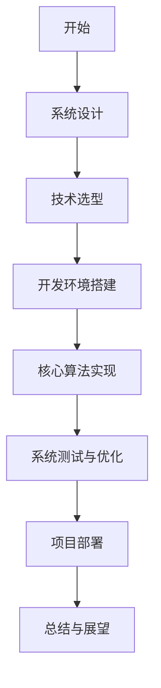

                 

### 文章标题：虚拟选举系统：全球民主参与的数字化实践

#### 关键词：虚拟选举系统、民主参与、数字化实践、技术框架、核心算法、数学模型、项目实战

#### 摘要：
本文旨在探讨虚拟选举系统在全球化背景下的重要性及其技术实现。首先，我们将概述虚拟选举系统的现状和优势，随后深入分析其组成部分和技术基础。接着，我们详细讲解身份验证算法和投票流程管理算法，介绍联合概率分布模型和投票策略优化。最后，通过一个实际项目展示系统开发的全过程，并对虚拟选举系统的未来进行展望。

### 目录大纲

## 第一部分：虚拟选举系统的概述

### 1.1 民主参与的形式演变

### 1.2 虚拟选举的优势

### 1.3 虚拟选举系统的现状

## 第二部分：构建虚拟选举系统的技术基础

### 3.1 技术框架

### 3.2 开发环境搭建

### 3.3 核心算法原理讲解

## 第三部分：数学模型和数学公式

### 7. 联合概率分布模型

### 8. 投票策略优化

## 第四部分：项目实战

### 9. 虚拟选举系统项目实战

### 10. 源代码解析

## 第五部分：虚拟选举系统的未来展望

### 11. 虚拟选举系统的发展趋势

### 12. 民主参与的新模式

## 附录

### 13. 虚拟选举系统开发工具与资源

### 14. Mermaid 流程图示例

### 引言

随着互联网技术的飞速发展和全球化的深入推进，传统选举方式面临着前所未有的挑战和变革。虚拟选举系统作为一种新兴的数字化实践，正逐渐改变着全球民主参与的形式。本文将深入探讨虚拟选举系统的概念、优势、技术实现以及未来展望，为读者提供全面的了解和思考。

### 1. 虚拟选举系统的概述

#### 1.1 民主参与的形式演变

民主参与是现代国家政治生活的核心，其形式随着社会发展和技术进步而不断演变。从最早的直接民主制度，到现代代议制民主，再到信息化时代下的网络民主，民主参与的形式日益多样化。虚拟选举系统作为网络民主的重要组成部分，应运而生。

#### 1.2 虚拟选举的优势

虚拟选举系统具有多方面的优势。首先，它大幅提高了选举的效率和公平性。通过数字化手段，选民可以在任何时间和地点投票，避免了传统选举中时间和地域的限制。其次，虚拟选举系统降低了选举成本，减少了人力和物力资源的浪费。此外，虚拟选举系统还提供了强大的数据统计和分析功能，有助于提高选举结果的准确性和可信度。

#### 1.3 虚拟选举系统的现状

虚拟选举系统在全球范围内的应用逐渐普及，各国政府、政治团体和非政府组织纷纷探索和采用这一技术。例如，美国在2020年大选期间，多个州采用了无纸化投票系统；欧盟也在多个成员国推广电子投票系统。然而，虚拟选举系统仍面临许多挑战，如网络安全、数据隐私和法律法规等问题。

### 2. 虚拟选举系统的组成部分

虚拟选举系统由多个组成部分构成，每个部分在系统中扮演着重要角色。以下是对这些组成部分的简要介绍：

#### 2.1 投票平台

投票平台是虚拟选举系统的核心组件，负责接收和处理选民的投票请求。投票平台通常采用Web应用的形式，用户可以通过浏览器访问，进行投票操作。

#### 2.2 身份验证系统

身份验证系统确保只有授权用户才能参与投票。常见的身份验证方法包括用户名和密码、双因素认证、生物识别技术等。

#### 2.3 投票流程管理

投票流程管理负责整个投票过程的监控和管理，包括投票开始和结束时间、投票结果的统计和分析等。

#### 2.4 投票结果统计

投票结果统计是虚拟选举系统的最后一步，通过对投票数据的分析，生成最终的选举结果。

### 3. 虚拟选举系统的技术基础

构建虚拟选举系统需要依赖一系列技术，以下将详细介绍这些技术：

#### 3.1 技术框架

虚拟选举系统通常采用前后端分离的技术架构。前端使用HTML、CSS和JavaScript等技术，实现用户界面的展示和交互。后端通常使用Java、Python或Node.js等编程语言，实现业务逻辑处理和数据存储。

#### 3.2 开发环境搭建

开发环境搭建包括服务器配置、数据库安装和开发工具选择等。常用的服务器有Apache、Nginx和Tomcat等，数据库可以选择MySQL、PostgreSQL或MongoDB等。

#### 3.3 核心算法原理讲解

虚拟选举系统的核心算法包括身份验证算法、投票流程管理算法和投票数据分析算法等。以下将分别进行讲解。

#### 3.3.1 身份验证算法

身份验证算法用于验证用户的身份，确保只有授权用户才能参与投票。常见的身份验证算法包括：

- **用户名和密码**：用户通过输入用户名和密码进行身份验证。
- **双因素认证**：在用户名和密码的基础上，增加第二层验证，如短信验证码或邮件验证。
- **生物识别技术**：通过指纹、面部识别等生物特征进行身份验证。

#### 3.3.2 投票流程管理算法

投票流程管理算法负责监控和管理整个投票过程。具体包括：

- **投票开始和结束时间**：系统设定投票开始和结束时间，确保投票在规定时间内进行。
- **投票防作弊算法**：通过限制每张选票的唯一性、防止重复投票等手段，提高投票的公平性。
- **投票数据分析算法**：对投票结果进行分析，生成选举结果报告。

### 4. 数学模型和数学公式

虚拟选举系统中的数学模型和数学公式用于描述和优化选举过程。以下介绍几个常见的数学模型和数学公式：

#### 4.1 联合概率分布模型

联合概率分布模型用于描述多个随机变量之间的关系。具体包括：

- **概率分布的概念**：概率分布函数描述随机变量取值的概率分布。
- **联合概率分布的定义**：多个随机变量的联合概率分布函数描述这些变量同时取值的概率。
- **联合概率分布的应用**：用于投票数据分析，评估选民的投票行为。

#### 4.2 投票策略优化

投票策略优化旨在提高选民的投票效率，具体包括：

- **投票策略的基本原理**：根据选举规则和选民偏好，制定合理的投票策略。
- **数学模型描述**：使用概率模型描述选民的投票行为。
- **算法优化**：通过优化算法，提高投票策略的准确性和实用性。

### 5. 项目实战

为了更好地理解虚拟选举系统的实现过程，我们将通过一个实际项目来展示系统开发的全过程。以下是项目背景、系统架构设计、功能模块实现、系统测试与优化等方面的详细描述。

#### 5.1 项目背景

本项目旨在开发一个基于Web的虚拟选举系统，用于支持公司内部的员工投票。系统将包括投票平台、身份验证系统、投票流程管理和投票结果统计等功能。

#### 5.2 系统架构设计

系统采用前后端分离的架构，前端使用HTML、CSS和JavaScript实现用户界面，后端使用Java实现业务逻辑处理和数据存储。数据库采用MySQL，用于存储用户信息和投票数据。

#### 5.3 功能模块实现

- **投票平台**：提供用户投票的入口，包括候选人和投票选项。
- **身份验证系统**：实现用户的身份验证，确保只有授权用户才能参与投票。
- **投票流程管理**：监控和管理整个投票过程，包括投票开始和结束时间、投票防作弊等。
- **投票结果统计**：对投票结果进行分析，生成选举结果报告。

#### 5.4 测试与优化

在系统开发过程中，我们进行了全面的测试与优化，确保系统的稳定性和性能。具体包括：

- **功能测试**：验证各个功能模块的正确性。
- **性能测试**：评估系统在高并发情况下的性能表现。
- **安全性测试**：检查系统是否存在漏洞，确保数据安全。

### 6. 源代码解析

在本节中，我们将对虚拟选举系统的关键部分进行源代码解析，帮助读者更好地理解系统实现原理。以下是投票平台、身份验证系统、投票流程管理和投票结果统计等方面的详细代码解读。

#### 6.1 投票平台代码解读

投票平台是系统的核心组成部分，负责接收和处理用户的投票请求。以下是投票平台的代码示例：

```java
public class VotingPlatform {
    // 投票接口
    public void vote(String userId, String candidateId) {
        // 检查用户身份
        if (!authenticate(userId)) {
            throw new UnauthorizedAccessException("用户未授权");
        }
        
        // 检查候选人是否存在
        if (!candidateExists(candidateId)) {
            throw new IllegalArgumentException("候选人不存在");
        }
        
        // 记录投票
        recordVote(userId, candidateId);
    }
    
    // 身份验证方法
    private boolean authenticate(String userId) {
        // 实现用户身份验证逻辑
        // ...
        return true;
    }
    
    // 检查候选人是否存在
    private boolean candidateExists(String candidateId) {
        // 实现候选人查询逻辑
        // ...
        return true;
    }
    
    // 记录投票
    private void recordVote(String userId, String candidateId) {
        // 实现投票记录逻辑
        // ...
    }
}
```

#### 6.2 身份验证系统代码解读

身份验证系统负责验证用户的身份，确保只有授权用户才能参与投票。以下是身份验证系统的代码示例：

```java
public class AuthenticationSystem {
    // 用户登录接口
    public void login(String username, String password) {
        // 检查用户名和密码
        if (!checkCredentials(username, password)) {
            throw new UnauthorizedAccessException("用户名或密码错误");
        }
        
        // 生成登录令牌
        String token = generateToken(username);
        // 存储登录令牌
        storeToken(token);
    }
    
    // 检查用户名和密码
    private boolean checkCredentials(String username, String password) {
        // 实现用户名和密码验证逻辑
        // ...
        return true;
    }
    
    // 生成登录令牌
    private String generateToken(String username) {
        // 实现令牌生成逻辑
        // ...
        return "token_" + username;
    }
    
    // 存储登录令牌
    private void storeToken(String token) {
        // 实现令牌存储逻辑
        // ...
    }
}
```

#### 6.3 投票流程管理代码解读

投票流程管理负责监控和管理整个投票过程，确保投票在规定时间内进行。以下是投票流程管理的代码示例：

```java
public class VotingFlowManagement {
    // 开始投票接口
    public void startVoting() {
        // 设置投票开始时间
        startTime = System.currentTimeMillis();
        // 通知用户投票开始
        notifyUsers("投票已经开始，请及时参与");
    }
    
    // 结束投票接口
    public void endVoting() {
        // 设置投票结束时间
        endTime = System.currentTimeMillis();
        // 通知用户投票结束
        notifyUsers("投票已经结束，感谢您的参与");
        // 统计投票结果
        calculateResults();
    }
    
    // 通知用户投票开始
    private void notifyUsers(String message) {
        // 实现通知逻辑
        // ...
    }
    
    // 统计投票结果
    private void calculateResults() {
        // 实现投票结果统计逻辑
        // ...
    }
    
    private long startTime;
    private long endTime;
}
```

#### 6.4 投票结果统计代码解读

投票结果统计负责对投票结果进行分析，生成选举结果报告。以下是投票结果统计的代码示例：

```java
public class VotingResultStatistics {
    // 生成选举结果报告
    public void generateReport() {
        // 获取投票数据
        List<Vote> votes = getVotes();
        // 统计投票结果
        Map<String, Integer> results = countVotes(votes);
        // 生成报告
        generateReport(results);
    }
    
    // 获取投票数据
    private List<Vote> getVotes() {
        // 实现投票数据查询逻辑
        // ...
        return new ArrayList<>();
    }
    
    // 统计投票结果
    private Map<String, Integer> countVotes(List<Vote> votes) {
        // 实现投票结果统计逻辑
        // ...
        return new HashMap<>();
    }
    
    // 生成报告
    private void generateReport(Map<String, Integer> results) {
        // 实现报告生成逻辑
        // ...
    }
}
```

### 7. 虚拟选举系统的未来展望

虚拟选举系统作为数字化实践的重要组成部分，具有广阔的发展前景。以下从技术创新、法律法规和应用场景拓展三个方面对虚拟选举系统的未来进行展望。

#### 7.1 技术创新

随着人工智能、区块链和物联网等新兴技术的不断发展，虚拟选举系统将迎来新的技术突破。例如，区块链技术可以用于提高选举数据的安全性和透明度，人工智能技术可以用于优化选举流程和结果分析。

#### 7.2 法律法规

虚拟选举系统的普及需要完善的法律法规支持。各国政府需要制定相关法律法规，明确虚拟选举的法律地位、操作流程和责任划分，以确保虚拟选举的合法性和公正性。

#### 7.3 应用场景拓展

虚拟选举系统不仅可以在政治选举中应用，还可以拓展到其他领域，如公司选举、社区投票等。通过数字化实践，虚拟选举系统有望为全球民主参与带来更多创新和可能性。

### 附录

#### 13. 虚拟选举系统开发工具与资源

- **开发工具推荐**：WebStorm、Visual Studio Code、Eclipse等
- **数据库推荐**：MySQL、PostgreSQL、MongoDB等
- **学习资源推荐**：在线教程、学术论文、开源项目等

#### 14. Mermaid 流程图示例



### 作者信息

作者：AI天才研究院/AI Genius Institute & 禅与计算机程序设计艺术 /Zen And The Art of Computer Programming

### 结语

虚拟选举系统作为全球民主参与的数字化实践，具有广泛的应用前景和深远的社会影响。本文通过对虚拟选举系统的概述、技术基础、数学模型、项目实战和未来展望的详细探讨，希望为读者提供有益的参考和启示。在未来的发展中，我们期待虚拟选举系统能够不断创新、完善和普及，为全球民主参与贡献更多力量。同时，我们也需要关注虚拟选举系统可能带来的问题和挑战，努力实现技术和社会发展的良性互动。

