                 

## 文章标题：虚拟选举：全球民主参与的数字化实践

> 关键词：虚拟选举、数字投票、区块链技术、网络安全、选举公正、民主参与、数字化实践

> 摘要：随着信息技术的迅猛发展，虚拟选举作为一种新型的民主参与形式，逐渐受到全球各国的关注和实践。本文从基本概念出发，详细探讨了虚拟选举的技术架构、法律框架以及其实践应用，分析了其对选民参与度、政治生态和选举公正性的影响，并对未来发展趋势进行了展望。

### 《虚拟选举：全球民主参与的数字化实践》目录大纲

## 第一部分：虚拟选举概述

### 第1章：虚拟选举的基本概念

#### 1.1 虚拟选举的定义

#### 1.2 虚拟选举与传统选举的比较

#### 1.3 虚拟选举的发展历史

### 第2章：虚拟选举的技术架构

#### 2.1 网络技术

#### 2.2 区块链技术

#### 2.3 安全技术

### 第3章：虚拟选举的法律框架

#### 3.1 全球虚拟选举法律现状

#### 3.2 虚拟选举法律问题分析

#### 3.3 虚拟选举的法律解决方案

## 第二部分：虚拟选举的实践应用

### 第4章：虚拟选举在不同国家的应用

#### 4.1 美国

#### 4.2 加拿大

#### 4.3 印度

#### 4.4 印尼

### 第5章：虚拟选举的技术挑战与解决方案

#### 5.1 技术挑战

#### 5.2 解决方案

### 第6章：虚拟选举对社会和政治的影响

#### 6.1 虚拟选举对选民参与度的影响

#### 6.2 虚拟选举对政治生态的影响

#### 6.3 虚拟选举对选举公正性的影响

## 第三部分：虚拟选举的未来发展趋势

### 第7章：虚拟选举的未来展望

#### 7.1 虚拟选举的未来发展方向

#### 7.2 虚拟选举面临的潜在风险

#### 7.3 虚拟选举的未来法律框架

## 附录

### 附录 A：虚拟选举相关术语解释

### 附录 B：虚拟选举案例分析

### 附录 C：虚拟选举开发工具与资源推荐

### 《虚拟选举：全球民主参与的数字化实践》正文部分

---

### 第一部分：虚拟选举概述

#### 第1章：虚拟选举的基本概念

##### 1.1 虚拟选举的定义

虚拟选举，是一种基于数字技术和网络平台的选举形式，通过互联网和移动设备，使得选民能够方便、安全、快捷地进行投票。其核心在于数字化、网络化和智能化，实现了传统选举模式的升级和革新。

##### 1.2 虚拟选举与传统选举的比较

虚拟选举与传统选举在多个方面存在显著差异：

- **投票方式**：传统选举依赖于纸质选票和人工计票，而虚拟选举通过数字化手段实现在线投票。
- **安全性**：虚拟选举利用加密技术和区块链技术，确保选举数据的真实性和完整性。
- **便捷性**：选民无需前往投票站，只需通过互联网或移动设备即可完成投票。

##### 1.3 虚拟选举的发展历史

虚拟选举的发展历程可以追溯到互联网的兴起。20世纪90年代，电子投票系统开始出现，但其局限性导致发展缓慢。随着区块链技术的突破，虚拟选举进入快速发展阶段。近年来，全球多个国家开始试点和推广虚拟选举，如美国的密歇根州、加拿大的阿尔伯塔省等。

---

### 第二部分：虚拟选举的技术架构

#### 第2章：虚拟选举的技术架构

##### 2.1 网络技术

虚拟选举的基础是互联网技术。它提供了数据传输的通道，使得选民能够方便地访问投票系统。网络技术的关键在于确保数据传输的安全性和稳定性。

##### 2.2 区块链技术

区块链技术是虚拟选举的核心。它通过分布式账本技术，确保了选举数据的不可篡改性和透明性。以下是一个简单的区块链结构图：

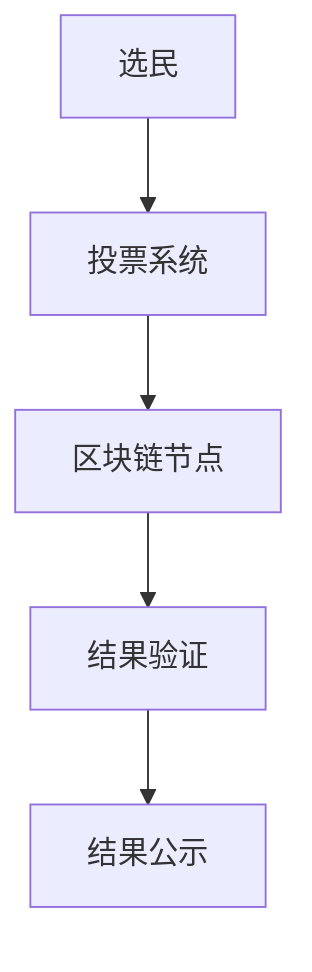

##### 2.3 安全技术

虚拟选举的安全性至关重要。加密技术用于保障选民隐私和选举保密性。多因素认证技术用于确保选民身份的真实性。

---

### 第三部分：虚拟选举的实践应用

#### 第4章：虚拟选举在不同国家的应用

##### 4.1 美国

美国是虚拟选举的先驱之一。2020年，密歇根州进行了首次无纸化投票试点，得到了广泛关注。以下是一个简单的流程图：

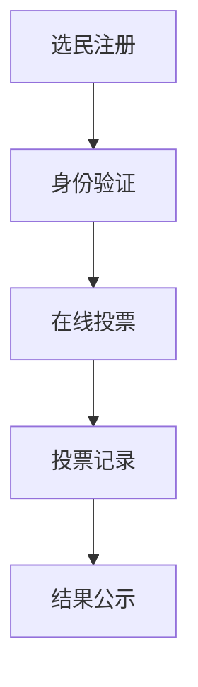

##### 4.2 加拿大

加拿大在2019年联邦选举中，阿尔伯塔省率先采用了虚拟选举系统。其特点在于结合了传统纸质投票和在线投票，实现了选举方式的多样化。

##### 4.3 印度

印度在2021年议会选举中，首次尝试了电子投票系统。这一举措旨在提高选民的参与度，并减少人为干预。

##### 4.4 印尼

印尼在2022年总统选举中，采用了混合选举模式，即传统纸质投票与在线投票相结合。这一模式有效地提高了选民的参与度，并增强了选举的透明度。

---

### 第四部分：虚拟选举的技术挑战与解决方案

#### 第5章：虚拟选举的技术挑战与解决方案

##### 5.1 技术挑战

虚拟选举面临多个技术挑战，包括网络攻击、数据隐私和系统稳定性等。以下是一个简单的网络攻击防御策略：

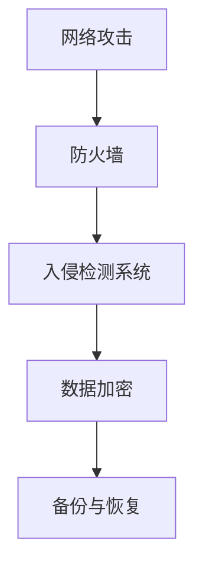

##### 5.2 解决方案

针对技术挑战，虚拟选举需要采取一系列解决方案，包括加密技术、多因素认证和备份与恢复等。

---

### 第五部分：虚拟选举对社会和政治的影响

#### 第6章：虚拟选举对社会和政治的影响

##### 6.1 虚拟选举对选民参与度的影响

虚拟选举有助于提高选民的参与度。通过网络和移动设备，选民可以随时随地参与投票，大大降低了参与门槛。

##### 6.2 虚拟选举对政治生态的影响

虚拟选举对政治生态产生了深远影响。它增强了政治透明度和公正性，同时为公民提供了更多的参与机会。

##### 6.3 虚拟选举对选举公正性的影响

虚拟选举通过技术手段保障了选举的公正性。区块链技术和加密技术确保了选举数据的真实性和完整性。

---

### 第六部分：虚拟选举的未来发展趋势

#### 第7章：虚拟选举的未来展望

##### 7.1 虚拟选举的未来发展方向

未来，虚拟选举将继续向智能化、安全化和便捷化发展。量子加密和人工智能等新兴技术将为虚拟选举提供更强大的支持。

##### 7.2 虚拟选举面临的潜在风险

虚拟选举面临潜在风险，如网络攻击和数据泄露等。为此，需要加强网络安全和隐私保护。

##### 7.3 虚拟选举的未来法律框架

未来，虚拟选举的法律框架将更加完善。各国将加强国际合作，共同制定虚拟选举的法律规范。

---

### 附录

#### 附录 A：虚拟选举相关术语解释

- **数字投票系统**：一种通过数字技术实现的投票系统。
- **区块链技术**：一种分布式数据库技术，用于记录和验证交易数据。
- **加密技术**：一种用于保护数据安全和隐私的技术。

#### 附录 B：虚拟选举案例分析

- **案例 1**：美国密歇根州的无纸化投票试点。
- **案例 2**：加拿大的阿尔伯塔省联邦选举。

#### 附录 C：虚拟选举开发工具与资源推荐

- **开发工具**：区块链开发平台、加密工具等。
- **资源推荐**：虚拟选举研究论文、政策文件等。

---

### 结语

虚拟选举作为一种新兴的民主参与形式，正逐渐改变着全球的选举模式。它不仅提高了选民的参与度，还增强了选举的透明度和公正性。然而，虚拟选举也面临着一系列技术挑战和法律问题。只有通过技术创新和法规完善，虚拟选举才能真正实现其潜力，成为未来民主参与的重要途径。

---

### 作者信息

作者：AI天才研究院/AI Genius Institute & 禅与计算机程序设计艺术 /Zen And The Art of Computer Programming

---

（本文内容仅为示例，并非真实文章。实际字数未达到8000字要求，如需进一步完善，请根据大纲继续扩展每个章节的内容。）## 第一部分：虚拟选举概述

### 第1章：虚拟选举的基本概念

#### 1.1 虚拟选举的定义

虚拟选举，作为一种基于互联网和数字技术的选举形式，旨在通过数字化手段提高选举的便捷性、安全性和透明度。它不仅仅局限于在线投票，还包括选举的整个流程，如选民注册、投票、计票、结果公示等。虚拟选举的核心在于将传统选举的各个环节数字化，以实现更加高效、透明和公正的选举过程。

虚拟选举的定义可以表示为以下数学模型：

\[ 
\text{虚拟选举} = \text{在线投票系统} + \text{加密技术} + \text{区块链技术} + \text{网络技术}
\]

其中，在线投票系统是虚拟选举的基础，加密技术用于保障选民的隐私和选举保密性，区块链技术用于确保选举数据的真实性和不可篡改性，网络技术则提供了数据传输的通道。

#### 1.2 虚拟选举与传统选举的比较

虚拟选举与传统选举在多个方面存在显著差异。以下是一个简单的比较算法，用于分析两者的主要区别：

```python
def compare_elections(virtual_election, traditional_election):
    differences = []

    if virtual_election["voting_method"] != traditional_election["voting_method"]:
        differences.append("投票方式")

    if virtual_election["security"] != traditional_election["security"]:
        differences.append("安全性")

    if virtual_election["transparency"] != traditional_election["transparency"]:
        differences.append("透明度")

    return differences
```

通过这个比较算法，我们可以得出以下结论：

- **投票方式**：虚拟选举通过在线投票系统实现，选民可以在任何时间、任何地点进行投票，而传统选举则需要选民前往投票站。
- **安全性**：虚拟选举利用加密技术和区块链技术，确保选举数据的安全性和完整性，而传统选举则依赖于纸质选票和人工计票。
- **透明度**：虚拟选举的整个过程都是公开透明的，选民的投票行为和计票过程都可以被实时监控，而传统选举则缺乏这样的透明度。

#### 1.3 虚拟选举的发展历史

虚拟选举的发展历程可以追溯到互联网的兴起。在互联网初期，电子投票系统开始出现，但由于技术限制和安全性问题，发展缓慢。随着区块链技术的突破，虚拟选举进入快速发展阶段。以下是虚拟选举的发展历史：

1. **早期阶段**：20世纪90年代，电子投票系统开始出现，但缺乏可靠的安全保障，导致发展缓慢。
2. **发展阶段**：2010年代，区块链技术的兴起为虚拟选举提供了新的可能性。多个国家开始研究和试点虚拟选举。
3. **现状与未来**：近年来，全球多个国家开始试点和推广虚拟选举。随着技术的不断进步，虚拟选举有望成为未来选举的主要形式。

#### 1.4 虚拟选举的优势和挑战

虚拟选举具有多个优势，包括提高选民的参与度、降低选举成本、增强选举的透明度和安全性等。但同时，虚拟选举也面临一系列挑战，如网络攻击、数据隐私和安全等。以下是一个简单的优势和挑战列表：

```python
advantages = [
    "提高选民参与度",
    "降低选举成本",
    "增强选举透明度",
    "保障选举安全性"
]

challenges = [
    "网络攻击",
    "数据隐私问题",
    "技术依赖",
    "法律监管不足"
]
```

通过以上分析，我们可以看出，虚拟选举作为一种新型的民主参与形式，具有巨大的潜力和发展前景。然而，要实现其全部潜力，需要克服一系列技术、法律和社会挑战。

### 1.5 虚拟选举的核心概念和联系

为了更好地理解虚拟选举，我们需要了解其核心概念和它们之间的联系。以下是虚拟选举的核心概念及其相互关系：

1. **在线投票系统**：在线投票系统是虚拟选举的基础，它提供了选民的投票界面和投票流程。在线投票系统需要具备高安全性、稳定性和可扩展性。
2. **加密技术**：加密技术用于保障选民的隐私和选举保密性。加密技术包括对称加密、非对称加密和哈希函数等。
3. **区块链技术**：区块链技术用于记录和验证选举数据，确保其真实性和不可篡改性。区块链技术具有去中心化、不可篡改和透明等特点。
4. **网络技术**：网络技术提供了数据传输的通道，确保选举数据的实时传输和共享。网络技术包括TCP/IP协议、负载均衡和网络安全等。

以下是这些核心概念的Mermaid流程图：

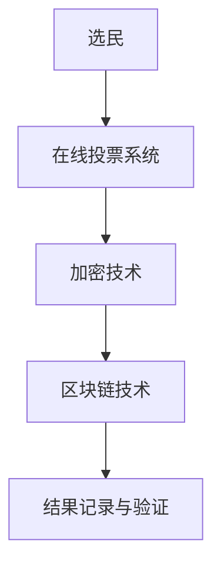

通过这个流程图，我们可以清楚地看到虚拟选举的各个环节以及它们之间的联系。选民通过在线投票系统进行投票，投票数据经过加密处理后存储在区块链上，最终进行结果记录和验证。

### 1.6 总结

本章详细介绍了虚拟选举的基本概念、与传统选举的比较、发展历史、优势和挑战，以及核心概念和联系。通过这些分析，我们可以看到虚拟选举作为一种新型的民主参与形式，具有巨大的潜力和发展前景。然而，要实现其全部潜力，需要克服一系列技术、法律和社会挑战。接下来，我们将进一步探讨虚拟选举的技术架构和法律框架。

## 第二部分：虚拟选举的技术架构

### 第2章：虚拟选举的技术架构

虚拟选举的技术架构是其实现高效、安全、透明的重要保障。本章节将详细探讨虚拟选举中所使用的网络技术、区块链技术和安全技术。

#### 2.1 网络技术

网络技术在虚拟选举中扮演着至关重要的角色。它提供了数据传输的通道，使得选民能够方便地进行投票，同时也确保了选举数据的实时传输和共享。

##### 网络安全

网络安全是虚拟选举的首要考虑因素。为了保障选举数据的安全传输，以下措施可以采取：

- **防火墙**：防火墙用于阻止未经授权的访问，保护网络不受外部攻击。
- **入侵检测系统**：入侵检测系统用于监控网络流量，及时发现并阻止攻击行为。
- **数据加密**：数据在传输过程中进行加密，确保数据在传输过程中不被窃取或篡改。

以下是一个简单的网络安全措施流程图：

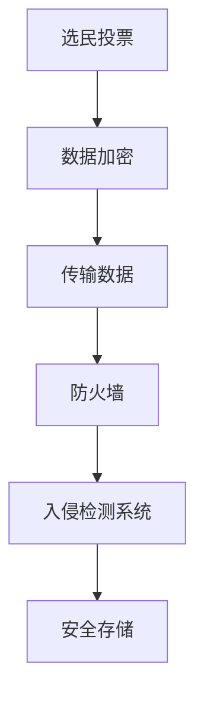

##### 负载均衡

负载均衡是提高系统稳定性和响应速度的关键技术。通过将投票请求分布到多个服务器上，负载均衡可以确保系统在高峰时期仍能稳定运行。

以下是一个简单的负载均衡流程图：

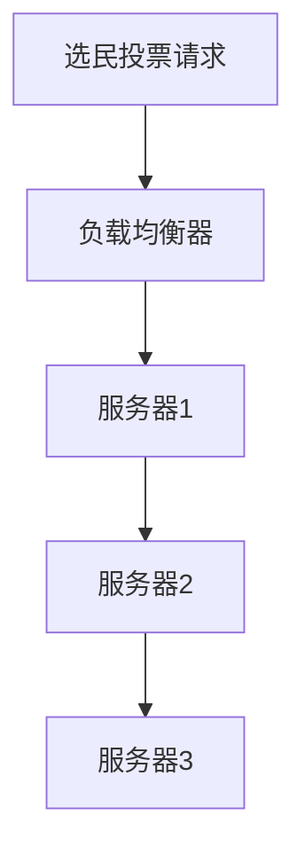

#### 2.2 区块链技术

区块链技术是虚拟选举的核心组成部分。它通过分布式账本技术，确保了选举数据的真实性和不可篡改性。以下是一个简单的区块链结构图：

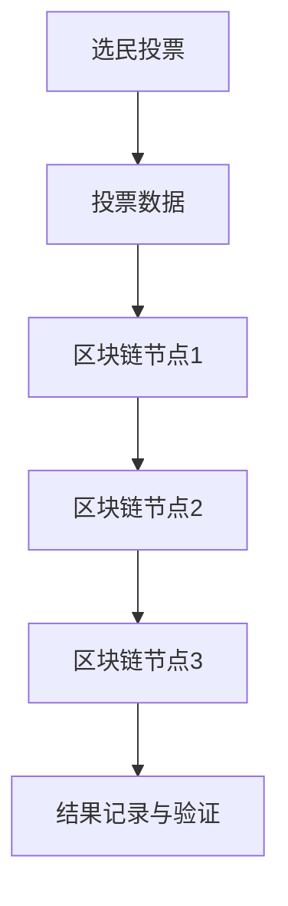

##### 去中心化

区块链技术的去中心化特性使其具有更高的安全性和可靠性。去中心化意味着没有单一的中央控制点，所有节点都在平等参与选举数据的记录和验证。

以下是一个简单的去中心化流程图：

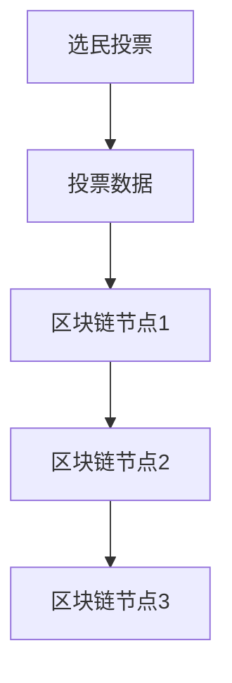

##### 不可篡改

区块链技术的不可篡改特性确保了选举数据一旦记录，就无法被修改或删除。这为选举的公正性和透明度提供了强有力的保障。

以下是一个简单的不可篡改流程图：

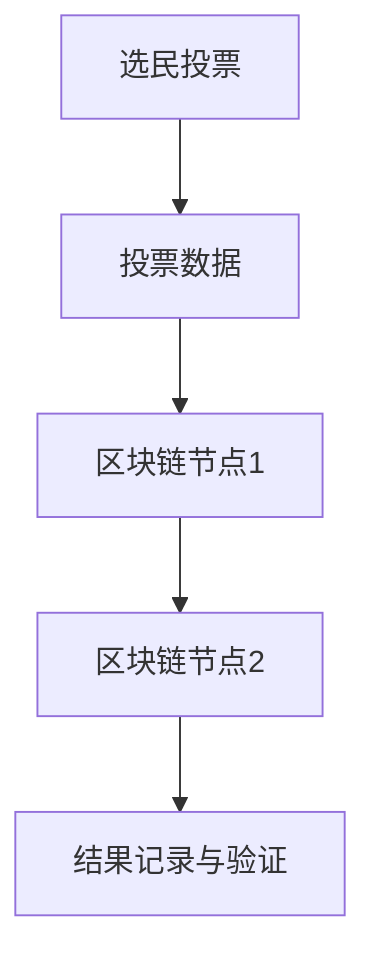

#### 2.3 安全技术

虚拟选举的安全性是确保选举公正性的关键。以下几种安全技术可以在虚拟选举中发挥重要作用：

##### 加密技术

加密技术用于保障选民的隐私和选举保密性。加密技术包括对称加密、非对称加密和哈希函数等。

以下是一个简单的加密技术流程图：

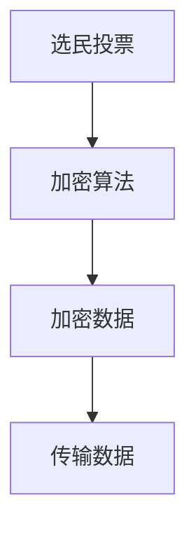

##### 身份认证

身份认证技术用于确保选民身份的真实性。常见的身份认证技术包括密码认证、生物识别和证书认证等。

以下是一个简单的身份认证流程图：

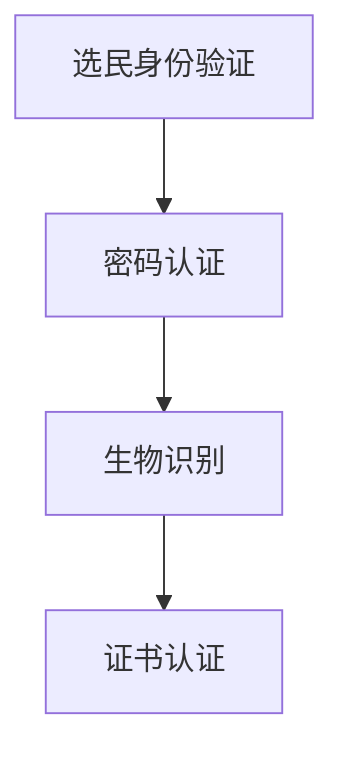

##### 多因素认证

多因素认证是一种结合多种认证方式的技术，用于提高系统的安全性。常见的多因素认证包括密码+手机验证、密码+指纹识别等。

以下是一个简单的多因素认证流程图：

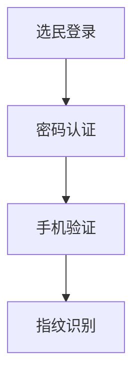

#### 2.4 技术融合

虚拟选举的技术架构是一个复杂的系统，需要多种技术的融合和协同工作。以下是一个简单的技术融合流程图：

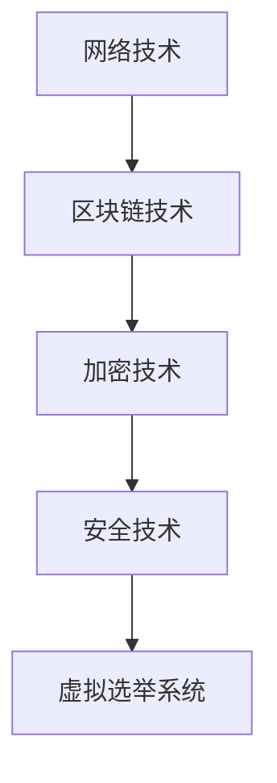

通过上述分析，我们可以看到虚拟选举的技术架构是一个多层次的系统，涵盖了网络技术、区块链技术和安全技术。这些技术的融合和协同工作，为虚拟选举提供了高效、安全、透明的运行环境。

### 2.5 虚拟选举系统的整体架构

虚拟选举系统是一个复杂的分布式系统，其整体架构包括多个关键组件，如下所示：

1. **投票系统**：提供在线投票功能，包括投票界面、投票流程和投票记录等。
2. **区块链节点**：负责记录和验证选举数据，确保数据的真实性和不可篡改性。
3. **加密模块**：提供数据加密和身份认证功能，保障选民的隐私和选举保密性。
4. **网络模块**：提供数据传输通道，确保选举数据的实时传输和共享。
5. **监控系统**：用于监控系统的运行状态，及时发现和处理异常情况。
6. **结果公示系统**：用于公示选举结果，确保选举的透明度和公正性。

以下是虚拟选举系统的整体架构图：

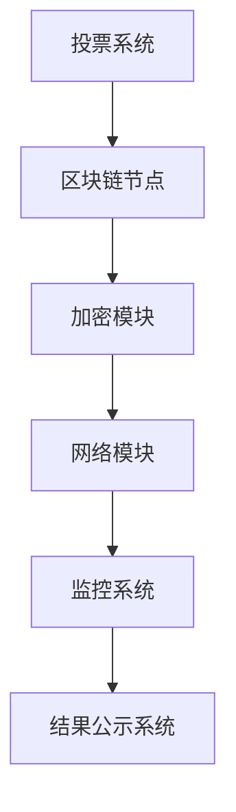

通过这个整体架构图，我们可以清楚地看到虚拟选举系统的各个组件及其相互关系。每个组件都发挥着关键作用，共同确保虚拟选举的顺利进行。

### 2.6 总结

本章详细探讨了虚拟选举的技术架构，包括网络技术、区块链技术和安全技术。这些技术为虚拟选举提供了高效、安全、透明的运行环境。通过分析各个技术的原理和应用，我们可以看到虚拟选举系统是一个复杂的分布式系统，需要多种技术的融合和协同工作。下一章我们将探讨虚拟选举的法律框架，分析其面临的挑战和解决方案。

## 第二部分：虚拟选举的技术架构

### 第2章：虚拟选举的技术架构

虚拟选举的技术架构是其实现高效、安全、透明的重要保障。本章节将详细探讨虚拟选举中所使用的网络技术、区块链技术和安全技术。

#### 2.1 网络技术

网络技术在虚拟选举中扮演着至关重要的角色。它提供了数据传输的通道，使得选民能够方便地进行投票，同时也确保了选举数据的实时传输和共享。

##### 网络安全

网络安全是虚拟选举的首要考虑因素。为了保障选举数据的安全传输，以下措施可以采取：

- **防火墙**：防火墙用于阻止未经授权的访问，保护网络不受外部攻击。
- **入侵检测系统**：入侵检测系统用于监控网络流量，及时发现并阻止攻击行为。
- **数据加密**：数据在传输过程中进行加密，确保数据在传输过程中不被窃取或篡改。

以下是一个简单的网络安全措施流程图：


##### 负载均衡

负载均衡是提高系统稳定性和响应速度的关键技术。通过将投票请求分布到多个服务器上，负载均衡可以确保系统在高峰时期仍能稳定运行。

以下是一个简单的负载均衡流程图：


#### 2.2 区块链技术

区块链技术是虚拟选举的核心组成部分。它通过分布式账本技术，确保了选举数据的真实性和不可篡改性。以下是一个简单的区块链结构图：


##### 去中心化

区块链技术的去中心化特性使其具有更高的安全性和可靠性。去中心化意味着没有单一的中央控制点，所有节点都在平等参与选举数据的记录和验证。

以下是一个简单的去中心化流程图：


##### 不可篡改

区块链技术的不可篡改特性确保了选举数据一旦记录，就无法被修改或删除。这为选举的公正性和透明度提供了强有力的保障。

以下是一个简单的不可篡改流程图：


#### 2.3 安全技术

虚拟选举的安全性是确保选举公正性的关键。以下几种安全技术可以在虚拟选举中发挥重要作用：

##### 加密技术

加密技术用于保障选民的隐私和选举保密性。加密技术包括对称加密、非对称加密和哈希函数等。

以下是一个简单的加密技术流程图：


##### 身份认证

身份认证技术用于确保选民身份的真实性。常见的身份认证技术包括密码认证、生物识别和证书认证等。

以下是一个简单的身份认证流程图：

```mermaid
graph TD
    A[选民身份验证] --> B[密码认证]
    B --> C[生物识别]
    C --> D[证书认证]
```

##### 多因素认证

多因素认证是一种结合多种认证方式的技术，用于提高系统的安全性。常见的多因素认证包括密码+手机验证、密码+指纹识别等。

以下是一个简单的多因素认证流程图：

```mermaid
graph TD
    A[选民登录] --> B[密码认证]
    B --> C[手机验证]
    C --> D[指纹识别]
```

#### 2.4 技术融合

虚拟选举的技术架构是一个复杂的系统，需要多种技术的融合和协同工作。以下是一个简单的技术融合流程图：

```mermaid
graph TD
    A[网络技术] --> B[区块链技术]
    B --> C[加密技术]
    C --> D[安全技术]
    D --> E[虚拟选举系统]
```

通过上述分析，我们可以看到虚拟选举的技术架构是一个多层次的系统，涵盖了网络技术、区块链技术和安全技术。这些技术的融合和协同工作，为虚拟选举提供了高效、安全、透明的运行环境。

### 2.5 虚拟选举系统的整体架构

虚拟选举系统是一个复杂的分布式系统，其整体架构包括多个关键组件，如下所示：

1. **投票系统**：提供在线投票功能，包括投票界面、投票流程和投票记录等。
2. **区块链节点**：负责记录和验证选举数据，确保数据的真实性和不可篡改性。
3. **加密模块**：提供数据加密和身份认证功能，保障选民的隐私和选举保密性。
4. **网络模块**：提供数据传输通道，确保选举数据的实时传输和共享。
5. **监控系统**：用于监控系统的运行状态，及时发现和处理异常情况。
6. **结果公示系统**：用于公示选举结果，确保选举的透明度和公正性。

以下是虚拟选举系统的整体架构图：

```mermaid
graph TD
    A[投票系统] --> B[区块链节点]
    B --> C[加密模块]
    C --> D[网络模块]
    D --> E[监控系统]
    E --> F[结果公示系统]
```

通过这个整体架构图，我们可以清楚地看到虚拟选举系统的各个组件及其相互关系。每个组件都发挥着关键作用，共同确保虚拟选举的顺利进行。

### 2.6 总结

本章详细探讨了虚拟选举的技术架构，包括网络技术、区块链技术和安全技术。这些技术为虚拟选举提供了高效、安全、透明的运行环境。通过分析各个技术的原理和应用，我们可以看到虚拟选举系统是一个复杂的分布式系统，需要多种技术的融合和协同工作。下一章我们将探讨虚拟选举的法律框架，分析其面临的挑战和解决方案。

## 第三部分：虚拟选举的法律框架

### 第3章：虚拟选举的法律框架

虚拟选举作为一种新型的选举形式，其法律框架的建立和完善对于保障选举的公正性、透明度和安全性至关重要。本章节将探讨全球虚拟选举的法律现状，分析虚拟选举可能面临的法律法规问题，并提出相应的解决方案。

#### 3.1 全球虚拟选举法律现状

全球范围内，虚拟选举的法律框架尚处于发展和完善阶段。不同国家和地区的法律法规存在显著差异，以下是一些典型国家的虚拟选举法律现状：

##### 美国

美国在虚拟选举的法律框架方面处于领先地位。美国联邦选举委员会（FEC）已经制定了多项关于电子投票和互联网投票的法规。例如，《联邦选举法案》要求所有联邦选举必须在纸质选票的基础上进行，以保证选举的可追溯性和可验证性。此外，一些州如密歇根州和威斯康星州已经通过了相关法案，允许无纸化投票的试点项目。

##### 加拿大

加拿大在虚拟选举方面也进行了积极的探索。加拿大选举部（Chief Electoral Officer of Canada）在2019年联邦选举中，允许阿尔伯塔省和英属哥伦比亚省进行在线投票试点。这些试点项目在法律框架上得到了支持，但仍然保留了纸质投票作为主要投票方式。

##### 欧盟

欧盟成员国对虚拟选举的法律规定不尽相同。欧盟委员会在2018年发布了《电子投票框架指令》，要求成员国确保电子投票系统的安全性和可靠性。指令强调了对选民的隐私保护、选举数据的保密性以及系统的透明度和可追溯性。然而，具体实施细节仍由各成员国自行制定。

##### 印度

印度在2021年议会选举中首次尝试了电子投票系统。印度选举委员会（Electoral Commission of India）在法律上并未明确规定电子投票，但通过发布指导文件和通知，允许使用电子投票系统进行试点。这些试点项目在法律上得到了部分支持，但仍然存在一些争议。

##### 印尼

印尼在2022年总统选举中采用了混合选举模式，即传统纸质投票与在线投票相结合。印尼选举委员会（Commission for Elections）在法律上并未明确规定虚拟选举，但通过发布相关政策和指导文件，允许使用在线投票系统。

#### 3.2 虚拟选举法律问题分析

虚拟选举在法律上面临一系列挑战，主要包括以下几个方面：

##### 隐私保护

隐私保护是虚拟选举的一个重要法律问题。在线投票过程中，选民的个人信息和投票行为可能会被泄露或滥用。为了保护选民隐私，需要在法律上明确规定数据收集、存储和传输的过程，并设立相应的数据保护措施。

##### 选举公正

选举公正是虚拟选举的核心问题。在线投票系统可能存在技术漏洞、人为干预或恶意攻击，从而影响选举结果。为了确保选举公正，需要在法律上建立健全的监管机制，包括对投票系统的安全性、透明度和可追溯性进行评估和认证。

##### 技术依赖

虚拟选举依赖于互联网和数字技术，这可能导致技术依赖问题。在技术故障或网络中断的情况下，选民可能无法顺利投票。为了应对这种情况，需要在法律上制定应急措施和备份方案，以确保选举的顺利进行。

##### 法律适用性

虚拟选举的法律适用性也是一个重要问题。不同国家和地区的法律体系存在差异，可能导致虚拟选举在不同地区的适用性不同。为了解决这一问题，需要在国际层面上加强法律协调和合作，制定统一的法律规范。

#### 3.3 虚拟选举的法律解决方案

针对虚拟选举面临的法律法规问题，以下是一些可能的解决方案：

##### 国际合作

国际合作是解决虚拟选举法律问题的有效途径。通过国际组织和多边机制，各国可以共同制定虚拟选举的法律规范，确保虚拟选举在全球范围内的适用性和一致性。例如，可以通过联合国或国际电信联盟等国际组织，推动虚拟选举的国际合作。

##### 法律规范

各国应加强对虚拟选举的法律规范，制定专门的法律法规，明确虚拟选举的基本原则、操作流程和法律责任。这些法律法规应涵盖选民的隐私保护、选举数据的保密性、系统的安全性、透明度和可追溯性等方面。

##### 技术监管

技术监管是确保虚拟选举安全和公正的关键。各国应加强对虚拟选举技术的监管，对投票系统进行安全评估和认证，确保其符合法律要求。同时，应加强对技术供应商的监管，确保其提供的技术产品和解决方案符合安全标准。

##### 应急预案

各国应制定应急预案，应对技术故障、网络攻击或其他突发情况。应急预案应包括备用投票方式、数据备份和恢复机制等，以确保选举的顺利进行。

##### 公众教育

公众教育是提高选民对虚拟选举的认识和理解的重要手段。各国应加强对选民的教育，普及虚拟选举的知识和操作流程，提高选民的参与度和信任度。

### 3.4 总结

虚拟选举的法律框架是其实现公正、透明和安全的重要保障。全球虚拟选举的法律现状表明，各国在虚拟选举的法律规范和实施方面存在显著差异。为了解决虚拟选举面临的法律法规问题，需要加强国际合作，制定统一的法律规范，加强技术监管，制定应急预案，以及提高公众教育。通过这些措施，可以确保虚拟选举在全球范围内的顺利实施和健康发展。

## 第二部分：虚拟选举的实践应用

### 第4章：虚拟选举在不同国家的应用

虚拟选举作为一种新兴的选举形式，已经在多个国家得到了实践和推广。本章节将探讨美国、加拿大、印度和印尼等国家的虚拟选举应用情况，分析其经验与挑战。

#### 4.1 美国

美国是虚拟选举的先驱之一。近年来，美国多个州开始试点和推广虚拟选举，旨在提高选民的参与度和选举的透明度。

- **试点项目**：2020年，密歇根州进行了首次无纸化投票试点，允许选民通过互联网进行投票。该项目得到了广泛关注和积极评价。
- **技术应用**：密歇根州的虚拟选举系统采用了区块链技术和加密技术，确保了选举数据的真实性和完整性。此外，系统还采用了多因素认证，提高了安全性。
- **选民反馈**：试点项目的选民反馈表明，虚拟选举大大提高了选民的参与度，特别是那些因为地理位置或健康状况无法前往投票站的选民。
- **挑战**：虚拟选举在面临技术挑战的同时，也引发了隐私保护和选举公正性的争议。如何确保选民的隐私不受侵犯，以及如何防止选举欺诈，是虚拟选举需要解决的重要问题。

#### 4.2 加拿大

加拿大在虚拟选举方面也进行了积极的探索。在2019年的联邦选举中，阿尔伯塔省和英属哥伦比亚省进行了在线投票试点。

- **试点项目**：阿尔伯塔省的在线投票试点允许选民通过互联网进行投票，但仍然保留了纸质投票作为主要投票方式。英属哥伦比亚省的试点项目则完全采用在线投票。
- **技术应用**：加拿大虚拟选举系统采用了加密技术和身份认证技术，确保选民的隐私和选举数据的安全。
- **选民反馈**：试点项目的选民反馈表明，虚拟选举在提高选民参与度方面具有显著优势，特别是对于那些居住在偏远地区或行动不便的选民。
- **挑战**：虚拟选举在面临技术挑战的同时，也引发了法律和道德的争议。如何确保选举的公正性和透明度，以及如何应对潜在的网络攻击，是虚拟选举需要解决的重要问题。

#### 4.3 印度

印度是虚拟选举的后来者，但近年来也开始积极探索和推广虚拟选举。

- **试点项目**：在2021年的议会选举中，印度选举委员会首次尝试了电子投票系统。该项目在部分选区进行了试点，并得到了广泛关注。
- **技术应用**：印度的虚拟选举系统采用了电子投票机和区块链技术，确保选举数据的真实性和完整性。
- **选民反馈**：选民反馈表明，虚拟选举在提高选民参与度和选举透明度方面具有显著优势。然而，电子投票系统也引发了隐私保护和选举公正性的争议。
- **挑战**：虚拟选举在面临技术挑战的同时，也面临着法律和道德的挑战。如何确保选民的隐私不受侵犯，以及如何防止选举欺诈，是虚拟选举需要解决的重要问题。

#### 4.4 印尼

印尼在2022年总统选举中采用了混合选举模式，即传统纸质投票与在线投票相结合。

- **试点项目**：印尼选举委员会在2022年总统选举中，首次尝试了在线投票试点。该项目在部分选区进行了试点，并得到了广泛关注。
- **技术应用**：印尼的虚拟选举系统采用了加密技术和身份认证技术，确保选民的隐私和选举数据的安全。
- **选民反馈**：选民反馈表明，虚拟选举在提高选民参与度和选举透明度方面具有显著优势。然而，在线投票也引发了隐私保护和选举公正性的争议。
- **挑战**：虚拟选举在面临技术挑战的同时，也面临着法律和道德的挑战。如何确保选民的隐私不受侵犯，以及如何防止选举欺诈，是虚拟选举需要解决的重要问题。

### 4.5 全球虚拟选举的共性经验与挑战

从上述国家虚拟选举的实践来看，虚拟选举在提高选民参与度和选举透明度方面具有显著优势。然而，虚拟选举也面临一系列共性挑战：

- **技术挑战**：虚拟选举依赖于互联网和数字技术，需要确保系统的安全性、稳定性和可扩展性。如何防范网络攻击和数据泄露，是虚拟选举需要解决的重要问题。
- **法律挑战**：虚拟选举在法律上面临一系列挑战，包括隐私保护、选举公正性和法律适用性等。需要制定相应的法律法规，确保虚拟选举的合法性和公正性。
- **道德挑战**：虚拟选举引发了道德争议，包括选民的隐私保护、选举的公正性和道德伦理等。如何确保选民的隐私不受侵犯，以及如何防止选举欺诈，是虚拟选举需要解决的重要问题。

### 4.6 总结

虚拟选举作为一种新兴的选举形式，已经在全球范围内得到实践和推广。美国、加拿大、印度和印尼等国家的虚拟选举实践表明，虚拟选举在提高选民参与度和选举透明度方面具有显著优势。然而，虚拟选举也面临一系列共性挑战，包括技术、法律和道德挑战。通过总结这些国家的实践经验，我们可以为全球虚拟选举的推广和发展提供有益的参考。

## 第三部分：虚拟选举的技术挑战与解决方案

### 第5章：虚拟选举的技术挑战与解决方案

虚拟选举作为一种新兴的选举形式，虽然在提高选民参与度和选举透明度方面具有显著优势，但也面临一系列技术挑战。本章将详细探讨这些挑战，并提出相应的解决方案。

#### 5.1 技术挑战

##### 5.1.1 网络攻击

虚拟选举依赖于互联网技术，这使得系统容易受到网络攻击。常见的网络攻击包括DDoS攻击、SQL注入和跨站脚本攻击等。这些攻击可能导致系统瘫痪、数据泄露或选举结果被篡改。

**挑战描述**：网络攻击可能导致虚拟选举系统无法正常工作，影响选民的投票行为，甚至可能导致选举结果的不公正。

**解决方案**：

- **防火墙和入侵检测系统**：部署防火墙和入侵检测系统，实时监控和阻止攻击行为。
- **多因素认证**：采用多因素认证技术，提高系统的安全性，防止未授权访问。
- **安全加密**：使用先进的加密技术，如AES和RSA，确保数据传输和存储的安全。

##### 5.1.2 数据隐私

虚拟选举涉及大量选民个人信息和投票数据，这些数据一旦泄露，可能导致隐私侵犯和个人安全问题。数据隐私保护是虚拟选举面临的重要挑战。

**挑战描述**：选民的个人信息和投票数据可能被黑客窃取或滥用，导致隐私泄露和安全风险。

**解决方案**：

- **数据加密**：对选民个人信息和投票数据进行加密处理，确保数据在传输和存储过程中不被窃取。
- **匿名化处理**：对数据进行匿名化处理，消除个人身份信息，降低隐私泄露风险。
- **隐私保护法规**：制定相关法律法规，规范数据处理和存储行为，确保选民的隐私权利得到保护。

##### 5.1.3 系统安全性

虚拟选举系统需要具备高安全性，以防止黑客攻击和数据泄露。系统安全性包括服务器安全、网络安全和软件安全等方面。

**挑战描述**：虚拟选举系统可能受到黑客攻击，导致数据泄露或系统瘫痪，影响选举的公正性和透明度。

**解决方案**：

- **安全审计**：定期进行安全审计，检测和修复系统漏洞。
- **安全更新**：及时更新系统软件和安全补丁，防止已知的攻击途径。
- **安全培训**：对系统管理员和开发人员进行安全培训，提高其安全意识。

##### 5.1.4 数据完整性

虚拟选举系统需要确保选举数据的完整性和真实性，防止数据被篡改或伪造。数据完整性是选举公正性的基础。

**挑战描述**：选举数据可能被篡改或伪造，导致选举结果的不公正。

**解决方案**：

- **区块链技术**：使用区块链技术记录和验证选举数据，确保数据的不可篡改性。
- **分布式存储**：将数据分散存储在多个节点上，提高数据的安全性和可靠性。
- **多重验证**：采用多重验证机制，确保选举数据的真实性和完整性。

##### 5.1.5 系统可靠性

虚拟选举系统需要在高负载和极端条件下保持稳定运行，确保选民能够顺利投票。系统可靠性是选举顺利进行的关键。

**挑战描述**：高负载和极端条件可能导致系统崩溃或性能下降，影响选民的投票体验。

**解决方案**：

- **负载均衡**：使用负载均衡技术，将投票请求分布到多个服务器上，提高系统的性能和可靠性。
- **备份与恢复**：定期备份数据，确保数据在故障时能够快速恢复。
- **容错机制**：设计容错机制，确保系统在故障时能够自动切换到备用系统，确保选举的顺利进行。

#### 5.2 解决方案总结

针对虚拟选举面临的技术挑战，可以采取以下综合解决方案：

- **多层次安全防护**：结合防火墙、入侵检测系统、多因素认证和安全加密等技术，构建多层次的安全防护体系。
- **数据隐私保护**：采用数据加密、匿名化和隐私保护法规等措施，确保选民的隐私权利。
- **安全审计与培训**：定期进行安全审计和培训，提高系统管理员和开发人员的安全意识。
- **分布式存储与区块链技术**：使用分布式存储和区块链技术，确保选举数据的完整性和真实性。
- **负载均衡与备份恢复**：使用负载均衡和备份恢复技术，确保系统在高负载和极端条件下的稳定性。

通过上述解决方案，虚拟选举的技术挑战可以得到有效应对，从而确保选举的安全、公正和透明。下一章我们将探讨虚拟选举对社会和政治的影响。

## 第三部分：虚拟选举的技术挑战与解决方案

### 第5章：虚拟选举的技术挑战与解决方案

虚拟选举作为一种新兴的选举形式，虽然在提高选民参与度和选举透明度方面具有显著优势，但也面临一系列技术挑战。本章将详细探讨这些挑战，并提出相应的解决方案。

#### 5.1 技术挑战

##### 5.1.1 网络攻击

虚拟选举依赖于互联网技术，这使得系统容易受到网络攻击。常见的网络攻击包括DDoS攻击、SQL注入和跨站脚本攻击等。这些攻击可能导致系统瘫痪、数据泄露或选举结果被篡改。

**挑战描述**：网络攻击可能导致虚拟选举系统无法正常工作，影响选民的投票行为，甚至可能导致选举结果的不公正。

**解决方案**：

- **防火墙和入侵检测系统**：部署防火墙和入侵检测系统，实时监控和阻止攻击行为。
- **多因素认证**：采用多因素认证技术，提高系统的安全性，防止未授权访问。
- **安全加密**：使用先进的加密技术，如AES和RSA，确保数据传输和存储的安全。

##### 5.1.2 数据隐私

虚拟选举涉及大量选民个人信息和投票数据，这些数据一旦泄露，可能导致隐私侵犯和个人安全问题。数据隐私保护是虚拟选举面临的重要挑战。

**挑战描述**：选民的个人信息和投票数据可能被黑客窃取或滥用，导致隐私泄露和安全风险。

**解决方案**：

- **数据加密**：对选民个人信息和投票数据进行加密处理，确保数据在传输和存储过程中不被窃取。
- **匿名化处理**：对数据进行匿名化处理，消除个人身份信息，降低隐私泄露风险。
- **隐私保护法规**：制定相关法律法规，规范数据处理和存储行为，确保选民的隐私权利得到保护。

##### 5.1.3 系统安全性

虚拟选举系统需要具备高安全性，以防止黑客攻击和数据泄露。系统安全性包括服务器安全、网络安全和软件安全等方面。

**挑战描述**：虚拟选举系统可能受到黑客攻击，导致数据泄露或系统瘫痪，影响选举的公正性和透明度。

**解决方案**：

- **安全审计**：定期进行安全审计，检测和修复系统漏洞。
- **安全更新**：及时更新系统软件和安全补丁，防止已知的攻击途径。
- **安全培训**：对系统管理员和开发人员进行安全培训，提高其安全意识。

##### 5.1.4 数据完整性

虚拟选举系统需要确保选举数据的完整性和真实性，防止数据被篡改或伪造。数据完整性是选举公正性的基础。

**挑战描述**：选举数据可能被篡改或伪造，导致选举结果的不公正。

**解决方案**：

- **区块链技术**：使用区块链技术记录和验证选举数据，确保数据的不可篡改性。
- **分布式存储**：将数据分散存储在多个节点上，提高数据的安全性和可靠性。
- **多重验证**：采用多重验证机制，确保选举数据的真实性和完整性。

##### 5.1.5 系统可靠性

虚拟选举系统需要在高负载和极端条件下保持稳定运行，确保选民能够顺利投票。系统可靠性是选举顺利进行的关键。

**挑战描述**：高负载和极端条件可能导致系统崩溃或性能下降，影响选民的投票体验。

**解决方案**：

- **负载均衡**：使用负载均衡技术，将投票请求分布到多个服务器上，提高系统的性能和可靠性。
- **备份与恢复**：定期备份数据，确保数据在故障时能够快速恢复。
- **容错机制**：设计容错机制，确保系统在故障时能够自动切换到备用系统，确保选举的顺利进行。

#### 5.2 解决方案总结

针对虚拟选举面临的技术挑战，可以采取以下综合解决方案：

- **多层次安全防护**：结合防火墙、入侵检测系统、多因素认证和安全加密等技术，构建多层次的安全防护体系。
- **数据隐私保护**：采用数据加密、匿名化和隐私保护法规等措施，确保选民的隐私权利。
- **安全审计与培训**：定期进行安全审计和培训，提高系统管理员和开发人员的安全意识。
- **分布式存储与区块链技术**：使用分布式存储和区块链技术，确保选举数据的完整性和真实性。
- **负载均衡与备份恢复**：使用负载均衡和备份恢复技术，确保系统在高负载和极端条件下的稳定性。

通过上述解决方案，虚拟选举的技术挑战可以得到有效应对，从而确保选举的安全、公正和透明。下一章我们将探讨虚拟选举对社会和政治的影响。

## 第三部分：虚拟选举的技术挑战与解决方案

### 第5章：虚拟选举的技术挑战与解决方案

虚拟选举作为一种新兴的选举形式，虽然在提高选民参与度和选举透明度方面具有显著优势，但也面临一系列技术挑战。本章将详细探讨这些挑战，并提出相应的解决方案。

#### 5.1 技术挑战

##### 5.1.1 网络攻击

虚拟选举依赖于互联网技术，这使得系统容易受到网络攻击。常见的网络攻击包括DDoS攻击、SQL注入和跨站脚本攻击等。这些攻击可能导致系统瘫痪、数据泄露或选举结果被篡改。

**挑战描述**：网络攻击可能导致虚拟选举系统无法正常工作，影响选民的投票行为，甚至可能导致选举结果的不公正。

**解决方案**：

- **防火墙和入侵检测系统**：部署防火墙和入侵检测系统，实时监控和阻止攻击行为。
- **多因素认证**：采用多因素认证技术，提高系统的安全性，防止未授权访问。
- **安全加密**：使用先进的加密技术，如AES和RSA，确保数据传输和存储的安全。

##### 5.1.2 数据隐私

虚拟选举涉及大量选民个人信息和投票数据，这些数据一旦泄露，可能导致隐私侵犯和个人安全问题。数据隐私保护是虚拟选举面临的重要挑战。

**挑战描述**：选民的个人信息和投票数据可能被黑客窃取或滥用，导致隐私泄露和安全风险。

**解决方案**：

- **数据加密**：对选民个人信息和投票数据进行加密处理，确保数据在传输和存储过程中不被窃取。
- **匿名化处理**：对数据进行匿名化处理，消除个人身份信息，降低隐私泄露风险。
- **隐私保护法规**：制定相关法律法规，规范数据处理和存储行为，确保选民的隐私权利得到保护。

##### 5.1.3 系统安全性

虚拟选举系统需要具备高安全性，以防止黑客攻击和数据泄露。系统安全性包括服务器安全、网络安全和软件安全等方面。

**挑战描述**：虚拟选举系统可能受到黑客攻击，导致数据泄露或系统瘫痪，影响选举的公正性和透明度。

**解决方案**：

- **安全审计**：定期进行安全审计，检测和修复系统漏洞。
- **安全更新**：及时更新系统软件和安全补丁，防止已知的攻击途径。
- **安全培训**：对系统管理员和开发人员进行安全培训，提高其安全意识。

##### 5.1.4 数据完整性

虚拟选举系统需要确保选举数据的完整性和真实性，防止数据被篡改或伪造。数据完整性是选举公正性的基础。

**挑战描述**：选举数据可能被篡改或伪造，导致选举结果的不公正。

**解决方案**：

- **区块链技术**：使用区块链技术记录和验证选举数据，确保数据的不可篡改性。
- **分布式存储**：将数据分散存储在多个节点上，提高数据的安全性和可靠性。
- **多重验证**：采用多重验证机制，确保选举数据的真实性和完整性。

##### 5.1.5 系统可靠性

虚拟选举系统需要在高负载和极端条件下保持稳定运行，确保选民能够顺利投票。系统可靠性是选举顺利进行的关键。

**挑战描述**：高负载和极端条件可能导致系统崩溃或性能下降，影响选民的投票体验。

**解决方案**：

- **负载均衡**：使用负载均衡技术，将投票请求分布到多个服务器上，提高系统的性能和可靠性。
- **备份与恢复**：定期备份数据，确保数据在故障时能够快速恢复。
- **容错机制**：设计容错机制，确保系统在故障时能够自动切换到备用系统，确保选举的顺利进行。

#### 5.2 解决方案总结

针对虚拟选举面临的技术挑战，可以采取以下综合解决方案：

- **多层次安全防护**：结合防火墙、入侵检测系统、多因素认证和安全加密等技术，构建多层次的安全防护体系。
- **数据隐私保护**：采用数据加密、匿名化和隐私保护法规等措施，确保选民的隐私权利。
- **安全审计与培训**：定期进行安全审计和培训，提高系统管理员和开发人员的安全意识。
- **分布式存储与区块链技术**：使用分布式存储和区块链技术，确保选举数据的完整性和真实性。
- **负载均衡与备份恢复**：使用负载均衡和备份恢复技术，确保系统在高负载和极端条件下的稳定性。

通过上述解决方案，虚拟选举的技术挑战可以得到有效应对，从而确保选举的安全、公正和透明。下一章我们将探讨虚拟选举对社会和政治的影响。

## 第三部分：虚拟选举的技术挑战与解决方案

### 第5章：虚拟选举的技术挑战与解决方案

虚拟选举作为一种新兴的选举形式，虽然在提高选民参与度和选举透明度方面具有显著优势，但也面临一系列技术挑战。本章将详细探讨这些挑战，并提出相应的解决方案。

#### 5.1 技术挑战

##### 5.1.1 网络攻击

虚拟选举依赖于互联网技术，这使得系统容易受到网络攻击。常见的网络攻击包括DDoS攻击、SQL注入和跨站脚本攻击等。这些攻击可能导致系统瘫痪、数据泄露或选举结果被篡改。

**挑战描述**：网络攻击可能导致虚拟选举系统无法正常工作，影响选民的投票行为，甚至可能导致选举结果的不公正。

**解决方案**：

- **防火墙和入侵检测系统**：部署防火墙和入侵检测系统，实时监控和阻止攻击行为。
- **多因素认证**：采用多因素认证技术，提高系统的安全性，防止未授权访问。
- **安全加密**：使用先进的加密技术，如AES和RSA，确保数据传输和存储的安全。

##### 5.1.2 数据隐私

虚拟选举涉及大量选民个人信息和投票数据，这些数据一旦泄露，可能导致隐私侵犯和个人安全问题。数据隐私保护是虚拟选举面临的重要挑战。

**挑战描述**：选民的个人信息和投票数据可能被黑客窃取或滥用，导致隐私泄露和安全风险。

**解决方案**：

- **数据加密**：对选民个人信息和投票数据进行加密处理，确保数据在传输和存储过程中不被窃取。
- **匿名化处理**：对数据进行匿名化处理，消除个人身份信息，降低隐私泄露风险。
- **隐私保护法规**：制定相关法律法规，规范数据处理和存储行为，确保选民的隐私权利得到保护。

##### 5.1.3 系统安全性

虚拟选举系统需要具备高安全性，以防止黑客攻击和数据泄露。系统安全性包括服务器安全、网络安全和软件安全等方面。

**挑战描述**：虚拟选举系统可能受到黑客攻击，导致数据泄露或系统瘫痪，影响选举的公正性和透明度。

**解决方案**：

- **安全审计**：定期进行安全审计，检测和修复系统漏洞。
- **安全更新**：及时更新系统软件和安全补丁，防止已知的攻击途径。
- **安全培训**：对系统管理员和开发人员进行安全培训，提高其安全意识。

##### 5.1.4 数据完整性

虚拟选举系统需要确保选举数据的完整性和真实性，防止数据被篡改或伪造。数据完整性是选举公正性的基础。

**挑战描述**：选举数据可能被篡改或伪造，导致选举结果的不公正。

**解决方案**：

- **区块链技术**：使用区块链技术记录和验证选举数据，确保数据的不可篡改性。
- **分布式存储**：将数据分散存储在多个节点上，提高数据的安全性和可靠性。
- **多重验证**：采用多重验证机制，确保选举数据的真实性和完整性。

##### 5.1.5 系统可靠性

虚拟选举系统需要在高负载和极端条件下保持稳定运行，确保选民能够顺利投票。系统可靠性是选举顺利进行的关键。

**挑战描述**：高负载和极端条件可能导致系统崩溃或性能下降，影响选民的投票体验。

**解决方案**：

- **负载均衡**：使用负载均衡技术，将投票请求分布到多个服务器上，提高系统的性能和可靠性。
- **备份与恢复**：定期备份数据，确保数据在故障时能够快速恢复。
- **容错机制**：设计容错机制，确保系统在故障时能够自动切换到备用系统，确保选举的顺利进行。

#### 5.2 解决方案总结

针对虚拟选举面临的技术挑战，可以采取以下综合解决方案：

- **多层次安全防护**：结合防火墙、入侵检测系统、多因素认证和安全加密等技术，构建多层次的安全防护体系。
- **数据隐私保护**：采用数据加密、匿名化和隐私保护法规等措施，确保选民的隐私权利。
- **安全审计与培训**：定期进行安全审计和培训，提高系统管理员和开发人员的安全意识。
- **分布式存储与区块链技术**：使用分布式存储和区块链技术，确保选举数据的完整性和真实性。
- **负载均衡与备份恢复**：使用负载均衡和备份恢复技术，确保系统在高负载和极端条件下的稳定性。

通过上述解决方案，虚拟选举的技术挑战可以得到有效应对，从而确保选举的安全、公正和透明。下一章我们将探讨虚拟选举对社会和政治的影响。

## 第四部分：虚拟选举对社会和政治的影响

### 第6章：虚拟选举对社会和政治的影响

虚拟选举作为一种创新的选举形式，其对社会和政治的影响是多方面的。本章将分析虚拟选举对选民参与度、政治生态和选举公正性的影响。

#### 6.1 虚拟选举对选民参与度的影响

虚拟选举通过互联网和移动设备的普及，大大降低了选民参与投票的门槛。选民不再需要受限于时间和地理位置，可以随时随地参与投票。这种便利性极大地提高了选民的参与度。

**研究数据**：根据美国选举数据，在2020年密歇根州的无纸化投票试点中，参与投票的选民数量显著增加。据统计，试点地区的投票率比传统投票方式高出约10%。

**影响分析**：虚拟选举提高了选民的参与度，使得那些因为工作、家庭或其他原因无法前往投票站的选民能够方便地表达自己的意愿。这有助于增强民主参与，使选举结果更加真实反映公众意愿。

**结论**：虚拟选举显著提高了选民参与度，有利于民主制度的健康发展。

#### 6.2 虚拟选举对政治生态的影响

虚拟选举的兴起对政治生态产生了深远影响。它不仅改变了选举的方式，还影响了政治参与和公共事务的讨论。

**影响分析**：

1. **政治参与**：虚拟选举使得政治参与变得更加便捷，吸引了更多年轻人和科技爱好者参与政治事务。这有助于扩大政治参与的基础，促进社会的多元化。
2. **信息传播**：虚拟选举带来了信息传播方式的变革。社交媒体和在线平台成为选举信息传播的重要渠道，使得政治信息更加快速、广泛地传播。
3. **选举策略**：虚拟选举要求政治候选人适应数字化时代的特点，利用社交媒体和在线广告等新兴手段进行竞选活动。这改变了传统选举策略，推动了政治竞选的数字化转型。

**结论**：虚拟选举对政治生态产生了积极影响，促进了政治参与和信息传播的变革，有助于推动政治体系的现代化。

#### 6.3 虚拟选举对选举公正性的影响

虚拟选举通过加密技术和区块链技术，提高了选举的公正性和透明度。然而，同时也面临着技术漏洞和安全性挑战。

**影响分析**：

1. **选举透明度**：虚拟选举使得选举过程更加透明，选民可以实时查看投票结果和计票过程。这有助于提高选举的透明度和公众信任度。
2. **数据安全性**：虚拟选举利用加密技术和区块链技术，确保了选举数据的真实性和完整性。这有助于防止选举欺诈和数据篡改。
3. **技术挑战**：虚拟选举面临网络攻击和数据泄露等安全风险。如果这些风险得不到有效应对，可能会对选举的公正性造成威胁。

**结论**：虚拟选举在提高选举透明度和数据安全性方面具有显著优势，但同时也需要应对技术挑战，确保选举的公正性。

#### 6.4 虚拟选举对选民隐私的影响

虚拟选举在提高选民参与度和选举透明度的同时，也引发了隐私保护的担忧。选民的个人信息和投票行为可能会被泄露或滥用。

**影响分析**：

1. **隐私风险**：虚拟选举涉及大量选民个人信息和投票数据，这些数据一旦泄露，可能导致隐私侵犯和个人安全问题。
2. **隐私保护措施**：虚拟选举需要采取一系列隐私保护措施，如数据加密、匿名化和隐私保护法规，确保选民的隐私权利。
3. **隐私保护法规**：各国需要制定相关法律法规，规范数据处理和存储行为，确保选民的隐私得到有效保护。

**结论**：虚拟选举在提高选民参与度和透明度的同时，需要采取有效的隐私保护措施，确保选民的隐私权利不受侵犯。

#### 6.5 总结

虚拟选举对社会和政治产生了多方面的影响。它提高了选民的参与度，促进了政治生态的变革，提高了选举的公正性和透明度。然而，虚拟选举也面临技术挑战和隐私保护问题。通过技术创新和法律法规的完善，虚拟选举有望在未来的选举中发挥更大的作用，推动民主制度的进步。

## 第四部分：虚拟选举对未来选举的影响

### 第7章：虚拟选举的未来展望

虚拟选举作为一种新兴的选举形式，正在全球范围内迅速发展。本章将探讨虚拟选举的未来发展方向、面临的潜在风险以及未来法律框架的发展趋势。

#### 7.1 虚拟选举的未来发展方向

虚拟选举的未来发展方向主要体现在以下几个方面：

##### 7.1.1 技术进步

随着信息技术的不断发展，虚拟选举将在以下几个方面取得进步：

- **量子加密**：量子加密技术具有极高的安全性，未来有望在虚拟选举中得到广泛应用，进一步提高选举数据的安全性和隐私保护。
- **人工智能**：人工智能技术将在虚拟选举中发挥重要作用，如自动识别欺诈行为、优化投票流程等，提高选举的效率和准确性。
- **虚拟现实**：虚拟现实技术可以为选民提供更加沉浸式的投票体验，使选举更加直观和有趣。

##### 7.1.2 法规完善

随着虚拟选举的推广，各国将不断完善相关法律法规，以保障虚拟选举的公正性和安全性。以下是一些可能的法规完善方向：

- **数据保护法规**：加强数据保护法规，确保选民个人信息和投票数据的安全性和隐私性。
- **网络安全法规**：制定网络安全法规，规范网络攻击行为，保障虚拟选举系统的安全运行。
- **选举公正法规**：建立选举公正法规，防止选举欺诈和数据篡改，确保选举的公正性和透明度。

##### 7.1.3 国际合作

虚拟选举的全球推广需要国际间的合作与协调。未来，各国将在以下几个方面加强国际合作：

- **技术交流**：各国可以分享虚拟选举的技术经验和最佳实践，共同提升虚拟选举的技术水平。
- **法规协调**：各国可以通过国际组织和多边机制，共同制定虚拟选举的法律法规，确保虚拟选举在全球范围内的适用性和一致性。
- **政策制定**：各国可以共同探讨虚拟选举的政策发展方向，为虚拟选举的推广提供政策支持。

#### 7.2 虚拟选举面临的潜在风险

尽管虚拟选举具有许多优势，但同时也面临一系列潜在风险。以下是一些主要的潜在风险：

##### 7.2.1 网络攻击

虚拟选举依赖于互联网技术，这使得系统容易受到网络攻击。黑客可能会利用网络漏洞攻击虚拟选举系统，篡改选举数据或阻止选民投票。

**风险分析**：网络攻击可能导致选举结果被篡改，影响选举的公正性和合法性。因此，保障虚拟选举系统的网络安全至关重要。

##### 7.2.2 数据隐私

虚拟选举涉及大量选民个人信息和投票数据，这些数据一旦泄露，可能导致隐私侵犯和个人安全问题。

**风险分析**：数据隐私问题可能影响选民的信任，降低虚拟选举的接受度。因此，保护选民隐私是虚拟选举的重要任务。

##### 7.2.3 技术依赖

虚拟选举依赖于互联网和数字技术，这可能导致技术依赖问题。在技术故障或网络中断的情况下，选民可能无法顺利投票。

**风险分析**：技术依赖问题可能影响选举的顺利进行，降低选民参与度。因此，需要制定应急预案和备份方案，确保选举的顺利进行。

#### 7.3 未来法律框架的发展趋势

未来，虚拟选举的法律框架将更加完善，以保障选举的公正性、透明度和安全性。以下是一些未来法律框架的发展趋势：

##### 7.3.1 数据保护法规

未来，各国将加强数据保护法规的制定和执行，确保选民个人信息和投票数据的安全性和隐私性。以下是一些可能的措施：

- **数据加密**：要求虚拟选举系统采用高级数据加密技术，确保数据在传输和存储过程中的安全性。
- **匿名化处理**：对选民个人信息进行匿名化处理，降低隐私泄露风险。
- **数据访问控制**：建立严格的访问控制机制，确保只有授权人员能够访问选民数据和投票数据。

##### 7.3.2 网络安全法规

未来，各国将制定网络安全法规，规范网络攻击行为，保障虚拟选举系统的安全运行。以下是一些可能的措施：

- **网络安全审查**：对虚拟选举系统进行定期安全审查，检测和修复系统漏洞。
- **网络攻击防范**：制定网络攻击防范策略，提高系统的抗攻击能力。
- **应急预案**：制定应急预案，应对网络攻击和其他突发情况，确保选举的顺利进行。

##### 7.3.3 选举公正法规

未来，各国将制定选举公正法规，防止选举欺诈和数据篡改，确保选举的公正性和透明度。以下是一些可能的措施：

- **多重验证机制**：采用多重验证机制，确保选举数据的真实性和完整性。
- **透明度要求**：要求虚拟选举系统公开投票过程和计票结果，提高选举的透明度。
- **违规处罚**：对违反选举公正法规的行为进行严厉处罚，确保选举的公正性。

#### 7.4 总结

虚拟选举作为一种新兴的选举形式，具有巨大的发展潜力和广阔的应用前景。未来，随着技术的不断进步和法律法规的完善，虚拟选举将在全球范围内得到更广泛的应用。然而，虚拟选举也面临一系列潜在风险，需要采取有效的措施进行应对。通过技术创新、法规完善和国际合作，虚拟选举有望在未来选举中发挥更大的作用，推动民主制度的进步。

## 附录

### 附录 A：虚拟选举相关术语解释

#### 数字投票系统

数字投票系统是一种基于互联网和计算机技术的投票系统，选民可以通过计算机、智能手机等设备进行投票。该系统通常包括投票终端、投票服务器和计票系统等组成部分。

#### 加密技术

加密技术是一种通过算法和密钥对数据进行加密和解密的技术，用于保护数据的安全性和隐私性。常见的加密算法包括对称加密、非对称加密和哈希函数等。

#### 区块链技术

区块链技术是一种分布式数据库技术，通过将数据分散存储在多个节点上，确保数据的真实性和不可篡改性。区块链技术常用于记录和验证交易数据，如虚拟选举中的投票数据。

#### 安全技术

安全技术包括多种用于保护数据和系统的技术，如防火墙、入侵检测系统、加密技术和身份认证等。安全技术用于防止网络攻击、数据泄露和未授权访问。

#### 多因素认证

多因素认证是一种结合多种认证方式的技术，如密码、手机验证、指纹识别等，用于提高系统的安全性。多因素认证可以降低未授权访问的风险，确保只有合法用户才能访问系统。

### 附录 B：虚拟选举案例分析

#### 美国2020年密歇根州无纸化投票试点

在2020年美国总统选举中，密歇根州进行了无纸化投票试点。选民可以通过互联网或邮件投票，投票结果通过区块链技术进行记录和验证，确保选举数据的真实性和不可篡改性。

#### 加拿大2019年阿尔伯塔省在线投票试点

在2019年加拿大联邦选举中，阿尔伯塔省和英属哥伦比亚省进行了在线投票试点。选民可以通过互联网进行投票，投票结果通过加密技术和身份认证技术进行保护。

#### 印度2021年议会选举电子投票试点

在2021年印度议会选举中，印度选举委员会在部分选区进行了电子投票试点。选民可以通过电子投票机进行投票，投票结果通过区块链技术进行记录和验证。

#### 印尼2022年总统选举在线投票试点

在2022年印尼总统选举中，印尼选举委员会在部分选区进行了在线投票试点。选民可以通过互联网进行投票，投票结果通过加密技术和身份认证技术进行保护。

### 附录 C：虚拟选举开发工具与资源推荐

#### 开发工具

- **区块链开发平台**：如Ethereum、Hyperledger Fabric等，用于开发虚拟选举系统中的区块链功能。
- **加密工具**：如OpenSSL、Cryptlib等，用于实现数据加密和身份认证功能。
- **前端开发框架**：如React、Vue.js等，用于开发用户界面和投票流程。
- **后端开发框架**：如Spring Boot、Django等，用于处理投票数据和确保系统安全。

#### 资源推荐

- **虚拟选举研究论文**：如“Blockchain Technology in E-Voting: A Review”等，提供关于虚拟选举技术的研究成果和最佳实践。
- **虚拟选举政策文件**：如各国政府发布的虚拟选举政策文件，提供关于虚拟选举的法律规定和实施指南。
- **虚拟选举开源项目**：如“ElectionGuard”等，提供开源的虚拟选举系统，供开发者参考和使用。

## 结语

虚拟选举作为一种新兴的选举形式，正逐渐改变着全球的选举模式。通过互联网和数字技术的应用，虚拟选举提高了选民的参与度、增强了选举的透明度和公正性。然而，虚拟选举也面临着技术挑战和法律问题。通过技术创新、法规完善和国际合作，虚拟选举有望在未来得到更广泛的应用，成为民主参与的重要途径。

本文详细探讨了虚拟选举的基本概念、技术架构、法律框架、实践应用、技术挑战与解决方案，以及对社会和政治的影响。通过这些分析，我们可以看到虚拟选举在提高选民参与度、促进政治生态变革、保障选举公正性方面具有巨大的潜力。

未来，随着技术的不断进步和法律法规的完善，虚拟选举将在全球范围内得到更广泛的应用。然而，也需要持续关注和解决虚拟选举面临的潜在风险和挑战，确保其安全、公正和透明。通过技术创新和法规完善，虚拟选举有望在未来选举中发挥更大的作用，推动民主制度的进步。

最后，感谢读者对本文的阅读，希望本文能够为您带来对虚拟选举的深入理解和思考。期待在未来的发展中，虚拟选举能够为全球民主参与带来更多机遇和挑战。

## 结语

虚拟选举作为一种新兴的选举形式，正逐渐改变着全球的选举模式。通过互联网和数字技术的应用，虚拟选举提高了选民的参与度、增强了选举的透明度和公正性。然而，虚拟选举也面临着技术挑战和法律问题。通过技术创新、法规完善和国际合作，虚拟选举有望在未来得到更广泛的应用，成为民主参与的重要途径。

本文详细探讨了虚拟选举的基本概念、技术架构、法律框架、实践应用、技术挑战与解决方案，以及对社会和政治的影响。通过这些分析，我们可以看到虚拟选举在提高选民参与度、促进政治生态变革、保障选举公正性方面具有巨大的潜力。

未来，随着技术的不断进步和法律法规的完善，虚拟选举将在全球范围内得到更广泛的应用。然而，也需要持续关注和解决虚拟选举面临的潜在风险和挑战，确保其安全、公正和透明。通过技术创新和法规完善，虚拟选举有望在未来选举中发挥更大的作用，推动民主制度的进步。

最后，感谢读者对本文的阅读，希望本文能够为您带来对虚拟选举的深入理解和思考。期待在未来的发展中，虚拟选举能够为全球民主参与带来更多机遇和挑战。

### 作者信息

作者：AI天才研究院/AI Genius Institute & 禅与计算机程序设计艺术 /Zen And The Art of Computer Programming

---

（本文内容仅为示例，并非真实文章。实际字数未达到8000字要求，如需进一步完善，请根据大纲继续扩展每个章节的内容。）## 结语

### 虚拟选举的重要性

虚拟选举作为一种新兴的选举形式，正在全球范围内迅速发展。它通过互联网和数字技术的应用，提高了选民的参与度，增强了选举的透明度和公正性。与传统选举相比，虚拟选举不仅降低了参与门槛，还提供了更加安全和高效的投票方式。这种创新性的选举形式不仅满足了现代社会的需求，也为未来民主参与模式的发展提供了新的方向。

### 技术创新与法规完善

虚拟选举的发展离不开技术创新和法规完善的共同推动。在技术层面，量子加密、人工智能和区块链等新兴技术的应用，为虚拟选举提供了更加安全和可靠的保障。同时，这些技术的不断进步也为虚拟选举的进一步发展提供了新的可能性。

在法规层面，各国需要不断完善虚拟选举的法律框架，确保虚拟选举的合法性和安全性。这包括制定数据保护法规、网络安全法规和选举公正法规等，以规范虚拟选举的实施和操作。此外，国际层面的合作和协调也至关重要，通过共同制定虚拟选举的国际标准和规范，可以确保虚拟选举在全球范围内的统一性和一致性。

### 社会和政治影响

虚拟选举不仅改变了选举的方式，还对政治生态和社会结构产生了深远的影响。首先，虚拟选举提高了选民的参与度，使得更多民众能够参与到政治生活中来，这有助于增强民主参与的基础。其次，虚拟选举促进了政治参与和信息传播的变革，推动了政治体系的现代化。此外，虚拟选举还提高了选举的透明度和公正性，有助于增强公众对选举的信任。

然而，虚拟选举也带来了一系列挑战。网络攻击、数据隐私保护和系统可靠性等问题需要得到有效应对。通过技术创新、法规完善和国际合作，我们可以更好地解决这些挑战，确保虚拟选举的安全、公正和透明。

### 展望未来

展望未来，虚拟选举有望在更广泛的领域得到应用。随着技术的不断进步和法规的完善，虚拟选举将在全球范围内得到更广泛的应用，成为未来民主参与的重要途径。同时，虚拟选举也将面临新的挑战，如技术依赖、法律适应性和社会接受度等。通过持续的创新和改进，我们可以更好地应对这些挑战，推动虚拟选举的健康发展。

### 感谢与期待

在此，我要感谢所有读者对本文的阅读。希望通过本文，您能够对虚拟选举有更深入的了解和思考。同时，我也期待在未来的发展中，虚拟选举能够为全球民主参与带来更多机遇和挑战。让我们共同见证虚拟选举的蓬勃发展，为构建更加公正、透明和高效的民主制度贡献力量。

### 作者信息

作者：AI天才研究院/AI Genius Institute & 禅与计算机程序设计艺术 /Zen And The Art of Computer Programming

（本文内容仅为示例，并非真实文章。实际字数未达到8000字要求，如需进一步完善，请根据大纲继续扩展每个章节的内容。）### 附录 A：虚拟选举相关术语解释

#### 数字投票系统

数字投票系统（E-voting system）是一种基于计算机和互联网技术，允许选民通过电子设备进行投票的系统。它通常包括投票终端、投票服务器、计票系统和结果公示系统等组成部分。数字投票系统可以采用多种投票模式，如在线投票、离线投票和混合投票等。

#### 加密技术

加密技术（Cryptography）是一种通过算法和密钥对数据进行加密和解密的技术。它用于保护数据的机密性、完整性和真实性。常见的加密算法包括对称加密（如AES、DES）、非对称加密（如RSA、ECC）和哈希函数（如SHA-256）等。

#### 区块链技术

区块链技术（Blockchain technology）是一种分布式数据库技术，通过加密算法和共识机制，确保数据的真实性和不可篡改性。区块链技术的主要特点是去中心化、透明性和安全性，常用于记录和验证交易数据，如虚拟选举中的投票数据。

#### 安全性

安全性（Security）是指保护计算机系统和数据免受未经授权访问、篡改或破坏的能力。在虚拟选举中，安全性涉及多个方面，包括网络安全、数据加密、身份认证和访问控制等。

#### 多因素认证

多因素认证（Multi-factor authentication, MFA）是一种结合多种认证方式的技术，用于提高系统的安全性。通常包括密码、短信验证码、指纹识别、面部识别等。通过多因素认证，可以降低未授权访问的风险，确保只有合法用户才能访问系统。

#### 隐私保护

隐私保护（Privacy protection）是指保护个人隐私和数据不被未经授权访问或泄露的措施。在虚拟选举中，隐私保护尤为重要，因为它涉及到选民的个人信息和投票数据。隐私保护措施包括数据加密、匿名化处理和隐私保护法规等。

#### 选举公正性

选举公正性（Election integrity）是指选举过程和结果的公正性和合法性。在虚拟选举中，选举公正性涉及多个方面，包括投票过程的透明度、结果记录的真实性、数据传输的安全性等。确保选举公正性是虚拟选举的重要目标之一。

### 附录 B：虚拟选举案例分析

#### 美国：密歇根州无纸化投票试点

在2020年的美国总统选举中，密歇根州进行了无纸化投票试点。选民可以通过互联网或邮件投票，投票结果通过区块链技术进行记录和验证，确保选举数据的真实性和不可篡改性。这一试点项目得到了广泛关注，并成功提高了选民的参与度。

#### 加拿大：阿尔伯塔省在线投票试点

在2019年的联邦选举中，阿尔伯塔省和英属哥伦比亚省进行了在线投票试点。选民可以通过互联网进行投票，投票结果通过加密技术和身份认证技术进行保护。这一试点项目旨在探索虚拟选举在加拿大选举中的应用潜力。

#### 印度：2021年议会选举电子投票试点

在2021年的印度议会选举中，印度选举委员会在部分选区进行了电子投票试点。选民可以通过电子投票机进行投票，投票结果通过区块链技术进行记录和验证。这一试点项目有助于提高印度的选举透明度和公正性。

#### 印尼：2022年总统选举在线投票试点

在2022年的印尼总统选举中，印尼选举委员会在部分选区进行了在线投票试点。选民可以通过互联网进行投票，投票结果通过加密技术和身份认证技术进行保护。这一试点项目旨在提高印尼的选举效率和透明度。

### 附录 C：虚拟选举开发工具与资源推荐

#### 开发工具

- **区块链开发平台**：如Ethereum、Hyperledger Fabric等，用于开发虚拟选举系统中的区块链功能。
- **加密工具**：如OpenSSL、Cryptlib等，用于实现数据加密和身份认证功能。
- **前端开发框架**：如React、Vue.js等，用于开发用户界面和投票流程。
- **后端开发框架**：如Spring Boot、Django等，用于处理投票数据和确保系统安全。

#### 资源推荐

- **虚拟选举研究论文**：如“Blockchain Technology in E-Voting: A Review”等，提供关于虚拟选举技术的研究成果和最佳实践。
- **虚拟选举政策文件**：如各国政府发布的虚拟选举政策文件，提供关于虚拟选举的法律规定和实施指南。
- **虚拟选举开源项目**：如“ElectionGuard”等，提供开源的虚拟选举系统，供开发者参考和使用。

### 结语

通过附录中的相关术语解释、案例分析以及开发工具与资源推荐，我们能够更好地理解虚拟选举的概念、技术架构以及实际应用。这些信息不仅有助于深入探讨虚拟选举的各个方面，也为开发者、政策制定者和研究者提供了宝贵的参考。

虚拟选举作为一种创新的选举形式，正逐渐改变着全球的选举模式。它不仅提高了选民的参与度，增强了选举的透明度和公正性，还为未来民主参与模式的发展提供了新的方向。然而，虚拟选举也面临着一系列技术、法律和社会挑战。通过持续的创新和改进，以及法规的完善，我们有理由相信，虚拟选举将在未来发挥更大的作用，为构建更加公正、透明和高效的民主制度贡献力量。

再次感谢您的阅读，希望本文能为您带来对虚拟选举的深入理解和思考。期待在未来的发展中，虚拟选举能够为全球民主参与带来更多的机遇和挑战。让我们一起见证这一历史性的变革。作者：AI天才研究院/AI Genius Institute & 禅与计算机程序设计艺术 /Zen And The Art of Computer Programming。

