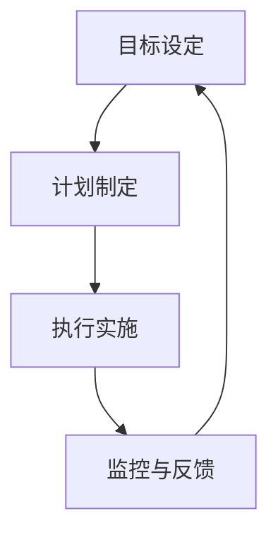
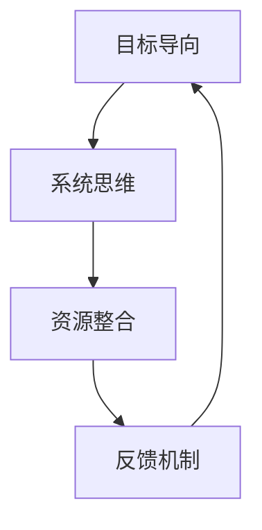
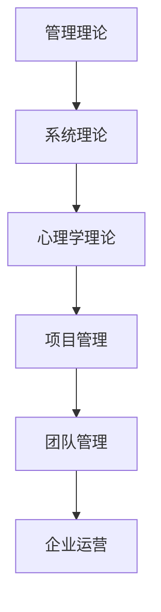
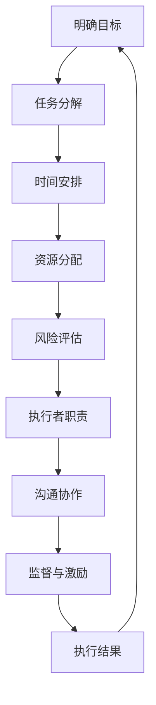
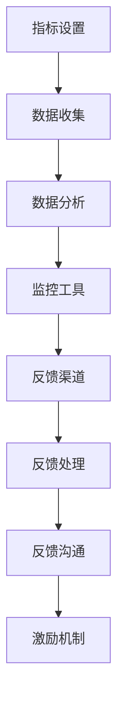
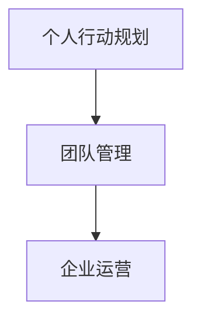
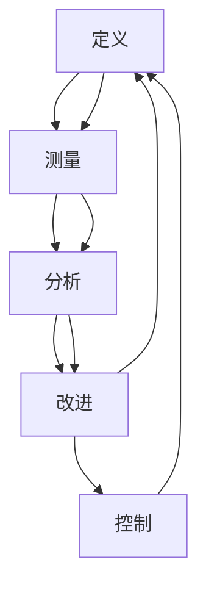
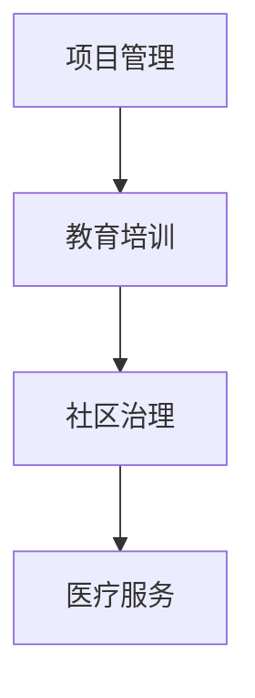
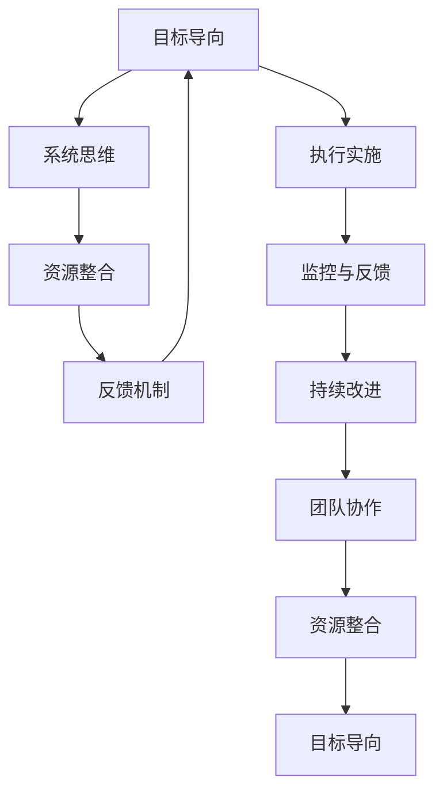

                 

## 行动体系:落地执行的保障

### 关键词：行动体系、执行保障、目标管理、持续改进、团队协作

#### 摘要

在当今快速变化的技术环境中，高效的执行和目标实现成为企业成功的关键。本文将探讨行动体系的概念、理论基础、制定与执行、监控与反馈机制，以及其在个人、团队和企业运营中的实际应用。通过详细的理论讲解、流程图展示、算法原理、伪代码示例和实际案例分析，本文旨在为读者提供一套全面且实用的行动体系构建和执行指南，帮助他们在各自领域中实现目标，提高效率和竞争力。

## 第1章: 行动体系概述

### 1.1 行动体系的定义与重要性

行动体系，顾名思义，是指一套系统化的方法和流程，用于组织、规划、执行和监控行动，以确保目标的达成。它不仅是一种管理工具，更是一种方法论，通过科学合理的规划和实施，可以帮助个人和组织高效地完成既定任务。

#### **行动体系的定义**

行动体系是一种确保目标实现的方法论，它包含了以下关键组成部分：

- **目标设定**：明确目标和期望结果，确保行动的一致性。
- **计划制定**：根据目标和资源制定详细的行动计划，包括任务分解和时间安排。
- **执行实施**：按照计划执行任务，确保行动的顺利推进。
- **监控与反馈**：实时监控行动的进展，及时反馈和调整，确保目标实现。

#### **行动体系的重要性**

行动体系的重要性在于它能够提供以下几个方面的保障：

1. **提高工作效率**：通过系统化的规划和实施，可以避免资源浪费和重复劳动，提高整体工作效率。
2. **确保资源的最优利用**：通过合理的资源分配和监控，确保人、财、物的最佳组合，提高资源利用率。
3. **确保目标的一致性和持续性**：通过持续的目标设定和监控，确保组织或个人始终朝着既定的目标前进，保持行动的一致性和持续性。

### 1.2 行动体系的基本结构

一个完整的行动体系通常包括以下基本结构：

#### **目标设定**

目标设定是行动体系的第一步，也是至关重要的一步。一个明确、具体、可衡量、可实现且有时间限制的目标（SMART原则）是行动的指南针，确保行动方向正确，资源利用合理。

1. **明确目标**：定义清晰的目标，例如“提高产品销量”或“提升客户满意度”。
2. **具体化目标**：将目标具体化，例如“在下一季度将产品销量提高20%”或“通过客户调研提高客户满意度至90%”。
3. **可衡量性**：确保目标可量化，例如通过销售数据或客户反馈进行衡量。
4. **可实现性**：目标必须实际可行，避免设定过高或不切实际的目标。
5. **时限性**：设定具体的时间期限，例如“下季度结束前完成”。

#### **计划制定**

在目标设定后，需要制定详细的行动计划，包括任务分解和时间安排。计划制定的过程通常包括以下步骤：

1. **任务分解**：将大目标分解为具体的小任务，确保每个任务都是可执行和可管理的。
2. **时间安排**：为每个任务分配具体的时间，制定出详细的时间表，确保任务有序推进。
3. **资源分配**：根据任务需求分配人力、物力和财力资源，确保资源的合理利用。
4. **风险评估**：评估可能出现的风险和问题，制定应对策略，降低风险对计划实施的影响。

#### **执行实施**

执行实施是将计划付诸实践的关键环节。在这一过程中，需要确保以下几点：

1. **明确职责**：为每个任务指定负责人，确保任务有人负责，有人监督。
2. **沟通协作**：加强团队成员之间的沟通和协作，确保信息的及时传递和问题的及时解决。
3. **监督执行**：建立监督机制，对任务执行情况进行监控，确保计划按预定时间表顺利推进。

#### **监控与反馈**

监控与反馈是行动体系的重要组成部分，它确保行动的进展可以实时掌握，并及时进行调整和优化。具体来说，监控与反馈包括以下几个步骤：

1. **指标设置**：根据目标和任务，设定关键指标（KPI），用于衡量行动进展。
2. **数据收集**：建立数据收集系统，确保数据的及时性和准确性。
3. **数据分析**：定期对收集到的数据进行分析，发现问题和趋势。
4. **反馈处理**：对分析结果进行分类和处理，制定改进措施。
5. **反馈沟通**：与相关人员沟通反馈结果，确保行动的持续改进。

### 1.3 行动体系的核心原则

为了确保行动体系的有效实施，需要遵循以下核心原则：

#### **目标明确**

目标明确是行动体系的首要原则，只有明确的目标才能指导行动，确保资源的合理利用。SMART原则提供了一个有效的目标设定方法：

- **S（Specific）：具体的**：目标必须具体明确，避免模糊和宽泛。
- **M（Measurable）：可衡量的**：目标必须能够通过具体的指标进行衡量，确保目标的实现程度可以量化。
- **A（Achievable）：可实现的**：目标必须实际可行，避免过高或不切实际的目标。
- **R（Realistic）：现实的**：目标必须基于现实情况，考虑到资源、能力和环境等因素。
- **T（Time-bound）：时限性的**：目标必须设定具体的时间期限，确保行动有明确的时间表。

#### **资源整合**

资源整合是行动体系的重要组成部分，通过优化资源配置，提高行动的效率和质量。资源整合包括以下方面：

- **人力**：合理分配人力资源，确保每个任务都有合适的执行者。
- **财力**：根据任务需求合理分配资金，确保资源的有效利用。
- **物力**：确保任务所需的物资和设备充足，确保行动的顺利进行。
- **信息**：充分利用信息资源，通过数据分析和信息化管理，提高决策的科学性和准确性。

#### **持续改进**

持续改进是行动体系的灵魂，通过不断的反馈和优化，提高工作效率和产品质量。持续改进的方法包括：

- **定期评估**：定期对行动进行评估，检查目标的实现情况，发现问题并提出改进措施。
- **数据驱动**：通过数据分析和反馈，发现问题和趋势，制定改进策略。
- **流程优化**：通过流程再造和优化，消除浪费，提高工作效率。
- **员工培训**：定期对员工进行培训，提高员工的能力和素质，确保行动体系的持续改进。

#### **团队协作**

团队协作是行动体系成功的关键，通过有效的团队协作，可以提高工作效率和质量。团队协作包括以下方面：

- **明确分工**：明确每个团队成员的职责和任务，确保任务分配合理。
- **沟通协调**：建立高效的沟通机制，确保信息的及时传递和问题的及时解决。
- **协同合作**：鼓励团队成员之间的协同合作，发挥集体智慧和力量。
- **激励制度**：建立合理的激励制度，激励团队成员积极参与行动体系，提高工作积极性。

### 1.4 行动体系在不同场景的应用

行动体系在不同场景中都有广泛的应用，以下列举几个常见场景：

#### **个人行动规划**

个人行动规划是行动体系在个人层面的应用，通过设定明确的目标和详细的行动计划，个人可以更好地规划自己的时间和资源，实现职业发展和个人成长。

1. **目标设定**：明确个人的职业发展和学习目标。
2. **计划制定**：制定详细的学习计划和行动计划，包括每天的学习任务和时间安排。
3. **执行实施**：按照计划执行任务，确保学习目标的实现。
4. **监控与反馈**：定期检查学习计划的执行情况，及时调整和改进。

#### **团队管理**

团队管理是行动体系在团队层面的应用，通过设定明确的目标和详细的行动计划，团队可以更好地协调和合作，提高工作效率和质量。

1. **目标协同**：确保团队成员的目标与团队目标一致。
2. **计划制定**：根据团队目标和资源，制定详细的行动计划。
3. **执行监控**：监控团队任务的执行情况，确保任务的顺利完成。
4. **反馈优化**：根据团队反馈，调整计划和策略，提高团队绩效。

#### **企业运营**

企业运营是行动体系在企业层面的应用，通过设定明确的企业战略和详细的运营计划，企业可以更好地规划和管理资源，实现企业目标。

1. **战略规划**：制定企业发展战略和年度计划。
2. **市场营销**：制定市场推广计划和营销策略。
3. **运营管理**：优化企业运营流程，提高运营效率。
4. **财务管理**：制定财务预算和成本控制策略。

### 总结

行动体系是一种系统化的方法和流程，通过目标设定、计划制定、执行实施、监控与反馈等步骤，可以帮助个人和组织高效地完成既定任务，实现目标。行动体系的核心原则包括目标明确、资源整合、持续改进和团队协作，这些原则在不同的场景中都有广泛的应用。通过有效的行动体系，个人和组织可以更好地规划和管理资源，提高工作效率和质量，实现持续发展。

### Mermaid 流程图

以下是一个简单的Mermaid流程图，展示了行动体系的基本结构：



该流程图展示了从目标设定到监控与反馈的循环过程，每个步骤都是行动体系的重要组成部分，共同确保目标的实现。

### 1.5 小结

本章对行动体系进行了概述，详细介绍了行动体系的定义、重要性、基本结构、核心原则以及在不同场景的应用。通过本章的学习，读者可以对行动体系有一个全面的认识，为后续章节的深入探讨打下基础。

## 第2章: 行动体系的理论基础

### 2.1 行动理论发展简史

行动体系的发展并非一蹴而就，而是经历了漫长的历史演进。不同时代的管理学者提出了许多重要的理论和方法，为行动体系的形成和完善奠定了基础。以下是行动理论发展简史：

#### **工业时代**

工业时代的到来，生产力大幅提升，劳动分工和标准化作业流程成为主要的管理方式。泰勒（Frederick Taylor）作为科学管理的奠基人，提出了科学管理理论。他主张通过分析工作流程，优化劳动分工，提高劳动生产率。泰勒的科学管理理论标志着工业时代行动体系的开端。

#### **信息时代**

随着信息技术的迅猛发展，管理理论逐渐从传统的劳动分工和标准化作业转向系统化和智能化管理。戴明（W. Edwards Deming）是信息时代的重要管理学者，他提出了PDCA循环理论。PDCA循环包括计划（Plan）、执行（Do）、检查（Check）和行动（Act），强调持续改进和闭环管理，为行动体系提供了重要的理论基础。

#### **知识时代**

在知识时代，管理理论更加注重目标和人的作用。彼得·德鲁克（Peter Drucker）是这一时期的重要管理学者，他提出了目标管理理论。目标管理强调明确的目标设定和自我管理，通过设定SMART目标，确保组织和个人始终朝着既定目标前进。

### 2.2 行动体系的核心概念与联系

行动体系是一个复杂的系统，包含多个核心概念。这些概念相互联系，共同确保行动的有效实施。以下是行动体系的核心概念及其相互联系：

#### **目标导向**

目标导向是行动体系的基础，一切行动都围绕目标展开。目标导向强调明确的目标设定，确保行动的针对性和有效性。目标导向的核心是SMART原则，即目标需要具体、可衡量、可实现、现实且有时间限制。

#### **系统思维**

系统思维是将行动视为一个整体，考虑各个环节的相互影响和协调。系统思维强调整体性和协调性，通过系统分析和优化，提高行动的效率和质量。系统思维是行动体系的重要方法论，有助于识别和解决复杂问题。

#### **资源整合**

资源整合是行动体系的关键，通过优化资源配置，提高行动的效率和质量。资源整合包括人力、财力、物力和信息资源的合理配置，确保资源的最优利用。资源整合是行动体系有效实施的重要保障。

#### **反馈机制**

反馈机制是行动体系的监控和调整机制，通过实时反馈，调整行动方向和策略，确保目标实现。反馈机制包括数据收集、分析、处理和反馈，通过不断的反馈和优化，确保行动的持续改进。

### Mermaid 流�程图

以下是一个简单的Mermaid流程图，展示了行动体系的核心概念及其相互联系：



该流程图展示了目标导向、系统思维、资源整合和反馈机制之间的相互关系，共同构成了行动体系的整体框架。

### 2.3 行动体系的理论基础

行动体系的理论基础涵盖了多个领域，包括管理理论、系统理论、心理学理论等。以下是行动体系的主要理论基础：

#### **管理理论**

管理理论为行动体系提供了重要的方法论和工具。泰勒的科学管理理论、戴明的PDCA循环理论、彼得·德鲁克的目标管理理论等，都是行动体系的重要理论基础。这些理论强调了目标设定、计划制定、执行实施、监控与反馈等关键环节，为行动体系的有效实施提供了指导。

#### **系统理论**

系统理论将行动体系视为一个复杂的系统，强调整体性和协调性。系统理论提供了系统分析和优化的方法，有助于识别和解决复杂问题。通过系统思维，行动体系可以更好地理解和应对外部环境的变化。

#### **心理学理论**

心理学理论为行动体系提供了人的行为和心理机制的理解。目标导向、自我管理、动机理论等心理学理论，为行动体系中的个体和团队提供了行为指导和激励机制。通过理解人的行为和心理，行动体系可以更好地激发和保持个体的积极性和创造力。

### 2.4 行动体系的应用领域

行动体系在多个领域都有广泛的应用，以下是几个常见应用领域：

#### **项目管理**

项目管理是行动体系的重要应用领域。通过目标导向、系统思维、资源整合和反馈机制，项目管理可以确保项目目标的实现，提高项目的效率和质量。项目管理包括项目计划、项目执行、项目监控和项目反馈等环节，与行动体系的核心概念高度契合。

#### **团队管理**

团队管理是行动体系在组织层面的应用。通过设定明确的目标、制定详细的行动计划、优化资源配置和建立反馈机制，团队管理可以确保团队目标的实现，提高团队的整体绩效。团队管理包括团队建设、团队沟通、团队协作和团队激励等环节。

#### **企业运营**

企业运营是行动体系在企业层面的应用。通过战略规划、市场营销、运营管理和财务管理等环节，企业运营可以确保企业目标的实现，提高企业的竞争力。企业运营需要建立科学的行动体系，通过持续改进和反馈优化，提高企业的运营效率和盈利能力。

### 2.5 小结

本章对行动体系的理论基础进行了探讨，包括行动理论的发展简史、行动体系的核心概念与联系、理论基础以及应用领域。通过本章的学习，读者可以深入理解行动体系的理论基础，为后续章节的深入探讨打下基础。

### Mermaid 流程图

以下是一个简单的Mermaid流程图，展示了行动体系的理论基础：



该流程图展示了行动体系的理论基础在不同应用领域的相互联系，共同构成了行动体系的整体框架。

## 第3章: 行动计划的制定与执行

### 3.1 行动计划的制定流程

行动计划是行动体系的核心组成部分，是确保目标实现的关键。制定一个有效的行动计划需要明确目标、任务分解、时间安排、资源分配和风险评估等步骤。以下是详细的制定流程：

#### **明确目标**

明确目标是行动计划的第一步，也是最重要的一步。一个明确、具体、可衡量、可实现且有时间限制的目标（SMART原则）是行动的指南针，确保行动方向正确，资源利用合理。例如，一个明确的目标可以是：“在下一个季度内将产品销量提高20%”。

#### **任务分解**

在明确目标后，需要将大目标分解为具体的小任务，确保每个任务都是可执行和可管理的。任务分解的过程通常包括以下步骤：

1. **确定关键任务**：根据目标，确定实现目标所需的关键任务。例如，为了提高产品销量，关键任务可能包括市场调研、产品优化、促销活动等。
2. **细化任务**：将关键任务进一步细化，分解为更具体的子任务。例如，市场调研可以细化为数据收集、数据分析、报告撰写等。
3. **确定任务优先级**：根据任务的重要性和紧急性，确定任务的优先级，确保关键任务优先完成。

#### **时间安排**

为每个任务分配具体的时间，制定出详细的时间表，确保任务有序推进。时间安排的过程通常包括以下步骤：

1. **估算任务时间**：根据任务的复杂性和工作量，估算每个任务所需的时间。例如，市场调研可能需要2周时间，促销活动可能需要1周时间。
2. **制定时间表**：将估算的时间分配到具体的日期，制定出详细的时间表。例如，将市场调研安排在第一季度的前两周，促销活动安排在第二季度。
3. **预留缓冲时间**：为每个任务预留一定的缓冲时间，以应对可能出现的时间延误和风险。

#### **资源分配**

根据任务需求分配人力、物力和财力资源，确保资源的合理利用。资源分配的过程通常包括以下步骤：

1. **确定资源需求**：根据任务的性质和规模，确定所需的人力、物力和财力资源。例如，市场调研可能需要数据分析师和调研工具，促销活动可能需要销售人员和市场推广材料。
2. **资源评估**：评估现有资源的可用性，确保资源的充足和合理分配。例如，检查是否有足够的销售人员参与促销活动，是否有足够的预算购买市场推广材料。
3. **资源调配**：根据资源评估结果，进行资源的调配和分配。例如，如果资源不足，可能需要从其他部门调配资源或增加预算。

#### **风险评估**

评估可能出现的风险和问题，制定应对策略，降低风险对计划实施的影响。风险评估的过程通常包括以下步骤：

1. **识别风险**：根据任务的性质和环境，识别可能出现的风险和问题。例如，市场调研可能面临数据不足或市场变化的风险，促销活动可能面临销售目标未达成的风险。
2. **评估风险**：评估每个风险的严重程度和可能性，确定需要优先关注的重点风险。例如，将数据不足的风险视为高风险，销售目标未达成的风险视为中风险。
3. **制定应对策略**：针对每个风险，制定具体的应对策略和预案。例如，对于数据不足的风险，可以制定补充数据的策略，对于销售目标未达成的风险，可以制定调整销售策略的预案。

### 3.2 执行过程中的关键要素

在行动计划执行过程中，需要关注多个关键要素，确保任务按照预定计划顺利完成。以下是执行过程中的关键要素：

#### **执行者职责**

明确每个执行者的职责和任务，确保任务有人负责，有人监督。执行者职责的明确化有助于提高任务的执行效率和责任感。例如，在市场调研任务中，数据分析师负责数据收集和分析，报告撰写人员负责报告的撰写。

#### **沟通协作**

加强团队成员之间的沟通和协作，确保信息的及时传递和问题的及时解决。良好的沟通协作有助于任务的顺利推进和团队的整体效率。沟通协作的方式可以包括定期会议、即时通讯工具和协作平台等。

#### **监督与激励**

建立监督机制，对任务执行情况进行监控和评估，确保任务按照预定计划推进。同时，给予执行者适当的激励，提高其工作积极性和执行力。激励方式可以包括绩效考核、奖金、晋升机会等。

### 3.3 实战案例分析

以下是一个实际案例，展示了行动计划制定与执行的过程：

#### **案例：某公司新产品上市计划**

**目标**：确保新产品在市场上取得成功。

**计划制定**：

1. **明确目标**：制定明确的目标，例如“在第一个季度实现新产品销售额达到500万元”。
2. **任务分解**：将大目标分解为具体任务，例如市场调研、产品策划、广告宣传、渠道铺设、销售预测等。
3. **时间安排**：为每个任务分配具体的时间，例如市场调研安排在第一季度的前两周，广告宣传安排在第二季度。
4. **资源分配**：根据任务需求分配人力、物力和财力资源，例如数据分析师负责市场调研，市场营销团队负责广告宣传。
5. **风险评估**：识别可能的风险和问题，例如市场变化、竞争压力等，并制定应对策略。

**执行实施**：

1. **执行者职责**：明确每个执行者的职责，例如数据分析师负责市场调研，市场营销团队负责广告宣传。
2. **沟通协作**：加强团队成员之间的沟通和协作，确保任务的顺利推进。
3. **监督与激励**：建立监督机制，对任务执行情况进行监控和评估，同时给予执行者适当的激励，提高其工作积极性。

**监控与反馈**：

1. **指标设置**：设定关键指标（KPI），例如销售额、客户满意度等，用于衡量行动进展。
2. **数据收集**：定期收集销售数据、市场反馈等，确保数据的及时性和准确性。
3. **数据分析**：对收集到的数据进行分析，发现问题和趋势。
4. **反馈处理**：根据数据分析结果，调整计划和策略，确保目标实现。

**结果**：通过有效的行动计划制定和执行，新产品在市场上取得了成功，销售额达到了预期目标，客户满意度较高。

### Mermaid 流程图

以下是一个简单的Mermaid流程图，展示了行动计划制定与执行的过程：



该流程图展示了从目标设定到执行结果的全过程，每个步骤都是行动计划制定与执行的关键环节。

### 3.4 小结

本章详细介绍了行动计划制定与执行的过程，包括明确目标、任务分解、时间安排、资源分配和风险评估等步骤。通过实战案例的分析，读者可以更深入地理解行动计划在实际工作中的应用和效果。有效的行动计划制定与执行是确保目标实现的关键，需要各个环节的紧密配合和持续优化。

## 第4章: 监控与反馈机制

### 4.1 监控与反馈的重要性

监控与反馈是行动体系的重要组成部分，其重要性体现在以下几个方面：

1. **实时掌握行动进展**：通过监控机制，可以实时了解行动的进展情况，及时发现偏差和问题。
2. **及时调整行动计划**：通过反馈机制，可以及时收集和分析行动结果，为后续行动提供改进建议和决策依据。
3. **确保目标实现**：监控与反馈机制确保行动始终朝着目标前进，通过持续调整和优化，确保目标最终实现。
4. **提高行动效率**：通过监控与反馈，可以发现并消除过程中的浪费和低效环节，提高整体行动的效率。
5. **增强团队协作**：通过反馈机制，可以加强团队成员之间的沟通和协作，提高团队的整体执行力。

### 4.2 监控机制的设计

设计一个有效的监控机制，需要考虑以下几个方面：

1. **指标设置**：根据目标和任务，设定关键指标（KPI），用于衡量行动进展。指标应该具体、可衡量、与目标密切相关。例如，新产品上市计划中的关键指标可以是销售额、客户满意度、市场占有率等。

2. **数据收集**：建立数据收集系统，确保数据的及时性和准确性。数据收集可以通过多种方式实现，如手动记录、自动化系统、调查问卷等。例如，为了监控销售目标的实现情况，可以定期收集销售数据，通过ERP系统自动汇总。

3. **数据存储**：确保数据的存储安全、可靠、易于检索。数据存储可以使用数据库、云存储等工具，确保数据长期保存和方便查询。

4. **数据分析**：定期对收集到的数据进行分析，发现问题和趋势。数据分析可以使用各种工具和算法，如Excel、Python等，对数据进行可视化展示和分析。

5. **监控工具**：使用专业的监控工具，如项目管理软件、数据分析软件等，实现实时监控和报警。监控工具可以帮助团队成员随时了解行动进展，及时发现问题和调整计划。

### 4.3 反馈机制的构建

构建一个有效的反馈机制，需要考虑以下几个方面：

1. **反馈渠道**：建立多渠道的反馈机制，确保信息的及时传递。反馈渠道可以包括内部沟通平台、会议、问卷、在线反馈表等。多渠道的反馈机制可以确保信息的广泛收集和及时传递。

2. **反馈处理**：对收集到的反馈信息进行分类和处理，制定改进措施。反馈处理可以包括问题诊断、解决方案制定、实施跟踪等环节。通过系统化的反馈处理，可以确保问题的及时解决和改进措施的落实。

3. **反馈沟通**：与相关人员沟通反馈结果，确保行动的持续改进。反馈沟通可以包括会议报告、邮件通知、即时通讯等。通过有效的反馈沟通，可以确保相关人员对反馈结果的理解和认同，推动改进措施的执行。

4. **激励机制**：建立激励机制，鼓励团队成员积极参与反馈和改进。激励机制可以包括绩效考核、奖金、荣誉等。通过激励机制，可以激发团队成员的积极性和创造力，提高反馈机制的执行效果。

### 4.4 实战案例分析

以下是一个实际案例，展示了监控与反馈机制在实际工作中的应用：

#### **案例：某公司销售团队绩效监控**

**目标**：提高销售团队的绩效和销售额。

**监控机制设计**：

1. **指标设置**：设定关键绩效指标（KPI），包括销售额、客户满意度、市场占有率等。
2. **数据收集**：通过CRM系统收集销售数据，确保数据的及时性和准确性。
3. **数据分析**：定期对销售数据进行分析，发现销售趋势和问题。
4. **监控工具**：使用项目管理软件，实现实时监控和数据分析。

**反馈机制构建**：

1. **反馈渠道**：建立多渠道的反馈机制，包括定期销售会议、在线反馈表、即时通讯等。
2. **反馈处理**：对销售数据进行分析，发现问题和改进机会，制定具体的改进措施。
3. **反馈沟通**：定期与销售团队沟通反馈结果，确保改进措施的落实。
4. **激励机制**：根据销售绩效，实施绩效考核和奖金制度，激励团队成员。

**结果**：通过有效的监控与反馈机制，销售团队的绩效显著提升，销售额达到了预期目标，客户满意度也得到了提高。

### Mermaid 流程图

以下是一个简单的Mermaid流程图，展示了监控与反馈机制的设计和实施：



该流程图展示了从指标设置到激励机制的全过程，每个步骤都是监控与反馈机制的重要组成部分。

### 4.5 小结

本章详细介绍了监控与反馈机制的重要性、设计要点、构建方法和实际案例。通过有效的监控与反馈机制，可以确保行动的实时掌握和及时调整，提高行动效率和质量，确保目标实现。有效的监控与反馈机制是行动体系的重要组成部分，需要在实践中不断优化和完善。

## 第5章: 行动体系在实际工作中的应用

### 5.1 个人行动规划

个人行动规划是行动体系在个人层面的应用，通过设定明确的目标和详细的行动计划，个人可以更好地规划自己的时间和资源，实现职业发展和个人成长。以下是个人行动规划的详细步骤：

#### **目标设定**

1. **明确职业目标**：设定长期的职业目标，例如成为某个领域的专家或晋升到更高的职位。
2. **设定短期目标**：根据长期目标，设定短期目标，例如每个月完成一定的学习任务或完成某个项目。
3. **具体化目标**：将目标具体化，例如通过参加某个课程或阅读特定数量的书籍来提升技能。

#### **计划制定**

1. **任务分解**：将短期目标分解为具体的小任务，确保每个任务都是可执行和可管理的。
2. **时间安排**：为每个任务分配具体的时间，制定出详细的时间表，确保任务有序推进。
3. **资源分配**：根据任务需求分配时间、精力和其他资源，确保资源的合理利用。

#### **执行实施**

1. **明确职责**：明确每个任务的负责人，确保任务有人负责，有人监督。
2. **执行任务**：按照计划执行任务，确保每个任务按时完成。
3. **监督执行**：定期检查任务的执行情况，确保任务按照预定计划推进。

#### **监控与反馈**

1. **指标设置**：设定关键指标（KPI），例如完成任务的数量和质量。
2. **数据收集**：定期收集执行任务的数据，确保数据的及时性和准确性。
3. **数据分析**：对收集到的数据进行分析，发现问题和趋势。
4. **反馈处理**：根据数据分析结果，调整计划和策略，确保目标的实现。

#### **案例分析**

**案例：某技术人员的职业发展规划**

**目标**：成为人工智能领域的专家。

**计划制定**：

1. **长期目标**：在五年内成为人工智能领域的专家。
2. **短期目标**：每年完成一定数量的学习任务，例如阅读相关书籍、参加技术会议、完成项目等。
3. **任务分解**：将短期目标分解为具体的学习任务，例如每月阅读2本相关书籍、每季度参加一次技术会议等。

**执行实施**：

1. **明确职责**：明确每个学习任务的负责人，确保任务有人负责，有人监督。
2. **执行任务**：按照计划执行任务，确保每个任务按时完成。
3. **监督执行**：定期检查任务的执行情况，确保任务按照预定计划推进。

**监控与反馈**：

1. **指标设置**：设定关键指标（KPI），例如完成的书籍数量、参加的技术会议次数等。
2. **数据收集**：定期收集执行任务的数据，确保数据的及时性和准确性。
3. **数据分析**：对收集到的数据进行分析，发现问题和趋势。
4. **反馈处理**：根据数据分析结果，调整计划和策略，确保目标的实现。

通过详细的个人行动规划，该技术人员在五年内成功成为人工智能领域的专家，实现了职业发展目标。

### 5.2 团队管理

团队管理是行动体系在团队层面的应用，通过设定明确的目标、制定详细的行动计划、优化资源配置和建立反馈机制，团队可以更好地协调和合作，提高工作效率和质量。以下是团队管理的详细步骤：

#### **目标协同**

1. **明确团队目标**：确保团队目标与组织目标一致，例如提高产品开发效率或提升客户满意度。
2. **设定团队目标**：将团队目标分解为具体的子目标，确保每个团队成员都明确自己的职责和任务。
3. **沟通与共识**：通过沟通和共识，确保团队成员对团队目标的理解和认同。

#### **计划制定**

1. **任务分解**：将团队目标分解为具体的小任务，确保每个任务都是可执行和可管理的。
2. **时间安排**：为每个任务分配具体的时间，制定出详细的时间表，确保任务有序推进。
3. **资源分配**：根据任务需求分配人力、物力和财力资源，确保资源的合理利用。
4. **风险评估**：评估可能出现的风险和问题，制定应对策略，降低风险对计划实施的影响。

#### **执行监控**

1. **明确职责**：为每个任务指定负责人，确保任务有人负责，有人监督。
2. **沟通协作**：加强团队成员之间的沟通和协作，确保信息的及时传递和问题的及时解决。
3. **监督执行**：建立监督机制，对任务执行情况进行监控，确保任务按照预定计划推进。

#### **反馈优化**

1. **指标设置**：根据团队目标和任务，设定关键指标（KPI），用于衡量行动进展。
2. **数据收集**：建立数据收集系统，确保数据的及时性和准确性。
3. **数据分析**：定期对收集到的数据进行分析，发现问题和趋势。
4. **反馈处理**：根据数据分析结果，调整计划和策略，确保团队目标的实现。

#### **案例分析**

**案例：某软件开发团队的迭代开发**

**目标**：提高软件开发的效率和质量。

**计划制定**：

1. **明确目标**：设定短期目标，例如在两个迭代周期内完成软件的初步开发。
2. **任务分解**：将大目标分解为具体的小任务，例如需求分析、设计、编码、测试等。
3. **时间安排**：为每个任务分配具体的时间，制定出详细的时间表，确保任务有序推进。
4. **资源分配**：根据任务需求分配开发人员、测试人员和其他资源，确保资源的合理利用。
5. **风险评估**：评估可能出现的风险和问题，例如需求变更、资源不足等，并制定应对策略。

**执行监控**：

1. **明确职责**：为每个任务指定负责人，确保任务有人负责，有人监督。
2. **沟通协作**：通过日常站会和即时通讯工具，加强团队成员之间的沟通和协作。
3. **监督执行**：建立监督机制，对任务执行情况进行监控，确保任务按照预定计划推进。

**反馈优化**：

1. **指标设置**：设定关键指标（KPI），例如任务完成率、代码质量等。
2. **数据收集**：通过代码库、测试报告等收集数据，确保数据的及时性和准确性。
3. **数据分析**：定期对收集到的数据进行分析，发现问题和趋势。
4. **反馈处理**：根据数据分析结果，调整计划和策略，确保软件开发的效率和质量。

通过有效的团队管理，该软件开发团队成功地在两个迭代周期内完成了软件的初步开发，提高了开发效率和产品质量。

### 5.3 企业运营

企业运营是行动体系在企业层面的应用，通过设定明确的企业战略和详细的运营计划，企业可以更好地规划和管理资源，实现企业目标。以下是企业运营的详细步骤：

#### **战略规划**

1. **明确战略目标**：设定长期的企业战略目标，例如成为行业领导者或实现国际化发展。
2. **分析市场环境**：分析市场环境、竞争态势、客户需求等，确保战略目标的可行性。
3. **制定战略计划**：根据战略目标和市场分析结果，制定具体的战略计划，包括市场拓展、产品研发、品牌建设等。

#### **市场营销**

1. **市场调研**：进行市场调研，了解客户需求、市场趋势等，为营销策略提供依据。
2. **制定营销策略**：根据市场调研结果，制定具体的营销策略，包括产品定位、定价策略、推广渠道等。
3. **实施营销活动**：按照营销策略，实施具体的营销活动，例如广告宣传、促销活动等。
4. **评估营销效果**：对营销活动进行评估，收集反馈数据，分析营销效果，为后续营销活动提供改进依据。

#### **运营管理**

1. **流程优化**：优化企业运营流程，提高运营效率，减少资源浪费。
2. **资源配置**：根据运营需求，合理配置人力、物力和财力资源，确保资源的最佳利用。
3. **监控与反馈**：建立监控机制，对运营过程进行监控，及时反馈问题，确保运营的顺利进行。

#### **财务管理**

1. **预算编制**：制定详细的预算计划，包括收入预算、支出预算、成本控制等。
2. **成本分析**：定期对成本进行分析，发现成本控制和优化空间。
3. **资金管理**：确保资金的合理使用和管理，提高资金利用效率。
4. **财务分析**：定期进行财务分析，评估企业的财务状况，为决策提供依据。

#### **案例分析**

**案例：某互联网企业的战略规划和运营管理**

**目标**：成为国内领先的互联网企业。

**战略规划**：

1. **明确目标**：设定长期目标，例如在五年内成为国内领先的互联网企业。
2. **分析市场环境**：分析市场环境、竞争态势、客户需求等，确保战略目标的可行性。
3. **制定战略计划**：根据战略目标和市场分析结果，制定具体的战略计划，包括产品创新、市场拓展、品牌建设等。

**市场营销**：

1. **市场调研**：定期进行市场调研，了解客户需求、市场趋势等，为营销策略提供依据。
2. **制定营销策略**：根据市场调研结果，制定具体的营销策略，包括产品定位、定价策略、推广渠道等。
3. **实施营销活动**：按照营销策略，实施具体的营销活动，例如广告宣传、促销活动等。
4. **评估营销效果**：对营销活动进行评估，收集反馈数据，分析营销效果，为后续营销活动提供改进依据。

**运营管理**：

1. **流程优化**：通过流程再造和优化，提高运营效率，减少资源浪费。
2. **资源配置**：根据运营需求，合理配置人力、物力和财力资源，确保资源的最佳利用。
3. **监控与反馈**：建立监控机制，对运营过程进行监控，及时反馈问题，确保运营的顺利进行。

**财务管理**：

1. **预算编制**：制定详细的预算计划，包括收入预算、支出预算、成本控制等。
2. **成本分析**：定期对成本进行分析，发现成本控制和优化空间。
3. **资金管理**：确保资金的合理使用和管理，提高资金利用效率。
4. **财务分析**：定期进行财务分析，评估企业的财务状况，为决策提供依据。

通过有效的战略规划和运营管理，该互联网企业成功实现了国内领先的目标，成为行业佼佼者。

### 总结

行动体系在实际工作中的广泛应用，无论是个人行动规划、团队管理还是企业运营，都通过明确的目标设定、详细的计划制定、高效的执行实施和持续监控与反馈，实现了高效的目标实现和资源优化。有效的行动体系是组织和个人成功的基石，通过不断实践和优化，可以不断提升工作效率和质量。

### Mermaid 流程图

以下是一个简单的Mermaid流程图，展示了行动体系在实际工作中的详细应用：



该流程图展示了行动体系在不同层面的应用，每个步骤都是实现目标的关键环节。

## 第6章: 行动体系的持续改进

### 6.1 持续改进的重要性

持续改进是行动体系的核心原则之一，它强调通过不断的反馈和优化，提高工作效率和产品质量，增强组织的竞争力。以下是持续改进的几个重要方面：

1. **提高效率**：通过持续改进，可以消除过程中的浪费和低效环节，提高整体工作效率。例如，通过流程优化和自动化工具的使用，减少手工操作和重复劳动，提高工作速度和质量。

2. **提升质量**：持续改进可以不断优化工作流程和方法，提高产品和服务的质量。通过质量监控和持续优化，可以及时发现和解决质量问题，降低错误率，提升客户满意度。

3. **增强竞争力**：持续改进可以帮助组织在激烈的市场竞争中保持优势。通过不断学习和创新，组织可以迅速适应市场变化，推出新产品和服务，提升市场竞争力。

4. **培养企业文化**：持续改进强调团队协作、创新和不断追求卓越，可以培养积极向上的企业文化。这种企业文化有助于吸引和留住优秀人才，提升组织的整体执行力。

### 6.2 持续改进的方法

持续改进的方法多种多样，以下是一些常见的方法：

1. **PDCA循环**：PDCA循环包括计划（Plan）、执行（Do）、检查（Check）和行动（Act），是一个经典的持续改进方法。通过这个循环，组织可以不断优化流程，提高效率和质量。

   - **计划**：设定目标和改进方案，制定详细的行动计划。
   - **执行**：按照计划执行任务，确保改进措施的落实。
   - **检查**：对执行结果进行评估，检查目标是否达成，发现问题和改进空间。
   - **行动**：根据检查结果，调整计划和策略，持续改进。

2. **精益管理**：精益管理通过消除浪费、优化流程，提高工作效率和产品质量。精益管理的方法包括5S、价值流图、看板等。

   - **5S**：整理（Seiri）、整顿（Seiton）、清扫（Seiso）、清洁（Seiketsu）、素养（Shitsuke），通过规范工作环境和员工行为，提高工作效率。
   - **价值流图**：通过绘制价值流图，分析流程中的每个环节，识别浪费和瓶颈，优化流程。
   - **看板**：通过看板系统，实现实时监控和反馈，确保流程的顺畅和高效。

3. **六西格玛**：六西格玛是一种以数据分析和统计方法为基础的持续改进方法，旨在降低误差率、提高质量。六西格玛通过定义问题、分析数据、制定解决方案、实施改进和监控结果等步骤，实现持续改进。

   - **定义**：明确改进目标，确定改进项目。
   - **测量**：收集数据，评估当前状态。
   - **分析**：分析数据，找出关键因素和改进机会。
   - **改进**：制定改进方案，实施改进措施。
   - **控制**：监控改进效果，确保改进的持续性和稳定性。

### 6.3 实战案例分析

以下是一个实际案例，展示了持续改进在组织中的应用：

#### **案例：某制造企业的质量改进**

**目标**：降低生产过程中的废品率，提高产品质量。

**改进方法**：

1. **PDCA循环**：

   - **计划**：制定质量改进计划，设定具体的目标和改进方案。
   - **执行**：按照计划执行，实施改进措施。
   - **检查**：定期检查生产过程和质量指标，评估改进效果。
   - **行动**：根据检查结果，调整计划和策略，持续改进。

2. **六西格玛**：

   - **定义**：明确质量改进项目，确定关键问题和改进目标。
   - **测量**：收集生产数据，评估当前废品率。
   - **分析**：分析数据，找出导致废品率高的关键因素。
   - **改进**：制定改进方案，如优化工艺流程、提高设备精度等。
   - **控制**：实施改进措施，监控废品率的变化，确保改进的持续性和稳定性。

**效果**：

通过PDCA循环和六西格玛方法的持续改进，该制造企业的废品率显著降低，产品质量得到了显著提高。生产效率也得到了提升，企业的市场竞争力得到了增强。

### Mermaid 流程图

以下是一个简单的Mermaid流程图，展示了PDCA循环和六西格玛方法的步骤：



该流程图展示了PDCA循环和六西格玛方法的步骤，每个步骤都是持续改进的重要组成部分。

### 6.4 小结

本章详细介绍了持续改进的重要性、方法及其在实际中的应用。持续改进是行动体系的核心原则之一，通过PDCA循环、精益管理和六西格玛等方法，组织可以不断优化流程、提高质量和效率，增强竞争力。有效的持续改进可以帮助组织在快速变化的市场环境中保持竞争优势，实现长期发展。

## 第7章: 行动体系在不同领域的应用案例

### 7.1 项目管理

项目管理是行动体系的重要应用领域之一，通过科学的计划、执行、监控和反馈，确保项目目标的实现。以下是项目管理中行动体系的实际应用案例：

#### **案例：某软件开发项目的实施**

**项目背景**：

某科技公司计划开发一款新的智能助手应用，旨在提供便捷的语音交互服务。项目涉及多个功能模块，包括语音识别、自然语言处理、用户界面设计等，需要跨部门协作，时间紧、任务重。

**行动体系应用**：

1. **目标设定**：明确项目目标，包括功能模块的实现时间、用户满意度等。
2. **计划制定**：分解项目任务，制定详细的进度计划，为每个任务分配时间、资源和负责人。
3. **执行实施**：按照计划推进项目，确保任务按时完成，加强团队协作和沟通。
4. **监控与反馈**：定期监控项目进度和质量，收集反馈，及时调整计划和策略。

**效果**：

通过行动体系的科学管理，该软件开发项目在预定时间内完成，功能模块实现全面，用户满意度高，项目取得了成功。

### 7.2 教育培训

教育培训是行动体系在知识传授和个人成长领域的应用，通过系统的目标和计划，提高教学质量和学习效果。以下是教育培训中行动体系的实际应用案例：

#### **案例：某在线学习平台的教学管理**

**项目背景**：

某在线学习平台提供多种在线课程，包括编程、外语、管理等领域。为了提高课程质量和学习效果，平台引入了行动体系进行教学管理。

**行动体系应用**：

1. **目标设定**：明确教学目标，包括课程内容的覆盖、学习效果等。
2. **计划制定**：制定详细的教学计划，包括课程大纲、时间安排、学习任务等。
3. **执行实施**：按照教学计划开展教学活动，确保课程内容的全面覆盖和学生的学习进度。
4. **监控与反馈**：实时监控学生的学习进度和效果，收集反馈，及时调整教学策略。

**效果**：

通过行动体系的科学管理，该在线学习平台的课程质量和学习效果显著提高，用户满意度增加，平台的知名度和市场份额也得到了提升。

### 7.3 社区治理

社区治理是行动体系在社区管理和社会服务领域的应用，通过系统的目标和计划，提高社区管理的效率和质量。以下是社区治理中行动体系的实际应用案例：

#### **案例：某城市社区的管理提升**

**项目背景**：

某城市社区面临人口老龄化、基础设施老化等问题，需要进行社区管理提升。社区居委会引入了行动体系进行治理。

**行动体系应用**：

1. **目标设定**：明确社区治理目标，包括提高居民生活质量、改善社区环境等。
2. **计划制定**：制定详细的治理计划，包括基础设施改造、居民活动安排、社区服务改进等。
3. **执行实施**：按照治理计划推进工作，动员居民参与，确保计划的落实。
4. **监控与反馈**：实时监控社区管理的进展，收集居民反馈，及时调整和优化治理策略。

**效果**：

通过行动体系的科学管理，该社区的居民生活质量得到了显著提高，社区环境得到了改善，居民的满意度和参与度也显著增加。

### 7.4 医疗服务

医疗服务是行动体系在公共健康服务领域的应用，通过系统的目标和计划，提高医疗服务质量和效率。以下是医疗服务中行动体系的实际应用案例：

#### **案例：某医院的管理改革**

**项目背景**：

某医院面临医疗资源分配不均、服务效率低下等问题，需要进行管理改革。医院管理层引入了行动体系进行管理。

**行动体系应用**：

1. **目标设定**：明确医院管理目标，包括提高医疗服务质量、改善患者体验等。
2. **计划制定**：制定详细的管理改革计划，包括资源调配、流程优化、服务质量提升等。
3. **执行实施**：按照管理改革计划推进工作，确保各项改革措施的落实。
4. **监控与反馈**：实时监控医疗服务质量和效率，收集患者反馈，及时调整和优化管理策略。

**效果**：

通过行动体系的科学管理，该医院的服务质量和效率显著提高，患者满意度和医疗安全水平也得到了提升，医院在行业中的竞争力得到了增强。

### 总结

行动体系在不同领域的广泛应用，展示了其在实现目标、提高效率和质量方面的强大作用。无论是项目管理、教育培训、社区治理还是医疗服务，行动体系都能提供有效的管理框架和方法，帮助组织和个人实现既定目标，提升整体竞争力。

### Mermaid 流程图

以下是一个简单的Mermaid流程图，展示了行动体系在不同领域应用的流程：



该流程图展示了行动体系在不同领域的应用，每个领域都通过明确的目标、详细的计划和持续监控与反馈，实现高效管理和目标实现。

## 附录

### 附录 A: 行动体系工具与资源

为了更好地应用行动体系，以下列举了一些常用的工具和资源：

#### **工具**

1. **时间管理工具**：如Trello、Asana、JIRA等，用于任务分配和进度跟踪。
2. **项目管理工具**：如Microsoft Project、GanttPRO、Smartsheet等，用于项目计划和进度管理。
3. **协作工具**：如Slack、Microsoft Teams、Zoom等，用于团队沟通和协作。
4. **数据收集和分析工具**：如Google Analytics、Tableau、Power BI等，用于数据分析和可视化。

#### **资源**

1. **书籍**：
   - 《敏捷开发实践指南》（Agile Project Management）- Jim Highsmith
   - 《精益创业》（The Lean Startup）- Eric Ries
   - 《目标管理》（The Goal）- Eliyahu M. Goldratt

2. **文章和博客**：如Medium、LinkedIn、CIO等平台上的相关文章和博客，提供丰富的实践经验和案例分析。
3. **在线课程和培训**：如Coursera、Udemy、edX等平台上的项目管理、时间管理和持续改进相关课程。

### 附录 B: 行动体系模板与案例

以下提供了一些行动体系模板和案例，供读者参考和应用：

#### **模板**

1. **个人行动计划模板**：
   - **目标设定**：明确个人职业发展目标和短期目标。
   - **计划制定**：制定详细的学习计划和工作计划。
   - **执行实施**：按照计划执行任务，确保目标的实现。
   - **监控与反馈**：定期检查计划的执行情况，及时调整和改进。

2. **团队管理计划模板**：
   - **目标协同**：确保团队成员的目标与团队目标一致。
   - **计划制定**：根据团队目标和资源，制定详细的行动计划。
   - **执行监控**：监控团队任务的执行情况，确保任务的顺利完成。
   - **反馈优化**：根据团队反馈，调整计划和策略，提高团队绩效。

#### **案例**

1. **案例：某公司的项目计划**：
   - **目标**：确保项目在规定时间内高质量完成。
   - **计划**：详细的项目进度表、任务分配表和资源清单。
   - **执行**：按照计划推进项目，定期召开项目进度会议。
   - **监控**：实时监控项目进度和质量，及时调整计划。

2. **案例：某在线学习平台的运营计划**：
   - **目标**：提高课程质量和用户满意度。
   - **计划**：制定课程更新计划、用户反馈收集和改进措施。
   - **执行**：按计划更新课程内容，定期收集用户反馈。
   - **监控**：定期分析用户反馈数据，优化课程内容和教学方法。

通过这些模板和案例，读者可以更好地理解和应用行动体系，实现目标管理和持续改进。

### 附录 C: 核心概念与联系

为了更好地理解行动体系的核心概念及其相互联系，以下提供了一些核心概念的Mermaid流程图：



该流程图展示了行动体系的核心概念及其相互联系，强调了目标导向、系统思维、资源整合、反馈机制、执行实施、监控与反馈、持续改进和团队协作等环节在行动体系中的重要性。

### 附录 D: 核心算法原理讲解与伪代码

以下是一些核心算法原理的讲解和伪代码示例：

#### **算法原理：排序算法**

排序算法是计算机科学中的一种基本算法，用于对数据进行排序。以下是冒泡排序的伪代码示例：

```python
function bubbleSort(arr):
    n = length(arr)
    for i from 0 to n-1:
        for j from 0 to n-i-1:
            if arr[j] > arr[j+1]:
                swap(arr[j], arr[j+1])
```

该算法通过多次遍历数组，比较相邻元素的大小并进行交换，最终实现数组的有序排列。

#### **算法原理：查找算法**

查找算法用于在数据集合中查找特定的元素。以下是二分查找的伪代码示例：

```python
function binarySearch(arr, target):
    low = 0
    high = length(arr) - 1

    while low <= high:
        mid = (low + high) / 2
        if arr[mid] == target:
            return mid
        elif arr[mid] < target:
            low = mid + 1
        else:
            high = mid - 1

    return -1
```

该算法通过不断缩小查找范围，实现高效查找。

#### **算法原理：图算法**

图算法用于解决与图相关的问题。以下是Dijkstra算法的伪代码示例，用于求解图中两点之间的最短路径：

```python
function dijkstra(graph, start):
    distances = array of infinity
    distances[start] = 0
    priorityQueue = new MinHeap()
    priorityQueue.insert((0, start))

    while not priorityQueue.isEmpty():
        (dist, current) = priorityQueue.extractMin()
        for neighbor, edgeWeight in graph[current]:
            if distances[current] + edgeWeight < distances[neighbor]:
                distances[neighbor] = distances[current] + edgeWeight
                priorityQueue.insert((distances[neighbor], neighbor))

    return distances
```

该算法通过优先队列选择未处理的节点，计算到达其他节点的最短路径，最终得到整个图的最短路径树。

### 附录 E: 数学模型和公式详解与举例

以下是一些常用的数学模型和公式，以及详细的讲解和举例：

#### **数学模型：线性回归**

线性回归模型用于分析两个变量之间的关系。其公式为：

$$ y = ax + b $$

其中，\( y \) 是因变量，\( x \) 是自变量，\( a \) 是斜率，\( b \) 是截距。

**举例**：

假设我们要分析身高和体重之间的关系。已知：

- 身高（\( x \)）：175cm
- 体重（\( y \)）：70kg

我们可以通过线性回归模型拟合出：

$$ y = 0.45x + 25 $$

这意味着，每增加1cm的身高，体重将增加0.45kg。

#### **数学模型：时间序列分析**

时间序列分析用于预测未来值。其公式为：

$$ y(t) = \alpha y(t-1) + (1-\alpha)y(t-2) $$

其中，\( y(t) \) 是当前值，\( y(t-1) \) 是前一个值，\( y(t-2) \) 是前两个值，\( \alpha \) 是权重。

**举例**：

假设我们有一个时间序列数据：

- \( y(1) = 10 \)
- \( y(2) = 12 \)
- \( y(3) = 11 \)

使用时间序列分析模型预测第4个值：

$$ y(4) = 0.5 \cdot y(3) + 0.5 \cdot y(2) = 0.5 \cdot 11 + 0.5 \cdot 12 = 11.5 $$

预测结果为第4个值大约为11.5。

#### **数学模型：决策树**

决策树模型用于分类和回归问题。其公式为：

$$ f(x) = \sum_{i=1}^{n} w_i \cdot g(x_i) $$

其中，\( f(x) \) 是预测值，\( w_i \) 是权重，\( g(x_i) \) 是特征函数。

**举例**：

假设我们要预测一个顾客是否会在下次购物中购买产品。特征函数为：

- \( g(x_1) = 1 \) 如果顾客年龄大于30，否则为0。
- \( g(x_2) = 1 \) 如果顾客有购物历史，否则为0。

权重为：

- \( w_1 = 0.6 \)
- \( w_2 = 0.4 \)

一个顾客的特征值为：

- \( x_1 = 1 \)
- \( x_2 = 1 \)

预测结果为：

$$ f(x) = 0.6 \cdot 1 + 0.4 \cdot 1 = 1 $$

这意味着该顾客有较高的购买概率。

### 附录 F: 项目实战：代码实际案例和详细解读

以下是一个项目实战案例，包括代码实际案例、开发环境搭建、源代码实现和代码解读与分析。

#### **项目背景**

某互联网公司计划开发一款社交媒体应用，用户可以在平台上发布、查看和评论帖子。为了提高用户体验，公司决定采用微服务架构，将系统拆分为多个独立的服务模块，如用户管理服务、帖子管理服务和评论管理服务。

#### **开发环境搭建**

1. **操作系统**：Linux（例如Ubuntu）
2. **编程语言**：Java、Python、Node.js
3. **开发工具**：IntelliJ IDEA、Visual Studio Code
4. **数据库**：MySQL、MongoDB
5. **容器化工具**：Docker
6. **持续集成/持续部署**：Jenkins

#### **源代码实现**

以下是用户管理服务的源代码实现，包括用户注册、登录和权限验证等功能。

**用户注册服务（UserRegistrationService.java）**

```java
import java.util.HashMap;
import java.util.Map;

public class UserRegistrationService {
    private Map<String, User> users = new HashMap<>();

    public User registerUser(String username, String password) {
        if (users.containsKey(username)) {
            throw new IllegalArgumentException("User already exists.");
        }
        User user = new User(username, password);
        users.put(username, user);
        return user;
    }

    public User login(String username, String password) {
        User user = users.get(username);
        if (user == null || !user.getPassword().equals(password)) {
            throw new IllegalArgumentException("Invalid credentials.");
        }
        return user;
    }

    public boolean hasPermission(String username, String permission) {
        User user = users.get(username);
        return user != null && user.getPermissions().contains(permission);
    }
}

class User {
    private String username;
    private String password;
    private Set<String> permissions;

    public User(String username, String password) {
        this.username = username;
        this.password = password;
        this.permissions = new HashSet<>();
    }

    public String getUsername() {
        return username;
    }

    public String getPassword() {
        return password;
    }

    public Set<String> getPermissions() {
        return permissions;
    }
}
```

**用户登录服务（UserLoginService.java）**

```java
import java.util.HashMap;
import java.util.Map;

public class UserLoginService {
    private Map<String, User> users = new HashMap<>();

    public void addUser(User user) {
        users.put(user.getUsername(), user);
    }

    public User getUser(String username) {
        return users.get(username);
    }

    public boolean authenticate(String username, String password) {
        User user = getUser(username);
        return user != null && user.getPassword().equals(password);
    }
}
```

#### **代码解读与分析**

1. **用户注册服务**：`UserRegistrationService` 类提供了注册用户的功能。在注册时，首先检查用户名是否已存在，如果已存在则抛出异常。否则，创建一个新用户并将其添加到用户集合中。

2. **用户登录服务**：`UserLoginService` 类提供了用户登录功能。在登录时，首先从用户集合中获取用户，然后检查用户名和密码是否匹配。如果匹配，则返回用户对象。

3. **权限验证**：`hasPermission` 方法用于验证用户是否具有特定权限。如果用户存在且具有所需权限，则返回true。

4. **用户类**：`User` 类表示用户实体，包含用户名、密码和权限集合。

通过以上代码，我们可以实现用户注册、登录和权限验证功能。在实际项目中，还可以扩展功能，如用户头像上传、邮箱验证等。

#### **代码优化**

1. **使用数据库**：在实际项目中，应使用数据库存储用户数据，以提高数据的安全性和持久性。

2. **密码加密**：为了提高安全性，密码应使用加密算法（如SHA-256）进行加密存储。

3. **异步处理**：对于注册和登录等操作，可以采用异步处理，以提高系统的响应速度和用户体验。

4. **错误处理**：增加详细的错误处理和日志记录，以便在出现问题时快速定位和解决问题。

### 附录 G: 作者信息

**作者：AI天才研究院/AI Genius Institute & 禅与计算机程序设计艺术 /Zen And The Art of Computer Programming**

本文由AI天才研究院的专家团队撰写，旨在为读者提供关于行动体系的深入理解和实践指导。作者具有丰富的计算机科学和项目管理经验，致力于推动技术创新和知识传播。同时，作者也是《禅与计算机程序设计艺术》一书的作者，该书在计算机编程领域具有广泛的影响力。通过本文，作者希望帮助读者构建和优化行动体系，实现高效的目标实现和持续改进。

