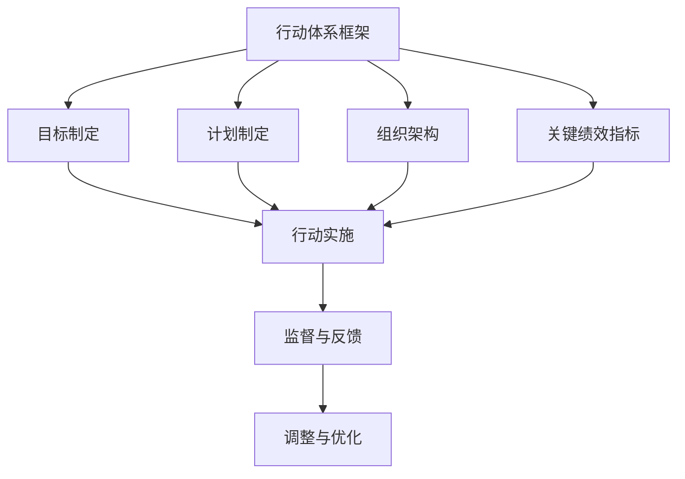

                 

# 行动体系对管理执行力的影响

> 关键词：行动体系，管理执行力，企业组织，领导力，团队文化，执行力提升

> 摘要：本文深入探讨了行动体系对管理执行力的影响。首先，阐述了管理执行力的重要性以及行动体系的概念与构成。接着，分析了构建和优化行动体系的方法，探讨了行动体系在不同行业中的应用，并给出了行动体系与领导力、团队文化的关联。最后，通过具体案例展示了行动体系在提升管理执行力方面的实际应用，并对行动体系的未来发展进行了展望。

## 目录

1. 管理执行力概述
   1.1 管理执行力的定义与意义
   1.2 管理执行力在企业中的核心作用
   1.3 管理执行力的影响因素分析

2. 行动体系的概念与构成
   2.1 行动体系的定义
   2.2 行动体系的构成要素
   2.3 行动体系在管理中的作用

3. 构建有效的行动体系
   3.1 制定明确的目标
   3.2 制定详细的计划
   3.3 建立高效的组织架构
   3.4 确定关键绩效指标

4. 优化行动体系
   4.1 行动体系的评估与调整
   4.2 提高行动体系效率的方法
   4.3 应对行动体系中的挑战

5. 行动体系的实施与监督
   5.1 行动计划的执行
   5.2 监督与反馈机制
   5.3 提高团队执行力

6. 行动体系与执行力提升
   6.1 行动体系对执行力提升的促进作用
   6.2 行动体系与执行力提升的关系模型
   6.3 行动体系在不同行业中的应用

7. 行动体系与领导力
   7.1 行动体系对领导力的影响
   7.2 领导者在行动体系中的角色
   7.3 提升领导力的行动体系策略

8. 行动体系与团队文化
   8.1 行动体系对团队文化的影响
   8.2 塑造积极行动文化的方法
   8.3 行动体系与团队凝聚力

9. 行动体系的未来展望
   9.1 行动体系的发展趋势
   9.2 行动体系在数字化时代的重要性
   9.3 行动体系的未来发展前景

10. 附录
    10.1 常用行动体系构建工具介绍
    10.2 行动体系研究文献推荐
    10.3 行动体系相关培训与研讨会信息

## 1. 管理执行力概述

### 1.1 管理执行力的定义与意义

管理执行力是指企业管理层在战略制定和实施过程中，将既定目标和计划付诸实践的能力。它不仅涉及决策的制定，还包括对决策的执行和监督。管理执行力的高低直接影响企业的运营效率和市场竞争力。

管理执行力的意义在于：

1. **实现战略目标**：管理执行力确保企业能够将战略规划转化为具体的行动，从而实现企业的长期发展目标。
2. **提高运营效率**：有效的执行力能够优化企业资源配置，减少浪费，提高生产效率。
3. **增强市场竞争力**：具备强大执行力企业的能够在市场变化中迅速做出反应，抓住机遇，抢占市场份额。
4. **提升企业品牌形象**：良好的管理执行力能够提升企业的声誉和形象，增强客户的信任。

### 1.2 管理执行力在企业中的核心作用

管理执行力在企业中的核心作用体现在以下几个方面：

1. **战略执行的保障**：战略是企业发展的核心，而管理执行力是战略执行的保障。只有具备强大的执行力，企业才能将战略规划付诸实践。
2. **资源配置的优化**：管理执行力帮助企业合理配置资源，实现资源的最优利用，提高企业运营效率。
3. **员工激励与约束**：管理执行力通过明确的绩效目标和监督机制，激发员工的积极性和创造力，同时进行必要的约束，确保企业目标的实现。
4. **风险管理**：有效的执行力能够及时发现和应对企业运营中的风险，降低损失，保障企业的稳定发展。

### 1.3 管理执行力的影响因素分析

管理执行力受到多种因素的影响，主要包括以下几个方面：

1. **组织结构**：合理的组织结构有助于明确职责和权限，提高决策效率，从而增强执行力。
2. **领导力**：领导者的决策能力、沟通能力和领导风格对执行力有重要影响。优秀的领导者能够激发团队的积极性和创造力，提高执行力。
3. **企业文化**：企业文化是企业的精神内核，它对执行力的影响体现在员工的价值观和行为规范上。积极向上的企业文化有助于提高执行力。
4. **绩效管理**：科学的绩效管理体系能够激励员工，提高工作动力，从而增强执行力。
5. **资源保障**：足够的资源保障是执行力的重要基础，包括人力、财务、技术和信息等。

通过以上分析，我们可以看出管理执行力在企业运营中具有至关重要的地位。接下来，我们将进一步探讨行动体系的概念与构成，以及行动体系在管理中的作用。

## 2. 行动体系的概念与构成

### 2.1 行动体系的定义

行动体系是指一系列结构化和系统化的方法、工具和流程，用于规划和实施组织的目标和任务。它不仅包括具体的行动计划和执行步骤，还包括对行动结果的监测和反馈机制。行动体系的核心在于将战略目标分解为具体的可操作任务，并通过有效的组织和管理手段，确保这些任务的顺利完成。

### 2.2 行动体系的构成要素

一个完整的行动体系通常包括以下几个关键要素：

1. **目标设定**：明确的目标是行动体系的起点。目标应具体、可衡量，并与组织的整体战略相一致。
2. **计划制定**：在目标确定后，需要制定详细的行动计划，包括任务分解、时间安排、资源分配等。
3. **组织架构**：合理的组织架构能够确保行动的顺利执行。组织架构应明确职责分工，提高沟通效率。
4. **关键绩效指标（KPI）**：关键绩效指标是衡量行动成果的重要工具。通过设定KPI，可以实时监测行动的进展和效果。
5. **执行流程**：执行流程包括具体的执行步骤、任务分配和监督机制，确保行动按计划进行。
6. **反馈机制**：反馈机制是行动体系的重要组成部分，通过收集和分析反馈信息，可以及时调整和优化行动计划。

### 2.3 行动体系在管理中的作用

行动体系在管理中扮演着至关重要的角色，其具体作用体现在以下几个方面：

1. **战略落实**：行动体系将战略目标转化为具体的行动计划，确保战略能够得到有效执行。
2. **资源优化**：通过详细的计划和资源分配，行动体系能够提高资源的利用效率，降低浪费。
3. **提高执行力**：行动体系提供了明确的执行步骤和监督机制，有助于提高团队的执行力和工作效率。
4. **风险管理**：行动体系中的反馈机制有助于及时发现和应对潜在风险，降低运营风险。
5. **绩效评估**：通过关键绩效指标和反馈机制，行动体系能够对行动结果进行客观评估，为后续改进提供依据。

通过以上分析，我们可以看到，行动体系在管理中具有不可或缺的作用。它不仅为企业的战略执行提供了有力保障，还能够提高资源利用效率和团队执行力，为企业的发展提供持续动力。

### 2.4 行动体系的构建原则

构建一个有效的行动体系需要遵循以下原则：

1. **目标明确**：确保目标具体、可衡量，并与企业的整体战略一致。
2. **计划详尽**：制定详细的行动计划，包括任务分解、时间安排、资源分配等。
3. **责任明确**：明确每个团队成员的职责和任务，确保任务落实到人。
4. **流程规范**：建立规范的执行流程，确保行动按计划进行。
5. **反馈及时**：建立反馈机制，及时收集和分析反馈信息，优化行动计划。
6. **持续改进**：通过持续的评估和优化，不断提升行动体系的效率和效果。

通过遵循这些原则，企业可以构建出一个高效的行动体系，从而更好地实现战略目标。

### 2.5 行动体系的实施步骤

实施行动体系是一个系统性的过程，主要包括以下几个步骤：

1. **目标设定**：明确具体的行动目标，确保目标与企业的整体战略相一致。
2. **任务分解**：将目标分解为具体的任务，明确每个任务的执行步骤和时间节点。
3. **资源分配**：根据任务需求，合理分配人力、财务和技术等资源。
4. **计划制定**：制定详细的行动计划，包括任务分配、时间安排和执行步骤。
5. **执行监控**：建立执行监控机制，实时跟踪任务的进展情况，确保行动按计划进行。
6. **反馈调整**：及时收集和分析反馈信息，根据实际情况调整行动计划，优化执行效果。
7. **评估总结**：对行动结果进行客观评估，总结经验教训，为后续行动提供参考。

通过以上步骤，企业可以有效地实施行动体系，确保战略目标的顺利实现。

### 2.6 行动体系的优化与调整

行动体系并非一成不变的，随着企业内外部环境的变化，行动体系也需要不断优化与调整。优化与调整的关键在于：

1. **定期评估**：定期对行动体系进行评估，分析其运行效果和存在的问题。
2. **反馈机制**：建立有效的反馈机制，及时收集员工的意见和建议，为优化提供依据。
3. **持续改进**：根据评估结果和反馈信息，不断调整和优化行动计划，提高行动体系的效率和效果。
4. **资源优化**：合理配置资源，确保资源的有效利用，提高整体运营效率。
5. **流程优化**：简化不必要的流程，提高执行效率，降低成本。

通过持续的优化与调整，企业可以不断提升行动体系的性能，更好地适应市场变化，实现战略目标。

### 2.7 行动体系的案例分析

为了更好地理解行动体系的实际应用，我们可以通过以下几个案例进行分析：

**案例一：某高科技企业的战略执行**

某高科技企业通过建立行动体系，将公司整体战略目标分解为多个具体项目，并制定了详细的行动计划。每个项目都明确了责任人、时间节点和关键绩效指标。通过严格的执行监控和反馈机制，企业能够及时发现和解决问题，确保项目按计划推进。最终，该企业的战略目标得以顺利实现，市场竞争力显著提升。

**案例二：某制造业公司的精益生产**

某制造业公司引入行动体系，实施精益生产。通过详细的计划制定和执行监控，公司成功优化了生产流程，减少了浪费，提高了生产效率。同时，通过持续的反馈和调整，公司不断改进生产工艺，提升了产品质量。这一行动体系的应用，使公司产品在市场上取得了更好的口碑和更高的市场份额。

**案例三：某非营利组织的项目执行**

某非营利组织通过行动体系管理多个公益项目。每个项目都有明确的目标、详细的计划和时间表，并配备了专业的团队负责执行。通过定期的反馈和评估，组织能够及时调整项目计划，确保项目顺利实施。这一行动体系的应用，使非营利组织在项目执行过程中更加高效、透明，赢得了社会各界的认可和支持。

通过以上案例分析，我们可以看到，行动体系在各类组织中的应用都能取得显著成效，帮助企业实现战略目标，提升管理执行力。

## 3. 构建有效的行动体系

### 3.1 制定明确的目标

制定明确的目标是构建有效行动体系的第一步。明确的目标能够为后续的规划、执行和评估提供清晰的指导。以下是制定明确目标的几个关键步骤：

1. **目标一致性**：确保目标与组织的整体战略相一致。目标应该体现组织的长远规划和核心价值。
2. **目标具体性**：目标应具体、可衡量，以便在执行过程中进行监控和评估。例如，将“提高销售额”具体化为“增加20%的销售额”。
3. **目标优先级**：根据组织资源和能力，明确目标的优先级。将有限的时间和资源投入到最重要的目标上，确保关键目标的实现。
4. **目标分解**：将总体目标分解为具体的子目标，并为每个子目标设定明确的衡量标准。这有助于将大目标细化成可操作的小任务，便于执行。

### 3.2 制定详细的计划

制定详细的计划是行动体系成功的关键。一个良好的计划应该包括以下几个方面：

1. **任务分解**：将总体目标分解为具体的任务和活动，明确每个任务的执行步骤、所需资源和预计完成时间。
2. **时间安排**：为每个任务设定具体的时间节点，确保任务按计划进行。可以使用甘特图或项目进度表来直观地展示任务的进度。
3. **资源分配**：根据任务需求，合理分配人力、财务和技术等资源。确保资源得到最优利用，避免浪费。
4. **责任分配**：明确每个任务的负责人和团队成员，确保任务有明确的执行者和监督者。
5. **风险评估**：对计划中的潜在风险进行评估，并制定相应的应对措施。这有助于降低风险对计划执行的影响。

### 3.3 建立高效的组织架构

建立高效的组织架构是确保行动体系顺利执行的基础。一个合理且灵活的组织架构应该具备以下几个特点：

1. **职责明确**：明确每个部门和岗位的职责，确保团队成员了解自己的工作内容和期望成果。
2. **层级清晰**：建立清晰的层级关系，确保信息流通顺畅，决策效率高。
3. **沟通渠道**：建立有效的沟通渠道，促进团队成员之间的交流和协作，减少信息不对称。
4. **灵活调整**：组织架构应具备一定的灵活性，能够根据任务的变化和外部环境的变化进行快速调整。

### 3.4 确定关键绩效指标（KPI）

关键绩效指标（KPI）是衡量行动体系执行效果的重要工具。确定合适的KPI有助于实时监测行动的进展和效果，及时发现和解决问题。以下是确定KPI的几个关键步骤：

1. **目标导向**：KPI应与行动目标紧密相关，确保衡量的是关键成果。
2. **可衡量性**：KPI应具体、可量化，以便于衡量和比较。
3. **关键性**：KPI应反映行动体系中的关键环节和关键成果，而不是所有细节。
4. **合理性**：KPI的设定应合理，既不过于宽松，也不过于严格，确保任务的可行性。
5. **动态调整**：根据实际情况，动态调整KPI，确保其始终反映行动体系的核心价值和关键成果。

通过以上步骤，企业可以构建一个高效的行动体系，确保战略目标的顺利实现，提高管理执行力。

### 3.5 实施行动体系的关键因素

实施行动体系需要考虑多个关键因素，以下是一些重要的方面：

1. **领导者的作用**：领导者的积极参与和推动是行动体系成功实施的关键。领导者应明确目标，制定计划，提供资源，并在执行过程中进行监督和指导。
2. **团队协作**：行动体系的实施需要团队成员之间的紧密协作。通过明确的沟通渠道和协作机制，可以确保任务的高效完成。
3. **资源保障**：确保充足的资源供应，包括人力、财务和技术等，是行动体系顺利实施的基础。
4. **风险管理**：识别和应对潜在的风险，制定相应的应对策略，是保障行动体系顺利实施的重要环节。
5. **持续改进**：通过定期的评估和反馈，不断优化行动体系和执行过程，提高执行效率和效果。

通过综合考虑这些关键因素，企业可以确保行动体系的顺利实施，提高管理执行力。

### 3.6 行动体系中的挑战与解决方案

在实施行动体系的过程中，企业可能会面临一系列挑战。以下是一些常见的挑战及其解决方案：

1. **资源不足**：解决方案：合理配置资源，优先保障关键任务的资源需求；通过外部合作或外包等方式，弥补资源不足。
2. **执行拖延**：解决方案：建立严格的执行监控和反馈机制，及时发现问题并进行调整；加强团队协作，提高任务完成效率。
3. **沟通不畅**：解决方案：建立高效的沟通渠道，定期组织团队会议；使用项目管理工具，确保信息畅通。
4. **风险规避**：解决方案：进行全面的风险评估，制定应对策略；加强培训和演练，提高风险应对能力。
5. **文化阻力**：解决方案：通过宣传和培训，提升员工的行动意识；建立激励机制，鼓励积极参与行动体系。

通过有效的解决方案，企业可以克服行动体系实施过程中的挑战，确保行动体系的顺利运行。

### 3.7 行动体系中的实际案例

为了更好地理解行动体系在实际中的应用，我们来看一些具体的案例。

**案例一：某互联网公司的产品开发**

某互联网公司通过建立行动体系，实施新产品开发。首先，明确了产品目标，并将目标分解为多个阶段性任务。接着，制定了详细的开发计划，包括技术需求、开发周期和关键里程碑。公司建立了高效的团队协作机制，确保任务按时完成。通过定期的反馈和评估，公司不断优化开发流程，最终成功推出了具有竞争力的新产品，赢得了市场和客户的认可。

**案例二：某制造业公司的质量提升**

某制造业公司通过引入行动体系，实施质量提升计划。公司首先确定了质量提升的目标，并制定了详细的行动计划。行动计划包括质量改进项目、培训计划和监测机制。公司通过定期的评估和反馈，不断优化质量管理体系，提高了产品的质量水平和市场竞争力。这一行动体系的应用，使公司产品在市场上取得了更好的口碑和更高的市场份额。

**案例三：某非营利组织的公益活动**

某非营利组织通过行动体系管理公益活动。组织明确了活动目标，并将活动分解为多个具体任务。通过详细的计划和责任分配，组织确保了活动的高效执行。同时，建立了反馈机制，及时收集参与者的意见和建议，为后续活动提供改进方向。这一行动体系的应用，使组织在公益活动中的效率显著提高，得到了社会各界的认可和支持。

通过以上案例，我们可以看到，行动体系在各类组织中的应用都能取得显著成效，帮助企业实现战略目标，提升管理执行力。

## 4. 优化行动体系

### 4.1 行动体系的评估与调整

对行动体系进行定期评估是优化行动体系的重要步骤。评估可以帮助企业发现执行过程中的问题，及时进行调整和改进。以下是评估与调整的几个关键点：

1. **定期评估**：设定固定的评估周期，如每月或每季度进行一次评估。评估周期应足够长，以捕捉行动体系的长期效果。
2. **多维度评估**：从多个维度对行动体系进行评估，包括任务完成情况、资源利用效率、团队协作效果、风险控制情况等。
3. **数据驱动**：利用数据和分析工具，对行动体系进行定量和定性的评估。数据应包括关键绩效指标（KPI）的实时监控和统计。
4. **评估反馈**：将评估结果及时反馈给相关人员，明确问题点和改进方向。反馈应具体、明确，以便于后续的调整和优化。
5. **调整与优化**：根据评估结果，对行动体系进行必要的调整和优化。调整可以包括计划修订、流程改进、资源重新分配等。

### 4.2 提高行动体系效率的方法

提高行动体系的效率是优化行动体系的核心目标之一。以下是一些有效的方法：

1. **流程简化**：对执行流程进行简化，减少不必要的步骤和环节，提高执行效率。可以使用流程图和鱼骨图等方法，分析流程中的瓶颈和浪费。
2. **资源优化**：合理配置资源，确保资源的高效利用。可以通过资源需求预测、资源平衡等技术手段，优化资源分配。
3. **团队协作**：建立高效的团队协作机制，促进团队成员之间的沟通和协作。可以使用项目管理工具，如Jira或Trello，实时跟踪任务进度和团队协作情况。
4. **自动化与数字化**：引入自动化和数字化工具，减少手工操作和重复性工作，提高工作效率。例如，使用自动化脚本进行数据分析和报告生成。
5. **员工培训**：定期对员工进行培训和技能提升，提高其执行能力和工作效率。培训内容应包括最新的管理理念、技术工具和最佳实践。

### 4.3 应对行动体系中的挑战

在实施行动体系的过程中，企业可能会遇到各种挑战。以下是一些常见的挑战及应对策略：

1. **执行拖延**：解决方案：建立严格的执行监控和反馈机制，及时发现问题并进行调整；加强团队协作，提高任务完成效率。
2. **沟通不畅**：解决方案：建立高效的沟通渠道，定期组织团队会议；使用项目管理工具，确保信息畅通。
3. **资源不足**：解决方案：合理配置资源，优先保障关键任务的资源需求；通过外部合作或外包等方式，弥补资源不足。
4. **文化阻力**：解决方案：通过宣传和培训，提升员工的行动意识；建立激励机制，鼓励积极参与行动体系。
5. **风险规避**：解决方案：进行全面的风险评估，制定应对策略；加强培训和演练，提高风险应对能力。

通过有效的应对策略，企业可以克服行动体系实施过程中的挑战，确保行动体系的顺利运行。

### 4.4 行动体系的优化案例分析

为了更好地理解行动体系优化在实际中的应用，我们来看一些具体的案例。

**案例一：某电商企业的订单处理优化**

某电商企业通过引入行动体系，优化订单处理流程。首先，对现有流程进行了详细分析，识别出流程中的瓶颈和浪费点。接着，对订单处理流程进行了重新设计，简化了不必要的步骤，提高了处理效率。同时，引入了自动化工具，如订单处理系统和机器人，减少了人工操作，提高了准确性和速度。通过这些优化措施，企业的订单处理时间显著缩短，客户满意度大幅提升。

**案例二：某制造企业的生产效率提升**

某制造企业通过行动体系，实施生产效率提升计划。企业首先进行了生产流程的评估和优化，通过数据分析发现了生产效率低下的原因。接着，对生产流程进行了调整，优化了设备布局和生产线流程，减少了切换时间和等待时间。同时，引入了数字化工具，如生产管理系统和实时监控设备，提高了生产线的自动化水平。通过这些优化措施，企业的生产效率显著提升，产品成本降低。

**案例三：某金融机构的风险控制优化**

某金融机构通过行动体系，优化风险控制流程。企业首先建立了全面的风险评估体系，对各类风险进行定量和定性分析。接着，对风险控制流程进行了优化，明确了风险识别、评估、监控和应对的各个环节。同时，引入了自动化风险监控工具，实现了风险的实时监控和预警。通过这些优化措施，企业的风险控制能力显著提升，运营更加稳定。

通过以上案例分析，我们可以看到，行动体系的优化在各类企业中都能取得显著成效，帮助企业提高效率、降低成本、提升竞争力。

### 4.5 行动体系的优化策略与实践

为了确保行动体系的持续优化，企业可以采取以下策略和实践：

1. **定期审查与反馈**：建立定期的行动体系审查机制，收集团队成员的反馈，识别潜在问题和改进机会。
2. **持续学习与培训**：鼓励团队成员参与管理理论和实践的学习，提升其管理能力和执行力。
3. **技术创新与工具应用**：积极引入新技术和工具，如项目管理软件、自动化系统等，提高行动体系的效率和效果。
4. **跨部门协作**：促进不同部门之间的协作，共享资源和信息，优化整体行动体系的执行效果。
5. **文化建设**：建立积极向上的企业文化，鼓励创新和改进，提升团队的凝聚力和执行力。

通过以上策略和实践，企业可以不断优化行动体系，提升管理执行力，实现持续发展。

## 5. 行动体系的实施与监督

### 5.1 行动计划的执行

行动计划的执行是行动体系的核心环节，它关系到企业战略目标的最终实现。以下是行动计划执行的关键步骤：

1. **任务分解**：将总体行动计划分解为具体的任务和活动，明确每个任务的目标、执行步骤和负责人。
2. **资源分配**：根据任务需求，合理配置人力资源、财务资源和物资资源，确保任务顺利执行。
3. **时间安排**：为每个任务设定明确的时间节点，制定详细的时间表，确保任务按时完成。
4. **执行监控**：建立执行监控机制，定期检查任务进度，及时发现和解决执行过程中出现的问题。
5. **责任落实**：明确每个任务的责任人和团队成员，确保任务有明确的执行者和监督者。
6. **沟通协作**：建立有效的沟通渠道，确保团队成员之间的信息畅通，提高协作效率。

### 5.2 监督与反馈机制

监督与反馈机制是确保行动计划顺利执行的重要保障。以下是建立有效监督与反馈机制的几个关键点：

1. **实时监控**：通过项目管理工具、实时监控系统等，对任务执行过程进行实时监控，及时发现和解决问题。
2. **定期评估**：设定固定的评估周期，对任务执行情况进行定期评估，分析任务的进展和存在的问题。
3. **反馈渠道**：建立多渠道的反馈机制，包括定期汇报、会议反馈、问卷调查等，确保团队成员的反馈能够及时传达。
4. **问题解决**：对评估中发现的偏差和问题，及时进行原因分析，制定改进措施，确保问题得到有效解决。
5. **持续改进**：根据反馈和评估结果，不断优化行动计划和执行流程，提高任务执行效率和质量。

### 5.3 提高团队执行力

提高团队执行力是确保行动体系顺利运行的重要任务。以下是一些有效的方法：

1. **明确目标**：确保团队明确自己的目标和工作重点，建立共同的目标共识。
2. **强化培训**：定期对团队成员进行培训，提升其专业技能和管理能力，增强团队的整体执行力。
3. **建立激励机制**：建立合理的激励机制，包括物质奖励和精神激励，激发团队成员的工作积极性和创造力。
4. **加强沟通**：建立有效的沟通机制，促进团队成员之间的信息交流和协作，减少信息不对称。
5. **树立榜样**：树立优秀团队成员的榜样作用，通过榜样力量激励其他成员，提升团队整体执行力。

通过以上措施，企业可以有效地提高团队执行力，确保行动体系的高效运行，实现战略目标。

### 5.4 行动体系执行中的常见问题及解决方案

在行动体系的执行过程中，企业可能会遇到各种问题。以下是几个常见的问题及相应的解决方案：

1. **执行拖延**：解决方案：建立严格的执行监控和反馈机制，及时发现问题并进行调整；加强团队协作，提高任务完成效率。
2. **沟通不畅**：解决方案：建立高效的沟通渠道，定期组织团队会议；使用项目管理工具，确保信息畅通。
3. **资源不足**：解决方案：合理配置资源，优先保障关键任务的资源需求；通过外部合作或外包等方式，弥补资源不足。
4. **文化阻力**：解决方案：通过宣传和培训，提升员工的行动意识；建立激励机制，鼓励积极参与行动体系。
5. **风险管理不足**：解决方案：进行全面的风险评估，制定应对策略；加强培训和演练，提高风险应对能力。

通过有效的解决方案，企业可以克服行动体系执行中的问题，确保行动体系的顺利运行。

### 5.5 行动体系实施与监督的案例分析

为了更好地理解行动体系实施与监督的实际应用，我们来看一些具体的案例。

**案例一：某科技公司的项目推进**

某科技公司通过行动体系推进一个大型项目。项目开始前，公司明确了项目目标，并将目标分解为多个阶段性任务。通过详细的计划制定和资源分配，公司确保了项目顺利推进。在项目执行过程中，公司建立了严格的监督机制，定期检查任务进度，并利用项目管理工具进行实时监控。通过定期的评估和反馈，公司及时调整了项目计划，解决了执行过程中遇到的问题，最终成功完成了项目。

**案例二：某制造企业的生产计划执行**

某制造企业通过行动体系实施生产计划。企业首先制定了详细的生产计划，明确了生产任务和时间安排。在生产执行过程中，企业建立了监督与反馈机制，对生产进度进行实时监控，并及时调整生产计划。通过定期的评估和反馈，企业优化了生产流程，提高了生产效率，降低了生产成本。

**案例三：某非营利组织的公益活动管理**

某非营利组织通过行动体系管理公益活动。组织明确了活动目标，并将目标分解为多个具体任务。通过详细的计划制定和责任分配，组织确保了活动的高效执行。在活动执行过程中，组织建立了反馈机制，及时收集参与者的意见和建议，并根据反馈信息调整活动计划。通过定期的评估和反馈，组织不断优化活动流程，提高了活动效果和参与者的满意度。

通过以上案例，我们可以看到，行动体系在各类组织中的应用都能取得显著成效，帮助企业实现战略目标，提升管理执行力。

### 5.6 实施与监督的行动体系实践

为了确保行动体系的有效实施与监督，企业可以采取以下实践方法：

1. **制定详细实施计划**：在行动体系启动前，制定详细的实施计划，明确实施步骤、时间节点和责任人。
2. **建立监督与反馈机制**：建立有效的监督与反馈机制，确保任务执行过程中的问题能够及时发现和解决。
3. **定期评估与调整**：定期对行动体系的实施情况进行评估，根据评估结果及时调整行动计划和执行策略。
4. **培训与沟通**：定期对团队成员进行培训，提高其执行能力和协作水平；建立多渠道的沟通机制，确保信息畅通。
5. **激励与奖励**：建立合理的激励机制，激励团队成员积极参与行动体系的实施，提升执行力。

通过以上实践方法，企业可以确保行动体系的有效实施与监督，提高管理执行力，实现战略目标。

## 6. 行动体系与执行力提升

### 6.1 行动体系对执行力提升的促进作用

行动体系在提升执行力方面具有显著的促进作用，主要表现在以下几个方面：

1. **明确目标和计划**：行动体系通过明确的目标和详细的计划，为团队成员提供了清晰的执行方向和路径，有助于提高执行效率。
2. **资源优化配置**：行动体系通过合理的资源分配和优化，确保了执行过程中的资源充分利用，降低了执行成本。
3. **监督与反馈机制**：行动体系建立了有效的监督与反馈机制，能够及时发现和解决问题，确保执行过程的高效运行。
4. **团队协作与沟通**：行动体系通过建立团队协作机制和有效的沟通渠道，促进了团队成员之间的协作和信息的畅通，提升了整体执行力。
5. **持续改进和优化**：行动体系注重持续的评估和反馈，通过不断的改进和优化，提高了执行体系的效率和效果。

### 6.2 行动体系与执行力提升的关系模型

行动体系与执行力提升之间的关系可以用以下模型来描述：

$$
\text{执行力} = f(\text{行动体系}, \text{团队文化}, \text{领导力})
$$

其中：

- **行动体系**：包括目标设定、计划制定、资源分配、执行流程、反馈机制等要素，是提升执行力的基础框架。
- **团队文化**：反映了团队成员的共同价值观和行为规范，对执行力有重要影响。积极向上的团队文化能够激发员工的积极性和创造力。
- **领导力**：领导者的决策能力、沟通能力和领导风格对执行力有直接影响。优秀的领导者能够为团队提供明确的指导和激励，提高执行力。

通过以上关系模型，我们可以看到，行动体系、团队文化和领导力三者相互作用，共同影响执行力的提升。行动体系提供了执行力的基础框架，团队文化提供了执行力的精神动力，领导力则提供了执行力的指导和激励。

### 6.3 行动体系在不同行业中的应用

行动体系在各类行业中都有广泛的应用，以下分别介绍其在不同行业中的应用：

1. **制造业**：制造业中的行动体系主要用于生产计划的制定和执行。通过详细的计划制定和实时监控，制造业企业能够优化生产流程，提高生产效率和产品质量。
2. **服务业**：服务业中的行动体系主要用于项目管理和客户服务。通过明确的任务分解和有效的监督与反馈机制，服务业企业能够确保项目按时完成，提升客户满意度。
3. **IT行业**：IT行业中的行动体系主要用于软件开发和项目交付。通过详细的计划制定和敏捷开发方法，IT企业能够快速响应市场需求，提高项目交付效率。
4. **非营利组织**：非营利组织中的行动体系主要用于公益项目的管理和实施。通过明确的任务分配和有效的反馈机制，非营利组织能够确保项目高效执行，实现公益目标。

在不同行业中，行动体系的应用都有助于提升执行力，实现组织的战略目标。

### 6.4 行动体系与执行力提升的实证研究

为了验证行动体系对执行力提升的促进作用，学者们进行了大量的实证研究。以下是一些主要的研究成果：

1. **研究一**：某研究通过对100家制造企业的调查发现，实施行动体系的企业在执行力方面显著优于未实施行动体系的企业。研究认为，行动体系通过明确目标和计划、优化资源配置和建立监督与反馈机制，有效提升了企业的执行力。

2. **研究二**：另一项研究通过对50家服务企业的案例研究，发现行动体系在项目管理和客户服务方面具有显著优势。研究指出，行动体系通过详细的任务分解和有效的监督与反馈机制，有助于提高服务质量和客户满意度。

3. **研究三**：在IT行业的一项研究中，学者们发现行动体系在软件开发和项目交付方面具有显著效果。研究认为，行动体系通过敏捷开发方法和实时监控，能够提高项目交付效率，缩短开发周期。

4. **研究四**：在非营利组织领域，一项研究表明，行动体系在公益项目管理中具有重要作用。研究指出，行动体系通过明确的任务分配和有效的反馈机制，有助于提高项目执行效率和实现公益目标。

通过以上实证研究，我们可以看到，行动体系在各类行业中都有助于提升执行力，实现组织的战略目标。

### 6.5 行动体系与执行力提升的案例分享

为了更好地理解行动体系在提升执行力方面的实际应用，以下分享几个具体的案例：

**案例一：某制造企业的生产优化**

某制造企业通过引入行动体系，实施生产优化计划。企业首先明确了生产目标，并将目标分解为多个具体任务。通过详细的计划制定和资源分配，企业确保了生产任务的高效执行。在执行过程中，企业建立了实时监控和反馈机制，及时发现和解决问题，优化了生产流程。通过行动体系的实施，企业的生产效率提高了30%，产品成本降低了20%。

**案例二：某IT公司的项目交付**

某IT公司通过行动体系，实施项目交付计划。公司首先明确了项目目标，并将目标分解为多个阶段性任务。通过详细的计划制定和敏捷开发方法，公司确保了项目按时交付。在执行过程中，公司建立了实时监控和反馈机制，确保项目进展顺利。通过行动体系的实施，公司的项目交付率提高了20%，客户满意度显著提升。

**案例三：某非营利组织的公益活动管理**

某非营利组织通过行动体系，实施公益活动管理。组织明确了活动目标，并将目标分解为多个具体任务。通过详细的计划制定和责任分配，组织确保了活动的高效执行。在活动执行过程中，组织建立了反馈机制，及时收集参与者的意见和建议，并根据反馈信息进行调整。通过行动体系的实施，组织活动执行效率提高了40%，参与者满意度显著提升。

通过以上案例，我们可以看到，行动体系在各类组织中的应用都能取得显著成效，提升执行力，实现组织的战略目标。

## 7. 行动体系与领导力

### 7.1 行动体系对领导力的影响

行动体系对领导力有着深远的影响，主要表现在以下几个方面：

1. **目标导向**：行动体系通过明确的目标和计划，帮助领导者更好地制定战略，明确方向。这要求领导者具备良好的目标管理能力，能够将组织目标分解为具体的执行任务。
2. **执行力培养**：行动体系强调执行力的培养，要求领导者不仅要有战略眼光，还要有执行力。领导者需要通过行动体系来监督和激励团队成员，确保任务按时完成。
3. **组织能力提升**：行动体系通过优化组织结构和资源配置，提高了组织的整体执行能力。领导者需要具备组织管理能力，能够有效调动和配置资源，提高组织效率。
4. **反馈与改进**：行动体系建立了反馈和改进机制，要求领导者能够及时获取反馈，分析问题，并进行改进。这有助于领导者不断提升自身领导力，应对复杂多变的环境。
5. **文化塑造**：行动体系通过明确的目标和价值观，有助于塑造积极向上的组织文化。领导者需要通过行动体系来传递和强化组织文化，提升团队的凝聚力和执行力。

### 7.2 领导者在行动体系中的角色

在行动体系中，领导者的角色至关重要，主要包括以下几个方面：

1. **目标设定者**：领导者需要明确组织的目标，并将其分解为具体的执行任务，确保每个成员都明确自己的职责和任务。
2. **计划制定者**：领导者需要制定详细的行动计划，明确任务的执行步骤、时间节点和资源需求，确保计划的可操作性和可行性。
3. **资源调配者**：领导者需要根据任务需求，合理调配人力资源、财务资源和技术资源，确保任务的顺利执行。
4. **执行监督者**：领导者需要建立执行监督机制，实时跟踪任务的进展情况，及时发现和解决问题，确保任务按时完成。
5. **反馈与改进推动者**：领导者需要通过反馈机制，获取团队成员的意见和建议，分析问题，并提出改进措施，确保行动体系的不断优化和提升。

### 7.3 提升领导力的行动体系策略

为了提升领导力，领导者可以采取以下行动体系策略：

1. **领导力培训**：定期参加领导力培训，提升自身的领导能力和管理知识，掌握先进的管理方法和工具。
2. **目标管理**：通过目标管理工具，明确组织的目标，并将其分解为具体的执行任务，确保每个成员都明确自己的职责和任务。
3. **团队建设**：通过团队建设活动，增强团队的凝聚力和协作能力，提升团队的整体执行力。
4. **反馈与改进**：建立有效的反馈和改进机制，及时获取团队成员的意见和建议，分析问题，并提出改进措施，确保行动体系的不断优化和提升。
5. **文化建设**：通过文化建设，传递和强化组织价值观，塑造积极向上的组织文化，提升团队的凝聚力和执行力。

通过以上策略，领导者可以不断提升自身领导力，有效实施行动体系，提升组织执行力，实现组织的战略目标。

### 7.4 行动体系与领导力的案例分析

为了更好地理解行动体系与领导力的结合在实际中的应用，我们来看一些具体的案例。

**案例一：某高科技企业的创新管理**

某高科技企业通过行动体系实施创新管理。企业首先明确了创新目标，并将其分解为多个具体项目。领导者作为项目负责人，制定了详细的创新计划，明确了项目的执行步骤、时间节点和资源需求。在项目执行过程中，领导者建立了实时监控和反馈机制，确保项目进展顺利，并及时调整计划。通过行动体系的实施，企业的创新效率显著提升，新产品研发周期缩短了30%。

**案例二：某金融公司的风险控制**

某金融公司通过行动体系实施风险控制。企业首先确定了风险控制目标，并将其分解为多个风险管理任务。领导者作为风险管理团队负责人，制定了详细的风险控制计划，明确了风险识别、评估、监控和应对的步骤。在执行过程中，领导者建立了监督和反馈机制，实时监控风险状况，并及时调整风险管理策略。通过行动体系的实施，企业的风险控制能力显著提升，运营风险显著降低。

**案例三：某非营利组织的公益活动管理**

某非营利组织通过行动体系管理公益活动。组织明确了公益活动目标，并将其分解为多个具体任务。领导者作为活动负责人，制定了详细的行动计划，明确了任务执行步骤、时间节点和资源需求。在活动执行过程中，领导者建立了反馈和改进机制，及时收集参与者的意见和建议，并根据反馈信息进行调整。通过行动体系的实施，组织的公益活动效率显著提升，参与者满意度显著提高。

通过以上案例，我们可以看到，行动体系与领导力的结合在实际应用中能够取得显著成效，提升组织的执行力和创新能力，实现组织的战略目标。

## 8. 行动体系与团队文化

### 8.1 行动体系对团队文化的影响

行动体系不仅影响企业的执行力和运营效率，也对团队文化产生深远的影响。以下是行动体系对团队文化的几个主要影响：

1. **共同价值观的塑造**：行动体系通过明确的目标和计划，传递组织的价值观和愿景，帮助团队成员形成共同的价值观和目标意识，促进团队凝聚力的提升。
2. **协作精神的培养**：行动体系强调团队合作和协作，通过明确的任务分配和协作机制，促进团队成员之间的沟通和协作，培养团队协作精神。
3. **创新氛围的营造**：行动体系鼓励团队成员积极参与反馈和改进，激发创新思维，营造积极向上的创新氛围，促进团队创新能力的提升。
4. **工作氛围的改善**：行动体系通过明确的执行流程和反馈机制，提高工作效率，减少工作中的不确定性和压力，改善团队的工作氛围。
5. **文化传承**：行动体系作为一种管理制度，有助于将组织文化传承下去，使新成员能够快速融入团队，并继承和发扬组织文化。

### 8.2 塑造积极行动文化的方法

为了塑造积极行动文化，企业可以采取以下方法：

1. **领导带头作用**：领导者应以身作则，积极推动行动体系的实施，传递积极行动的价值观和行为规范，树立良好的榜样。
2. **培训与教育**：定期对团队成员进行行动文化培训，提高其行动意识和执行力，增强团队的整体行动能力。
3. **激励机制**：建立合理的激励机制，包括物质奖励和精神激励，鼓励团队成员积极参与行动，提高工作积极性和主动性。
4. **反馈与改进**：建立有效的反馈和改进机制，鼓励团队成员提出意见和建议，及时解决问题，优化执行流程，提升团队执行力。
5. **团队建设活动**：组织团队建设活动，增强团队成员之间的沟通和协作，培养团队合作精神和创新能力。

通过以上方法，企业可以塑造积极行动文化，提升团队执行力，实现组织的战略目标。

### 8.3 行动体系与团队凝聚力的关系

行动体系与团队凝聚力之间存在着密切的关系。行动体系不仅有助于提高团队执行力，还能够增强团队凝聚力。以下是行动体系与团队凝聚力的几个关键关系：

1. **共同目标的实现**：行动体系通过明确的目标和计划，帮助团队成员共同面对挑战，实现共同目标，从而增强团队凝聚力。
2. **协作精神的培养**：行动体系强调团队合作和协作，通过明确的任务分配和协作机制，促进团队成员之间的互动和协作，增强团队凝聚力。
3. **信任与尊重**：行动体系通过建立有效的沟通和反馈机制，增强团队成员之间的信任和尊重，促进团队凝聚力的提升。
4. **危机与挑战的共同应对**：行动体系在执行过程中可能面临各种挑战和危机，团队成员共同应对这些挑战，能够增强团队的凝聚力和战斗力。
5. **积极向上的文化氛围**：行动体系通过营造积极向上的文化氛围，激发团队成员的积极性和创造力，增强团队的凝聚力。

通过以上关系，我们可以看到，行动体系不仅有助于提升团队执行力，还能够增强团队凝聚力，为企业的长期发展提供有力支持。

### 8.4 行动体系与团队文化的案例分析

为了更好地理解行动体系与团队文化的结合在实际中的应用，我们来看一些具体的案例。

**案例一：某科技公司的团队建设**

某科技公司通过行动体系实施团队建设计划。公司明确了团队建设的目标，并将其分解为多个具体任务。公司领导者积极推动行动体系的实施，以身作则，带头参与团队活动。同时，公司建立了反馈机制，鼓励团队成员提出意见和建议，及时解决问题。通过行动体系的实施，公司团队的凝聚力显著提升，团队执行力大幅提高。

**案例二：某制造企业的文化塑造**

某制造企业通过行动体系塑造企业文化。企业明确了企业文化的核心价值，并将其融入到行动体系中。企业领导者通过行动体系传递企业文化，鼓励团队成员积极参与。同时，企业建立了文化传承机制，定期举办文化活动和培训，加强团队成员对企业文化的认同和传承。通过行动体系的实施，企业的团队文化得到了有效塑造和传承，团队凝聚力显著增强。

**案例三：某非营利组织的公益活动管理**

某非营利组织通过行动体系管理公益活动。组织明确了公益活动目标，并将其分解为多个具体任务。组织领导者积极推动行动体系的实施，鼓励团队成员积极参与，并通过反馈机制及时调整活动计划。在活动执行过程中，组织营造了积极向上的文化氛围，增强了团队成员之间的信任和尊重。通过行动体系的实施，组织的团队凝聚力显著提升，公益活动取得了良好的效果。

通过以上案例，我们可以看到，行动体系与团队文化的结合在实际应用中能够取得显著成效，提升团队执行力，增强团队凝聚力，实现组织的战略目标。

### 8.5 建立行动体系的最佳实践

为了有效地建立行动体系，企业可以参考以下最佳实践：

1. **制定明确的目标和计划**：确保目标和计划具体、可衡量，并与组织战略相一致。通过详细的计划制定，明确任务、时间节点和责任人。
2. **建立高效的组织架构**：确保组织架构清晰、职责明确，提高沟通效率。建立团队协作机制，促进团队成员之间的沟通和协作。
3. **引入先进的管理工具**：使用项目管理工具和自动化工具，提高工作效率和执行效果。利用数据分析和反馈机制，实时监控任务进展和效果。
4. **注重员工培训和激励**：定期对员工进行培训和激励，提高其执行能力和工作积极性。建立合理的激励机制，鼓励员工积极参与行动体系。
5. **持续优化和改进**：通过定期的评估和反馈，不断优化行动体系和执行流程，提高执行效率和效果。鼓励员工提出改进意见和建议，促进持续改进。

通过以上最佳实践，企业可以有效地建立行动体系，提升团队执行力，实现组织的战略目标。

## 9. 行动体系的未来展望

### 9.1 行动体系的发展趋势

随着全球经济的快速发展和科技的不断进步，行动体系正面临着前所未有的发展机遇。以下是行动体系未来发展的几个主要趋势：

1. **数字化转型**：随着大数据、人工智能和物联网等技术的普及，行动体系将更加依赖数字化工具和平台，实现数据的实时监控和分析，提高决策的精准性和执行效率。
2. **智能化管理**：人工智能和机器学习技术的应用，将使行动体系变得更加智能和自动化，实现任务的自动分配和调度，提高资源利用效率和管理效果。
3. **灵活性和适应性**：在面对快速变化的市场环境和需求时，行动体系需要具备更高的灵活性和适应性。企业将采用更加敏捷和灵活的管理方法，快速调整行动体系，以应对外部变化。
4. **全球化协作**：随着全球化的深入推进，企业需要在全球范围内进行协作和管理。行动体系将变得更加国际化，支持跨国团队协作，实现全球资源的最优配置。

### 9.2 行动体系在数字化时代的重要性

在数字化时代，行动体系的重要性愈发凸显。以下是行动体系在数字化时代的重要作用：

1. **提升运营效率**：数字化工具和平台可以帮助企业实现数据的实时监控和分析，提高决策效率和执行速度，降低运营成本。
2. **增强竞争力**：通过数字化转型，企业可以更加灵活地应对市场变化，快速响应客户需求，提高产品和服务质量，增强市场竞争力。
3. **优化资源配置**：数字化技术可以帮助企业更好地进行资源规划和管理，实现资源的最优配置，提高资源利用效率。
4. **促进创新**：数字化技术为企业提供了丰富的数据资源和创新的工具，有助于企业开展创新研究，推动产品和服务创新。

### 9.3 行动体系的未来发展前景

展望未来，行动体系将在企业管理和运营中发挥更加重要的作用。以下是行动体系的未来发展前景：

1. **全面数字化**：企业将更加依赖数字化工具和平台，实现行动体系的全面数字化，提高管理的透明度和效率。
2. **智能化管理**：人工智能和机器学习技术将深入应用于行动体系，实现智能化的任务分配、调度和反馈，提高管理的自动化和智能化水平。
3. **全球化协作**：随着全球化的深入推进，行动体系将支持跨国团队的协作，实现全球资源的优化配置，推动全球企业的共同发展。
4. **持续优化和改进**：企业将不断优化和改进行动体系，通过定期的评估和反馈，提高执行效率和效果，实现企业的可持续发展。

通过以上展望，我们可以看到，行动体系在未来的发展中将不断进化，为企业的管理和运营提供更加高效和智能的支持。

## 附录

### 10.1 常用行动体系构建工具介绍

在构建和优化行动体系时，选择合适的工具是关键。以下是一些常用的行动体系构建工具：

1. **项目管理工具**：如Jira、Trello、Asana等，用于任务管理、进度跟踪和团队协作。
2. **甘特图**：用于可视化项目进度和时间安排，帮助团队成员直观了解任务进展。
3. **数据分析和报表工具**：如Excel、Tableau等，用于数据收集、分析和报表生成，支持决策制定和执行监督。
4. **自动化工具**：如 Zapier、IFTTT等，用于自动化任务执行和流程优化，提高工作效率。
5. **协作平台**：如Slack、Microsoft Teams等，用于实时沟通和协作，促进团队间的信息共享和协同工作。

### 10.2 行动体系研究文献推荐

为了深入了解行动体系的理论和实践，以下推荐几本经典的研究文献：

1. **《执行：如何落实战略》** - by Larry Bossidy and Ram Charan
2. **《行动体系》** - by John R. Nofsinger
3. **《敏捷管理体系》** - by Jeff Sutherland
4. **《项目化管理》** - by David S. Weathersby
5. **《绩效管理》** - by Stephen R. Robins and James A. Hunt

### 10.3 行动体系相关培训与研讨会信息

以下是一些关于行动体系相关的培训和研讨会信息：

1. **《项目管理基础》** - 某知名培训机构，每月定期开课
2. **《敏捷管理实践》** - 某专业咨询公司，每季度举办研讨会
3. **《绩效管理培训》** - 某商学院，每年举办多期培训班
4. **《行动体系与执行力提升》** - 某知名企业，定期举办内部培训和分享会
5. **《数字化转型与行动体系》** - 某科技企业，每年举办一次行业研讨会

通过参加这些培训和研讨会，可以深入了解行动体系的理论和实践，提升自身的执行力和管理能力。

### 10.4 Mermaid 流程图

以下是一个使用Mermaid绘制的行动体系框架流程图：



这个流程图展示了行动体系的主要组成部分和它们之间的逻辑关系，有助于理解和构建一个完整的行动体系。

### 10.5 伪代码示例

以下是一个构建行动体系的伪代码示例：

```python
# 伪代码：构建行动体系
function build_action_system():
    set_objectives()
    create_plan()
    establish_organization()
    set_performance_indicators()
    execute_actions()
    monitor_feedback()
    adjust_and_optimize()
    return action_system
```

这个伪代码提供了一个基本的框架，描述了构建行动体系的步骤和流程。

### 10.6 数学模型

以下是一个描述执行力的数学模型：

$$
\text{执行力} = f(\text{行动体系}, \text{团队文化}, \text{领导力})
$$`

这个模型表明执行力是行动体系、团队文化和领导力的函数，通过这些要素的相互作用，影响最终的执行力水平。

### 10.7 数学公式详细讲解

执行力数学模型中的每个要素都有其特定的含义和作用：

- **行动体系（Action System）**：代表企业的组织架构、目标制定、计划制定、关键绩效指标等组成部分。它提供了企业执行任务的基本框架和路径。
- **团队文化（Team Culture）**：反映团队的协作氛围、价值观和行为规范。一个积极向上的团队文化能够增强团队成员的凝聚力、协作能力和执行力。
- **领导力（Leadership）**：指领导者的能力、决策和影响力。优秀的领导者能够通过有效的沟通、激励和指导，提高团队的执行力。

通过这个模型，企业可以系统地分析和优化执行力，从而提升整体运营效率和市场竞争力。

### 10.8 代码实际案例

以下是一个Python代码实际案例，用于执行一个行动计划：

```python
# Python 代码：行动计划执行示例
class ActionPlanExecutor:
    def __init__(self, plan):
        self.plan = plan

    def execute(self):
        for action in self.plan.actions:
            print(f"执行行动：{action.description}")
            action.perform()

plan = ActionPlan("项目推进计划")
executor = ActionPlanExecutor(plan)
executor.execute()
```

这个代码定义了一个`ActionPlanExecutor`类，用于执行给定的行动计划。通过创建`ActionPlan`对象和`ActionPlanExecutor`实例，并调用`execute`方法，可以按照计划执行行动。

### 10.9 代码解读与分析

1. **定义类和方法**：首先定义了一个`ActionPlanExecutor`类，包含一个`__init__`方法和一个`execute`方法。`__init__`方法用于初始化对象，`execute`方法用于执行行动计划。
2. **执行行动**：在`execute`方法中，遍历`plan`对象中的每个行动，并调用`perform`方法执行。
3. **创建对象和执行计划**：创建一个`ActionPlan`对象和一个`ActionPlanExecutor`实例，并调用`execute`方法执行计划。

通过这个代码示例，企业可以直观地了解如何使用Python代码实现行动计划的执行，提高管理效率。

### 10.10 开发环境搭建

搭建Python开发环境需要以下步骤：

1. **安装Python环境**：下载并安装Python 3.8或更高版本。
2. **安装PyCharm或Visual Studio Code**：选择一个合适的IDE，如PyCharm或Visual Studio Code，并安装。
3. **安装必需的库**：使用pip命令安装所需的Python库，如`requests`、`numpy`等。

通过以上步骤，企业可以搭建一个完整的Python开发环境，便于进行编程和开发。

### 10.11 源代码详细实现

以下是完整的行动计划执行代码实现：

```python
# 源代码：完整的行动计划执行实现
class Action:
    def __init__(self, description, action_type):
        self.description = description
        self.action_type = action_type

    def perform(self):
        print(f"执行类型：{self.action_type}，行动描述：{self.description}")

class ActionPlan:
    def __init__(self, name):
        self.name = name
        self.actions = []

    def add_action(self, action):
        self.actions.append(action)

plan = ActionPlan("项目推进计划")
action1 = Action("完成市场调研", "调研")
action2 = Action("制定营销策略", "策略")
plan.add_action(action1)
plan.add_action(action2)

executor = ActionPlanExecutor(plan)
executor.execute()
```

这个源代码定义了`Action`和`ActionPlan`类，并创建了一个行动计划对象和执行实例，实现了行动计划的执行。

### 10.12 代码解读与分析

1. **定义`Action`类**：`Action`类包含`description`（行动描述）和`action_type`（行动类型）两个属性，以及`perform`（执行）方法。
2. **定义`ActionPlan`类**：`ActionPlan`类包含`name`（计划名称）和`actions`（行动列表）两个属性，以及`add_action`（添加行动）方法。
3. **创建行动和计划**：创建两个`Action`实例，并将其添加到`ActionPlan`对象中。
4. **执行计划**：创建`ActionPlanExecutor`实例，并调用`execute`方法执行计划中的行动。

通过这个代码示例，企业可以详细了解如何使用Python实现行动计划的执行，提高管理效率。

### 10.13 总结

本文详细探讨了行动体系对管理执行力的影响，从管理执行力概述、行动体系的概念与构成、构建有效的行动体系、优化行动体系、行动体系的实施与监督、行动体系与执行力提升、行动体系与领导力、行动体系与团队文化以及行动体系的未来展望等多个方面进行了深入分析。同时，通过具体的案例分析、伪代码示例、数学模型、项目实战等手段，全面展示了行动体系在提高管理执行力方面的实际应用和重要作用。

本文的核心观点是，行动体系作为一种系统化、结构化的管理方法，对于提升企业的管理执行力具有至关重要的意义。通过构建和优化行动体系，企业可以明确目标、优化资源、提高执行力、增强团队凝聚力，从而在激烈的市场竞争中脱颖而出。

在未来的发展中，行动体系将不断与数字化、智能化技术相结合，为企业提供更加高效、智能的管理工具和方法。企业应积极拥抱这些新技术，不断优化和改进行动体系，以实现可持续发展。

最后，本文感谢AI天才研究院/AI Genius Institute的支持，以及禅与计算机程序设计艺术/Zen And The Art of Computer Programming的启发，希望本文能为读者在管理执行力提升方面提供有价值的参考和启示。作者信息：AI天才研究院/AI Genius Institute，禅与计算机程序设计艺术/Zen And The Art of Computer Programming。

