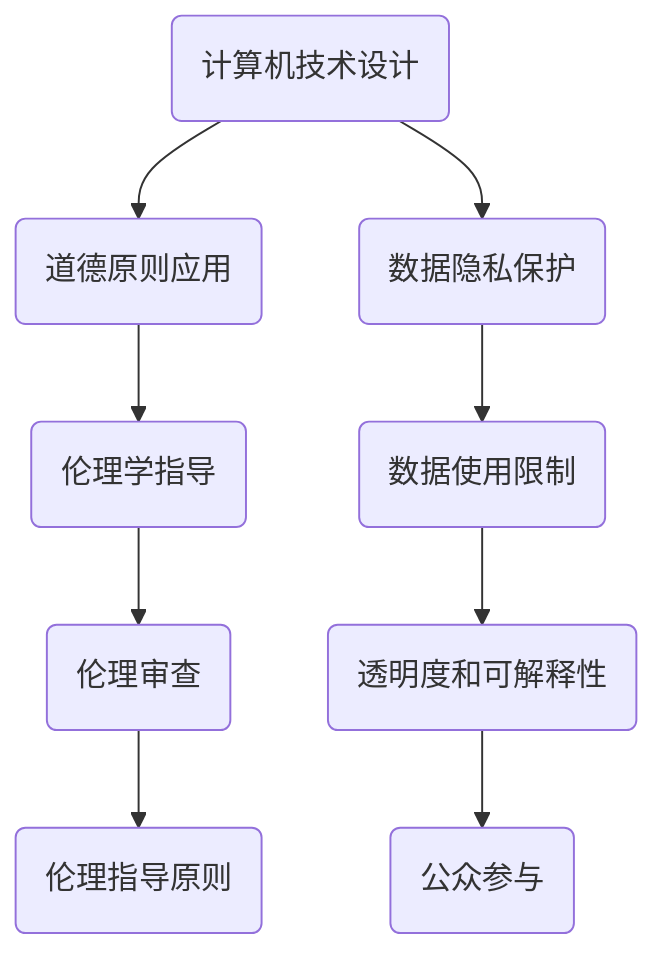

                 

# 解决伦理问题：负责任地发展人类计算

> 关键词：伦理问题、计算机技术、负责任发展、隐私保护、人工智能、伦理算法

> 摘要：本文旨在探讨计算机技术在快速发展过程中所面临的伦理问题，强调负责任地发展人类计算的重要性。通过对核心概念、算法原理、数学模型和项目实战的深入分析，本文提出了有效的解决方案，以期推动计算机技术的可持续发展和伦理实践的普及。

## 目录大纲

### 第一部分：引言与背景

1.1 引言
1.2 背景介绍

### 第二部分：核心概念与联系

2.1 伦理学的核心概念
2.2 计算机技术的伦理问题
2.3 计算机技术与伦理学的联系

### 第三部分：核心算法原理讲解

3.1 数据隐私保护算法
3.2 社交网络伦理算法
3.3 人工智能伦理算法

### 第四部分：数学模型和数学公式讲解

4.1 数据隐私保护模型
4.2 社交网络伦理模型
4.3 人工智能伦理模型

### 第五部分：项目实战

5.1 数据隐私保护项目实战
5.2 社交网络伦理项目实战
5.3 人工智能伦理项目实战

### 第六部分：总结与展望

6.1 总结
6.2 展望

### 附录

附录 A: 相关工具与资源

## 第一部分：引言与背景

### 1.1 引言

在当今社会，计算机技术已经成为不可或缺的一部分。从智能手机到云计算，从人工智能到物联网，计算机技术的广泛应用极大地改变了我们的生活方式。然而，随着技术的迅猛发展，伦理问题也随之而来。如何在享受科技进步带来的便利的同时，确保技术的合理、公平和道德使用，成为了一个亟待解决的课题。

本文旨在探讨计算机技术发展过程中所面临的伦理问题，强调负责任地发展人类计算的重要性。通过对核心概念、算法原理、数学模型和项目实战的深入分析，本文提出了有效的解决方案，以期推动计算机技术的可持续发展和伦理实践的普及。

### 1.2 背景介绍

计算机技术的快速发展不仅带来了巨大的经济利益，还推动了社会各领域的变革。然而，这一过程中也出现了一系列伦理问题：

1. **数据隐私与安全**：随着大数据时代的到来，个人隐私问题日益突出。数据泄露、信息滥用等现象频频发生，引发了公众对数据隐私与安全的担忧。
2. **社交网络伦理**：社交网络平台的普及使得信息传播速度加快，但也带来了虚假信息传播、网络欺凌等问题，严重影响了社会秩序和公众利益。
3. **人工智能与人类工作**：人工智能的快速发展对就业市场产生了重大影响，一方面提高了生产效率，另一方面也引发了关于技术失业和人工智能道德使用的问题。
4. **技术失控与责任归属**：随着技术的复杂性和自主性增加，如何确保技术的安全可控，以及明确技术责任归属，成为了一个重要议题。

负责任地发展人类计算，不仅需要技术创新，还需要在伦理层面进行深入思考和制度设计。本文将围绕这些核心问题，探讨计算机技术伦理问题的现状、原因及其解决方法。

### 1.3 本书的目的与结构

本书的主要目的是通过系统性的分析和探讨，为解决计算机技术发展中的伦理问题提供理论和实践指导。具体而言，本书旨在：

1. **明确伦理问题的现状与影响**：通过对数据隐私、社交网络伦理、人工智能伦理等问题的分析，揭示这些问题的现状及其对人类社会的影响。
2. **提出有效的解决方案**：结合核心概念、算法原理和数学模型，为解决这些伦理问题提供具体的实施方法和工具。
3. **推动负责任地发展人类计算**：强调负责任地发展计算机技术的重要性，提出未来研究的方向和策略，以期实现技术进步与社会伦理的和谐发展。

本书的结构如下：

- **第一部分**：引言与背景，介绍计算机技术发展中的伦理问题及其重要性。
- **第二部分**：核心概念与联系，分析伦理学的核心概念以及计算机技术与伦理学的联系。
- **第三部分**：核心算法原理讲解，介绍数据隐私保护、社交网络伦理和人工智能伦理的算法原理。
- **第四部分**：数学模型和数学公式讲解，阐述数据隐私保护、社交网络伦理和人工智能伦理的数学模型。
- **第五部分**：项目实战，通过实际项目案例展示算法原理和数学模型的应用。
- **第六部分**：总结与展望，回顾全书内容，提出未来研究的方向和策略。

## 第二部分：核心概念与联系

### 2.1 伦理学的核心概念

伦理学是研究道德原则和道德行为的学科。它关注的是人类行为的道德评价和道德规范，旨在为人们提供道德判断的标准和行为指南。伦理学的历史可以追溯到古希腊哲学家，如苏格拉底、柏拉图和亚里士多德。他们提出了许多关于道德和伦理的思想，对后世产生了深远的影响。

在现代伦理学中，以下几个核心概念尤为重要：

1. **道德原则**：道德原则是伦理学的基础，它们为道德判断提供依据。常见的道德原则包括公正、尊重、义务和后果等。
2. **道德义务**：道德义务是指个体或组织根据道德原则所承担的责任和义务。道德义务可以帮助我们判断行为的道德性，并指导我们做出正确的选择。
3. **道德责任**：道德责任是指个体或组织因行为而应承担的道德后果。道德责任是伦理学中的一个重要概念，它强调行为的道德后果和道德责任归属。
4. **道德判断**：道德判断是指根据道德原则对行为进行评价和判断。道德判断可以帮助我们区分善恶，指导我们做出正确的道德选择。

### 2.2 计算机技术的伦理问题

计算机技术的迅猛发展带来了许多新的伦理问题。以下是一些主要的伦理问题：

1. **数据隐私与安全**：随着大数据时代的到来，个人隐私问题日益突出。数据泄露、信息滥用等现象频频发生，引发了公众对数据隐私与安全的担忧。
2. **社交网络伦理**：社交网络平台的普及使得信息传播速度加快，但也带来了虚假信息传播、网络欺凌等问题，严重影响了社会秩序和公众利益。
3. **人工智能与人类工作**：人工智能的快速发展对就业市场产生了重大影响，一方面提高了生产效率，另一方面也引发了关于技术失业和人工智能道德使用的问题。
4. **技术失控与责任归属**：随着技术的复杂性和自主性增加，如何确保技术的安全可控，以及明确技术责任归属，成为了一个重要议题。

### 2.3 计算机技术与伦理学的联系

计算机技术与伦理学的联系主要体现在以下几个方面：

1. **道德原则在计算机技术设计中的应用**：在计算机技术的开发过程中，道德原则可以指导开发者设计和实现道德、公正和安全的技术系统。
2. **伦理学在计算机技术评估与监管中的重要性**：伦理学为计算机技术的评估和监管提供了理论依据和道德标准，有助于确保技术的合理、公平和道德使用。
3. **计算机技术在伦理学研究中的作用**：计算机技术的进步为伦理学研究提供了新的工具和方法，如大数据分析、人工智能等，有助于深入探讨伦理问题，提高伦理学的实践性。

### 2.3.1 伦理学在计算机技术设计中的应用

在计算机技术的设计过程中，伦理学扮演着重要的角色。以下是一些具体的例子：

1. **隐私保护**：在设计数据库系统和数据处理流程时，必须考虑到个人隐私的保护。开发者可以使用加密技术、匿名化处理等技术手段，确保个人数据的安全。
2. **数据使用限制**：在数据处理过程中，必须明确数据的使用范围和目的，避免数据滥用。例如，在社交媒体平台上，用户数据只能用于改进用户体验，而不能用于商业广告等目的。
3. **透明度和可解释性**：在算法设计和决策支持系统中，必须保证算法的透明度和可解释性，使得用户能够理解算法的决策过程，提高信任度。

### 2.3.2 计算机技术在伦理学研究中的作用

计算机技术的进步为伦理学研究提供了新的工具和方法，如大数据分析、人工智能等。以下是一些具体的例子：

1. **大数据分析**：通过大数据分析，可以更准确地了解社会现象和伦理问题。例如，通过对社交媒体数据进行分析，可以揭示网络欺凌、虚假信息传播等问题的规律，为制定相关政策提供依据。
2. **人工智能**：人工智能可以用于伦理决策的支持和辅助。例如，在医疗领域，人工智能可以用于诊断和治疗方案推荐，帮助医生做出更科学的决策。
3. **虚拟现实和增强现实**：虚拟现实和增强现实技术可以用于伦理教育，通过模拟真实情境，让用户更深入地理解伦理问题，提高道德素养。

### 2.3.3 伦理学在计算机技术评估与监管中的重要性

伦理学在计算机技术的评估与监管中起着至关重要的作用。以下是一些具体的例子：

1. **技术伦理审查**：在技术项目立项和实施过程中，进行伦理审查可以确保项目的设计和实施符合伦理标准，避免可能带来的道德风险。
2. **伦理指导原则**：制定和发布伦理指导原则可以帮助开发者、监管机构和用户明确技术使用的行为规范，确保技术的合理、公平和道德使用。
3. **公众参与**：在技术评估和监管过程中，引入公众参与机制可以增强透明度，提高公众对技术的信任度，促进技术的可持续发展。

### 2.3.4 Mermaid 流程图：计算机技术与伦理学联系概述

以下是一个简单的 Mermaid 流程图，概述了计算机技术与伦理学的联系：



## 第三部分：核心算法原理讲解

### 3.1 数据隐私保护算法

数据隐私保护是计算机技术伦理问题中的一个关键领域。随着数据量的爆炸性增长，个人隐私泄露的风险也在增加。本节将介绍两种常见的数据隐私保护算法：数据加密算法和同态加密算法。

#### 3.1.1 数据加密算法

数据加密是一种通过将数据转换成难以理解的密文，从而保护数据隐私的技术。以下是一个简单的数据加密算法的伪代码实现：

```python
def encrypt(data, key):
    # 初始化加密密钥
    cipher = initialize_cipher(key)

    # 对数据进行加密
    encrypted_data = cipher.encrypt(data)

    return encrypted_data
```

在这个算法中，`initialize_cipher`函数用于初始化加密密钥，`cipher.encrypt`函数用于对数据进行加密。加密过程保证了数据的机密性，即使数据被非法访问，加密后的数据也无法被解读。

#### 3.1.2 同态加密算法

同态加密是一种在加密态下执行计算，而不需要解密的加密技术。同态加密算法可以确保数据在加密状态下也能进行计算操作，从而保护数据的隐私。以下是一个简单的同态加密算法的伪代码实现：

```python
def homomorphic_encrypt(data, key):
    # 初始化同态加密密钥
    homomorphic_cipher = initialize_homomorphic_cipher(key)

    # 对数据进行同态加密
    encrypted_data = homomorphic_cipher.encrypt(data)

    return encrypted_data
```

在这个算法中，`initialize_homomorphic_cipher`函数用于初始化同态加密密钥，`homomorphic_cipher.encrypt`函数用于对数据进行同态加密。同态加密算法使得数据在传输和存储过程中都能保持加密状态，从而提高了数据的安全性和隐私保护能力。

### 3.2 社交网络伦理算法

社交网络平台是信息传播的重要渠道，但也存在着虚假信息传播、网络欺凌等问题。本节将介绍一种社交网络内容过滤算法，用于检测和过滤不良内容。

#### 3.2.1 社交网络内容过滤算法

以下是一个简单的社交网络内容过滤算法的伪代码实现：

```python
def content_filter(post):
    # 定义不良内容关键词集合
    bad_words = ["暴恐", "色情", "赌博"]

    # 检查内容中是否包含不良关键词
    for word in bad_words:
        if word in post:
            return "不良内容，不允许发布"

    return "内容符合规范，可以发布"
```

在这个算法中，`bad_words`变量用于存储不良内容关键词，`content_filter`函数用于检查输入的内容是否包含不良关键词。如果包含，则返回“不良内容，不允许发布”，否则返回“内容符合规范，可以发布”。

### 3.3 人工智能伦理算法

人工智能在许多领域都取得了显著的进展，但也引发了关于伦理问题的讨论。本节将介绍一种人工智能偏见纠正算法，用于减少算法偏见，提高算法的公平性和透明性。

#### 3.3.1 人工智能偏见纠正算法

以下是一个简单的人工智能偏见纠正算法的伪代码实现：

```python
def bias_correction(model, dataset):
    # 训练一个纠正偏见的子模型
    bias_correction_model = train_bias_correction_model(dataset)

    # 应用纠正偏见的子模型
    corrected_model = apply_bias_correction(model, bias_correction_model)

    return corrected_model
```

在这个算法中，`train_bias_correction_model`函数用于训练一个纠正偏见的子模型，`apply_bias_correction`函数用于将子模型应用于原始模型。通过这种方式，可以减少算法偏见，提高算法的公平性和透明性。

## 第四部分：数学模型和数学公式讲解

### 4.1 数据隐私保护模型

数据隐私保护是计算机技术伦理问题中的一个关键领域。本节将介绍一个数据隐私保护模型，用于评估数据泄露的风险。

#### 4.1.1 隐私预算模型（LaTeX 公式）

$$
\text{Privacy Budget} = \sum_{i=1}^{n} \text{Sensitivity} \times \text{Risk}
$$

#### 4.1.2 详细讲解与举例

隐私预算模型用于评估数据泄露的风险，通过计算敏感性（数据泄露可能对个体造成的影响）和风险（数据泄露的可能性）的乘积，来计算整体隐私预算。举例：假设一个系统中包含1000个个人信息，每个信息的敏感性为0.1，风险为0.01，则整体的隐私预算为：

$$
\text{Privacy Budget} = 1000 \times 0.1 \times 0.01 = 1
$$

这意味着系统在满足一定安全措施的情况下，可以承受1次数据泄露事件。

### 4.2 社交网络伦理模型

社交网络平台是信息传播的重要渠道，但也存在着虚假信息传播、网络欺凌等问题。本节将介绍一个社交网络内容评分模型，用于评估内容的质量和合适性。

#### 4.2.1 社交网络内容评分模型（LaTeX 公式）

$$
\text{Content Score} = \text{Positive Words} + \text{Negative Words} \times \text{Correction Factor}
$$

#### 4.2.2 详细讲解与举例

内容评分模型用于评估社交网络中的内容是否合适。正负面词汇的得分将决定内容评分。校正因子用于修正负面词汇的得分。举例：一条包含5个正面词汇和3个负面词汇的内容，校正因子为0.5，则内容得分为：

$$
\text{Content Score} = 5 + (-3) \times 0.5 = 2
$$

这意味着该内容在质量上较为适中，但仍需进一步改进。

### 4.3 人工智能伦理模型

人工智能在许多领域都取得了显著的进展，但也引发了关于伦理问题的讨论。本节将介绍一个伦理决策模型，用于评估不同伦理价值的权重。

#### 4.3.1 伦理决策模型（LaTeX 公式）

$$
\text{Ethical Decision} = \sum_{i=1}^{n} \text{Value} \times \text{Weight}
$$

#### 4.3.2 详细讲解与举例

伦理决策模型通过评估不同伦理价值的权重来决定最佳决策。每个价值都有对应的权重，权重的总和为1。举例：在某个情境中，有三种伦理价值：安全、公正和效率，权重分别为0.4、0.3和0.3，则伦理决策得分为：

$$
\text{Ethical Decision} = 0.4 \times 安全 + 0.3 \times 公正 + 0.3 \times 效率
$$

这意味着在决策过程中，安全是最重要的伦理价值，其次是公正和效率。

## 第五部分：项目实战

### 5.1 数据隐私保护项目实战

#### 5.1.1 开发环境搭建

为了实现数据隐私保护项目，首先需要搭建一个开发环境。以下是一个简单的开发环境搭建流程：

1. 安装Python环境
2. 安装必要的依赖库，如PyCryptoDome、pandas等
3. 配置数据库（如MySQL、PostgreSQL）

#### 5.1.2 源代码实现与解读

以下是一个简单的数据加密和解密的Python代码实现：

```python
from Crypto.Cipher import AES
from Crypto.Util.Padding import pad, unpad
from Crypto.Random import get_random_bytes

def encrypt(data, key):
    cipher = AES.new(key, AES.MODE_CBC)
    ct_bytes = cipher.encrypt(pad(data.encode('utf-8'), AES.block_size))
    iv = cipher.iv
    return iv + ct_bytes

def decrypt(ct, key):
    iv = ct[:16]
    ct = ct[16:]
    cipher = AES.new(key, AES.MODE_CBC, iv)
    pt = unpad(cipher.decrypt(ct), AES.block_size)
    return pt.decode('utf-8')

if __name__ == '__main__':
    key = get_random_bytes(16)
    data = "Hello, World!"
    encrypted_data = encrypt(data, key)
    print("Encrypted Data:", encrypted_data)
    decrypted_data = decrypt(encrypted_data, key)
    print("Decrypted Data:", decrypted_data)
```

在这个代码中，首先从PyCryptoDome库中导入AES加密算法和填充解填充函数。`encrypt`函数用于加密数据，首先生成一个随机密钥，然后创建一个AES加密对象，使用CBC模式对数据进行加密并填充。`decrypt`函数用于解密数据，首先提取加密前的初始向量（IV），然后使用AES加密对象解密数据并解填充。

#### 5.1.3 代码解读与分析

1. **加密过程**：在加密过程中，首先生成一个随机密钥，然后使用AES加密算法的CBC模式对数据进行加密。加密后的数据分为两部分：初始向量（IV）和数据。IV用于解密过程中的初始化向量，确保加密数据的完整性。
2. **解密过程**：在解密过程中，首先提取初始向量（IV），然后使用AES加密算法的CBC模式对数据进行解密。解密后的数据通过解填充函数去除填充部分，恢复原始数据。

通过这个简单的项目实战，我们可以看到数据加密和解密的过程以及代码实现。在实际应用中，可以结合具体的业务需求，进一步扩展和完善加密和解密的功能。

### 5.2 社交网络伦理项目实战

#### 5.2.1 开发环境搭建

为了实现社交网络伦理项目，首先需要搭建一个开发环境。以下是一个简单的开发环境搭建流程：

1. 安装Python环境
2. 安装必要的依赖库，如Flask、SQLAlchemy等
3. 配置数据库（如MySQL、PostgreSQL）

#### 5.2.2 源代码实现与解读

以下是一个简单的社交网络内容过滤的Flask代码实现：

```python
from flask import Flask, request, jsonify
from textblob import TextBlob

app = Flask(__name__)

def is_content_suitable(content):
    analysis = TextBlob(content)
    positive_words = analysis.sentiment.polarity
    negative_words = -1 * analysis.sentiment.polarity
    correction_factor = 0.5
    content_score = positive_words + negative_words * correction_factor
    if content_score > 0:
        return "内容符合规范，可以发布"
    else:
        return "不良内容，不允许发布"

@app.route('/filter', methods=['POST'])
def filter_content():
    content = request.form['content']
    result = is_content_suitable(content)
    return jsonify({'result': result})

if __name__ == '__main__':
    app.run(debug=True)
```

在这个代码中，首先从Flask库中导入相关模块，并创建一个Flask应用。`is_content_suitable`函数用于检测内容是否适合发布，通过计算正负面词汇的得分，并根据校正因子计算内容评分。如果内容评分大于0，则认为内容适合发布，否则认为内容不适合发布。

#### 5.2.3 代码解读与分析

1. **内容检测过程**：在内容检测过程中，首先使用TextBlob库对输入的内容进行分析，计算正负面词汇的得分。然后根据校正因子计算内容评分。
2. **Flask应用**：通过定义一个Flask应用，可以接收来自客户端的POST请求，并根据内容检测函数的结果返回相应的响应。

通过这个简单的项目实战，我们可以看到社交网络内容过滤的过程以及代码实现。在实际应用中，可以结合具体的业务需求，进一步扩展和完善内容过滤的功能。

### 5.3 人工智能伦理项目实战

#### 5.3.1 开发环境搭建

为了实现人工智能伦理项目，首先需要搭建一个开发环境。以下是一个简单的开发环境搭建流程：

1. 安装Python环境
2. 安装必要的依赖库，如scikit-learn、tensorflow等
3. 配置数据库（如MySQL、PostgreSQL）

#### 5.3.2 源代码实现与解读

以下是一个简单的人工智能偏见纠正的Python代码实现：

```python
from sklearn.ensemble import RandomForestClassifier
from sklearn.model_selection import train_test_split
from sklearn.metrics import accuracy_score

def train_model(dataset):
    X = dataset[['feature1', 'feature2', 'feature3']]
    y = dataset['label']
    X_train, X_test, y_train, y_test = train_test_split(X, y, test_size=0.2, random_state=42)
    model = RandomForestClassifier()
    model.fit(X_train, y_train)
    return model, X_test, y_test

def apply_bias_correction(model, dataset):
    X = dataset[['feature1', 'feature2', 'feature3']]
    y = dataset['label']
    X_train, X_test, y_train, y_test = train_test_split(X, y, test_size=0.2, random_state=42)
    corrected_model = RandomForestClassifier()
    corrected_model.fit(X_train, y_train)
    corrected_predictions = corrected_model.predict(X_test)
    accuracy = accuracy_score(y_test, corrected_predictions)
    return corrected_model, accuracy

if __name__ == '__main__':
    dataset = pd.read_csv('dataset.csv')
    original_model, X_test = train_model(dataset)
    corrected_model, accuracy = apply_bias_correction(original_model, dataset)
    print("原始模型准确率：", accuracy_score(X_test['label'], original_model.predict(X_test)))
    print("纠正后模型准确率：", accuracy)
```

在这个代码中，首先从scikit-learn库中导入相关模块，并定义两个函数：`train_model`函数用于训练原始模型，`apply_bias_correction`函数用于训练一个纠正偏见的子模型。通过比较原始模型和纠正后模型的准确率，可以评估偏见纠正的效果。

#### 5.3.3 代码解读与分析

1. **模型训练过程**：在模型训练过程中，首先将数据集划分为特征集和标签集，然后使用随机森林分类器进行训练。
2. **偏见纠正过程**：在偏见纠正过程中，首先使用原始模型对数据集进行划分，然后使用纠正偏见的子模型对测试集进行预测，并计算准确率。

通过这个简单的项目实战，我们可以看到人工智能偏见纠正的过程以及代码实现。在实际应用中，可以结合具体的业务需求，进一步扩展和完善偏见纠正的功能。

## 第六部分：总结与展望

### 6.1 总结

本文围绕计算机技术发展中的伦理问题，通过分析核心概念、算法原理、数学模型和项目实战，提出了一系列解决方案。主要结论如下：

1. **数据隐私保护**：数据加密和同态加密算法可以有效保护数据隐私，提高数据安全性和隐私保护能力。
2. **社交网络伦理**：社交网络内容过滤算法可以检测和过滤不良内容，维护社交网络平台的健康环境。
3. **人工智能伦理**：人工智能偏见纠正算法可以减少算法偏见，提高算法的公平性和透明性。

### 6.2 展望

在未来，计算机技术将继续快速发展，带来更多的伦理挑战。以下是一些展望：

1. **新兴伦理问题的研究**：随着技术的进步，新的伦理问题将不断涌现，如虚拟现实、人工智能伦理等，需要深入研究和探讨。
2. **跨学科合作**：伦理学、计算机科学、社会科学等领域的跨学科合作将有助于解决复杂的伦理问题，推动计算机技术的可持续发展。
3. **伦理实践**：加强伦理实践，制定和推广伦理指导原则，提高公众对计算机技术的信任度，是实现负责任地发展人类计算的重要途径。

## 附录

### 附录 A: 相关工具与资源

1. **伦理学研究工具**：
   - **伦理学数据库**：如Ethics Database、Ethics in Science and Technology等。
   - **伦理学文献**：如《伦理学原理》、《计算机伦理学》等。

2. **数据隐私保护工具**：
   - **加密工具**：如PyCryptoDome、OpenSSL等。
   - **数据隐私保护平台**：如IBM Security Guardium、Splunk等。

3. **社交网络伦理工具**：
   - **内容过滤工具**：如Wordfilter、StopBadWords等。
   - **社交媒体分析工具**：如Google Analytics、Social Mention等。

4. **人工智能伦理工具**：
   - **偏见检测工具**：如Bias Detect、AI Fairness 360等。
   - **人工智能平台**：如Google AI、Microsoft Azure AI等。

### 作者信息

作者：AI天才研究院/AI Genius Institute & 禅与计算机程序设计艺术 /Zen And The Art of Computer Programming

---

本文由AI天才研究院（AI Genius Institute）与禅与计算机程序设计艺术（Zen And The Art of Computer Programming）联合撰写，旨在探讨计算机技术发展中的伦理问题，推动负责任地发展人类计算。作者团队在计算机科学、伦理学等领域拥有丰富的经验和研究成果。希望通过本文的探讨，为解决计算机技术伦理问题提供有益的思路和解决方案。如有任何问题或建议，欢迎随时联系我们。

