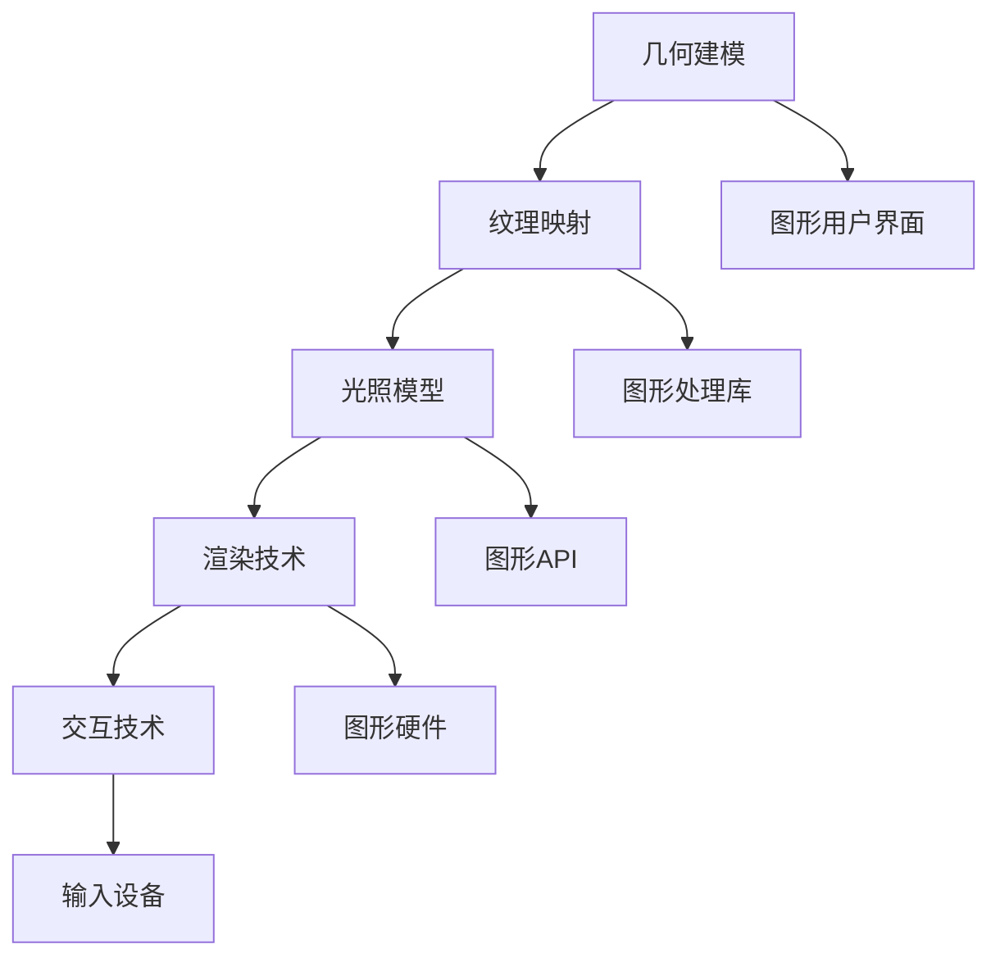

                 


# 文章标题：计算机图形学：从3D建模到渲染技术

> 关键词：计算机图形学，3D建模，渲染技术，图形硬件，OpenGL，DirectX，Vulkan，基本图形算法

> 摘要：
本文深入探讨了计算机图形学的基础概念、应用领域、发展历程，以及3D建模与渲染技术。从图形硬件和API的介绍，到基本图形算法的解析，再到3D建模工具与软件的使用，本文系统地展示了计算机图形学的全貌。通过实例分析和项目实战，本文旨在为读者提供一个全面的技术视角，帮助他们更好地理解和应用计算机图形学。

---

## 《计算机图形学：从3D建模到渲染技术》目录大纲

### 第一部分：计算机图形学基础

### 第1章：计算机图形学概述
#### 1.1 计算机图形学的定义与应用领域
#### 1.2 计算机图形学的发展历程
#### 1.3 计算机图形学的基本概念

### 第2章：图形硬件与API
#### 2.1 图形硬件简介
#### 2.2 OpenGL基础
#### 2.3 DirectX基础
#### 2.4 Vulkan基础

### 第3章：基本图形算法
#### 3.1 几何变换
#### 3.2 顶点缓冲区与索引缓冲区
#### 3.3 光栅化
#### 3.4 图形渲染管线

### 第二部分：3D建模与渲染技术

### 第4章：3D建模基础
#### 4.1 3D建模的基本概念
#### 4.2 多边形建模
#### 4.3 细分表面建模
#### 4.4 NURBS建模

### 第5章：3D建模工具与软件
#### 5.1 Blender基础
#### 5.2 Maya基础
#### 5.3 3ds Max基础

### 第6章：渲染技术与算法
#### 6.1 渲染器的工作原理
#### 6.2 光照模型
#### 6.3 材质与纹理
#### 6.4 阴影与反射
#### 6.5 环境映射与全局光照

### 第7章：高级渲染技术
#### 7.1 实时渲染技术
#### 7.2 渲染优化技术
#### 7.3 体积渲染
#### 7.4 颜色管理与后期处理

### 第三部分：计算机图形学应用实例

### 第8章：计算机游戏图形设计
#### 8.1 游戏引擎基础
#### 8.2 游戏角色与场景设计
#### 8.3 游戏特效制作
#### 8.4 游戏渲染优化

### 第9章：电影视觉效果
#### 9.1 视觉特效基础
#### 9.2 数字雕塑与模型制作
#### 9.3 粒子系统与动态效果
#### 9.4 后期合成与调色

### 第10章：虚拟现实与增强现实
#### 10.1 虚拟现实技术基础
#### 10.2 增强现实技术基础
#### 10.3 虚拟现实应用实例
#### 10.4 增强现实应用实例

### 第11章：图形学在其他领域的应用
#### 11.1 医学影像处理
#### 11.2 地理信息系统
#### 11.3 生物信息学
#### 11.4 其他领域应用实例

### 附录

### 附录 A：计算机图形学相关工具与资源
#### A.1 常用图形硬件与驱动程序
#### A.2 常用3D建模与渲染软件
#### A.3 开源图形库与框架
#### A.4 计算机图形学在线资源与论坛

---

# 第1章：计算机图形学概述

## 1.1 计算机图形学的定义与应用领域

### 1.1.1 计算机图形学的定义
计算机图形学是研究如何使用计算机生成、处理和显示图像的学科。它涉及计算机硬件、软件、数学算法和视觉感知等多个领域。计算机图形学的核心目的是通过算法和程序来创建和渲染图像，实现图像的生成、编辑、处理、显示和存储。

### 1.1.2 计算机图形学的应用领域

- **设计领域**：计算机图形学在工业设计、建筑设计、汽车设计等领域中有着广泛的应用。通过3D建模和渲染技术，设计师可以更加直观地展示设计成果，提高设计效率和质量。

- **娱乐领域**：计算机图形学在电影制作、动画制作、游戏开发等领域中发挥着重要作用。高质量的渲染技术和特效制作使得电影和游戏画面更加逼真，给观众和玩家带来沉浸式体验。

- **虚拟现实与增强现实**：计算机图形学是虚拟现实（VR）和增强现实（AR）技术的核心组成部分。通过计算机图形技术，可以创建出逼真的虚拟环境和增强现实界面，为用户提供全新的交互方式。

- **科学可视化**：计算机图形学在科学研究中有着重要的应用。通过图形化展示复杂数据和科学现象，科学家可以更加直观地理解和分析数据，促进科学研究的发展。

- **医学影像处理**：计算机图形学在医学影像处理中发挥着重要作用。通过图像处理技术，可以清晰地显示人体内部结构，帮助医生进行诊断和治疗。

- **地理信息系统**：计算机图形学在地理信息系统（GIS）中应用广泛。通过图形化展示地理信息，可以更好地进行地理数据的分析和处理。

### 1.1.3 应用领域的联系

不同应用领域之间的联系在于它们都依赖于计算机图形学的核心原理和技术。无论是设计、娱乐、虚拟现实、科学可视化、医学影像处理还是地理信息系统，都离不开图像的生成、处理和显示。计算机图形学为这些领域提供了强大的工具和技术支持，使得图像的处理和分析更加高效和精确。

## 1.2 计算机图形学的发展历程

### 1.2.1 初期发展

计算机图形学的研究可以追溯到20世纪50年代末和60年代初。当时，计算机主要用于科学计算，而计算机图形学的概念和应用领域开始逐渐形成。

- **1960年代**：1958年，IBM推出了第一台图形处理机，标志着计算机图形学的诞生。同年，美国麻省理工学院（MIT）成立了计算机图形学实验室，推动了计算机图形学的研究和发展。

- **1962年**：MIT的研究员伊凡·苏瑟兰（Ivan Sutherland）发明了光笔交互技术，这是计算机图形学的一个重要突破。他的论文《一个交互式图形系统》（A Display System for the Numerical Analysis of Graphs）提出了许多重要的计算机图形学原理，如矢量图形、图形坐标系和几何变换等。

- **1963年**：苏瑟兰还发明了最早的图形编程语言——SPL/1，为后续的图形编程奠定了基础。

### 1.2.2 2D图形时代

- **1970年代**：2D图形技术逐渐成熟，矢量图形和位图图形开始广泛应用。

- **1973年**：MIT的鲍勃·威斯纳（Bob Widell）发明了第一台个人计算机Altair 8800，推动了计算机图形学的进一步发展。

- **1976年**：苹果公司成立，其推出的Apple II计算机配备了图形显示功能，使得计算机图形学开始进入大众市场。

- **1977年**：Bill Atkinson开发了Macintosh操作系统，其中包括了图形用户界面（GUI）和位图图形编辑器Paintbrush。

### 1.2.3 3D图形时代

- **1980年代**：3D图形技术逐渐成熟，计算机游戏和电影特效开始大量使用3D图形。

- **1980年**：微软推出了Windows操作系统，其中包括了图形用户界面。

- **1982年**：Id Software公司成立，标志着计算机游戏产业的兴起。

- **1983年**：Adobe公司发布了PostScript语言，为打印和图形处理提供了标准化方案。

- **1984年**：苹果公司推出了Macintosh 128K，这是第一款商业化的个人计算机，配备了图形用户界面和位图图形编辑器。

### 1.2.4 现代图形学

- **1990年代**：计算机图形学技术迅速发展，图形处理能力和渲染质量不断提高。

- **2000年代**：实时渲染技术逐渐成熟，计算机游戏和电影特效达到了新的高度。

- **2010年代**：虚拟现实（VR）和增强现实（AR）技术开始兴起，计算机图形学在这些领域中的应用日益广泛。

- **2020年代**：计算机图形学继续向更高的分辨率、更逼真的渲染效果和更复杂的场景建模方向发展。

### 1.2.5 总结

计算机图形学的发展历程体现了计算机技术和图形技术的不断进步。从初期的简单图形处理到现代的复杂渲染技术，计算机图形学为各个领域提供了强大的工具和平台，推动了科学、艺术、娱乐和工程等领域的发展。

## 1.3 计算机图形学的基本概念

### 1.3.1 图形系统

计算机图形系统由硬件、软件和数据三部分组成。

- **硬件**：包括图形处理器（GPU）、显示器、输入设备（如鼠标、键盘等）等。

- **软件**：包括图形API（如OpenGL、DirectX、Vulkan等）、图形编辑器（如Blender、Maya、3ds Max等）和图形处理库（如OpenGL ES、OpenAL等）。

- **数据**：包括几何形状、纹理、光照、材质等。

### 1.3.2 图形算法

计算机图形学中的算法主要包括几何变换、光照模型、渲染算法等。

- **几何变换**：包括平移、旋转、缩放等基本几何操作，用于改变物体的位置和形状。

- **光照模型**：用于模拟光线在场景中的传播和反射，计算物体的光照效果。

- **渲染算法**：包括光栅化、纹理映射、阴影计算等，用于将几何数据转换为可视图像。

### 1.3.3 图形管线

图形管线是计算机图形学中的一个重要概念，它描述了图形渲染的整个过程。图形管线通常包括以下几个阶段：

1. 几何处理：包括顶点处理、顶点着色、裁剪等。

2. 光栅化：将几何数据转换为像素。

3. 填充和覆盖：为像素分配颜色和深度。

4. 纹理映射：将纹理映射到渲染的图像上。

5. 光照和阴影计算：计算场景中的光照效果和阴影。

6. 合成：将所有像素的颜色信息合成到一个最终的图像上。

### 1.3.4 计算机图形学的核心原理和架构

计算机图形学的核心原理和架构可以概括为以下几点：

1. 几何建模：通过几何形状和曲面来描述物体的外观。

2. 纹理映射：通过纹理图像来增强物体的细节和质感。

3. 光照模型：通过模拟光线在场景中的传播和反射来计算光照效果。

4. 渲染技术：通过图形渲染管线将几何数据转换为可视图像。

5. 交互技术：通过图形用户界面和交互设备来与计算机图形系统进行交互。

### 1.3.5 Mermaid流程图

为了更好地理解计算机图形学的核心原理和架构，我们可以使用Mermaid流程图来展示其流程。



通过这个流程图，我们可以清晰地看到计算机图形学的基本架构和各个环节之间的联系。

### 1.3.6 伪代码

为了更好地理解计算机图形学的算法和原理，我们可以使用伪代码来详细阐述其实现过程。

#### 几何变换

```python
def transform(geometry, transformation):
    # 平移
    geometry.position += transformation.translation
    
    # 旋转
    geometry.rotation *= transformation.rotation
    
    # 缩放
    geometry.scale *= transformation.scale
```

#### 光照模型

```python
def calculate_lighting(geometry, light):
    # 计算光照强度
    lighting_intensity = max(0, dot(normal, light.direction))
    
    # 应用光照
    geometry.color += lighting_intensity * light.color
```

#### 渲染算法

```python
def render(geometry, camera):
    # 设置视图矩阵
    view_matrix = camera.get_view_matrix()
    
    # 设置投影矩阵
    projection_matrix = camera.get_projection_matrix()
    
    # 将几何数据发送到GPU
    upload_geometry_to_gpu(geometry, view_matrix, projection_matrix)
    
    # 渲染几何数据
    draw_geometry(geometry)
```

通过这些伪代码，我们可以看到计算机图形学的基本算法和实现过程。

### 1.3.7 总结

计算机图形学是计算机科学中的一个重要分支，它涉及多个领域的知识和技术。通过理解计算机图形学的基本概念、应用领域、发展历程和核心原理，我们可以更好地掌握计算机图形学的知识和技能，为未来的学习和应用打下坚实的基础。

---

# 第2章：图形硬件与API

## 2.1 图形硬件简介

### 2.1.1 GPU与CPU

在计算机图形学中，图形处理器（GPU）和中央处理器（CPU）扮演着至关重要的角色。两者之间的主要区别在于它们的设计目的和架构。

- **CPU**：中央处理器是计算机的核心组件，负责执行计算机程序中的指令。CPU设计为处理复杂、顺序执行的计算任务，具有较小的指令集和较慢的时钟频率。CPU的核心优势在于其通用性，可以执行各种类型的计算任务。

- **GPU**：图形处理器专门用于处理图形渲染任务，具有大量的计算单元，能够高效地进行并行计算。GPU的设计目标是快速渲染大量像素，其核心优势在于其并行处理能力和高性能。

### 2.1.2 GPU与CPU在计算机图形学中的分工

GPU和CPU在计算机图形学中的应用各有侧重：

- **GPU**：主要负责图形渲染任务，如光栅化、纹理映射、阴影计算和渲染。GPU能够高效地处理大量像素，适合实时渲染复杂场景。

- **CPU**：主要负责控制和管理图形渲染流程，如处理输入数据、设置渲染状态、调度渲染任务等。CPU还负责处理与图形渲染无关的计算任务，如物理模拟、游戏逻辑等。

### 2.1.3 GPU与CPU的协同工作

在实际应用中，GPU和CPU需要协同工作，以充分利用各自的性能优势：

- **任务分配**：将计算密集型的渲染任务分配给GPU，将控制逻辑和计算密集型的非渲染任务分配给CPU。

- **数据交换**：通过显存（GPU内存）和系统内存之间的数据交换，确保GPU能够访问到必要的渲染数据和计算结果。

- **并行处理**：利用GPU的并行计算能力，同时处理多个渲染任务，提高渲染效率。

## 2.2 OpenGL基础

OpenGL（Open Graphics Library）是一种跨平台的图形API，广泛用于计算机图形学领域。OpenGL提供了丰富的图形渲染功能，支持2D和3D图形渲染。

### 2.2.1 OpenGL概述

OpenGL的设计原则包括：

- **跨平台**：OpenGL支持多种操作系统和硬件平台，如Windows、Linux、Mac OS和Android等。

- **低级控制**：OpenGL提供了低级控制，允许开发者直接操作图形硬件，实现高效的渲染。

- **标准化**：OpenGL遵循国际标准，确保在不同硬件平台上的一致性和兼容性。

### 2.2.2 OpenGL基本概念

- **顶点缓冲区（Vertex Buffer Object, VBO）**：用于存储顶点数据，如顶点坐标、颜色、法线等。

- **索引缓冲区（Index Buffer Object, IBO）**：用于存储顶点之间的连接关系，如三角形或四面体的顶点索引。

- **着色器（Shader）**：用于编写图形渲染算法，如顶点着色器、片元着色器等。

### 2.2.3 OpenGL编程基础

OpenGL编程通常包括以下几个步骤：

1. **初始化OpenGL**：设置OpenGL状态，如创建窗口、配置显示模式、加载着色器程序等。

2. **创建顶点数据**：定义顶点数据，如顶点坐标、颜色、法线等，并将其存储在顶点缓冲区中。

3. **设置渲染状态**：配置渲染状态，如深度测试、光照模型、纹理映射等。

4. **渲染循环**：在渲染循环中，根据顶点数据和渲染状态，绘制图形。

5. **处理输入事件**：处理用户输入事件，如键盘、鼠标等。

6. **关闭OpenGL**：在程序结束时，释放OpenGL资源。

### 2.2.4 伪代码

以下是一个简单的OpenGL渲染循环伪代码示例：

```python
def render_loop():
    while not window_should_close():
        process_input()
        clear_screen()
        draw_objects()
        swap_buffers()
```

通过这个伪代码，我们可以看到OpenGL渲染循环的基本流程，包括处理输入事件、清除屏幕、绘制图形和交换缓冲区。

## 2.3 DirectX基础

DirectX是由微软开发的一套图形API，主要用于Windows平台上的游戏和图形应用程序开发。DirectX提供了丰富的图形渲染功能，支持2D和3D图形渲染。

### 2.3.1 DirectX概述

DirectX的设计原则包括：

- **高性能**：DirectX针对Windows平台进行了优化，提供了高性能的图形渲染功能。

- **兼容性**：DirectX支持多种硬件平台，如CPU和GPU，确保了应用程序在不同硬件上的兼容性。

- **多功能性**：DirectX不仅提供了图形渲染功能，还包括音频、视频、输入等模块，为开发者提供了全面的开发环境。

### 2.3.2 DirectX基本概念

- **Direct3D**：Direct3D是DirectX中的3D图形渲染模块，提供了高效、灵活的3D图形渲染功能。

- **Direct2D**：Direct2D是DirectX中的2D图形渲染模块，用于绘制2D图形和文本。

- **DirectInput**：DirectInput是DirectX中的输入模块，用于处理键盘、鼠标等输入设备。

### 2.3.3 DirectX编程基础

DirectX编程通常包括以下几个步骤：

1. **初始化DirectX**：配置DirectX环境，如创建窗口、加载着色器程序等。

2. **创建顶点数据**：定义顶点数据，如顶点坐标、颜色、法线等，并将其存储在顶点缓冲区中。

3. **设置渲染状态**：配置渲染状态，如深度测试、光照模型、纹理映射等。

4. **渲染循环**：在渲染循环中，根据顶点数据和渲染状态，绘制图形。

5. **处理输入事件**：处理用户输入事件，如键盘、鼠标等。

6. **关闭DirectX**：在程序结束时，释放DirectX资源。

### 2.3.4 伪代码

以下是一个简单的DirectX渲染循环伪代码示例：

```python
def render_loop():
    while not window_should_close():
        process_input()
        clear_screen()
        draw_objects()
        swap_buffers()
```

通过这个伪代码，我们可以看到DirectX渲染循环的基本流程，包括处理输入事件、清除屏幕、绘制图形和交换缓冲区。

## 2.4 Vulkan基础

Vulkan是由Khr resurrected开发的现代、高性能、跨平台的图形API。它提供了低级控制，允许开发者直接操作图形硬件，实现高效的渲染。

### 2.4.1 Vulkan概述

Vulkan的设计原则包括：

- **高性能**：Vulkan通过提供低级控制和并行处理能力，实现了高性能的渲染。

- **兼容性**：Vulkan支持多种操作系统和硬件平台，如Windows、Linux、Android和iOS等。

- **安全性**：Vulkan提供了一套完善的内存管理和同步机制，确保了应用程序的安全性和稳定性。

### 2.4.2 Vulkan基本概念

- **命令缓冲区（Command Buffer）**：用于存储渲染命令，如绘制命令、更新命令等。

- **同步机制**：Vulkan提供了多种同步机制，如信号量、事件、Fence等，用于控制渲染流程。

- **图形资源**：Vulkan中的图形资源包括顶点缓冲区、索引缓冲区、纹理、帧缓冲区等。

### 2.4.3 Vulkan编程基础

Vulkan编程通常包括以下几个步骤：

1. **初始化Vulkan**：配置Vulkan环境，如创建实例、选择设备、选择表面等。

2. **创建图形资源**：创建顶点缓冲区、索引缓冲区、纹理、帧缓冲区等。

3. **设置渲染状态**：配置渲染状态，如深度测试、光照模型、纹理映射等。

4. **渲染循环**：在渲染循环中，根据顶点数据和渲染状态，绘制图形。

5. **处理输入事件**：处理用户输入事件，如键盘、鼠标等。

6. **关闭Vulkan**：在程序结束时，释放Vulkan资源。

### 2.4.4 伪代码

以下是一个简单的Vulkan渲染循环伪代码示例：

```python
def render_loop():
    while not window_should_close():
        process_input()
        record_commands()
        submit_commands()
        present_frame()
```

通过这个伪代码，我们可以看到Vulkan渲染循环的基本流程，包括处理输入事件、记录命令、提交命令和呈现帧。

### 2.4.5 Vulkan与OpenGL、DirectX的比较

- **性能**：Vulkan在性能方面通常优于OpenGL和DirectX，因为它提供了更低级的控制和更高的并行处理能力。

- **兼容性**：Vulkan支持多种操作系统和硬件平台，具有更好的兼容性。

- **易用性**：OpenGL和DirectX在开发上更加成熟和易用，而Vulkan在开发上相对较新，需要更多的学习和实践。

## 2.5 总结

图形硬件和API在计算机图形学中起着至关重要的作用。通过了解GPU和CPU的分工、OpenGL、DirectX和Vulkan的基础知识，开发者可以更好地利用图形硬件和API，实现高效的渲染和图形处理。

---

# 第3章：基本图形算法

## 3.1 几何变换

几何变换是计算机图形学中最基本的算法之一，用于改变图形的位置、大小和方向。常见的几何变换包括平移、旋转和缩放。

### 3.1.1 平移

平移是指将图形沿X轴、Y轴或Z轴移动一定的距离。平移可以通过将图形的每个顶点的坐标加上一个向量来实现。

**伪代码：**

```python
def translate(vertices, translation_vector):
    for vertex in vertices:
        vertex.x += translation_vector.x
        vertex.y += translation_vector.y
        vertex.z += translation_vector.z
```

**示例：** 假设有一个三角形，其顶点坐标分别为A(1, 1), B(3, 1)和C(2, 3)。将三角形沿X轴平移2个单位，得到新的顶点坐标为A'(3, 1), B'(5, 1)和C'(4, 3)。

### 3.1.2 旋转

旋转是指将图形绕某个点旋转一定角度。旋转可以通过将图形的每个顶点的坐标乘以一个旋转矩阵来实现。

**伪代码：**

```python
import numpy as np

def rotate(vertices, center, angle):
    rotation_matrix = np.array([[cos(angle), -sin(angle), 0],
                                [sin(angle), cos(angle), 0],
                                [0, 0, 1]])
    for vertex in vertices:
        vertex -= center
        vertex = np.dot(rotation_matrix, vertex)
        vertex += center
```

**示例：** 假设有一个三角形，其顶点坐标分别为A(1, 1), B(3, 1)和C(2, 3)。将三角形绕原点旋转45度，得到新的顶点坐标为A'(√2/2, √2/2), B'(√2/2, -√2/2)和C'(0, 0)。

### 3.1.3 缩放

缩放是指将图形沿X轴、Y轴或Z轴放大或缩小。缩放可以通过将图形的每个顶点的坐标乘以一个缩放因子来实现。

**伪代码：**

```python
def scale(vertices, scale_factor):
    for vertex in vertices:
        vertex.x *= scale_factor
        vertex.y *= scale_factor
        vertex.z *= scale_factor
```

**示例：** 假设有一个三角形，其顶点坐标分别为A(1, 1), B(3, 1)和C(2, 3)。将三角形沿X轴和Y轴缩放2倍，得到新的顶点坐标为A'(2, 2), B'(6, 2)和C'(4, 6)。

### 3.1.4 组合变换

在实际应用中，几何变换通常是组合变换，即将多个变换顺序执行。例如，先将图形绕某点旋转，再将其沿某个方向平移。

**伪代码：**

```python
def compose_transform(vertices, translation_vector, angle, center):
    rotate(vertices, center, angle)
    translate(vertices, translation_vector)
```

**示例：** 假设有一个三角形，其顶点坐标分别为A(1, 1), B(3, 1)和C(2, 3)。将其绕原点旋转45度，再沿X轴平移2个单位，得到新的顶点坐标为A'(2√2/2, 2√2/2), B'(2√2/2, -2√2/2)和C'(4, 0)。

### 3.1.5 总结

几何变换是计算机图形学中重要的算法之一，用于改变图形的位置、大小和方向。通过理解平移、旋转和缩放的基本原理，以及如何组合变换，开发者可以灵活地控制图形的形态，实现各种图形效果。

---

## 3.2 顶点缓冲区与索引缓冲区

顶点缓冲区和索引缓冲区是图形渲染中的重要概念，用于存储和传递图形数据到图形处理器（GPU）。

### 3.2.1 顶点缓冲区

顶点缓冲区（Vertex Buffer Object，VBO）是一种用于存储顶点数据的缓冲区。在图形渲染中，顶点数据包括顶点坐标、颜色、法线、纹理坐标等。通过将顶点数据存储在VBO中，可以将数据批量传递到GPU，提高渲染效率。

**创建VBO：**

```c
unsigned int vbo;
glGenBuffers(1, &vbo);
glBindBuffer(GL_ARRAY_BUFFER, vbo);
glBufferData(GL_ARRAY_BUFFER, sizeof(vertices), vertices, GL_STATIC_DRAW);
```

- `glGenBuffers`：创建一个缓冲区对象。
- `glBindBuffer`：绑定到顶点缓冲区。
- `glBufferData`：将顶点数据加载到缓冲区。

**使用VBO：**

```c
glBindBuffer(GL_ARRAY_BUFFER, vbo);
glVertexAttribPointer(0, 3, GL_FLOAT, GL_FALSE, 3 * sizeof(float), (void*)0);
 glEnableVertexAttribArray(0);
```

- `glVertexAttribPointer`：设置顶点属性指针，指定顶点数据格式和偏移量。
- `glEnableVertexAttribArray`：启用顶点属性数组。

### 3.2.2 索引缓冲区

索引缓冲区（Index Buffer Object，IBO）用于存储顶点索引数据。在图形渲染中，通过索引缓冲区可以指定顶点之间的连接关系，从而构成多边形。索引缓冲区通常用于存储三角形、四面体等多边形的数据。

**创建IBO：**

```c
unsigned int ibo;
glGenBuffers(1, &ibo);
glBindBuffer(GL_ELEMENT_ARRAY_BUFFER, ibo);
glBufferData(GL_ELEMENT_ARRAY_BUFFER, sizeof(indices), indices, GL_STATIC_DRAW);
```

- `glGenBuffers`：创建一个缓冲区对象。
- `glBindBuffer`：绑定到索引缓冲区。
- `glBufferData`：将索引数据加载到缓冲区。

**使用IBO：**

```c
glBindBuffer(GL_ELEMENT_ARRAY_BUFFER, ibo);
glDrawElements(GL_TRIANGLES, index_count, GL_UNSIGNED_INT, 0);
```

- `glDrawElements`：根据索引数据绘制多边形。

### 3.2.3 顶点缓冲区和索引缓冲区的比较

- **数据存储**：顶点缓冲区存储顶点数据，如顶点坐标、颜色、法线等；索引缓冲区存储顶点索引，用于指定顶点之间的连接关系。
- **渲染效率**：使用顶点缓冲区和索引缓冲区可以批量传递数据到GPU，减少数据传输的次数，提高渲染效率。
- **数据更新**：顶点缓冲区适用于频繁更新的数据，如动态对象；索引缓冲区适用于静态数据，如场景中的静态物体。

### 3.2.4 实际应用

在实际应用中，顶点缓冲区和索引缓冲区常用于3D游戏和图形渲染项目中。通过使用顶点缓冲区和索引缓冲区，可以高效地存储和传递图形数据，实现复杂的图形渲染效果。

- **游戏引擎**：游戏引擎如Unity和Unreal Engine使用顶点缓冲区和索引缓冲区来渲染场景中的对象。
- **渲染器**：渲染器如OpenGL和DirectX使用顶点缓冲区和索引缓冲区来实现高效的图形渲染。

### 3.2.5 总结

顶点缓冲区和索引缓冲区是计算机图形学中重要的缓冲区类型，用于存储和传递图形数据到GPU。通过理解顶点缓冲区和索引缓冲区的概念和应用，开发者可以高效地渲染复杂的图形场景，实现高质量的图形效果。

---

## 3.3 光栅化

光栅化（Rasterization）是将三维图形转换为二维图像的过程。在光栅化过程中，三维图形的顶点被映射到屏幕上的像素，从而生成二维图像。光栅化是计算机图形学中关键的一步，它决定了最终渲染出的图像质量。

### 3.3.1 光栅化的基本概念

- **顶点**：三维图形的基本单位是顶点，每个顶点包含位置、颜色、纹理坐标等属性。
- **面**：三维图形由多个面组成，每个面由多个顶点组成。
- **光栅化操作**：光栅化操作包括顶点处理、裁剪、面处理、扫描转换和光栅操作。

### 3.3.2 光栅化的基本过程

1. **顶点处理**：顶点处理包括顶点装配、顶点变换和顶点着色。顶点装配将顶点数据从内存加载到GPU的顶点缓存中，顶点变换包括几何变换和投影变换，顶点着色为顶点生成颜色和纹理。

2. **裁剪**：裁剪是指将不在视锥体内的顶点和面剔除。视锥体是一个定义了观察范围的虚拟空间，只有位于视锥体内的图形才会被渲染。

3. **面处理**：面处理包括面的装配、面的变换和面的着色。面的装配是将面的数据从顶点缓存加载到GPU的片元缓存中，面的变换包括面的裁剪和投影变换，面的着色为面生成颜色和纹理。

4. **扫描转换**：扫描转换是将二维图形转换为像素的过程。扫描转换通过将面划分为多个水平线段，然后将线段转换为像素。

5. **光栅操作**：光栅操作是指对像素进行颜色处理，如纹理映射、光照计算和透明度处理。

### 3.3.3 光栅化的算法

光栅化算法主要包括以下步骤：

1. **顶点处理**：
   ```python
   def vertex_processing(vertices, model_matrix, projection_matrix):
       transformed_vertices = []
       for vertex in vertices:
           transformed_vertex = apply_model_matrix(vertex, model_matrix)
           transformed_vertex = apply_projection_matrix(transformed_vertex, projection_matrix)
           transformed_vertices.append(transformed_vertex)
       return transformed_vertices
   ```

2. **裁剪**：
   ```python
   def cull_faces(transformed_vertices, faces):
       culled_faces = []
       for face in faces:
           if not is_face_culled(face, transformed_vertices):
               culled_faces.append(face)
       return culled_faces
   ```

3. **面处理**：
   ```python
   def process_face(face, transformed_vertices):
       face_vertices = [transformed_vertices[vertex_index] for vertex_index in face]
       return face_vertices
   ```

4. **扫描转换**：
   ```python
   def scan_convert(face_vertices):
       x_min, x_max = min(face_vertices, key=lambda v: v.x).x, max(face_vertices, key=lambda v: v.x).x
       for y in range(x_min, x_max):
           start = find_starting_point(face_vertices, y)
           end = find_ending_point(face_vertices, y)
           draw_line(face_vertices[start], face_vertices[end], y)
   ```

5. **光栅操作**：
   ```python
   def rasterize_face(face_vertices, texture, light):
       for y in range(face_vertices[0].y, face_vertices[-1].y):
           for x in range(face_vertices[0].x, face_vertices[-1].x):
               if is_point_inside_triangle(face_vertices, x, y):
                   color = calculate_color(x, y, texture, light)
                   draw_pixel(x, y, color)
   ```

### 3.3.4 光栅化的实际应用

光栅化在计算机图形学中应用广泛，包括：

- **游戏渲染**：游戏引擎使用光栅化技术渲染游戏场景，实现实时渲染效果。
- **电影特效**：电影特效制作使用光栅化技术生成高质量的视觉效果。
- **虚拟现实与增强现实**：虚拟现实和增强现实设备使用光栅化技术渲染虚拟环境和增强现实界面。

### 3.3.5 总结

光栅化是将三维图形转换为二维图像的关键步骤。通过理解光栅化的基本概念和算法，开发者可以高效地渲染图形，实现高质量的图像效果。光栅化在游戏、电影、虚拟现实和增强现实等领域中发挥着重要作用。

---

## 3.4 图形渲染管线

图形渲染管线（Graphics Pipeline）是计算机图形学中用于处理和渲染图形数据的一系列步骤。图形渲染管线将三维场景中的几何数据转换为二维图像，通过多个阶段实现图形渲染。常见的图形渲染管线包括顶点处理、面处理和光栅化等阶段。

### 3.4.1 图形渲染管线的组成

图形渲染管线通常由以下阶段组成：

1. **顶点处理（Vertex Processing）**：顶点处理包括顶点装配、顶点变换和顶点着色。顶点装配将顶点数据从内存加载到GPU的顶点缓存中，顶点变换包括几何变换和投影变换，顶点着色为顶点生成颜色和纹理。

2. **输入装配阶段（Input Assembly）**：输入装配阶段将顶点数据组装成图元，如三角形或条带。这一阶段还负责裁剪，将不在视锥体内的图元剔除。

3. **面处理（Primitive Processing）**：面处理包括图元的装配、裁剪和面变换。图元的装配是将顶点数据组装成图元，如三角形或条带。裁剪是将不在视锥体内的图元剔除。面变换包括裁剪后的图元变换。

4. **光栅化（Rasterization）**：光栅化是将二维图元转换为像素的过程。光栅化通过扫描转换和光栅操作将图元映射到像素网格上，生成二维图像。

5. **像素处理（Pixel Processing）**：像素处理包括像素的着色、纹理映射和光照计算。像素着色为像素生成颜色和纹理，纹理映射将纹理图像映射到像素上，光照计算为像素生成光照效果。

6. **输出处理（Output Processing）**：输出处理包括像素的颜色混合、深度测试和帧缓冲区更新。颜色混合用于处理多个图元的重叠部分，深度测试用于确定像素的可见性，帧缓冲区更新将渲染结果存储到屏幕上。

### 3.4.2 图形渲染管线的实现

图形渲染管线的实现通常涉及以下几个步骤：

1. **初始化渲染管线**：设置渲染状态，如视图矩阵、投影矩阵、深度测试、纹理映射等。

2. **上传顶点数据**：将顶点数据上传到顶点缓冲区，包括顶点坐标、颜色、法线、纹理坐标等。

3. **绘制图元**：使用OpenGL、DirectX或Vulkan等图形API绘制图元，如三角形、条带等。

4. **处理渲染管线阶段**：根据渲染管线的各个阶段，处理顶点处理、输入装配、面处理、光栅化、像素处理和输出处理。

5. **渲染结果**：将渲染结果存储到帧缓冲区，最终显示在屏幕上。

### 3.4.3 伪代码

以下是一个简单的图形渲染管线伪代码示例：

```python
def render_scene(scene):
    # 初始化渲染管线
    initialize_pipeline()

    # 上传顶点数据
    upload_vertices_to_vbo(scene.vertices)

    # 绘制图元
    draw_primitives(scene.primitives)

    # 处理渲染管线阶段
    process_pipeline_stages(scene)

    # 渲染结果
    render_result_to_screen()
```

### 3.4.4 图形渲染管线的优化

图形渲染管线的优化是提高渲染性能的重要手段。以下是一些常见的优化技术：

- **批处理**：将多个图元批量提交到GPU，减少绘制调用次数。
- **顶点缓冲区对象（VBO）**：使用顶点缓冲区对象批量上传顶点数据，提高数据传输效率。
- **几何着色器**：使用几何着色器进行几何变换和光栅化，提高渲染效率。
- **纹理映射优化**：使用纹理压缩、纹理阵列等技术优化纹理映射。
- **深度测试优化**：使用深度测试优化场景的绘制顺序，减少不必要的渲染。

### 3.4.5 实际应用

图形渲染管线在计算机图形学中有广泛的应用，包括：

- **游戏渲染**：游戏引擎使用图形渲染管线渲染游戏场景，实现实时渲染效果。
- **电影特效**：电影特效制作使用图形渲染管线生成高质量的视觉效果。
- **虚拟现实与增强现实**：虚拟现实和增强现实设备使用图形渲染管线渲染虚拟环境和增强现实界面。

### 3.4.6 总结

图形渲染管线是计算机图形学中用于处理和渲染图形数据的一系列步骤。通过理解图形渲染管线的组成和实现，开发者可以高效地渲染图形，实现高质量的图像效果。图形渲染管线在游戏、电影、虚拟现实和增强现实等领域中发挥着重要作用。

---

## 第4章：3D建模基础

### 4.1 3D建模的基本概念

3D建模是创建三维物体的过程，通过几何形状、曲面和纹理来描述物体的外观。3D建模是计算机图形学的重要组成部分，广泛应用于游戏开发、电影制作、建筑设计等领域。

#### 4.1.1 3D建模的定义

3D建模是指使用数字工具创建三维物体的过程。在3D建模中，几何形状、曲面、材质和纹理是构建模型的关键要素。

#### 4.1.2 3D建模的应用领域

- **游戏开发**：3D建模用于创建游戏角色、场景和环境，为玩家提供逼真的游戏体验。
- **电影制作**：3D建模用于创建电影中的特效、角色和场景，增强视觉效果和故事叙述。
- **建筑设计**：3D建模用于建筑设计，帮助设计师展示设计成果，进行空间规划和仿真。
- **工业设计**：3D建模用于创建产品原型，进行结构分析和优化，提高设计效率和质量。
- **医学影像处理**：3D建模用于创建人体器官和病变部位的模型，帮助医生进行诊断和治疗。

#### 4.1.3 3D建模的基本概念

- **多边形建模**：使用多边形（如三角形、四面体）构建模型。
- **曲面建模**：使用曲面（如NURBS、贝塞尔曲面）构建模型。
- **纹理映射**：将纹理图像映射到模型表面，增强模型的外观。
- **材质**：用于定义模型的颜色、光泽、反射等属性。

### 4.2 多边形建模

多边形建模是最常见的3D建模方法之一，它使用多边形（如三角形）构建模型。多边形建模的优点是简单、直观、易于实现，适用于大多数场景。

#### 4.2.1 多边形建模的定义

多边形建模是指使用多边形构建三维物体的过程。多边形通常由三个或四个顶点组成，每个顶点定义一个角。

#### 4.2.2 多边形建模的应用领域

- **游戏开发**：游戏中的角色、道具、场景等大多数采用多边形建模。
- **电影制作**：电影中的特效、角色和场景常采用多边形建模。
- **建筑设计**：建筑模型通常采用多边形建模，用于展示设计成果。
- **工业设计**：产品原型通常采用多边形建模，进行结构分析和优化。

#### 4.2.3 多边形建模的基本步骤

1. **创建多边形**：使用多边形建模工具创建多边形，如三角形、四面体等。
2. **编辑多边形**：对多边形进行编辑，如添加、删除、拉伸、弯曲等。
3. **平滑处理**：使用平滑处理技术，如子面细分，提高模型的曲面质量。
4. **纹理映射**：将纹理图像映射到多边形表面，增强模型的外观。
5. **材质定义**：为模型定义材质，如颜色、光泽、反射等属性。

### 4.2.4 伪代码

以下是一个简单的多边形建模伪代码示例：

```python
def create_polygon(vertices, faces):
    # 创建多边形
    model = define_3d_model()
    model.vertices = vertices
    model.faces = faces
    return model

def subdivide_polygon(model, iterations):
    for _ in range(iterations):
        subdivide_model(model)
    return model
```

### 4.2.5 实际应用

多边形建模在许多领域得到广泛应用，包括：

- **游戏开发**：游戏角色、场景和环境大多采用多边形建模。
- **电影制作**：电影特效、角色和场景常采用多边形建模。
- **建筑设计**：建筑模型通常采用多边形建模，用于展示设计成果。

### 4.2.6 总结

多边形建模是3D建模中最常用的方法之一，适用于大多数场景。通过理解多边形建模的基本概念和步骤，开发者可以创建高质量的三维模型，为各种应用提供支持。

---

## 第4章：3D建模基础（续）

### 4.3 细分表面建模

细分表面建模是一种高级建模技术，通过逐步细分多边形或曲面，提高模型的细节和质量。细分表面建模广泛应用于游戏开发、电影制作、工业设计等领域。

#### 4.3.1 细分表面建模的定义

细分表面建模是指在多边形或曲面上应用细分算法，逐步增加顶点数量，从而提高模型细节的过程。细分表面建模常用于创建复杂、平滑的曲面模型。

#### 4.3.2 细分表面建模的应用领域

- **游戏开发**：游戏中的角色、场景和道具常采用细分表面建模，以实现高质量的渲染效果。
- **电影制作**：电影中的特效、角色和场景采用细分表面建模，增强视觉效果。
- **工业设计**：产品设计中的复杂曲面模型常采用细分表面建模，进行结构分析和优化。

#### 4.3.3 细分表面建模的基本步骤

1. **创建初始模型**：使用多边形建模或曲面建模工具创建初始模型。
2. **设置细分参数**：根据模型复杂度和细分需求，设置细分参数，如细分次数、顶点分布等。
3. **应用细分算法**：使用细分算法对模型进行细分，逐步增加顶点数量。
4. **平滑处理**：对细分后的模型进行平滑处理，如子面细分、平滑组等。
5. **纹理映射**：将纹理图像映射到细分后的模型表面，增强模型外观。
6. **材质定义**：为模型定义材质，如颜色、光泽、反射等属性。

#### 4.3.4 伪代码

以下是一个简单的细分表面建模伪代码示例：

```python
def subdivide_surface(model, iterations):
    for _ in range(iterations):
        subdivide_model(model)
    return model

def subdivide_model(model):
    # 应用细分算法
    new_vertices = []
    for vertex in model.vertices:
        new_vertices.append(vertex)
        new_vertices.append(lerp(vertex, vertex + vector, 0.5))
    model.vertices = new_vertices
    # 重新构建面
    model.faces = [face + [len(model.vertices)] for face in model.faces]
```

### 4.3.5 实际应用

细分表面建模在多个领域得到广泛应用，包括：

- **游戏开发**：细分表面建模用于创建游戏中的角色、场景和环境，实现高质量的渲染效果。
- **电影制作**：电影中的特效、角色和场景常采用细分表面建模，增强视觉效果。
- **工业设计**：产品设计中的复杂曲面模型采用细分表面建模，进行结构分析和优化。

### 4.3.6 总结

细分表面建模是一种高级建模技术，通过逐步细分多边形或曲面，提高模型的细节和质量。通过理解细分表面建模的基本概念和步骤，开发者可以创建高质量的三维模型，为各种应用提供支持。

---

## 第4章：3D建模基础（续）

### 4.4 NURBS建模

NURBS（非均匀有理B样条）建模是一种高级建模技术，用于创建复杂曲面模型。NURBS建模广泛应用于游戏开发、电影制作、工业设计等领域，因其强大的曲面建模能力和灵活的参数控制，而备受青睐。

#### 4.4.1 NURBS建模的定义

NURBS（Non-Uniform Rational B-Spline）是一种基于B样条（B-Spline）的曲线和曲面建模方法，通过非均匀有理B样条函数（NURBS Function）来描述曲线和曲面。NURBS建模允许用户通过调整控制点、权重和度数等参数，精确控制曲面的形状和大小。

#### 4.4.2 NURBS建模的应用领域

- **游戏开发**：游戏中的角色、场景和道具常采用NURBS建模，以实现高质量的曲面渲染效果。
- **电影制作**：电影中的特效、角色和场景采用NURBS建模，增强视觉效果。
- **工业设计**：产品设计中的复杂曲面模型采用NURBS建模，进行结构分析和优化。

#### 4.4.3 NURBS建模的基本步骤

1. **创建控制点网格**：使用控制点创建一个网格，网格定义了曲面的基本形状。
2. **设置NURBS参数**：为控制点设置权重、度数和曲线/曲面类型，以控制曲面的形状和大小。
3. **调整参数**：通过调整控制点的位置、权重和度数等参数，精确控制曲面的形状。
4. **创建曲面**：使用NURBS函数计算曲面的形状，生成复杂曲面模型。
5. **纹理映射**：将纹理图像映射到曲面模型表面，增强模型外观。
6. **材质定义**：为模型定义材质，如颜色、光泽、反射等属性。

#### 4.4.4 伪代码

以下是一个简单的NURBS建模伪代码示例：

```python
def create_nurbs_surface(knot_vector, control_points):
    surface = NURBSSurface(knot_vector, control_points)
    return surface

def create_nurbs_curve(knot_vector, control_points):
    curve = NURBSCurve(knot_vector, control_points)
    return curve
```

### 4.4.5 实际应用

NURBS建模在多个领域得到广泛应用，包括：

- **游戏开发**：NURBS建模用于创建游戏中的角色、场景和环境，实现高质量的曲面渲染效果。
- **电影制作**：电影中的特效、角色和场景采用NURBS建模，增强视觉效果。
- **工业设计**：产品设计中的复杂曲面模型采用NURBS建模，进行结构分析和优化。

### 4.4.6 总结

NURBS建模是一种高级建模技术，通过非均匀有理B样条函数描述复杂曲面模型。通过理解NURBS建模的基本概念和步骤，开发者可以创建高质量的三维模型，为各种应用提供支持。

---

## 第5章：3D建模工具与软件

### 5.1 Blender基础

Blender是一个开源的3D建模、动画、渲染和游戏开发软件，广泛应用于电影、游戏和工业设计等领域。Blender功能强大且易于使用，为用户提供了丰富的工具和插件。

#### 5.1.1 Blender简介

Blender的历史可以追溯到1988年，最初是由Wesley Pao和Stéphane Grabli创建的。经过多年的发展和迭代，Blender逐渐成为了一个功能全面、性能优秀的3D建模工具。

#### 5.1.2 Blender的特点

- **开源与免费**：Blender是一个开源软件，用户可以免费下载和使用。
- **跨平台**：Blender支持Windows、Mac OS和Linux等操作系统。
- **功能全面**：Blender集成了3D建模、动画、渲染、视频编辑、游戏开发等多种功能。
- **插件丰富**：Blender拥有丰富的插件和扩展库，用户可以根据需求自定义和扩展功能。

#### 5.1.3 Blender的主要功能

- **3D建模**：Blender提供了丰富的建模工具，包括多边形建模、曲线建模、NURBS建模等。
- **动画**：Blender支持关键帧动画、骨骼动画、粒子动画等，用户可以创建复杂而流畅的动画效果。
- **渲染**：Blender内置了强大的渲染引擎，支持物理渲染、全局光照、体积渲染等多种渲染技术。
- **游戏开发**：Blender支持游戏开发，用户可以创建游戏场景、角色和道具，实现交互式游戏体验。

#### 5.1.4 Blender的界面

Blender的界面由多个窗口和面板组成，用户可以通过窗口切换和面板操作来管理模型、动画、渲染等。

- **顶部菜单栏**：包含文件、编辑、查看、插入、渲染、工具、窗口等菜单选项。
- **工具栏**：提供常用的工具按钮，如选择工具、变换工具、建模工具等。
- **时间线**：显示动画的时间轴，用户可以在此创建和编辑动画。
- **场景视图**：显示3D场景的视图，用户可以在场景视图中编辑和观察模型。
- **属性面板**：显示当前选中的物体或对象的属性设置，用户可以在此调整参数和设置。

#### 5.1.5 Blender的简单教程

以下是一个简单的Blender教程，介绍如何创建一个简单的3D模型：

1. **创建多边形立方体**：
   - 打开Blender，选择“添加” > “几何体” > “立方体”。
   - 在“属性”面板中调整立方体的尺寸。

2. **编辑多边形**：
   - 选择立方体，进入编辑模式。
   - 使用“顶点”工具调整顶点的位置，修改立方体的形状。

3. **添加材质**：
   - 选择立方体，在“属性”面板中添加材质。
   - 在“材质”面板中设置材质的颜色、纹理等属性。

4. **渲染**：
   - 选择“渲染” > “渲染图像”。
   - 设置渲染参数，如分辨率、渲染引擎等。
   - 点击“渲染”按钮，生成渲染图像。

### 5.1.6 Blender的优缺点

#### 优点

- **开源与免费**：用户可以免费下载和使用Blender，同时可以自由地修改和扩展其功能。
- **功能全面**：Blender集成了多种3D建模、动画、渲染和游戏开发功能，满足用户的多样化需求。
- **易于使用**：Blender提供了直观的界面和丰富的工具，适合初学者和专业人士使用。

#### 缺点

- **学习曲线**：Blender功能强大，但也因此较为复杂，初学者可能需要较长时间学习。
- **性能**：尽管Blender性能优秀，但在处理高负载场景时，可能不如一些商业软件。
- **插件兼容性**：Blender的插件库丰富，但部分插件可能与其他软件不兼容。

### 5.1.7 总结

Blender是一个功能全面、开源免费的3D建模和动画软件，广泛应用于电影、游戏和工业设计等领域。通过理解Blender的基本功能和界面操作，用户可以快速上手并创建高质量的三维模型。

---

## 第5章：3D建模工具与软件（续）

### 5.2 Maya基础

Maya是一款由Autodesk开发的3D建模、动画、渲染和视觉效果软件，广泛应用于电影、游戏、广告和工业设计等领域。Maya以其强大的建模、动画和渲染功能，以及高度可定制的用户界面，成为业界领先的3D软件之一。

#### 5.2.1 Maya简介

Maya的发展历程可以追溯到1988年，当时Alias Research开发了一款名为"Wavefront"的3D建模软件。1995年，Wavefront被Alias波音公司（Alias波音工业设计公司）收购，并更名为"Maya"。此后，Maya经历了多次版本更新，功能不断丰富，成为业界领先的3D软件之一。

#### 5.2.2 Maya的特点

- **强大的建模功能**：Maya支持多种建模技术，包括多边形建模、NURBS建模、曲面建模等，用户可以灵活地创建各种复杂模型。
- **高级动画工具**：Maya提供了丰富的动画工具，包括关键帧动画、运动捕捉、IK反向动力学等，用户可以创建高质量、逼真的动画效果。
- **高效的渲染引擎**：Maya内置了高级渲染引擎，支持全局光照、光线追踪、体积渲染等，用户可以生成高质量的画面。
- **高可定制性**：Maya的用户界面和工具可以高度定制，用户可以根据个人需求自定义界面布局、工具栏和插件等。

#### 5.2.3 Maya的主要功能

- **3D建模**：Maya提供了多种建模工具，用户可以使用多边形建模、NURBS建模、曲面建模等方法创建复杂的3D模型。
- **动画**：Maya支持多种动画技术，用户可以创建关键帧动画、运动捕捉、IK动画等，实现逼真的动画效果。
- **渲染**：Maya内置了高级渲染引擎，用户可以使用物理渲染、光线追踪、体积渲染等技术生成高质量的画面。
- **视觉效果**：Maya提供了丰富的视觉效果工具，用户可以创建粒子系统、流体模拟、光照效果等，增强画面的视觉效果。

#### 5.2.4 Maya的界面

Maya的界面由多个窗口和面板组成，用户可以通过窗口切换和面板操作来管理模型、动画、渲染等。

- **顶部菜单栏**：包含文件、编辑、查看、工具、窗口等菜单选项。
- **工具栏**：提供常用的工具按钮，如选择工具、变换工具、建模工具等。
- **时间线**：显示动画的时间轴，用户可以在此创建和编辑动画。
- **视图窗口**：显示3D场景的视图，用户可以在视图窗口中编辑和观察模型。
- **属性面板**：显示当前选中的物体或对象的属性设置，用户可以在此调整参数和设置。

#### 5.2.5 Maya的简单教程

以下是一个简单的Maya教程，介绍如何创建一个简单的3D模型：

1. **创建多边形立方体**：
   - 打开Maya，选择“创建” > “几何体” > “立方体”。
   - 在“创建设置”面板中调整立方体的尺寸。

2. **编辑多边形**：
   - 选择立方体，进入编辑模式。
   - 使用“顶点”工具调整顶点的位置，修改立方体的形状。

3. **添加材质**：
   - 选择立方体，在“属性”面板中添加材质。
   - 在“材质编辑器”面板中设置材质的颜色、纹理等属性。

4. **渲染**：
   - 选择“渲染” > “渲染设置”。
   - 在“渲染设置”面板中设置渲染参数，如分辨率、渲染引擎等。
   - 点击“渲染”按钮，生成渲染图像。

### 5.2.6 Maya的优缺点

#### 优点

- **功能全面**：Maya提供了丰富的建模、动画、渲染和视觉效果工具，满足用户多样化的需求。
- **兼容性好**：Maya与多个软件平台兼容，可以方便地与其他软件协同工作。
- **高级功能**：Maya支持高级动画、运动捕捉、光线追踪等高级功能，能够生成高质量的画面。

#### 缺点

- **学习曲线**：Maya功能强大，但学习曲线较陡峭，初学者可能需要较长时间学习。
- **硬件要求**：Maya对硬件要求较高，运行速度可能受硬件性能限制。
- **价格较高**：Maya是一款商业软件，价格较高，可能不适合个人用户或预算有限的团队。

### 5.2.7 总结

Maya是一款功能强大、专业的3D建模和动画软件，广泛应用于电影、游戏、广告和工业设计等领域。通过理解Maya的基本功能和界面操作，用户可以创建复杂、高质量的3D模型和动画。

---

## 第5章：3D建模工具与软件（续）

### 5.3 3ds Max基础

3ds Max是由Autodesk开发的一款3D建模、动画、渲染和视觉效果软件，广泛应用于电影、游戏、广告和建筑设计等领域。3ds Max以其强大的建模、动画和渲染功能，以及高度可定制的用户界面，成为业界领先的3D软件之一。

#### 5.3.1 3ds Max简介

3ds Max的前身是3D Studio，最初由Autodesk于1990年发布。经过多年的发展，3ds Max逐渐成为了一款功能强大、应用广泛的3D软件。3ds Max被广泛应用于电影、游戏、广告、建筑设计和工程等领域。

#### 5.3.2 3ds Max的特点

- **强大的建模功能**：3ds Max支持多种建模技术，包括多边形建模、NURBS建模、曲面建模等，用户可以灵活地创建各种复杂模型。
- **高级动画工具**：3ds Max提供了丰富的动画工具，包括关键帧动画、运动捕捉、骨骼动画等，用户可以创建高质量、逼真的动画效果。
- **高效的渲染引擎**：3ds Max内置了高级渲染引擎，支持全局光照、光线追踪、体积渲染等，用户可以生成高质量的画面。
- **高可定制性**：3ds Max的用户界面和工具可以高度定制，用户可以根据个人需求自定义界面布局、工具栏和插件等。

#### 5.3.3 3ds Max的主要功能

- **3D建模**：3ds Max提供了多种建模工具，用户可以使用多边形建模、NURBS建模、曲面建模等方法创建复杂的3D模型。
- **动画**：3ds Max支持多种动画技术，用户可以创建关键帧动画、运动捕捉、骨骼动画等，实现逼真的动画效果。
- **渲染**：3ds Max内置了高级渲染引擎，用户可以使用物理渲染、光线追踪、体积渲染等技术生成高质量的画面。
- **视觉效果**：3ds Max提供了丰富的视觉效果工具，用户可以创建粒子系统、流体模拟、光照效果等，增强画面的视觉效果。

#### 5.3.4 3ds Max的界面

3ds Max的界面由多个窗口和面板组成，用户可以通过窗口切换和面板操作来管理模型、动画、渲染等。

- **顶部菜单栏**：包含文件、编辑、查看、工具、窗口等菜单选项。
- **工具栏**：提供常用的工具按钮，如选择工具、变换工具、建模工具等。
- **时间线**：显示动画的时间轴，用户可以在此创建和编辑动画。
- **视图窗口**：显示3D场景的视图，用户可以在视图窗口中编辑和观察模型。
- **属性面板**：显示当前选中的物体或对象的属性设置，用户可以在此调整参数和设置。

#### 5.3.5 3ds Max的简单教程

以下是一个简单的3ds Max教程，介绍如何创建一个简单的3D模型：

1. **创建多边形立方体**：
   - 打开3ds Max，选择“创建” > “几何体” > “立方体”。
   - 在“创建设置”面板中调整立方体的尺寸。

2. **编辑多边形**：
   - 选择立方体，进入编辑模式。
   - 使用“顶点”工具调整顶点的位置，修改立方体的形状。

3. **添加材质**：
   - 选择立方体，在“材质编辑器”面板中添加材质。
   - 在“材质编辑器”面板中设置材质的颜色、纹理等属性。

4. **渲染**：
   - 选择“渲染” > “渲染设置”。
   - 在“渲染设置”面板中设置渲染参数，如分辨率、渲染引擎等。
   - 点击“渲染”按钮，生成渲染图像。

### 5.3.6 3ds Max的优缺点

#### 优点

- **功能全面**：3ds Max提供了丰富的建模、动画、渲染和视觉效果工具，满足用户多样化的需求。
- **兼容性好**：3ds Max与多个软件平台兼容，可以方便地与其他软件协同工作。
- **高级功能**：3ds Max支持高级动画、运动捕捉、光线追踪等高级功能，能够生成高质量的画面。

#### 缺点

- **学习曲线**：3ds Max功能强大，但学习曲线较陡峭，初学者可能需要较长时间学习。
- **硬件要求**：3ds Max对硬件要求较高，运行速度可能受硬件性能限制。
- **价格较高**：3ds Max是一款商业软件，价格较高，可能不适合个人用户或预算有限的团队。

### 5.3.7 总结

3ds Max是一款功能强大、专业的3D建模和动画软件，广泛应用于电影、游戏、广告和建筑设计等领域。通过理解3ds Max的基本功能和界面操作，用户可以创建复杂、高质量的3D模型和动画。

---

## 第6章：渲染技术与算法

渲染技术是计算机图形学中的重要组成部分，它负责将三维场景转换为二维图像。渲染技术涉及多个领域，包括光照模型、材质与纹理、阴影与反射等。本章将介绍这些渲染技术的基本原理和算法。

### 6.1 渲染器的工作原理

渲染器是负责执行渲染过程的软件组件。渲染器的工作原理可以概括为以下几个步骤：

1. **场景预处理**：在渲染开始前，渲染器需要对场景进行预处理，包括加载模型、材质、纹理等数据，设置渲染参数等。

2. **顶点处理**：渲染器对场景中的每个顶点进行几何变换，如平移、旋转、缩放等。顶点处理还包括顶点着色，为顶点生成颜色和纹理坐标。

3. **面处理**：渲染器对场景中的每个面进行渲染处理，包括裁剪、光栅化等。面处理还包括面着色，为面生成颜色和纹理。

4. **像素处理**：渲染器对每个像素进行渲染处理，包括纹理映射、光照计算、阴影计算等。像素处理的结果是最终的渲染图像。

5. **输出处理**：渲染器将渲染结果输出到帧缓冲区，最终显示在屏幕上。

### 6.2 光照模型

光照模型用于模拟光线在场景中的传播和反射，计算物体的光照效果。常见的光照模型包括：

1. **漫反射光照模型**：漫反射光照模型用于计算物体表面受到的光照。漫反射光照由三个部分组成：环境光照、漫反射光照和反射光照。环境光照来自场景中的所有光源，漫反射光照来自直接照射到物体表面的光源，反射光照来自物体表面反射的光源。

2. **镜面反射光照模型**：镜面反射光照模型用于计算物体表面的镜面反射效果。镜面反射光照由光源的颜色、反射角度和物体表面的材质属性决定。

3. **全局光照模型**：全局光照模型考虑了光线在场景中的多次反射和散射效果，能够生成更加真实和丰富的光照效果。常见的全局光照模型包括路径追踪、光线追踪和图像基光照等。

### 6.3 材质与纹理

材质是用于描述物体表面外观的属性，包括颜色、光泽度、透明度等。纹理是用于增强物体表面细节和质感的图像。在渲染过程中，材质和纹理一起决定物体表面的光照效果和外观。

1. **纹理映射**：纹理映射是将纹理图像映射到物体表面的过程。纹理映射可以通过纹理坐标来确定纹理图像在物体表面的映射方式。常见的纹理映射方法包括UV映射、3D纹理映射等。

2. **材质编辑**：材质编辑是用于创建和调整材质参数的过程。在渲染器中，用户可以设置材质的颜色、光泽度、透明度等属性，以实现不同的视觉效果。

3. **材质库**：材质库是用于存储和管理材质的数据库。在渲染器中，用户可以方便地创建、编辑和共享材质。

### 6.4 阴影与反射

阴影和反射是渲染过程中重要的视觉效果，能够增强场景的真实感和立体感。

1. **阴影计算**：阴影计算是用于计算物体表面的阴影效果。常见的阴影计算方法包括软阴影、硬阴影、阴影贴图等。

2. **反射计算**：反射计算是用于计算物体表面的反射效果。反射计算可以通过模拟光线在物体表面的反射过程，生成反射图像。

### 6.5 环境映射与全局光照

环境映射和全局光照是渲染过程中高级技术，能够生成更加真实和丰富的光照效果。

1. **环境映射**：环境映射是将场景中的环境图像映射到物体表面的过程。环境映射可以通过模拟光线在场景中的传播和反射，生成物体表面的环境效果。

2. **全局光照**：全局光照考虑了光线在场景中的多次反射和散射效果，能够生成更加真实和丰富的光照效果。全局光照模型包括路径追踪、光线追踪和图像基光照等。

### 6.6 伪代码

以下是一个简单的光照计算伪代码示例：

```python
def calculate_lighting(geometry, light):
    lighting_intensity = 0
    for vertex in geometry.vertices:
        vertex_lighting = max(0, dot(normal, light.direction))
        lighting_intensity += vertex_lighting
    geometry.color *= lighting_intensity * light.color
```

### 6.7 实际应用

渲染技术广泛应用于多个领域，包括：

- **游戏开发**：游戏中的角色、场景和环境通过渲染技术生成逼真的画面，为玩家提供沉浸式的游戏体验。
- **电影制作**：电影中的特效、角色和场景通过渲染技术生成高质量的视觉效果，增强影片的视觉效果。
- **建筑可视化**：建筑可视化通过渲染技术生成建筑模型的三维图像，帮助设计师展示设计成果和进行空间规划。
- **医学影像处理**：医学影像处理通过渲染技术生成人体器官和病变部位的三维图像，帮助医生进行诊断和治疗。

### 6.8 总结

渲染技术是计算机图形学中重要的组成部分，它负责将三维场景转换为二维图像。通过理解渲染器的工作原理、光照模型、材质与纹理、阴影与反射等基本原理和算法，开发者可以创建高质量的三维图像，为各种应用提供支持。

---

## 第7章：高级渲染技术

### 7.1 实时渲染技术

实时渲染技术是计算机图形学中的一项重要技术，它旨在在实时交互场景中生成高质量的三维图像。实时渲染技术广泛应用于游戏开发、虚拟现实（VR）和增强现实（AR）等领域。

#### 7.1.1 实时渲染的定义

实时渲染是指系统在用户交互的时间内（通常为16.6毫秒至33.3毫秒）生成图像的技术。实时渲染的关键在于速度和效率，它需要平衡渲染质量和性能。

#### 7.1.2 实时渲染的基本原理

实时渲染的基本原理包括以下几个方面：

1. **图形硬件优化**：实时渲染依赖于高性能的图形硬件，如GPU。GPU的并行计算能力使其成为实时渲染的理想选择。

2. **渲染管线优化**：实时渲染使用优化的渲染管线，以减少渲染时间和计算复杂度。常见的优化技术包括批处理、顶点缓冲区对象（VBO）和索引缓冲区对象（IBO）等。

3. **光照模型简化**：实时渲染通常使用简化的光照模型，如基于光源的照明模型（如方向光、点光和聚光），以减少计算量和渲染时间。

4. **纹理映射优化**：实时渲染中的纹理映射优化包括纹理压缩、Mipmap生成和纹理优化等技术，以提高渲染性能。

#### 7.1.3 实时渲染的应用

实时渲染在多个领域得到广泛应用：

- **游戏开发**：实时渲染技术在现代游戏开发中至关重要，它使得游戏场景的渲染更加逼真，提升了玩家的体验。
- **虚拟现实（VR）**：实时渲染技术在虚拟现实应用中用于生成逼真的虚拟环境，为用户提供沉浸式体验。
- **增强现实（AR）**：实时渲染技术在增强现实应用中用于将虚拟物体叠加到现实世界中，实现交互式体验。

#### 7.1.4 实时渲染技术的挑战

实时渲染技术面临的挑战包括：

- **计算性能**：实时渲染要求系统具有高性能的计算能力，以满足图像生成的时间要求。
- **图形内存**：实时渲染需要大量的图形内存来存储顶点、纹理和光照数据。
- **交互性**：实时渲染系统需要快速响应用户输入，以保持交互的流畅性。

#### 7.1.5 实时渲染技术的未来发展趋势

实时渲染技术的未来发展趋势包括：

- **更高性能的硬件**：随着硬件技术的发展，未来实时渲染系统将具备更高的计算性能，支持更复杂的渲染效果。
- **人工智能（AI）的应用**：人工智能技术将在实时渲染中发挥越来越重要的作用，如用于优化渲染算法、提高图像质量等。
- **虚拟现实和增强现实技术的融合**：实时渲染技术将在虚拟现实和增强现实领域继续发展，推动这些技术的普及和应用。

### 7.2 渲染优化技术

渲染优化技术是提高渲染效率和性能的关键手段。通过优化渲染过程，可以减少渲染时间，提高渲染质量。

#### 7.2.1 渲染优化技术概述

渲染优化技术包括以下几个方面：

1. **渲染管线优化**：优化渲染管线，减少渲染阶段的计算复杂度，提高渲染效率。

2. **光照优化**：优化光照计算，减少光照效果的计算量，提高渲染性能。

3. **纹理优化**：优化纹理处理，减少纹理加载和映射的时间，提高渲染效率。

4. **几何优化**：优化几何数据，减少顶点数和面数，提高渲染速度。

5. **批量处理**：将多个渲染任务批量处理，减少绘制调用次数，提高渲染效率。

#### 7.2.2 渲染优化技术实例

以下是一些常见的渲染优化技术实例：

1. **法线贴图优化**：通过使用法线贴图，可以减少对复杂几何表面的计算，提高渲染性能。

2. **环境遮蔽优化**：通过环境遮蔽技术，可以减少场景中不必要的渲染，提高渲染效率。

3. **渲染排序优化**：通过优化渲染排序，可以减少绘制调用次数，提高渲染效率。

4. **动态光照优化**：通过优化动态光照的计算，可以减少渲染时间，提高渲染性能。

#### 7.2.3 实时渲染优化技术

实时渲染优化技术包括以下几个方面：

1. **延迟渲染**：将渲染任务延迟到需要时才执行，以提高渲染性能。

2. **渲染到纹理**：将渲染任务分解为多个纹理，分别渲染到不同的纹理上，然后合并为最终的图像。

3. **异步计算**：将渲染过程中的计算任务分配给多个线程，提高计算性能。

4. **着色器优化**：通过优化着色器代码，减少渲染过程中的计算复杂度，提高渲染效率。

### 7.3 体积渲染

体积渲染是一种用于渲染透明或半透明物体的技术，它通过模拟光线在物体中的传播和散射，生成逼真的体积效果。

#### 7.3.1 体积渲染的基本概念

体积渲染涉及以下几个方面：

1. **体积数据**：体积渲染需要体积数据来描述物体的内部结构和透明度。

2. **散射模型**：散射模型用于模拟光线在物体中的散射过程，生成透明的视觉效果。

3. **光线追踪**：光线追踪是一种用于渲染透明物体的高级技术，它通过模拟光线在物体中的传播路径，生成真实的体积效果。

#### 7.3.2 体积渲染的应用

体积渲染在多个领域得到广泛应用：

- **医学影像**：体积渲染用于渲染医学影像，如CT和MRI图像，帮助医生进行诊断和治疗。

- **科学可视化**：体积渲染用于渲染科学数据，如流体模拟和天气模拟，帮助科学家进行数据分析和解释。

- **游戏和动画**：体积渲染用于渲染游戏和动画中的透明物体，如雾、云、烟雾等，增强视觉效果。

#### 7.3.3 体积渲染的挑战

体积渲染面临的挑战包括：

- **计算复杂度**：体积渲染涉及大量的计算，如光线追踪和散射计算，对计算性能有较高要求。

- **内存消耗**：体积渲染需要大量的内存来存储体积数据和纹理，对内存消耗较大。

- **渲染质量**：体积渲染需要平衡渲染质量和性能，以生成逼真的视觉效果。

### 7.4 颜色管理与后期处理

颜色管理与后期处理是渲染过程中重要的环节，它们用于调整和优化渲染图像的颜色和效果。

#### 7.4.1 颜色管理的概念

颜色管理是指在整个渲染过程中，确保颜色的一致性和准确性。颜色管理涉及以下几个方面：

1. **颜色空间**：颜色空间是用于描述颜色的数学模型，如RGB、CMYK等。

2. **色彩校正**：色彩校正是指调整图像的亮度和对比度，以获得更自然的颜色效果。

3. **颜色匹配**：颜色匹配是指在不同设备间保持颜色的一致性，如显示器、打印机等。

#### 7.4.2 后期处理的概念

后期处理是指对渲染图像进行进一步的编辑和优化，以获得更好的视觉效果。后期处理包括以下几个方面：

1. **色彩校正**：通过调整亮度、对比度、饱和度等参数，优化图像的颜色效果。

2. **特效添加**：通过添加各种特效，如模糊、锐化、色彩渐变等，增强图像的视觉效果。

3. **调色**：通过调整图像的颜色通道，优化图像的色调和色彩平衡。

#### 7.4.3 颜色管理与后期处理的应用

颜色管理与后期处理在多个领域得到广泛应用：

- **电影制作**：电影制作中的渲染图像需要经过颜色管理和后期处理，以获得逼真的视觉效果。

- **游戏开发**：游戏开发中的渲染图像需要经过颜色管理和后期处理，以提升画面的质量和视觉效果。

- **图像处理**：图像处理软件如Photoshop、Lightroom等，通过颜色管理和后期处理，提供专业的图像编辑和优化功能。

### 7.5 总结

高级渲染技术是计算机图形学中的重要组成部分，它包括实时渲染技术、渲染优化技术、体积渲染和颜色管理与后期处理等。通过理解这些技术的原理和应用，开发者可以创建高质量的三维图像，为各种应用提供支持。

---

## 第8章：计算机游戏图形设计

### 8.1 游戏引擎基础

游戏引擎是一种用于开发游戏的软件框架，它提供了图形渲染、物理模拟、音频处理、用户界面等功能，使得开发者可以集中精力进行游戏内容的设计和实现。游戏引擎是计算机游戏图形设计的重要工具。

#### 8.1.1 游戏引擎的定义

游戏引擎是一种用于创建和管理游戏资源、逻辑和渲染的软件工具。它通常包括以下组件：

1. **渲染引擎**：负责渲染游戏场景、角色和物体。
2. **物理引擎**：负责处理游戏中的物理交互，如碰撞检测、重力等。
3. **音频引擎**：负责处理游戏中的音频效果，如音效、背景音乐等。
4. **脚本引擎**：负责执行游戏脚本和逻辑。
5. **资源管理系统**：负责加载、管理和释放游戏资源，如纹理、模型、音效等。

#### 8.1.2 常见游戏引擎

- **Unity**：Unity是一款跨平台游戏引擎，广泛应用于移动设备、PC和游戏主机。它提供了丰富的图形渲染功能、物理模拟和脚本工具，适合各种类型的游戏开发。
- **Unreal Engine**：Unreal Engine是一款高性能游戏引擎，广泛应用于大型游戏和视觉效果要求高的项目。它提供了先进的渲染技术、物理模拟和脚本工具。
- **CryEngine**：CryEngine是一款高性能游戏引擎，广泛应用于高端游戏开发。它提供了先进的渲染技术、物理模拟和脚本工具。
- **Unreal Engine**：Unreal Engine是一款高性能游戏引擎，广泛应用于大型游戏和视觉效果要求高的项目。它提供了先进的渲染技术、物理模拟和脚本工具。

#### 8.1.3 游戏引擎的基本概念

- **场景**：游戏引擎中的场景是游戏世界的表示，包括地形、角色、物体和特效等。
- **游戏对象**：游戏引擎中的游戏对象是场景中的元素，如角色、武器、道具等。
- **资源管理**：游戏引擎中的资源管理负责加载、存储和释放游戏资源，如纹理、模型、音效等。
- **脚本**：游戏引擎中的脚本用于实现游戏逻辑和交互，通常使用编程语言如C#或Python编写。

#### 8.1.4 游戏引擎的简单教程

以下是一个简单的Unity游戏引擎教程，介绍如何创建一个简单的游戏场景：

1. **创建项目**：
   - 打开Unity，创建一个新的2D或3D项目。
   - 选择项目的名称和存储位置。

2. **导入资源**：
   - 导入游戏所需的资源，如纹理、模型、音效等。
   - 将资源拖放到Unity的“资产”面板中。

3. **创建场景**：
   - 在Unity的“场景”面板中创建一个新的场景。
   - 将资源拖放到场景中，创建游戏对象。

4. **设置游戏对象**：
   - 选择游戏对象，在“属性”面板中设置其位置、旋转、缩放等属性。
   - 为游戏对象添加脚本，实现游戏逻辑。

5. **调试和优化**：
   - 运行游戏，调试游戏逻辑和视觉效果。
   - 优化游戏性能，如减少渲染对象、使用纹理贴图等。

### 8.1.5 游戏引擎的优缺点

#### 优点

- **跨平台支持**：游戏引擎支持跨平台开发，可以在多种设备上运行。
- **丰富的功能**：游戏引擎提供了丰富的图形渲染、物理模拟、音频处理等功能，方便开发者快速实现游戏。
- **易于使用**：游戏引擎提供了直观的用户界面和脚本工具，使得游戏开发更加便捷。

#### 缺点

- **学习曲线**：游戏引擎功能强大，但也因此较为复杂，初学者可能需要较长时间学习。
- **性能限制**：游戏引擎的性能可能受限于硬件和软件环境，某些高级效果可能需要优化。

### 8.1.6 总结

游戏引擎是计算机游戏图形设计的重要工具，通过理解游戏引擎的基本概念和操作，开发者可以创建丰富多样、高质量的游戏场景和角色。

---

### 8.2 游戏角色与场景设计

游戏角色与场景设计是计算机游戏图形设计的重要组成部分，它们决定了游戏的视觉效果和用户体验。游戏角色设计包括角色的外观、动作、动画等，场景设计则包括场景的地形、环境、物体等。

#### 8.2.1 游戏角色设计

游戏角色设计是游戏开发中的关键环节，它涉及到角色的外观、动作和动画。游戏角色的设计应遵循以下原则：

1. **外观设计**：游戏角色的外观设计应与游戏风格相匹配，如卡通风格、真实风格等。外观设计应考虑角色的身份、性别、年龄、职业等因素。

2. **动作设计**：游戏角色的动作设计应自然、流畅，符合角色的性格和动作特点。动作设计包括站立、行走、跑步、跳跃、攻击、防御等基本动作。

3. **动画设计**：游戏角色的动画设计应精确、逼真，提高角色的真实感。动画设计包括关键帧动画、骨骼动画、蒙皮动画等。

#### 8.2.2 游戏场景设计

游戏场景设计是游戏开发中的另一个重要环节，它决定了游戏的视觉氛围和用户体验。游戏场景设计应遵循以下原则：

1. **场景布局**：游戏场景的布局应合理、有趣，提高玩家的探索欲望。场景布局包括地形、道路、建筑物、植物等。

2. **场景元素**：游戏场景的元素应丰富多样，提高场景的真实感和趣味性。场景元素包括角色、道具、怪物、环境特效等。

3. **场景过渡**：游戏场景的过渡应平滑、自然，提高玩家的沉浸感。场景过渡包括场景切换、过渡动画等。

#### 8.2.3 游戏角色与场景设计的实际应用

游戏角色与场景设计在多个领域得到广泛应用：

- **游戏开发**：游戏角色与场景设计是游戏开发的核心环节，直接影响游戏的视觉效果和用户体验。
- **动画制作**：游戏角色与场景设计为动画制作提供了丰富的素材和场景，提高动画的质量和表现力。
- **虚拟现实与增强现实**：游戏角色与场景设计是虚拟现实和增强现实应用的重要部分，为用户提供沉浸式的体验。

#### 8.2.4 游戏角色与场景设计的挑战

游戏角色与场景设计面临的挑战包括：

1. **视觉表现**：如何设计出视觉效果丰富、逼真的角色与场景，提高玩家的视觉体验。
2. **交互设计**：如何设计出有趣、富有挑战性的游戏角色与场景，提高玩家的参与度和游戏乐趣。
3. **性能优化**：如何在保证视觉效果的前提下，优化角色与场景的渲染性能，提高游戏运行速度。

### 8.2.5 游戏角色与场景设计的未来发展趋势

游戏角色与场景设计的未来发展趋势包括：

1. **更高视觉表现**：随着硬件技术的发展，未来游戏角色与场景设计将追求更高的视觉表现，如真实感渲染、全局光照等。
2. **更丰富的交互体验**：未来游戏角色与场景设计将更加注重交互体验，如虚拟现实、增强现实等技术的应用。
3. **人工智能的应用**：未来游戏角色与场景设计将应用人工智能技术，如角色行为模拟、场景自动生成等。

### 8.2.6 总结

游戏角色与场景设计是计算机游戏图形设计的重要组成部分，通过理解游戏角色与场景设计的基本概念和原则，开发者可以设计出高质量、富有创意的游戏角色与场景，提高游戏的视觉表现和用户体验。

---

### 8.3 游戏特效制作

游戏特效制作是计算机游戏图形设计中的重要环节，它通过视觉和音效效果，增强游戏的氛围和玩家体验。游戏特效包括粒子特效、光影效果、粒子系统等，它们在游戏中发挥着关键作用。

#### 8.3.1 粒子系统

粒子系统是游戏特效中常用的一种技术，用于生成大量的粒子，模拟自然现象、爆炸、烟雾、火花等效果。粒子系统的基本概念包括：

1. **粒子属性**：每个粒子都具有属性，如位置、速度、大小、颜色等。这些属性决定了粒子在场景中的表现。

2. **粒子发射源**：粒子发射源是粒子生成的地方，它决定了粒子的发射方向和速率。

3. **粒子生命周期**：粒子生命周期包括粒子的生成、运动和消失过程。粒子生命周期决定了粒子的持续时间和行为。

4. **粒子交互**：粒子交互是指粒子之间的相互作用，如碰撞、重力、风等。

#### 8.3.2 光影效果

光影效果是游戏特效中的重要组成部分，它通过模拟光线在场景中的传播和反射，增强场景的真实感和视觉冲击力。光影效果的基本概念包括：

1. **光照模型**：光照模型用于计算场景中物体表面的光照效果，包括漫反射、镜面反射、阴影等。

2. **光照源**：光照源是场景中的光源，如太阳光、灯光等。光照源决定了场景中物体表面的光照强度和颜色。

3. **阴影计算**：阴影计算是用于计算场景中物体表面的阴影效果。阴影计算方法包括软阴影、硬阴影、阴影贴图等。

4. **光照效果增强**：光照效果增强是指通过技术手段，提高场景中的光照效果，如全局光照、光线追踪等。

#### 8.3.3 粒子系统与光影效果的结合

在游戏开发中，粒子和光影效果常常结合使用，以产生逼真的视觉效果。以下是一个简单的结合实例：

1. **粒子系统实例**：
   ```python
   # 创建粒子发射源
   particle_emitter = ParticleEmitter()
   particle_emitter.position = (0, 0, 0)
   particle_emitter.rate = 100  # 每秒发射100个粒子

   # 创建粒子生命周期
   particle_lifetime = ParticleLifetime()
   particle_lifetime.min_lifetime = 2.0
   particle_lifetime.max_lifetime = 4.0

   # 创建粒子颜色
   particle_color = ParticleColor()
   particle_color.start_color = (1, 1, 1, 1)  # 开始颜色为白色
   particle_color.end_color = (0.5, 0.5, 0.5, 0)  # 结束颜色为灰色

   # 创建粒子系统
   particle_system = ParticleSystem()
   particle_system.emitter = particle_emitter
   particle_systemlifetime = particle_lifetime
   particle_system.color = particle_color

   # 添加粒子系统到场景
   scene.add_particle_system(particle_system)
   ```

2. **光影效果实例**：
   ```python
   # 创建光照源
   light_source = LightSource()
   light_source.position = (0, 5, 5)
   light_source.direction = (0, -1, 0)
   light_source.intensity = 1.0

   # 创建光照模型
   lighting_model = LightingModel()
   lighting_model.light_source = light_source
   lighting_model.diffuse_color = (1, 1, 1)  # 漫反射颜色为白色
   lighting_model.specular_color = (1, 1, 1)  # 镜面反射颜色为白色

   # 应用光照模型到场景
   scene.apply_lighting_model(lighting_model)
   ```

通过这些实例，我们可以看到粒子系统和光影效果是如何结合使用的，以产生逼真的视觉效果。

### 8.3.4 游戏特效制作的挑战

游戏特效制作面临的挑战包括：

1. **性能优化**：游戏特效需要大量计算资源，如何优化特效性能，保证游戏流畅运行是一个重要问题。
2. **视觉效果**：如何设计出视觉效果丰富、逼真的特效，提高玩家的视觉体验。
3. **实时渲染**：如何实现实时渲染，确保特效能够实时生成并显示。

### 8.3.5 游戏特效制作的未来发展趋势

游戏特效制作的未来发展趋势包括：

1. **更逼真的视觉效果**：随着硬件技术的发展，未来游戏特效将追求更高的真实感，如基于物理的光照模型、真实感材质等。
2. **更丰富的交互体验**：未来游戏特效将更加注重交互体验，如动态粒子系统、实时阴影等。
3. **人工智能的应用**：未来游戏特效将应用人工智能技术，如自动生成特效、智能优化特效性能等。

### 8.3.6 总结

游戏特效制作是计算机游戏图形设计中的重要环节，通过理解粒子系统和光影效果的基本原理和实现方法，开发者可以设计出丰富多样、逼真的游戏特效，提高游戏的视觉表现和用户体验。

---

### 8.4 游戏渲染优化

游戏渲染优化是确保游戏流畅运行、提高玩家体验的重要环节。游戏渲染优化涉及到多个方面，包括渲染管线优化、光照模型优化、材质与纹理优化等。以下是一些常见的游戏渲染优化方法：

#### 8.4.1 渲染管线优化

渲染管线是游戏渲染的核心，它决定了渲染的顺序和效率。以下是一些渲染管线优化的方法：

1. **批量处理**：将多个渲染任务批量处理，减少绘制调用次数。例如，将多个对象批量绘制，而不是逐个绘制。
2. **顶点缓冲区对象（VBO）**：使用顶点缓冲区对象批量上传顶点数据，减少数据传输次数。例如，将多个顶点数据一次性上传到GPU。
3. **索引缓冲区对象（IBO）**：使用索引缓冲区对象存储顶点索引，减少顶点数据的重复传输。
4. **几何优化**：优化几何数据，减少顶点数和面数。例如，简化几何模型，去除不必要的细节。
5. **光照优化**：简化光照模型，减少光照效果的计算。例如，使用基于光源的照明模型，而不是全局光照模型。

#### 8.4.2 光照模型优化

光照模型是渲染过程中计算光照效果的重要环节，以下是一些光照模型优化的方法：

1. **简化光照模型**：使用简化的光照模型，如基于光源的照明模型，减少计算复杂度。
2. **静态光照**：对于静态物体，使用静态光照计算，避免实时计算。
3. **动态光照缓存**：使用动态光照缓存，减少实时光照计算。
4. **光照贴图**：使用光照贴图，将光照效果预先计算并存储在纹理中，减少实时计算。
5. **区域光照**：使用区域光照，将光照效果分为多个区域，分别计算。

#### 8.4.3 材质与纹理优化

材质与纹理是渲染过程中影响图像质量的重要因素，以下是一些材质与纹理优化的方法：

1. **纹理压缩**：使用纹理压缩，减少纹理数据的大小，提高纹理加载速度。
2. **纹理贴图优化**：优化纹理贴图，减少纹理重复和浪费。例如，使用纹理阵列，将多个纹理合并为一个纹理。
3. **纹理LOD**：使用纹理LOD（Level of Detail），根据物体距离和大小，动态调整纹理的分辨率。
4. **光照贴图**：使用光照贴图，将光照效果预先计算并存储在纹理中，减少实时计算。
5. **纹理压缩与解压缩**：在游戏运行过程中，根据需要动态压缩和解压缩纹理，提高渲染效率。

#### 8.4.4 游戏渲染优化的实际应用

游戏渲染优化在多个领域得到广泛应用：

1. **游戏开发**：游戏开发中的渲染优化确保游戏流畅运行，提高玩家的游戏体验。
2. **虚拟现实与增强现实**：虚拟现实与增强现实应用中的渲染优化确保实时渲染的效果，提高用户体验。
3. **电影制作**：电影制作中的渲染优化确保视觉效果的质量，提高影片的视觉效果。

#### 8.4.5 游戏渲染优化的未来发展趋势

游戏渲染优化的未来发展趋势包括：

1. **硬件技术的发展**：随着硬件技术的不断发展，游戏渲染优化将更加依赖于高性能的图形处理器（GPU）。
2. **人工智能的应用**：人工智能技术在游戏渲染优化中的应用将提高优化效率，如自动优化渲染参数、智能调整渲染效果等。
3. **实时渲染技术的进步**：实时渲染技术的进步将推动游戏渲染优化的发展，实现更高效、更真实的渲染效果。

#### 8.4.6 总结

游戏渲染优化是确保游戏流畅运行、提高玩家体验的重要环节。通过理解渲染管线优化、光照模型优化、材质与纹理优化等方法，开发者可以优化游戏渲染过程，提高游戏的性能和视觉效果。

---

## 第9章：电影视觉效果

### 9.1 视觉特效基础

电影视觉效果（Visual Effects，简称VFX）是电影制作中重要的组成部分，它通过数字技术创造出超现实的场景和效果，增强电影的视觉效果和故事叙述。电影视觉效果的基础包括数字雕塑、模型制作、粒子系统、动态效果和后期合成。

#### 9.1.1 数字雕塑

数字雕塑是一种通过计算机软件创建三维模型的技术。它结合了传统的雕塑技巧和计算机图形技术，使得艺术家能够在虚拟空间中自由创作。

1. **定义**：数字雕塑是使用计算机软件进行三维建模和雕刻的过程，类似于传统雕塑，但更加灵活和精确。

2. **应用领域**：数字雕塑广泛应用于电影、动画、游戏和产品设计等领域。

3. **工具**：常见的数字雕塑工具包括ZBrush、Maya、3ds Max等。

4. **流程**：
   - **建模**：创建基本模型，通过多边形建模、曲面建模等方法。
   - **雕刻**：使用雕刻工具对模型进行精细雕刻，如增加细节、调整纹理等。
   - **纹理映射**：为模型贴上纹理，增强真实感。
   - **渲染**：使用渲染引擎渲染模型，生成最终图像。

#### 9.1.2 模型制作

模型制作是电影视觉效果中的核心环节，它包括三维模型和二维图像的创建。

1. **定义**：模型制作是指创建电影中所需的三维模型或二维图像，如角色、道具、环境等。

2. **应用领域**：模型制作广泛应用于电影、动画、游戏和虚拟现实等领域。

3. **工具**：常见的模型制作工具包括Blender、Maya、3ds Max等。

4. **流程**：
   - **概念设计**：根据剧本和导演的要求，进行概念设计，确定模型的外观和特征。
   - **建模**：使用建模工具创建模型，包括多边形建模、曲面建模等。
   - **纹理映射**：为模型贴上纹理，增强真实感。
   - **渲染**：使用渲染引擎渲染模型，生成最终图像。

#### 9.1.3 粒子系统

粒子系统是电影视觉效果中用于创建自然现象和特效的重要工具。

1. **定义**：粒子系统是一种通过生成大量微小的粒子来模拟自然现象和特效的技术。

2. **应用领域**：粒子系统广泛应用于电影、动画、游戏和虚拟现实等领域。

3. **工具**：常见的粒子系统工具包括Houdini、3ds Max、Blender等。

4. **流程**：
   - **粒子生成**：定义粒子生成源，设置粒子的属性，如大小、速度、生命周期等。
   - **粒子运动**：模拟粒子的运动轨迹，包括重力、风力、碰撞等。
   - **纹理映射**：为粒子贴上纹理，增强视觉效果。
   - **渲染**：使用渲染引擎渲染粒子系统，生成最终图像。

#### 9.1.4 动态效果

动态效果是电影视觉效果中用于创建运动效果和动态变化的重要工具。

1. **定义**：动态效果是指通过计算机图形技术创建的实时变化和运动效果。

2. **应用领域**：动态效果广泛应用于电影、动画、游戏和虚拟现实等领域。

3. **工具**：常见的动态效果工具包括Maya、3ds Max、Blender等。

4. **流程**：
   - **动画制作**：创建角色的动作和物体的运动轨迹。
   - **光照和阴影**：模拟光照和阴影的变化，增强视觉效果。
   - **粒子系统**：使用粒子系统创建烟雾、灰尘、水花等动态效果。
   - **渲染**：使用渲染引擎渲染动态效果，生成最终图像。

#### 9.1.5 后期合成

后期合成是电影视觉效果中的关键环节，它将不同的图像和特效组合在一起，创建最终的视觉效果。

1. **定义**：后期合成是指将拍摄到的真实画面、模型渲染图像和特效图像组合在一起，创建最终的视觉效果。

2. **应用领域**：后期合成广泛应用于电影、动画、游戏和虚拟现实等领域。

3. **工具**：常见的后期合成工具包括Adobe After Effects、Nuke、Fusion等。

4. **流程**：
   - **素材导入**：将拍摄到的真实画面和模型渲染图像导入到合成软件。
   - **图像编辑**：对素材进行编辑，包括颜色校正、画面调整等。
   - **特效添加**：添加各种特效，如阴影、光线、粒子系统等。
   - **合成**：将素材和特效组合在一起，创建最终的视觉效果。
   - **输出**：将合成图像输出为视频格式，如AVI、MP4等。

#### 9.1.6 视觉特效的基本概念

- **实时渲染**：实时渲染是指计算机图形系统在用户交互的时间内生成图像的技术。
- **全局光照**：全局光照是一种考虑光线在场景中多次反射和散射效果的渲染技术。
- **路径追踪**：路径追踪是一种通过模拟光线在场景中的传播路径来生成真实感图像的渲染技术。
- **光线追踪**：光线追踪是一种通过追踪光线在场景中的反射和折射来生成真实感图像的渲染技术。
- **实时阴影**：实时阴影是一种在实时渲染过程中模拟光线在场景中的阴影效果的技术。

#### 9.1.7 视觉特效的制作流程

视觉特效的制作流程通常包括以下几个步骤：

1. **概念设计**：根据剧本和导演的要求，进行视觉特效的概念设计，确定特效的风格和效果。
2. **模型制作**：创建所需的三维模型，包括角色、道具、环境等。
3. **纹理映射**：为模型贴上纹理，增强真实感。
4. **渲染**：使用渲染引擎渲染模型，生成渲染图像。
5. **后期合成**：将渲染图像和真实画面组合在一起，创建最终的视觉效果。
6. **输出**：将合成图像输出为视频格式，如AVI、MP4等。

### 9.2 数字雕塑与模型制作

数字雕塑和模型制作是电影视觉效果中的重要环节，它们决定了特效的逼真度和视觉效果的质量。

#### 9.2.1 数字雕塑

数字雕塑是一种通过计算机软件进行三维建模和雕刻的技术，它结合了传统的雕塑技巧和计算机图形技术。

1. **工具**：常见的数字雕塑工具包括ZBrush、Maya、3ds Max等。
2. **流程**：
   - **概念设计**：根据剧本和导演的要求，进行数字雕塑的概念设计，确定雕塑的外观和特征。
   - **建模**：使用数字雕塑工具创建雕塑的基本模型，包括多边形建模、曲面建模等。
   - **雕刻**：使用雕刻工具对雕塑模型进行精细雕刻，如增加细节、调整纹理等。
   - **纹理映射**：为雕塑模型贴上纹理，增强真实感。
   - **渲染**：使用渲染引擎渲染雕塑模型，生成最终图像。

#### 9.2.2 模型制作

模型制作是电影视觉效果中的核心环节，它包括三维模型和二维图像的创建。

1. **工具**：常见的模型制作工具包括Blender、Maya、3ds Max等。
2. **流程**：
   - **概念设计**：根据剧本和导演的要求，进行模型制作的概念设计，确定模型的外观和特征。
   - **建模**：使用建模工具创建模型，包括多边形建模、曲面建模等。
   - **纹理映射**：为模型贴上纹理，增强真实感。
   - **渲染**：使用渲染引擎渲染模型，生成渲染图像。

#### 9.2.3 实例分析

以下是一个数字雕塑和模型制作的实例分析：

1. **概念设计**：根据剧本，需要创建一个电影中的反派角色。设计要求包括怪异的形态、冷酷的眼神和锋利的爪子。
2. **建模**：使用Blender创建角色的基本模型，使用多边形建模工具，创建角色的头部、身体、手臂和腿部。
3. **雕刻**：使用ZBrush对模型进行精细雕刻，如增加皮肤的纹理、爪子的锋利度等。
4. **纹理映射**：为模型贴上纹理，使用Photoshop创建纹理图像，并将其映射到模型表面。
5. **渲染**：使用Blender的渲染引擎渲染角色模型，生成最终图像。

通过这个实例分析，我们可以看到数字雕塑和模型制作的流程和关键技术。数字雕塑和模型制作在电影视觉效果中发挥着重要作用，为电影创造出丰富多样、逼真的视觉效果。

### 9.3 粒子系统与动态效果

粒子系统和动态效果是电影视觉效果中用于创建自然现象和特效的重要工具。

#### 9.3.1 粒子系统

粒子系统是一种通过生成大量微小的粒子来模拟自然现象和特效的技术。

1. **定义**：粒子系统是一种基于物理原理的渲染技术，通过生成大量粒子的运动、碰撞和消失等效果，模拟出真实感强的视觉效果。
2. **应用领域**：粒子系统广泛应用于电影、动画、游戏和虚拟现实等领域。
3. **工具**：常见的粒子系统工具包括Houdini、3ds Max、Blender等。

#### 9.3.2 动态效果

动态效果是通过计算机图形技术创建的实时变化和运动效果。

1. **定义**：动态效果是指通过计算机图形技术模拟出的运动和变化效果，如烟雾、灰尘、水花等。
2. **应用领域**：动态效果广泛应用于电影、动画、游戏和虚拟现实等领域。
3. **工具**：常见的动态效果工具包括Maya、3ds Max、Blender等。

#### 9.3.3 实例分析

以下是一个粒子系统和动态效果的实例分析：

1. **概念设计**：根据剧本，需要创建一个爆炸场景。设计要求包括大量的火花、烟雾和碎片。
2. **粒子系统制作**：
   - **粒子生成**：使用Houdini创建粒子生成源，设置粒子的属性，如大小、速度、生命周期等。
   - **粒子运动**：模拟粒子的运动轨迹，包括重力、风力、碰撞等。
   - **纹理映射**：为粒子贴上纹理，增强视觉效果。
   - **渲染**：使用Houdini的渲染引擎渲染粒子系统，生成粒子图像。
3. **动态效果制作**：
   - **烟雾**：使用3ds Max创建烟雾效果，使用粒子系统模拟烟雾的扩散和消散。
   - **火花**：使用3ds Max创建火花效果，使用粒子系统模拟火花的跳跃和闪烁。
   - **碎片**：使用Blender创建碎片效果，使用粒子系统模拟碎片的飞散和破碎。
   - **渲染**：使用Blender的渲染引擎渲染碎片图像，生成最终图像。

通过这个实例分析，我们可以看到粒子系统和动态效果的制作流程和关键技术。粒子系统和动态效果在电影视觉效果中发挥着重要作用，为电影创造出丰富多样、逼真的视觉效果。

### 9.4 后期合成与调色

后期合成和调色是电影视觉效果中用于将不同的图像和特效组合在一起，并调整画面色彩的技术。

#### 9.4.1 后期合成

后期合成是将拍摄到的真实画面、模型渲染图像和特效图像组合在一起，创建最终的视觉效果。

1. **定义**：后期合成是指将多种素材通过软件工具组合在一起，调整其位置、大小、颜色等，创建出最终的视觉效果。
2. **应用领域**：后期合成广泛应用于电影、动画、游戏和虚拟现实等领域。
3. **工具**：常见的后期合成工具包括Adobe After Effects、Nuke、Fusion等。

#### 9.4.2 调色

调色是后期合成中的重要环节，它通过调整画面的色彩，增强画面的视觉冲击力和真实感。

1. **定义**：调色是指通过调整画面的色彩平衡、对比度、亮度等参数，改善画面的视觉效果。
2. **应用领域**：调色广泛应用于电影、电视、广告、摄影等领域。
3. **工具**：常见的调色工具包括Adobe Photoshop、Adobe Premiere Pro、DaVinci Resolve等。

#### 9.4.3 实例分析

以下是一个后期合成和调色的实例分析：

1. **素材准备**：准备真实画面、模型渲染图像和特效图像。
2. **后期合成**：
   - **图像调整**：使用Adobe After Effects调整真实画面、模型渲染图像和特效图像的透明度、颜色等。
   - **叠加效果**：将模型渲染图像和特效图像叠加到真实画面上，创建出最终的视觉效果。
3. **调色**：
   - **色彩校正**：使用DaVinci Resolve调整画面的色彩平衡、对比度、亮度等，改善画面的视觉效果。
   - **色彩分级**：使用Adobe Photoshop对画面进行色彩分级，增强画面的视觉冲击力和真实感。

通过这个实例分析，我们可以看到后期合成和调色的流程和关键技术。后期合成和调色在电影视觉效果中发挥着重要作用，为电影创造出丰富多样、高质量的视觉效果。

### 9.5 总结

电影视觉效果是电影制作中的重要组成部分，它通过数字技术创造出超现实的场景和效果，增强电影的视觉效果和故事叙述。数字雕塑、模型制作、粒子系统、动态效果和后期合成是电影视觉效果中的关键环节，通过理解这些技术的基本原理和应用，开发者可以创造出丰富多样、逼真的电影视觉效果。

---

## 第10章：虚拟现实与增强现实

### 10.1 虚拟现实技术基础

虚拟现实（Virtual Reality，简称VR）是一种通过计算机生成模拟环境，使用户沉浸其中并进行交互的技术。VR技术广泛应用于游戏、教育、医疗、军事等领域。

#### 10.1.1 虚拟现实的基本概念

- **VR硬件设备**：VR硬件设备包括头戴显示器（HMD）、跟踪器、手柄等。头戴显示器提供沉浸式的视觉效果，跟踪器用于追踪用户的位置和动作，手柄用于与虚拟环境进行交互。
- **VR软件系统**：VR软件系统包括VR引擎、VR内容创作工具等。VR引擎负责生成和渲染虚拟环境，VR内容创作工具用于创建虚拟场景、角色和交互。

#### 10.1.2 VR技术的核心组成部分

1. **视觉系统**：视觉系统是VR技术的核心，它通过头戴显示器提供沉浸式的视觉效果。视觉系统需要实现高分辨率、低延迟和高刷新率的图像渲染。
2. **感知系统**：感知系统用于模拟用户的感知体验，包括视觉、听觉和触觉。通过感知系统，用户可以感受到虚拟环境中的各种刺激，如光线变化、声音效果和触觉反馈。
3. **交互系统**：交互系统用于用户与虚拟环境之间的交互，包括手势识别、语音识别和手柄控制。交互系统需要实现快速、准确和自然的交互体验。

#### 10.1.3 VR技术的应用领域

- **游戏**：VR游戏提供了沉浸式的游戏体验，用户可以置身于虚拟世界中，与游戏角色进行互动。
- **教育**：VR技术可以模拟各种教育场景，如历史事件、科学实验等，为学生提供直观的学习体验。
- **医疗**：VR技术在医疗领域中的应用包括手术模拟、康复训练等，医生和患者可以通过虚拟环境进行互动和体验。
- **军事**：VR技术用于军事训练和模拟，士兵可以通过虚拟环境进行战术演练和作战模拟。

#### 10.1.4 VR技术的未来发展趋势

- **更高分辨率和刷新率**：未来VR技术将追求更高的分辨率和刷新率，以提供更加真实的视觉体验。
- **更自然的交互**：未来VR技术将致力于实现更加自然和直观的交互方式，如手势识别、眼动跟踪等。
- **多感知融合**：未来VR技术将融合视觉、听觉、触觉等多种感知方式，提供更加丰富的沉浸式体验。

### 10.2 增强现实技术基础

增强现实（Augmented Reality，简称AR）是一种通过计算机生成的虚拟信息叠加到真实环境中的技术。AR技术广泛应用于游戏、教育、医疗、广告等领域。

#### 10.2.1 增强现实的基本概念

- **AR硬件设备**：AR硬件设备包括增强现实眼镜、智能手机、平板电脑等。增强现实眼镜可以提供沉浸式的增强现实体验，智能手机和平板电脑通过摄像头和屏幕实现增强现实效果。
- **AR软件系统**：AR软件系统包括AR引擎、AR内容创作工具等。AR引擎负责生成和叠加虚拟信息，AR内容创作工具用于创建虚拟场景、角色和交互。

#### 10.2.2 AR技术的核心组成部分

1. **显示系统**：显示系统是将虚拟信息叠加到真实环境中的关键部分，包括摄像头、屏幕和显示算法。显示系统需要实现实时捕捉真实环境、实时渲染虚拟信息和实时叠加显示。
2. **感知系统**：感知系统用于模拟用户的感知体验，包括视觉、听觉和触觉。通过感知系统，用户可以感受到虚拟信息与现实环境的互动。
3. **交互系统**：交互系统用于用户与虚拟信息之间的交互，包括手势识别、语音识别和触摸控制。交互系统需要实现快速、准确和自然的交互体验。

#### 10.2.3 AR技术的应用领域

- **游戏**：AR游戏提供了与现实环境互动的游戏体验，用户可以在现实世界中发现和互动游戏角色。
- **教育**：AR技术可以模拟各种教育场景，如历史事件、科学实验等，为学生提供直观的学习体验。
- **医疗**：AR技术在医疗领域中的应用包括手术辅助、康复训练等，医生和患者可以通过虚拟信息辅助进行诊断和治疗。
- **广告**：AR技术可以用于广告宣传，通过虚拟信息吸引消费者的注意，增强广告效果。

#### 10.2.4 AR技术的未来发展趋势

- **更高效的显示系统**：未来AR技术将追求更高显示效率，实现更低的延迟和更高的图像质量。
- **更多感知融合**：未来AR技术将融合视觉、听觉、触觉等多种感知方式，提供更加丰富的沉浸式体验。
- **更多应用场景**：未来AR技术将在更多领域得到应用，如智能购物、智能家居、智能交通等。

### 10.3 虚拟现实应用实例

以下是一些虚拟现实应用实例：

#### 10.3.1 VR游戏

VR游戏提供了沉浸式的游戏体验，用户可以置身于虚拟世界中，与游戏角色进行互动。例如，VR游戏《半衰期：爱莉克斯》（Half-Life: Alyx）提供了逼真的虚拟现实体验，用户可以与游戏角色进行互动，解决谜题和进行战斗。

#### 10.3.2 VR教育

VR教育通过模拟真实场景，为学生提供直观的学习体验。例如，VR教育平台“谷歌地球”提供虚拟现实版本的地球，学生可以在虚拟环境中探索地球的不同地形和气候。

#### 10.3.3 VR医疗

VR技术在医疗领域中的应用包括手术模拟、康复训练等。例如，VR手术模拟系统可以帮助医生在虚拟环境中进行手术训练，提高手术技能。

### 10.4 增强现实应用实例

以下是一些增强现实应用实例：

#### 10.4.1 AR游戏

AR游戏提供了与现实环境互动的游戏体验，用户可以在现实世界中发现和互动游戏角色。例如，AR游戏《精灵宝可梦GO》（Pokémon GO）提供了用户可以在现实世界中寻找和捕捉精灵宝可梦的游戏体验。

#### 10.4.2 AR教育

AR教育通过虚拟信息叠加到真实环境中，为学生提供直观的学习体验。例如，AR教育应用“AR课本”可以在课本上叠加虚拟信息，帮助学生更好地理解知识点。

#### 10.4.3 AR医疗

AR技术在医疗领域中的应用包括手术辅助、康复训练等。例如，AR手术辅助系统可以在手术过程中提供实时图像和数据，帮助医生进行准确的操作。

### 10.5 总结

虚拟现实和增强现实技术通过计算机生成的虚拟信息和现实环境的互动，为用户提供沉浸式的体验。虚拟现实技术主要应用于游戏、教育、医疗等领域，而增强现实技术则广泛应用于游戏、教育、医疗和广告等领域。随着技术的不断发展，虚拟现实和增强现实技术将在更多领域得到应用，为用户带来更加丰富和多样的体验。

---

### 第10章：虚拟现实与增强现实（续）

#### 10.6 虚拟现实（VR）与增强现实（AR）技术比较

虚拟现实（VR）与增强现实（AR）技术在概念、应用场景和用户体验上存在显著差异。

#### 10.6.1 概念比较

- **虚拟现实（VR）**：VR是一种完全沉浸式的体验，通过计算机生成一个虚拟环境，用户通过头戴显示器（HMD）等设备进入这个虚拟世界，与之进行互动。VR的核心目标是创造一个与真实世界隔离的全新虚拟环境。
- **增强现实（AR）**：AR则是将虚拟信息叠加到现实环境中，用户通过智能手机、平板电脑或AR眼镜等设备在现实世界中看到虚拟信息。AR的核心目标是增强用户对现实世界的认知和理解，而不是创造一个全新的虚拟环境。

#### 10.6.2 应用场景比较

- **虚拟现实（VR）**：
  - **游戏**：VR游戏提供了完全沉浸式的体验，用户可以沉浸在虚拟的游戏世界中。
  - **教育培训**：VR培训可以模拟危险或复杂的环境，如飞行模拟、医学手术等。
  - **医疗**：VR技术用于疼痛缓解、心理治疗、手术规划等。
  - **房地产**：VR虚拟看房可以让用户在家就能体验房产的布局和装修。
- **增强现实（AR）**：
  - **游戏**：AR游戏如《精灵宝可梦GO》将虚拟角色和场景叠加到现实世界中。
  - **教育**：AR教育应用可以在课本上叠加互动式内容，提高学习兴趣和效果。
  - **医疗**：AR辅助手术可以帮助医生实时查看病人的内部器官。
  - **广告和营销**：AR广告可以吸引消费者的注意力，提供互动式体验。

#### 10.6.3 用户体验比较

- **虚拟现实（VR）**：VR用户通常需要佩戴头戴显示器等设备，完全沉浸在虚拟世界中。VR的体验更加沉浸和逼真，但需要较大的设备空间和隐私保护。
- **增强现实（AR）**：AR用户在现实世界中看到虚拟信息，不需要佩戴头戴设备，可以随时随地进行交互。AR的体验更加自然和便捷，但通常在视觉真实感上不如VR。

#### 10.6.4 技术挑战和未来发展趋势

- **虚拟现实（VR）**：
  - **技术挑战**：VR技术面临的挑战包括图像延迟、眩晕感、高成本等。
  - **未来发展趋势**：未来VR技术将朝着更高分辨率、更低的延迟、更自然的交互和更广泛的应用场景发展。
- **增强现实（AR）

