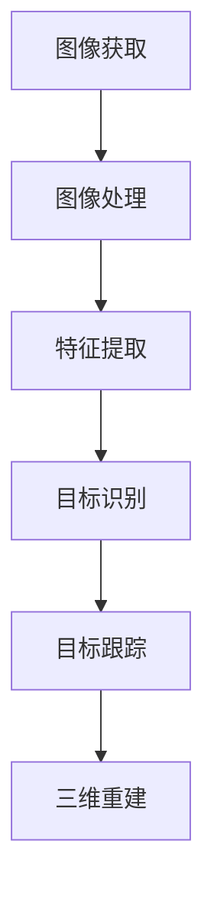

                 

# 《计算机视觉》

> 关键词：计算机视觉，图像处理，深度学习，特征提取，目标识别，目标跟踪，三维重建

> 摘要：本文将深入探讨计算机视觉这一领域，从基础概念到实际应用，再到未来发展趋势，全面解析计算机视觉的核心技术。我们将通过逐步分析推理，探讨图像获取、图像处理、特征提取、图像识别与分类、目标跟踪与检测、三维重建以及计算机视觉在现实世界中的应用，以期帮助读者全面了解计算机视觉的原理与应用。

## 第一部分：计算机视觉基础

### 第1章：计算机视觉概述

#### 1.1 计算机视觉的定义与发展

**1.1.1 计算机视觉的定义**

计算机视觉是指使计算机具备通过图像获取、处理、分析和理解信息的能力。其目标是模拟人类的视觉系统，使计算机能够从图像中提取有意义的信息。

**1.1.2 计算机视觉的发展历程**

计算机视觉起源于20世纪60年代，随着计算机硬件和算法的不断发展，计算机视觉技术也在不断进步。早期的计算机视觉主要集中在图像处理和特征提取，后来随着深度学习的兴起，计算机视觉取得了显著的突破。

**1.1.3 计算机视觉的应用领域**

计算机视觉技术已经广泛应用于多个领域，包括医疗、工业、交通、安防、娱乐等。例如，在医疗领域，计算机视觉可以用于医学图像分析、肿瘤检测和诊断；在工业领域，计算机视觉可以用于自动化检测与质量控制、工业机器人控制等。

#### 1.2 计算机视觉的基本概念

**1.2.1 图像与像素**

图像是由像素组成的二维矩阵，像素是图像的基本单位。图像的分辨率决定了图像的清晰度，通常用像素数表示。

**1.2.2 边缘检测与特征提取**

边缘检测是图像处理中的重要步骤，用于找到图像中的边缘区域。特征提取则是从图像中提取具有区分性的特征，用于后续的图像识别和分类。

**1.2.3 层次化视觉模型**

层次化视觉模型是指通过多个层次来处理图像，从低级到高级，逐步提取图像中的信息。典型的层次化视觉模型包括卷积神经网络（CNN）等。

### 第2章：数字图像处理基础

#### 2.1 数字图像的基本操作

**2.1.1 图像的获取与存储**

图像可以通过摄像头、传感器等设备获取。存储图像的常见格式包括BMP、JPEG、PNG等。

**2.1.2 图像的变换与增强**

图像的变换包括旋转、缩放、翻转等。图像增强是指通过调整图像的亮度和对比度，使图像更清晰。

**2.1.3 图像的滤波与边缘检测**

图像滤波用于去除图像中的噪声，边缘检测用于找到图像中的边缘。

#### 2.2 颜色模型与空间表示

**2.2.1 颜色模型的基本概念**

颜色模型是表示颜色的一种方法。常见的颜色模型包括RGB、HSV、Lab等。

**2.2.2 RGB颜色模型**

RGB颜色模型是一种加性颜色模型，通过红、绿、蓝三种颜色的叠加来生成其他颜色。

**2.2.3 Lab颜色模型**

Lab颜色模型是一种减性颜色模型，通过光的三刺激值（L*、a*、b*）来表示颜色。

#### 2.3 图像分割与目标检测

**2.3.1 图像分割的基本概念**

图像分割是将图像划分为多个区域，每个区域代表图像中的一个对象或背景。

**2.3.2 区域生长算法**

区域生长算法是一种基于像素相似性的图像分割方法，通过逐步合并相似像素来形成区域。

**2.3.3 水平集方法**

水平集方法是利用水平集理论进行图像分割的一种方法，通过求解水平集方程来生成分割界面。

**2.3.4 目标检测算法**

目标检测是识别图像中的特定对象。常见的目标检测算法包括单目标检测算法（如HOG、YOLO）和多目标检测算法（如SSD、Faster R-CNN）。

### 第3章：特征提取与描述

#### 3.1 特征提取的基本原理

**3.1.1 特征提取的重要性**

特征提取是将原始图像数据转化为具有区分性的特征表示，以适应后续的图像识别和分类。

**3.1.2 传统特征提取方法**

传统特征提取方法包括边缘检测、角点检测、纹理特征提取等。

**3.1.3 基于深度学习的特征提取**

基于深度学习的特征提取方法通过训练深度神经网络来自动提取具有区分性的特征。

#### 3.2 纹理特征提取

**3.2.1 纹理特征的基本概念**

纹理特征是描述图像纹理信息的一种特征表示。

**3.2.2 纹理特征提取算法**

纹理特征提取算法包括基于统计的方法和基于频域的方法。

**3.2.3 纹理特征的实例化**

实例化纹理特征是将纹理特征应用于实际图像处理任务。

#### 3.3 角点特征提取

**3.3.1 角点的定义与检测**

角点是图像中两个边缘的交汇点。

**3.3.2 角点特征提取算法**

角点特征提取算法包括SIFT、SURF等。

**3.3.3 角点特征的匹配**

角点特征的匹配是用于在多幅图像中找到对应角点的方法。

### 第4章：图像识别与分类

#### 4.1 图像识别的基本概念

**4.1.1 图像识别的定义**

图像识别是识别图像中的对象或场景。

**4.1.2 图像识别的分类方法**

图像识别的分类方法包括基于传统算法的分类方法和基于深度学习的分类方法。

**4.1.3 图像识别的性能指标**

图像识别的性能指标包括准确率、召回率、F1值等。

#### 4.2 传统的图像识别算法

**4.2.1 K最近邻算法**

K最近邻算法是一种基于实例的图像识别方法。

**4.2.2 支持向量机**

支持向量机是一种基于间隔的图像识别方法。

**4.2.3 决策树与随机森林**

决策树和随机森林是一种基于树的图像识别方法。

#### 4.3 深度学习在图像识别中的应用

**4.3.1 卷积神经网络（CNN）**

卷积神经网络是一种基于卷积操作的图像识别方法。

**4.3.2 全连接神经网络**

全连接神经网络是一种基于全连接操作的图像识别方法。

**4.3.3 循环神经网络（RNN）**

循环神经网络是一种基于循环操作的图像识别方法。

### 第5章：目标跟踪与检测

#### 5.1 目标跟踪的基本概念

**5.1.1 目标跟踪的定义**

目标跟踪是识别并跟踪图像序列中的特定对象。

**5.1.2 目标跟踪的类型**

目标跟踪的类型包括基于特征的目标跟踪和基于检测的目标跟踪。

**5.1.3 目标跟踪的性能指标**

目标跟踪的性能指标包括跟踪精度、跟踪连续性等。

#### 5.2 基于特征的目标跟踪

**5.2.1 基于模板匹配的跟踪**

基于模板匹配的跟踪是通过寻找模板在图像中的最佳匹配位置进行跟踪。

**5.2.2 基于外观模型的目标跟踪**

基于外观模型的目标跟踪是通过模型来描述目标的外观特征进行跟踪。

**5.2.3 基于深度学习的目标跟踪**

基于深度学习的目标跟踪是通过训练深度神经网络进行跟踪。

#### 5.3 基于检测的目标跟踪

**5.3.1 单目标检测算法**

单目标检测算法是一种检测单个目标的方法。

**5.3.2 多目标检测算法**

多目标检测算法是一种检测多个目标的方法。

**5.3.3 目标跟踪中的数据关联方法**

数据关联方法用于将检测到的目标与已跟踪的目标进行关联。

### 第6章：三维重建与立体视觉

#### 6.1 三维重建的基本概念

**6.1.1 三维重建的定义**

三维重建是从二维图像中恢复三维场景信息。

**6.1.2 三维重建的方法**

三维重建的方法包括基于几何的方法和基于深度学习的
```markdown
方法。

**6.1.3 三维重建的应用领域**

三维重建的应用领域包括文物数字化、自驾车导航、虚拟现实与增强现实等。

#### 6.2 立体视觉基本原理

**6.2.1 立体视觉的基本原理**

立体视觉是通过两个或多个视角获取的图像来感知深度信息。

**6.2.2 立体匹配算法**

立体匹配算法是通过寻找图像间的对应点来恢复深度信息。

**6.2.3 三维重建中的视觉融合**

视觉融合是将多视角的图像融合成一幅完整的3D图像。

#### 6.3 三维重建的应用案例

**6.3.1 文物数字化**

文物数字化是将文物的外观和结构信息转化为数字化的三维模型。

**6.3.2 自驾车导航**

自驾车导航是利用三维重建技术来生成道路的三维模型，为自驾车提供导航信息。

**6.3.3 虚拟现实与增强现实**

虚拟现实与增强现实是利用三维重建技术来生成虚拟的三维场景，为用户提供沉浸式的体验。

### 第7章：计算机视觉在现实世界中的应用

#### 7.1 计算机视觉在医疗领域的应用

**7.1.1 医学图像分析**

医学图像分析是利用计算机视觉技术对医学图像进行自动化分析。

**7.1.2 肿瘤检测与诊断**

肿瘤检测与诊断是利用计算机视觉技术对医学图像中的肿瘤进行检测和诊断。

**7.1.3 药物研发**

药物研发是利用计算机视觉技术对药物分子进行自动化筛选和分析。

#### 7.2 计算机视觉在工业领域的应用

**7.2.1 自动化检测与质量控制**

自动化检测与质量控制是利用计算机视觉技术对生产过程中的产品进行自动化检测和质量控制。

**7.2.2 工业机器人**

工业机器人是利用计算机视觉技术来实现机器人的自动化操作。

**7.2.3 无人机监控与巡检**

无人机监控与巡检是利用计算机视觉技术对无人机进行监控和巡检。

#### 7.3 计算机视觉在智能家居领域的应用

**7.3.1 智能监控与安防**

智能监控与安防是利用计算机视觉技术来实现智能家居的监控和安防功能。

**7.3.2 智能家居控制**

智能家居控制是利用计算机视觉技术来实现对智能家居设备的自动化控制。

**7.3.3 虚拟助手与智能交互**

虚拟助手与智能交互是利用计算机视觉技术来实现人机交互和智能服务。

### 第8章：计算机视觉的未来发展趋势

#### 8.1 计算机视觉的挑战与机遇

**8.1.1 计算机视觉面临的挑战**

计算机视觉面临的挑战包括数据隐私、计算资源、实时性等。

**8.1.2 计算机视觉的未来趋势**

计算机视觉的未来趋势包括数据驱动的视觉理解、多模态融合、增强现实等。

**8.1.3 新兴技术的应用前景**

新兴技术的应用前景包括计算机视觉在物联网、自动驾驶、智慧城市等领域的应用。

#### 8.2 开放性问题与研究方向

**8.2.1 计算机视觉中的伦理问题**

计算机视觉中的伦理问题包括数据隐私、偏见和公平性等。

**8.2.2 计算机视觉与人工智能的融合**

计算机视觉与人工智能的融合是未来研究的一个重要方向。

**8.2.3 跨学科交叉研究**

跨学科交叉研究是推动计算机视觉技术发展的重要途径。

### 附录：计算机视觉工具与资源

#### A.1 主流计算机视觉库介绍

**A.1.1 OpenCV**

OpenCV是一个开源的计算机视觉库，提供了丰富的图像处理和计算机视觉算法。

**A.1.2 TensorFlow**

TensorFlow是一个开源的深度学习框架，提供了丰富的计算机视觉模型和算法。

**A.1.3 PyTorch**

PyTorch是一个开源的深度学习框架，提供了灵活的深度学习模型定义和计算图操作。

#### A.2 计算机视觉项目实战案例

**A.2.1 人脸识别**

人脸识别是计算机视觉中的一项重要技术，通过训练深度神经网络来实现对人脸的识别。

**A.2.2 车辆检测与跟踪**

车辆检测与跟踪是利用计算机视觉技术来实现对车辆的位置和运动轨迹的检测和跟踪。

**A.2.3 基于深度学习的图像分类**

基于深度学习的图像分类是利用深度神经网络来实现对图像的分类和识别。

---

**作者：AI天才研究院/AI Genius Institute & 禅与计算机程序设计艺术 /Zen And The Art of Computer Programming**


### 核心概念与联系

为了更好地理解计算机视觉的核心概念及其相互联系，我们使用Mermaid流程图来展示这些概念之间的关系。

#### Mermaid 流程图



在这个流程图中，图像获取是计算机视觉的第一步，随后图像会经过处理，提取特征。这些特征将用于目标识别，识别出图像中的对象。目标识别的结果可以用于目标跟踪，即跟踪对象在图像序列中的运动轨迹。最终，通过目标跟踪得到的三维重建结果，可以用于三维场景的建模和应用。

### 核心算法原理讲解

在计算机视觉中，卷积神经网络（CNN）是一种常用的图像识别算法。CNN通过多层卷积、池化和全连接层来提取图像特征，并进行分类。以下是一个简单的CNN算法的原理讲解，使用伪代码来详细阐述。

#### 图像识别算法（CNN）

```plaintext
# 定义卷积层
conv1 = Conv2D(filters=32, kernel_size=(3, 3), activation='relu', input_shape=(28, 28, 1))

# 定义池化层
pool1 = MaxPooling2D(pool_size=(2, 2))

# 定义全连接层
fc1 = Dense(units=128, activation='relu')

# 定义输出层
output = Dense(units=10, activation='softmax')
```

**解释：**

1. **卷积层（Conv2D）：** 卷积层通过卷积操作从输入图像中提取特征。每个卷积核（filter）提取图像中的一部分特征，通过逐像素的卷积运算，将特征图（feature map）输出。

2. **激活函数（activation）：** 激活函数用于增加网络的非线性，最常用的激活函数是ReLU（Rectified Linear Unit），它可以加快网络的训练速度。

3. **池化层（MaxPooling2D）：** 池化层用于降低特征图的尺寸，减少参数数量，提高网络的泛化能力。常用的池化方式有最大池化（MaxPooling）和平均池化（AveragePooling）。

4. **全连接层（Dense）：** 全连接层将卷积层输出的特征图展平为一维向量，然后进行线性变换，输出分类结果。

5. **输出层（softmax）：** 输出层使用softmax函数对分类结果进行归一化，输出每个类别的概率分布。

通过这些层的组合，CNN可以有效地提取图像特征并进行分类。例如，在图像分类任务中，输入图像经过卷积层和池化层后，特征图会被展平为一维向量，然后输入到全连接层，最终输出10个类别（如数字0-9）的概率分布。

### 数学模型和数学公式

在计算机视觉中，数学模型和公式扮演着重要的角色，用于描述图像的特征提取、目标检测和三维重建等过程。以下我们将详细介绍一些常用的数学模型和公式，并通过具体实例进行解释。

#### Sobel算子

Sobel算子是一种常见的边缘检测算法，用于检测图像中的水平和垂直边缘。Sobel算子通过计算图像在水平和垂直方向上的导数，然后进行阈值处理，以提取边缘信息。

**公式：**

$$
S_x = \frac{1}{2} \left( G_x + (-G_x) \right)
$$

$$
S_y = \frac{1}{2} \left( G_y + (-G_y) \right)
$$

其中，$G_x$ 和 $G_y$ 分别为图像 $I$ 在水平和垂直方向上的导数。

**实例：**

假设图像 $I$ 的像素值为 $I(x, y)$，则可以计算水平和垂直方向上的导数：

$$
G_x = \sum_{i=-1}^{1} \sum_{j=-1}^{1} (-1)^{i+j} I(x+i, y+j)
$$

$$
G_y = \sum_{i=-1}^{1} \sum_{j=-1}^{1} (-1)^{i+j} I(x+i, y+j)
$$

然后，通过Sobel算子计算水平和垂直边缘：

$$
S_x = \frac{1}{2} \left( G_x + (-G_x) \right)
$$

$$
S_y = \frac{1}{2} \left( G_y + (-G_y) \right)
$$

最终，通过阈值处理可以得到边缘图像。

### 项目实战

#### 基于深度学习的人脸识别

##### 开发环境搭建

**环境要求：**

- Python 3.7 或以上版本
- TensorFlow 2.3 或以上版本
- OpenCV 4.5 或以上版本

**安装步骤：**

1. 安装 Python 3.7 或以上版本。

2. 通过以下命令安装 TensorFlow：

   ```shell
   pip install tensorflow==2.3
   ```

3. 通过以下命令安装 OpenCV：

   ```shell
   pip install opencv-python==4.5
   ```

##### 源代码实现

```python
import tensorflow as tf
import cv2
import numpy as np

# 导入预训练的模型
model = tf.keras.applications.VGG16(weights='imagenet')

# 定义预处理函数
def preprocess_image(image):
    image = tf.expand_dims(image, 0)
    image = tf.keras.applications.vgg16.preprocess_input(image)
    return image

# 定义后处理函数
def decode_predictions(predictions):
    predicted_class = np.argmax(predictions, axis=1)
    class_names = ['aeroplane', 'bicycle', 'bird', 'boat', 'bottle', 'bus', 'car', 'cat', 'chair', 'cow', 'diningtable', 'dog', 'horse', 'motorbike', 'person', 'plane', 'screen', 'sheep', 'sofa', 'train', 'tvmonitor']
    return class_names[predicted_class[0]]

# 加载测试图像
test_image = cv2.imread('test_image.jpg')

# 进行图像预处理
processed_image = preprocess_image(test_image)

# 进行人脸识别
predictions = model.predict(processed_image)

# 解析预测结果
predicted_class = decode_predictions(predictions)

print(f'预测类别：{predicted_class}')
```

##### 代码解读与分析

**代码解读：**

1. **导入库：** 导入 TensorFlow、OpenCV 和 NumPy 库。

2. **导入预训练模型：** 使用 VGG16 预训练模型进行人脸识别。

3. **预处理函数：** 定义预处理函数 `preprocess_image`，用于对输入图像进行预处理，使其符合模型输入要求。

4. **后处理函数：** 定义后处理函数 `decode_predictions`，用于解析模型的预测结果，返回预测的类别。

5. **加载测试图像：** 使用 OpenCV 加载测试图像。

6. **预处理图像：** 调用预处理函数对图像进行预处理。

7. **进行人脸识别：** 使用模型对预处理后的图像进行预测。

8. **解析预测结果：** 调用后处理函数解析预测结果，输出预测的类别。

**代码分析：**

本示例使用 TensorFlow 的 VGG16 预训练模型进行人脸识别。首先，通过 OpenCV 加载测试图像，然后对图像进行预处理，使其符合模型输入要求。预处理函数 `preprocess_image` 使用 TensorFlow 的 `preprocess_input` 函数对图像进行标准化处理。接下来，使用模型对预处理后的图像进行预测，并调用后处理函数 `decode_predictions` 解析预测结果，输出预测的类别。

通过这个示例，读者可以了解如何使用深度学习模型进行人脸识别的基本流程，包括模型导入、图像预处理、模型预测和结果解析。这个示例也展示了如何结合 TensorFlow 和 OpenCV 库来实现计算机视觉应用。

### **结束语**

本文从计算机视觉的基础概念、数字图像处理、特征提取、图像识别与分类、目标跟踪与检测、三维重建，到计算机视觉在现实世界中的应用，再到未来发展趋势，全面解析了计算机视觉的核心技术和应用场景。我们通过逐步分析推理，详细讲解了核心概念和算法原理，并通过项目实战展示了如何将理论知识应用于实际开发中。

随着技术的不断进步，计算机视觉领域正面临前所未有的机遇和挑战。未来，计算机视觉将继续在医疗、工业、交通、安防、娱乐等多个领域发挥重要作用，推动人工智能技术的发展。同时，我们也需要关注计算机视觉中的伦理问题，确保其应用的安全和公正。

希望本文能帮助您全面了解计算机视觉的原理和应用，激发您对这一领域的兴趣和热情。在您的计算机视觉之旅中，不断探索和学习，您将发现无限的可能性和创新空间。让我们共同期待计算机视觉技术的未来发展，期待它在更广泛的领域中发挥出更大的价值。

---

**作者：AI天才研究院/AI Genius Institute & 禅与计算机程序设计艺术 /Zen And The Art of Computer Programming**。感谢您的阅读，期待与您共同探讨计算机视觉的无限可能。如果您有任何疑问或建议，欢迎随时联系我们。让我们携手前进，共创美好未来！

