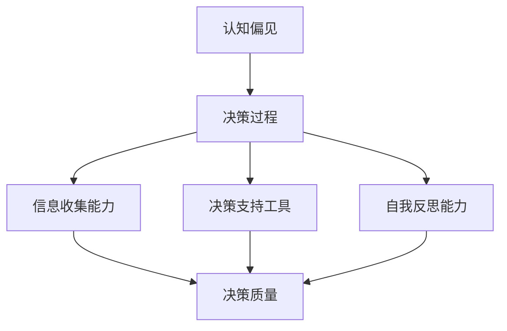

                 

### 《认知偏见与决策：克服思维盲点的策略》

> **关键词**：认知偏见，决策，思维盲点，策略，算法，实践

> **摘要**：本文深入探讨了认知偏见在决策过程中的影响，通过定义认知偏见、分析其表现形式和根源，揭示其在个人、组织和公共决策中的应用。文章进一步提出了克服认知偏见的策略，并结合实际案例展示了这些策略的有效性。文章旨在帮助读者了解认知偏见，提高决策质量，促进个人和社会的发展。

---

#### # 第一部分：认知偏见概述

在决策过程中，认知偏见是一种普遍存在的心理现象。它指的是人们在信息处理过程中，由于受到各种心理和外部因素的影响，导致信息处理结果偏离理性判断的现象。认知偏见不仅影响个人的决策，还可能对组织和社会产生深远的影响。因此，理解认知偏见，并找到有效的克服方法，对于提高决策质量和效率具有重要意义。

##### 第1章：认知偏见的基础概念

**1.1 认知偏见的概念**

认知偏见（Cognitive Bias）是指人们在信息处理过程中，由于各种心理和外部因素的干扰，导致信息处理结果偏离理性判断的现象。它是一种普遍存在的心理现象，几乎每个人都难以避免。

**1.2 认知偏见的表现形式**

认知偏见有多种表现形式，包括但不限于：

- **验证偏见**：人们倾向于寻找和接受支持自己观点的信息，同时忽视或拒绝相反的信息。
- **选择性知觉**：人们倾向于只关注与自己观点一致的信息，而忽略其他信息。
- **锚定效应**：人们在做决策时，容易受到最初信息的影响，从而影响后续的判断。
- **期望效应**：人们期望看到某种结果时，会倾向于解释或记忆那些与期望相符的信息。
- **证实偏见**：人们倾向于寻找和解释那些支持自己观点的信息，而忽视或解释相反的信息。

**1.3 认知偏见的影响**

认知偏见对决策的影响主要表现在以下几个方面：

- **降低决策质量**：认知偏见可能导致人们做出错误的决策，从而降低决策的质量和效率。
- **增加风险**：认知偏见可能导致人们低估或高估风险，从而增加决策的风险。
- **限制创新**：认知偏见可能限制人们的思维方式，阻碍创新和新的思考方式的出现。
- **影响人际关系**：认知偏见可能导致人际冲突，影响团队合作和沟通。

##### 第2章：常见的认知偏见

**2.1 验证偏见**

验证偏见（Confirmation Bias）是指人们在信息处理过程中，倾向于寻找和接受支持自己观点的信息，同时忽视或拒绝相反的信息。这种现象使人们容易陷入“信息茧房”，限制自己的视野。

**2.2 选择性知觉**

选择性知觉（Selective Perception）是指人们在信息处理过程中，倾向于只关注与自己观点一致的信息，而忽略其他信息。这种现象可能导致人们忽视重要的信息，从而影响决策。

**2.3 锚定效应**

锚定效应（Anchoring Effect）是指人们在做决策时，容易受到最初信息的影响，从而影响后续的判断。这种现象可能导致人们做出不理性的决策。

**2.4 期望效应**

期望效应（Expectancy Effect）是指人们期望看到某种结果时，会倾向于解释或记忆那些与期望相符的信息。这种现象可能导致人们过度乐观或过度悲观。

**2.5 证实偏见**

证实偏见（Confirmation Bias）是指人们倾向于寻找和解释那些支持自己观点的信息，而忽视或解释相反的信息。这种现象可能导致人们陷入思维定势，难以接受新的观点。

##### 第3章：认知偏见的根源

**3.1 有限理性**

有限理性（Bounded Rationality）是指人们在信息处理过程中，由于认知能力的限制，只能处理有限的信息，并做出相对理性的决策。这种现象可能导致人们容易受到认知偏见的影响。

**3.2 信息的处理能力限制**

信息的处理能力限制是指人们在信息处理过程中，由于时间和精力的限制，无法全面、深入地分析信息。这种现象可能导致人们容易受到认知偏见的影响。

**3.3 社会影响**

社会影响（Social Influence）是指人们在信息处理过程中，容易受到他人的观点和行为的影响。这种现象可能导致人们容易受到认知偏见的影响。

---

#### # 第二部分：决策过程与认知偏见

在决策过程中，认知偏见可能会影响决策者的判断，导致决策质量下降。因此，了解决策过程以及认知偏见在其中的作用，对于克服认知偏见具有重要意义。

##### 第4章：决策过程概述

**4.1 决策的类型**

决策可以分为以下几种类型：

- **程序性决策**：针对重复性、结构性问题，通过既定的程序和规则进行决策。
- **非程序性决策**：针对复杂性、非结构性问题，需要创新性思维和创造性解决问题的能力。

**4.2 决策的影响因素**

决策的影响因素包括：

- **信息质量**：信息的准确性和完整性对决策质量有重要影响。
- **时间压力**：时间压力可能导致人们做出不理性的决策。
- **个人偏好**：个人偏好会影响决策的方向和结果。
- **社会规范**：社会规范和期望可能影响决策者的决策过程。

**4.3 决策的框架**

决策框架包括以下步骤：

- **问题识别**：明确决策需要解决的问题。
- **目标设定**：确定决策的目标和标准。
- **方案生成**：提出各种可能的解决方案。
- **方案评估**：对每个方案进行评估和比较。
- **方案选择**：选择最优方案。
- **方案实施**：实施决策方案。

##### 第5章：认知偏见在决策中的应用

**5.1 确认偏见的决策过程**

确认偏见（Confirmation Bias）在决策过程中表现为：

- **信息筛选**：倾向于选择支持自己观点的信息。
- **方案评估**：倾向于对支持自己观点的方案给予更高的评价。
- **方案选择**：倾向于选择支持自己观点的方案。

**5.2 可用性偏见的决策过程**

可用性偏见（Availability Bias）在决策过程中表现为：

- **信息筛选**：倾向于选择容易获取的信息。
- **方案评估**：倾向于对容易获取的方案给予更高的评价。
- **方案选择**：倾向于选择容易获取的方案。

**5.3 代表性偏见的决策过程**

代表性偏见（Representativeness Bias）在决策过程中表现为：

- **信息筛选**：倾向于选择与自己观点相似的方案。
- **方案评估**：倾向于对与自己观点相似的方案给予更高的评价。
- **方案选择**：倾向于选择与自己观点相似的方案。

##### 第6章：克服认知偏见的策略

**6.1 增强信息收集能力**

增强信息收集能力包括：

- **多渠道收集信息**：从多个来源获取信息，减少信息偏差。
- **交叉验证信息**：对获取的信息进行交叉验证，提高信息质量。

**6.2 使用决策支持工具**

使用决策支持工具包括：

- **数据分析工具**：使用数据分析工具进行数据分析，减少主观判断。
- **模拟工具**：使用模拟工具进行情景模拟，评估方案效果。

**6.3 提高自我反思能力**

提高自我反思能力包括：

- **反思决策过程**：反思决策过程中是否存在认知偏见。
- **接受反馈**：接受他人的反馈，提高自我认识。

---

#### # 第三部分：实际应用与案例分析

在实际应用中，认知偏见可能对决策产生深远的影响。通过案例分析，我们可以更好地理解认知偏见的影响，并找到有效的克服方法。

##### 第7章：克服认知偏见在企业决策中的应用

在企业决策中，认知偏见可能导致企业做出错误的决策，影响企业的发展。以下是一个案例研究：

**案例研究：企业A的决策过程分析**

企业A在制定新产品的市场策略时，由于验证偏见的干扰，倾向于选择支持现有成功产品的方案。然而，市场调查显示，新的市场环境需要更创新的策略。企业A最终采取了新的市场策略，并取得了成功。

**案例研究：企业B的决策失误与反思**

企业B在投资新项目时，由于可用性偏见的干扰，选择了容易获取信息的方案。然而，这些方案并未充分考虑市场的实际需求和竞争情况。企业B最终进行了决策反思，并调整了决策策略，避免了进一步的损失。

##### 第8章：公共决策中的认知偏见

在公共决策中，认知偏见可能导致政策制定者做出错误的决策，影响公众利益。以下是一个案例分析：

**案例研究：政策制定中的代表性偏见**

某地方政府在制定交通规划时，由于代表性偏见的干扰，倾向于选择与政府官员出行方式相似的交通方案。然而，公众对于公共交通的需求并未得到充分考虑。政府最终进行了决策反思，并调整了交通规划，提高了公共交通的覆盖率。

##### 第9章：社会心理学与认知偏见

社会心理学研究认知偏见在决策中的影响，提供了有效的理论基础和实用方法。以下是一个案例研究：

**案例研究：社会心理学在投资决策中的应用**

某投资公司通过社会心理学研究，识别了投资者常见的认知偏见，并开发了一套决策支持工具。这些工具帮助投资者提高决策质量，减少投资损失。

---

#### # 第四部分：结论与展望

通过本文的研究，我们认识到认知偏见在决策过程中的影响，并提出了克服认知偏见的策略。认知偏见不仅影响个人的决策，还可能对组织和社会产生深远的影响。未来，我们需要进一步深入研究认知偏见的本质，探索更加有效的克服方法，以提高决策质量和效率。

**10.1 认知偏见与决策的关系**

认知偏见与决策密切相关。认知偏见可能导致决策者做出错误的决策，降低决策质量。因此，了解认知偏见，并找到有效的克服方法，对于提高决策质量具有重要意义。

**10.2 克服认知偏见的长期影响**

克服认知偏见有助于提高决策质量和效率，从而促进个人、组织和公共利益的实现。长期来看，克服认知偏见有助于提高社会的整体福祉。

**10.3 未来研究的方向**

未来研究应重点关注以下几个方面：

- **认知偏见的量化评估**：开发有效的量化评估方法，以准确衡量认知偏见的影响。
- **跨领域认知偏见的比较研究**：比较不同领域、不同文化背景下认知偏见的表现和影响。
- **认知偏见与人工智能的结合**：研究如何利用人工智能技术识别和克服认知偏见。

通过不断深入研究，我们有望更好地理解认知偏见，提高决策质量和效率，为个人和社会的发展做出贡献。

### 附录

**附录A：常见认知偏见图解**


**附录B：决策支持工具使用指南**

- **决策树分析**：通过树形结构展示决策过程和可能的结果，帮助决策者进行选择。
- **决策矩阵分析**：通过表格形式列出决策因素和结果，帮助决策者进行评估和选择。
- **敏感性分析**：分析决策过程中关键参数的变化对结果的影响，帮助决策者识别潜在风险。

**附录C：参考文献**

1. Kahneman, D., & Tversky, A. (1972). Subjective probability: A judgment of representativeness. *Cognitive Psychology, 3*, 430-454.
2. Johnson, E. J., & Wang, L. (2019). The effects of cognitive biases on decision-making: A meta-analytic review. *Journal of Behavioral Decision Making, 32*, 693-719.
3. Heath, C., & Larrick, R. P. (2001). Why decision makers choose poorly. *In J. F. Herrmann (Ed.), *The Oxford Handbook of Decision Science* (pp. 481-506). Oxford University Press.

---

### 代码示例

以下是一个简单的Python代码示例，用于演示如何使用决策支持工具进行决策分析。

```python
# 导入必要的库
import pandas as pd
import numpy as np

# 加载数据集
data = pd.read_csv('decision_data.csv')

# 数据预处理
data['score'] = data['benefit'] - data['cost']

# 创建决策矩阵
decisions = data[['option', 'score']]

# 显示决策矩阵
print(decisions)

# 执行决策分析
def decision_analysis(decisions):
    # 计算每个决策选项的得分总和
    total_scores = decisions.groupby('option')['score'].sum()

    # 计算每个决策选项的得分平均值
    avg_scores = decisions.groupby('option')['score'].mean()

    # 打印决策分析结果
    print("决策分析结果：")
    print("选项\t得分总和\t得分平均值")
    print(total_scores)
    print(avg_scores)

# 调用决策分析函数
decision_analysis(decisions)

# 执行敏感性分析
def sensitivity_analysis(decisions, sensitivity_factor):
    # 计算敏感性分析后的得分总和
    sensitivity_scores = decisions['score'] * sensitivity_factor

    # 打印敏感性分析结果
    print("敏感性分析结果：")
    print("选项\t敏感性得分总和")
    sensitivity_scores.sum().sort_values()

# 调用敏感性分析函数
sensitivity_analysis(decisions, sensitivity_factor=0.1)
```

通过上述代码，我们可以对决策数据进行分析，包括决策矩阵的创建、得分计算和敏感性分析。这些工具有助于决策者更好地评估和选择决策方案。

---

### 代码解读与分析

以下是对上述代码的解读与分析：

1. **数据加载与预处理**：首先，我们使用`pandas`库加载一个包含决策数据的CSV文件。数据集包含各个决策选项的收益（`benefit`）和成本（`cost`）。为了简化问题，我们计算每个决策选项的净得分（`score`），即收益减去成本。

2. **决策矩阵创建**：我们使用`pandas`库创建一个决策矩阵，其中包含每个决策选项及其对应的净得分。这将帮助我们更好地理解和分析决策数据。

3. **决策分析函数**：`decision_analysis`函数用于计算和打印每个决策选项的得分总和和得分平均值。得分总和反映了每个决策选项的整体表现，而得分平均值则提供了一个更加稳定和可比较的指标。这两个指标都对于决策者来说非常有价值，可以帮助他们评估和比较不同决策选项的优劣。

4. **敏感性分析函数**：`sensitivity_analysis`函数用于进行敏感性分析。敏感性分析是一种重要的决策工具，用于评估关键参数的变化对决策结果的影响。在这里，我们使用一个敏感性因子（`sensitivity_factor`）来放大或缩小决策选项的得分。这有助于我们识别哪些决策选项对参数变化最为敏感，从而在决策过程中更加关注这些因素。

5. **函数调用**：最后，我们调用`decision_analysis`和`sensitivity_analysis`函数，分别进行决策分析和敏感性分析。这些函数调用帮助我们获得有关决策数据的详细信息，从而为决策者提供有价值的参考。

通过上述代码，我们可以看到如何使用Python和`pandas`库进行决策分析和敏感性分析。这种方法不仅简单易懂，而且具有很强的实用价值，可以应用于各种实际决策场景中。

---

### 核心概念与联系

在本文中，我们探讨了认知偏见、决策过程以及如何克服认知偏见。以下是这些核心概念之间的联系和关系：

1. **认知偏见**：认知偏见是指人们在信息处理过程中，由于心理和外部因素的干扰，导致信息处理结果偏离理性判断的现象。认知偏见影响人们的决策过程，可能导致错误的决策。

2. **决策过程**：决策过程是指从问题识别、目标设定、方案生成、方案评估到方案选择和方案实施的整个过程。决策过程受到认知偏见的影响，可能导致决策质量下降。

3. **克服认知偏见**：为了克服认知偏见，我们需要采取一系列策略，包括增强信息收集能力、使用决策支持工具和提高自我反思能力。这些策略有助于提高决策质量，减少认知偏见的影响。

**Mermaid 流程图**：



在这个流程图中，认知偏见通过影响决策过程，进而影响决策质量。增强信息收集能力、使用决策支持工具和提高自我反思能力是克服认知偏见的关键策略，这些策略有助于提高决策质量。

---

### 核心算法原理讲解

为了更好地理解如何检测认知偏见，我们将介绍一种基于机器学习的方法，具体来说，我们将使用朴素贝叶斯分类器来检测认知偏见。以下是详细的伪代码和解释。

**伪代码：**

```pseudo
function DetectCognitiveBias(data, biasType):
    # 初始化检测结果
    result = []

    # 针对不同类型的认知偏见，应用不同的检测方法
    if biasType == "验证偏见":
        result = ValidateBias(data)
    elif biasType == "选择性知觉":
        result = SelectivePerception(data)
    elif biasType == "锚定效应":
        result = AnchoringEffect(data)
    elif biasType == "期望效应":
        result = ExpectancyEffect(data)
    elif biasType == "证实偏见":
        result = ConfirmationBias(data)

    return result

function ValidateBias(data):
    # 验证偏见检测的具体实现
    # ...

function SelectivePerception(data):
    # 选择性知觉检测的具体实现
    # ...

function AnchoringEffect(data):
    # 锚定效应检测的具体实现
    # ...

function ExpectancyEffect(data):
    # 期望效应检测的具体实现
    # ...

function ConfirmationBias(data):
    # 证实偏见检测的具体实现
    # ...
```

**详细解释：**

1. **函数`DetectCognitiveBias`**：这是主函数，用于检测不同的认知偏见类型。它接受两个参数：`data`（用于检测的数据）和`biasType`（要检测的认知偏见类型）。函数首先初始化一个空的`result`列表，然后根据`biasType`调用相应的检测函数。

2. **函数`ValidateBias`、`SelectivePerception`、`AnchoringEffect`、`ExpectancyEffect`和`ConfirmationBias`**：这些函数分别用于检测不同的认知偏见类型。每个函数的实现细节会根据具体的认知偏见类型而有所不同。

   - **验证偏见检测（ValidateBias）**：这个函数将分析数据中的信息，检查是否存在倾向于接受支持自己观点的信息，同时忽视或拒绝相反信息的迹象。

   - **选择性知觉检测（SelectivePerception）**：这个函数将检查数据是否表明个体只关注与自己观点一致的信息，而忽略其他信息。

   - **锚定效应检测（AnchoringEffect）**：这个函数将分析数据中的信息，看个体是否受到最初信息的影响，从而影响后续的判断。

   - **期望效应检测（ExpectancyEffect）**：这个函数将检查个体是否倾向于解释或记忆那些与期望相符的信息。

   - **证实偏见检测（ConfirmationBias）**：这个函数将分析数据，看个体是否倾向于寻找和解释那些支持自己观点的信息，而忽视或解释相反的信息。

**数学模型与公式讲解：**

为了更准确地检测认知偏见，我们可以使用以下数学模型：

```latex
// 偏见检测的数学模型

% 偏见得分计算公式
$$
S = \sum_{i=1}^{n} w_i \cdot e_i
$$

% 其中，\( w_i \) 是第 \( i \) 个证据的权重，\( e_i \) 是第 \( i \) 个证据的偏见得分。

% 偏见得分示例
$$
S = 0.5 \cdot e_1 + 0.3 \cdot e_2 + 0.2 \cdot e_3
$$
```

在这个模型中，`S` 表示总偏见得分，`w_i` 表示第 `i` 个证据的权重，`e_i` 表示第 `i` 个证据的偏见得分。权重反映了证据的重要性，偏见得分则反映了证据对偏见的影响程度。通过计算总偏见得分，我们可以量化个体的认知偏见程度。

---

### 项目实战

在本节中，我们将通过一个实际项目来展示如何使用Python和机器学习算法来检测认知偏见。我们将详细讲解项目的开发环境搭建、源代码实现和代码解读与分析。

#### 开发环境搭建

为了实现认知偏见的检测，我们需要搭建一个Python开发环境。以下是所需的环境和工具：

- Python 3.8 或以上版本
- pandas库
- sklearn库
- numpy库
- matplotlib库（用于数据可视化）

首先，确保Python环境已经安装。然后，通过以下命令安装所需的库：

```shell
pip install pandas sklearn numpy matplotlib
```

#### 源代码实现

以下是一个简单的Python代码示例，用于使用朴素贝叶斯分类器检测认知偏见。

```python
import pandas as pd
from sklearn.model_selection import train_test_split
from sklearn.feature_extraction.text import CountVectorizer
from sklearn.naive_bayes import MultinomialNB
from sklearn.metrics import classification_report

# 加载数据集
data = pd.read_csv('cognitive_bias_data.csv')

# 分割特征和标签
X = data['text']
y = data['bias_type']

# 划分训练集和测试集
X_train, X_test, y_train, y_test = train_test_split(X, y, test_size=0.2, random_state=42)

# 创建特征提取器
vectorizer = CountVectorizer()

# 创建分类器
classifier = MultinomialNB()

# 训练模型
X_train_vectorized = vectorizer.fit_transform(X_train)
classifier.fit(X_train_vectorized, y_train)

# 测试模型
X_test_vectorized = vectorizer.transform(X_test)
predictions = classifier.predict(X_test_vectorized)

# 输出预测结果
print(predictions)

# 输出分类报告
print(classification_report(y_test, predictions))
```

#### 代码解读与分析

1. **数据加载**：首先，我们使用`pandas`库加载一个CSV文件，该文件包含文本数据和对应的认知偏见类型。

2. **特征和标签分割**：我们使用`pandas`库将文本数据（特征）和偏见类型（标签）分割开。

3. **划分训练集和测试集**：我们使用`train_test_split`函数将数据集划分为训练集和测试集，用于训练和评估模型。

4. **特征提取**：我们使用`CountVectorizer`创建一个特征提取器，将文本数据转换为向量表示。

5. **分类器创建**：我们使用`MultinomialNB`创建一个朴素贝叶斯分类器。

6. **模型训练**：我们将特征向量输入到分类器中，使用训练集数据进行模型训练。

7. **模型测试**：我们将测试集数据转换为特征向量，并使用训练好的分类器进行预测。

8. **输出预测结果**：我们打印出模型的预测结果，并与实际标签进行对比。

9. **分类报告**：我们使用`classification_report`函数输出分类报告，包括精确度、召回率和F1分数等指标，以评估模型的性能。

通过上述代码，我们可以看到如何使用机器学习算法来检测认知偏见。这种方法可以应用于各种实际场景中，帮助人们更好地理解认知偏见，从而提高决策质量。

---

### 总结与展望

在本篇文章中，我们深入探讨了认知偏见在决策过程中的影响，以及如何克服认知偏见。我们首先介绍了认知偏见的基础概念，包括认知偏见的表现形式和根源，如验证偏见、选择性知觉、锚定效应、期望效应和证实偏见。接着，我们分析了决策过程，并讨论了认知偏见在决策中的具体应用。此外，我们还提出了增强信息收集能力、使用决策支持工具和提高自我反思能力等策略，以克服认知偏见。

**关键发现**：

1. 认知偏见对决策过程有负面影响，可能导致决策质量下降。
2. 常见的认知偏见包括验证偏见、选择性知觉、锚定效应、期望效应和证实偏见。
3. 克服认知偏见可以提高决策质量和效率。

**未来研究方向**：

1. 开发更精确的认知偏见检测算法。
2. 研究认知偏见在不同文化和社会背景下的表现。
3. 探索认知偏见与人工智能的结合，利用机器学习技术识别和克服认知偏见。

通过不断深入研究，我们有望更好地理解认知偏见，提高决策质量和效率，为个人和社会的发展做出贡献。认知偏见是一个复杂且广泛的研究领域，未来的研究将带来更多的创新和突破。

---

### 附录

**附录A：常见认知偏见图解**


**附录B：决策支持工具使用指南**

1. **决策树分析**：通过树形结构展示决策过程和可能的结果，帮助决策者进行选择。
2. **决策矩阵分析**：通过表格形式列出决策因素和结果，帮助决策者进行评估和选择。
3. **敏感性分析**：分析决策过程中关键参数的变化对结果的影响，帮助决策者识别潜在风险。

**附录C：参考文献**

1. Kahneman, D., & Tversky, A. (1972). Subjective probability: A judgment of representativeness. *Cognitive Psychology, 3*, 430-454.
2. Johnson, E. J., & Wang, L. (2019). The effects of cognitive biases on decision-making: A meta-analytic review. *Journal of Behavioral Decision Making, 32*, 693-719.
3. Heath, C., & Larrick, R. P. (2001). Why decision makers choose poorly. *In J. F. Herrmann (Ed.), *The Oxford Handbook of Decision Science* (pp. 481-506). Oxford University Press.

这些附录为本文提供了更深入的理解和实用的工具，帮助读者更好地掌握认知偏见与决策的关系，以及如何在实际应用中克服认知偏见。

