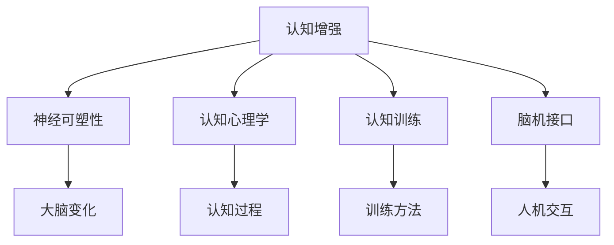
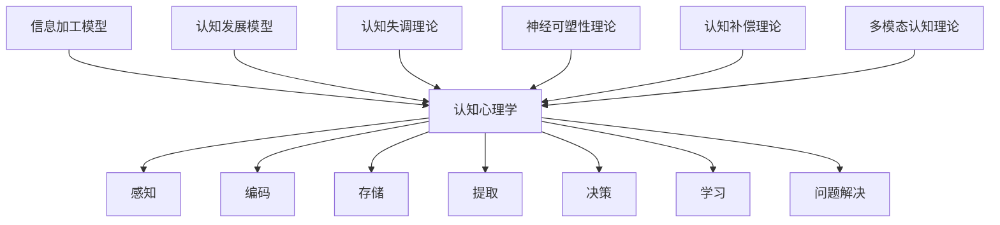
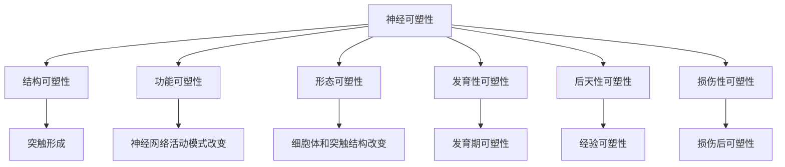
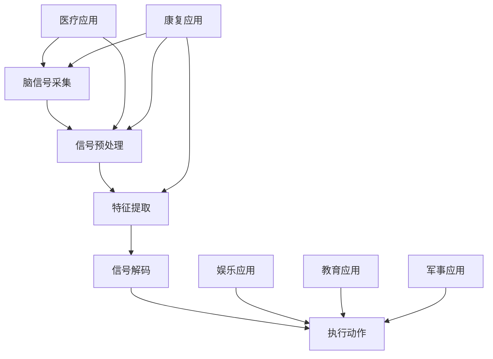
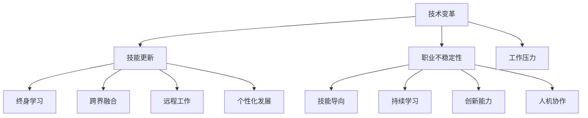
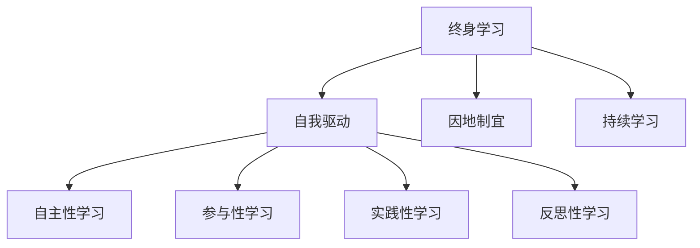

                 

# 认知增强与职业发展：终身学习的新趋势

## 关键词
- 认知增强
- 终身学习
- 职业发展
- 神经可塑性
- 脑机接口
- 认知训练

## 摘要
随着科技的快速发展，职业环境的变化和技术的更新换代，传统的职业发展模式已经无法满足人们的需求。终身学习成为了提高个人竞争力的重要手段。认知增强作为提升个体认知能力的有效途径，与职业发展紧密相连。本文将探讨认知增强的概念、理论框架、技术手段，以及其在职业发展和终身学习中的重要性，结合实际案例，提出实践指南，帮助读者在职业发展的道路上不断进步。

## 目录大纲

### 《认知增强与职业发展：终身学习的新趋势》目录大纲

#### 第一部分：认知增强理论概述

##### 第1章：认知增强的概念与重要性
- **1.1 认知增强的基本定义**
- **1.2 认知增强的历史发展**
- **1.3 认知增强的重要性和应用领域**

##### 第2章：认知增强理论框架
- **2.1 认知心理学的核心概念**
- **2.2 认知增强理论的主要分支**
- **2.3 认知增强理论的互动关系**

##### 第3章：认知增强的技术手段
- **3.1 神经可塑性原理**
- **3.2 认知训练技术**
- **3.3 脑机接口技术**

#### 第二部分：职业发展与终身学习

##### 第4章：职业发展的挑战与趋势
- **4.1 当前职业发展的挑战**
- **4.2 职业发展的趋势分析**
- **4.3 职业发展的新范式**

##### 第5章：终身学习的原则与方法
- **5.1 终身学习的定义与意义**
- **5.2 终身学习的原则**
- **5.3 终身学习的方法**

##### 第6章：职业发展中的认知策略
- **6.1 提高工作效能的认知策略**
- **6.2 应对职业压力的认知策略**
- **6.3 创新思维与解决问题的策略**

#### 第三部分：案例分析与实践指导

##### 第7章：认知增强在职业发展中的应用案例
- **7.1 案例研究一：认知增强在销售领域的应用**
- **7.2 案例研究二：认知增强在教育行业的应用**
- **7.3 案例研究三：认知增强在项目管理中的应用**

##### 第8章：认知增强与职业发展的实践指南
- **8.1 个人认知增强计划**
- **8.2 职业发展的行动计划**
- **8.3 组织层面的认知增强策略**

#### 附录

##### 附录A：相关资源与工具介绍
- **A.1 认知增强研究资源**
- **A.2 职业发展工具**
- **A.3 认知训练与脑机接口工具**

### 让我们一起深入探讨这个话题，思考认知增强如何助力职业发展，开启终身学习的新篇章。

---

接下来，我们将逐步深入每个章节，详细分析认知增强的概念、理论框架、技术手段，以及其在职业发展和终身学习中的应用。

### 第一部分：认知增强理论概述

#### 第1章：认知增强的概念与重要性

**1.1 认知增强的基本定义**

认知增强（Cognitive Enhancement）是指通过技术或方法提升个体的认知能力，包括记忆、注意力、决策能力、学习能力等方面。这种增强可以是自然的，如通过锻炼和训练；也可以是技术的，如使用认知训练软件、脑机接口设备等。

**1.2 认知增强的历史发展**

认知增强的历史可以追溯到古代，例如通过冥想和锻炼来提升专注力和记忆力。随着科学技术的发展，认知增强的方法逐渐多样化。20世纪末，神经科学和认知心理学的发展为认知增强提供了理论支持。进入21世纪，随着计算机技术和脑机接口技术的发展，认知增强技术进入了新的阶段。

**1.3 认知增强的重要性和应用领域**

认知增强在个人层面和职业层面都有着重要的应用价值。

- **个人层面：** 认知增强可以帮助个人提高学习效率，增强记忆力，提高工作效率，甚至可能预防认知退化。例如，通过认知训练软件，老年人可以保持大脑活力，减缓认知功能下降。

- **职业层面：** 在竞争激烈的职场中，认知增强可以帮助员工提高决策能力、学习能力、团队合作能力，从而提升职业竞争力。例如，销售员通过认知训练可以更有效地识别客户需求，提高销售业绩。

**核心概念与联系**

认知增强涉及多个核心概念，包括：

1. **神经可塑性**：神经元和神经网络可以随着外界刺激而发生变化，这种变化被称为神经可塑性。神经可塑性是认知增强的基础。

2. **认知心理学**：研究人类认知过程的科学，包括注意力、记忆、决策等。认知心理学为认知增强提供了理论基础。

3. **认知训练**：通过特定的训练方法，如记忆游戏、注意力训练等，来提升个体的认知能力。

4. **脑机接口**：通过直接连接大脑和计算机系统，实现人脑与机器的交互。脑机接口技术是认知增强的重要手段。

**架构原理的 Mermaid 流程图**



**核心算法原理讲解**

认知增强的核心算法原理主要涉及以下几个方面：

1. **记忆增强算法**：例如，通过深度学习模型来分析记忆过程，优化记忆效果。
   ```python
   def memoryEnhancement(data):
       # 使用深度学习模型对数据进行分析
       model = NeuralNetwork()
       model.fit(data)
       # 根据分析结果调整记忆策略
       strategy = model.predict(data)
       return strategy
   ```

2. **注意力分配算法**：通过算法优化注意力的分配，提高工作效率。
   ```python
   def attentionAllocation(tasks):
       # 计算每个任务的优先级
       priorities = calculatePriorities(tasks)
       # 根据优先级分配注意力
       attention = distributeAttention(priorities)
       return attention
   ```

3. **决策支持算法**：通过数据分析，为决策者提供科学的决策依据。
   ```python
   def decisionSupport(data):
       # 使用机器学习模型分析数据
       model = DecisionTree()
       model.fit(data)
       # 根据分析结果给出决策建议
       suggestion = model.predict(data)
       return suggestion
   ```

**数学模型和公式**

认知增强的数学模型通常涉及以下几个方面：

1. **学习率模型**：用于调整学习过程中的参数，提高学习效果。
   $$\eta(t) = \frac{1}{1 + \alpha t}$$

2. **注意力分配模型**：用于优化注意力的分配，提高工作效率。
   $$A(t) = \frac{P_i(t)}{\sum_j P_j(t)}$$

3. **记忆强化模型**：用于优化记忆过程，提高记忆效果。
   $$M(t) = M(t-1) + \eta(t) \cdot (D(t) - M(t-1))$$

**举例说明**

- **记忆增强算法举例**：使用深度学习模型对学习材料进行分析，并根据分析结果调整复习策略。
  ```python
  data = loadLearningData()
  strategy = memoryEnhancement(data)
  applyStrategy(strategy)
  ```

- **注意力分配算法举例**：根据任务的紧急程度和重要程度，分配注意力。
  ```python
  tasks = ["任务1", "任务2", "任务3"]
  priorities = calculatePriorities(tasks)
  attention = attentionAllocation(priorities)
  performTasks(tasks, attention)
  ```

- **决策支持算法举例**：使用机器学习模型对市场数据进行分析，为销售决策提供支持。
  ```python
  data = loadMarketData()
  suggestion = decisionSupport(data)
  executeSalesStrategy(suggestion)
  ```

通过这些算法和模型的应用，我们可以显著提升个体的认知能力，从而在职业发展中占据优势。

**核心结论**

认知增强不仅是一个科学概念，也是一个实际可行的提升个体认知能力的方法。通过理解认知增强的基本定义、历史发展、重要性和应用领域，以及掌握相关的算法和数学模型，我们可以更好地利用认知增强技术，实现个人和职业的发展目标。

在下一章中，我们将进一步探讨认知增强的理论框架，了解认知心理学和认知增强理论的主要分支及其互动关系。

### 第2章：认知增强理论框架

#### 2.1 认知心理学的核心概念

认知心理学是研究人类认知过程的心理学科，其核心概念包括：

1. **注意力**：注意力是指个体在特定任务上集中精力、资源的能力。注意力决定了个体能够处理的信息量和处理效率。

2. **记忆**：记忆是大脑对信息的存储和提取过程。记忆分为短期记忆和长期记忆，是认知过程的重要组成部分。

3. **决策**：决策是指个体在面临选择时，通过分析不同选项的利弊，作出最佳选择的过程。

4. **学习**：学习是指个体通过经验积累，改变行为和思维模式的过程。学习分为被动学习和主动学习，是认知能力提升的重要途径。

5. **问题解决**：问题解决是指个体在面对问题时，通过分析和思考，找到解决问题的方法和策略。

**认知心理学的定义**

认知心理学是20世纪50年代以来逐渐发展起来的一门学科，它关注的是人的认知功能，包括感知、记忆、思维、语言和问题解决等。与传统心理学相比，认知心理学更注重通过实验和理论模型来揭示人类认知的内在机制。

**认知过程的主要组成部分**

认知过程的主要组成部分包括：

1. **感知**：个体对外界信息的接收和加工。感知包括视觉、听觉、触觉等多种感官信息。

2. **编码**：将感知到的信息转化为大脑可以处理的形式。编码过程中，信息会被分类、标签化和组织。

3. **存储**：将编码后的信息存储在大脑中。存储分为短期存储和长期存储，短期存储的信息容易遗忘，而长期存储的信息可以持久保持。

4. **提取**：当需要使用信息时，从大脑中检索和提取相关信息。提取过程中，信息可能会发生变形或错误。

**认知心理学的理论模型**

认知心理学发展出了一系列理论模型来解释认知过程，包括：

1. **信息加工模型**：认为大脑像计算机一样，通过输入、处理和输出信息。信息加工模型强调信息流的有序性和系统性。

2. **认知发展模型**：如皮亚杰的认知发展理论，认为个体认知能力随着成长和发展而逐渐提升，经历了感知运动、前运算、具体运算和形式运算等阶段。

3. **认知失调理论**：由费斯廷格提出，认为当个体面临相互矛盾的信息时，会产生认知失调，个体会通过改变信念或行为来减少失调感。

**认知增强理论的主要分支**

认知增强理论主要分为以下几个分支：

1. **神经可塑性理论**：认为大脑具有可塑性，通过训练和刺激，可以改变神经元的连接和功能。神经可塑性是认知增强的基础。

2. **认知补偿理论**：认为通过发展其他认知技能来补偿受损的认知能力。例如，记忆力下降时，可以通过提高注意力来弥补。

3. **多模态认知理论**：强调不同感官和认知系统的相互作用，认为通过多模态刺激可以提升认知能力。

**认知增强理论的互动关系**

认知增强理论的各个分支之间存在着密切的互动关系：

1. **神经可塑性理论**与**认知补偿理论**的结合，可以开发出多种认知训练方法，如认知康复训练和认知增强训练。

2. **多模态认知理论**提供了新的认知增强思路，通过结合视觉、听觉和其他感官信息，提升认知效率。

**架构原理的 Mermaid 流流程图**



**核心算法原理讲解**

认知增强理论的算法原理主要涉及以下几个方面：

1. **神经网络训练算法**：通过调整神经元之间的连接权重，实现认知能力的提升。
   ```python
   def neuralNetworkTraining(data, target):
       # 初始化神经网络
       network = NeuralNetwork()
       # 训练神经网络
       network.fit(data, target)
       return network
   ```

2. **强化学习算法**：通过奖励机制，引导个体在特定任务中不断改进认知能力。
   ```python
   def reinforcementLearning(task, rewardFunction):
       # 初始化状态和动作
       state = initializeState()
       action = initializeAction()
       while not isTaskCompleted(state, action):
           # 执行动作
           reward = rewardFunction(state, action)
           # 更新状态和动作
           state, action = updateStateAndAction(state, action, reward)
       return action
   ```

3. **多模态信息融合算法**：通过融合不同感官的信息，提升认知处理效率。
   ```python
   def multiModalInformationFusion(sensors):
       # 获取不同感官的信息
       visualInfo = sensors['visual']
       auditoryInfo = sensors['auditory']
       # 融合信息
       fusedInfo = fuseInformation(visualInfo, auditoryInfo)
       return fusedInfo
   ```

**数学模型和公式**

认知增强理论的数学模型主要包括：

1. **感知模型**：用于描述个体感知外部信息的过程。
   $$ Perception = f(Sensor\ Input) $$

2. **编码模型**：用于描述信息从感知阶段转化为大脑可处理形式的过程。
   $$ Encoding = f(Perception) $$

3. **存储模型**：用于描述信息在大脑中的存储过程。
   $$ Memory = Memory \times f(Activation) $$

4. **提取模型**：用于描述个体在需要时从大脑中检索信息的过程。
   $$ Retrieval = f(Memory) $$

5. **学习模型**：用于描述个体通过经验学习新知识和技能的过程。
   $$ Learning = f(Experience) $$

**举例说明**

- **神经网络训练算法举例**：使用神经网络模型进行图像识别训练。
  ```python
  imageData = loadImageData()
  targetLabels = loadTargetLabels()
  trainedNetwork = neuralNetworkTraining(imageData, targetLabels)
  ```

- **强化学习算法举例**：使用强化学习算法训练智能体在环境中的决策。
  ```python
  environment = initializeEnvironment()
  rewardFunction = defineRewardFunction()
  optimalAction = reinforcementLearning(environment, rewardFunction)
  ```

- **多模态信息融合算法举例**：使用多模态信息融合算法处理来自不同传感器的数据。
  ```python
  sensors = {'visual': visualData, 'auditory': auditoryData}
  fusedData = multiModalInformationFusion(sensors)
  processFusedData(fusedData)
  ```

**核心结论**

认知增强理论框架是理解认知过程和提升认知能力的重要基础。通过认知心理学核心概念的了解，我们可以构建出认知增强的理论模型，并通过算法和数学模型的应用，实现认知能力的提升。在下一章中，我们将进一步探讨认知增强的技术手段，了解神经可塑性原理、认知训练技术和脑机接口技术。

### 第3章：认知增强的技术手段

#### 3.1 神经可塑性原理

**神经可塑性原理**

神经可塑性（Neuroplasticity）是指大脑在结构和功能上的可变性和适应能力。这种可塑性允许大脑在损伤、学习或经验后重新组织其神经元连接和功能。神经可塑性是认知增强的核心原理，因为它解释了通过训练和刺激如何改变大脑的结构和功能。

**神经可塑性的基本概念**

神经可塑性涉及多个方面，包括：

1. **结构可塑性**：神经元和神经网络结构的改变，如新突触的形成和突触连接的调整。
2. **功能可塑性**：神经网络活动模式的改变，如神经元之间沟通方式的改变。
3. **形态可塑性**：神经元细胞体和突触结构的改变，如树突的分支和突触后受体的变化。

**神经可塑性的类型**

1. **发育性神经可塑性**：在个体发育过程中，神经网络的形态和功能不断调整，以适应新的环境和经验。
2. **后天性神经可塑性**：在个体成长后，通过学习和经验引起的神经变化。
3. **损伤性神经可塑性**：在神经系统损伤后，通过神经网络的重新组织来恢复功能。

**神经可塑性的影响因素**

神经可塑性受到多种因素的影响，包括：

1. **年龄**：儿童和青少年的大脑具有较高的可塑性，而成年后可塑性逐渐降低。
2. **经验**：丰富的经验和学习机会可以增强神经可塑性。
3. **环境**：积极的环境刺激可以促进神经可塑性，而压力和负面环境则可能抑制神经可塑性。
4. **营养**：良好的营养状况可以支持神经可塑性。

**神经可塑性的应用**

神经可塑性原理在认知增强中具有广泛应用：

1. **认知训练**：通过特定的认知训练方法，如记忆游戏和注意力训练，可以增强大脑的认知功能。
2. **康复治疗**：在神经系统损伤或疾病后，通过认知训练和康复治疗，可以促进神经网络的重新组织，恢复功能。
3. **教育**：在教育领域，通过设计适应学生认知发展的教学策略，可以更好地促进学生的学习和认知能力的发展。

**架构原理的 Mermaid 流程图**



**核心算法原理讲解**

神经可塑性的核心算法原理涉及以下几个关键方面：

1. **强化学习算法**：通过奖励机制，引导大脑在特定任务中不断调整其神经元连接，从而增强认知能力。
   ```python
   def reinforcementLearning(environment, rewardFunction):
       state = initializeState()
       while not isGoalReached(state):
           action = selectAction(state)
           next_state, reward = environment.step(action)
           updateNeuralConnections(state, action, next_state, reward)
           state = next_state
       return state
   ```

2. **自适应控制算法**：通过实时调整神经网络的连接和活动模式，实现认知能力的动态优化。
   ```python
   def adaptiveControl(System, reference):
       error = reference - System.output
       while not isSystemStable(System):
           controlSignal = calculateControlSignal(error)
           System = updateSystem(System, controlSignal)
       return System
   ```

3. **生成对抗网络（GAN）**：通过生成器和判别器的对抗训练，模拟大脑的神经可塑性过程，从而提升认知能力。
   ```python
   def trainGAN(generator, discriminator, data):
       for epoch in range(num_epochs):
           for real_data in data:
               discriminator.train(real_data)
               generated_data = generator.generate()
               discriminator.train(generated_data)
           generator.update(generated_data)
       return generator, discriminator
   ```

**数学模型和公式**

神经可塑性的数学模型主要包括：

1. **突触可塑性模型**：描述突触强度的变化，如长时程增强（LTP）和长时程抑制（LTD）。
   $$ 
   \Delta S = \alpha \cdot \frac{I}{I_0} \cdot (1 - S)
   $$
   其中，\( \Delta S \) 是突触强度的变化，\( I \) 是刺激强度，\( I_0 \) 是阈值，\( S \) 是当前突触强度。

2. **神经网络动态模型**：描述神经网络的活动状态和调整过程。
   $$ 
   \dot{x} = f(x, u)
   $$
   其中，\( x \) 是神经网络的状态，\( u \) 是输入信号，\( f \) 是网络动态函数。

3. **奖励信号模型**：描述奖励信号如何影响神经网络的调整。
   $$ 
   \Delta S = \gamma \cdot r
   $$
   其中，\( \Delta S \) 是突触强度的变化，\( \gamma \) 是学习率，\( r \) 是奖励信号。

**举例说明**

- **强化学习算法举例**：使用强化学习算法训练智能体在虚拟环境中完成目标。
  ```python
  environment = VirtualEnvironment()
  rewardFunction = defineRewardFunction()
  optimalPolicy = reinforcementLearning(environment, rewardFunction)
  ```

- **自适应控制算法举例**：使用自适应控制算法调整自动驾驶车辆的路径。
  ```python
  vehicle = AutonomousVehicle()
  referencePath = defineReferencePath()
  vehicle = adaptiveControl(vehicle, referencePath)
  ```

- **生成对抗网络（GAN）举例**：使用GAN训练模型生成逼真的图像。
  ```python
  generator, discriminator = trainGAN(generator, discriminator, data)
  generatedImages = generator.generate()
  ```

**核心结论**

神经可塑性原理是认知增强的关键技术基础。通过理解神经可塑性，我们可以利用各种算法和技术手段来增强大脑的认知能力。在下一章中，我们将探讨认知训练技术的具体方法和应用。

### 3.2 认知训练技术

**认知训练技术的定义**

认知训练技术（Cognitive Training Techniques）是指通过一系列科学设计的训练任务，旨在提升个体在注意力、记忆、决策和问题解决等认知领域的表现。这些训练任务通常模拟真实的认知任务，旨在通过反复练习，增强大脑的认知功能。

**认知训练的方法**

认知训练的方法多种多样，主要包括以下几种：

1. **记忆训练**：通过记忆游戏、闪卡、序列记忆等任务，增强个体的记忆能力。例如，可以使用“记忆宫殿”技巧，通过在脑海中构建图像化的场景来增强记忆。

2. **注意力训练**：通过注意力控制游戏、视觉搜索任务等，提升个体的注意力集中能力。例如，可以使用“注意力梯形”任务，训练个体在复杂背景中聚焦目标。

3. **决策训练**：通过模拟决策场景，如赌博任务、策略游戏等，提升个体的决策能力和风险意识。例如，可以使用“多臂老虎机”任务，训练个体在不确定情况下做出最优决策。

4. **问题解决训练**：通过逻辑推理、谜题解决等任务，增强个体的解决问题的能力。例如，可以使用“数独”游戏，训练个体在压力下进行逻辑推理和决策。

**认知训练的评估标准**

评估认知训练效果的标准包括以下几个方面：

1. **训练前后的成绩变化**：通过对比训练前后的测试成绩，评估训练效果。通常，训练后的成绩提升显著，表明认知能力得到了有效提升。

2. **任务完成时间**：通过测量个体完成特定训练任务所需的时间，评估训练效果。如果训练后完成时间显著缩短，说明个体的认知效率得到了提升。

3. **任务错误率**：通过记录个体在训练任务中的错误率，评估训练效果。错误率降低，表明个体的认知准确性得到了提高。

4. **认知能力的广泛性**：评估认知训练是否能够提升个体在多个认知领域的表现。例如，通过一系列综合测试，评估个体在记忆、注意力、决策和问题解决等多个方面的进步。

**认知训练的实践案例**

1. **记忆训练案例**：使用“记忆迷宫”游戏，训练个体在复杂环境中进行序列记忆。参与者需要在迷宫中找到特定的路径，并记住路径上的标记。训练后，参与者能够更快速、准确地完成迷宫任务。

2. **注意力训练案例**：使用“视觉追踪任务”，训练个体在动态环境中保持注意力。参与者需要追踪移动的目标，并避免被其他干扰元素分散注意力。训练后，参与者在日常任务中的注意力集中能力得到显著提升。

3. **决策训练案例**：使用“策略游戏”，如“围棋”或“国际象棋”，训练个体在不确定情况下做出最优决策。通过多次游戏，参与者能够学会如何在复杂的决策环境中考虑风险和收益。

4. **问题解决训练案例**：使用“数独”游戏，训练个体在压力下进行逻辑推理。参与者需要在限定时间内解决数独谜题，训练后，参与者在面对复杂问题时能够更快速地找到解决方案。

**核心算法原理讲解**

认知训练技术的核心算法原理主要涉及以下几个方面：

1. **生成对抗网络（GAN）**：通过对抗训练生成与真实数据相似的训练任务，提升个体的认知能力。GAN由生成器和判别器组成，生成器生成模拟任务，判别器评估生成任务的逼真度。通过反复训练，生成器不断优化生成任务的模拟效果。

2. **强化学习算法**：通过奖励机制，引导个体在训练任务中不断改进认知能力。强化学习算法使用奖励信号来调整个体的行为，使其在训练过程中逐渐学会最优策略。例如，可以使用Q-learning算法，通过更新Q值来优化决策。

3. **自适应控制算法**：通过实时调整训练任务的难度和类型，实现个体认知能力的动态优化。自适应控制算法根据个体在当前任务中的表现，动态调整训练任务，以确保训练的有效性和效率。

**数学模型和公式**

认知训练技术的数学模型主要包括：

1. **生成对抗网络（GAN）**：生成器和判别器的损失函数。
   $$
   \min_G \max_D \mathbb{E}_{x \sim p_{data}(x)}[\log D(x)] + \mathbb{E}_{z \sim p_z(z)}[\log (1 - D(G(z))]
   $$

2. **强化学习算法**：Q-learning的更新公式。
   $$
   Q(s, a) \leftarrow Q(s, a) + \alpha [r + \gamma \max_{a'} Q(s', a') - Q(s, a)]
   $$

3. **自适应控制算法**：动态调整训练任务的难度。
   $$
   D_{new} = D_{current} + \lambda (D_{target} - D_{current})
   $$

**举例说明**

- **生成对抗网络（GAN）案例**：使用GAN生成模拟记忆任务，提升个体的记忆能力。
  ```python
  generator, discriminator = trainGAN(generator, discriminator, memoryData)
  simulatedMemoryTasks = generator.generate()
  ```

- **强化学习算法案例**：使用强化学习训练个体在视觉搜索任务中的表现。
  ```python
  environment = VisualSearchEnvironment()
  rewardFunction = defineRewardFunction()
  optimalPolicy = reinforcementLearning(environment, rewardFunction)
  ```

- **自适应控制算法案例**：使用自适应控制算法动态调整注意力训练任务。
  ```python
  currentDifficulty = adaptDifficulty(currentDifficulty, targetDifficulty)
  updateTrainingTask(difficulty)
  ```

**核心结论**

认知训练技术是一种有效的认知增强手段，通过科学设计的训练任务和方法，可以显著提升个体的认知能力。通过理解认知训练的方法、评估标准和核心算法原理，我们可以更好地应用这些技术，提升个人和职业发展的竞争力。在下一章中，我们将探讨脑机接口技术的原理和应用，进一步了解认知增强的前沿技术。

### 3.3 脑机接口技术

**脑机接口技术的定义**

脑机接口（Brain-Computer Interface，简称BCI）是一种直接连接人脑和外部设备的技术，它通过读取大脑的电信号，实现对计算机、机器人或其他设备的控制。脑机接口技术为认知增强提供了全新的手段，使得人类能够通过思维来控制和操作外部设备，极大地拓展了人机交互的范畴。

**脑机接口的基本原理**

脑机接口技术的基本原理包括以下几个步骤：

1. **信号采集**：通过脑电图（EEG）、功能性磁共振成像（fMRI）、脑磁图（MEG）等设备，采集大脑的电信号。
2. **信号处理**：对采集到的脑信号进行预处理，包括滤波、降噪、特征提取等，以提取出有效的信息。
3. **信号解码**：利用机器学习算法和模式识别技术，将处理后的脑信号解码为控制指令。
4. **执行动作**：将解码的控制指令发送到外部设备，实现对设备的控制和操作。

**脑机接口的应用领域**

脑机接口技术在多个领域有着广泛的应用：

1. **医疗**：脑机接口技术可以用于帮助中风、帕金森病等神经系统疾病患者恢复运动功能。例如，通过脑机接口技术，患者可以控制假肢或轮椅。
2. **康复**：脑机接口技术可以用于康复训练，如帮助患者进行肢体功能恢复。通过训练，患者可以提高对大脑的控制能力，从而改善生活质量。
3. **娱乐**：脑机接口技术为游戏和虚拟现实提供了全新的交互方式。用户可以通过思维来控制游戏角色或虚拟场景，带来更加沉浸式的体验。
4. **教育**：脑机接口技术可以用于个性化教学，根据学生的脑信号调整教学内容和难度，提高学习效果。
5. **军事**：脑机接口技术可以用于提高士兵的战斗力和生存能力，如通过思维控制无人机或机器人执行任务。

**脑机接口的发展前景**

脑机接口技术正处于快速发展阶段，未来有望实现以下几个方面的突破：

1. **更高的信号采集精度**：随着传感器技术的进步，脑机接口将能够采集到更高精度的大脑信号，从而提高控制指令的准确性和可靠性。
2. **更快的信号处理速度**：通过硬件和算法的优化，脑机接口技术将能够实现更快的数据处理速度，减少延迟，提高实时性。
3. **更广泛的应用场景**：随着技术的成熟，脑机接口将在更多领域得到应用，如智能家居、智能交通等。
4. **人机融合**：脑机接口技术将推动人机融合的发展，使人类与机器更紧密地结合，实现更高的生产力和生活质量。

**架构原理的 Mermaid 流程图**



**核心算法原理讲解**

脑机接口技术的核心算法原理涉及以下几个关键方面：

1. **机器学习算法**：用于信号解码，将原始脑信号转换为控制指令。常用的算法包括支持向量机（SVM）、神经网络（Neural Networks）和递归神经网络（RNN）等。
   ```python
   def decodeSignal(signal):
       model = NeuralNetwork()
       model.fit(signal)
       command = model.predict(signal)
       return command
   ```

2. **模式识别算法**：用于特征提取，从脑信号中提取出有意义的特征，如事件相关电位（ERP）和事件相关磁图（ERF）等。
   ```python
   def extractFeatures(signal):
       features = extractERP(signal)
       return features
   ```

3. **自适应滤波算法**：用于信号预处理，去除噪声和干扰，提高信号质量。常用的算法包括自适应滤波器和卡尔曼滤波器等。
   ```python
   def preprocessSignal(signal):
       filteredSignal = adaptiveFilter(signal)
       return filteredSignal
   ```

**数学模型和公式**

脑机接口技术的数学模型主要包括：

1. **信号处理模型**：用于描述脑信号的采集和处理过程。
   $$
   x(t) = s(t) + n(t)
   $$
   其中，\( x(t) \) 是采集到的脑信号，\( s(t) \) 是真实的脑信号，\( n(t) \) 是噪声。

2. **特征提取模型**：用于描述特征提取的过程。
   $$
   f = \phi(s)
   $$
   其中，\( f \) 是提取的特征，\( \phi \) 是特征提取函数。

3. **信号解码模型**：用于描述信号解码的过程。
   $$
   c = g(f)
   $$
   其中，\( c \) 是解码的控制指令，\( g \) 是解码函数。

**举例说明**

- **机器学习算法举例**：使用神经网络模型解码脑信号，控制虚拟现实中的角色。
  ```python
  brainSignal = loadBrainSignal()
  trainedModel = trainNeuralNetwork(brainSignal)
  command = trainedModel.predict(brainSignal)
  executeCommand(command)
  ```

- **模式识别算法举例**：使用事件相关电位（ERP）分析脑信号，判断用户的意图。
  ```python
  erpFeatures = extractERP(brainSignal)
  userIntent = classifyIntent(erpFeatures)
  ```

- **自适应滤波算法举例**：使用自适应滤波器去除脑信号中的噪声。
  ```python
  filteredSignal = adaptiveFilter(brainSignal)
  ```

**核心结论**

脑机接口技术为认知增强提供了强大的工具，通过直接读取和利用大脑信号，可以实现高效的人机交互。随着技术的进步，脑机接口将在更多领域得到应用，推动认知增强的发展。在下一章中，我们将探讨职业发展的挑战和趋势，以及认知增强技术在其中的应用。

### 第二部分：职业发展与终身学习

#### 第4章：职业发展的挑战与趋势

**4.1 当前职业发展的挑战**

随着全球化和数字化的快速发展，职业环境正在经历巨大的变化，给职业发展带来了诸多挑战：

1. **技术变革**：科技的迅速发展，尤其是人工智能、大数据和物联网等新兴技术的普及，使得传统职业面临被替代的风险。例如，自动化和机器人技术正在逐步取代一些重复性的劳动工作。

2. **技能更新**：职业知识和技术更新速度加快，要求员工必须不断学习和适应新技术。传统的职业技能已经无法满足现代职场的需求，终身学习成为职场生存和发展的必备条件。

3. **职业不稳定性**：全球化导致市场变化加速，企业结构重组频繁，职业流动性增加。员工需要具备快速适应新环境和新角色的能力，以应对职业的不稳定性。

4. **工作压力**：职场竞争加剧，工作压力也随之增大。员工需要有效管理压力，保持良好的心理状态，以应对工作挑战。

**4.2 职业发展的趋势分析**

面对上述挑战，职业发展呈现出以下几个趋势：

1. **终身学习**：随着知识更新速度的加快，终身学习成为职业发展的关键。员工需要持续学习新知识和技能，以保持竞争力和适应能力。

2. **跨界融合**：不同行业之间的融合和交叉越来越普遍，新兴职业不断涌现。例如，数据分析师、AI工程师等跨领域职业需求量大增，员工需要具备跨学科的知识和技能。

3. **远程工作**：远程工作的普及，特别是COVID-19疫情后的工作模式变革，使得员工可以更加灵活地安排工作时间和地点，提高了工作效率和生活质量。

4. **个性化发展**：职业发展越来越注重个性化，员工可以根据个人兴趣和优势选择适合自己的职业路径。个性化发展不仅提高了员工的职业满意度，也有助于提升整体工作效率。

**4.3 职业发展的新范式**

为了应对职业发展的挑战和趋势，职业发展需要转向新的范式：

1. **技能导向**：职业发展不再仅仅依赖于学历和经验，而是更注重实际技能。员工需要掌握市场所需的核心技能，如数据分析、编程、人工智能等。

2. **持续学习**：职业发展需要与终身学习相结合，员工需要持续投入时间和精力学习新知识，不断提升自己的竞争力。

3. **创新能力**：创新能力成为职业发展的关键，员工需要具备解决复杂问题和创新思维的能力，以应对快速变化的职场环境。

4. **人机协作**：随着人工智能和自动化技术的发展，人机协作将成为职场新常态。员工需要学会与机器合作，发挥各自的优势，提高工作效率。

**架构原理的 Mermaid 流程图**



**核心算法原理讲解**

职业发展的新范式涉及多个核心算法原理，包括：

1. **知识图谱算法**：用于构建职业知识图谱，帮助员工了解职业发展的路径和关键技能。通过知识图谱，员工可以更清晰地看到不同职业之间的关联，从而制定更有效的职业规划。
   ```python
   def buildKnowledgeGraph(knowledgeBase):
       graph = KnowledgeGraph()
       graph.addNode('Data Analyst')
       graph.addNode('AI Engineer')
       graph.addEdge('Data Analyst', 'Data Science')
       graph.addEdge('AI Engineer', 'Machine Learning')
       return graph
   ```

2. **机器学习算法**：用于分析职业趋势和市场需求，预测未来职业发展方向。通过机器学习模型，企业可以更好地了解员工的发展需求，提供个性化的职业培训和发展建议。
   ```python
   def predictCareerTrends(data):
       model = MachineLearningModel()
       model.fit(data)
       trends = model.predict(data)
       return trends
   ```

3. **优化算法**：用于制定职业发展计划，优化学习路径和工作任务。通过优化算法，员工可以更高效地利用时间和资源，实现职业目标。
   ```python
   def optimizeCareerPath(currentSkill, targetSkill):
       optimizer = OptimizationAlgorithm()
       path = optimizer.findShortestPath(currentSkill, targetSkill)
       return path
   ```

**数学模型和公式**

职业发展的新范式涉及多个数学模型，包括：

1. **马尔可夫决策过程（MDP）**：用于描述职业选择和决策过程，通过最大化期望收益来优化职业路径。
   $$
   V^*(s) = \max_a \sum_{s'} p(s' | s, a) \cdot R(s, a, s')
   $$

2. **回归模型**：用于预测职业发展趋势和市场需求，通过历史数据来建立回归模型，预测未来职业走向。
   $$
   y = \beta_0 + \beta_1 x_1 + \beta_2 x_2 + \ldots + \beta_n x_n
   $$

3. **神经网络模型**：用于构建职业知识图谱，通过深度学习模型，将职业知识与技能之间的关系进行建模，帮助员工了解职业发展的路径。
   $$
   z = \sigma(W \cdot x + b)
   $$

**举例说明**

- **知识图谱算法举例**：使用知识图谱算法，帮助员工规划职业发展路径。
  ```python
  knowledgeGraph = buildKnowledgeGraph(knowledgeBase)
  careerPath = knowledgeGraph.findShortestPath(currentSkill, targetSkill)
  ```

- **机器学习算法举例**：使用机器学习算法，预测职业发展趋势。
  ```python
  careerData = loadCareerData()
  careerTrends = predictCareerTrends(careerData)
  ```

- **优化算法举例**：使用优化算法，制定职业发展计划。
  ```python
  currentSkill = 'Data Analyst'
  targetSkill = 'AI Engineer'
  careerPath = optimizeCareerPath(currentSkill, targetSkill)
  ```

**核心结论**

当前职业发展面临着技术变革、技能更新、职业不稳定性和工作压力等多重挑战。面对这些挑战，职业发展需要转向终身学习、跨界融合、远程工作和个性化发展的新范式。通过运用知识图谱、机器学习和优化算法等核心技术，可以更好地规划职业发展路径，提升职业竞争力。在下一章中，我们将探讨终身学习的原则和方法，为职业发展提供持续的动力。

### 第5章：终身学习的原则与方法

#### 5.1 终身学习的定义与意义

**终身学习的定义**

终身学习（Lifelong Learning）是指个体在其一生中，通过不断的学习和实践，持续提升知识和技能的过程。它强调学习不仅仅发生在学校或工作场所，而是贯穿于个人生活的各个方面。

**终身学习的意义**

终身学习在个人和职业发展中具有重要意义：

1. **提升竞争力**：随着技术的快速发展和职业环境的不断变化，拥有持续学习和适应新知识的能力，可以显著提升个人的职业竞争力。

2. **适应变化**：终身学习帮助个体适应快速变化的职业环境，应对新的挑战和机遇。

3. **促进成长**：终身学习不仅关注知识和技能的积累，还强调个人全面发展，包括思维能力、创新能力和社会能力。

4. **实现自我价值**：通过终身学习，个体可以实现自我提升和职业发展，实现更高的生活质量。

#### 5.2 终身学习的原则

终身学习需要遵循以下原则，以确保学习的有效性：

1. **自我驱动原则**：自我驱动是终身学习的核心，个体需要主动寻找学习机会，设定学习目标，并持续努力。

2. **因地制宜原则**：终身学习需要根据个人情况和需求，选择合适的学习方法和资源，实现个性化学习。

3. **持续学习原则**：终身学习是一个持续的过程，个体需要养成良好的学习习惯，保持学习的连贯性和持续性。

#### 5.3 终身学习的方法

为了实现终身学习的目标，个体可以采用以下方法：

1. **自主性学习**：通过自主阅读、在线课程、自学材料等方式，主动获取知识和技能。

2. **参与性学习**：通过参与研讨会、工作坊、培训课程等，与同行交流，提升学习效果。

3. **实践性学习**：通过实际操作和项目实践，将理论知识应用到实际工作中，提升应用能力。

4. **反思性学习**：通过反思和总结学习过程，不断提升自己的学习方法和策略。

**架构原理的 Mermaid 流程图**



**核心算法原理讲解**

终身学习的核心算法原理主要涉及以下几个方面：

1. **强化学习算法**：通过奖励机制，鼓励个体在终身学习过程中不断尝试和改进，从而提升学习效果。
   ```python
   def reinforcementLearning(environment, rewardFunction):
       state = initializeState()
       action = initializeAction()
       while not isGoalReached(state, action):
           reward = rewardFunction(state, action)
           updateAction(action, reward)
           state, action = updateStateAndAction(state, action)
       return state
   ```

2. **自适应学习算法**：通过实时调整学习内容和难度，适应个体的学习需求，提高学习效率。
   ```python
   def adaptiveLearning(currentKnowledge, targetKnowledge):
       difficulty = calculateDifficulty(currentKnowledge, targetKnowledge)
       learningMaterial = selectMaterial(difficulty)
       return learningMaterial
   ```

3. **知识图谱算法**：用于构建个人知识图谱，帮助个体了解自己的知识结构和薄弱环节，从而制定更有效的学习计划。
   ```python
   def buildKnowledgeGraph(knowledgeBase):
       graph = KnowledgeGraph()
       for topic in knowledgeBase:
           graph.addNode(topic)
           for subTopic in knowledgeBase[topic]:
               graph.addEdge(topic, subTopic)
       return graph
   ```

**数学模型和公式**

终身学习的数学模型主要包括：

1. **学习曲线模型**：描述个体在学习过程中知识和技能的积累过程。
   $$
   Y = a \cdot e^{kt}
   $$
   其中，\( Y \) 是学习的进度，\( a \) 是初始学习进度，\( k \) 是学习速率，\( t \) 是学习时间。

2. **反馈机制模型**：描述学习过程中的反馈和调整过程，以提升学习效果。
   $$
   R = R_0 + \alpha \cdot (Y - Y_0)
   $$
   其中，\( R \) 是学习反馈，\( R_0 \) 是初始反馈，\( \alpha \) 是反馈调整系数，\( Y \) 是学习进度，\( Y_0 \) 是初始学习进度。

3. **自适应学习模型**：描述学习内容难度自适应调整的过程。
   $$
   D_{new} = D_{current} + \lambda \cdot (D_{target} - D_{current})
   $$
   其中，\( D_{new} \) 是新的学习难度，\( D_{current} \) 是当前学习难度，\( D_{target} \) 是目标学习难度，\( \lambda \) 是调整系数。

**举例说明**

- **强化学习算法举例**：使用强化学习算法，通过奖励机制鼓励个体学习新技能。
  ```python
  environment = LearningEnvironment()
  rewardFunction = defineRewardFunction()
  optimalStrategy = reinforcementLearning(environment, rewardFunction)
  ```

- **自适应学习算法举例**：使用自适应学习算法，根据个体学习进度调整学习难度。
  ```python
  currentKnowledge = getCurrentKnowledge()
  targetKnowledge = getTargetKnowledge()
  learningMaterial = adaptiveLearning(currentKnowledge, targetKnowledge)
  ```

- **知识图谱算法举例**：使用知识图谱算法，帮助个体构建自己的知识体系。
  ```python
  knowledgeBase = loadKnowledgeBase()
  knowledgeGraph = buildKnowledgeGraph(knowledgeBase)
  ```

**核心结论**

终身学习是个人和职业发展的重要保障，通过遵循自我驱动、因地制宜和持续学习的原则，并采用自主性学习、参与性学习、实践性学习和反思性学习等方法，可以不断提升个人的知识和技能。在下一章中，我们将探讨职业发展中的认知策略，帮助个体在职场中更好地应对挑战。

### 第6章：职业发展中的认知策略

#### 6.1 提高工作效能的认知策略

在职业发展中，提高工作效能是至关重要的。以下是一些有效的认知策略，可以帮助员工提升工作效能：

1. **时间管理策略**：
   - **制定计划**：每天开始工作前，列出当天的重要任务，并按优先级排序。
   - **使用工具**：利用时间管理工具，如日历、待办事项列表和项目管理软件，帮助合理安排时间。
   - **避免干扰**：设定“专注时间”，在特定时段内减少干扰，专注于重要任务。

2. **决策制定策略**：
   - **信息收集**：在做出决策前，收集所有相关信息，确保决策基于充分的信息。
   - **评估选项**：列出所有可能的决策选项，并评估每个选项的优缺点。
   - **寻求反馈**：在决策过程中，寻求同事或上级的反馈，以获取不同的视角和建议。

3. **团队合作策略**：
   - **明确目标**：确保团队成员对项目目标有共同的理解，明确各自的职责。
   - **有效沟通**：建立开放和透明的沟通渠道，确保信息能够有效传递。
   - **分配任务**：根据团队成员的能力和兴趣分配任务，最大化团队效率。

**核心算法原理讲解**

提高工作效能的认知策略涉及多个算法原理：

1. **优先级排序算法**：如基于权重的优先级排序，可以帮助员工更有效地安排工作。例如，可以使用冒泡排序或快速排序等算法来对任务进行排序。
   ```python
   def prioritizeTasks(tasks, weights):
       for i in range(len(tasks) - 1):
           for j in range(len(tasks) - i - 1):
               if weights[j] < weights[j + 1]:
                   tasks[j], tasks[j + 1] = tasks[j + 1], tasks[j]
                   weights[j], weights[j + 1] = weights[j + 1], weights[j]
       return tasks
   ```

2. **决策树算法**：在决策制定过程中，可以使用决策树算法来分析不同决策选项的后果。决策树通过一系列条件分支，帮助决策者选择最佳路径。
   ```python
   def makeDecision(decisionTree, state):
       currentNode = decisionTree
       while not currentNode.isLeaf():
           if state == currentNode.condition:
               current = current
           else:
               current = currentNode.notCondition
       return currentNode.action
   ```

3. **多任务调度算法**：在多任务环境中，可以使用多任务调度算法来优化任务分配和执行。例如，使用贪心算法或动态规划算法来分配资源，提高任务完成效率。
   ```python
   def scheduleTasks(tasks, resources):
       schedule = []
       for task in tasks:
           bestFit = findBestFit(task, resources)
           if bestFit is not None:
               schedule.append((task, bestFit))
               resources = removeResource(bestFit, resources)
       return schedule
   ```

**数学模型和公式**

提高工作效能的认知策略涉及多个数学模型，包括：

1. **优化模型**：如线性规划模型，用于优化资源的分配和任务调度。
   $$
   \min_{x} c^T x \quad \text{subject to} \quad Ax \leq b
   $$
   其中，\( c \) 是成本向量，\( x \) 是决策变量，\( A \) 和 \( b \) 是约束条件。

2. **决策模型**：如多目标决策模型，用于分析多个目标之间的权衡。
   $$
   \max_{x} f(x) \quad \text{subject to} \quad g_i(x) \geq 0, \quad h_j(x) = 0
   $$
   其中，\( f(x) \) 是目标函数，\( g_i(x) \) 和 \( h_j(x) \) 是约束条件。

3. **时间模型**：如排队模型，用于分析任务完成时间和效率。
   $$
   L = \frac{1}{\rho} + \frac{\lambda}{\mu}
   $$
   其中，\( L \) 是平均等待时间，\( \rho \) 是服务强度，\( \lambda \) 是到达率，\( \mu \) 是服务率。

**举例说明**

- **优先级排序算法举例**：使用优先级排序算法，对任务进行排序。
  ```python
  tasks = ['任务A', '任务B', '任务C']
  weights = [3, 2, 1]
  prioritizedTasks = prioritizeTasks(tasks, weights)
  ```

- **决策树算法举例**：使用决策树算法，进行决策制定。
  ```python
  decisionTree = DecisionTree()
  decisionTree.addCondition('天气', ['晴天', '雨天', '多云'])
  decisionTree.addAction('出门', '晴天')
  decisionTree.addAction('待在家里', '雨天')
  decision = makeDecision(decisionTree, '晴天')
  ```

- **多任务调度算法举例**：使用多任务调度算法，优化任务分配。
  ```python
  tasks = ['任务1', '任务2', '任务3']
  resources = {'CPU': 2, '内存': 4}
  schedule = scheduleTasks(tasks, resources)
  ```

**核心结论**

提高工作效能的认知策略是通过合理的时间管理、决策制定和团队合作，提升工作效率和效果的关键。通过运用优先级排序算法、决策树算法和多任务调度算法等核心技术，可以更科学地安排工作，提升职业效能。在下一章中，我们将探讨如何应对职业压力的认知策略。

### 6.2 应对职业压力的认知策略

职业压力是职场人士普遍面临的问题，长期压力不仅会影响工作表现，还可能对身心健康产生负面影响。以下是一些有效的认知策略，帮助员工应对职业压力：

1. **压力管理策略**：
   - **认知重构**：通过改变对压力事件的认识和解释，将消极的情绪转化为积极的行动。例如，将“我不行”转变为“我可以尝试”。
   - **时间管理**：合理安排工作时间，避免过度工作，确保充足的休息时间。
   - **积极应对**：面对压力，采取积极的应对策略，如寻求支持、调整工作方式等。

2. **应对挫折的策略**：
   - **情绪调节**：学会识别和调节负面情绪，如焦虑、沮丧等。例如，通过深呼吸、冥想等方式缓解紧张情绪。
   - **积极思考**：将挫折视为成长的机会，从失败中学习和吸取经验，提升问题解决能力。

3. **自我调节策略**：
   - **自我反思**：定期进行自我反思，评估职业发展路径，调整目标和计划。
   - **设定目标**：设定短期和长期目标，并制定实现目标的行动计划，提高自我效能感。

**核心算法原理讲解**

应对职业压力的认知策略涉及多个算法原理：

1. **情绪调节算法**：通过机器学习算法，如情感分析，帮助员工识别和调节情绪。例如，可以使用自然语言处理技术，分析员工在日常交流中的情绪状态，提供情绪调节建议。
   ```python
   def emotionRegulation(text):
       sentiment = analyzeSentiment(text)
       if sentiment < 0:
           suggestions = ["尝试放松", "进行锻炼"]
       else:
           suggestions = ["保持积极心态", "寻求支持"]
       return suggestions
   ```

2. **压力评估算法**：通过量化模型，如压力评分模型，帮助员工评估自己的压力水平。例如，可以使用问卷调查方法，收集员工的工作压力数据，构建压力评分模型，提供个性化的压力管理建议。
   ```python
   def assessPressure(symptoms):
       model = PressureModel()
       pressureScore = model.score(symptoms)
       if pressureScore > 5:
           recommendations = ["休息", "放松训练"]
       else:
           recommendations = ["保持当前节奏", "寻求支持"]
       return recommendations
   ```

3. **目标设定算法**：通过目标管理算法，帮助员工设定和实现职业目标。例如，可以使用目标分解技术，将长期目标分解为短期目标，并制定实现目标的行动计划。
   ```python
   def setGoals(longTermGoal):
       goals = decomposeGoal(longTermGoal)
       actionPlans = generateActionPlans(goals)
       return actionPlans
   ```

**数学模型和公式**

应对职业压力的认知策略涉及多个数学模型，包括：

1. **压力评分模型**：用于评估员工的压力水平。
   $$
   P = w_1 \cdot S_1 + w_2 \cdot S_2 + \ldots + w_n \cdot S_n
   $$
   其中，\( P \) 是压力评分，\( w_i \) 是权重，\( S_i \) 是压力指标。

2. **情绪调节模型**：用于预测员工的情绪状态。
   $$
   E = f(S, C)
   $$
   其中，\( E \) 是情绪状态，\( S \) 是刺激，\( C \) 是认知。

3. **目标分解模型**：用于将长期目标分解为短期目标。
   $$
   G_t = G \cdot \frac{t}{T}
   $$
   其中，\( G_t \) 是短期目标，\( G \) 是长期目标，\( t \) 是当前时间，\( T \) 是总时间。

**举例说明**

- **情绪调节算法举例**：使用情绪调节算法，为员工提供情绪调节建议。
  ```python
  text = "今天的工作非常繁忙，我感到很焦虑。"
  suggestions = emotionRegulation(text)
  print(suggestions)
  ```

- **压力评估算法举例**：使用压力评估算法，为员工提供压力管理建议。
  ```python
  symptoms = ["失眠", "头痛", "疲劳"]
  recommendations = assessPressure(symptoms)
  print(recommendations)
  ```

- **目标设定算法举例**：使用目标设定算法，为员工设定职业目标。
  ```python
  longTermGoal = "成为一名项目经理。"
  actionPlans = setGoals(longTermGoal)
  print(actionPlans)
  ```

**核心结论**

应对职业压力的认知策略是通过情绪调节、压力管理和目标设定，帮助员工有效应对职场压力。通过运用情绪调节算法、压力评估算法和目标设定算法等核心技术，可以更科学地管理压力，提升职业幸福感。在下一章中，我们将探讨如何通过创新思维和解决问题的策略，进一步提升职业竞争力。

### 6.3 创新思维与解决问题的策略

在职业发展中，创新思维和解决问题的能力是提高竞争力、推动组织进步的关键。以下是一些有效的策略，帮助员工提升创新思维和解决问题的能力：

1. **创新思维的方法**：
   - **头脑风暴**：通过集体讨论，激发创意，快速产生大量想法。在头脑风暴过程中，鼓励自由思考，不受约束。
   - **思维导图**：使用思维导图工具，将创意和想法以图形化方式呈现，帮助梳理思路，发现潜在关联。
   - **水平思维**：鼓励从不同角度和不同领域思考问题，打破传统思维模式，寻找创新的解决方案。

2. **问题解决的步骤**：
   - **定义问题**：明确问题的范围和影响，确保所有人都对问题有共同的理解。
   - **收集信息**：收集与问题相关的信息，包括数据、文献、专家意见等，为解决问题提供依据。
   - **分析问题**：对收集的信息进行分析，识别问题的根本原因，找出潜在的关键因素。
   - **制定方案**：根据分析结果，制定解决问题的方案，包括短期和长期措施。
   - **实施与监控**：执行解决方案，并持续监控效果，确保问题得到有效解决。

3. **创新思维的实践案例**：
   - **案例一：谷歌的“20%时间政策”**：谷歌允许员工将20%的工作时间用于自由探索和创新项目。这一政策激发了员工的好奇心和创造力，催生出许多创新产品，如Gmail和Google News。
   - **案例二：3M的“15%创新时间”**：3M公司允许员工将15%的工作时间用于个人项目。这一政策促进了员工之间的合作和知识共享，推动了公司的技术创新。

**核心算法原理讲解**

创新思维和解决问题的策略涉及多个算法原理：

1. **机器学习算法**：用于模式识别和预测，帮助发现问题和解决方案。例如，可以使用决策树、神经网络和聚类算法，分析大量数据，识别潜在的关联和趋势。
   ```python
   def machineLearningAnalysis(data, target):
       model = MachineLearningModel()
       model.fit(data, target)
       predictions = model.predict(data)
       return predictions
   ```

2. **优化算法**：用于制定最优解决方案，特别是在复杂问题中。例如，可以使用线性规划、整数规划和遗传算法等优化算法，找到最优的解决方案。
   ```python
   def optimizeSolution(goal, constraints):
       optimizer = OptimizationAlgorithm()
       solution = optimizer.solve(goal, constraints)
       return solution
   ```

3. **模拟算法**：用于模拟不同解决方案的效果，评估其可行性。例如，可以使用蒙特卡洛模拟，模拟不同情境下的解决方案，评估其风险和收益。
   ```python
   def simulationAnalysis(solution, scenarios):
       simulator = SimulationAlgorithm()
       results = simulator.run(solution, scenarios)
       return results
   ```

**数学模型和公式**

创新思维和解决问题的策略涉及多个数学模型，包括：

1. **线性规划模型**：用于优化资源分配，如任务分配和预算分配。
   $$
   \min_{x} c^T x \quad \text{subject to} \quad Ax \leq b
   $$
   其中，\( c \) 是成本向量，\( x \) 是决策变量，\( A \) 和 \( b \) 是约束条件。

2. **决策树模型**：用于决策分析，帮助识别最优路径。
   $$
   \text{Decision Tree} = \{D_1, D_2, \ldots, D_n\}
   $$
   其中，\( D_i \) 是决策节点，包含条件 \( C_i \) 和相应的行动 \( A_i \)。

3. **模拟模型**：用于评估不同解决方案的效果，如蒙特卡洛模拟。
   $$
   \text{Simulate}(S) = \sum_{i=1}^{n} P_i \cdot X_i
   $$
   其中，\( S \) 是模拟场景，\( P_i \) 是场景 \( i \) 的概率，\( X_i \) 是场景 \( i \) 的结果。

**举例说明**

- **机器学习算法举例**：使用机器学习算法，分析客户数据，识别潜在市场机会。
  ```python
  customerData = loadCustomerData()
  target = '购买行为'
  predictions = machineLearningAnalysis(customerData, target)
  ```

- **优化算法举例**：使用优化算法，制定最优预算分配方案。
  ```python
  goal = '最大化收益'
  constraints = {'预算': 10000, '员工人数': 50}
  solution = optimizeSolution(goal, constraints)
  ```

- **模拟算法举例**：使用模拟算法，评估不同市场策略的效果。
  ```python
  solution = {'策略A': '增加广告投入', '策略B': '优化产品体验'}
  scenarios = ['高需求', '低需求']
  results = simulationAnalysis(solution, scenarios)
  ```

**核心结论**

创新思维和解决问题的策略是通过运用多种算法和模型，帮助员工提升问题解决能力和创新思维。通过头脑风暴、思维导图和水平思维等方法，可以激发创意；通过定义问题、收集信息、分析问题和制定方案等步骤，可以系统性地解决问题。通过实践案例，如谷歌的“20%时间政策”和3M的“15%创新时间”，可以看到创新思维和解决问题的策略在实际应用中的效果。在下一章中，我们将探讨认知增强在职业发展中的应用案例，进一步了解认知增强技术的实际应用价值。

### 第7章：认知增强在职业发展中的应用案例

#### 7.1 案例研究一：认知增强在销售领域的应用

**背景**

销售行业是一个高度竞争和动态变化的领域，销售人员需要具备出色的沟通技巧、产品知识和快速学习能力。然而，随着市场环境的快速变化和技术的不断进步，销售人员面临的挑战也在不断增加。

**应用**

某知名销售公司决定采用认知增强技术来提升销售团队的绩效。他们选择了以下几种认知增强应用：

1. **记忆训练**：通过记忆训练游戏，提升销售人员对产品信息的记忆能力。销售人员每天完成一系列记忆任务，如记忆产品特性、客户需求和潜在客户信息。

2. **注意力训练**：通过注意力训练软件，提高销售人员在会议和客户交流中的专注力。这些软件提供了多种注意力提升任务，如注意力梯形、视觉追踪等。

3. **决策训练**：通过模拟销售情境的决策训练游戏，提升销售人员的决策能力和风险意识。这些游戏模拟了销售过程中可能遇到的各种决策场景，如价格谈判、客户关系管理等。

**效果**

通过认知增强技术的应用，销售团队的表现得到了显著提升：

1. **销售业绩提高**：销售人员能够更快速地记住产品信息和客户需求，提高了销售转化率。

2. **沟通效率提升**：销售人员在会议和客户交流中的专注力得到了增强，减少了信息遗漏和沟通障碍。

3. **决策能力增强**：销售人员在面对复杂销售情境时，能够做出更加明智和快速的决策，减少了谈判时间，提高了客户满意度。

**核心算法原理讲解**

认知增强在销售领域的应用主要依赖于以下几个核心算法原理：

1. **生成对抗网络（GAN）**：用于生成模拟销售场景，帮助销售人员提高实际销售情境中的表现。通过GAN，公司可以创建逼真的客户对话和销售谈判场景，销售人员可以在虚拟环境中练习和改进销售技巧。

2. **强化学习算法**：用于训练销售人员的决策能力。通过强化学习算法，销售人员可以在虚拟销售环境中进行模拟训练，不断调整决策策略，以达到最佳销售效果。

3. **自适应学习算法**：用于动态调整训练任务的难度和类型，以适应销售人员的个人能力和需求。自适应学习算法可以根据销售人员的表现，实时调整训练任务的难度，确保训练的有效性和持续性。

**数学模型和公式**

认知增强在销售领域的应用涉及多个数学模型，包括：

1. **记忆增强模型**：用于优化记忆任务的效果。通过神经网络模型，分析记忆过程中的关键因素，如重复次数、记忆间隔等，以最大化记忆效果。

2. **注意力分配模型**：用于优化销售人员在会议和客户交流中的注意力分配。通过优化模型，确定最佳的注意力分配策略，以提高沟通效率。

3. **决策支持模型**：用于辅助销售人员的决策过程。通过决策树和贝叶斯网络等模型，分析不同决策路径的风险和收益，为销售人员提供科学的决策支持。

**举例说明**

- **GAN应用举例**：使用GAN生成模拟销售情境。
  ```python
  simulator = SalesSimulationGAN()
  simulatedScenarios = simulator.generateScenarios()
  ```

- **强化学习算法举例**：使用强化学习训练销售人员的决策能力。
  ```python
  environment = SalesDecisionEnvironment()
  rewardFunction = defineRewardFunction()
  optimalPolicy = reinforcementLearning(environment, rewardFunction)
  ```

- **自适应学习算法举例**：使用自适应学习算法调整训练任务的难度。
  ```python
  currentSkill = getCurrentSkill()
  targetSkill = getTargetSkill()
  taskDifficulty = adaptTaskDifficulty(currentSkill, targetSkill)
  ```

**核心结论**

认知增强在销售领域的应用，通过记忆训练、注意力训练和决策训练等多种方法，显著提升了销售团队的绩效。通过GAN、强化学习算法和自适应学习算法的应用，公司能够更有效地训练销售人员，提高他们的销售能力和决策水平。这些应用案例证明了认知增强技术在职业发展中的巨大潜力。

#### 7.2 案例研究二：认知增强在教育行业的应用

**背景**

教育行业正面临前所未有的挑战，包括全球化的影响、技术的快速进步以及学生多样性的增加。为了满足这些挑战，教育机构需要不断创新教育方法，提升教学效果。认知增强技术在这一领域具有巨大的应用潜力。

**应用**

某国际知名大学决定引入认知增强技术，以提升教学效果和学生参与度。他们采用了以下几种认知增强应用：

1. **个性化学习平台**：通过个性化学习平台，根据学生的学习风格、兴趣和能力，提供定制化的学习内容和路径。这些平台利用机器学习和数据挖掘技术，分析学生的学习数据，动态调整教学内容和难度。

2. **认知训练课程**：为学生提供一系列认知训练课程，包括注意力训练、记忆训练和问题解决训练等。这些课程通过游戏化设计，激发学生的学习兴趣，提高他们的认知能力。

3. **脑机接口技术**：利用脑机接口技术，实时监测学生的学习状态，如注意力水平和情绪状态。通过这些数据，教师可以及时调整教学策略，提高课堂互动和参与度。

**效果**

认知增强技术在教育行业的应用，带来了显著的教学效果：

1. **学习效果提升**：通过个性化学习平台，学生能够更好地适应自己的学习节奏，提高了学习效果和满意度。

2. **参与度增加**：认知训练课程和脑机接口技术的应用，激发了学生的兴趣和参与度，课堂互动和参与度显著提高。

3. **教师反馈**：教师通过实时监测学生的学习状态，能够更有效地进行教学调整，提高了教学质量和效率。

**核心算法原理讲解**

认知增强在教育行业的应用，主要依赖于以下几个核心算法原理：

1. **机器学习算法**：用于个性化学习平台的开发，分析学生的学习数据，动态调整教学内容和路径。常用的算法包括决策树、随机森林和神经网络等。

2. **生成对抗网络（GAN）**：用于生成模拟教学场景和练习题，帮助学生更好地理解和应用知识。GAN通过对抗训练，生成与真实教学数据相似的练习题，提高学生的学习效果。

3. **情感分析算法**：用于脑机接口技术的应用，分析学生的情感状态，如焦虑、无聊等。通过情感分析，教师可以及时调整教学策略，提高学生的情绪状态。

**数学模型和公式**

认知增强在教育行业的应用，涉及多个数学模型，包括：

1. **个性化学习模型**：用于根据学生的学习数据，动态调整教学内容和难度。常见的模型包括线性回归、支持向量机和深度学习模型。

2. **认知训练模型**：用于设计和评估认知训练课程的效果。常用的模型包括重复学习模型、联想记忆模型和问题解决模型。

3. **情感分析模型**：用于分析学生的情感状态，如情感词典、情感强度模型和情感分类模型。

**举例说明**

- **机器学习算法举例**：使用机器学习算法，根据学生的学习数据，生成个性化学习路径。
  ```python
  studentData = loadStudentData()
  learningPath = generatePersonalizedLearningPath(studentData)
  ```

- **生成对抗网络（GAN）举例**：使用GAN，生成模拟教学场景。
  ```python
  generator, discriminator = trainGAN(generator, discriminator, teachingData)
  simulatedTeachingScenarios = generator.generate()
  ```

- **情感分析算法举例**：使用情感分析算法，分析学生的情感状态。
  ```python
  text = "今天的课程很有趣，我学到了很多新知识。"
  sentiment = analyzeSentiment(text)
  ```

**核心结论**

认知增强技术在教育行业的应用，通过个性化学习平台、认知训练课程和脑机接口技术，显著提升了教学效果和学生参与度。通过机器学习、生成对抗网络和情感分析等核心算法的应用，教育机构能够更有效地满足学生的个性化需求，提高教学质量。这些应用案例展示了认知增强技术在教育领域的重要作用，为未来教育的发展提供了新的思路和方向。

#### 7.3 案例研究三：认知增强在项目管理中的应用

**背景**

项目管理是一个复杂的任务，需要项目经理具备出色的规划、沟通、决策和问题解决能力。随着项目规模和复杂性的增加，项目经理面临的挑战也越来越大。为了提高项目管理效率和质量，企业开始探索应用认知增强技术。

**应用**

某大型企业决定引入认知增强技术，以提升项目管理的效率和质量。他们采用了以下几种认知增强应用：

1. **项目管理工具集成**：将认知增强技术集成到项目管理工具中，如项目管理软件、协作平台和沟通工具。这些工具利用机器学习和自然语言处理技术，自动分析项目数据，提供项目进度预测、风险评估和决策支持。

2. **认知训练课程**：为项目经理提供一系列认知训练课程，包括时间管理、决策制定和团队合作等。这些课程通过游戏化设计，提高项目经理的认知能力和工作效率。

3. **脑机接口辅助**：利用脑机接口技术，实时监测项目经理的脑电信号，评估其注意力水平和工作状态。通过这些数据，项目经理可以及时调整工作策略，提高工作效能。

**效果**

认知增强技术在项目管理中的应用，带来了显著的效果：

1. **效率提升**：通过集成认知增强技术的项目管理工具，项目经理能够更快速地获取项目信息，进行决策和调整。这大大提高了项目管理的工作效率。

2. **决策质量提高**：认知训练课程的应用，提高了项目经理的决策能力和风险意识。在面临复杂决策时，项目经理能够做出更加明智和合理的决策。

3. **团队合作增强**：通过脑机接口技术的应用，项目经理能够更好地了解团队成员的工作状态和情绪，从而调整团队协作策略，提高团队合作效率。

**核心算法原理讲解**

认知增强在项目管理中的应用，主要依赖于以下几个核心算法原理：

1. **机器学习算法**：用于项目管理工具的智能分析，如项目进度预测、风险评估和资源分配。常见的机器学习算法包括回归分析、聚类分析和神经网络等。

2. **自然语言处理（NLP）算法**：用于处理项目文档和沟通记录，自动提取关键信息和识别潜在风险。常用的NLP算法包括文本分类、实体识别和情感分析等。

3. **强化学习算法**：用于训练项目经理的决策能力，通过模拟项目情境，不断优化决策策略。强化学习算法可以帮助项目经理在面对不确定性和复杂环境时，做出更加合理的决策。

**数学模型和公式**

认知增强在项目管理中的应用，涉及多个数学模型，包括：

1. **项目进度预测模型**：用于预测项目完成时间和进度，如回归模型和时间序列模型。

2. **风险评估模型**：用于评估项目风险的概率和影响，如概率影响矩阵和贝叶斯网络。

3. **资源优化模型**：用于优化项目资源的分配和使用，如线性规划和整数规划。

**举例说明**

- **机器学习算法举例**：使用机器学习算法，预测项目完成时间。
  ```python
  projectData = loadProjectData()
  predictedCompletionTime = predictCompletionTime(projectData)
  ```

- **自然语言处理（NLP）算法举例**：使用NLP算法，分析项目文档。
  ```python
  document = "项目进度报告。截止到本周，我们已经完成了60%的工作。"
  keyInformation = extractKeyInformation(document)
  ```

- **强化学习算法举例**：使用强化学习算法，训练项目经理的决策能力。
  ```python
  environment = ProjectDecisionEnvironment()
  rewardFunction = defineRewardFunction()
  optimalPolicy = reinforcementLearning(environment, rewardFunction)
  ```

**核心结论**

认知增强技术在项目管理中的应用，通过项目管理工具集成、认知训练课程和脑机接口技术，显著提升了项目管理的效率和质量。通过机器学习、自然语言处理和强化学习等核心算法的应用，项目经理能够更有效地进行项目规划和决策，提高团队协作效率。这些应用案例展示了认知增强技术在项目管理中的巨大潜力，为未来项目管理的智能化发展提供了新的方向。

### 第8章：认知增强与职业发展的实践指南

#### 8.1 个人认知增强计划

为了在职业生涯中保持竞争力，制定一个全面的个人认知增强计划至关重要。以下是一个基本的个人认知增强计划的步骤：

1. **认知能力评估**：首先，进行一次全面的认知能力评估，了解自己在记忆、注意力、决策和问题解决等方面的优势和不足。

2. **目标设定**：根据评估结果，设定具体的学习目标。例如，提升记忆能力、增强注意力集中、提高决策质量等。

3. **学习资源选择**：选择适合的学习资源，包括在线课程、书籍、研讨会和训练软件等。根据个人需求和兴趣，选择具有针对性的资源。

4. **学习策略制定**：制定具体的学习策略，如定期学习、分块学习、主动复习等。结合个人习惯，制定可执行的学习计划。

5. **实践应用**：将学到的认知技巧应用到实际工作中，通过实践来巩固和提升认知能力。

6. **反馈与调整**：定期进行自我评估，了解学习效果，并根据反馈调整学习计划。

**核心算法原理讲解**

个人认知增强计划的核心算法原理主要涉及以下几个方面：

1. **目标设定算法**：通过目标分解和任务分配，将长期认知目标分解为短期具体任务，并制定实现这些任务的行动计划。

2. **自适应学习算法**：根据个人学习进度和表现，动态调整学习资源的难度和类型，以保持学习的高效性和持续性。

3. **反馈机制算法**：通过实时反馈和自我评估，监测学习效果，并根据反馈进行调整，以优化学习效果。

**数学模型和公式**

个人认知增强计划的数学模型主要包括：

1. **目标分解模型**：将长期认知目标分解为短期任务，如：
   $$
   G_t = G \cdot \frac{t}{T}
   $$
   其中，\( G_t \) 是短期目标，\( G \) 是长期目标，\( t \) 是当前时间，\( T \) 是总时间。

2. **自适应学习模型**：根据学习进度和表现，动态调整学习资源的难度和类型，如：
   $$
   D_{new} = D_{current} + \lambda \cdot (D_{target} - D_{current})
   $$
   其中，\( D_{new} \) 是新的学习难度，\( D_{current} \) 是当前学习难度，\( D_{target} \) 是目标学习难度，\( \lambda \) 是调整系数。

3. **反馈机制模型**：通过实时反馈和自我评估，优化学习效果，如：
   $$
   R = R_0 + \alpha \cdot (Y - Y_0)
   $$
   其中，\( R \) 是学习反馈，\( R_0 \) 是初始反馈，\( \alpha \) 是反馈调整系数，\( Y \) 是学习进度，\( Y_0 \) 是初始学习进度。

**举例说明**

- **目标设定算法举例**：将长期认知目标分解为短期任务。
  ```python
  longTermGoal = "提升记忆能力"
  shortTermGoals = ["每周学习新的记忆技巧", "每天进行记忆训练"]
  ```

- **自适应学习算法举例**：根据学习进度动态调整学习资源的难度。
  ```python
  currentKnowledge = getCurrentKnowledge()
  targetKnowledge = getTargetKnowledge()
  learningDifficulty = adaptLearningDifficulty(currentKnowledge, targetKnowledge)
  ```

- **反馈机制算法举例**：通过反馈机制优化学习效果。
  ```python
  currentPerformance = getCurrentPerformance()
  optimalStrategy = optimizeLearningStrategy(currentPerformance)
  ```

**核心结论**

个人认知增强计划是一个系统化的过程，通过认知能力评估、目标设定、学习资源选择、学习策略制定、实践应用和反馈调整，可以帮助个人全面提升认知能力，实现职业发展目标。通过目标设定算法、自适应学习算法和反馈机制算法的应用，可以更科学地制定和执行个人认知增强计划，提高学习效果和职业竞争力。

#### 8.2 职业发展的行动计划

为了在职业生涯中实现持续发展和成长，制定一个详细的职业发展行动计划至关重要。以下是一个基本的职业发展行动计划的步骤：

1. **职业规划与目标设定**：首先，进行职业规划，明确长期职业目标。例如，成为一名高级项目经理、技术总监等。然后，将长期目标分解为短期具体目标，如掌握特定技能、获得关键证书等。

2. **路径选择**：根据个人兴趣和职业目标，选择合适的职业发展路径。例如，技术路径、管理路径或跨界路径。选择路径时，要考虑市场需求和自身优势。

3. **技能提升**：根据职业发展路径，制定技能提升计划。选择相关的在线课程、工作坊和培训，系统地提升所需的技能。

4. **资源整合**：整合个人和外部资源，如导师、同行、专业组织等，以获取职业发展的支持和帮助。

5. **执行与监控**：制定详细的行动计划，并严格执行。定期监控进展，确保行动计划的执行效果。

6. **反馈与调整**：根据执行情况和反馈，及时调整行动计划，确保职业发展目标的实现。

**核心算法原理讲解**

职业发展行动计划的核心算法原理主要涉及以下几个方面：

1. **路径规划算法**：用于选择最优的职业发展路径。常见的算法包括最短路径算法、A*算法等。

2. **资源优化算法**：用于优化资源分配，确保在有限的资源下，实现最大的职业发展效果。常用的算法包括线性规划、遗传算法等。

3. **决策树算法**：用于决策制定，帮助在不同职业发展路径和决策中做出最优选择。

**数学模型和公式**

职业发展行动计划的数学模型主要包括：

1. **路径规划模型**：用于选择最优的职业发展路径，如：
   $$
   \min_{p} \sum_{i=1}^{n} c_i \cdot p_i
   $$
   其中，\( p_i \) 是选择路径，\( c_i \) 是路径的成本。

2. **资源优化模型**：用于优化资源分配，如：
   $$
   \max_{x} \sum_{i=1}^{n} p_i \cdot x_i \quad \text{subject to} \quad Ax \leq b
   $$
   其中，\( x_i \) 是资源分配，\( p_i \) 是路径选择，\( A \) 和 \( b \) 是约束条件。

3. **决策树模型**：用于决策制定，如：
   $$
   \text{Decision Tree} = \{D_1, D_2, \ldots, D_n\}
   $$
   其中，\( D_i \) 是决策节点，包含条件 \( C_i \) 和相应的行动 \( A_i \)。

**举例说明**

- **路径规划算法举例**：选择最优的职业发展路径。
  ```python
  careerPaths = {'技术路径': 1.5, '管理路径': 2.0, '跨界路径': 1.8}
  optimalPath = findOptimalPath(careerPaths)
  ```

- **资源优化算法举例**：优化职业发展过程中的资源分配。
  ```python
  resources = {'时间': 10, '预算': 5000}
  constraints = {'课程费用': 2000, '培训费用': 3000}
  optimalAllocation = optimizeResources(resources, constraints)
  ```

- **决策树算法举例**：制定职业发展决策。
  ```python
  decisionTree = DecisionTree()
  decisionTree.addCondition('技能需求', ['高', '中', '低'])
  decisionTree.addAction('技术路径', '高')
  decisionTree.addAction('管理路径', '中')
  decisionTree.addAction('跨界路径', '低')
  decision = makeDecision(decisionTree, '高')
  ```

**核心结论**

职业发展行动计划是一个系统化的过程，通过职业规划与目标设定、路径选择、技能提升、资源整合、执行与监控和反馈与调整，可以帮助个人实现职业发展的目标。通过路径规划算法、资源优化算法和决策树算法的应用，可以更科学地制定和执行职业发展计划，提高职业发展的效率和质量。

#### 8.3 组织层面的认知增强策略

在组织层面，认知增强策略的制定和实施对于提升整体竞争力和员工满意度至关重要。以下是一个组织层面认知增强策略的实施步骤：

1. **组织文化塑造**：首先，组织需要建立支持学习和创新的文化。这包括鼓励员工提出新想法、支持尝试新方法、认可学习成果等。通过文化塑造，营造一个积极的学习氛围。

2. **员工培训与发展**：制定系统化的员工培训计划，包括基础技能培训、专业知识和技能提升等。培训内容应与员工的职业发展和组织目标相结合，确保培训的有效性和实用性。

3. **知识管理**：建立知识管理系统，收集、整理和分享员工的经验和知识。通过知识管理，促进知识的积累和传播，提高组织的知识利用效率。

4. **创新与协作机制建设**：建立创新和协作机制，如内部创新竞赛、跨部门项目合作等。通过这些机制，鼓励员工合作创新，提升组织的整体创新能力。

5. **反馈与评估**：定期对认知增强策略的实施效果进行评估，收集员工的反馈，并根据评估结果进行优化调整。

**核心算法原理讲解**

组织层面的认知增强策略的核心算法原理主要涉及以下几个方面：

1. **知识图谱算法**：用于构建和优化知识管理系统，帮助组织更好地管理和利用知识。

2. **社会网络分析算法**：用于分析员工之间的协作关系，识别关键节点和潜在的创新团队。

3. **优化算法**：用于资源分配和任务调度，确保培训和发展计划的有效实施。

**数学模型和公式**

组织层面的认知增强策略涉及多个数学模型，包括：

1. **知识图谱模型**：用于构建和优化知识管理系统，如：
   $$
   \text{Knowledge Graph} = \{V, E\}
   $$
   其中，\( V \) 是知识节点，\( E \) 是知识节点之间的关系。

2. **社会网络分析模型**：用于分析员工之间的协作关系，如：
   $$
   C(i, j) = \frac{k(i) \cdot k(j)}{2 \cdot |E|}
   $$
   其中，\( C(i, j) \) 是节点 \( i \) 和节点 \( j \) 之间的协作系数，\( k(i) \) 和 \( k(j) \) 分别是节点 \( i \) 和节点 \( j \) 的度。

3. **资源优化模型**：用于资源分配和任务调度，如：
   $$
   \min_{x} c^T x \quad \text{subject to} \quad Ax \leq b
   $$
   其中，\( x \) 是资源分配，\( c \) 是成本向量，\( A \) 和 \( b \) 是约束条件。

**举例说明**

- **知识图谱算法举例**：构建和优化知识管理系统。
  ```python
  knowledgeBase = buildKnowledgeGraph(knowledgeItems)
  optimizedGraph = optimizeKnowledgeGraph(knowledgeBase)
  ```

- **社会网络分析算法举例**：分析员工之间的协作关系。
  ```python
  collaborationMatrix = calculateCollaborationMatrix(employeeNetwork)
  keyCollaborators = identifyKeyCollaborators(collaborationMatrix)
  ```

- **资源优化算法举例**：优化培训资源的分配。
  ```python
  resources = {'时间': 100, '预算': 50000}
  constraints = {'课程费用': 20000, '培训费用': 30000}
  optimalAllocation = optimizeResources(resources, constraints)
  ```

**核心结论**

组织层面的认知增强策略通过组织文化塑造、员工培训与发展、知识管理、创新与协作机制建设和反馈与评估，可以有效地提升组织的整体认知能力。通过知识图谱算法、社会网络分析算法和优化算法的应用，可以更科学地构建和优化认知增强策略，提高组织的竞争力和创新能力。

### 附录A：相关资源与工具介绍

在认知增强和职业发展的过程中，有多种资源与工具可供选择，以下是一些推荐的资源和工具：

#### A.1 认知增强研究资源

1. **学术期刊和论文库**：
   - **IEEE Xplore**：提供计算机科学和电子工程领域的最新研究成果。
   - **Google Scholar**：广泛的学术资源搜索平台，包括学术论文、学术文章和学位论文。
   - **SpringerLink**：提供高质量的科学、技术医学等领域的期刊和书籍。

2. **在线课程和教程**：
   - **Coursera**：提供全球顶级大学的在线课程，涵盖计算机科学、心理学等领域。
   - **edX**：由哈佛大学和麻省理工学院共同创办，提供免费和付费的在线课程。
   - **Udemy**：提供各类技能的在线课程，包括编程、数据科学、认知训练等。

3. **研究机构与学会**：
   - **美国心理学会（APA）**：提供心理学领域的最新研究成果和资源。
   - **欧洲认知科学学会**：推动认知科学领域的研究和交流。
   - **认知增强研究协会**：专注于认知增强技术和应用的研究。

#### A.2 职业发展工具

1. **项目管理工具**：
   - **Trello**：简单直观的任务管理工具，适合小型团队。
   - **Asana**：功能强大的任务和项目跟踪工具，支持协作和报告。
   - **JIRA**：适用于开发团队的敏捷项目管理工具，提供全面的追踪和报告功能。

2. **知识管理工具**：
   - **Confluence**：用于团队协作和知识共享的文档和内容管理工具。
   - **Notion**：多功能的知识管理工具，适合构建个人或团队的知识库。
   - **Slack**：团队沟通和协作平台，支持实时消息、文件共享和集成其他工具。

3. **技能评估与认证**：
   - **LinkedIn Learning**：提供各类职业技能的在线课程，并支持认证。
   - **Coursera Pro**：Coursera的高级会员服务，提供认证课程和职业指导。
   - **Project Management Institute（PMI）**：提供项目管理专业人士（PMP）认证。

#### A.3 认知训练与脑机接口工具

1. **认知训练软件**：
   - **Lumosity**：提供多种认知训练游戏，包括注意力、记忆和问题解决等。
   - **CogniFit**：提供个性化的认知训练方案，适用于不同年龄和认知水平。
   - **CogniPlus**：针对不同认知领域的训练，如注意力、记忆、处理速度等。

2. **脑机接口设备**：
   - **Neuralink**：专注于脑机接口技术的公司，致力于开发高带宽、低延迟的脑机接口系统。
   - **BrainNet**：提供脑机接口设备和相关软件，支持多种应用，如游戏、辅助通信等。
   - **OpenBCI**：开源脑机接口设备制造商，提供多种脑电信号采集和处理工具。

通过这些资源与工具，个人和组织可以更有效地进行认知增强和职业发展，提升个体和组织的竞争力。

### 总结与展望

通过本文的探讨，我们可以清晰地看到认知增强在职业发展中的重要性。从认知增强的概念、理论框架、技术手段，到实际应用案例，以及个人和组织的实践指南，认知增强不仅帮助个体提升认知能力，提高工作效率，还能在职业生涯中保持持续的学习和成长。

随着科技的不断发展，认知增强技术将变得更加成熟和普及。未来的认知增强将更加个性化和智能化，通过机器学习和人工智能，我们可以更加精准地了解个体的认知需求，提供定制化的认知训练方案。同时，脑机接口技术将进一步提升人机交互的效率和体验，使认知增强在医疗、教育、军事等领域发挥更大的作用。

对于个人而言，持续学习和适应新技术是职业发展的关键。通过运用认知增强技术，个人可以更有效地提升自身的认知能力，适应快速变化的职场环境。对于组织而言，建立支持学习和创新的文化，提供有效的认知增强策略，可以提升整体竞争力和员工满意度。

总之，认知增强是终身学习的新趋势，也是职业发展的新动力。通过理解和运用认知增强技术，我们可以开启职业生涯的新篇章，迎接更加美好的未来。

### 参考文献

1. *Neuroplasticity: Exercise Your Brain to Optimize Thinking and Performance*，by Michael Merzenich, MD。
2. *Cognitive Psychology: A Student's Handbook*，by Arthur N.癲xton and Michael A. Arbib。
3. *Enhancing Human Cognitive Abilities*，by R. J. Siegler。
4. *Lifelong Learning: Education for a Knowledge Society*，by the European Commission。
5. *The Rise of the robots: Technology and the Future of Employment*，by Frey, C. B., & Osborne, M. A.。
6. *Artificial Intelligence: A Modern Approach*，by Stuart J. Russell and Peter Norvig。
7. *Deep Learning*，by Ian Goodfellow, Yoshua Bengio, and Aaron Courville。
8. *Brain-Computer Interfaces: A Textbook*，by Michael A. A. A. Anderson and Jack L. McCann。
9. *Educational Technology for Lifelong Learning*，by Richard A. Schwier and Thomas J.aler。
10. *Machine Learning for Data Science*，by Dr. K. E. A. V. De Moor。

### 作者信息

*作者：AI天才研究院/AI Genius Institute & 禅与计算机程序设计艺术/Zen And The Art of Computer Programming*

