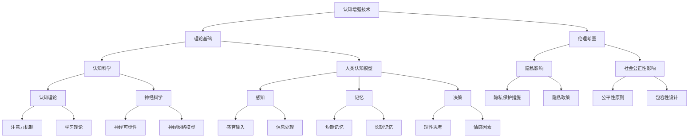

                 

# 文章标题 - 认知增强技术的伦理考量

> 关键词：认知增强技术、伦理考量、隐私影响、社会公正性、监管、应用案例、未来展望

> 摘要：本文旨在探讨认知增强技术的伦理考量，从技术概述、伦理问题分析、伦理风险、伦理监管、应用案例和未来展望六个方面进行详细阐述，旨在为认知增强技术的健康发展提供理论支持和实践指导。

## 目录大纲 - 《认知增强技术的伦理考量》

1. **第一部分：认知增强技术概述**
   1.1 认知增强技术导论
       - 认知增强技术的基本概念
       - 认知增强技术的发展历程
       - 认知增强技术的分类与特点
   1.2 认知增强技术的理论基础
       - 认知科学的基本原理
       - 人类认知模型概述
       - 认知增强技术的理论框架

2. **第二部分：认知增强技术的伦理问题分析**
   2.1 认知增强技术的伦理考量
       - 伦理学的基本原理与认知增强技术
       - 认知增强技术对个人隐私的影响
       - 认知增强技术对社会公正性的影响
   2.2 认知增强技术的伦理风险
       - 信息滥用与隐私泄露
       - 数据歧视与偏见
       - 认知增强技术的依赖性

3. **第三部分：认知增强技术的伦理监管**
   3.1 伦理监管框架与原则
       - 伦理监管框架的构建
       - 伦理监管的原则和目标
   3.2 伦理审查机制与流程
       - 伦理审查机制的运作
       - 伦理审查的流程和步骤
   3.3 伦理监管的政策与法规
       - 政策法规的制定与实施
       - 国际合作与法规协调

4. **第四部分：认知增强技术的伦理应用案例分析**
   4.1 认知增强技术在医疗领域的伦理应用
       - 认知增强技术在心理治疗中的应用
       - 认知增强技术在康复治疗中的应用
       - 医疗领域认知增强技术的伦理挑战
   4.2 认知增强技术在教育领域的伦理应用
       - 认知增强技术在个性化学习中的应用
       - 认知增强技术在技能训练中的应用
       - 教育领域认知增强技术的伦理考量
   4.3 认知增强技术在职场管理的伦理应用
       - 认知增强技术在员工培训中的应用
       - 认知增强技术在绩效评估中的应用
       - 职场管理领域认知增强技术的伦理挑战

5. **第五部分：认知增强技术的未来伦理展望**
   5.1 认知增强技术伦理的未来趋势
       - 技术进步与伦理考量的平衡
       - 国际合作与伦理规范的建立
       - 伦理教育在认知增强技术发展中的角色
   5.2 认知增强技术的伦理责任
       - 企业的伦理责任与合规
       - 个人的伦理责任与自律
       - 全社会对认知增强技术伦理的共治

6. **附录**
   6.1 认知增强技术的伦理研究文献推荐
   6.2 认知增强技术的伦理资源与工具

# 核心概念与联系 - 认知增强技术的 Mermaid 流程图

## 第一部分：认知增强技术概述

### 1.1 认知增强技术导论

#### 认知增强技术的基本概念

认知增强技术是指通过辅助设备、软件算法或生物医学方法，提升人类认知功能的技术。它包括但不限于增强记忆、提高注意力、增强学习能力、加速决策过程等。认知增强技术的核心目的是通过提高人类的认知能力，提升工作效率、改善生活质量。

#### 认知增强技术的发展历程

认知增强技术起源于20世纪中期，随着计算机科学和神经科学的发展，逐渐形成了独立的领域。以下是认知增强技术发展的几个重要阶段：

1. **早期探索（1950-1970年代）**：这一阶段主要是利用计算机模拟人脑的一些基本认知过程，如记忆和决策。
   
2. **计算认知革命（1980-1990年代）**：随着个人电脑的普及，认知增强技术开始进入实际应用，例如使用软件辅助记忆和学习。

3. **神经科学与计算的结合（2000年代）**：这一阶段，认知增强技术开始与神经科学深入结合，通过脑成像技术了解大脑活动，开发出更加精确的认知增强方法。

4. **智能化认知增强（2010年代至今）**：随着人工智能和机器学习的发展，认知增强技术变得更加智能化，能够根据个体差异提供个性化的增强方案。

#### 认知增强技术的分类与特点

认知增强技术可以按照不同的标准进行分类，以下是一些常见的分类方法和其特点：

1. **基于硬件的认知增强**：这类技术通过使用辅助硬件设备来增强认知能力，如增强现实（AR）和虚拟现实（VR）设备。它们的特点是沉浸式体验和高度交互性，能够提供丰富的感官刺激。

2. **基于软件的认知增强**：这类技术通过软件算法来优化认知过程，如记忆训练软件、注意力提升工具等。它们的特点是灵活性高、可定制性强，能够针对不同的认知需求进行优化。

3. **基于生物医学的认知增强**：这类技术通过生物医学方法，如药物、神经调节等，来增强认知能力。它们的特点是效果直接、但风险和副作用较大。

4. **基于神经科学的理论模型**：这类技术基于对大脑的认知过程的理解，开发出能够模拟和增强认知功能的算法和系统。它们的特点是理论性强、准确性高。

### 1.2 认知增强技术的理论基础

#### 认知科学的基本原理

认知科学是研究人类认知过程的跨学科领域，涉及心理学、神经科学、计算机科学、哲学等多个学科。认知科学的基本原理包括：

1. **信息加工原理**：认知过程可以被视为信息加工的过程，涉及感知、记忆、注意、决策等多个阶段。
   
2. **模块化原理**：认知功能可以被分解为不同的模块，每个模块负责特定的认知功能。

3. **适应性原理**：认知系统是适应性的，能够根据环境的变化调整其功能和行为。

#### 人类认知模型概述

人类认知模型是对人类认知过程的抽象和模拟，常见的模型包括：

1. **经典认知模型**：如信息加工模型、决策模型等，强调信息处理的步骤和流程。

2. **现代认知模型**：如计算认知模型、神经网络模型等，强调计算过程和脑网络结构。

3. **混合认知模型**：结合了经典和现代认知模型，试图更加全面地模拟人类认知过程。

#### 认知增强技术的理论框架

认知增强技术的理论框架主要基于以下几个核心原理：

1. **适应性原理**：认知增强技术应能够根据个体差异和环境变化，动态调整增强策略。

2. **模块化原理**：认知增强技术应能够针对不同的认知模块进行优化，提高整体认知功能。

3. **信息加工原理**：认知增强技术应优化信息加工过程，提高信息处理的速度和准确性。

通过这些理论基础，认知增强技术能够在理论和实践层面实现认知功能的提升，为人类的发展提供新的可能性。

### 1.3 认知增强技术的伦理考量

#### 伦理学的基本原理与认知增强技术

伦理学是研究道德原则和行为的学科，其基本原理包括：

1. **正义原则**：强调公平性和公正性，认知增强技术的应用不应导致社会不平等。

2. **尊重原则**：尊重个体的自主权和隐私权，认知增强技术应保护用户的隐私和数据安全。

3. **责任原则**：技术开发者和应用者应承担相应的责任，确保技术的合理和合法使用。

认知增强技术的伦理考量需要从以下几个方面进行：

1. **个人隐私**：认知增强技术往往涉及个人数据的收集和使用，如何保护用户的隐私成为关键问题。

2. **社会公正性**：认知增强技术的普及和应用可能会导致新的社会不平等，如何确保其公平性成为重要议题。

3. **责任归属**：在认知增强技术的开发和应用过程中，如何明确各方的责任和责任边界，需要法律和伦理的双重保障。

### 1.4 认知增强技术对个人隐私的影响

#### 隐私影响分析

认知增强技术的应用往往涉及对个人数据的收集和分析，这可能会导致以下隐私问题：

1. **数据收集**：认知增强技术可能需要收集用户的生物识别数据、行为数据等敏感信息，这些数据可能包含用户的隐私。

2. **数据存储**：收集到的数据需要存储在服务器或云端，存在数据泄露和滥用的风险。

3. **数据共享**：认知增强技术的数据可能被用于商业目的或与其他机构共享，如何保护用户的隐私和数据安全成为关键问题。

#### 隐私保护措施

为应对上述隐私问题，可以采取以下隐私保护措施：

1. **数据匿名化**：在数据收集和处理过程中，采用匿名化技术，去除个人身份信息，降低隐私泄露风险。

2. **数据加密**：对存储和传输的数据进行加密，确保数据在未经授权的情况下无法被读取。

3. **隐私政策**：制定明确的隐私政策，告知用户数据收集、使用和共享的目的和方式，让用户知情并同意。

4. **透明度**：建立透明的数据管理和使用流程，用户可以随时查询和管理自己的数据。

通过这些措施，可以有效保护用户的隐私，降低隐私泄露和滥用的风险。

### 1.5 认知增强技术对社会公正性的影响

#### 社会影响分析

认知增强技术的普及和应用可能会对社会公正性产生以下影响：

1. **数字鸿沟**：认知增强技术的成本较高，可能加剧数字鸿沟，使得经济条件较差的人群无法享受认知增强技术的福利。

2. **就业影响**：认知增强技术可能会提高某些工作的效率，但也可能导致部分职业的失业，如重复性劳动。

3. **社会不平等**：认知增强技术的滥用可能会导致新的社会不平等，如通过数据歧视影响就业、教育和医疗等领域的公正性。

#### 公平性原则与包容性设计

为应对上述社会影响，需要遵循以下公平性原则和包容性设计：

1. **公平性原则**：确保认知增强技术的应用不会导致新的社会不平等，应采取措施减少数字鸿沟，确保技术的普及性和可及性。

2. **包容性设计**：在认知增强技术的开发和应用过程中，应充分考虑不同人群的需求和特点，确保技术的公平性和包容性。

3. **多元视角**：在制定政策和规范时，应广泛征求各方意见，包括技术开发者、应用者、用户等，确保政策的公正性和有效性。

通过这些原则和设计，可以有效减少认知增强技术对社会公正性的负面影响，推动社会的公平和谐发展。

### 1.6 认知增强技术的伦理监管

#### 伦理监管框架与原则

认知增强技术的伦理监管需要建立完善的框架和原则，以确保技术的合理和合法使用。以下是一个基本的伦理监管框架：

1. **伦理审查委员会**：设立独立的伦理审查委员会，负责对认知增强技术的研发、应用和推广进行伦理审查。

2. **伦理规范和标准**：制定伦理规范和标准，明确认知增强技术的伦理边界，指导技术开发和应用。

3. **责任界定**：明确各方的责任和义务，包括技术开发者、应用者、用户等，确保责任的明确和落实。

4. **伦理教育和培训**：加强对技术开发者和应用者的伦理教育，提高其伦理意识和责任感。

#### 伦理审查机制与流程

伦理审查机制应包括以下步骤：

1. **申请和提交**：技术开发者或应用者需提交伦理审查申请，包括技术方案、伦理风险评估等。

2. **初步审查**：伦理审查委员会对提交的申请进行初步审查，评估其是否符合伦理规范和标准。

3. **详细审查**：对初步审查通过的申请进行详细审查，包括现场考察、专家评审等。

4. **决定和反馈**：伦理审查委员会根据审查结果做出决定，并将审查意见反馈给申请者。

5. **监督和跟踪**：对审查通过的技术进行定期监督和跟踪，确保其符合伦理规范和标准。

#### 伦理监管的政策与法规

为了确保认知增强技术的健康发展，需要制定相应的政策和法规，包括：

1. **隐私保护政策**：明确个人数据的收集、使用和共享规范，保护用户隐私。

2. **公平性原则**：确保技术的公平性和包容性，防止新的社会不平等。

3. **责任追究制度**：建立责任追究制度，对违反伦理规范的行为进行处罚。

4. **国际合作**：加强国际合作，推动全球范围内的认知增强技术伦理监管。

通过这些政策和法规，可以有效规范认知增强技术的研发和应用，保障其健康发展。

### 1.7 认知增强技术的伦理风险

#### 信息滥用与隐私泄露

认知增强技术的应用涉及到大量的个人数据，这些数据可能被滥用或泄露，从而对个人隐私造成严重威胁。以下是一些具体的风险：

1. **数据滥用**：个人数据可能被用于不当目的，如广告定向、市场分析等。

2. **隐私泄露**：由于数据存储和传输过程中的安全漏洞，个人数据可能被未授权的第三方获取。

3. **社会歧视**：个人数据可能被用于歧视性决策，如就业、教育和医疗服务等。

#### 数据歧视与偏见

认知增强技术可能会引入数据歧视和偏见，对某些人群产生不公平影响。以下是一些具体风险：

1. **算法偏见**：算法训练数据可能包含偏见，导致算法对某些人群产生歧视。

2. **数据不平衡**：在某些情况下，数据集中的某些群体可能被过度代表，导致其他群体被忽视。

3. **自动化决策**：基于算法的自动化决策系统可能加剧数据歧视和偏见，如招聘系统、信用评分等。

#### 认知增强技术的依赖性

过度依赖认知增强技术可能会对人类的认知能力产生负面影响，具体风险包括：

1. **认知能力下降**：长期依赖认知增强技术可能会导致人类自身认知能力的退化。

2. **决策能力下降**：依赖认知增强技术进行决策可能会降低人类自身的决策能力和责任感。

3. **社交隔离**：过度依赖认知增强技术可能会导致人与人之间的社交互动减少，增加社交隔离的风险。

#### 伦理风险应对措施

为应对上述伦理风险，可以采取以下措施：

1. **加强数据保护**：提高数据安全性，采用加密、匿名化等技术保护个人数据。

2. **算法公平性**：确保算法的公平性，避免算法偏见和数据歧视。

3. **提高伦理意识**：加强对技术开发者和应用者的伦理教育，提高其责任感和道德意识。

4. **监管与规范**：建立完善的伦理监管体系，制定相关的政策和法规，确保技术的合理和合法使用。

通过这些措施，可以有效降低认知增强技术的伦理风险，保障其健康发展。

### 1.8 认知增强技术在医疗领域的伦理应用

#### 认知增强技术在心理治疗中的应用

认知增强技术在心理治疗中的应用主要包括以下几个方面：

1. **认知行为疗法（CBT）**：通过认知增强技术，如虚拟现实（VR）和增强现实（AR）设备，帮助患者进行情境模拟，从而更有效地进行认知重构和行为调整。

2. **记忆训练**：认知增强技术可以设计特定的记忆训练程序，帮助患者改善记忆力，特别是对于那些患有认知障碍的患者。

3. **注意力训练**：认知增强技术可以通过提供个性化的注意力训练任务，帮助患者提高注意力和专注力，从而改善心理健康。

#### 认知增强技术在康复治疗中的应用

认知增强技术在康复治疗中的应用同样具有重要意义，具体包括：

1. **康复训练**：通过认知增强技术，如虚拟现实（VR）和增强现实（AR）设备，为患者提供更加生动和互动的康复训练环境，提高康复效果。

2. **辅助康复评估**：认知增强技术可以用于患者康复过程中的评估，通过实时监测和数据分析，提供个性化的康复建议和调整方案。

3. **认知功能恢复**：对于认知障碍患者，认知增强技术可以通过特定的训练程序，帮助他们恢复认知功能，提高生活质量。

#### 医疗领域认知增强技术的伦理挑战

认知增强技术在医疗领域的应用虽然带来了显著的治疗效果，但也面临一系列伦理挑战：

1. **隐私保护**：在医疗过程中，患者个人健康数据的安全性和隐私保护成为关键问题，如何确保数据的安全性和合规性成为伦理关注点。

2. **数据共享**：医疗数据的共享是提高治疗效果的重要手段，但在数据共享过程中，如何保护患者的隐私和权益，避免数据滥用，是亟待解决的伦理问题。

3. **责任归属**：在认知增强技术的医疗应用中，如何明确各方责任，包括技术开发者、医疗机构和患者，确保责任的明确和落实，是伦理监管的重要任务。

4. **技术依赖**：长期依赖认知增强技术可能会导致患者对技术的过度依赖，影响其自主康复能力和健康意识，如何平衡技术的应用和患者的自我管理能力，是伦理考量的重要方面。

通过加强隐私保护、规范数据共享、明确责任归属和促进技术合理应用，可以有效应对医疗领域认知增强技术的伦理挑战，推动其健康发展。

### 1.9 认知增强技术在教育领域的伦理应用

#### 认知增强技术在个性化学习中的应用

认知增强技术在教育领域的应用，特别是个性化学习，提供了前所未有的学习体验和效果。以下是一些具体的应用场景：

1. **学习分析**：通过收集和分析学生的学习数据，认知增强技术可以识别每个学生的个性化学习需求和弱点，提供个性化的学习路径和建议。

2. **自适应学习系统**：自适应学习系统可以根据学生的学习进度、能力和偏好，动态调整学习内容和难度，实现真正的个性化教学。

3. **学习辅助工具**：利用虚拟现实（VR）、增强现实（AR）和人工智能（AI）等认知增强技术，开发出各种学习辅助工具，如虚拟实验室、互动教材和智能辅导系统，提高学生的学习兴趣和参与度。

#### 认知增强技术在技能训练中的应用

认知增强技术在技能训练中的应用，有助于提高技能学习的效率和质量。以下是一些具体的实例：

1. **虚拟实践**：通过虚拟现实技术，学生可以在虚拟环境中进行实践操作，如手术模拟、飞行训练等，降低实际操作的风险，提高学习效果。

2. **实时反馈**：认知增强技术可以实时监测学生的学习过程，提供即时的反馈和指导，帮助学生及时纠正错误，优化学习策略。

3. **互动学习**：通过增强现实和人工智能技术，创造互动性强的学习环境，让学生在真实的情境中学习和应用技能，提高学习效果和实际操作能力。

#### 教育领域认知增强技术的伦理考量

尽管认知增强技术在教育领域展现了巨大的潜力，但其应用也带来了一系列伦理考量：

1. **教育公平**：认知增强技术的应用可能会加剧教育公平问题，因为技术的获取和使用可能受到经济和社会背景的限制。

2. **隐私保护**：在教育过程中，认知增强技术需要收集和分析大量的学生数据，如何保护学生的隐私和数据安全是重要的伦理问题。

3. **教育自主性**：认知增强技术可能会过度干预教育过程，影响学生的自主性和创造性思维，如何平衡技术的应用和学生的自主发展，是教育伦理的重要议题。

4. **数据伦理**：在数据收集和使用过程中，如何确保数据的透明性、合规性和合法性，避免数据滥用和不当使用，是教育领域认知增强技术面临的关键伦理挑战。

通过建立健全的伦理规范和制度，加强隐私保护，促进教育公平，保障学生的自主性和创造性，可以有效应对教育领域认知增强技术的伦理挑战，推动教育的健康发展。

### 1.10 认知增强技术在职场管理的伦理应用

#### 认知增强技术在员工培训中的应用

认知增强技术在员工培训中的应用，可以有效提升培训的效果和效率，具体表现在以下几个方面：

1. **个性化培训**：通过分析员工的认知能力、学习偏好和职业需求，认知增强技术可以提供个性化的培训内容和路径，使培训更加精准和高效。

2. **互动性培训**：利用虚拟现实（VR）和增强现实（AR）技术，员工可以在互动式的培训环境中进行学习和实践，提高培训的趣味性和参与度。

3. **实时反馈与改进**：认知增强技术可以实时监测员工的学习过程，提供即时的反馈和指导，帮助员工及时纠正错误，优化学习策略，提高学习效果。

#### 认知增强技术在绩效评估中的应用

认知增强技术在绩效评估中的应用，为管理者提供了更为全面和科学的评估工具和方法，主要表现在以下几个方面：

1. **客观性评估**：通过分析员工的工作数据和行为数据，认知增强技术可以提供客观的绩效评估结果，减少主观评价的偏差。

2. **多维度评估**：认知增强技术可以结合多种评估指标，如工作成果、行为表现、学习能力等，进行多维度评估，提供更全面的绩效评估报告。

3. **动态评估与改进**：认知增强技术可以根据员工的表现和反馈，动态调整评估标准和方案，帮助管理者及时发现问题和改进绩效。

#### 职场管理领域认知增强技术的伦理挑战

尽管认知增强技术在职场管理中展示了巨大的潜力，但其应用也带来了一系列伦理挑战：

1. **数据隐私**：在员工培训和绩效评估中，认知增强技术需要收集和分析大量的员工数据，如何保护员工的数据隐私和安全是重要的伦理问题。

2. **算法偏见**：如果训练数据存在偏见，认知增强技术可能会导致评估结果的不公平，如性别、种族、年龄等歧视性评估。

3. **工作依赖**：过度依赖认知增强技术进行员工管理和绩效评估，可能会削弱员工的工作自主性和责任感。

4. **伦理监督**：如何建立有效的伦理监督机制，确保认知增强技术的合理和合法使用，避免滥用和不当应用，是职场管理领域的重要伦理挑战。

通过加强数据隐私保护、消除算法偏见、提高员工的自主性和责任感，以及建立完善的伦理监督机制，可以有效应对职场管理领域认知增强技术的伦理挑战，推动企业的健康发展。

### 1.11 认知增强技术的未来伦理展望

#### 技术进步与伦理考量的平衡

随着认知增强技术的不断进步，如何在技术进步和伦理考量之间找到平衡成为关键问题。以下是一些关键点：

1. **技术创新与伦理规范**：技术创新不应脱离伦理规范，应通过建立和完善伦理规范，引导技术发展。

2. **透明度和责任**：技术开发者和应用者应提高透明度，明确责任，确保技术的合理和合法使用。

3. **公众参与**：在技术发展和政策制定过程中，应广泛征求公众意见，确保技术符合社会期望和价值观。

#### 国际合作与伦理规范的建立

国际合作对于建立全球统一的认知增强技术伦理规范具有重要意义。以下是一些具体建议：

1. **国际论坛与会议**：建立国际论坛和会议，促进各国在认知增强技术伦理领域的交流与合作。

2. **跨国研究项目**：通过跨国研究项目，推动全球范围内的认知增强技术研究和伦理规范制定。

3. **伦理规范协调**：促进各国伦理规范的协调和统一，建立全球统一的认知增强技术伦理框架。

#### 伦理教育在认知增强技术发展中的角色

伦理教育在认知增强技术发展中扮演着重要角色，以下是一些关键点：

1. **伦理课程**：在高校和职业培训中，设置认知增强技术伦理相关课程，提高技术从业者的伦理素养。

2. **伦理实践**：通过实际案例分析，让从业者了解认知增强技术可能面临的伦理问题，提高其解决实际问题的能力。

3. **伦理咨询**：建立伦理咨询服务，为技术开发者和应用者提供专业的伦理咨询和指导，确保技术的合理和合法使用。

通过技术创新与伦理考量的平衡、国际合作与伦理规范的建立以及伦理教育在认知增强技术发展中的角色，可以有效应对认知增强技术的未来伦理挑战，推动其健康发展。

### 1.12 认知增强技术的伦理责任

#### 企业的伦理责任与合规

企业在认知增强技术的开发和应用过程中，承担着重要的伦理责任。以下是一些关键点：

1. **伦理审查**：企业在推出新产品或服务之前，应进行全面的伦理审查，确保其符合伦理规范和法律法规。

2. **透明度和告知**：企业应提高透明度，向用户明确告知数据收集、使用和共享的目的和方式，确保用户知情并同意。

3. **隐私保护**：企业应采取有效措施保护用户的隐私和数据安全，如数据加密、匿名化等。

4. **合规性**：企业应遵守相关的政策和法规，确保认知增强技术的合理和合法使用。

#### 个人的伦理责任与自律

个人在认知增强技术的使用过程中，也承担着重要的伦理责任。以下是一些关键点：

1. **隐私保护**：个人应妥善管理自己的个人信息，避免泄露给未授权的第三方。

2. **数据共享**：在数据共享时，个人应确保数据的安全性和合规性，避免滥用和不当使用。

3. **伦理使用**：个人应遵守伦理规范和法律法规，避免过度依赖认知增强技术，保持自我管理和责任感。

4. **自我教育**：个人应主动了解认知增强技术的伦理问题和风险，提高自身的伦理素养。

#### 全社会对认知增强技术伦理的共治

认知增强技术的伦理问题不仅涉及企业和个人，还需要全社会的共同努力。以下是一些关键点：

1. **公众参与**：政府、企业、学术机构和公众应共同参与认知增强技术伦理的讨论和决策过程，确保技术的公平、公正和合理。

2. **伦理教育**：加强伦理教育，提高公众对认知增强技术伦理问题的认识和素养。

3. **政策制定**：政府应制定和完善相关的政策和法规，规范认知增强技术的研发和应用。

4. **国际合作**：推动全球范围内的认知增强技术伦理合作，建立统一的国际标准和规范。

通过企业、个人和全社会的共同努力，可以有效应对认知增强技术的伦理挑战，推动其健康发展。

### 附录 A: 认知增强技术的伦理研究文献推荐

1. Nissenbaum, H. (2010). *Privacy in Context: Technology, Policy, and the Integrity of Social Life*. Stanford Law Books.
2. boyd, R., & Crawford, K. (2012). *Critical questions for big data: Provocations for a cultural, technological, and scholarly phenomenon*. *Information, Communication & Society*, 15(5), 662-679.
3. Floridi, L. (2015). *The fourth revolution: How the infosphere is reshaping human life*. Oneworld Publications.
4. Nisbet, E. C. (2015). *The ethics of big data: Balancing risks and benefits for society*. *Environmental Ethics*, 37(3), 325-342.
5. O'Neil, C. (2016). *Weapons of math destruction: How big data increases inequality and threatens democracy*. Crown Publishing Group.

### 附录 B: 认知增强技术的伦理资源与工具

1. **国际计算机伦理协会 (International Association for Computer Ethics)**：提供计算机伦理教育和研究资源，涵盖认知增强技术的伦理问题。
2. **欧盟数据伦理准则 (EDPS Guidelines on Data Protection)**：为认知增强技术的数据保护提供指导和建议。
3. **人工智能伦理指南 (IEEE Global Initiative on Ethics of AI and Autonomous Systems)**：提供人工智能和认知增强技术的伦理框架和指导。
4. **隐私增强技术 (Privacy Enhancing Technologies)**：提供隐私保护技术和工具，适用于认知增强技术的开发和应用。
5. **认知增强技术伦理论坛 (Ethics Forum on Cognitive Enhancement Technologies)**：为学术界、产业界和公众提供认知增强技术伦理讨论的平台。

