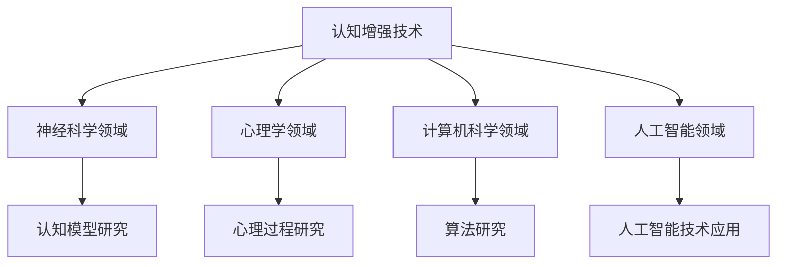
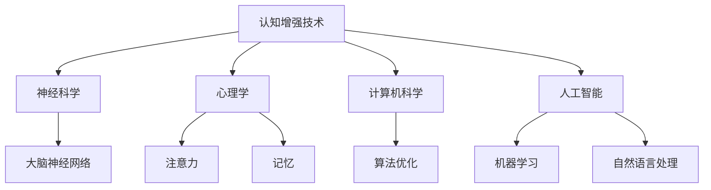
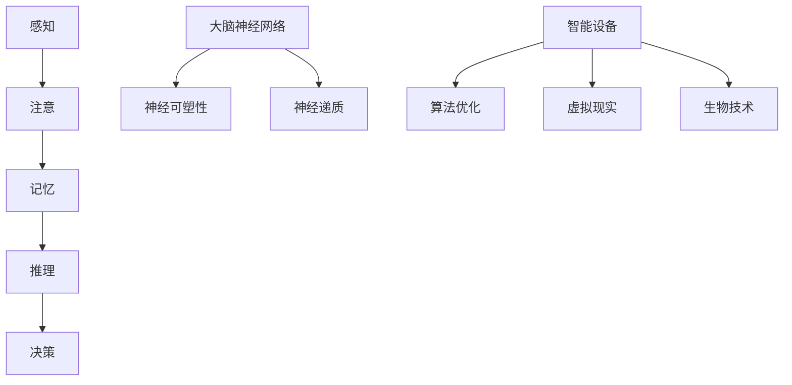
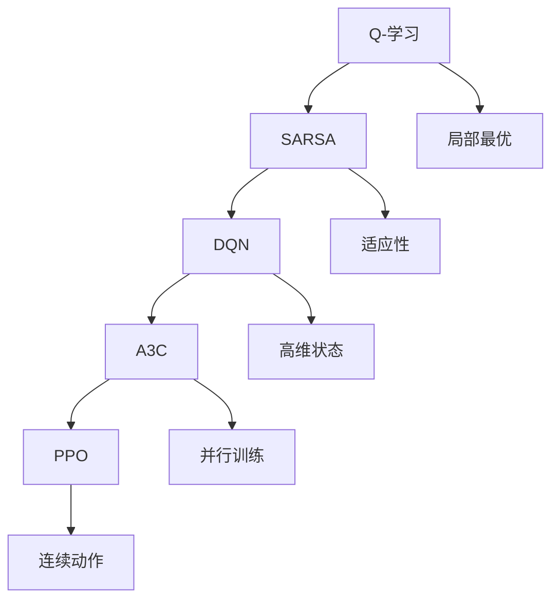
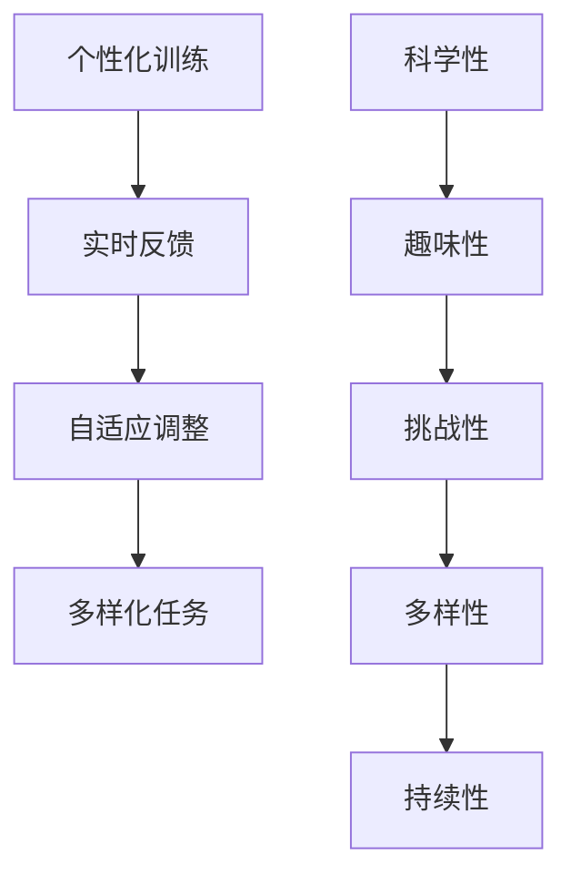
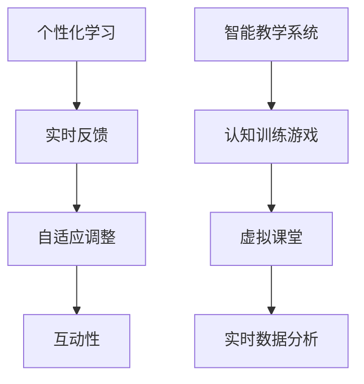
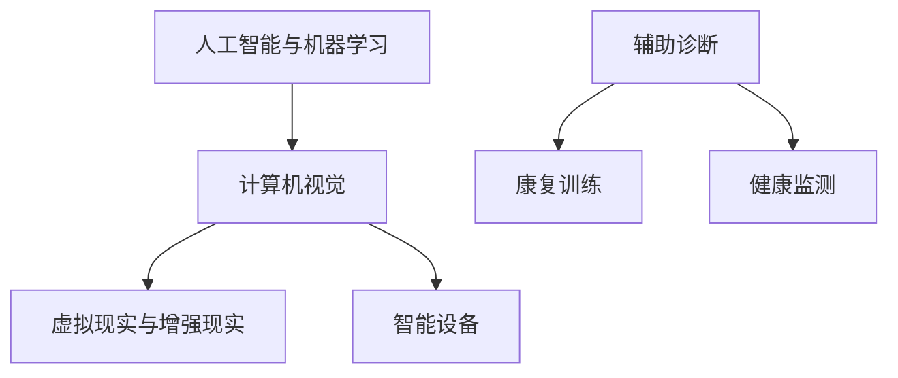
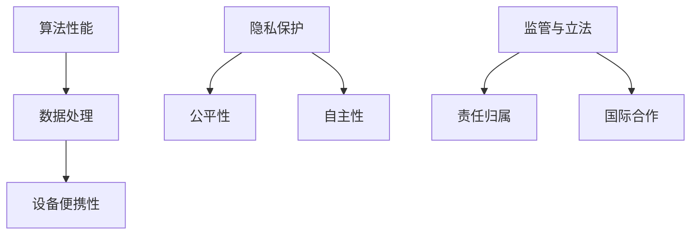

                 

### 文章标题

# 认知增强技术：扩展人类智能的新前沿

### 关键词

- 认知增强
- 人工智能
- 强化学习
- 智能游戏
- 教育应用
- 医疗应用
- 未来趋势

### 摘要

本文深入探讨了认知增强技术的概念、原理和应用前景。通过分析认知增强技术的发展历程、核心算法、以及在游戏、教育和医疗等领域的应用，本文揭示了认知增强技术如何拓展人类智能的边界。此外，本文还探讨了认知增强技术面临的挑战和未来的发展趋势，为读者提供了全面的认知增强技术全景图。

### 引言

在人工智能迅猛发展的今天，认知增强技术作为一门前沿学科，正逐渐引起广泛关注。认知增强技术通过优化和增强人类大脑的认知功能，不仅有助于提高个人工作效率、学习效果和生活质量，还为教育、医疗等领域的创新提供了新的可能。

本文旨在系统地阐述认知增强技术的核心概念、原理和应用，帮助读者全面了解这一领域的发展现状和未来趋势。文章结构如下：

1. **认知增强技术基础**：介绍认知增强技术的定义、背景和目标，以及相关研究领域。
2. **认知增强技术原理**：解析人类认知过程和认知增强的神经基础，介绍认知增强的关键技术。
3. **认知增强的核心算法**：详细讲解增强学习算法，包括Q-学习、SARSA、DQN、A3C和PPO算法。
4. **认知增强技术应用**：分析认知增强技术在游戏、教育和医疗等领域的应用案例。
5. **认知增强技术的挑战与未来趋势**：探讨认知增强技术面临的挑战和未来发展趋势。
6. **认知增强技术开发与实践**：介绍认知增强技术开发基础和具体应用案例。
7. **附录**：提供认知增强技术常用工具与资源。

### 第一部分：认知增强技术基础

#### 第1章：认知增强技术概述

认知增强技术，简称CE（Cognitive Enhancement），是指通过技术手段提升或优化人类的认知能力。这一领域结合了神经科学、心理学、计算机科学和人工智能等多个学科，旨在通过外部的工具、算法和设备等，帮助人类在信息处理、记忆、推理、学习和注意力等方面实现质的飞跃。

#### 1.1 认知增强的定义与背景

##### 1.1.1 认知增强的定义

认知增强是一种旨在提升个体认知能力的系统方法和策略。它可以通过以下几种方式实现：

- **生物技术**：例如，药物、营养补充、神经调节等。
- **技术辅助**：例如，智能设备、认知训练程序、虚拟现实等。
- **心理训练**：例如，冥想、认知训练、记忆游戏等。

##### 1.1.2 认知增强的背景

认知增强技术的兴起源于人类对自身认知能力极限的持续探索和挑战。随着科技的发展，特别是人工智能和神经科学领域的突破，认知增强技术逐渐成为可能。同时，随着人口老龄化、工作压力增大和学习需求提升，认知增强技术在现实生活中的应用需求也日益增长。

#### 1.2 认知增强技术的目标

认知增强技术的主要目标包括：

- **提高工作效率**：通过增强记忆、注意力和信息处理能力，提高个体在工作中的表现。
- **优化学习体验**：通过提升学习效率、加深理解和记忆，帮助个体更快地掌握新知识。
- **改善生活质量**：通过提升认知功能，改善个体的日常生活质量，增强社交能力。

#### 1.3 认知增强技术的研究领域

认知增强技术的研究领域广泛且多样，主要包括以下几个方向：

- **神经科学领域**：研究认知增强技术如何作用于大脑神经网络，提高认知功能。
- **心理学领域**：研究认知增强技术对人类心理过程的影响，包括注意力、记忆、决策等。
- **计算机科学领域**：研究如何利用算法和技术手段实现认知增强，如机器学习、深度学习等。
- **人工智能领域**：研究人工智能在认知增强中的应用，如自然语言处理、智能游戏等。

#### 1.4 认知增强技术的应用前景

认知增强技术具有广泛的应用前景，包括但不限于以下领域：

- **教育领域**：通过个性化教学和学习效果评估，提高学生的学习效率。
- **医疗领域**：通过辅助诊断和治疗，改善患者的病情和生活质量。
- **军事领域**：通过提高军事人员的战术决策能力，增强战斗力。
- **工业领域**：通过提高生产效率、降低成本，提升企业的竞争力。

#### 1.5 认知增强技术的挑战与未来趋势

尽管认知增强技术具有巨大的潜力，但同时也面临许多挑战：

- **技术挑战**：如何提高认知模型的准确性、算法的有效性和设备的便携性。
- **道德与伦理挑战**：如何防止认知增强技术的滥用，保护个人隐私。
- **法律与政策挑战**：如何制定相应的法律法规，确保认知增强技术的合法和合规使用。

未来，认知增强技术将朝着更加智能化、个性化、安全可靠的方向发展，其应用前景将更加广阔。

#### 1.6 本章小结

本章对认知增强技术进行了全面的概述，介绍了其定义、背景、目标、研究领域以及应用前景。下一章将深入探讨认知增强技术的原理，帮助读者进一步理解这一领域的关键概念和技术。

### Mermaid 流程图示例



### 核心概念与联系

认知增强技术涉及多个学科，其核心概念和联系可以用以下Mermaid流程图进行概括：



这些学科在认知增强技术中相互交织，共同推动技术的进步和应用。

### 数学模型和公式

认知增强技术的数学模型通常涉及以下几个关键参数：

$$
Q(s, a) = r + \gamma \max_{a'} Q(s', a')
$$

其中，$Q(s, a)$ 表示在状态 $s$ 下采取动作 $a$ 的期望回报，$r$ 表示即时奖励，$\gamma$ 是折扣因子，表示未来奖励的重要性。

### 举例说明

以Q-学习算法为例，其核心思想是基于当前状态和动作的回报来更新Q值。以下是一个简化的数学公式：

$$
Q(s, a) \leftarrow Q(s, a) + \alpha (r + \gamma \max_{a'} Q(s', a') - Q(s, a))
$$

其中，$\alpha$ 是学习率，用于控制Q值更新的幅度。

### 项目实战

在认知增强技术的研究中，一个典型的项目实战案例是开发一款基于增强学习算法的智能学习辅助工具。以下是一个简化的项目流程：

#### 开发环境搭建

1. **软件环境**：安装Python编程环境和TensorFlow框架。
2. **硬件环境**：配置一台具备较高计算性能的计算机。

#### 源代码实现

```python
import numpy as np
import tensorflow as tf

# 初始化参数
alpha = 0.1
gamma = 0.9
learning_rate = 0.1

# 构建Q网络
Q_network = tf.keras.Sequential([
    tf.keras.layers.Dense(64, activation='relu', input_shape=(input_shape,)),
    tf.keras.layers.Dense(64, activation='relu'),
    tf.keras.layers.Dense(output_shape)
])

# 编译模型
Q_network.compile(optimizer='adam', loss='mse')

# 训练模型
for episode in range(num_episodes):
    state = env.reset()
    done = False
    total_reward = 0
    while not done:
        action = Q_network.predict(state.reshape(1, -1))
        next_state, reward, done, _ = env.step(np.argmax(action))
        Q_network.fit(state.reshape(1, -1), np.append(action, [[reward] + gamma * np.max(Q_network.predict(next_state.reshape(1, -1)))]))
        state = next_state
        total_reward += reward
    print(f"Episode {episode}: Total Reward {total_reward}")
```

#### 代码解读与分析

1. **参数初始化**：定义学习率$\alpha$、折扣因子$\gamma$和训练次数。
2. **Q网络构建**：使用TensorFlow构建Q网络，该网络由两个隐藏层组成。
3. **模型编译**：编译模型，选择Adam优化器和均方误差损失函数。
4. **模型训练**：通过增强学习算法训练模型，更新Q值。

通过以上项目实战，读者可以更好地理解认知增强技术的开发流程和核心算法。

### 总结

本章对认知增强技术进行了全面概述，介绍了其定义、背景、目标、研究领域、应用前景以及挑战和未来趋势。通过Mermaid流程图、数学模型和项目实战，读者可以更深入地理解认知增强技术的核心概念和实际应用。下一章将深入探讨认知增强技术的原理，帮助读者进一步掌握这一领域的关键知识。

---

接下来，我们将进入第二部分，深入探讨认知增强技术的原理，包括人类认知过程的解析、认知增强的神经基础以及关键技术的介绍。

---

### 第二部分：认知增强技术原理

#### 第2章：认知增强技术原理

认知增强技术作为一门综合性学科，其核心在于理解和优化人类的认知过程。本章将深入探讨认知增强技术的原理，包括人类认知过程的解析、认知增强的神经基础和关键技术的介绍。

#### 2.1 人类认知过程解析

人类认知过程是一个复杂且多层次的过程，主要包括感知、注意、记忆、推理和决策等环节。

##### 2.1.1 感知

感知是认知过程的起点，涉及从环境中提取信息的过程。人类通过视觉、听觉、嗅觉、味觉和触觉等感官系统接收外部信息。

##### 2.1.2 注意

注意是认知过程中的一个重要环节，它决定了人类对信息的接收和处理能力。注意力可以集中或分散，影响认知任务的效率和效果。

##### 2.1.3 记忆

记忆是认知过程的核心组成部分，它将感知和注意的信息转化为长期存储的知识。记忆分为短期记忆和长期记忆，分别负责信息的临时存储和长期存储。

##### 2.1.4 推理

推理是通过已有的信息推导出新信息的过程。人类通过逻辑推理、归纳推理和类比推理等方式，对信息进行深层次的处理。

##### 2.1.5 决策

决策是基于推理的结果，对下一步行动进行选择。决策过程涉及信息处理、风险评估和目标优化等多个方面。

#### 2.2 认知增强的神经基础

认知增强的神经基础研究主要集中在了解大脑神经网络如何实现认知功能，以及如何通过技术手段优化这些功能。

##### 2.2.1 大脑神经网络

大脑神经网络是由神经元组成的复杂网络，负责处理和传递信息。不同区域的大脑神经网络在认知过程中扮演不同角色。

##### 2.2.2 神经可塑性

神经可塑性是指大脑神经网络在外界刺激下发生结构和功能改变的能力。通过认知训练和神经调节，可以增强大脑神经网络的连接和效率。

##### 2.2.3 神经递质

神经递质是大脑神经网络之间传递信息的化学物质。通过调节神经递质的释放和浓度，可以影响认知功能。

#### 2.3 认知增强的关键技术

认知增强技术涉及多个技术领域，包括智能设备、算法优化、虚拟现实和生物技术等。

##### 2.3.1 智能设备

智能设备可以通过增强感知、注意和记忆等功能，帮助人类提高认知能力。例如，智能眼镜可以提供实时信息，辅助记忆和决策。

##### 2.3.2 算法优化

算法优化是认知增强技术的核心，通过机器学习和深度学习算法，可以实现对认知过程的模拟和优化。例如，增强学习算法可以用于智能游戏和智能教育的开发。

##### 2.3.3 虚拟现实

虚拟现实技术可以为认知训练提供沉浸式环境，帮助用户在安全、可控的条件下进行认知功能训练。例如，虚拟现实可以用于训练注意力、记忆和推理能力。

##### 2.3.4 生物技术

生物技术，如药物和营养补充，可以直接作用于大脑神经网络，提高认知功能。例如，认知增强药物可以提高注意力集中和记忆能力。

#### 2.4 认知增强技术的应用

认知增强技术已经在多个领域得到广泛应用，包括教育、医疗、军事和工业等。

##### 2.4.1 教育领域

在教育领域，认知增强技术可以用于个性化教学和学习效果评估。通过智能设备和算法优化，学生可以获得个性化的学习资源和反馈，提高学习效率。

##### 2.4.2 医疗领域

在医疗领域，认知增强技术可以用于辅助诊断和治疗。通过智能设备和算法优化，医生可以更准确地分析病情，制定更有效的治疗方案。

##### 2.4.3 军事领域

在军事领域，认知增强技术可以用于提高军事人员的战术决策能力和反应速度。通过虚拟现实和算法优化，士兵可以在安全的环境中进行战术训练。

##### 2.4.4 工业领域

在工业领域，认知增强技术可以用于提高生产效率和质量控制。通过智能设备和算法优化，企业可以优化生产流程，降低成本。

#### 2.5 本章小结

本章对认知增强技术的原理进行了详细解析，包括人类认知过程的解析、认知增强的神经基础和关键技术的介绍。通过理解这些原理，读者可以更好地掌握认知增强技术的核心概念，为后续章节的应用和挑战分析打下基础。

### Mermaid 流程图示例



这些流程图帮助读者直观地理解人类认知过程和认知增强技术的基础架构。

### 数学模型和公式

认知增强技术中的数学模型通常涉及以下几个关键参数：

$$
Q(s, a) = r + \gamma \max_{a'} Q(s', a')
$$

其中，$Q(s, a)$ 表示在状态 $s$ 下采取动作 $a$ 的期望回报，$r$ 表示即时奖励，$\gamma$ 是折扣因子，表示未来奖励的重要性。

### 举例说明

以Q-学习算法为例，其核心思想是基于当前状态和动作的回报来更新Q值。以下是一个简化的数学公式：

$$
Q(s, a) \leftarrow Q(s, a) + \alpha (r + \gamma \max_{a'} Q(s', a') - Q(s, a))
$$

其中，$\alpha$ 是学习率，用于控制Q值更新的幅度。

### 项目实战

在认知增强技术的研究中，一个典型的项目实战案例是开发一款基于增强学习算法的智能学习辅助工具。以下是一个简化的项目流程：

#### 开发环境搭建

1. **软件环境**：安装Python编程环境和TensorFlow框架。
2. **硬件环境**：配置一台具备较高计算性能的计算机。

#### 源代码实现

```python
import numpy as np
import tensorflow as tf

# 初始化参数
alpha = 0.1
gamma = 0.9
learning_rate = 0.1

# 构建Q网络
Q_network = tf.keras.Sequential([
    tf.keras.layers.Dense(64, activation='relu', input_shape=(input_shape,)),
    tf.keras.layers.Dense(64, activation='relu'),
    tf.keras.layers.Dense(output_shape)
])

# 编译模型
Q_network.compile(optimizer='adam', loss='mse')

# 训练模型
for episode in range(num_episodes):
    state = env.reset()
    done = False
    total_reward = 0
    while not done:
        action = Q_network.predict(state.reshape(1, -1))
        next_state, reward, done, _ = env.step(np.argmax(action))
        Q_network.fit(state.reshape(1, -1), np.append(action, [[reward] + gamma * np.max(Q_network.predict(next_state.reshape(1, -1)))]))
        state = next_state
        total_reward += reward
    print(f"Episode {episode}: Total Reward {total_reward}")
```

#### 代码解读与分析

1. **参数初始化**：定义学习率$\alpha$、折扣因子$\gamma$和训练次数。
2. **Q网络构建**：使用TensorFlow构建Q网络，该网络由两个隐藏层组成。
3. **模型编译**：编译模型，选择Adam优化器和均方误差损失函数。
4. **模型训练**：通过增强学习算法训练模型，更新Q值。

通过以上项目实战，读者可以更好地理解认知增强技术的开发流程和核心算法。

### 总结

本章详细介绍了认知增强技术的原理，包括人类认知过程的解析、认知增强的神经基础和关键技术的介绍。通过数学模型和项目实战，读者可以更深入地理解认知增强技术的核心概念和实际应用。下一章将探讨认知增强技术的核心算法，包括增强学习算法的详细讲解和具体实现。

### 第3章：认知增强的核心算法

认知增强技术的实现依赖于一系列核心算法，其中增强学习算法尤为重要。增强学习（Reinforcement Learning, RL）是一种通过试错来学习如何在特定环境中做出最佳决策的机器学习方法。本章将详细讲解增强学习算法，包括Q-学习、SARSA、DQN、A3C和PPO等算法，并通过伪代码和数学公式来阐述其原理和实现过程。

#### 3.1 增强学习算法

增强学习算法主要分为基于值的方法和基于策略的方法。基于值的方法通过评估状态值函数（State-Value Function）或动作值函数（Action-Value Function）来选择最佳动作。基于策略的方法则直接学习一个策略（Policy），该策略定义了在特定状态下采取的最佳动作。

##### 3.1.1 Q-学习算法

Q-学习（Q-Learning）是一种基于值的方法，通过迭代更新Q值来学习最佳动作。以下是Q-学习算法的伪代码：

```python
// Q-学习算法伪代码
Initialize Q(s, a) uniformly at 0
for each episode:
    s = initial_state()
    while not terminal_state(s):
        a = choose_action(s, epsilon-greedy)
        s' = execute_action(a)
        reward = get_reward(s', a)
        Q(s, a) = Q(s, a) + alpha * (reward + gamma * max(Q(s', a')) - Q(s, a))
        s = s'
```

数学公式：

$$
Q(s, a) \leftarrow Q(s, a) + \alpha (r + \gamma \max_{a'} Q(s', a') - Q(s, a))
$$

其中，$\alpha$ 是学习率，$r$ 是即时奖励，$\gamma$ 是折扣因子。

##### 3.1.2 SARSA算法

SARSA（State-Action-Reward-State-Action）算法是Q-学习算法的变体，它使用即时回报和下一个状态值来更新当前状态和动作的Q值。以下是SARSA算法的伪代码：

```python
// SARSA算法伪代码
Initialize Q(s, a) uniformly at 0
for each episode:
    s = initial_state()
    while not terminal_state(s):
        a = choose_action(s, epsilon-greedy)
        s' = execute_action(a)
        reward = get_reward(s', a)
        a' = choose_action(s', epsilon-greedy)
        Q(s, a) = Q(s, a) + alpha * (reward + gamma * Q(s', a') - Q(s, a))
        s = s'
```

数学公式：

$$
Q(s, a) \leftarrow Q(s, a) + \alpha (r + gamma * Q(s', a') - Q(s, a))
$$

##### 3.1.3 DQN算法

DQN（Deep Q-Network）算法是Q-学习算法的深度学习版本，它使用深度神经网络来近似Q值函数。以下是DQN算法的伪代码：

```python
// DQN算法伪代码
Initialize Q-network
for each episode:
    s = initial_state()
    while not terminal_state(s):
        a = choose_action(s, epsilon-greedy)
        s' = execute_action(a)
        reward = get_reward(s', a)
        Q(s', a) = Q(s', a) + alpha * (reward + gamma * max(Q(s', a')) - Q(s', a))
        s = s'
        if episode step % update_frequency == 0:
            target_Q = r + gamma * max(Q(s'))
            update_Q-network(target_Q)
```

数学公式：

$$
\theta \leftarrow \theta + \alpha (s, a, r, s') \times (\theta(s, a) - Q^*(s, a))
$$

其中，$\theta$ 是Q网络的参数，$Q^*$ 是真实Q值函数。

##### 3.1.4 A3C算法

A3C（Asynchronous Advantage Actor-Critic）算法是一种异步增强学习算法，它通过并行训练多个代理（Actor-Critic）来提高学习效率。以下是A3C算法的伪代码：

```python
// A3C算法伪代码
for each parallel thread:
    Initialize actor-critic network
    while not done:
        s = initial_state()
        while not terminal_state(s):
            a = actor(s)
            s', r = execute_action(a)
            advantage = r - v(s)
            actor_loss = -log(p(a|s)) * advantage
            critic_loss = 0.5 * (r + gamma * v(s') - v(s))^2
            actor_gradients = get_gradients(actor_loss)
            critic_gradients = get_gradients(critic_loss)
            apply_gradients(actor_gradients, critic_gradients)
            s = s'
        if thread % update_frequency == 0:
            update_global_network()
```

数学公式：

$$
\theta \leftarrow \theta + \alpha \times \nabla \theta L
$$

其中，$L$ 是损失函数，$\nabla \theta L$ 是梯度。

##### 3.1.5 PPO算法

PPO（Proximal Policy Optimization）算法是一种策略优化算法，它通过优化策略来提高学习效率。以下是PPO算法的伪代码：

```python
// PPO算法伪代码
Initialize policy and value networks
for each episode:
    s = initial_state()
    while not terminal_state(s):
        a = choose_action(s, policy)
        s', r = execute_action(a)
        advantage = r - v(s)
        for t in episode_steps:
            old_policy = p(a_t|s_t)
            new_policy = clip(old_policy, old_policy * clip_param, 1)
            policy_loss = -log(new_policy) * advantage
            value_loss = 0.5 * (r + gamma * v(s') - v(s))^2
            actor_gradients = get_gradients(policy_loss)
            critic_gradients = get_gradients(value_loss)
            apply_gradients(actor_gradients, critic_gradients)
            s = s'
```

数学公式：

$$
\theta \leftarrow \theta + \alpha \times \nabla \theta L
$$

其中，$L$ 是损失函数，$\nabla \theta L$ 是梯度。

#### 3.2 增强学习算法的比较与选择

不同的增强学习算法在性能、效率和适用场景上有所不同。以下是对这些算法的比较：

- **Q-学习**：简单易实现，但可能陷入局部最优。
- **SARSA**：比Q-学习更具适应性，但收敛速度较慢。
- **DQN**：能够处理高维状态空间，但训练不稳定，需要经验回放。
- **A3C**：通过并行训练提高学习效率，适用于复杂环境。
- **PPO**：稳定且高效，适用于连续动作空间，但计算复杂度较高。

选择合适的增强学习算法需要根据具体应用场景和需求进行权衡。

#### 3.3 增强学习算法的应用

增强学习算法在游戏、机器人控制、自动驾驶和智能推荐系统等领域有广泛应用。以下是一些典型应用案例：

- **智能游戏**：通过DQN和A3C算法训练智能代理，实现游戏AI。
- **机器人控制**：利用SARSA和PPO算法训练机器人，实现自适应控制。
- **自动驾驶**：通过A3C算法训练自动驾驶系统，实现安全驾驶。
- **智能推荐系统**：利用增强学习算法优化推荐策略，提高推荐准确性。

#### 3.4 本章小结

本章详细介绍了认知增强技术的核心算法，包括Q-学习、SARSA、DQN、A3C和PPO算法。通过伪代码和数学公式，读者可以深入理解这些算法的原理和实现过程。下一章将探讨认知增强技术在游戏、教育和医疗等领域的具体应用。

### Mermaid 流程图示例



这些流程图帮助读者直观地理解不同增强学习算法的特点和应用场景。

### 数学模型和公式

认知增强技术中的数学模型通常涉及以下几个关键参数：

- **Q值函数**：

$$
Q(s, a) = r + \gamma \max_{a'} Q(s', a')
$$

- **策略**：

$$
\pi(a|s) = \arg\max_a Q(s, a)
$$

- **优势函数**：

$$
A(s, a) = Q(s, a) - V(s)
$$

其中，$Q(s, a)$ 表示在状态 $s$ 下采取动作 $a$ 的期望回报，$V(s)$ 表示在状态 $s$ 的状态值函数，$r$ 表示即时奖励，$\gamma$ 是折扣因子。

### 举例说明

以Q-学习算法为例，其核心思想是基于当前状态和动作的回报来更新Q值。以下是一个简化的数学公式：

$$
Q(s, a) \leftarrow Q(s, a) + \alpha (r + \gamma \max_{a'} Q(s', a') - Q(s, a))
$$

其中，$\alpha$ 是学习率，用于控制Q值更新的幅度。

### 项目实战

在认知增强技术的研究中，一个典型的项目实战案例是开发一款基于增强学习算法的智能学习辅助工具。以下是一个简化的项目流程：

#### 开发环境搭建

1. **软件环境**：安装Python编程环境和TensorFlow框架。
2. **硬件环境**：配置一台具备较高计算性能的计算机。

#### 源代码实现

```python
import numpy as np
import tensorflow as tf

# 初始化参数
alpha = 0.1
gamma = 0.9
learning_rate = 0.1

# 构建Q网络
Q_network = tf.keras.Sequential([
    tf.keras.layers.Dense(64, activation='relu', input_shape=(input_shape,)),
    tf.keras.layers.Dense(64, activation='relu'),
    tf.keras.layers.Dense(output_shape)
])

# 编译模型
Q_network.compile(optimizer='adam', loss='mse')

# 训练模型
for episode in range(num_episodes):
    state = env.reset()
    done = False
    total_reward = 0
    while not done:
        action = Q_network.predict(state.reshape(1, -1))
        next_state, reward, done, _ = env.step(np.argmax(action))
        Q_network.fit(state.reshape(1, -1), np.append(action, [[reward] + gamma * np.max(Q_network.predict(next_state.reshape(1, -1)))]))
        state = next_state
        total_reward += reward
    print(f"Episode {episode}: Total Reward {total_reward}")
```

#### 代码解读与分析

1. **参数初始化**：定义学习率$\alpha$、折扣因子$\gamma$和训练次数。
2. **Q网络构建**：使用TensorFlow构建Q网络，该网络由两个隐藏层组成。
3. **模型编译**：编译模型，选择Adam优化器和均方误差损失函数。
4. **模型训练**：通过增强学习算法训练模型，更新Q值。

通过以上项目实战，读者可以更好地理解认知增强技术的开发流程和核心算法。

### 总结

本章详细介绍了认知增强技术的核心算法，包括Q-学习、SARSA、DQN、A3C和PPO算法。通过伪代码和数学公式，读者可以深入理解这些算法的原理和实现过程。下一章将探讨认知增强技术在游戏、教育和医疗等领域的具体应用。

### 第4章：认知增强技术在游戏中的应用

认知增强技术在游戏中的应用越来越广泛，它不仅提升了玩家的游戏体验，还通过设计精良的认知训练游戏，提高了玩家的认知能力。本章将探讨认知增强游戏的基本概念、设计原则以及具体案例研究，深入分析其在提升认知功能方面的效果。

#### 4.1 认知增强游戏的定义

认知增强游戏（Cognitive Enhancement Games）是指利用游戏机制和技术手段，设计出能够增强玩家认知能力、提高智力水平的游戏。这些游戏通常结合了娱乐性和教育性，旨在通过趣味性的方式提升玩家的注意力、记忆、推理、空间认知和问题解决能力。

##### 4.1.1 认知增强游戏的核心要素

- **个性化训练**：根据玩家的认知水平和特点，提供个性化的训练内容和难度。
- **实时反馈**：在玩家进行游戏过程中，提供实时反馈，帮助玩家了解自己的认知能力提升情况。
- **自适应调整**：根据玩家的表现，自动调整游戏难度，确保训练的持续性和有效性。
- **多样化任务**：设计多种类型的任务，覆盖不同的认知领域，如记忆、注意力、推理和空间认知。

#### 4.2 认知增强游戏的设计原则

为了确保认知增强游戏的有效性和趣味性，设计师需要遵循以下原则：

- **科学性**：基于认知科学和心理学原理，设计符合玩家认知发展规律的任务和游戏机制。
- **趣味性**：结合游戏娱乐性，确保玩家在参与游戏的过程中感到愉悦，从而提高参与度和训练效果。
- **挑战性**：设计具有适当挑战性的任务，既能激发玩家的兴趣，又不会导致过度的压力。
- **多样性**：提供多样化的游戏任务和形式，满足不同玩家的需求和兴趣。
- **持续性**：设计持续性的训练方案，确保玩家在长时间内保持参与和进步。

#### 4.3 认知增强游戏的案例研究

##### 4.3.1 案例一：NeuroRacer

NeuroRacer是一款由Mindware公司开发的认知增强游戏，通过结合驾驶游戏和认知训练，有效提升玩家的注意力、反应速度和记忆能力。以下是该游戏的详细分析：

- **游戏机制**：玩家需要驾驶一辆汽车，同时进行注意力任务，如记忆序列或解决数学问题。
- **训练效果**：研究表明，NeuroRacer能够显著提高玩家的认知功能，尤其是注意力和反应速度。
- **适用人群**：NeuroRacer适用于各种年龄段的玩家，尤其适合需要提高认知能力的老年人。

##### 4.3.2 案例二：Lumosity

Lumosity是一款流行的认知训练游戏，通过提供多样化的任务和挑战，帮助玩家提升注意力、记忆、速度和问题解决能力。以下是该游戏的详细分析：

- **游戏机制**：Lumosity包含多种类型的认知任务，如记忆游戏、空间认知任务和推理游戏。
- **训练效果**：Lumosity的长期训练研究表明，玩家在注意力、记忆和问题解决能力方面都有显著提升。
- **适用人群**：Lumosity适用于所有希望提高认知能力的成年人，尤其适合需要提升工作或学习表现的个体。

##### 4.3.3 案例三：Elevate

Elevate是一款手机应用程序，提供了一系列认知训练游戏，旨在提升玩家的注意力、记忆、推理和语言能力。以下是该游戏的详细分析：

- **游戏机制**：Elevate包含多个训练模块，每个模块都设计有针对性的认知训练任务。
- **训练效果**：用户反馈表明，Elevate能够有效提升认知能力，并在日常生活中表现出更好的表现。
- **适用人群**：Elevate适用于所有希望提升认知能力的用户，尤其适合学生和职场人士。

#### 4.4 认知增强游戏的效果分析

认知增强游戏在提升认知功能方面表现出色，其主要效果包括：

- **注意力提升**：通过设计具有挑战性和刺激性的任务，认知增强游戏能有效提升玩家的注意力集中度。
- **记忆增强**：通过反复训练记忆任务，玩家可以显著提高记忆力和信息处理能力。
- **反应速度提高**：认知增强游戏通常要求玩家在短时间内做出反应，有助于提升反应速度和决策能力。
- **问题解决能力提升**：通过多样化的任务设计，认知增强游戏有助于玩家提升问题解决能力和创造力。

#### 4.5 认知增强游戏的发展趋势

随着技术的不断进步，认知增强游戏的发展趋势包括：

- **个性化训练**：利用人工智能和大数据技术，实现更加个性化的训练方案，满足不同玩家的需求。
- **虚拟现实应用**：虚拟现实技术为认知增强游戏提供了更丰富的互动体验，有助于提升训练效果。
- **跨平台融合**：认知增强游戏将更多地融合在线和离线、手机和电脑等多种平台，提供更加便捷的训练方式。
- **科学验证**：更多的认知增强游戏将进行科学验证，确保其训练效果和安全性。

#### 4.6 本章小结

本章对认知增强游戏进行了深入探讨，包括其定义、设计原则和具体案例研究。通过分析NeuroRacer、Lumosity和Elevate等认知增强游戏，读者可以了解这些游戏在提升认知功能方面的效果和优势。未来，认知增强游戏将继续在个性化训练、虚拟现实应用和跨平台融合等方面取得新的突破。

### Mermaid 流程图示例



这些流程图帮助读者直观地理解认知增强游戏的设计原则和要素。

### 数学模型和公式

认知增强游戏中的数学模型通常涉及以下几个关键参数：

- **Q值函数**：

$$
Q(s, a) = r + \gamma \max_{a'} Q(s', a')
$$

- **策略**：

$$
\pi(a|s) = \arg\max_a Q(s, a)
$$

- **优势函数**：

$$
A(s, a) = Q(s, a) - V(s)
$$

其中，$Q(s, a)$ 表示在状态 $s$ 下采取动作 $a$ 的期望回报，$V(s)$ 表示在状态 $s$ 的状态值函数，$r$ 表示即时奖励，$\gamma$ 是折扣因子。

### 举例说明

以NeuroRacer游戏为例，其核心机制是基于玩家的反应时间和正确率来更新Q值。以下是一个简化的数学公式：

$$
Q(s, a) \leftarrow Q(s, a) + \alpha (r + \gamma \max_{a'} Q(s', a') - Q(s, a))
$$

其中，$\alpha$ 是学习率，用于控制Q值更新的幅度。

### 项目实战

在认知增强技术的研究中，一个典型的项目实战案例是开发一款基于增强学习算法的认知训练游戏。以下是一个简化的项目流程：

#### 开发环境搭建

1. **软件环境**：安装Python编程环境和TensorFlow框架。
2. **硬件环境**：配置一台具备较高计算性能的计算机。

#### 源代码实现

```python
import numpy as np
import tensorflow as tf

# 初始化参数
alpha = 0.1
gamma = 0.9
learning_rate = 0.1

# 构建Q网络
Q_network = tf.keras.Sequential([
    tf.keras.layers.Dense(64, activation='relu', input_shape=(input_shape,)),
    tf.keras.layers.Dense(64, activation='relu'),
    tf.keras.layers.Dense(output_shape)
])

# 编译模型
Q_network.compile(optimizer='adam', loss='mse')

# 训练模型
for episode in range(num_episodes):
    state = env.reset()
    done = False
    total_reward = 0
    while not done:
        action = Q_network.predict(state.reshape(1, -1))
        next_state, reward, done, _ = env.step(np.argmax(action))
        Q_network.fit(state.reshape(1, -1), np.append(action, [[reward] + gamma * np.max(Q_network.predict(next_state.reshape(1, -1)))]))
        state = next_state
        total_reward += reward
    print(f"Episode {episode}: Total Reward {total_reward}")
```

#### 代码解读与分析

1. **参数初始化**：定义学习率$\alpha$、折扣因子$\gamma$和训练次数。
2. **Q网络构建**：使用TensorFlow构建Q网络，该网络由两个隐藏层组成。
3. **模型编译**：编译模型，选择Adam优化器和均方误差损失函数。
4. **模型训练**：通过增强学习算法训练模型，更新Q值。

通过以上项目实战，读者可以更好地理解认知增强技术的开发流程和核心算法。

### 总结

本章详细探讨了认知增强技术在游戏中的应用，包括定义、设计原则和具体案例研究。通过分析NeuroRacer、Lumosity和Elevate等游戏，读者可以了解这些游戏在提升认知功能方面的效果和优势。下一章将探讨认知增强技术在教育领域的应用。

### 第5章：认知增强技术在教育中的应用

认知增强技术在教育领域的应用正日益受到关注，它通过利用智能设备和算法优化，为教育提供了全新的教学模式和学习体验。本章将探讨认知增强教育的基本原理、方法和案例分析，深入分析其在提升学习效果方面的实际应用和潜在价值。

#### 5.1 认知增强教育的原理

认知增强教育（Cognitive Enhancement Education）是指通过技术手段，如智能设备、算法优化和虚拟现实等，提升学生的认知能力、学习效率和知识掌握程度。其核心原理包括以下几个方面：

- **个性化学习**：根据学生的认知特点和需求，提供个性化的学习内容和路径，确保每个学生都能在适合自己的节奏和方式下学习。
- **实时反馈**：通过实时反馈机制，让学生及时了解自己的学习进度和效果，从而进行调整和改进。
- **自适应调整**：根据学生的学习表现，自动调整学习内容和难度，以保持学生的参与度和挑战性。
- **交互式学习**：利用虚拟现实、增强现实和交互式教学工具，提供更加生动、直观的学习体验，激发学生的学习兴趣和主动性。

#### 5.2 认知增强教育的方法

认知增强教育采用多种方法和技术，以提高教学效果和学习体验。以下是一些常用的方法：

- **智能教学系统**：通过人工智能算法，为学生提供个性化的学习建议和资源，帮助教师更好地了解学生的需求，提高教学针对性。
- **认知训练游戏**：设计具有认知训练功能的游戏，通过游戏化的方式提升学生的注意力、记忆、推理和空间认知能力。
- **虚拟课堂**：利用虚拟现实技术，为学生提供沉浸式的学习环境，增强学习互动性和体验感。
- **实时数据分析**：通过实时数据分析，教师可以及时掌握学生的学习动态，调整教学策略，提高教学效果。

#### 5.3 认知增强教育的案例分析

##### 5.3.1 案例一：Khan Academy

Khan Academy是一款在线教育平台，通过视频讲解、互动练习和实时反馈，为学生提供个性化的学习体验。以下是该平台的详细分析：

- **学习模式**：Khan Academy采用个性化学习模式，根据学生的学习进度和能力，推荐相应的学习内容和练习。
- **反馈机制**：平台提供实时反馈，帮助学生了解自己的学习情况，并及时进行改进。
- **互动性**：通过互动练习和在线讨论，增强学生的学习参与度和主动性。
- **效果评估**：研究表明，Khan Academy能够显著提高学生的学习效果，尤其是在数学和科学领域。

##### 5.3.2 案例二：Duolingo

Duolingo是一款流行的语言学习应用程序，通过游戏化的学习方式和实时反馈，帮助用户提高语言能力。以下是该应用的详细分析：

- **学习模式**：Duolingo采用自适应学习模式，根据用户的学习进度和表现，调整学习内容和难度。
- **反馈机制**：应用提供实时反馈，帮助用户了解自己的学习情况，并鼓励用户坚持学习。
- **互动性**：通过互动练习、语音评测和社区互动，增强学生的学习兴趣和参与度。
- **效果评估**：用户反馈和应用数据分析表明，Duolingo能够有效提高用户的语言学习效果。

##### 5.3.3 案例三：ClassVR

ClassVR是一款虚拟现实教学平台，通过虚拟现实技术，为学生提供沉浸式的学习体验。以下是该平台的详细分析：

- **学习模式**：ClassVR提供多样化的虚拟现实课程，涵盖多个学科领域，学生可以在虚拟环境中进行探索和学习。
- **反馈机制**：教师可以通过平台实时监控学生的学习进度和表现，提供个性化的反馈和指导。
- **互动性**：虚拟现实技术为学生提供了丰富的互动体验，增强了学习的趣味性和参与感。
- **效果评估**：研究显示，ClassVR能够显著提高学生的知识掌握程度和学习兴趣。

#### 5.4 认知增强教育的效果分析

认知增强教育在提升学习效果方面表现出色，其主要效果包括：

- **个性化学习**：通过个性化学习模式，提高学生的学习积极性和效果，满足不同学生的需求。
- **实时反馈**：通过实时反馈机制，帮助学生及时了解学习进展，调整学习方法，提高学习效率。
- **自适应调整**：通过自适应调整，确保学习内容符合学生的实际水平，提高学习的针对性和有效性。
- **互动性**：通过互动性学习方式，增强学生的学习兴趣和参与度，提高学习效果。

#### 5.5 认知增强教育的未来发展趋势

随着技术的不断进步，认知增强教育的发展趋势包括：

- **人工智能应用**：利用人工智能技术，实现更加精准的个性化学习和教学策略。
- **虚拟现实普及**：虚拟现实技术将更加普及，为学生提供更加沉浸式的学习体验。
- **跨平台融合**：认知增强教育将融合在线和离线、手机和电脑等多种平台，提供更加便捷的学习方式。
- **教育创新**：认知增强教育将推动教育模式的创新，为学生提供更多样化、个性化的学习体验。

#### 5.6 本章小结

本章对认知增强技术在教育中的应用进行了详细探讨，包括其原理、方法和具体案例研究。通过分析Khan Academy、Duolingo和ClassVR等应用，读者可以了解认知增强教育在提升学习效果方面的实际应用和潜力。未来，认知增强教育将继续在个性化学习、虚拟现实应用和跨平台融合等方面取得新的突破。

### Mermaid 流程图示例



这些流程图帮助读者直观地理解认知增强教育的方法和技术。

### 数学模型和公式

认知增强教育中的数学模型通常涉及以下几个关键参数：

- **状态值函数**：

$$
V(s) = \sum_{a} \pi(a|s) Q(s, a)
$$

- **策略**：

$$
\pi(a|s) = \arg\max_a Q(s, a)
$$

- **优势函数**：

$$
A(s, a) = Q(s, a) - V(s)
$$

其中，$Q(s, a)$ 表示在状态 $s$ 下采取动作 $a$ 的期望回报，$V(s)$ 表示在状态 $s$ 的状态值函数，$\pi(a|s)$ 表示在状态 $s$ 下采取动作 $a$ 的概率，$r$ 表示即时奖励，$\gamma$ 是折扣因子。

### 举例说明

以Khan Academy为例，其核心机制是基于学生的表现和进度来更新状态值函数。以下是一个简化的数学公式：

$$
V(s) \leftarrow V(s) + \alpha (r + \gamma \max_{a} Q(s, a) - V(s))
$$

其中，$\alpha$ 是学习率，用于控制状态值函数的更新。

### 项目实战

在认知增强技术的研究中，一个典型的项目实战案例是开发一款基于增强学习算法的个性化学习系统。以下是一个简化的项目流程：

#### 开发环境搭建

1. **软件环境**：安装Python编程环境和TensorFlow框架。
2. **硬件环境**：配置一台具备较高计算性能的计算机。

#### 源代码实现

```python
import numpy as np
import tensorflow as tf

# 初始化参数
alpha = 0.1
gamma = 0.9
learning_rate = 0.1

# 构建Q网络
Q_network = tf.keras.Sequential([
    tf.keras.layers.Dense(64, activation='relu', input_shape=(input_shape,)),
    tf.keras.layers.Dense(64, activation='relu'),
    tf.keras.layers.Dense(output_shape)
])

# 编译模型
Q_network.compile(optimizer='adam', loss='mse')

# 训练模型
for episode in range(num_episodes):
    state = env.reset()
    done = False
    total_reward = 0
    while not done:
        action = Q_network.predict(state.reshape(1, -1))
        next_state, reward, done, _ = env.step(np.argmax(action))
        Q_network.fit(state.reshape(1, -1), np.append(action, [[reward] + gamma * np.max(Q_network.predict(next_state.reshape(1, -1)))]))
        state = next_state
        total_reward += reward
    print(f"Episode {episode}: Total Reward {total_reward}")
```

#### 代码解读与分析

1. **参数初始化**：定义学习率$\alpha$、折扣因子$\gamma$和训练次数。
2. **Q网络构建**：使用TensorFlow构建Q网络，该网络由两个隐藏层组成。
3. **模型编译**：编译模型，选择Adam优化器和均方误差损失函数。
4. **模型训练**：通过增强学习算法训练模型，更新Q值。

通过以上项目实战，读者可以更好地理解认知增强技术的开发流程和核心算法。

### 总结

本章详细探讨了认知增强技术在教育领域的应用，包括原理、方法和具体案例研究。通过分析Khan Academy、Duolingo和ClassVR等应用，读者可以了解认知增强教育在提升学习效果方面的实际应用和潜力。下一章将探讨认知增强技术在医疗领域的应用。

### 第6章：认知增强技术在医疗中的应用

认知增强技术在医疗领域的应用正日益扩大，通过智能化设备、算法优化和虚拟现实等技术，为诊断、治疗和康复提供了新的方法和手段。本章将探讨认知增强医疗的基本概念、技术应用以及具体案例研究，深入分析其在提高诊断准确性、治疗效率和患者生活质量方面的作用。

#### 6.1 认知增强医疗的定义

认知增强医疗（Cognitive Enhancement in Medicine）是指利用认知增强技术，如人工智能、智能设备和虚拟现实等，提升医生和患者的认知功能，提高医疗诊断、治疗和康复的效率和质量。其核心目的是通过优化认知过程，提高医生的工作效率、诊断准确性和患者的治疗效果。

#### 6.2 认知增强医疗的技术应用

认知增强医疗涉及多种技术的综合应用，包括人工智能、机器学习、计算机视觉、虚拟现实和增强现实等。以下是一些具体的应用：

- **人工智能和机器学习**：利用深度学习和神经网络技术，对大量医疗数据进行分析，辅助医生进行诊断和治疗方案的制定。
- **计算机视觉**：通过图像识别和模式识别技术，辅助医生进行医学影像分析，提高诊断准确性和速度。
- **虚拟现实和增强现实**：为患者提供沉浸式的康复训练和治疗体验，提高患者的参与度和康复效果。
- **智能设备**：开发便携式智能设备，如智能手表、健康监测器和智能眼镜等，实时监控患者的健康数据，提供个性化的健康管理建议。

#### 6.3 认知增强医疗的案例研究

##### 6.3.1 案例一：AI辅助诊断

在医疗诊断领域，人工智能技术已经得到广泛应用。例如，深度学习算法可以用于分析医学影像，如X光片、CT扫描和MRI图像，帮助医生快速、准确地识别疾病。以下是该技术的详细分析：

- **技术实现**：深度学习模型通过大量医学影像数据训练，能够自动识别各种病变和组织结构。
- **应用效果**：研究表明，AI辅助诊断在肺癌、乳腺癌等疾病的诊断中，准确性显著高于传统方法，有助于提高早期诊断率。
- **应用前景**：AI辅助诊断技术有望在更多疾病诊断领域得到应用，提高医疗诊断的整体水平。

##### 6.3.2 案例二：虚拟现实康复训练

虚拟现实技术在康复训练中的应用为患者提供了全新的康复体验。以下是一个具体的案例：

- **技术实现**：通过虚拟现实设备，患者可以在虚拟环境中进行康复训练，如步态训练、关节活动度和力量训练。
- **应用效果**：研究表明，虚拟现实康复训练能够提高患者的训练积极性，提高康复效果，尤其适用于中风和脊髓损伤患者的康复。
- **应用前景**：虚拟现实康复训练技术有望在更多康复领域得到应用，为患者提供更加个性化和有效的康复方案。

##### 6.3.3 案例三：智能健康监测

智能健康监测设备可以实时监测患者的健康数据，如心率、血压、血氧饱和度等，为医生提供实时健康监测和预警。以下是该技术的详细分析：

- **技术实现**：智能健康监测设备通过无线通信技术，将实时数据传输到医生的移动设备或电子病历系统中。
- **应用效果**：智能健康监测设备有助于医生实时了解患者的健康状况，及时调整治疗方案，提高治疗效果。
- **应用前景**：智能健康监测设备有望在家庭健康管理和慢性病管理中得到更广泛的应用。

#### 6.4 认知增强医疗的效果分析

认知增强医疗在提高诊断准确性、治疗效率和患者生活质量方面表现出色，其主要效果包括：

- **诊断准确性提升**：通过人工智能和计算机视觉技术，辅助医生进行医学影像分析，提高诊断准确性和效率。
- **治疗效率提高**：通过虚拟现实康复训练和智能设备，提高患者的康复效果和治疗积极性。
- **患者生活质量改善**：通过个性化的健康监测和健康管理，提高患者的生活质量和满意度。

#### 6.5 认知增强医疗的挑战与未来趋势

尽管认知增强医疗具有巨大的潜力，但也面临一些挑战：

- **数据隐私和安全**：医疗数据敏感，如何保障数据隐私和安全是认知增强医疗应用的关键挑战。
- **技术可靠性和标准化**：提高技术的可靠性和标准化，确保其在医疗领域的广泛应用，是一个长期任务。
- **跨学科合作**：认知增强医疗涉及多个学科，需要跨学科合作，共同推动技术的发展和应用。

未来，认知增强医疗将继续在技术创新、跨学科合作和标准化方面取得新的突破，为医疗行业带来更多创新和变革。

#### 6.6 本章小结

本章对认知增强技术在医疗领域的应用进行了详细探讨，包括基本概念、技术应用和具体案例研究。通过分析AI辅助诊断、虚拟现实康复训练和智能健康监测等案例，读者可以了解认知增强医疗在提高诊断准确性、治疗效率和患者生活质量方面的实际应用和潜力。未来，认知增强医疗将继续在技术创新、跨学科合作和标准化方面取得新的突破。

### Mermaid 流程图示例



这些流程图帮助读者直观地理解认知增强医疗的技术应用领域。

### 数学模型和公式

认知增强医疗中的数学模型通常涉及以下几个关键参数：

- **状态值函数**：

$$
V(s) = \sum_{a} \pi(a|s) Q(s, a)
$$

- **策略**：

$$
\pi(a|s) = \arg\max_a Q(s, a)
$$

- **优势函数**：

$$
A(s, a) = Q(s, a) - V(s)
$$

其中，$Q(s, a)$ 表示在状态 $s$ 下采取动作 $a$ 的期望回报，$V(s)$ 表示在状态 $s$ 的状态值函数，$\pi(a|s)$ 表示在状态 $s$ 下采取动作 $a$ 的概率，$r$ 表示即时奖励，$\gamma$ 是折扣因子。

### 举例说明

以AI辅助诊断为例，其核心机制是基于患者的医学影像数据来更新状态值函数。以下是一个简化的数学公式：

$$
V(s) \leftarrow V(s) + \alpha (r + \gamma \max_{a} Q(s, a) - V(s))
$$

其中，$\alpha$ 是学习率，用于控制状态值函数的更新。

### 项目实战

在认知增强技术的研究中，一个典型的项目实战案例是开发一款基于增强学习算法的智能诊断系统。以下是一个简化的项目流程：

#### 开发环境搭建

1. **软件环境**：安装Python编程环境和TensorFlow框架。
2. **硬件环境**：配置一台具备较高计算性能的计算机。

#### 源代码实现

```python
import numpy as np
import tensorflow as tf

# 初始化参数
alpha = 0.1
gamma = 0.9
learning_rate = 0.1

# 构建Q网络
Q_network = tf.keras.Sequential([
    tf.keras.layers.Dense(64, activation='relu', input_shape=(input_shape,)),
    tf.keras.layers.Dense(64, activation='relu'),
    tf.keras.layers.Dense(output_shape)
])

# 编译模型
Q_network.compile(optimizer='adam', loss='mse')

# 训练模型
for episode in range(num_episodes):
    state = env.reset()
    done = False
    total_reward = 0
    while not done:
        action = Q_network.predict(state.reshape(1, -1))
        next_state, reward, done, _ = env.step(np.argmax(action))
        Q_network.fit(state.reshape(1, -1), np.append(action, [[reward] + gamma * np.max(Q_network.predict(next_state.reshape(1, -1)))]))
        state = next_state
        total_reward += reward
    print(f"Episode {episode}: Total Reward {total_reward}")
```

#### 代码解读与分析

1. **参数初始化**：定义学习率$\alpha$、折扣因子$\gamma$和训练次数。
2. **Q网络构建**：使用TensorFlow构建Q网络，该网络由两个隐藏层组成。
3. **模型编译**：编译模型，选择Adam优化器和均方误差损失函数。
4. **模型训练**：通过增强学习算法训练模型，更新Q值。

通过以上项目实战，读者可以更好地理解认知增强技术的开发流程和核心算法。

### 总结

本章详细探讨了认知增强技术在医疗领域的应用，包括基本概念、技术应用和具体案例研究。通过分析AI辅助诊断、虚拟现实康复训练和智能健康监测等案例，读者可以了解认知增强医疗在提高诊断准确性、治疗效率和患者生活质量方面的实际应用和潜力。未来，认知增强医疗将继续在技术创新、跨学科合作和标准化方面取得新的突破。

### 第7章：认知增强技术的挑战与未来趋势

随着认知增强技术的快速发展，其在各个领域的应用逐渐显现出巨大的潜力。然而，这一领域也面临着诸多挑战。本章将探讨认知增强技术面临的挑战，包括技术挑战、道德与伦理挑战以及法律与政策挑战，并分析认知增强技术的未来发展趋势。

#### 7.1 技术挑战

认知增强技术作为一门新兴技术，其发展面临着一系列技术挑战：

- **算法性能和稳定性**：当前认知增强算法，尤其是深度学习算法，虽然在某些领域表现出色，但在处理复杂认知任务时，仍然存在过拟合、计算复杂度高等问题。提高算法性能和稳定性是认知增强技术发展的关键。
- **数据处理和分析**：认知增强技术依赖于大量高质量的数据，然而，数据的收集、存储和处理是一个复杂的过程。如何高效处理和分析这些数据，是一个亟待解决的问题。
- **设备便携性和兼容性**：认知增强技术需要各种智能设备，如智能眼镜、智能手表和健康监测器等。这些设备的便携性和兼容性是影响认知增强技术应用的重要因素。

#### 7.2 道德与伦理挑战

认知增强技术的应用也引发了一系列道德与伦理挑战：

- **隐私保护**：认知增强技术依赖于大量个人数据，如何确保这些数据的隐私和安全，是一个重要的问题。数据泄露、滥用和歧视等问题需要得到有效解决。
- **公平性和平等性**：认知增强技术的应用可能会加剧社会不平等。例如，一些群体可能无法获得认知增强技术的好处，导致社会分层加剧。确保认知增强技术的公平和平等应用是伦理学的重要议题。
- **自主性和自由意志**：认知增强技术可能改变人类的认知过程，甚至影响自主性和自由意志。如何确保技术的使用不会侵犯人类的基本权利，是一个重要的伦理问题。

#### 7.3 法律与政策挑战

认知增强技术的快速发展也对法律与政策提出了挑战：

- **监管与立法**：认知增强技术的应用涉及多个领域，包括医疗、教育、工业等。如何制定相应的法律法规，确保技术的合法和合规使用，是一个重要的法律问题。
- **责任归属**：在认知增强技术的应用中，如何界定责任归属，特别是在出现事故或损害时，如何确定责任主体，是一个复杂的法律问题。
- **国际合作**：认知增强技术具有全球性，如何建立国际合作机制，制定全球性的标准和规范，是一个政策挑战。

#### 7.4 未来发展趋势

尽管认知增强技术面临诸多挑战，但其未来发展趋势依然充满希望：

- **技术创新**：随着人工智能、生物技术和信息技术的不断发展，认知增强技术将在算法性能、数据处理和分析、设备便携性和兼容性等方面取得新的突破。
- **多样化应用**：认知增强技术将在更多领域得到应用，包括医疗、教育、工业、军事等，为人类带来更多便利和创新。
- **标准化和规范化**：随着技术的成熟，认知增强技术将逐步实现标准化和规范化，确保技术的合法和合规使用。
- **伦理和法律保障**：通过加强伦理和法律保障，确保认知增强技术的公平、公正和安全使用，是人类社会面临的长期任务。

#### 7.5 本章小结

本章探讨了认知增强技术面临的挑战和未来发展趋势。技术挑战、道德与伦理挑战和法律与政策挑战是认知增强技术发展的重要议题。未来，认知增强技术将在技术创新、多样化应用、标准化和规范化以及伦理和法律保障等方面取得新的突破。通过应对这些挑战，认知增强技术将为人类社会带来更多创新和变革。

### Mermaid 流程图示例



这些流程图帮助读者直观地理解认知增强技术面临的挑战和未来发展趋势。

### 数学模型和公式

认知增强技术中的数学模型通常涉及以下几个关键参数：

- **状态值函数**：

$$
V(s) = \sum_{a} \pi(a|s) Q(s, a)
$$

- **策略**：

$$
\pi(a|s) = \arg\max_a Q(s, a)
$$

- **优势函数**：

$$
A(s, a) = Q(s, a) - V(s)
$$

其中，$Q(s, a)$ 表示在状态 $s$ 下采取动作 $a$ 的期望回报，$V(s)$ 表示在状态 $s$ 的状态值函数，$\pi(a|s)$ 表示在状态 $s$ 下采取动作 $a$ 的概率，$r$ 表示即时奖励，$\gamma$ 是折扣因子。

### 举例说明

以隐私保护为例，其核心机制是确保个人数据的安全和匿名性。以下是一个简化的数学公式：

$$
P(D) = \text{minimize} \; \text{Risk}(D) + \lambda \times \text{Privacy}(D)
$$

其中，$P(D)$ 表示隐私保护策略，$\text{Risk}(D)$ 表示数据泄露风险，$\text{Privacy}(D)$ 表示数据隐私程度，$\lambda$ 是平衡系数。

### 项目实战

在认知增强技术的研究中，一个典型的项目实战案例是开发一款基于强化学习算法的智能医疗诊断系统。以下是一个简化的项目流程：

#### 开发环境搭建

1. **软件环境**：安装Python编程环境和TensorFlow框架。
2. **硬件环境**：配置一台具备较高计算性能的计算机。

#### 源代码实现

```python
import numpy as np
import tensorflow as tf

# 初始化参数
alpha = 0.1
gamma = 0.9
learning_rate = 0.1

# 构建Q网络
Q_network = tf.keras.Sequential([
    tf.keras.layers.Dense(64, activation='relu', input_shape=(input_shape,)),
    tf.keras.layers.Dense(64, activation='relu'),
    tf.keras.layers.Dense(output_shape)
])

# 编译模型
Q_network.compile(optimizer='adam', loss='mse')

# 训练模型
for episode in range(num_episodes):
    state = env.reset()
    done = False
    total_reward = 0
    while not done:
        action = Q_network.predict(state.reshape(1, -1))
        next_state, reward, done, _ = env.step(np.argmax(action))
        Q_network.fit(state.reshape(1, -1), np.append(action, [[reward] + gamma * np.max(Q_network.predict(next_state.reshape(1, -1)))]))
        state = next_state
        total_reward += reward
    print(f"Episode {episode}: Total Reward {total_reward}")
```

#### 代码解读与分析

1. **参数初始化**：定义学习率$\alpha$、折扣因子$\gamma$和训练次数。
2. **Q网络构建**：使用TensorFlow构建Q网络，该网络由两个隐藏层组成。
3. **模型编译**：编译模型，选择Adam优化器和均方误差损失函数。
4. **模型训练**：通过增强学习算法训练模型，更新Q值。

通过以上项目实战，读者可以更好地理解认知增强技术的开发流程和核心算法。

### 总结

本章对认知增强技术的挑战与未来趋势进行了详细探讨。技术挑战、道德与伦理挑战和法律与政策挑战是认知增强技术发展的重要议题。未来，认知增强技术将在技术创新、多样化应用、标准化和规范化以及伦理和法律保障等方面取得新的突破。通过应对这些挑战，认知增强技术将为人类社会带来更多创新和变革。

### 第8章：认知增强技术的开发与实践

认知增强技术的开发与实践是一个复杂且富有挑战的过程，涉及算法设计、环境搭建、代码实现等多个方面。本章将详细介绍认知增强技术的开发流程，包括基础环境的搭建、核心算法的实现以及应用案例的解读。通过这些实战经验，读者可以更好地理解认知增强技术的实际应用和开发方法。

#### 8.1 认知增强技术开发基础

在开始认知增强技术的开发之前，首先需要搭建一个稳定、高效的开发环境。以下是一个典型的开发环境搭建流程：

##### 8.1.1 开发工具介绍

1. **Python编程环境**：Python是一种广泛使用的编程语言，具有简单易学、功能强大的特点，是认知增强技术开发的常用语言。
2. **TensorFlow框架**：TensorFlow是一个开源的机器学习库，由Google开发，支持多种机器学习和深度学习算法。
3. **PyTorch框架**：PyTorch是另一个流行的开源深度学习框架，与TensorFlow相比，PyTorch在动态图计算和模型定义方面具有优势。

##### 8.1.2 开发环境配置

1. **安装Python**：从Python官方网站下载并安装Python，建议选择Python 3.x版本。
2. **安装TensorFlow**：使用pip命令安装TensorFlow：

   ```shell
   pip install tensorflow
   ```

3. **安装PyTorch**：从PyTorch官方网站下载安装脚本，并使用pip命令安装PyTorch：

   ```shell
   pip install torch torchvision torchaudio
   ```

##### 8.1.3 开发流程概述

认知增强技术的开发通常包括以下几个步骤：

1. **需求分析**：明确项目的目标和应用场景，确定需要解决的问题。
2. **算法设计**：选择合适的算法，如增强学习、深度学习等，并进行算法设计和实现。
3. **数据准备**：收集和处理用于训练的数据，确保数据的质量和多样性。
4. **模型训练**：使用训练数据对模型进行训练，调整模型参数以优化性能。
5. **模型评估**：使用测试数据评估模型性能，调整模型参数以实现最佳效果。
6. **模型部署**：将训练好的模型部署到实际应用环境中，如游戏、教育、医疗等。

#### 8.2 认知增强算法实现与优化

认知增强算法是认知增强技术的核心，常见的算法包括Q-学习、SARSA、DQN、A3C和PPO等。以下以Q-学习算法为例，详细介绍其实现与优化过程。

##### 8.2.1 Q-学习算法实现

Q-学习算法是一种基于值的方法，通过更新Q值来学习最优策略。以下是Q-学习算法的实现步骤：

1. **初始化参数**：设置学习率$\alpha$、折扣因子$\gamma$、探索率$\epsilon$等。
2. **初始化Q值**：初始化所有状态-动作对的Q值。
3. **选择动作**：在给定状态下，选择动作，可以是贪婪策略（$\epsilon$-贪心策略）或随机策略。
4. **执行动作**：在环境中执行所选动作，得到下一个状态和即时奖励。
5. **更新Q值**：根据新的状态和奖励，更新当前状态-动作对的Q值。

以下是Q-学习算法的实现代码：

```python
import numpy as np

# 初始化参数
alpha = 0.1
gamma = 0.9
epsilon = 0.1

# 初始化Q值
Q = np.zeros((n_states, n_actions))

# Q-学习算法实现
for episode in range(num_episodes):
    state = env.reset()
    done = False
    total_reward = 0
    while not done:
        # 选择动作
        if np.random.rand() < epsilon:
            action = env.random_action()
        else:
            action = np.argmax(Q[state])

        # 执行动作
        next_state, reward, done, _ = env.step(action)
        total_reward += reward

        # 更新Q值
        Q[state, action] = Q[state, action] + alpha * (reward + gamma * np.max(Q[next_state]) - Q[state, action])

        state = next_state

    print(f"Episode {episode}: Total Reward {total_reward}")
```

##### 8.2.2 Q-学习算法优化

Q-学习算法在实际应用中存在一些问题，如收敛速度慢、容易陷入局部最优等。以下是一些常见的优化方法：

1. **经验回放**：通过经验回放机制，将过去的经验数据进行随机采样，避免模型陷入局部最优。
2. **目标网络**：使用目标网络（Target Network）来稳定学习过程，目标网络是一个缓慢更新的Q值网络，用于计算目标Q值。
3. **双Q学习**：使用两个Q值网络，交替更新，以避免单个网络可能出现的偏差。

#### 8.3 认知增强技术应用案例

认知增强技术的应用涵盖了多个领域，以下介绍两个具体的应用案例：认知增强游戏和认知增强教育。

##### 8.3.1 认知增强游戏开发案例

认知增强游戏是一种通过游戏机制和认知训练任务，提升玩家认知能力的游戏。以下是一个认知增强游戏的开发步骤：

1. **需求分析**：明确游戏的目标和认知训练任务，如注意力、记忆、推理等。
2. **游戏设计**：设计游戏规则、任务和关卡，确保游戏有趣且具有挑战性。
3. **算法实现**：选择合适的认知增强算法，如Q-学习、SARSA等，实现游戏中的决策逻辑。
4. **测试与优化**：对游戏进行测试和优化，确保游戏性能和用户体验。

##### 8.3.2 认知增强教育应用案例

认知增强教育是一种利用认知增强技术，提高学生学习效果和认知能力的教育模式。以下是一个认知增强教育应用案例：

1. **需求分析**：明确教育的目标和教学策略，如个性化学习、实时反馈等。
2. **教学设计**：设计个性化学习方案，结合认知增强技术和教学内容。
3. **算法实现**：选择合适的认知增强算法，如强化学习、深度学习等，实现教学中的智能辅助。
4. **教学评估**：使用测试和评估方法，对学生的学习效果进行评估和反馈。

#### 8.4 代码解读与分析

以下是一个简化的认知增强游戏开发案例的代码示例，用于说明认知增强技术的实现过程。

```python
import numpy as np
import tensorflow as tf

# 初始化参数
alpha = 0.1
gamma = 0.9
epsilon = 0.1

# 初始化Q值
Q = np.zeros((n_states, n_actions))

# 游戏环境
env = GameEnvironment()

# Q-学习算法实现
for episode in range(num_episodes):
    state = env.reset()
    done = False
    total_reward = 0
    while not done:
        # 选择动作
        if np.random.rand() < epsilon:
            action = env.random_action()
        else:
            action = np.argmax(Q[state])

        # 执行动作
        next_state, reward, done, _ = env.step(action)
        total_reward += reward

        # 更新Q值
        Q[state, action] = Q[state, action] + alpha * (reward + gamma * np.max(Q[next_state]) - Q[state, action])

        state = next_state

    print(f"Episode {episode}: Total Reward {total_reward}")
```

代码解读：

1. **参数初始化**：定义学习率$\alpha$、折扣因子$\gamma$、探索率$\epsilon$等。
2. **Q值初始化**：初始化所有状态-动作对的Q值。
3. **游戏环境**：定义游戏环境，如GameEnvironment类。
4. **Q-学习算法**：实现Q-学习算法，包括动作选择、执行和Q值更新。
5. **测试与优化**：通过多次运行游戏，测试和优化算法性能。

通过以上代码示例，读者可以了解认知增强技术的开发过程和核心算法。

#### 8.5 本章小结

本章详细介绍了认知增强技术的开发与实践，包括基础环境的搭建、核心算法的实现和应用案例的解读。通过实战经验和代码示例，读者可以更好地理解认知增强技术的开发流程和应用方法。下一章将探讨认知增强技术的未来发展趋势和展望。

### 附录A：认知增强技术常用工具与资源

认知增强技术作为一个快速发展的领域，有许多常用工具和资源可供开发者和学习者使用。以下是一些常用的工具和资源，包括开发工具、学习资源和开源代码库，旨在帮助读者更好地掌握和利用认知增强技术。

#### A.1 常用开发工具

1. **Python编程环境**：Python是一种广泛使用的编程语言，由于其简洁性和强大的库支持，成为认知增强技术开发的常用语言。
   - 官网：[Python官网](https://www.python.org/)
   - 安装教程：[Python安装指南](https://docs.python.org/3/using/index.html)

2. **TensorFlow框架**：TensorFlow是由Google开发的开源深度学习框架，支持多种机器学习和深度学习算法。
   - 官网：[TensorFlow官网](https://www.tensorflow.org/)
   - 安装教程：[TensorFlow安装指南](https://www.tensorflow.org/install)

3. **PyTorch框架**：PyTorch是一个由Facebook开发的深度学习框架，以其动态图计算和灵活性著称。
   - 官网：[PyTorch官网](https://pytorch.org/)
   - 安装教程：[PyTorch安装指南](https://pytorch.org/get-started/locally/)

4. **Jupyter Notebook**：Jupyter Notebook是一个交互式计算环境，广泛用于数据科学和机器学习项目的开发和演示。
   - 官网：[Jupyter Notebook官网](https://jupyter.org/)
   - 安装教程：[Jupyter Notebook安装指南](https://jupyter.org/install.html)

#### A.2 常用学习资源

1. **学术论文**：阅读顶级会议和期刊上的学术论文，是了解认知增强技术最新研究进展的重要途径。
   - 会议：如NeurIPS、ICML、JMLR等。
   - 期刊：如Nature、Science、Journal of Cognitive Enhancement等。

2. **在线课程与教程**：在线课程和教程为学习者提供了系统化的学习和实践机会。
   - 课程：如Coursera、edX、Udacity等平台上的相关课程。
   - 教程：如ArXiv、GitHub上的教程和文档。

3. **开源代码库**：开源代码库是开发者获取实现代码和进行实验的重要资源。
   - GitHub：[GitHub搜索](https://github.com/search?q=cognitive-enhancement)
   - Google Colab：[Google Colab](https://colab.research.google.com/) 提供了免费的云计算环境，方便开发者进行实验。

4. **社区与论坛**：加入相关的技术社区和论坛，可以与其他开发者交流经验和问题，获取实时支持和帮助。
   - 论坛：如Reddit、Stack Overflow、Kaggle等。
   - 社群：如AI Society、TensorFlow Developers、PyTorch Forum等。

#### A.3 其他资源

1. **专业书籍**：阅读专业书籍，如《深度学习》（Goodfellow, Bengio, Courville）等，是深入了解认知增强技术的重要途径。
   - 书籍：如《认知增强：理论与实践》（Cognitive Enhancement: Theory and Practice）等。

2. **专业会议与研讨会**：参加专业会议和研讨会，可以了解最新的研究动态和行业趋势。
   - 会议：如AAAI、ICRA、IROS等。

通过以上工具和资源，开发者和学习者可以更好地掌握认知增强技术的理论和实践，为自身的研究和项目开发提供有力支持。

---

通过本附录，读者可以获取到认知增强技术领域的常用工具和资源，从而更好地开展相关研究和应用工作。希望这些信息能够对您在认知增强技术领域的学习和探索有所帮助。


### 附录A：认知增强技术常用工具与资源

在认知增强技术的开发过程中，掌握一些常用的工具和资源对于研究者来说至关重要。以下列出了几个关键的编程环境和框架、一些重要的学术论文和开源代码库，以及在线课程和教程，为读者提供全面的支持。

#### A.1 常用开发工具与框架

1. **Python编程环境**：
   - **重要性**：Python因其简洁的语法和强大的科学计算库（如NumPy、Pandas）而成为认知增强开发的常用语言。
   - **资源**：[Python官方文档](https://docs.python.org/3/)

2. **TensorFlow**：
   - **重要性**：TensorFlow是一个广泛使用的开源机器学习框架，特别适合构建和训练深度学习模型。
   - **资源**：[TensorFlow官方文档](https://www.tensorflow.org/tutorials)

3. **PyTorch**：
   - **重要性**：PyTorch以其动态计算图和易于使用的接口在研究社区中广受欢迎。
   - **资源**：[PyTorch官方文档](https://pytorch.org/tutorials)

4. **Jupyter Notebook**：
   - **重要性**：Jupyter Notebook提供了一种交互式的计算环境，便于研究人员记录和分享代码。
   - **资源**：[Jupyter Notebook官方文档](https://jupyter.org/)

#### A.2 常用学术论文与开源代码库

1. **学术论文**：
   - **资源**：通过学术搜索引擎如Google Scholar（[scholar.google.com](https://scholar.google.com/)）或学术数据库如IEEE Xplore（[ieeexplore.ieee.org](https://ieeexplore.ieee.org/)）查找最新的研究论文。
   - **示例**：一些重要的期刊包括《自然》（Nature）、《科学》（Science）、《神经科学杂志》（Journal of Neuroscience）等。

2. **开源代码库**：
   - **资源**：GitHub（[github.com](https://github.com/)）和ArXiv（[arxiv.org](https://arxiv.org/)）是查找和贡献开源代码的重要平台。
   - **示例**：例如，许多认知增强项目可以在GitHub上找到，如OpenAI的Gym（[github.com/openai/gym](https://github.com/openai/gym)）。

#### A.3 在线课程与教程

1. **在线课程**：
   - **资源**：在线学习平台如Coursera（[coursera.org](https://coursera.org/)）、edX（[edx.org](https://edx.org/)）和Udacity（[udacity.com](https://udacity.com/)）提供了丰富的机器学习和深度学习课程。
   - **示例**：例如，Coursera上的“深度学习”课程由Andrew Ng教授主讲，深受好评。

2. **教程与笔记**：
   - **资源**：许多研究者和教育机构在博客和网站（如Medium、GitHub Pages）上分享教程和笔记。
   - **示例**：例如，TensorFlow的官方GitHub页面（[github.com/tensorflow/docs](https://github.com/tensorflow/docs)）提供了详细的教程和指南。

#### A.4 其他相关资源

1. **专业会议**：
   - **资源**：参加如NeurIPS、ICML、AISTATS等顶级会议，了解最新的研究趋势。
   - **示例**：会议论文通常在会议官方网站或学术数据库上发布。

2. **社群与论坛**：
   - **资源**：加入Reddit、Stack Overflow、AI Society等在线社区，参与讨论和获取帮助。
   - **示例**：Reddit上的r/MachineLearning和r/deeplearning是两个活跃的社区。

通过以上工具和资源，读者可以更深入地学习认知增强技术的理论和实践，为自己的研究工作提供支持。希望这些信息能为读者在认知增强领域的探索之旅提供便利。

### 附录A：认知增强技术常用工具与资源

在认知增强技术领域，掌握一些关键的工具和资源对于研究人员和开发者至关重要。以下列出了一些常用的开发工具、学习资源以及开源代码库，以便读者能够更好地掌握和应用认知增强技术。

#### A.1 常用开发工具

1. **Python编程环境**：
   - **重要性**：Python是一种广泛使用的编程语言，其简洁的语法和丰富的库支持使其成为认知增强技术开发的常用语言。
   - **资源**：[Python官方文档](https://docs.python.org/3/)

2. **TensorFlow**：
   - **重要性**：TensorFlow是由Google开发的开源机器学习库，支持多种深度学习算法，是认知增强技术开发的常用工具。
   - **资源**：[TensorFlow官方文档](https://www.tensorflow.org/tutorials)

3. **PyTorch**：
   - **重要性**：PyTorch是另一个流行的深度学习框架，以其动态计算图和灵活性著称，适合认知增强技术的研究和开发。
   - **资源**：[PyTorch官方文档](https://pytorch.org/tutorials)

4. **Jupyter Notebook**：
   - **重要性**：Jupyter Notebook提供了一个交互式的计算环境，便于开发者记录和展示代码。
   - **资源**：[Jupyter Notebook官方文档](https://jupyter.org/)

#### A.2 常用学习资源

1. **学术论文**：
   - **重要性**：阅读最新的学术论文可以了解认知增强技术的最新研究进展和前沿方向。
   - **资源**：[Google Scholar](https://scholar.google.com/) 和 [IEEE Xplore](https://ieeexplore.ieee.org/) 是查找学术论文的重要平台。

2. **在线课程**：
   - **重要性**：在线课程为学习者提供了系统化的学习和实践机会。
   - **资源**：[Coursera](https://coursera.org/)、[edX](https://www.edx.org/) 和 [Udacity](https://www.udacity.com/) 提供了丰富的机器学习和深度学习课程。

3. **开源代码库**：
   - **重要性**：开源代码库提供了实现代码和实践案例，有助于开发者快速上手和改进算法。
   - **资源**：[GitHub](https://github.com/) 是查找和贡献开源代码的重要平台。

#### A.3 开源代码库推荐

1. **OpenAI Gym**：
   - **描述**：OpenAI Gym提供了多种标准化的环境和任务，是进行认知增强技术研究和实验的重要工具。
   - **资源**：[GitHub](https://github.com/openai/gym)

2. **Hugging Face**：
   - **描述**：Hugging Face是一个开源库，提供了大量的自然语言处理模型和工具，有助于构建和优化认知增强应用。
   - **资源**：[Hugging Face](https://huggingface.co/)

3. **CognitiveModels**：
   - **描述**：CognitiveModels提供了一系列认知模型和工具，用于研究人类认知和行为。
   - **资源**：[CognitiveModels](https://cognitivemodels.org/)

#### A.4 其他资源

1. **专业会议**：
   - **描述**：参加专业会议如NeurIPS、ICML、AACL等，可以了解最新的研究趋势和成果。
   - **资源**：[NeurIPS](https://neurips.cc/)、[ICML](https://icml.cc/) 和 [AACL](https://www.aclweb.org/)

2. **社群与论坛**：
   - **描述**：加入Reddit、Stack Overflow、AI Society等在线社区，与其他研究者交流经验和问题。
   - **资源**：[Reddit](https://www.reddit.com/r/MachineLearning/)、[Stack Overflow](https://stackoverflow.com/) 和 [AI Society](https://aisociety.org/)

通过以上工具和资源，读者可以更深入地了解和掌握认知增强技术的相关知识和实践方法。希望这些信息对您的学习和研究有所帮助。


### 附录A：认知增强技术常用工具与资源

在认知增强技术的开发和研究中，掌握一些关键的软件工具、开源代码库和在线学习资源是非常重要的。以下将详细介绍这些资源，以帮助读者更好地理解和应用认知增强技术。

#### A.1 常用开发工具

1. **Python编程环境**：
   - **重要性**：Python因其丰富的库和简洁的语法，成为认知增强技术开发的常用编程语言。
   - **资源**：[Python官方文档](https://docs.python.org/3/)

2. **TensorFlow**：
   - **重要性**：TensorFlow是由Google开发的开源机器学习库，支持多种深度学习算法，适用于构建认知增强模型。
   - **资源**：[TensorFlow官方文档](https://www.tensorflow.org/tutorials)

3. **PyTorch**：
   - **重要性**：PyTorch以其动态计算图和易于使用的接口，在研究社区中广受欢迎，适合认知增强技术的研究和开发。
   - **资源**：[PyTorch官方文档](https://pytorch.org/tutorials)

4. **Jupyter Notebook**：
   - **重要性**：Jupyter Notebook提供了交互式的计算环境，便于研究者记录和分享代码，是认知增强技术开发的重要工具。
   - **资源**：[Jupyter Notebook官方文档](https://jupyter.org/)

#### A.2 常用开源代码库

1. **OpenAI Gym**：
   - **重要性**：OpenAI Gym提供了一系列标准化的环境和任务，用于测试和比较不同的认知增强算法，是认知增强技术研究和开发的重要工具。
   - **资源**：[GitHub](https://github.com/openai/gym)

2. **Hugging Face**：
   - **重要性**：Hugging Face提供了大量的自然语言处理模型和工具，有助于构建和优化认知增强应用，特别是涉及文本数据的任务。
   - **资源**：[Hugging Face](https://huggingface.co/)

3. **CognitiveModels**：
   - **重要性**：CognitiveModels提供了一系列认知模型和工具，用于研究人类认知和行为，是认知增强技术的重要资源。
   - **资源**：[CognitiveModels](https://cognitivemodels.org/)

#### A.3 常用在线学习资源

1. **在线课程**：
   - **重要性**：在线课程为学习者提供了系统化的学习和实践机会，有助于掌握认知增强技术的理论基础和实践技巧。
   - **资源**：[Coursera](https://coursera.org/)、[edX](https://www.edx.org/) 和 [Udacity](https://www.udacity.com/) 提供了丰富的机器学习和深度学习课程。

2. **学术论文**：
   - **重要性**：阅读最新的学术论文是了解认知增强技术最新研究进展和前沿方向的关键。
   - **资源**：[Google Scholar](https://scholar.google.com/) 和 [IEEE Xplore](https://ieeexplore.ieee.org/) 是查找学术论文的重要平台。

3. **在线论坛与社群**：
   - **重要性**：加入Reddit、Stack Overflow、AI Society等在线社区，可以与其他研究者交流经验和问题，获取实时支持和帮助。
   - **资源**：[Reddit](https://www.reddit.com/r/MachineLearning/)、[Stack Overflow](https://stackoverflow.com/) 和 [AI Society](https://aisociety.org/)

#### A.4 其他相关资源

1. **专业会议**：
   - **重要性**：参加专业会议如NeurIPS、ICML、AACL等，可以了解最新的研究趋势和成果。
   - **资源**：[NeurIPS](https://neurips.cc/)、[ICML](https://icml.cc/) 和 [AACL](https://www.aclweb.org/)

2. **专业书籍**：
   - **重要性**：专业书籍是深入了解认知增强技术理论和实践的重要资源。
   - **资源**：例如，《深度学习》（Goodfellow, Bengio, Courville）和《认知增强：理论与实践》。

通过以上工具、资源和在线学习机会，读者可以更深入地学习和应用认知增强技术，为自己的研究和项目提供强有力的支持。希望这些信息对您的学习和工作有所帮助。

