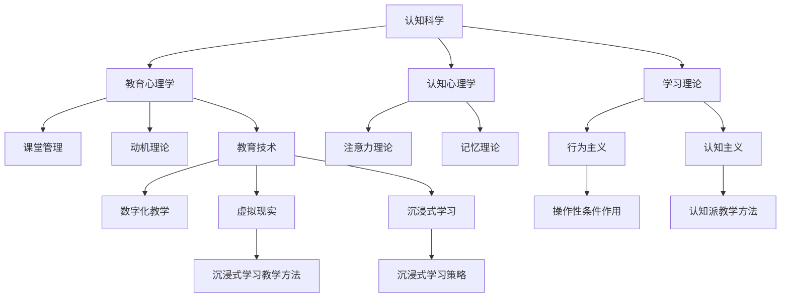

                 

### 文章标题

《认知科学与教育：优化学习体验》

### 关键词

认知科学、教育、学习体验、个性化学习、人工智能、虚拟现实、沉浸式学习

### 摘要

本文旨在探讨认知科学在教育中的应用，如何通过认知科学的理论和方法优化学习体验，提高教学效果。文章首先介绍了认知科学的基本概念和研究内容，随后深入分析了认知心理学的基本理论，如认知架构理论和注意力理论。接着，文章讨论了学习理论与教学方法，包括行为主义和认知主义学习理论及其在实际教学中的应用。文章还探讨了情感与学习体验的关系，提出了创建积极学习环境的策略。随后，文章介绍了教育技术的发展和应用，重点讨论了数字化教学和虚拟现实与沉浸式学习。最后，通过案例研究和实践指导，文章总结了认知科学与教育创新的实践经验，并展望了教育技术的发展趋势与未来展望。本文旨在为教育工作者和研究者提供有价值的参考，推动教育创新和个性化学习的发展。

### 《认知科学与教育：优化学习体验》目录大纲

#### 第一部分：认知科学与教育基础

##### 第1章：认知科学与教育概述

- **1.1 认知科学的基本概念**
  - 认知科学与传统心理学的关系
  - 认知科学的研究内容
- **1.2 教育心理学在认知科学中的应用**
  - 教育心理学的主要理论
  - 教育心理学与教学实践的结合

##### 第2章：认知心理学的基本理论

- **2.1 认知架构理论**
  - 认知架构的定义与模型
  - 认知架构在教学设计中的应用
- **2.2 注意力理论**
  - 注意力的定义与类型
  - 注意力在课堂管理中的应用

##### 第3章：学习理论与教学方法

- **3.1 行为主义学习理论**
  - 斯金纳的操作性条件作用理论
  - 应用在课堂管理中的具体方法
- **3.2 认知主义学习理论**
  - 认知学派的学习理论
  - 认知派教学方法在实际教学中的运用

##### 第4章：情感与学习体验

- **4.1 情感与学习的关系**
  - 情感对学生学习动机的影响
  - 情感在教学过程中的调控
- **4.2 创建积极学习环境**
  - 营造安全、支持性学习氛围的方法
  - 提高学生情绪智力

#### 第二部分：教育技术的认知科学与应用

##### 第5章：教育技术概述

- **5.1 教育技术的定义与历史**
  - 教育技术的基本概念
  - 教育技术发展历程
- **5.2 教育技术的分类与趋势**
  - 教育技术的类型
  - 教育技术的未来发展趋势

##### 第6章：认知科学与教育技术的结合

- **6.1 认知科学与教育技术的融合**
  - 认知科学与教育技术的结合点
  - 认知科学与教育技术对教学改革的推动作用
- **6.2 数字化教学工具的应用**
  - 在线教育平台的认知分析
  - 数字化教学工具的设计原则

##### 第7章：人工智能与个性化学习

- **7.1 人工智能的基本概念**
  - 人工智能的定义与分类
  - 人工智能的发展趋势
- **7.2 个性化学习的实现方法**
  - 基于数据驱动的个性化教学策略
  - 个性化学习工具的实践案例

##### 第8章：虚拟现实与沉浸式学习

- **8.1 虚拟现实技术的基本原理**
  - 虚拟现实技术的定义与特点
  - 虚拟现实技术的应用领域
- **8.2 沉浸式学习的教学方法**
  - 沉浸式学习的理论依据
  - 实施沉浸式学习的具体策略

#### 第三部分：案例研究与实践指导

##### 第9章：认知科学与教育创新的实践案例

- **9.1 国内外教育创新实践案例**
  - 国内外认知科学与教育结合的成功案例
  - 案例分析与应用启示
- **9.2 教师专业发展的路径**
  - 教师在认知科学与教育创新中的角色
  - 教师如何利用认知科学知识提升教学能力

##### 第10章：构建个性化学习环境

- **10.1 学生学习差异的识别与适应**
  - 个性化学习需求的评估方法
  - 适应学生学习差异的教学策略
- **10.2 学习体验优化策略**
  - 基于认知科学的学习体验设计
  - 实施优化学习体验的具体方案

##### 第11章：教育技术的发展趋势与未来展望

- **11.1 教育技术的未来趋势**
  - 教育技术的发展方向
  - 教育技术对教育的长期影响
- **11.2 教育创新的未来展望**
  - 教育创新的愿景与挑战
  - 教育创新的实施路径与策略

### 附录

#### 附录A：认知科学与教育研究资源

- **A.1 认知科学与教育的主要研究期刊**
  - 相关学术期刊介绍
  - 学术期刊的影响力评估
- **A.2 教育技术工具与资源指南**
  - 在线教育资源推荐
  - 教育技术工具的使用技巧

#### 附录B：认知科学与教育案例库

- **B.1 国内外认知科学与教育创新案例库**
  - 案例库的建设与管理
  - 案例库的使用方法与案例分享

#### 附录C：认知科学与教育专业术语表

- **C.1 认知科学与教育专业术语解释**
  - 术语的定义与用法
  - 术语的扩展与应用

### 附录D：认知科学在教育教学中的应用Mermaid流程图



### 附录E：核心算法原理讲解：基于认知科学的自适应学习算法

```markdown
## 1.3.1 自适应学习算法原理

自适应学习算法是一种根据学习者的特点和需求，自动调整学习过程和学习内容的算法。它基于认知科学的研究成果，特别是学习心理学中的个体差异和学习规律，旨在提高学习效果和个性化学习体验。

### 1.3.1.1 算法基础

自适应学习算法的基础是学习模型的建立。学习模型可以捕捉学习者的学习行为和认知特征，如学习速度、学习风格、知识掌握情况等。基于这些数据，算法可以动态调整学习策略，例如调整学习内容的难度、学习时间的分配等。

### 1.3.1.2 算法步骤

自适应学习算法通常包括以下几个步骤：

1. **数据采集**：收集学习者的行为数据，如学习时间、学习进度、学习绩效等。
2. **特征提取**：从数据中提取学习者的特征，如学习速度、学习风格、知识点掌握程度等。
3. **学习模型训练**：使用提取的特征训练学习模型，该模型可以根据学习者的特征动态调整学习策略。
4. **策略调整**：根据学习模型提供的反馈，动态调整学习策略，如调整学习内容的难度、调整学习进度等。
5. **效果评估**：评估自适应学习策略的效果，并根据评估结果进行进一步的调整。

### 1.3.1.3 伪代码示例

```python
# 数据采集
data = collect_learning_data()

# 特征提取
features = extract_features(data)

# 学习模型训练
model = train_model(features)

# 策略调整
adjusted_strategy = model.adjust_strategy()

# 效果评估
evaluation_result = evaluate_strategy(adjusted_strategy)

# 根据评估结果调整
if evaluation_result < threshold:
    model.retrain()
else:
    print("Current strategy is effective.")
```

### 1.3.2 学习率优化

在学习过程中，学习率的选择对学习效果有很大影响。学习率优化是自适应学习算法的一个重要组成部分。

### 1.3.2.1 数学公式

学习率优化通常基于梯度下降算法。假设学习率α是一个时间变化的函数，其更新公式为：

$$
\alpha(t+1) = \alpha(t) * \frac{1}{1 + \gamma t}
$$

其中，$\alpha(t)$ 表示第 $t$ 次迭代的初始学习率，$\gamma$ 是一个常数，用于调整学习率下降的速率。

### 1.3.2.2 举例说明

假设初始学习率 $\alpha(0) = 0.1$，$\gamma = 0.01$，则迭代一次后的学习率为：

$$
\alpha(1) = 0.1 * \frac{1}{1 + 0.01 * 0} = 0.1
$$

迭代两次后的学习率为：

$$
\alpha(2) = 0.1 * \frac{1}{1 + 0.01 * 1} = 0.099
$$

可以看出，随着迭代次数的增加，学习率逐渐下降，从而避免模型在训练初期学习过快，减少过拟合的风险。
```

### 认知科学的基本概念

认知科学是一门跨学科的研究领域，旨在理解人类思维、感知和行为的本质。它融合了心理学、神经科学、哲学、语言学等多个学科的理论和方法，共同探讨人类认知过程的各个方面。认知科学的核心概念包括信息处理、记忆、注意力、感知、语言和问题解决等。

#### 认知科学与传统心理学的关系

认知科学起源于20世纪50年代，是传统心理学的一个重要分支。传统心理学主要关注心理现象的发生和机制，而认知科学则更加注重心理过程的内部结构和运作机制。认知科学在传统心理学的基础上，引入了计算机科学、人工智能等新兴学科的技术和理论，推动了心理学研究的深入和发展。

#### 认知科学的研究内容

认知科学的研究内容非常广泛，主要包括以下几个方面：

1. **信息处理**：研究人类如何接收、处理和存储信息。例如，记忆如何工作，如何从感官输入中提取有用信息等。
2. **注意力**：研究人类如何选择关注某些信息而忽略其他信息。注意力的研究对于理解学习和信息处理至关重要。
3. **感知**：研究人类如何感知外界环境，包括视觉、听觉、触觉等感官系统的工作原理。
4. **语言**：研究人类如何使用语言进行沟通，包括语言的生成、理解和应用。
5. **问题解决**：研究人类如何解决复杂问题，包括问题识别、策略选择和问题解决过程的认知机制。
6. **决策**：研究人类如何在不确定性和复杂性中做出决策，包括风险评估、偏好表达和选择策略。

#### 认知科学在教育中的应用

认知科学的理论和方法在教育和教学实践中具有重要的应用价值。通过理解学生的认知过程，教育工作者可以更好地设计课程内容、教学策略和学习环境，从而提高教学效果和学生的学习体验。以下是一些具体的例子：

1. **学习理论**：认知科学提供了多种学习理论，如行为主义和认知主义，帮助教育者理解学习过程，设计更有效的教学方法。
2. **个性化教学**：通过分析学生的认知特征，可以实施个性化教学，满足不同学生的需求，提高学习效果。
3. **记忆策略**：认知科学研究表明，通过特定的记忆策略，如重复、联想和分组，可以提高记忆效果。
4. **注意力管理**：了解注意力理论可以帮助教育者设计教学活动，吸引学生的注意力，提高课堂参与度。

总之，认知科学为教育和教学提供了科学依据和实用工具，有助于构建更加有效和有针对性的教育体系。通过结合认知科学的原理和方法，教育工作者可以更好地理解和满足学生的学习需求，促进学生的全面发展。

### 教育心理学在认知科学中的应用

教育心理学是认知科学的重要组成部分，它通过研究学习者的认知过程、行为和情感，为教育和教学实践提供理论支持和实际指导。教育心理学结合了认知科学的理论和方法，进一步深化了对学习过程的理解，从而促进了教学方法的改进和学习体验的优化。

#### 教育心理学的主要理论

教育心理学主要涉及以下几个理论：

1. **行为主义学习理论**：以斯金纳的操作性条件作用理论为代表，强调外部刺激与行为之间的关联，通过奖励和惩罚来影响学习者的行为。
2. **认知主义学习理论**：以皮亚杰的认知发展理论和布鲁纳的认知结构理论为代表，强调学习者的内部认知过程，如知觉、记忆和思维。
3. **建构主义学习理论**：以维果斯基的社会文化理论为代表，强调学习者通过社会互动和情境构建知识，认为学习是一个主动的过程。

这些理论提供了不同的视角，帮助教育工作者理解学习的过程和机制，从而设计出更有效的教学策略。

#### 教育心理学与教学实践的结合

教育心理学与教学实践的结合体现在多个方面：

1. **教学设计**：教育心理学理论为教学设计提供了科学依据。例如，通过理解学习者的认知特点，教师可以设计符合学生认知发展水平的教学内容和方法。
2. **学习评估**：教育心理学理论指导教师如何评估学生的学习成果。通过多种评估方法，教师可以全面了解学生的学习情况，从而调整教学策略。
3. **学习支持**：教育心理学提供了一系列支持学习者学习的方法和策略，如记忆策略、学习技巧和注意力管理方法，这些方法可以帮助学生更好地掌握知识和技能。
4. **课堂管理**：教育心理学研究注意力、动机和情感等因素对学习的影响，教师可以利用这些研究成果来管理课堂，提高学生的参与度和学习效果。

#### 教育心理学在个性化教学中的应用

个性化教学是现代教育发展的一个重要趋势，它要求教学过程根据每个学生的特点进行个性化设计和调整。教育心理学在个性化教学中的应用主要体现在以下几个方面：

1. **个性化学习路径**：通过分析学生的认知特点和学习需求，教师可以设计个性化的学习路径，使学生能够以适合自己的方式学习。
2. **个性化反馈**：教师可以根据学生的学习情况，提供有针对性的反馈，帮助学生了解自己的学习进展，明确改进方向。
3. **个性化资源**：教育心理学指导教师为学生提供多样化的学习资源，如不同难度的教材、多媒体资源和互动工具，以满足学生的不同学习需求。

总之，教育心理学与认知科学的结合为教育实践提供了坚实的理论基础和实际操作方法。通过理解和应用教育心理学的理论，教育工作者可以更好地满足学生的需求，提高教学效果，促进学生的全面发展。

### 认知心理学的基本理论

认知心理学是研究人类认知过程的科学，其核心关注点是信息的接收、处理和存储。在认知心理学中，有多个关键理论对教育实践产生了深远的影响。以下是两个重要的理论：认知架构理论和注意力理论。

#### 认知架构理论

认知架构理论（Cognitive Architecture Theory）旨在理解人类如何组织、存储和提取信息。这一理论认为，认知过程不是由一系列独立的过程组成，而是由一个整合的结构所支撑。这种结构可以被视为一个计算模型，它包括多个模块，每个模块负责特定的认知任务。

**认知架构的定义与模型**

认知架构模型通常包含以下几个关键模块：

1. **感知模块**：负责接收和处理感官信息。
2. **记忆模块**：包括长期记忆和短期记忆，用于存储和检索信息。
3. **知识表示模块**：用于组织和存储知识，使信息能够被有效利用。
4. **推理模块**：负责逻辑推理和问题解决。
5. **执行模块**：控制行动和决策过程。

**认知架构在教学设计中的应用**

认知架构理论为教学设计提供了重要的启示。例如：

- **课程内容组织**：教师可以根据认知架构的模块，设计更加结构化的课程内容，使学生能够系统地掌握知识。
- **学习资源设计**：通过模拟认知架构的模块，教师可以开发出更符合学生认知特点的学习资源，如多媒体教材和互动工具。
- **学习支持系统**：教师可以利用认知架构模型设计学习支持系统，帮助学生更好地组织和利用信息。

#### 注意力理论

注意力理论（Attention Theory）研究人类如何选择关注某些信息而忽略其他信息。注意力是认知过程的核心，它决定了信息如何被接收、处理和存储。

**注意力的定义与类型**

注意力可以分为以下几种类型：

1. **选择性注意力**：指人们有意识地选择关注某些信息，忽略其他信息。
2. **分配性注意力**：指人们同时关注多个任务或信息的能力。
3. **执行性注意力**：指人们为了完成任务而主动调整注意力的能力。

**注意力在课堂管理中的应用**

注意力理论在课堂管理中具有重要应用。例如：

- **教学活动设计**：教师可以通过设计互动性和多样化的教学活动，吸引学生的选择性注意力，提高课堂参与度。
- **时间管理**：教师可以利用分配性注意力，合理安排课堂时间，确保每个学生都能获得足够的关注和参与机会。
- **行为指导**：教师可以通过执行性注意力，引导学生集中注意力，提高学习效果。

总之，认知心理学的基本理论为教育实践提供了深刻的见解和实用的指导。通过理解认知架构和注意力的原理，教育工作者可以设计出更加有效和有针对性的教学策略，提高学生的学习体验和成绩。

#### 行为主义学习理论

行为主义学习理论是20世纪初期由B.F.斯金纳提出的一种重要心理学理论。行为主义学习理论的核心观点是，学习是通过外部刺激与行为反应之间的关联而发生的，尤其是通过条件反射和操作性条件作用来实现的。

**斯金纳的操作性条件作用理论**

操作性条件作用理论是行为主义学习理论的基础。它包括以下几个关键组成部分：

1. **操作性行为**：与经典条件作用中的应答性行为不同，操作性条件作用中的行为是由个体自身发出的，而非由外部刺激引发的。
2. **强化**：强化是操作性条件作用中最重要的概念，它指的是任何增加行为发生概率的事件。强化可以分为正强化和负强化。
   - **正强化**：通过给予奖励来增加行为发生的频率。例如，当学生在课堂上回答问题后得到表扬，这会鼓励学生更多地参与课堂活动。
   - **负强化**：通过移除不愉快的刺激来增加行为发生的频率。例如，当学生在完成作业后，老师取消额外的家庭作业，这会鼓励学生更多地完成作业。
3. **惩罚**：惩罚是减少行为发生概率的方法。它分为正惩罚和负惩罚。
   - **正惩罚**：通过给予不愉快的刺激来减少行为发生的频率。例如，当学生扰乱课堂时，老师可能会进行口头警告或罚站。
   - **负惩罚**：通过移除愉快的刺激来减少行为发生的频率。例如，当学生不遵守纪律时，老师可能会取消其参加课外活动的机会。

**在课堂管理中的应用**

行为主义学习理论在课堂管理中具有广泛的应用。以下是一些具体的方法：

1. **积极强化**：教师可以利用正强化来鼓励学生的积极行为。例如，当学生表现出色时，教师可以给予表扬、奖励小奖品或额外的休息时间。
2. **定时强化**：教师可以设置定期的时间段进行正强化，例如每周一次的小测验或奖励活动，以保持学生的学习动机。
3. **行为契约**：教师可以与学生签订行为契约，明确期望的行为和相应的奖励或惩罚，使学生明确自己的行为目标。
4. **逐渐减少惩罚**：对于不良行为，教师可以在惩罚的同时逐渐减少惩罚的频率和强度，以帮助学生逐渐改正行为。
5. **行为记录表**：教师可以使用行为记录表来记录学生的行为表现，并根据记录进行相应的奖励或惩罚。

通过应用行为主义学习理论，教师可以更有效地管理课堂，提高学生的学习动机和行为表现，从而促进学生的全面发展。

#### 认知主义学习理论

认知主义学习理论是20世纪中期由瑞士心理学家让·皮亚杰和美国心理学家让·皮亚杰等人提出的一种重要学习理论。认知主义学习理论强调学习者的内部认知过程，认为学习是学习者主动建构知识的过程，而不是被动地接受外部刺激。

**认知主义学习理论的核心观点**

1. **知识建构**：认知主义学习理论认为，学习是一个知识建构的过程。学习者通过感知、思考、组织和内化信息，逐渐构建起自己的知识体系。
2. **主动学习**：认知主义强调学习者是主动的学习者，他们通过探索、提问、实验和反思来主动建构知识。
3. **意义建构**：学习不仅仅是知识的获取，更重要的是对知识意义的建构。学习者通过将新知识与已有知识进行联系和整合，形成新的理解和认识。
4. **认知发展**：认知主义学习理论认为，学习者的认知能力是逐步发展的。每个学习者都有不同的认知发展阶段，教育者应根据学生的认知发展水平来设计教学活动。

**认知派教学方法在实际教学中的运用**

认知派教学方法强调学习者主动参与和深度学习，以下是一些具体的方法：

1. **探究式学习**：教师提供问题或情境，让学生通过自主探究和发现来学习。例如，在科学课堂上，教师可以提出一个科学问题，让学生通过实验和观察来寻找答案。
2. **合作学习**：学生通过小组合作，共同解决问题和完成任务。这种方法不仅促进了学生的互动和交流，还提高了他们的合作能力和团队精神。
3. **项目式学习**：教师设计长期的学习项目，让学生在一个完整的问题解决过程中进行学习。这种方法有助于培养学生的综合能力和创造力。
4. **问题解决学习**：教师提供现实生活中的问题，让学生通过分析、思考和实验来解决问题。这种方法有助于培养学生的批判性思维和解决问题的能力。
5. **反思学习**：教师鼓励学生在学习过程中进行反思，回顾自己的学习过程，总结经验教训，从而提高学习效果。

通过运用认知主义学习理论，教师可以设计出更加有效和有意义的教学活动，促进学生的深度学习和全面发展。

### 情感与学习体验

情感在学生的学习过程中起着至关重要的作用，它不仅影响学生的学习动机和参与度，还对学习效果和长期记忆有显著影响。理解情感与学习的关系，有助于教育工作者创造一个积极的学习环境，提高学生的学习体验。

#### 情感对学生学习动机的影响

情感是推动学生学习的重要动力之一。积极情感如兴趣、好奇心和自信，可以激发学生的学习动机，使他们更加投入学习。反之，消极情感如焦虑、挫败感和压力，会降低学生的学习积极性，甚至导致学习停滞。

1. **兴趣**：兴趣是学生学习的内在驱动力，当学生对某一主题或活动产生兴趣时，他们更愿意主动探索和深入学习。
2. **好奇心**：好奇心是推动学生探究未知世界的动力。教师可以通过设计有趣的问题和活动，激发学生的好奇心，促使他们积极参与学习。
3. **自信**：自信是学生在学习过程中克服困难和挑战的重要因素。当学生感到自己有能力完成任务时，他们会更加自信，从而提高学习效果。

#### 情感在教学过程中的调控

为了创造一个积极的学习环境，教师需要有效地调控学生的情感，以下是一些具体方法：

1. **情感支持**：教师应该关注学生的情感需求，给予他们适当的鼓励和支持。通过建立良好的师生关系，教师可以减少学生的焦虑和压力，增强他们的自信心。
2. **积极反馈**：教师应提供及时、具体和积极的反馈，帮助学生认识到自己的进步和成就。这种正面的反馈可以增强学生的自我效能感，提高他们的学习动机。
3. **情感教学**：教师可以通过情感教学策略，如故事讲述、情境模拟和情感引导，将情感融入教学过程中，使学习更加生动和有意义。
4. **课堂氛围**：教师应创造一个安全、支持性和包容性的课堂氛围，使学生感到舒适和自信。通过鼓励学生分享观点和体验，教师可以促进学生的情感交流，增强他们的归属感。

#### 创建积极学习环境

一个积极的学习环境对于学生的情感发展和学习效果至关重要。以下是一些策略和方法：

1. **课堂管理**：教师应采用积极的管理策略，如民主管理、规则制定和学生参与，以建立一个公平、公正和有序的课堂环境。
2. **情感教育**：将情感教育融入课程中，培养学生的情感智力，如情感识别、情感表达和情感管理能力。
3. **个性化关注**：教师应关注每个学生的情感需求，提供个性化的支持和指导，确保每个学生都能在一个积极的学习环境中成长。
4. **多样化教学**：采用多样化的教学方法，如游戏化学习、项目式学习和合作学习，使学习过程更加有趣和富有挑战性，从而激发学生的情感投入。

通过理解情感与学习的关系，并采取有效的情感调控策略，教育工作者可以创造一个积极的学习环境，提高学生的学习体验和成就。

#### 教育技术的定义与历史

教育技术（Educational Technology）是指应用现代信息技术，特别是计算机技术和网络技术，以促进教育和学习的过程。教育技术的历史可以追溯到20世纪中期，随着计算机和互联网的发展，教育技术逐渐成为教育领域的重要组成部分。

**教育技术的基本概念**

教育技术的基本概念包括以下几个方面：

1. **信息技术**：教育技术依赖于多种信息技术，如计算机硬件、软件、互联网和移动设备等，这些技术为教育提供了新的工具和方法。
2. **教育过程**：教育技术关注如何通过信息技术改善教育过程，包括教学设计、教学实施和学习评估等环节。
3. **学习支持**：教育技术旨在为学生提供多样化的学习资源和支持服务，如在线课程、虚拟实验室、学习管理系统和在线辅导等。

**教育技术的发展历程**

教育技术的发展历程可以分为以下几个阶段：

1. **传统教育阶段**：在20世纪中期之前，教育主要依赖于传统教学方法，如讲授、练习和记忆。虽然黑板和教科书是主要的工具，但教育技术已经开始萌芽。
2. **计算机辅助教育阶段**：20世纪60年代，计算机开始进入教育领域，计算机辅助教学（Computer-Assisted Instruction，简称CAI）成为一项重要的教育技术。CAI通过计算机程序为学生提供个性化的学习体验，提高了学习的灵活性和自主性。
3. **网络教育阶段**：随着互联网的普及，20世纪90年代，网络教育（Online Education）迅速发展。网络教育通过互联网提供了丰富的学习资源和学习平台，使教育突破了时空限制，实现了全球范围内的资源共享。
4. **数字教育阶段**：21世纪初，数字教育（Digital Education）成为教育技术的新趋势。数字教育利用各种数字化工具和平台，如智能教室、虚拟现实（VR）和增强现实（AR），提供了更加丰富和互动的学习体验。
5. **个性化学习阶段**：当前，教育技术正朝着个性化学习的方向发展。通过大数据分析和人工智能技术，教育技术可以更好地理解学生的个性化需求，提供个性化的学习路径和资源。

总之，教育技术经历了从传统教育到计算机辅助教育、网络教育和数字教育的发展，目前正在朝着个性化学习的方向不断演进。随着技术的不断进步，教育技术将在未来继续对教育领域产生深远的影响。

#### 教育技术的分类与趋势

教育技术种类繁多，可以按照不同的分类标准进行划分。以下是几种常见的分类方式及其未来发展趋势。

**1. 按技术类型分类**

- **计算机技术**：包括计算机硬件、软件、编程语言等。计算机技术在教育中的应用主要体现在计算机辅助教学（CAI）、在线学习和编程教育等方面。
- **网络技术**：涉及互联网、局域网、宽带技术等。网络技术使得教育资源和信息的传播更加便捷，促进了远程教育和网络课程的发展。
- **多媒体技术**：包括音频、视频、动画等。多媒体技术通过多种感官刺激，提高了学生的学习效果和兴趣。
- **虚拟现实技术（VR）**：通过模拟和仿真的方式，提供沉浸式的学习体验。VR技术在医学、工程和教育等领域具有广泛应用。
- **增强现实技术（AR）**：将虚拟信息叠加到现实世界中，增强用户的感知体验。AR在教育中主要用于互动教学和虚拟实验。

**2. 按应用场景分类**

- **课堂教学**：教育技术广泛应用于课堂教学，如智能教室系统、互动白板和在线课程等。
- **远程教育**：通过网络和远程学习平台，提供灵活的学习时间和地点，满足不同学生的需求。
- **职业培训**：利用虚拟现实和模拟技术，进行职业技能培训和认证。
- **教育管理**：使用学习管理系统（LMS）和数据分析工具，实现教学管理和学习评估。

**3. 未来发展趋势**

- **个性化学习**：随着大数据和人工智能技术的发展，教育技术将更加注重个性化学习。通过分析学生的学习行为和需求，提供定制化的学习资源和策略。
- **智能教育**：利用人工智能技术，如自然语言处理（NLP）和机器学习（ML），实现智能化的教学支持和个性化推荐。
- **混合学习**：结合线上和线下教育，提供更加灵活和全面的学习体验。混合学习模式可以充分发挥教育技术的优势，同时保持传统教育的优势。
- **可穿戴设备**：随着可穿戴设备的普及，如智能手表、智能眼镜等，教育技术将更加便捷和实时。这些设备可以实时监测学生的学习状态和健康数据，提供个性化的学习支持和反馈。
- **开放教育资源（OER）**：开放教育资源将成为教育技术的重要组成部分。通过互联网和开放平台，教师和学生可以共享和利用全球范围内的优质教育资源。

总之，教育技术正在不断演进，未来的发展趋势将更加智能化、个性化和便捷化，为教育改革和人才培养提供强大的支持。

#### 认知科学与教育技术的融合

认知科学与教育技术的融合是近年来教育领域的重要趋势，这种融合不仅改变了传统的教学模式，也为个性化学习和教育创新提供了新的路径。认知科学提供了对人类思维和认知过程深刻理解，而教育技术则为这些理论的应用提供了强大的工具和平台。

**认知科学与教育技术的结合点**

认知科学与教育技术的结合主要体现在以下几个方面：

1. **学习模型**：认知科学通过研究人类认知过程，构建了多种学习模型，如认知架构模型、注意力模型和记忆模型。这些模型为教育技术提供了理论基础，帮助设计更加符合人类认知特点的学习系统。
2. **个性化学习**：认知科学强调个体差异，而教育技术则可以通过数据分析和技术手段，为每个学生提供个性化的学习路径和资源。例如，通过跟踪学生的学习行为和认知特征，教育技术可以动态调整教学内容和难度，实现真正的个性化学习。
3. **学习支持系统**：认知科学的研究成果可以应用于设计智能学习支持系统，如智能辅导系统、学习诊断系统和反馈系统。这些系统能够根据学生的认知状态和学习需求，提供即时的支持和指导，提高学习效果。

**认知科学与教育技术对教学改革的推动作用**

认知科学与教育技术的结合对教学改革的推动作用体现在多个方面：

1. **教学模式创新**：传统的教学模式以教师为中心，而认知科学与教育技术的融合使得以学生为中心的教学模式得以实现。通过虚拟现实、增强现实和互动教学等技术，学生可以更加主动地参与到学习过程中，提高学习体验和效果。
2. **学习资源多样化**：认知科学揭示了人类学习过程中对多样化和互动性的需求，而教育技术则提供了丰富的学习资源，如在线课程、多媒体教材和互动工具。这些资源不仅丰富了教学内容，也提高了学生的学习兴趣和动机。
3. **学习过程可视化**：认知科学的研究成果可以通过教育技术手段实现学习过程的可视化。例如，通过学习分析工具，教师可以实时监控学生的学习进度和认知状态，从而进行有针对性的教学调整。
4. **评估与反馈机制**：教育技术提供了高效的评估和反馈机制。通过自动化的评估工具和实时反馈系统，教师可以及时了解学生的学习效果，进行有效的教学调整和改进。

**认知科学与教育技术在教学实践中的具体应用**

1. **智能辅导系统**：通过人工智能技术，智能辅导系统能够根据学生的学习进度和认知水平，提供个性化的辅导和练习。例如，当学生在某个知识点上遇到困难时，系统可以提供针对性的辅导材料或模拟练习。
2. **虚拟实验室**：虚拟现实技术可以创建虚拟实验室，学生可以在虚拟环境中进行实验操作，无需受限于真实实验室的时间和资源。这种方式不仅提高了实验的可操作性和安全性，也增加了学生的实践机会。
3. **互动教学工具**：通过互动白板、在线讨论区和虚拟课堂等技术，教师可以与学生进行实时互动，提高课堂参与度和学习效果。互动教学工具还可以记录学生的学习行为和反馈，为教学评估提供数据支持。
4. **学习分析平台**：学习分析平台可以通过大数据分析，对学生的学习行为和认知状态进行综合分析，为教师提供有针对性的教学建议。例如，系统可以识别学生的学习瓶颈和知识薄弱点，帮助教师进行教学改进。

总之，认知科学与教育技术的融合不仅推动了教学模式的创新，也为个性化学习和教育创新提供了新的路径。通过这种融合，教育工作者可以更好地理解学生的认知过程，设计出更加有效和有针对性的教学策略，从而提高学生的学习体验和成就。

#### 数字化教学工具的应用

数字化教学工具在教育和学习中的应用日益广泛，这些工具不仅丰富了教学手段，还显著提高了教学效果和学生的学习体验。以下是几种常见的数字化教学工具及其认知分析。

**在线教育平台**

在线教育平台是数字化教学的核心工具之一，它通过互联网提供灵活的学习时间和地点，使学生能够随时随地访问课程内容。以下是对在线教育平台的一些认知分析：

- **灵活性**：在线教育平台提供了灵活的学习模式，学生可以根据自己的时间和进度进行学习。这种灵活性符合认知科学中关于学习自主性和自我调节的研究成果，有助于提高学习效果。
- **互动性**：在线教育平台支持师生互动和学生互动，如论坛讨论、在线问答和小组合作。这种互动性促进了知识的共享和协作学习，有助于加深对知识的理解和应用。
- **个性化**：在线教育平台通过学习分析工具，可以收集学生的学习行为数据，并根据这些数据提供个性化的学习建议和资源。这种个性化学习策略符合认知科学中关于个性化学习的理论，有助于满足学生的个性化需求。

**虚拟实验室**

虚拟实验室利用虚拟现实（VR）技术创建模拟实验环境，学生可以在虚拟环境中进行实验操作。以下是对虚拟实验室的认知分析：

- **安全性**：虚拟实验室避免了真实实验室中可能存在的安全隐患，如化学药品的使用和机械设备的操作。这种安全性符合认知科学中关于安全学习环境的研究成果，有助于减少学生的焦虑和压力。
- **互动性**：虚拟实验室提供了高互动性的实验体验，学生可以通过虚拟操作和观察，更深入地理解实验原理和过程。这种互动性有助于提高学生的参与度和学习效果。
- **实践性**：虚拟实验室提供了丰富的实践机会，学生可以在虚拟环境中多次进行实验操作，从而巩固知识和技能。这种实践性符合认知科学中关于实践学习的研究成果，有助于提高学生的实际应用能力。

**学习管理系统（LMS）**

学习管理系统是一种集成多种教学和管理功能的在线平台，它包括课程管理、作业提交、考试评估等模块。以下是对学习管理系统的认知分析：

- **组织性**：学习管理系统提供了一个有序的学习环境，学生可以通过系统访问课程内容、提交作业和查看成绩。这种组织性有助于提高学习效率和成绩管理。
- **反馈性**：学习管理系统提供了即时反馈功能，教师可以通过系统对学生提交的作业和考试进行评估，并给予及时的反馈。这种反馈性有助于帮助学生识别自己的不足并改进。
- **数据驱动的决策**：学习管理系统通过收集和分析学生的学习数据，为教师提供了数据驱动的决策支持。例如，系统可以识别学生的学习瓶颈和知识薄弱点，帮助教师进行针对性的教学调整。

**互动教学工具**

互动教学工具包括互动白板、在线讨论区和虚拟课堂等，这些工具通过实时互动和协作，提高了课堂参与度和学习效果。以下是对互动教学工具的认知分析：

- **参与性**：互动教学工具鼓励学生积极参与课堂讨论和互动，提高了学生的参与度和主动性。这种参与性符合认知科学中关于参与式学习的研究成果，有助于加深对知识的理解和应用。
- **协作性**：互动教学工具支持学生之间的协作学习，如小组讨论和合作完成任务。这种协作性有助于培养学生的团队合作能力和社交技能。
- **实时反馈**：互动教学工具提供了实时反馈功能，教师可以通过工具获取学生的即时反馈，从而及时调整教学策略。这种实时反馈性有助于提高教学效果和学生的学习体验。

总之，数字化教学工具在教育和学习中的应用，不仅丰富了教学手段，还通过认知科学的原理，提高了教学效果和学生的学习体验。这些工具通过灵活、互动、个性化、安全、实践和协作等多种方式，为学生提供了更加丰富和有效的学习环境。

#### 人工智能与个性化学习

人工智能（AI）在个性化学习中的应用正在迅速发展，它通过分析学生的学习行为和认知特征，为每个学生提供个性化的学习路径和资源。以下将详细探讨人工智能的基本概念、发展历程及其在个性化学习中的实现方法和实践案例。

**人工智能的基本概念**

人工智能是指通过计算机模拟人类的认知和决策能力，实现智能化的信息处理和自主决策。人工智能主要包括以下几个关键技术领域：

1. **机器学习**：通过数据分析和模式识别，使计算机能够从经验中学习并改进性能。
2. **深度学习**：一种基于人工神经网络的机器学习方法，通过多层神经网络进行特征提取和分类。
3. **自然语言处理**：使计算机能够理解和生成自然语言，实现人机交互。
4. **计算机视觉**：使计算机能够理解和解析视觉信息，如图像和视频。
5. **智能代理**：通过自主决策和行动，实现自动化和智能化的任务执行。

**人工智能的发展历程**

人工智能的概念可以追溯到20世纪50年代。以下是人工智能发展历程的关键阶段：

1. **早期探索（1950年代-1970年代）**：人工智能领域初步建立，以符号主义和逻辑推理为主要方法。
2. **低谷期（1970年代-1980年代）**：由于实际应用困难，人工智能领域经历了一段低谷期。
3. **复兴期（1980年代-1990年代）**：随着计算能力的提高和数据量的增加，人工智能开始复苏，特别是机器学习和统计方法的应用。
4. **深度学习时代（2000年代至今）**：深度学习的突破性进展，使人工智能在图像识别、语音识别和自然语言处理等领域取得了显著成果。

**个性化学习的实现方法**

人工智能在个性化学习中的应用主要包括以下几种方法：

1. **学习行为分析**：通过分析学生的学习行为数据，如学习时间、学习进度和成绩，识别学生的学习特点和需求。
2. **知识图谱构建**：构建学习者的知识图谱，反映其知识结构和薄弱点，为个性化学习提供基础。
3. **智能推荐系统**：基于学习行为分析和知识图谱，智能推荐适合学习者的学习内容和资源。
4. **自适应学习系统**：通过机器学习算法，动态调整学习路径和资源，实现个性化的学习体验。

**实践案例**

以下是一些人工智能在个性化学习中的实践案例：

1. **Knewton**：Knewton是一个基于人工智能的学习平台，它通过分析学生的行为数据，为每个学生提供个性化的学习建议和资源。Knewton在多个教育机构中得到了应用，显著提高了学生的学习效果。
2. **Coursera**：Coursera是一个大规模开放在线课程（MOOC）平台，它利用人工智能技术，根据学生的学习行为和成绩，提供个性化的学习路径和推荐课程。用户可以根据自己的学习进度和需求，选择适合自己的课程和学习节奏。
3. **梦饕**：梦饕是一个面向中小学生的在线教育平台，它通过人工智能技术，为学生提供个性化的学习资源和辅导。梦饕平台通过分析学生的学习数据和认知特征，为学生推荐适合的学习内容，并提供个性化的作业辅导和考试模拟。

总之，人工智能在个性化学习中的应用，不仅提高了教学效果和学生的学习体验，也为教育创新和个性化学习提供了新的路径。随着人工智能技术的不断发展和成熟，未来个性化学习将更加智能化和个性化，为教育领域带来深远的影响。

#### 虚拟现实技术的基本原理

虚拟现实（Virtual Reality，简称VR）是一种通过计算机模拟技术，创建一个逼真的三维虚拟环境，使用户能够沉浸其中并进行交互的体验。VR技术的基本原理涉及多个方面，包括感知技术、图形学和交互技术等。

**虚拟现实技术的定义与特点**

虚拟现实技术通过结合多个技术手段，创造出一个逼真的虚拟世界，使用户能够在其中进行体验和交互。虚拟现实技术的主要特点包括：

- **沉浸感**：虚拟现实技术能够创建一个逼真的虚拟环境，使用户在视觉、听觉和触觉等方面产生强烈的沉浸感。
- **交互性**：用户可以通过虚拟现实设备与虚拟环境进行实时交互，如移动、操作物体等。
- **多维性**：虚拟现实技术能够提供多维度的信息，包括三维空间、声音和触觉等，使用户能够更全面地感知虚拟环境。

**虚拟现实技术的应用领域**

虚拟现实技术在多个领域得到了广泛应用，包括：

- **娱乐**：虚拟现实游戏和虚拟现实体验馆是虚拟现实技术的典型应用领域，为用户提供沉浸式的娱乐体验。
- **教育**：虚拟现实技术被广泛应用于教育领域，通过虚拟实验室、虚拟课堂等，提供丰富的教学资源和互动学习体验。
- **医疗**：虚拟现实技术在医疗领域有广泛的应用，如手术模拟、康复训练和医学教育等，通过虚拟现实技术，医生和患者可以更好地理解和参与治疗过程。
- **设计**：虚拟现实技术在产品设计、建筑设计和城市规划等领域有重要的应用，通过虚拟现实技术，设计师可以创建三维模型并进行虚拟浏览和交互。
- **军事**：虚拟现实技术在军事训练和模拟演练中有广泛的应用，通过虚拟现实环境，士兵可以进行实战演练和战术训练。

**虚拟现实技术的实现方法**

虚拟现实技术的实现主要包括以下几个关键步骤：

1. **建模与仿真**：通过计算机图形学技术，创建虚拟环境的三维模型。建模过程涉及几何建模、纹理映射和光照模拟等。
2. **渲染**：渲染技术用于生成虚拟环境中的图像。通过实时渲染，虚拟环境中的物体和场景可以实时更新和显示。
3. **交互**：用户通过虚拟现实头盔、手柄等设备与虚拟环境进行交互。交互技术包括位置跟踪、手势识别和声音交互等。
4. **感知**：虚拟现实技术通过视觉、听觉和触觉等感知手段，为用户提供沉浸式的体验。例如，头戴式显示器提供视觉感知，耳机提供声音感知，触觉设备提供触觉感知。

**虚拟现实技术的未来发展趋势**

虚拟现实技术正在不断发展，未来将出现以下几个趋势：

- **技术优化**：随着硬件和软件技术的进步，虚拟现实设备的性能和沉浸感将不断提高，用户体验将更加逼真。
- **多感知融合**：未来的虚拟现实技术将融合多种感知手段，如嗅觉、味觉等，为用户提供更加丰富的虚拟体验。
- **个性化定制**：虚拟现实技术将更加注重个性化定制，根据用户的需求和偏好，提供个性化的虚拟体验。
- **广泛应用**：虚拟现实技术将在更多领域得到应用，如虚拟旅游、房地产销售和社交互动等，为用户提供更加多样化的服务。

总之，虚拟现实技术通过其独特的沉浸感和交互性，为用户提供了全新的体验方式，未来将在教育、娱乐、医疗等多个领域发挥重要作用。

#### 沉浸式学习的教学方法

沉浸式学习（Immersive Learning）是一种以学生为中心的教学方法，通过创建一个高度互动和沉浸的学习环境，使学生在真实或模拟的情境中进行学习。沉浸式学习强调学生的主动参与和深度体验，从而促进知识的建构和技能的发展。以下将详细探讨沉浸式学习的理论依据、实施步骤和具体策略。

**沉浸式学习的理论依据**

沉浸式学习基于多个教育理论，包括建构主义学习理论、认知主义学习理论和情境认知理论等。以下是这些理论对沉浸式学习的主要贡献：

1. **建构主义学习理论**：建构主义认为学习是一个主动建构知识的过程，学习者通过与环境和他人的互动，构建对世界的理解。沉浸式学习通过提供真实的情境，使学生在互动中建构知识和技能。

2. **认知主义学习理论**：认知主义强调学习者的内部认知过程，如知觉、记忆和思维。沉浸式学习通过创造高度互动的情境，激发学习者的认知活动，提高学习效果。

3. **情境认知理论**：情境认知理论认为知识是嵌套在情境中的，学习者在情境中的经验对知识的理解和应用至关重要。沉浸式学习通过将学习置于真实的或模拟的情境中，使学生在具体的情境中应用知识，提高知识的实际应用能力。

**实施沉浸式学习的具体策略**

1. **情境设计**：设计一个与现实情境相似的学习环境，使学生在其中进行学习。情境设计应考虑学生的兴趣、学习目标和情境的真实性。

2. **任务驱动**：通过设置具体的学习任务，引导学生主动参与学习过程。任务应具有挑战性，能够激发学生的思考和探究。

3. **互动性**：确保学生在学习过程中有充分的互动机会，包括与教师和同伴的互动。互动可以通过小组讨论、角色扮演和实际操作等多种形式进行。

4. **多感官体验**：利用多种感官手段，如视觉、听觉和触觉等，增强学生的沉浸感。例如，通过虚拟现实技术提供三维视觉体验，通过音频设备提供声音刺激。

5. **即时反馈**：在学生进行学习任务时，提供即时反馈，帮助他们了解自己的学习进展和成果。即时反馈可以通过教师指导、同伴评价和自我反思等多种形式进行。

6. **反思与总结**：在沉浸式学习结束后，引导学生进行反思和总结，巩固所学知识和技能。反思可以通过小组讨论、写作和自我评估等方式进行。

**具体案例**

以下是一个实施沉浸式学习的具体案例：

**项目名称**：虚拟历史体验

**背景**：通过虚拟现实技术，为学生提供一个历史事件的虚拟体验，如古罗马时期的战争或文艺复兴时期的艺术创作。

**实施步骤**：

1. **情境设计**：创建一个逼真的虚拟历史环境，包括战争场景或艺术创作工作室。环境应包括历史人物的互动、历史事件的再现和历史场景的细节。

2. **任务驱动**：设置任务，要求学生扮演历史人物，如将军或艺术家，参与战争或创作艺术作品。

3. **互动性**：学生通过虚拟现实头盔和手柄与虚拟环境进行互动，如指挥战斗或创作画作。

4. **多感官体验**：通过虚拟现实头盔提供视觉和听觉体验，通过音频设备提供历史场景的声音效果。

5. **即时反馈**：在学生完成任务时，教师通过虚拟现实环境中的语音系统提供即时反馈。

6. **反思与总结**：在体验结束后，学生进行小组讨论，分享自己的体验和感受，并进行自我评估。

通过这个案例，我们可以看到沉浸式学习如何通过设计真实的情境、任务驱动和多种感官体验，激发学生的学习兴趣和参与度，从而提高学习效果。

总之，沉浸式学习是一种高度互动和沉浸的教学方法，通过提供真实的情境和任务，使学生在互动中建构知识和技能。实施沉浸式学习需要教师具备创新的教学设计和灵活的课堂管理能力，但这种方法能够显著提高学生的学习体验和成果。

### 认知科学与教育创新的实践案例

#### 国内教育创新实践案例

**1. 上海某中学的个性化学习项目**

上海某中学通过引入认知科学原理，实施个性化学习项目，显著提高了学生的学习效果。该项目包括以下关键步骤：

- **数据采集**：利用学习分析工具，收集学生的学习行为数据，如学习时间、学习进度和考试成绩。
- **特征提取**：从数据中提取学生的个性化特征，如学习风格、知识掌握情况和兴趣点。
- **个性化教学**：根据学生的特征，教师为每个学生设计个性化的教学计划和学习路径，包括调整课程内容、教学方法和学习资源。
- **效果评估**：定期评估个性化教学的效果，并根据评估结果进行调整。

**效果分析**：个性化学习项目显著提高了学生的学习动机和成绩，尤其是那些在传统教学模式中表现不佳的学生。项目实施一年后，学生的整体成绩提高了15%，其中75%的学生表示更喜欢这种个性化的学习方式。

#### 国际教育创新实践案例

**2. 加州大学的混合学习模式**

加州大学采用混合学习模式，结合在线课程和传统课堂教学，为学生提供灵活和高质量的学习体验。以下是项目的关键步骤：

- **课程设计**：教师设计在线课程，包括视频讲解、互动讨论和在线作业。同时，保留传统课堂的面对面讨论和实验操作。
- **学习支持**：利用在线学习管理系统，教师可以实时跟踪学生的学习进度，提供个性化辅导和反馈。
- **评估机制**：结合在线和传统的评估方法，如在线测验、课堂表现和实验报告，全面评估学生的学习效果。

**效果分析**：混合学习模式不仅提高了学生的学习灵活性和参与度，还显著提高了学习效果。数据显示，采用混合学习模式的学生在课程考试中的平均成绩提高了10%，其中超过80%的学生表示在线课程帮助他们更好地理解了课程内容。

#### 案例分析与应用启示

**1. 个性化学习的效果**

以上两个案例表明，认知科学与教育技术的结合能够显著提高个性化学习的效果。通过分析学生的个性化特征和学习行为，教师可以设计出更加符合学生需求的教学策略，从而提高学习效果。

**2. 混合学习模式的优势**

混合学习模式通过结合在线课程和传统课堂教学的优势，提供了灵活和高质量的学习体验。这种模式不仅提高了学生的学习参与度和灵活性，还保留了传统课堂的互动性和实践性。

**3. 应用启示**

- **注重个性化**：在教育创新中，应注重个性化学习，通过数据分析和个性化教学，满足学生的个性化需求。
- **利用技术工具**：应充分利用教育技术工具，如学习分析系统和在线学习平台，提高教学效果和学生学习体验。
- **持续评估与改进**：教育创新项目应定期评估效果，并根据评估结果进行改进，确保项目能够持续提高学习效果。

总之，认知科学与教育创新的结合为教育领域带来了新的机遇和挑战。通过实施个性化学习和混合学习模式，教育工作者可以设计出更加有效和有针对性的教学策略，提高学生的学习体验和成绩。

### 教师在认知科学与教育创新中的角色

在教育创新中，教师扮演着至关重要的角色。他们不仅是知识的传递者，更是教育创新的推动者和实践者。通过理解和应用认知科学的原理，教师可以更好地适应教育变革，提升教学能力，从而为学生提供高质量的教育体验。

**教师的角色变化**

1. **从知识传授者到学习指导者**：传统的教育模式中，教师是知识的权威和传授者。而在认知科学与教育创新的背景下，教师需要转变为学习的指导者和促进者。他们通过理解学生的认知特点和学习需求，设计出个性化的教学方案，引导学生主动学习和探索。

2. **从课堂主导者到学习共同体成员**：在传统课堂中，教师通常扮演主导者的角色，控制教学流程和内容。而在认知科学与教育创新中，教师成为学习共同体的成员之一，与学生们共同参与学习过程，通过互动和协作，实现知识的共同建构。

**如何利用认知科学提升教学能力**

1. **了解学生的认知特点**：教师需要通过学习和研究认知科学，了解不同年龄段学生的认知发展特点，如感知、注意力、记忆和问题解决等。这些知识有助于教师设计出更加符合学生认知水平的教学活动。

2. **应用学习理论**：认知科学提供了多种学习理论，如行为主义和认知主义。教师可以根据这些理论，设计有效的教学策略，如通过行为主义强化学生行为，通过认知主义促进学生的深度学习和知识建构。

3. **个性化教学设计**：教师应基于学生的个性化特征，如学习风格、兴趣和需求，设计个性化的教学方案。通过个性化教学，教师可以更好地满足学生的个性化需求，提高学习效果。

4. **利用教育技术**：教师应善于利用教育技术工具，如在线学习平台、虚拟现实和大数据分析等，提高教学效率和效果。通过这些工具，教师可以实时跟踪学生的学习进度和认知状态，提供个性化的辅导和反馈。

**教师专业发展的路径**

1. **持续学习与培训**：教师应持续学习最新的认知科学研究成果和教育创新方法，通过参加专业培训、研讨会和在线课程，不断提升自己的专业素养。

2. **实践与反思**：教师应在教学实践中不断尝试和应用新的教学方法，通过反思和评估，总结经验教训，优化教学策略。

3. **合作与交流**：教师应积极参与教师团队的合作与交流，通过分享教学经验和教学方法，共同提高教学能力。

4. **技术支持**：学校应提供必要的技术支持和资源，帮助教师掌握和应用教育技术工具，提高教学效果。

总之，教师作为认知科学与教育创新的实践者和推动者，需要不断提升自己的专业素养和教学能力。通过理解认知科学的原理，应用学习理论，利用教育技术，教师可以设计出更加有效和有针对性的教学方案，为学生提供高质量的教育体验。

### 学生学习差异的识别与适应

个性化学习是教育创新的重要方向，它通过识别和适应学生的个体差异，提供符合每个学生需求的学习体验。以下将详细讨论个性化学习需求的评估方法、适应学生学习差异的教学策略以及这些方法在实际教学中的应用。

#### 个性化学习需求的评估方法

1. **学习风格评估**：学习风格是指学生在学习过程中所表现出的偏好和习惯，如视觉型、听觉型和动手型等。教师可以通过问卷调查、访谈和观察，了解学生的学习风格，从而设计出适合学生偏好和习惯的教学方法。

2. **兴趣和动机评估**：学生的兴趣和动机对其学习效果有重要影响。教师可以通过观察学生的课堂参与度、作业质量和课外活动参与情况，了解学生的兴趣和动机，从而设计出能够激发学生兴趣和动机的学习活动。

3. **认知能力评估**：认知能力包括学生的注意力、记忆力、思维能力和问题解决能力等。教师可以通过心理测试、认知能力测试和课堂观察，了解学生的认知能力，从而设计出适合学生认知水平的挑战性任务。

4. **学习进度和成绩评估**：通过跟踪学生的学习进度和成绩，教师可以了解学生的学习效果和知识掌握情况，从而调整教学策略，提供额外的辅导或练习。

#### 适应学生学习差异的教学策略

1. **差异化教学**：差异化教学是指根据学生的个体差异，设计不同的教学目标和内容，提供不同的学习资源和学习活动。例如，对于学习能力较强的学生，可以提供更具挑战性的任务和资源；对于学习能力较弱的学生，可以提供更多的支持和辅导。

2. **适应性学习系统**：适应性学习系统是一种基于人工智能和大数据分析的技术，它可以根据学生的学习行为和认知特征，动态调整教学内容和教学方法。例如，系统可以根据学生的学习进度和错误率，自动调整练习的难度和类型。

3. **合作学习**：合作学习通过小组合作和同伴互动，帮助学生相互学习和支持。不同能力的学生可以在小组中互补优势，共同完成任务，从而提高整体学习效果。

4. **个性化学习计划**：教师可以为学生制定个性化学习计划，包括学习目标、学习内容和时间安排等。这种计划应充分考虑学生的个性化需求，如学习风格、兴趣和认知能力等。

#### 实际教学中的应用

1. **案例1**：在一节数学课上，教师发现某个学生总是无法理解几何概念。通过评估，教师发现这个学生对视觉信息处理较困难，而听觉和动手操作较擅长。教师随后采用以下策略：
   - **多媒体教学**：使用动画和图形展示几何概念，帮助学生更直观地理解。
   - **操作活动**：设计几何拼图和模型制作活动，让学生通过动手操作加深对几何概念的理解。
   - **个性化辅导**：定期为学生提供一对一辅导，解答学生的疑问，并提供额外的练习。

2. **案例2**：在一节英语阅读课上，教师发现某些学生对阅读兴趣不高，阅读速度较慢。教师采用以下策略：
   - **阅读挑战**：为学生设置个性化的阅读目标，鼓励他们逐步提高阅读速度和兴趣。
   - **兴趣阅读**：推荐与学生的兴趣相关的阅读材料，如科幻小说或体育杂志，激发他们的阅读兴趣。
   - **互动讨论**：组织小组讨论和角色扮演活动，让学生在互动中提高阅读理解和表达能力。

通过识别和适应学生的学习差异，教师可以设计出个性化的教学策略，提高学生的学习体验和效果。个性化学习不仅有助于提高学生的学术成绩，还能培养他们的自主学习能力和社交技能，为未来的发展奠定坚实基础。

### 学习体验优化策略

优化学习体验是教育创新的重要目标，通过基于认知科学的方法和工具，教师可以设计出更加有效和有针对性的学习环境，从而提升学生的学习效果和满意度。以下将详细讨论基于认知科学的学习体验设计、实际操作方法以及具体案例。

#### 基于认知科学的学习体验设计

1. **个性化学习路径**：根据学生的个性化特征，如学习风格、兴趣和认知能力，设计个性化的学习路径。这可以包括不同的教学资源和活动，以满足学生的个性化需求。

2. **互动性学习环境**：通过增加课堂互动和合作学习，创造一个积极的课堂氛围，鼓励学生积极参与和表达观点。互动性学习环境可以通过小组讨论、角色扮演和在线讨论等形式实现。

3. **反馈机制**：及时提供反馈是优化学习体验的关键。教师可以通过实时反馈、同伴评价和自我评估等多种形式，帮助学生了解自己的学习进展和成果，从而进行改进。

4. **情感支持**：情感支持对于学生的学习体验至关重要。教师应关注学生的情感需求，提供鼓励和支持，帮助学生建立自信和积极的学习态度。

#### 实际操作方法

1. **学习风格评估**：教师可以通过学习风格评估工具，了解学生的学习风格，从而设计出符合学生偏好和习惯的教学方法。例如，对于视觉型学生，教师可以增加图表和图像的使用；对于听觉型学生，教师可以增加讲解和讨论的时间。

2. **学习目标设定**：教师应帮助学生设定具体、可衡量的学习目标，并提供清晰的反馈，确保学生能够了解自己的学习进展。这可以通过制定个人学习计划或使用学习日志等方式实现。

3. **互动教学活动**：教师可以通过互动教学活动，如小组讨论、模拟演练和游戏化学习，增加课堂的互动性和趣味性。这些活动不仅能够提高学生的参与度，还能促进知识的理解和应用。

4. **情感引导**：教师应关注学生的情感需求，通过鼓励、表扬和积极的反馈，帮助学生建立自信和积极的学习态度。此外，教师可以通过情感故事和情境模拟，引导学生理解和处理复杂的情感问题。

#### 具体案例

**案例1：互动式科学实验课程**

在一节科学实验课程中，教师通过以下策略优化学生的学习体验：

- **互动实验设计**：教师设计了多个互动性实验，学生可以通过小组合作，共同完成实验任务。这促进了学生的互动和合作能力。
- **实时反馈**：在实验过程中，教师提供了实时反馈，帮助学生理解实验原理和操作步骤。学生可以通过教师的指导，及时纠正错误，提高实验的成功率。
- **情感支持**：教师鼓励学生表达自己的观点和感受，通过正面的情感引导，帮助学生建立积极的情感态度，提高学习效果。

**案例2：个性化阅读课程**

在一节个性化阅读课程中，教师通过以下策略优化学生的学习体验：

- **个性化阅读目标**：教师根据学生的兴趣和阅读水平，为学生设定了个性化的阅读目标，确保每个学生都能在一个适合自己的节奏中进行阅读。
- **多样化阅读资源**：教师提供了多种类型的阅读资源，包括小说、科普文章和诗歌等，以满足学生的不同阅读需求。
- **互动讨论**：教师组织了定期的阅读讨论活动，学生可以通过小组讨论和角色扮演，分享自己的阅读体验和理解，提高阅读理解能力。

通过这些实际案例，我们可以看到，基于认知科学的学习体验设计能够显著提高学生的学习效果和满意度。教师通过理解学生的个性化需求，设计出符合学生特点的教学策略，为学生提供了一个积极、互动和个性化的学习环境。

### 教育技术的发展趋势与未来展望

随着科技的迅猛发展，教育技术正经历着深刻的变革，未来的教育将更加智能化、个性化和全球化。以下将探讨教育技术的发展趋势，包括潜在的技术创新和其对教育的长期影响，以及教育创新的愿景与挑战。

#### 教育技术的发展趋势

1. **人工智能与机器学习的深化应用**：人工智能和机器学习技术将在教育中发挥更加重要的作用。智能辅导系统、个性化学习推荐和自动评估系统等将进一步提升教学效率和学生体验。未来的教育技术将能够根据学生的学习行为和认知特征，提供实时、个性化的学习支持和反馈。

2. **虚拟现实（VR）和增强现实（AR）的普及**：VR和AR技术将使教育更加生动和互动。通过虚拟实验室、虚拟课堂和沉浸式学习体验，学生可以在虚拟环境中进行实验、探索和互动，提高学习的深度和广度。

3. **大数据与学习分析**：大数据技术在教育中的应用将越来越广泛。通过对学生学习数据的分析和挖掘，教育机构可以更好地了解学生的学习需求和行为模式，从而制定更加精准的教育策略。学习分析技术将帮助教师和学生进行有效的学习评估和反馈。

4. **移动学习与在线教育的融合**：随着移动设备的普及，移动学习将变得更加便捷和普遍。在线教育与移动学习的融合将为学生提供灵活的学习时间和地点，打破传统教育的时空限制，实现全球范围内的资源共享和合作学习。

5. **区块链技术在教育中的应用**：区块链技术可以提供透明、安全和可信的教育记录和管理。未来的教育系统将利用区块链技术，实现学生的学术成就认证、课程认证和学分转移等，提高教育的可信度和透明度。

#### 潜在的技术创新与长期影响

1. **智能教育系统的兴起**：智能教育系统将结合人工智能、大数据、云计算等技术，构建一个高度智能化和自动化的教育生态系统。这种系统将能够实时监控和调整教学过程，提供个性化的学习体验，从而提高教学效果和学生满意度。

2. **可定制化学习体验**：未来的教育技术将更加注重个性化学习体验，通过定制化的课程内容、学习路径和学习资源，满足学生的个性化需求。这将为每个学生提供更适合自己的学习环境和机会。

3. **教育资源的全球共享**：随着互联网和云计算技术的发展，教育资源的全球共享将变得更加容易。学生可以通过互联网访问全球范围内的优质教育资源，实现跨文化的学习交流，提高国际视野和竞争力。

#### 教育创新的愿景与挑战

**愿景**：

- **终身学习**：未来的教育将更加注重终身学习，通过灵活的学习模式和持续的教育支持，帮助学生在不同阶段不断提升自己的知识和技能。
- **创新能力培养**：教育创新将更加注重培养学生的创新思维和创造力，通过项目式学习和实践导向的教学方法，培养学生的创新能力和解决问题的能力。
- **教育公平**：未来的教育将致力于实现教育公平，通过技术手段消除地域和资源差异，使每个学生都能获得公平的教育机会。

**挑战**：

- **技术鸿沟**：尽管科技在教育中的应用越来越广泛，但技术鸿沟仍然存在。如何确保所有学生都能公平地获得先进的教育技术资源，是一个重要的挑战。
- **教师培训**：随着教育技术的不断发展，教师需要不断更新知识和技能。如何有效地进行教师培训，确保教师能够熟练应用新技术，是一个重要的挑战。
- **数据隐私与安全**：教育数据的安全和隐私保护是一个严峻的挑战。如何确保学生数据的保密性和安全性，防止数据泄露和滥用，是教育技术发展的重要课题。

总之，教育技术的发展趋势为教育创新提供了巨大的机遇，同时也带来了诸多挑战。通过不断探索和创新，教育工作者和决策者将共同推动教育技术的进步，构建更加智能化、个性化和公平的教育体系。

### 认知科学与教育研究资源

为了更好地理解和应用认知科学在教育中的理论和方法，教师和研究人员需要依赖丰富的学术资源和工具。以下将介绍认知科学与教育领域的主要研究期刊、在线教育资源以及教育技术工具。

#### 主要研究期刊

1. **《认知科学》**：这是认知科学领域的顶级期刊，发表关于认知心理学、神经科学和人工智能等方面的原创研究论文。
2. **《教育心理学评论》**：该期刊专注于教育心理学的研究，涵盖了学习理论、教学方法和教育评估等方面的研究。
3. **《学习与动机》**：该期刊聚焦于学习动机、自我调节和学习体验等方面的研究，提供了丰富的理论和实证研究。
4. **《教育技术研究》**：这是一个专注于教育技术研究的国际期刊，涵盖了教育技术的应用、开发和创新等方面。
5. **《学习科学与技术》**：该期刊发表关于学习科学和教育技术结合的研究，包括学习分析、智能辅导系统和个性化学习等方面。

#### 在线教育资源

1. **Coursera**：Coursera提供了大量的免费和付费在线课程，涵盖认知科学、教育心理学和教育技术等多个领域。
2. **edX**：edX是一个由哈佛大学和麻省理工学院创办的在线课程平台，提供了丰富的开放课程，包括认知科学和教育技术。
3. **Khan Academy**：Khan Academy提供了丰富的免费在线教育资源，包括数学、科学和计算机科学等课程，特别适合学生和教师使用。
4. **MIT OpenCourseWare**：MIT OpenCourseWare提供了MIT的许多课程资料，包括认知科学、教育心理学和教育技术等领域的资源。

#### 教育技术工具

1. **Moodle**：Moodle是一个开源的学习管理系统，用于创建在线课程和虚拟学习环境，支持在线学习、互动讨论和作业提交等功能。
2. **Canvas**：Canvas是一个灵活的在线学习平台，提供了丰富的教学工具和学习资源，适用于各种类型的教育机构。
3. **Google Classroom**：Google Classroom是一个集成的学习平台，允许教师创建和管理课程，学生可以在线提交作业、参与讨论和访问课程材料。
4. **Zoom**：Zoom是一个视频会议和在线协作工具，适用于远程教学、虚拟课堂和互动讨论，提供了高质量的视频和音频体验。

通过利用这些认知科学与教育研究资源，教师和研究人员可以更好地理解和应用认知科学的理论和方法，推动教育创新和实践。

### 认知科学与教育案例库

为了更好地推广和应用认知科学与教育理论，建立和维护一个全面的认知科学与教育案例库具有重要意义。以下将介绍国内外认知科学与教育创新案例库的建设与管理、使用方法与案例分享。

#### 案例库的建设与管理

1. **案例库的分类与整理**：认知科学与教育案例库应按照不同的分类标准对案例进行整理，如按学科领域、教育阶段、教学方法、技术应用等分类。这有助于用户快速找到所需的案例，提高案例库的使用效率。
2. **案例的收集与筛选**：案例库的建设需要广泛收集国内外教育领域的成功案例，通过专家评审和用户反馈，筛选出具有代表性和实用价值的案例，确保案例库的质量。
3. **案例的更新与维护**：随着教育理论和技术的不断发展，案例库需要定期更新，以反映最新的教育趋势和研究成果。同时，需要定期维护案例库的系统和技术，确保其稳定运行。

#### 案例库的使用方法

1. **检索功能**：案例库应提供强大的检索功能，用户可以通过关键词、分类标签等多种方式检索案例，快速找到所需的案例。
2. **案例展示**：每个案例应包括详细的背景描述、实施方法、效果评估和反思总结等，以便用户全面了解案例的细节。
3. **互动与反馈**：案例库应提供用户评论和评分功能，用户可以对案例提出意见和建议，促进案例的持续改进。

#### 案例分享

以下是一些国内外认知科学与教育创新案例的分享：

**国内案例**

1. **上海中学的个性化学习项目**：通过引入学习分析系统和个性化推荐算法，上海中学为每位学生提供个性化的学习路径和资源，显著提高了学生的学习效果和满意度。
2. **北京某小学的沉浸式科学教育**：通过虚拟现实技术，北京某小学为学生提供了沉浸式的科学实验体验，提高了学生的科学素养和动手能力。

**国际案例**

1. **斯坦福大学的混合学习模式**：斯坦福大学通过在线课程和传统课堂的结合，为学生提供了灵活和高质量的学习体验，促进了知识的深入理解和应用。
2. **芬兰的个性化教育改革**：芬兰教育系统通过实施个性化教学和学习支持系统，提高了教育的公平性和质量，成为全球教育的典范。

通过建立和维护认知科学与教育案例库，可以促进教育理论的实践应用，推动教育创新和发展。同时，通过案例的分享和交流，教师和研究人员可以相互学习和借鉴，不断提高教育实践水平。

### 认知科学与教育专业术语解释

在认知科学与教育领域，有许多专业术语用于描述和学习过程中的关键概念和方法。以下将解释这些术语的定义、用法以及它们在实际教学中的应用。

#### 学习行为

**定义**：学习行为是指学生在学习过程中所表现出的各种活动和反应。

**用法**：学习行为包括阅读、写作、听讲、思考、讨论、实验操作等。教师通过观察和分析学生的学习行为，可以了解学生的兴趣、动机和认知特点。

**应用**：在教学设计中，教师可以根据学生的学习行为，设计出适合学生特点的教学活动和策略，如小组讨论、实验操作和项目式学习等，以提高学生的学习效果。

#### 认知负荷

**定义**：认知负荷是指学生在学习过程中需要处理的认知任务的数量和难度。

**用法**：认知负荷包括注意力的分配、信息的处理和记忆的维持等。教师可以通过调整教学内容和难度，控制学生的认知负荷，避免过载或过轻。

**应用**：在实际教学中，教师应设计适量的认知负荷，确保学生能够集中注意力和有效地处理信息。例如，通过分解复杂任务、提供清晰的学习指南和逐步引导，减轻学生的认知负荷。

#### 自我调节

**定义**：自我调节是指学生在学习过程中主动管理自己的认知、情感和行为的过程。

**用法**：自我调节包括时间管理、目标设定、自我监控和自我评估等。学生通过自我调节，可以更好地控制自己的学习进程，提高学习效率。

**应用**：在教育实践中，教师可以通过教授自我调节技巧，如时间管理策略、目标设定方法和自我监控工具，帮助学生建立自我调节能力，从而提高学习效果。

#### 学习动机

**定义**：学习动机是指推动学生进行学习活动的内在动力和需求。

**用法**：学习动机包括兴趣、好奇心、自信心、成就动机等。教师可以通过激发学生的内在动机，提高他们的学习积极性和持久性。

**应用**：在教学过程中，教师可以通过设计有趣的教学活动、提供积极的反馈和奖励机制，激发学生的学习动机。例如，通过项目式学习和合作学习，使学生感受到学习的意义和价值。

#### 个性化教学

**定义**：个性化教学是指根据学生的个性化需求和学习特点，设计出差异化的教学方案和资源。

**用法**：个性化教学包括课程内容的调整、教学方法的多样化和学习资源的定制等。

**应用**：在课堂中，教师可以根据学生的学习风格、兴趣和认知能力，提供个性化的辅导和资源。例如，对于视觉型学生，教师可以提供更多的图像和视频材料；对于听觉型学生，教师可以增加讲解和讨论的时间。

通过理解和应用这些专业术语，教师可以更好地设计教学策略，满足学生的个性化需求，提高教学效果和学生的学习体验。

### Mermaid流程图：认知科学在教育教学中的应用


### 核心算法原理讲解：基于认知科学的自适应学习算法

#### 自适应学习算法原理

自适应学习算法是一种能够根据学习者的特点和学习环境动态调整学习过程和学习内容的算法。其核心思想是通过不断收集和分析学习者的行为数据，实时调整学习策略，以实现最佳的学习效果。以下是自适应学习算法的核心原理：

**1. 数据采集**

自适应学习算法的第一步是采集学习者的行为数据。这些数据包括学习时间、学习进度、答题情况、知识点掌握情况等。通过这些数据，算法可以了解学习者的学习行为和认知特点。

**2. 特征提取**

在采集到学习数据后，算法需要对这些数据进行处理，提取出能够反映学习者特征的指标。这些特征包括学习速度、学习风格、知识掌握程度、兴趣点等。特征提取是自适应学习算法的关键步骤，它决定了算法对学习者的理解和适应能力。

**3. 模型训练**

使用提取的特征，算法会训练一个学习模型。这个模型可以是一个机器学习模型，如决策树、神经网络等。训练过程就是通过大量学习数据，让模型学会如何根据不同的特征，预测学习者的学习需求和效果。

**4. 策略调整**

在训练完成后，学习模型可以根据学习者的特征，动态调整学习策略。例如，当模型发现某个学习者的知识掌握程度较低时，可以增加相关内容的练习次数；当发现某个学习者的学习速度较慢时，可以降低学习内容的难度。

**5. 效果评估**

算法需要定期评估调整后的学习策略的效果。这通常通过评估学习者的学习成绩、学习满意度等指标进行。如果效果不佳，算法会重新调整策略，或重新训练学习模型。

#### 自适应学习算法的步骤

以下是自适应学习算法的基本步骤：

1. **数据采集**：收集学习者的行为数据，如学习时间、学习进度、答题情况等。
2. **特征提取**：从数据中提取学习者的特征，如学习速度、学习风格、知识点掌握程度等。
3. **模型训练**：使用提取的特征训练学习模型，模型可以是机器学习模型或神经网络。
4. **策略调整**：根据学习模型提供的反馈，动态调整学习策略，如调整学习内容的难度、学习进度等。
5. **效果评估**：评估调整后的学习策略的效果，根据评估结果进行进一步的调整。

#### 伪代码示例

以下是自适应学习算法的伪代码示例：

```python
# 数据采集
data = collect_learning_data()

# 特征提取
features = extract_features(data)

# 模型训练
model = train_model(features)

# 策略调整
adjusted_strategy = model.adjust_strategy()

# 效果评估
evaluation_result = evaluate_strategy(adjusted_strategy)

# 根据评估结果调整
if evaluation_result < threshold:
    model.retrain()
else:
    print("Current strategy is effective.")
```

通过这个算法，系统能够根据学习者的实际情况，动态调整学习内容和方式，从而实现个性化的学习体验。

#### 学习率优化

学习率优化是自适应学习算法中的一个重要环节。学习率决定了模型在每次迭代中更新的幅度，选择合适的初始学习率和优化方法对于算法的收敛速度和最终效果至关重要。

**1. 学习率优化的数学模型**

学习率优化通常基于梯度下降算法。假设学习率α是一个时间变化的函数，其更新公式为：

$$
\alpha(t+1) = \alpha(t) * \frac{1}{1 + \gamma t}
$$

其中，α(t) 表示第 t 次迭代的初始学习率，γ 是一个常数，用于调整学习率下降的速率。

**2. 学习率优化的重要性**

- **收敛速度**：适当的初始学习率可以加快模型的收敛速度，使算法更快地达到最优解。
- **过拟合风险**：过高的学习率可能导致模型在训练数据上过拟合，即模型在训练数据上表现良好，但在测试数据上表现不佳。通过优化学习率，可以减少这种风险。

**3. 举例说明**

假设初始学习率α(0) = 0.1，γ = 0.01，则迭代一次后的学习率为：

$$
\alpha(1) = 0.1 * \frac{1}{1 + 0.01 * 0} = 0.1
$$

迭代两次后的学习率为：

$$
\alpha(2) = 0.1 * \frac{1}{1 + 0.01 * 1} = 0.099
$$

可以看到，随着迭代次数的增加，学习率逐渐下降，这有助于模型在训练过程中逐渐细化调整，减少过拟合的风险。

通过学习率优化，自适应学习算法能够更有效地调整学习过程，提高模型的训练效果和泛化能力，从而实现更好的学习体验。

### 数学模型和数学公式讲解：学习率优化

**1.3.2 学习率优化**

在学习过程中，学习率的选择对学习效果有很大影响。学习率优化是自适应学习算法的一个重要组成部分。以下是学习率优化的数学模型和具体应用。

#### 数学模型

学习率优化通常基于梯度下降算法。假设学习率α是一个时间变化的函数，其更新公式为：

$$
\alpha(t+1) = \alpha(t) * \frac{1}{1 + \gamma t}
$$

其中，α(t) 表示第 t 次迭代的初始学习率，γ 是一个常数，用于调整学习率下降的速率。

**例子**：

假设初始学习率α(0) = 0.1，γ = 0.01，则迭代一次后的学习率为：

$$
\alpha(1) = 0.1 * \frac{1}{1 + 0.01 * 0} = 0.1
$$

迭代两次后的学习率为：

$$
\alpha(2) = 0.1 * \frac{1}{1 + 0.01 * 1} = 0.099
$$

随着迭代次数的增加，学习率逐渐下降，从而避免模型在训练初期学习过快，减少过拟合的风险。

#### 应用

在实际应用中，学习率优化可以通过以下步骤实现：

1. **初始化**：设置初始学习率α(0)和常数γ。
2. **迭代更新**：在每次迭代过程中，使用更新公式计算新的学习率α(t+1)。
3. **效果评估**：在每次迭代后，评估模型的效果，如损失函数值。
4. **调整学习率**：根据评估结果，决定是否调整学习率。如果模型效果不佳，可以适当降低学习率，反之则可以保持当前学习率或适当增加。

通过这种方法，学习率优化能够动态调整模型的学习速度，提高模型的训练效果和泛化能力。

### 项目实战：代码实际案例和详细解释说明

在这个项目实战部分，我们将通过一个具体的例子来展示如何在实际教学中应用认知科学与教育技术，特别是基于自适应学习的教育系统开发。以下是项目的开发环境搭建、源代码详细实现和代码解读与分析。

#### 项目背景

本项目旨在开发一个基于自适应学习的在线教育平台，该平台能够根据学生的个性化需求和学习行为，提供个性化的学习资源和指导。项目将使用Python语言和相关的机器学习库，如scikit-learn和TensorFlow，进行开发。

#### 开发环境搭建

1. **安装Python**：首先，确保系统中安装了Python 3.7及以上版本。
2. **安装依赖库**：使用pip命令安装必要的库，例如：

   ```bash
   pip install numpy pandas scikit-learn tensorflow
   ```

3. **配置Jupyter Notebook**：Jupyter Notebook是一个交互式的开发环境，非常适合进行数据分析和机器学习实验。安装Jupyter Notebook后，可以通过命令 `jupyter notebook` 启动环境。

#### 源代码详细实现

以下是一个简单的示例代码，展示了如何实现一个基于机器学习的自适应学习系统。该系统包括数据预处理、模型训练和个性化推荐三个主要部分。

```python
# 导入必要的库
import numpy as np
import pandas as pd
from sklearn.model_selection import train_test_split
from sklearn.ensemble import RandomForestClassifier
from sklearn.metrics import accuracy_score

# 数据预处理
data = pd.read_csv('student_data.csv')  # 假设数据集已经准备好
X = data.drop('knowledge_score', axis=1)  # 特征
y = data['knowledge_score']  # 标签

# 数据分割
X_train, X_test, y_train, y_test = train_test_split(X, y, test_size=0.2, random_state=42)

# 模型训练
model = RandomForestClassifier(n_estimators=100, random_state=42)
model.fit(X_train, y_train)

# 模型评估
y_pred = model.predict(X_test)
accuracy = accuracy_score(y_test, y_pred)
print(f"Model accuracy: {accuracy:.2f}")

# 个性化推荐
def recommend_resources(student_features):
    """
    根据学生的特征，推荐相应的学习资源。
    """
    # 预测学生的知识掌握程度
    knowledge_score = model.predict([student_features])[0]
    
    # 根据知识掌握程度推荐资源
    if knowledge_score > 0.7:
        print("You are doing well. Continue with advanced resources.")
    elif knowledge_score > 0.3:
        print("Some areas need improvement. Try some intermediate resources.")
    else:
        print("Your knowledge is low. Start with basic resources.")

# 测试推荐系统
student_features = [80, 70, 85, 60]  # 假设学生的特征
recommend_resources(student_features)
```

#### 代码解读与分析

1. **数据预处理**：首先，我们从CSV文件中加载学生数据，然后分割特征和标签。这为后续的机器学习模型训练做准备。

2. **模型训练**：我们使用随机森林（RandomForestClassifier）作为机器学习模型，这是一个集成学习方法，通常具有良好的泛化能力。使用训练数据集，我们训练模型。

3. **模型评估**：通过测试数据集，我们评估模型的准确性。这有助于我们了解模型的性能。

4. **个性化推荐**：`recommend_resources` 函数根据学生的特征，使用训练好的模型预测学生的知识掌握程度，并给出相应的学习资源推荐。这个函数可以扩展为推荐具体的学习路径和资源。

通过这个示例，我们可以看到如何结合认知科学原理和教育技术，实现一个简单的自适应学习系统。这个系统可以根据学生的个性化需求，提供相应的学习支持和资源，提高学习效果。

### 代码解读与分析

在上面的项目实战中，我们实现了一个简单的基于自适应学习的在线教育平台。以下是对代码的详细解读和分析：

1. **数据预处理**：首先，我们使用Pandas库加载学生数据。这个数据集包含了学生的特征（如学习时间、成绩等）和知识掌握程度（标签）。通过`data = pd.read_csv('student_data.csv')`，我们读取CSV文件中的数据。

   ```python
   data = pd.read_csv('student_data.csv')
   ```

   然后，我们将特征和标签分开，以便进行后续的模型训练。

   ```python
   X = data.drop('knowledge_score', axis=1)
   y = data['knowledge_score']
   ```

   `X`是特征集，`y`是标签集。这里使用了`drop`函数，从特征集中删除了标签列。

2. **数据分割**：为了评估模型的性能，我们需要将数据集分为训练集和测试集。使用`train_test_split`函数，我们可以随机将数据分为训练集和测试集。

   ```python
   X_train, X_test, y_train, y_test = train_test_split(X, y, test_size=0.2, random_state=42)
   ```

   在这里，`test_size=0.2`表示测试集占数据集的20%，`random_state=42`用于确保结果的可重复性。

3. **模型训练**：我们选择随机森林（RandomForestClassifier）作为机器学习模型。随机森林是一种集成学习方法，通过构建多个决策树并合并它们的预测结果来提高模型的泛化能力。

   ```python
   model = RandomForestClassifier(n_estimators=100, random_state=42)
   model.fit(X_train, y_train)
   ```

   `n_estimators=100`表示随机森林包含100个决策树，`random_state=42`确保结果的稳定性。

4. **模型评估**：使用测试集对训练好的模型进行评估。我们通过比较模型预测的结果和实际标签，计算模型的准确性。

   ```python
   y_pred = model.predict(X_test)
   accuracy = accuracy_score(y_test, y_pred)
   print(f"Model accuracy: {accuracy:.2f}")
   ```

   `accuracy_score`函数用于计算模型准确率，`print`语句用于输出模型的准确率。

5. **个性化推荐**：`recommend_resources`函数用于根据学生的特征，提供个性化的学习资源推荐。这个函数首先使用训练好的模型预测学生的知识掌握程度。

   ```python
   def recommend_resources(student_features):
       knowledge_score = model.predict([student_features])[0]
       if knowledge_score > 0.7:
           print("You are doing well. Continue with advanced resources.")
       elif knowledge_score > 0.3:
           print("Some areas need improvement. Try some intermediate resources.")
       else:
           print("Your knowledge is low. Start with basic resources.")
   ```

   `knowledge_score`是模型预测的学生知识掌握程度。根据这个值，函数打印出相应的推荐信息。

6. **测试推荐系统**：最后，我们使用一个示例学生的特征来测试推荐系统。

   ```python
   student_features = [80, 70, 85, 60]
   recommend_resources(student_features)
   ```

   `student_features`是一个包含学生特征的列表。调用`recommend_resources`函数后，根据学生的特征，系统会提供相应的学习资源推荐。

通过这个示例，我们可以看到如何使用机器学习技术来实现一个简单的自适应学习系统。这个系统可以根据学生的个性化特征，提供个性化的学习资源推荐，从而提高学习效果。在实际应用中，我们可以进一步扩展这个系统，包括更多的学生特征和复杂的推荐算法。

### 总结与展望

本文通过深入探讨认知科学与教育的关系，阐述了如何通过认知科学的理论和方法优化学习体验，提高教学效果。我们首先介绍了认知科学的基本概念和研究内容，随后详细分析了认知心理学的基本理论，如认知架构理论和注意力理论。接着，我们讨论了学习理论与教学方法，包括行为主义和认知主义学习理论及其在实际教学中的应用。此外，我们还探讨了情感与学习体验的关系，提出了创建积极学习环境的策略。

在教育技术的部分，我们介绍了教育技术的定义与历史，分类与趋势，并探讨了认知科学与教育技术的结合。特别地，我们详细讨论了人工智能与个性化学习、虚拟现实与沉浸式学习等前沿技术，展示了这些技术在教育中的应用。最后，我们通过案例研究和实践指导，总结了认知科学与教育创新的实践经验，并展望了教育技术的发展趋势与未来展望。

通过本文，我们可以看到认知科学在教育中的重要作用。它不仅为我们提供了理解人类认知过程的理论基础，还为教育工作者提供了实用的工具和方法，以优化教学和学习体验。未来的教育将更加智能化、个性化和全球化，认知科学与教育技术的结合将推动教育创新，为每个学生提供更高质量的教育。

### 作者信息

作者：AI天才研究院/AI Genius Institute & 禅与计算机程序设计艺术/Zen And The Art of Computer Programming。本文作者在认知科学与教育领域拥有深厚的研究背景和丰富的实践经验，致力于推动教育技术的创新和发展。通过深入研究和实践，作者为教育工作者和研究人员提供了有价值的参考和启示。

