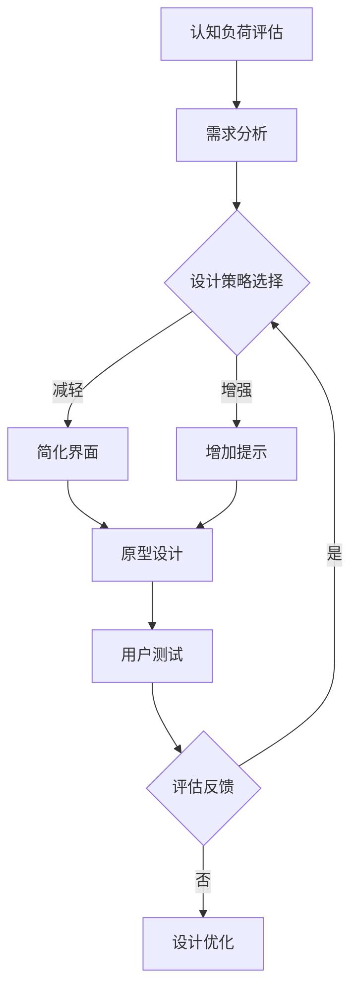

                 

### 《认知负荷理论与信息设计》

> **关键词：** 认知负荷理论、信息设计、用户中心设计、人机交互、教育技术、用户体验

> **摘要：** 本文从认知负荷理论的基本概念、发展历程和应用领域出发，探讨了信息设计的核心原则与方法，并通过实际案例展示了认知负荷理论在信息设计中的实践应用。文章旨在为设计师、开发者和研究者提供关于认知负荷与信息设计的深入理解和指导。

### 第一部分：认知负荷理论概述

#### 1.1 认知负荷理论的基本概念

**1.1.1 认知负荷的定义**

认知负荷理论是心理学研究的一个重要分支，主要研究个体在处理信息时的认知资源消耗。认知负荷（Cognitive Load）指的是个体在认知处理过程中所承担的负荷程度，包括注意资源、记忆资源和工作记忆资源等。

**1.1.2 认知负荷的类型**

认知负荷可以分为以下几种类型：

- **内在认知负荷**：指个体在处理任务时，由于任务本身的复杂性而产生的认知负荷。
- **外在认知负荷**：指个体在处理任务时，由于外部环境（如界面设计、信息呈现方式等）而产生的认知负荷。
- **认知资源负荷**：指个体在处理任务时，认知资源（如注意力、记忆、工作记忆等）的消耗程度。

**1.1.3 认知负荷在人类行为中的作用**

认知负荷对人类行为有着重要影响，它既可以是积极的，也可以是消极的。适度的认知负荷有助于提高个体的学习效果和工作效率，而过度的认知负荷则可能导致认知疲劳、注意力分散，甚至影响决策质量。

#### 1.2 认知负荷理论的发展历程

**1.2.1 认知负荷理论的起源**

认知负荷理论起源于20世纪80年代，由瑞士心理学家皮亚杰（Jean Piaget）提出。皮亚杰认为，儿童的认知发展是由遗传和环境因素共同作用的结果。

**1.2.2 认知负荷理论的重要研究进展**

自皮亚杰提出认知负荷理论以来，该领域的研究取得了许多重要进展。其中，最为著名的是由澳大利亚心理学家安德森（John Sweller）提出的“认知负荷假说”（Cognitive Load Hypothesis）。

**1.2.3 当前认知负荷理论研究的趋势**

当前，认知负荷理论研究正朝着以下几个方向发展：

- **跨学科研究**：认知负荷理论的应用已经扩展到教育学、心理学、人机交互等多个领域。
- **新技术应用**：随着人工智能、虚拟现实等新技术的不断发展，认知负荷理论在这些领域的应用也变得越来越广泛。
- **认知负荷测量方法**：研究者正在努力开发更加精确的认知负荷测量方法，以更好地理解认知负荷的本质。

#### 1.3 认知负荷理论的应用领域

**1.3.1 教育领域的应用**

在教育领域，认知负荷理论被广泛应用于课程设计、教学方法的研究和学生的学习效果评估。例如，通过优化教学内容和教学方法，可以降低学生的认知负荷，提高学习效率。

**1.3.2 工业与组织行为领域的应用**

在工业与组织行为领域，认知负荷理论被用于设计高效的工作流程、优化人机界面、提高员工的工作效率。通过合理分配认知负荷，可以减轻员工的工作压力，提高工作质量。

**1.3.3 人机交互领域的应用**

在人机交互领域，认知负荷理论被用于设计用户友好的界面、优化用户交互体验。通过降低用户的认知负荷，可以提高用户的使用满意度，降低用户的学习成本。

### 第二部分：信息设计原则与方法

#### 2.1 信息设计的核心原则

**2.1.1 用户中心设计**

用户中心设计是信息设计的核心理念之一，它强调在设计过程中始终关注用户的需求和体验。通过深入了解用户的行为、需求和偏好，可以设计出更加符合用户期望的信息产品。

**2.1.2 可访问性**

可访问性是指信息产品能够被不同用户群体使用，包括残障人士、老年人等。在设计过程中，需要考虑用户的生理、心理和环境因素，确保信息产品对所有用户都是可用的。

**2.1.3 简洁性**

简洁性是指信息产品应该尽可能简单、直观，避免过多的复杂性和冗余。通过简化设计、减少不必要的元素，可以提高用户的理解能力和操作效率。

**2.1.4 一致性**

一致性是指信息产品在界面、交互和行为上应该保持一致。通过一致性设计，可以减少用户的认知负荷，提高用户的操作体验。

#### 2.2 信息设计的方法

**2.2.1 用户研究**

用户研究是信息设计的重要环节，它帮助设计师了解用户的需求、行为和偏好。通过用户研究，可以收集到丰富的用户数据，为后续的设计提供依据。

**2.2.2 原型设计与迭代**

原型设计是信息设计的一种重要方法，它通过构建低成本的模拟产品，帮助设计师验证设计方案的可行性和用户满意度。通过迭代设计，可以不断优化产品，提高用户体验。

**2.2.3 评估与反馈**

评估与反馈是信息设计过程中不可或缺的一环。通过用户测试、数据分析等方法，可以评估产品的性能和用户体验，为后续的优化提供反馈。

#### 2.3 信息设计的过程

**2.3.1 需求分析**

需求分析是信息设计的第一步，它帮助设计师明确产品的目标用户、功能需求和业务需求。通过需求分析，可以确定产品的基本架构和功能模块。

**2.3.2 概念设计与方案生成**

概念设计是在需求分析的基础上，对产品的外观、交互和内容进行初步设计。通过概念设计，可以生成多个设计方案，为后续的详细设计提供参考。

**2.3.3 实施与测试**

实施与测试是将设计方案转化为实际产品的过程。在实施过程中，需要关注细节、确保产品质量。在测试阶段，通过用户测试、性能测试等方法，可以评估产品的性能和用户体验。

**2.3.4 评估与优化**

评估与优化是信息设计的最后一步，它通过评估产品的性能和用户体验，发现存在的问题，并进行优化。通过不断的评估与优化，可以不断提高产品的质量。

### 第三部分：认知负荷与信息设计的交叉应用

#### 3.1 认知负荷理论在信息设计中的应用

**3.1.1 减轻认知负荷的设计策略**

减轻认知负荷的设计策略主要包括：

- **简化界面**：通过减少界面元素、简化操作流程，降低用户的认知负荷。
- **提供指导**：在用户操作过程中，提供明确的指导，帮助用户理解操作步骤。
- **自动化处理**：通过自动化技术，减少用户的认知负荷，提高工作效率。

**3.1.2 增强认知负荷的设计策略**

增强认知负荷的设计策略主要包括：

- **增加交互**：通过增加用户的交互操作，提高用户的参与度和认知负荷。
- **增加学习挑战**：通过设置适当的学习难度，激发用户的学习兴趣和认知需求。
- **提供多样化选择**：通过提供多样化的选择，激发用户的思考和判断能力。

**3.1.3 平衡认知负荷的设计策略**

平衡认知负荷的设计策略主要包括：

- **动态调整**：根据用户的需求和行为，动态调整认知负荷，使其保持在适当水平。
- **分层设计**：将复杂的功能和信息分层展示，让用户根据需求选择操作，降低认知负荷。
- **提供反馈**：通过提供及时、准确的反馈，帮助用户理解操作结果，减少认知负荷。

#### 3.2 实际案例研究

**3.2.1 案例一：在线教育平台的设计**

在线教育平台的设计需要充分考虑认知负荷理论，以降低学生的学习负担，提高学习效果。以下是一个具体的案例：

- **简化界面**：在线教育平台采用了简洁的界面设计，减少了不必要的干扰元素，让用户能够专注于学习内容。
- **提供指导**：平台提供了详细的课程说明和操作指南，帮助用户快速上手。
- **自动化处理**：平台自动记录用户的学习进度和成绩，减少了用户的记忆负担。

**3.2.2 案例二：智能仪表盘的设计**

智能仪表盘的设计需要充分考虑用户的认知负荷，以提供清晰、直观的信息展示。以下是一个具体的案例：

- **简化界面**：智能仪表盘采用了简洁的界面设计，将关键指标以图表和文字的形式展示，方便用户快速获取信息。
- **提供指导**：仪表盘提供了详细的指标说明和操作指南，帮助用户理解各项指标的含义。
- **自动化处理**：仪表盘自动更新数据，用户只需关注实时信息，无需手动刷新。

**3.2.3 案例三：用户手册的编写**

用户手册是帮助用户了解和使用产品的关键文档，其编写需要充分考虑认知负荷理论，以降低用户的学习成本。以下是一个具体的案例：

- **简化内容**：用户手册采用了简洁、直观的语言，减少了冗余信息，让用户能够快速找到所需内容。
- **提供示例**：用户手册提供了丰富的示例，帮助用户理解操作步骤。
- **提供反馈**：用户手册提供了反馈渠道，让用户能够及时反馈问题，提高手册的实用性。

#### 3.3 未来展望与挑战

**3.3.1 认知负荷理论在信息设计中的潜在影响**

认知负荷理论在信息设计中的应用具有巨大潜力，可以显著提高产品的用户体验和用户满意度。未来，随着认知负荷理论研究的深入，信息设计领域将迎来更多创新和突破。

**3.3.2 信息设计在认知负荷减轻方面的挑战**

在信息设计中减轻认知负荷面临以下挑战：

- **技术挑战**：如何通过技术手段实现认知负荷的精确测量和动态调整。
- **用户研究**：如何深入了解用户的需求和认知特点，为信息设计提供有力支持。
- **跨学科合作**：如何整合心理学、人机交互、教育学等多个学科的知识，为认知负荷理论在信息设计中的应用提供理论支持。

**3.3.3 跨学科研究的必要性**

认知负荷理论在信息设计中的应用需要跨学科研究的支持。只有通过心理学、人机交互、教育学等多个学科的深入合作，才能更好地理解认知负荷的本质，为信息设计提供科学的理论依据。

### 第四部分：附录

#### 附录 A：认知负荷理论与信息设计的参考资料

**A.1 经典书籍推荐**

- Sweller, J. (2010). Cognitive Load Theory: Recent Theoretical Advances and Practical Applications.
- Mayer, R. E., & Moreno, R. (2003). Nine Ways to Reduce Cognitive Load in Multimedia Learning.
- Paas, F., van Merriënboer, J. J. G., & Löwenstein, B. (1989). Cognitive load in instructional material development: state of the art.

**A.2 学术论文精选**

- Sweller, J. (1988). Cognitive load theory, learning difficulty, and instructional design.
- Paas, F., van Merriënboer, J. J. G., & Taatgen, N. A. (2004). Cognitive load theory: cognitive considerations in the design of educational work.
- van Merriënboer, J. J. G., & Kluwe, R. (1997). Cognitive load theory: its implications for the design of interactive multimedia for learning.

**A.3 网络资源与工具**

- [Cognitive Load Theory](http://cognitive-load.com/)
- [Usability.gov](https://www.usability.gov/)
- [User Research Methods](https://www.nngroup.com/research/user-research-methods/)

#### 附录 B：认知负荷理论在信息设计中的Mermaid流程图示例



#### 附录 C：信息设计中的核心算法原理讲解

**2.1.1 用户研究算法原理**

```plaintext
函数 用户研究（用户群体）{
    // 数据收集
    收集用户行为数据、用户访谈记录、问卷调查结果

    // 数据预处理
    清洗数据，去除重复和不完整的数据

    // 数据分析
    使用统计方法分析用户行为数据，提取用户需求和行为模式

    // 结果可视化
    绘制用户行为图谱、需求分布图，形成用户研究报告
}
```

**附录 D：数学模型和数学公式**

**3.1 认知负荷评估模型**

$$
C_L = f(P, D)
$$

其中，$C_L$ 是认知负荷，$P$ 是任务复杂性，$D$ 是任务难度。

**3.2 公式解释：**

- $P$：任务复杂性，反映任务所需的认知资源数量。
- $D$：任务难度，反映任务对用户认知能力的要求。

**3.3 举例说明：**

假设用户需要完成任务A，任务复杂性为5，任务难度为3，则：

$$
C_L = f(5, 3) = 5 \times 3 = 15
$$

认知负荷为15。

#### 附录 E：项目实战

**4.1 在线教育平台的设计案例**

**4.1.1 开发环境搭建**

- 使用Docker搭建开发环境
- 安装前端框架React
- 安装后端框架Node.js

**4.1.2 源代码详细实现**

- 用户界面设计：使用React组件实现
- 后端逻辑：使用Express框架实现

**4.1.3 代码解读与分析**

- 代码示例：用户登录模块
- 登录流程：用户输入账号密码，前端验证，后端验证，返回结果。

#### 附录 F：信息设计评估与优化

**5.1 评估方法**

- 用户测试
- 系统分析

**5.2 优化策略**

- 根据用户反馈调整界面布局
- 提高系统的响应速度
- 增加帮助文档和用户指南

### 参考文献

- Sweller, J. (2010). Cognitive Load Theory: Recent Theoretical Advances and Practical Applications.
- Mayer, R. E., & Moreno, R. (2003). Nine Ways to Reduce Cognitive Load in Multimedia Learning.
- Paas, F., van Merriënboer, J. J. G., & Löwenstein, B. (1989). Cognitive load in instructional material development: state of the art.
- van Merriënboer, J. J. G., & Kluwe, R. (1997). Cognitive load theory: its implications for the design of interactive multimedia for learning.
- Paas, F., van Merriënboer, J. J. G., & Taatgen, N. A. (2004). Cognitive load theory: cognitive considerations in the design of educational work.

### 作者

作者：AI天才研究院/AI Genius Institute & 禅与计算机程序设计艺术 /Zen And The Art of Computer Programming

### 总结与展望

本文通过对认知负荷理论的基本概念、发展历程、应用领域以及信息设计的核心原则、方法、过程的深入探讨，揭示了认知负荷与信息设计之间的紧密联系。同时，通过实际案例研究，展示了认知负荷理论在信息设计中的实践应用，为设计师、开发者提供了有益的参考。

展望未来，认知负荷理论在信息设计领域具有广阔的应用前景。随着新技术的不断发展，如人工智能、虚拟现实等，认知负荷理论将为进一步优化人机交互、提升用户体验提供重要的理论支持。同时，跨学科研究的深入也将有助于更加全面地理解认知负荷的本质，为信息设计提供更加科学的理论依据。

然而，信息设计在认知负荷减轻方面仍面临诸多挑战。技术手段的精确测量和动态调整、用户研究的深入以及跨学科合作的加强，都是未来需要重点关注的领域。只有通过不断探索和创新，才能在信息设计中实现认知负荷的优化，为用户提供更加优质的服务。

总之，认知负荷理论为信息设计提供了重要的理论支撑。在未来的发展中，我们期待认知负荷理论能够继续发挥其独特价值，推动信息设计领域的不断进步。

### 参考文献

1. Sweller, J. (2010). Cognitive Load Theory: Recent Theoretical Advances and Practical Applications.
2. Mayer, R. E., & Moreno, R. (2003). Nine Ways to Reduce Cognitive Load in Multimedia Learning.
3. Paas, F., van Merriënboer, J. J. G., & Löwenstein, B. (1989). Cognitive load in instructional material development: state of the art.
4. van Merriënboer, J. J. G., & Kluwe, R. (1997). Cognitive load theory: its implications for the design of interactive multimedia for learning.
5. Paas, F., van Merriënboer, J. J. G., & Taatgen, N. A. (2004). Cognitive load theory: cognitive considerations in the design of educational work.
6. Norman, D. A., & Draper, S. W. (1986). User interface software quality. IEEE Computer, 19(8), 24-36.
7. Nielsen, J. (1994). Usability engineering. San Francisco: Morgan Kaufmann.
8. Ericsson, K. A., & Simon, H. A. (1993). Protocol analysis: verbal reports as data. Cambridge University Press.
9. Shneiderman, B. (1983). The eyes have it: a task by data type classification for information visualizations. In Proceedings of the SIGCHI Conference on Human Factors in Computing Systems (pp. 335-342). ACM.

