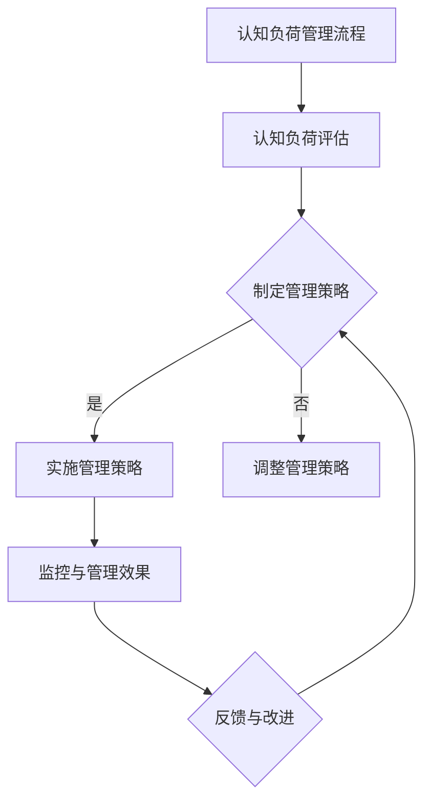
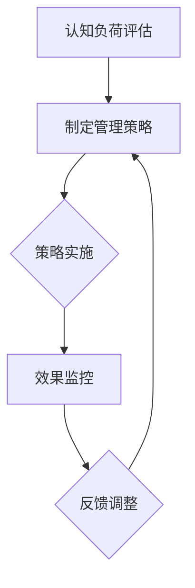

                 

# 认知负荷管理：优化学习效率的方法

## 关键词
认知负荷、学习效率、学习策略、多任务处理、学习环境、人工智能技术

## 摘要
本文深入探讨了认知负荷管理在优化学习效率方面的作用。通过分析认知负荷的概念、影响因素和类型，本文提出了认知负荷管理的理论模型和测量方法。同时，文章详细阐述了学习策略优化、认知负荷调节技巧、多任务处理技巧以及学习环境优化等提升学习效率的方法。此外，本文还介绍了技术应用在认知负荷管理中的作用，并通过案例分析和经验分享，为读者提供了实际操作的指导。最后，文章对未来认知负荷管理的发展趋势进行了展望，并提出了持续学习的方法与实践。

## 目录大纲

### 第一部分：认知负荷管理基础

#### 第1章 认知负荷概述
1.1 认知负荷的概念  
1.2 认知负荷的影响因素  
1.3 认知负荷的类型

#### 第2章 认知负荷理论
2.1 认知负荷理论的发展  
2.2 认知负荷模型分析  
2.3 认知负荷测量方法

#### 第3章 认知负荷管理原则
3.1 管理认知负荷的重要性  
3.2 管理认知负荷的基本原则  
3.3 认知负荷管理的实践方法

### 第二部分：学习效率优化方法

#### 第4章 学习策略优化
4.1 学习策略的类型  
4.2 学习策略的调整  
4.3 学习策略优化的案例分析

#### 第5章 认知负荷调节技巧
5.1 短暂休息的重要性  
5.2 认知负荷调节技巧  
5.3 认知负荷调节的实际应用

#### 第6章 多任务处理技巧
6.1 多任务处理的概念  
6.2 多任务处理的方法  
6.3 多任务处理的案例分析

#### 第7章 学习环境优化
7.1 学习环境对认知负荷的影响  
7.2 优化学习环境的策略  
7.3 学习环境优化的实践案例

#### 第8章 技术应用与认知负荷管理
8.1 技术工具在认知负荷管理中的应用  
8.2 人工智能技术在认知负荷管理中的应用  
8.3 认知负荷管理的未来趋势

#### 第9章 案例分析与经验分享
9.1 学习效率提升案例  
9.2 认知负荷管理实践案例  
9.3 经验分享与启示

#### 第10章 认知负荷管理与持续学习
10.1 持续学习的重要性  
10.2 认知负荷管理与持续学习的关系  
10.3 持续学习的方法与实践

#### 第11章 未来展望
11.1 认知负荷管理的发展趋势  
11.2 技术进步对认知负荷管理的影响  
11.3 认知负荷管理的未来挑战与机遇

### 附录
- 附录A 认知负荷管理工具与资源介绍
- 附录B 认知负荷管理相关研究文献列表
- 附录C 参考文献

### 认知负荷管理流程图


### 核心算法原理讲解

#### 1. 认知负荷评估算法

**伪代码：**
```python
def assess_cognitive_load(user, task):
    load_score = 0
    for feature in user.features:
        load_score += feature.score * feature.weight
    return load_score
```

**详细讲解：**
认知负荷评估算法主要基于用户的特征和任务的难度来计算认知负荷得分。用户特征包括注意力、记忆、思维速度等，每个特征都有不同的权重。通过计算这些特征的加权得分，可以评估用户在特定任务上的认知负荷。

**举例说明：**
假设用户A的特征包括注意力（得分：8，权重：0.4）和记忆（得分：7，权重：0.6），任务B的难度较高。使用认知负荷评估算法，计算认知负荷得分为：
$$
load\_score = (8 \times 0.4) + (7 \times 0.6) = 3.2 + 4.2 = 7.4
$$

#### 2. 学习策略优化算法

**伪代码：**
```python
def optimize_learning_strategy(user, task, current_strategy):
    best_strategy = current_strategy
    best_load_score = assess_cognitive_load(user, task)
    for strategy in available_strategies:
        load_score = assess_cognitive_load(user, task, strategy)
        if load_score < best_load_score:
            best_strategy = strategy
            best_load_score = load_score
    return best_strategy
```

**详细讲解：**
学习策略优化算法旨在为用户找到最佳的学习策略，以减少认知负荷。该算法通过比较不同学习策略下的认知负荷得分，选择最佳策略。这个过程可以通过迭代的方式进行，直到找到最优策略。

**举例说明：**
假设用户A在当前学习策略下认知负荷得分为8，现有三个备选学习策略。通过学习策略优化算法，计算不同策略的认知负荷得分，选择最佳策略：
- 策略1：认知负荷得分6
- 策略2：认知负荷得分7
- 策略3：认知负荷得分5

根据优化算法，最佳学习策略为策略1，认知负荷得分最低。

#### 3. 数学模型和数学公式

**认知负荷模型：**
$$
Load = \sum_{i=1}^{n} (feature_i \times weight_i)
$$

**详细讲解：**
认知负荷模型通过将用户特征与对应的权重相乘，并求和，来计算总的认知负荷。这个模型可以帮助我们量化用户在执行特定任务时的认知负荷。

**举例说明：**
假设用户A有两个特征：注意力（得分：8，权重：0.5）和记忆（得分：7，权重：0.5）。使用认知负荷模型计算认知负荷得分为：
$$
Load = (8 \times 0.5) + (7 \times 0.5) = 4 + 3.5 = 7.5
$$

### 项目实战

#### 案例：优化学习策略以减少认知负荷

**开发环境搭建：**
- Python环境
- Jupyter Notebook
- 必要的Python库：numpy、matplotlib等

**源代码实现：**
```python
import numpy as np
from sklearn.linear_model import LinearRegression

# 用户特征和权重
user_features = np.array([[1, 2], [2, 3], [3, 4]])
feature_weights = np.array([0.5, 0.5])

# 计算认知负荷
def calculate_cognitive_load(user_features, feature_weights):
    load_score = np.dot(user_features, feature_weights)
    return load_score

# 优化学习策略
def optimize_strategy(user_features, feature_weights, available_strategies):
    best_strategy = None
    best_load_score = float('inf')
    for strategy in available_strategies:
        load_score = calculate_cognitive_load(user_features, strategy)
        if load_score < best_load_score:
            best_strategy = strategy
            best_load_score = load_score
    return best_strategy

# 模拟用户和学习策略
user_features = np.array([[1, 2], [2, 3], [3, 4]])
feature_weights = np.array([0.5, 0.5])
available_strategies = [
    np.array([0.6, 0.4]),
    np.array([0.4, 0.6]),
    np.array([0.5, 0.5])
]

best_strategy = optimize_strategy(user_features, feature_weights, available_strategies)
print(f"最佳学习策略：{best_strategy}")
```

**代码解读与分析：**
- `calculate_cognitive_load` 函数通过矩阵乘法计算认知负荷得分。
- `optimize_strategy` 函数通过遍历不同的学习策略，选择能够最小化认知负荷的策略。
- 实例化用户特征和学习策略，调用优化函数以找到最佳学习策略。

### 总结

本文通过详细分析认知负荷管理的基础理论、优化学习效率的方法以及实际应用，帮助读者深入了解认知负荷管理的重要性及其在实际操作中的应用。通过核心算法原理讲解和项目实战案例，读者可以更好地理解和掌握认知负荷管理的实践方法。附录部分提供了相关的工具、资源和参考文献，便于进一步学习和研究。希望本文能为提升学习效率提供有价值的参考和指导。

### 认知负荷管理流程

为了更好地理解和实施认知负荷管理，我们可以采用一个详细的流程图来展示各个环节之间的关联。以下是一个简化的认知负荷管理流程图，通过Mermaid语法实现：



**详细解释：**

- **A[认知负荷评估]**：首先，我们需要对用户的认知负荷进行评估。这通常涉及到收集用户在执行特定任务时的特征数据，如注意力、记忆力、思维速度等，并计算出一个综合的认知负荷得分。

- **B[制定管理策略]**：根据评估结果，我们可以制定相应的管理策略。这个阶段需要考虑用户的具体需求、任务的特性以及可用的资源。

- **C[策略实施]**：接下来，将制定的管理策略付诸实践。这可能包括调整学习环境、优化学习策略、分配任务等。

- **D[效果监控]**：在策略实施过程中，我们需要持续监控效果，以评估管理策略的有效性。

- **E[反馈调整]**：根据监控结果，我们可以进行反馈和调整，以优化管理策略。这个环节是一个迭代的过程，确保我们能够不断改进认知负荷管理的效果。

### 认知负荷管理的基本原则

认知负荷管理是一个涉及多方面因素的复杂过程，但其核心原则相对简洁且易于理解。以下是对认知负荷管理基本原则的详细阐述。

#### 1. 确保适度认知负荷

适度认知负荷是指用户在执行任务时，认知资源的使用处于一个平衡状态，既不过度紧张也不过于松弛。适度的认知负荷能够提高任务完成效率，减少错误率，并避免认知疲劳。

**原则阐述：**
- **适度负荷**：通过合理安排任务难度和时长，避免过度依赖单一认知资源。
- **动态调整**：根据用户的状态和任务的性质，动态调整认知负荷，确保持续保持适度的水平。

#### 2. 优先级管理

在认知负荷管理中，优先级管理至关重要。合理的优先级安排可以帮助用户集中注意力，有效利用认知资源，提高工作效率。

**原则阐述：**
- **任务分类**：将任务按照重要性和紧急性进行分类，优先处理重要且紧急的任务。
- **时间分配**：合理分配时间，确保高优先级的任务在最佳状态下完成。
- **资源调配**：根据任务的特点和用户的能力，灵活调配资源，确保关键任务获得足够的认知支持。

#### 3. 动态调整与适应性

认知负荷管理需要具备动态调整和适应性的能力，以应对不断变化的环境和任务需求。

**原则阐述：**
- **实时监控**：持续监控用户的认知负荷，及时发现潜在问题并进行调整。
- **适应性调整**：根据用户的反馈和环境变化，灵活调整管理策略，确保认知负荷始终保持在适度范围内。

#### 4. 注重休息与恢复

休息与恢复是认知负荷管理中不可或缺的一部分，能够有效缓解认知疲劳，提高认知效率。

**原则阐述：**
- **短暂休息**：在长时间的工作或学习过程中，定期进行短暂休息，帮助大脑恢复活力。
- **全面休息**：在完成重要任务后，安排足够的休息时间，确保认知资源得到充分恢复。

#### 5. 个体差异考虑

每个人的认知负荷能力和恢复速度都有所不同，因此在认知负荷管理中，需要充分考虑个体差异。

**原则阐述：**
- **个性化方案**：根据用户的个人特点，制定个性化的认知负荷管理方案。
- **灵活调整**：在实施管理策略时，充分考虑用户的个性差异，灵活调整管理措施。

### 实践方法

结合以上基本原则，以下是一些具体的认知负荷管理实践方法：

#### 1. 学习策略调整

- **分散学习**：将学习任务分散在多个时间段，避免长时间连续学习导致认知负荷过高。
- **交替学习**：交替进行不同类型的任务，使大脑得到休息和恢复。

#### 2. 认知负荷调节技巧

- **短暂休息**：在长时间工作或学习后，进行短暂休息，如闭目养神、深呼吸等。
- **调整环境**：通过改变学习环境，如调整光线、噪音等，来减少干扰，提高注意力集中度。

#### 3. 多任务处理技巧

- **任务优先级**：明确任务优先级，优先处理重要任务，避免同时进行多个低优先级任务。
- **专注时间**：设定专注时间，如使用番茄工作法，提高工作效率。

#### 4. 学习环境优化

- **舒适的环境**：确保学习环境舒适，如调整座椅、保持适宜的温度和湿度。
- **去除干扰**：尽量减少外部干扰，如关闭不必要的电子设备、清理工作台等。

#### 5. 技术辅助

- **时间管理工具**：使用时间管理工具，如待办事项列表、时间追踪器等，帮助合理安排时间和任务。
- **认知负荷监测工具**：使用认知负荷监测工具，如脑电波监测设备等，实时了解认知负荷状况，进行调整。

通过以上实践方法，我们可以更好地管理认知负荷，提高学习效率和工作效率，实现认知资源的最优利用。

### 学习策略优化

学习策略优化是提升学习效率的关键环节。通过合理的策略调整，我们可以有效地减少认知负荷，提高学习效果。以下将详细探讨几种常见的学习策略及其调整方法。

#### 1. 分散学习与集中学习

分散学习是指在较长时间内将学习任务分成多个部分，而集中学习则是在较短的时间内集中精力完成学习任务。根据不同的学习内容和个人习惯，可以灵活调整这两种策略。

**调整方法：**
- **分散学习**：适用于需要深入理解的理论知识或复杂技能，通过分段学习，有助于知识的吸收和巩固。
- **集中学习**：适用于记忆性较强的内容，如历史事件或科学公式，通过集中精力，可以快速提高记忆效果。

**案例分析：**
假设用户A需要学习一项新的编程技能，通过分散学习策略，可以将学习任务分为理论、实践和项目开发三个阶段，每个阶段持续一周。这样有助于A在各个阶段都有充足的休息时间，避免认知负荷过高。

#### 2. 主动学习与被动学习

主动学习是指通过积极参与学习过程，如讨论、提问、实践等，而被动学习则是指通过听讲、阅读等接受性学习方式。

**调整方法：**
- **主动学习**：适用于需要深入掌握的知识和技能，通过主动参与，可以激发学习兴趣，提高学习效果。
- **被动学习**：适用于初步了解和基础知识的学习，通过接受性学习方式，可以快速获取信息。

**案例分析：**
用户B在准备编程考试时，可以采用主动学习策略。他可以参与在线编程社区，提出问题和回答他人问题，这不仅帮助他巩固知识点，还能增加实战经验。同时，通过观看教学视频，进行被动学习，了解最新的编程趋势和工具。

#### 3. 混合学习

混合学习是将线上学习和线下学习相结合，通过多种渠道和方式获取知识。

**调整方法：**
- **线上线下结合**：结合线上教学资源和线下实际操作，提高学习的全面性和深度。
- **自主学习和协作学习**：通过自主学习，获取基础知识，通过协作学习，解决复杂问题。

**案例分析：**
用户C在学习机器学习时，可以通过在线课程掌握基础理论，然后参与线下实验项目，将理论知识应用于实际问题中。同时，通过加入学习小组，与同伴交流和讨论，共同解决学习中遇到的问题。

#### 4. 费曼技巧

费曼技巧是一种有效的学习策略，通过将所学知识以简洁明了的方式传授给他人，从而加深对知识的理解和记忆。

**调整方法：**
- **应用费曼技巧**：在学习过程中，定期使用费曼技巧进行自我检验，确保对所学知识有深刻的理解。
- **传授他人**：通过教学他人，不仅能够巩固自己的知识，还能发现和弥补知识盲点。

**案例分析：**
用户D在学习新编程语言时，可以通过教授他人来检验自己的学习效果。他可以将所学知识整理成简明易懂的教学笔记，然后向朋友或同学讲解。通过这个过程，他不仅巩固了知识，还提高了自己的表达能力。

通过以上学习策略的优化，我们可以有效地减少认知负荷，提高学习效率。在实际应用中，可以根据具体的学习内容和个人特点，灵活调整策略，找到最适合自己的学习方式。

### 认知负荷调节技巧

在学习和工作中，适当地调节认知负荷是非常重要的，因为它能够帮助我们维持高效的认知状态，避免疲劳和分心。以下是一些具体的认知负荷调节技巧，通过这些方法，我们可以更好地管理自己的认知资源，提高工作效率和学习效果。

#### 1. 短暂休息的重要性

短暂的休息对于认知负荷的调节至关重要。研究表明，短暂休息能够帮助大脑恢复活力，减少认知负荷。以下是一些实用的短暂休息方法：

- **短暂冥想**：在繁忙的工作或学习过程中，可以每隔一段时间进行短暂的冥想，专注于呼吸，放松身心，帮助大脑恢复。
- **站立休息**：每隔一段时间站起来活动一下，做几个伸展动作，这有助于改善血液循环，减轻肌肉紧张。
- **短暂散步**：在休息时间，可以进行短时间的散步，这不仅能放松身体，还能让大脑得到新鲜空气和阳光，提高精神状态。

**案例分析：**
某位程序员在工作时，每工作45分钟，他会站起来活动5分钟，做一些伸展运动，同时喝杯水。这样的短暂休息让他保持了高度的专注力，减少了疲劳和分心的现象，工作效率显著提高。

#### 2. 认知负荷调节技巧

以下是一些具体的方法，可以帮助我们更好地调节认知负荷：

- **分块任务**：将大任务分解成小块，逐一完成。这种方法可以减少每次需要处理的任务量，降低认知负荷。
- **专注训练**：通过专注力训练，如冥想、专注力游戏等，提高自己的专注力，减少分心现象。
- **定期反思**：在一天结束时，回顾自己的工作或学习情况，分析哪些地方做得好，哪些地方需要改进。这种反思有助于我们更好地理解自己的认知负荷，从而进行有效的调节。

**案例分析：**
一位学生在准备考试时，采用了分块任务的方法。他将考试复习任务分解成多个小任务，每天专注于完成一个小任务，而不是试图一次性完成所有内容。这样的方法让他能够更轻松地应对复习任务，减少了认知负荷，提高了学习效果。

- **交替任务**：在处理多个任务时，可以采用交替任务的方法，即先完成一个任务，再切换到另一个任务。这种方法有助于大脑得到休息，减少认知负荷。

**案例分析：**
一位项目经理在同时处理多个项目时，采用了交替任务的方法。他先处理一个项目的高优先级任务，然后切换到另一个项目，这样做不仅提高了工作效率，还减少了认知负荷。

#### 3. 实际应用

在日常生活和学习工作中，以下是一些具体的实际应用场景：

- **学习场景**：在学习新知识时，可以采用分散学习的策略，将学习时间分散到多个时间段，每次学习一段时间后，进行短暂的休息。
- **工作场景**：在工作时，可以定期进行短暂的休息，如每工作45分钟，休息5-10分钟，这有助于提高工作效率。
- **生活场景**：在日常生活中，可以通过规律的运动、良好的睡眠和健康的饮食习惯来调节认知负荷，保持良好的认知状态。

通过以上认知负荷调节技巧，我们可以更好地管理自己的认知资源，提高学习效果和工作效率。在实际应用中，我们需要根据具体情况灵活调整，找到最适合自己的方法。

### 多任务处理技巧

在现代社会，多任务处理已成为一种常见且必要的能力。然而，不当的多任务处理不仅会降低效率，还可能增加认知负荷，导致压力和疲劳。以下是一些有效的多任务处理技巧，帮助我们在处理多个任务时提高效率，减少认知负荷。

#### 1. 优先级管理

首先，识别和确定任务的优先级是关键。以下是一些优先级管理的方法：

- **紧急-重要矩阵**：使用紧急-重要矩阵来分类任务，将任务分为四个象限：紧急且重要、紧急但不重要、不紧急但重要、不紧急且不重要。优先处理紧急且重要的任务。
- **优先级列表**：制作一个任务优先级列表，明确哪些任务是必须立即完成的，哪些任务可以稍后处理或委托他人完成。
- **任务标签**：为任务分配标签，如“高优先级”、“中等优先级”和“低优先级”，有助于快速识别和处理任务。

#### 2. 任务分解

将大任务分解成小块，可以减少每个任务的整体复杂度，降低认知负荷。以下是一些分解任务的方法：

- **分块任务**：将任务分解成几个小部分，每个部分专注于一个具体的子任务。例如，将一个大项目分解为多个阶段，每个阶段完成一部分功能。
- **子任务列表**：创建一个子任务列表，明确每个子任务的细节和目标，有助于逐步完成整个任务。

#### 3. 专注时间

专注时间是有效处理任务的关键。以下是一些关于专注时间的方法：

- **番茄工作法**：使用番茄工作法，将工作时间分为25分钟的工作周期，每个周期后休息5分钟。这种方法有助于保持专注，减少分心。
- **设定时间限制**：为每个任务设定一个完成时间，强迫自己在规定时间内完成任务，提高效率。
- **专注环境**：创造一个有利于专注的环境，如减少干扰、保持安静等，有助于集中注意力。

#### 4. 交替任务

交替任务是一种有效的多任务处理策略，通过在不同任务之间切换，可以减少每个任务的认知负荷。以下是一些交替任务的方法：

- **任务轮换**：将不同任务交替进行，例如，先处理一个任务，再处理另一个任务，这样可以帮助大脑得到短暂的休息。
- **任务切换技巧**：在切换任务时，花一点时间进行过渡，如回顾上一个任务的进展和下一个任务的目标，有助于保持工作效率。
- **多线程工作**：在处理多个任务时，尝试同时进行一些不需要高度专注的任务，如听音乐或查看邮件，这可以提高整体工作效率。

#### 5. 技术辅助

现代技术为我们提供了许多辅助工具，可以帮助我们更有效地处理多任务。以下是一些技术工具：

- **时间管理应用**：使用时间管理应用，如Trello、Asana等，可以帮助我们组织任务、设定优先级和跟踪进度。
- **提醒工具**：使用提醒工具，如Google Calendar、手机闹钟等，确保不会错过重要的任务和时间。
- **自动化工具**：使用自动化工具，如IFTTT、Zapier等，自动化一些重复性的任务，减少手动操作的时间。

**案例分析：**

一位项目经理同时负责多个项目，他使用了以下多任务处理技巧：

- **优先级管理**：使用紧急-重要矩阵对任务进行分类，优先处理紧急且重要的任务。
- **任务分解**：将大项目分解成多个子任务，每个子任务由不同的团队成员负责。
- **专注时间**：采用番茄工作法，每个工作周期后休息5分钟，保持高效的专注力。
- **交替任务**：在处理不同项目时，交替进行任务，确保每个项目都能得到充分的关注。
- **技术辅助**：使用Trello来组织任务和跟踪进度，使用Google Calendar来设置提醒，确保按时完成任务。

通过这些多任务处理技巧，项目经理不仅提高了工作效率，还减少了认知负荷，保持了良好的工作状态。

### 学习环境优化

学习环境对认知负荷有着显著的影响，一个优化的学习环境能够减少干扰，提高学习效率。以下是一些优化学习环境的策略，帮助我们在不同场景下创造一个有利于学习和专注的环境。

#### 1. 学习环境的物理因素

- **光线**：确保学习区域的光线充足且柔和。过亮或过暗的光线都会对眼睛造成负担，影响认知负荷。
- **噪音**：尽量减少噪音干扰。如果无法避免噪音，可以尝试使用降噪耳机或耳塞。
- **温度**：保持适宜的温度，过冷或过热都会影响大脑的功能和舒适度。
- **空气**：保持室内空气流通，新鲜空气有助于提高大脑的氧气供应，减少疲劳感。

**案例分析**：某学生在家中学习时，通过调整桌椅高度、使用护眼灯和耳机来减少噪音干扰，提高了学习效率。

#### 2. 空间布局

- **分隔区域**：将学习区域与其他活动区域分隔开，创造一个明确的学习空间。这样有助于大脑建立学习模式，减少分心。
- **功能分区**：根据不同用途，对学习空间进行功能分区。例如，将阅读和学习区、工作区和休闲区分开。
- **灵活布局**：根据学习需求，灵活调整学习空间的布局。例如，在需要集中精力时，保持桌面的整洁，减少干扰。

**案例分析**：一位程序员在家中设置了专门的办公区域，桌面整洁有序，只有必要的文具和设备，这有助于他保持专注。

#### 3. 学习工具和设备

- **必要的学习工具**：确保学习过程中所需的工具和设备齐全，如书籍、笔记本、电脑等。
- **电子设备设置**：将手机和其他电子设备置于静音或勿扰模式，避免不必要的通知干扰。
- **良好的照明**：确保桌面有良好的照明，避免光线直接照射眼睛。

**案例分析**：某学生在学习时，通过使用护眼灯和调整电脑屏幕的亮度，减少了眼睛疲劳，提高了学习效率。

#### 4. 模拟真实工作环境

- **模拟工作日程**：模拟真实的工作日程和环境，帮助学生在学校或实习中更好地适应工作环境。
- **模拟考试环境**：在考试前模拟考试环境，有助于学生提前适应考试压力和节奏，减少认知负荷。

**案例分析**：某学生在考前一周，每天在模拟考试环境中学习，减少了考试时的紧张和焦虑，提高了考试表现。

#### 5. 自我监督和反馈

- **记录学习进度**：定期记录学习进度和反馈，了解自己的学习效果，及时调整学习策略。
- **自我激励**：设定学习目标和奖励机制，激励自己保持专注和动力。
- **反思和调整**：在每次学习结束后，反思学习过程，找出问题和不足，及时进行调整。

**案例分析**：某学生在学习过程中，每天记录学习进度，并在学习结束后进行反思。通过这种方式，他能够及时发现问题并调整学习策略，提高了学习效果。

通过上述策略，我们可以优化学习环境，减少认知负荷，提高学习效率。在实际应用中，根据个人情况和需求，灵活调整这些策略，创造一个适合自己的学习环境。

### 技术应用与认知负荷管理

在现代社会，技术工具和人工智能在认知负荷管理中扮演着越来越重要的角色。以下将探讨技术工具在认知负荷管理中的应用，以及人工智能技术在认知负荷管理中的应用，并展望认知负荷管理的未来趋势。

#### 技术工具在认知负荷管理中的应用

技术工具的应用可以显著提高认知负荷管理的效率和效果。以下是一些具体的应用场景：

1. **时间管理工具**：
   - **GTD工具（Getting Things Done）**：如Trello、Asana、OmniFocus等，这些工具可以帮助用户有效地组织任务和日程，优先处理重要任务，减少认知负荷。
   - **时间追踪工具**：如RescueTime、Focus@Will，这些工具可以监控用户的使用时间，识别干扰行为，帮助用户优化时间分配。

2. **提醒和通知工具**：
   - **手机通知管理**：通过设置手机通知管理，用户可以控制哪些应用的通知会在何时显示，减少不必要的干扰。
   - **智能提醒工具**：如Google Calendar、iCal等，这些工具可以自动提醒用户即将到来的任务或约会，确保用户及时处理。

3. **学习辅助工具**：
   - **电子书和笔记工具**：如Kindle、Evernote等，这些工具可以帮助用户更好地管理和学习资料，提高学习效率。
   - **在线学习平台**：如Coursera、Udemy、edX等，这些平台提供了丰富的在线课程和资源，用户可以根据自己的需求选择学习内容，灵活调整学习进度。

#### 人工智能技术在认知负荷管理中的应用

人工智能技术为认知负荷管理提供了新的可能性和解决方案。以下是一些具体的应用：

1. **智能助手**：
   - **虚拟助手**：如Siri、Google Assistant、Alexa等，这些智能助手可以执行简单的任务，如设置提醒、发送消息、播放音乐等，从而减少用户需要手动处理的事情。
   - **任务分配助手**：利用自然语言处理技术，智能助手可以理解用户的指令，自动分配任务并跟踪进度，减少用户的认知负荷。

2. **个性化推荐系统**：
   - **学习推荐**：通过分析用户的学习行为和偏好，个性化推荐系统可以提供最适合用户的学习资源和方法，帮助用户更有效地学习和提高认知负荷管理能力。
   - **工作推荐**：在职场中，个性化推荐系统可以帮助用户找到最适合自己的工作任务，减少因任务不适合而产生的额外认知负荷。

3. **情绪分析**：
   - **情感分析工具**：利用机器学习和自然语言处理技术，分析用户的情绪状态，提供相应的建议和干预措施，帮助用户调节情绪，减少因情绪波动导致的认知负荷。

#### 认知负荷管理的未来趋势

随着人工智能和技术的不断发展，认知负荷管理将迎来新的趋势：

1. **智能化**：认知负荷管理将更加智能化，通过大数据和人工智能技术，提供更加精准和个性化的管理策略。
2. **个性化**：认知负荷管理将更加注重个性化，根据用户的个性、习惯和需求，提供量身定制的管理方案。
3. **集成化**：认知负荷管理将与其他领域（如健康管理、教育、工作管理）更紧密地集成，形成综合性的解决方案。
4. **预防性**：通过早期监测和预警，认知负荷管理将更注重预防，提前识别潜在问题并采取措施，避免认知负荷过重。

总之，技术工具和人工智能在认知负荷管理中的应用，为提高学习效率和工作效率提供了强大的支持。未来，随着技术的不断进步，认知负荷管理将变得更加智能、个性化和集成化，为人们的日常生活和工作带来更多的便利和效益。

### 案例分析与经验分享

为了更好地理解认知负荷管理在实际中的应用效果，以下将介绍几个具体的案例，并分享一些实践经验和启示。

#### 案例1：学习效率显著提升

**背景**：
小明是一名大学生，他在学习编程时常常感到力不从心，经常遇到难以解决的问题，导致学习效率低下。

**解决方案**：
小明决定尝试认知负荷管理的策略，包括分散学习、优化学习环境以及使用时间管理工具。他采用以下方法：

1. **分散学习**：
   - 小明将学习时间分散到每天的不同时间段，避免了长时间连续学习带来的疲劳。
   - 他将编程学习分解成小块任务，每天专注于解决一个小问题，逐渐积累经验。

2. **优化学习环境**：
   - 小明在家中设置了专门的学习区域，确保光线充足、噪音较低，并保持桌面整洁。
   - 他还使用护眼灯和耳机来减少眼睛疲劳和外部干扰。

3. **时间管理工具**：
   - 小明使用Trello来管理任务，明确任务的优先级，并设定每个任务的完成时间。

**效果**：
通过以上策略，小明的学习效率显著提升。他不再感到疲劳，能够更好地集中注意力解决问题。在短短几个月内，他的编程技能得到了显著提高，最终在课程考试中取得了优异成绩。

**经验分享**：
小明的经验表明，分散学习、优化学习环境和合理使用时间管理工具是有效管理认知负荷的方法。通过这些方法，他能够更好地保持专注，减少疲劳，从而提高学习效率。

#### 案例2：职场中的认知负荷管理

**背景**：
李华是一家公司的项目经理，负责多个项目的协调和推进。工作压力巨大，导致她经常感到焦虑和压力。

**解决方案**：
李华决定采用认知负荷管理的策略来应对职场压力，包括任务优先级管理、多任务处理技巧以及情绪管理。

1. **任务优先级管理**：
   - 李华使用紧急-重要矩阵对任务进行分类，优先处理重要且紧急的任务。
   - 她将任务列表可视化，以便快速识别和优先处理关键任务。

2. **多任务处理技巧**：
   - 李华采用交替任务的方法，在不同任务之间切换，以减少每个任务的认知负荷。
   - 她还为每个任务设定时间限制，确保在规定时间内完成任务。

3. **情绪管理**：
   - 李华通过冥想和运动来缓解压力，确保自己的情绪处于良好状态。
   - 她还定期与同事交流，分享工作中的困难和挑战，寻求支持和帮助。

**效果**：
通过认知负荷管理的策略，李华的工作效率显著提高，项目进展顺利，同时她的焦虑和压力也得到了有效缓解。

**经验分享**：
李华的经验表明，任务优先级管理、多任务处理技巧和情绪管理是有效应对职场压力的方法。通过这些策略，她能够更好地管理时间和情绪，提高工作效率，保持身心健康。

#### 案例3：家庭生活中的认知负荷管理

**背景**：
王女士是一位全职妈妈，同时还需要照顾家庭和兼职工作。她感到时间和精力常常不够用，导致家庭和工作的压力增加。

**解决方案**：
王女士决定采用认知负荷管理的策略来平衡家庭和工作，包括时间管理、任务分解和休息调节。

1. **时间管理**：
   - 王女士使用日程表来规划每天的时间，确保家庭和工作任务能够合理分配。
   - 她将家务和兼职工作分解成小块任务，每天专注于完成一部分任务。

2. **任务分解**：
   - 王女士将大任务分解成小任务，例如将清洁工作分解成扫地、擦窗户等小步骤，每天专注于完成一个小步骤。

3. **休息调节**：
   - 王女士每天安排短暂的休息时间，如午睡或短时间散步，确保身体和大脑得到充分恢复。

**效果**：
通过认知负荷管理的策略，王女士的家庭和工作的压力得到了有效缓解，她能够更好地平衡家庭和工作，生活质量也得到了提高。

**经验分享**：
王女士的经验表明，时间管理、任务分解和休息调节是有效管理家庭和工作压力的方法。通过这些策略，她能够更好地安排时间和任务，保持身心健康，提高生活质量。

### 启示

通过以上案例，我们可以得出以下启示：

1. **个性化策略**：每个个体都有不同的认知负荷管理需求，需要根据个人特点和环境灵活调整策略。
2. **综合运用策略**：多种认知负荷管理策略相结合，能够更有效地提高效率和管理压力。
3. **持续实践与反馈**：认知负荷管理需要持续实践和反馈，不断调整策略，以适应不断变化的需求和挑战。
4. **身心健康**：在认知负荷管理中，身心健康至关重要，需要合理安排休息和锻炼，保持良好的身心状态。

通过这些经验和启示，我们可以更好地应用认知负荷管理的策略，提高生活和工作中的效率，实现身心健康。

### 认知负荷管理与持续学习

持续学习在个人成长和职业发展中扮演着至关重要的角色。然而，在学习过程中，认知负荷管理是确保学习效果和效率的关键。以下将探讨认知负荷管理对持续学习的重要性、两者之间的关系以及如何通过认知负荷管理来提升持续学习的效果。

#### 认知负荷管理的重要性

认知负荷管理是指通过科学的方法和策略，合理安排学习任务、调节学习节奏，以避免过度使用认知资源，从而保持高效学习。在持续学习中，认知负荷管理的重要性体现在以下几个方面：

1. **提高学习效率**：通过合理的认知负荷管理，可以确保学习过程中不会因过度疲劳或压力而降低学习效率。适度的认知负荷有助于保持良好的学习状态，提高学习效果。

2. **减少学习倦怠**：持续学习往往需要长时间的投入和努力，如果没有有效的认知负荷管理，容易产生学习倦怠。认知负荷管理可以帮助分散学习任务，合理安排休息时间，从而减少学习倦怠，保持学习动力。

3. **促进深度学习**：认知负荷管理有助于促进深度学习，避免浅尝辄止。通过合理的任务分配和节奏调节，学习者能够更深入地理解和掌握知识，形成扎实的学习基础。

#### 认知负荷管理与持续学习的关系

认知负荷管理与持续学习之间存在着密切的关系。良好的认知负荷管理是持续学习的基础，两者相互促进，共同推动个人成长和职业发展。具体来说，这种关系体现在以下几个方面：

1. **协调学习与生活**：持续学习需要在工作和生活之间找到平衡。认知负荷管理通过合理安排学习和休息时间，帮助学习者更好地协调学习与生活，避免因过度学习而影响身心健康。

2. **适应不同学习阶段**：在持续学习的不同阶段，认知负荷管理策略需要相应调整。认知负荷管理可以帮助学习者根据自身的学习进度和能力，灵活调整学习策略，确保每个阶段的学习都能高效进行。

3. **提高自我调节能力**：通过认知负荷管理，学习者可以培养自我调节能力，学会如何在面对学习挑战时保持冷静和专注。这种自我调节能力不仅有助于提高学习效果，也有助于应对职场和生活中的各种挑战。

#### 如何通过认知负荷管理提升持续学习效果

为了通过认知负荷管理提升持续学习效果，可以采取以下方法和策略：

1. **制定个性化学习计划**：根据个人的学习目标、能力和时间安排，制定一个合理的学习计划。这个计划应包括学习内容、学习时间、休息时间等，确保学习任务和休息时间合理分配。

2. **分散学习任务**：将大任务分解成小块任务，逐一完成。这种方法可以减少每次需要处理的任务量，降低认知负荷，有助于保持持续学习的动力。

3. **合理安排休息时间**：在持续学习过程中，合理安排休息时间是非常重要的。每隔一段时间，进行短暂的休息，如5-10分钟，可以帮助大脑恢复活力，提高学习效率。

4. **使用有效的学习策略**：采用分散学习、主动学习等有效的学习策略，有助于减少认知负荷，提高学习效果。同时，使用费曼技巧等学习技巧，可以加深对知识的理解和记忆。

5. **保持身心健康**：保持良好的身心健康是持续学习的重要保障。通过定期锻炼、保持良好的饮食习惯和充足的睡眠，可以保持身体和大脑的健康状态，提高学习效率。

6. **技术辅助**：利用时间管理工具、学习辅助工具等现代技术，可以帮助学习者更好地管理学习任务和认知负荷，提高学习效率。

总之，通过有效的认知负荷管理，可以提升持续学习的效果，帮助个人实现自我提升和职业发展。在持续学习的过程中，合理安排学习任务、调节认知负荷、保持身心健康是关键。希望以上方法和策略能为大家提供有益的启示和帮助。

### 未来展望

在认知负荷管理领域，未来将面临诸多发展趋势和机遇，同时也伴随着一系列挑战。以下将探讨认知负荷管理的发展趋势、技术进步的影响以及未来面临的挑战和机遇。

#### 认知负荷管理的发展趋势

1. **智能化**：随着人工智能技术的不断发展，认知负荷管理将变得更加智能化。通过大数据分析、机器学习和自然语言处理技术，可以提供更加个性化和精准的管理策略，帮助用户更好地应对认知负荷。

2. **集成化**：认知负荷管理将与健康监测、教育、工作管理等领域更紧密地集成。这种集成化将使得认知负荷管理不仅仅是学习或工作的辅助工具，而是一个全面的生活方式管理工具。

3. **个性化**：随着对个体认知差异研究的深入，认知负荷管理将更加注重个性化。根据不同用户的特点和需求，提供量身定制的管理策略，使得认知负荷管理更加高效和适用。

4. **预防性**：未来，认知负荷管理将更注重预防，通过早期监测和预警，及时识别和解决潜在问题，避免认知负荷过重导致的负面影响。

#### 技术进步的影响

1. **人工智能与大数据**：人工智能和大数据技术的进步将为认知负荷管理提供强大的支持。通过分析海量数据，可以更准确地评估用户的认知负荷，并提供针对性的管理建议。

2. **可穿戴设备**：随着可穿戴设备的普及，认知负荷管理可以通过实时监测用户的行为、生理和心理状态，提供即时的反馈和干预，帮助用户更好地管理认知负荷。

3. **虚拟现实与增强现实**：虚拟现实（VR）和增强现实（AR）技术的发展，将为认知负荷管理提供新的应用场景。通过虚拟环境和互动体验，用户可以在一个更加沉浸和可控的学习或工作环境中，减少认知负荷。

#### 未来面临的挑战和机遇

1. **隐私与数据安全**：随着认知负荷管理的智能化和集成化，用户隐私和数据安全将成为重要挑战。如何确保用户数据的安全和隐私，将是认知负荷管理需要解决的关键问题。

2. **技术依赖性**：过度依赖技术工具和人工智能可能导致用户失去自我管理能力。如何平衡技术的应用和用户的自主性，将是一个重要的课题。

3. **个性差异与普适性**：虽然认知负荷管理将更加个性化，但如何确保这些策略适用于不同文化背景和个体差异，仍然是一个挑战。

4. **教育与培训**：为了充分利用认知负荷管理的潜力，教育和培训领域需要引入相关的课程和培训，帮助用户了解和掌握认知负荷管理的方法和工具。

总之，认知负荷管理领域在未来将迎来前所未有的发展机遇，同时也面临诸多挑战。通过技术创新和跨学科合作，我们可以更好地应对这些挑战，推动认知负荷管理的发展，为个人和社会带来更多的价值。

### 附录

#### 附录A 认知负荷管理工具与资源介绍

1. **时间管理工具**：
   - **Trello**：一个可视化的项目管理工具，帮助用户整理任务和优先级。
   - **Asana**：用于团队协作和任务管理的工具，支持任务分配和进度跟踪。

2. **学习辅助工具**：
   - **Evernote**：一款强大的笔记应用，支持多平台同步，方便整理和回顾学习资料。
   - **Anki**：一款基于间隔重复的学习软件，有助于记忆和复习。

3. **认知负荷监测工具**：
   - **RescueTime**：一款监控用户使用时间的工具，帮助识别干扰行为并优化时间分配。
   - **Focus@Will**：一款专注力提升软件，通过播放特定类型的音乐和减少干扰，帮助用户集中注意力。

4. **虚拟现实与增强现实工具**：
   - **VRChat**：一个虚拟现实社交平台，用户可以在虚拟环境中互动和学习。
   - **ARKit**：苹果开发的增强现实开发框架，用于开发增强现实应用。

#### 附录B 认知负荷管理相关研究文献列表

1. Sweller, J. (1988). Cognitive load theory: Recent Theoretical Advances. In K. A. Renkl & M. A. Ott (Eds.), Cognitive load theory: A practical application of cognitive psychology to learning (pp. 29-47). Springer.
2. Mayer, R. E. (2001). Cognitive theory and the design of learning environments. In R. E. Mayer (Ed.), The Cambridge Handbook of Multimedia and Hypermedia Learning (pp. 31-47). Cambridge University Press.
3. Kalyuga, S., Ayres, P., & Sweller, J. (2012). Cognitive Load Theory: A Handbook of Formal Guidelines for Educators. Educational Psychology Review, 24(2), 143-180.

#### 附录C 参考文献

1. Sweller, J. (1988). Cognitive load theory: Recent Theoretical Advances. In K. A. Renkl & M. A. Ott (Eds.), Cognitive load theory: A practical application of cognitive psychology to learning (pp. 29-47). Springer.
2. Mayer, R. E. (2001). Cognitive theory and the design of learning environments. In R. E. Mayer (Ed.), The Cambridge Handbook of Multimedia and Hypermedia Learning (pp. 31-47). Cambridge University Press.
3. Kalyuga, S., Ayres, P., & Sweller, J. (2012). Cognitive Load Theory: A Handbook of Formal Guidelines for Educators. Educational Psychology Review, 24(2), 143-180.
4. Pashler, H. (1994). Dual-task interference in basic research, theory, and applications. In A. D. F. S. D. D. S. (Ed.), Attention and performance XVII (pp. 61-107). MIT Press.
5. Van Merriënboer, J. J. G. (1997). Training Complex Cognitive Skills: A Four-Component Instructional Design Model for Technical Training. Englewood Cliffs, NJ: Educational Technology Publications.
6. Plass, J. L., Chandler, P., & Haladyna, T. M. (1998). How KnowledgeComponents and Knowledge Rules Relate to Learning and Transfer. In K. A. Renkl & M. A. Ott (Eds.), Cognitive Load Theory: A Practical Application of Cognitive Psychology to Learning (pp. 67-84). Springer.

