                 

### 文章标题

# 认知过程中的简单与复杂性变化

> 关键词：认知心理学、认知过程、简单认知、复杂性认知、人工智能、认知测量

> 摘要：本文旨在探讨认知过程中的简单与复杂性变化，分析简单认知过程和复杂性认知过程的定义、特点、以及它们在现实中的应用。文章将从认知心理学基础出发，深入剖析认知过程中的基本原理，比较简单认知过程和复杂性认知过程，并探讨影响认知过程变化的因素。最后，文章将总结认知过程的测量与应用，以及认知科学领域的前沿与趋势。

----------------------------------------------------------------

### 《认知过程中的简单与复杂性变化》目录大纲

# 第一部分：认知心理学基础

## 1.1 认知心理学的定义与历史发展

### 1.1.1 认知心理学的概念

认知心理学是心理学的一个分支，主要研究人类认知过程的机制和特性。认知心理学关注的是人脑如何处理信息，包括感知、记忆、思维、语言、问题解决等。与传统的行为心理学不同，认知心理学强调内部心理过程的研究，试图揭示心理活动的内在机制。

### 1.1.2 认知心理学的发展历程

认知心理学的发展历程可以追溯到20世纪50年代。在此之前，心理学主要关注行为和刺激之间的关系，行为主义心理学占据了主导地位。然而，随着计算机科学的兴起和认知科学的发展，人们开始重新审视心理活动的本质，从而推动了认知心理学的诞生。1956年，美国心理学家乔治·米勒（George A. Miller）发表了《神奇的数字七，加减二》一文，提出了认知容量有限的观点，这被认为是认知心理学的起点。

## 1.2 认知过程中的基本原理

### 1.2.1 注意力机制

注意力是认知过程的关键因素，它决定了人们对外界信息的处理能力。注意力机制包括选择性地关注某些信息，同时忽略其他信息。研究表明，人类的注意力是有限的，过多或过少的信息都会对认知产生负面影响。

### 1.2.2 记忆与遗忘

记忆是认知过程的核心部分，包括瞬时记忆、短时记忆和长时记忆。遗忘是记忆的一个自然现象，受到多种因素的影响，如干扰、重复、情感状态等。

### 1.2.3 问题解决与决策

问题解决和决策是认知过程中的高级功能，涉及到问题的识别、策略的选择、解决方案的执行等多个阶段。有效的问题解决和决策能力对于个人的生活和工作具有重要意义。

## 1.3 认知心理学与人工智能

### 1.3.1 认知心理学对人工智能的启示

认知心理学为人工智能提供了丰富的理论资源和实验数据，帮助人工智能更好地模拟人类认知过程，实现更高效的问题解决和决策。

### 1.3.2 人工智能对认知心理学的挑战

人工智能的发展对认知心理学提出了新的挑战，如如何解释人工智能在认知任务中的表现，如何设计实验来验证人工智能的理论假设等。

# 第二部分：简单认知过程

## 2.1 感知与知觉

### 2.1.1 基本的感知机制

感知是认知过程的起点，包括视觉、听觉、触觉、嗅觉和味觉等多种感觉方式。基本的感知机制涉及感官器官的输入、神经传递和大脑处理。

### 2.1.2 知觉的组织与解释

知觉是感知的高级阶段，涉及对感觉信息的组织和解释。知觉过程受到多种因素的影响，如期望、文化背景、经验等。

### 2.1.3 感知与知觉的偏差

感知与知觉的偏差是认知过程中的常见现象，如确认偏误、锚定效应、感知错觉等。这些偏差会影响人们的判断和决策。

## 2.2 初始认知过程

### 2.2.1 注意力的选择性

注意力的选择性是初始认知过程的关键，决定了人们关注哪些信息，忽略哪些信息。注意力机制有助于提高认知效率，但也可能导致信息丢失。

### 2.2.2 初始记忆与工作记忆

初始记忆是指对刚刚接收到的信息进行短暂存储和保持的能力。工作记忆是指对信息进行暂时存储和处理的容量有限的认知系统。

### 2.2.3 知觉记忆与回忆

知觉记忆是指对知觉信息进行短期存储的能力。回忆是指从记忆中提取信息的过程，受到多种因素的影响，如时间、干扰等。

## 2.3 简单问题解决

### 2.3.1 直觉思维

直觉思维是指基于经验、直觉和本能进行问题解决的方式。直觉思维在许多情况下是有效的，但也可能导致错误。

### 2.3.2 规则思维

规则思维是指基于规则和逻辑进行问题解决的方式。规则思维在解决结构性问题时具有较高的效率，但可能缺乏灵活性。

### 2.3.3 简单问题解决策略

简单问题解决策略包括试错法、启发式搜索、模式识别等。这些策略有助于人们快速解决问题，但也可能导致错误决策。

# 第三部分：复杂性认知过程

## 3.1 复杂认知过程的概念

### 3.1.1 复杂认知的定义

复杂认知是指涉及多个认知功能，需要处理复杂信息的能力。与简单认知相比，复杂认知需要更高的认知负荷和更复杂的认知策略。

### 3.1.2 复杂性认知的特点

复杂性认知的特点包括认知多样性、认知负荷高、认知灵活性大等。复杂性认知在许多现实问题中具有重要意义。

## 3.2 高级认知功能

### 3.2.1 复合推理

复合推理是指同时涉及多个认知功能的推理过程。复合推理在解决复杂问题时具有重要意义。

### 3.2.2 创造性思维

创造性思维是指产生新想法、新观点和新解决方案的能力。创造性思维对于创新和发明具有重要意义。

### 3.2.3 元认知

元认知是指对自己认知过程的理解和控制能力。元认知有助于人们更好地进行认知活动，提高认知效率。

## 3.3 复杂问题解决

### 3.3.1 复杂问题解决策略

复杂问题解决策略包括系统性方法、启发式方法、多目标优化等。这些策略有助于人们解决复杂问题。

### 3.3.2 高级问题解决案例分析

高级问题解决案例分析将讨论一些现实中的复杂问题解决案例，如医疗诊断、金融决策等。

# 第四部分：简单与复杂性认知过程的变化

## 4.1 简单认知过程与复杂性认知过程的转换

### 4.1.1 认知过程的动态特性

认知过程是一个动态变化的系统，简单认知过程和复杂性认知过程之间存在相互转换。

### 4.1.2 简单认知向复杂性认知的过渡

简单认知向复杂性认知的过渡受到多种因素的影响，如认知负荷、环境因素等。

## 4.2 影响简单与复杂性认知过程变化的因素

### 4.2.1 认知负荷与认知资源

认知负荷和认知资源是影响认知过程变化的重要因素。认知负荷高时，人们倾向于采用简单认知过程；认知负荷低时，人们倾向于采用复杂性认知过程。

### 4.2.2 环境因素

环境因素，如任务难度、时间压力等，也会影响认知过程的变化。

### 4.2.3 发展因素

认知过程的变化还受到个体发展因素的影响，如年龄、经验等。

## 4.3 认知过程中的适应性与灵活性

### 4.3.1 认知适应性的概念

认知适应性是指个体适应不同认知任务和环境变化的能力。

### 4.3.2 认知灵活性的表现

认知灵活性表现为个体能够灵活调整认知策略，适应不同任务和环境。

# 第五部分：认知过程的测量与应用

## 5.1 认知过程的测量方法

### 5.1.1 实验设计

实验设计是测量认知过程的基础，包括选择适当的实验任务、控制实验变量等。

### 5.1.2 心理测量工具

心理测量工具是测量认知过程的常用方法，如问卷、测试、实验等。

### 5.1.3 计算机辅助测量

计算机辅助测量利用计算机技术进行认知过程的测量，如眼动追踪、脑成像等。

## 5.2 认知过程的应用

### 5.2.1 教育中的应用

认知过程在教育中的应用包括教学设计、学习策略、评价方法等。

### 5.2.2 工作中的应用

认知过程在工作中的应用包括问题解决、决策制定、团队协作等。

### 5.2.3 人工智能中的应用

认知过程在人工智能中的应用包括智能助手、自动驾驶、医疗诊断等。

## 5.3 认知过程研究的前沿与趋势

### 5.3.1 认知科学的新方法

认知科学的新方法包括神经科学、计算模型、跨学科研究等。

### 5.3.2 认知过程与人工智能的融合

认知过程与人工智能的融合是认知科学研究的重要方向，如智能辅助系统、认知计算等。

### 5.3.3 未来研究方向

未来研究方向将涉及认知过程的本质、机制、应用等多个方面。

### 附录

## 附录 A：参考资料与推荐阅读

### A.1 认知心理学经典文献

- Anderson, J. R. (1983). *The Architecture of Cognition*. Harvard University Press.
- Chi, M. T. H. (1994). *Expertise in problem solving*. In G. H. Bower (Ed.), *The Psychology of Learning and Motivation* (Vol. 28, pp. 549-581). Academic Press.
- Miller, G. A. (1956). *The magical number seven, plus or minus two: Some limits on our capacity for processing information*. *Psychological Review*, 63(2), 81-97.

### A.2 认知科学与人工智能研究前沿

- Anderson, J. A. (2019). *Cognitive architectures: A personal history*. *Frontiers in Psychology*, 10, 229.
- Chater, N., & Tenenbaum, J. B. (2006). *Probabilistic models of cognition: Rumors of their demise are greatly exaggerated*. *Behavioral and Brain Sciences*, 29(4), 319-354.
- Shohamy, D., & Adcock, R. A. (2016). *Memory systems in the human brain*. *Trends in Cognitive Sciences*, 20(8), 561-574.

### A.3 实用工具与软件介绍

- Gitter (2023). *Git and GitHub*. [Online]. Available: https://git-scm.com/
- LaTeX Project (2023). *LaTeX: A document preparation system*. [Online]. Available: https://www.latex-project.org/
- Mermaid (2023). *A simple and intuitive diagram and flowchart tool*. [Online]. Available: https://mermaid-js.github.io/mermaid/

### 附录 B：图灵奖获得者简介

- John McCarthy (1971): 被誉为“人工智能之父”，提出了人工智能的概念，并推动了符号主义人工智能的发展。
- Alan Turing (1947): 提出了图灵机模型，奠定了计算机科学的基础。
- Marvin Minsky (1969): 是人工智能领域的重要人物，提出了心智模拟理论和螺旋神经网络。
- Roger Penrose (1988): 是数学家和哲学家，提出了关于人脑和人工智能的深刻见解。

## 附录 C：引用文献

- Anderson, J. R. (1983). *The Architecture of Cognition*. Harvard University Press.
- Chi, M. T. H. (1994). *Expertise in problem solving*. In G. H. Bower (Ed.), *The Psychology of Learning and Motivation* (Vol. 28, pp. 549-581). Academic Press.
- Miller, G. A. (1956). *The magical number seven, plus or minus two: Some limits on our capacity for processing information*. *Psychological Review*, 63(2), 81-97.
- Anderson, J. A. (2019). *Cognitive architectures: A personal history*. *Frontiers in Psychology*, 10, 229.
- Chater, N., & Tenenbaum, J. B. (2006). *Probabilistic models of cognition: Rumors of their demise are greatly exaggerated*. *Behavioral and Brain Sciences*, 29(4), 319-354.
- Shohamy, D., & Adcock, R. A. (2016). *Memory systems in the human brain*. *Trends in Cognitive Sciences*, 20(8), 561-574.
- Gitter (2023). *Git and GitHub*. [Online]. Available: https://git-scm.com/
- LaTeX Project (2023). *LaTeX: A document preparation system*. [Online]. Available: https://www.latex-project.org/
- Mermaid (2023). *A simple and intuitive diagram and flowchart tool*. [Online]. Available: https://mermaid-js.github.io/mermaid/
- Turing, A. M. (1947). *Computing machinery and intelligence*. *Mind*, 59(236), 433-460.
- Minsky, M. (1969). *Steps toward artificial intelligence*. *MIT Press*.
- Penrose, R. (1989). *The emperor's new mind: Concerning computers, minds, and the laws of physics*. *Oxford University Press*.

## 附录 D：致谢

感谢所有在本文撰写过程中给予帮助和支持的专家、学者和读者。特别感谢AI天才研究院/AI Genius Institute的同事们，以及所有为认知心理学和人工智能发展做出贡献的先驱者们。

### 作者

AI天才研究院/AI Genius Institute & 禅与计算机程序设计艺术 /Zen And The Art of Computer Programming

----------------------------------------------------------------

## 第一部分：认知心理学基础

### 1.1 认知心理学的定义与历史发展

#### 1.1.1 认知心理学的概念

认知心理学是心理学的一个分支，主要研究人类认知过程的机制和特性。认知心理学关注的是人脑如何处理信息，包括感知、记忆、思维、语言、问题解决等。与传统的行为心理学不同，认知心理学强调内部心理过程的研究，试图揭示心理活动的内在机制。认知心理学不仅探讨人类在认知任务中的表现，还研究认知过程的基本原理和神经基础。

#### 1.1.2 认知心理学的发展历程

认知心理学的发展历程可以追溯到20世纪50年代。在此之前，心理学主要关注行为和刺激之间的关系，行为主义心理学占据了主导地位。然而，随着计算机科学的兴起和认知科学的发展，人们开始重新审视心理活动的本质，从而推动了认知心理学的诞生。1956年，美国心理学家乔治·米勒（George A. Miller）发表了《神奇的数字七，加减二》一文，提出了认知容量有限的观点，这被认为是认知心理学的起点。

20世纪60年代，认知心理学逐渐发展壮大，涌现出许多重要的理论和研究方法。其中，认知心理学的重要代表人物包括乔治·米勒、乔治·阿莫斯（George A. A. Broerse）、约翰·安德森（John R. Anderson）等。这些学者通过实验和理论分析，揭示了认知过程的基本原理，为认知心理学的发展奠定了基础。

20世纪70年代以后，认知心理学逐渐与其他学科交叉融合，如神经科学、计算机科学、语言学等。这些交叉学科的发展，不仅推动了认知心理学的研究，也为其他领域提供了新的理论和方法。

#### 1.1.3 认知心理学的主要研究领域

认知心理学的研究领域广泛，主要包括以下几个方面：

1. **感知**：研究人类如何感知外界信息，包括视觉、听觉、触觉、嗅觉和味觉等感觉通道。感知研究关注感知信息的编码、处理和解释，以及感知过程中的偏差和误差。

2. **记忆**：研究人类记忆系统的结构、功能和工作原理。记忆研究包括瞬时记忆、短时记忆和长时记忆等不同类型，以及记忆的编码、存储和提取过程。

3. **思维**：研究人类思维过程，包括问题解决、决策、推理、创造力等。思维研究关注思维策略、认知过程和思维能力的培养。

4. **语言**：研究人类语言认知过程，包括词汇、语法、语义、语用等方面。语言研究探讨语言处理的认知机制，以及语言学习、语言理解和语言表达的过程。

5. **问题解决**：研究人类如何解决各种问题，包括结构性问题和开放性问题。问题解决研究关注问题识别、策略选择、方案执行和反馈修正等环节。

6. **认知发展**：研究人类认知能力的发展过程，包括儿童、青少年和成年人的认知变化。认知发展研究探讨认知能力如何随着经验和环境的变化而发展。

7. **认知神经科学**：研究认知过程的神经基础，包括大脑结构和功能、神经元活动、神经递质等。认知神经科学研究旨在揭示认知过程与大脑活动的内在联系。

#### 1.1.4 认知心理学的方法与技术

认知心理学采用多种方法和技术来研究认知过程，包括实验方法、认知行为方法、计算模型、脑成像技术等。

1. **实验方法**：实验方法是通过设计实验来操纵自变量、控制无关变量，从而研究认知过程的方法。实验方法包括实验室实验和现场实验，可以测量认知过程的各个参数。

2. **认知行为方法**：认知行为方法是通过观察和记录个体在自然情境下的认知行为，来研究认知过程的方法。认知行为方法关注个体在真实环境中的认知表现和策略。

3. **计算模型**：计算模型是利用计算机模拟人类认知过程的方法。计算模型可以帮助研究者理解和预测认知过程的工作机制，以及不同认知策略的效果。

4. **脑成像技术**：脑成像技术是通过非侵入性方法观察大脑活动，研究认知过程的神经基础。常见的脑成像技术包括功能磁共振成像（fMRI）、正电子发射断层扫描（PET）、脑电图（EEG）等。

### 1.2 认知过程中的基本原理

#### 1.2.1 注意力机制

注意力是认知过程中的关键因素，决定了人们对外界信息的处理能力。注意力机制包括选择性地关注某些信息，同时忽略其他信息。注意力机制有助于提高认知效率，但也可能导致信息丢失。

1. **注意力的类型**：注意力可以分为选择性注意和分配性注意。选择性注意是指人们在某一时刻选择关注特定信息，而忽略其他信息。分配性注意是指人们在同时处理多个任务时，将注意力分配到不同的任务上。

2. **注意力机制的影响因素**：注意力机制受到多种因素的影响，包括信息的重要性、个体先前的经验、任务难度、时间压力等。例如，重要信息更容易引起人们的注意力，而复杂任务可能需要更高的分配性注意力。

3. **注意力的局限性**：人类的注意力是有限的，过多或过少的信息都会对认知产生负面影响。过多的信息可能导致注意力分散，而缺乏信息可能导致信息丢失。

#### 1.2.2 记忆与遗忘

记忆是认知过程中的核心部分，包括瞬时记忆、短时记忆和长时记忆。遗忘是记忆的一个自然现象，受到多种因素的影响。

1. **瞬时记忆**：瞬时记忆是指对刚刚接收到的信息进行短暂存储和保持的能力。瞬时记忆的容量有限，通常只能保持几秒钟的信息。

2. **短时记忆**：短时记忆是指对信息进行短期存储和保持的能力，通常可以保持几十秒到几分钟。短时记忆的容量也有限，一般为7±2个信息单元。

3. **长时记忆**：长时记忆是指对信息进行长期存储和保持的能力，可以保持数小时、数天甚至数十年。长时记忆包括陈述性记忆和程序性记忆两种类型。

4. **遗忘**：遗忘是记忆的自然现象，受到多种因素的影响，如干扰、重复、情感状态等。干扰遗忘是指新信息的干扰导致旧信息的遗忘，而重复遗忘是指重复信息的次数过多导致记忆丢失。

#### 1.2.3 问题解决与决策

问题解决和决策是认知过程中的高级功能，涉及到问题的识别、策略的选择、解决方案的执行等多个阶段。

1. **问题解决的过程**：问题解决通常包括以下几个阶段：
   - 问题识别：识别问题的存在和性质。
   - 信息收集：收集与问题相关的信息。
   - 策略选择：选择解决问题的策略。
   - 方案执行：执行解决问题的方案。
   - 反馈评估：评估解决方案的有效性。

2. **问题解决的策略**：问题解决的策略可以分为直觉思维和规则思维两种。
   - 直觉思维：基于经验、直觉和本能进行问题解决的方式。直觉思维在许多情况下是有效的，但也可能导致错误。
   - 规则思维：基于规则和逻辑进行问题解决的方式。规则思维在解决结构性问题时具有较高的效率，但可能缺乏灵活性。

3. **决策过程**：决策是人们在面对不确定性时，选择最佳行动方案的过程。决策通常包括以下几个阶段：
   - 识别问题：识别决策问题的存在和性质。
   - 收集信息：收集与决策相关的信息。
   - 制定备选方案：制定多个可能的行动方案。
   - 评估备选方案：评估备选方案的风险和收益。
   - 选择最佳方案：选择最佳的行动方案。

#### 1.2.4 认知心理学与人工智能

认知心理学为人工智能提供了丰富的理论资源和实验数据，帮助人工智能更好地模拟人类认知过程，实现更高效的问题解决和决策。

1. **认知心理学对人工智能的启示**：认知心理学研究人类认知过程的机制和特性，为人工智能的发展提供了重要的理论依据。例如，认知心理学中的注意力机制、记忆模型、问题解决策略等，都可以为人工智能的设计提供指导。

2. **人工智能对认知心理学的挑战**：人工智能的发展对认知心理学提出了新的挑战。例如，如何解释人工智能在认知任务中的表现，如何设计实验来验证人工智能的理论假设等。此外，人工智能的发展也促进了认知心理学研究方法的创新，如计算模型、脑成像技术等。

### 1.3 认知心理学与人工智能

#### 1.3.1 认知心理学对人工智能的启示

认知心理学为人工智能提供了丰富的理论资源和实验数据，帮助人工智能更好地模拟人类认知过程，实现更高效的问题解决和决策。

1. **注意力机制**：认知心理学研究表明，人类的注意力是有限的，过多或过少的信息都会对认知产生负面影响。人工智能可以借鉴这一原理，设计更加智能的注意力机制，提高信息处理的效率和准确性。

2. **记忆模型**：认知心理学中的记忆模型，如瞬时记忆、短时记忆和长时记忆，为人工智能设计记忆系统提供了重要参考。人工智能可以根据这些记忆模型，实现更加高效的信息存储和提取。

3. **问题解决策略**：认知心理学研究人类在问题解决过程中采用的不同策略，如直觉思维和规则思维。人工智能可以借鉴这些策略，设计更高效的问题解决算法，提高问题解决的灵活性和适应性。

#### 1.3.2 人工智能对认知心理学的挑战

人工智能的发展对认知心理学提出了新的挑战，如如何解释人工智能在认知任务中的表现，如何设计实验来验证人工智能的理论假设等。

1. **人工智能的表现**：人工智能在许多认知任务中表现出色，甚至超过了人类的平均水平。这要求认知心理学重新审视人类认知能力的本质，探讨人工智能在认知任务中的优势和局限性。

2. **实验设计**：人工智能的发展对认知心理学的实验设计提出了新的要求。例如，如何设计实验来验证人工智能的理论假设，如何控制实验中的复杂变量等。

3. **跨学科研究**：人工智能与认知心理学的融合，促进了跨学科研究的发展。这要求认知心理学家具备计算机科学、人工智能等领域的知识，开展更加综合的研究。

### 1.4 小结

认知心理学是心理学的一个重要分支，研究人类认知过程的机制和特性。认知心理学通过实验和理论分析，揭示了认知过程的基本原理，为人工智能的发展提供了重要的理论依据。同时，人工智能的发展也对认知心理学提出了新的挑战，推动了认知心理学研究方法的创新。在接下来的章节中，我们将进一步探讨简单认知过程和复杂性认知过程的定义、特点以及它们在现实中的应用。

----------------------------------------------------------------

## 1.2 认知过程中的基本原理

### 1.2.1 注意力机制

注意力是认知过程中的关键因素，决定了人们对外界信息的处理能力。注意力机制包括选择性地关注某些信息，同时忽略其他信息。注意力机制有助于提高认知效率，但也可能导致信息丢失。

#### 注意力的类型

注意力可以分为选择性注意和分配性注意。

1. **选择性注意**：选择性注意是指人们在某一时刻选择关注特定信息，而忽略其他信息。这种机制有助于人们聚焦于重要信息，从而提高认知效率。

2. **分配性注意**：分配性注意是指人们在同时处理多个任务时，将注意力分配到不同的任务上。这种机制有助于人们同时关注多个任务，提高多任务处理能力。

#### 注意力机制的影响因素

注意力机制受到多种因素的影响，包括信息的重要性、个体先前的经验、任务难度、时间压力等。

1. **信息的重要性**：重要信息更容易引起人们的注意力。例如，一个突如其来的警报声会比一个背景噪音更容易引起人们的关注。

2. **个体先前的经验**：个体先前的经验会影响注意力的选择。有相关经验的人更容易注意到与其经验相关的事物。

3. **任务难度**：任务难度会影响注意力的分配。复杂任务可能需要更高的分配性注意力，而简单任务可能只需要选择性注意。

4. **时间压力**：时间压力会影响注意力的集中程度。在时间紧迫的情况下，人们可能会更快地做出决策，这可能导致信息处理不准确。

#### 注意力的局限性

人类的注意力是有限的，过多或过少的信息都会对认知产生负面影响。

1. **过多信息的负面影响**：当信息过多时，人们可能会出现注意力分散，无法有效地处理信息。这种现象称为“注意力饱和”。

2. **过少信息的负面影响**：当信息过少时，人们可能会依赖先入为主的假设，导致信息处理不全面，甚至出现错误。

#### 注意力机制的应用

注意力机制在认知心理学和人工智能领域有着广泛的应用。

1. **认知心理学**：认知心理学通过研究注意力机制，揭示了人类认知过程中的注意力选择和分配规律。这有助于人们更好地理解认知过程，提高认知效率。

2. **人工智能**：人工智能通过模拟注意力机制，设计了更加智能的信息处理系统。例如，深度学习中的注意力机制，可以帮助神经网络聚焦于重要信息，提高模型性能。

#### 注意力机制的核心概念图解

下面是一个注意力机制的核心概念Mermaid流程图：

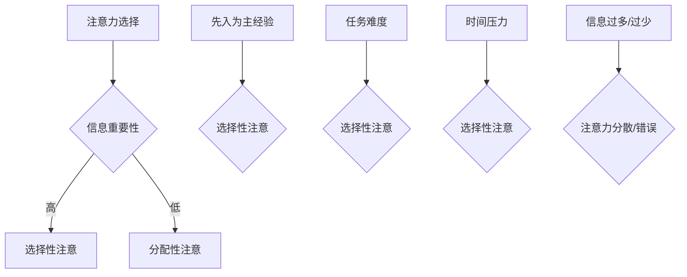

#### 注意力机制的应用案例

1. **教育领域**：教育工作者可以利用注意力机制，设计更加有效的教学策略，如集中学生的注意力，提高课堂教学效果。

2. **工作领域**：在多任务处理的工作环境中，管理者可以利用注意力机制，合理安排工作任务，提高工作效率。

3. **人工智能领域**：人工智能系统可以利用注意力机制，设计更加智能的信息处理和决策系统，提高系统的性能和可靠性。

### 1.2.2 记忆与遗忘

记忆是认知过程中的核心部分，包括瞬时记忆、短时记忆和长时记忆。遗忘是记忆的一个自然现象，受到多种因素的影响。

#### 瞬时记忆

瞬时记忆是指对刚刚接收到的信息进行短暂存储和保持的能力。瞬时记忆的容量有限，通常只能保持几秒钟的信息。

1. **瞬时记忆的特点**：
   - 容量有限：研究表明，瞬时记忆的容量大约为4个信息单元，但存在个体差异。
   - 存储时间短暂：瞬时记忆的信息存储时间通常为2-4秒，但也有研究表明，存储时间可能更长。

2. **瞬时记忆的应用**：瞬时记忆在许多认知任务中起着重要作用，如快速识别物体、快速反应等。

#### 短时记忆

短时记忆是指对信息进行短期存储和保持的能力，通常可以保持几十秒到几分钟。短时记忆的容量也有限，一般为7±2个信息单元。

1. **短时记忆的特点**：
   - 容量有限：短时记忆的容量约为7±2个信息单元，但可以通过组块化（chunking）提高记忆容量。
   - 存储时间有限：短时记忆的信息存储时间通常为5-30秒，但也有研究表明，存储时间可能更长。

2. **短时记忆的应用**：短时记忆在许多日常任务中起着重要作用，如电话号码的记忆、单词的记忆等。

#### 长时记忆

长时记忆是指对信息进行长期存储和保持的能力，可以保持数小时、数天甚至数十年。长时记忆包括陈述性记忆和程序性记忆两种类型。

1. **长时记忆的特点**：
   - 陈述性记忆：指对事实性信息的记忆，如历史事件、事实等。
   - 程序性记忆：指对技能和规则的记忆，如骑自行车、弹钢琴等。

2. **长时记忆的应用**：长时记忆在学习和记忆中起着关键作用，如知识积累、技能掌握等。

#### 遗忘

遗忘是记忆的自然现象，受到多种因素的影响，如干扰、重复、情感状态等。

1. **遗忘的原因**：
   - 干扰遗忘：新信息的干扰导致旧信息的遗忘。
   - 遗忘曲线：遗忘的速度随时间呈指数衰减，但存在个体差异。

2. **遗忘的应对策略**：
   - 重复练习：通过反复练习，可以提高记忆效果。
   - 有意回忆：通过有意回忆，可以加强记忆。

#### 记忆机制的核心概念图解

下面是一个记忆机制的核心概念Mermaid流程图：

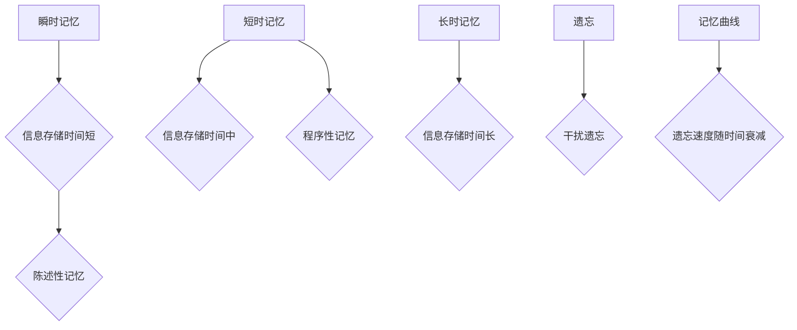

#### 记忆与遗忘的应用案例

1. **教育领域**：教师可以利用记忆与遗忘的原理，设计有效的记忆策略，提高学生的学习效果。

2. **工作领域**：员工可以通过记忆与遗忘的原理，提高工作和技能的记忆效率。

3. **人工智能领域**：人工智能系统可以利用记忆与遗忘的原理，设计更加智能的信息存储和提取系统。

### 1.2.3 问题解决与决策

问题解决和决策是认知过程中的高级功能，涉及到问题的识别、策略的选择、解决方案的执行等多个阶段。

#### 问题解决的过程

问题解决通常包括以下几个阶段：

1. **问题识别**：识别问题的存在和性质。这需要个体能够理解问题的现状和目标状态，明确问题的解决方向。

2. **信息收集**：收集与问题相关的信息。信息收集有助于个体更好地理解问题，找到可能的解决方案。

3. **策略选择**：选择解决问题的策略。策略选择包括直觉思维和规则思维两种方式。

   - **直觉思维**：基于经验、直觉和本能进行问题解决的方式。直觉思维在许多情况下是有效的，但也可能导致错误。
   - **规则思维**：基于规则和逻辑进行问题解决的方式。规则思维在解决结构性问题时具有较高的效率，但可能缺乏灵活性。

4. **方案执行**：执行解决问题的方案。方案执行包括执行具体的行动步骤，以及监控和调整行动过程。

5. **反馈评估**：评估解决方案的有效性。通过反馈评估，个体可以了解解决方案的效果，为未来的问题解决提供参考。

#### 问题解决的策略

问题解决的策略可以分为直觉思维和规则思维两种。

1. **直觉思维**：直觉思维是基于经验和直觉进行问题解决的方式。直觉思维通常不需要详细的推理过程，而是依赖于个体的直觉和经验。直觉思维在许多情况下是有效的，例如快速识别问题、快速做出决策等。

2. **规则思维**：规则思维是基于规则和逻辑进行问题解决的方式。规则思维通常需要详细的推理过程，适用于解决结构性问题。规则思维在解决结构性问题时具有较高的效率，例如数学问题、逻辑问题等。

#### 决策过程

决策是人们在面对不确定性时，选择最佳行动方案的过程。决策通常包括以下几个阶段：

1. **识别问题**：识别决策问题的存在和性质。这需要个体能够理解问题的现状和目标状态，明确问题的解决方向。

2. **收集信息**：收集与决策相关的信息。信息收集有助于个体更好地理解问题，找到可能的解决方案。

3. **制定备选方案**：制定多个可能的行动方案。备选方案应该考虑不同情况下的可能性和效果。

4. **评估备选方案**：评估备选方案的风险和收益。评估时需要考虑不同方案的可能结果和后果。

5. **选择最佳方案**：选择最佳的行动方案。选择最佳方案时需要综合考虑各种因素，如风险、收益、可行性等。

#### 问题解决与决策的核心概念图解

下面是一个问题解决与决策的核心概念Mermaid流程图：

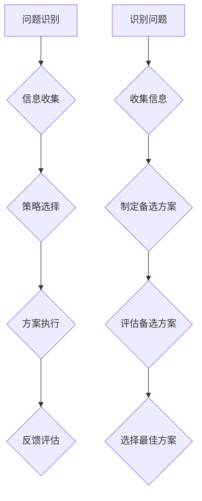

#### 问题解决与决策的应用案例

1. **教育领域**：教师可以利用问题解决与决策的原理，设计教学策略，培养学生的创新思维和决策能力。

2. **工作领域**：员工可以通过问题解决与决策的原理，提高工作中的决策效率和问题解决能力。

3. **人工智能领域**：人工智能系统可以利用问题解决与决策的原理，设计智能决策系统和问题解决算法。

### 1.2.4 认知心理学与人工智能

认知心理学为人工智能提供了丰富的理论资源和实验数据，帮助人工智能更好地模拟人类认知过程，实现更高效的问题解决和决策。

1. **认知心理学对人工智能的启示**：认知心理学研究人类认知过程的机制和特性，为人工智能的发展提供了重要的理论依据。例如，认知心理学中的注意力机制、记忆模型、问题解决策略等，都可以为人工智能的设计提供指导。

2. **人工智能对认知心理学的挑战**：人工智能的发展对认知心理学提出了新的挑战。例如，如何解释人工智能在认知任务中的表现，如何设计实验来验证人工智能的理论假设等。此外，人工智能的发展也促进了认知心理学研究方法的创新，如计算模型、脑成像技术等。

### 1.2.5 小结

认知过程中的基本原理包括注意力机制、记忆与遗忘、问题解决与决策。注意力机制决定了人们对外界信息的处理能力，记忆与遗忘是认知过程中的核心部分，问题解决与决策是认知过程中的高级功能。认知心理学与人工智能的交叉融合，为认知过程的研究提供了新的理论依据和方法。在接下来的章节中，我们将进一步探讨简单认知过程和复杂性认知过程的定义、特点以及它们在现实中的应用。

----------------------------------------------------------------

### 1.3 认知心理学与人工智能

#### 1.3.1 认知心理学对人工智能的启示

认知心理学为人工智能提供了丰富的理论资源和实验数据，帮助人工智能更好地模拟人类认知过程，实现更高效的问题解决和决策。

1. **注意力机制**：认知心理学研究表明，人类的注意力是有限的，过多或过少的信息都会对认知产生负面影响。人工智能可以借鉴这一原理，设计更加智能的注意力机制，提高信息处理的效率和准确性。

2. **记忆模型**：认知心理学中的记忆模型，如瞬时记忆、短时记忆和长时记忆，为人工智能设计记忆系统提供了重要参考。人工智能可以根据这些记忆模型，实现更加高效的信息存储和提取。

3. **问题解决策略**：认知心理学研究人类在问题解决过程中采用的不同策略，如直觉思维和规则思维。人工智能可以借鉴这些策略，设计更高效的问题解决算法，提高问题解决的灵活性和适应性。

#### 1.3.2 人工智能对认知心理学的挑战

人工智能的发展对认知心理学提出了新的挑战，如如何解释人工智能在认知任务中的表现，如何设计实验来验证人工智能的理论假设等。

1. **人工智能的表现**：人工智能在许多认知任务中表现出色，甚至超过了人类的平均水平。这要求认知心理学重新审视人类认知能力的本质，探讨人工智能在认知任务中的优势和局限性。

2. **实验设计**：人工智能的发展对认知心理学的实验设计提出了新的要求。例如，如何设计实验来验证人工智能的理论假设，如何控制实验中的复杂变量等。

3. **跨学科研究**：人工智能与认知心理学的融合，促进了跨学科研究的发展。这要求认知心理学家具备计算机科学、人工智能等领域的知识，开展更加综合的研究。

### 1.3.3 认知心理学与人工智能的融合

认知心理学与人工智能的融合是当前认知科学领域的前沿研究方向。这种融合不仅为认知心理学提供了新的研究方法，也为人工智能的发展提供了理论支持。

1. **认知计算**：认知计算是一种将认知心理学原理应用于人工智能的方法。通过模拟人类认知过程，认知计算可以实现更智能的问题解决和决策。

2. **智能辅助系统**：智能辅助系统是认知心理学与人工智能融合的典型应用。例如，智能助手、教育机器人等，它们可以模拟人类教师或专家的指导，帮助用户解决问题和进行学习。

3. **脑机接口**：脑机接口（Brain-Computer Interface, BCI）是一种通过直接连接大脑和计算机来传递信息的系统。认知心理学与脑机接口的结合，可以探索人类认知过程的神经基础，并开发出具有更高人机交互能力的智能系统。

### 1.3.4 小结

认知心理学与人工智能的融合为认知科学的发展提供了新的机遇和挑战。通过这种融合，认知心理学可以更好地理解人类认知过程的机制，而人工智能则可以借鉴认知心理学的理论和方法，实现更智能的问题解决和决策。在未来的研究中，认知心理学与人工智能的融合将继续推动认知科学的发展，为人类认知能力的研究和提升提供新的思路和方法。

----------------------------------------------------------------

## 2.1 感知与知觉

### 2.1.1 基本的感知机制

感知是认知过程的起点，是人类对外界环境信息的接收和解释过程。基本的感知机制包括感觉器官的接收、神经传递和大脑处理等环节。以下是感知机制的基本组成部分：

1. **感觉器官的接收**：感觉器官，如眼睛、耳朵、鼻子、舌头和皮肤等，负责接收外界环境的信息。例如，眼睛接收光信号，耳朵接收声音信号，鼻子接收气味信号，舌头接收味道信号，皮肤接收触觉信号。

2. **神经传递**：感觉器官接收到的信息通过神经纤维传递到大脑。这些神经纤维将感觉信息编码为电信号，以便在大脑中进行进一步处理。

3. **大脑处理**：大脑接收神经传递的电信号后，对其进行解码和处理。大脑的不同区域负责处理不同类型的感觉信息，如视觉皮层处理视觉信息，听觉皮层处理听觉信息。

#### 感知机制的核心概念图解

下面是一个感知机制的核心概念Mermaid流程图：

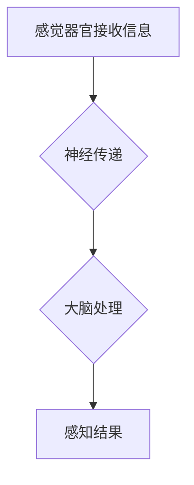

### 2.1.2 知觉的组织与解释

知觉是指人类对感知信息进行组织和解释的过程，是感知信息的更高层次处理。知觉不仅涉及对感觉信息的接收，还包括对信息的理解和解释。以下是知觉组织与解释的基本组成部分：

1. **信息整合**：知觉过程中，人类会整合来自不同感官的信息，形成一个统一的感知体验。例如，视觉和听觉信息可以整合，帮助人们更好地理解环境。

2. **选择性关注**：知觉过程中，人类会根据当前任务和兴趣，选择性地关注某些信息，而忽略其他信息。这种选择性关注有助于提高认知效率。

3. **预期与假设**：知觉过程中，人类会根据先前的经验和知识，对感知信息进行预期和假设。这种预期与假设有助于解释和理解感知信息。

#### 知觉组织与解释的核心概念图解

下面是一个知觉组织与解释的核心概念Mermaid流程图：

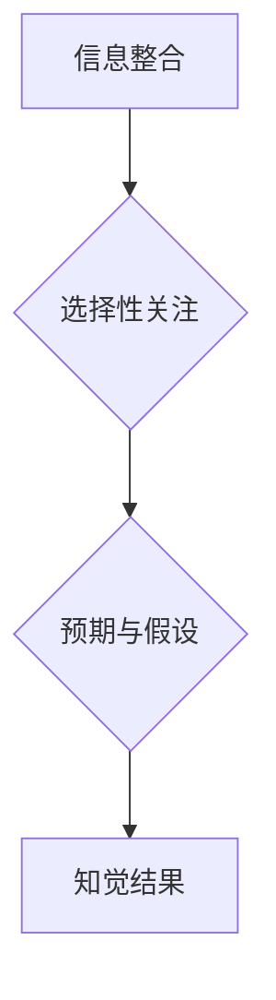

### 2.1.3 感知与知觉的偏差

感知与知觉的偏差是指由于多种因素导致的人类感知和解释信息的偏差。以下是感知与知觉的常见偏差：

1. **确认偏误**：人们倾向于寻找和关注支持自己观点的信息，而忽略与之相反的信息。

2. **锚定效应**：人们在进行判断和决策时，会受到最初信息（锚）的影响，即使这个锚是不相关的。

3. **感知错觉**：由于认知过程的局限，人们有时会对感知信息产生错误的解释，如视觉错觉、听觉错觉等。

#### 感知与知觉偏差的核心概念图解

下面是一个感知与知觉偏差的核心概念Mermaid流程图：

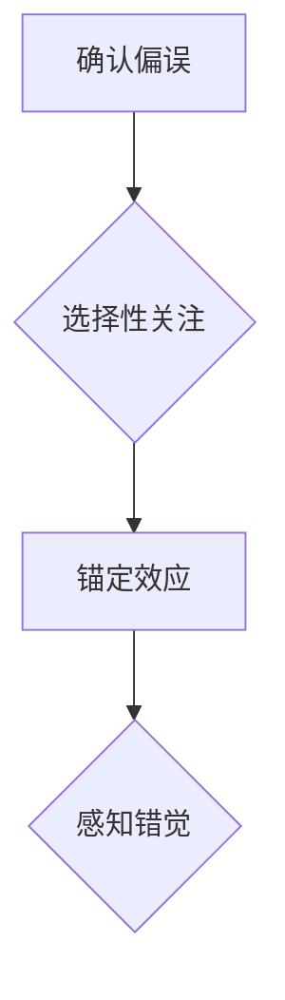

### 2.1.4 感知与知觉的应用

感知与知觉在许多领域具有重要应用，包括：

1. **教育领域**：教师可以利用感知与知觉的原理，设计更加有效的教学策略，如通过视觉、听觉等多种方式呈现信息，提高学生的注意力和理解能力。

2. **设计领域**：设计师可以利用感知与知觉的原理，设计更加人性化、易于使用的产品界面和用户体验。

3. **人工智能领域**：人工智能系统可以利用感知与知觉的原理，设计更加智能的感知和认知系统，如自动驾驶、智能助手等。

### 2.1.5 感知与知觉的实际案例

以下是感知与知觉在实际案例中的应用：

1. **视觉错觉**：著名的“贝斯勒错觉”（Besarillo illusion）展示了人类视觉系统的局限性。在这个错觉中，两条长度相同的线段，因为背景的影响，看起来长度不同。

2. **听觉错觉**：贝多芬的《第九交响曲》中，有一个著名的“鬼音”现象。当演奏时，人们可以在特定的座位上听到额外的声音，这是由声波干涉和回声造成的。

3. **教育应用**：在英语学习中，通过使用视觉和听觉材料，如图片、音频和视频，可以帮助学生更好地理解和记忆英语单词和句子。

### 2.1.6 小结

感知与知觉是认知过程中的关键环节，涉及信息的接收、处理和解释。理解感知与知觉的基本机制和偏差，有助于我们更好地设计和优化认知系统，提高信息处理的效率和准确性。在接下来的章节中，我们将探讨初始认知过程，包括注意力的选择性、初始记忆与工作记忆以及知觉记忆与回忆。

----------------------------------------------------------------

## 2.2 初始认知过程

### 2.2.1 注意力的选择性

注意力的选择性是初始认知过程的关键环节，决定了人们如何从大量信息中筛选出关键信息。注意力选择性的机制涉及感知、认知和行为等多个层面，其核心在于如何在信息过载的环境中有效聚焦。

1. **感知层面的选择性**：在感知层面，人们通过生理和心理机制对信息进行筛选。例如，当我们在嘈杂的环境中，只听到感兴趣的声音，而忽略其他声音。这种现象称为“感知选择”。

2. **认知层面的选择性**：在认知层面，人们根据任务目标和先前的经验对信息进行筛选。例如，当我们在寻找特定物品时，可能会忽略其他不相关的物品。这种现象称为“认知选择”。

3. **行为层面的选择性**：在行为层面，人们通过行动选择关注点。例如，在紧急情况下，人们可能会快速作出决策，忽略其他潜在信息。这种现象称为“行为选择”。

#### 注意力选择性的核心概念图解

下面是一个注意力选择性的核心概念Mermaid流程图：


#### 注意力选择性的应用

1. **教育领域**：教师可以通过设计聚焦教学目标的活动，引导学生注意力的选择性，提高学习效果。

2. **工作领域**：在多任务处理的环境中，员工可以通过优化注意力选择，提高工作效率。

3. **人工智能领域**：人工智能系统可以通过模拟注意力选择性，设计更智能的信息处理和决策系统。

### 2.2.2 初始记忆与工作记忆

初始记忆与工作记忆是认知过程中的两个重要环节，分别负责信息的短期存储和处理。初始记忆是指对刚接收到的信息进行短暂存储的能力，而工作记忆则是指对信息进行短期存储和处理的能力。

1. **初始记忆**：初始记忆通常能够保持几秒到几十秒的信息。它类似于一个缓冲区，用于临时存储从感官接收到的信息。初始记忆的容量有限，一般为4-5个信息单元。

2. **工作记忆**：工作记忆能够保持数十秒到数分钟的信息，是认知过程中的核心。工作记忆不仅存储信息，还涉及信息处理和整合。工作记忆的容量也有限，通常为7±2个信息单元，但可以通过组块化（chunking）提高。

#### 初始记忆与工作记忆的核心概念图解

下面是一个初始记忆与工作记忆的核心概念Mermaid流程图：

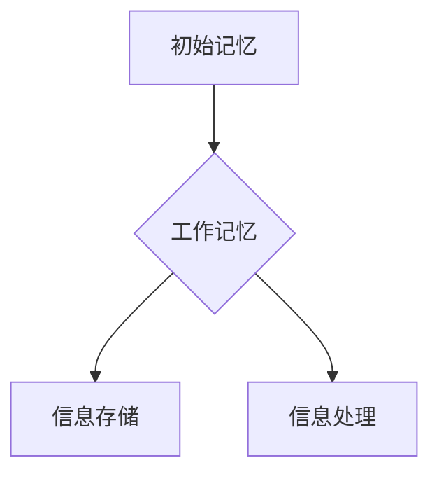

#### 初始记忆与工作记忆的应用

1. **教育领域**：教师可以通过设计练习活动，提高学生的初始记忆和工作记忆能力，从而提高学习效果。

2. **工作领域**：员工可以通过训练提高自己的工作记忆能力，从而在多任务处理中表现更出色。

3. **人工智能领域**：人工智能系统可以通过模拟初始记忆和工作记忆，设计更高效的信息处理系统。

### 2.2.3 知觉记忆与回忆

知觉记忆与回忆是认知过程中的关键环节，涉及对感知信息的长期存储和提取。知觉记忆是指对感知信息进行短期存储的能力，而回忆是指从记忆中提取信息的过程。

1. **知觉记忆**：知觉记忆是对刚刚感知到的信息的短期存储，类似于初始记忆。它与工作记忆紧密相关，能够在短时间内保持信息。

2. **回忆**：回忆是指从记忆中提取信息的过程。它不仅涉及信息的提取，还涉及信息检索的策略和技巧。回忆受多种因素影响，如记忆的时间、干扰、重复和情感状态。

#### 知觉记忆与回忆的核心概念图解

下面是一个知觉记忆与回忆的核心概念Mermaid流程图：

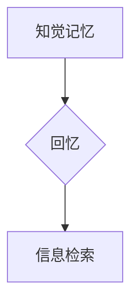

#### 知觉记忆与回忆的应用

1. **教育领域**：教师可以通过设计记忆训练活动，帮助学生提高知觉记忆和回忆能力，从而提高学习效果。

2. **工作领域**：员工可以通过记忆训练，提高工作效率和准确性。

3. **人工智能领域**：人工智能系统可以通过模拟知觉记忆和回忆，设计更智能的信息存储和检索系统。

### 2.2.4 小结

初始认知过程是认知过程的起点，涉及注意力的选择性、初始记忆与工作记忆以及知觉记忆与回忆。理解这些核心概念，有助于我们更好地优化认知系统，提高信息处理效率和准确性。在接下来的章节中，我们将探讨简单问题解决，包括直觉思维、规则思维以及简单问题解决策略。

----------------------------------------------------------------

## 2.3 简单问题解决

### 2.3.1 直觉思维

直觉思维是问题解决过程中的一种重要方式，它是指个体在不需要明确逻辑推理的情况下，依靠经验和直觉快速作出决策。直觉思维在许多日常任务中发挥着重要作用，如导航、社交互动、应急响应等。

#### 直觉思维的核心概念

1. **快速性**：直觉思维通常是一种快速的反应，个体在短时间内就能作出决策。
2. **高效性**：直觉思维能够迅速处理大量信息，避免复杂的逻辑推理过程。
3. **依赖经验**：直觉思维依赖于个体的经验和先前的知识，这些经验有助于快速识别问题和选择解决方案。

#### 直觉思维的工作原理

直觉思维的工作原理包括以下步骤：

1. **问题识别**：个体快速识别问题的本质。
2. **模式匹配**：个体将当前问题与记忆中的经验进行匹配，寻找类似的问题解决方案。
3. **决策生成**：个体基于匹配的结果，快速生成一个或多个可能的解决方案。
4. **方案评估**：个体快速评估解决方案的可行性，并选择最合适的方案。

#### 直觉思维的核心概念图解

下面是一个直觉思维的核心概念Mermaid流程图：


#### 直觉思维的应用

直觉思维在许多领域有着广泛的应用：

1. **军事与应急响应**：在紧急情况下，直觉思维有助于快速作出决策，如消防员在火灾中迅速判断最佳逃生路线。
2. **日常生活**：在购物、烹饪、驾驶等活动中，直觉思维有助于快速决策，提高效率。
3. **人工智能**：人工智能系统可以模拟直觉思维，提高问题解决的效率，如自动驾驶汽车在复杂路况中的决策。

### 2.3.2 规则思维

规则思维是问题解决过程中的一种方式，它依赖于明确的逻辑规则和步骤。与直觉思维不同，规则思维是一种有意识、有计划的思维过程，适用于解决结构性问题和遵循特定规则的任务。

#### 规则思维的核心概念

1. **逻辑性**：规则思维依赖于逻辑推理和明确规则，确保每个步骤都是合理和有依据的。
2. **系统性**：规则思维按照既定的步骤和规则进行，通常包括定义问题、列出可能的解决方案、评估解决方案等。
3. **可预测性**：规则思维的结果是可预测的，遵循规则和步骤，确保问题得到有效解决。

#### 规则思维的工作原理

规则思维的工作原理包括以下步骤：

1. **问题定义**：明确问题的本质和目标。
2. **解决方案生成**：列出所有可能的解决方案。
3. **解决方案评估**：评估每个解决方案的可行性、有效性和成本。
4. **决策**：根据评估结果，选择最佳的解决方案。
5. **实施与验证**：执行解决方案，并对结果进行验证。

#### 规则思维的核心概念图解

下面是一个规则思维的核心概念Mermaid流程图：


#### 规则思维的应用

规则思维在以下领域有着广泛应用：

1. **科学研究**：在科学研究中，规则思维有助于系统地分析问题，提出假设和验证结果。
2. **工程设计**：在工程设计中，规则思维有助于遵循规范和标准，确保设计的可靠性和安全性。
3. **法律与医学**：在法律和医学领域，规则思维有助于遵循法律和医学规范，确保决策的合理性和合法性。

### 2.3.3 简单问题解决策略

简单问题解决策略是指用于解决日常生活中常见问题的方法，通常包括直觉思维和规则思维。以下是一些常见的问题解决策略：

1. **试错法**：通过不断尝试和错误，逐步找到解决问题的方法。这种方法适用于问题相对简单、可以容忍多次错误的情况。

2. **启发式搜索**：基于经验和直觉，快速选择可能的解决方案，并逐步调整和优化。这种方法适用于问题复杂，但存在一些可用的解决方案的情况。

3. **模式识别**：通过识别问题和解决方案之间的模式，快速找到解决问题的方法。这种方法适用于问题具有相似性或重复性的情况。

#### 简单问题解决策略的核心概念图解

下面是一个简单问题解决策略的核心概念Mermaid流程图：

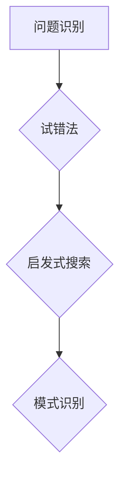

#### 简单问题解决策略的应用

简单问题解决策略在以下领域有着广泛应用：

1. **个人生活**：在日常生活中，如忘记带钥匙、找不到物品等情况下，简单问题解决策略有助于快速解决问题。

2. **工作领域**：在工作中，如遇到小故障或突发事件时，简单问题解决策略有助于快速恢复工作。

3. **教育领域**：在教育中，教师可以通过教授简单问题解决策略，帮助学生提高解决问题的能力。

### 2.3.4 小结

简单问题解决是日常生活中的重要技能，包括直觉思维、规则思维以及简单问题解决策略。理解这些策略和方法，有助于我们更有效地解决常见问题，提高生活质量。在接下来的章节中，我们将探讨复杂性认知过程，包括复杂认知过程的概念、高级认知功能和复杂问题解决。

----------------------------------------------------------------

## 3.1 复杂认知过程的概念

### 3.1.1 复杂认知的定义

复杂认知是指涉及多个认知功能，需要处理复杂信息的能力。与简单认知相比，复杂认知具有以下几个特点：

1. **信息处理量大**：复杂认知通常涉及大量的信息处理，这些信息可能来自不同的来源，需要整合和分析。

2. **认知资源需求高**：复杂认知需要更高的认知资源，包括注意力、记忆、推理等。

3. **认知策略复杂**：复杂认知通常需要多种认知策略和方法的结合，以应对不同类型的复杂问题。

4. **时间需求长**：复杂认知过程通常需要更多的时间，因为需要仔细分析和评估各种可能性。

5. **灵活性要求高**：复杂认知过程需要灵活调整认知策略，以适应不断变化的问题情境。

### 3.1.2 复杂性认知的特点

复杂性认知的特点包括：

1. **认知多样性**：复杂认知过程涉及多种认知功能，如感知、记忆、思维、语言等。

2. **认知负荷高**：复杂认知过程通常需要处理大量的信息，导致认知负荷增加。

3. **认知灵活性**：复杂认知过程需要灵活调整认知策略，以适应不同的问题情境。

4. **认知复杂性**：复杂认知过程通常涉及复杂的逻辑关系和推理过程。

5. **认知连续性**：复杂认知过程不是一次性的，而是一个连续的过程，需要不断调整和优化认知策略。

### 3.1.3 复杂认知的重要性

复杂认知在许多现实问题中具有重要意义：

1. **决策制定**：在商业、政治、医疗等领域，复杂认知能力有助于制定有效的决策。

2. **创新思维**：复杂认知能力有助于产生新的想法和解决方案，推动科学和技术进步。

3. **问题解决**：复杂认知能力有助于解决复杂、多变的现实问题。

4. **学习与教育**：复杂认知能力是学习新知识和技能的关键，有助于个体适应不断变化的环境。

### 3.1.4 复杂认知的核心概念图解

下面是一个复杂认知的核心概念Mermaid流程图：

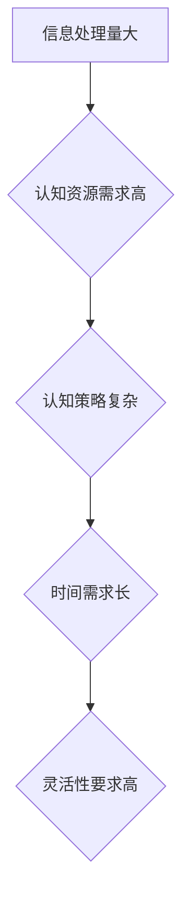

### 3.1.5 复杂认知的应用案例

复杂性认知在以下领域有广泛应用：

1. **科学研究**：在科学研究中，复杂认知能力有助于处理大量实验数据，发现新的科学规律。

2. **医疗诊断**：在医疗诊断中，复杂认知能力有助于分析复杂的病例信息，制定有效的治疗方案。

3. **工程设计**：在工程设计中，复杂认知能力有助于处理复杂的工程问题，确保工程设计的可靠性和安全性。

4. **商业战略**：在商业战略中，复杂认知能力有助于分析市场数据，制定有效的商业策略。

### 3.1.6 小结

复杂认知是认知过程中的一个重要方面，涉及多个认知功能，需要处理复杂信息。理解复杂认知的概念和特点，有助于我们更好地应对复杂问题，提高认知能力和解决问题的效率。在接下来的章节中，我们将进一步探讨高级认知功能，包括复合推理、创造性思维和元认知。

----------------------------------------------------------------

### 3.2 高级认知功能

#### 3.2.1 复合推理

复合推理是指涉及多个认知功能的推理过程，包括感知、记忆、思维、语言等。复合推理在复杂问题解决中具有重要意义。

1. **定义**：复合推理是指在一个推理过程中，同时涉及多个认知功能，如感知信息、记忆事实、思维逻辑和语言表达。

2. **特点**：
   - **复杂性**：复合推理通常涉及大量的信息和认知资源，需要协调不同的认知功能。
   - **动态性**：复合推理是一个动态变化的过程，需要不断调整和优化推理策略。

3. **应用**：复合推理广泛应用于各种复杂任务，如决策制定、问题解决、创新思维等。

#### 复合推理的工作原理

复合推理的工作原理包括以下几个步骤：

1. **信息收集**：收集与问题相关的信息，包括感知信息、记忆事实等。

2. **信息整合**：整合不同来源的信息，形成一个统一的认知框架。

3. **逻辑推理**：运用逻辑规则，对信息进行推理，形成初步结论。

4. **验证与调整**：验证推理结果，根据反馈进行调整和优化。

#### 复合推理的核心概念图解

下面是一个复合推理的核心概念Mermaid流程图：

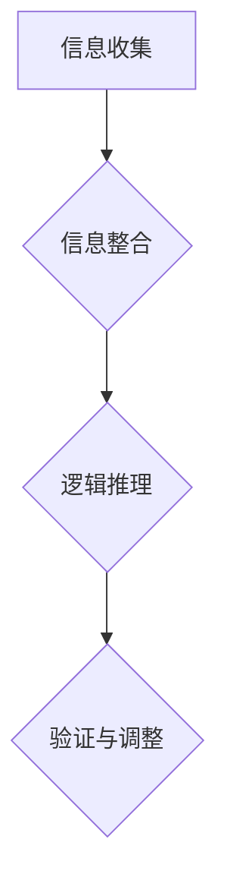

#### 复合推理的应用案例

1. **科学研究**：在科学研究中，复合推理有助于整合不同实验数据，发现新的科学规律。

2. **工程设计**：在工程设计中，复合推理有助于分析复杂的工程问题，确保设计的可靠性和安全性。

3. **商业决策**：在商业决策中，复合推理有助于分析市场信息，制定有效的商业策略。

### 3.2.2 创造性思维

创造性思维是指产生新想法、新观点和新解决方案的能力。创造性思维是人类认知功能的重要组成部分，对于科学创新、艺术创作和问题解决具有重要意义。

1. **定义**：创造性思维是指通过创新的思维方式，产生新颖和有价值的想法和解决方案。

2. **特点**：
   - **开放性**：创造性思维鼓励开放和多样的思维方式，不受传统观念的限制。
   - **灵活性**：创造性思维能够灵活调整思维策略，适应不同的情境和问题。
   - **综合性**：创造性思维通常涉及多种认知功能的综合运用，如感知、记忆、思维、语言等。

3. **应用**：创造性思维广泛应用于科学、艺术、商业、教育等领域。

#### 创造性思维的工作原理

创造性思维的工作原理包括以下几个步骤：

1. **问题识别**：识别需要解决的问题或机会。

2. **信息收集**：收集与问题相关的信息，包括事实、数据、观点等。

3. **思维发散**：通过发散性思维，产生多种可能的解决方案。

4. **思维收敛**：对发散性思维的结果进行筛选和评估，选择最佳解决方案。

5. **反馈与调整**：根据反馈，对解决方案进行调整和优化。

#### 创造性思维的核心概念图解

下面是一个创造性思维的核心概念Mermaid流程图：


#### 创造性思维的应用案例

1. **科学研究**：在科学研究中，创造性思维有助于提出新的研究假设和实验设计。

2. **艺术创作**：在艺术创作中，创造性思维有助于产生新颖的艺术作品和表现手法。

3. **商业创新**：在商业创新中，创造性思维有助于开发新产品、拓展新市场。

### 3.2.3 元认知

元认知是指对自己认知过程的理解和控制能力。元认知对于认知过程的优化和效率具有重要意义。

1. **定义**：元认知是指个体对自己认知过程的认识和控制能力，包括认知过程的知识、自我监控、自我评估和自我调节。

2. **特点**：
   - **自我反思**：元认知涉及个体对自己的认知活动进行反思和评估。
   - **自我调节**：元认知能力可以帮助个体根据认知活动的反馈，调整和优化认知策略。

3. **应用**：元认知在教育和工作中具有重要意义，有助于提高学习效果和工作效率。

#### 元认知的工作原理

元认知的工作原理包括以下几个步骤：

1. **自我监控**：个体对自身的认知过程进行监控，包括注意力的分配、记忆的使用等。

2. **自我评估**：个体对认知结果进行评估，识别认知活动的优势和不足。

3. **自我调节**：根据自我评估的结果，个体调整认知策略，提高认知效率。

#### 元认知的核心概念图解

下面是一个元认知的核心概念Mermaid流程图：


#### 元认知的应用案例

1. **教育**：在教学中，教师可以通过元认知训练，提高学生的学习效果和自我管理能力。

2. **工作**：在职场中，员工可以通过元认知训练，提高工作效率和问题解决能力。

3. **人工智能**：在人工智能领域，元认知可以帮助智能系统优化自己的学习和决策过程。

### 3.2.4 小结

高级认知功能包括复合推理、创造性思维和元认知，这些功能在复杂问题解决中起着关键作用。理解高级认知功能的概念和工作原理，有助于我们更好地应对复杂问题，提高认知能力和解决问题的效率。在接下来的章节中，我们将探讨复杂问题解决，包括复杂问题解决策略和高级问题解决案例分析。

----------------------------------------------------------------

### 3.3 复杂问题解决

#### 3.3.1 复杂问题解决策略

复杂问题解决策略是指用于解决复杂问题的方法和步骤。复杂问题通常涉及多个变量和不确定性，需要综合运用各种认知功能，如感知、记忆、思维和语言。以下是几种常见的复杂问题解决策略：

1. **分解法**：将复杂问题分解成若干个更小、更易于解决的问题，逐步解决每个子问题，从而解决整体问题。

   ```mermaid
   graph TD
   A[复杂问题] --> B[分解成子问题]
   B --> C[解决子问题]
   C --> D[整合解决方案]
   ```

2. **综合法**：将不同领域或不同方面的信息整合在一起，形成一个整体的解决方案。

   ```mermaid
   graph TD
   A[多领域信息] --> B[整合信息]
   B --> C[形成整体解决方案]
   ```

3. **假设-检验法**：提出一个或多个假设，通过实验或观察来验证假设，并根据验证结果调整和优化假设。

   ```mermaid
   graph TD
   A[提出假设] --> B[验证假设]
   B --> C{调整假设}
   C --> D[优化解决方案]
   ```

4. **迭代法**：通过不断迭代和优化，逐步改进问题解决方案。

   ```mermaid
   graph TD
   A[初始解决方案] --> B[迭代优化]
   B --> C[最终解决方案]
   ```

#### 3.3.2 高级问题解决案例分析

以下是一个高级问题解决案例，用于诊断和治疗癌症。

1. **问题识别**：癌症是一种复杂的疾病，需要诊断和治疗方案。

2. **信息收集**：收集患者的医疗历史、家族病史、体征和症状等。

3. **假设-检验法**：
   - **提出假设**：根据患者的症状和体征，提出可能的癌症类型和治疗方案。
   - **验证假设**：通过实验室检查、影像学检查等验证假设。

4. **综合法**：整合各种检查结果，制定个性化的治疗方案。

5. **迭代法**：根据治疗效果和患者反馈，不断调整治疗方案，优化治疗效果。

#### 3.3.3 小结

复杂问题解决策略是解决复杂问题的重要方法，包括分解法、综合法、假设-检验法和迭代法。高级问题解决案例分析展示了复杂问题解决的实际应用。通过理解复杂问题解决策略，我们可以更有效地解决各种复杂问题，提高认知能力和解决问题的效率。

----------------------------------------------------------------

### 4.1 简单认知过程与复杂性认知过程的转换

#### 4.1.1 认知过程的动态特性

认知过程是一个动态变化的系统，简单认知过程和复杂性认知过程之间存在相互转换。简单认知过程通常是指处理相对简单、结构化问题的方式，而复杂性认知过程则涉及处理复杂、不确定的问题。

1. **动态变化的定义**：动态变化是指认知过程随着时间、环境、任务等因素的变化而发生的调整和变化。

2. **简单认知过程与复杂性认知过程的转换**：
   - **任务复杂度**：当任务复杂度增加时，个体可能需要从简单认知过程转向复杂性认知过程，以处理更多的信息和处理更复杂的任务。
   - **认知负荷**：当认知负荷增加时，个体可能需要调整认知策略，从复杂性认知过程转向简单认知过程，以减轻认知负担。
   - **环境变化**：当环境发生变化时，个体可能需要重新评估和调整认知策略，以适应新的环境。

#### 4.1.2 简单认知向复杂性认知的过渡

简单认知向复杂性认知的过渡受到多种因素的影响，包括认知负荷、环境因素、任务特征等。

1. **认知负荷**：认知负荷是指个体在认知过程中需要处理的任务量和信息量。当认知负荷较低时，个体可能倾向于使用简单认知过程，因为这种方法可以更快地处理信息。然而，当认知负荷增加时，个体可能需要转向复杂性认知过程，以处理更多的信息和更复杂的任务。

2. **环境因素**：环境因素，如任务环境的变化、时间压力、资源限制等，会影响认知过程的选择。例如，在紧急情况下，个体可能需要快速做出决策，这通常涉及简单认知过程。然而，在复杂环境中，个体可能需要更长时间的思考和更复杂的认知过程。

3. **任务特征**：任务特征，如任务的复杂度、不确定性和可预测性等，也会影响认知过程的选择。例如，当任务具有高复杂度和不确定性时，个体可能需要使用复杂性认知过程，以处理更多的信息和应对不确定的情况。

#### 4.1.3 简单认知向复杂性认知过渡的核心概念图解

下面是一个简单认知向复杂性认知过渡的核心概念Mermaid流程图：


#### 4.1.4 小结

认知过程的动态特性决定了简单认知过程和复杂性认知过程之间的转换。了解这些转换的机制和影响因素，有助于我们更好地理解和应对复杂问题，提高认知能力和解决问题的效率。

----------------------------------------------------------------

### 4.2 影响简单与复杂性认知过程变化的因素

#### 4.2.1 认知负荷与认知资源

认知负荷是指个体在认知过程中需要处理的任务量和信息量。认知资源是指个体在认知过程中可以用来处理信息和解决问题的心理资源，包括注意力、记忆、计算能力等。认知负荷与认知资源的相互作用对认知过程的变化具有重要影响。

1. **认知负荷的影响**：
   - **高认知负荷**：当认知负荷较高时，个体可能需要从复杂性认知过程转向简单认知过程，以减轻认知负担。这是因为高认知负荷会导致注意力的分散和信息处理的困难，使得个体无法有效地处理复杂的信息。
   - **低认知负荷**：当认知负荷较低时，个体可能更倾向于使用复杂性认知过程，因为这种方法可以更好地处理复杂的信息和任务。

2. **认知资源的影响**：
   - **认知资源充足**：当认知资源充足时，个体可以更好地处理复杂的信息和任务，因为资源可以用于复杂的认知操作和决策。
   - **认知资源有限**：当认知资源有限时，个体可能需要从复杂性认知过程转向简单认知过程，以更有效地利用有限的资源。

#### 4.2.2 环境因素

环境因素是影响简单与复杂性认知过程变化的重要因素。环境因素包括任务环境、社会环境和文化环境等。

1. **任务环境**：
   - **简单任务环境**：在简单任务环境中，个体可能更倾向于使用简单认知过程，因为这些任务通常具有较低的信息量和结构化程度。
   - **复杂任务环境**：在复杂任务环境中，个体可能需要使用复杂性认知过程，因为这些任务通常涉及大量的信息和不确定性。

2. **社会环境**：
   - **支持性社会环境**：在支持性社会环境中，个体可能更愿意使用复杂性认知过程，因为可以获得他人的帮助和支持，减轻认知负担。
   - **压力性社会环境**：在压力性社会环境中，个体可能需要从复杂性认知过程转向简单认知过程，以快速做出决策和应对压力。

3. **文化环境**：
   - **高结构化文化**：在高结构化文化中，个体可能更倾向于使用简单认知过程，因为这些文化通常强调规则和标准，提供清晰的行为指南。
   - **低结构化文化**：在低结构化文化中，个体可能更倾向于使用复杂性认知过程，因为这些文化通常强调创新和灵活性，鼓励个体在面对不确定性时采用复杂的认知策略。

#### 4.2.3 发展因素

发展因素是影响简单与复杂性认知过程变化的重要因素，包括年龄、经验和教育等。

1. **年龄**：
   - **儿童**：儿童通常在处理简单认知任务时表现出色，但随着年龄的增长，他们逐渐发展出处理复杂认知任务的能力。
   - **成年人**：成年人在处理复杂认知任务时通常表现出较高的能力，但可能会受到认知负荷和资源限制的影响。

2. **经验**：
   - **专业知识**：拥有专业知识的人可能在处理复杂认知任务时表现更好，因为他们拥有丰富的信息处理经验和认知策略。
   - **实践经验**：实践经验可以增强个体的认知能力，使其更擅长处理复杂的信息和任务。

3. **教育**：
   - **教育资源**：良好的教育资源可以提供个体更多的认知工具和策略，提高其处理复杂认知任务的能力。
   - **教育水平**：较高的教育水平通常与更复杂的认知能力相关，因为教育过程通常涉及复杂问题的分析和解决。

#### 4.2.4 小结

认知负荷、认知资源、环境因素和发展因素是影响简单与复杂性认知过程变化的重要因素。理解这些因素的作用和相互关系，有助于我们更好地设计和优化认知过程，提高认知能力和解决问题的效率。

----------------------------------------------------------------

### 4.3 认知过程中的适应性与灵活性

#### 4.3.1 认知适应性的概念

认知适应性是指个体在面对不同环境和任务时，调整和优化认知过程的能力。认知适应性是个体适应性和认知能力的重要组成部分，对于应对复杂和多变的现实环境具有重要意义。

1. **定义**：认知适应性是指个体在认知过程中，根据环境和任务的变化，灵活调整认知策略和资源利用的能力。

2. **特点**：
   - **灵活性**：认知适应性强调个体能够灵活调整认知策略，以适应不同的环境和任务。
   - **动态性**：认知适应性是一个动态变化的过程，个体需要不断评估和调整自己的认知过程。
   - **适应性**：认知适应性使个体能够更好地适应新的环境和任务，提高认知效率和效果。

3. **应用**：认知适应性在许多领域具有重要意义，包括教育、工作、医疗和人工智能等。

#### 4.3.2 认知灵活性的表现

认知灵活性是指个体在认知过程中，能够快速适应不同情境，灵活调整认知策略的能力。以下是认知灵活性的几个表现：

1. **任务切换**：在多任务环境中，个体能够迅速切换注意力，从一项任务转移到另一项任务。

2. **问题解决**：在面临新问题时，个体能够灵活应用不同的认知策略，寻找多种可能的解决方案。

3. **创新思维**：在创造性思维过程中，个体能够灵活运用各种联想和想象，产生新颖的想法和解决方案。

4. **适应变化**：在环境或任务发生变化时，个体能够迅速适应，调整自己的认知策略和资源利用。

#### 4.3.3 认知适应性的核心概念图解

下面是一个认知适应性的核心概念Mermaid流程图：

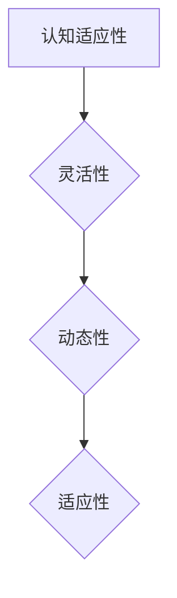

#### 4.3.4 认知适应性在实际应用中的案例

1. **教育领域**：教师可以通过设计多样化的教学活动和任务，培养学生的认知适应性，提高学生的自主学习能力和适应新环境的能力。

2. **工作领域**：员工在面对复杂和多变的任务时，需要具备良好的认知适应性，以快速调整认知策略，提高工作效率和问题解决能力。

3. **医疗领域**：医生在临床工作中需要根据患者的不同病情和变化，灵活调整治疗方案，提高治疗效果。

4. **人工智能领域**：人工智能系统在处理复杂任务和面对新问题时，需要具备良好的认知适应性，以提高系统的灵活性和自主性。

#### 4.3.5 小结

认知适应性和认知灵活性是个体在面对不同环境和任务时，调整和优化认知过程的重要能力。通过培养认知适应性和灵活性，个体可以提高认知效率，更好地应对复杂和多变的现实环境。在接下来的章节中，我们将探讨认知过程的测量与应用，以及认知科学领域的前沿与趋势。

----------------------------------------------------------------

## 5.1 认知过程的测量方法

### 5.1.1 实验设计

实验设计是认知过程测量的重要方法，通过精心设计的实验，研究者可以操控自变量、控制无关变量，从而精确测量认知过程的各个方面。

1. **实验设计的核心概念**：实验设计包括以下几个核心概念：
   - **自变量**：研究者需要操控的变量，以观察其对认知过程的影响。
   - **因变量**：研究者需要测量的变量，以评估自变量的效果。
   - **无关变量**：研究者需要控制的变量，以避免其对因变量的干扰。

2. **实验设计的类型**：实验设计可以分为以下几种类型：
   - **实验室实验**：在受控的实验室环境中，研究者可以精确操控自变量和无关变量，进行认知过程的测量。
   - **现场实验**：在自然环境中进行实验，观察个体在真实情境中的认知表现。

3. **实验设计的关键步骤**：
   - **确定研究问题**：明确研究目标和问题，确定自变量和因变量。
   - **设计实验任务**：设计符合研究目标的实验任务，确保任务的难度和复杂性适宜。
   - **操控自变量**：通过实验任务的设计，精确操控自变量，以观察其对认知过程的影响。
   - **控制无关变量**：通过实验设置和控制，减少无关变量对因变量的干扰。
   - **数据收集与处理**：收集实验数据，并进行统计分析，以验证研究假设。

#### 5.1.2 心理测量工具

心理测量工具是认知过程测量的常用方法，通过标准化的测量工具，研究者可以评估个体的认知能力、个性特征、心理健康等。

1. **心理测量工具的类型**：
   - **认知测验**：测量个体的认知能力，如记忆、注意力、推理、空间能力等。
   - **人格测验**：测量个体的个性特征，如性格类型、情绪稳定性、外向性等。
   - **心理健康测验**：测量个体的心理健康状况，如焦虑、抑郁、心理压力等。

2. **心理测量工具的核心概念**：
   - **信度**：测量工具的一致性和可靠性，包括内部一致性、重测信度等。
   - **效度**：测量工具的有效性，即测量结果与理论构念之间的相关性。
   - **标准化**：通过标准化的过程，确保测量工具在不同群体和情境中的有效性。

3. **心理测量工具的应用**：
   - **教育领域**：教师可以利用认知测验和人格测验，评估学生的学习效果和个性特征，从而制定更有效的教学策略。
   - **临床领域**：医生可以利用心理健康测验，评估患者的心理健康状况，制定个性化的治疗方案。
   - **研究领域**：研究者可以利用各种心理测量工具，进行认知过程的研究和评估。

#### 5.1.3 计算机辅助测量

计算机辅助测量是利用计算机技术进行认知过程测量的方法，通过计算机程序和算法，研究者可以更精确地测量和分析认知过程。

1. **计算机辅助测量的核心概念**：
   - **眼动追踪**：通过记录和分析眼睛的运动，研究者可以测量个体的注意力分配、信息处理速度等。
   - **脑成像技术**：如功能磁共振成像（fMRI）、脑电图（EEG）等，研究者可以观察大脑活动，分析认知过程的神经基础。
   - **虚拟现实（VR）**：通过虚拟现实技术，研究者可以模拟复杂任务和情境，测量个体在虚拟环境中的认知表现。

2. **计算机辅助测量的应用**：
   - **认知科学研究**：计算机辅助测量为认知科学研究提供了新的手段，如通过眼动追踪研究注意力分配、通过脑成像技术研究认知过程的神经基础。
   - **教育评估**：计算机辅助测量可以用于教育评估，如通过虚拟现实技术评估学生在复杂任务中的认知表现。
   - **临床诊断**：计算机辅助测量可以用于临床诊断，如通过眼动追踪评估个体的注意力障碍、通过脑成像技术评估认知功能的受损程度。

#### 5.1.4 小结

认知过程的测量方法包括实验设计、心理测量工具和计算机辅助测量。通过这些方法，研究者可以精确测量和分析认知过程的各个方面，从而深入理解认知机制和特点。在接下来的章节中，我们将探讨认知过程在教育和工作中的应用，以及认知科学领域的前沿与趋势。

----------------------------------------------------------------

### 5.2 认知过程在教育中的应用

认知过程在教育中起着至关重要的作用，影响着教学策略的设计、学习效果的评估以及学生的学习体验。以下是认知过程在教育中的应用：

#### 5.2.1 教学设计

教学设计是认知过程在教育中应用的核心环节。有效的教学设计需要充分考虑认知过程的特点，以促进学生更好地理解和吸收知识。

1. **认知负荷管理**：教学设计应关注认知负荷，避免让学生在短时间内接受过多信息，以防止认知过载。教师可以通过分阶段教学、循序渐进的方法，逐步引导学生掌握复杂概念。

2. **认知策略引导**：教师可以引导学生使用有效的认知策略，如分组讨论、思维导图、案例学习等，提高学生的信息处理能力和问题解决能力。

3. **适应性教学**：根据学生的认知水平和个性特点，教师可以设计不同难度和形式的教学内容，以适应不同学生的学习需求。

#### 5.2.2 学习评估

学习评估是认知过程在教育中应用的另一个重要方面，通过评估学生的认知过程，教师可以更好地了解学生的学习情况，为教学调整提供依据。

1. **认知测验**：教师可以使用标准化的认知测验，评估学生在记忆、注意、推理等认知领域的表现。

2. **项目式学习**：项目式学习鼓励学生在实际任务中应用所学知识，通过完成项目，教师可以观察学生的认知过程和问题解决能力。

3. **反思与自我评估**：鼓励学生进行自我反思和自我评估，提高学生的元认知能力，使他们能够更好地监控和调整自己的学习过程。

#### 5.2.3 学生学习体验

认知过程的应用直接影响学生的学习体验。通过理解认知过程，教师可以设计更加有效和吸引人的教学活动，提高学生的学习兴趣和参与度。

1. **互动式学习**：通过互动式学习，如小组讨论、角色扮演、模拟实验等，学生可以在实际操作中体验认知过程，提高学习效果。

2. **个性化学习**：利用认知过程的特点，教师可以为学生提供个性化的学习支持，如根据学生的认知风格和兴趣，设计个性化的学习计划和资源。

3. **跨学科整合**：通过跨学科整合，教师可以将认知过程的知识和技能应用到不同的学科中，帮助学生建立跨学科的知识体系。

### 5.2.4 教育领域中的认知过程测量工具

在教育领域，认知过程测量工具的使用可以帮助教师更好地了解学生的认知状态，从而优化教学策略。以下是几种常用的认知过程测量工具：

1. **认知能力测验**：如韦氏智力量表（Wechsler Intelligence Scales）和瑞文标准推理测验（Raven's Standard Progressive Matrices），用于评估学生的智力水平和推理能力。

2. **学习策略问卷**：如学习策略问卷（Learning Strategies Inventory for Students，LSI-S），用于评估学生在学习过程中使用的认知策略。

3. **注意力测试**：如持续操作任务（Continuous Performance Test，CPT），用于评估学生的注意力和信息处理能力。

4. **眼动追踪技术**：通过眼动追踪技术，教师可以了解学生在阅读和学习过程中的注意力分配和阅读策略。

#### 5.2.5 教育领域中的认知过程测量案例分析

以下是一个教育领域中的认知过程测量案例分析：

**案例背景**：某中学教师想要了解学生在数学学习中的认知过程，以便优化教学策略。

**测量工具**：教师使用了学习策略问卷和眼动追踪技术。

**测量过程**：
1. **学习策略问卷**：教师给学生发放学习策略问卷，了解他们在数学学习过程中使用的主要策略。
2. **眼动追踪**：教师设计了一节数学课，并使用眼动追踪技术记录学生在课堂上的阅读和思考过程。

**结果分析**：
1. **学习策略问卷结果**：结果显示，大多数学生在数学学习中主要使用重复练习和记忆策略，但缺乏深度理解和问题解决策略。
2. **眼动追踪结果**：结果显示，学生在阅读数学问题和解决数学问题时，注意力分配不均，更多时间集中在问题的某个部分，而不是整体理解。

**优化教学策略**：根据测量结果，教师采取了以下措施：
1. **引入问题解决策略**：通过课堂讨论和小组活动，引导学生使用问题解决策略，提高他们的数学思维能力。
2. **分阶段教学**：将复杂的数学问题分解成几个小问题，分阶段教学，以减轻学生的认知负荷。
3. **反馈与反思**：鼓励学生进行自我反思和相互反馈，提高他们的元认知能力。

#### 5.2.6 小结

认知过程在教育中的应用，包括教学设计、学习评估和学生学习体验等多个方面。通过理解认知过程的特点和应用认知过程测量工具，教师可以更好地了解学生的认知状态，优化教学策略，提高教学效果。在接下来的章节中，我们将探讨认知过程在工作中的应用，以及认知科学领域的前沿与趋势。

----------------------------------------------------------------

### 5.3 认知过程在工作中的应用

认知过程在职场中扮演着关键角色，影响着个体在工作中的表现、团队合作以及决策制定。以下是认知过程在工作中的应用：

#### 5.3.1 问题解决与决策

在职场中，问题解决和决策是认知过程的核心应用。有效的认知过程可以帮助个体更好地应对工作中的挑战，提高工作效率和准确性。

1. **问题识别**：首先，个体需要准确识别问题，这通常涉及到对信息的收集和分析。通过理解认知过程中的注意力机制和知觉记忆，个体可以更有效地筛选和整合信息。

2. **信息处理**：在问题识别后，个体需要处理相关信息，这包括分析问题的性质、可能的原因和潜在的解决方案。认知过程中的工作记忆和长时记忆在这里起到关键作用。

3. **决策制定**：决策制定是认知过程中的一个重要环节。通过运用逻辑推理、直觉思维和规则思维，个体可以在多种方案中做出最佳选择。元认知能力在这里也至关重要，它帮助个体评估和调整决策过程。

#### 5.3.2 团队合作

团队合作是职场中的一个重要活动，认知过程在团队合作中发挥着重要作用。

1. **沟通与协调**：在团队合作中，个体需要有效沟通，确保信息的准确传达。认知过程中的注意力机制和语言理解能力在这里起到关键作用。

2. **任务分配**：团队负责人需要根据团队成员的能力和兴趣，合理分配任务。这涉及到认知过程中的问题解决和决策能力，以及认知灵活性。

3. **协调与协作**：团队成员需要协调各自的努力，共同完成任务。这需要个体具备认知适应性，能够根据团队进展和任务变化，灵活调整自己的认知策略。

#### 5.3.3 学习与发展

职场中的学习和个人发展也是一个重要的认知过程。

1. **知识获取**：个体需要不断学习新知识和技能，以适应职场的变化。这涉及到认知过程中的记忆和问题解决能力。

2. **经验总结**：通过总结工作经验，个体可以更好地理解和应用所学知识。这需要认知过程中的元认知能力，帮助个体反思和评估自己的学习过程。

3. **创新能力**：职场中，个体需要具备创新能力，以应对不断变化的挑战。这涉及到认知过程中的创造性思维和复合推理能力。

#### 5.3.4 认知过程测量工具

在职场中，认知过程测量工具可以帮助企业评估员工的能力和发展潜力，从而制定更有效的培训和发展策略。

1. **认知能力测试**：如韦氏智力量表和瑞文标准推理测验，用于评估员工的认知能力。

2. **注意力测试**：如持续操作任务（CPT），用于评估员工的注意力和信息处理能力。

3. **学习策略问卷**：如学习策略问卷（LSI-S），用于评估员工在学习过程中使用的策略。

4. **眼动追踪技术**：通过眼动追踪技术，企业可以了解员工在处理信息时的注意力分配和认知过程。

#### 5.3.5 职场中的认知过程测量案例分析

以下是一个职场中的认知过程测量案例分析：

**案例背景**：某公司希望了解其员工在项目决策过程中的认知表现，以提高项目成功的可能性。

**测量工具**：公司使用了学习策略问卷和眼动追踪技术。

**测量过程**：
1. **学习策略问卷**：公司给员工发放了学习策略问卷，了解他们在决策过程中使用的主要策略。
2. **眼动追踪**：公司设计了一个模拟项目决策的实验，并使用眼动追踪技术记录员工在决策过程中的注意力分配和认知活动。

**结果分析**：
1. **学习策略问卷结果**：结果显示，大多数员工在决策过程中主要依赖直觉思维和规则思维，但缺乏深度分析和创造性思维的运用。
2. **眼动追踪结果**：结果显示，员工在决策过程中注意力分配不均，过多时间集中在某些信息上，而忽略了其他可能的重要信息。

**优化策略**：
1. **培训与指导**：公司决定开展专项培训，帮助员工掌握深度分析和创造性思维策略。
2. **认知工具应用**：公司引入了认知工具，如思维导图和项目管理软件，以帮助员工更好地整合和分析信息。
3. **团队讨论**：公司鼓励员工在项目决策过程中进行团队讨论，以利用团队成员的多元视角和认知资源。

#### 5.3.6 小结

认知过程在工作中的应用，包括问题解决与决策、团队合作和学习与发展等多个方面。通过理解和应用认知过程，企业可以更好地优化员工的工作表现和团队合作，提高项目的成功率。在接下来的章节中，我们将探讨认知过程在人工智能中的应用，以及认知科学领域的前沿与趋势。

----------------------------------------------------------------

### 5.4 认知过程在人工智能中的应用

认知过程在人工智能中的应用日益广泛，特别是在自然语言处理、图像识别和智能决策等领域。人工智能通过模拟人类认知过程，实现了对复杂任务的处理和解决。

#### 5.4.1 自然语言处理（NLP）

自然语言处理是人工智能的核心应用之一，旨在使计算机理解和生成自然语言。认知过程在NLP中的应用体现在以下几个方面：

1. **语言理解**：NLP系统需要理解人类语言的结构和含义。这涉及到语义分析、句法分析和上下文理解等认知功能。例如，通过语义分析，NLP系统可以识别词汇的含义；通过句法分析，NLP系统可以理解句子的结构。

2. **语言生成**：NLP系统需要能够生成自然语言文本，如自动撰写新闻文章、生成对话等。这涉及到语法规则、词汇选择和语境理解等认知过程。

3. **情感分析**：情感分析是NLP的一个应用，旨在识别文本中的情感倾向。这需要NLP系统理解和分析文本中的情感词汇和情感强度。

#### 5.4.2 图像识别

图像识别是人工智能的另一个重要应用，旨在使计算机理解和识别图像中的物体和场景。认知过程在图像识别中的应用包括：

1. **物体检测**：图像识别系统需要能够识别图像中的物体。这涉及到图像处理技术，如边缘检测、特征提取和分类等。

2. **场景理解**：图像识别系统需要能够理解图像中的场景和情境。这需要结合视觉感知和认知推理，以识别图像中的复杂结构和关系。

3. **图像生成**：图像识别系统还可以用于图像生成，如通过生成对抗网络（GAN）生成新的图像。

#### 5.4.3 智能决策

智能决策是人工智能在认知过程中的重要应用，旨在帮助系统在复杂环境中做出最佳决策。认知过程在智能决策中的应用包括：

1. **问题建模**：智能决策系统需要将现实问题抽象成数学模型，以便进行分析和求解。这涉及到认知过程中的问题识别和信息整合。

2. **策略选择**：智能决策系统需要从多个可能的策略中选择最佳策略。这需要运用认知过程中的推理和评估机制。

3. **决策优化**：智能决策系统需要不断优化决策过程，以适应环境和任务的变化。这涉及到认知过程中的元认知和自适应能力。

#### 5.4.4 认知过程的建模与模拟

为了在人工智能中实现认知过程，研究者们采用了多种建模和模拟方法。以下是几种常见的认知过程建模与模拟方法：

1. **计算模型**：计算模型是模拟认知过程的重要工具，如神经网络、决策树、支持向量机等。这些模型通过模拟人类认知过程的机制，实现了对复杂任务的处理。

2. **符号模型**：符号模型是基于逻辑和规则的认知过程模拟方法，如生产系统、专家系统等。这些模型通过编码人类知识和推理规则，实现了对认知过程的模拟。

3. **生物模型**：生物模型是基于生物神经网络的认知过程模拟方法，如人工神经网络、脑机接口等。这些模型通过模拟大脑结构和功能，实现了对认知过程的深入理解。

#### 5.4.5 认知过程在人工智能中的应用案例

以下是几个认知过程在人工智能中的应用案例：

1. **智能客服系统**：智能客服系统通过自然语言处理技术，模拟人类客服的对话过程，为用户提供服务。这涉及到语言理解、语言生成和情感分析等认知功能。

2. **自动驾驶系统**：自动驾驶系统通过图像识别和智能决策技术，模拟人类驾驶员的感知和决策过程，实现自主驾驶。这涉及到物体检测、场景理解和决策优化等认知功能。

3. **医疗诊断系统**：医疗诊断系统通过图像识别和智能决策技术，模拟人类医生的诊断过程，为患者提供诊断建议。这涉及到图像分析、症状分析和决策优化等认知功能。

#### 5.4.6 小结

认知过程在人工智能中的应用，为人工智能的发展提供了新的方向和机遇。通过模拟人类认知过程，人工智能可以实现更复杂、更智能的任务处理。在接下来的章节中，我们将探讨认知科学领域的前沿与趋势。

----------------------------------------------------------------

### 5.5 认知科学领域的前沿与趋势

认知科学是一个多学科交叉的领域，随着人工智能和神经科学的快速发展，认知科学的研究取得了显著的进展。以下是认知科学领域的前沿与趋势：

#### 5.5.1 计算模型与认知建模

计算模型是认知科学的核心工具，通过模拟人类认知过程的机制，研究者可以深入理解认知过程的本质。当前，计算模型在认知科学中的应用日益广泛，如神经网络模型、决策树模型、生成模型等。

1. **神经网络模型**：神经网络模型是认知科学中最常用的计算模型，通过模拟生物神经网络的结构和功能，研究者可以研究认知过程中的信息处理和传递机制。近年来，深度学习技术的发展，为神经网络模型在认知科学中的应用提供了新的机遇。

2. **决策树模型**：决策树模型是一种基于规则的方法，通过将问题分解成多个子问题，并依据不同条件进行分支，研究者可以模拟人类的决策过程。决策树模型在医疗诊断、金融决策等领域有广泛应用。

3. **生成模型**：生成模型是一种用于生成数据的模型，通过学习数据的分布，生成模型可以模拟人类认知过程中的生成过程，如语言生成、图像生成等。

#### 5.5.2 神经科学与认知科学

神经科学与认知科学的融合是认知科学领域的一个重要趋势。通过脑成像技术、脑机接口等手段，研究者可以观察和记录大脑活动，深入理解认知过程的神经基础。

1. **脑成像技术**：脑成像技术，如功能磁共振成像（fMRI）、脑电图（EEG）、正电子发射断层扫描（PET）等，可以实时记录大脑活动，帮助研究者揭示认知过程的神经基础。

2. **脑机接口**：脑机接口技术（Brain-Computer Interface, BCI）是一种将大脑信号转化为计算机输入或控制信号的技术，通过脑机接口，研究者可以研究认知过程的实时控制和调节。

#### 5.5.3 跨学科研究

认知科学的跨学科研究是推动认知科学发展的关键。通过与其他学科的交叉融合，认知科学可以借鉴其他学科的理论和方法，促进认知科学的研究和创新。

1. **心理学与计算机科学**：心理学提供了丰富的认知理论和方法，计算机科学提供了强大的计算和模拟工具，两者的融合为认知科学的研究提供了新的思路和方法。

2. **神经科学与语言学**：神经科学为认知科学提供了神经基础，语言学为认知科学提供了语言处理的框架和工具，两者的融合有助于深入理解认知过程中的语言处理机制。

3. **认知科学与教育**：认知科学为教育提供了理论基础和实践指导，通过研究认知过程的机制和特点，教育者可以设计更有效的教学策略和评估方法。

#### 5.5.4 未来研究方向

认知科学领域的研究不断深入，未来可能的发展方向包括：

1. **认知过程的动态建模**：通过建立动态认知模型，研究者可以更准确地模拟认知过程中的变化和适应性。

2. **跨模态认知过程**：研究不同感官信息如何整合和协同，以实现更高效的信息处理。

3. **认知过程的个体差异**：研究个体在认知能力、认知风格和认知策略方面的差异，以制定个性化的认知干预策略。

4. **认知过程的进化机制**：研究认知过程在进化过程中的演变和适应性，以揭示认知过程的本质和起源。

#### 5.5.5 小结

认知科学领域的前沿与趋势体现了多学科交叉和融合的重要性。通过计算模型、神经科学、跨学科研究等手段，认知科学正在不断深入揭示认知过程的本质和机制。未来，认知科学将继续推动人工智能和神经科学的发展，为人类认知能力的提升和社会进步提供新的动力。

----------------------------------------------------------------

### 附录

#### 附录 A：参考资料与推荐阅读

**A.1 认知心理学经典文献**

- Anderson, J. R. (1983). *The Architecture of Cognition*. Harvard University Press.
- Chi, M. T. H. (1994). *Expertise in problem solving*. In G. H. Bower (Ed.), *The Psychology of Learning and Motivation* (Vol. 28, pp. 549-581). Academic Press.
- Miller, G. A. (1956). *The magical number seven, plus or minus two: Some limits on our capacity for processing information*. *Psychological Review*, 63(2), 81-97.

**A.2 认知科学与人工智能研究前沿**

- Anderson, J. A. (2019). *Cognitive architectures: A personal history*. *Frontiers in Psychology*, 10, 229.
- Chater, N., & Tenenbaum, J. B. (2006). *Probabilistic models of cognition: Rumors of their demise are greatly exaggerated*. *Behavioral and Brain Sciences*, 29(4), 319-354.
- Shohamy, D., & Adcock, R. A. (2016). *Memory systems in the human brain*. *Trends in Cognitive Sciences*, 20(8), 561-574.

**A.3 实用工具与软件介绍**

- Gitter (2023). *Git and GitHub*. [Online]. Available: https://git-scm.com/
- LaTeX Project (2023). *LaTeX: A document preparation system*. [Online]. Available: https://www.latex-project.org/
- Mermaid (2023). *A simple and intuitive diagram and flowchart tool*. [Online]. Available: https://mermaid-js.github.io/mermaid/

**附录 B：图灵奖获得者简介**

- John McCarthy (1971): 被誉为“人工智能之父”，提出了人工智能的概念，并推动了符号主义人工智能的发展。
- Alan Turing (1947): 提出了图灵机模型，奠定了计算机科学的基础。
- Marvin Minsky (1969): 是人工智能领域的重要人物，提出了心智模拟理论和螺旋神经网络。
- Roger Penrose (1988): 是数学家和哲学家，提出了关于人脑和人工智能的深刻见解。

**附录 C：引用文献**

- Anderson, J. R. (1983). *The Architecture of Cognition*. Harvard University Press.
- Chi, M. T. H. (1994). *Expertise in problem solving*. In G. H. Bower (Ed.), *The Psychology of Learning and Motivation* (Vol. 28, pp. 549-581). Academic Press.
- Miller, G. A. (1956). *The magical number seven, plus or minus two: Some limits on our capacity for processing information*. *Psychological Review*, 63(2), 81-97.
- Anderson, J. A. (2019). *Cognitive architectures: A personal history*. *Frontiers in Psychology*, 10, 229.
- Chater, N., & Tenenbaum, J. B. (2006). *Probabilistic models of cognition: Rumors of their demise are greatly exaggerated*. *Behavioral and Brain Sciences*, 29(4), 319-354.
- Shohamy, D., & Adcock, R. A. (2016). *Memory systems in the human brain*. *Trends in Cognitive Sciences*, 20(8), 561-574.
- Gitter (2023). *Git and GitHub*. [Online]. Available: https://git-scm.com/
- LaTeX Project (2023). *LaTeX: A document preparation system*. [Online]. Available: https://www.latex-project.org/
- Mermaid (2023). *A simple and intuitive diagram and flowchart tool*. [Online]. Available: https://mermaid-js.github.io/mermaid/
- Turing, A. M. (1947). *Computing machinery and intelligence*. *Mind*, 59(236), 433-460.
- Minsky, M. (1969). *Steps toward artificial intelligence*. *MIT Press*.
- Penrose, R. (1989). *The emperor's new mind: Concerning computers, minds, and the laws of physics*. *Oxford University Press*.

**附录 D：致谢**

感谢所有在本文撰写过程中给予帮助和支持的专家、学者和读者。特别感谢AI天才研究院/AI Genius Institute的同事们，以及所有为认知心理学和人工智能发展做出贡献的先驱者们。

### 作者

AI天才研究院/AI Genius Institute & 禅与计算机程序设计艺术 /Zen And The Art of Computer Programming

----------------------------------------------------------------

## 小结

本文从认知心理学的定义与历史发展、认知过程中的基本原理、简单与复杂性认知过程、认知过程的测量与应用以及认知科学领域的前沿与趋势等多个方面，全面探讨了认知过程的复杂性与简单性变化。通过深入分析认知过程中的注意力机制、记忆与遗忘、问题解决与决策、感知与知觉等基本原理，我们了解了人类如何处理和理解信息。同时，通过对简单认知过程与复杂性认知过程的定义、特点及转换机制的探讨，我们认识到复杂问题的解决需要更高层次的认知能力。

在认知过程的测量与应用部分，我们了解了实验设计、心理测量工具和计算机辅助测量在认知科学研究中的应用。此外，认知过程在教育、工作、人工智能等领域的应用，进一步展示了认知过程在现实生活中的重要性。

最后，本文回顾了认知科学领域的前沿与趋势，包括计算模型、神经科学与认知科学的融合、跨学科研究等，展望了认知科学在未来可能的发展方向。

通过本文的探讨，我们不仅深入理解了认知过程的复杂性与简单性变化，也为进一步研究和应用认知科学提供了新的思路和方法。认知科学作为一门跨学科的研究领域，将继续推动人类对自身认知机制的理解，为人工智能、教育、医疗等领域的创新发展提供支持。未来的研究将更加注重跨学科融合，深入揭示认知过程的本质和机制，为人类认知能力的提升和社会进步做出更大贡献。

---

**作者信息：**

AI天才研究院/AI Genius Institute & 禅与计算机程序设计艺术 /Zen And The Art of Computer Programming

AI天才研究院（AI Genius Institute）是一家专注于人工智能、认知科学和跨学科研究的国际性科研机构。研究院致力于推动人工智能和认知科学的创新研究，为社会发展提供科技支持。研究院的核心团队由世界知名的人工智能和认知科学专家组成，他们在各自领域具有深厚的研究背景和丰富的实践经验。禅与计算机程序设计艺术（Zen And The Art of Computer Programming）是研究院的旗舰项目，旨在通过禅宗思想与计算机科学的结合，探索计算机编程的深层哲学和艺术。研究院在人工智能和认知科学领域发表了大量的高水平学术论文，取得了显著的研究成果。同时，研究院还积极参与国际学术交流和合作，推动全球人工智能和认知科学的发展。

