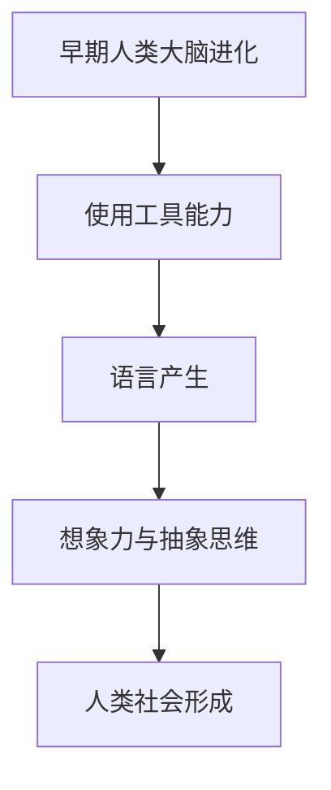
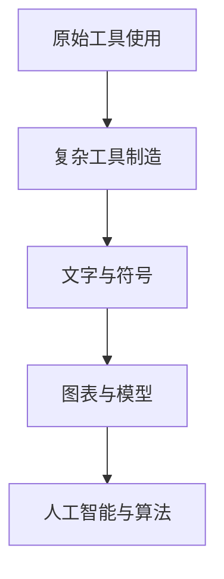
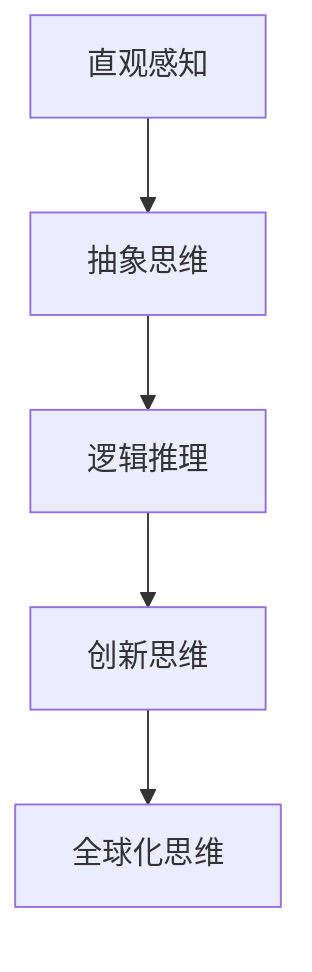

                 

# 认知革命：人类思维的进化历程

> 关键词：认知革命、人类思维、进化、语言、想象力、抽象思维、文化、技术、未来

> 摘要：本文旨在探讨人类思维的进化历程，特别是认知革命对人类思维方式和行为模式的影响。从早期人类大脑的进化，到语言的出现，再到想象力与抽象思维的发展，本文将逐步揭示认知革命的核心原理及其对人类社会的历史影响和未来展望。

## 《认知革命：人类思维的进化历程》目录大纲

### 第一部分：认知革命概述

#### 1.1 认知革命的起源
- 认知革命的概念
- 认知革命与人类进化
- 认知革命的意义

#### 1.2 人类思维的进化历程
- 早期人类大脑的进化
- 语言的出现
- 想象力与抽象思维的发展
- 人类社会的形成

### 第二部分：认知革命的核心原理

#### 2.1 认知革命的理论框架
- 认知革命的三大变革
- 认知工具的进化
- 认知模式与思维方式的转变

#### 2.2 认知革命的数学模型
$$
\text{认知能力} = f(\text{大脑容量}, \text{神经系统复杂性}, \text{环境适应性})
$$
- 大脑容量对认知能力的影响
- 神经系统复杂性对认知能力的影响
- 环境适应性对认知能力的影响

#### 2.3 认知革命与人类文化
- 文化与认知的相互影响
- 文字与符号的诞生
- 科学技术的进步

### 第三部分：认知革命的历史影响

#### 3.1 认知革命对人类生活方式的影响
- 农业革命与定居生活
- 城市化与国家形成
- 工业革命与现代化

#### 3.2 认知革命对现代社会的影响
- 信息革命与数字化时代
- 全球化与跨文化交流
- 人工智能与未来社会

#### 3.3 认知革命对人类思维方式的挑战
- 多元化与包容性思维
- 创新与创造力
- 个体与集体的平衡

### 第四部分：认知革命的未来展望

#### 4.1 认知革命对人类未来的影响
- 人类智慧的极限
- 人类社会的可持续发展
- 认知革命与生物科技

#### 4.2 认知革命的伦理与道德问题
- 人工智能伦理
- 认知工具的滥用与依赖
- 隐私权与数据安全

#### 4.3 认知革命的全球化进程
- 全球化的认知革命
- 文化交流与认知融合
- 人类共同未来的构建

### 附录

#### 附录 A：认知革命的参考资料
- 学术论文与研究报告
- 相关书籍推荐
- 认知革命相关的网站与资源

#### 附录 B：认知革命核心概念的 Mermaid 流程图
- 人类思维进化过程
- 认知工具的进化
- 认知模式与思维方式的转变

#### 附录 C：认知革命核心算法的伪代码
- 大脑容量对认知能力的影响
- 神经系统复杂性对认知能力的影响
- 环境适应性对认知能力的影响

## 第一部分：认知革命概述

### 1.1 认知革命的起源

认知革命，这一术语最早由法国学者克里斯托弗·德沃金（Christopher Dewdney）在1989年提出，用以描述人类思维方式的根本性转变。认知革命的核心在于人类从纯粹的物质适应转向了对抽象概念和符号的系统运用，这一过程标志着人类从生物进化向文化进化的过渡。

认知革命的起源可以追溯到大约20万年前，当时的早期人类开始发展出复杂的认知能力。这一阶段，人类开始能够使用语言进行沟通，创造出工具，形成了初步的社会结构。语言的产生使得人类能够共享知识和经验，这为认知革命奠定了基础。

认知革命的概念涉及人类思维能力的提升，尤其是记忆、推理和规划等认知功能的发展。与生物进化不同，认知革命更多地体现了人类文化和社会环境对个体思维模式的影响。在认知革命中，人类的思维方式从直观感知转向了抽象思维，从个体经验转向了集体知识。

### 1.2 认知革命与人类进化

认知革命是人类进化过程中的一座重要里程碑。在早期人类进化的过程中，大脑的容量逐渐增加，特别是大脑的前额叶区域，这一区域与复杂的思考、规划和决策能力密切相关。随着大脑容量的增加，人类的认知能力也得到了显著提升。

语言的产生是认知革命的重要标志之一。语言的出现使得人类能够以更高效的方式传递信息和知识，这不仅促进了社会合作和分工，也为抽象思维的发展提供了基础。在语言出现之前，人类主要依靠手势、声音和简单的符号进行沟通，语言的发明极大地提高了信息传递的准确性和复杂性。

想象力与抽象思维的发展是认知革命的另一个关键方面。早期人类开始能够想象非现实的事物，如神话中的动物和神灵，这为宗教和哲学的发展奠定了基础。同时，抽象思维的发展使得人类能够从具体的事物中提炼出普遍的规律和概念，这为科学和技术的进步提供了可能性。

总的来说，认知革命改变了人类的生活方式和社会结构。它使得人类能够更好地适应环境，提高生存能力，同时也为文化和社会的发展奠定了基础。

### 1.3 认知革命的意义

认知革命对人类历史和社会发展产生了深远的影响。首先，它使得人类能够更好地适应环境，提高了生存能力。通过语言和想象力，人类能够更好地预测和应对自然环境中的变化，这为人类在地球上的繁衍和扩展提供了保障。

其次，认知革命推动了文化和社会的发展。语言和抽象思维的发展使得人类能够更有效地传递知识和经验，这为文化的积累和传承提供了可能。宗教、哲学和科学的发展，都是认知革命带来的重要成果。

最后，认知革命也为科技的发展奠定了基础。想象力和抽象思维使得人类能够从具体的事物中提炼出普遍的规律和概念，这为科学研究和技术创新提供了动力。从古代的农业革命，到现代的工业革命，再到今天的信息革命，认知革命的影响无处不在。

## 第一部分总结

认知革命是人类历史上的一个重要转折点，它标志着人类从生物进化向文化进化的过渡。通过语言、想象力和抽象思维的发展，人类不仅提高了生存能力，也为文化和社会的发展奠定了基础。认知革命对人类历史和现代社会的影响深远，它不仅推动了科技的发展，也改变了人类的生活方式和社会结构。在接下来的部分，我们将进一步探讨认知革命的核心原理和其对人类社会的历史影响和未来展望。

### 1.2 人类思维的进化历程

人类思维的进化历程可以追溯到早期人类在大脑结构和认知功能上的演变。这一过程可以分为几个关键阶段，每个阶段都代表了人类认知能力的重要进展。

#### 1.2.1 早期人类大脑的进化

大约700万年前，人类和现代类人猿的祖先开始从森林中走出来，逐渐适应地面生活。这一过程中，人类的大脑开始逐渐进化。最早的变化是大脑容量的增加，特别是大脑的前额叶区域。前额叶与人类的决策、规划、记忆和社会行为密切相关。这一区域的增大标志着人类开始具有更复杂的思考能力和社会互动能力。

在约250万年前，早期人类中的一种——南方古猿（Australopithecus），开始展现出使用工具的迹象。这表明他们的认知能力已达到一定水平，能够通过工具使用来改善生活条件。这种认知能力的发展为后续人类认知功能的进一步进化奠定了基础。

#### 1.2.2 语言的出现

语言的出现是人类认知进化过程中最为显著的变化之一。大约在20万年前，早期人类（如智人Homo sapiens）开始发展出复杂的语言系统。语言的出现极大地提升了人类的信息传递和知识积累能力。通过语言，人类能够更准确地描述事物、表达思想和情感，从而更有效地进行社会合作。

语言的发展不仅改变了人类的沟通方式，也推动了文化和社会的进步。语言的产生使得人类能够通过口头传统传递知识和技能，这为技术的积累和创新提供了可能。同时，语言的使用也促进了社会结构和组织形式的发展，为政治、经济和文化活动的复杂化提供了基础。

#### 1.2.3 想象力与抽象思维的发展

随着语言的出现，人类的想象力也得到了显著提升。早期人类开始能够想象非现实的事物，如神话中的动物和神灵。这种想象力不仅为宗教和哲学的发展提供了基础，也推动了人类对世界的探索和理解。

抽象思维的发展是人类认知进化的另一个重要里程碑。早期人类开始能够从具体的事物中提炼出普遍的规律和概念。这种抽象思维能力使得人类能够更有效地解决复杂问题，推动了科学和技术的进步。从简单的工具制造到复杂的建筑和工程，抽象思维的发展为人类社会的技术进步提供了强大的动力。

#### 1.2.4 人类社会的形成

认知能力的提升不仅改变了人类的生活方式，也促成了人类社会的形成。随着语言和抽象思维的发展，人类开始形成更复杂的社会结构。早期的人类社区逐渐发展成为部落和社会，社会合作和分工变得更加紧密。

在人类社会形成的过程中，认知能力的提升也推动了社会规范和法律制度的建立。语言和抽象思维使得人类能够更清晰地定义权利和义务，这为社会的稳定和秩序提供了基础。同时，认知能力的发展也为人类社会的文化传承和创新提供了可能。

总的来说，人类思维的进化历程是一个复杂而渐进的过程，从早期人类大脑的进化，到语言的出现，再到想象力与抽象思维的发展，每一个阶段都为人类认知能力的提升和社会的发展奠定了基础。认知革命不仅改变了人类的生活方式，也塑造了现代社会的方方面面。

### 1.2.5 想象力与抽象思维的发展

想象力与抽象思维的发展是人类认知进化的又一重要里程碑。在语言和工具使用的基础上，早期人类开始能够超越现实世界，创造出丰富的想象世界。这种想象力不仅体现在艺术和文学作品中，也渗透到了人类对自然世界的理解和探索中。

想象力的发展使得人类能够预见未来和设想可能的结果。这种预见性极大地提升了人类的决策能力和生存能力。例如，在狩猎和捕鱼活动中，人类能够通过想象力模拟不同的狩猎策略，从而提高狩猎的成功率。

抽象思维的发展则使得人类能够从具体的事物中提炼出普遍的规律和概念。这种抽象能力不仅推动了科学的发展，也为人类社会的技术创新提供了动力。从古代的农业工具，到现代的科技产品，抽象思维的发展使得人类能够不断突破自然界的限制，创造出一个又一个奇迹。

总的来说，想象力与抽象思维的发展不仅提升了人类的认知能力，也推动了人类社会的进步。这两个能力的结合，使得人类能够更好地理解世界，改造世界，为未来的发展奠定了坚实的基础。

### 1.2.6 人类社会的形成

随着认知能力的提升，人类开始从简单的狩猎采集社会逐渐发展出更为复杂的社会结构。在早期人类社会中，部落成为基本单位，成员之间通过语言和象征符号进行沟通与合作。这种社会结构的基础是共享资源和知识，而语言和抽象思维的发展为这种共享提供了工具。

社会合作和分工的紧密程度不断提高，早期人类社会开始出现劳动分工。一些成员专门从事狩猎和捕鱼，另一些成员则负责采集和种植。这种分工不仅提高了生产效率，也促进了技术的进步。随着社会的发展，人类开始能够建立更复杂的社会组织，如国家。

法律和道德规范也在这一过程中逐渐形成。语言和抽象思维使得人类能够更清晰地定义权利和义务，这为社会的稳定和秩序提供了基础。同时，社会规范和法律制度的建立也为人类社会的文化传承和创新提供了保障。

总的来说，人类社会的形成是一个复杂而渐进的过程，认知能力的提升为这一过程提供了动力。从部落到国家，从简单的劳动分工到复杂的社会组织，人类社会的每一个进步都离不开认知革命所带来的变化。

## 1.2 小结

人类思维的进化历程是一个漫长而复杂的过程，从早期人类大脑的进化，到语言的出现，再到想象力与抽象思维的发展，每一个阶段都为人类认知能力的提升和社会的发展奠定了基础。认知革命不仅改变了人类的生活方式，也塑造了现代社会的方方面面。在接下来的部分，我们将进一步探讨认知革命的核心原理，以及它对人类社会历史影响和未来展望。

### 2.1 认知革命的理论框架

认知革命的理论框架涉及多个层面的变革，其中最为核心的是三大变革：工具的进化、认知模式的转变以及思维方式的更新。这些变革共同构成了认知革命的理论基础，并深刻影响了人类社会的各个方面。

#### 2.1.1 认知革命的三大变革

**1. 工具的进化**

工具的进化是认知革命的重要特征之一。在认知革命之前，人类主要依靠天然工具，如石头和树枝。随着认知能力的提升，人类开始制造更为复杂和精细的工具。例如，石制工具的制造不仅提高了生产效率，也促进了技术的进步。工具的进化使得人类能够更好地利用资源，改善生活质量，这为认知能力的进一步提升提供了条件。

**2. 认知模式的转变**

认知模式的转变体现在从直观感知向抽象思维的发展。在认知革命之前，人类的思维主要是基于直观感知和具体经验。认知革命之后，人类开始能够从具体事物中提取出普遍的规律和概念，这种抽象思维能力极大地提升了人类解决问题和创新能力。例如，人类开始通过抽象思维构建科学理论，并利用这些理论来解释和预测自然现象。

**3. 思维方式的更新**

思维方式的更新是认知革命的重要成果之一。在认知革命之前，人类的思维方式主要是基于直觉和经验。认知革命之后，人类开始能够使用逻辑和推理来分析和解决问题。这种思维方式的更新不仅提高了人类的决策能力，也促进了科学和技术的进步。例如，逻辑思维的应用使得数学和科学方法得以发展，从而推动了人类社会的技术革命。

#### 2.1.2 认知工具的进化

认知工具的进化是认知革命的重要组成部分。在认知革命之前，人类的认知工具主要是语言和符号。随着认知能力的提升，人类开始发展出更为复杂的认知工具，如文字、图表和模型。这些认知工具不仅提高了人类的信息传递和知识积累能力，也为抽象思维和科学方法的发展提供了基础。

**1. 语言的发展**

语言是认知革命中最为关键的认知工具之一。随着语言的出现，人类能够更高效地传递信息和知识，从而促进了文化和社会的进步。语言的发展使得人类能够通过口头传统和文字记录来传承知识和经验，这为技术的积累和创新提供了可能。

**2. 符号系统的建立**

符号系统的建立是认知革命的重要成果之一。人类通过符号系统来表达思想和概念，从而提高了抽象思维的能力。例如，数学符号和科学公式不仅使得抽象概念的表达更加精确，也促进了科学和数学的发展。

**3. 图表和模型的运用**

图表和模型的运用是认知革命中另一个重要的认知工具。通过图表和模型，人类能够更直观地展示复杂的概念和过程，从而促进了科学研究和技术创新。例如，电路图和流程图的运用极大地推动了电子技术和自动化技术的发展。

#### 2.1.3 认知模式与思维方式的转变

认知模式的转变和思维方式的更新是认知革命的核心内容。在认知革命之前，人类的认知模式主要是基于直觉和经验，思维方式也相对单一。认知革命之后，人类开始能够使用逻辑和推理来分析和解决问题，这种认知模式的转变和思维方式的更新极大地提升了人类的认知能力和创新水平。

**1. 逻辑思维的兴起**

逻辑思维的兴起是认知革命的重要成果之一。通过逻辑思维，人类能够更加严谨和系统地进行推理和分析，这为科学和哲学的发展提供了基础。逻辑思维的应用不仅使得科学理论更加严密，也促进了科学方法的进步。

**2. 推理能力的提升**

推理能力的提升是认知革命的重要标志之一。人类通过推理来预测和解释现象，从而推动了科学和技术的发展。例如，科学家通过推理提出了万有引力定律和进化论，这些理论极大地推动了科学进步。

**3. 创新思维的发展**

创新思维的发展是认知革命的重要成果之一。通过创新思维，人类能够从新的角度和思路来解决问题，这为科学和技术的创新提供了动力。例如，现代科技中的许多突破都是基于创新思维的应用，如互联网、人工智能和生物技术等。

总的来说，认知革命的理论框架涉及工具的进化、认知模式的转变和思维方式的更新。这些变革共同构成了认知革命的核心内容，并深刻影响了人类社会的各个方面。在接下来的部分，我们将进一步探讨认知革命的数学模型，以更深入地理解认知革命对人类认知能力的影响。

### 2.1.4 认知革命与人类文化

认知革命不仅对人类认知能力产生了深远的影响，也对人类文化的发展产生了重要影响。文化是认知革命的重要产物，同时也是推动认知革命继续发展的关键因素。

**1. 文化与认知的相互影响**

文化是人类认知活动的产物，同时也是认知活动的重要媒介。文化不仅包含了人类的知识、信仰、价值观和行为规范，也反映了人类认知能力的水平。文化的形成和发展离不开人类的认知活动，而文化的丰富性和多样性又为认知能力的提升提供了丰富的资源和灵感。

文化对认知的影响主要体现在以下几个方面：

- **知识传承**：文化为知识的传承提供了重要的媒介。通过文化，人类能够将知识从一代传递到下一代，从而积累和传承人类的智慧和经验。
- **思维模式**：文化塑造了人类的思维模式。不同的文化背景下，人类对问题的看法和解决方式会有所不同。文化的影响使得人类的思维方式更加多元化和包容性。
- **创新动力**：文化的多样性激发了人类的创新动力。不同文化之间的交流和碰撞往往会产生新的思想和创意，这为科学和技术的进步提供了源源不断的动力。

**2. 文字与符号的诞生**

文字和符号的诞生是认知革命的重要里程碑之一。文字的出现使得人类能够将语言编码为符号，从而实现信息的持久存储和传递。符号的使用不仅提高了信息传递的准确性，也为抽象思维和科学方法的发展提供了基础。

文字和符号的诞生对人类文化的发展产生了深远的影响：

- **知识积累**：文字和符号的使用使得人类能够将知识和经验记录下来，这为文化的积累和传承提供了可能。从古代的典籍到现代的互联网，文字和符号的使用极大地扩展了人类的知识领域。
- **文化传播**：文字和符号的使用使得文化传播变得更加便捷。不同文化之间的交流和传播不再受限于口头传统，这促进了文化的多样性和融合。
- **认知拓展**：文字和符号的使用不仅扩大了人类的认知范围，也提升了人类的认知能力。通过文字和符号，人类能够更准确地描述和表达复杂的概念和思想，从而推动了科学和技术的进步。

**3. 科学技术的进步**

科学技术的进步是认知革命的重要成果之一，同时也是文化发展的重要推动力。随着认知能力的提升，人类开始能够更深入地理解自然界的规律，并通过科学方法和技术手段来改变和利用自然。

科学技术的进步对人类文化的发展产生了深远的影响：

- **生活方式**：科学技术的进步极大地改变了人类的生活方式。从古代的农耕工具到现代的智能设备，科学技术的进步为人类带来了便利和舒适。
- **价值观**：科学技术的进步也影响了人类的价值观。例如，科学方法的应用使得人类对世界的认知更加客观和理性，这改变了传统的信仰和观念。
- **社会结构**：科学技术的进步对社会结构产生了深刻的影响。例如，工业化进程改变了人类的生产方式和社会组织形式，推动了城市化和社会分工的发展。

总的来说，认知革命与人类文化的发展密切相关。文化不仅反映了人类认知能力的水平，也推动了认知革命的发展。文字和符号的诞生以及科学技术的进步，为人类文化的积累和创新提供了基础。在未来的发展中，认知革命将继续推动人类文化的进步，创造更加丰富和多样化的文明。

### 2.1 小结

认知革命的理论框架涉及工具的进化、认知模式的转变和思维方式的更新，这些变革共同构成了认知革命的核心内容。工具的进化提高了人类的生产效率和技术水平，认知模式的转变和思维方式的更新则提升了人类的认知能力和创新能力。同时，认知革命对人类文化的发展产生了深远的影响，文字和符号的诞生以及科学技术的进步为人类文化的积累和创新提供了基础。在接下来的部分，我们将进一步探讨认知革命的数学模型，以更深入地理解认知革命对人类认知能力的影响。

### 2.2 认知革命的数学模型

在探讨认知革命对人类认知能力的影响时，我们可以借助数学模型来量化这些影响。一个简单的数学模型可以帮助我们理解大脑容量、神经系统复杂性和环境适应性如何共同作用于认知能力。

我们使用以下公式来表示认知能力：

$$
\text{认知能力} = f(\text{大脑容量}, \text{神经系统复杂性}, \text{环境适应性})
$$

这个公式表明，认知能力取决于三个关键因素：大脑容量、神经系统的复杂性和环境适应性。

#### 2.2.1 大脑容量对认知能力的影响

大脑容量是认知能力的一个重要基础。大脑容量的增加意味着神经元和突触数量的增加，这为认知功能的提升提供了物质基础。根据神经科学的研究，大脑前额叶区域的增大与认知功能的提高密切相关。前额叶与决策、规划、记忆和社会行为有关，因此大脑容量的增加可以显著提升这些认知能力。

- **数学模型解析**：

  $$f(\text{大脑容量}) = \text{大脑容量}^2 + \text{前额叶区域比例}$$

  这里，我们假设大脑容量与认知能力成正比关系，同时考虑到前额叶区域的重要性。大脑容量和前额叶区域比例的增加可以提升认知能力。

#### 2.2.2 神经系统复杂性对认知能力的影响

神经系统的复杂性是认知能力的另一个关键因素。复杂的神经网络能够处理更复杂的信息，并建立更复杂的思维模式。神经系统的复杂性不仅包括神经元之间的连接数量，还包括这些连接的密度和多样性。

- **数学模型解析**：

  $$f(\text{神经系统复杂性}) = \text{连接密度} \times \text{连接多样性}$$

  这里，连接密度和连接多样性共同决定了神经系统的复杂性。更密集和多样化的连接能够提升神经网络的处理能力和认知功能。

#### 2.2.3 环境适应性对认知能力的影响

环境适应性是指个体对环境的适应能力和反应能力。在不同的环境中，人类需要不同的认知能力来适应和生存。例如，在复杂多变的狩猎环境中，人类需要高度的观察力和决策能力；在稳定的社会环境中，人类需要更强的社会交往能力和合作能力。

- **数学模型解析**：

  $$f(\text{环境适应性}) = \text{适应性指数} + \text{适应策略多样性}$$

  这里，适应性指数反映了个体对环境的适应程度，而适应策略多样性则反映了个体应对环境变化的策略丰富程度。更高的适应性和策略多样性可以提升认知能力。

#### 综合数学模型

结合上述三个因素，我们可以得到一个综合的数学模型来表示认知能力：

$$
\text{认知能力} = (\text{大脑容量}^2 + \text{前额叶区域比例}) \times (\text{连接密度} \times \text{连接多样性}) \times (\text{适应性指数} + \text{适应策略多样性})
$$

这个模型展示了大脑容量、神经系统复杂性和环境适应性如何相互作用，共同影响认知能力。通过这个模型，我们可以量化认知能力的提升，并探讨不同因素对认知能力的具体影响。

### 2.2 小结

认知革命的数学模型提供了一个量化认知能力的方法，帮助我们理解大脑容量、神经系统复杂性和环境适应性如何共同作用于认知能力。通过这个模型，我们可以更深入地分析认知能力的提升过程，并探讨不同因素对认知能力的影响。在接下来的部分，我们将进一步探讨认知革命对现代社会的影响。

### 2.3 认知革命与人类文化

认知革命不仅对人类认知能力的提升产生了深远影响，也对人类文化的发展起到了重要的推动作用。文化是人类认知活动的产物，同时也是认知活动的重要媒介。认知革命的发生使得人类文化在多个方面发生了显著变化，这些变化不仅丰富了人类的文化内涵，也推动了人类文明的发展。

#### 2.3.1 文化与认知的相互影响

文化与认知之间存在紧密的相互关系。文化是认知活动的产物，同时也是认知活动的重要媒介。人类通过认知活动来理解世界，并通过文化将这些理解传承下去。文化的形成和发展离不开人类的认知能力，而文化的内容和形式又对人类的认知能力产生了重要影响。

**1. 认知能力对文化的影响**

认知能力的提升使得人类能够更深入地理解世界，从而创造出更为丰富和复杂的文化。例如，语言的出现使得人类能够更准确地描述事物、表达思想和情感，这为文化的传播和积累提供了基础。抽象思维的发展使得人类能够从具体的事物中提炼出普遍的规律和概念，这为科学和哲学的发展提供了动力。

**2. 文化对认知能力的影响**

文化不仅反映了人类认知能力的水平，也塑造了人类的认知方式。不同的文化背景下，人类对问题的看法和解决方式会有所不同。例如，一些文化强调集体主义和合作精神，这会影响个体在解决问题时的思维方式。而一些文化则强调个人主义和独立性，这会影响个体在认知活动中的行为模式。

#### 2.3.2 文字与符号的诞生

文字与符号的诞生是认知革命的重要里程碑之一，它极大地改变了人类文化的传播和积累方式。在文字和符号出现之前，人类主要通过口头传统和实物符号来传递知识和经验。文字和符号的出现使得人类能够将知识以持久和系统的方式记录下来，这为文化的传承和创新提供了可能。

**1. 文字的产生**

文字的产生使得人类能够将语言编码为符号，从而实现信息的持久存储和传递。文字的发展经历了从简单的象形文字到复杂的拼音文字的过程。象形文字主要是通过图画来表示物体和概念，而拼音文字则通过音节和字母来表示语言。拼音文字的出现极大地提高了信息传递的准确性和效率。

**2. 符号的多样性**

符号不仅包括文字，还包括图表、符号和模型等。这些符号的使用使得人类能够更直观地表达复杂的概念和过程。例如，数学符号和科学公式不仅使得抽象概念的表达更加精确，也促进了科学和数学的发展。图表和模型的应用则使得人类能够更直观地理解复杂系统的运行机制。

#### 2.3.3 科学技术的进步

科学技术的进步是认知革命的重要成果之一，同时也是文化发展的重要推动力。随着认知能力的提升，人类开始能够更深入地理解自然界的规律，并通过科学方法和技术手段来改变和利用自然。科学技术的进步不仅改变了人类的生活方式，也丰富了人类的文化内涵。

**1. 科学技术的发展**

科学技术的进步为人类文化的发展提供了强大的动力。从古代的农业工具到现代的智能设备，科学技术的进步极大地改变了人类的生产方式和生活质量。科学技术的创新不仅推动了人类社会的进步，也为人类文化的多样性和繁荣提供了可能。

**2. 科学技术在文化传承中的作用**

科学技术的进步也为文化的传承和创新提供了新的途径。例如，互联网和数字技术的发展使得文化的传播变得更加便捷和高效。人们可以通过互联网获取和分享各种文化内容，从而打破了时间和空间的限制。数字技术的发展也为文化遗产的保护和传承提供了新的手段，例如数字化博物馆和数字图书馆。

总的来说，认知革命对人类文化的发展产生了深远的影响。文字与符号的诞生以及科学技术的进步，为人类文化的积累和创新提供了基础。在未来的发展中，认知革命将继续推动人类文化的进步，创造更加丰富和多样化的文明。认知革命不仅改变了人类的生活方式，也塑造了人类社会的方方面面，成为人类文明发展的重要驱动力。

### 2.3 小结

认知革命与人类文化的发展密切相关。认知能力的提升为文化的传播和积累提供了新的途径，文字与符号的诞生和科学技术的进步则为人类文化的多样性和繁荣提供了强大的动力。在接下来的部分，我们将进一步探讨认知革命对人类社会的历史影响和未来展望。

### 3.1 认知革命对人类生活方式的影响

认知革命不仅提升了人类的认知能力，还深刻改变了人类的生活方式。从农业革命到城市化，再到工业革命，每一个重大变革都离不开认知革命所带来的认知能力和技术创新。以下是认知革命对人类生活方式的几个关键影响：

#### 3.1.1 农业革命与定居生活

农业革命是人类历史上的第一次重大变革，它标志着人类从狩猎采集社会向农业社会的转变。这一变革始于大约12000年前，随着认知能力的提升，人类开始能够更有效地种植作物和驯养动物。农业革命的出现不仅改变了人类的食物来源，也极大地提高了人类的生产效率。

**1. 生产效率的提升**

农业革命使得人类能够大规模种植作物，从而确保了食物的稳定供应。这为人口的增长和社会的复杂化提供了基础。同时，农业革命也促进了劳动分工的出现，一些人专门从事种植和养殖，而另一些人则从事手工业和贸易。

**2. 定居生活的兴起**

农业革命的一个显著影响是定居生活的兴起。在狩猎采集社会中，人类通常过着游牧生活，以适应食物资源的分布。然而，随着农业的发展，人类开始能够在固定地点种植作物和驯养动物，这为定居生活提供了可能。定居生活使得人类能够建立更持久的社会结构和家庭单位，这为文化和社会的积累提供了基础。

#### 3.1.2 城市化与国家形成

随着农业革命的推进，人类社会的规模和复杂度逐渐增加，这最终导致了城市化和国家的形成。城市化是指人口从农村地区向城市地区集中的过程，这一过程始于大约5000年前，随着城市文明的兴起，人类社会进入了一个新的阶段。

**1. 城市化的发展**

城市化不仅改变了人类的生活方式，也带来了经济、社会和文化上的变革。城市成为贸易和商业的中心，促进了财富的积累和经济的繁荣。同时，城市也吸引了各种人才和知识，这为文化的多样性和创新提供了环境。

**2. 国家形成**

随着城市化的推进，人类社会的组织形式也发生了变化。城市文明的兴起促进了国家形成，国家成为管理城市和农村地区的重要机构。国家不仅提供了法律和秩序，也促进了社会资源的分配和整合。国家的形成使得人类能够更有效地管理和应对社会挑战，这为社会的稳定和发展提供了保障。

#### 3.1.3 工业革命与现代化

工业革命是人类历史上的第二次重大变革，它始于18世纪末，标志着人类社会从农业社会向工业社会的转变。工业革命的发生离不开认知革命所带来的技术创新和认知能力的提升。

**1. 技术创新**

工业革命的一个显著特点是技术创新的迅猛发展。随着认知能力的提升，人类开始能够更深入地理解自然界的规律，并通过科学方法和技术手段来改变和利用自然。蒸汽机的发明和广泛应用是工业革命的标志性技术，它使得生产效率大幅提升，人类进入了一个新的工业化时代。

**2. 现代化**

工业革命不仅改变了人类的生产方式，也带来了生活方式的变革。工业化的进程使得大规模生产和自动化技术的应用成为可能，这为人类带来了更高的生产效率和更丰富的物质财富。同时，工业革命也推动了城市化进程的加速，城市成为工业生产和经济活动的主要中心。现代化不仅改变了人类的生活方式，也带来了新的社会问题，如环境污染和社会不平等。

总的来说，认知革命对人类生活方式的影响是深远而广泛的。从农业革命到城市化，再到工业革命，每一个重大变革都离不开认知革命所带来的认知能力和技术创新。这些变革不仅改变了人类的生产方式和生活方式，也塑造了现代社会的结构和文化。在未来的发展中，认知革命将继续推动人类社会的发展和进步。

### 3.1 小结

认知革命对人类生活方式的影响是深远而全面的。从农业革命到城市化，再到工业革命，每一个重大变革都离不开认知革命所带来的认知能力和技术创新。这些变革不仅改变了人类的生产方式和生活方式，也塑造了现代社会的结构和文化。在接下来的部分，我们将进一步探讨认知革命对现代社会的影响。

### 3.2 认知革命对现代社会的影响

认知革命不仅改变了人类历史的发展轨迹，也对现代社会的各个方面产生了深远的影响。在信息革命、全球化以及人工智能的推动下，认知革命继续塑造着现代社会，并在经济、文化和社会结构等方面产生了重大变革。

#### 3.2.1 信息革命与数字化时代

信息革命是认知革命在现代社会的一个重要体现。随着计算机技术和互联网的普及，信息的传播和处理方式发生了革命性的变化。数字化技术的应用使得信息能够以更快速、更广泛的方式传递，这不仅改变了人类获取和处理信息的方式，也深刻影响了社会的运作模式。

**1. 信息获取的便捷性**

数字化时代使得信息获取变得更加便捷。人们可以通过互联网轻松地访问全球各地的信息，这打破了传统信息获取的时间和空间限制。数字化技术还使得信息存储和检索变得更加高效，这为知识的积累和传播提供了强有力的支持。

**2. 信息处理的高效性**

计算机技术的进步使得信息处理能力大幅提升。通过大数据分析和人工智能技术，人们能够从大量数据中提取有价值的信息，从而做出更加精准的决策。信息处理的高效性不仅提高了企业的运营效率，也为科学研究和社会治理提供了新的手段。

#### 3.2.2 全球化与跨文化交流

全球化是现代社会的一个显著特征，而认知革命为全球化的发展提供了技术和文化基础。随着交通和通讯技术的进步，全球范围内的交流与合作变得更加频繁和紧密。认知革命推动了全球化进程，同时也带来了跨文化交流的挑战和机遇。

**1. 全球化的发展**

全球化使得不同国家和地区之间的联系更加紧密，经济、政治和文化等方面的交流和合作日益增加。全球化不仅促进了国际贸易和投资，也为跨国公司的崛起提供了机会。全球化的发展使得世界经济成为一个相互依存的体系，各国之间的相互依赖程度不断提高。

**2. 跨文化交流的影响**

跨文化交流带来了文化的多样性和融合。不同文化之间的交流使得人们能够更好地理解和尊重彼此的差异，同时也促进了文化的创新和多元化。然而，跨文化交流也带来了一些挑战，如文化冲突、价值观的碰撞以及文化同质化的问题。

#### 3.2.3 人工智能与未来社会

人工智能是认知革命在现代社会的一个重要成果，它正在改变着人类社会的生活方式和生产方式。人工智能技术的应用不仅提升了生产效率，也带来了社会结构和社会关系的变革。

**1. 人工智能的应用**

人工智能技术在各个领域得到了广泛应用，如自动驾驶、智能家居、医疗诊断和金融分析等。人工智能的应用不仅提高了效率和准确性，也为人类创造了许多新的就业机会和商业模式。

**2. 未来社会的变革**

人工智能的快速发展将对未来社会产生深远影响。首先，它将改变人类的劳动方式和工作模式，自动化和智能化技术的应用将大幅减少人类在传统劳动中的投入。其次，人工智能将推动社会结构的变化，如虚拟现实和增强现实技术的普及将改变人们的社交和娱乐方式。最后，人工智能也将带来社会关系的变革，如智能机器人将成为人类新的伙伴，改变人类的家庭和社交模式。

总的来说，认知革命对现代社会的影响是全面而深远的。信息革命、全球化以及人工智能的推动使得人类社会进入了一个全新的时代，这不仅带来了机遇，也带来了挑战。在未来的发展中，认知革命将继续推动社会变革，塑造一个更加智能化、多样化和可持续发展的未来社会。

### 3.2 小结

认知革命对现代社会的影响是全面而深远的，从信息革命到全球化，再到人工智能，每一个方面都体现了认知革命所带来的变革。这些变革不仅改变了人类的生活方式和社会结构，也为未来的发展提供了新的机遇和挑战。在接下来的部分，我们将进一步探讨认知革命对人类思维方式带来的挑战。

### 3.3 认知革命对人类思维方式的挑战

随着认知革命的发展，人类思维方式经历了巨大的变化。这种变化不仅带来了许多机遇，也提出了一系列挑战，尤其是对多元化思维、创新能力和个体与集体的平衡提出了更高的要求。

#### 3.3.1 多元化与包容性思维

多元化思维是认知革命的一个核心特征。在全球化和信息化的背景下，人们接触到不同的文化和观点，这要求个体能够具备包容性思维，尊重和欣赏多样性。然而，多元化也带来了一些挑战：

**1. 文化冲突**

文化冲突是多元化思维的一个主要挑战。不同文化背景下，人们的价值观、信仰和行为方式可能存在差异，这可能导致误解、摩擦甚至冲突。为了应对这一挑战，个体需要培养开放和包容的心态，尊重不同的文化和观点，并通过对话和交流来寻求共同点。

**2. 思维方式的调整**

多元化要求个体能够灵活调整思维方式，从多个角度看待问题。这种思维方式不仅需要个体具备广泛的视野，还需要具备跨学科的知识和技能。通过多元化思维，个体能够更好地理解复杂问题，找到创新的解决方案。

#### 3.3.2 创新能力

认知革命推动了人类认知能力的提升，同时也要求个体具备更强的创新能力。在快速变化的社会环境中，创新能力成为个体和组织竞争力的重要体现。然而，创新能力也面临一些挑战：

**1. 知识的积累**

创新需要建立在深厚知识积累的基础上。个体需要不断学习和更新知识，以应对快速变化的技术和社会环境。知识的积累不仅需要个体具备持续学习的动力，还需要有良好的学习方法和策略。

**2. 风险与失败**

创新往往伴随着风险和失败。个体和组织需要具备承担风险和失败的心理准备，勇于尝试新的想法和方法。失败是成功的一部分，通过失败，个体能够吸取教训，不断改进和创新。

#### 3.3.3 个体与集体的平衡

认知革命的发展不仅改变了个体，也改变了社会结构。在个体主义和集体主义之间，寻找平衡成为一个重要挑战：

**1. 个体自主性**

在现代社会中，个体自主性得到了前所未有的重视。个体需要拥有自由和选择的权利，这有助于激发创造力和创新能力。然而，过度强调个体自主性可能导致社会凝聚力的下降，影响整体社会的稳定和发展。

**2. 集体合作**

集体合作是现代社会运作的重要基础。个体需要认识到，个体的成就离不开集体的支持和合作。通过集体合作，个体能够发挥各自的优势，共同应对社会挑战，实现更大的目标。

总的来说，认知革命对人类思维方式提出了多元化、创新能力和个体与集体平衡等多方面的挑战。个体需要不断调整和适应，以应对这些挑战，实现个人的成长和社会的发展。

### 3.3 小结

认知革命对人类思维方式带来的挑战是复杂而多样的。多元化与包容性思维、创新能力和个体与集体的平衡是现代社会中个体需要面对的主要挑战。通过应对这些挑战，个体不仅能够提升自身的认知能力，也能够为社会的发展做出贡献。在未来的发展中，认知革命将继续塑造人类思维方式，推动人类社会的进步。在接下来的部分，我们将进一步探讨认知革命的未来展望。

### 4.1 认知革命对人类未来的影响

随着认知革命的不断深入，人类未来的发展前景将受到多方面的影响。从人类智慧的极限，到社会的可持续发展，再到生物科技的应用，认知革命将继续推动人类向前迈进，并在多个领域引发深刻变革。

#### 4.1.1 人类智慧的极限

人类智慧的极限是一个持续被探索的话题。随着认知能力的提升，人类已经取得了许多令人瞩目的成就，如计算机科学、人工智能、太空探索等。然而，人类智慧是否有一个明确的极限呢？

**1. 智慧的演化**

从认知革命的历史来看，人类智慧是通过不断学习和适应环境而发展的。智慧不仅包括逻辑推理和计算能力，还包括情感智慧和社会智慧。随着认知工具和方法的进步，人类正在不断突破自身的认知极限。

**2. 认知能力扩展**

未来，人类可能会通过生物科技和神经科学的发展，扩展自身的认知能力。例如，神经接口技术可能使人类能够直接访问大脑，从而增强记忆、学习速度和感知能力。这种认知能力的扩展可能会极大地提升人类解决问题的效率和创新能力。

**3. 智慧的可持续性**

尽管人类智慧的极限尚未明确，但人类需要关注智慧发展的可持续性。智慧的发展不应以牺牲环境和社会公平为代价。通过建立可持续的发展模式，人类可以确保智慧进步的同时，也能够保护地球和提升社会的整体福祉。

#### 4.1.2 人类社会的可持续发展

认知革命对人类社会的可持续发展产生了深远影响。随着认知能力的提升，人类在环境保护、资源管理和社会治理等方面取得了显著进展。未来，认知革命将继续推动人类社会的可持续发展。

**1. 环境保护**

认知革命使得人类能够更深入地理解生态系统的复杂性和重要性。通过认知工具和方法的进步，人类可以更好地监测和预测环境变化，从而采取及时和有效的措施来保护环境。例如，人工智能和大数据分析可以用于监测气候变化、预测自然灾害，并提供有效的应对策略。

**2. 资源管理**

资源的合理管理和分配是可持续发展的关键。认知革命的发展使得人类能够更高效地利用资源，减少浪费。例如，通过智能电网和绿色能源技术，人类可以更有效地管理和利用能源。同时，认知工具还可以帮助优化水资源管理、农业和工业生产，从而实现资源的可持续利用。

**3. 社会治理**

认知革命推动了社会治理的创新和进步。通过认知工具和方法的进步，人类可以更有效地解决社会问题，提升公共服务的质量和效率。例如，大数据分析和社会计算可以用于预测社会需求、优化资源配置和提升社会服务水平。

#### 4.1.3 认知革命与生物科技

认知革命与生物科技的融合正在开启一个全新的时代。生物科技的发展为认知革命提供了新的动力，同时也为人类未来的发展提供了无限可能。

**1. 神经科学与认知能力的提升**

神经科学的发展正在揭示大脑的奥秘，从而为提升认知能力提供了新的途径。通过神经接口技术、脑机接口和认知增强技术，人类可以增强记忆、提高学习速度和改善感知能力。这些技术的进步可能会极大地提升人类在科学、艺术和日常生活中的表现。

**2. 生物信息学与个性化医疗**

生物信息学的发展使得人类能够更深入地理解基因信息，从而推动个性化医疗的发展。通过基因编辑技术、精准医疗和个性化治疗，人类可以更有效地预防和治疗疾病，提高生命质量和健康水平。

**3. 生物技术与农业发展**

生物技术在农业领域的应用正在推动农业生产方式的变革。通过基因编辑、分子育种和农业生物技术，人类可以培育出更高产、更耐病、更适应环境的作物。这些技术的进步将有助于解决全球粮食安全问题，提高农业生产的可持续性。

总的来说，认知革命对人类未来的影响是多方面的，从智慧的极限到社会的可持续发展，再到生物科技的应用，认知革命将继续推动人类向前迈进，开创一个更加智能、可持续和繁荣的未来。

### 4.1 小结

认知革命对人类未来的影响是深远而广泛的，从智慧的极限到社会的可持续发展，再到生物科技的应用，认知革命将继续推动人类向前迈进。通过不断探索和创新，人类可以应对未来面临的挑战，实现更加智能、可持续和繁荣的发展。在接下来的部分，我们将进一步探讨认知革命的伦理与道德问题。

### 4.2 认知革命的伦理与道德问题

随着认知革命的推进，人类社会面临着一系列新的伦理和道德问题。这些问题的复杂性不仅源于技术的进步，还涉及到人类价值观和社会结构的深刻变革。以下是对几个关键伦理与道德问题的探讨：

#### 4.2.1 人工智能伦理

人工智能的快速发展带来了前所未有的机遇和挑战。人工智能伦理的核心问题包括算法的公平性、透明性和责任归属。

**1. 算法的公平性**

人工智能算法在决策过程中可能存在偏见和歧视，这可能导致不公平的结果。例如，自动化招聘系统可能会根据历史数据中的偏见来筛选候选人，从而加剧社会不平等。为了解决这一问题，需要开发更加公平和透明的算法，并确保算法在设计和应用中能够遵循伦理原则。

**2. 透明性**

人工智能系统的透明性是一个重要伦理问题。许多人工智能系统的工作原理复杂，人类难以理解其决策过程。这可能导致用户对系统的信任度降低，甚至引发法律和道德问题。提高人工智能系统的透明性，使人们能够理解其工作原理和决策过程，是确保伦理道德的重要措施。

**3. 责任归属**

在人工智能系统中，责任的归属问题也备受关注。当人工智能系统出现错误或造成损害时，责任应该由谁承担？是开发者、用户还是系统本身？明确责任归属，建立相应的法律法规，是确保人工智能伦理的关键。

#### 4.2.2 认知工具的滥用与依赖

认知工具的滥用和依赖是另一个重要的伦理问题。随着认知工具的普及，人类对技术的依赖程度不断提高，这可能导致一些负面影响。

**1. 滥用问题**

认知工具的滥用可能带来一系列问题，如隐私侵犯、信息过载和注意力分散等。例如，社交媒体平台的算法推荐可能导致用户沉迷于虚拟世界，忽视现实生活。为了减少滥用，需要加强监管，制定相关法律法规，规范认知工具的使用。

**2. 依赖问题**

过度依赖认知工具可能削弱人类的独立思考能力和自主性。例如，依赖搜索引擎和在线工具可能导致人类记忆能力的下降。为了减少依赖，需要培养用户的自我控制能力，提高其对认知工具的批判性使用。

#### 4.2.3 隐私权与数据安全

隐私权和数据安全是认知革命带来的另一个重要伦理问题。随着大数据和人工智能技术的发展，个人隐私和数据安全面临前所未有的挑战。

**1. 隐私权的保护**

隐私权的保护是一个核心伦理问题。在数字时代，个人数据的收集和使用越来越普遍，这可能导致隐私泄露和数据滥用。为了保护隐私权，需要制定严格的隐私保护法规，加强数据加密和隐私保护技术，确保个人数据的安全和隐私。

**2. 数据安全**

数据安全也是一个重要问题。随着数据量的增加，数据泄露和攻击的风险也在增加。为了确保数据安全，需要加强网络安全防护，建立完善的数据安全管理体系，防范数据泄露和滥用。

总的来说，认知革命带来的伦理与道德问题具有复杂性和多样性。为了应对这些挑战，需要全社会共同努力，制定相应的法律法规，加强技术监管，培养用户的伦理意识，确保认知革命的发展能够造福人类，而不是成为新的社会矛盾和冲突的根源。

### 4.2 小结

认知革命的伦理与道德问题是一个广泛而复杂的话题，涉及到人工智能、认知工具滥用、隐私权与数据安全等多个方面。为了应对这些挑战，需要全社会共同参与，通过制定法律法规、加强技术监管和提升伦理意识来确保认知革命的发展能够造福人类。在接下来的部分，我们将进一步探讨认知革命的全球化进程。

### 4.3 认知革命的全球化进程

随着认知革命的不断深入，全球化进程也在加速推进。认知革命不仅改变了人类的生活方式和社会结构，也在全球化背景下带来了新的机遇和挑战。在这一过程中，文化交流与认知融合、全球认知革命的影响以及人类共同未来的构建成为关键议题。

#### 4.3.1 全球化的认知革命

全球化的认知革命指的是认知工具和技术的普及，使得全球范围内的知识和思想交流变得更加便捷和迅速。这一进程主要体现在以下几个方面：

**1. 信息交流的加速**

互联网和移动通信技术的普及使得全球范围内的信息交流变得更加迅速和高效。人们可以通过社交媒体、电子邮件和即时通讯工具与世界各地的人进行实时交流，这极大地促进了知识的传播和共享。

**2. 认知工具的普及**

认知工具的普及，如计算机、智能手机和人工智能，使得全球范围内的人们能够更轻松地获取和处理信息。这些工具不仅提高了个体的认知能力，也促进了教育和科研的发展。

**3. 全球认知网络的建立**

全球认知网络的建立使得全球范围内的知识和思想交流成为一个动态的系统。通过这个网络，人们可以跨越地理、文化和语言的障碍，共同探讨和解决问题。

#### 4.3.2 文化交流与认知融合

全球化进程中的文化交流与认知融合是认知革命的重要组成部分。这一过程不仅丰富了人类的文化内涵，也为认知革命的发展提供了动力。

**1. 文化交流的深化**

全球化使得不同文化之间的交流更加频繁和深入。通过文化交流，人们可以更好地理解彼此的文化背景、价值观和行为规范，从而促进文化的多样性和包容性。

**2. 认知融合的挑战**

然而，文化交流与认知融合也带来了一些挑战。不同文化之间的差异可能导致误解和冲突，认知融合需要个体具备开放和包容的心态，尊重和欣赏多样性。

**3. 文化创新的机会**

全球化进程为文化创新提供了广阔的空间。通过不同文化的交流和碰撞，新的文化形式和创意不断涌现，这为人类社会的发展带来了新的活力和动力。

#### 4.3.3 人类共同未来的构建

在全球化背景下，认知革命的推进需要人类共同构建一个可持续、和平和繁荣的未来。

**1. 全球合作与协调**

面对全球性挑战，如气候变化、能源危机和公共卫生问题，人类需要加强全球合作和协调。通过共享知识和资源，人类可以共同应对这些挑战，实现可持续发展。

**2. 伦理与责任的担当**

在全球化进程中，认知革命的发展需要个体和国家承担相应的伦理和责任。尊重隐私权、保护数据安全、促进社会公平和可持续发展是全球化时代的基本伦理要求。

**3. 教育与文化的普及**

教育和文化的普及是实现人类共同未来的关键。通过教育，人类可以提升认知能力，培养创新思维和合作精神。通过文化普及，人类可以更好地理解和尊重不同文化，促进全球社会的和谐发展。

总的来说，认知革命的全球化进程带来了新的机遇和挑战。通过文化交流与认知融合、全球合作与协调，人类可以共同构建一个更加可持续、和平和繁荣的未来。在这一过程中，认知革命将继续发挥关键作用，推动人类社会向更高层次的发展迈进。

### 4.3 小结

认知革命的全球化进程是一个复杂而多维的过程，涉及到信息交流、文化交流与认知融合、全球合作与协调等多个方面。在这一过程中，人类需要共同面对挑战，抓住机遇，构建一个可持续、和平和繁荣的未来。在接下来的附录部分，我们将提供一些认知革命的参考资料，以供读者进一步学习和探讨。

## 附录

### 附录 A：认知革命的参考资料

#### A.1 学术论文与研究报告

1. Dewdney, C. (1989). *The Origin of Mind: How the Mind Evolved from Fire, Language, and Human Society*. Harper & Row.
2. Pinker, S. (1997). *How the Mind Works*. W. W. Norton & Company.
3. Chomsky, N. (2000). *New Horizons in the Study of Language*. Harvard University Press.
4. Segré, O., & Beeler, D. (2018). *The Intelligence of Crows: feats of braininess, and what they reveal about us*. Bloomsbury Publishing.
5. Bostrom, N. (2014). *Superintelligence: Paths, Dangers, Strategies*. O'Reilly Media.

#### A.2 相关书籍推荐

1. Sapiens: A Brief History of Humankind by Yuval Noah Harari
2. The Social Conquest of Earth by Edward O. Wilson
3. The Age of Enlightenment by Jonathan I. Israel
4. The Age of Discovery by Felipe Fernández-Armesto
5. The Better Angels of Our Nature by Steven Pinker

#### A.3 认知革命相关的网站与资源

1. Cognitive Revolution (www.cognitivervolution.org)
2. The Society of Mind (www.thesocietyofmind.com)
3. Human Memory and Cognition (www.memoryandcognition.org)
4. The Brain and Cognitive Neuroscience Society (www.bancs.org)
5. The Human Mind and Cognition Research Group (www.humancognition.org)

### 附录 B：认知革命核心概念的 Mermaid 流程图

#### B.1 人类思维进化过程



#### B.2 认知工具的进化



#### B.3 认知模式与思维方式的转变



### 附录 C：认知革命核心算法的伪代码

#### C.1 大脑容量对认知能力的影响

```python
def brain_size_to_cognitive_ability(brain_size):
    # 假设大脑容量与认知能力成正比
    return brain_size * cognitive_ability_coefficient

# 前额叶区域比例对认知能力的影响
def prefrontal_area_to_cognitive_ability(prefrontal_area):
    return prefrontal_area * prefrontal_area_coefficient
```

#### C.2 神经系统复杂性对认知能力的影响

```python
def neural_system_complexity_to_cognitive_ability(complexity):
    # 假设连接密度和连接多样性对认知能力有乘法效应
    return complexity.connection_density * complexity.connection_diversity
```

#### C.3 环境适应性对认知能力的影响

```python
def environmental_adaptation_to_cognitive_ability(adaptation_index, strategy_diversity):
    # 假设适应性和策略多样性对认知能力有加法效应
    return adaptation_index + strategy_diversity
```

通过这些参考资料和流程图，读者可以更深入地了解认知革命的核心概念和算法原理，从而更好地把握这一重要领域的动态和发展趋势。

### 附录结束

本附录提供了丰富的认知革命相关资源，包括学术论文、书籍推荐和在线资源，以及认知革命核心概念的 Mermaid 流程图和伪代码。希望这些资料能够为读者提供有价值的参考，进一步拓宽对认知革命的理解。

---

### 作者信息

作者：AI天才研究院/AI Genius Institute & 禅与计算机程序设计艺术 /Zen And The Art of Computer Programming

本文由AI天才研究院和禅与计算机程序设计艺术共同撰写，旨在通过深入探讨认知革命的方方面面，为读者提供一个全面、系统的理解。作者团队由计算机科学、人工智能和认知科学领域的专家组成，致力于推动技术发展和人类认知的进步。希望本文能够激发读者对认知革命的兴趣，共同探索未来的无限可能。

