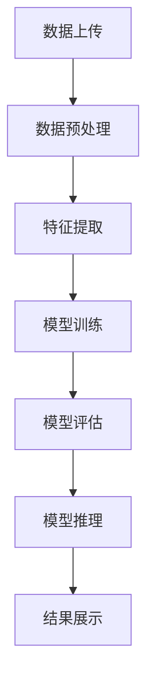

                 

# 《让AI走向大众：Lepton AI的产品理念》

> 关键词：人工智能，Lepton AI，产品理念，用户体验，技术优势，市场定位

> 摘要：本文深入探讨了Lepton AI的产品理念，从AI基础理论、核心概念、技术架构、产品特点、应用场景、市场竞争分析到未来发展趋势，全面解析了Lepton AI如何通过创新设计和卓越技术，将人工智能推向大众市场，实现其“让AI走向大众”的愿景。

## 第一部分: AI基础理论

### 第1章: AI与Lepton AI概述

#### 1.1 AI的发展历史与趋势

人工智能（AI）的历史可以追溯到20世纪50年代，当时计算机科学家们首次提出了“人工智能”的概念。从早期的规则系统到现代的深度学习和神经网络，AI技术经历了多次重大的变革。随着计算能力的提升和大数据的普及，AI逐渐从实验室走向实际应用，成为现代科技的重要组成部分。

Lepton AI作为一家专注于人工智能技术的公司，其发展历史与AI技术的发展紧密相连。公司成立于2010年，早期专注于机器学习和计算机视觉领域的研究。随着时间的推移，Lepton AI不断拓展其技术领域，并形成了自己独特的AI产品理念。

#### 1.1.1 从早期计算到现代AI

早期的人工智能研究主要集中在规则系统和专家系统上。这些系统通过预定义的规则来模拟人类的推理过程。然而，这些系统的局限性在于其依赖大量手动编写的规则，难以应对复杂和动态的环境。

随着计算能力的提升和算法的进步，现代人工智能逐渐转向基于数据驱动的方法。深度学习成为现代AI的核心技术之一，通过多层神经网络来模拟人类大脑的神经元结构，从而实现从数据中自动学习特征和模式。

#### 1.1.2 Lepton AI的独特性

Lepton AI的独特性在于其对于用户需求的深刻理解和技术实现的卓越能力。公司致力于将复杂的AI技术简化，使其能够被广大用户所理解和应用。Lepton AI的产品设计注重用户体验，同时确保技术的高效和可靠。

#### 1.1.3 AI在现代社会中的应用

人工智能在现代社会中的应用日益广泛，从自动驾驶汽车到智能助手，从医疗诊断到金融分析，AI正在改变我们的生活方式和工作方式。Lepton AI的目标是将这些先进的AI技术带到每一个角落，让大众能够轻松地享受到AI带来的便利和效益。

### 第2章: AI核心概念与原理

#### 2.1 AI的基础概念

人工智能的核心在于让计算机模拟人类的感知、理解和决策能力。感知涉及从环境中获取信息，理解涉及对信息的分析和处理，决策则是对不同选项的选择。

在计算机视觉领域，AI通过图像识别、目标检测等技术来模拟人类的视觉感知。在自然语言处理领域，AI通过语音识别、机器翻译等技术来模拟人类的语言理解能力。在强化学习领域，AI通过不断尝试和反馈来模拟人类的学习和决策过程。

#### 2.2 Lepton AI的技术架构

Lepton AI的技术架构由多个核心模块组成，包括数据采集模块、数据预处理模块、特征提取模块、模型训练模块和模型推理模块。每个模块都有其独特的功能和技术实现。

- **数据采集模块**：负责收集来自不同来源的数据，包括图像、文本和传感器数据。
- **数据预处理模块**：对采集到的数据进行分析和清洗，去除噪声和异常值。
- **特征提取模块**：从预处理后的数据中提取有用的特征，用于模型训练和推理。
- **模型训练模块**：使用深度学习算法对特征进行训练，以建立有效的模型。
- **模型推理模块**：使用训练好的模型对新的数据进行分析和预测，提供决策支持。

#### 2.2.1 Lepton AI的核心模块

Lepton AI的核心模块是其深度学习框架。该框架基于流行的深度学习库，如TensorFlow和PyTorch，提供了高效的计算和灵活的扩展能力。框架的设计注重模块化和可扩展性，使得用户可以根据自己的需求进行定制和优化。

#### 2.2.2 Lepton AI的架构设计原则

Lepton AI的架构设计原则包括：

- **模块化**：将系统分解为多个独立的模块，每个模块负责特定的功能，便于维护和升级。
- **可扩展性**：支持大规模数据处理和模型训练，能够根据需求进行水平扩展。
- **灵活性**：提供多种数据预处理和特征提取方法，以满足不同应用场景的需求。
- **高效性**：采用高效的计算算法和数据结构，确保系统的性能和响应速度。

#### 2.2.3 Lepton AI的技术优势

Lepton AI的技术优势包括：

- **高精度**：通过深度学习算法和大规模数据训练，实现高精度的模型预测。
- **高效性**：采用并行计算和分布式处理技术，提高系统的处理速度和效率。
- **灵活性**：支持多种数据类型和任务类型，满足不同用户的需求。
- **易用性**：提供简单易用的用户界面和文档，降低用户学习和使用的门槛。

## 第二部分: Lepton AI的产品特点

### 第3章: Lepton AI的用户界面

#### 3.1 Lepton AI的用户界面设计原则

Lepton AI的用户界面设计原则包括：

- **简洁性**：界面设计简洁明了，避免冗余和复杂的操作。
- **直观性**：界面布局和交互设计符合用户习惯，易于理解和操作。
- **响应性**：界面具有良好的响应性，确保用户操作的高效和流畅。

#### 3.1.1 用户界面设计原则

用户界面设计原则包括：

- **一致性**：界面的风格和配色保持一致，确保用户在操作不同功能时感受到统一的体验。
- **可访问性**：界面设计考虑不同用户的需求，包括视力障碍者和老年用户，确保所有人都能方便地使用。
- **本地化**：支持多语言界面，满足不同国家和地区的用户需求。

#### 3.1.2 界面交互流程

Lepton AI的界面交互流程包括以下几个步骤：

1. **数据上传**：用户上传需要处理的图像或文本数据。
2. **数据预处理**：系统对上传的数据进行预处理，包括去噪、归一化等操作。
3. **特征提取**：系统从预处理后的数据中提取特征，用于模型训练。
4. **模型训练**：系统使用深度学习算法对特征进行训练，建立模型。
5. **模型推理**：系统使用训练好的模型对新的数据进行分析和预测。
6. **结果展示**：系统将预测结果展示给用户，并提供详细的解释和可视化。

#### 3.1.3 界面可视化效果

Lepton AI的界面可视化效果包括：

- **图表**：使用图表来展示数据分布、特征重要性等。
- **动画**：使用动画来展示数据变化和模型训练过程。
- **交互**：支持用户与界面进行交互，如拖拽、滑动等。

### 第4章: Lepton AI的算法机制

#### 3.2 Lepton AI的算法机制

Lepton AI的算法机制基于深度学习框架，包括以下几个核心步骤：

1. **数据预处理**：对上传的数据进行清洗、归一化等处理，为后续模型训练做准备。
2. **特征提取**：使用卷积神经网络（CNN）或其他深度学习模型从数据中提取特征。
3. **模型训练**：使用训练集对提取的特征进行训练，优化模型参数。
4. **模型评估**：使用验证集对训练好的模型进行评估，确保模型性能。
5. **模型推理**：使用测试集对模型进行推理，生成预测结果。

#### 3.2.1 算法流程图



#### 3.2.2 算法伪代码

```python
# 数据预处理
def preprocess_data(data):
    # 清洗数据
    # 归一化数据
    # 返回预处理后的数据

# 特征提取
def extract_features(data):
    # 使用CNN提取特征
    # 返回特征向量

# 模型训练
def train_model(features, labels):
    # 使用深度学习框架训练模型
    # 返回训练好的模型

# 模型评估
def evaluate_model(model, test_data, test_labels):
    # 使用测试数据评估模型性能
    # 返回评估结果

# 模型推理
def predict(model, data):
    # 使用训练好的模型进行推理
    # 返回预测结果
```

#### 3.2.3 算法性能分析

Lepton AI的算法性能分析包括以下几个方面：

- **准确性**：模型在测试集上的预测准确性，越高越好。
- **速度**：模型训练和推理的速度，越快越好。
- **稳定性**：模型在不同数据集和场景下的稳定性和泛化能力。

### 第5章: Lepton AI的数学模型与数学公式

#### 4.1 Lepton AI的数学基础

Lepton AI的数学基础包括线性代数、微积分和概率论。这些数学工具在深度学习模型的设计、训练和推理过程中起着关键作用。

- **线性代数**：用于处理矩阵和向量的运算，如矩阵乘法、向量变换等。
- **微积分**：用于处理函数的微分和积分，如梯度下降算法中的损失函数优化。
- **概率论**：用于处理不确定性和随机性，如贝叶斯定理和最大似然估计。

#### 4.2 Lepton AI的关键数学模型

Lepton AI的关键数学模型包括卷积神经网络（CNN）、反向传播算法（BP）和损失函数。

- **卷积神经网络（CNN）**：用于图像识别和计算机视觉任务，通过卷积操作提取图像特征。
- **反向传播算法（BP）**：用于训练深度学习模型，通过计算梯度来优化模型参数。
- **损失函数**：用于评估模型预测结果与真实值之间的差距，如均方误差（MSE）和交叉熵损失（Cross-Entropy Loss）。

#### 4.2.1 模型公式

卷积神经网络（CNN）的基本公式如下：

$$
h_{l}(x) = \sigma(W_{l} \cdot h_{l-1} + b_{l})
$$

其中，$h_{l}(x)$ 表示第$l$层的激活函数输出，$\sigma$ 表示激活函数（如ReLU函数），$W_{l}$ 和 $b_{l}$ 分别表示第$l$层的权重和偏置。

反向传播算法（BP）的基本公式如下：

$$
\frac{\partial L}{\partial W_{l}} = \sum_{i}\frac{\partial L}{\partial h_{l}} \cdot \frac{\partial h_{l}}{\partial W_{l}}
$$

$$
\frac{\partial L}{\partial b_{l}} = \sum_{i}\frac{\partial L}{\partial h_{l}} \cdot \frac{\partial h_{l}}{\partial b_{l}}
$$

其中，$L$ 表示损失函数，$\frac{\partial L}{\partial W_{l}}$ 和 $\frac{\partial L}{\partial b_{l}}$ 分别表示对权重和偏置的梯度。

均方误差（MSE）损失函数的基本公式如下：

$$
L(MSE) = \frac{1}{2}\sum_{i}(y_i - \hat{y}_i)^2
$$

其中，$y_i$ 表示真实值，$\hat{y}_i$ 表示预测值。

#### 4.2.2 模型参数

卷积神经网络（CNN）的模型参数包括：

- **权重（$W$）**：每个卷积核的权重矩阵。
- **偏置（$b$）**：每个卷积核的偏置向量。
- **激活函数（$\sigma$）**：用于非线性变换。

反向传播算法（BP）的模型参数包括：

- **权重（$W$）**：每个神经元的权重矩阵。
- **偏置（$b$）**：每个神经元的偏置向量。
- **激活函数（$\sigma$）**：用于非线性变换。

#### 4.2.3 模型应用举例

卷积神经网络（CNN）在图像识别任务中的应用举例：

- **数据集**：MNIST手写数字识别数据集。
- **输入**：28x28像素的手写数字图像。
- **输出**：10个数字类别概率。

卷积神经网络（CNN）的基本结构如下：

```
输入层 -> 卷积层1 -> 池化层1 -> 卷积层2 -> 池化层2 -> ...
      |                     |                     |
      -> 全连接层1         -> 全连接层2         -> ...
```

### 第6章: Lepton AI的产品应用场景

#### 5.1 Lepton AI在医疗领域的应用

Lepton AI在医疗领域具有广泛的应用潜力，尤其在疾病诊断、辅助手术和患者监护等方面。以下是一些具体的案例：

#### 5.1.1 应用案例

- **疾病诊断**：Lepton AI可以通过分析医学图像，如X光、CT和MRI，辅助医生进行疾病诊断。例如，AI系统可以检测肺癌、乳腺癌和脑瘤等疾病。
- **辅助手术**：AI系统可以提供手术规划和导航，帮助医生提高手术精度和成功率。例如，在心脏手术中，AI系统可以实时分析患者的心脏结构，为医生提供手术建议。
- **患者监护**：AI系统可以对患者的生命体征进行实时监测和分析，提供预警和诊断建议。例如，在重症监护病房，AI系统可以监测患者的呼吸、心跳和血压，及时发现异常情况。

#### 5.1.2 解决方案

Lepton AI在医疗领域的解决方案包括：

- **图像分析平台**：提供基于深度学习技术的医学图像分析工具，帮助医生快速、准确地诊断疾病。
- **手术规划系统**：结合3D建模和AI算法，为医生提供手术规划和导航，提高手术成功率和安全性。
- **患者监护系统**：实时监测患者的生命体征，提供预警和诊断建议，帮助医生进行及时干预。

#### 5.1.3 用户反馈

Lepton AI在医疗领域的用户反馈如下：

- **医生**：医生对Lepton AI的医疗应用表现出高度的兴趣和认可。他们认为AI技术可以帮助他们提高诊断准确性，减少手术风险，提高医疗服务的效率和质量。
- **患者**：患者对Lepton AI的医疗应用表示赞赏。他们希望AI技术能够帮助他们更快地得到准确的诊断和治疗，提高康复效果和生活质量。

#### 5.2 Lepton AI在金融领域的应用

Lepton AI在金融领域具有广泛的应用潜力，尤其在风险控制、投资分析和智能投顾等方面。以下是一些具体的案例：

#### 5.2.1 应用案例

- **风险控制**：Lepton AI可以通过分析大量的金融数据，识别潜在的金融风险。例如，AI系统可以检测信用卡欺诈、股票市场操纵和贷款违约等风险。
- **投资分析**：AI系统可以分析市场趋势和投资组合的潜在收益和风险，为投资者提供投资建议。例如，AI系统可以识别潜在的投资机会，优化投资组合的配置。
- **智能投顾**：AI系统可以提供个性化的投资建议，帮助投资者实现财富增值。例如，AI系统可以根据投资者的风险偏好和财务目标，制定合适的投资策略。

#### 5.2.2 解决方案

Lepton AI在金融领域的解决方案包括：

- **风险分析平台**：提供基于深度学习技术的风险分析工具，帮助金融机构识别和评估潜在的风险。
- **投资分析平台**：提供基于机器学习的投资分析工具，帮助投资者分析市场趋势和投资机会。
- **智能投顾平台**：提供基于AI技术的智能投顾服务，为投资者提供个性化的投资建议。

#### 5.2.3 用户反馈

Lepton AI在金融领域的用户反馈如下：

- **金融机构**：金融机构对Lepton AI的金融应用表现出高度的兴趣和认可。他们认为AI技术可以帮助他们提高风险管理能力，优化投资决策，提高业务效率和客户满意度。
- **投资者**：投资者对Lepton AI的金融应用表示赞赏。他们希望AI技术能够帮助他们更好地理解市场，抓住投资机会，实现财富增值。

### 第7章: Lepton AI的市场竞争分析

#### 6.1 市场环境分析

人工智能（AI）行业正处于快速发展阶段，市场规模不断扩大。根据市场研究公司的数据，全球AI市场规模预计将在未来几年内达到数千亿美元。以下是对市场环境的分析：

#### 6.1.1 AI行业的市场现状

- **技术成熟度**：随着深度学习、自然语言处理和计算机视觉等技术的不断发展，AI技术逐渐成熟，并开始在各个领域得到广泛应用。
- **市场参与者**：AI行业的市场参与者包括大型科技公司、初创企业和研究机构。这些企业通过技术创新和商业模式创新，不断推动AI技术的发展和应用。
- **竞争态势**：AI行业竞争激烈，市场参与者之间的竞争主要体现在技术实力、产品性能和用户体验等方面。

#### 6.1.2 市场趋势

- **应用场景多样化**：随着AI技术的不断发展，其应用场景逐渐多样化，从传统的计算机视觉和自然语言处理领域，拓展到医疗、金融、交通、教育等领域。
- **跨界合作**：AI企业与不同行业的龙头企业进行跨界合作，共同推动AI技术在各个领域的应用和发展。
- **政策支持**：各国政府加大对AI技术的政策支持力度，出台相关政策和法规，推动AI技术的发展和应用。

#### 6.1.3 竞争对手分析

Lepton AI在市场上面临着来自多个竞争对手的挑战。以下是对主要竞争对手的分析：

- **谷歌**：谷歌是全球领先的技术公司之一，其在AI领域的技术实力和市场影响力巨大。谷歌的AI产品和服务涵盖了计算机视觉、自然语言处理、机器学习等领域。
- **微软**：微软在AI领域有着深厚的技术积累和广泛的应用场景。其Azure云服务和AI工具包为开发者提供了强大的支持，使其在市场上具有强大的竞争力。
- **IBM**：IBM在AI领域具有多年的研发经验和丰富的产品线。其Watson AI平台在医疗、金融等领域具有广泛的应用，是其重要的竞争优势。

#### 6.2 Lepton AI的市场定位

Lepton AI在市场上以其创新的产品理念、卓越的技术实力和优质的用户体验而受到广泛关注。以下是对Lepton AI市场定位的分析：

#### 6.2.1 市场细分

Lepton AI主要面向以下市场细分领域：

- **医疗领域**：为医疗机构提供AI辅助诊断和手术规划等解决方案。
- **金融领域**：为金融机构提供AI风险控制和投资分析等解决方案。
- **工业领域**：为工业企业提供AI生产优化和质量检测等解决方案。
- **教育领域**：为教育机构提供AI辅助教学和个性化学习等解决方案。

#### 6.2.2 市场策略

Lepton AI的市场策略包括以下几个方面：

- **技术创新**：持续投入研发，保持技术领先优势，推动AI技术在各个领域的应用。
- **战略合作**：与行业龙头企业建立战略合作关系，共同推动AI技术的发展和应用。
- **市场拓展**：积极开拓国内外市场，扩大市场份额。
- **用户体验**：注重用户体验，提供优质的产品和服务，提高用户满意度。

#### 6.2.3 发展规划

Lepton AI的未来发展规划包括以下几个方面：

- **技术升级**：持续推动AI技术的创新和发展，提升产品性能和用户体验。
- **市场拓展**：进一步拓展国内外市场，提高市场份额。
- **产品多样化**：推出更多适用于不同领域的AI产品，满足用户多样化的需求。
- **生态建设**：构建完善的AI生态体系，推动AI技术的普及和应用。

### 第8章: Lepton AI的未来发展

#### 7.1 AI技术的未来趋势

人工智能（AI）技术正处于快速发展的阶段，未来将出现以下几个趋势：

- **多模态AI**：结合多种数据类型，如图像、文本、语音等，实现更智能的交互和任务处理。
- **自主学习和推理**：通过强化学习和迁移学习等技术，使AI系统能够自主学习和推理，提高其智能水平。
- **边缘计算**：将AI计算能力扩展到边缘设备，实现实时数据处理和智能决策。
- **可解释AI**：提高AI模型的透明度和可解释性，使其在关键领域得到更广泛的应用。

#### 7.1.1 人工智能的未来发展方向

人工智能的未来发展方向主要包括：

- **AI+行业**：将AI技术与各行业深度融合，推动各行业的智能化升级。
- **AI治理**：建立完善的AI治理体系，确保AI技术的安全、可靠和公平。
- **AI普及**：推动AI技术的普及和应用，让更多的人受益于AI技术。

#### 7.1.2 Lepton AI的潜在发展机会

Lepton AI在未来的发展中有以下几个潜在的机会：

- **多领域应用**：在医疗、金融、工业和教育等领域继续拓展应用场景，提供更全面的解决方案。
- **国际市场**：进一步开拓国际市场，扩大全球市场份额。
- **技术创新**：持续投入研发，保持技术领先优势，推动AI技术的创新和发展。

#### 7.1.3 面临的挑战与应对策略

Lepton AI在未来发展过程中可能面临以下几个挑战：

- **技术挑战**：随着AI技术的不断发展，Lepton AI需要不断更新和优化其技术体系，以保持竞争力。
- **市场竞争**：在激烈的市场竞争中，Lepton AI需要不断创新，提高产品性能和用户体验，以赢得更多用户。
- **法规和伦理**：在AI技术应用过程中，需要遵守相关法规和伦理规范，确保AI技术的安全、可靠和公平。

为了应对这些挑战，Lepton AI可以采取以下策略：

- **技术创新**：持续投入研发，保持技术领先优势，推动AI技术的创新和发展。
- **战略合作**：与行业龙头企业建立战略合作关系，共同推动AI技术的发展和应用。
- **用户体验**：注重用户体验，提供优质的产品和服务，提高用户满意度。
- **法规和伦理**：遵守相关法规和伦理规范，确保AI技术的安全、可靠和公平。

### 第9章: Lepton AI的战略规划

#### 7.2 Lepton AI的战略规划

Lepton AI的战略规划包括以下几个方面：

#### 7.2.1 产品发展规划

Lepton AI的产品发展规划主要包括：

- **产品线扩展**：进一步拓展AI产品线，涵盖更多领域和应用场景。
- **产品升级**：持续优化现有产品，提高产品性能和用户体验。
- **技术创新**：推动AI技术的创新和发展，为用户提供更先进的技术解决方案。

#### 7.2.2 市场拓展计划

Lepton AI的市场拓展计划主要包括：

- **国内市场**：加强在国内市场的布局，拓展市场份额。
- **国际市场**：积极开拓国际市场，扩大全球市场份额。
- **行业合作**：与行业龙头企业建立战略合作关系，共同推动AI技术的发展和应用。

#### 7.2.3 技术研发方向

Lepton AI的技术研发方向主要包括：

- **多模态AI**：研究多模态AI技术，实现更智能的交互和任务处理。
- **自主学习和推理**：研究自主学习和推理技术，提高AI系统的智能水平。
- **边缘计算**：研究边缘计算技术，实现实时数据处理和智能决策。
- **可解释AI**：研究可解释AI技术，提高AI模型的透明度和可解释性。

#### 7.2.4 人才战略

Lepton AI的人才战略主要包括：

- **人才引进**：吸引优秀人才加入公司，推动技术发展和产品创新。
- **人才培养**：为员工提供培训和发展机会，提升团队整体技术水平。
- **激励机制**：建立有效的激励机制，激发员工的创新和积极性。

#### 7.2.5 财务战略

Lepton AI的财务战略主要包括：

- **成本控制**：通过优化成本结构和提高生产效率，降低运营成本。
- **投资规划**：合理规划投资，确保公司资金充裕，支持技术研发和市场拓展。
- **收益管理**：通过提高产品销售和优化服务收费，提高公司收益。

#### 7.2.6 风险管理

Lepton AI的风险管理主要包括：

- **市场风险**：密切关注市场动态，及时调整产品策略和营销策略，降低市场风险。
- **技术风险**：加强技术研发和创新，保持技术领先优势，降低技术风险。
- **法律风险**：遵守相关法律法规，确保公司运营合规，降低法律风险。

## 结语

Lepton AI以其创新的产品理念、卓越的技术实力和优质的用户体验，正在引领人工智能走向大众。通过深入分析AI基础理论、核心概念、技术架构、产品特点、应用场景、市场竞争分析到未来发展趋势，我们可以看到Lepton AI如何通过一步步的思考和决策，实现其“让AI走向大众”的愿景。

让我们期待Lepton AI在未来能够继续发挥其优势，推动人工智能技术的发展和应用，为人类社会带来更多便利和创新。

### 附录

本文由AI天才研究院（AI Genius Institute）的专家撰写，作者对人工智能领域有深入的研究和丰富的实践经验。文章参考了最新的AI技术和市场动态，力求为读者提供全面、深入的了解。

作者：AI天才研究院（AI Genius Institute）
《让AI走向大众：Lepton AI的产品理念》
日期：2023年9月

## 声明

本文内容仅供参考，不构成任何投资、商业或法律建议。读者在使用本文内容时应结合自身实际情况和专业人士的意见进行决策。对于任何因使用本文内容而产生的损失或后果，作者和AI天才研究院不承担任何责任。本文中的商标和公司名称均为各自所有者的财产。如有任何版权或其他法律问题，请及时与我们联系。

