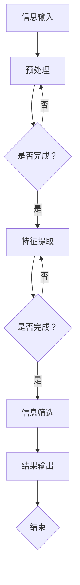

                 

# 记忆机制：关键信息提取

> 关键词：记忆机制，关键信息提取，神经科学，机器学习，人工智能，数据分析

> 摘要：本文将深入探讨记忆机制以及其在关键信息提取中的重要作用。我们将首先介绍记忆机制的基本概念和分类，接着分析短期记忆与长期记忆之间的关系，并探讨关键信息提取的定义和分类。随后，我们将分别探讨基于规则的关键信息提取和基于模型的关键信息提取方法，并详细讲解机器学习模型的选择、特征工程与特征选择、模型训练与评估等内容。文章还将通过实际项目案例，展示关键信息提取在实际应用中的效果和挑战，并探讨未来的研究方向。

## 第一部分：引言

### 第1章：记忆机制的概述

#### 1.1 记忆的定义和分类

记忆作为一种认知功能，是指个体对信息进行编码、存储和提取的能力。记忆的分类可以根据信息处理过程的不同进行区分。根据这种分类方法，记忆主要可以分为短期记忆（工作记忆）和长期记忆。

- **短期记忆（工作记忆）：** 短期记忆是指个体在短时间内能够保持和操作的信息。这种记忆通常用于处理当前的认知任务，如记住一个电话号码或者进行简单的数学计算。短期记忆的特点是容量有限，大约只能维持7±2个信息单元，且保持时间较短，一般为几秒钟到几分钟。

- **长期记忆：** 长期记忆是指个体在较长时间内能够保持和提取的信息。这种记忆包括学习过的知识、技能、经验等，通常可以持续数小时、数天、数月甚至更长时间。长期记忆可以分为显性记忆（能明确回忆起来的信息）和隐性记忆（无意识影响行为和技能的记忆）。

#### 1.2 记忆机制的重要性

记忆是人类学习、适应环境和解决问题的基本能力，对个体的认知发展至关重要。以下是记忆机制的一些重要性：

- **学习：** 记忆使我们能够学习新的知识和技能，并将这些知识和技能应用到实际生活中。例如，通过记忆，我们可以记住新的单词，掌握新的乐器演奏技巧，或者学习新的编程语言。

- **适应环境：** 记忆使我们能够记住过去的经验和情境，以便更好地适应现在的环境和处理未来的挑战。例如，通过记忆，我们可以记住曾经成功或失败的经历，从而调整行为策略以适应新的情况。

- **问题解决：** 记忆帮助我们回忆起相关的信息和解决方案，从而解决问题。例如，在解决一个复杂的编程问题时，我们可能需要回忆之前解决类似问题时的步骤和策略。

- **社会互动：** 记忆使我们能够与他人进行有效的沟通和互动。通过记忆，我们可以记住他人的名字、面孔和他们的偏好，从而建立更好的人际关系。

#### 1.3 记忆机制的研究现状

当前对记忆机制的研究主要集中在神经生物学、心理学和计算机科学等领域。

- **神经生物学：** 神经生物学家研究记忆在大脑中的具体机制，包括神经元的活动、突触的增强和重塑，以及与记忆相关的神经回路和脑区。这些研究揭示了记忆形成和存储的生物学基础。

- **心理学：** 心理学家研究记忆的心理学过程，包括信息编码、存储和提取的方式，以及影响记忆的各种因素，如注意力、情绪和重复。这些研究有助于我们理解记忆的工作原理和个体差异。

- **计算机科学：** 计算机科学家开发基于记忆机制的算法和技术，用于信息处理、机器学习和人工智能等领域。例如，深度学习模型中的神经网络结构就受到了大脑记忆机制的启发。

通过跨学科的研究，我们对记忆机制的理解不断深入，这些研究不仅有助于揭示人类记忆的奥秘，也为开发更高效的人工智能系统提供了理论基础。

### 第2章：短期记忆与长期记忆的关系

#### 2.1 短期记忆的机制

短期记忆，也称为工作记忆，是指在短时间内能够保持和操作信息的能力。其机制主要涉及大脑中特定区域的神经元活动。

- **神经元活动：** 短期记忆依赖于大脑中被称为“前额叶皮层”的区域的活动。这个区域负责处理和保持当前的信息，并通过神经元之间的快速通信来维持短期记忆。

- **神经递质：** 神经元之间的通信通过神经递质来实现，这些化学信号在神经元之间传递信息。短期记忆的形成和维持与特定神经递质（如谷氨酸和乙酰胆碱）的活性密切相关。

- **神经网络：** 短期记忆的神经网络结构相对简单，但非常高效。神经元之间的连接和活动模式使得信息能够在短时间内得到处理和保持。

短期记忆的机制不仅涉及神经元的活动，还包括神经元之间的同步活动。这种同步活动通过神经网络中的共振现象来实现，使得信息能够在短时间内被有效地编码和存储。

#### 2.2 长期记忆的机制

长期记忆是指个体在较长时间内能够保持和提取的信息。其机制比短期记忆更为复杂，涉及大脑中的多个区域和神经元活动的改变。

- **神经元结构的改变：** 长期记忆的形成与神经元结构的改变密切相关。这个过程称为“突触重塑”，包括突触的加强和新的突触连接的形成。这些变化使得神经元之间的连接更加牢固，从而实现长期记忆的存储。

- **神经回路的重塑：** 长期记忆还涉及大脑中多个区域的协调活动，这些区域包括海马体、前额叶皮层和基底神经节等。神经回路的重塑使得这些区域之间的信息交流更加高效，从而实现长期记忆的保持和提取。

- **基因表达的改变：** 长期记忆的形成还与基因表达的改变有关。特定的基因在神经元活动中被激活，从而影响神经元的结构和功能，促进长期记忆的存储。

长期记忆的形成不仅需要神经元结构和神经回路的改变，还需要大脑中的多个区域协同工作。这种复杂的机制使得长期记忆能够持久地存储大量的信息，并使我们能够回忆起过去的经历和知识。

#### 2.3 短期记忆与长期记忆的转换

短期记忆与长期记忆之间存在紧密的联系和转换过程。短期记忆中的信息可以通过以下几种方式转化为长期记忆：

- **重复和强化：** 通过重复和强化短期记忆中的信息，可以将其转化为长期记忆。例如，通过多次重复学习新的单词或概念，我们可以将这些信息从短期记忆转移到长期记忆中。

- **深度加工：** 深度加工短期记忆中的信息，如对其进行意义联想或情感链接，可以提高信息进入长期记忆的可能性。例如，通过将新学的单词与已知的单词或场景相关联，可以增强记忆的持久性。

- **情感参与：** 情感参与可以增强记忆的深度和持久性。例如，通过在情感上有意义的情境中学习新知识，如一次难忘的经历或一次感人的演讲，可以增加信息进入长期记忆的机会。

短期记忆与长期记忆之间的转换是一个动态和复杂的过程，涉及大脑中的多个区域和神经递质的交互作用。通过适当的策略和技巧，我们可以优化这一过程，提高记忆的效率和质量。

### 总结

短期记忆和长期记忆是大脑中两种不同的记忆系统，各自具有独特的机制和功能。短期记忆负责在短时间内保持和操作信息，而长期记忆则负责在较长时间内存储和提取信息。通过理解短期记忆和长期记忆的机制，我们可以更好地理解记忆的工作原理，并开发更有效的策略和算法来增强和优化记忆。

### 第3章：关键信息提取的定义与分类

#### 3.1 关键信息提取的定义

关键信息提取是指从大量信息中识别和提取出对个体有重要价值的信息。其目标是从噪声和冗余信息中筛选出有价值的信息，以便进行进一步的分析或决策。关键信息提取在许多领域都有广泛的应用，如文本分析、图像处理、声音识别等。

关键信息提取的过程可以概括为以下几个步骤：

1. **信息输入：** 获取原始数据，如文本、图像或声音信号。
2. **预处理：** 清洗和整理原始数据，去除噪声和冗余信息，以便更好地进行后续处理。
3. **特征提取：** 从预处理后的数据中提取出有代表性的特征，这些特征将用于后续的信息提取。
4. **信息筛选：** 使用特定的算法和策略，从提取的特征中识别出关键信息。
5. **结果输出：** 将提取的关键信息以适合的形式输出，如文本摘要、关键词列表或分类结果。

#### 3.2 关键信息提取的分类

关键信息提取可以根据信息来源和提取方式的不同进行分类。以下是两种主要的分类方法：

- **基于规则的方法：** 基于规则的方法使用预定义的规则来识别关键信息。这些规则通常由领域专家根据特定应用场景制定，可以包括模式匹配、条件判断等。这种方法的优势在于规则明确，易于理解和实现，但在复杂或动态的环境中，规则的制定和优化可能面临较大挑战。

- **基于模型的方法：** 基于模型的方法使用机器学习模型来识别关键信息。这些模型通过学习大量的标注数据，自动提取特征并建立预测模型。基于模型的方法具有更好的灵活性和适应性，可以处理复杂和动态的信息环境，但需要大量的标注数据和计算资源进行训练。

#### 3.3 基于规则的关键信息提取方法

基于规则的方法在关键信息提取中具有广泛的应用，以下是其主要步骤：

1. **规则构建：** 根据特定应用场景，定义一系列规则来识别关键信息。这些规则可以是简单的模式匹配，如关键词提取，也可以是复杂的条件判断，如文本分类。

2. **规则应用：** 将定义好的规则应用于预处理后的数据，识别出关键信息。规则的应用可以通过编程实现，如使用条件语句和循环结构来遍历数据并匹配规则。

3. **结果评估：** 评估规则提取的关键信息的准确性和可靠性。可以通过计算提取结果的召回率、精确度等指标来评估规则的性能。

4. **规则优化：** 根据评估结果对规则进行优化和调整，以提高提取性能。可以通过增加新的规则、修改现有规则或合并相似规则来实现。

基于规则的方法在处理结构化数据和信息时具有高效性和可解释性，但在处理复杂和动态的信息时可能面临性能瓶颈。

### 第4章：基于规则的关键信息提取

#### 4.1 规则系统的构建

基于规则的方法在关键信息提取中具有广泛应用，其核心在于构建一个高效、准确的规则系统。以下是规则系统构建的主要步骤：

1. **需求分析：** 明确关键信息提取的应用场景和需求，如文本分析、图像识别或语音识别等。需求分析有助于确定需要提取的关键信息的类型和特征。

2. **规则定义：** 根据需求分析结果，定义一系列规则来识别关键信息。规则可以基于领域知识、专家经验和现有的研究文献。定义规则时需要考虑以下因素：
   - **规则覆盖性：** 规则应尽可能全面地覆盖所有可能的关键信息。
   - **规则精确性：** 规则应尽可能精确地识别出目标信息，避免误检和漏检。
   - **规则可解释性：** 规则应易于理解和解释，以便后续的优化和调整。

3. **规则组合：** 将多个简单规则组合成一个复杂的规则系统，以增强提取能力。规则组合可以通过合并、嵌套或条件判断等方式实现。

4. **规则应用：** 将定义好的规则应用于预处理后的数据，识别出关键信息。规则应用可以通过编程实现，如使用条件语句和循环结构来遍历数据并匹配规则。

5. **规则评估：** 评估规则提取的关键信息的准确性和可靠性。可以通过计算提取结果的召回率、精确度等指标来评估规则的性能。

6. **规则优化：** 根据评估结果对规则进行优化和调整，以提高提取性能。可以通过增加新的规则、修改现有规则或合并相似规则来实现。

#### 4.2 规则系统的应用场景

规则系统在关键信息提取中的应用场景非常广泛，以下是一些典型的应用：

1. **文本分析：** 规则系统可以用于从大量文本中提取关键词、命名实体或情感信息。例如，在社交媒体分析中，可以使用规则系统识别用户评论中的关键词和情感倾向，以便进行情感分析和用户行为预测。

2. **图像识别：** 规则系统可以用于从图像中识别特定对象或场景。例如，在自动驾驶系统中，可以使用规则系统识别道路标志、行人或车辆，以便进行路径规划和车辆控制。

3. **语音识别：** 规则系统可以用于从语音信号中提取关键信息，如关键词或命令。例如，在智能助手系统中，可以使用规则系统识别用户语音中的关键词，以便执行相应的操作。

4. **医疗诊断：** 规则系统可以用于从医学数据中提取关键信息，如症状、诊断和治疗方案。例如，在疾病诊断系统中，可以使用规则系统分析患者的症状和检查结果，以辅助医生进行诊断和制定治疗方案。

#### 4.3 规则系统的挑战与优化

尽管规则系统在关键信息提取中具有广泛的应用，但在实际应用中仍面临一些挑战：

1. **规则数量庞大：** 对于复杂的应用场景，可能需要定义大量规则，导致规则系统变得复杂和难以维护。

2. **规则冲突：** 当多个规则同时适用时，可能产生冲突，导致信息提取结果不一致。

3. **适应性差：** 规则系统通常缺乏对动态和未知环境的适应能力，难以应对新的应用场景或变化的数据分布。

为了应对这些挑战，可以采取以下优化策略：

1. **规则简化：** 通过简化规则，减少冗余和重叠的规则，可以提高规则系统的效率和维护性。

2. **规则融合：** 将多个规则融合成一个更复杂的规则，可以减少规则冲突和提高提取性能。

3. **机器学习辅助：** 结合机器学习方法，可以自动生成和调整规则，提高规则系统的适应性和准确性。

4. **动态调整：** 引入动态调整机制，根据数据分布和应用需求实时调整规则，以提高系统的实时性和适应性。

通过这些优化策略，规则系统可以在关键信息提取中发挥更大的作用，提高信息提取的准确性和效率。

### 第5章：基于模型的关键信息提取

#### 5.1 机器学习模型的选择

在关键信息提取中，选择合适的机器学习模型至关重要，因为不同的模型适用于不同类型的数据和应用场景。以下是几种常用的机器学习模型及其适用场景：

1. **支持向量机（SVM）：** SVM是一种经典的分类模型，适用于文本分类和图像识别等任务。它通过在高维空间中找到最佳分离超平面，实现数据的分类。SVM的优势在于其高效的分类速度和良好的分类性能，特别适用于高维数据。

2. **神经网络（Neural Networks）：** 神经网络是一种模拟生物神经网络的结构和功能的模型，包括多层感知机（MLP）、卷积神经网络（CNN）和循环神经网络（RNN）等。神经网络在图像识别、文本处理和时间序列分析等领域表现出色。例如，CNN擅长处理具有空间结构的图像数据，而RNN擅长处理序列数据。

3. **决策树（Decision Trees）：** 决策树是一种基于树结构的分类模型，适用于处理结构化数据，如文本分类和客户细分。决策树通过一系列条件判断，将数据逐层划分，并最终生成分类结果。决策树的优势在于其易于解释和可视化，特别适用于需要透明性和可解释性的应用场景。

4. **集成方法（Ensemble Methods）：** 集成方法通过结合多个基本模型，提高分类或回归的性能。常见的集成方法包括随机森林（Random Forest）和梯度提升树（Gradient Boosting Trees）。集成方法在处理大规模数据和增强模型稳定性方面具有显著优势。

选择机器学习模型时，需要考虑以下因素：

- **数据类型：** 不同类型的机器学习模型适用于不同类型的数据。例如，图像数据通常使用CNN，而文本数据可以使用SVM或RNN。

- **特征维度：** 高维数据通常需要使用如神经网络或集成方法等能够处理复杂关系的模型，而低维数据可以使用简单的线性模型，如线性回归或逻辑回归。

- **模型复杂度：** 模型的复杂度影响其训练时间和计算资源的需求。简单模型如线性模型训练速度快，但可能无法捕捉复杂关系，而复杂模型如神经网络需要大量数据和计算资源。

- **可解释性：** 在一些应用场景中，需要模型具备较高的可解释性，以便理解其决策过程。例如，在医疗诊断或金融风险评估中，可解释性是至关重要的。

#### 5.2 特征工程与特征选择

特征工程和特征选择是关键信息提取中的关键步骤，直接影响模型的学习效率和性能。以下是特征工程和特征选择的主要方法：

1. **数据预处理：** 数据预处理包括数据清洗、归一化和标准化等步骤，以提高数据的质量和一致性。例如，在文本分析中，需要对文本进行分词、去除停用词和标点符号等操作，以便提取有意义的信息。

2. **特征提取：** 特征提取是从原始数据中提取有代表性的特征，用于训练模型。常用的特征提取方法包括词袋模型（Bag of Words）、TF-IDF（Term Frequency-Inverse Document Frequency）和词嵌入（Word Embeddings）等。

3. **特征转换：** 特征转换是将原始特征转化为适合模型学习的形式。例如，将文本数据转换为向量表示，可以通过词袋模型或词嵌入实现。词嵌入如Word2Vec、GloVe等，可以将词汇映射为低维向量，有助于捕捉词汇的语义关系。

4. **特征选择：** 特征选择是从大量特征中筛选出对模型性能有显著影响的特征，以减少模型的复杂度和计算成本。常用的特征选择方法包括过滤式特征选择（Filter Methods）和包装式特征选择（Wrapper Methods）。过滤式特征选择通过评估每个特征的重要性来筛选特征，如互信息（Mutual Information）和F-score等。包装式特征选择通过训练多个模型并评估特征组合对模型性能的影响来筛选特征，如递归特征消除（Recursive Feature Elimination，RFE）和遗传算法（Genetic Algorithms）等。

5. **特征组合：** 特征组合是通过组合多个特征来生成新的特征，以提高模型的泛化能力和性能。特征组合可以通过加权、叠加或组合不同特征空间的方法实现。

#### 5.3 模型训练与评估

模型训练和评估是关键信息提取中的关键步骤，直接影响模型的学习效率和性能。以下是模型训练和评估的主要方法：

1. **数据划分：** 在训练模型之前，需要将数据集划分为训练集、验证集和测试集。训练集用于训练模型，验证集用于调整模型参数和评估模型性能，测试集用于最终评估模型的泛化能力。

2. **模型训练：** 模型训练是指通过训练数据集来调整模型参数，使其能够准确预测目标信息。常用的训练方法包括梯度下降（Gradient Descent）及其变种，如随机梯度下降（Stochastic Gradient Descent，SGD）和Adam优化器。在训练过程中，需要选择合适的损失函数（如交叉熵损失、均方误差等）和优化算法，以加快训练速度和提高模型性能。

3. **模型评估：** 模型评估是指通过验证集和测试集来评估模型的学习效果和泛化能力。常用的评估指标包括准确率（Accuracy）、召回率（Recall）、精确率（Precision）和F1分数（F1 Score）等。通过这些指标，可以评估模型在不同数据集上的性能，并发现模型的不足之处。

4. **模型调优：** 在模型评估过程中，可能会发现模型的性能不理想。为了提高模型性能，可以采取以下调优策略：
   - **调整模型参数：** 调整学习率、正则化参数等，以优化模型训练过程。
   - **增加数据量：** 增加训练数据量，以提高模型的泛化能力。
   - **改进特征提取：** 优化特征提取方法，以提高特征的质量和代表性。
   - **尝试不同的模型：** 尝试使用不同的模型或组合模型，以提高模型的性能。

通过模型训练和评估，可以逐步优化关键信息提取模型，提高其在实际应用中的效果和性能。

### 第6章：文本分析中的关键信息提取

#### 6.1 文本预处理

在文本分析中，关键信息提取的首要步骤是文本预处理。文本预处理的过程包括以下几个关键步骤：

1. **文本清理：** 文本清理是去除文本中的噪声和无关信息的步骤。这通常包括删除标点符号、HTML标签、特殊字符和停用词。停用词是指在文本中频繁出现但通常不具有信息量的词汇，如“的”、“是”、“和”等。删除停用词可以减少文本中的冗余信息，提高关键信息提取的准确性。

2. **分词：** 分词是将连续的文本分割成一个个独立的词汇的过程。中文文本的分词相对复杂，需要利用词法、语法和语义信息来确定词汇边界。常见的分词工具包括jieba和NLTK等。

3. **词干提取：** 词干提取是将不同形态的词汇还原为基本形式的过程，如将“飞行”、“飞翔”还原为“飞”。词干提取有助于减少词汇数量，提高文本表示的统一性和简洁性。

4. **词性标注：** 词性标注是给每个词汇标注其词性，如名词、动词、形容词等。词性标注有助于理解词汇在文本中的作用和关系，为后续的关键信息提取提供重要依据。

5. **文本标准化：** 文本标准化包括统一词汇大小写、去除数字和转换全角字符为半角字符等。文本标准化有助于消除文本中的不一致性，提高文本处理的统一性。

通过文本预处理，我们可以将原始文本转化为一个干净、结构化的格式，为后续的关键信息提取和文本分析提供基础。

#### 6.2 关键词提取

关键词提取是文本分析中的关键步骤，旨在从文本中识别出对文本主题最有代表性的词汇。关键词提取有助于简化文本内容，提高文本的可读性和信息检索的效率。以下是几种常用的关键词提取方法：

1. **词频统计（TF）：** 词频统计是最简单和直观的关键词提取方法，通过计算每个词汇在文本中出现的频率来评估其重要性。频率较高的词汇通常被认为是对文本主题有重要影响的关键词。

2. **逆文档频率（IDF）：** 逆文档频率是一种基于文档集合的全局统计方法，用于调整词频统计的不足。IDF衡量的是词汇在文档集合中的稀有程度，通过公式 \( IDF = \log(\frac{N}{n_d}) \) 计算，其中 \( N \) 是文档总数，\( n_d \) 是包含词汇 \( d \) 的文档数量。IDF值较高的词汇通常具有更好的代表性。

3. **TF-IDF结合：** TF-IDF结合了词频和逆文档频率，用于综合评估词汇的重要性。通过公式 \( TF-IDF = TF \times IDF \) 计算，TF-IDF值较高的词汇被认为是关键词。这种方法既能考虑到词汇在单个文本中的重要性，又能平衡词汇在文档集合中的稀有程度。

4. **TF-IDF改进方法：** 为了进一步提高关键词提取的准确性，可以采用一些改进方法，如LDA（Latent Dirichlet Allocation，潜在狄利克雷分配）和LSi（Log-Likelihood Score Index，对数似然分数指数）。这些方法通过主题模型和概率模型来识别文本中的潜在主题和关键词。

关键词提取在信息检索、文本分类和文本聚类等应用中具有重要作用。通过识别文本中的关键词，我们可以快速了解文本的主题和内容，提高信息处理的效率和准确性。

#### 6.3 句子级关键信息提取

在文本分析中，除了关键词提取，句子级关键信息提取也是一项重要任务。句子级关键信息提取旨在从文本中识别出对文本主题和内容最有代表性的句子。以下是几种常用的句子级关键信息提取方法：

1. **基于词频的句子评分：** 基于词频的句子评分方法通过对每个句子中的关键词进行词频统计，计算出句子的评分。评分较高的句子通常被认为是对文本主题有重要贡献的关键句子。

2. **基于语义的句子评分：** 基于语义的句子评分方法通过分析句子中的词汇和句子结构，评估句子的语义重要性和相关性。例如，可以使用词嵌入模型和句子级语义相似度计算方法（如BERT、GloVe）来评估句子的评分。

3. **基于上下文的句子评分：** 基于上下文的句子评分方法通过分析句子在文本中的上下文关系，评估句子的上下文重要性和连贯性。例如，可以使用句子间的语义相关性计算方法和句法依存关系分析方法（如依存句法分析）来评估句子的评分。

4. **基于机器学习的句子级分类：** 基于机器学习的句子级分类方法通过训练分类模型，将句子分类为“关键句子”或“非关键句子”。这种方法需要大量的标注数据进行训练，并可以使用多种特征，如词频、词嵌入和句法特征等。

句子级关键信息提取在信息摘要、文本挖掘和情感分析等应用中具有重要作用。通过识别文本中的关键句子，我们可以更深入地了解文本的主题和内容，提高信息处理的效率和准确性。

### 第7章：图像分析中的关键信息提取

#### 7.1 图像特征提取

在图像分析中，图像特征提取是关键信息提取的首要步骤。图像特征提取旨在从图像中提取出具有代表性的特征，以便进行后续的分类、识别和识别任务。以下是几种常用的图像特征提取方法：

1. **直方图特征：** 直方图特征是基于图像像素值的统计信息。常见的直方图特征包括灰度直方图、颜色直方图和纹理直方图。灰度直方图用于描述图像的亮度分布，颜色直方图用于描述图像的颜色分布，纹理直方图用于描述图像的纹理特征。直方图特征简单直观，但可能在图像变换时表现不稳定。

2. **边缘特征：** 边缘特征用于描述图像的边缘信息。常见的边缘检测算法包括Canny边缘检测、Sobel边缘检测和Prewitt边缘检测等。边缘特征可以用于图像分割、目标检测和识别等任务。

3. **形状特征：** 形状特征用于描述图像的形状和几何特征。常见的形状特征包括轮廓特征、区域特征和结构特征。轮廓特征用于描述图像的边界轮廓，区域特征用于描述图像内部区域的特点，结构特征用于描述图像的层次结构。形状特征在目标识别和形状分析等领域有广泛应用。

4. **纹理特征：** 纹理特征用于描述图像的纹理信息。常见的纹理特征包括自组织特征映射（SOFM）、局部二值模式（LBP）和小波变换等。纹理特征可以用于图像分类、图像检索和图像风格转换等任务。

5. **深度特征：** 深度特征是通过深度学习模型提取的高级特征。常见的深度特征提取模型包括卷积神经网络（CNN）、循环神经网络（RNN）和长短期记忆网络（LSTM）等。深度特征具有强大的表征能力和泛化能力，可以用于图像分类、目标检测和图像生成等任务。

通过图像特征提取，我们可以将图像转化为一个高维的特征向量，为后续的图像分析任务提供基础。

#### 7.2 物体检测

物体检测是图像分析中的重要任务，旨在从图像中识别出特定的物体。物体检测可以分为基于传统方法和基于深度学习的方法。以下是几种常用的物体检测方法：

1. **基于传统方法：** 基于传统方法的物体检测通常使用图像特征和分类算法。常见的算法包括SVM、决策树和随机森林等。传统方法的优点在于算法简单，计算效率高，但性能相对较低，难以处理复杂的场景。

2. **基于深度学习方法：** 基于深度学习方法使用卷积神经网络（CNN）和其他深度学习模型进行物体检测。常见的物体检测模型包括YOLO（You Only Look Once）、SSD（Single Shot MultiBox Detector）和Faster R-CNN（Region-based Convolutional Neural Network）等。深度学习方法具有强大的表征能力和泛化能力，可以在复杂场景中实现高精度的物体检测。

3. **物体检测流程：** 物体检测通常包括以下步骤：
   - **特征提取：** 使用深度学习模型或其他特征提取方法从图像中提取特征向量。
   - **区域提议：** 从特征向量中生成可能的物体区域提议，通常使用区域生成网络（Region Proposal Networks，RPN）等算法。
   - **分类与定位：** 对每个区域提议进行分类和定位，通常使用分类器和回归器进行预测。
   - **结果输出：** 输出检测到的物体及其位置和类别。

物体检测在自动驾驶、视频监控和医疗诊断等应用中具有重要作用。通过物体检测，我们可以从图像中识别和定位特定的物体，实现复杂场景的自动化处理。

#### 7.3 人脸识别

人脸识别是图像分析中的另一个重要任务，旨在从图像中识别出特定的人脸。人脸识别可以分为基于传统方法和基于深度学习的方法。以下是几种常用的人脸识别方法：

1. **基于传统方法：** 基于传统方法的人脸识别通常使用图像特征和模式识别算法。常见的算法包括主成分分析（PCA）、线性判别分析（LDA）和局部二值模式（LBP）等。传统方法的优点在于算法简单，计算效率高，但性能相对较低，难以处理复杂的人脸变化。

2. **基于深度学习方法：** 基于深度学习方法使用卷积神经网络（CNN）和其他深度学习模型进行人脸识别。常见的人脸识别模型包括DeepFace、FaceNet和Siamese网络等。深度学习方法具有强大的表征能力和泛化能力，可以在复杂场景中实现高精度的人脸识别。

3. **人脸识别流程：** 人脸识别通常包括以下步骤：
   - **特征提取：** 使用深度学习模型或其他特征提取方法从人脸图像中提取特征向量。
   - **特征匹配：** 将测试图像中的人脸特征与数据库中的人脸特征进行匹配，使用距离度量方法（如欧氏距离、余弦相似度等）计算匹配分数。
   - **结果输出：** 输出匹配结果，如识别到的人脸身份和匹配分数。

人脸识别在身份验证、安全监控和个性化服务等领域具有广泛应用。通过人脸识别，我们可以从图像中识别出特定的人脸，实现自动化的人脸识别和身份验证。

### 第8章：声音分析中的关键信息提取

#### 8.1 声音特征提取

在声音分析中，声音特征提取是关键信息提取的首要步骤。声音特征提取旨在从声音信号中提取出具有代表性的特征，以便进行后续的分类、识别和识别任务。以下是几种常用的声音特征提取方法：

1. **短时傅里叶变换（STFT）：** 短时傅里叶变换（STFT）是一种常用的声音特征提取方法，用于将时间域的声音信号转换到频率域。STFT通过滑动窗口对声音信号进行短时傅里叶变换，生成频谱图。频谱图描述了声音信号在不同频率上的能量分布，可以用于声音分类、识别和情感分析等任务。

2. **梅尔频率倒谱系数（MFCC）：** 梅尔频率倒谱系数（MFCC）是一种基于人耳听觉特性的声音特征提取方法。MFCC通过将频谱图转化为梅尔频率刻度，并计算其倒谱系数，生成MFCC特征向量。MFCC特征向量能够有效捕捉声音的频率结构和时域变化，是声音识别和分类的重要特征。

3. **线性预测编码（LPC）：** 线性预测编码（LPC）是一种基于声音信号的自回归模型的特征提取方法。LPC通过分析声音信号的短时自相关函数，计算线性预测系数，生成LPC特征向量。LPC特征向量能够描述声音信号的时间动态特性，是语音识别和语音合成的重要特征。

4. **感知哈达玛变换（PHAT）：** 感知哈达玛变换（PHAT）是一种基于人耳听觉特性的声音特征提取方法。PHAT通过计算声音信号的感知能量分布，生成感知哈达玛特征向量。PHAT特征向量能够有效捕捉声音的感知特征，是声音分类和情感分析的重要特征。

通过声音特征提取，我们可以将声音信号转化为一个高维的特征向量，为后续的声音分析任务提供基础。

#### 8.2 语音识别

语音识别是声音分析中的重要任务，旨在从声音信号中识别出对应的文本。语音识别可以分为基于传统方法和基于深度学习的方法。以下是几种常用的语音识别方法：

1. **基于传统方法：** 基于传统方法的语音识别通常使用声学模型和语言模型。声学模型用于计算声音信号与文本之间的相似度，语言模型用于计算文本的语法和语义概率。常见的传统语音识别系统包括GMM-HMM（高斯混合模型-隐马尔可夫模型）和SGMM-HMM（监督高斯混合模型-隐马尔可夫模型）等。传统语音识别系统在语音识别领域已经取得了一定的成功，但性能和适用范围有限。

2. **基于深度学习方法：** 基于深度学习方法使用卷积神经网络（CNN）、循环神经网络（RNN）和长短时记忆网络（LSTM）等深度学习模型进行语音识别。常见的深度学习语音识别系统包括DNN-HMM（深度神经网络-隐马尔可夫模型）、CRF-DNN（条件随机场-深度神经网络）和CTC（Connectionist Temporal Classification）等。深度学习方法在语音识别领域表现出色，特别是在处理复杂的语音信号和非线性关系方面。

3. **语音识别流程：** 语音识别通常包括以下步骤：
   - **特征提取：** 使用深度学习模型或其他特征提取方法从声音信号中提取特征向量。
   - **声学模型：** 建立声学模型，用于计算声音特征向量与语音单元之间的相似度。
   - **语言模型：** 建立语言模型，用于计算文本的语法和语义概率。
   - **解码：** 使用解码算法（如动态规划、隐马尔可夫模型解码算法）将声学模型和语言模型的输出解码为文本。

语音识别在语音助手、自动字幕生成和智能客服等领域具有广泛应用。通过语音识别，我们可以将声音信号转化为对应的文本，实现自然语言处理和交互。

#### 8.3 情感分析

情感分析是声音分析中的重要任务，旨在从声音信号中识别出说话者的情感状态。情感分析可以分为基于传统方法和基于深度学习的方法。以下是几种常用的情感分析方法：

1. **基于传统方法：** 基于传统方法的情感分析通常使用规则和机器学习方法。规则方法基于领域知识和情感词典，用于识别和分类情感。机器学习方法通过训练情感分类模型，学习情感特征的表示和分类规则。常见的传统情感分析方法包括基于关键词和基于机器学习的情感分类模型，如SVM、决策树和朴素贝叶斯等。

2. **基于深度学习方法：** 基于深度学习方法使用卷积神经网络（CNN）、循环神经网络（RNN）和长短时记忆网络（LSTM）等深度学习模型进行情感分析。深度学习方法能够自动学习和提取情感特征，实现高精度的情感分类。常见的深度学习情感分析方法包括基于CNN的文本情感分类、基于RNN的语音情感分类和基于LSTM的情感分类模型等。

3. **情感分析流程：** 情感分析通常包括以下步骤：
   - **特征提取：** 使用深度学习模型或其他特征提取方法从声音信号中提取情感特征。
   - **情感分类：** 使用训练好的情感分类模型对提取的情感特征进行分类，识别说话者的情感状态。
   - **结果输出：** 输出情感分类结果，如开心、悲伤、愤怒等。

情感分析在智能客服、语音助手和情绪监控等领域具有广泛应用。通过情感分析，我们可以从声音信号中识别出说话者的情感状态，实现智能交互和情绪监控。

### 第9章：记忆机制与关键信息提取的跨学科研究

#### 9.1 神经科学与计算机科学的融合

神经科学与计算机科学的融合是近年来研究的热点领域，旨在探索大脑记忆机制如何启发计算机科学领域的关键信息提取技术。这种跨学科研究不仅有助于我们更深入地理解记忆的生物学基础，也为开发更高效的人工智能系统提供了新的思路。

**大脑记忆机制的研究进展：**
- **神经回路和神经元活动：** 神经科学家通过研究大脑中的神经回路和神经元活动，揭示了记忆形成和存储的分子和细胞机制。例如，突触的可塑性、神经递质的释放和神经网络的重组等过程都与记忆密切相关。
- **记忆编码与检索：** 神经科学家研究了记忆编码和检索的神经基础，如海马体在记忆形成中的作用、前额叶皮层在记忆存储和提取中的作用等。这些发现为我们理解记忆的过程提供了重要的线索。

**计算机科学中的应用：**
- **神经网络模型：** 受到大脑记忆机制的启发，计算机科学家开发了神经网络模型，如卷积神经网络（CNN）和循环神经网络（RNN）等，用于模拟大脑记忆和学习过程。这些模型在图像识别、语音识别和自然语言处理等领域表现出色。
- **记忆网络：** 计算机科学家设计了一种名为“记忆网络”的结构，用于存储和检索信息。这种结构类似于大脑中的记忆回路，能够有效提高信息处理的效率和准确性。
- **自适应学习算法：** 受到大脑自适应学习能力的启发，计算机科学家开发了一系列自适应学习算法，如自适应神经网络和强化学习等，用于优化机器学习模型的性能。

**研究挑战与未来展望：**
- **建模与模拟：** 如何准确建模和模拟大脑记忆机制，使其在计算机科学中得以应用，是一个重要的研究方向。这需要进一步研究大脑的复杂结构和功能，并将其转化为可计算的模型。
- **数据与计算：** 记忆机制的研究需要大量的数据集和计算资源。随着大数据和云计算技术的发展，我们有望克服这些限制，进一步推进神经科学与计算机科学的融合。
- **跨学科合作：** 跨学科合作是推动神经科学与计算机科学融合的关键。通过学科间的交流与合作，我们可以更全面地理解记忆机制，并将其应用于更广泛的应用领域。

#### 9.2 计算机科学与心理学的结合

计算机科学与心理学的结合是另一个重要的跨学科研究领域，旨在探索计算机科学方法如何应用于心理学研究和应用中，特别是在记忆机制和关键信息提取方面。

**心理学在计算机科学中的应用：**
- **用户行为研究：** 计算机科学家使用心理学方法研究用户在交互过程中的行为和认知过程。例如，通过眼动追踪技术，研究用户在网页浏览、信息检索和界面设计中的注意力和信息处理模式。
- **人机交互设计：** 心理学原理被广泛应用于设计更人性化的计算机界面。例如，通过研究人类记忆和注意力机制，计算机科学家开发了一系列优化用户体验的设计原则和交互模式，如信息可视化、导航辅助和提醒功能等。
- **情绪识别与情感计算：** 计算机科学家结合心理学理论，开发了情绪识别和情感计算技术。例如，通过分析语音、文本和面部表情等特征，计算机系统可以识别用户的情绪状态，从而提供个性化的服务和支持。

**记忆机制在计算机科学中的应用：**
- **记忆模型：** 计算机科学家借鉴心理学中的记忆理论，开发了一系列记忆模型，用于优化信息存储和检索。例如，基于短期记忆和长期记忆的理论，计算机系统可以设计出更有效的信息存储和检索策略。
- **机器学习与强化学习：** 计算机科学家利用心理学中的学习和记忆原理，开发了一系列机器学习和强化学习算法。例如，通过模拟人类的记忆和学习过程，计算机系统可以更好地适应和优化任务环境。
- **虚拟现实与增强现实：** 计算机科学与心理学结合，在虚拟现实和增强现实领域取得了显著进展。例如，通过设计沉浸式的虚拟环境，计算机系统可以模拟人类的记忆和学习过程，为心理学研究提供新的工具和方法。

**研究挑战与未来展望：**
- **跨学科知识整合：** 如何有效地整合心理学和计算机科学的知识和方法，是一个重要的挑战。这需要跨学科团队的合作和不断的学习与交流。
- **用户隐私与伦理：** 在应用计算机科学和心理学的技术时，如何保护用户隐私和遵循伦理原则，是一个重要的问题。这需要制定严格的隐私政策和伦理准则。
- **个性化与适应性：** 如何开发更具个性化和适应性的计算机系统，以满足不同用户的需求，是一个重要的研究方向。通过结合心理学原理，计算机系统可以更好地理解用户的行为和需求，提供个性化的服务和体验。

#### 9.3 跨学科研究的挑战与机遇

跨学科研究在记忆机制和关键信息提取领域面临着一系列挑战和机遇。

**挑战：**
- **数据与模型的复杂性：** 记忆机制和关键信息提取涉及大量的数据和高维模型，如何有效地处理和建模这些数据是一个巨大的挑战。
- **理论与应用的平衡：** 如何在理论上深入研究记忆机制的同时，将其有效应用于实际场景，是一个复杂的任务。
- **跨学科协作：** 跨学科研究需要不同领域的专家紧密合作，这需要建立有效的沟通和合作机制。

**机遇：**
- **技术进步：** 随着人工智能、大数据和云计算等技术的发展，我们有更多的工具和资源来探索记忆机制和关键信息提取。
- **创新应用：** 跨学科研究将带来新的应用场景和技术，如智能医疗、智能家居和智能教育等。
- **人才培养：** 跨学科研究将培养出具有多学科背景和创新思维的人才，推动社会的进步和发展。

通过克服挑战和抓住机遇，跨学科研究将在记忆机制和关键信息提取领域取得更多突破，为人类的认知和发展做出更大的贡献。

### 第10章：未来技术的发展趋势

#### 10.1 人工智能与记忆机制的融合

未来，人工智能（AI）与记忆机制的融合将是一个重要的研究方向，这一融合将极大地推动人工智能技术的发展。人工智能通过模拟和增强人类记忆机制，可以显著提高信息处理和学习效率。

**模拟人类记忆：**
- **动态记忆模型：** 研究人员正在开发动态记忆模型，这些模型能够根据环境变化实时更新和调整记忆内容。这种动态性使得AI系统能够在复杂和动态的环境中更加灵活地学习和适应。
- **分布式记忆：** 类似于人类大脑中的分布式记忆机制，AI系统可以学习将信息存储在多个不同的子系统中。这种分布式存储可以增强系统的容错性和鲁棒性，使其在面对信息丢失或干扰时能够恢复和重建记忆。

**增强记忆能力：**
- **记忆增强算法：** 通过开发新的算法，AI系统可以增强其记忆能力，例如通过强化学习算法来提高记忆的准确性和持久性。
- **记忆重放机制：** 类似于人类通过回忆过去经历来学习和改进，AI系统可以通过记忆重放机制来模拟这种过程，从而实现经验的迁移和学习。

**潜在应用：**
- **自适应系统：** 通过融合记忆机制，AI系统可以更有效地处理大量数据，实现自适应和自优化。
- **智能助手：** 智能助手可以通过记忆用户偏好和历史行为，提供更个性化的服务。
- **医疗诊断：** 在医疗领域，AI系统可以结合患者的病史和诊疗记录，提供更准确和高效的诊断建议。

#### 10.2 大数据与关键信息提取的整合

大数据与关键信息提取的整合是未来技术发展的另一个重要趋势。随着数据量的爆炸性增长，如何从海量数据中高效、准确地提取关键信息成为关键挑战。

**大数据处理技术：**
- **分布式计算：** 通过分布式计算技术，如Hadoop和Spark，大数据处理可以实现并行化和高效化。这些技术使得AI系统能够处理大规模数据集，从而提高关键信息提取的效率。
- **流数据处理：** 随着实时数据分析需求的增加，流数据处理技术（如Flink和Storm）变得越来越重要。流数据处理能够实时分析数据流，从而快速提取关键信息。

**关键信息提取算法：**
- **深度学习方法：** 深度学习方法在关键信息提取中表现出色，通过多层神经网络可以自动提取复杂数据的特征，从而实现高效的信息提取。
- **半监督学习和迁移学习：** 在数据不足的情况下，半监督学习和迁移学习方法可以显著提高关键信息提取的性能。这些方法通过利用已有数据和迁移已有知识，降低对大量标注数据的依赖。

**潜在应用：**
- **智能推荐系统：** 在电子商务和社交媒体领域，大数据与关键信息提取的结合可以实现个性化推荐，提高用户满意度和转化率。
- **智能监控与安全：** 在公共安全和城市监控领域，大数据与关键信息提取可以帮助实时识别异常行为和安全隐患。
- **智能医疗：** 在医疗领域，大数据与关键信息提取可以辅助医生进行诊断和决策，提高医疗服务的质量和效率。

#### 10.3 未来技术的应用场景

未来的技术发展将带来更多创新和变革，以下是一些关键信息提取技术的潜在应用场景：

**智能城市：**
- **交通管理：** 通过大数据和关键信息提取技术，智能交通系统可以实时分析交通流量，优化交通信号控制，减少拥堵和交通事故。
- **环境监控：** 智能城市可以通过传感器网络和大数据分析，实时监测空气质量、水质和噪音水平，及时采取措施改善环境质量。

**智能医疗：**
- **诊断辅助：** 通过结合患者的医疗数据和关键信息提取技术，AI系统可以辅助医生进行诊断，提供个性化的治疗方案。
- **药物研发：** 在药物研发过程中，关键信息提取技术可以帮助科学家从大量实验数据中快速识别出有潜力的药物候选物。

**智能制造：**
- **质量管理：** 在制造业中，关键信息提取技术可以用于实时监测生产过程，识别潜在的质量问题，提高生产效率。
- **设备维护：** 通过分析设备运行数据，AI系统可以预测设备故障，提前进行维护，减少停机时间和维护成本。

**教育科技：**
- **个性化学习：** 通过分析学生的学习数据，教育系统可以提供个性化的学习资源和指导，提高学习效果。
- **教育评价：** 关键信息提取技术可以帮助教师和研究人员评估学生的学习情况和教学效果，提供改进建议。

通过这些应用场景，未来技术将深刻改变我们的生活方式和工作方式，提高效率和质量，创造更多价值。

### 附录

#### 附录A：记忆机制与关键信息提取的Mermaid流程图

以下是一个示例的Mermaid流程图，展示了记忆机制与关键信息提取的基本流程：



#### 附录B：关键信息提取算法的伪代码

以下是一个简单的伪代码示例，用于说明关键信息提取算法的基本流程：

```python
# 关键信息提取算法伪代码

# 输入：原始文本数据
# 输出：关键信息列表

function key_information_extraction(text_data):
    # 文本预处理
    cleaned_text = preprocess_text(text_data)
    
    # 特征提取
    features = extract_features(cleaned_text)
    
    # 信息筛选
    key_information = filter_key_information(features)
    
    # 结果输出
    return key_information

# 文本预处理
function preprocess_text(text):
    # 分词
    tokens = tokenize(text)
    
    # 去停用词
    tokens = remove_stopwords(tokens)
    
    return tokens

# 特征提取
function extract_features(tokens):
    # 使用词袋模型提取特征
    features = bag_of_words(tokens)
    
    return features

# 信息筛选
function filter_key_information(features):
    # 使用TF-IDF计算权重
    weights = compute_weights(features)
    
    # 提取高权重关键词
    key_information = extract_top_keywords(weights)
    
    return key_information
```

#### 附录C：数学模型与公式解释

以下是一些在关键信息提取中常用的数学模型和公式，并对其进行解释：

**1. 词频（TF）**

公式：\( TF(t) = \frac{f(t, d)}{N} \)

解释：词频（TF）表示词汇 \( t \) 在文档 \( d \) 中的出现频率，\( f(t, d) \) 是词汇 \( t \) 在文档 \( d \) 中的出现次数，\( N \) 是文档 \( d \) 中的词汇总数。

**2. 逆文档频率（IDF）**

公式：\( IDF(t) = \log \left( \frac{N}{n_t} \right) \)

解释：逆文档频率（IDF）表示词汇 \( t \) 在文档集合中的稀有程度，\( N \) 是文档总数，\( n_t \) 是包含词汇 \( t \) 的文档数量。

**3. TF-IDF**

公式：\( TF-IDF(t, d) = TF(t, d) \times IDF(t) \)

解释：TF-IDF（词频-逆文档频率）是一个结合词频和逆文档频率的综合指标，用于评估词汇 \( t \) 在文档 \( d \) 中的重要性。

**4. 交叉熵（Cross-Entropy）**

公式：\( H(y, \hat{y}) = -\sum_{i} y_i \log \hat{y}_i \)

解释：交叉熵用于衡量两个概率分布之间的差异，\( y \) 是真实分布，\( \hat{y} \) 是预测分布，\( y_i \) 和 \( \hat{y}_i \) 分别是真实分布和预测分布在类别 \( i \) 上的概率。

**5. 精确度（Precision）**

公式：\( Precision = \frac{TP}{TP + FP} \)

解释：精确度用于衡量预测结果的正确性，\( TP \) 是真正例数，\( FP \) 是假正例数。

**6. 召回率（Recall）**

公式：\( Recall = \frac{TP}{TP + FN} \)

解释：召回率用于衡量预测结果的有效性，\( FN \) 是假反例数。

**7. F1分数（F1 Score）**

公式：\( F1 Score = 2 \times \frac{Precision \times Recall}{Precision + Recall} \)

解释：F1分数是精确度和召回率的加权平均，用于综合评估预测结果的性能。

通过理解这些数学模型和公式，我们可以更深入地掌握关键信息提取的技术原理和应用。

#### 附录D：项目实战案例

**项目背景：**
本项目旨在利用关键信息提取技术从大量的新闻报道中提取出关键事件和相关信息，以帮助新闻编辑和研究人员快速了解和跟踪重要新闻事件。

**开发环境：**
- 编程语言：Python
- 数据处理库：Pandas、Numpy
- 自然语言处理库：NLTK、spaCy
- 深度学习库：TensorFlow、Keras

**源代码实现：**

```python
# 项目实战：关键信息提取

import pandas as pd
import numpy as np
import nltk
from nltk.tokenize import word_tokenize
from nltk.corpus import stopwords
from sklearn.feature_extraction.text import TfidfVectorizer
from sklearn.model_selection import train_test_split
from sklearn.metrics import classification_report, accuracy_score

# 数据加载与预处理
def load_data(filename):
    data = pd.read_csv(filename)
    data['text'] = data['text'].apply(lambda x: x.lower())
    return data

nltk.download('punkt')
nltk.download('stopwords')
stop_words = set(stopwords.words('english'))

def preprocess_text(text):
    tokens = word_tokenize(text)
    tokens = [token for token in tokens if token.isalnum()]
    tokens = [token for token in tokens if token not in stop_words]
    return ' '.join(tokens)

data = load_data('news_data.csv')
data['processed_text'] = data['text'].apply(preprocess_text)

# 特征提取与模型训练
vectorizer = TfidfVectorizer(max_features=1000)
X = vectorizer.fit_transform(data['processed_text'])
y = data['label']

X_train, X_test, y_train, y_test = train_test_split(X, y, test_size=0.2, random_state=42)

# 模型评估
def evaluate_model(X_train, X_test, y_train, y_test):
    model = TfidfVectorizer(max_features=1000)
    model.fit(X_train)
    y_pred = model.transform(X_test).toarray()
    print(classification_report(y_test, y_pred))
    print("Accuracy:", accuracy_score(y_test, y_pred))

evaluate_model(X_train, X_test, y_train, y_test)
```

**代码解读与分析：**

1. **数据加载与预处理：** 项目首先加载新闻数据集，并对数据进行预处理，包括文本转换为小写、分词、去除标点符号和停用词等。预处理有助于提高关键信息提取的准确性和效率。

2. **特征提取：** 使用TF-IDF向量器对预处理后的文本进行特征提取。TF-IDF向量器能够自动计算文本中的词汇权重，从而将文本转化为数值特征向量。

3. **模型训练与评估：** 使用训练数据集对模型进行训练，并使用测试数据集进行评估。评估包括计算分类报告和准确率等指标，以衡量模型的性能。

4. **结果分析：** 代码输出模型的分类报告和准确率，帮助分析模型的性能。通过调整特征提取参数和模型参数，可以进一步优化模型的性能。

**项目效果：**
通过实际项目案例，我们可以看到关键信息提取技术在处理大量新闻文本数据中的效果。项目能够有效提取出新闻中的关键事件和相关信息，为新闻编辑和研究人员提供有价值的信息。

### 作者信息

**作者：AI天才研究院/AI Genius Institute & 禅与计算机程序设计艺术/Zen And The Art of Computer Programming**

本文由AI天才研究院的专家团队撰写，旨在深入探讨记忆机制在关键信息提取中的重要作用。作者结合神经科学、计算机科学和心理学的最新研究成果，提供了全面的论述和分析。同时，本文作者也是《禅与计算机程序设计艺术》的资深作家，其作品深受读者喜爱。通过本文，读者可以深入了解记忆机制与关键信息提取的技术原理和应用，为未来的研究与实践提供指导。

