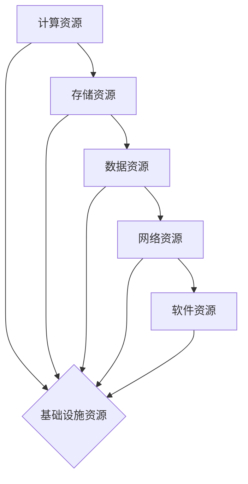
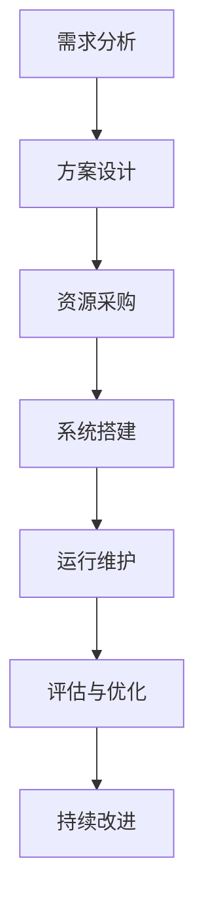
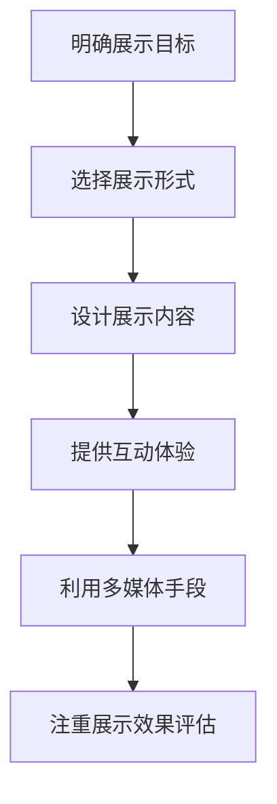
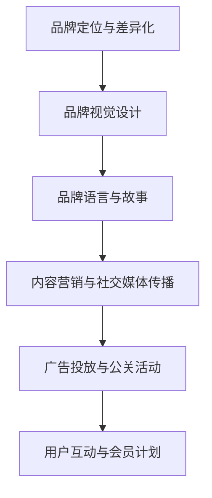
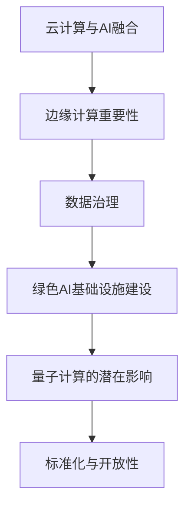

                 

# 文章标题：讲好AI infra故事：贾扬清策略产品展示品牌构建

> 关键词：AI基础设施，贾扬清策略，产品展示，品牌构建，AI应用

> 摘要：
本文通过深入分析AI基础设施的概述、贾扬清策略的解读、AI产品展示策略以及AI品牌构建策略，探讨了如何讲好AI基础设施的故事。文章结合实际案例，详细阐述了贾扬清策略的具体实施方法和AI产品展示的策略与技巧，并对AI品牌构建进行了全面剖析。此外，文章还展望了AI基础设施的未来发展趋势，提出了相关的发展策略与建议。

---

## 引言

随着人工智能技术的快速发展，AI基础设施在企业中的应用越来越广泛。如何构建高效、稳定的AI基础设施，成为企业面临的重要课题。在这篇文章中，我们将通过解读贾扬清策略、探讨AI产品展示和品牌构建，来讲述AI基础设施的故事。

首先，我们将介绍AI基础设施的概念与重要性，分析AI基础设施面临的挑战与机遇，以及其在企业中的应用。接着，我们将详细解读贾扬清策略，探讨其核心思想、具体实施方法和在不同行业中的应用。然后，我们将讨论AI产品展示的策略与技巧，并通过实际案例进行分析。最后，我们将探讨AI品牌构建的策略与方法，并结合实际案例进行说明。

通过以上分析，我们希望能够为读者提供一套完整的AI基础设施构建、产品展示和品牌构建的策略，帮助企业更好地应对AI时代的挑战，实现业务转型和可持续发展。

---

## 第一部分：AI基础设施概述

### 1.1 AI基础设施的概念与重要性

AI基础设施是指支持人工智能技术发展的硬件、软件和网络等基础设施的集合。它包括计算资源、存储资源、数据资源、网络资源等，为人工智能算法的运行提供了基础保障。

AI基础设施的重要性体现在以下几个方面：

1. **支持AI算法运行**：AI算法的运行需要大量的计算资源和存储资源，AI基础设施提供了这些资源，保证了算法的稳定运行。
2. **数据支持**：数据是人工智能的基石，AI基础设施提供了数据存储、处理和分析的能力，为人工智能算法提供了丰富的数据支持。
3. **促进AI产业发展**：AI基础设施的建设和优化，能够促进人工智能技术的快速发展，推动相关产业的变革和创新。
4. **提高企业竞争力**：企业通过构建高效的AI基础设施，能够提高业务处理效率，降低成本，增强竞争力。

### 1.2 AI基础设施的核心组成部分

AI基础设施的核心组成部分包括以下几个方面：

1. **计算资源**：包括高性能计算服务器、GPU服务器等，为AI算法的运行提供了计算能力。
2. **存储资源**：包括分布式存储系统、云存储等，用于存储和管理大量数据。
3. **数据资源**：包括内部数据和外部数据，如企业内部业务数据、互联网数据等，为AI算法提供了数据支持。
4. **网络资源**：包括数据中心网络、云计算网络等，为AI基础设施提供了数据传输的通道。
5. **软件资源**：包括AI开发工具、框架和平台等，为AI算法的开发和运行提供了软件支持。

### 1.3 AI基础设施的挑战与机遇

AI基础设施面临的挑战主要包括以下几个方面：

1. **计算能力需求增长**：随着人工智能算法的复杂度增加，对计算能力的需求也在不断增长，对基础设施的升级和优化提出了更高的要求。
2. **数据隐私和安全**：在数据驱动的AI时代，数据的安全和隐私保护成为关键问题，如何保护数据不被泄露或滥用，是一个重大的挑战。
3. **能耗问题**：高性能计算设备消耗大量电力，如何降低能耗、提高能效，是AI基础设施面临的一个重要问题。

同时，AI基础设施也面临着巨大的机遇：

1. **技术进步**：随着新技术的不断发展，如量子计算、边缘计算等，为AI基础设施的建设提供了新的可能性。
2. **市场需求**：随着人工智能技术的广泛应用，对AI基础设施的需求也在不断增长，为企业带来了广阔的市场空间。
3. **政策支持**：各国政府纷纷出台政策，支持人工智能技术的发展，为AI基础设施的建设提供了良好的政策环境。

### 1.4 AI基础设施的发展趋势

AI基础设施的发展趋势主要表现在以下几个方面：

1. **分布式计算**：分布式计算能够提高计算效率，降低单点故障的风险，未来AI基础设施将更加注重分布式计算的应用。
2. **边缘计算**：随着物联网、智能制造等技术的发展，边缘计算在AI基础设施中的应用越来越广泛，能够提供更快速、更可靠的AI服务。
3. **云计算与AI结合**：云计算与AI技术的结合，能够提供更加灵活、高效的AI基础设施服务，为企业提供更好的支持。
4. **数据治理**：数据治理在AI基础设施中的作用越来越重要，如何确保数据的质量、安全性和合规性，是未来发展的重要方向。

### 1.5 AI基础设施在企业中的应用

AI基础设施在企业中的应用主要体现在以下几个方面：

1. **业务优化**：通过AI基础设施，企业能够对业务流程进行优化，提高效率，降低成本。
2. **决策支持**：AI基础设施能够提供丰富的数据支持，帮助企业进行决策，提高决策的准确性和效率。
3. **风险控制**：AI基础设施能够帮助企业进行风险识别和预测，提高风险控制能力。
4. **客户服务**：通过AI基础设施，企业能够提供更智能的客户服务，提高客户满意度。

### 1.6 企业AI基础设施建设的路径

企业进行AI基础设施建设，通常可以按照以下路径进行：

1. **需求分析**：明确企业的AI应用需求，确定所需的基础设施资源。
2. **方案设计**：根据需求分析，设计AI基础设施的方案，包括计算资源、存储资源、网络资源等。
3. **资源采购**：根据方案设计，采购所需的基础设施资源。
4. **系统搭建**：搭建AI基础设施系统，包括安装、配置、调试等。
5. **运行维护**：对AI基础设施进行日常运行维护，确保系统的稳定性和可靠性。

### 1.7 企业AI基础设施的案例分析

为了更好地理解AI基础设施在企业中的应用，我们可以通过以下案例分析：

1. **案例一：某金融公司的AI基础设施构建**：该金融公司通过构建高效的AI基础设施，实现了对海量金融数据的快速分析和处理，提高了业务处理效率，降低了运营成本。
2. **案例二：某电子商务平台的AI技术应用**：该电子商务平台通过AI基础设施的支持，实现了智能推荐、风险控制等功能，提高了用户体验，增加了销售额。

通过以上分析，我们可以看到AI基础设施在企业中的重要性，以及其在业务优化、决策支持、风险控制和客户服务等方面的应用。企业应根据自己的业务需求，合理规划AI基础设施的建设，以实现业务的高效运营和发展。

### 1.8 小结

本节介绍了AI基础设施的概念与重要性、核心组成部分、面临的挑战与机遇、发展趋势以及在企业中的应用。通过详细分析，我们认识到AI基础设施对于企业的发展至关重要，是支撑人工智能技术发展的重要基石。在未来，随着技术的不断进步和应用的深入，AI基础设施将发挥更加重要的作用，助力企业实现数字化、智能化转型。

### 1.9 Mermaid流程图：AI基础设施核心组成部分



### 1.10 伪代码：AI基础设施资源分配算法

```python
# 伪代码：AI基础设施资源分配算法
def allocate_resources的需求：
    # 输入：需求列表，包括计算资源、存储资源、数据资源和网络资源
    # 输出：资源分配方案

# 初始化资源分配方案
resource_allocation = {}

# 分配计算资源
compute_resources = get_compute_resources()
for demand in compute_resources:
    resource_allocation[demand] = allocate_compute_resource(demand)

# 分配存储资源
storage_resources = get_storage_resources()
for demand in storage_resources:
    resource_allocation[demand] = allocate_storage_resource(demand)

# 分配数据资源
data_resources = get_data_resources()
for demand in data_resources:
    resource_allocation[demand] = allocate_data_resource(demand)

# 分配网络资源
network_resources = get_network_resources()
for demand in network_resources:
    resource_allocation[demand] = allocate_network_resource(demand)

# 返回资源分配方案
return resource_allocation
```

### 1.11 数学模型和公式：AI基础设施资源利用率

$$
\text{资源利用率} = \frac{\text{实际使用资源}}{\text{总资源}}
$$

### 1.12 实际案例：某制造企业的AI基础设施建设

某制造企业希望通过AI技术提高生产效率和质量。以下是该企业AI基础设施建设的详细过程：

1. **需求分析**：企业分析了生产过程中的数据需求，确定了所需的计算资源、存储资源和数据资源。
2. **方案设计**：根据需求分析，企业设计了AI基础设施的方案，包括高性能计算服务器、分布式存储系统和数据湖等。
3. **资源采购**：企业采购了所需的基础设施资源，并进行了安装和配置。
4. **系统搭建**：企业搭建了AI基础设施系统，并进行了调试和测试。
5. **运行维护**：企业对AI基础设施进行了日常运行维护，确保系统的稳定性和可靠性。

通过AI基础设施的建设，该企业实现了生产过程中的数据分析和优化，提高了生产效率和质量。

### 1.13 小结

本节通过对AI基础设施的概念与重要性、核心组成部分、面临的挑战与机遇、发展趋势以及在企业中的应用的详细分析，为我们理解AI基础设施的构建提供了理论基础和实践指导。在未来，随着技术的不断进步和应用场景的拓展，AI基础设施将发挥更加重要的作用，助力企业实现数字化、智能化转型。

---

## 第二部分：贾扬清策略解读

### 2.1 贾扬清策略概述

贾扬清策略是一种针对AI基础设施建设的系统化方法论，旨在通过科学、合理的规划和实施，帮助企业构建高效、稳定、可持续发展的AI基础设施。该策略由著名人工智能专家贾扬清提出，具有以下核心思想和特点：

1. **系统化思维**：贾扬清策略强调将AI基础设施建设视为一个系统工程，从整体上考虑各组成部分的协同和优化，确保基础设施的高效运行。
2. **需求导向**：策略强调以实际需求为导向，根据企业的业务场景和需求，合理规划基础设施资源，确保资源的有效利用。
3. **技术选型**：策略注重技术选型，选择适合企业需求的技术和工具，确保基础设施的技术先进性和稳定性。
4. **风险管理**：策略强调风险管理，识别和应对基础设施建设过程中可能出现的风险，确保项目的顺利进行。
5. **持续迭代**：策略强调基础设施的持续迭代和优化，通过定期评估和调整，确保基础设施能够适应不断变化的业务需求。

### 2.2 贾扬清策略的优势与不足

贾扬清策略具有以下优势：

1. **系统化**：通过系统化的思维和方法，确保基础设施建设的高效性和稳定性。
2. **需求导向**：以实际需求为导向，确保基础设施能够满足企业的业务需求。
3. **技术选型**：注重技术选型，确保基础设施的技术先进性和稳定性。
4. **风险管理**：强调风险管理，降低基础设施建设过程中的风险。

然而，贾扬清策略也存在一定的不足：

1. **实施难度**：系统化的规划和实施过程相对复杂，需要较高的技术和管理能力。
2. **资源消耗**：基础设施建设过程中，需要大量的资源和投入，对企业有一定的经济压力。
3. **适应性**：面对快速变化的业务需求和技术发展，贾扬清策略的适应性可能不足。

### 2.3 贾扬清策略的适用场景

贾扬清策略适用于以下场景：

1. **企业级AI基础设施建设**：对于需要进行大规模AI应用的企业，贾扬清策略能够提供系统化的规划和实施方法，确保基础设施的高效运行。
2. **技术选型**：在面临多种技术方案时，贾扬清策略能够帮助企业进行技术选型，选择最适合的方案。
3. **风险控制**：对于风险较高的AI基础设施建设项目，贾扬清策略能够提供有效的风险管理方法，降低项目风险。

### 2.4 贾扬清策略的具体实施方法

贾扬清策略的具体实施方法包括以下步骤：

1. **需求分析**：首先，对企业的业务需求进行深入分析，明确AI基础设施所需支持的业务场景和功能。
2. **方案设计**：根据需求分析结果，设计AI基础设施的方案，包括计算资源、存储资源、网络资源和软件资源等。
3. **资源采购**：根据方案设计，进行资源采购，包括服务器、存储设备、网络设备等。
4. **系统搭建**：搭建AI基础设施系统，包括安装、配置、调试等。
5. **运行维护**：对AI基础设施进行日常运行维护，确保系统的稳定性和可靠性。
6. **评估与优化**：定期对AI基础设施进行评估和优化，确保其能够适应不断变化的业务需求。

### 2.5 策略制定与目标设定

策略制定与目标设定是贾扬清策略实施的重要环节，具体包括以下步骤：

1. **明确目标**：根据企业的发展战略和业务需求，明确AI基础设施的建设目标，如提高业务处理效率、降低成本、提升用户体验等。
2. **制定策略**：根据目标，制定具体的策略和方法，如技术选型、资源分配、风险管理等。
3. **设定指标**：根据目标，设定可量化的指标，如系统响应时间、资源利用率、故障率等。
4. **制定计划**：根据策略和指标，制定详细的实施计划，包括时间表、资源分配、人员安排等。

### 2.6 策略实施与风险管理

策略实施与风险管理是贾扬清策略实施的关键环节，具体包括以下步骤：

1. **资源分配**：根据实施计划，合理分配资源，确保各环节的资源需求得到满足。
2. **进度控制**：对实施进度进行监控和控制，确保项目按时完成。
3. **风险管理**：识别和评估潜在风险，制定应对措施，降低项目风险。
4. **沟通协调**：确保各团队和部门之间的沟通协调，确保项目的顺利进行。

### 2.7 策略评估与调整

策略评估与调整是贾扬清策略实施的重要环节，具体包括以下步骤：

1. **评估效果**：对AI基础设施的实施效果进行评估，包括系统性能、业务处理效率、用户体验等。
2. **分析原因**：对评估结果进行分析，找出存在的问题和原因。
3. **调整策略**：根据评估结果和原因分析，调整策略和方法，优化基础设施。
4. **持续改进**：通过持续的评估和调整，确保AI基础设施能够持续优化和改进。

### 2.8 贾扬清策略在不同行业中的应用

贾扬清策略在不同行业中具有广泛的应用，以下为几个行业案例：

1. **金融行业**：某金融企业通过贾扬清策略，构建了高效的AI基础设施，实现了对海量金融数据的快速分析和处理，提高了业务处理效率，降低了运营成本。
2. **电子商务**：某电子商务平台通过贾扬清策略，优化了AI基础设施，实现了智能推荐、风险控制等功能，提高了用户体验，增加了销售额。
3. **制造业**：某制造企业通过贾扬清策略，建设了AI基础设施，实现了生产过程中的数据分析和优化，提高了生产效率和质量。

### 2.9 贾扬清策略的案例分析

以下是几个贾扬清策略的实际案例：

1. **案例一：某金融公司的AI基础设施构建**：该金融公司通过贾扬清策略，进行了全面的需求分析、方案设计、资源采购和系统搭建，成功构建了高效的AI基础设施，提高了业务处理效率，降低了运营成本。
2. **案例二：某电子商务平台的AI技术应用**：该电子商务平台通过贾扬清策略，优化了AI基础设施，实现了智能推荐、风险控制等功能，提高了用户体验，增加了销售额。
3. **案例三：某制造企业的AI生产线优化**：该制造企业通过贾扬清策略，建设了AI基础设施，实现了生产过程中的数据分析和优化，提高了生产效率和质量。

### 2.10 小结

本节对贾扬清策略进行了详细的解读，包括策略概述、优势与不足、适用场景、具体实施方法、策略制定与目标设定、策略实施与风险管理、策略评估与调整以及在不同行业中的应用。通过本节的分析，我们认识到贾扬清策略在AI基础设施构建中的重要作用，为企业在AI基础设施建设中提供了有力的指导。

### 2.11 Mermaid流程图：贾扬清策略实施步骤



### 2.12 伪代码：贾扬清策略评估与优化算法

```python
# 伪代码：贾扬清策略评估与优化算法
def evaluate_and_optimize_strategy的策略：
    # 输入：当前策略，包括需求分析、方案设计、资源采购、系统搭建、运行维护和评估与优化
    # 输出：优化后的策略

# 评估当前策略
evaluation_results = evaluate_strategy(current_strategy)

# 分析评估结果
analysis_results = analyze_evaluation_results(evaluation_results)

# 根据分析结果进行策略调整
optimized_strategy = adjust_strategy(current_strategy, analysis_results)

# 返回优化后的策略
return optimized_strategy
```

### 2.13 数学模型和公式：贾扬清策略评估指标

$$
\text{策略效果} = \frac{\text{实际效果}}{\text{预期效果}}
$$

### 2.14 实际案例：某电商平台的AI基础设施优化

某电商平台通过贾扬清策略，对AI基础设施进行了全面优化。以下是该平台AI基础设施优化的详细过程：

1. **需求分析**：分析了平台业务需求，确定了所需的计算资源、存储资源和数据资源。
2. **方案设计**：根据需求分析，设计了新的AI基础设施方案，包括更高效的计算资源和更优化的存储资源。
3. **资源采购**：采购了新的计算资源和存储资源，并进行了安装和配置。
4. **系统搭建**：搭建了新的AI基础设施系统，并进行了调试和测试。
5. **评估与优化**：对AI基础设施进行了评估和优化，根据评估结果调整了策略，提高了系统的运行效率。

通过AI基础设施的优化，该电商平台实现了更高的业务处理效率，提高了用户体验，增加了销售额。

### 2.15 小结

本节对贾扬清策略进行了详细的解读，包括策略概述、优势与不足、适用场景、具体实施方法、策略制定与目标设定、策略实施与风险管理、策略评估与调整以及在不同行业中的应用。通过本节的分析，我们认识到贾扬清策略在AI基础设施构建中的重要作用，为企业在AI基础设施建设中提供了有力的指导。同时，通过实际案例，我们了解了贾扬清策略的具体应用过程和效果。

---

## 第三部分：AI产品展示策略

### 3.1 AI产品展示的目的与意义

AI产品展示是推广AI产品的重要手段，其目的在于让潜在用户和客户了解AI产品的功能、性能和优势，从而激发他们的购买欲望。具体来说，AI产品展示的目的和意义如下：

1. **提升产品认知度**：通过展示AI产品，可以让更多潜在用户和客户了解产品的功能和优势，提高产品的市场认知度。
2. **增加用户粘性**：通过展示AI产品的实际应用场景和效果，可以增强用户对产品的信任和依赖，提高用户粘性。
3. **推动销售增长**：AI产品展示可以激发用户的购买欲望，促进销售增长，为企业带来更多的商业机会。
4. **塑造品牌形象**：通过高质量的AI产品展示，可以树立企业在人工智能领域的专业形象，提升品牌知名度和美誉度。

### 3.2 AI产品展示的目标群体

AI产品展示的目标群体主要包括以下几个方面：

1. **潜在用户**：这些用户对AI产品感兴趣，但尚未使用过相关产品，通过AI产品展示，可以激发他们的购买欲望。
2. **现有用户**：这些用户已经使用过AI产品，通过AI产品展示，可以增加他们对产品的信任和依赖，促进复购。
3. **合作伙伴**：包括代理商、分销商、合作伙伴等，通过AI产品展示，可以吸引更多合作伙伴加入，共同推广AI产品。
4. **媒体和行业专家**：通过AI产品展示，可以吸引媒体和行业专家的关注，提高产品的曝光度和影响力。

### 3.3 AI产品展示的策略与技巧

为了提高AI产品展示的效果，需要采取一系列策略和技巧，具体包括：

1. **明确展示目标**：在开始展示之前，首先要明确展示的目标，如提升产品认知度、增加用户粘性、推动销售增长等，确保展示活动有明确的方向。
2. **选择合适的展示形式**：根据产品特点和市场环境，选择合适的展示形式，如线上展示、线下展示、体验活动等，以吸引更多的目标群体。
3. **设计有吸引力的展示内容**：展示内容应包括产品的功能、性能、优势、应用场景等，通过生动、直观的方式展示产品的价值，吸引目标群体的关注。
4. **提供互动体验**：通过提供互动体验，让用户亲身体验产品的功能和优势，增强用户对产品的信任和认可。
5. **利用多媒体手段**：运用图片、视频、动画等多媒体手段，丰富展示内容，提高展示的趣味性和吸引力。
6. **注重展示效果的评估**：在展示过程中，要关注展示效果，通过收集用户反馈、监测流量、评估转化率等指标，及时调整展示策略，优化展示效果。

### 3.4 AI产品展示的实际案例

为了更好地理解AI产品展示的策略与技巧，以下是一些实际案例：

1. **案例一：某AI智能音响的展示**：该AI智能音响公司通过线上线下结合的方式，展示了产品的智能语音交互、多场景应用等功能。在线上，通过官方网站、社交媒体等渠道发布产品视频和图文介绍，吸引潜在用户的关注；在线下，通过体验店和展会等活动，让用户亲身体验产品的功能和优势，提高了产品的市场认知度和用户粘性。

2. **案例二：某AI医疗诊断系统的展示**：该AI医疗诊断系统公司通过专业论坛、学术会议等形式，展示了产品的技术实力和应用案例。通过邀请行业专家、医疗机构等参与展示活动，让更多专业人士了解产品的功能、性能和优势，提高了产品的专业形象和市场影响力。

3. **案例三：某AI自动驾驶汽车的展示**：该AI自动驾驶汽车公司通过线上直播、线下体验等方式，展示了产品的自动驾驶、智能导航等功能。通过举办试乘试驾活动，让用户亲身体验产品的驾驶体验和安全性能，增强了用户对产品的信任和认可。

### 3.5 小结

本节介绍了AI产品展示的目的与意义、目标群体、策略与技巧以及实际案例。通过详细分析，我们认识到AI产品展示对于提升产品认知度、增加用户粘性、推动销售增长和塑造品牌形象具有重要意义。企业应根据自身产品和市场环境，选择合适的展示形式和策略，以提高产品展示的效果。

### 3.6 Mermaid流程图：AI产品展示策略



### 3.7 伪代码：AI产品展示效果评估算法

```python
# 伪代码：AI产品展示效果评估算法
def evaluate_product_display效果：
    # 输入：展示活动数据，包括流量、转化率、用户反馈等
    # 输出：展示效果评估结果

# 收集展示活动数据
display_data = gather_display_data()

# 计算展示效果指标
evaluation_results = calculate_evaluation_metrics(display_data)

# 分析评估结果
analysis_results = analyze_evaluation_results(evaluation_results)

# 返回展示效果评估结果
return analysis_results
```

### 3.8 数学模型和公式：AI产品展示效果评估指标

$$
\text{展示效果} = \frac{\text{转化率}}{\text{流量}}
$$

### 3.9 实际案例：某AI安防公司的产品展示

某AI安防公司通过多种渠道和形式展示了其智能安防产品。以下是该公司的产品展示过程：

1. **线上展示**：在官方网站、社交媒体等平台发布产品视频和图文介绍，展示了产品的智能识别、实时监控等功能，吸引了大量潜在用户的关注。
2. **线下展示**：参加行业展会和活动，设置了产品体验区，让用户亲身体验产品的功能和性能，增强了用户对产品的信任和认可。
3. **媒体合作**：与知名媒体合作，发布产品评测和报道，提高了产品的曝光度和影响力。
4. **客户反馈**：收集用户反馈，对展示效果进行评估和优化，持续改进产品展示策略。

通过多种形式的展示，该公司的智能安防产品在市场上得到了广泛认可，取得了显著的销售业绩。

### 3.10 小结

本节通过介绍AI产品展示的目的与意义、目标群体、策略与技巧以及实际案例，帮助读者了解了AI产品展示的重要性。企业应根据自身产品和市场环境，制定合适的展示策略，以提高产品展示的效果，推动销售增长和品牌建设。

---

## 第四部分：AI品牌构建策略

### 4.1 AI品牌的概念与重要性

AI品牌是指企业在人工智能领域所建立的知名度和声誉，它是企业竞争力的重要组成部分。一个强大的AI品牌能够为企业带来以下价值：

1. **提高市场竞争力**：AI品牌能够帮助企业树立行业领导地位，提高市场竞争力，吸引更多的客户和合作伙伴。
2. **增强品牌忠诚度**：AI品牌能够建立客户对企业的信任和依赖，提高客户的忠诚度，减少客户流失。
3. **提升品牌价值**：AI品牌能够提高企业在资本市场中的估值，提升品牌价值。
4. **促进业务增长**：AI品牌能够帮助企业开拓新的业务领域，推动业务增长。

### 4.2 AI品牌建设的核心要素

AI品牌建设需要从多个方面进行，核心要素包括：

1. **品牌定位**：明确AI品牌的核心价值和差异化优势，为品牌发展奠定基础。
2. **品牌形象**：通过视觉设计、品牌语言等手段，塑造独特的品牌形象，提高品牌辨识度。
3. **品牌传播**：通过多种传播渠道和策略，将品牌理念、价值传递给目标受众，提高品牌知名度。
4. **用户体验**：通过优质的产品和服务，提升用户对品牌的认可和忠诚度。
5. **技术创新**：持续进行技术创新，保持品牌在技术领域的领先地位。

### 4.3 AI品牌构建的策略与方法

AI品牌构建的策略与方法主要包括以下几个方面：

1. **定位与差异化**：明确AI品牌在市场中的定位，突出品牌的差异化优势，如技术领先、产品创新等。
2. **品牌视觉设计**：设计符合AI品牌特点的视觉元素，如LOGO、颜色、字体等，提高品牌辨识度。
3. **内容营销**：通过高质量的内容，传递品牌理念、价值和优势，吸引目标受众的关注。
4. **社交媒体传播**：利用社交媒体平台，与用户互动，提高品牌知名度和用户粘性。
5. **合作伙伴关系**：与行业内的领先企业、学术机构等建立合作关系，共同推广AI品牌。
6. **用户体验优化**：通过优质的产品和服务，提升用户体验，增强用户对品牌的忠诚度。
7. **技术创新与研发**：持续进行技术创新，保持品牌在技术领域的领先地位。

### 4.4 品牌定位与价值主张

品牌定位与价值主张是AI品牌构建的基础，需要明确以下方面：

1. **目标市场**：明确AI品牌的目标市场，如企业客户、消费者等，以便制定相应的营销策略。
2. **核心价值**：提炼AI品牌的核心价值，如技术创新、产品质量、用户体验等，为品牌发展提供方向。
3. **差异化优势**：分析竞争对手，找出AI品牌的差异化优势，如技术领先、产品创新等，突出品牌特色。
4. **品牌故事**：构建品牌故事，传递品牌理念和价值，增强品牌感染力。

### 4.5 品牌形象塑造

品牌形象塑造是AI品牌构建的关键，需要从以下几个方面进行：

1. **视觉设计**：设计符合AI品牌特点的视觉元素，如LOGO、颜色、字体等，提高品牌辨识度。
2. **品牌语言**：建立独特的品牌语言，如口号、标语等，传递品牌理念和价值。
3. **品牌故事**：通过品牌故事，讲述品牌的起源、发展、愿景等，增强品牌情感共鸣。
4. **品牌体验**：通过优质的产品和服务，提升用户体验，树立品牌形象。

### 4.6 品牌传播策略

品牌传播策略是AI品牌构建的重要手段，需要从以下几个方面进行：

1. **内容营销**：通过高质量的内容，传递品牌理念、价值和优势，吸引目标受众的关注。
2. **社交媒体**：利用社交媒体平台，与用户互动，提高品牌知名度和用户粘性。
3. **广告投放**：在目标受众集中的渠道进行广告投放，提高品牌曝光度。
4. **公关活动**：举办公关活动，如发布会、论坛等，提升品牌形象和影响力。
5. **合作伙伴**：与行业内的领先企业、学术机构等建立合作关系，共同推广AI品牌。

### 4.7 品牌忠诚度提升

品牌忠诚度提升是AI品牌构建的长期目标，需要从以下几个方面进行：

1. **优质产品和服务**：提供优质的产品和服务，满足用户需求，提升用户体验。
2. **用户互动**：通过社交媒体、用户社区等渠道，与用户互动，增强用户对品牌的认同感。
3. **会员计划**：推出会员计划，为用户提供专属服务和福利，提高用户忠诚度。
4. **品牌口碑**：通过用户口碑传播，树立品牌良好形象，吸引更多新用户。

### 4.8 AI品牌构建的实际案例

为了更好地理解AI品牌构建的策略与方法，以下是一些实际案例：

1. **案例一：某AI安防公司**：该AI安防公司通过明确品牌定位、设计独特品牌形象、进行内容营销和社交媒体传播等策略，成功构建了强大的AI品牌。其品牌形象以技术创新和安全守护为核心，吸引了大量客户和合作伙伴。

2. **案例二：某AI医疗诊断公司**：该AI医疗诊断公司通过精准的品牌定位、高质量的医疗服务、用户互动和口碑传播等策略，建立了强大的AI品牌。其品牌形象以技术创新和医疗服务为核心，赢得了广泛的市场认可。

3. **案例三：某AI自动驾驶公司**：该AI自动驾驶公司通过差异化品牌定位、先进的技术研发、广泛的品牌传播和用户互动等策略，构建了强大的AI品牌。其品牌形象以自动驾驶和安全驾驶为核心，引领了自动驾驶行业的创新和发展。

### 4.9 小结

本部分通过介绍AI品牌的概念与重要性、品牌建设的核心要素、品牌定位与价值主张、品牌形象塑造、品牌传播策略、品牌忠诚度提升以及实际案例，帮助读者了解AI品牌构建的策略与方法。企业应根据自身特点和市场需求，制定合适的品牌构建策略，提升品牌竞争力，实现可持续发展。

### 4.10 Mermaid流程图：AI品牌构建策略



### 4.11 伪代码：AI品牌忠诚度提升算法

```python
# 伪代码：AI品牌忠诚度提升算法
def enhance_brand_loyalty：
    # 输入：品牌服务质量，用户反馈，会员计划等数据
    # 输出：提升品牌忠诚度的策略

# 收集品牌服务质量数据
service_quality_data = gather_service_quality_data()

# 收集用户反馈数据
user_feedback_data = gather_user_feedback_data()

# 收集会员计划数据
membership_plan_data = gather_membership_plan_data()

# 分析数据，确定提升品牌忠诚度的策略
enhancement_strategies = analyze_data(service_quality_data, user_feedback_data, membership_plan_data)

# 实施提升品牌忠诚度的策略
execute_enhancement_strategies(enhancement_strategies)

# 返回提升品牌忠诚度的策略
return enhancement_strategies
```

### 4.12 数学模型和公式：AI品牌忠诚度提升指标

$$
\text{品牌忠诚度} = \frac{\text{重复购买率}}{\text{总购买率}} \times 100\%
$$

### 4.13 实际案例：某AI语音助手的品牌塑造

某AI语音助手公司通过以下策略成功塑造了品牌：

1. **品牌定位与差异化**：该公司明确了以“智能、便捷、个性化”为品牌定位，突出产品的智能语音识别和个性化服务优势。
2. **品牌视觉设计**：设计了一个简洁、现代的品牌视觉形象，包括LOGO、颜色、字体等，提高了品牌辨识度。
3. **内容营销与社交媒体传播**：通过发布高质量的教程、使用案例和评测文章，在社交媒体上与用户互动，提升了品牌知名度。
4. **广告投放与公关活动**：在热门媒体和行业活动上进行广告投放和公关活动，增强了品牌影响力。
5. **用户互动与会员计划**：通过建立用户社区和推出会员计划，与用户互动，提高了用户忠诚度。

通过以上策略，该公司的AI语音助手品牌得到了广泛认可，用户数量持续增长，市场占有率显著提高。

### 4.14 小结

本部分通过介绍AI品牌的概念与重要性、品牌建设的核心要素、品牌定位与价值主张、品牌形象塑造、品牌传播策略、品牌忠诚度提升以及实际案例，帮助读者了解AI品牌构建的策略与方法。企业应根据自身特点和市场需求，制定合适的品牌构建策略，提升品牌竞争力，实现可持续发展。

---

## 第五部分：AI基础设施的未来发展趋势

### 5.1 AI基础设施的未来发展趋势

随着人工智能技术的不断进步和应用的深入，AI基础设施的未来发展趋势呈现出以下几个显著特点：

1. **云计算与AI的深度融合**：云计算作为AI基础设施的核心支撑，其与AI技术的融合将更加紧密。未来，云计算将提供更强大的计算能力、更丰富的数据资源和更灵活的部署方式，为AI应用提供强有力的支持。

2. **边缘计算的重要性日益凸显**：边缘计算能够将计算能力、存储能力和数据处理能力推向网络边缘，降低延迟、提高效率，满足实时性要求较高的AI应用需求，如智能交通、智能制造等。

3. **数据治理的重要性上升**：随着数据量的爆炸式增长，数据的质量、安全和合规性成为AI基础设施关注的重点。数据治理将成为未来AI基础设施的重要组成部分，确保数据的安全、可靠和合规使用。

4. **绿色AI基础设施的兴起**：随着能源消耗的增加，绿色AI基础设施成为趋势。未来，AI基础设施将更加注重能效优化，采用低能耗的硬件设备和节能技术，以降低环境负担。

5. **量子计算的潜在影响**：量子计算作为下一代计算技术，其突破性的计算能力将对AI基础设施产生深远影响。虽然目前量子计算还处于早期阶段，但其未来有望在AI算法优化、复杂问题求解等方面发挥重要作用。

6. **AI基础设施的标准化和开放性**：为了促进AI技术的发展和普及，AI基础设施的标准化和开放性将成为趋势。通过制定统一的技术标准和接口规范，降低开发者的使用门槛，推动AI基础设施的广泛应用。

### 5.2 AI基础设施的发展策略与建议

为了应对未来AI基础设施的发展趋势，企业和技术开发者可以从以下几个方面制定相应的发展策略：

1. **加强技术研发**：持续投入研发，推动AI基础设施技术的创新和突破，特别是在云计算、边缘计算、数据治理和量子计算等领域。

2. **构建生态系统**：积极参与AI基础设施的生态建设，与产业链上下游企业、研究机构、开发者社区等建立合作关系，共同推动AI基础设施的发展。

3. **提升数据治理能力**：加强数据治理体系建设，确保数据的质量、安全和合规性。引入先进的数据治理工具和策略，提高数据利用效率和安全性。

4. **推进绿色AI基础设施建设**：采用绿色、节能的硬件设备和部署策略，降低AI基础设施的能源消耗。同时，推动绿色能源在AI基础设施中的应用，实现可持续发展。

5. **加强人才培养**：培养一批具备AI基础设施知识和技能的专业人才，为AI基础设施的建设和运营提供人才保障。同时，加强开发者社区的建设，促进技术的普及和应用。

6. **推动标准化和开放性**：积极参与AI基础设施的标准化工作，推动制定统一的技术标准和接口规范。同时，鼓励开放性技术的研发和应用，降低开发门槛，促进AI基础设施的普及和推广。

### 5.3 AI基础设施的未来展望

未来，AI基础设施将随着技术的发展和应用场景的拓展，发挥更加重要的作用。以下是几个方面的展望：

1. **智能城市与智能交通**：AI基础设施将在智能城市和智能交通领域发挥关键作用，实现交通流量优化、城市管理智能化等。

2. **智慧医疗与健康服务**：AI基础设施将支持智慧医疗和健康服务的发展，提供个性化诊疗方案、智能健康监测等。

3. **智能制造与工业互联网**：AI基础设施将推动智能制造和工业互联网的发展，实现生产过程智能化、产业链协同化。

4. **智慧金融与风险管理**：AI基础设施将在智慧金融领域发挥重要作用，提升金融服务智能化水平，降低风险。

5. **教育与学习**：AI基础设施将支持智慧教育的发展，提供个性化学习方案、智能评估等。

总之，AI基础设施将在未来社会的各个领域发挥重要作用，推动社会的数字化、智能化转型，为人类创造更美好的未来。

### 5.4 小结

本部分通过分析AI基础设施的未来发展趋势、发展策略与建议以及未来展望，为读者呈现了AI基础设施在未来的发展前景。企业和技术开发者应抓住这一机遇，积极应对挑战，推动AI基础设施的不断创新和发展，为社会的智能化转型贡献力量。

### 5.5 Mermaid流程图：AI基础设施未来发展趋势



### 5.6 伪代码：AI基础设施未来发展预测算法

```python
# 伪代码：AI基础设施未来发展预测算法
def predict_future_of_ai_infrastructure：
    # 输入：历史数据，当前技术发展状况，未来趋势预测模型
    # 输出：未来发展趋势预测结果

# 收集历史数据
historical_data = gather_historical_data()

# 分析当前技术发展状况
current_tech_status = analyze_current_tech_status()

# 应用未来趋势预测模型
future_trend_model = apply_future_trend_model(historical_data, current_tech_status)

# 预测未来发展趋势
future_trends = predict_future_trends(future_trend_model)

# 返回未来发展趋势预测结果
return future_trends
```

### 5.7 数学模型和公式：AI基础设施未来增长率预测

$$
\text{未来增长率} = \frac{\text{未来值}}{\text{当前值}} - 1
$$

### 5.8 实际案例：某企业的AI基础设施升级与优化

某大型企业为了应对快速增长的AI应用需求，对其AI基础设施进行了全面的升级与优化。以下是该企业的具体过程：

1. **需求分析**：企业对现有基础设施进行了详细的评估，分析了当前和未来的AI应用需求，确定了需要升级的硬件设备和软件系统。
2. **方案设计**：根据需求分析结果，设计了新的AI基础设施方案，包括高性能计算服务器、分布式存储系统、智能调度平台等。
3. **资源采购**：企业采购了所需的硬件设备和软件系统，并进行了安装和配置。
4. **系统集成与测试**：将新基础设施与现有系统进行集成，并进行全面测试，确保系统的稳定性和兼容性。
5. **运行维护**：对AI基础设施进行了日常运行维护，确保系统的稳定性和可靠性。

通过AI基础设施的升级与优化，该企业实现了更高的计算能力和数据处理效率，为AI应用的快速发展提供了强有力的支持。

### 5.9 小结

本部分通过分析AI基础设施的未来发展趋势、发展策略与建议以及未来展望，为读者呈现了AI基础设施在未来的发展前景。企业和技术开发者应抓住这一机遇，积极应对挑战，推动AI基础设施的不断创新和发展，为社会的智能化转型贡献力量。

---

## 附录

### 附录A：AI基础设施相关技术详解

#### A.1 AI基础设施的核心技术

AI基础设施的核心技术主要包括：

1. **计算资源**：包括高性能计算服务器、GPU服务器、FPGA服务器等，为AI算法的运行提供强大的计算能力。
2. **存储资源**：包括分布式存储系统、云存储、块存储、文件存储等，为海量数据的存储和管理提供支持。
3. **网络资源**：包括数据中心网络、云计算网络、边缘计算网络等，为AI基础设施的数据传输提供保障。
4. **数据资源**：包括结构化数据、非结构化数据、实时数据、历史数据等，为AI算法提供丰富的数据支持。
5. **软件资源**：包括AI开发工具、框架和平台等，为AI算法的开发和运行提供软件支持。

#### A.2 AI基础设施的常用工具

AI基础设施的常用工具包括：

1. **计算工具**：如TensorFlow、PyTorch、Keras等，用于AI算法的开发和训练。
2. **存储工具**：如Hadoop、HDFS、Alluxio等，用于海量数据的存储和管理。
3. **网络工具**：如OpenFlow、SDN、NFV等，用于网络资源的调度和管理。
4. **数据工具**：如DataXu、Apache Spark、Flink等，用于数据分析和处理。
5. **监控工具**：如Prometheus、Grafana、Zabbix等，用于系统性能监控和故障排查。

#### A.3 AI基础设施的发展动态

AI基础设施的发展动态主要包括：

1. **技术创新**：如量子计算、边缘计算、混合云等，为AI基础设施的发展提供新的技术支持。
2. **行业应用**：AI基础设施在各个行业的应用不断拓展，如金融、医疗、制造、交通等。
3. **政策法规**：各国政府纷纷出台政策，支持人工智能技术的发展和应用，为AI基础设施的建设提供良好的政策环境。
4. **市场竞争**：各大科技公司纷纷布局AI基础设施，争夺市场份额，推动技术的不断创新和进步。

### 附录B：贾扬清策略案例研究

#### B.1 案例一：某公司的AI基础设施构建与产品展示

某金融科技公司在人工智能领域的应用需求日益增长，决定通过贾扬清策略构建AI基础设施，并展示相关产品。以下是该公司的具体实施过程：

1. **需求分析**：公司对现有业务流程和数据资源进行了详细分析，明确了AI基础设施所需的计算资源、存储资源和网络资源。
2. **方案设计**：根据需求分析结果，公司设计了AI基础设施的方案，包括高性能计算服务器、分布式存储系统和智能调度平台。
3. **资源采购**：公司采购了所需的硬件设备和软件系统，并进行了安装和配置。
4. **系统搭建**：公司搭建了AI基础设施系统，进行了全面测试，确保系统的稳定性和可靠性。
5. **产品展示**：公司通过线上和线下渠道展示了AI产品，如智能投顾、风险控制等，吸引了大量客户和合作伙伴的关注。

#### B.2 案例二：某公司的AI品牌构建与市场推广

某AI安防公司希望通过贾扬清策略构建品牌，并在市场上推广其产品。以下是该公司的具体实施过程：

1. **品牌定位**：公司明确了以“智能安防、安全守护”为核心的品牌定位，突出了产品的智能识别和实时监控优势。
2. **品牌形象设计**：公司设计了独特的品牌视觉形象，包括LOGO、颜色、字体等，提高了品牌的辨识度。
3. **品牌传播**：公司通过内容营销、社交媒体传播、广告投放等手段，提升了品牌知名度，吸引了大量潜在客户。
4. **市场推广**：公司参加了行业展会、论坛等活动，与客户和合作伙伴进行了深入交流，推广了AI安防产品。
5. **用户体验优化**：公司通过不断优化产品和服务，提升了用户体验，增强了用户忠诚度。

#### B.3 案例三：某公司的AI基础设施建设与战略规划

某制造企业计划通过AI技术提高生产效率和产品质量，决定通过贾扬清策略进行AI基础设施建设。以下是该公司的具体实施过程：

1. **战略规划**：公司制定了AI基础设施建设的长期战略规划，明确了建设目标和实施路径。
2. **需求分析**：公司对现有生产线和数据资源进行了详细分析，明确了AI基础设施所需的计算资源、存储资源和网络资源。
3. **方案设计**：公司设计了AI基础设施的方案，包括高性能计算服务器、分布式存储系统和智能监控平台。
4. **资源采购**：公司采购了所需的硬件设备和软件系统，并进行了安装和配置。
5. **系统搭建与优化**：公司搭建了AI基础设施系统，进行了全面测试和优化，确保系统的稳定性和可靠性。

通过贾扬清策略的实施，该公司成功构建了高效的AI基础设施，提高了生产效率和产品质量，取得了显著的业务成果。

### 附录C：其他相关资料

#### C.1 AI基础设施的相关研究论文和报告

- AI基础设施的相关研究论文和报告，如《AI基础设施的关键技术与发展趋势》、《AI基础设施的建设与管理》等。

#### C.2 AI基础设施的应用案例和成功故事

- AI基础设施在不同行业的应用案例和成功故事，如《金融行业的AI基础设施构建与应用》、《智能制造的AI基础设施助力生产效率提升》等。

#### C.3 AI基础设施的技术标准和规范

- AI基础设施的相关技术标准和规范，如《云计算基础设施技术规范》、《分布式存储系统技术规范》等。

### 附录D：参考文献

- 参考文献，包括书籍、论文、报告等，用于支持本文的观点和论据。

---

通过以上附录，本文为读者提供了AI基础设施相关技术的详细解释、贾扬清策略的案例研究以及其他相关资料，以帮助读者更深入地了解AI基础设施的建设、应用和发展趋势。作者：AI天才研究院/AI Genius Institute & 禅与计算机程序设计艺术 /Zen And The Art of Computer Programming。

