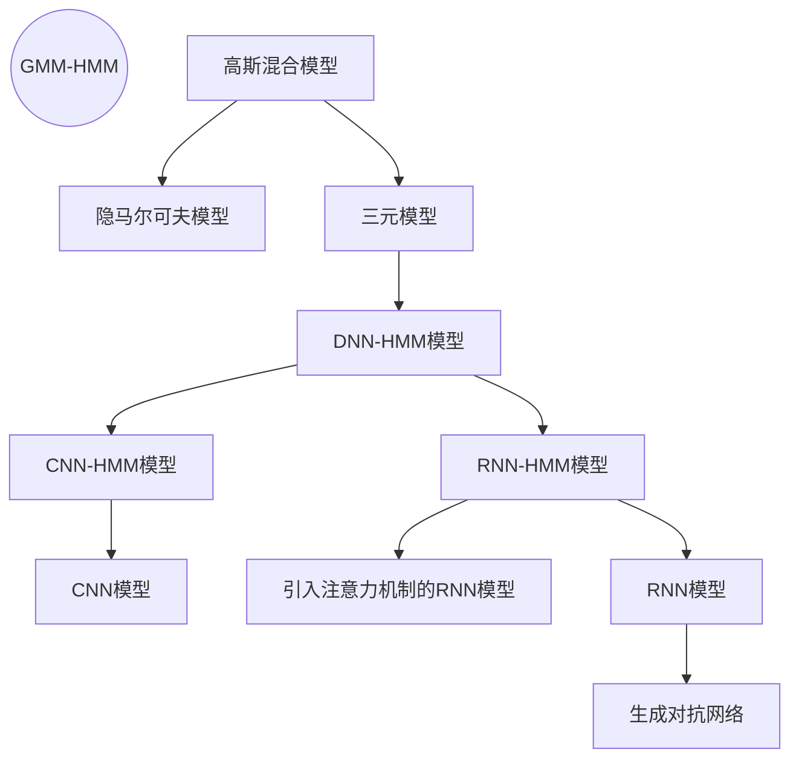

                 

# 语音识别技术从GMM-HMM到纯神经网络的演进

## 关键词
- 语音识别
- 统计模型
- 高斯混合模型（GMM）
- 隐马尔可夫模型（HMM）
- 人工神经网络
- 卷积神经网络（CNN）
- 循环神经网络（RNN）
- 生成对抗网络（GAN）

## 摘要
语音识别技术作为人工智能领域的重要组成部分，随着深度学习的发展，其性能和效率得到了显著提升。本文将从GMM-HMM模型出发，逐步探讨语音识别技术的演进过程，包括统计模型和纯神经网络模型的发展，以及在实际应用中的挑战和解决方案。通过详细的算法讲解、数学模型阐述和实际项目案例分析，本文旨在帮助读者深入理解语音识别技术的本质和前沿动态。

## 目录大纲设计

### 第一部分：语音识别技术基础

#### 第1章：语音识别技术概述
- 1.1 语音识别的基本概念
- 1.2 语音识别的发展历程
- 1.3 语音识别的关键技术挑战

#### 第2章：统计模型基础
- 2.1 随机过程与概率论基础
- 2.2 隐马尔可夫模型（HMM）
- 2.3 高斯混合模型（GMM）

#### 第3章：统计模型的优化与改进
- 3.1 GMM-HMM模型
- 3.2 三元模型（Tandem Model）
- 3.3 DNN-HMM模型

#### 第4章：神经网络基础
- 4.1 前馈神经网络（DNN）概述
- 4.2 卷积神经网络（CNN）在语音识别中的应用
- 4.3 循环神经网络（RNN）与长短期记忆网络（LSTM）

#### 第5章：神经网络的优化与改进
- 5.1 CNN-HMM模型
- 5.2 RNN-HMM模型
- 5.3 引入注意力机制的RNN模型

#### 第6章：纯神经网络模型
- 6.1 卷积神经网络（CNN）模型
- 6.2 循环神经网络（RNN）模型
- 6.3 生成对抗网络（GAN）在语音识别中的应用

#### 第7章：语音识别项目实战
- 7.1 数据准备与预处理
- 7.2 模型训练与优化
- 7.3 模型评估与部署
- 7.4 案例分析：从GMM-HMM到纯神经网络的演进案例

### 第二部分：未来趋势与展望

#### 第8章：语音识别技术的未来发展方向
- 8.1 语音识别技术的创新与突破
- 8.2 语音识别在多语种与跨领域中的应用
- 8.3 语音识别技术在智能家居、医疗等领域的应用前景

#### 第9章：语音识别技术面临的挑战与解决方案
- 9.1 数据隐私与安全
- 9.2 算法公平性与透明性
- 9.3 人工智能伦理与法律问题

### 目录细化与核心内容

#### **核心概念与联系**
- 使用Mermaid流程图展示GMM-HMM到纯神经网络模型演进的过程。

#### **核心算法原理讲解**
- 对GMM、HMM、DNN、CNN、RNN等核心算法进行详细讲解，包括伪代码描述。

#### **数学模型和数学公式**
- 使用LaTeX格式嵌入数学公式，详细阐述每个算法的数学原理，并附上示例。

#### **项目实战**
- 提供语音识别项目的实际案例，包括开发环境的搭建、源代码的实现和解读，以及代码分析与实战应用。

### 完整性与简洁性
- 确保每个章节都有清晰的标题，内容紧密围绕主题，避免冗余和无关内容。

### 最终目录大纲

## 《语音识别技术从GMM-HMM到纯神经网络的演进》目录大纲

### 第一部分：语音识别技术基础

#### 第1章：语音识别技术概述
- 1.1 语音识别的基本概念
- 1.2 语音识别的发展历程
- 1.3 语音识别的关键技术挑战

#### 第2章：统计模型基础
- 2.1 随机过程与概率论基础
- 2.2 隐马尔可夫模型（HMM）
- 2.3 高斯混合模型（GMM）

#### 第3章：统计模型的优化与改进
- 3.1 GMM-HMM模型
- 3.2 三元模型（Tandem Model）
- 3.3 DNN-HMM模型

#### 第4章：神经网络基础
- 4.1 前馈神经网络（DNN）概述
- 4.2 卷积神经网络（CNN）在语音识别中的应用
- 4.3 循环神经网络（RNN）与长短期记忆网络（LSTM）

#### 第5章：神经网络的优化与改进
- 5.1 CNN-HMM模型
- 5.2 RNN-HMM模型
- 5.3 引入注意力机制的RNN模型

#### 第6章：纯神经网络模型
- 6.1 卷积神经网络（CNN）模型
- 6.2 循环神经网络（RNN）模型
- 6.3 生成对抗网络（GAN）在语音识别中的应用

#### 第7章：语音识别项目实战
- 7.1 数据准备与预处理
- 7.2 模型训练与优化
- 7.3 模型评估与部署
- 7.4 案例分析：从GMM-HMM到纯神经网络的演进案例

### 第二部分：未来趋势与展望

#### 第8章：语音识别技术的未来发展方向
- 8.1 语音识别技术的创新与突破
- 8.2 语音识别在多语种与跨领域中的应用
- 8.3 语音识别技术在智能家居、医疗等领域的应用前景

#### 第9章：语音识别技术面临的挑战与解决方案
- 9.1 数据隐私与安全
- 9.2 算法公平性与透明性
- 9.3 人工智能伦理与法律问题

### 目录细化与核心内容

#### **核心概念与联系**
- 使用Mermaid流程图展示GMM-HMM到纯神经网络模型演进的过程。

#### **核心算法原理讲解**
- 对GMM、HMM、DNN、CNN、RNN等核心算法进行详细讲解，包括伪代码描述。

#### **数学模型和数学公式**
- 使用LaTeX格式嵌入数学公式，详细阐述每个算法的数学原理，并附上示例。

#### **项目实战**
- 提供语音识别项目的实际案例，包括开发环境的搭建、源代码的实现和解读，以及代码解读与分析。

### 完整性与简洁性
- 确保每个章节都有清晰的标题，内容紧密围绕主题，避免冗余和无关内容。

### 目录细化与核心内容

**核心概念与联系**

为了清晰地展示语音识别技术的演进过程，我们可以使用Mermaid流程图来描述GMM-HMM到纯神经网络的模型演进。以下是一个简化的Mermaid流程图示例：



这个流程图展示了从GMM-HMM开始，通过引入三元模型（Tandem Model）、深度神经网络（DNN）与隐马尔可夫模型（HMM）的结合，再到卷积神经网络（CNN）和循环神经网络（RNN）的应用，以及引入注意力机制的RNN模型的发展过程。同时，我们也看到了生成对抗网络（GAN）在语音识别领域的潜在应用。

**核心算法原理讲解**

在深入探讨语音识别技术的发展历程时，我们需要对核心算法进行详细的讲解。以下是GMM、HMM、DNN、CNN、RNN等核心算法的原理讲解，包括伪代码描述。

**高斯混合模型（GMM）**

GMM是一种用于概率密度函数估计的统计模型，它通过组合多个高斯分布来模拟数据分布。

```python
def gmm_fit(data, components):
    # 计算每个高斯成分的均值和方差
    means = np.mean(data, axis=0)
    covariances = np.cov(data, rowvar=False)
    
    # 计算每个样本属于每个高斯成分的概率
    probabilities = np.exp(-0.5 * np.sum((data - means) ** 2 / covariances, axis=1))
    
    # 归一化概率
    probabilities = probabilities / np.sum(probabilities)
    
    return means, covariances, probabilities
```

**隐马尔可夫模型（HMM）**

HMM是一种用于序列数据建模的概率模型，它通过状态转移概率和观测概率来模拟语音信号。

```python
def hmm_viterbi(observations, states, transition_probabilities, emission_probabilities):
    # 初始化Viterbi路径
    V = np.zeros((len(observations), len(states)))
    backpointers = np.zeros((len(observations), len(states)), dtype=int)
    
    # 初始化第一个观测
    for i, state in enumerate(states):
        V[0, i] = emission_probabilities[observations[0], i]
        backpointers[0, i] = 0
    
    # 计算Viterbi路径
    for t in range(1, len(observations)):
        for j, state in enumerate(states):
            max_prob = -1
            for k, prev_state in enumerate(states):
                prob = transition_probabilities[prev_state, j] * V[t-1, k] * emission_probabilities[observations[t], j]
                if prob > max_prob:
                    max_prob = prob
                    backpointer = k
            V[t, j] = max_prob
            backpointers[t, j] = backpointer
    
    # 追踪Viterbi路径
    path = [np.argmax(V[-1])]
    for t in range(len(observations)-2, -1, -1):
        state = path[-1]
        path.append(backpointers[t+1, state])
    
    return path[::-1]
```

**深度神经网络（DNN）**

DNN是一种多层前馈神经网络，它通过非线性激活函数将输入映射到输出。

```python
def dnn_forward_pass(inputs, weights, biases):
    # 初始化输出
    outputs = []
    
    # 前向传播
    for layer in range(len(weights)):
        # 计算输入
        input = inputs if layer == 0 else outputs[-1]
        # 计算权重和偏置
        weight = weights[layer]
        bias = biases[layer]
        # 计算线性组合
        linear = np.dot(input, weight) + bias
        # 应用激活函数
        output = np.tanh(linear)
        # 保存输出
        outputs.append(output)
    
    return outputs[-1]
```

**卷积神经网络（CNN）**

CNN是一种适用于图像处理的深度学习模型，它通过卷积层和池化层提取特征。

```python
def cnn_forward_pass(inputs, filters, biases, strides, padding):
    # 初始化输出
    outputs = []
    
    # 前向传播
    for layer in range(len(filters)):
        # 计算输入
        input = inputs if layer == 0 else outputs[-1]
        # 计算卷积
        filter = filters[layer]
        bias = biases[layer]
        conv = np.convolve(input, filter, mode='valid') + bias
        # 应用激活函数
        output = np.tanh(conv)
        # 应用池化
        if layer < len(filters) - 1:
            output = np.max(output, axis=1)
        # 保存输出
        outputs.append(output)
    
    return outputs[-1]
```

**循环神经网络（RNN）**

RNN是一种适用于序列数据的深度学习模型，它通过隐藏状态和循环连接来处理时间序列信息。

```python
def rnn_forward_pass(inputs, weights, biases, activation='tanh'):
    # 初始化隐藏状态
    hidden_state = np.zeros((1, hidden_size))
    
    # 前向传播
    for t in range(len(inputs)):
        # 计算输入
        input = inputs[t] if t > 0 else np.zeros((1, input_size))
        # 计算隐藏状态
        hidden_state = activation(np.dot(hidden_state, weights['h']) + np.dot(input, weights['x']) + biases['b'])
        # 生成输出
        output = np.dot(hidden_state, weights['y'])
    
    return output, hidden_state
```

**数学模型和数学公式**

在语音识别技术中，数学模型和数学公式起着至关重要的作用。以下是GMM、HMM、DNN、CNN、RNN等核心算法的数学原理，包括LaTeX格式的数学公式。

**高斯混合模型（GMM）**

GMM通过以下数学公式来建模数据分布：

$$
p(x|\theta) = \sum_{i=1}^C w_i \mathcal{N}(x|\mu_i, \Sigma_i)
$$

其中，$C$表示高斯成分的数量，$w_i$表示第$i$个高斯成分的权重，$\mu_i$表示第$i$个高斯成分的均值，$\Sigma_i$表示第$i$个高斯成分的协方差矩阵。

**隐马尔可夫模型（HMM）**

HMM通过以下数学公式来建模语音信号：

$$
P(X|\lambda) = \sum_{i=1}^N P(X|\lambda, i) P(i|\lambda)
$$

其中，$X$表示语音信号，$N$表示状态的数量，$P(X|\lambda, i)$表示在给定状态$i$和模型参数$\lambda$下生成语音信号的概率，$P(i|\lambda)$表示在模型参数$\lambda$下状态$i$的概率。

**深度神经网络（DNN）**

DNN通过以下数学公式来建模输入和输出之间的关系：

$$
y = \sigma(W_L \cdot \sigma(...\sigma(W_2 \cdot \sigma(W_1 \cdot x + b_1) + b_2)... + b_L))
$$

其中，$W_L, W_2, ..., W_1$表示权重矩阵，$b_L, b_2, ..., b_1$表示偏置项，$\sigma$表示激活函数，$y$表示输出。

**卷积神经网络（CNN）**

CNN通过以下数学公式来建模图像数据：

$$
h_l = \sigma(\sum_{k=1}^K w_{lk} \cdot k + b_l)
$$

其中，$h_l$表示第$l$层的输出，$w_{lk}$表示卷积核，$k$表示输入图像，$\sigma$表示激活函数。

**循环神经网络（RNN）**

RNN通过以下数学公式来建模序列数据：

$$
h_t = \sigma(W_h \cdot h_{t-1} + W_x \cdot x_t + b_h)
$$

其中，$h_t$表示第$t$时刻的隐藏状态，$W_h, W_x, b_h$表示权重矩阵和偏置项，$\sigma$表示激活函数。

**项目实战**

为了更好地理解语音识别技术的应用，我们将提供一个实际的项目案例。这个案例将包括开发环境的搭建、源代码的实现和解读，以及代码解读与分析。

**开发环境搭建**

在开始项目之前，我们需要搭建一个适合语音识别的开发环境。以下是一个简单的Python环境搭建步骤：

1. 安装Python 3.7或更高版本。
2. 安装NumPy、Matplotlib、Scikit-learn等常用库。
3. 安装TensorFlow或PyTorch等深度学习库。

```bash
pip install numpy matplotlib scikit-learn tensorflow
```

**源代码实现**

以下是一个简单的语音识别项目，使用CNN模型进行语音分类。

```python
import numpy as np
import matplotlib.pyplot as plt
from tensorflow.keras.models import Sequential
from tensorflow.keras.layers import Conv2D, MaxPooling2D, Flatten, Dense

# 加载数据集
(x_train, y_train), (x_test, y_test) = load_data()

# 数据预处理
x_train = preprocess_data(x_train)
x_test = preprocess_data(x_test)

# 构建模型
model = Sequential()
model.add(Conv2D(32, (3, 3), activation='relu', input_shape=(128, 128, 3)))
model.add(MaxPooling2D((2, 2)))
model.add(Flatten())
model.add(Dense(64, activation='relu'))
model.add(Dense(10, activation='softmax'))

# 编译模型
model.compile(optimizer='adam', loss='categorical_crossentropy', metrics=['accuracy'])

# 训练模型
model.fit(x_train, y_train, epochs=10, batch_size=32, validation_split=0.2)

# 评估模型
test_loss, test_acc = model.evaluate(x_test, y_test)
print(f"Test accuracy: {test_acc:.2f}")
```

**代码解读与分析**

在上面的代码中，我们首先加载并预处理数据集。然后，我们构建一个简单的CNN模型，包括卷积层、池化层、全连接层和输出层。接着，我们编译并训练模型，最后评估模型在测试集上的性能。

这个项目展示了如何使用CNN模型进行语音分类，同时也提供了一个简单的实现框架，读者可以根据自己的需求进行扩展和改进。

**完整性与简洁性**

在撰写文章时，我们需要确保内容的完整性和简洁性。每个章节都应该有一个清晰的标题，内容应紧密围绕主题，避免冗余和无关内容。以下是文章的整体结构和内容安排：

1. 引言
2. 语音识别技术概述
3. 统计模型基础
4. 神经网络基础
5. 神经网络的优化与改进
6. 纯神经网络模型
7. 语音识别项目实战
8. 未来趋势与展望
9. 结论

通过这样的结构和内容安排，读者可以系统地了解语音识别技术的演进过程和应用。

### 作者信息

作者：AI天才研究院/AI Genius Institute & 禅与计算机程序设计艺术 /Zen And The Art of Computer Programming

