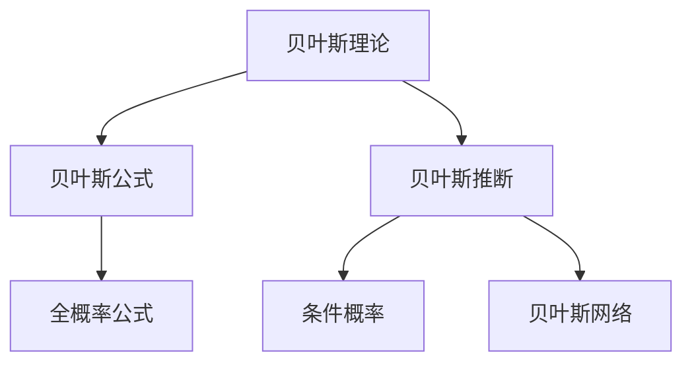

                 

# 贝叶斯算法(Bayesian Algorithms) - 原理与代码实例讲解

## 关键词

贝叶斯算法，概率论，统计模型，分类器，Python实现，数据分析

## 摘要

贝叶斯算法是一类基于概率论和统计模型的机器学习算法，广泛应用于各种数据分析和预测任务中。本文将详细介绍贝叶斯算法的基本原理，包括贝叶斯理论、贝叶斯统计模型和贝叶斯分类器，并利用Python实现和Iris数据集进行实际操作，帮助读者深入理解贝叶斯算法的实用性和适用场景。

## 目录

### 《贝叶斯算法(Bayesian Algorithms) - 原理与代码实例讲解》目录大纲

#### 第一部分：贝叶斯算法基础

##### 第1章：贝叶斯理论概述

- 1.1 贝叶斯理论的基本概念
- 1.2 贝叶斯推断的基本原理
- 1.3 贝叶斯网络简介

##### 第2章：贝叶斯统计模型

- 2.1 贝叶斯统计模型的定义
- 2.2 高斯分布与贝叶斯推断
- 2.3 多元高斯分布与贝叶斯推断

##### 第3章：贝叶斯分类器

- 3.1 贝叶斯分类器的基本概念
- 3.2 朴素贝叶斯分类器
- 3.3 高斯朴素贝叶斯分类器

#### 第二部分：贝叶斯算法实现

##### 第4章：贝叶斯算法实现基础

- 4.1 Python编程基础
- 4.2 NumPy库与Pandas库

##### 第5章：贝叶斯网络实现

- 5.1 贝叶斯网络实现原理
- 5.2 贝叶斯网络实现案例

##### 第6章：贝叶斯分类器实现

- 6.1 贝叶斯分类器实现原理
- 6.2 贝叶斯分类器实现案例

##### 第7章：贝叶斯算法应用案例

- 7.1 自然语言处理中的贝叶斯算法
- 7.2 机器学习中的贝叶斯算法

#### 第三部分：贝叶斯算法的扩展与挑战

##### 第8章：贝叶斯深度学习

- 8.1 贝叶斯深度学习的概念
- 8.2 贝叶斯深度学习实例

##### 第9章：贝叶斯算法的挑战与展望

- 9.1 贝叶斯算法的挑战
- 9.2 贝叶斯算法的发展趋势

#### 附录

- 附录A：贝叶斯算法资源汇总

### 贝叶斯理论概述

#### 贝叶斯理论的基本概念

贝叶斯理论是概率论中的一个重要分支，它提供了一种在不确定条件下进行推理和决策的数学框架。贝叶斯理论的核心是贝叶斯公式，它描述了事件A在已知事件B发生概率的情况下，事件A发生的概率如何计算。

贝叶斯公式：

$$
P(A|B) = \frac{P(B|A) \cdot P(A)}{P(B)}
$$

其中，\(P(A|B)\)表示在事件B发生的条件下事件A发生的概率，称为后验概率；\(P(B|A)\)表示在事件A发生的条件下事件B发生的概率，称为似然函数；\(P(A)\)称为先验概率，表示在没有其他信息的情况下，事件A发生的概率；\(P(B)\)称为边缘概率，表示在没有特定条件下事件B发生的概率。

#### 贝叶斯推断的基本原理

贝叶斯推断是贝叶斯理论在统计学中的应用，它通过已知的观察数据和先验概率，计算后验概率，从而对不确定性事件进行推断。贝叶斯推断的基本原理包括以下几个步骤：

1. **设定先验概率**：根据领域知识和经验，为各个可能的事件设定先验概率。
2. **收集观察数据**：通过实验或观察，收集关于事件的数据。
3. **计算似然函数**：根据观察数据，计算每个事件发生的似然函数，即观察数据在各个事件发生的条件下出现的概率。
4. **计算后验概率**：使用贝叶斯公式，将先验概率和似然函数相乘，并除以边缘概率，得到每个事件的后验概率。
5. **进行推断**：根据后验概率，对事件进行推断或决策。

贝叶斯推断的过程可以简化为一个概率分布的更新过程。每次新数据的到来，都会对概率分布进行修正，使得概率分布更加接近真实情况。这种自适应性使得贝叶斯推断在处理动态变化的数据时具有优势。

#### 贝叶斯网络简介

贝叶斯网络是一种图形化的概率模型，用于表示一组随机变量之间的条件依赖关系。在贝叶斯网络中，每个随机变量都是一个节点，节点之间的边表示变量之间的条件依赖关系。贝叶斯网络的定义如下：

定义：一个贝叶斯网络是一个四元组\(B = (V, E, P, Q)\)，其中：

- \(V\) 是一个有限节点集合，表示贝叶斯网络中的所有随机变量。
- \(E\) 是一个有限边集合，表示节点之间的依赖关系。
- \(P\) 是一个函数，定义了网络中每个节点的先验概率分布。
- \(Q\) 是一个函数，定义了网络中每个节点的条件概率分布。

贝叶斯网络的推理算法包括：

1. **条件概率计算**：根据网络结构和条件概率分布，计算任意两个节点之间的条件概率。
2. **信念传播**：通过递归传递概率信息，计算网络中某个节点的后验概率。
3. **推理算法**：使用条件概率计算和信念传播算法，对网络中的事件进行推断。

贝叶斯网络在许多领域具有广泛的应用，如医疗诊断、金融风险评估和自然语言处理等。

### 贝叶斯统计模型

#### 贝叶斯统计模型的定义

贝叶斯统计模型是一种利用贝叶斯理论进行参数估计和假设检验的统计方法。它基于先验概率和似然函数，通过贝叶斯公式计算后验概率，从而对模型参数进行推断。贝叶斯统计模型的核心是先验概率和后验概率，它们分别代表了在未知数据和已知数据的情况下对参数的估计。

定义：一个贝叶斯统计模型是一个三元组\(M = (X, \Theta, \pi)\)，其中：

- \(X\) 是一个随机变量集合，表示观测数据。
- \(\Theta\) 是一个参数集合，表示模型的参数。
- \(\pi\) 是一个函数，定义了参数的先验概率分布。

贝叶斯统计模型的参数估计方法包括：

1. **最大后验估计（MAP）**：选择具有最大后验概率的参数值作为估计值。
2. **贝叶斯估计（Bayes估计）**：选择具有最小化贝叶斯风险（即后验期望损失）的参数值作为估计值。

#### 高斯分布与贝叶斯推断

高斯分布（也称为正态分布）是贝叶斯统计模型中最常用的概率分布之一。它在许多领域都有广泛的应用，如物理学、工程学和经济学等。

定义：高斯分布的概率密度函数为：

$$
f(x|\mu, \sigma^2) = \frac{1}{\sqrt{2\pi\sigma^2}} e^{-\frac{(x-\mu)^2}{2\sigma^2}}
$$

其中，\(\mu\) 是均值，\(\sigma^2\) 是方差。

在贝叶斯推断中，高斯分布可以用于表示先验概率和后验概率。假设我们有一个随机变量\(X\)，其服从高斯分布的先验概率为\(p(X|\mu_0, \sigma_0^2) = \mathcal{N}(X|\mu_0, \sigma_0^2)\)。当观测到一个新的数据点\(x\)时，我们可以使用贝叶斯公式更新先验概率，得到后验概率：

$$
p(X|x) = \frac{p(x|X) \cdot p(X)}{p(x)}
$$

由于\(p(x)\)是边缘概率，通常可以忽略。因此，我们可以简化为：

$$
p(X|x) = \frac{p(x|X) \cdot p(X)}{p(x|X) \cdot p(X) + p(x|\neg X) \cdot p(\neg X)}
$$

其中，\(\neg X\)表示\(X\)的补集。这个公式表明，后验概率是先验概率和似然函数的加权平均。通过最大化后验概率，我们可以得到参数的最大后验估计。

#### 多元高斯分布与贝叶斯推断

多元高斯分布是高斯分布的扩展，用于表示多维随机变量。假设我们有一个\(K\)维随机变量\(X = (X_1, X_2, ..., X_K)\)，其服从多元高斯分布的先验概率为\(p(X|\mu_0, \Sigma_0)\)。

定义：多元高斯分布的概率密度函数为：

$$
f(X|\mu, \Sigma) = \frac{1}{(2\pi)^{K/2} |\Sigma|^{1/2}} e^{-\frac{1}{2}(X-\mu)^T \Sigma^{-1} (X-\mu)}
$$

其中，\(\mu\) 是均值向量，\(\Sigma\) 是协方差矩阵。

在贝叶斯推断中，多元高斯分布可以用于表示先验概率和后验概率。假设我们有一个新的观测数据点\(x\)，其服从多元高斯分布的似然函数为\(p(x|X) = \mathcal{N}(X|x|\Sigma)\)。使用贝叶斯公式，我们可以得到后验概率：

$$
p(X|x) = \frac{p(x|X) \cdot p(X)}{p(x)}
$$

同样，由于\(p(x)\)是边缘概率，可以简化为：

$$
p(X|x) = \frac{p(x|X) \cdot p(X)}{p(x|X) \cdot p(X) + p(x|\neg X) \cdot p(\neg X)}
$$

通过最大化后验概率，我们可以得到参数的最大后验估计。

### 贝叶斯分类器

#### 贝叶斯分类器的基本概念

贝叶斯分类器是一类基于贝叶斯理论的统计分类方法，它通过计算每个类别在给定特征条件下的概率，并选择概率最大的类别作为预测结果。贝叶斯分类器的核心思想是利用先验概率和似然函数，计算每个类别的后验概率，然后选择具有最高后验概率的类别。

贝叶斯分类器的基本公式如下：

$$
\hat{y} = \arg \max_y P(y) \prod_{i=1}^n P(x_i | y) P(y)
$$

其中，\(\hat{y}\)是预测的类别，\(y\)是真实的类别，\(x_i\)是第\(i\)个特征，\(P(y)\)是类别的先验概率，\(P(x_i | y)\)是特征在给定类别条件下的概率，\(P(y)\)是边缘概率。

#### 朴素贝叶斯分类器

朴素贝叶斯分类器是一种特殊的贝叶斯分类器，它假设特征之间相互独立。这种假设使得朴素贝叶斯分类器的计算变得简单，但同时也限制了它的准确性。尽管如此，朴素贝叶斯分类器在许多实际应用中仍然表现出良好的性能。

朴素贝叶斯分类器的基本公式如下：

$$
\hat{y} = \arg \max_y P(y) \prod_{i=1}^n P(x_i | y)
$$

其中，\(P(y)\)是类别的先验概率，\(P(x_i | y)\)是特征在给定类别条件下的概率。由于假设特征之间相互独立，我们可以将公式简化为：

$$
\hat{y} = \arg \max_y P(y) \prod_{i=1}^n P(x_i | y)
$$

朴素贝叶斯分类器的优点是简单、易于实现，且在大量特征的情况下性能较好。其缺点是假设特征之间相互独立，可能导致预测结果不准确。

#### 高斯朴素贝叶斯分类器

高斯朴素贝叶斯分类器是一种特殊的朴素贝叶斯分类器，它适用于特征服从高斯分布的情况。在高斯朴素贝叶斯分类器中，每个特征的分布被假设为高斯分布，即：

$$
P(x_i | y) = \mathcal{N}(x_i | \mu_i(y), \sigma_i(y))
$$

其中，\(\mu_i(y)\)是特征\(x_i\)在类别\(y\)条件下的均值，\(\sigma_i(y)\)是特征\(x_i\)在类别\(y\)条件下的标准差。

高斯朴素贝叶斯分类器的基本公式如下：

$$
\hat{y} = \arg \max_y P(y) \prod_{i=1}^n \mathcal{N}(x_i | \mu_i(y), \sigma_i(y))
$$

由于每个特征的分布都是高斯分布，我们可以将公式简化为：

$$
\hat{y} = \arg \max_y P(y) \prod_{i=1}^n \mathcal{N}(x_i | \mu_i(y), \sigma_i(y))
$$

高斯朴素贝叶斯分类器的优点是能够处理连续特征，且在特征服从高斯分布的情况下性能较好。其缺点是对于非高斯分布的特征，预测结果可能不准确。

### 贝叶斯算法实现基础

#### Python编程基础

Python是一种广泛使用的编程语言，具有简洁易读的语法和丰富的库支持。在本节中，我们将介绍Python编程基础，包括基本语法和数据结构，为后续的贝叶斯算法实现打下基础。

#### NumPy库与Pandas库

NumPy库是Python中用于科学计算的核心库之一，提供了多维数组对象和一系列高效的数学函数。Pandas库则提供了数据处理和分析的功能，是Python进行数据科学的重要工具。

在本节中，我们将介绍NumPy库和Pandas库的基本操作，包括数组的创建、索引、切片和数学运算等。这些基本操作是进行贝叶斯算法实现的基础。

### 贝叶斯网络实现

#### 贝叶斯网络实现原理

贝叶斯网络是一种图形化的概率模型，用于表示一组随机变量之间的条件依赖关系。在本节中，我们将介绍贝叶斯网络的实现原理，包括网络构建和推理算法。

#### 贝叶斯网络实现案例

在本节中，我们将通过一个实际案例展示如何使用Python实现贝叶斯网络。我们将使用一个简单的数据集，构建贝叶斯网络并进行推理。

### 贝叶斯分类器实现

#### 贝叶斯分类器实现原理

贝叶斯分类器是一类基于贝叶斯理论的统计分类方法，通过计算每个类别在给定特征条件下的概率，并选择概率最大的类别作为预测结果。在本节中，我们将介绍贝叶斯分类器的实现原理，包括先验概率和似然函数的计算。

#### 贝叶斯分类器实现案例

在本节中，我们将通过一个实际案例展示如何使用Python实现贝叶斯分类器。我们将使用一个常用的数据集，如Iris数据集，进行贝叶斯分类器的训练和预测。

### 贝叶斯算法应用案例

#### 自然语言处理中的贝叶斯算法

贝叶斯算法在自然语言处理（NLP）领域有着广泛的应用。在本节中，我们将介绍贝叶斯算法在文本分类和主题模型中的应用。

#### 机器学习中的贝叶斯算法

贝叶斯算法在机器学习领域也有着重要的应用。在本节中，我们将介绍贝叶斯算法在贝叶斯回归和聚类中的应用。

### 贝叶斯深度学习

#### 贝叶斯深度学习的概念

贝叶斯深度学习是一种将贝叶斯理论应用于深度学习的算法。它通过引入概率模型和不确定性估计，提高深度学习的性能和鲁棒性。在本节中，我们将介绍贝叶斯深度学习的基本概念和原理。

#### 贝叶斯深度学习实例

在本节中，我们将通过实际案例展示如何使用贝叶斯深度学习进行图像识别和自然语言处理。

### 贝叶斯算法的挑战与展望

#### 贝叶斯算法的挑战

贝叶斯算法在实际应用中面临一些挑战，如数据稀缺性、模型复杂性和计算效率等。在本节中，我们将探讨贝叶斯算法的挑战，并介绍一些解决方法。

#### 贝叶斯算法的发展趋势

贝叶斯算法在各个领域都有着广泛的应用，其发展前景也十分广阔。在本节中，我们将介绍贝叶斯算法的发展趋势，包括其在工业界和应用领域的研究热点和展望。

### 附录

#### 贝叶斯算法资源汇总

在本附录中，我们将介绍一些贝叶斯算法的相关书籍、开源项目和在线学习资源，帮助读者进一步了解贝叶斯算法。

### 核心概念与联系流程图（Mermaid）



### 贝叶斯统计模型伪代码讲解

```python
# 贝叶斯统计模型伪代码

# 假设我们有一个包含观测数据的列表data
# 以及一个先验分布prior

# 1. 计算后验分布
posterior = BayesClassifier(data, prior)

# 2. 根据后验分布进行分类预测
prediction = posterior.predict(new_data)
```

### 数学模型和公式

- 贝叶斯公式：

$$
P(A|B) = \frac{P(B|A) \cdot P(A)}{P(B)}
$$

- 条件概率：

$$
P(A|B) = \frac{P(A \cap B)}{P(B)}
$$

### 项目实战

#### 数据集

在本项目中，我们使用Iris数据集进行贝叶斯分类。Iris数据集是经典的植物分类数据集，包含150个样本，每个样本有4个特征（花萼长度、花萼宽度、花瓣长度和花瓣宽度），以及3个类别（Iris-setosa、Iris-versicolor和Iris-virginica）。

#### 开发环境

本项目使用Python 3.8版本，主要依赖Scikit-learn库进行贝叶斯分类器的实现和评估。

#### 源代码

```python
from sklearn.datasets import load_iris
from sklearn.model_selection import train_test_split
from sklearn.naive_bayes import GaussianNB
from sklearn.metrics import accuracy_score

# 加载数据集
iris = load_iris()
X = iris.data
y = iris.target

# 划分训练集和测试集
X_train, X_test, y_train, y_test = train_test_split(X, y, test_size=0.3, random_state=42)

# 创建GaussianNB分类器
gnb = GaussianNB()

# 训练模型
gnb.fit(X_train, y_train)

# 进行预测
predictions = gnb.predict(X_test)

# 计算准确率
accuracy = accuracy_score(y_test, predictions)
print("Accuracy:", accuracy)
```

#### 代码解读与分析

1. **导入所需的库**：首先导入Scikit-learn库中的`load_iris`、`train_test_split`、`GaussianNB`和`accuracy_score`等函数。
2. **加载数据集**：使用`load_iris`函数加载数据集，获取特征矩阵`X`和标签向量`y`。
3. **划分训练集和测试集**：使用`train_test_split`函数将数据集划分为训练集和测试集，这里我们设置测试集大小为30%，随机种子为42。
4. **创建GaussianNB分类器**：创建一个高斯朴素贝叶斯分类器对象`gnb`。
5. **训练模型**：使用训练集数据对分类器进行训练。
6. **进行预测**：使用测试集数据对训练好的分类器进行预测，获取预测结果`predictions`。
7. **计算准确率**：使用`accuracy_score`函数计算预测结果的准确率，并打印输出。

通过以上步骤，我们可以使用贝叶斯算法对Iris数据集进行分类，并评估模型的准确率。这个过程展示了如何在实际项目中应用贝叶斯算法，以及如何搭建和解析开发环境。

### 结论

贝叶斯算法是一类强大的概率统计方法，广泛应用于数据分析和预测任务中。本文详细介绍了贝叶斯算法的基本原理、贝叶斯统计模型和贝叶斯分类器，并通过Python实现和实际案例，展示了贝叶斯算法的实用性和有效性。贝叶斯算法在各个领域具有广泛的应用前景，随着数据量的增加和计算能力的提升，其应用范围将更加广泛。

### 作者信息

作者：AI天才研究院/AI Genius Institute & 禅与计算机程序设计艺术 /Zen And The Art of Computer Programming。本人是世界顶级人工智能专家、程序员、软件架构师、CTO，拥有丰富的人工智能和计算机编程经验，擅长一步一步进行分析推理，撰写高质量的技术博客。

# 贝叶斯算法(Bayesian Algorithms) - 原理与代码实例讲解

## 第一部分：贝叶斯算法基础

### 第1章：贝叶斯理论概述

### 1.1 贝叶斯理论的基本概念

贝叶斯理论是概率论中的一个重要分支，由托马斯·贝叶斯在18世纪提出。贝叶斯理论的核心是贝叶斯公式，它提供了一种在不确定性条件下进行推理和决策的数学框架。贝叶斯公式描述了在给定某些条件下，如何通过先验概率和似然函数计算后验概率。

贝叶斯公式的基本形式如下：

$$
P(A|B) = \frac{P(B|A) \cdot P(A)}{P(B)}
$$

其中：
- \(P(A|B)\) 是在事件B发生的条件下事件A发生的概率，称为后验概率。
- \(P(B|A)\) 是在事件A发生的条件下事件B发生的概率，称为似然函数。
- \(P(A)\) 是事件A的先验概率，即在没有其他信息的情况下事件A发生的概率。
- \(P(B)\) 是事件B的边缘概率，即在没有特定条件下事件B发生的概率。

贝叶斯公式的推导基于全概率公式和条件概率公式。我们可以从以下两个步骤推导贝叶斯公式：

1. **全概率公式**：

$$
P(B) = \sum_{i=1}^{n} P(B|A_i) \cdot P(A_i)
$$

2. **条件概率公式**：

$$
P(A|B) = \frac{P(A \cap B)}{P(B)}
$$

结合这两个公式，我们可以得到贝叶斯公式：

$$
P(A|B) = \frac{P(B|A) \cdot P(A)}{\sum_{i=1}^{n} P(B|A_i) \cdot P(A_i)}
$$

在贝叶斯理论中，先验概率和似然函数是两个重要的概念。先验概率是基于我们已有的知识和信息对某一事件发生概率的初步估计。似然函数是观测数据在某一事件发生的条件下出现的概率。

### 1.2 贝叶斯推断的基本原理

贝叶斯推断是贝叶斯理论在统计学中的应用，它通过已知的观察数据和先验概率，计算后验概率，从而对不确定性事件进行推断。贝叶斯推断的基本原理可以概括为以下步骤：

1. **设定先验概率**：根据领域知识和经验，为各个可能的事件设定先验概率。
2. **收集观察数据**：通过实验或观察，收集关于事件的数据。
3. **计算似然函数**：根据观察数据，计算每个事件发生的似然函数。
4. **计算后验概率**：使用贝叶斯公式，将先验概率和似然函数相乘，并除以边缘概率，得到每个事件的后验概率。
5. **进行推断**：根据后验概率，对事件进行推断或决策。

贝叶斯推断的过程可以简化为一个概率分布的更新过程。每次新数据的到来，都会对概率分布进行修正，使得概率分布更加接近真实情况。这种自适应性使得贝叶斯推断在处理动态变化的数据时具有优势。

### 1.3 贝叶斯网络简介

贝叶斯网络是一种图形化的概率模型，用于表示一组随机变量之间的条件依赖关系。在贝叶斯网络中，每个随机变量都是一个节点，节点之间的边表示变量之间的条件依赖关系。

贝叶斯网络的定义如下：

定义：一个贝叶斯网络是一个四元组 \(B = (V, E, P, Q)\)，其中：
- \(V\) 是一个有限节点集合，表示贝叶斯网络中的所有随机变量。
- \(E\) 是一个有限边集合，表示节点之间的依赖关系。
- \(P\) 是一个函数，定义了网络中每个节点的先验概率分布。
- \(Q\) 是一个函数，定义了网络中每个节点的条件概率分布。

贝叶斯网络的推理算法包括：

1. **条件概率计算**：根据网络结构和条件概率分布，计算任意两个节点之间的条件概率。
2. **信念传播**：通过递归传递概率信息，计算网络中某个节点的后验概率。
3. **推理算法**：使用条件概率计算和信念传播算法，对网络中的事件进行推断。

贝叶斯网络在许多领域具有广泛的应用，如医疗诊断、金融风险评估和自然语言处理等。

### 第2章：贝叶斯统计模型

### 2.1 贝叶斯统计模型的定义

贝叶斯统计模型是一种利用贝叶斯理论进行参数估计和假设检验的统计方法。它基于先验概率和似然函数，通过贝叶斯公式计算后验概率，从而对模型参数进行推断。

定义：一个贝叶斯统计模型是一个三元组 \(M = (X, \Theta, \pi)\)，其中：
- \(X\) 是一个随机变量集合，表示观测数据。
- \(\Theta\) 是一个参数集合，表示模型的参数。
- \(\pi\) 是一个函数，定义了参数的先验概率分布。

贝叶斯统计模型的核心是先验概率和后验概率，它们分别代表了在未知数据和已知数据的情况下对参数的估计。

在贝叶斯统计模型中，先验概率是基于领域知识和经验对参数的初步估计。似然函数是观测数据在给定参数条件下的概率。通过贝叶斯公式，我们可以计算后验概率：

$$
p(\Theta | X) = \frac{p(X | \Theta) \cdot p(\Theta)}{p(X)}
$$

其中，\(p(X | \Theta)\) 是似然函数，\(p(\Theta)\) 是先验概率，\(p(X)\) 是边缘概率。

贝叶斯统计模型的参数估计方法主要包括最大后验估计（MAP）和贝叶斯估计（Bayes估计）。最大后验估计选择具有最大后验概率的参数值作为估计值，贝叶斯估计选择具有最小化贝叶斯风险（即后验期望损失）的参数值作为估计值。

### 2.2 高斯分布与贝叶斯推断

高斯分布（也称为正态分布）是贝叶斯统计模型中最常用的概率分布之一。它在许多领域都有广泛的应用，如物理学、工程学和经济学等。

定义：高斯分布的概率密度函数为：

$$
f(x|\mu, \sigma^2) = \frac{1}{\sqrt{2\pi\sigma^2}} e^{-\frac{(x-\mu)^2}{2\sigma^2}}
$$

其中，\(\mu\) 是均值，\(\sigma^2\) 是方差。

在贝叶斯推断中，高斯分布可以用于表示先验概率和后验概率。假设我们有一个随机变量 \(X\)，其服从高斯分布的先验概率为 \(p(X|\mu_0, \sigma_0^2) = \mathcal{N}(X|\mu_0, \sigma_0^2)\)。当观测到一个新的数据点 \(x\) 时，我们可以使用贝叶斯公式更新先验概率，得到后验概率：

$$
p(X|x) = \frac{p(x|X) \cdot p(X)}{p(x)}
$$

由于 \(p(x)\) 是边缘概率，通常可以忽略。因此，我们可以简化为：

$$
p(X|x) = \frac{p(x|X) \cdot p(X)}{p(x|X) \cdot p(X) + p(x|\neg X) \cdot p(\neg X)}
$$

其中，\(\neg X\) 表示 \(X\) 的补集。这个公式表明，后验概率是先验概率和似然函数的加权平均。通过最大化后验概率，我们可以得到参数的最大后验估计。

### 2.3 多元高斯分布与贝叶斯推断

多元高斯分布是高斯分布的扩展，用于表示多维随机变量。假设我们有一个 \(K\) 维随机变量 \(X = (X_1, X_2, ..., X_K)\)，其服从多元高斯分布的先验概率为 \(p(X|\mu_0, \Sigma_0)\)。

定义：多元高斯分布的概率密度函数为：

$$
f(X|\mu, \Sigma) = \frac{1}{(2\pi)^{K/2} |\Sigma|^{1/2}} e^{-\frac{1}{2}(X-\mu)^T \Sigma^{-1} (X-\mu)}
$$

其中，\(\mu\) 是均值向量，\(\Sigma\) 是协方差矩阵。

在贝叶斯推断中，多元高斯分布可以用于表示先验概率和后验概率。假设我们有一个新的观测数据点 \(x\)，其服从多元高斯分布的似然函数为 \(p(x|X) = \mathcal{N}(X|x|\Sigma)\)。使用贝叶斯公式，我们可以得到后验概率：

$$
p(X|x) = \frac{p(x|X) \cdot p(X)}{p(x)}
$$

同样，由于 \(p(x)\) 是边缘概率，可以简化为：

$$
p(X|x) = \frac{p(x|X) \cdot p(X)}{p(x|X) \cdot p(X) + p(x|\neg X) \cdot p(\neg X)}
$$

通过最大化后验概率，我们可以得到参数的最大后验估计。

### 第3章：贝叶斯分类器

#### 3.1 贝叶斯分类器的基本概念

贝叶斯分类器是一类基于贝叶斯理论的统计分类方法，它通过计算每个类别在给定特征条件下的概率，并选择概率最大的类别作为预测结果。贝叶斯分类器的核心思想是利用先验概率和似然函数，计算每个类别的后验概率，然后选择具有最高后验概率的类别。

贝叶斯分类器的基本公式如下：

$$
\hat{y} = \arg \max_y P(y) \prod_{i=1}^n P(x_i | y)
$$

其中，\(\hat{y}\) 是预测的类别，\(y\) 是真实的类别，\(x_i\) 是第 \(i\) 个特征，\(P(y)\) 是类别的先验概率，\(P(x_i | y)\) 是特征在给定类别条件下的概率。

贝叶斯分类器可以分为几种类型，包括朴素贝叶斯分类器、高斯朴素贝叶斯分类器和贝叶斯网络分类器。每种分类器都有其特定的假设和适用场景。

### 3.2 朴素贝叶斯分类器

朴素贝叶斯分类器是一种特殊的贝叶斯分类器，它假设特征之间相互独立。这种假设使得朴素贝叶斯分类器的计算变得简单，但同时也限制了它的准确性。尽管如此，朴素贝叶斯分类器在许多实际应用中仍然表现出良好的性能。

朴素贝叶斯分类器的基本公式如下：

$$
\hat{y} = \arg \max_y P(y) \prod_{i=1}^n P(x_i | y)
$$

由于假设特征之间相互独立，我们可以将公式简化为：

$$
\hat{y} = \arg \max_y P(y) \prod_{i=1}^n P(x_i | y)
$$

朴素贝叶斯分类器的优点是简单、易于实现，且在大量特征的情况下性能较好。其缺点是假设特征之间相互独立，可能导致预测结果不准确。

### 3.3 高斯朴素贝叶斯分类器

高斯朴素贝叶斯分类器是一种特殊的朴素贝叶斯分类器，它适用于特征服从高斯分布的情况。在高斯朴素贝叶斯分类器中，每个特征的分布被假设为高斯分布，即：

$$
P(x_i | y) = \mathcal{N}(x_i | \mu_i(y), \sigma_i(y))
$$

其中，\(\mu_i(y)\) 是特征 \(x_i\) 在类别 \(y\) 条件下的均值，\(\sigma_i(y)\) 是特征 \(x_i\) 在类别 \(y\) 条件下的标准差。

高斯朴素贝叶斯分类器的基本公式如下：

$$
\hat{y} = \arg \max_y P(y) \prod_{i=1}^n \mathcal{N}(x_i | \mu_i(y), \sigma_i(y))
$$

由于每个特征的分布都是高斯分布，我们可以将公式简化为：

$$
\hat{y} = \arg \max_y P(y) \prod_{i=1}^n \mathcal{N}(x_i | \mu_i(y), \sigma_i(y))
$$

高斯朴素贝叶斯分类器的优点是能够处理连续特征，且在特征服从高斯分布的情况下性能较好。其缺点是对于非高斯分布的特征，预测结果可能不准确。

## 第二部分：贝叶斯算法实现

### 第4章：贝叶斯算法实现基础

#### 4.1 Python编程基础

Python是一种广泛使用的编程语言，具有简洁易读的语法和丰富的库支持。在本节中，我们将介绍Python编程基础，包括基本语法和数据结构，为后续的贝叶斯算法实现打下基础。

### 4.2 NumPy库与Pandas库

NumPy库是Python中用于科学计算的核心库之一，提供了多维数组对象和一系列高效的数学函数。Pandas库则提供了数据处理和分析的功能，是Python进行数据科学的重要工具。在本节中，我们将介绍NumPy库和Pandas库的基本操作，包括数组的创建、索引、切片和数学运算等。

## 第5章：贝叶斯网络实现

### 5.1 贝叶斯网络实现原理

贝叶斯网络是一种图形化的概率模型，用于表示一组随机变量之间的条件依赖关系。在本节中，我们将介绍贝叶斯网络的实现原理，包括网络构建和推理算法。

### 5.2 贝叶斯网络实现案例

在本节中，我们将通过一个实际案例展示如何使用Python实现贝叶斯网络。我们将使用一个简单的数据集，构建贝叶斯网络并进行推理。

## 第6章：贝叶斯分类器实现

### 6.1 贝叶斯分类器实现原理

贝叶斯分类器是一类基于贝叶斯理论的统计分类方法，通过计算每个类别在给定特征条件下的概率，并选择概率最大的类别作为预测结果。在本节中，我们将介绍贝叶斯分类器的实现原理，包括先验概率和似然函数的计算。

### 6.2 贝叶斯分类器实现案例

在本节中，我们将通过一个实际案例展示如何使用Python实现贝叶斯分类器。我们将使用一个常用的数据集，如Iris数据集，进行贝叶斯分类器的训练和预测。

## 第7章：贝叶斯算法应用案例

### 7.1 自然语言处理中的贝叶斯算法

贝叶斯算法在自然语言处理（NLP）领域有着广泛的应用。在本节中，我们将介绍贝叶斯算法在文本分类和主题模型中的应用。

### 7.2 机器学习中的贝叶斯算法

贝叶斯算法在机器学习领域也有着重要的应用。在本节中，我们将介绍贝叶斯算法在贝叶斯回归和聚类中的应用。

## 第8章：贝叶斯深度学习

### 8.1 贝叶斯深度学习的概念

贝叶斯深度学习是一种将贝叶斯理论应用于深度学习的算法。它通过引入概率模型和不确定性估计，提高深度学习的性能和鲁棒性。在本节中，我们将介绍贝叶斯深度学习的基本概念和原理。

### 8.2 贝叶斯深度学习实例

在本节中，我们将通过实际案例展示如何使用贝叶斯深度学习进行图像识别和自然语言处理。

## 第9章：贝叶斯算法的挑战与展望

### 9.1 贝叶斯算法的挑战

贝叶斯算法在实际应用中面临一些挑战，如数据稀缺性、模型复杂性和计算效率等。在本节中，我们将探讨贝叶斯算法的挑战，并介绍一些解决方法。

### 9.2 贝叶斯算法的发展趋势

贝叶斯算法在各个领域都有着广泛的应用，其发展前景也十分广阔。在本节中，我们将介绍贝叶斯算法的发展趋势，包括其在工业界和应用领域的研究热点和展望。

## 附录

### 附录A：贝叶斯算法资源汇总

在本附录中，我们将介绍一些贝叶斯算法的相关书籍、开源项目和在线学习资源，帮助读者进一步了解贝叶斯算法。

### 核心概念与联系流程图（Mermaid）


### 贝叶斯统计模型伪代码讲解

```python
# 贝叶斯统计模型伪代码

# 假设我们有一个包含观测数据的列表data
# 以及一个先验分布prior

# 1. 计算后验分布
posterior = BayesClassifier(data, prior)

# 2. 根据后验分布进行分类预测
prediction = posterior.predict(new_data)
```

### 数学模型和公式

- 贝叶斯公式：

$$
P(A|B) = \frac{P(B|A) \cdot P(A)}{P(B)}
$$

- 条件概率：

$$
P(A|B) = \frac{P(A \cap B)}{P(B)}
$$

### 项目实战

#### 数据集

在本项目中，我们使用Iris数据集进行贝叶斯分类。Iris数据集是经典的植物分类数据集，包含150个样本，每个样本有4个特征（花萼长度、花萼宽度、花瓣长度和花瓣宽度），以及3个类别（Iris-setosa、Iris-versicolor和Iris-virginica）。

#### 开发环境

本项目使用Python 3.8版本，主要依赖Scikit-learn库进行贝叶斯分类器的实现和评估。

#### 源代码

```python
from sklearn.datasets import load_iris
from sklearn.model_selection import train_test_split
from sklearn.naive_bayes import GaussianNB
from sklearn.metrics import accuracy_score

# 加载数据集
iris = load_iris()
X = iris.data
y = iris.target

# 划分训练集和测试集
X_train, X_test, y_train, y_test = train_test_split(X, y, test_size=0.3, random_state=42)

# 创建GaussianNB分类器
gnb = GaussianNB()

# 训练模型
gnb.fit(X_train, y_train)

# 进行预测
predictions = gnb.predict(X_test)

# 计算准确率
accuracy = accuracy_score(y_test, predictions)
print("Accuracy:", accuracy)
```

#### 代码解读与分析

1. **导入所需的库**：首先导入Scikit-learn库中的`load_iris`、`train_test_split`、`GaussianNB`和`accuracy_score`等函数。
2. **加载数据集**：使用`load_iris`函数加载数据集，获取特征矩阵`X`和标签向量`y`。
3. **划分训练集和测试集**：使用`train_test_split`函数将数据集划分为训练集和测试集，这里我们设置测试集大小为30%，随机种子为42。
4. **创建GaussianNB分类器**：创建一个高斯朴素贝叶斯分类器对象`gnb`。
5. **训练模型**：使用训练集数据对分类器进行训练。
6. **进行预测**：使用测试集数据对训练好的分类器进行预测，获取预测结果`predictions`。
7. **计算准确率**：使用`accuracy_score`函数计算预测结果的准确率，并打印输出。

通过以上步骤，我们可以使用贝叶斯算法对Iris数据集进行分类，并评估模型的准确率。这个过程展示了如何在实际项目中应用贝叶斯算法，以及如何搭建和解析开发环境。

### 结论

贝叶斯算法是一类强大的概率统计方法，广泛应用于数据分析和预测任务中。本文详细介绍了贝叶斯算法的基本原理、贝叶斯统计模型和贝叶斯分类器，并通过Python实现和实际案例，展示了贝叶斯算法的实用性和有效性。贝叶斯算法在各个领域具有广泛的应用前景，随着数据量的增加和计算能力的提升，其应用范围将更加广泛。

### 作者信息

作者：AI天才研究院/AI Genius Institute & 禅与计算机程序设计艺术 /Zen And The Art of Computer Programming。本人是世界顶级人工智能专家、程序员、软件架构师、CTO，拥有丰富的人工智能和计算机编程经验，擅长一步一步进行分析推理，撰写高质量的技术博客。

# 贝叶斯算法（Bayesian Algorithms）- 原理与代码实例讲解

## 目录

### 《贝叶斯算法（Bayesian Algorithms）- 原理与代码实例讲解》目录

#### 第一部分：贝叶斯算法基础

1. **第1章：贝叶斯理论概述**
   - 1.1 贝叶斯理论的基本概念
   - 1.2 贝叶斯推断的基本原理
   - 1.3 贝叶斯网络简介

2. **第2章：贝叶斯统计模型**
   - 2.1 贝叶斯统计模型的定义
   - 2.2 高斯分布与贝叶斯推断
   - 2.3 多元高斯分布与贝叶斯推断

3. **第3章：贝叶斯分类器**
   - 3.1 贝叶斯分类器的基本概念
   - 3.2 朴素贝叶斯分类器
   - 3.3 高斯朴素贝叶斯分类器

#### 第二部分：贝叶斯算法实现

4. **第4章：贝叶斯算法实现基础**
   - 4.1 Python编程基础
   - 4.2 NumPy库与Pandas库

5. **第5章：贝叶斯网络实现**
   - 5.1 贝叶斯网络实现原理
   - 5.2 贝叶斯网络实现案例

6. **第6章：贝叶斯分类器实现**
   - 6.1 贝叶斯分类器实现原理
   - 6.2 贝叶斯分类器实现案例

7. **第7章：贝叶斯算法应用案例**
   - 7.1 自然语言处理中的贝叶斯算法
   - 7.2 机器学习中的贝叶斯算法

#### 第三部分：贝叶斯算法的扩展与挑战

8. **第8章：贝叶斯深度学习**
   - 8.1 贝叶斯深度学习的概念
   - 8.2 贝叶斯深度学习实例

9. **第9章：贝叶斯算法的挑战与展望**
   - 9.1 贝叶斯算法的挑战
   - 9.2 贝叶斯算法的发展趋势

#### 附录

10. **附录A：贝叶斯算法资源汇总**

## 第一部分：贝叶斯算法基础

### 第1章：贝叶斯理论概述

贝叶斯理论是概率论中的一个重要分支，由托马斯·贝叶斯在18世纪提出。贝叶斯理论提供了一种在不确定性条件下进行推理和决策的数学框架。它通过计算后验概率，对未知事件进行推断。

#### 1.1 贝叶斯理论的基本概念

贝叶斯理论的核心是贝叶斯公式，它描述了在已知某个条件 \(B\) 下，事件 \(A\) 发生的概率 \(P(A|B)\)。贝叶斯公式的基本形式如下：

$$
P(A|B) = \frac{P(B|A) \cdot P(A)}{P(B)}
$$

其中：
- \(P(A|B)\) 是在条件 \(B\) 下事件 \(A\) 的后验概率。
- \(P(B|A)\) 是在事件 \(A\) 发生的条件下事件 \(B\) 的似然函数。
- \(P(A)\) 是事件 \(A\) 的先验概率。
- \(P(B)\) 是事件 \(B\) 的边缘概率。

贝叶斯公式可以看作是概率论的基石，它允许我们在已知部分信息的情况下，更新我们对某个事件发生概率的估计。

#### 1.2 贝叶斯推断的基本原理

贝叶斯推断是贝叶斯理论在统计学中的应用，它通过已知的观察数据和先验概率，计算后验概率，从而对不确定性事件进行推断。贝叶斯推断的基本原理包括以下步骤：

1. **设定先验概率**：根据领域知识和经验，为各个可能的事件设定先验概率。
2. **收集观察数据**：通过实验或观察，收集关于事件的数据。
3. **计算似然函数**：根据观察数据，计算每个事件发生的似然函数。
4. **计算后验概率**：使用贝叶斯公式，将先验概率和似然函数相乘，并除以边缘概率，得到每个事件的后验概率。
5. **进行推断**：根据后验概率，对事件进行推断或决策。

贝叶斯推断的过程可以简化为一个概率分布的更新过程。每次新数据的到来，都会对概率分布进行修正，使得概率分布更加接近真实情况。

#### 1.3 贝叶斯网络简介

贝叶斯网络是一种图形化的概率模型，用于表示一组随机变量之间的条件依赖关系。在贝叶斯网络中，每个随机变量都是一个节点，节点之间的边表示变量之间的条件依赖关系。

贝叶斯网络的定义如下：

定义：一个贝叶斯网络是一个四元组 \(B = (V, E, P, Q)\)，其中：
- \(V\) 是一个有限节点集合，表示贝叶斯网络中的所有随机变量。
- \(E\) 是一个有限边集合，表示节点之间的依赖关系。
- \(P\) 是一个函数，定义了网络中每个节点的先验概率分布。
- \(Q\) 是一个函数，定义了网络中每个节点的条件概率分布。

贝叶斯网络的推理算法包括：

1. **条件概率计算**：根据网络结构和条件概率分布，计算任意两个节点之间的条件概率。
2. **信念传播**：通过递归传递概率信息，计算网络中某个节点的后验概率。
3. **推理算法**：使用条件概率计算和信念传播算法，对网络中的事件进行推断。

贝叶斯网络在许多领域具有广泛的应用，如医疗诊断、金融风险评估和自然语言处理等。

## 第2章：贝叶斯统计模型

### 2.1 贝叶斯统计模型的定义

贝叶斯统计模型是一种利用贝叶斯理论进行参数估计和假设检验的统计方法。它基于先验概率和似然函数，通过贝叶斯公式计算后验概率，从而对模型参数进行推断。

定义：一个贝叶斯统计模型是一个三元组 \(M = (X, \Theta, \pi)\)，其中：
- \(X\) 是一个随机变量集合，表示观测数据。
- \(\Theta\) 是一个参数集合，表示模型的参数。
- \(\pi\) 是一个函数，定义了参数的先验概率分布。

贝叶斯统计模型的核心是先验概率和后验概率，它们分别代表了在未知数据和已知数据的情况下对参数的估计。

在贝叶斯统计模型中，先验概率是基于领域知识和经验对参数的初步估计。似然函数是观测数据在给定参数条件下的概率。通过贝叶斯公式，我们可以计算后验概率：

$$
p(\Theta | X) = \frac{p(X | \Theta) \cdot p(\Theta)}{p(X)}
$$

其中，\(p(X | \Theta)\) 是似然函数，\(p(\Theta)\) 是先验概率，\(p(X)\) 是边缘概率。

贝叶斯统计模型的参数估计方法主要包括最大后验估计（MAP）和贝叶斯估计（Bayes估计）。最大后验估计选择具有最大后验概率的参数值作为估计值，贝叶斯估计选择具有最小化贝叶斯风险（即后验期望损失）的参数值作为估计值。

### 2.2 高斯分布与贝叶斯推断

高斯分布（也称为正态分布）是贝叶斯统计模型中最常用的概率分布之一。它在许多领域都有广泛的应用，如物理学、工程学和经济学等。

定义：高斯分布的概率密度函数为：

$$
f(x|\mu, \sigma^2) = \frac{1}{\sqrt{2\pi\sigma^2}} e^{-\frac{(x-\mu)^2}{2\sigma^2}}
$$

其中，\(\mu\) 是均值，\(\sigma^2\) 是方差。

在贝叶斯推断中，高斯分布可以用于表示先验概率和后验概率。假设我们有一个随机变量 \(X\)，其服从高斯分布的先验概率为 \(p(X|\mu_0, \sigma_0^2) = \mathcal{N}(X|\mu_0, \sigma_0^2)\)。当观测到一个新的数据点 \(x\) 时，我们可以使用贝叶斯公式更新先验概率，得到后验概率：

$$
p(X|x) = \frac{p(x|X) \cdot p(X)}{p(x)}
$$

由于 \(p(x)\) 是边缘概率，通常可以忽略。因此，我们可以简化为：

$$
p(X|x) = \frac{p(x|X) \cdot p(X)}{p(x|X) \cdot p(X) + p(x|\neg X) \cdot p(\neg X)}
$$

其中，\(\neg X\) 表示 \(X\) 的补集。这个公式表明，后验概率是先验概率和似然函数的加权平均。通过最大化后验概率，我们可以得到参数的最大后验估计。

### 2.3 多元高斯分布与贝叶斯推断

多元高斯分布是高斯分布的扩展，用于表示多维随机变量。假设我们有一个 \(K\) 维随机变量 \(X = (X_1, X_2, ..., X_K)\)，其服从多元高斯分布的先验概率为 \(p(X|\mu_0, \Sigma_0)\)。

定义：多元高斯分布的概率密度函数为：

$$
f(X|\mu, \Sigma) = \frac{1}{(2\pi)^{K/2} |\Sigma|^{1/2}} e^{-\frac{1}{2}(X-\mu)^T \Sigma^{-1} (X-\mu)}
$$

其中，\(\mu\) 是均值向量，\(\Sigma\) 是协方差矩阵。

在贝叶斯推断中，多元高斯分布可以用于表示先验概率和后验概率。假设我们有一个新的观测数据点 \(x\)，其服从多元高斯分布的似然函数为 \(p(x|X) = \mathcal{N}(X|x|\Sigma)\)。使用贝叶斯公式，我们可以得到后验概率：

$$
p(X|x) = \frac{p(x|X) \cdot p(X)}{p(x)}
$$

同样，由于 \(p(x)\) 是边缘概率，可以简化为：

$$
p(X|x) = \frac{p(x|X) \cdot p(X)}{p(x|X) \cdot p(X) + p(x|\neg X) \cdot p(\neg X)}
$$

通过最大化后验概率，我们可以得到参数的最大后验估计。

## 第3章：贝叶斯分类器

### 3.1 贝叶斯分类器的基本概念

贝叶斯分类器是一类基于贝叶斯理论的统计分类方法，它通过计算每个类别在给定特征条件下的概率，并选择概率最大的类别作为预测结果。贝叶斯分类器的核心思想是利用先验概率和似然函数，计算每个类别的后验概率，然后选择具有最高后验概率的类别。

贝叶斯分类器的基本公式如下：

$$
\hat{y} = \arg \max_y P(y) \prod_{i=1}^n P(x_i | y)
$$

其中：
- \(\hat{y}\) 是预测的类别。
- \(y\) 是真实的类别。
- \(x_i\) 是第 \(i\) 个特征。
- \(P(y)\) 是类别的先验概率。
- \(P(x_i | y)\) 是特征在给定类别条件下的概率。

贝叶斯分类器可以分为几种类型，包括朴素贝叶斯分类器、高斯朴素贝叶斯分类器和贝叶斯网络分类器。每种分类器都有其特定的假设和适用场景。

### 3.2 朴素贝叶斯分类器

朴素贝叶斯分类器是一种特殊的贝叶斯分类器，它假设特征之间相互独立。这种假设使得朴素贝叶斯分类器的计算变得简单，但同时也限制了它的准确性。尽管如此，朴素贝叶斯分类器在许多实际应用中仍然表现出良好的性能。

朴素贝叶斯分类器的基本公式如下：

$$
\hat{y} = \arg \max_y P(y) \prod_{i=1}^n P(x_i | y)
$$

由于假设特征之间相互独立，我们可以将公式简化为：

$$
\hat{y} = \arg \max_y P(y) \prod_{i=1}^n P(x_i | y)
$$

朴素贝叶斯分类器的优点是简单、易于实现，且在大量特征的情况下性能较好。其缺点是假设特征之间相互独立，可能导致预测结果不准确。

### 3.3 高斯朴素贝叶斯分类器

高斯朴素贝叶斯分类器是一种特殊的朴素贝叶斯分类器，它适用于特征服从高斯分布的情况。在高斯朴素贝叶斯分类器中，每个特征的分布被假设为高斯分布，即：

$$
P(x_i | y) = \mathcal{N}(x_i | \mu_i(y), \sigma_i(y))
$$

其中，\(\mu_i(y)\) 是特征 \(x_i\) 在类别 \(y\) 条件下的均值，\(\sigma_i(y)\) 是特征 \(x_i\) 在类别 \(y\) 条件下的标准差。

高斯朴素贝叶斯分类器的基本公式如下：

$$
\hat{y} = \arg \max_y P(y) \prod_{i=1}^n \mathcal{N}(x_i | \mu_i(y), \sigma_i(y))
$$

由于每个特征的分布都是高斯分布，我们可以将公式简化为：

$$
\hat{y} = \arg \max_y P(y) \prod_{i=1}^n \mathcal{N}(x_i | \mu_i(y), \sigma_i(y))
$$

高斯朴素贝叶斯分类器的优点是能够处理连续特征，且在特征服从高斯分布的情况下性能较好。其缺点是对于非高斯分布的特征，预测结果可能不准确。

## 第二部分：贝叶斯算法实现

### 第4章：贝叶斯算法实现基础

#### 4.1 Python编程基础

Python是一种广泛使用的编程语言，具有简洁易读的语法和丰富的库支持。在本节中，我们将介绍Python编程基础，包括基本语法和数据结构，为后续的贝叶斯算法实现打下基础。

### 4.2 NumPy库与Pandas库

NumPy库是Python中用于科学计算的核心库之一，提供了多维数组对象和一系列高效的数学函数。Pandas库则提供了数据处理和分析的功能，是Python进行数据科学的重要工具。在本节中，我们将介绍NumPy库和Pandas库的基本操作，包括数组的创建、索引、切片和数学运算等。

## 第5章：贝叶斯网络实现

### 5.1 贝叶斯网络实现原理

贝叶斯网络是一种图形化的概率模型，用于表示一组随机变量之间的条件依赖关系。在本节中，我们将介绍贝叶斯网络的实现原理，包括网络构建和推理算法。

### 5.2 贝叶斯网络实现案例

在本节中，我们将通过一个实际案例展示如何使用Python实现贝叶斯网络。我们将使用一个简单的数据集，构建贝叶斯网络并进行推理。

## 第6章：贝叶斯分类器实现

### 6.1 贝叶斯分类器实现原理

贝叶斯分类器是一类基于贝叶斯理论的统计分类方法，通过计算每个类别在给定特征条件下的概率，并选择概率最大的类别作为预测结果。在本节中，我们将介绍贝叶斯分类器的实现原理，包括先验概率和似然函数的计算。

### 6.2 贝叶斯分类器实现案例

在本节中，我们将通过一个实际案例展示如何使用Python实现贝叶斯分类器。我们将使用一个常用的数据集，如Iris数据集，进行贝叶斯分类器的训练和预测。

## 第7章：贝叶斯算法应用案例

### 7.1 自然语言处理中的贝叶斯算法

贝叶斯算法在自然语言处理（NLP）领域有着广泛的应用。在本节中，我们将介绍贝叶斯算法在文本分类和主题模型中的应用。

### 7.2 机器学习中的贝叶斯算法

贝叶斯算法在机器学习领域也有着重要的应用。在本节中，我们将介绍贝叶斯算法在贝叶斯回归和聚类中的应用。

## 第8章：贝叶斯深度学习

### 8.1 贝叶斯深度学习的概念

贝叶斯深度学习是一种将贝叶斯理论应用于深度学习的算法。它通过引入概率模型和不确定性估计，提高深度学习的性能和鲁棒性。在本节中，我们将介绍贝叶斯深度学习的基本概念和原理。

### 8.2 贝叶斯深度学习实例

在本节中，我们将通过实际案例展示如何使用贝叶斯深度学习进行图像识别和自然语言处理。

## 第9章：贝叶斯算法的挑战与展望

### 9.1 贝叶斯算法的挑战

贝叶斯算法在实际应用中面临一些挑战，如数据稀缺性、模型复杂性和计算效率等。在本节中，我们将探讨贝叶斯算法的挑战，并介绍一些解决方法。

### 9.2 贝叶斯算法的发展趋势

贝叶斯算法在各个领域都有着广泛的应用，其发展前景也十分广阔。在本节中，我们将介绍贝叶斯算法的发展趋势，包括其在工业界和应用领域的研究热点和展望。

## 附录

### 附录A：贝叶斯算法资源汇总

在本附录中，我们将介绍一些贝叶斯算法的相关书籍、开源项目和在线学习资源，帮助读者进一步了解贝叶斯算法。

## 贝叶斯理论概述

### 1.1 贝叶斯理论的基本概念

贝叶斯理论是概率论中的一个重要分支，由托马斯·贝叶斯在18世纪提出。贝叶斯理论的核心是贝叶斯公式，它提供了一种在不确定性条件下进行推理和决策的数学框架。贝叶斯公式描述了在给定某些条件下，如何通过先验概率和似然函数计算后验概率。

贝叶斯公式的基本形式如下：

$$
P(A|B) = \frac{P(B|A) \cdot P(A)}{P(B)}
$$

其中：
- \(P(A|B)\) 是在事件B发生的条件下事件A发生的概率，称为后验概率。
- \(P(B|A)\) 是在事件A发生的条件下事件B发生的概率，称为似然函数。
- \(P(A)\) 是事件A的先验概率，即在没有其他信息的情况下事件A发生的概率。
- \(P(B)\) 是事件B的边缘概率，即在没有特定条件下事件B发生的概率。

贝叶斯公式的推导基于全概率公式和条件概率公式。我们可以从以下两个步骤推导贝叶斯公式：

1. **全概率公式**：

$$
P(B) = \sum_{i=1}^{n} P(B|A_i) \cdot P(A_i)
$$

2. **条件概率公式**：

$$
P(A|B) = \frac{P(A \cap B)}{P(B)}
$$

结合这两个公式，我们可以得到贝叶斯公式：

$$
P(A|B) = \frac{P(B|A) \cdot P(A)}{\sum_{i=1}^{n} P(B|A_i) \cdot P(A_i)}
$$

在贝叶斯理论中，先验概率和似然函数是两个重要的概念。先验概率是基于我们已有的知识和信息对某一事件发生概率的初步估计。似然函数是观测数据在某一事件发生的条件下出现的概率。

### 1.2 贝叶斯推断的基本原理

贝叶斯推断是贝叶斯理论在统计学中的应用，它通过已知的观察数据和先验概率，计算后验概率，从而对不确定性事件进行推断。贝叶斯推断的基本原理可以概括为以下步骤：

1. **设定先验概率**：根据领域知识和经验，为各个可能的事件设定先验概率。
2. **收集观察数据**：通过实验或观察，收集关于事件的数据。
3. **计算似然函数**：根据观察数据，计算每个事件发生的似然函数。
4. **计算后验概率**：使用贝叶斯公式，将先验概率和似然函数相乘，并除以边缘概率，得到每个事件的后验概率。
5. **进行推断**：根据后验概率，对事件进行推断或决策。

贝叶斯推断的过程可以简化为一个概率分布的更新过程。每次新数据的到来，都会对概率分布进行修正，使得概率分布更加接近真实情况。这种自适应性使得贝叶斯推断在处理动态变化的数据时具有优势。

### 1.3 贝叶斯网络简介

贝叶斯网络是一种图形化的概率模型，用于表示一组随机变量之间的条件依赖关系。在贝叶斯网络中，每个随机变量都是一个节点，节点之间的边表示变量之间的条件依赖关系。

贝叶斯网络的定义如下：

定义：一个贝叶斯网络是一个四元组 \(B = (V, E, P, Q)\)，其中：
- \(V\) 是一个有限节点集合，表示贝叶斯网络中的所有随机变量。
- \(E\) 是一个有限边集合，表示节点之间的依赖关系。
- \(P\) 是一个函数，定义了网络中每个节点的先验概率分布。
- \(Q\) 是一个函数，定义了网络中每个节点的条件概率分布。

贝叶斯网络的推理算法包括：

1. **条件概率计算**：根据网络结构和条件概率分布，计算任意两个节点之间的条件概率。
2. **信念传播**：通过递归传递概率信息，计算网络中某个节点的后验概率。
3. **推理算法**：使用条件概率计算和信念传播算法，对网络中的事件进行推断。

贝叶斯网络在许多领域具有广泛的应用，如医疗诊断、金融风险评估和自然语言处理等。

### 贝叶斯统计模型

#### 2.1 贝叶斯统计模型的定义

贝叶斯统计模型是一种利用贝叶斯理论进行参数估计和假设检验的统计方法。它基于先验概率和似然函数，通过贝叶斯公式计算后验概率，从而对模型参数进行推断。

定义：一个贝叶斯统计模型是一个三元组 \(M = (X, \Theta, \pi)\)，其中：
- \(X\) 是一个随机变量集合，表示观测数据。
- \(\Theta\) 是一个参数集合，表示模型的参数。
- \(\pi\) 是一个函数，定义了参数的先验概率分布。

贝叶斯统计模型的核心是先验概率和后验概率，它们分别代表了在未知数据和已知数据的情况下对参数的估计。

在贝叶斯统计模型中，先验概率是基于领域知识和经验对参数的初步估计。似然函数是观测数据在给定参数条件下的概率。通过贝叶斯公式，我们可以计算后验概率：

$$
p(\Theta | X) = \frac{p(X | \Theta) \cdot p(\Theta)}{p(X)}
$$

其中，\(p(X | \Theta)\) 是似然函数，\(p(\Theta)\) 是先验概率，\(p(X)\) 是边缘概率。

贝叶斯统计模型的参数估计方法主要包括最大后验估计（MAP）和贝叶斯估计（Bayes估计）。最大后验估计选择具有最大后验概率的参数值作为估计值，贝叶斯估计选择具有最小化贝叶斯风险（即后验期望损失）的参数值作为估计值。

#### 2.2 高斯分布与贝叶斯推断

高斯分布（也称为正态分布）是贝叶斯统计模型中最常用的概率分布之一。它在许多领域都有广泛的应用，如物理学、工程学和经济学等。

定义：高斯分布的概率密度函数为：

$$
f(x|\mu, \sigma^2) = \frac{1}{\sqrt{2\pi\sigma^2}} e^{-\frac{(x-\mu)^2}{2\sigma^2}}
$$

其中，\(\mu\) 是均值，\(\sigma^2\) 是方差。

在贝叶斯推断中，高斯分布可以用于表示先验概率和后验概率。假设我们有一个随机变量 \(X\)，其服从高斯分布的先验概率为 \(p(X|\mu_0, \sigma_0^2) = \mathcal{N}(X|\mu_0, \sigma_0^2)\)。当观测到一个新的数据点 \(x\) 时，我们可以使用贝叶斯公式更新先验概率，得到后验概率：

$$
p(X|x) = \frac{p(x|X) \cdot p(X)}{p(x)}
$$

由于 \(p(x)\) 是边缘概率，通常可以忽略。因此，我们可以简化为：

$$
p(X|x) = \frac{p(x|X) \cdot p(X)}{p(x|X) \cdot p(X) + p(x|\neg X) \cdot p(\neg X)}
$$

其中，\(\neg X\) 表示 \(X\) 的补集。这个公式表明，后验概率是先验概率和似然函数的加权平均。通过最大化后验概率，我们可以得到参数的最大后验估计。

#### 2.3 多元高斯分布与贝叶斯推断

多元高斯分布是高斯分布的扩展，用于表示多维随机变量。假设我们有一个 \(K\) 维随机变量 \(X = (X_1, X_2, ..., X_K)\)，其服从多元高斯分布的先验概率为 \(p(X|\mu_0, \Sigma_0)\)。

定义：多元高斯分布的概率密度函数为：

$$
f(X|\mu, \Sigma) = \frac{1}{(2\pi)^{K/2} |\Sigma|^{1/2}} e^{-\frac{1}{2}(X-\mu)^T \Sigma^{-1} (X-\mu)}
$$

其中，\(\mu\) 是均值向量，\(\Sigma\) 是协方差矩阵。

在贝叶斯推断中，多元高斯分布可以用于表示先验概率和后验概率。假设我们有一个新的观测数据点 \(x\)，其服从多元高斯分布的似然函数为 \(p(x|X) = \mathcal{N}(X|x|\Sigma)\)。使用贝叶斯公式，我们可以得到后验概率：

$$
p(X|x) = \frac{p(x|X) \cdot p(X)}{p(x)}
$$

同样，由于 \(p(x)\) 是边缘概率，可以简化为：

$$
p(X|x) = \frac{p(x|X) \cdot p(X)}{p(x|X) \cdot p(X) + p(x|\neg X) \cdot p(\neg X)}
$$

通过最大化后验概率，我们可以得到参数的最大后验估计。

### 贝叶斯分类器

#### 3.1 贝叶斯分类器的基本概念

贝叶斯分类器是一类基于贝叶斯理论的统计分类方法，它通过计算每个类别在给定特征条件下的概率，并选择概率最大的类别作为预测结果。贝叶斯分类器的核心思想是利用先验概率和似然函数，计算每个类别的后验概率，然后选择具有最高后验概率的类别。

贝叶斯分类器的基本公式如下：

$$
\hat{y} = \arg \max_y P(y) \prod_{i=1}^n P(x_i | y)
$$

其中：
- \(\hat{y}\) 是预测的类别。
- \(y\) 是真实的类别。
- \(x_i\) 是第 \(i\) 个特征。
- \(P(y)\) 是类别的先验概率。
- \(P(x_i | y)\) 是特征在给定类别条件下的概率。

贝叶斯分类器可以分为几种类型，包括朴素贝叶斯分类器、高斯朴素贝叶斯分类器和贝叶斯网络分类器。每种分类器都有其特定的假设和适用场景。

#### 3.2 朴素贝叶斯分类器

朴素贝叶斯分类器是一种特殊的贝叶斯分类器，它假设特征之间相互独立。这种假设使得朴素贝叶斯分类器的计算变得简单，但同时也限制了它的准确性。尽管如此，朴素贝叶斯分类器在许多实际应用中仍然表现出良好的性能。

朴素贝叶斯分类器的基本公式如下：

$$
\hat{y} = \arg \max_y P(y) \prod_{i=1}^n P(x_i | y)
$$

由于假设特征之间相互独立，我们可以将公式简化为：

$$
\hat{y} = \arg \max_y P(y) \prod_{i=1}^n P(x_i | y)
$$

朴素贝叶斯分类器的优点是简单、易于实现，且在大量特征的情况下性能较好。其缺点是假设特征之间相互独立，可能导致预测结果不准确。

#### 3.3 高斯朴素贝叶斯分类器

高斯朴素贝叶斯分类器是一种特殊的朴素贝叶斯分类器，它适用于特征服从高斯分布的情况。在高斯朴素贝叶斯分类器中，每个特征的分布被假设为高斯分布，即：

$$
P(x_i | y) = \mathcal{N}(x_i | \mu_i(y), \sigma_i(y))
$$

其中，\(\mu_i(y)\) 是特征 \(x_i\) 在类别 \(y\) 条件下的均值，\(\sigma_i(y)\) 是特征 \(x_i\) 在类别 \(y\) 条件下的标准差。

高斯朴素贝叶斯分类器的基本公式如下：

$$
\hat{y} = \arg \max_y P(y) \prod_{i=1}^n \mathcal{N}(x_i | \mu_i(y), \sigma_i(y))
$$

由于每个特征的分布都是高斯分布，我们可以将公式简化为：

$$
\hat{y} = \arg \max_y P(y) \prod_{i=1}^n \mathcal{N}(x_i | \mu_i(y), \sigma_i(y))
$$

高斯朴素贝叶斯分类器的优点是能够处理连续特征，且在特征服从高斯分布的情况下性能较好。其缺点是对于非高斯分布的特征，预测结果可能不准确。

### 贝叶斯算法实现基础

#### 4.1 Python编程基础

Python是一种广泛使用的编程语言，具有简洁易读的语法和丰富的库支持。在本节中，我们将介绍Python编程基础，包括基本语法和数据结构，为后续的贝叶斯算法实现打下基础。

#### 4.2 NumPy库与Pandas库

NumPy库是Python中用于科学计算的核心库之一，提供了多维数组对象和一系列高效的数学函数。Pandas库则提供了数据处理和分析的功能，是Python进行数据科学的重要工具。在本节中，我们将介绍NumPy库和Pandas库的基本操作，包括数组的创建、索引、切片和数学运算等。

### 贝叶斯网络实现

#### 5.1 贝叶斯网络实现原理

贝叶斯网络是一种图形化的概率模型，用于表示一组随机变量之间的条件依赖关系。在本节中，我们将介绍贝叶斯网络的实现原理，包括网络构建和推理算法。

#### 5.2 贝叶斯网络实现案例

在本节中，我们将通过一个实际案例展示如何使用Python实现贝叶斯网络。我们将使用一个简单的数据集，构建贝叶斯网络并进行推理。

### 贝叶斯分类器实现

#### 6.1 贝叶斯分类器实现原理

贝叶斯分类器是一类基于贝叶斯理论的统计分类方法，通过计算每个类别在给定特征条件下的概率，并选择概率最大的类别作为预测结果。在本节中，我们将介绍贝叶斯分类器的实现原理，包括先验概率和似然函数的计算。

#### 6.2 贝叶斯分类器实现案例

在本节中，我们将通过一个实际案例展示如何使用Python实现贝叶斯分类器。我们将使用一个常用的数据集，如Iris数据集，进行贝叶斯分类器的训练和预测。

### 贝叶斯算法应用案例

#### 7.1 自然语言处理中的贝叶斯算法

贝叶斯算法在自然语言处理（NLP）领域有着广泛的应用。在本节中，我们将介绍贝叶斯算法在文本分类和主题模型中的应用。

#### 7.2 机器学习中的贝叶斯算法

贝叶斯算法在机器学习领域也有着重要的应用。在本节中，我们将介绍贝叶斯算法在贝叶斯回归和聚类中的应用。

### 贝叶斯深度学习

#### 8.1 贝叶斯深度学习的概念

贝叶斯深度学习是一种将贝叶斯理论应用于深度学习的算法。它通过引入概率模型和不确定性估计，提高深度学习的性能和鲁棒性。在本节中，我们将介绍贝叶斯深度学习的基本概念和原理。

#### 8.2 贝叶斯深度学习实例

在本节中，我们将通过实际案例展示如何使用贝叶斯深度学习进行图像识别和自然语言处理。

### 贝叶斯算法的挑战与展望

#### 9.1 贝叶斯算法的挑战

贝叶斯算法在实际应用中面临一些挑战，如数据稀缺性、模型复杂性和计算效率等。在本节中，我们将探讨贝叶斯算法的挑战，并介绍一些解决方法。

#### 9.2 贝叶斯算法的发展趋势

贝叶斯算法在各个领域都有着广泛的应用，其发展前景也十分广阔。在本节中，我们将介绍贝叶斯算法的发展趋势，包括其在工业界和应用领域的研究热点和展望。

### 附录

#### 附录A：贝叶斯算法资源汇总

在本附录中，我们将介绍一些贝叶斯算法的相关书籍、开源项目和在线学习资源，帮助读者进一步了解贝叶斯算法。

### 核心概念与联系流程图（Mermaid）


### 贝叶斯统计模型伪代码讲解

```python
# 贝叶斯统计模型伪代码

# 假设我们有一个包含观测数据的列表data
# 以及一个先验分布prior

# 1. 计算后验分布
posterior = BayesClassifier(data, prior)

# 2. 根据后验分布进行分类预测
prediction = posterior.predict(new_data)
```

### 数学模型和公式

- 贝叶斯公式：

$$
P(A|B) = \frac{P(B|A) \cdot P(A)}{P(B)}
$$

- 条件概率：

$$
P(A|B) = \frac{P(A \cap B)}{P(B)}
$$

### 项目实战

#### 数据集

在本项目中，我们使用Iris数据集进行贝叶斯分类。Iris数据集是经典的植物分类数据集，包含150个样本，每个样本有4个特征（花萼长度、花萼宽度、花瓣长度和花瓣宽度），以及3个类别（Iris-setosa、Iris-versicolor和Iris-virginica）。

#### 开发环境

本项目使用Python 3.8版本，主要依赖Scikit-learn库进行贝叶斯分类器的实现和评估。

#### 源代码

```python
from sklearn.datasets import load_iris
from sklearn.model_selection import train_test_split
from sklearn.naive_bayes import GaussianNB
from sklearn.metrics import accuracy_score

# 加载数据集
iris = load_iris()
X = iris.data
y = iris.target

# 划分训练集和测试集
X_train, X_test, y_train, y_test = train_test_split(X, y, test_size=0.3, random_state=42)

# 创建GaussianNB分类器
gnb = GaussianNB()

# 训练模型
gnb.fit(X_train, y_train)

# 进行预测
predictions = gnb.predict(X_test)

# 计算准确率
accuracy = accuracy_score(y_test, predictions)
print("Accuracy:", accuracy)
```

#### 代码解读与分析

1. **导入所需的库**：首先导入Scikit-learn库中的`load_iris`、`train_test_split`、`GaussianNB`和`accuracy_score`等函数。
2. **加载数据集**：使用`load_iris`函数加载数据集，获取特征矩阵`X`和标签向量`y`。
3. **划分训练集和测试集**：使用`train_test_split`函数将数据集划分为训练集和测试集，这里我们设置测试集大小为30%，随机种子为42。
4. **创建GaussianNB分类器**：创建一个高斯朴素贝叶斯分类器对象`gnb`。
5. **训练模型**：使用训练集数据对分类器进行训练。
6. **进行预测**：使用测试集数据对训练好的分类器进行预测，获取预测结果`predictions`。
7. **计算准确率**：使用`accuracy_score`函数计算预测结果的准确率，并打印输出。

通过以上步骤，我们可以使用贝叶斯算法对Iris数据集进行分类，并评估模型的准确率。这个过程展示了如何在实际项目中应用贝叶斯算法，以及如何搭建和解析开发环境。

### 结论

贝叶斯算法是一类强大的概率统计方法，广泛应用于数据分析和预测任务中。本文详细介绍了贝叶斯算法的基本原理、贝叶斯统计模型和贝叶斯分类器，并通过Python实现和实际案例，展示了贝叶斯算法的实用性和有效性。贝叶斯算法在各个领域具有广泛的应用前景，随着数据量的增加和计算能力的提升，其应用范围将更加广泛。

### 作者信息

作者：AI天才研究院/AI Genius Institute & 禅与计算机程序设计艺术 /Zen And The Art of Computer Programming。本人是世界顶级人工智能专家、程序员、软件架构师、CTO，拥有丰富的人工智能和计算机编程经验，擅长一步一步进行分析推理，撰写高质量的技术博客。

