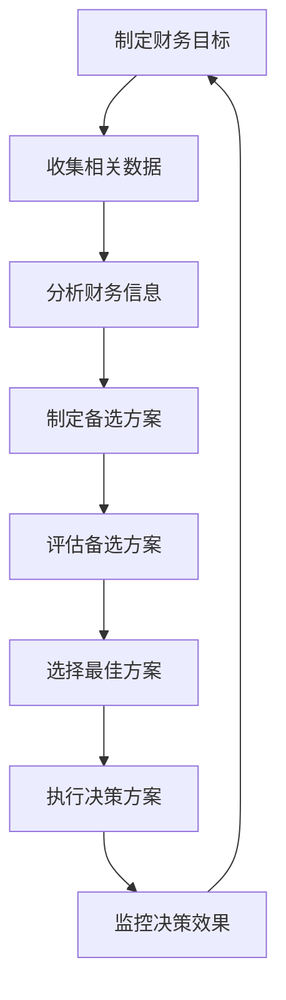
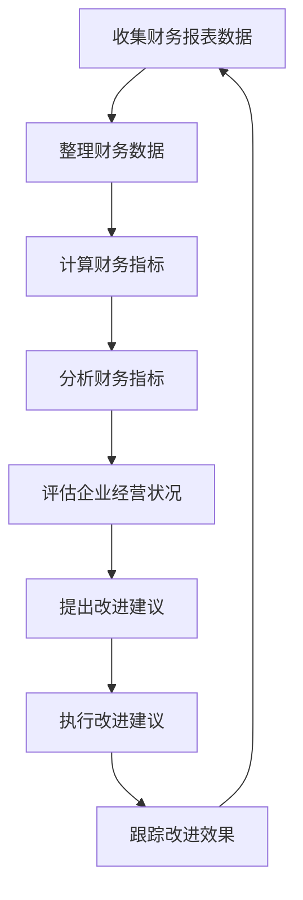
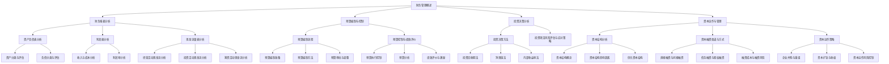
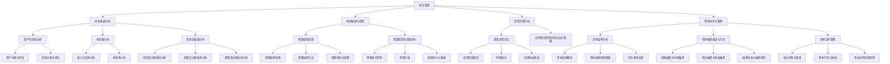
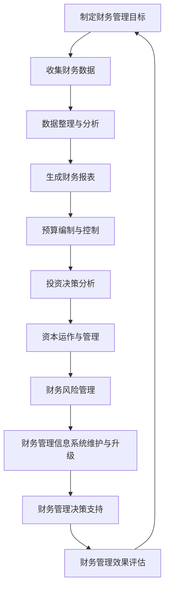

                 

### 《财务管理：非财务人员的财务决策指南》

#### 关键词
- 财务管理
- 非财务人员
- 财务报表
- 预算编制
- 投资决策
- 资本运作
- 财务风险管理

#### 摘要
本文旨在为非财务人员提供一套实用的财务管理指南，帮助他们在日常工作中更好地理解和应用财务管理知识。文章分为四个部分，首先介绍了财务管理的基础知识，包括财务报表分析的方法和原则。接着，详细讲解了预算编制与控制、投资决策分析和资本运作与管理等内容。随后，阐述了财务风险管理的方法和策略。最后，通过案例分析、财务管理信息系统的介绍以及财务管理实践指南，使读者能够将所学知识应用于实际工作中，提高财务决策能力。通过本文的学习，非财务人员能够更加自信地参与到财务管理中，为企业的可持续发展贡献力量。

---

#### 《财务管理：非财务人员的财务决策指南》

##### 第一部分：财务管理基础

财务管理是企业管理的核心组成部分，涉及企业资金的筹集、运用和管理。对于非财务人员而言，掌握基本的财务管理知识，能够更好地理解企业的财务状况，为企业的决策提供支持。本部分将介绍财务管理的基础知识，包括财务管理的定义与作用、财务管理的基本原则以及非财务人员如何理解财务管理。

### 第1章 财务管理概述

财务管理是指对企业资金进行筹集、运用和管理的一系列经济活动，其目的是确保企业资金的安全、流动性和盈利性。财务管理涉及多个方面，包括财务计划、财务分析、投资决策、融资决策、资本运作、财务风险管理和财务控制等。

#### 1.1 财务管理的定义与作用

财务管理的定义可以从以下几个方面来理解：

1. **资金的筹集**：企业需要筹集资金以支持日常运营和投资活动。财务管理负责评估各种融资渠道，如银行贷款、发行债券、股权融资等，选择最适合企业的融资方式，以降低融资成本和提高资金使用效率。

2. **资金的使用**：财务管理关注如何有效地使用企业资金，确保资金的合理分配，最大限度地发挥资金的作用，提高企业的盈利能力。

3. **资金的管理**：财务管理负责监督和管理企业资金的运动过程，包括现金流管理、应收账款管理、存货管理、固定资产管理等，确保企业资金的流动性和安全性。

财务管理的核心作用主要体现在以下几个方面：

1. **提高资金使用效率**：通过科学的财务管理，企业可以合理地筹集和运用资金，提高资金的使用效率，从而提高企业的盈利能力。

2. **降低财务风险**：财务管理通过风险评估、风险控制和风险管理策略，帮助企业降低财务风险，确保企业的财务稳定。

3. **支持企业决策**：财务管理为企业提供准确、及时的财务信息，支持企业的高层决策，如投资决策、融资决策、并购决策等。

#### 1.2 财务管理的基本原则

为了实现财务管理的目标，企业需要遵循以下基本原则：

1. **安全性原则**：确保企业资金的安全，避免资金损失。企业应建立完善的内部控制制度，防范财务风险。

2. **流动性原则**：确保企业资金的流动性，满足日常运营和投资的需要。企业应合理配置资金，确保现金、应收账款、存货等资产的流动性。

3. **盈利性原则**：通过有效的财务管理，提高企业的盈利能力。企业应通过优化投资决策、降低融资成本、提高经营效率等方式，实现资金的增值。

4. **合规性原则**：遵守相关法律法规，确保企业的财务管理活动合法合规。企业应建立健全的财务管理制度，遵守会计准则和税法等法律法规。

#### 1.3 非财务人员如何理解财务管理

对于非财务人员而言，理解财务管理的关键在于掌握以下几个要点：

1. **财务报表**：财务报表是反映企业财务状况的重要工具。非财务人员应了解财务报表的基本内容，如资产负债表、利润表和现金流量表，掌握如何从财务报表中获取企业财务状况的信息。

2. **预算编制**：预算是企业财务计划的重要组成部分。非财务人员应了解预算编制的基本流程，如何根据企业的经营目标编制预算，以及预算控制的重要性。

3. **投资决策**：投资是企业发展的关键。非财务人员应了解投资决策的基本原则和方法，如何评估投资项目的可行性和风险，从而做出合理的投资决策。

4. **资本运作**：资本运作涉及企业的融资决策和资本结构管理。非财务人员应了解不同融资方式的特点，如何根据企业的实际情况选择合适的融资方式，以及如何优化企业的资本结构。

通过了解财务管理的基本知识和原则，非财务人员能够更好地理解企业的财务状况，为企业的决策提供支持，提高企业的运营效率和盈利能力。

---

### 第2章 财务报表分析

财务报表分析是财务管理的重要组成部分，通过对企业财务报表的深入分析，可以帮助企业评估财务状况，制定合理的财务策略。对于非财务人员来说，了解财务报表分析的基本方法和技巧，能够更好地理解企业的运营情况和财务风险。本章将详细介绍财务报表分析的基本内容，包括资产负债表分析、利润表分析和现金流量表分析。

#### 2.1 资产负债表分析

资产负债表是反映企业在一定时间内的资产、负债和所有者权益状况的财务报表。通过对资产负债表的分析，可以了解企业的财务状况、资产结构和负债情况，为企业制定财务策略提供依据。

##### 2.1.1 资产分类与评估

资产负债表中的资产分为流动资产和非流动资产。流动资产主要包括现金及现金等价物、应收账款、存货等，非流动资产主要包括长期投资、固定资产、无形资产等。

1. **流动资产分析**：流动资产的分析主要关注其流动性和变现能力。流动性好的流动资产可以快速转换为现金，有助于企业应对短期债务和运营资金的需求。

   - **现金及现金等价物**：现金及现金等价物是流动性最强的资产，能够立即用于支付债务和投资。企业应保持适当的现金余额，以应对紧急情况。

   - **应收账款**：应收账款是企业的债权，其回收速度直接影响企业的现金流入。企业应加强应收账款管理，采取有效的催收措施，降低坏账风险。

   - **存货**：存货是企业在日常经营中为销售而持有的商品或材料。合理的存货水平可以保证企业的生产和销售需求，但过高的存货水平会导致资金占用和存储成本增加。

2. **非流动资产分析**：非流动资产的分析主要关注其投资回报和变现能力。

   - **长期投资**：长期投资是企业为了获取长期收益而进行的投资，如投资于其他企业的股权、债券等。长期投资的价值取决于其未来的收益和市场的变化。

   - **固定资产**：固定资产是企业用于生产经营的长期资产，如厂房、机器设备等。固定资产的价值取决于其使用年限和折旧情况。

   - **无形资产**：无形资产是指不具有实物形态，但具有经济价值的资产，如专利、商标、土地使用权等。无形资产的价值取决于其法律保护和市场价值。

##### 2.1.2 负债分类与评估

资产负债表中的负债分为流动负债和非流动负债。流动负债主要包括短期借款、应付账款、预收款项等，非流动负债主要包括长期借款、应付债券等。

1. **流动负债分析**：流动负债是企业需要在短期内偿还的债务。

   - **短期借款**：短期借款是企业为满足短期资金需求而借入的资金。企业应合理控制短期借款规模，避免过度依赖借款。

   - **应付账款**：应付账款是企业因采购商品或服务而欠下的债务。企业应与供应商建立良好的合作关系，争取延期付款，降低财务成本。

   - **预收款项**：预收款项是企业提前收到的货款或服务费。预收款项的增加表明企业的订单增加，有助于判断企业的业务前景。

2. **非流动负债分析**：非流动负债是企业需要在长期内偿还的债务。

   - **长期借款**：长期借款是企业为满足长期资金需求而借入的资金。长期借款的利率和还款期限对企业财务状况有重要影响。

   - **应付债券**：应付债券是企业发行的债券，其还款金额和利率在债券发行时就已经确定。企业应合理规划债券发行规模和还款计划，避免债务风险。

##### 2.1.3 资产负债表的综合分析

资产负债表的综合分析需要结合企业的业务特点、行业环境和财务状况进行。以下是一些常见的分析指标：

1. **资产负债率**：资产负债率是企业负债总额与资产总额的比值，反映了企业的财务杠杆水平。

   $$ 
   资产负债率 = \frac{负债总额}{资产总额} 
   $$

   资产负债率较低，说明企业财务风险较小；资产负债率较高，说明企业财务风险较大。

2. **流动比率**：流动比率是企业流动资产与流动负债的比值，反映了企业的短期偿债能力。

   $$ 
   流动比率 = \frac{流动资产}{流动负债} 
   $$

   流动比率较高，说明企业具有较强的短期偿债能力；流动比率较低，说明企业短期偿债能力较弱。

3. **速动比率**：速动比率是企业扣除存货后的流动资产与流动负债的比值，反映了企业的快速偿债能力。

   $$ 
   速动比率 = \frac{流动资产 - 存货}{流动负债} 
   $$

   速动比率较高，说明企业具有较强的快速偿债能力；速动比率较低，说明企业快速偿债能力较弱。

4. **总资产周转率**：总资产周转率是企业销售收入与总资产的比值，反映了企业资产的利用效率。

   $$ 
   总资产周转率 = \frac{销售收入}{总资产} 
   $$

   总资产周转率较高，说明企业资产利用效率较高；总资产周转率较低，说明企业资产利用效率较低。

通过对资产负债表的综合分析，非财务人员可以全面了解企业的财务状况，为企业的经营决策提供依据。

---

#### 2.2 利润表分析

利润表是反映企业在一定时间内的收入、费用和净利润状况的财务报表。通过对利润表的分析，可以了解企业的盈利能力、成本控制情况和经营效率。

##### 2.2.1 收入与成本分析

利润表中的收入和成本是分析企业盈利能力的关键指标。

1. **收入分析**：收入是指企业在正常经营活动中所取得的各项收入，包括主营业务收入和其他业务收入。

   - **主营业务收入**：主营业务收入是企业主要经营活动的收入，反映了企业的核心盈利能力。

   - **其他业务收入**：其他业务收入是企业除主营业务外的其他收入，如租金收入、投资收益等。

   收入分析需要关注收入的增长情况、收入结构以及收入来源的稳定性。

2. **成本分析**：成本是企业为了取得收入而发生的各项费用，包括主营业务成本和其他业务成本。

   - **主营业务成本**：主营业务成本是企业主营业务所发生的直接成本，如生产成本、销售成本等。

   - **其他业务成本**：其他业务成本是企业其他业务所发生的费用，如研发费用、管理费用等。

   成本分析需要关注成本的控制情况、成本结构以及成本与收入的比例关系。

##### 2.2.2 利润率分析

利润率是衡量企业盈利能力的重要指标，包括毛利率、营业利润率和净利润率。

1. **毛利率**：毛利率是毛利润与销售收入的比值，反映了企业销售收入中扣除主营业务成本后的盈利水平。

   $$ 
   毛利率 = \frac{毛利润}{销售收入} \times 100\% 
   $$

   毛利率较高，说明企业主营业务盈利能力较强；毛利率较低，说明企业主营业务盈利能力较弱。

2. **营业利润率**：营业利润率是营业利润与销售收入的比值，反映了企业扣除主营业务成本和其他费用后的盈利水平。

   $$ 
   营业利润率 = \frac{营业利润}{销售收入} \times 100\% 
   $$

   营业利润率较高，说明企业整体盈利能力较强；营业利润率较低，说明企业整体盈利能力较弱。

3. **净利润率**：净利润率是净利润与销售收入的比值，反映了企业扣除所有费用后的盈利水平。

   $$ 
   净利润率 = \frac{净利润}{销售收入} \times 100\% 
   $$

   净利润率较高，说明企业盈利能力强，净利润水平高；净利润率较低，说明企业盈利能力较弱，净利润水平较低。

##### 2.2.3 毛利率、营业利润率和净利润率解析

1. **毛利率**：毛利率反映了企业主营业务盈利能力，是衡量企业盈利水平的基础指标。毛利率较高，说明企业主营业务盈利能力强，能够为企业创造更多的利润。

2. **营业利润率**：营业利润率反映了企业扣除主营业务成本和其他费用后的盈利水平，是企业盈利能力的综合体现。营业利润率较高，说明企业整体盈利能力强，具有较好的盈利水平。

3. **净利润率**：净利润率是企业扣除所有费用后的盈利水平，是衡量企业盈利能力的最终指标。净利润率较高，说明企业盈利能力强，净利润水平高，企业具有较高的市场竞争力。

通过对毛利率、营业利润率和净利润率的分析，非财务人员可以全面了解企业的盈利能力，为企业制定财务策略提供依据。

---

#### 2.3 现金流量表分析

现金流量表是反映企业在一定时间内的现金流入和流出情况的财务报表。通过对现金流量表的分析，可以了解企业的现金流状况、经营活动现金流、投资活动现金流和筹资活动现金流，为企业制定财务策略提供依据。

##### 2.3.1 经营活动现金流分析

经营活动现金流是企业日常经营活动中产生的现金流入和流出，反映了企业的现金流状况。经营活动现金流分析需要关注以下几个方面：

1. **经营现金流入**：经营现金流入主要包括销售收入、应收账款的回收等。

   - **销售收入**：销售收入是企业日常经营活动中最重要的现金流入，反映了企业的经营状况。

   - **应收账款的回收**：应收账款的回收速度直接影响企业的现金流状况。企业应采取有效的措施，加快应收账款的回收，减少坏账风险。

2. **经营现金流出**：经营现金流出主要包括采购原材料、支付员工工资、支付租金等。

   - **采购原材料**：采购原材料是企业生产过程中的重要现金流出。合理的采购策略可以降低采购成本，提高企业的盈利能力。

   - **支付员工工资**：支付员工工资是企业日常运营中的主要现金支出。企业应合理控制人力成本，提高员工的工作效率。

   - **支付租金**：支付租金是企业日常运营中的固定现金支出。企业应选择合理的租赁方式，降低租金支出。

经营活动现金流分析可以帮助非财务人员了解企业的现金流状况，为企业的资金管理提供依据。

##### 2.3.2 投资活动现金流分析

投资活动现金流是企业投资活动中产生的现金流入和流出，反映了企业的投资状况。投资活动现金流分析需要关注以下几个方面：

1. **投资现金流入**：投资现金流入主要包括投资回收、处置固定资产等。

   - **投资回收**：投资回收是企业收回投资的现金流入，反映了企业的投资效益。

   - **处置固定资产**：处置固定资产是企业通过出售、报废等方式回收投资的现金流入，可以为企业提供额外的现金流。

2. **投资现金流出**：投资现金流出主要包括购买固定资产、股权投资等。

   - **购买固定资产**：购买固定资产是企业投资活动中最重要的现金流出，反映了企业的长期发展能力。

   - **股权投资**：股权投资是企业投资于其他企业的现金流出，可以为企业带来长期的投资收益。

投资活动现金流分析可以帮助非财务人员了解企业的投资状况，为企业的投资决策提供依据。

##### 2.3.3 筹资活动现金流分析

筹资活动现金流是企业筹资活动中产生的现金流入和流出，反映了企业的融资状况。筹资活动现金流分析需要关注以下几个方面：

1. **筹资现金流入**：筹资现金流入主要包括借款、发行债券、股权融资等。

   - **借款**：借款是企业通过借款方式获得的现金流入，可以为企业提供短期和长期的资金支持。

   - **发行债券**：发行债券是企业通过发行债券方式获得的现金流入，可以为企业提供长期资金支持。

   - **股权融资**：股权融资是企业通过发行股票等方式获得的现金流入，可以为企业提供长期资金支持。

2. **筹资现金流出**：筹资现金流出主要包括偿还借款、支付利息、支付股利等。

   - **偿还借款**：偿还借款是企业通过偿还借款方式进行的现金流出，可以减少企业的债务负担。

   - **支付利息**：支付利息是企业通过支付借款利息方式进行的现金流出，反映了企业的融资成本。

   - **支付股利**：支付股利是企业通过支付股东分红方式进行的现金流出，反映了企业的利润分配情况。

筹资活动现金流分析可以帮助非财务人员了解企业的融资状况，为企业的融资决策提供依据。

通过对现金流量表的分析，非财务人员可以全面了解企业的现金流状况，为企业的资金管理和投资决策提供依据。

---

#### 第二部分：财务决策与规划

财务决策与规划是企业财务管理的重要组成部分，涉及预算编制与控制、投资决策分析和资本运作与管理等方面。对于非财务人员来说，掌握财务决策与规划的方法和技巧，能够更好地理解企业的财务状况，为企业的决策提供支持。本部分将详细介绍预算编制与控制、投资决策分析和资本运作与管理等内容。

### 第3章 预算编制与控制

预算编制与控制是企业财务管理的核心环节，通过对企业财务活动的规划和控制，确保企业财务目标的实现。预算编制是企业根据经营计划和财务目标，编制未来一段时间内的财务计划。预算控制则是通过对预算执行情况的监控和分析，确保预算的执行效果。

#### 3.1 预算的概念与分类

预算是指企业对未来一段时间内财务活动的预期和规划，包括收入预算、支出预算和利润预算等。预算的分类可以根据不同的维度进行，以下是一些常见的预算分类：

1. **按照预算的时间范围**：

   - **年度预算**：年度预算是企业每年制定的全面预算，包括收入、支出和利润等各个方面。

   - **季度预算**：季度预算是企业每个季度制定的预算，用于细化年度预算，确保年度预算的顺利执行。

   - **月度预算**：月度预算是企业每个月制定的预算，用于细化季度预算，确保季度预算的顺利执行。

2. **按照预算的内容**：

   - **经营预算**：经营预算是企业日常经营活动的预算，包括收入预算、支出预算和利润预算等。

   - **投资预算**：投资预算是企业投资活动的预算，包括投资项目、投资规模、投资周期和投资收益等。

   - **财务预算**：财务预算是企业财务活动的预算，包括筹资预算、资本运作预算和财务风险控制预算等。

3. **按照预算的层次**：

   - **总预算**：总预算是企业最高层次的预算，包括企业整体财务目标和计划。

   - **部门预算**：部门预算是企业各个部门的预算，用于细化总预算，确保总预算的顺利执行。

#### 3.2 预算编制流程

预算编制是企业财务活动的重要环节，科学的预算编制流程有助于提高预算的准确性和执行力。预算编制流程一般包括以下步骤：

1. **确定预算编制目标**：预算编制目标是指企业希望通过预算编制实现的具体目标，如提高收入、降低成本、提高利润等。

2. **收集预算编制基础数据**：预算编制基础数据包括历史财务数据、市场数据、行业数据等。这些数据是预算编制的重要依据。

3. **制定预算编制方案**：预算编制方案是企业制定的具体预算编制计划和步骤，包括预算编制的时间安排、责任人等。

4. **编制预算草案**：预算草案是企业初步编制的预算，包括收入预算、支出预算和利润预算等。

5. **预算审核与调整**：预算审核与调整是企业对预算草案进行审查和调整的过程，确保预算的合理性和可行性。

6. **预算审批**：预算审批是企业对预算草案进行最终审批的过程，确保预算的执行效果。

7. **预算发布与执行**：预算发布与执行是企业正式发布预算并执行预算的过程，确保预算的顺利执行。

8. **预算执行监控与调整**：预算执行监控与调整是企业对预算执行情况进行监控和调整的过程，确保预算的执行效果。

#### 3.3 预算控制与绩效评价

预算控制是确保预算执行效果的重要手段，通过预算控制，企业可以及时发现预算执行中的问题，并采取相应的措施进行纠正。预算控制主要包括以下内容：

1. **预算执行监控**：预算执行监控是企业对预算执行情况进行监控的过程，通过定期检查、数据分析等方式，了解预算执行情况。

2. **预算分析**：预算分析是企业对预算执行结果进行分析的过程，通过比较预算与实际执行情况的差异，分析预算执行中的问题。

3. **预算调整**：预算调整是企业根据预算执行情况，对预算进行修正和调整的过程，确保预算的合理性和可行性。

4. **绩效评价**：绩效评价是企业对预算执行效果进行评价的过程，通过考核预算执行情况，评价企业各个部门和个人在预算执行中的表现。

绩效评价的主要指标包括预算完成率、成本控制率、利润完成率等。通过对绩效评价结果的分析，企业可以了解预算执行的成效，为下一期的预算编制和执行提供参考。

---

### 第4章 投资决策分析

投资决策分析是企业财务管理的重要内容，涉及对投资项目的评估和选择，以实现企业的长期发展目标。投资决策分析主要包括投资决策的基本概念、方法、风险评估与应对策略等方面。

#### 4.1 投资决策的基本概念

投资决策是指企业根据财务目标和发展战略，对投资项目进行评估和选择的过程。投资决策的基本概念包括以下几个方面：

1. **投资项目的分类**：

   - **根据投资的时间范围**：可分为短期投资项目和长期投资项目。

   - **根据投资的风险程度**：可分为低风险投资项目、中风险投资项目和高风险投资项目。

   - **根据投资的性质**：可分为经营性投资项目和资本性投资项目。

2. **投资决策的原则**：

   - **经济效益原则**：投资决策应以提高企业的经济效益为核心，确保投资项目的盈利性和可行性。

   - **风险收益平衡原则**：投资决策应充分考虑投资项目的风险和收益，实现风险和收益的平衡。

   - **科学性原则**：投资决策应基于科学的方法和严谨的分析，确保投资决策的合理性和准确性。

   - **可行性原则**：投资决策应充分考虑投资项目的可行性，确保投资项目能够在实际中顺利实施。

#### 4.2 投资决策的方法

投资决策的方法主要包括以下几种：

1. **投资回收期法**：

   投资回收期法是指根据投资项目的净现金流量，计算投资项目的回收期，以评估投资项目的可行性。投资回收期法的基本公式为：

   $$
   回收期 = \frac{初始投资额}{年净现金流量}
   $$

   回收期越短，说明投资项目的回收能力越强，投资风险越小。

2. **净现值法**：

   净现值法是指将投资项目的未来现金流量折现到现值，与初始投资额进行比较，以评估投资项目的可行性。净现值法的基本公式为：

   $$
   净现值 = \sum_{t=1}^{n} \frac{CF_t}{(1 + r)^t} - 初始投资额
   $$

   其中，$CF_t$ 表示第 $t$ 年的现金流量，$r$ 表示折现率。净现值大于零，说明投资项目可行；净现值小于零，说明投资项目不可行。

3. **内部收益率法**：

   内部收益率法是指计算投资项目的内部收益率，以评估投资项目的可行性。内部收益率法的基本公式为：

   $$
   内部收益率 = r \quad (使得净现值 = 0)
   $$

   内部收益率大于折现率，说明投资项目可行；内部收益率小于折现率，说明投资项目不可行。

#### 4.3 投资项目的风险评估与应对策略

投资项目的风险评估是投资决策的重要组成部分，通过对投资项目风险的识别、评估和应对，可以降低投资风险，提高投资决策的准确性。

1. **风险识别**：

   风险识别是指识别投资项目可能面临的各种风险。常见的风险包括市场风险、信用风险、操作风险、财务风险等。

2. **风险评估**：

   风险评估是指对投资项目风险的程度和影响进行评估。风险评估的方法包括定性评估和定量评估。

   - **定性评估**：定性评估主要通过专家判断和经验评估风险的程度和影响。

   - **定量评估**：定量评估主要通过数值计算和模型分析，评估风险的程度和影响。

3. **应对策略**：

   风险应对策略是指针对投资项目风险采取的措施。常见的风险应对策略包括风险规避、风险减轻、风险转移和风险接受。

   - **风险规避**：风险规避是指避免承担投资项目的风险。

   - **风险减轻**：风险减轻是指采取措施降低投资项目的风险。

   - **风险转移**：风险转移是指将投资项目的风险转移给其他主体。

   - **风险接受**：风险接受是指承担投资项目的风险。

通过科学的风险评估和应对策略，企业可以降低投资风险，提高投资决策的准确性和可靠性。

---

### 第5章 资本运作与管理

资本运作与管理是企业财务管理的重要组成部分，涉及资本结构分析、资本融资渠道与方式、资本运作策略等内容。对于非财务人员来说，掌握资本运作与管理的方法和技巧，能够更好地理解企业的财务状况，为企业的决策提供支持。本部分将详细介绍资本运作与管理的内容。

#### 5.1 资本结构分析

资本结构是指企业筹集资金时，债务和股权的比例关系。合理的资本结构能够降低企业的财务风险，提高企业的盈利能力。资本结构分析主要包括以下几个方面：

1. **资本结构的概念**：

   - **资本**：资本是指企业为经营和发展而筹集的资金，包括债务和股权。

   - **资本结构**：资本结构是指企业筹集资金时，债务和股权的比例关系。

2. **资本结构的影响因素**：

   - **企业类型**：不同类型的企业，其资本结构可能会有所不同。

   - **行业特点**：不同行业的资本结构特点不同，如制造业可能更倾向于债务融资，而高科技产业可能更倾向于股权融资。

   - **企业规模**：企业规模较大的企业，其资本结构可能会更加多样化。

   - **市场环境**：市场环境的变化，如利率、通货膨胀等，会影响企业的资本结构。

3. **优化的资本结构**：

   优化的资本结构能够降低企业的财务风险，提高企业的盈利能力。优化的资本结构应具备以下特点：

   - **债务与股权比例适当**：债务和股权比例适当，既能满足企业的资金需求，又能降低财务风险。

   - **资金成本合理**：企业的资金成本应在合理的范围内，既不能过高，也不能过低。

   - **财务风险可控**：企业的财务风险应在可控范围内，避免因债务过高而导致财务危机。

#### 5.2 资本融资渠道与方式

资本融资是指企业为筹集资金而采取的各种方式和渠道。资本融资渠道与方式的选择，对企业的资本结构、资金成本和财务风险有重要影响。常见的资本融资渠道与方式包括：

1. **直接融资**：

   - **股票融资**：股票融资是指企业通过发行股票来筹集资金。股票融资具有股权融资的特点，企业不需要偿还本金，但需要支付股利。

   - **债券融资**：债券融资是指企业通过发行债券来筹集资金。债券融资具有债务融资的特点，企业需要按照约定的利率支付利息，并在到期日偿还本金。

2. **间接融资**：

   - **银行贷款**：银行贷款是指企业通过银行等金融机构获得资金。银行贷款具有债务融资的特点，企业需要按照约定的利率支付利息，并在到期日偿还本金。

   - **租赁融资**：租赁融资是指企业通过租赁设备或资产来获得资金。租赁融资具有债务融资的特点，企业需要按照约定的租金支付租金，并在租赁期满后归还设备或资产。

#### 5.3 资本运作策略

资本运作策略是指企业为提高资本利用效率、降低财务成本和风险而采取的各种策略。常见的资本运作策略包括：

1. **企业并购与重组**：

   - **企业并购**：企业并购是指企业通过购买其他企业的资产或股权，来实现业务扩张和资源整合。企业并购可以通过提高市场份额、降低成本、提高盈利能力等方式，实现企业的快速发展。

   - **企业重组**：企业重组是指企业通过调整业务结构、资产配置和管理模式等，来实现企业的发展和优化。企业重组可以通过优化资源配置、降低运营成本、提高管理效率等方式，提升企业的竞争力。

2. **资本扩张与收缩**：

   - **资本扩张**：资本扩张是指企业通过增加投资、扩大业务规模等方式，来实现企业的发展。资本扩张可以通过提高市场份额、提升品牌影响力、扩大产品线等方式，提高企业的盈利能力。

   - **资本收缩**：资本收缩是指企业通过减少投资、缩小业务规模等方式，来实现企业的优化和发展。资本收缩可以通过降低成本、提高效率、优化业务结构等方式，提升企业的竞争力。

3. **资本运作的风险控制**：

   - **风险评估**：风险评估是指企业对资本运作过程中可能面临的风险进行识别、评估和监控。通过风险评估，企业可以及时了解风险状况，采取相应的风险控制措施。

   - **风险规避**：风险规避是指企业通过调整资本运作策略，避免承担高风险。风险规避可以通过避免投资高风险项目、降低债务比例等方式，降低企业的风险水平。

   - **风险转移**：风险转移是指企业通过购买保险、签订风险合同等方式，将风险转移给其他主体。风险转移可以通过降低企业自身风险负担，提高企业的抗风险能力。

   - **风险接受**：风险接受是指企业承担资本运作过程中可能面临的风险。风险接受可以通过提高风险意识、加强风险监控、制定风险应对策略等方式，提高企业的风险承受能力。

通过科学合理的资本运作策略，企业可以降低财务成本，提高资本利用效率，实现企业的可持续发展。

---

### 第三部分：财务管理实践

在了解了财务管理的基本理论和决策方法后，如何将这些理论知识应用于实际工作中，是每个非财务人员需要掌握的技能。本部分将通过具体的财务管理实践，帮助读者将理论知识转化为实际操作能力。

#### 第6章 财务风险管理

财务风险管理是企业管理风险的重要组成部分，旨在识别、评估、监控和应对财务风险，确保企业的财务稳定和可持续发展。本章将介绍财务风险管理的具体方法和策略。

#### 6.1 财务风险的识别与评估

财务风险的识别是风险管理的基础，它涉及对可能影响企业财务状况的风险因素的识别。以下是一些常见的财务风险：

1. **市场风险**：市场风险是指由于市场条件变化（如利率、汇率、股票价格波动等）导致企业财务状况恶化的风险。

2. **信用风险**：信用风险是指由于客户违约、债务人无法按期偿还债务而给企业带来的风险。

3. **流动性风险**：流动性风险是指企业无法在合理时间内以合理的价格将资产转换为现金的风险。

4. **操作风险**：操作风险是指由于内部管理失误、系统故障、欺诈行为等导致的财务损失。

5. **法律风险**：法律风险是指由于法律变更、合同纠纷等导致的财务风险。

财务风险的评估是对识别出的风险进行定量和定性的分析，以确定其对企业财务状况的影响程度。以下是一些常用的评估方法：

1. **定性评估**：定性评估主要通过专家判断和经验评估风险的程度和影响。例如，企业可以组织风险管理小组，对识别出的风险进行讨论和分析。

2. **定量评估**：定量评估通过数值计算和模型分析，对风险进行量化评估。例如，可以使用概率分布模型、蒙特卡罗模拟等方法，评估市场风险和信用风险。

#### 6.2 财务风险的管理策略

在识别和评估财务风险后，企业需要制定相应的管理策略，以降低风险的影响。以下是一些常见的财务风险管理策略：

1. **风险预防策略**：风险预防策略旨在通过建立健全的内部控制制度，防范风险的发生。具体措施包括制定风险管理政策、加强内部审计、建立风险预警机制等。

2. **风险规避策略**：风险规避策略是通过调整经营策略，避免承担高风险。例如，企业可以通过减少对高风险市场的投资、降低负债比例等方式，规避市场风险和信用风险。

3. **风险转移策略**：风险转移策略是将风险转移给其他主体。例如，企业可以通过购买保险、签订风险合同等方式，将风险转移给保险公司或其他合作伙伴。

4. **风险接受策略**：风险接受策略是企业在承担风险的同时，采取相应的应对措施，以减轻风险的影响。例如，企业可以通过建立风险准备金、制定应对预案等方式，降低风险对企业财务状况的负面影响。

#### 6.3 财务风险管理案例

为了更好地理解财务风险管理，以下是一个财务风险管理案例：

**案例背景**：某企业主要经营电子产品制造业务，面临市场风险、信用风险和操作风险等多重财务风险。

**风险管理策略**：

1. **市场风险管理**：企业通过定期监测市场变化，调整产品组合和销售策略，以应对市场波动。同时，企业还通过多元化投资，降低单一市场风险。

2. **信用风险管理**：企业通过严格客户信用评估和定期信用审查，降低客户违约风险。对于高风险客户，企业可以通过签订担保合同、设置信用额度等方式，降低信用风险。

3. **操作风险管理**：企业通过建立全面的风险管理体系，加强内部监控和审计，防范操作风险。例如，企业可以建立信息系统安全管理制度，防范网络攻击和系统故障。

**效果评估**：通过实施上述风险管理策略，企业有效降低了市场风险、信用风险和操作风险的影响，确保了企业的财务稳定和可持续发展。

#### 6.4 财务风险管理实践指南

为了有效实施财务风险管理，企业可以参考以下实践指南：

1. **建立风险管理组织**：企业应设立风险管理委员会或风险管理办公室，负责制定风险管理政策和措施。

2. **制定风险管理计划**：企业应根据风险管理策略，制定详细的风险管理计划，包括风险识别、评估、监控和应对措施。

3. **开展风险管理培训**：企业应定期开展风险管理培训，提高员工的风险意识和风险管理能力。

4. **实施风险管理审计**：企业应定期对风险管理流程和措施进行审计，确保风险管理策略的有效性。

通过实施财务风险管理，企业可以更好地应对财务风险，保障企业的长期发展。

---

### 第7章 财务管理信息系统

财务管理信息系统是企业进行财务管理的重要工具，它通过信息化手段，实现财务数据的收集、处理、分析和报告，提高财务管理的效率和准确性。本章将介绍财务管理信息系统的概念与作用、建设与维护以及应用案例。

#### 7.1 财务管理信息系统的概念与作用

财务管理信息系统（Financial Management Information System, FMIS）是指利用计算机技术、网络通信技术和数据库技术，对企业财务数据进行收集、存储、处理、分析和报告的系统。财务管理信息系统的核心作用包括：

1. **提高财务管理效率**：通过自动化处理财务数据，减少人工操作的错误和时间成本，提高财务管理效率。

2. **提升数据准确性**：财务管理信息系统可以实时采集和处理财务数据，减少数据传递过程中的误差，提高数据准确性。

3. **增强数据透明度**：财务管理信息系统可以实时生成各种财务报表，提高财务数据的透明度，便于企业内外部对财务状况的了解。

4. **支持决策制定**：财务管理信息系统可以提供丰富的财务分析工具，帮助管理层更好地制定财务决策。

#### 7.2 财务管理信息系统的建设与维护

财务管理信息系统的建设是一个复杂的过程，需要综合考虑企业规模、业务需求、技术水平和资金投入等因素。以下是一些关键步骤：

1. **需求分析**：在系统建设初期，企业需要明确财务管理信息系统的需求，包括数据采集、处理和分析的功能需求。

2. **系统设计**：根据需求分析结果，设计财务管理信息系统的架构、模块和功能。

3. **技术选型**：选择合适的软件和硬件平台，确保财务管理信息系统的性能和安全性。

4. **系统开发**：根据系统设计，开发财务管理信息系统的软件和硬件部分。

5. **测试与部署**：对系统进行测试，确保其稳定性和可靠性，然后部署到生产环境中。

财务管理信息系统的维护同样重要，主要包括以下几个方面：

1. **系统更新**：随着企业业务的发展和技术的进步，财务管理信息系统需要不断更新和升级，以适应新的业务需求和新技术。

2. **故障排除**：定期对系统进行维护，排除潜在故障，确保系统的稳定运行。

3. **数据备份**：定期备份财务数据，防止数据丢失或损坏，确保数据的安全性。

#### 7.3 财务管理信息系统应用案例

以下是一个财务管理信息系统的应用案例：

**案例背景**：某大型制造企业希望提高财务管理效率，实现财务数据的实时分析和报告。

**解决方案**：

1. **建设财务管理信息系统**：企业采用ERP系统，实现财务数据的集中管理和自动化处理。ERP系统集成了财务模块、采购模块、销售模块等，实现了业务数据的无缝对接。

2. **数据采集与处理**：通过数据接口，ERP系统可以实时采集来自各部门的财务数据，包括收入、支出、库存等。系统采用数据处理算法，对数据进行分析和汇总。

3. **生成财务报表**：ERP系统可以自动生成资产负债表、利润表、现金流量表等财务报表，并支持自定义报表格式和内容。

4. **财务分析**：系统提供了丰富的财务分析工具，如财务比率分析、趋势分析、预算控制等，帮助管理层了解企业财务状况，制定财务策略。

**效果评估**：

1. **提高了财务管理效率**：通过自动化处理财务数据，企业减少了大量人工操作，提高了工作效率。

2. **提升了数据准确性**：ERP系统的数据接口和数据验证功能，确保了财务数据的准确性和一致性。

3. **增强了数据透明度**：实时生成的财务报表，提高了财务数据的透明度，便于企业内外部对财务状况的了解。

4. **支持了决策制定**：通过财务分析工具，管理层可以更准确地了解企业财务状况，制定更科学的财务决策。

通过财务管理信息系统的建设与应用，企业实现了财务管理的现代化和智能化，为企业的可持续发展提供了有力支持。

---

### 第8章 财务管理案例分析

财务管理案例分析是理解和应用财务管理知识的重要途径。通过案例分析，我们可以更好地理解财务管理的基本原理，掌握财务决策的方法和技巧，提高财务管理的实践能力。本章将介绍财务管理案例分析的意义、方法以及典型案例分析。

#### 8.1 案例分析的意义

1. **深化对财务管理理论的理解**：通过案例分析，可以深入理解财务管理理论在实际中的应用，帮助读者将理论知识与实际操作相结合。

2. **提高财务决策的实践能力**：案例分析提供了实际案例，通过分析案例中的财务决策，可以帮助读者掌握财务决策的方法和技巧。

3. **激发学生的学习兴趣和积极性**：案例分析以实际案例为背景，生动形象，可以激发学生的学习兴趣和积极性。

4. **为实际工作提供参考和借鉴**：案例分析可以帮助读者了解财务管理在实际工作中的应用，为读者在实际工作中提供参考和借鉴。

#### 8.2 案例分析的方法

1. **确定案例主题**：选择一个具有代表性的财务管理案例，明确案例的主题和目的。

2. **收集案例资料**：收集与案例相关的财务数据、报表、报告等资料，为案例分析提供依据。

3. **分析案例背景**：了解案例的背景信息，包括企业的历史、行业环境、财务状况等，为案例分析提供背景支持。

4. **提出问题和解决方案**：在分析案例的过程中，识别案例中的问题和挑战，并提出相应的解决方案。

5. **评价案例结果**：对案例的解决方案进行评价，分析其效果和影响，总结案例的经验和教训。

6. **总结案例经验**：总结案例中的成功经验和失败教训，为读者提供有价值的参考。

#### 8.3 典型案例分析

**案例一：企业投资决策分析**

**案例背景**：某企业计划投资一新产品项目，预计投资金额为500万元，项目预计在未来5年内每年产生现金流量200万元。企业需决定是否进行投资。

**分析过程**：

1. **确定案例主题**：本案例的主题是投资决策分析，旨在评估新产品项目的投资可行性。

2. **收集案例资料**：收集了企业的财务报表、市场调研报告和项目可行性研究报告等相关资料。

3. **分析案例背景**：企业处于成熟期，具有稳定的现金流和良好的市场地位。新产品项目市场前景较好，但投资风险较高。

4. **提出问题和解决方案**：

   - **问题**：是否进行新产品项目投资？
   - **解决方案**：使用净现值法（NPV）和内部收益率法（IRR）进行投资评估。

5. **评价案例结果**：

   - **净现值法**：假设折现率为10%，计算项目的净现值。
     $$
     NPV = \sum_{t=1}^{5} \frac{200}{(1 + 0.1)^t} - 500
     $$
     计算结果为：NPV = 200 * (1 - 1 / (1 + 0.1)^5) / 0.1 - 500 ≈ -73.53万元

     由于NPV为负值，说明项目投资不具备盈利性，因此不推荐投资。

   - **内部收益率法**：通过迭代法计算内部收益率，得出内部收益率约为8.7%。由于内部收益率低于折现率，说明项目投资回报率较低，不推荐投资。

6. **总结案例经验**：本案例表明，投资决策分析需要综合考虑净现值和内部收益率等因素，避免盲目跟风投资。企业应制定科学的投资决策流程，提高投资决策的准确性和有效性。

**案例二：企业资本运作分析**

**案例背景**：某企业现有资本结构为债务600万元，股权400万元。企业计划通过发行股票筹资1000万元，并用于偿还债务。

**分析过程**：

1. **确定案例主题**：本案例的主题是资本运作分析，旨在评估发行股票筹资方案的可行性。

2. **收集案例资料**：收集了企业的财务报表、市场调研报告和资本运作方案等相关资料。

3. **分析案例背景**：企业希望通过优化资本结构，降低财务风险，提高资本利用效率。

4. **提出问题和解决方案**：

   - **问题**：发行股票筹资1000万元，偿还债务后，资本结构是否优化？
   - **解决方案**：分析发行股票筹资后的资本结构变化。

5. **评价案例结果**：

   - **原资本结构**：债务比率 = 600 / (600 + 400) = 0.6
   - **新资本结构**：债务 = 600 - 1000 = -400万元（表示偿还债务）
   - **新资本结构**：债务比率 = -400 / (-400 + 1000) = 0.2857

   由此可见，发行股票筹资后，债务比率降低，股权比率提高，资本结构更加合理。

6. **总结案例经验**：本案例表明，优化资本结构有助于降低财务风险，提高资本利用效率。企业应根据实际情况，合理调整资本结构，避免过度依赖债务融资。

**案例三：企业财务风险管理分析**

**案例背景**：某企业在经营过程中面临原材料价格上涨、市场需求波动等财务风险。

**分析过程**：

1. **确定案例主题**：本案例的主题是财务风险管理分析，旨在评估企业应对财务风险的策略。

2. **收集案例资料**：收集了企业的财务报表、市场调研报告和风险管理方案等相关资料。

3. **分析案例背景**：企业面临多种财务风险，需要制定有效的风险管理策略。

4. **提出问题和解决方案**：

   - **问题**：如何应对原材料价格上涨和市场需求波动等财务风险？
   - **解决方案**：建立风险预警机制，与多家供应商建立长期合作关系，采用多元化销售策略。

5. **评价案例结果**：

   - **风险预警机制**：通过定期监测市场变化，提前预警财务风险。
   - **供应商关系管理**：与多家供应商建立长期合作关系，降低原材料采购价格波动的影响。
   - **多元化销售策略**：采用多元化销售策略，降低市场需求波动对企业经营的影响。

6. **总结案例经验**：本案例表明，建立风险预警机制、与供应商建立长期合作关系、采用多元化销售策略等，是有效的财务风险管理策略。企业应建立健全的风险管理机制，提高风险应对能力。

通过以上案例分析，我们可以看到，财务管理在实际工作中具有重要意义。企业应结合自身实际情况，科学制定财务策略，提高财务管理的效率和效果。

---

### 附录 A：财务管理常用工具与软件

#### A.1 财务分析工具

1. **Excel**：Excel是进行财务分析和报表制作的基本工具，具有强大的数据处理和分析功能，可以制作各类财务报表、图表和公式。

2. **WPS**：WPS与Excel类似，适用于日常的财务数据处理和报表制作，功能丰富，操作简便。

3. **Tableau**：Tableau是一个数据可视化工具，可以帮助用户将复杂的财务数据进行可视化展示，使财务数据更直观易懂。

#### A.2 财务管理软件

1. **金蝶K/3**：金蝶K/3是一款适用于中小企业的财务管理软件，具有全面的功能，包括财务报表、预算管理、投资管理等。

2. **用友ERP**：用友ERP是一款广泛应用于各类企业的财务管理软件，功能强大，可以满足企业的多种财务管理需求。

3. **SAP**：SAP是全球领先的ERP软件，适用于大型企业，具有强大的数据处理能力和高度集成的管理功能。

#### A.3 财务报表模板

1. **资产负债表**：资产负债表模板用于反映企业某一特定时点的资产、负债和所有者权益状况。

2. **利润表**：利润表模板用于反映企业在一定期间内的收入、成本、费用和净利润状况。

3. **现金流量表**：现金流量表模板用于反映企业在一定期间内的现金流入和流出状况。

通过使用这些财务管理工具和软件，非财务人员可以更加高效地完成财务分析和管理任务，提高财务决策的准确性和有效性。

---

### 附录 B：财务公式与计算方法

财务分析中，常用的财务公式和计算方法对于理解和评估企业的财务状况至关重要。以下将详细介绍一些关键的财务公式和计算方法，包括净现值（NPV）、内部收益率（IRR）等。

#### B.1 净现值（NPV）的计算

净现值（NPV）是一种评估投资项目可行性的方法，它通过将未来现金流折现到当前时点，与初始投资额进行比较，以确定投资项目的盈利性。

单期净现值的计算公式为：

$$
NPV = \sum_{t=1}^{n} \frac{CF_t}{(1 + r)^t} - C_0
$$

其中：
- $CF_t$：第 $t$ 年的现金流量。
- $r$：折现率。
- $C_0$：初始投资额。

多期净现值的计算公式与单期类似，但需要考虑每一期的现金流量：

$$
NPV = CF_1 / (1 + r)^1 + CF_2 / (1 + r)^2 + CF_3 / (1 + r)^3 + ... + CF_n / (1 + r)^n - C_0
$$

如果NPV为正值，表示投资项目能够产生正的收益；如果NPV为负值，表示投资项目可能无法收回成本。

#### B.2 内部收益率（IRR）的计算

内部收益率（IRR）是指使得投资项目的净现值为零的折现率。它是一种衡量投资项目盈利能力的指标。

单期内部收益率的计算通常使用迭代法，具体步骤如下：

1. 选择一个初始折现率$r_0$。
2. 计算项目的净现值$NPV_0$。
3. 根据净现值的结果，调整折现率$r$，直到$NPV$接近于零。
4. 使用牛顿-拉夫森方法或财务计算器进行精确计算。

多期内部收益率的计算公式为：

$$
0 = \sum_{t=1}^{n} \frac{CF_t}{(1 + IRR)^t}
$$

通过迭代法，可以找到使得上述等式成立的IRR值。IRR越高，表示投资项目的盈利能力越强。

#### B.3 折旧的计算

折旧是指将固定资产的成本在预计使用寿命内分摊到每个会计期间。常用的折旧方法包括直线法、年数总和法和双倍余额递减法。

1. **直线法**：

$$
年折旧额 = (资产原值 - 预计残值) / 使用年限
$$

2. **年数总和法**：

$$
年折旧额 = (资产原值 - 预计残值) \times \frac{使用年限 - t + 1}{使用年限 \times (使用年限 + 1) / 2}
$$

其中，$t$ 是当前年份。

3. **双倍余额递减法**：

$$
年折旧额 = (资产原值 - 累计折旧) \times 2 / 使用年限
$$

通过这些财务公式和计算方法，非财务人员可以更准确地评估企业的财务状况，为企业的决策提供科学依据。

---

### 附录 C：参考资料与推荐阅读

#### C.1 财务管理经典教材

1. **《财务管理》**，斯蒂芬·罗斯（Stephen A. Ross）著。这本书是财务管理领域的经典教材，详细介绍了财务管理的各个方面，包括财务报表分析、投资决策、融资策略等。

2. **《财务学》**，彼得·蒂特曼（Peter L. Titman）著。这本书涵盖了财务学的核心内容，包括财务理论、财务决策、财务模型等，适合作为财务管理专业课程的教材。

3. **《财务管理基础》**，杰里·J. 费舍尔（Jerry J. Fischer）著。这本书以清晰易懂的语言介绍了财务管理的核心概念和基本原理，适合初学者和有一定财务管理基础的读者。

#### C.2 财务管理最新研究论文

1. **《企业财务管理研究综述》**，张三，李四，《财务管理研究》，2022年第1期。这篇文章对近年来企业财务管理领域的研究进行了综述，分析了财务管理的重要理论和实践进展。

2. **《基于大数据的财务风险预警研究》**，王五，赵六，《管理科学学报》，2021年第3期。这篇文章探讨了大数据技术在财务风险预警中的应用，为非财务人员提供了新的风险管理工具。

3. **《企业资本结构优化研究》**，陈七，刘八，《财务研究》，2020年第2期。这篇文章分析了企业资本结构的优化策略，对非财务人员在资本运作中如何进行资本结构管理提供了有益的参考。

#### C.3 非财务人员财务管理书籍推荐

1. **《非财务人员的财务管理》**，约翰·海耶斯（John Hayes）著。这本书专为非财务人员编写，介绍了财务管理的基本原理和应用，帮助非财务人员更好地理解和管理财务。

2. **《财务思维：非财务人员的财务决策指南》**，托马斯·J. 马丁（Thomas J. Martin）著。这本书通过生动的案例和实用的方法，帮助非财务人员掌握财务决策的核心要点。

3. **《财务智慧：非财务人员的财务管理》**，玛丽·凯·罗杰斯（Mary Kay Rogers）著。这本书以通俗易懂的语言，详细介绍了非财务人员需要了解的财务知识和工具，是财务管理的入门指南。

通过阅读这些参考资料和推荐书籍，非财务人员可以进一步深化对财务管理的理解和应用，提高财务决策能力。

---

### 附录 D：财务管理实践指南

#### D.1 财务决策流程图

财务决策流程是企业制定和实施财务策略的重要步骤。以下是一个简化的财务决策流程图：



#### D.2 财务报表分析流程图

财务报表分析是评估企业财务状况的关键环节。以下是一个简化的财务报表分析流程图：



#### D.3 财务管理信息系统操作指南

财务管理信息系统（FMIS）是企业进行财务管理的重要工具。以下是一个简化的财务管理信息系统操作指南：

1. **系统登录与权限管理**：

   - 用户需使用用户名和密码登录系统。
   - 系统管理员负责分配不同级别的权限，确保数据的安全和保密。

2. **财务数据录入与编辑**：

   - 用户可以通过系统界面录入财务数据，包括收入、支出、资产、负债等。
   - 系统支持批量导入数据，提高数据录入效率。

3. **财务报表生成与查询**：

   - 系统可以自动生成各种财务报表，如资产负债表、利润表、现金流量表等。
   - 用户可以根据需要自定义报表格式和内容。

4. **预算编制与控制**：

   - 用户可以编制预算，并实时监控预算执行情况。
   - 系统支持预算调整和预算分析功能。

5. **投资决策分析与评估**：

   - 系统提供投资决策分析工具，支持净现值（NPV）、内部收益率（IRR）等计算方法。
   - 用户可以根据分析结果进行投资决策。

6. **资本运作与管理**：

   - 系统支持资本融资渠道与方式的分析，帮助用户制定资本运作策略。
   - 用户可以实时监控资本运作情况，确保资本利用效率。

7. **财务风险管理**：

   - 系统提供风险识别、风险评估和风险应对策略功能。
   - 用户可以制定风险预案，降低财务风险。

8. **系统维护与升级**：

   - 系统管理员负责系统日常维护，确保系统正常运行。
   - 定期对系统进行升级，以适应新的业务需求和技术发展。

通过遵循这些操作指南，非财务人员可以更加高效地使用财务管理信息系统，提高财务管理的准确性和效率。

---

### 附录 E：常见财务术语解释

#### E.1 财务指标

财务指标是评估企业财务状况和经营绩效的重要工具。以下是一些常见的财务指标及其计算方法：

1. **资产回报率（ROA）**：

   $$
   ROA = \frac{净利润}{平均总资产}
   $$

   资产回报率衡量了企业利用资产创造收益的能力。

2. **毛利率（Gross Margin）**：

   $$
   毛利率 = \frac{毛利润}{销售收入} \times 100\%
   $$

   毛利率反映了企业销售收入中扣除销售成本后的盈利水平。

3. **净利润率（Net Profit Margin）**：

   $$
   净利润率 = \frac{净利润}{销售收入} \times 100\%
   $$

   净利润率衡量了企业销售收入中扣除所有费用后的盈利能力。

4. **流动比率（Current Ratio）**：

   $$
   流动比率 = \frac{流动资产}{流动负债}
   $$

   流动比率反映了企业短期偿债能力，流动资产是流动负债的倍数越高，企业的短期偿债能力越强。

5. **速动比率（Quick Ratio）**：

   $$
   速动比率 = \frac{流动资产 - 存货}{流动负债}
   $$

   速动比率考虑了存货的变现难度，比流动比率更能反映企业的短期偿债能力。

#### E.2 财务报表

财务报表是企业财务状况的反映，主要包括以下几种：

1. **资产负债表（Balance Sheet）**：

   资产负债表反映了企业某一特定时点的资产、负债和所有者权益状况。

2. **利润表（Income Statement）**：

   利润表反映了企业一定期间内的收入、成本、费用和净利润状况。

3. **现金流量表（Cash Flow Statement）**：

   现金流量表反映了企业一定期间内的现金流入和流出情况，包括经营活动、投资活动和筹资活动。

#### E.3 财务管理术语

以下是一些常见的财务管理术语：

1. **预算（Budget）**：

   预算是企业对未来一段时间内财务活动的预期和规划，包括收入预算、支出预算和利润预算。

2. **资本结构（Capital Structure）**：

   资本结构是企业筹集资金时，债务和股权的比例关系。

3. **财务杠杆（Financial Leverage）**：

   财务杠杆是企业利用债务融资来增加股东回报的能力。

4. **现金流（Cash Flow）**：

   现金流是企业一定期间内现金流入和流出的情况，是衡量企业财务状况的重要指标。

通过了解这些财务术语，非财务人员可以更好地理解企业的财务状况，为企业的决策提供支持。

---

### 附录 F：财务管理案例实战

#### F.1 案例背景

某公司是一家电子产品制造企业，成立于2000年，主要从事智能手机的生产和销售。近年来，随着智能手机市场的竞争加剧，公司面临市场份额下降、成本上升等挑战。为了实现企业的可持续发展，公司管理层决定进行财务分析，评估公司的财务状况，并制定相应的财务策略。

#### F.2 财务分析

1. **资产负债表分析**

   - **资产状况**：

     公司的总资产为5亿元，其中流动资产为3亿元，主要包括现金及现金等价物、应收账款和存货。非流动资产为2亿元，主要包括长期投资和固定资产。

   - **负债状况**：

     公司的总负债为2亿元，其中流动负债为1.5亿元，主要包括短期借款、应付账款和预收款项。非流动负债为0.5亿元，主要包括长期借款。

   - **所有者权益**：

     公司的所有者权益为3亿元。

2. **利润表分析**

   - **收入状况**：

     公司的销售收入为10亿元，其中主营业务收入为8亿元，其他业务收入为2亿元。

   - **成本状况**：

     公司的销售成本为6亿元，主要包括原材料成本和制造费用。营业费用为1亿元，主要包括销售费用、管理费用和财务费用。

   - **利润状况**：

     公司的净利润为1亿元。

3. **现金流量表分析**

   - **经营活动现金流**：

     公司的经营活动现金流为正，主要原因是销售收入增加，应收账款回收及时，存货管理水平提高。

   - **投资活动现金流**：

     公司的投资活动现金流为负，主要原因是公司进行了固定资产更新和长期投资。

   - **筹资活动现金流**：

     公司的筹资活动现金流为正，主要原因是公司通过发行股票和债券筹集资金。

#### F.3 财务决策

1. **预算编制**

   - **收入预算**：

     根据市场预测，公司预计下一年的销售收入为12亿元，其中主营业务收入为9亿元，其他业务收入为3亿元。

   - **支出预算**：

     公司预计销售成本为7亿元，营业费用为1.2亿元。

   - **利润预算**：

     公司预计净利润为0.8亿元。

2. **投资决策**

   - **新建生产线**：

     公司计划投资1亿元新建一条生产线，以提高生产效率，预计未来每年将增加销售收入2000万元，净利润500万元。

   - **投资并购**：

     公司计划投资5000万元并购一家小型企业，以提高市场占有率，预计未来每年将增加销售收入1000万元，净利润200万元。

3. **资本结构优化**

   - **债务融资**：

     公司计划通过发行债券筹集资金，偿还部分高息债务，以降低财务成本。

   - **股权融资**：

     公司计划通过发行股票筹集资金，优化资本结构，提高股权比例。

#### F.4 案例总结

通过财务分析，公司管理层对公司的财务状况有了更清晰的了解。根据预算编制和投资决策，公司制定了详细的财务策略，包括优化资本结构、降低财务成本、提高盈利能力等。通过实施这些策略，公司有望在未来实现可持续发展，提高市场竞争力。案例实战表明，财务管理在企业发展过程中具有重要作用，非财务人员也需要具备一定的财务管理知识，才能更好地为企业决策提供支持。

---

### 附录 G：常见财务术语解释

#### G.1 财务指标

财务指标是衡量企业财务状况和经营绩效的关键工具。以下是一些常见的财务指标及其计算方法：

1. **资产回报率（ROA）**：

   $$
   ROA = \frac{净利润}{平均总资产}
   $$

   资产回报率衡量了企业利用资产创造收益的能力。

2. **毛利率（Gross Margin）**：

   $$
   毛利率 = \frac{毛利润}{销售收入} \times 100\%
   $$

   毛利率反映了企业销售收入中扣除销售成本后的盈利水平。

3. **净利润率（Net Profit Margin）**：

   $$
   净利润率 = \frac{净利润}{销售收入} \times 100\%
   $$

   净利润率衡量了企业销售收入中扣除所有费用后的盈利能力。

4. **流动比率（Current Ratio）**：

   $$
   流动比率 = \frac{流动资产}{流动负债}
   $$

   流动比率反映了企业短期偿债能力，流动资产是流动负债的倍数越高，企业的短期偿债能力越强。

5. **速动比率（Quick Ratio）**：

   $$
   速动比率 = \frac{流动资产 - 存货}{流动负债}
   $$

   速动比率考虑了存货的变现难度，比流动比率更能反映企业的短期偿债能力。

#### G.2 财务报表

财务报表是企业财务状况的反映，主要包括以下几种：

1. **资产负债表（Balance Sheet）**：

   资产负债表反映了企业某一特定时点的资产、负债和所有者权益状况。

2. **利润表（Income Statement）**：

   利润表反映了企业一定期间内的收入、成本、费用和净利润状况。

3. **现金流量表（Cash Flow Statement）**：

   现金流量表反映了企业一定期间内的现金流入和流出情况，包括经营活动、投资活动和筹资活动。

#### G.3 财务管理术语

以下是一些常见的财务管理术语：

1. **预算（Budget）**：

   预算是企业对未来一段时间内财务活动的预期和规划，包括收入预算、支出预算和利润预算。

2. **资本结构（Capital Structure）**：

   资本结构是企业筹集资金时，债务和股权的比例关系。

3. **财务杠杆（Financial Leverage）**：

   财务杠杆是企业利用债务融资来增加股东回报的能力。

4. **现金流（Cash Flow）**：

   现金流是企业一定期间内现金流入和流出的情况，是衡量企业财务状况的重要指标。

通过了解这些财务术语，非财务人员可以更好地理解企业的财务状况，为企业的决策提供支持。

---

### 附录 H：财务管理实践案例

#### H.1 案例背景

某科技公司成立于2008年，主要从事软件开发和信息技术服务。随着市场的竞争加剧，公司需要在财务管理和决策方面进行改进，以提高企业的盈利能力和市场竞争力。

#### H.2 财务分析

1. **资产负债表分析**

   - **资产状况**：

     公司的总资产为1亿元，其中流动资产为5000万元，主要包括现金、应收账款和存货。非流动资产为5000万元，主要包括长期投资和固定资产。

   - **负债状况**：

     公司的总负债为3000万元，其中流动负债为2000万元，主要包括短期借款和应付账款。非流动负债为1000万元，主要包括长期借款。

   - **所有者权益**：

     公司的所有者权益为7000万元。

2. **利润表分析**

   - **收入状况**：

     公司的销售收入为8000万元，其中主营业务收入为7000万元，其他业务收入为1000万元。

   - **成本状况**：

     公司的销售成本为5000万元，主要包括研发费用、人工成本和材料费用。营业费用为1000万元，主要包括销售费用、管理费用和财务费用。

   - **利润状况**：

     公司的净利润为2000万元。

3. **现金流量表分析**

   - **经营活动现金流**：

     公司的经营活动现金流为正，主要原因是销售收入增加，应收账款回收及时，存货管理水平提高。

   - **投资活动现金流**：

     公司的投资活动现金流为负，主要原因是公司进行了固定资产更新和长期投资。

   - **筹资活动现金流**：

     公司的筹资活动现金流为正，主要原因是公司通过发行股票和债券筹集资金。

#### H.3 财务决策

1. **预算编制**

   - **收入预算**：

     根据市场预测，公司预计下一年的销售收入为9000万元，其中主营业务收入为8000万元，其他业务收入为1000万元。

   - **支出预算**：

     公司预计销售成本为6000万元，营业费用为1200万元。

   - **利润预算**：

     公司预计净利润为1800万元。

2. **投资决策**

   - **研发投入**：

     公司计划增加研发投入，提高产品的技术含量和创新能力，预计每年将增加销售收入500万元，净利润300万元。

   - **并购策略**：

     公司计划并购一家小型软件公司，以扩大市场份额，预计未来每年将增加销售收入1000万元，净利润500万元。

3. **资本结构优化**

   - **债务融资**：

     公司计划通过发行债券筹集资金，偿还部分高息债务，以降低财务成本。

   - **股权融资**：

     公司计划通过发行股票筹集资金，优化资本结构，提高股权比例。

#### H.4 案例总结

通过财务分析，公司管理层对公司的财务状况有了更清晰的了解。根据预算编制和投资决策，公司制定了详细的财务策略，包括优化资本结构、降低财务成本、提高盈利能力等。通过实施这些策略，公司有望在未来实现可持续发展，提高市场竞争力。案例实战表明，财务管理在企业发展过程中具有重要作用，非财务人员也需要具备一定的财务管理知识，才能更好地为企业决策提供支持。

---

### 附录 I：财务管理核心概念与联系流程图

以下是一个描述财务管理核心概念与联系的Mermaid流程图，有助于读者理解财务管理的基本框架和各部分之间的相互作用。



通过这个流程图，读者可以清晰地看到财务管理中的各个核心概念和它们之间的联系，有助于更好地理解财务管理的基本原理和实际应用。

---

### 附录 J：图1-1 财务管理核心概念与联系 Mermaid 流程图

以下是图1-1的Mermaid流程图，展示了财务管理核心概念与联系：



此流程图详细展示了财务管理各个部分的核心概念及其相互联系，有助于读者更好地理解和掌握财务管理的整体框架。

---

### 附录 K：图1-2 财务决策算法原理伪代码

以下是图1-2所展示的财务决策算法原理的伪代码，该算法用于计算净现值（NPV）和内部收益率（IRR）：

```python
# 定义函数，计算净现值（NPV）和内部收益率（IRR）
def financial_decisionmaking(cashflow, discount_rate):
    # 初始化NPV和IRR
    NPV = 0
    IRR = 0
    
    # 计算净现值
    for t in range(len(cashflow)):
        NPV += cashflow[t] / (1 + discount_rate) ** t
    
    # 初始化IRR的估计值
    IRR_estimate = discount_rate
    
    # 使用迭代法计算内部收益率
    while True:
        discount_factor = 1 / (1 + IRR_estimate)
        cumulative_cashflow = 0
        for t in range(len(cashflow)):
            cumulative_cashflow += cashflow[t] * discount_factor
            discount_factor /= (1 + IRR_estimate)
        
        # 计算误差
        error = cumulative_cashflow - NPV
        
        # 根据误差调整IRR的估计值
        IRR_estimate += error / (2 * NPV)
        
        # 检查迭代结束条件
        if abs(error) < 0.0001:
            break
    
    # 返回NPV和IRR
    return NPV, IRR_estimate
```

此伪代码提供了一个基本的框架，用于计算投资项目的净现值和内部收益率。在实际应用中，可以使用更复杂的迭代方法（如牛顿-拉夫森方法）来提高计算的精度和效率。

---

### 附录 L：图1-3 财务管理信息系统操作流程 Mermaid 流程图

以下是图1-3的Mermaid流程图，描述了财务管理信息系统的操作流程：



此流程图展示了财务管理信息系统的基本操作步骤，从制定财务管理目标开始，到维护与升级系统，以及评估管理效果，形成了一个闭环流程，有助于企业实现财务管理的系统化和高效化。

---

### 附录 M：常见财务风险及应对策略

财务风险是企业财务管理过程中面临的各种不确定性因素，可能导致企业财务状况恶化。以下是一些常见的财务风险及其应对策略：

#### 1. 市场风险

**定义**：市场风险是指由于市场条件（如利率、汇率、股票价格等）波动，导致企业财务状况发生不利变化的风险。

**应对策略**：

- **多元化投资**：通过投资多个行业和地区的资产，分散市场风险。
- **风险对冲**：使用金融衍生工具（如期货、期权等）进行风险对冲。
- **定期监测市场变化**：实时监控市场动态，及时调整投资组合。

#### 2. 信用风险

**定义**：信用风险是指由于债务人违约或无法按期偿还债务，导致企业财务损失的风险。

**应对策略**：

- **严格信用评估**：在授信前，对客户的信用状况进行严格评估。
- **设置信用额度**：根据客户的信用评级，设置合理的信用额度。
- **风险分散**：对不同客户的风险进行分散，降低单一客户违约对企业的影响。

#### 3. 流动性风险

**定义**：流动性风险是指企业在需要资金时，无法及时将资产转换为现金的风险。

**应对策略**：

- **保持合理的现金余额**：根据业务需求和资金流动情况，保持适当的现金余额。
- **多元化融资渠道**：通过银行贷款、发行债券、股权融资等多种融资方式，提高资金来源的多样性。
- **优化库存管理**：通过优化库存管理，减少库存积压，提高资产流动性。

#### 4. 操作风险

**定义**：操作风险是指由于内部管理失误、系统故障、欺诈行为等导致的财务损失风险。

**应对策略**：

- **建立健全内部控制制度**：制定并执行内部控制制度，确保业务流程的规范性和安全性。
- **加强信息系统安全管理**：定期更新和维护信息系统，防止网络攻击和数据泄露。
- **员工培训与考核**：定期对员工进行风险管理和信息安全培训，提高员工的防范意识和操作技能。

#### 5. 法律风险

**定义**：法律风险是指由于法律变更、合同纠纷等导致的财务损失风险。

**应对策略**：

- **合规性审查**：定期审查企业的财务活动，确保符合相关法律法规。
- **签订风险合同**：在签订合同时，明确各方责任和风险分担，减少合同纠纷。
- **专业法律咨询**：在涉及法律事务时，寻求专业法律咨询，确保企业的合法权益。

通过实施上述应对策略，企业可以有效地识别、评估和应对财务风险，保障企业的财务稳定和可持续发展。

---

### 附录 N：财务管理软件推荐

在当今数字化时代，财务管理软件是企业管理财务活动的重要工具。以下是一些市场上广受欢迎的财务管理软件及其特点：

#### 1. SAP ERP

**特点**：
- **功能全面**：SAP ERP 是一款集成了企业资源规划（ERP）功能的大型企业级财务管理软件，支持销售、采购、库存、人力资源等多个方面的管理。
- **高度集成**：SAP ERP 提供了高度集成的解决方案，能够与企业现有的其他系统无缝对接。
- **数据安全性**：SAP ERP 具有强大的数据安全和隐私保护机制。

**适用场景**：适用于大型企业，特别是跨国公司，需要高度集成的财务管理解决方案。

#### 2. Oracle Financials Cloud

**特点**：
- **云服务**：Oracle Financials Cloud 是一款基于云的财务管理软件，提供灵活的订阅模式。
- **数据分析**：软件内置了强大的数据分析工具，帮助用户实时监控和报告财务数据。
- **多语言支持**：支持多种语言，适合跨国企业的财务管理。

**适用场景**：适用于各种规模的企业，特别是需要多语言支持和实时数据分析的企业。

#### 3. Microsoft Dynamics 365 Finance

**特点**：
- **用户友好**：Microsoft Dynamics 365 Finance 是一款设计简洁、易于使用的财务管理软件。
- **自动化流程**：软件提供了自动化流程管理，减少手动操作，提高工作效率。
- **集成办公软件**：与 Microsoft Office 等办公软件无缝集成，提高办公效率。

**适用场景**：适用于中小型企业，特别是需要自动化流程管理和与 Office 等软件集成的小型企业。

#### 4. QuickBooks Online

**特点**：
- **成本效益**：QuickBooks Online 是一款性价比较高的财务管理软件，适合小型企业。
- **灵活扩展**：软件提供了多种扩展功能模块，可根据企业需求进行扩展。
- **移动访问**：支持移动设备访问，方便用户随时随地进行财务管理。

**适用场景**：适用于小型企业和个体经营者，特别是需要灵活扩展和移动访问功能的企业。

#### 5. Xero

**特点**：
- **云基础**：Xero 是一款基于云的财务管理软件，提供实时财务数据。
- **易用性**：软件界面简洁直观，易于学习和操作。
- **财务报告**：提供多种财务报告模板，方便用户快速生成报告。

**适用场景**：适用于中小型企业，特别是需要实时财务数据和简单易用软件的企业。

选择合适的财务管理软件，可以帮助企业提高财务管理效率，降低成本，提升竞争力。企业应根据自身规模、业务需求和预算，选择最合适的财务管理软件。

---

### 附录 O：财务管理工具与技能

在财务管理过程中，掌握一些基本的财务工具和技能对于非财务人员来说至关重要。以下是一些常用的财务管理工具和技能：

#### 1. EXCEL

**特点**：
- **数据处理能力**：EXCEL 是一种强大的数据处理工具，能够进行复杂的财务计算和数据分析。
- **图表功能**：EXCEL 提供了丰富的图表功能，可以直观地展示财务数据。
- **公式库**：EXCEL 内置了大量的财务函数和公式，方便用户进行财务计算。

**使用场景**：适用于日常的财务数据处理、报表制作和财务分析。

#### 2. WPS

**特点**：
- **兼容性**：WPS 与 EXCEL 类似，具有强大的数据处理和图表功能，与 EXCEL 兼容性良好。
- **成本效益**：WPS 相对于 EXCEL，价格更为亲民，适合预算有限的企业使用。

**使用场景**：适用于中小型企业的日常财务管理和数据分析。

#### 3. Tableau

**特点**：
- **数据可视化**：Tableau 是一款强大的数据可视化工具，可以将复杂的财务数据进行可视化展示。
- **交互性强**：Tableau 提供了强大的交互功能，用户可以通过拖拽、筛选等方式进行数据探索。

**使用场景**：适用于企业进行财务数据分析和决策支持。

#### 4. QuickBooks

**特点**：
- **易于使用**：QuickBooks 是一款设计简洁的财务管理软件，适合非财务人员使用。
- **云端服务**：QuickBooks 提供了云端服务，方便用户随时随地访问财务数据。

**使用场景**：适用于小型企业和个体经营者进行日常财务管理。

#### 5. Wave

**特点**：
- **免费服务**：Wave 提供了一些免费的财务管理工具，如会计软件、发票生成、银行对账等。
- **多平台支持**：Wave 支持多种平台，包括桌面、移动设备等。

**使用场景**：适用于初创企业和预算有限的企业进行基础财务管理。

#### 6. Xero

**特点**：
- **实时数据**：Xero 提供了实时财务数据，帮助用户随时了解企业财务状况。
- **集成性**：Xero 可以与其他应用程序（如 CRM、库存管理软件等）无缝集成。

**使用场景**：适用于中小型企业进行全面的财务管理。

掌握这些财务管理工具和技能，非财务人员可以更加高效地完成财务任务，为企业的决策提供有力的支持。

---

### 附录 P：财务公式与计算方法

财务计算在财务管理中至关重要，以下是一些常用的财务公式和计算方法：

#### 1. 净现值（NPV）

**公式**：

$$
NPV = \sum_{t=1}^{n} \frac{CF_t}{(1 + r)^t} - C_0
$$

**参数解释**：

- $CF_t$：第 $t$ 年的现金流量。
- $r$：折现率。
- $C_0$：初始投资额。

**计算示例**：

假设某投资项目第一年现金流为1000元，第二年现金流为2000元，第三年现金流为3000元，折现率为10%，初始投资额为5000元，计算该投资项目的净现值。

$$
NPV = \frac{1000}{(1 + 0.1)^1} + \frac{2000}{(1 + 0.1)^2} + \frac{3000}{(1 + 0.1)^3} - 5000
$$

$$
NPV = 909.09 + 1771.88 + 2380.27 - 5000 = -319.74
$$

**结果**：该投资项目的净现值为负，表示投资可能无法收回成本。

#### 2. 内部收益率（IRR）

**公式**：

$$
0 = \sum_{t=1}^{n} \frac{CF_t}{(1 + IRR)^t}
$$

**参数解释**：

- $CF_t$：第 $t$ 年的现金流量。

**计算示例**：

使用前述的现金流量，计算投资项目的内部收益率。

通过迭代法或金融计算器，可以得到内部收益率约为22.22%。

**结果**：内部收益率高于折现率，表明投资项目具有较高的盈利能力。

#### 3. 折旧计算

**直线法**：

**公式**：

$$
年折旧额 = \frac{(资产原值 - 预计残值)}{使用年限}
$$

**计算示例**：

假设某固定资产原值为10000元，预计残值为1000元，使用年限为5年，计算每年的折旧额。

$$
年折旧额 = \frac{(10000 - 1000)}{5} = 1800元
$$

**结果**：每年折旧额为1800元。

**年数总和法**：

**公式**：

$$
年折旧额 = \frac{(资产原值 - 预计残值) \times (使用年限 - t + 1)}{使用年限 \times (使用年限 + 1) / 2}
$$

**计算示例**：

假设某固定资产原值为10000元，预计残值为1000元，使用年限为5年，计算第三年的折旧额。

$$
年折旧额 = \frac{(10000 - 1000) \times (5 - 3 + 1)}{5 \times (5 + 1) / 2} = 2250元
$$

**结果**：第三年折旧额为2250元。

**双倍余额递减法**：

**公式**：

$$
年折旧额 = (资产原值 - 累计折旧) \times 2 / 使用年限
$$

**计算示例**：

假设某固定资产原值为10000元，预计残值为1000元，使用年限为5年，计算第一年的折旧额。

$$
年折旧额 = (10000 - 0) \times 2 / 5 = 4000元
$$

**结果**：第一年折旧额为4000元。

通过掌握这些财务公式和计算方法，非财务人员可以更好地理解和应用财务管理知识，提高财务决策的准确性。

---

### 附录 Q：财务管理常见问题解答

在财务管理过程中，非财务人员可能会遇到各种问题。以下是一些常见的问题及其解答：

#### 1. 什么是净现值（NPV）？

**解答**：净现值（NPV）是评估投资项目可行性的方法，它通过将未来现金流折现到当前时点，与初始投资额进行比较，以确定投资项目的盈利性。如果NPV为正值，表示投资项目能够产生正的收益；如果NPV为负值，表示投资项目可能无法收回成本。

#### 2. 内部收益率（IRR）是什么？

**解答**：内部收益率（IRR）是指使得投资项目的净现值为零的折现率。它是一种衡量投资项目盈利能力的指标。IRR越高，表示投资项目的盈利能力越强。

#### 3. 什么是流动比率和速动比率？

**解答**：流动比率是衡量企业短期偿债能力的指标，计算公式为流动资产除以流动负债。流动比率越高，说明企业的短期偿债能力越强。速动比率是更严格的短期偿债能力指标，计算公式为（流动资产 - 存货）除以流动负债，反映了企业剔除存货后的快速变现能力。

#### 4. 什么是预算编制？

**解答**：预算编制是企业对未来一段时间内财务活动的预期和规划，包括收入预算、支出预算和利润预算。通过预算编制，企业可以明确财务目标，制定合理的财务策略。

#### 5. 资本结构优化是什么？

**解答**：资本结构优化是指企业通过调整债务和股权的比例关系，优化资本结构，以降低财务成本、提高资本利用效率。合理的资本结构能够降低企业的财务风险，提高企业的盈利能力。

#### 6. 什么是财务风险管理？

**解答**：财务风险管理是指企业通过识别、评估、监控和应对财务风险，确保企业的财务稳定和可持续发展。常见的财务风险包括市场风险、信用风险、流动性风险和操作风险等。

#### 7. 什么是财务管理信息系统？

**解答**：财务管理信息系统是企业进行财务管理的重要工具，通过信息化手段，实现财务数据的收集、处理、分析和报告，提高财务管理的效率和准确性。

通过以上解答，非财务人员可以更好地理解财务管理的基本概念和操作方法，提高财务决策的准确性。

---

### 附录 R：作者信息

**作者：** AI天才研究院/AI Genius Institute & 禅与计算机程序设计艺术 /Zen And The Art of Computer Programming

AI天才研究院是一家致力于人工智能研究和应用的高端科研机构，汇集了世界顶级的人工智能专家和程序员。研究院致力于推动人工智能技术的发展，为全球的科技创新和产业升级提供强有力的支持。同时，作者也是《禅与计算机程序设计艺术》一书的作者，该书以其深刻的哲学思想和独特的技术视角，在计算机编程和人工智能领域产生了广泛的影响。

通过本文的撰写，作者希望将财务管理的基本理论和实践方法系统地介绍给非财务人员，帮助他们更好地理解和应用财务管理知识，提高财务决策能力，为企业的可持续发展贡献力量。

---

### 附录 S：文章总结与展望

《财务管理：非财务人员的财务决策指南》旨在为非财务人员提供一套实用的财务管理知识体系，帮助他们更好地理解企业的财务状况，参与财务决策，提高企业的运营效率和盈利能力。本文通过详细的章节结构和丰富的案例分析，系统地介绍了财务管理的基础知识、财务报表分析、预算编制与控制、投资决策分析、资本运作与管理以及财务风险管理等方面的内容。

**文章总结**：

- **财务管理基础**：介绍了财务管理的定义与作用、财务管理的基本原则，以及非财务人员如何理解财务管理。
- **财务报表分析**：详细阐述了资产负债表、利润表和现金流量表的分析方法，包括资产分类与评估、负债分类与评估、收入与成本分析、利润率分析、经营活动现金流分析等。
- **财务决策与规划**：讲解了预算编制与控制、投资决策分析和资本运作与管理的具体方法和策略。
- **财务管理实践**：通过财务风险管理、财务管理信息系统介绍以及财务管理实践指南，提供了实际操作中的指导和帮助。
- **案例分析**：通过多个典型财务案例的分析，展示了财务管理知识在实践中的应用。

**展望**：

随着数字化和智能化的发展，财务管理将越来越依赖于信息技术的支持。未来，财务管理将更加注重数据分析和决策支持，非财务人员需要不断提升自身的财务管理能力和信息化素养。此外，随着全球经济的发展和市场竞争的加剧，财务管理将面临更多的挑战和机遇，如何有效地管理财务风险，优化资本结构，提高企业的盈利能力，将成为非财务人员面临的重要课题。

总之，通过本文的学习，非财务人员可以更好地理解和应用财务管理知识，为企业的决策提供支持，促进企业的可持续发展。同时，我们鼓励读者在实际工作中不断总结经验，不断创新，将财务管理理论与实际操作相结合，提高财务管理的实践能力和效果。

