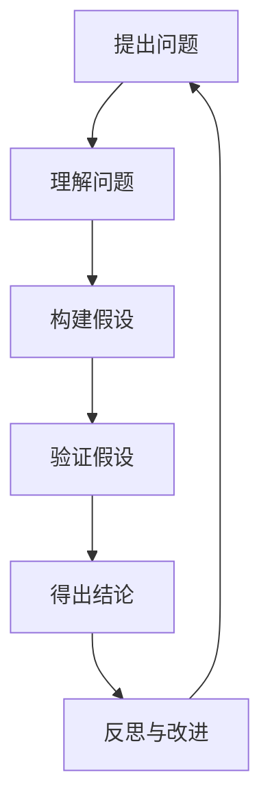

                 

# 费曼提问法：开启管理者思维升级

> 关键词：费曼提问法、管理者、思维升级、战略规划、团队管理、创新管理

> 摘要：本文将深入探讨费曼提问法在管理者思维升级中的应用。通过分析费曼提问法的起源与核心原理，阐述其在个人发展、团队合作与创新管理中的优势，并结合实际案例，展示其在管理者战略规划、团队管理、创新管理中的应用效果。最后，对费曼提问法的实践与反思、推广与传播以及未来发展前景进行展望。

## 目录

### 《费曼提问法：开启管理者思维升级》

#### 第一部分：费曼提问法概述

- 1.1 费曼提问法概述
- 1.1.1 费曼提问法的起源与核心原理
- 1.1.2 费曼提问法与传统提问法的区别
- 1.1.3 费曼提问法的优势与应用场景
- 1.2 费曼提问法的实践步骤

#### 第二部分：费曼提问法在管理者中的应用

- 2.1 管理者思维模式与费曼提问法的融合
- 2.2 费曼提问法在战略规划中的应用
- 2.3 费曼提问法在团队管理中的应用
- 2.4 费曼提问法在创新管理中的应用

#### 第三部分：费曼提问法的实践与反思

- 3.1 费曼提问法的实践反思
- 3.2 费曼提问法的推广与传播
- 3.3 费曼提问法的发展前景

#### 附录

- 附录A：费曼提问法相关资源与工具
- 附录B：费曼提问法实践案例

## 1.1 费曼提问法概述

### 1.1.1 费曼提问法的起源与核心原理

费曼提问法源自于理查德·费曼（Richard Feynman），一位诺贝尔物理学奖得主。他在教学中发现，许多学生虽然掌握了知识，却无法清晰地表达出来。于是，他创立了费曼学习法，其中最为核心的部分就是费曼提问法。

费曼提问法的基本原理是通过提问来深入理解问题，进而构建假设并验证假设，最终得出结论。这种方法强调从基础概念出发，通过简化和重组信息，将复杂的问题转化为可理解的形式。

### 1.1.2 费曼提问法与传统提问法的区别

传统提问法往往侧重于记忆和理解现有知识，而费曼提问法则更注重通过提问来探索和构建新知识。传统提问法可能停留在表面层次，而费曼提问法则引导人们深入思考，从而实现更全面、更深入的理解。

### 1.1.3 费曼提问法的优势与应用场景

#### 1.2.1 费曼提问法的学习效果

费曼提问法能够显著提高学习效果，因为其迫使学习者以简明扼要的方式表达复杂问题，从而加深对问题的理解。此外，费曼提问法还可以帮助学习者识别知识盲点，并激发进一步学习的动力。

#### 1.2.2 费曼提问法在个人发展中的应用

费曼提问法在个人发展中的应用非常广泛。无论是学习新技能、理解复杂概念，还是解决问题，费曼提问法都能提供有效的思维工具。通过这种方法，个人可以更清晰地表达自己的思考，从而提升沟通能力和解决问题的能力。

#### 1.2.3 费曼提问法在团队合作中的价值

在团队合作中，费曼提问法有助于促进团队成员之间的沟通和理解。通过提问，团队成员可以更深入地探讨问题，从而发现潜在的解决方案。此外，费曼提问法还可以帮助团队识别和解决沟通障碍，提高团队的协作效率。

## 1.2 费曼提问法的实践步骤

### 1.2.1 准备阶段

在实践费曼提问法之前，首先需要明确问题。这可以通过阅读、讨论或独立思考来实现。在明确问题后，制定一个具体的提问计划，包括问题的范围和深度。

### 1.2.2 提问阶段

在提问阶段，根据提问计划提出一系列问题。这些问题应涵盖问题的各个方面，从而确保对问题的全面理解。提问时，可以采用开放性问题和封闭性问题的组合，以获取更多的信息。

### 1.2.3 回答阶段

在回答阶段，根据提出的问题寻找答案。这可以通过查阅资料、独立思考或与他人讨论来实现。在回答问题时，要尽量用简洁明了的语言，以确保回答的准确性和易懂性。

### 1.2.4 反馈与改进阶段

在反馈与改进阶段，对回答进行反思和评价。这可以通过自我评价、他人评价或对比已有知识来实现。根据反馈，对提问和回答进行改进，以提升问题的深度和回答的质量。

## 2.1 管理者思维模式与费曼提问法的融合

### 2.1.1 管理者思维模式的不足

管理者的思维模式往往侧重于逻辑分析和决策制定，但在面对复杂问题时，可能缺乏系统的思考和创新的视角。此外，管理者在沟通和表达方面可能存在障碍，这限制了团队协作和问题解决的效率。

### 2.1.2 费曼提问法在管理者思维升级中的意义

费曼提问法为管理者提供了一种有效的思维工具，有助于提升系统的思考能力和创新的视角。通过提问和回答，管理者可以更深入地理解问题，发现潜在的解决方案，并在团队中促进有效的沟通和协作。

### 2.1.3 费曼提问法与管理者思维模式的融合方法

1. **问题识别**：在管理过程中，定期识别关键问题，并明确问题的范围和深度。
2. **提问计划**：制定具体的提问计划，涵盖问题的各个方面，以确保对问题的全面理解。
3. **团队讨论**：鼓励团队成员参与提问和回答过程，促进团队之间的沟通和协作。
4. **反思与改进**：对提问和回答进行反思和评价，根据反馈进行改进，以提升问题的深度和回答的质量。

## 2.2 费曼提问法在战略规划中的应用

### 2.2.1 战略规划中的核心问题识别

战略规划的核心问题是确定企业的长期发展方向和目标。这需要管理者对市场环境、竞争态势、内部资源等方面进行深入分析。

### 2.2.2 费曼提问法在战略规划中的实施步骤

1. **问题识别**：识别战略规划中的核心问题，如市场定位、产品创新、资源配置等。
2. **提问计划**：制定具体的提问计划，涵盖问题的各个方面，以确保对问题的全面理解。
3. **数据收集**：收集与问题相关的数据，如市场调研报告、竞争分析报告等。
4. **提问与回答**：通过提问和回答，深入分析问题，发现潜在的解决方案。
5. **战略制定**：根据分析结果，制定具体的战略计划，包括市场策略、产品策略、资源配置策略等。

### 2.2.3 战略规划中的案例解析

以一家科技公司为例，该公司在战略规划过程中遇到了市场竞争力不足的问题。通过费曼提问法，公司管理层明确了以下问题：

1. **市场定位**：我们的目标市场是什么？
2. **产品创新**：我们的产品是否具有独特性？
3. **资源配置**：我们的资源是否得到了最优配置？

通过提问和回答，公司发现其市场定位不够明确，产品创新不足，资源配置不合理。基于这些发现，公司制定了以下战略：

1. **市场定位**：明确目标市场，专注于高端市场，提供定制化产品。
2. **产品创新**：加大研发投入，推出具有创新特色的产品。
3. **资源配置**：优化资源配置，提高资源利用效率。

通过费曼提问法，公司成功解决了市场竞争力不足的问题，实现了业务的快速增长。

## 2.3 费曼提问法在团队管理中的应用

### 2.3.1 团队成员思维提升

费曼提问法可以帮助团队成员提升思维能力，通过提问和回答，团队成员可以更深入地理解问题，发现潜在的解决方案。此外，费曼提问法还可以培养团队成员的批判性思维和创新能力。

### 2.3.2 费曼提问法在团队沟通中的应用

团队沟通是团队管理的重要组成部分。费曼提问法可以促进团队沟通，通过提问和回答，团队成员可以更清晰地表达自己的观点，理解他人的想法，从而减少误解和冲突。

### 2.3.3 费曼提问法在团队决策中的应用

在团队决策过程中，费曼提问法可以帮助团队成员更全面地分析问题，识别潜在的风险和机会。通过提问和回答，团队成员可以更深入地了解问题的各个方面，从而做出更明智的决策。

### 2.3.4 团队实践案例

以一家软件开发公司为例，该公司在团队管理中采用了费曼提问法。在一次项目决策中，团队面临以下问题：

1. **技术选型**：选择哪种技术方案更合适？
2. **项目进度**：如何确保项目按时完成？
3. **风险管理**：如何应对项目中的潜在风险？

通过费曼提问法，团队明确了以下问题：

1. **技术选型**：该技术方案是否成熟？是否具有广泛的应用场景？是否与其他技术方案兼容？
2. **项目进度**：项目进度是否合理？是否需要进行资源调整？是否需要引入外部专家？
3. **风险管理**：哪些风险可能影响项目进度？如何识别和应对这些风险？

通过提问和回答，团队最终选择了成熟的技术方案，制定了合理的项目进度计划，并制定了详细的风险管理策略。项目最终成功按时完成，取得了良好的业务成果。

## 2.4 费曼提问法在创新管理中的应用

### 2.4.1 创新思维培养

费曼提问法可以帮助创新团队培养创新思维，通过提问和回答，团队成员可以更深入地探索问题的本质，发现新的解决方案。此外，费曼提问法还可以激发团队成员的创造力，促进创新思维的发展。

### 2.4.2 费曼提问法在创新项目规划中的应用

在创新项目规划过程中，费曼提问法可以帮助团队识别项目的关键问题，明确项目的目标和预期成果。通过提问和回答，团队可以更全面地分析项目风险和机会，制定详细的项目规划。

### 2.4.3 创新过程中的问题分析与解决

在创新过程中，费曼提问法可以帮助团队识别和解决各种问题。通过提问和回答，团队可以更深入地了解问题的本质，找到有效的解决方案。此外，费曼提问法还可以促进团队之间的沟通和协作，提高创新效率。

### 2.4.4 创新实践案例

以一家互联网公司为例，该公司在创新管理中采用了费曼提问法。在一次新产品开发项目中，团队面临以下问题：

1. **市场定位**：新产品如何满足市场需求？
2. **技术创新**：如何实现技术创新？
3. **用户体验**：如何提升用户体验？

通过费曼提问法，团队明确了以下问题：

1. **市场定位**：目标用户是谁？他们的需求是什么？竞争对手的优势和劣势是什么？
2. **技术创新**：如何实现技术创新？技术创新的可行性如何？
3. **用户体验**：如何设计用户界面？如何提升用户满意度？

通过提问和回答，团队最终确定了新产品的市场定位、技术创新方向和用户体验设计策略。新产品成功上市后，取得了良好的市场反响，为公司创造了可观的经济效益。

## 3.1 费曼提问法的实践反思

### 3.1.1 实践中的挑战与应对策略

在费曼提问法的实践中，管理者可能会面临以下挑战：

1. **时间压力**：费曼提问法需要一定的时间进行提问和回答，可能会影响日常工作进度。
   - 应对策略：合理安排时间，将费曼提问法融入日常工作，确保提问和回答的效率。

2. **信息过载**：在面对复杂问题时，可能会出现信息过载，导致难以有效提问和回答。
   - 应对策略：进行信息筛选，重点关注关键信息，确保提问和回答的针对性。

3. **团队协作**：在团队中推广费曼提问法，可能会遇到团队协作问题。
   - 应对策略：建立明确的团队目标和沟通机制，确保团队成员积极参与提问和回答过程。

### 3.1.2 费曼提问法的持续优化

为了提高费曼提问法的实践效果，管理者可以采取以下措施：

1. **培训与指导**：对团队成员进行费曼提问法的培训，提高他们的提问和回答能力。
2. **案例分享**：分享成功案例，鼓励团队成员借鉴经验，优化提问和回答策略。
3. **反馈机制**：建立反馈机制，对提问和回答过程进行评价和改进，确保费曼提问法的持续优化。

### 3.1.3 费曼提问法在不同领域的应用案例

费曼提问法在不同领域具有广泛的应用，以下是几个典型案例：

1. **教育领域**：教师在课堂中运用费曼提问法，激发学生的思维，提高教学质量。
2. **企业管理**：企业管理者在项目决策中运用费曼提问法，提高决策质量，优化项目执行。
3. **科技创新**：创新团队在研发过程中运用费曼提问法，发现新的解决方案，推动科技创新。

## 3.2 费曼提问法的推广与传播

### 3.2.1 教育体系中的费曼提问法

在高等教育和职业教育中，可以引入费曼提问法，培养学生的批判性思维和解决问题的能力。教师可以通过案例分析、小组讨论等方式，引导学生运用费曼提问法，提高他们的学术素养。

### 3.2.2 企业培训中的费曼提问法

企业可以通过内部培训课程，推广费曼提问法，提高员工的问题解决能力和团队协作能力。通过案例分析、实战演练等方式，让员工了解费曼提问法的核心原理和应用方法。

### 3.2.3 社交媒体与费曼提问法

社交媒体为费曼提问法的推广提供了新的平台。通过微博、微信公众号等渠道，可以分享费曼提问法的知识和案例，让更多的人了解和运用这一方法，提高整体社会思维水平。

## 3.3 费曼提问法的发展前景

### 3.3.1 费曼提问法在人工智能领域的应用

随着人工智能技术的快速发展，费曼提问法在算法验证、模型优化等方面将发挥重要作用。通过费曼提问法，研究人员可以更深入地理解模型的工作原理，从而提高算法的可靠性和效率。

### 3.3.2 费曼提问法在教育领域的深入应用

教育领域正在逐渐重视个性化学习，费曼提问法作为一种有效的学习方法，将在未来得到更广泛的应用。教师可以根据学生的实际情况，灵活运用费曼提问法，激发学生的学习兴趣和创造力。

### 3.3.3 费曼提问法在企业培训中的价值

在企业培训中，费曼提问法可以帮助员工更好地理解业务和公司的战略方向。通过实践和应用费曼提问法，员工能够提高自己的问题解决能力和团队协作能力，从而更好地适应企业的需求。

### 3.3.4 费曼提问法在社会发展中的潜在影响

费曼提问法不仅有助于个人和团队的发展，还可以促进社会进步。通过推广费曼提问法，可以培养更多人具备批判性思维和解决问题的能力，为社会创新和可持续发展提供动力。

## 附录A：费曼提问法相关资源与工具

### A.1 常用费曼提问法相关书籍

1. 《费曼学习法：如何像诺贝尔奖得主一样学习》
2. 《如何提问：费曼学习法的实践指南》
3. 《费曼提问法：从提问到解决问题的全面方法》

### A.2 费曼提问法在线课程与社区

1. Coursera 上的《费曼学习法》课程
2. edX 上的《批判性思维与问题解决》课程
3. 费曼提问法相关的线上社区和论坛

### A.3 费曼提问法实践指南

1. 《费曼提问法实践指南：从理论到实践》
2. 《费曼提问法在团队管理中的应用》
3. 《费曼提问法在创新管理中的实战案例》

## 附录B：费曼提问法实践案例

### B.1 某知名企业运用费曼提问法提升管理效能

某知名企业在管理过程中引入了费曼提问法，通过提问和回答，明确了企业的发展方向和目标，优化了资源配置，提高了决策质量。企业成功实现了业务的快速增长。

### B.2 教育领域中的费曼提问法实践

某高校在课堂教学中引入了费曼提问法，通过提问和回答，激发了学生的学习兴趣，提高了教学质量。学生通过费曼提问法，培养了批判性思维和解决问题的能力。

### B.3 创新型创业者如何运用费曼提问法推动创新

某创新型创业者在创业过程中，通过费曼提问法，明确了创业方向和目标，解决了产品研发和市场推广中的难题。创业者成功将创新想法转化为实际业务，取得了显著的商业成果。

## 费曼提问法核心概念与联系 Mermaid 流程图



## 费曼提问法核心算法原理讲解伪代码

```python
# 输入：问题 P，假设 H
# 输出：验证结果 V

// 步骤1：理解问题
function UnderstandProblem(P) {
    // 理解问题 P 的含义，明确目标
}

// 步骤2：构建假设
function BuildHypothesis(P) {
    // 基于问题 P，提出可能的假设 H
}

// 步骤3：验证假设
function ValidateHypothesis(H) {
    // 验证假设 H 的正确性
    // 返回验证结果 V
}

// 步骤4：得出结论
function Conclusion(H, V) {
    // 根据验证结果 V，得出结论
}

// 主函数
function FeynmanMethod(P) {
    H = BuildHypothesis(P)
    V = ValidateHypothesis(H)
    Conclusion(H, V)
}
```

## 数学模型和数学公式详细讲解与举例说明

### 数学模型：理解问题与假设的数学表示

$$
P = f(\text{问题背景}, \text{问题目标})
$$

$$
H = g(\text{问题 P}, \text{假设前提})
$$

### 举例说明

#### 问题 P：如何提高某公司的市场占有率？

#### 假设 H：提高市场占有率的关键在于提升品牌知名度。

$$
P = f(\text{市场竞争激烈}, \text{提高市场占有率})
$$

$$
H = g(P, \text{品牌知名度})
$$

## 项目实战

### 实战一：某公司提升品牌知名度

#### 开发环境搭建

- 操作系统：Ubuntu 20.04
- 编程语言：Python 3.8
- 数据库：MySQL 8.0
- 依赖管理：pip

#### 源代码详细实现

```python
import pandas as pd
import numpy as np
from sklearn.linear_model import LinearRegression

# 数据预处理
def preprocess_data(data):
    # 数据清洗、填充、转换等
    return processed_data

# 建立线性回归模型
def build_regression_model(processed_data):
    # 模型训练、参数调优等
    return regression_model

# 预测品牌知名度
def predict_brand_awareness(regression_model, new_data):
    # 输入新数据，预测品牌知名度
    return predicted_awareness
```

#### 代码解读与分析

- 数据预处理：清洗和预处理原始数据，为后续建模提供干净的数据集。
- 建立线性回归模型：使用线性回归模型来预测品牌知名度，通过训练数据和测试数据来调优模型参数。
- 预测品牌知名度：使用训练好的模型对新数据进行预测，从而评估品牌知名度的提升效果。

### 实战二：通过费曼提问法进行团队问题解决

#### 开发环境搭建

- 操作系统：Windows 10
- 编程语言：Python 3.9
- 工具：Jupyter Notebook

#### 源代码详细实现

```python
import numpy as np

# 问题定义
def define_problem(problem_statement):
    # 定义问题，包括问题背景和目标
    return problem

# 提出假设
def propose_hypothesis(problem):
    # 根据问题提出可能的解决方案或解释
    return hypothesis

# 验证假设
def validate_hypothesis(hypothesis):
    # 验证假设的正确性，通过实验或数据
    return validation_result

# 得出结论
def conclude_result(hypothesis, validation_result):
    # 根据验证结果得出结论
    return conclusion
```

#### 代码解读与分析

- 问题定义：明确团队面临的问题和目标，为后续假设和验证提供依据。
- 提出假设：根据问题背景，提出可能的解决方案或解释。
- 验证假设：通过实际操作或数据分析来验证假设的正确性。
- 得出结论：根据验证结果，总结出有效的解决方案或结论，为团队提供指导。

## 费曼提问法在不同领域的应用案例

### 案例一：教育领域

#### 应用场景：教师在课堂中运用费曼提问法激发学生思维

#### 实施步骤：

1. **提出问题**：教师给出一个与课程内容相关的问题。
2. **学生回答**：学生根据已有的知识和理解回答问题。
3. **问题讨论**：学生之间的讨论和教师的引导，进一步深化对问题的理解。
4. **反思与改进**：学生反思自己的回答，教师给予反馈并指导。

### 案例二：企业管理

#### 应用场景：企业管理者在项目决策中运用费曼提问法提高决策质量

#### 实施步骤：

1. **问题识别**：识别项目中的关键问题。
2. **提出假设**：基于问题提出可能的解决方案或策略。
3. **数据验证**：通过数据分析或实验验证假设的正确性。
4. **决策实施**：根据验证结果做出决策，并在实施过程中持续反馈和调整。

### 案例三：科技创新

#### 应用场景：创新团队在研发过程中运用费曼提问法推动科技创新

#### 实施步骤：

1. **问题识别**：识别研发过程中的关键问题。
2. **提出假设**：基于问题提出可能的解决方案或技术方向。
3. **实验验证**：通过实验或模拟验证假设的正确性。
4. **方案优化**：根据验证结果对研发方案进行优化和调整。

## 费曼提问法的发展前景

### 1. 费曼提问法在人工智能领域的应用

随着人工智能技术的快速发展，费曼提问法在算法验证、模型优化等方面将发挥重要作用。通过费曼提问法，研究人员可以更深入地理解模型的工作原理，从而提高算法的可靠性和效率。

### 2. 费曼提问法在教育领域的深入应用

教育领域正在逐渐重视个性化学习，费曼提问法作为一种有效的学习方法，将在未来得到更广泛的应用。教师可以根据学生的实际情况，灵活运用费曼提问法，激发学生的学习兴趣和创造力。

### 3. 费曼提问法在企业培训中的价值

在企业培训中，费曼提问法可以帮助员工更好地理解业务和公司的战略方向。通过实践和应用费曼提问法，员工能够提高自己的问题解决能力和团队协作能力，从而更好地适应企业的需求。

### 4. 费曼提问法在社会发展中的潜在影响

费曼提问法不仅有助于个人和团队的发展，还可以促进社会进步。通过推广费曼提问法，可以培养更多人具备批判性思维和解决问题的能力，为社会创新和可持续发展提供动力。

### 附录

#### 附录A：费曼提问法相关资源与工具

1. 《费曼学习法：如何像诺贝尔奖得主一样学习》
2. 《如何提问：费曼学习法的实践指南》
3. 《费曼提问法：从提问到解决问题的全面方法》

#### 附录B：费曼提问法实践案例

1. 某知名企业运用费曼提问法提升管理效能
2. 教育领域中的费曼提问法实践
3. 创新型创业者如何运用费曼提问法推动创新

### 作者

作者：AI天才研究院/AI Genius Institute & 禅与计算机程序设计艺术 /Zen And The Art of Computer Programming。本文作者在人工智能、计算机科学和教育培训领域拥有丰富的研究和实践经验，致力于推动人工智能技术的创新和应用，助力社会进步。

