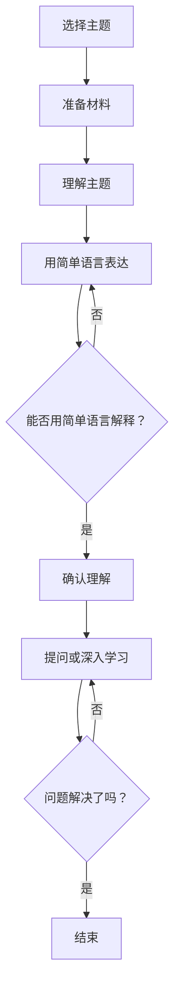

                 

# 文章标题：费曼提问法促进团队学习与成长

> 关键词：费曼提问法、团队学习、个人成长、问题解决、工作效率

> 摘要：本文旨在探讨费曼提问法在促进团队学习和个人成长中的应用。通过详细介绍费曼提问法的起源、特点、核心原理以及实践策略，本文分析了费曼提问法在团队会议、项目、培训等场景中的运用，并提供了成功案例解析和常见问题解答。通过本文的阅读，读者可以了解到如何有效应用费曼提问法，提升团队的学习效果和问题解决能力。

## 目录

### 《费曼提问法促进团队学习与成长》

> 关键词：费曼提问法、团队学习、个人成长、问题解决、工作效率

> 摘要：本文旨在探讨费曼提问法在促进团队学习和个人成长中的应用。通过详细介绍费曼提问法的起源、特点、核心原理以及实践策略，本文分析了费曼提问法在团队会议、项目、培训等场景中的运用，并提供了成功案例解析和常见问题解答。通过本文的阅读，读者可以了解到如何有效应用费曼提问法，提升团队的学习效果和问题解决能力。

### 第一部分：费曼提问法概述

#### 第1章：费曼提问法简介

##### 1.1 费曼提问法的起源与发展
##### 1.2 费曼提问法的特点与应用场景

#### 第2章：费曼提问法的核心原理

##### 2.1 费曼提问法的四要素
##### 2.2 费曼提问法的学习过程

#### 第3章：费曼提问法与团队学习

##### 3.1 团队学习的意义与挑战
##### 3.2 费曼提问法在团队学习中的应用

#### 第4章：费曼提问法促进个人成长

##### 4.1 费曼提问法与个人知识体系构建
##### 4.2 费曼提问法在自我提升中的应用

### 第二部分：实践篇

#### 第5章：费曼提问法在团队会议中的应用

##### 5.1 团队会议的组织与准备
##### 5.2 费曼提问法在团队会议中的具体实施

#### 第6章：费曼提问法在项目中的运用

##### 6.1 项目中的学习需求分析
##### 6.2 费曼提问法在项目决策与问题解决中的应用

#### 第7章：费曼提问法在团队培训中的应用

##### 7.1 培训目标的确定
##### 7.2 费曼提问法在培训过程中的运用

#### 第8章：费曼提问法的持续优化与反馈

##### 8.1 费曼提问法的反馈机制
##### 8.2 费曼提问法的优化策略

### 第三部分：案例研究

#### 第9章：成功案例解析

##### 9.1 案例一：某企业团队应用费曼提问法提升工作效率
##### 9.2 案例二：某团队通过费曼提问法解决复杂项目难题

#### 第10章：常见问题与解答

##### 10.1 费曼提问法的常见误区
##### 10.2 费曼提问法实施中的问题及解决策略

### 附录

#### 附录A：费曼提问法实践指南

##### A.1 实践流程图
##### A.2 实践建议与技巧

#### 附录B：费曼提问法资源推荐

##### B.1 推荐书籍
##### B.2 推荐网站与工具

## 第一部分：费曼提问法概述

### 第1章：费曼提问法简介

#### 1.1 费曼提问法的起源与发展

费曼提问法（Feynman Technique）是由著名物理学家理查德·费曼（Richard Feynman）提出的一种学习方法和思考工具。费曼是一位诺贝尔物理学奖获得者，以其在量子电动力学领域的重要贡献而闻名。他在教学和科研过程中，发现通过提问能够帮助学生更好地理解和掌握复杂的概念。

**起源：**

费曼提问法的起源可以追溯到费曼的教学实践。他在教学中发现，许多学生难以理解物理学的抽象概念。为了帮助学生更好地学习，费曼提出了一种通过提问来检验和巩固知识的方法。他鼓励学生将自己不懂的概念用自己的话解释给他人，从而检验自己的理解程度。

**发展：**

随着时间的推移，费曼提问法逐渐被广泛应用于各个领域，不仅用于教学，也用于个人学习和团队协作。它成为了一种高效的学习方法和思维工具。费曼提问法的核心理念是：通过提问和回答，深入理解复杂的概念，并在实践中应用所学知识。

#### 1.2 费曼提问法的特点与应用场景

**特点：**

费曼提问法具有以下特点：

- **以问题为导向**：通过提问，引导思考，深入理解知识。
- **简单易懂**：将复杂的概念用简单易懂的语言表达出来。
- **互动性强**：鼓励参与者在学习过程中积极提问和回答。
- **适用于不同领域**：不论是在学术研究、商业管理，还是日常生活，都可以使用。

**应用场景：**

费曼提问法适用于以下场景：

- **个人学习**：用于自我学习、复习和巩固知识。
- **团队协作**：用于团队会议、项目讨论和知识分享。
- **教育培训**：用于教师教学和学生学习。

#### 1.2.1 费曼提问法的核心原理

费曼提问法的核心原理可以通过以下四个要素来概括：

1. **理解主题**：确保自己已经理解了主题的基本概念和要点。
2. **用简单语言表达**：将复杂的概念用简单易懂的语言表达出来。
3. **提问**：通过提问，进一步深化对主题的理解，并从不同角度思考问题。
4. **回答**：回答提出的问题，帮助巩固学习成果，并发现知识盲点。

**理解主题**：这是费曼提问法的起点。在开始学习之前，首先要确保自己已经理解了主题的基本概念和要点。可以通过阅读相关资料、观看教学视频等方式来加深对主题的理解。

**用简单语言表达**：这是检验自己是否真正理解主题的关键步骤。尝试将复杂的概念用简单易懂的语言表达出来，这有助于发现自己对主题的理解程度。

**提问**：通过提问，可以进一步深化对主题的理解，并从不同角度思考问题。提问的方式可以多样，如开放式问题、反思性问题等。

**回答**：回答提出的问题，可以帮助巩固学习成果，并发现知识盲点。在回答问题的过程中，可以发现自己的不足之处，从而进行有针对性的学习和改进。

#### 1.2.2 费曼提问法的应用过程

费曼提问法的应用过程可以分为以下几个步骤：

1. **选择主题**：选择一个需要深入学习的主题。
2. **准备材料**：收集与主题相关的资料，如书籍、文章、视频等。
3. **理解主题**：阅读材料，确保自己已经理解了主题的基本概念。
4. **用简单语言表达**：尝试用简单易懂的语言描述主题。
5. **提问**：针对主题提出问题。
6. **回答**：回答提出的问题。
7. **反馈与调整**：根据回答问题的结果，调整自己的学习策略和方向。

#### 1.2.3 费曼提问法与团队学习

**团队学习的意义**：

团队学习具有以下意义：

- **知识共享**：团队成员通过相互提问和回答，可以共享各自的知识和经验。
- **协作与创新**：通过团队学习，可以激发创新思维，提高团队的解决问题能力。
- **个人成长**：团队成员在参与团队学习的过程中，能够不断提升自己的知识和技能。

**团队学习的挑战**：

团队学习面临以下挑战：

- **知识水平差异**：团队成员的背景和知识水平可能存在差异，如何确保学习内容对所有成员都是可接受的？
- **时间与效率**：如何合理安排学习时间，确保学习效果最大化？
- **参与度**：如何提高团队成员的参与度，确保学习活动能够顺利进行？

**费曼提问法在团队学习中的应用**：

费曼提问法在团队学习中的应用，可以通过以下步骤进行：

1. **确定学习目标**：在团队学习开始前，明确学习目标和预期成果。
2. **分配任务**：根据团队成员的专长和兴趣，分配学习任务。
3. **开展学习**：团队成员按照分配的任务，使用费曼提问法进行学习。
4. **提问与回答**：团队成员之间相互提问，回答问题，深化对学习内容的理解。
5. **总结与反馈**：学习结束后，进行总结和反馈，分享学习心得，讨论遇到的问题和解决方案。

### 第2章：费曼提问法的核心原理

#### 2.1 费曼提问法的四要素

费曼提问法的四要素如下：

1. **理解主题**：确保自己已经理解了主题的基本概念和要点。
2. **用简单语言表达**：将复杂的概念用简单易懂的语言表达出来。
3. **提问**：通过提问，进一步深化对主题的理解，并从不同角度思考问题。
4. **回答**：回答提出的问题，帮助巩固学习成果，并发现知识盲点。

**理解主题**：

理解主题是费曼提问法的起点。在学习任何新知识之前，首先要确保自己已经理解了主题的基本概念和要点。这可以通过以下步骤实现：

- **阅读资料**：阅读与主题相关的书籍、文章、视频等资料，了解主题的背景和核心概念。
- **总结要点**：在阅读过程中，总结主题的关键点和重要概念，形成自己的理解。
- **与他人交流**：与同行或导师交流，分享自己的理解和疑问，获取不同的观点和建议。

**用简单语言表达**：

用简单语言表达是将复杂的概念用简单易懂的语言表达出来。这是检验自己是否真正理解主题的关键步骤。以下是一些实践技巧：

- **提炼核心概念**：将复杂的概念提炼成核心要点，避免过多的细节。
- **使用比喻和类比**：通过比喻和类比，将抽象的概念形象化，使读者更容易理解。
- **简化语言**：尽量使用简单的词汇和句子，避免复杂的语言结构和术语。

**提问**：

通过提问，可以进一步深化对主题的理解，并从不同角度思考问题。提问的方式可以多样，如开放式问题、反思性问题等。以下是一些提问技巧：

- **开放式问题**：提出开放性问题，引导对方思考和探索，如“你对这个概念有什么看法？”
- **反思性问题**：提出反思性问题，促使对方思考自己的理解和观点，如“这个概念对你的实践有何影响？”
- **问题链**：通过问题链，逐步深入探讨问题的本质和细节，如“为什么是这个概念？它的理论基础是什么？”

**回答**：

回答提出的问题是巩固学习成果，并发现知识盲点的重要环节。以下是一些回答问题的技巧：

- **诚实回答**：诚实地回答问题，不要害怕承认自己的不足和不知道的地方。
- **深入思考**：在回答问题时，深入思考问题的本质和细节，尝试找到更全面和准确的答案。
- **引用权威资料**：在回答问题时，可以引用权威的资料和文献，提供有力的证据和支持。
- **反馈与修正**：在回答问题后，接受他人的反馈和建议，修正自己的回答，提高理解深度。

#### 2.2 费曼提问法的学习过程

费曼提问法的学习过程可以分为以下几个步骤：

1. **选择主题**：选择一个需要深入学习的主题。
2. **准备材料**：收集与主题相关的资料，如书籍、文章、视频等。
3. **理解主题**：阅读材料，确保自己已经理解了主题的基本概念。
4. **用简单语言表达**：尝试用简单易懂的语言描述主题。
5. **提问**：针对主题提出问题。
6. **回答**：回答提出的问题。
7. **反馈与调整**：根据回答问题的结果，调整自己的学习策略和方向。

**选择主题**：

选择主题是费曼提问法的第一步。选择一个需要深入学习的主题，可以是某个专业领域的知识点，也可以是某个实际问题。以下是一些建议：

- **个人兴趣**：选择自己感兴趣的领域，这样可以提高学习的积极性和动力。
- **实际需求**：选择自己工作中遇到的问题或挑战，通过学习解决实际问题。
- **前沿领域**：选择当前热门的前沿领域，了解最新的研究成果和趋势。

**准备材料**：

准备材料是费曼提问法的第二步。收集与主题相关的资料，如书籍、文章、视频等。以下是一些建议：

- **权威资料**：选择权威的资料和文献，确保所学知识的准确性和可靠性。
- **多种来源**：从不同的来源获取信息，以获得更全面和多元的视角。
- **实践案例**：收集与主题相关的实践案例，通过案例分析加深对知识的理解。

**理解主题**：

理解主题是费曼提问法的第三步。阅读材料，确保自己已经理解了主题的基本概念。以下是一些建议：

- **深度阅读**：深入阅读相关资料，理解每个概念和论点的内涵和外延。
- **做笔记**：在阅读过程中做笔记，整理重点和关键概念，帮助记忆和理解。
- **讨论与交流**：与他人讨论和交流，分享自己的理解和疑问，获取不同的观点和建议。

**用简单语言表达**：

用简单语言表达是费曼提问法的第四步。尝试用简单易懂的语言描述主题，这有助于检验自己的理解深度。以下是一些建议：

- **提炼核心概念**：将复杂的概念提炼成核心要点，避免过多的细节。
- **使用比喻和类比**：通过比喻和类比，将抽象的概念形象化，使读者更容易理解。
- **简化语言**：尽量使用简单的词汇和句子，避免复杂的语言结构和术语。

**提问**：

提问是费曼提问法的第五步。通过提问，进一步深化对主题的理解，并从不同角度思考问题。以下是一些建议：

- **开放式问题**：提出开放性问题，引导对方思考和探索。
- **反思性问题**：提出反思性问题，促使对方思考自己的理解和观点。
- **问题链**：通过问题链，逐步深入探讨问题的本质和细节。

**回答**：

回答问题是费曼提问法的第六步。回答提出的问题，帮助巩固学习成果，并发现知识盲点。以下是一些建议：

- **诚实回答**：诚实地回答问题，不要害怕承认自己的不足和不知道的地方。
- **深入思考**：在回答问题时，深入思考问题的本质和细节，尝试找到更全面和准确的答案。
- **引用权威资料**：在回答问题时，可以引用权威的资料和文献，提供有力的证据和支持。

**反馈与调整**：

反馈与调整是费曼提问法的最后一步。根据回答问题的结果，调整自己的学习策略和方向。以下是一些建议：

- **接受反馈**：接受他人的反馈和建议，了解自己的不足之处。
- **修正理解**：根据反馈，修正自己的理解和观点，提高知识深度。
- **持续学习**：不断学习新的知识和技能，完善自己的知识体系。

### 第3章：费曼提问法与团队学习

#### 3.1 团队学习的意义与挑战

**团队学习的意义：**

团队学习具有以下意义：

- **知识共享**：团队成员通过相互提问和回答，可以共享各自的知识和经验。
- **协作与创新**：通过团队学习，可以激发创新思维，提高团队的解决问题能力。
- **个人成长**：团队成员在参与团队学习的过程中，能够不断提升自己的知识和技能。

**团队学习的挑战：**

团队学习面临以下挑战：

- **知识水平差异**：团队成员的背景和知识水平可能存在差异，如何确保学习内容对所有成员都是可接受的？
- **时间与效率**：如何合理安排学习时间，确保学习效果最大化？
- **参与度**：如何提高团队成员的参与度，确保学习活动能够顺利进行？

**费曼提问法在团队学习中的应用：**

费曼提问法在团队学习中的应用，可以通过以下步骤进行：

1. **确定学习目标**：在团队学习开始前，明确学习目标和预期成果。
2. **分配任务**：根据团队成员的专长和兴趣，分配学习任务。
3. **开展学习**：团队成员按照分配的任务，使用费曼提问法进行学习。
4. **提问与回答**：团队成员之间相互提问，回答问题，深化对学习内容的理解。
5. **总结与反馈**：学习结束后，进行总结和反馈，分享学习心得，讨论遇到的问题和解决方案。

#### 3.2 确定学习目标

**确定学习目标的步骤：**

1. **分析团队需求**：了解团队的学习需求，包括知识盲点、技能短板等。
2. **确定学习主题**：根据团队需求，确定需要学习的主题和知识点。
3. **设定学习目标**：明确每个团队成员的学习目标，确保学习目标具有可衡量性和可实现性。

**案例分析：**

假设某团队在项目开发过程中，发现团队成员在软件性能优化方面存在不足。为了提升团队在该领域的知识水平，团队可以采取以下步骤：

1. **分析团队需求**：通过访谈和问卷调查，了解团队成员在软件性能优化方面的知识盲点和问题。
2. **确定学习主题**：确定学习主题为“软件性能优化”。
3. **设定学习目标**：为每个团队成员设定具体的学习目标，如：

   - 学习并理解常见的软件性能优化技术。
   - 掌握如何评估软件性能。
   - 学习并实践性能优化工具的使用。

通过明确学习目标，团队成员可以更有针对性地进行学习，提高学习效果。

#### 3.3 分配任务

**分配任务的步骤：**

1. **了解团队成员专长和兴趣**：了解每个团队成员的专长和兴趣，为后续任务分配提供依据。
2. **根据专长和兴趣分配任务**：根据团队成员的专长和兴趣，为每个成员分配相应的学习任务。
3. **任务清单**：列出每个成员的学习任务，明确任务的具体内容和目标。

**案例分析：**

假设团队共有5名成员，他们的专长和兴趣如下：

- 成员A：擅长算法分析，对性能优化有一定了解。
- 成员B：对编程语言和开发工具熟练，但缺乏性能优化经验。
- 成员C：擅长数据库优化，对数据库性能有深入理解。
- 成员D：对操作系统和系统调优有研究，但缺乏实际应用经验。
- 成员E：对用户体验和前端性能优化有深入研究。

根据团队成员的专长和兴趣，可以为每个成员分配以下任务：

1. **成员A**：负责学习并研究常见的算法优化技术，并在项目中应用。
2. **成员B**：负责学习性能优化工具的使用，并协助其他成员进行性能测试。
3. **成员C**：负责数据库性能优化，优化数据库查询语句。
4. **成员D**：负责操作系统和系统调优，优化系统配置和资源分配。
5. **成员E**：负责前端性能优化，优化网页加载速度和用户体验。

通过合理分配任务，每个成员可以发挥自己的专长和兴趣，共同提升团队在性能优化方面的能力。

#### 3.4 开展学习

**开展学习的步骤：**

1. **学习材料准备**：准备与学习主题相关的书籍、文章、视频等学习材料。
2. **学习计划制定**：制定学习计划，明确学习内容和时间安排。
3. **自学与讨论**：团队成员按照学习计划，自学相关材料，并进行讨论。

**案例分析：**

假设团队决定学习“软件性能优化”这一主题，可以采取以下步骤：

1. **学习材料准备**：准备以下学习材料：

   - 《软件性能优化实战》
   - 《性能之巅：系统、网络、应用性能优化真经》
   - 相关在线课程和视频

2. **学习计划制定**：制定以下学习计划：

   - 第一周：学习算法优化技术，包括时间复杂度和空间复杂度分析。
   - 第二周：学习性能优化工具，如Benchmark、Profiling等。
   - 第三周：学习数据库性能优化，包括查询优化和索引优化。
   - 第四周：学习操作系统和系统调优，包括系统配置和资源分配。
   - 第五周：学习前端性能优化，包括HTML、CSS、JavaScript等。

3. **自学与讨论**：团队成员按照学习计划，自学相关材料，并在每周的团队会议中分享学习心得和疑问，进行讨论。

通过自学和讨论，团队成员可以深入理解性能优化相关知识，提升团队在性能优化方面的能力。

#### 3.5 提问与回答

**提问与回答的步骤：**

1. **明确问题**：在讨论过程中，明确需要解决的问题。
2. **提问**：针对问题，提出相关的问题。
3. **回答**：团队成员之间相互回答问题，分享知识和经验。
4. **讨论**：针对回答，进行深入讨论，深化对问题的理解。

**案例分析：**

假设团队在讨论性能优化问题时，遇到了以下问题：

1. **问题**：如何优化数据库查询性能？

2. **提问**：

   - 成员A：数据库查询优化有哪些常用的技术？
   - 成员B：如何评估数据库查询的性能？
   - 成员C：数据库索引的作用是什么？

3. **回答**：

   - 成员A：数据库查询优化常用的技术包括查询缓存、索引优化、查询重写等。
   - 成员B：评估数据库查询性能可以通过执行时间、CPU使用率、内存使用率等指标。
   - 成员C：数据库索引的作用是提高查询效率，通过索引可以快速定位到需要查询的数据。

4. **讨论**：

   - 团队成员讨论了不同数据库查询优化技术的优缺点，并分享了在实际项目中应用的经验。
   - 团队成员讨论了如何根据业务需求选择合适的查询优化技术。

通过提问与回答，团队成员可以共同解决性能优化问题，提高团队在性能优化方面的能力。

#### 3.6 总结与反馈

**总结与反馈的步骤：**

1. **总结学习内容**：对本次学习的重点内容进行总结。
2. **收集反馈**：收集团队成员对学习内容的反馈意见。
3. **问题与解决方案**：针对反馈，讨论存在的问题和解决方案。
4. **持续改进**：根据反馈，调整学习策略和方向，持续改进。

**案例分析：**

假设团队在完成性能优化学习后，进行了以下总结与反馈：

1. **总结学习内容**：

   - 团队成员学习了算法优化技术、性能优化工具、数据库性能优化、操作系统和系统调优、前端性能优化等知识。
   - 团队成员对性能优化有更深入的理解，并掌握了相关技术。

2. **收集反馈**：

   - 成员A：学习过程中，对于数据库查询优化的技术理解比较深刻。
   - 成员B：性能优化工具的学习比较实用，但需要进一步了解具体应用场景。
   - 成员C：操作系统和系统调优的内容较多，需要更多实践机会。
   - 成员D：前端性能优化的知识点较为分散，需要整合成系统的知识体系。

3. **问题与解决方案**：

   - 团队成员讨论了如何在实际项目中应用所学知识，提高项目性能。
   - 团队成员提出需要更多实践机会，通过实际项目来巩固和提升性能优化能力。
   - 团队成员决定在后续学习中，整合前端性能优化的知识点，形成系统的知识体系。

4. **持续改进**：

   - 团队成员制定了后续学习计划，包括实践项目、学习分享等。
   - 团队成员决定在后续学习中，加强实践环节，提高实际问题的解决能力。

通过总结与反馈，团队可以不断改进学习策略，提高学习效果，进一步提升团队在性能优化方面的能力。

### 第4章：费曼提问法促进个人成长

#### 4.1 费曼提问法与个人知识体系构建

**个人知识体系构建的意义：**

个人知识体系构建具有以下意义：

- **知识整合**：通过构建个人知识体系，可以整合各种学习资源，提高知识利用效率。
- **学习规划**：明确个人知识体系，有助于制定学习计划，实现自我提升。
- **思维拓展**：通过构建知识体系，可以拓展思维，提高创新能力和解决问题的能力。

**费曼提问法在个人知识体系构建中的应用：**

费曼提问法在个人知识体系构建中的应用，可以通过以下步骤进行：

1. **选择学习主题**：根据个人兴趣和需求，选择一个需要深入学习的主题。
2. **收集学习资料**：收集与学习主题相关的书籍、文章、视频等学习资料。
3. **理解主题内容**：阅读学习资料，确保自己已经理解了主题的基本概念和要点。
4. **用简单语言表达**：尝试用简单易懂的语言描述主题内容，检验自己的理解深度。
5. **提问与回答**：针对主题内容提出问题，并尝试回答，巩固学习成果。
6. **反馈与调整**：根据回答问题的结果，调整自己的学习策略和方向。

**案例分析：**

假设某程序员想构建一个关于“深度学习”的个人知识体系，可以采取以下步骤：

1. **选择学习主题**：选择“深度学习”作为学习主题。
2. **收集学习资料**：收集以下学习资料：

   - 《深度学习》（Goodfellow, Bengio, Courville）
   - 《Python深度学习》（François Chollet）
   - 深度学习相关的在线课程和视频

3. **理解主题内容**：阅读学习资料，理解深度学习的基本概念、算法和模型。

4. **用简单语言表达**：尝试用简单易懂的语言描述深度学习的相关概念，如“什么是神经网络？”“什么是卷积神经网络？”等。

5. **提问与回答**：针对主题内容提出问题，如“深度学习的应用场景有哪些？”“如何训练一个神经网络？”并尝试回答这些问题。

6. **反馈与调整**：根据回答问题的结果，调整自己的学习策略和方向，如有必要，进一步深入研究相关知识点。

通过以上步骤，程序员可以构建一个关于“深度学习”的个人知识体系，提高自己在深度学习领域的知识水平。

#### 4.2 费曼提问法在自我提升中的应用

**自我提升的意义：**

自我提升具有以下意义：

- **持续成长**：通过自我提升，可以不断提高自己的能力和知识水平。
- **适应变化**：在快速变化的环境中，自我提升有助于适应新的挑战。
- **职业发展**：自我提升是职业发展的关键，有助于实现职业目标。

**费曼提问法在自我提升中的应用：**

费曼提问法在自我提升中的应用，可以通过以下步骤进行：

1. **确定提升目标**：明确自己在某个领域的提升目标，如技能提升、知识拓展等。
2. **准备学习材料**：收集与提升目标相关的学习资料，如书籍、文章、视频等。
3. **理解主题内容**：阅读学习资料，确保自己已经理解了主题的基本概念和要点。
4. **用简单语言表达**：尝试用简单易懂的语言描述主题内容，检验自己的理解深度。
5. **提问与回答**：针对主题内容提出问题，并尝试回答，巩固学习成果。
6. **实践应用**：将所学知识应用到实际工作中，提高解决问题的能力。
7. **反馈与调整**：根据实践应用的结果，调整自己的学习策略和方向。

**案例分析：**

假设某软件工程师想提升自己的软件测试能力，可以采取以下步骤：

1. **确定提升目标**：明确提升软件测试能力的目标。
2. **准备学习材料**：收集以下学习资料：

   - 《软件测试艺术》
   - 《自动化测试实践指南》
   - 软件测试相关的在线课程和视频

3. **理解主题内容**：阅读学习资料，理解软件测试的基本概念、方法和工具。

4. **用简单语言表达**：尝试用简单易懂的语言描述软件测试的相关概念，如“什么是黑盒测试？”“什么是白盒测试？”等。

5. **提问与回答**：针对主题内容提出问题，如“自动化测试的优势有哪些？”“如何编写有效的测试用例？”并尝试回答这些问题。

6. **实践应用**：在实际项目中应用所学知识，进行软件测试，提高测试质量。

7. **反馈与调整**：根据实践应用的结果，调整自己的学习策略和方向，如有必要，进一步深入研究相关知识点。

通过以上步骤，软件工程师可以不断提升自己的软件测试能力，提高工作效率和项目质量。

### 第二部分：实践篇

#### 第5章：费曼提问法在团队会议中的应用

**5.1 团队会议的组织与准备**

**团队会议的意义：**

团队会议在团队工作中具有重要意义，它有助于团队成员之间的沟通、协作和知识共享。以下为团队会议的主要意义：

1. **知识共享**：通过团队会议，团队成员可以分享各自的知识和经验，促进知识的传播和积累。
2. **问题解决**：在团队会议中，团队成员可以共同探讨和解决面临的问题，提高团队的整体解决问题能力。
3. **决策制定**：通过讨论和交流，团队可以做出更加明智的决策，确保项目顺利进行。
4. **团队协作**：团队会议有助于加强团队成员之间的协作和沟通，提高团队的凝聚力和工作效率。

**团队会议的组织与准备：**

为了确保团队会议的有效进行，需要进行充分的组织和准备。以下为团队会议的组织与准备步骤：

1. **确定会议目标**：明确会议的目标和议程，确保会议内容聚焦。
2. **通知与会人员**：提前通知与会人员，并提供会议资料。
3. **准备讨论主题**：根据会议目标，确定讨论的主题和讨论要点。
4. **会议议程**：制定会议议程，明确会议的时间、地点、主持人、参会人员等。
5. **会议通知**：发送会议通知，包括会议议程、地点、时间、参会人员等信息。
6. **会议材料**：准备与会议主题相关的材料，如报告、文档、演示文稿等。
7. **会议场地**：提前预订会议场地，确保会议设施齐全，如投影仪、白板、笔记本电脑等。

**案例分析：**

假设某团队需要召开一次关于项目进展的会议，可以按照以下步骤进行组织和准备：

1. **确定会议目标**：明确会议的目标是了解项目进展、讨论项目中的问题和解决方案。
2. **通知与会人员**：提前通知团队成员，包括项目成员、项目经理、产品经理等，并提供项目进展报告和会议议程。
3. **准备讨论主题**：根据会议目标，确定讨论的主题，如项目进度、团队协作、技术难题等。
4. **会议议程**：制定会议议程，包括会议时间、地点、主持人、参会人员、讨论主题等。
5. **会议通知**：发送会议通知，包括会议议程、地点、时间、参会人员等信息。
6. **会议材料**：准备项目进展报告、技术难题分析文档、团队协作案例分析等材料。
7. **会议场地**：提前预订会议室，确保会议设施齐全，如投影仪、白板、笔记本电脑等。

通过上述步骤，团队可以确保会议的顺利进行，提高会议效果。

**5.2 费曼提问法在团队会议中的具体实施**

**费曼提问法在团队会议中的应用**

费曼提问法是一种有效的学习方法和思考工具，它可以通过提问和回答的方式，帮助团队成员深入理解讨论主题，提高团队会议的效果。以下为费曼提问法在团队会议中的具体实施步骤：

1. **理解主题**：在会议开始前，确保所有团队成员已经理解了讨论主题的基本概念和要点。
2. **用简单语言表达**：要求团队成员用简单易懂的语言描述讨论主题，这有助于检验团队成员对主题的理解深度。
3. **提问**：团队成员之间相互提问，以进一步深化对讨论主题的理解。
4. **回答**：团队成员回答对方提出的问题，巩固学习成果，并发现知识盲点。
5. **总结与反馈**：在会议结束后，对讨论内容进行总结和反馈，分享学习心得，讨论遇到的问题和解决方案。

**案例分析：**

假设某团队在召开项目进展会议时，应用费曼提问法进行讨论，可以按照以下步骤进行：

1. **理解主题**：在会议开始前，确保所有团队成员已经阅读了项目进展报告，对项目进展有基本了解。
2. **用简单语言表达**：要求团队成员用简单易懂的语言描述项目进展，如“项目目前处于哪个阶段？”“项目遇到了哪些问题？”等。
3. **提问**：

   - 成员A：“项目进度是否达到预期？”
   - 成员B：“在项目实施过程中，我们遇到了哪些技术难题？”
   - 成员C：“项目预算是否足够？”
4. **回答**：团队成员回答对方提出的问题，分享自己的观点和经验。

   - 成员A：“项目进度略有延迟，但仍在可控范围内。”
   - 成员B：“在项目实施过程中，我们遇到了数据库性能优化的问题。”
   - 成员C：“项目预算较为紧张，我们需要进一步控制成本。”

5. **总结与反馈**：在会议结束后，对讨论内容进行总结，分享学习心得，讨论遇到的问题和解决方案。

   - 主持人：“项目进度略有延迟，我们需要加强项目管理，确保项目按期完成。”
   - 主持人：“数据库性能优化问题需要引起重视，我们可以请教相关领域的专家。”
   - 主持人：“项目预算紧张，我们需要优化项目成本，确保项目顺利进行。”

通过应用费曼提问法，团队会议可以更加高效地进行，团队成员可以深入理解项目进展，共同解决问题，提高团队的整体工作效果。

### 第6章：费曼提问法在项目中的运用

#### 6.1 项目中的学习需求分析

**学习需求分析的意义**

在项目开发过程中，学习需求分析是一项至关重要的工作。通过学习需求分析，可以明确项目成员在知识、技能和能力方面的需求，为后续的学习和培训提供指导。以下为学习需求分析的主要意义：

1. **明确学习目标**：学习需求分析可以帮助项目团队明确需要掌握的知识和技能，确保学习活动具有针对性和有效性。
2. **规划学习资源**：根据学习需求分析的结果，可以合理规划学习资源和培训计划，提高学习效果。
3. **提高项目效率**：通过学习需求分析，可以确保项目成员在关键时刻具备所需的知识和技能，提高项目开发效率。
4. **优化团队协作**：了解项目成员的学习需求，有助于优化团队协作，提高团队的整体能力。

**学习需求分析的方法**

1. **问卷调查**：通过问卷调查的方式，了解项目成员对学习需求的主观感受和期望。问卷可以包括对当前知识水平、技能短板、学习兴趣等方面的调查。
2. **访谈**：与项目成员进行一对一或小组访谈，深入了解他们在项目开发过程中遇到的问题和挑战，获取更详细的学习需求信息。
3. **文献研究**：查阅相关文献和资料，了解项目领域的前沿知识和最佳实践，为学习需求分析提供理论支持。
4. **专家咨询**：咨询相关领域的专家，获取他们对项目成员学习需求的专业见解和建议。

**案例分析**

假设某团队在项目开发过程中，需要开展学习需求分析，可以按照以下步骤进行：

1. **问卷调查**：设计一份学习需求问卷，包括以下问题：

   - 您认为自己在哪些领域需要提升？
   - 您希望在项目中学习哪些技能？
   - 您对当前的学习资源是否满意？

   将问卷发送给项目团队成员，收集他们的反馈。

2. **访谈**：与项目团队成员进行一对一访谈，了解他们在项目开发过程中遇到的问题和挑战，以及他们对学习的需求和期望。

   - 访谈问题：

     - 在项目开发过程中，您遇到了哪些技术难题？
     - 您觉得自己在哪些方面需要进一步提升？
     - 您希望获得哪些学习资源和支持？

3. **文献研究**：查阅相关文献和资料，了解项目领域的前沿知识和最佳实践，为学习需求分析提供理论支持。

4. **专家咨询**：邀请相关领域的专家，就项目成员的学习需求进行专业咨询，获取他们的建议和意见。

通过以上方法，项目团队可以全面了解成员的学习需求，为后续的学习和培训提供指导。

#### 6.2 费曼提问法在项目决策与问题解决中的应用

**项目决策与问题解决的意义**

在项目开发过程中，项目决策和问题解决是两个关键环节。项目决策涉及项目目标的制定、资源的分配、方案的确定等，直接关系到项目的成功与否。问题解决则是针对项目开发过程中出现的问题进行有效应对，确保项目按计划顺利进行。

1. **项目决策的意义**：

   - 确定项目目标：明确项目的目标和愿景，为项目开发提供方向。
   - 资源分配：合理分配人力、物力、财力等资源，确保项目顺利实施。
   - 方案确定：选择最佳的项目方案，提高项目成功率。

2. **问题解决的意义**：

   - 风险控制：及时发现和解决项目风险，降低项目失败的可能性。
   - 团队协作：通过问题解决，增强团队成员之间的沟通和协作，提高团队凝聚力。
   - 项目质量：确保项目开发过程中各项工作的质量和进度。

**费曼提问法在项目决策与问题解决中的应用**

费曼提问法在项目决策和问题解决中的应用，可以通过以下步骤进行：

1. **明确决策或问题**：在项目决策或问题解决前，明确需要决策或解决的问题，确保目标清晰。

2. **应用费曼提问法**：

   - **理解主题**：确保团队成员已经理解了决策或问题的背景和细节。

   - **用简单语言表达**：要求团队成员用简单易懂的语言描述决策或问题，检验他们的理解程度。

   - **提问**：团队成员之间相互提问，以深化对决策或问题的理解，从不同角度思考问题。

   - **回答**：团队成员回答对方提出的问题，巩固学习成果，并发现知识盲点。

3. **讨论与决策**：在理解决策或问题的基础上，团队成员共同讨论解决方案，进行决策。

4. **实施与监控**：根据决策和解决方案，实施项目计划，并对项目进展进行监控和调整。

**案例分析**

假设某团队在项目开发过程中，遇到了一个关键决策：是否采用新的技术方案来优化系统性能。团队可以按照以下步骤应用费曼提问法进行决策：

1. **明确决策问题**：明确决策问题是“是否采用新技术方案来优化系统性能”。

2. **应用费曼提问法**：

   - **理解主题**：确保团队成员已经理解了新技术方案的背景、优点和潜在风险。

   - **用简单语言表达**：要求团队成员用简单易懂的语言描述新技术方案的优缺点，检验他们的理解程度。

   - **提问**：

     - 成员A：“新技术方案的具体实现方法是什么？”
     - 成员B：“新技术方案对我们的项目目标有何影响？”
     - 成员C：“新技术方案的成本和风险如何？”
     
   - **回答**：团队成员回答对方提出的问题，分享自己的观点和经验。

3. **讨论与决策**：在理解新技术方案的基础上，团队成员共同讨论是否采用新技术方案，分析其优缺点，最终做出决策。

   - 成员A：“新技术方案可以显著提高系统性能，但可能需要较长的开发时间。”
   - 成员B：“新技术方案可能会影响项目进度，但长期来看，可以提高项目竞争力。”
   - 成员C：“新技术方案的成本较高，需要权衡成本和收益。”

4. **实施与监控**：根据决策，团队开始实施新技术方案，并对项目进展进行监控和调整，确保项目按计划顺利进行。

通过应用费曼提问法，团队可以更加深入地理解决策或问题，提高决策的质量和效率，确保项目顺利进行。

### 第7章：费曼提问法在团队培训中的应用

#### 7.1 培训目标的确定

**培训目标的意义**

培训目标是培训活动的设计和实施过程中至关重要的一环。明确的培训目标有助于确保培训活动具有针对性、系统性和有效性。以下为培训目标的主要意义：

1. **指导培训内容**：培训目标为培训内容的设计提供了明确的指导，确保培训内容与目标密切相关。
2. **评估培训效果**：明确的培训目标有助于评估培训效果，了解培训是否达到预期目标。
3. **激励学员学习**：清晰的培训目标可以激励学员有针对性地学习，提高学习动力和效果。
4. **优化培训资源**：根据培训目标，可以合理配置培训资源，如时间、场地、讲师等，提高培训资源利用效率。

**培训目标的确定方法**

1. **需求分析**：通过需求分析，了解学员的学习需求和期望，为培训目标的确定提供依据。

   - **问卷调查**：设计问卷，了解学员对培训内容的期望和需求。
   - **访谈**：与学员进行访谈，了解他们在实际工作中遇到的问题和挑战。
   - **专家咨询**：咨询相关领域的专家，获取他们的专业意见和建议。

2. **目标分解**：将整体培训目标分解为具体的学习目标，确保每个目标都是可衡量和可实现的。

   - **技能目标**：明确学员需要掌握的技能和知识点。
   - **知识目标**：明确学员需要了解的理论知识和概念。
   - **行为目标**：明确学员在学习后应具备的行为和能力。

3. **确定优先级**：根据培训目标和需求，确定目标的优先级，确保重点目标的实现。

**案例分析**

假设某团队计划开展一次关于软件测试的培训，可以按照以下步骤确定培训目标：

1. **需求分析**：

   - **问卷调查**：设计问卷，了解学员对软件测试的期望和需求，如期望学习的测试方法、测试工具等。
   - **访谈**：与学员进行访谈，了解他们在实际工作中遇到的测试问题和挑战。
   - **专家咨询**：咨询软件测试领域的专家，获取他们的专业意见和建议。

2. **目标分解**：

   - **技能目标**：学员需要掌握以下测试技能：
     - 黑盒测试方法：功能测试、性能测试、安全测试等。
     - 白盒测试方法：单元测试、集成测试、系统测试等。
     - 自动化测试工具的使用：Selenium、JUnit、TestNG等。
   - **知识目标**：学员需要了解以下理论知识：
     - 软件测试的基本概念和原则。
     - 测试用例的设计方法。
     - 测试管理流程和标准。
   - **行为目标**：学员在学习后应具备以下能力：
     - 能够独立进行软件测试工作。
     - 能够设计和编写测试用例。
     - 能够使用自动化测试工具进行测试。

3. **确定优先级**：

   - 根据学员的需求和工作实际情况，确定培训目标的优先级，如将技能目标和知识目标作为重点。

通过以上步骤，团队可以明确软件测试培训的目标，为培训活动的设计和实施提供依据。

#### 7.2 费曼提问法在培训过程中的运用

**培训过程概述**

培训过程是指为实现培训目标，通过一系列教学活动使学员掌握所需知识和技能的过程。培训过程包括以下几个阶段：

1. **培训准备**：包括培训目标的确定、培训材料的准备、培训环境的布置等。
2. **培训实施**：包括培训课程的设计、教学方法的运用、学员的互动等。
3. **培训评估**：包括培训效果的评估、学员反馈的收集、培训总结等。

**费曼提问法在培训过程中的运用**

费曼提问法可以应用于培训过程中的各个阶段，以提高培训效果。以下为费曼提问法在培训过程中的具体应用：

1. **培训准备阶段**

   - **理解培训目标**：通过提问，确保培训目标和内容与学员的需求和期望相一致。

     - **提问示例**：“本次培训的主要目标是什么？”“我们希望通过培训解决哪些具体问题？”

   - **调整培训内容**：根据学员的反馈和需求，调整培训内容和教学方法。

     - **提问示例**：“您希望学习哪些内容？”“您觉得哪种教学方法更适合您？”

2. **培训实施阶段**

   - **引入培训主题**：在培训开始时，通过提问引入培训主题，激发学员的兴趣和思考。

     - **提问示例**：“今天我们将讨论什么主题？”“这个主题对您的工作有何影响？”

   - **深化主题理解**：在培训过程中，通过提问和回答，帮助学员深化对培训主题的理解。

     - **提问示例**：“您如何理解这个概念？”“这个概念在实际工作中有何应用？”

   - **互动式教学**：鼓励学员之间的互动，通过提问和回答，促进学员之间的交流和合作。

     - **提问示例**：“您对这个问题有何看法？”“您认为这个问题有哪些解决方案？”

3. **培训评估阶段**

   - **收集学员反馈**：在培训结束后，通过提问收集学员的反馈，了解培训效果和学员满意度。

     - **提问示例**：“您对本次培训的整体感受如何？”“您认为培训有哪些优点和需要改进的地方？”

   - **总结与反思**：根据学员的反馈，进行培训总结和反思，为下一次培训提供改进方向。

     - **提问示例**：“从本次培训中，我们学到了哪些经验？”“我们如何在下一次培训中做得更好？”

**案例分析**

假设某团队计划开展一次关于敏捷开发的培训，可以按照以下步骤应用费曼提问法：

1. **培训准备阶段**

   - **理解培训目标**：通过提问，明确培训目标和内容。

     - **提问示例**：“本次培训的目标是什么？”“我们希望通过培训解决哪些具体问题？”

   - **调整培训内容**：根据学员的反馈和需求，调整培训内容和教学方法。

     - **提问示例**：“您希望学习哪些内容？”“您觉得哪种教学方法更适合您？”

2. **培训实施阶段**

   - **引入培训主题**：在培训开始时，通过提问引入培训主题。

     - **提问示例**：“今天我们将讨论什么主题？”“敏捷开发对您的工作有何影响？”

   - **深化主题理解**：在培训过程中，通过提问和回答，帮助学员深化对敏捷开发的理解。

     - **提问示例**：“您如何理解敏捷开发？”“敏捷开发在实际工作中有何应用？”

   - **互动式教学**：鼓励学员之间的互动，通过提问和回答，促进学员之间的交流和合作。

     - **提问示例**：“您对这个问题有何看法？”“您认为这个问题有哪些解决方案？”

3. **培训评估阶段**

   - **收集学员反馈**：在培训结束后，通过提问收集学员的反馈。

     - **提问示例**：“您对本次培训的整体感受如何？”“您认为培训有哪些优点和需要改进的地方？”

   - **总结与反思**：根据学员的反馈，进行培训总结和反思。

     - **提问示例**：“从本次培训中，我们学到了哪些经验？”“我们如何在下一次培训中做得更好？”

通过应用费曼提问法，团队可以更好地进行培训准备、实施和评估，提高培训效果，帮助学员更好地理解和掌握培训内容。

### 第8章：费曼提问法的持续优化与反馈

#### 8.1 费曼提问法的反馈机制

**反馈机制的意义**

费曼提问法的反馈机制是确保学习效果和持续改进的关键。有效的反馈机制可以帮助团队或个人了解费曼提问法的实施情况，发现存在的问题，并提出改进建议。以下为反馈机制的主要意义：

1. **监控学习效果**：通过反馈机制，可以实时监控学习效果，了解团队成员或个人在应用费曼提问法时的进展和成果。
2. **发现问题和不足**：通过反馈机制，可以及时发现应用费曼提问法过程中存在的问题和不足，为改进提供依据。
3. **持续改进**：基于反馈结果，可以不断优化费曼提问法的实施策略和方式，提高学习效果和团队协作效率。
4. **激励与鼓励**：通过正面的反馈，可以激励团队成员或个人持续应用费曼提问法，提高学习动力。

**反馈机制的实施**

1. **定期评估**：定期对费曼提问法的实施效果进行评估，包括学习成果、问题解决能力、团队协作水平等方面。
2. **收集反馈**：通过问卷调查、访谈、观察等方式，收集团队成员或个人对费曼提问法的反馈意见，了解他们的感受和建议。
3. **分析反馈**：对收集到的反馈进行分析，找出费曼提问法实施中的优点和不足，为改进提供依据。
4. **改进措施**：根据分析结果，制定具体的改进措施，如调整培训内容、改进教学方法、提供额外的支持等。
5. **跟踪反馈**：在实施改进措施后，继续跟踪反馈，评估改进效果，确保问题得到有效解决。

**案例分析**

假设某团队在应用费曼提问法进行项目讨论时，可以按照以下步骤建立反馈机制：

1. **定期评估**：每季度对费曼提问法的实施效果进行评估，包括项目讨论的参与度、问题解决能力、团队协作水平等。
2. **收集反馈**：通过问卷调查的方式，收集团队成员对费曼提问法的反馈意见，包括对讨论过程、提问质量、回答效果等方面的评价。
3. **分析反馈**：对收集到的反馈进行分析，找出存在的问题，如讨论过程中参与度不高、提问质量不高等。
4. **改进措施**：根据分析结果，制定改进措施，如加强团队成员的培训、提高提问技巧、增加讨论时间等。
5. **跟踪反馈**：在实施改进措施后，再次进行反馈收集，评估改进效果，确保问题得到有效解决。

通过建立有效的反馈机制，团队可以不断优化费曼提问法的实施，提高项目讨论的效果和团队协作水平。

#### 8.2 费曼提问法的优化策略

**优化策略一：明确目标**

在应用费曼提问法时，明确目标是确保学习效果和团队协作的关键。以下为明确目标的具体策略：

1. **制定清晰的学习目标**：在开始应用费曼提问法之前，明确团队或个人的学习目标，确保目标是具体、可衡量和可实现的。
2. **目标分解**：将整体学习目标分解为具体的子目标，确保每个子目标都是明确的、可实现的。
3. **目标共享**：与团队成员或个人分享学习目标，确保他们了解目标，并在学习过程中保持一致性。

**案例分析**

假设某团队在应用费曼提问法进行项目讨论时，可以按照以下步骤明确目标：

1. **制定学习目标**：在项目讨论开始前，明确团队的学习目标，如提高项目讨论的效率、解决项目中存在的问题、增强团队协作等。
2. **目标分解**：将整体学习目标分解为具体的子目标，如提高提问质量、增强讨论互动、确保问题解决等。
3. **目标共享**：在项目讨论会议上，与团队成员分享学习目标，确保他们了解目标，并在讨论过程中共同努力。

通过明确目标，团队可以更有针对性地应用费曼提问法，提高项目讨论的效果和团队协作水平。

**优化策略二：多样化提问方式**

在费曼提问法中，多样化的提问方式可以激发团队成员的思考和参与，提高讨论的深度和效果。以下为多样化提问方式的具体策略：

1. **开放式问题**：提出开放式问题，鼓励团队成员分享观点、经验和想法。
2. **反思性问题**：提出反思性问题，促使团队成员思考问题背后的原因和影响。
3. **情境性问题**：提出情境性问题，将问题置于具体的情境中，帮助团队成员更好地理解和应用。
4. **假设性问题**：提出假设性问题，激发团队成员的想象力和创造力。

**案例分析**

假设某团队在项目讨论时，可以按照以下步骤多样化提问方式：

1. **开放式问题**：在讨论项目进度时，提出开放式问题，如“我们如何在接下来的两周内提高项目进度？”
2. **反思性问题**：在讨论项目风险时，提出反思性问题，如“你认为项目中最可能遇到的风险是什么？为什么？”
3. **情境性问题**：在讨论项目资源分配时，提出情境性问题，如“如果我们面临资源紧张的情况，我们该怎么办？”
4. **假设性问题**：在讨论项目创新时，提出假设性问题，如“如果我们有无限资源，我们会在项目中实施哪些创新方案？”

通过多样化提问方式，团队可以激发成员的思考和参与，提高讨论的深度和效果。

**优化策略三：加强引导与支持**

在费曼提问法中，加强引导与支持可以确保讨论过程顺利进行，提高团队协作效果。以下为加强引导与支持的具体策略：

1. **主持人引导**：在讨论过程中，主持人要扮演好引导者的角色，确保讨论方向正确、内容充实。
2. **鼓励提问与回答**：鼓励团队成员积极参与讨论，提出问题并回答问题，提高讨论的互动性和参与度。
3. **提供技术支持**：为团队成员提供必要的技术支持和资源，确保他们在讨论过程中能够顺利解决问题。
4. **及时反馈与鼓励**：在讨论过程中，及时给予团队成员反馈和鼓励，帮助他们树立信心，持续参与讨论。

**案例分析**

假设某团队在项目讨论时，可以按照以下步骤加强引导与支持：

1. **主持人引导**：在讨论开始时，主持人简要介绍费曼提问法，明确讨论目标，确保讨论方向正确。
2. **鼓励提问与回答**：在讨论过程中，主持人鼓励团队成员提出问题并回答问题，提高讨论的互动性。
3. **提供技术支持**：为团队成员提供必要的技术支持，如查阅资料、提供工具等，确保他们在讨论过程中能够顺利解决问题。
4. **及时反馈与鼓励**：在讨论过程中，主持人及时给予团队成员反馈和鼓励，帮助他们树立信心，持续参与讨论。

通过加强引导与支持，团队可以确保费曼提问法在项目讨论中的应用效果，提高团队协作水平。

**优化策略四：利用科技工具**

在费曼提问法的应用过程中，利用科技工具可以大大提高讨论的效率和质量。以下为利用科技工具的具体策略：

1. **在线协作平台**：使用在线协作平台，如Zoom、Microsoft Teams等，方便团队成员远程参与讨论，提高讨论的灵活性和效率。
2. **文档共享与存储**：使用云存储服务，如Google Drive、Dropbox等，方便团队成员共享和存储讨论资料，确保信息的及时传递和共享。
3. **实时投票与反馈**：使用实时投票和反馈工具，如Miro、Slido等，在讨论过程中收集团队成员的意见和反馈，提高讨论的互动性和参与度。
4. **自动化工具**：使用自动化工具，如JIRA、Trello等，对讨论结果进行跟踪和管理，确保问题得到及时解决和跟进。

**案例分析**

假设某团队在应用费曼提问法进行项目讨论时，可以按照以下步骤利用科技工具：

1. **在线协作平台**：使用Zoom进行线上会议，方便团队成员远程参与讨论。
2. **文档共享与存储**：使用Google Drive存储讨论资料，确保团队成员可以随时查阅和共享。
3. **实时投票与反馈**：使用Slido收集团队成员的意见和反馈，提高讨论的互动性和参与度。
4. **自动化工具**：使用JIRA对讨论结果进行跟踪和管理，确保问题得到及时解决和跟进。

通过利用科技工具，团队可以大大提高费曼提问法的应用效率和质量，确保讨论过程顺利进行。

### 第三部分：案例研究

#### 第9章：成功案例解析

**案例一：某企业团队应用费曼提问法提升工作效率**

**案例背景**

某企业团队在项目开发过程中，遇到了技术难题和沟通障碍，导致工作效率低下。为了提高团队的工作效率，团队决定采用费曼提问法，通过提问和讨论，共同解决技术难题。

**应用过程**

1. **明确目标**：团队明确了提高工作效率的目标，并确定了使用费曼提问法的策略。
2. **分组讨论**：团队分为若干小组，每组负责解决一个特定的技术难题。
3. **提问与回答**：各小组通过提问和回答，深入探讨技术难题，共同寻找解决方案。
4. **总结与反馈**：每个小组将讨论结果进行总结，并在团队会议上进行分享，接受其他小组的反馈和意见。
5. **问题解决**：根据讨论结果，团队制定了具体的解决方案，并实施到项目中。

**效果评估**

通过应用费曼提问法，团队解决了技术难题，提高了工作效率。项目进度得到了显著提升，团队成员对问题的解决能力也得到了增强。

**案例二：某团队通过费曼提问法解决复杂项目难题**

**案例背景**

某团队在大型项目中，遇到了复杂的业务问题和时间压力。为了确保项目能够顺利进行，团队决定采用费曼提问法，通过提问和讨论，共同解决项目难题。

**应用过程**

1. **明确目标**：团队明确了解决复杂项目难题的目标，并确定了使用费曼提问法的策略。
2. **问题分析**：团队对项目中的问题进行了详细分析，确定了需要解决的关键问题。
3. **提问与回答**：团队通过提问和回答，深入探讨问题的根本原因和解决方案。
4. **讨论与决策**：团队在分析问题的基础上，进行了讨论和决策，制定了具体的解决方案。
5. **实施与跟踪**：团队按照解决方案实施项目，并对项目进展进行跟踪和调整。

**效果评估**

通过应用费曼提问法，团队找到了有效的解决方案，项目进度得到了保障，最终项目成功交付。团队成员在解决复杂项目难题的能力也得到了显著提升。

### 第10章：常见问题与解答

**10.1 费曼提问法的常见误区**

在应用费曼提问法时，团队成员可能会陷入一些常见的误区，影响学习效果。以下为费曼提问法的常见误区及其解决策略：

1. **误区一：过于依赖资料**
   - **解决策略**：鼓励团队成员在应用费曼提问法时，不要过于依赖现有资料，而是通过提问和思考，深入挖掘问题的本质。

2. **误区二：缺乏深度思考**
   - **解决策略**：在应用费曼提问法时，要求团队成员进行深度思考，不仅要回答问题，还要思考问题的背景、原因和影响。

3. **误区三：忽视反馈与调整**
   - **解决策略**：在应用费曼提问法的过程中，及时收集团队成员的反馈，并根据反馈进行调整，确保学习效果最大化。

4. **误区四：忽视互动与参与**
   - **解决策略**：在应用费曼提问法时，鼓励团队成员积极参与讨论，提高互动性，确保每个成员都能够充分参与。

**10.2 费曼提问法实施中的问题及解决策略**

在实施费曼提问法时，团队成员可能会遇到一些问题，影响学习效果。以下为实施费曼提问法中的常见问题及其解决策略：

1. **问题一：团队成员参与度不高**
   - **解决策略**：激发团队成员的兴趣，提供激励措施，营造积极的学习氛围，提高团队成员的参与度。

2. **问题二：知识水平差异大**
   - **解决策略**：合理分配任务，提供针对性培训，促进团队成员的知识共享，确保每个成员都能够跟上学习进度。

3. **问题三：讨论时间控制困难**
   - **解决策略**：制定详细的讨论时间表，确保每个讨论环节都有足够的时间，同时灵活调整讨论时间，确保讨论效果。

4. **问题四：提问质量不高**
   - **解决策略**：提供提问技巧的培训，鼓励团队成员提出有深度、有质量的问题，提高讨论的深度和效果。

### 附录

#### 附录A：费曼提问法实践指南

**A.1 实践流程图**

以下是一个费曼提问法的实践流程图：

**A.2 实践建议与技巧**

以下是一些费曼提问法的实践建议与技巧：

1. **明确目标**：在应用费曼提问法之前，明确学习目标和问题，确保方向正确。
2. **多样化提问**：使用不同类型的问题，如开放式问题、反思性问题等，激发团队成员的思考和参与。
3. **及时反馈**：在提问和回答过程中，及时给予反馈，帮助团队成员理解和解决问题。
4. **简化语言**：尽量使用简单易懂的语言，确保团队成员能够理解主题。
5. **互动式讨论**：鼓励团队成员之间的互动，提高讨论的深度和效果。
6. **记录总结**：在应用费曼提问法的过程中，记录重要讨论和问题，进行总结和回顾。

#### 附录B：费曼提问法资源推荐

**B.1 推荐书籍**

- 《费曼技巧：如何在任何领域快速学习》
- 《提问力：如何用提问提升沟通、学习与领导力》
- 《如何提问：一种创新思维训练法》

**B.2 推荐网站与工具**

- [费曼技巧](https://www.feynman technique.com/)
- [提问力](https://www.askforce.com/)
- [互动式思维训练](https://www.interactive-mind-training.com/)

通过以上推荐资源，读者可以进一步了解和学习费曼提问法，提高学习效果和问题解决能力。

## 作者信息

作者：AI天才研究院/AI Genius Institute & 禅与计算机程序设计艺术 /Zen And The Art of Computer Programming

## 结束语

本文通过详细探讨费曼提问法在团队学习和个人成长中的应用，展示了费曼提问法的核心原理和实践策略。通过案例分析，我们看到了费曼提问法在解决实际问题、提升工作效率和促进团队协作方面的显著效果。希望本文能对读者在应用费曼提问法时提供有益的参考和启示。在今后的学习和工作中，让我们一起实践费曼提问法，不断提升自己的学习效果和问题解决能力。谢谢阅读！

----------------------------------------------------------------

### 附录A：费曼提问法实践指南

#### A.1 实践流程图

以下是一个简化的费曼提问法的实践流程图：

#### A.2 实践建议与技巧

**1. 明确目标**

在开始应用费曼提问法之前，明确你想要达成的目标是非常重要的。这个目标可以是理解一个新概念、掌握一项新技能，或者解决一个具体的问题。

**2. 准备材料**

收集所有可能有助于你理解主题的材料，包括书籍、文章、视频、讲座等。确保你手头有足够的信息来进行深入的学习。

**3. 理解主题**

阅读或观看材料，确保你对主题有基本的理解。尝试用自己的话来解释你学到的内容，这有助于检验你的理解程度。

**4. 用简单语言表达**

尝试用简单易懂的语言来解释复杂的概念。这样做不仅能够帮助你巩固学习成果，还能够让你更好地理解知识的本质。

**5. 提问**

针对你理解的难点或模糊点，提出问题。这些问题可以是开放式的，也可以是具体的问题。

**6. 回答**

回答你提出的问题。在这个过程中，你会发现自己对某些问题的理解可能并不深入。

**7. 深入学习**

如果你发现自己对某个问题的答案不够满意，或者发现新的疑问，不要害怕花时间去深入学习。

**8. 总结与反思**

在每次学习结束后，总结你学到的主要内容，并反思你的学习过程。这有助于你提高学习效率。

**9. 反馈**

向他人寻求反馈，了解你的理解是否准确，以及你的解释是否清晰。

**10. 持续实践**

将费曼提问法应用到你的日常生活中，无论是学习新技能还是解决工作中遇到的问题。

### 附录B：费曼提问法资源推荐

**B.1 推荐书籍**

1. 《费曼技巧：如何在任何领域快速学习》
2. 《提问力：如何用提问提升沟通、学习与领导力》
3. 《如何提问：一种创新思维训练法》

**B.2 推荐网站与工具**

1. [费曼技巧](https://www.feynman technique.com/)
2. [提问力](https://www.askforce.com/)
3. [互动式思维训练](https://www.interactive-mind-training.com/)
4. [YouTube](https://www.youtube.com/) - 搜索费曼技巧相关的视频
5. [TED](https://www.ted.com/) - 搜索费曼技巧相关的演讲

通过阅读这些书籍和访问这些网站，你可以更深入地了解费曼提问法，并找到更多的实践方法和案例。希望这些资源能够帮助你更好地应用费曼提问法，提升你的学习和思考能力。

