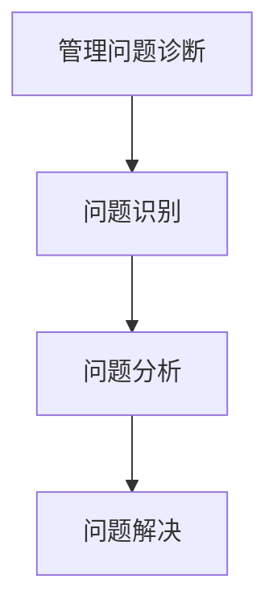

                 

### 文章标题：费曼提问法在管理问题诊断中的应用

> 关键词：费曼提问法，管理问题诊断，战略决策，组织管理，项目管理

> 摘要：本文将探讨费曼提问法在管理问题诊断中的应用。通过分析费曼提问法的核心原理和实际操作流程，结合战略决策、组织管理、项目管理的具体案例，阐述费曼提问法在解决管理难题中的有效性和重要性，为企业管理者提供一种全新的问题解决思路。

### 《费曼提问法在管理问题诊断中的应用》目录大纲

#### 第一部分：费曼提问法概述

**# 第1章：费曼提问法基本原理**

**## 1.1 费曼提问法的历史背景与哲学基础**

### 1.1.1 费曼的生平与成就

### 1.1.2 费曼提问法的提出与发展

### 1.1.3 费曼提问法的重要性

**## 1.2 费曼提问法的核心要素**

### 1.2.1 提问的四个层次

### 1.2.2 提问技巧与策略

### 1.2.3 提问的态度与方法

**## 1.3 费曼提问法在管理问题诊断中的应用价值**

### 1.3.1 管理问题诊断的现状与挑战

### 1.3.2 费曼提问法在问题诊断中的优势

### 1.3.3 费曼提问法在管理决策中的应用

#### 第二部分：费曼提问法在具体管理问题中的应用

**# 第2章：费曼提问法在战略决策中的应用**

**## 2.1 战略决策中的常见问题**

### 2.1.1 战略目标设定问题

### 2.1.2 市场定位问题

### 2.1.3 竞争策略问题

**## 2.2 费曼提问法在战略决策中的应用**

### 2.2.1 提问与反思：战略目标设定

### 2.2.2 提问与探索：市场定位

### 2.2.3 提问与优化：竞争策略

**## 2.3 案例分析：某公司战略决策中的费曼提问法应用**

**# 第3章：费曼提问法在组织管理中的应用**

**## 3.1 组织管理中的常见问题**

### 3.1.1 组织架构设计问题

### 3.1.2 组织变革问题

### 3.1.3 人事管理问题

**## 3.2 费曼提问法在组织管理中的应用**

### 3.2.1 提问与诊断：组织架构设计

### 3.2.2 提问与规划：组织变革

### 3.2.3 提问与协调：人事管理

**## 3.3 案例分析：某公司组织管理中的费曼提问法应用**

**# 第4章：费曼提问法在项目管理中的应用**

**## 4.1 项目管理中的常见问题**

### 4.1.1 项目计划问题

### 4.1.2 项目执行问题

### 4.1.3 项目风险问题

**## 4.2 费曼提问法在项目管理中的应用**

### 4.2.1 提问与规划：项目计划

### 4.2.2 提问与监控：项目执行

### 4.2.3 提问与控制：项目风险

**## 4.3 案例分析：某公司项目管理中的费曼提问法应用**

#### 第三部分：费曼提问法在管理问题诊断中的实践

**# 第5章：费曼提问法在管理问题诊断中的操作流程**

**## 5.1 管理问题诊断的基本流程**

### 5.1.1 问题识别

### 5.1.2 问题分析

### 5.1.3 问题解决

**## 5.2 费曼提问法在问题诊断中的具体应用**

### 5.2.1 提问与识别：管理问题

### 5.2.2 提问与分析：管理问题本质

### 5.2.3 提问与解决：管理问题对策

**## 5.3 费曼提问法的优缺点分析**

**# 第6章：费曼提问法在实际管理问题中的应用案例**

**## 6.1 案例一：某公司市场营销问题诊断**

### 6.1.1 问题背景

### 6.1.2 费曼提问法应用过程

### 6.1.3 问题解决与效果评估

**## 6.2 案例二：某公司生产管理问题诊断**

### 6.2.1 问题背景

### 6.2.2 费曼提问法应用过程

### 6.2.3 问题解决与效果评估

**# 第7章：费曼提问法在管理问题诊断中的未来发展**

**## 7.1 费曼提问法在管理问题诊断中的潜力**

### 7.1.1 费曼提问法的适用范围

### 7.1.2 费曼提问法与其他管理工具的整合

### 7.1.3 费曼提问法的未来发展

**## 7.2 费曼提问法在管理问题诊断中的挑战与对策**

### 7.2.1 挑战一：提问者的能力要求

### 7.2.2 挑战二：组织文化的适应性

### 7.2.3 对策与建议

#### 附录

**## 附录A：费曼提问法的应用工具与资源**

### A.1 费曼提问法应用工具简介

### A.2 费曼提问法相关资源推荐

### A.3 费曼提问法案例库与参考资料

**## 附录B：费曼提问法相关学术文献综述**

### B.1 费曼提问法研究综述

### B.2 国内外相关研究进展

### B.3 研究展望与未来方向

### 
### <a name="Mermaid流程图"></a>Mermaid流程图：



### 
### <a name="伪代码"></a>伪代码：

```plaintext
Function 费曼提问法(问题)
    Input: 问题
    Output: 问题解决方案

    Step 1: 提问1（为什么？）
    Step 2: 提问2（什么？）
    Step 3: 提问3（怎样？）
    Step 4: 提问4（谁？）
    Step 5: 根据提问结果，进行问题分析
    Step 6: 提出问题解决方案
End Function
```

### 
### <a name="LaTeX数学公式"></a>LaTeX数学公式：

$$
E = mc^2
$$

$$
f(x) = x^2 + 2x + 1
$$

### 
### <a name="代码案例"></a>代码案例：

```python
# 导入必需的库
import numpy as np
import matplotlib.pyplot as plt

# 创建数据集
x = np.linspace(-10, 10, 100)
y = x ** 2 + 2 * x + 1

# 绘制图像
plt.plot(x, y)
plt.xlabel('x')
plt.ylabel('y')
plt.title('二次函数图像')
plt.grid(True)
plt.show()
```

### 
### <a name="作者信息"></a>作者信息：

作者：AI天才研究院/AI Genius Institute & 禅与计算机程序设计艺术 /Zen And The Art of Computer Programming

### 
### <a name="文章摘要"></a>文章摘要：

本文深入探讨了费曼提问法在管理问题诊断中的应用。首先介绍了费曼提问法的基本原理和历史背景，随后详细阐述了其核心要素和提问技巧。通过具体案例分析，本文展示了费曼提问法在战略决策、组织管理和项目管理中的实际应用，并分析了其在管理问题诊断中的优缺点。最后，本文提出了费曼提问法在管理问题诊断中的未来发展前景和挑战，为企业管理者提供了一种全新的问题解决思路。

