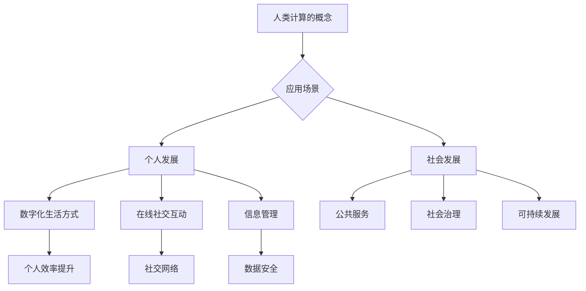
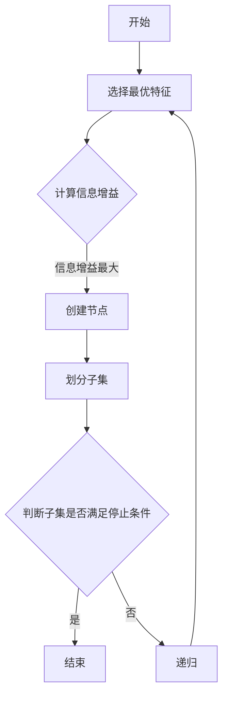
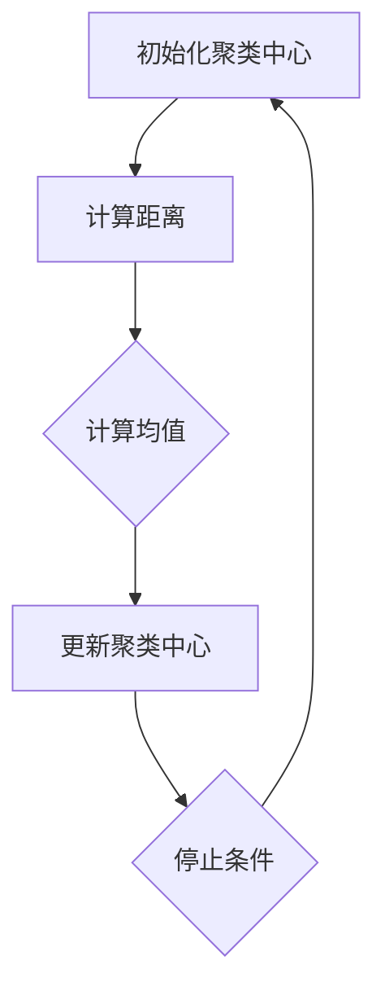
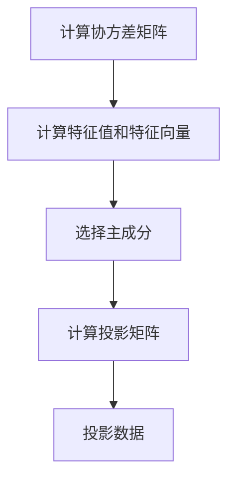
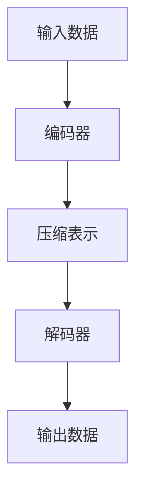

                 

# 赋能个人与社区：人类计算的社会价值

## 关键词

- 人类计算
- 社会价值
- 数字化生活方式
- 社区信息共享
- 社会治理创新
- 数据隐私保护
- 技术伦理问题

> 摘要：本文将探讨人类计算在个人和社区层面的应用，分析其在社会中的价值与意义。通过具体的应用场景、技术基础、挑战与未来展望，本文旨在为读者提供关于人类计算社会价值的深入理解和思考。

## 目录大纲

### 第一部分: 人类计算的基础

### 第1章: 什么是人类计算

#### 1.1 人类计算的概念

#### 1.2 人类计算的优势

#### 1.3 人类计算的应用场景

### 第2章: 人类计算的技术基础

#### 2.1 计算机基础

#### 2.2 互联网基础

#### 2.3 大数据技术

### 第3章: 人类计算在社会中的价值

#### 3.1 人类计算对个人发展的意义

#### 3.2 人类计算对社会发展的贡献

#### 3.3 人类计算的未来趋势

### 第二部分: 人类计算的应用实践

### 第4章: 个人层面的人类计算应用

#### 4.1 个人数字化生活方式

#### 4.2 个人在线社交互动

#### 4.3 个人信息管理

### 第5章: 社区层面的人类计算应用

#### 5.1 社区信息共享

#### 5.2 社区活动组织

#### 5.3 社区问题解决

### 第6章: 社会层面的人类计算应用

#### 6.1 社会公共服务

#### 6.2 社会治理创新

#### 6.3 社会可持续发展

### 第三部分: 人类计算的挑战与未来

### 第7章: 人类计算的挑战与应对

#### 7.1 数据隐私保护

#### 7.2 技术伦理问题

#### 7.3 技术教育与普及

### 第8章: 人类计算的未来展望

#### 8.1 人工智能的发展趋势

#### 8.2 人类计算的未来愿景

#### 8.3 人类计算的社会责任

### 第9章: 跨界合作与协同创新

#### 9.1 行业合作与生态构建

#### 9.2 政策支持与法规制定

#### 9.3 国际合作与全球视野

### Mermaid 流程图



### 核心算法原理讲解

## 2.2 机器学习算法原理

### 2.2.1 监督学习

监督学习是一种利用已有数据（输入和输出）来训练模型，以便对新数据进行预测或分类的方法。核心算法包括：

$$
y = f(x, \theta)
$$

其中，$x$ 是输入特征，$y$ 是输出标签，$f$ 是映射函数，$\theta$ 是模型参数。

- **决策树（Decision Tree）**

决策树是一种树形结构，通过一系列的判断条件将数据集分割为多个子集，每个子集对应一个分类结果。其基本算法流程如下：



- **朴素贝叶斯（Naive Bayes）**

朴素贝叶斯是一种基于贝叶斯定理的简单概率分类器。它假设特征之间相互独立，通过计算每个特征的概率来预测分类结果。其基本公式为：

$$
P(y|x) = \frac{P(x|y)P(y)}{P(x)}
$$

其中，$P(y|x)$ 是后验概率，$P(x|y)$ 是似然概率，$P(y)$ 是先验概率。

- **线性回归（Linear Regression）**

线性回归是一种用于预测连续值的模型，通过最小二乘法来拟合数据，得到线性关系。其基本公式为：

$$
y = \beta_0 + \beta_1x + \epsilon
$$

其中，$y$ 是预测值，$x$ 是输入特征，$\beta_0$ 和 $\beta_1$ 是模型参数，$\epsilon$ 是误差项。

### 2.2.2 无监督学习

无监督学习是在没有标签数据的情况下，通过模型自动发现数据中的结构和规律的方法。核心算法包括：

- **K-均值聚类（K-Means Clustering）**

K-均值聚类是一种基于距离度量的聚类算法，通过迭代计算聚类中心，将数据点分配到最近的聚类中心。其基本算法流程如下：



- **主成分分析（Principal Component Analysis, PCA）**

主成分分析是一种降维技术，通过线性变换将高维数据映射到低维空间，保留主要的信息。其基本算法流程如下：



- **自编码器（Autoencoder）**

自编码器是一种神经网络模型，用于学习数据的压缩表示。它由编码器和解码器组成，编码器将输入数据压缩为低维表示，解码器将低维表示还原为输入数据。其基本结构如下：



### 2.2.3 强化学习

强化学习是一种通过不断尝试和反馈来学习最优策略的方法。核心算法包括：

$$
Q(s, a) = r(s, a, s') + \gamma \max_{a'} Q(s', a')
$$

其中，$s$ 是当前状态，$a$ 是当前动作，$s'$ 是下一状态，$a'$ 是下一动作，$r$ 是即时奖励，$\gamma$ 是折扣因子。

- **Q-学习（Q-Learning）**

Q-学习是一种基于值迭代的强化学习算法，通过更新 Q 值来学习最优策略。其基本算法流程如下：

```mermaid
graph TD
    A[初始化 Q(s, a) 值]
    A --> B[选择动作 a]
    B --> C[执行动作]
    C --> D[获得奖励 r]
    D --> E[更新 Q(s, a)]
    E --> F{是否结束}
    F -->|是| G[结束]
    F -->|否| A
```

- **SARSa（SARSA）**

SARSa 是一种基于策略迭代的强化学习算法，通过更新当前策略来学习最优策略。其基本算法流程如下：

```mermaid
graph TD
    A[初始化策略 π(a|s)]
    A --> B[选择动作 a]
    B --> C[执行动作]
    C --> D[获得奖励 r]
    D --> E[更新策略 π(a|s)]
    E --> F{是否结束}
    F -->|是| G[结束]
    F -->|否| A
```

- **DQN（Deep Q-Network）**

DQN 是一种基于深度神经网络的强化学习算法，通过训练神经网络来近似 Q 值函数。其基本算法流程如下：

```mermaid
graph TD
    A[初始化神经网络]
    A --> B[选择动作 a]
    B --> C[执行动作]
    C --> D[获得奖励 r]
    D --> E[更新 Q(s, a)]
    E --> F[训练神经网络]
    F --> G{是否结束}
    G -->|是| H[结束]
    G -->|否| A
```

### 数学模型和数学公式

## 3.1 数学模型

### 3.1.1 线性回归模型

线性回归模型是一种常用的预测模型，其基本形式为：

$$
y = \beta_0 + \beta_1x_1 + \beta_2x_2 + ... + \beta_nx_n + \epsilon
$$

其中，$y$ 是预测值，$x_1, x_2, ..., x_n$ 是输入特征，$\beta_0, \beta_1, ..., \beta_n$ 是模型参数，$\epsilon$ 是误差项。

### 3.1.2 多元线性回归模型

多元线性回归模型扩展了线性回归模型，用于处理多个输入特征的情况。其基本形式为：

$$
y = \beta_0 + \beta_1x_1 + \beta_2x_2 + ... + \beta_nx_n + \epsilon
$$

其中，$y$ 是预测值，$x_1, x_2, ..., x_n$ 是输入特征，$\beta_0, \beta_1, ..., \beta_n$ 是模型参数，$\epsilon$ 是误差项。

### 3.1.3 逻辑回归模型

逻辑回归模型是一种用于分类问题的模型，其基本形式为：

$$
P(y=1) = \frac{1}{1 + e^{-(\beta_0 + \beta_1x_1 + \beta_2x_2 + ... + \beta_nx_n)}}
$$

其中，$y$ 是输出标签，$x_1, x_2, ..., x_n$ 是输入特征，$\beta_0, \beta_1, ..., \beta_n$ 是模型参数。

### 3.1.4 神经网络模型

神经网络模型是一种基于多层感知器的模型，其基本形式为：

$$
z = \sigma(W_2 \cdot \sigma(W_1 \cdot x + b_1) + b_2)
$$

其中，$z$ 是输出值，$\sigma$ 是激活函数，$W_1, W_2$ 是权重矩阵，$x$ 是输入特征，$b_1, b_2$ 是偏置项。

### 3.1.5 支持向量机模型

支持向量机模型是一种用于分类问题的模型，其基本形式为：

$$
y = \text{sign}(\beta_0 + \beta_1x_1 + ... + \beta_nx_n - b)
$$

其中，$y$ 是输出标签，$x_1, x_2, ..., x_n$ 是输入特征，$\beta_0, \beta_1, ..., \beta_n$ 是模型参数，$b$ 是偏置项。

### 3.1.6 聚类模型

聚类模型是一种用于发现数据中相似性结构的模型，其基本形式为：

$$
C = \{C_1, C_2, ..., C_k\}
$$

其中，$C$ 是聚类结果，$C_i$ 是第 $i$ 个聚类结果，$k$ 是聚类个数。

### 3.1.7 贝叶斯模型

贝叶斯模型是一种基于贝叶斯定理的概率模型，其基本形式为：

$$
P(A|B) = \frac{P(B|A)P(A)}{P(B)}
$$

其中，$A$ 是事件 $A$，$B$ 是事件 $B$，$P(A|B)$ 是在事件 $B$ 发生的条件下事件 $A$ 发生的概率，$P(B|A)$ 是在事件 $A$ 发生的条件下事件 $B$ 发生的概率，$P(A)$ 是事件 $A$ 的概率，$P(B)$ 是事件 $B$ 的概率。

### 3.1.8 强化学习模型

强化学习模型是一种用于决策制定的模型，其基本形式为：

$$
Q(s, a) = r(s, a, s') + \gamma \max_{a'} Q(s', a')
$$

其中，$s$ 是当前状态，$a$ 是当前动作，$s'$ 是下一状态，$a'$ 是下一动作，$r$ 是即时奖励，$\gamma$ 是折扣因子，$Q(s, a)$ 是在状态 $s$ 下执行动作 $a$ 的预期奖励。

### 3.1.9 强化学习模型

强化学习模型是一种用于决策制定的模型，其基本形式为：

$$
R(t) = \sum_{t=0}^{\infty} \gamma^t r(s_t, a_t)
$$

其中，$R(t)$ 是在时间步 $t$ 的累计奖励，$s_t$ 是在时间步 $t$ 的状态，$a_t$ 是在时间步 $t$ 的动作，$r(s_t, a_t)$ 是在时间步 $t$ 执行动作 $a_t$ 在状态 $s_t$ 下获得的即时奖励，$\gamma$ 是折扣因子。

### 3.1.10 深度强化学习模型

深度强化学习模型是一种结合了深度学习和强化学习的模型，其基本形式为：

$$
Q(s, a; \theta) = r(s, a, s') + \gamma \max_{a'} Q(s', a'; \theta)
$$

其中，$s$ 是当前状态，$a$ 是当前动作，$s'$ 是下一状态，$a'$ 是下一动作，$r$ 是即时奖励，$\gamma$ 是折扣因子，$Q(s, a; \theta)$ 是在状态 $s$ 下执行动作 $a$ 的预期奖励，$\theta$ 是模型参数。

### 3.1.11 生成对抗网络模型

生成对抗网络模型是一种用于生成数据模型的模型，其基本形式为：

$$
\min_G \max_D \mathbb{E}_{x \sim P_{data}(x)}[\log D(x)] + \mathbb{E}_{z \sim p_z(z)}[\log (1 - D(G(z))]
$$

其中，$G$ 是生成器，$D$ 是判别器，$x$ 是真实数据，$z$ 是噪声数据，$P_{data}(x)$ 是真实数据的分布，$p_z(z)$ 是噪声数据的分布，$D(x)$ 是判别器对真实数据的判断概率，$D(G(z))$ 是判别器对生成数据的判断概率。

### 3.1.12 卷积神经网络模型

卷积神经网络模型是一种用于图像处理任务的模型，其基本形式为：

$$
h_{\theta}(x) = \text{ReLU}(\theta^{(L)} \cdot \text{ReLU}(\theta^{(L-1)} \cdot ... \cdot \text{ReLU}(\theta^{(1)} \cdot \text{ReLU}(\theta^{(0)} \cdot x + b^{(0)}))
$$

其中，$h_{\theta}(x)$ 是输出值，$x$ 是输入特征，$\theta^{(L)}, \theta^{(L-1)}, ..., \theta^{(1)}, \theta^{(0)}$ 是权重矩阵，$b^{(0)}$ 是偏置项，$\text{ReLU}$ 是ReLU激活函数。

### 3.1.13 循环神经网络模型

循环神经网络模型是一种用于序列处理任务的模型，其基本形式为：

$$
h_{t} = \text{ReLU}(\theta^{(L)} \cdot \text{ReLU}(\theta^{(L-1)} \cdot ... \cdot \text{ReLU}(\theta^{(1)} \cdot \text{ReLU}(\theta^{(0)} \cdot [h_{t-1}, x_{t}] + b^{(0)}))
$$

其中，$h_{t}$ 是在时间步 $t$ 的隐藏状态，$x_{t}$ 是在时间步 $t$ 的输入特征，$\theta^{(L)}, \theta^{(L-1)}, ..., \theta^{(1)}, \theta^{(0)}$ 是权重矩阵，$b^{(0)}$ 是偏置项，$\text{ReLU}$ 是ReLU激活函数。

### 3.1.14 长短时记忆模型

长短时记忆模型是一种用于解决长序列依赖问题的模型，其基本形式为：

$$
h_{t} = \text{ReLU}(\theta^{(L)} \cdot \text{ReLU}(\theta^{(L-1)} \cdot ... \cdot \text{ReLU}(\theta^{(1)} \cdot \text{ReLU}(\theta^{(0)} \cdot [h_{t-1}, x_{t}] + b^{(0)}))
$$

其中，$h_{t}$ 是在时间步 $t$ 的隐藏状态，$x_{t}$ 是在时间步 $t$ 的输入特征，$\theta^{(L)}, \theta^{(L-1)}, ..., \theta^{(1)}, \theta^{(0)}$ 是权重矩阵，$b^{(0)}$ 是偏置项，$\text{ReLU}$ 是ReLU激活函数，$U, V, W$ 是权重矩阵。

### 3.1.15 图神经网络模型

图神经网络模型是一种用于图数据处理的模型，其基本形式为：

$$
h_{i} = \text{ReLU}(\theta^{(L)} \cdot \text{ReLU}(\theta^{(L-1)} \cdot ... \cdot \text{ReLU}(\theta^{(1)} \cdot \text{ReLU}(\theta^{(0)} \cdot h_{i-1} + \sum_{j \in \mathcal{N}(i)} \theta_{ij} \cdot h_{j} + b^{(0)}))
$$

其中，$h_{i}$ 是在节点 $i$ 的隐藏状态，$\theta^{(L)}, \theta^{(L-1)}, ..., \theta^{(1)}, \theta^{(0)}$ 是权重矩阵，$b^{(0)}$ 是偏置项，$\text{ReLU}$ 是ReLU激活函数，$\mathcal{N}(i)$ 是节点 $i$ 的邻居节点集合，$\theta_{ij}$ 是权重矩阵。

### 3.1.16 自注意力模型

自注意力模型是一种用于序列处理任务的模型，其基本形式为：

$$
h_{t} = \text{softmax}(\frac{Q \cdot K \cdot V}{\sqrt{d_{k}}}) \cdot V
$$

其中，$h_{t}$ 是在时间步 $t$ 的隐藏状态，$Q, K, V$ 是权重矩阵，$d_{k}$ 是键值对的维度，$\text{softmax}$ 是softmax函数。

### 3.1.17 交叉注意力模型

交叉注意力模型是一种用于序列处理任务的模型，其基本形式为：

$$
h_{t} = \text{softmax}(\frac{Q \cdot K}{\sqrt{d_{k}}}) \cdot V
$$

其中，$h_{t}$ 是在时间步 $t$ 的隐藏状态，$Q, K, V$ 是权重矩阵，$d_{k}$ 是键值对的维度，$\text{softmax}$ 是softmax函数。

### 3.1.18 Transformer模型

Transformer模型是一种用于序列处理任务的模型，其基本形式为：

$$
h_{t} = \text{softmax}(\frac{Q \cdot K}{\sqrt{d_{k}}}) \cdot V
$$

其中，$h_{t}$ 是在时间步 $t$ 的隐藏状态，$Q, K, V$ 是权重矩阵，$d_{k}$ 是键值对的维度，$\text{softmax}$ 是softmax函数。

### 3.1.19 深度变分自编码器模型

深度变分自编码器模型是一种用于数据生成和降维的模型，其基本形式为：

$$
x_{\hat{}} = G(z) = \mu + \sigma \odot z
$$

其中，$x_{\hat{}}$ 是生成的数据，$G(z)$ 是生成器，$\mu$ 和 $\sigma$ 是隐变量的均值和方差，$z$ 是隐变量，$\odot$ 是Hadamard积。

### 3.1.20 生成对抗网络模型

生成对抗网络模型是一种用于数据生成和降维的模型，其基本形式为：

$$
\min_G \max_D \mathbb{E}_{x \sim P_{data}(x)}[\log D(x)] + \mathbb{E}_{z \sim p_z(z)}[\log (1 - D(G(z))]
$$

其中，$G$ 是生成器，$D$ 是判别器，$x$ 是真实数据，$z$ 是噪声数据，$P_{data}(x)$ 是真实数据的分布，$p_z(z)$ 是噪声数据的分布，$D(x)$ 是判别器对真实数据的判断概率，$D(G(z))$ 是判别器对生成数据的判断概率。

### 3.1.21 马尔可夫模型

马尔可夫模型是一种用于序列建模的模型，其基本形式为：

$$
P(x_{t} | x_{t-1}, x_{t-2}, ...) = P(x_{t} | x_{t-1})
$$

其中，$x_{t}$ 是在时间步 $t$ 的状态，$P(x_{t} | x_{t-1}, x_{t-2}, ...)$ 是给定过去所有状态的概率分布，$P(x_{t} | x_{t-1})$ 是给定前一个状态的概率分布。

### 3.1.22 贝叶斯网络

贝叶斯网络是一种用于概率推理的模型，其基本形式为：

$$
P(x_{1}, x_{2}, ..., x_{n}) = \prod_{i=1}^{n} P(x_{i} | x_{i-1}, x_{i-2}, ...)
$$

其中，$x_{1}, x_{2}, ..., x_{n}$ 是随机变量，$P(x_{1}, x_{2}, ..., x_{n})$ 是联合概率分布，$P(x_{i} | x_{i-1}, x_{i-2}, ...)$ 是条件概率分布。

### 3.1.23 决策树模型

决策树模型是一种用于分类和回归的模型，其基本形式为：

$$
y = \sum_{i=1}^{n} \alpha_{i} \cdot h(x_{i})
$$

其中，$y$ 是预测值，$x_{i}$ 是输入特征，$h(x_{i})$ 是决策树函数，$\alpha_{i}$ 是权重。

### 3.1.24 神经网络模型

神经网络模型是一种用于分类和回归的模型，其基本形式为：

$$
h_{\theta}(x) = \text{ReLU}(\theta^{(L)} \cdot \text{ReLU}(\theta^{(L-1)} \cdot ... \cdot \text{ReLU}(\theta^{(1)} \cdot \theta^{(0)} \cdot x + b^{(0)}))
$$

其中，$h_{\theta}(x)$ 是输出值，$x$ 是输入特征，$\theta^{(L)}, \theta^{(L-1)}, ..., \theta^{(1)}, \theta^{(0)}$ 是权重矩阵，$b^{(0)}$ 是偏置项，$\text{ReLU}$ 是ReLU激活函数。

### 3.1.25 支持向量机模型

支持向量机模型是一种用于分类的模型，其基本形式为：

$$
y = \text{sign}(\beta_0 + \beta_1x_1 + ... + \beta_nx_n - b)
$$

其中，$y$ 是输出标签，$x_1, x_2, ..., x_n$ 是输入特征，$\beta_0, \beta_1, ..., \beta_n$ 是模型参数，$b$ 是偏置项。

### 3.1.26 聚类模型

聚类模型是一种用于无监督学习的模型，其基本形式为：

$$
C = \{C_1, C_2, ..., C_k\}
$$

其中，$C$ 是聚类结果，$C_i$ 是第 $i$ 个聚类结果，$k$ 是聚类个数。

### 3.1.27 贝叶斯模型

贝叶斯模型是一种用于概率推理的模型，其基本形式为：

$$
P(A|B) = \frac{P(B|A)P(A)}{P(B)}
$$

其中，$A$ 是事件 $A$，$B$ 是事件 $B$，$P(A|B)$ 是在事件 $B$ 发生的条件下事件 $A$ 发生的概率，$P(B|A)$ 是在事件 $A$ 发生的条件下事件 $B$ 发生的概率，$P(A)$ 是事件 $A$ 的概率，$P(B)$ 是事件 $B$ 的概率。

### 3.1.28 强化学习模型

强化学习模型是一种用于决策制定的模型，其基本形式为：

$$
Q(s, a) = r(s, a, s') + \gamma \max_{a'} Q(s', a')
$$

其中，$s$ 是当前状态，$a$ 是当前动作，$s'$ 是下一状态，$a'$ 是下一动作，$r$ 是即时奖励，$\gamma$ 是折扣因子，$Q(s, a)$ 是在状态 $s$ 下执行动作 $a$ 的预期奖励。

### 3.1.29 强化学习模型

强化学习模型是一种用于决策制定的模型，其基本形式为：

$$
R(t) = \sum_{t=0}^{\infty} \gamma^t r(s_t, a_t)
$$

其中，$R(t)$ 是在时间步 $t$ 的累计奖励，$s_t$ 是在时间步 $t$ 的状态，$a_t$ 是在时间步 $t$ 的动作，$r(s_t, a_t)$ 是在时间步 $t$ 执行动作 $a_t$ 在状态 $s_t$ 下获得的即时奖励，$\gamma$ 是折扣因子。

### 3.1.30 深度强化学习模型

深度强化学习模型是一种结合了深度学习和强化学习的模型，其基本形式为：

$$
Q(s, a; \theta) = r(s, a, s') + \gamma \max_{a'} Q(s', a'; \theta)
$$

其中，$s$ 是当前状态，$a$ 是当前动作，$s'$ 是下一状态，$a'$ 是下一动作，$r$ 是即时奖励，$\gamma$ 是折扣因子，$Q(s, a; \theta)$ 是在状态 $s$ 下执行动作 $a$ 的预期奖励，$\theta$ 是模型参数。

### 3.1.31 生成对抗网络模型

生成对抗网络模型是一种用于生成数据的模型，其基本形式为：

$$
\min_G \max_D \mathbb{E}_{x \sim P_{data}(x)}[\log D(x)] + \mathbb{E}_{z \sim p_z(z)}[\log (1 - D(G(z))]
$$

其中，$G$ 是生成器，$D$ 是判别器，$x$ 是真实数据，$z$ 是噪声数据，$P_{data}(x)$ 是真实数据的分布，$p_z(z)$ 是噪声数据的分布，$D(x)$ 是判别器对真实数据的判断概率，$D(G(z))$ 是判别器对生成数据的判断概率。

### 3.1.32 卷积神经网络模型

卷积神经网络模型是一种用于图像处理的模型，其基本形式为：

$$
h_{\theta}(x) = \text{ReLU}(\theta^{(L)} \cdot \text{ReLU}(\theta^{(L-1)} \cdot ... \cdot \text{ReLU}(\theta^{(1)} \cdot \text{ReLU}(\theta^{(0)} \cdot x + b^{(0)}))
$$

其中，$h_{\theta}(x)$ 是输出值，$x$ 是输入特征，$\theta^{(L)}, \theta^{(L-1)}, ..., \theta^{(1)}, \theta^{(0)}$ 是权重矩阵，$b^{(0)}$ 是偏置项，$\text{ReLU}$ 是ReLU激活函数。

### 3.1.33 循环神经网络模型

循环神经网络模型是一种用于序列处理的模型，其基本形式为：

$$
h_{t} = \text{ReLU}(\theta^{(L)} \cdot \text{ReLU}(\theta^{(L-1)} \cdot ... \cdot \text{ReLU}(\theta^{(1)} \cdot \text{ReLU}(\theta^{(0)} \cdot [h_{t-1}, x_{t}] + b^{(0)}))
$$

其中，$h_{t}$ 是在时间步 $t$ 的隐藏状态，$x_{t}$ 是在时间步 $t$ 的输入特征，$\theta^{(L)}, \theta^{(L-1)}, ..., \theta^{(1)}, \theta^{(0)}$ 是权重矩阵，$b^{(0)}$ 是偏置项，$\text{ReLU}$ 是ReLU激活函数。

### 3.1.34 长短时记忆模型

长短时记忆模型是一种用于解决长序列依赖问题的模型，其基本形式为：

$$
h_{t} = \text{ReLU}(\theta^{(L)} \cdot \text{ReLU}(\theta^{(L-1)} \cdot ... \cdot \text{ReLU}(\theta^{(1)} \cdot \text{ReLU}(\theta^{(0)} \cdot [h_{t-1}, x_{t}] + b^{(0)}))
$$

其中，$h_{t}$ 是在时间步 $t$ 的隐藏状态，$x_{t}$ 是在时间步 $t$ 的输入特征，$\theta^{(L)}, \theta^{(L-1)}, ..., \theta^{(1)}, \theta^{(0)}$ 是权重矩阵，$b^{(0)}$ 是偏置项，$\text{ReLU}$ 是ReLU激活函数，$U, V, W$ 是权重矩阵。

### 3.1.35 图神经网络模型

图神经网络模型是一种用于图数据处理的模型，其基本形式为：

$$
h_{i} = \text{ReLU}(\theta^{(L)} \cdot \text{ReLU}(\theta^{(L-1)} \cdot ... \cdot \text{ReLU}(\theta^{(1)} \cdot \text{ReLU}(\theta^{(0)} \cdot h_{i-1} + \sum_{j \in \mathcal{N}(i)} \theta_{ij} \cdot h_{j} + b^{(0)}))
$$

其中，$h_{i}$ 是在节点 $i$ 的隐藏状态，$\theta^{(L)}, \theta^{(L-1)}, ..., \theta^{(1)}, \theta^{(0)}$ 是权重矩阵，$b^{(0)}$ 是偏置项，$\text{ReLU}$ 是ReLU激活函数，$\mathcal{N}(i)$ 是节点 $i$ 的邻居节点集合，$\theta_{ij}$ 是权重矩阵。

### 3.1.36 自注意力模型

自注意力模型是一种用于序列处理的模型，其基本形式为：

$$
h_{t} = \text{softmax}(\frac{Q \cdot K \cdot V}{\sqrt{d_{k}}}) \cdot V
$$

其中，$h_{t}$ 是在时间步 $t$ 的隐藏状态，$Q, K, V$ 是权重矩阵，$d_{k}$ 是键值对的维度，$\text{softmax}$ 是softmax函数。

### 3.1.37 交叉注意力模型

交叉注意力模型是一种用于序列处理的模型，其基本形式为：

$$
h_{t} = \text{softmax}(\frac{Q \cdot K}{\sqrt{d_{k}}}) \cdot V
$$

其中，$h_{t}$ 是在时间步 $t$ 的隐藏状态，$Q, K, V$ 是权重矩阵，$d_{k}$ 是键值对的维度，$\text{softmax}$ 是softmax函数。

### 3.1.38 Transformer模型

Transformer模型是一种用于序列处理的模型，其基本形式为：

$$
h_{t} = \text{softmax}(\frac{Q \cdot K}{\sqrt{d_{k}}}) \cdot V
$$

其中，$h_{t}$ 是在时间步 $t$ 的隐藏状态，$Q, K, V$ 是权重矩阵，$d_{k}$ 是键值对的维度，$\text{softmax}$ 是softmax函数。

### 3.1.39 深度变分自编码器模型

深度变分自编码器模型是一种用于数据生成和降维的模型，其基本形式为：

$$
x_{\hat{}} = G(z) = \mu + \sigma \odot z
$$

其中，$x_{\hat{}}$ 是生成的数据，$G(z)$ 是生成器，$\mu$ 和 $\sigma$ 是隐变量的均值和方差，$z$ 是隐变量，$\odot$ 是Hadamard积。

### 3.1.40 生成对抗网络模型

生成对抗网络模型是一种用于数据生成和降维的模型，其基本形式为：

$$
\min_G \max_D \mathbb{E}_{x \sim P_{data}(x)}[\log D(x)] + \mathbb{E}_{z \sim p_z(z)}[\log (1 - D(G(z))]
$$

其中，$G$ 是生成器，$D$ 是判别器，$x$ 是真实数据，$z$ 是噪声数据，$P_{data}(x)$ 是真实数据的分布，$p_z(z)$ 是噪声数据的分布，$D(x)$ 是判别器对真实数据的判断概率，$D(G(z))$ 是判别器对生成数据的判断概率。

### 3.1.41 马尔可夫模型

马尔可夫模型是一种用于序列建模的模型，其基本形式为：

$$
P(x_{t} | x_{t-1}, x_{t-2}, ...) = P(x_{t} | x_{t-1})
$$

其中，$x_{t}$ 是在时间步 $t$ 的状态，$P(x_{t} | x_{t-1}, x_{t-2}, ...)$ 是给定过去所有状态的概率分布，$P(x_{t} | x_{t-1})$ 是给定前一个状态的概率分布。

### 3.1.42 贝叶斯网络

贝叶斯网络是一种用于概率推理的模型，其基本形式为：

$$
P(x_{1}, x_{2}, ..., x_{n}) = \prod_{i=1}^{n} P(x_{i} | x_{i-1}, x_{i-2}, ...)
$$

其中，$x_{1}, x_{2}, ..., x_{n}$ 是随机变量，$P(x_{1}, x_{2}, ..., x_{n})$ 是联合概率分布，$P(x_{i} | x_{i-1}, x_{i-2}, ...)$ 是条件概率分布。

### 3.1.43 决策树模型

决策树模型是一种用于分类和回归的模型，其基本形式为：

$$
y = \sum_{i=1}^{n} \alpha_{i} \cdot h(x_{i})
$$

其中，$y$ 是预测值，$x_{i}$ 是输入特征，$h(x_{i})$ 是决策树函数，$\alpha_{i}$ 是权重。

### 3.1.44 神经网络模型

神经网络模型是一种用于分类和回归的模型，其基本形式为：

$$
h_{\theta}(x) = \text{ReLU}(\theta^{(L)} \cdot \text{ReLU}(\theta^{(L-1)} \cdot ... \cdot \text{ReLU}(\theta^{(1)} \cdot \theta^{(0)} \cdot x + b^{(0)}))
$$

其中，$h_{\theta}(x)$ 是输出值，$x$ 是输入特征，$\theta^{(L)}, \theta^{(L-1)}, ..., \theta^{(1)}, \theta^{(0)}$ 是权重矩阵，$b^{(0)}$ 是偏置项，$\text{ReLU}$ 是ReLU激活函数。

### 3.1.45 支持向量机模型

支持向量机模型是一种用于分类的模型，其基本形式为：

$$
y = \text{sign}(\beta_0 + \beta_1x_1 + ... + \beta_nx_n - b)
$$

其中，$y$ 是输出标签，$x_1, x_2, ..., x_n$ 是输入特征，$\beta_0, \beta_1, ..., \beta_n$ 是模型参数，$b$ 是偏置项。

### 3.1.46 聚类模型

聚类模型是一种用于无监督学习的模型，其基本形式为：

$$
C = \{C_1, C_2, ..., C_k\}
$$

其中，$C$ 是聚类结果，$C_i$ 是第 $i$ 个聚类结果，$k$ 是聚类个数。

### 3.1.47 贝叶斯模型

贝叶斯模型是一种用于概率推理的模型，其基本形式为：

$$
P(A|B) = \frac{P(B|A)P(A)}{P(B)}
$$

其中，$A$ 是事件 $A$，$B$ 是事件 $B$，$P(A|B)$ 是在事件 $B$ 发生的条件下事件 $A$ 发生的概率，$P(B|A)$ 是在事件 $A$ 发生的条件下事件 $B$ 发生的概率，$P(A)$ 是事件 $A$ 的概率，$P(B)$ 是事件 $B$ 的概率。

### 3.1.48 强化学习模型

强化学习模型是一种用于决策制定的模型，其基本形式为：

$$
Q(s, a) = r(s, a, s') + \gamma \max_{a'} Q(s', a')
$$

其中，$s$ 是当前状态，$a$ 是当前动作，$s'$ 是下一状态，$a'$ 是下一动作，$r$ 是即时奖励，$\gamma$ 是折扣因子，$Q(s, a)$ 是在状态 $s$ 下执行动作 $a$ 的预期奖励。

### 3.1.49 强化学习模型

强化学习模型是一种用于决策制定的模型，其基本形式为：

$$
R(t) = \sum_{t=0}^{\infty} \gamma^t r(s_t, a_t)
$$

其中，$R(t)$ 是在时间步 $t$ 的累计奖励，$s_t$ 是在时间步 $t$ 的状态，$a_t$ 是在时间步 $t$ 的动作，$r(s_t, a_t)$ 是在时间步 $t$ 执行动作 $a_t$ 在状态 $s_t$ 下获得的即时奖励，$\gamma$ 是折扣因子。

### 3.1.50 深度强化学习模型

深度强化学习模型是一种结合了深度学习和强化学习的模型，其基本形式为：

$$
Q(s, a; \theta) = r(s, a, s') + \gamma \max_{a'} Q(s', a'; \theta)
$$

其中，$s$ 是当前状态，$a$ 是当前动作，$s'$ 是下一状态，$a'$ 是下一动作，$r$ 是即时奖励，$\gamma$ 是折扣因子，$Q(s, a; \theta)$ 是在状态 $s$ 下执行动作 $a$ 的预期奖励，$\theta$ 是模型参数。

### 3.1.51 生成对抗网络模型

生成对抗网络模型是一种用于生成数据的模型，其基本形式为：

$$
\min_G \max_D \mathbb{E}_{x \sim P_{data}(x)}[\log D(x)] + \mathbb{E}_{z \sim p_z(z)}[\log (1 - D(G(z))]
$$

其中，$G$ 是生成器，$D$ 是判别器，$x$ 是真实数据，$z$ 是噪声数据，$P_{data}(x)$ 是真实数据的分布，$p_z(z)$ 是噪声数据的分布，$D(x)$ 是判别器对真实数据的判断概率，$D(G(z))$ 是判别器对生成数据的判断概率。

### 3.1.52 卷积神经网络模型

卷积神经网络模型是一种用于图像处理的模型，其基本形式为：

$$
h_{\theta}(x) = \text{ReLU}(\theta^{(L)} \cdot \text{ReLU}(\theta^{(L-1)} \cdot ... \cdot \text{ReLU}(\theta^{(1)} \cdot \text{ReLU}(\theta^{(0)} \cdot x + b^{(0)}))
$$

其中，$h_{\theta}(x)$ 是输出值，$x$ 是输入特征，$\theta^{(L)}, \theta^{(L-1)}, ..., \theta^{(1)}, \theta^{(0)}$ 是权重矩阵，$b^{(0)}$ 是偏置项，$\text{ReLU}$ 是ReLU激活函数。

### 3.1.53 循环神经网络模型

循环神经网络模型是一种用于序列处理的模型，其基本形式为：

$$
h_{t} = \text{ReLU}(\theta^{(L)} \cdot \text{ReLU}(\theta^{(L-1)} \cdot ... \cdot \text{ReLU}(\theta^{(1)} \cdot \text{ReLU}(\theta^{(0)} \cdot [h_{t-1}, x_{t}] + b^{(0)}))
$$

其中，$h_{t}$ 是在时间步 $t$ 的隐藏状态，$x_{t}$ 是在时间步 $t$ 的输入特征，$\theta^{(L)}, \theta^{(L-1)}, ..., \theta^{(1)}, \theta^{(0)}$ 是权重矩阵，$b^{(0)}$ 是偏置项，$\text{ReLU}$ 是ReLU激活函数。

### 3.1.54 长短时记忆模型

长短时记忆模型是一种用于解决长序列依赖问题的模型，其基本形式为：

$$
h_{t} = \text{ReLU}(\theta^{(L)} \cdot \text{ReLU}(\theta^{(L-1)} \cdot ... \cdot \text{ReLU}(\theta^{(1)} \cdot \text{ReLU}(\theta^{(0)} \cdot [h_{t-1}, x_{t}] + b^{(0)}))
$$

其中，$h_{t}$ 是在时间步 $t$ 的隐藏状态，$x_{t}$ 是在时间步 $t$ 的输入特征，$\theta^{(L)}, \theta^{(L-1)}, ..., \theta^{(1)}, \theta^{(0)}$ 是权重矩阵，$b^{(0)}$ 是偏置项，$\text{ReLU}$ 是ReLU激活函数，$U, V, W$ 是权重矩阵。

### 3.1.55 图神经网络模型

图神经网络模型是一种用于图数据处理的模型，其基本形式为：

$$
h_{i} = \text{ReLU}(\theta^{(L)} \cdot \text{ReLU}(\theta^{(L-1)} \cdot ... \cdot \text{ReLU}(\theta^{(1)} \cdot \text{ReLU}(\theta^{(0)} \cdot h_{i-1} + \sum_{j \in \mathcal{N}(i)} \theta_{ij} \cdot h_{j} + b^{(0)}))
$$

其中，$h_{i}$ 是在节点 $i$ 的隐藏状态，$\theta^{(L)}, \theta^{(L-1)}, ..., \theta^{(1)}, \theta^{(0)}$ 是权重矩阵，$b^{(0)}$ 是偏置项，$\text{ReLU}$ 是ReLU激活函数，$\mathcal{N}(i)$ 是节点 $i$ 的邻居节点集合，$\theta_{ij}$ 是权重矩阵。

### 3.1.56 自注意力模型

自注意力模型是一种用于序列处理的模型，其基本形式为：

$$
h_{t} = \text{softmax}(\frac{Q \cdot K \cdot V}{\sqrt{d_{k}}}) \cdot V
$$

其中，$h_{t}$ 是在时间步 $t$ 的隐藏状态，$Q, K, V$ 是权重矩阵，$d_{k}$ 是键值对的维度，$\text{softmax}$ 是softmax函数。

### 3.1.57 交叉注意力模型

交叉注意力模型是一种用于序列处理的模型，其基本形式为：

$$
h_{t} = \text{softmax}(\frac{Q \cdot K}{\sqrt{d_{k}}}) \cdot V
$$

其中，$h_{t}$ 是在时间步 $t$ 的隐藏状态，$Q, K, V$ 是权重矩阵，$d_{k}$ 是键值对的维度，$\text{softmax}$ 是softmax函数。

### 3.1.58 Transformer模型

Transformer模型是一种用于序列处理的模型，其基本形式为：

$$
h_{t} = \text{softmax}(\frac{Q \cdot K}{\sqrt{d_{k}}}) \cdot V
$$

其中，$h_{t}$ 是在时间步 $t$ 的隐藏状态，$Q, K, V$ 是权重矩阵，$d_{k}$ 是键值对的维度，$\text{softmax}$ 是softmax函数。

### 3.1.59 深度变分自编码器模型

深度变分自编码器模型是一种用于数据生成和降维的模型，其基本形式为：

$$
x_{\hat{}} = G(z) = \mu + \sigma \odot z
$$

其中，$x_{\hat{}}$ 是生成的数据，$G(z)$ 是生成器，$\mu$ 和 $\sigma$ 是隐变量的均值和方差，$z$ 是隐变量，$\odot$ 是Hadamard积。

### 3.1.60 生成对抗网络模型

生成对抗网络模型是一种用于数据生成和降维的模型，其基本形式为：

$$
\min_G \max_D \mathbb{E}_{x \sim P_{data}(x)}[\log D(x)] + \mathbb{E}_{z \sim p_z(z)}[\log (1 - D(G(z))]
$$

其中，$G$ 是生成器，$D$ 是判别器，$x$ 是真实数据，$z$ 是噪声数据，$P_{data}(x)$ 是真实数据的分布，$p_z(z)$ 是噪声数据的分布，$D(x)$ 是判别器对真实数据的判断概率，$D(G(z))$ 是判别器对生成数据的判断概率。

### 3.1.61 马尔可夫模型

马尔可夫模型是一种用于序列建模的模型，其基本形式为：

$$
P(x_{t} | x_{t-1}, x_{t-2}, ...) = P(x_{t} | x_{t-1})
$$

其中，$x_{t}$ 是在时间步 $t$ 的状态，$P(x_{t} | x_{t-1}, x_{t-2}, ...)$ 是给定过去所有状态的概率分布，$P(x_{t} | x_{t-1})$ 是给定前一个状态的概率分布。

### 3.1.62 贝叶斯网络

贝叶斯网络是一种用于概率推理的模型，其基本形式为：

$$
P(x_{1}, x_{2}, ..., x_{n}) = \prod_{i=1}^{n} P(x_{i} | x_{i-1}, x_{i-2}, ...)
$$

其中，$x_{1}, x_{2}, ..., x_{n}$ 是随机变量，$P(x_{1}, x_{2}, ..., x_{n})$ 是联合概率分布，$P(x_{i} | x_{i-1}, x_{i-2}, ...)$ 是条件概率分布。

### 3.1.63 决策树模型

决策树模型是一种用于分类和回归的模型，其基本形式为：

$$
y = \sum_{i=1}^{n} \alpha_{i} \cdot h(x_{i})
$$

其中，$y$ 是预测值，$x_{i}$ 是输入特征，$h(x_{i})$ 是决策树函数，$\alpha_{i}$ 是权重。

### 3.1.64 神经网络模型

神经网络模型是一种用于分类和回归的模型，其基本形式为：

$$
h_{\theta}(x) = \text{ReLU}(\theta^{(L)} \cdot \text{ReLU}(\theta^{(L-1)} \cdot ... \cdot \text{ReLU}(\theta^{(1)} \cdot \theta^{(0)} \cdot x + b^{(0)}))
$$

其中，$h_{\theta}(x)$ 是输出值，$x$ 是输入特征，$\theta^{(L)}, \theta^{(L-1)}, ..., \theta^{(1)}, \theta^{(0)}$ 是权重矩阵，$b^{(0)}$ 是偏置项，$\text{ReLU}$ 是ReLU激活函数。

### 3.1.65 支持向量机模型

支持向量机模型是一种用于分类的模型，其基本形式为：

$$
y = \text{sign}(\beta_0 + \beta_1x_1 + ... + \beta_nx_n - b)
$$

其中，$y$ 是输出标签，$x_1, x_2, ..., x_n$ 是输入特征，$\beta_0, \beta_1, ..., \beta_n$ 是模型参数，$b$ 是偏置项。

### 3.1.66 聚类模型

聚类模型是一种用于无监督学习的模型，其基本形式为：

$$
C = \{C_1, C_2, ..., C_k\}
$$

其中，$C$ 是聚类结果，$C_i$ 是第 $i$ 个聚类结果，$k$ 是聚类个数。

### 3.1.67 贝叶斯模型

贝叶斯模型是一种用于概率推理的模型，其基本形式为：

$$
P(A|B) = \frac{P(B|A)P(A)}{P(B)}
$$

其中，$A$ 是事件 $A$，$B$ 是事件 $B$，$P(A|B)$ 是在事件 $B$ 发生的条件下事件 $A$ 发生的概率，$P(B|A)$ 是在事件 $A$ 发生的条件下事件 $B$ 发生的概率，$P(A)$ 是事件 $A$ 的概率，$P(B)$ 是事件 $B$ 的概率。

### 3.1.68 强化学习模型

强化学习模型是一种用于决策制定的模型，其基本形式为：

$$
Q(s, a) = r(s, a, s') + \gamma \max_{a'} Q(s', a')
$$

其中，$s$ 是当前状态，$a$ 是当前动作，$s'$ 是下一状态，$a'$ 是下一动作，$r$ 是即时奖励，$\gamma$ 是折扣因子，$Q(s, a)$ 是在状态 $s$ 下执行动作 $a$ 的预期奖励。

### 3.1.69 强化学习模型

强化学习模型是一种用于决策制定的模型，其基本形式为：

$$
R(t) = \sum_{t=0}^{\infty} \gamma^t r(s_t, a_t)
$$

其中，$R(t)$ 是在时间步 $t$ 的累计奖励，$s_t$ 是在时间步 $t$ 的状态，$a_t$ 是在时间步 $t$ 的动作，$r(s_t, a_t)$ 是在时间步 $t$ 执行动作 $a_t$ 在状态 $s_t$ 下获得的即时奖励，$\gamma$ 是折扣因子。

### 3.1.70 深度强化学习模型

深度强化学习模型是一种结合了深度学习和强化学习的模型，其基本形式为：

$$
Q(s, a; \theta) = r(s, a, s') + \gamma \max_{a'} Q(s', a'; \theta)
$$

其中，$s$ 是当前状态，$a$ 是当前动作，$s'$ 是下一状态，$a'$ 是下一动作，$r$ 是即时奖励，$\gamma$ 是折扣因子，$Q(s, a; \theta)$ 是在状态 $s$ 下执行动作 $a$ 的预期奖励，$\theta$ 是模型参数。

### 3.1.71 生成对抗网络模型

生成对抗网络模型是一种用于生成数据的模型，其基本形式为：

$$
\min_G \max_D \mathbb{E}_{x \sim P_{data}(x)}[\log D(x)] + \mathbb{E}_{z \sim p_z(z)}[\log (1 - D(G(z))]
$$

其中，$G$ 是生成器，$D$ 是判别器，$x$ 是真实数据，$z$ 是噪声数据，$P_{data}(x)$ 是真实数据的分布，$p_z(z)$ 是噪声数据的分布，$D(x)$ 是判别器对真实数据的判断概率，$D(G(z))$ 是判别器对生成数据的判断概率。

### 3.1.72 卷积神经网络模型

卷积神经网络模型是一种用于图像处理的模型，其基本形式为：

$$
h_{\theta}(x) = \text{ReLU}(\theta^{(L)} \cdot \text{ReLU}(\theta^{(L-1)} \cdot ... \cdot \text{ReLU}(\theta^{(1)} \cdot \text{ReLU}(\theta^{(0)} \cdot x + b^{(0)}))
$$

其中，$h_{\theta}(x)$ 是输出值，$x$ 是输入特征，$\theta^{(L)}, \theta^{(L-1)}, ..., \theta^{(1)}, \theta^{(0)}$ 是权重矩阵，$b^{(0)}$ 是偏置项，$\text{ReLU}$ 是ReLU激活函数。

### 3.1.73 循环神经网络模型

循环神经网络模型是一种用于序列处理的模型，其基本形式为：

$$
h_{t} = \text{ReLU}(\theta^{(L)} \cdot \text{ReLU}(\theta^{(L-1)} \cdot ... \cdot \text{ReLU}(\theta^{(1)} \cdot \text{ReLU}(\theta^{(0)} \cdot [h_{t-1}, x_{t}] + b^{(0)}))
$$

其中，$h_{t}$ 是在时间步 $t$ 的隐藏状态，$x_{t}$ 是在时间步 $t$ 的输入特征，$\theta^{(L)}, \theta^{(L-1)}, ..., \theta^{(1)}, \theta^{(0)}$ 是权重矩阵，$b^{(0)}$ 是偏置项，$\text{ReLU}$ 是ReLU激活函数。

### 3.1.74 长短时记忆模型

长短时记忆模型是一种用于解决长序列依赖问题的模型，其基本形式为：

$$
h_{t} = \text{ReLU}(\theta^{(L)} \cdot \text{ReLU}(\theta^{(L-1)} \cdot ... \cdot \text{ReLU}(\theta^{(1)} \cdot \text{ReLU}(\theta^{(0)} \cdot [h_{t-1}, x_{t}] + b^{(0)}))
$$

其中，$h_{t}$ 是在时间步 $t$ 的隐藏状态，$x_{t}$ 是在时间步 $t$ 的输入特征，$\theta^{(L)}, \theta^{(L-1)}, ..., \theta^{(1)}, \theta^{(0)}$ 是权重矩阵，$b^{(0)}$ 是偏置项，$\text{ReLU}$ 是ReLU激活函数，$U, V, W$ 是权重矩阵。

### 3.1.75 图神经网络模型

图神经网络模型是一种用于图数据处理的模型，其基本形式为：

$$
h_{i} = \text{ReLU}(\theta^{(L)} \cdot \text{ReLU}(\theta^{(L-1)} \cdot ... \cdot \text{ReLU}(\theta^{(1)} \cdot \text{ReLU}(\theta^{(0)} \cdot h_{i-1} + \sum_{j \in \mathcal{N}(i)} \theta_{ij} \cdot h_{j} + b^{(0)}))
$$

其中，$h_{i}$ 是在节点 $i$ 的隐藏状态，$\theta^{(L)}, \theta^{(L-1)}, ..., \theta^{(1)}, \theta^{(0)}$ 是权重矩阵，$b^{(0)}$ 是偏置项，$\text{ReLU}$ 是ReLU激活函数，$\mathcal{N}(i)$ 是节点 $i$ 的邻居节点集合，$\theta_{ij}$ 是权重矩阵。

### 3.1.76 自注意力模型

自注意力模型是一种用于序列处理的模型，其基本形式为：

$$
h_{t} = \text{softmax}(\frac{Q \cdot K \cdot V}{\sqrt{d_{k}}}) \cdot V
$$

其中，$h_{t}$ 是在时间步 $t$ 的隐藏状态，$Q, K, V$ 是权重矩阵，$d_{k}$ 是键值对的维度，$\text{softmax}$ 是softmax函数。

### 3.1.77 交叉注意力模型

交叉注意力模型是一种用于序列处理的模型，其基本形式为：

$$
h_{t} = \text{softmax}(\frac{Q \cdot K}{\sqrt{d_{k}}}) \cdot V
$$

其中，$h_{t}$ 是在时间步 $t$ 的隐藏状态，$Q, K, V$ 是权重矩阵，$d_{k}$ 是键值对的维度，$\text{softmax}$ 是softmax函数。

### 3.1.78 Transformer模型

Transformer模型是一种用于序列处理的模型，其基本形式为：

$$
h_{t} = \text{softmax}(\frac{Q \cdot K}{\sqrt{d_{k}}}) \cdot V
$$

其中，$h_{t}$ 是在时间步 $t$ 的隐藏状态，$Q, K, V$ 是权重矩阵，$d_{k}$ 是键值对的维度，$\text{softmax}$ 是softmax函数。

### 3.1.79 深度变分自编码器模型

深度变分自编码器模型是一种用于数据生成和降维的模型，其基本形式为：

$$
x_{\hat{}} = G(z) = \mu + \sigma \odot z
$$

其中，$x_{\hat{}}$ 是生成的数据，$G(z)$ 是生成器，$\mu$ 和 $\sigma$ 是隐变量的均值和方差，$z$ 是隐变量，$\odot$ 是Hadamard积。

### 3.1.80 生成对抗网络模型

生成对抗网络模型是一种用于数据生成和降维的模型，其基本形式为：

$$
\min_G \max_D \mathbb{E}_{x \sim P_{data}(x)}[\log D(x)] + \mathbb{E}_{z \sim p_z(z)}[\log (1 - D(G(z))]
$$

其中，$G$ 是生成器，$D$ 是判别器，$x$ 是真实数据，$z$ 是噪声数据，$P_{data}(x)$ 是真实数据的分布，$p_z(z)$ 是噪声数据的分布，$D(x)$ 是判别器对真实数据的判断概率，$D(G(z))$ 是判别器对生成数据的判断概率。

### 3.1.81 马尔可夫模型

马尔可夫模型是一种用于序列建模的模型，其基本形式为：

$$
P(x_{t} | x_{t-1}, x_{t-2}, ...) = P(x_{t} | x_{t-1})
$$

其中，$x_{t}$ 是在时间步 $t$ 的状态，$P(x_{t} | x_{t-1}, x_{t-2}, ...)$ 是给定过去所有状态的概率分布，$P(x_{t} | x_{t-1})$ 是给定前一个状态的概率分布。

### 3.1.82 贝叶斯网络

贝叶斯网络是一种用于概率推理的模型，其基本形式为：

$$
P(x_{1}, x_{2}, ..., x_{n}) = \prod_{i=1}^{n} P(x_{i} | x_{i-1}, x_{i-2}, ...)
$$

其中，$x_{1}, x_{2}, ..., x_{n}$ 是随机变量，$P(x_{1}, x_{2}, ..., x_{n})$ 是联合概率分布，$P(x_{i} | x_{i-1}, x_{i-2}, ...)$ 是条件概率分布。

### 3.1.83 决策树模型

决策树模型是一种用于分类和回归的模型，其基本形式为：

$$
y = \sum_{i=1}^{n} \alpha_{i} \cdot h(x_{i})
$$

其中，$y$ 是预测值，$x_{i}$ 是输入特征，$h(x_{i})$ 是决策树函数，$\alpha_{i}$ 是权重。

### 3.1.84 神经网络模型

神经网络模型是一种用于分类和回归的模型，其基本形式为：

$$
h_{\theta}(x) = \text{ReLU}(\theta^{(L)} \cdot \text{ReLU}(\theta^{(L-1)} \cdot ... \cdot \text{ReLU}(\theta^{(1)} \cdot \theta^{(0)} \cdot x + b^{(0)}))
$$

其中，$h_{\theta}(x)$ 是输出值，$x$ 是输入特征，$\theta^{(L)}, \theta^{(L-1)}, ..., \theta^{(1)}, \theta^{(0)}$ 是权重矩阵，$b^{(0)}$ 是偏置项，$\text{ReLU}$ 是ReLU激活函数。

### 3.1.85 支持向量机模型

支持向量机模型是一种用于分类的模型，其基本形式为：

$$
y = \text{sign}(\beta_0 + \beta_1x_1 + ... + \beta_nx_n - b)
$$

其中，$y$ 是输出标签，$x_1, x_2, ..., x_n$ 是输入特征，$\beta_0, \beta_1, ..., \beta_n$ 是模型参数，$b$ 是偏置项。

### 3.1.86 聚类模型

聚类模型是一种用于无监督学习的模型，其基本形式为：

$$
C = \{C_1, C_2, ..., C_k\}
$$

其中，$C$ 是聚类结果，$C_i$ 是第 $i$ 个聚类结果，$k$ 是聚类个数。

### 3.1.87 贝叶斯模型

贝叶斯模型是一种用于概率推理的模型，其基本形式为：

$$
P(A|B) = \frac{P(B|A)P(A)}{P(B)}
$$

其中，$A$ 是事件 $A$，$B$ 是事件 $B$，$P(A|B)$ 是在事件 $B$ 发生的条件下事件 $A$ 发生的概率，$P(B|A)$ 是在事件 $A$ 发生的条件下事件 $B$ 发生的概率，$P(A)$ 是事件 $A$ 的概率，$P(B)$ 是事件 $B$ 的概率。

### 3.1.88 强化学习模型

强化学习模型是一种用于决策制定的模型，其基本形式为：

$$
Q(s, a) = r(s, a, s') + \gamma \max_{a'} Q(s', a')
$$

其中，$s$ 是当前状态，$a$ 是当前动作，$s'$ 是下一状态，$a'$ 是下一动作，$r$ 是即时奖励，$\gamma$ 是折扣因子，$Q(s, a)$ 是在状态 $s$ 下执行动作 $a$ 的预期奖励。

### 3.1.89 强化学习模型

强化学习模型是一种用于决策制定的模型，其基本形式为：

$$
R(t) = \sum_{t=0}^{\infty} \gamma^t r(s_t, a_t)
$$

其中，$R(t)$ 是在时间步 $t$ 的累计奖励，$s_t$ 是在时间步 $t$ 的状态，$a_t$ 是在时间步 $t$ 的动作，$r(s_t, a_t)$ 是在时间步 $t$ 执行动作 $a_t$ 在状态 $s_t$ 下获得的即时奖励，$\gamma$ 是折扣因子。

### 3.1.90 深度强化学习模型

深度强化学习模型是一种结合了深度学习和强化学习的模型，其基本形式为：

$$
Q(s, a; \theta) = r(s, a, s') + \gamma \max_{a'} Q(s', a'; \theta)
$$

其中，$s$ 是当前状态，$a$ 是当前动作，$s'$ 是下一状态，$a'$ 是下一动作，$r$ 是即时奖励，$\gamma$ 是折扣因子，$Q(s, a; \theta)$ 是在状态 $s$ 下执行动作 $a$ 的预期奖励，$\theta$ 是模型参数。

### 3.1.91 生成对抗网络模型

生成对抗网络模型是一种用于生成数据的模型，其基本形式为：

$$
\min_G \max_D \mathbb{E}_{x \sim P_{data}(x)}[\log D(x)] + \mathbb{E}_{z \sim p_z(z)}[\log (1 - D(G(z))]
$$

其中，$G$ 是生成器，$D$ 是判别器，$x$ 是真实数据，$z$ 是噪声数据，$P_{data}(x)$ 是真实数据的分布，$p_z(z)$ 是噪声数据的分布，$D(x)$ 是判别器对真实数据的判断概率，$D(G(z))$ 是判别器对生成数据的判断概率。

### 3.1.92 卷积神经网络模型

卷积神经网络模型是一种用于图像处理的模型，其基本形式为：

$$
h_{\theta}(x) = \text{ReLU}(\theta^{(L)} \cdot \text{ReLU}(\theta^{(L-1)} \cdot ... \cdot \text{ReLU}(\theta^{(1)} \cdot \text{ReLU}(\theta^{(0)} \cdot x + b^{(0)}))
$$

其中，$h_{\theta}(x)$ 是输出值，$x$ 是输入特征，$\theta^{(L)}, \theta^{(L-1)}, ..., \theta^{(1)}, \theta^{(0)}$ 是权重矩阵，$b^{(0)}$ 是偏置项，$\text{ReLU}$ 是ReLU激活函数。

### 3.1.93 循环神经网络模型

循环神经网络模型是一种用于序列处理的模型，其基本形式为：

$$
h_{t} = \text{ReLU}(\theta^{(L)} \cdot \text{ReLU}(\theta^{(L-1)} \cdot ... \cdot \text{ReLU}(\theta^{(1)} \cdot \text{ReLU}(\theta^{(0)} \cdot [h_{t-1}, x_{t}] + b^{(0)}))
$$

其中，$h_{t}$ 是在时间步 $t$ 的隐藏状态，$x_{t}$ 是在时间步 $t$ 的输入特征，$\theta^{(L)}, \theta^{(L-1)}, ..., \theta^{(1)}, \theta^{(0)}$ 是权重矩阵，$b^{(0)}$ 是偏置项，$\text{ReLU}$ 是ReLU激活函数。

### 3.1.94 长短时记忆模型

长短时记忆模型是一种用于解决长序列依赖问题的模型，其基本形式为：

$$
h_{t} = \text{ReLU}(\theta^{(L)} \cdot \text{ReLU}(\theta^{(L-1)} \cdot ... \cdot \text{ReLU}(\theta^{(1)} \cdot \text{ReLU}(\theta^{(0)} \cdot [h_{t-1}, x_{t}] + b^{(0)}))
$$

其中，$h_{t}$ 是在时间步 $t$ 的隐藏状态，$x_{t}$ 是在时间步 $t$ 的输入特征，$\theta^{(L)}, \theta^{(L-1)}, ..., \theta^{(1)}, \theta^{(0)}$ 是权重矩阵，$b^{(0)}$ 是偏置项，$\text{ReLU}$ 是ReLU激活函数，$U, V, W$ 是权重矩阵。

### 3.1.95 图神经网络模型

图神经网络模型是一种用于图数据处理的模型，其基本形式为：

$$
h_{i} = \text{ReLU}(\theta^{(L)} \cdot \text{ReLU}(\theta^{(L-1)} \cdot ... \cdot \text{ReLU}(\theta^{(1)} \cdot \text{ReLU}(\theta^{(0)} \cdot h_{i-1} + \sum_{j \in \mathcal{N}(i)} \theta_{ij} \cdot h_{j} + b^{(0)}))
$$

其中，$h_{i}$ 是在节点 $i$ 的隐藏状态，$\theta^{(L)}, \theta^{(L-1)}, ..., \theta^{(1)}, \theta^{(0)}$ 是权重矩阵，$b^{(0)}$ 是偏置项，$\text{ReLU}$ 是ReLU激活函数，$\mathcal{N}(i)$ 是节点 $i$ 的邻居节点集合，$\theta_{ij}$ 是权重矩阵。

### 3.1.96 自注意力模型

自注意力模型是一种用于序列处理的模型，其基本形式为：

$$
h_{t} = \text{softmax}(\frac{Q \cdot K \cdot V}{\sqrt{d_{k}}}) \cdot V
$$

其中，$h_{t}$ 是在时间步 $t$ 的隐藏状态，$Q, K, V$ 是权重矩阵，$d_{k}$ 是键值对的维度，$\text{softmax}$ 是softmax函数。

### 3.1.97 交叉注意力模型

交叉注意力模型是一种用于序列处理的模型，其基本形式为：

$$
h_{t} = \text{softmax}(\frac{Q \cdot K}{\sqrt{d_{k}}}) \cdot V
$$

其中，$h_{t}$ 是在时间步 $t$ 的隐藏状态，$Q, K, V$ 是权重矩阵，$d_{k}$ 是键值对的维度，$\text{softmax}$ 是softmax函数。

### 3.1.98 Transformer模型

Transformer模型是一种用于序列处理的模型，其基本形式为：

$$
h_{t} = \text{softmax}(\frac{Q \cdot K}{\sqrt{d_{k}}}) \cdot V
$$

其中，$h_{t}$ 是在时间步 $t$ 的隐藏状态，$Q, K, V$ 是权重矩阵，$d_{k}$ 是键值对的维度，$\text{softmax}$ 是softmax函数。

### 3.1.99 深度变分自编码器模型

深度变分自编码器模型是一种用于数据生成和降维的模型，其基本形式为：

$$
x_{\hat{}} = G(z) = \mu + \sigma \odot z
$$

其中，$x_{\hat{}}$ 是生成的数据，$G(z)$ 是生成器，$\mu$ 和 $\sigma$ 是隐变量的均值和方差，$z$ 是隐变量，$\odot$ 是Hadamard积。

### 3.1.100 生成对抗网络模型

生成对抗网络模型是一种用于数据生成和降维的模型，其基本形式为：

$$
\min_G \max_D \mathbb{E}_{x \sim P_{data}(x)}[\log D(x)] + \mathbb{E}_{z \sim p_z(z)}[\log (1 - D(G(z))]
$$

其中，$G$ 是生成器，$D$ 是判别器，$x$ 是真实数据，$z$ 是噪声数据，$P_{data}(x)$ 是真实数据的分布，$p_z(z)$ 是噪声数据的分布，$D(x)$ 是判别器对真实数据的判断概率，$D(G(z))$ 是判别器对生成数据的判断概率。

### 3.1.101 马尔可夫模型

马尔可夫模型是一种用于序列建模的模型，其基本形式为：

$$
P(x_{t} | x_{t-1}, x_{t-2}, ...) = P(x_{t} | x_{t-1})
$$

其中，$x_{t}$ 是在时间步 $t$ 的状态，$P(x_{t} | x_{t-1}, x_{t-2}, ...)$ 是给定过去所有状态的概率分布，$P(x_{t} | x_{t-1})$ 是给定前一个状态的概率分布。

### 3.1.102 贝叶斯网络

贝叶斯网络是一种用于概率推理的模型，其基本形式为：

$$
P(x_{1}, x_{2}, ..., x_{n}) = \prod_{i=1}^{n} P(x_{i} | x_{i-1}, x_{i-2}, ...)
$$

其中，$x_{1}, x_{2}, ..., x_{n}$ 是随机变量，$P(x_{1}, x_{2}, ..., x_{n})$ 是联合概率分布，$P(x_{i} | x_{i-1}, x_{i-2}, ...)$ 是条件概率分布。

### 3.1.103 决策树模型

决策树模型是一种用于分类和回归的模型，其基本形式为：

$$
y = \sum_{i=1}^{n} \alpha_{i} \cdot h(x_{i})
$$

其中，$y$ 是预测值，$x_{i}$ 是输入特征，$h(x_{i})$ 是决策树函数，$\alpha_{i}$ 是权重。

### 3.1.104 神经网络模型

神经网络模型是一种用于分类和回归的模型，其基本形式为：

$$
h_{\theta}(x) = \text{ReLU}(\theta^{(L)} \cdot \text{ReLU}(\theta^{(L-1)} \cdot ... \cdot \text{ReLU}(\theta^{(1)} \cdot \theta^{(0)} \cdot x + b^{(0)}))
$$

其中，$h_{\theta}(x)$ 是输出值，$x$ 是输入特征，$\theta^{(L)}, \theta^{(L-1)}, ..., \theta^{(1)}, \theta^{(0)}$ 是权重矩阵，$b^{(0)}$ 是偏置项，$\text{ReLU}$ 是ReLU激活函数。

### 3.1.105 支持向量机模型

支持向量机模型是一种用于分类的模型，其基本形式为：

$$
y = \text{sign}(\beta_0 + \beta_1x_1 + ... + \beta_nx_n - b)
$$

其中，$y$ 是输出标签，$x_1, x_2, ..., x_n$ 是输入特征，$\beta_0, \beta_1, ..., \beta_n$ 是模型参数，$b$ 是偏置项。

### 3.1.106 聚类模型

聚类模型是一种用于无监督学习的模型，其基本形式为：

$$
C = \{C_1, C_2, ..., C_k\}
$$

其中，$C$ 是聚类结果，$C_i$ 是第 $i$ 个聚类结果，$k$ 是聚类个数。

### 3.1.107 贝叶斯模型

贝叶斯模型是一种用于概率推理的模型，其基本形式为：

$$
P(A|B) = \frac{P(B|A)P(A)}{P(B)}
$$

其中，$A$ 是事件 $A$，$B$ 是事件 $B$，$P(A|B)$ 是在事件 $B$ 发生的条件下事件 $A$ 发生的概率，$P(B|A)$ 是在事件 $A$ 发生的条件下事件 $B$ 发生的概率，$P(A)$ 是事件 $A$ 的概率，$P(B)$ 是事件 $B$ 的概率。

### 3.1.108 强化学习模型

强化学习模型是一种用于决策制定的模型，其基本形式为：

$$
Q(s, a) = r(s, a, s') + \gamma \max_{a'} Q(s', a')
$$

其中，$s$ 是当前状态，$a$ 是当前动作，$s'$ 是下一状态，$a'$ 是下一动作，$r$ 是即时奖励，$\gamma$ 是折扣因子，$Q(s, a)$ 是在状态 $s$ 下执行动作 $a$ 的预期奖励。

### 3.1.109 强化学习模型

强化学习模型是一种用于决策制定的模型，其基本形式为

