                 

# 文章标题：超级智能

> 关键词：超级智能，人工智能，机器学习，自然语言处理，应用场景，伦理问题，未来趋势

> 摘要：本文深入探讨了超级智能的定义、核心技术、应用场景、伦理问题以及未来趋势，通过逻辑清晰的分析，旨在为读者提供对超级智能全面而深入的理解。

## 第一部分：超级智能概述

### 第1章 超级智能的定义与分类

#### 1.1 超级智能的概念解析

超级智能，通常指的是具备超乎人类智能水平，能够在多种复杂任务中表现出色的人工智能系统。与传统的AI相比，超级智能不仅具有强大的学习能力和自适应能力，还能够进行高级推理和决策。

#### 1.1.1 智能的分类与层次结构

智能可以按照不同的维度进行分类。从简单的自动化到高级的推理能力，智能可以分为以下层次：

1. 反应式智能：能直接对环境中的刺激做出反应，但无法学习或适应。
2. 符号智能：使用符号表示信息，具备一定程度的推理能力。
3. 统计智能：通过统计模型进行学习，但缺乏深层次的语义理解。
4. 生成智能：能够生成新的内容，如艺术作品或科学理论。
5. 超级智能：具备人类级别或超越人类的智能能力。

#### 1.1.2 超级智能的定义与特征

超级智能具有以下几个显著特征：

1. **广泛的任务处理能力**：能够处理从简单到复杂的各种任务。
2. **自主学习与适应能力**：通过经验不断优化自身性能。
3. **高级推理能力**：能够进行复杂的逻辑推理和决策。
4. **高水平的泛化能力**：能够在不同领域和任务中表现出色。

### 1.2 超级智能的潜在影响

#### 1.2.1 超级智能对社会的改变

超级智能的出现将对社会产生深远的影响。一方面，它将极大地提高生产效率，推动经济增长。另一方面，它可能引发一系列社会问题，如就业结构变化、隐私和安全风险等。

#### 1.2.2 超级智能与人类发展的关系

超级智能不仅仅是技术的进步，它也将成为人类发展的重要伙伴。通过超级智能，人类可以解放出更多的创造力，解决更复杂的问题。同时，人类需要与超级智能共同制定伦理规范，确保其发展符合人类的利益。

### 图1.1 超级智能的分类与层次结构
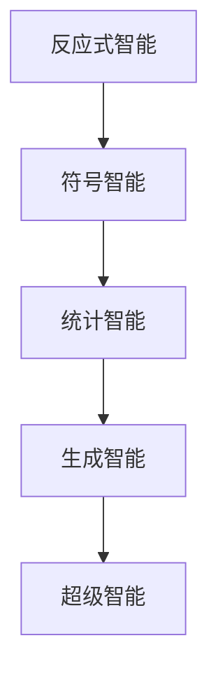

### 1.2.3 超级智能的未来展望

超级智能的发展前景广阔。随着计算能力的提升和算法的优化，超级智能将在未来几十年内实现重大突破。它将不仅改变技术领域，也将深刻影响经济、教育、医疗等多个领域。

## 第二部分：超级智能技术基础

### 第2章 超级智能的核心技术

#### 2.1 人工智能与机器学习基础

##### 2.1.1 机器学习的基本概念

机器学习是人工智能的核心技术之一。它通过算法从数据中学习规律，实现自动化决策和预测。

- **监督学习**：有标注的数据进行训练，用于分类和回归任务。
- **无监督学习**：没有标注的数据进行训练，用于聚类和降维等任务。
- **强化学习**：通过与环境的交互学习最佳策略，常用于决策问题。

##### 2.1.2 常见机器学习算法介绍

- **线性回归**：用于预测连续值。
- **逻辑回归**：用于分类问题。
- **支持向量机**：用于分类和回归。
- **神经网络**：用于复杂函数建模和分类。

### 2.2 自然语言处理技术

##### 2.2.1 语言模型与文本分析

自然语言处理（NLP）是AI的重要分支，旨在使计算机理解和生成自然语言。

- **语言模型**：用于预测下一个单词或词组。
- **文本分类**：将文本分为不同的类别。
- **情感分析**：判断文本的情感倾向。

##### 2.2.2 机器翻译与语音识别技术

机器翻译和语音识别是NLP的典型应用。

- **机器翻译**：将一种语言的文本翻译成另一种语言。
- **语音识别**：将语音信号转换为文本。

### 2.3 超级智能的进阶技术

##### 2.3.1 强化学习与深度强化学习

强化学习是机器学习中的一种重要方法，特别适合于动态决策环境。

- **Q-Learning**：一种简单的强化学习算法。
- **深度强化学习**：结合深度神经网络，用于解决更复杂的决策问题。

##### 2.3.2 自适应系统与智能决策

自适应系统能够根据环境变化调整自身行为。

- **进化算法**：基于自然进化原理的优化方法。
- **多代理系统**：多个智能体协作完成任务。

### 图2.1 机器学习算法分类
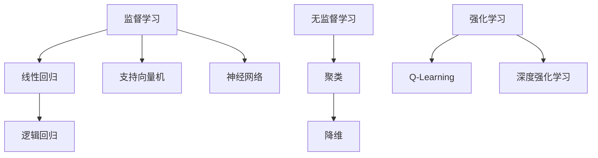

### 图2.2 强化学习与深度强化学习
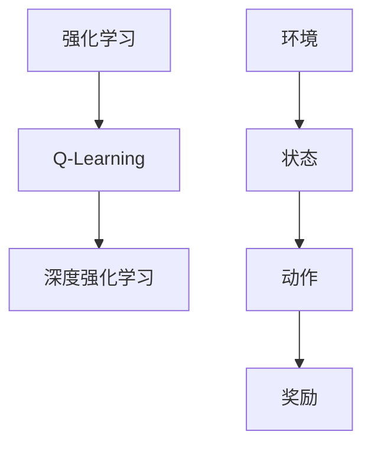

## 第三部分：超级智能应用场景

### 第3章 超级智能在商业领域的应用

#### 3.1 超级智能在金融领域的应用

##### 3.1.1 金融市场预测与风险管理

超级智能在金融市场预测方面具有显著优势。通过分析大量历史数据，它可以预测市场的走势，帮助投资者做出更明智的决策。

- **预测模型**：使用机器学习算法构建预测模型。
- **风险管理**：通过风险评估模型，降低金融风险。

##### 3.1.2 信用评估与风险评估

超级智能可以用于信用评估，通过分析个人的信用历史和行为模式，预测其信用风险。

- **信用评分模型**：基于历史数据，评估信用风险。
- **动态风险评估**：实时监测信用状况，调整信用评分。

#### 3.2 超级智能在医疗健康领域的应用

##### 3.2.1 疾病诊断与辅助治疗

超级智能在医疗领域有着广泛的应用，如疾病诊断和辅助治疗。

- **影像分析**：通过深度学习算法，分析医学影像，辅助诊断。
- **药物研发**：利用超级智能进行药物筛选和临床试验设计。

##### 3.2.2 药物研发与智能医疗

超级智能在药物研发中扮演着重要角色，通过模拟和预测药物的作用机制，加速新药的研发。

- **分子模拟**：通过计算模拟，研究药物与生物分子的相互作用。
- **临床研究**：利用大数据分析，优化临床试验设计。

### 图3.1 超级智能在金融领域的应用架构
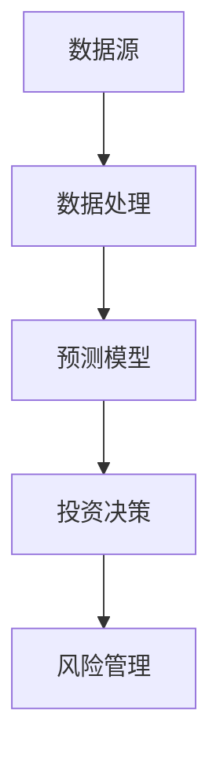

### 图3.2 超级智能在医疗健康领域的应用架构
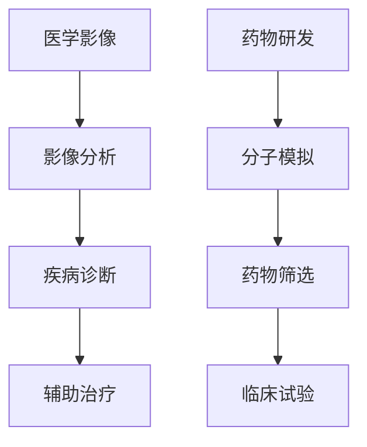

## 第四部分：超级智能在社会治理与公共安全领域的应用

### 第4章 超级智能在社会治理与公共安全领域的应用

#### 4.1 超级智能在公共安全领域的应用

##### 4.1.1 网络安全与威胁检测

超级智能在网络安全中发挥着重要作用，通过分析网络流量和行为模式，可以及时发现和应对网络威胁。

- **威胁检测**：使用机器学习算法检测异常行为。
- **入侵防御**：建立自动化防御系统，抵御网络攻击。

##### 4.1.2 智能监控与视频分析

超级智能可以在公共安全监控中实现智能化的监控和预警。

- **视频分析**：通过图像识别技术，实时分析监控视频。
- **行为识别**：检测异常行为，如暴力事件或犯罪活动。

#### 4.2 超级智能在城市管理与交通领域的应用

##### 4.2.1 城市规划与交通流量优化

超级智能可以用于城市规划，通过数据分析和模拟，优化城市布局和交通流量。

- **交通流量分析**：通过实时数据，分析交通状况。
- **城市规划**：基于数据分析，优化城市规划方案。

##### 4.2.2 智能交通系统与无人驾驶技术

智能交通系统和无人驾驶技术是超级智能在城市管理中的典型应用。

- **智能交通系统**：通过传感器和数据交换，实现交通的智能化管理。
- **无人驾驶技术**：利用深度学习和传感器，实现车辆的自主驾驶。

### 图4.1 超级智能在公共安全领域的应用架构
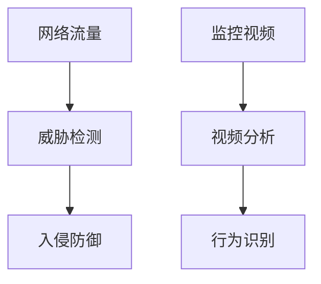

### 图4.2 超级智能在城市管理与交通领域的应用架构
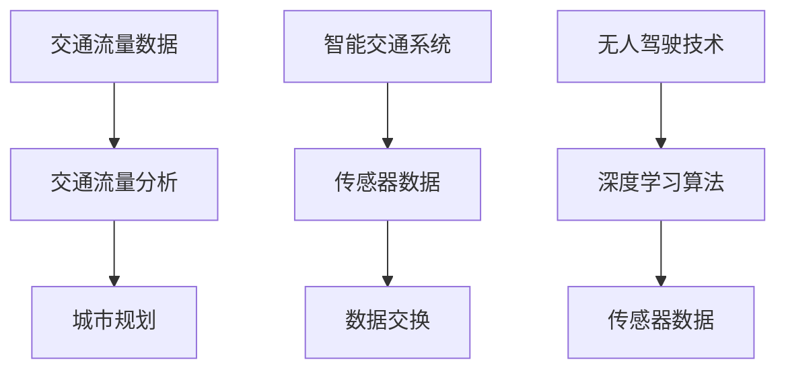

## 第五部分：超级智能伦理与社会挑战

### 第5章 超级智能伦理问题探讨

#### 5.1 超级智能对就业与经济的影响

##### 5.1.1 超级智能对劳动市场的影响

超级智能的发展将极大地改变劳动市场的结构。一方面，它将替代部分传统工作岗位，如制造业和客服等。另一方面，它也将创造新的就业机会，如超级智能系统的维护和开发。

##### 5.1.2 人工智能与经济伦理

人工智能的发展带来了经济伦理的问题。如何确保超级智能系统的公平性、透明性和安全性，避免对人类造成负面影响，成为亟待解决的问题。

#### 5.2 超级智能的安全与隐私问题

##### 5.2.1 人工智能安全与保护机制

随着超级智能系统的普及，其安全性和保护机制也变得尤为重要。需要建立完善的安全框架，防止恶意攻击和数据泄露。

##### 5.2.2 数据隐私与保护策略

超级智能系统通常需要处理大量的个人数据，如何保护这些数据的安全和隐私，成为重要的伦理问题。需要制定严格的数据保护策略，确保个人隐私不被侵犯。

### 图5.1 超级智能对劳动市场的影响
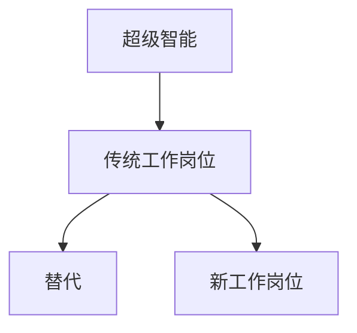

### 图5.2 人工智能安全与保护机制
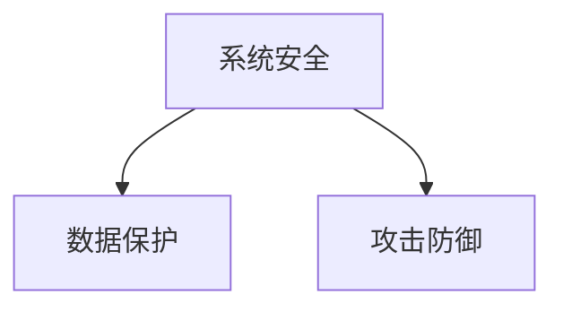

## 第六部分：超级智能的未来发展趋势

### 第6章 超级智能的未来趋势与展望

#### 6.1 超级智能的发展现状与趋势

超级智能技术已经取得了显著的进展，未来将继续在多个领域实现突破。随着计算能力的提升和算法的优化，超级智能将在未来几十年内实现更广泛的应用。

#### 6.1.1 超级智能技术的最新进展

- **深度学习**：在图像识别、语音识别等领域取得了突破性进展。
- **强化学习**：在游戏、自动驾驶等领域展现了强大的潜力。
- **自然语言处理**：在语言理解、机器翻译等领域实现了高度准确性。

#### 6.1.2 超级智能的未来应用领域

超级智能将在未来广泛应用于医疗、金融、教育、交通等多个领域，推动社会的发展和进步。

### 6.2 超级智能的发展挑战与应对策略

尽管超级智能具有巨大的潜力，但其在发展过程中也面临着诸多挑战。

#### 6.2.1 技术挑战与突破方向

- **算法优化**：提升算法的效率和准确性，减少计算资源的需求。
- **硬件升级**：开发更高效的硬件，如量子计算机，以支持超级智能的运行。

#### 6.2.2 社会挑战与伦理规范

- **伦理规范**：制定明确的法律和伦理规范，确保超级智能的发展符合人类的利益。
- **公平性**：确保超级智能系统不会加剧社会不平等，保障所有人的权益。

### 图6.1 超级智能技术的发展现状与趋势
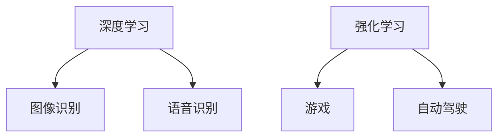

### 图6.2 超级智能的社会挑战与伦理规范
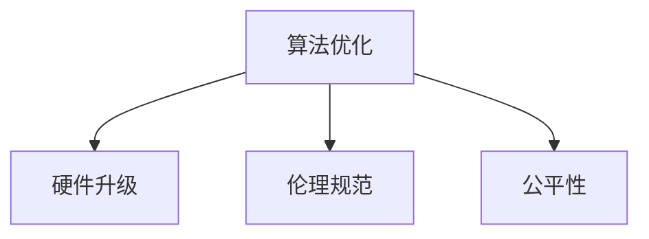

## 第七部分：超级智能案例研究

### 第7章 超级智能典型应用案例分析

#### 7.1 案例一：智能客服系统的设计与实现

##### 7.1.1 系统架构与关键技术

智能客服系统通常由前端交互层、后端服务层和智能决策层组成。

- **前端交互层**：提供用户与系统交互的接口，如网页、APP等。
- **后端服务层**：处理用户请求，调用相应的业务逻辑。
- **智能决策层**：使用机器学习和自然语言处理技术，实现智能问答和情感分析。

##### 7.1.2 实际应用效果与评估

智能客服系统在提高客户服务效率和满意度方面取得了显著效果。通过对大量用户数据的分析，系统可以不断优化自身性能，提供更个性化的服务。

### 图7.1 智能客服系统的架构
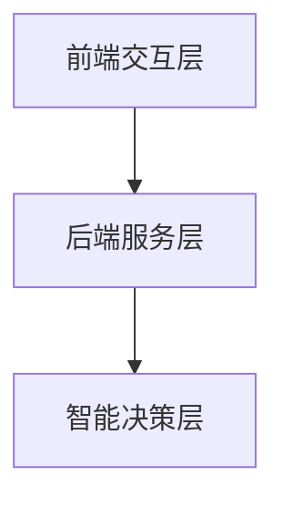

### 7.2 案例二：智能交通系统的开发与应用

##### 7.2.1 系统设计与开发流程

智能交通系统包括数据采集、数据处理、决策控制和执行监控等多个环节。

- **数据采集**：通过传感器和摄像头收集交通数据。
- **数据处理**：使用机器学习算法分析交通数据，识别交通状况。
- **决策控制**：根据交通状况，制定最优的交通控制策略。
- **执行监控**：实时监控交通系统的运行效果，调整控制策略。

##### 7.2.2 应用场景与效果分析

智能交通系统在交通流量优化、交通事故预警和应急响应等方面取得了显著效果，提高了交通效率和安全性。

### 图7.2 智能交通系统的设计与开发流程
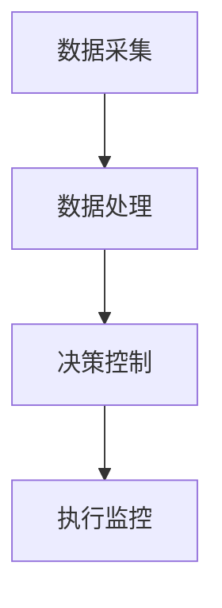

### 附录

## 附录 A：超级智能技术资源与工具

### A.1 常用深度学习框架介绍

- **TensorFlow**：谷歌开发的开源深度学习框架，广泛应用于各种深度学习任务。
- **PyTorch**：基于Python的开源深度学习框架，特别适合于研究者和开发者。
- **Keras**：Python编写的深度学习库，提供了易于使用的API。

### A.2 超级智能相关的开源工具和平台

- **OpenAI**：开源的人工智能研究机构，提供了一系列开源工具和模型。
- **AI Challenger**：提供大规模人工智能竞赛数据集和工具。
- **AI-Kit**：集成了多种深度学习算法和工具，方便开发者快速构建智能系统。

### A.3 学习资源与参考资料推荐

- **《深度学习》（Deep Learning）**：由Ian Goodfellow等人编写的深度学习经典教材。
- **《自然语言处理综论》（Speech and Language Processing）**：由Daniel Jurafsky和James H. Martin编写的NLP经典教材。
- **《超级智能》（Superintelligence）：作者Nick Bostrom，探讨了超级智能的潜在影响和伦理问题。

## 作者信息

作者：AI天才研究院/AI Genius Institute & 禅与计算机程序设计艺术 /Zen And The Art of Computer Programming

