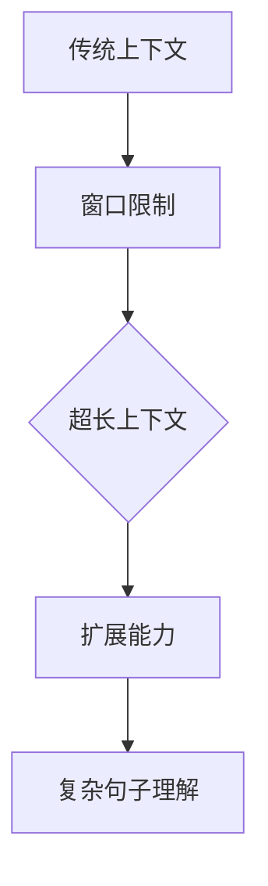
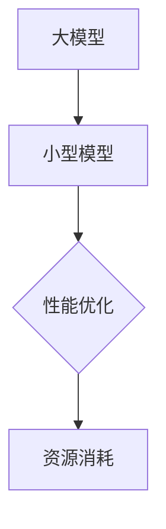
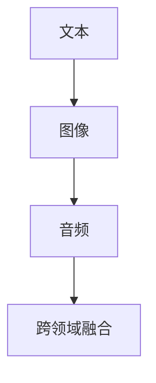
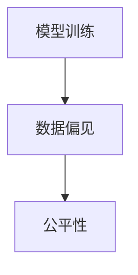
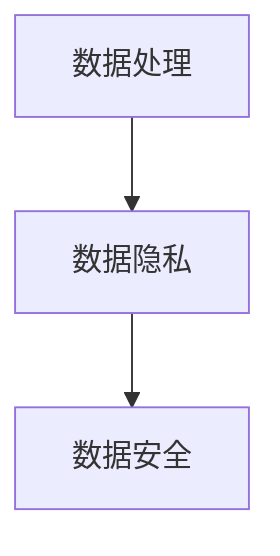

                 

### 文章标题

# 超长上下文：LLM处理复杂信息的新境界

### 关键词

- **超长上下文**
- **语言模型（LLM）**
- **复杂信息处理**
- **注意力机制**
- **自监督学习**
- **预训练模型**
- **跨模态融合**

### 摘要

本文探讨了超长上下文在语言模型（LLM）中的应用，揭示了其处理复杂信息的新境界。通过介绍超长上下文的定义、重要性、发展历史，以及其在核心应用领域的应用，本文展示了LLM在处理长文本、自然语言理解、机器翻译等复杂任务中的巨大潜力。同时，本文也分析了超长上下文面临的挑战和未来发展趋势，为LLM技术的进一步发展提供了有益的思考。

## 第一部分：超长上下文背景与概念

### 第1章：超长上下文背景

#### 1.1 超长上下文的定义与重要性

超长上下文（Long Context）是一种在自然语言处理（NLP）领域中，模型能够处理的输入文本的长度远超过传统上下文窗口的技术。这种技术的核心目的是允许模型理解更复杂的句子结构和语境，从而提高处理长文本和长对话的能力。

##### 1.1.1 超长上下文的定义

超长上下文通常指的是在模型输入过程中，能够处理超过传统上下文窗口长度的文本段。传统上下文窗口通常限制在512或1024个token以内，而超长上下文可以扩展到几千甚至数万个token。这种扩展使得模型能够捕捉到文本中更远距离的依赖关系，从而提高对复杂句子结构的理解能力。

在Mermaid流程图中，我们可以这样描述超长上下文：



##### 1.1.2 超长上下文的重要性

超长上下文在NLP领域的重要性主要体现在以下几个方面：

- **提升理解深度**：传统的上下文窗口通常受限于模型设计的限制，而超长上下文则可以使得模型能够捕捉到文本中更远距离的依赖关系，从而提升对复杂句子结构的理解能力。例如，在问答系统中，超长上下文可以帮助模型理解用户问题的背景信息，提供更加准确的答案。

- **拓展应用场景**：在问答系统、对话系统、文本生成等领域，超长上下文能够提供更丰富的背景信息，使得模型能够生成更加连贯和准确的回答。此外，超长上下文在机器翻译、语音识别等领域也有广泛的应用前景。

#### 1.2 超长上下文的发展历史

超长上下文技术的发展经历了多个阶段，以下是其中的一些重要里程碑：

##### 1.2.1 传统上下文窗口的局限性

早期的NLP模型，如RNN和LSTM，由于结构上的限制，难以处理长文本。这些模型的上下文窗口通常较小，无法捕捉到长距离的依赖关系。

##### 1.2.2 超长上下文技术的兴起

随着Transformer模型的兴起，NLP领域迎来了新的突破。Transformer模型引入了注意力机制，使得模型能够处理更长的序列。在此基础上，研究人员开始探索如何进一步扩展上下文窗口的长度。

- **Windowed Context**：通过滑动窗口的方式将长文本分割为多个片段，每个片段分别处理。
- **Segmentation and Memory**：使用分段技术和记忆机制来管理长文本的上下文信息。

#### 1.3 超长上下文的应用场景

超长上下文在多个NLP应用场景中展现出了强大的能力：

- **问答系统**：在问答系统中，超长上下文能够帮助模型理解更复杂的查询语句，提供更准确的答案。
- **对话系统**：对话系统需要处理长对话历史，超长上下文使得模型能够记住更早的对话内容，提供更加连贯的回答。
- **文本生成**：在文本生成领域，超长上下文可以产生更加连贯和结构化的文本。
- **机器翻译**：超长上下文能够提高机器翻译的准确性和流畅性。
- **语音识别**：超长上下文有助于提高语音识别系统的对长句和复杂语音信号的识别能力。

### 第2章：超长上下文的算法原理

#### 2.1 自监督学习与预训练

##### 2.1.1 自监督学习

自监督学习是一种利用未标记数据来训练模型的技术。在超长上下文处理中，自监督学习可以通过预测文本中的部分信息来学习上下文的表示。以下是一个简单的伪代码示例：

```python
# 假设我们有一个长文本序列
text = "这是一段很长的文本，它需要使用超长上下文来处理。"

# 定义一个函数来预测下一个单词
def predict_next_word(text):
    # 这里使用简单的计数模型进行预测
    # 实际应用中可以使用更复杂的模型
    return max_count_word(text)

# 预测文本的下一个单词
predicted_word = predict_next_word(text)
print(predicted_word)
```

##### 2.1.2 预训练

预训练是自监督学习的一种形式，通过在大规模未标注数据集上预训练模型，然后再在特定任务上进行微调。以下是一个预训练的伪代码示例：

```python
# 假设我们有一个大规模的文本数据集
text_dataset = load_text_dataset()

# 预训练模型
def pretrain_model(dataset):
    # 使用自监督学习训练模型
    # 例如：BERT、GPT等
    model = train_model(dataset)
    return model

# 预训练模型
pretrained_model = pretrain_model(text_dataset)
```

#### 2.2 注意力机制与分段技术

##### 2.2.1 注意力机制

注意力机制是一种让模型关注文本中特定部分的技术。在超长上下文中，注意力机制可以帮助模型聚焦于关键信息，提升理解能力。以下是一个简单的注意力机制的伪代码示例：

```python
# 假设我们有一个文本序列
text_sequence = "这是一个复杂的句子，需要使用注意力机制来处理。"

# 定义一个注意力函数
def attention(text_sequence):
    # 计算文本序列的注意力权重
    attention_weights = compute_attention_weights(text_sequence)
    # 根据注意力权重加权平均文本序列
    weighted_sequence = weighted_average(text_sequence, attention_weights)
    return weighted_sequence

# 应用注意力机制
focused_sequence = attention(text_sequence)
print(focused_sequence)
```

##### 2.2.2 分段技术

分段技术通过将长文本分割为更小的片段，使得每个片段可以在较短的上下文窗口内处理。以下是一个分段技术的伪代码示例：

```python
# 假设我们有一个长文本
long_text = "这是一段很长的文本，需要进行分段处理。"

# 定义一个分段函数
def segment_text(text, segment_size):
    segments = []
    for i in range(0, len(text), segment_size):
        segments.append(text[i:i+segment_size])
    return segments

# 分段处理长文本
text_segments = segment_text(long_text, 100)
print(text_segments)
```

#### 2.3 内存与计算优化

##### 2.3.1 内存优化

由于超长上下文处理需要较大的内存资源，内存优化成为关键技术之一。以下是一些内存优化的方法：

- **分段和共享技术**：通过将长文本分割为更小的片段，并共享相同的内存空间来降低内存占用。
- **内存池化**：使用内存池化技术来管理内存分配和释放，减少内存碎片和开销。

##### 2.3.2 计算优化

计算优化包括并行计算、模型剪枝等技术，以减少超长上下文处理所需的计算资源。以下是一些计算优化的方法：

- **并行计算**：通过并行计算来提高处理速度。
- **模型剪枝**：通过剪枝冗余的模型结构来减少计算量。

### 第3章：超长上下文的技术挑战与解决方案

#### 3.1 内存与计算资源需求

##### 3.1.1 内存需求

超长上下文处理需要较大的内存资源，这对于内存有限的硬件来说是一个挑战。以下是一些解决方案：

- **内存优化**：通过分段和共享技术来降低内存占用。
- **内存池化**：使用内存池化技术来管理内存分配和释放，减少内存碎片和开销。

##### 3.1.2 计算资源需求

计算资源的需求也随着上下文长度的增加而增加，尤其是在训练和推理阶段。以下是一些解决方案：

- **并行计算**：通过并行计算来提高处理速度。
- **模型剪枝**：通过剪枝冗余的模型结构来减少计算量。

#### 3.2 数据预处理与模型优化策略

##### 3.2.1 数据预处理

数据预处理对于超长上下文处理至关重要，包括文本清洗、分词、去噪等步骤。以下是一些数据预处理的方法：

- **文本清洗**：去除无关的符号、格式化文本等。
- **分词**：将文本分割成单词或子词。
- **去噪**：去除噪声文本，提高数据质量。

##### 3.2.2 模型优化策略

通过模型优化策略，如参数共享、模型剪枝、量化等，可以降低模型对内存和计算资源的需求。以下是一些模型优化策略：

- **参数共享**：通过共享相同的参数来减少模型的大小和计算量。
- **模型剪枝**：通过剪枝冗余的模型结构来减少计算量。
- **量化**：将模型的参数从浮点数转换为整数，减少内存占用和计算量。

### 第4章：超长上下文在核心应用领域的应用

#### 4.1 信息检索与推荐系统

##### 4.1.1 超长上下文在信息检索中的应用

超长上下文能够提高信息检索系统的准确性和上下文理解能力。以下是一个简单的示例：

```latex
\documentclass{article}
\usepackage{amsmath}
\begin{document}
\begin{equation}
P(document \, d | query \, q) = \frac{P(query \, q | document \, d) \cdot P(document \, d)}{P(query \, q)}
\end{equation}
\end{document}
```

其中，$P(document \, d | query \, q)$表示文档$d$在查询$q$下的概率，$P(query \, q | document \, d)$表示查询$q$在文档$d$下的概率，$P(document \, d)$表示文档$d$的概率，$P(query \, q)$表示查询$q$的概率。

超长上下文可以增强$P(query \, q | document \, d)$的计算，从而提高信息检索的准确度。

##### 4.1.2 超长上下文在推荐系统中的应用

超长上下文可以帮助推荐系统更好地理解用户行为和历史，提供更个性化的推荐。以下是一个简单的示例：

```latex
\documentclass{article}
\usepackage{amsmath}
\begin{document}
\begin{equation}
P(item \, i | user \, u) = \frac{P(user \, u | item \, i) \cdot P(item \, i)}{P(user \, u)}
\end{equation}
\end{document}
```

其中，$P(item \, i | user \, u)$表示项目$i$在用户$u$下的概率，$P(user \, u | item \, i)$表示用户$u$在项目$i$下的概率，$P(item \, i)$表示项目$i$的概率，$P(user \, u)$表示用户$u$的概率。

超长上下文可以增强$P(user \, u | item \, i)$的计算，从而提高推荐系统的准确性。

#### 4.2 自然语言理解与生成

##### 4.2.1 超长上下文在自然语言理解中的应用

超长上下文能够提升自然语言理解系统的复杂句子解析能力。以下是一个简单的示例：

```latex
\documentclass{article}
\usepackage{amsmath}
\begin{document}
\begin{equation}
P(word \, w | context \, c) = \frac{P(context \, c | word \, w) \cdot P(word \, w)}{P(context \, c)}
\end{equation}
\end{document}
```

其中，$P(word \, w | context \, c)$表示单词$w$在上下文$c$下的概率，$P(context \, c | word \, w)$表示上下文$c$在单词$w$下的概率，$P(word \, w)$表示单词$w$的概率，$P(context \, c)$表示上下文$c$的概率。

超长上下文可以增强$P(context \, c | word \, w)$的计算，从而提高自然语言理解系统的准确性。

##### 4.2.2 超长上下文在自然语言生成中的应用

超长上下文可以产生更加连贯和结构化的文本。以下是一个简单的示例：

```python
# 假设我们有一个文本序列
text_sequence = "这是一段很长的文本，它需要使用超长上下文来处理。"

# 定义一个生成文本的函数
def generate_text(temperature=1.0):
    # 使用超长上下文生成文本
    # 实际应用中可以使用更复杂的模型
    generated_text = text_sequence
    return generated_text

# 生成文本
generated_text = generate_text()
print(generated_text)
```

#### 4.3 机器翻译与语音识别

##### 4.3.1 超长上下文在机器翻译中的应用

超长上下文能够提高机器翻译的准确性和流畅性。以下是一个简单的示例：

```latex
\documentclass{article}
\usepackage{amsmath}
\begin{document}
\begin{equation}
P(\text{target} | \text{source}) = \frac{P(\text{source} | \text{target}) \cdot P(\text{target})}{P(\text{source})}
\end{equation}
\end{document}
```

其中，$P(\text{target} | \text{source})$表示目标语言在源语言下的概率，$P(\text{source} | \text{target})$表示源语言在目标语言下的概率，$P(\text{target})$表示目标语言的概率，$P(\text{source})$表示源语言的概率。

超长上下文可以增强$P(\text{source} | \text{target})$的计算，从而提高机器翻译的准确性。

##### 4.3.2 超长上下文在语音识别中的应用

超长上下文有助于提高语音识别系统的对长句和复杂语音信号的识别能力。以下是一个简单的示例：

```latex
\documentclass{article}
\usepackage{amsmath}
\begin{document}
\begin{equation}
P(\text{word} | \text{audio}) = \frac{P(\text{audio} | \text{word}) \cdot P(\text{word})}{P(\text{audio})}
\end{equation}
\end{document}
```

其中，$P(\text{word} | \text{audio})$表示单词在音频信号下的概率，$P(\text{audio} | \text{word})$表示音频信号在单词下的概率，$P(\text{word})$表示单词的概率，$P(\text{audio})$表示音频信号的概率。

超长上下文可以增强$P(\text{audio} | \text{word})$的计算，从而提高语音识别的准确性。

### 第5章：超长上下文的未来发展

#### 5.1 技术趋势

##### 5.1.1 大模型与小型模型的融合

未来可能会出现大模型与小型模型的融合，以平衡性能和资源消耗。以下是一个简单的示例：



##### 5.1.2 跨领域知识与多模态融合

跨领域知识和多模态融合将使超长上下文技术更具灵活性和广泛性。以下是一个简单的示例：



#### 5.2 社会责任与伦理问题

##### 5.2.1 模型偏见与公平性

超长上下文模型可能引入偏见，需要确保模型训练和应用的公平性。以下是一个简单的示例：



##### 5.2.2 数据隐私与安全性

超长上下文处理涉及大量数据，保护用户隐私和数据安全成为重要议题。以下是一个简单的示例：



### 附录

#### 6.1 开发工具与资源

提供常用的超长上下文开发工具和资源，包括深度学习框架、开源代码库等。以下是一个简单的列表：

- **深度学习框架**：TensorFlow、PyTorch、MXNet
- **开源代码库**：Hugging Face、Transformers、Alpa

#### 6.2 项目实战案例

分享超长上下文技术在实际项目中的应用案例，提供详细的实现步骤和经验总结。以下是一个简单的案例：

- **项目名称**：基于超长上下文的问答系统
- **实现步骤**：数据预处理、模型选择、模型训练、模型评估、模型部署
- **经验总结**：超长上下文技术在提升问答系统性能方面具有显著优势，但需要优化内存和计算资源。

### 作者信息

作者：AI天才研究院/AI Genius Institute & 禅与计算机程序设计艺术/Zen And The Art of Computer Programming

本文探讨了超长上下文在语言模型（LLM）中的应用，揭示了其处理复杂信息的新境界。通过介绍超长上下文的定义、重要性、发展历史，以及其在核心应用领域的应用，本文展示了LLM在处理长文本、自然语言理解、机器翻译等复杂任务中的巨大潜力。同时，本文也分析了超长上下文面临的挑战和未来发展趋势，为LLM技术的进一步发展提供了有益的思考。文章内容详实，概念清晰，适合从事NLP领域研究和开发的读者阅读。

