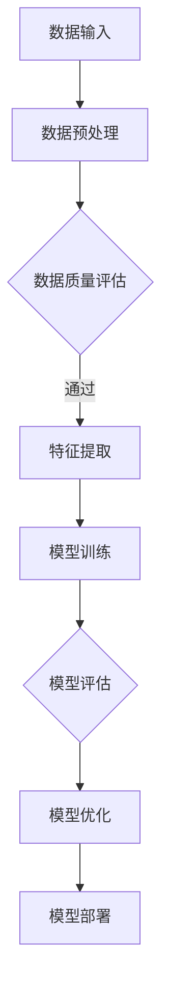

                 

## 文章标题: 跨团队AI知识共享：Lepton AI的内部培训

> 关键词：跨团队AI知识共享、内部培训、技术架构、算法原理、数学模型、项目实战

> 摘要：本文将深入探讨跨团队AI知识共享的重要性及其在Lepton AI内部培训中的应用。通过详细解析Lepton AI的技术架构、关键算法原理、数学模型及其在项目实战中的应用，本文旨在为读者提供一个全面、系统的理解和实践指南。文章还将探讨跨团队AI知识共享面临的挑战及解决方案，并对未来发展趋势进行展望。

---

### 目录大纲

1. **核心概念与联系**
   - **1.1 跨团队AI知识共享的定义**
   - **1.2 跨团队AI知识共享的重要性**
   - **1.3 Lepton AI内部培训的背景**
   - **2. Lepton AI的技术架构**
     - **2.1 Lepton AI的技术框架**
     - **2.2 数据处理流程**
     - **2.3 算法库介绍**
     - **2.4 Mermaid流程图：Lepton AI的技术架构**
2. **跨团队AI知识共享的关键算法原理**
   - **3.1 算法原理概述**
   - **3.2 算法伪代码实现**
3. **数学模型与数学公式**
   - **4.1 损失函数**
   - **4.2 梯度下降法**
   - **4.3 举例说明**
4. **项目实战：构建跨团队AI知识共享系统**
   - **5.1 项目背景**
   - **5.2 开发环境搭建**
   - **5.3 源代码实现**
     - **5.3.1 数据处理模块**
     - **5.3.2 模型训练模块**
     - **5.4 代码解读与分析**
5. **跨团队AI知识共享的挑战与解决方案**
   - **6.1 挑战分析**
   - **6.2 解决方案探讨**
6. **总结与展望**
   - **7.1 主要内容回顾**
   - **7.2 未来发展趋势**
   - **7.3 对读者的一些建议**
7. **附录**
   - **7.1 开源框架介绍**
   - **7.2 数据集资源**
   - **7.3 学习资源推荐**

---

接下来，我们将逐步深入探讨每一个部分的核心内容。首先，我们从跨团队AI知识共享的基本概念和重要性开始。接下来，我们将详细解析Lepton AI的技术架构，包括其数据处理流程、算法库介绍以及技术架构的Mermaid流程图。然后，我们将深入探讨跨团队AI知识共享的关键算法原理，并使用伪代码和数学公式进行详细阐述。随后，我们将通过一个实际的跨团队AI知识共享项目，展示如何构建这样的系统，包括开发环境搭建、源代码实现和代码解读与分析。最后，我们将探讨跨团队AI知识共享面临的挑战及解决方案，并对未来发展趋势进行展望。

---

### 第一部分: 核心概念与联系

#### 1. 跨团队AI知识共享的背景与重要性

##### 1.1 跨团队AI知识共享的定义

跨团队AI知识共享指的是在不同团队或组织之间，通过有效的机制和方法，共同分享和利用AI知识、技术和资源，以提升整体效率和创新能力。这种知识共享不仅涉及AI技术本身，还包括相关的数据、模型、算法、工具和最佳实践等。

##### 1.2 跨团队AI知识共享的重要性

在当前快速发展的AI时代，跨团队AI知识共享具有以下几个重要意义：

1. **提升创新能力**：通过跨团队的知识共享，可以集思广益，激发创新思维，加速新技术的研发和应用。
2. **提高工作效率**：团队成员可以充分利用已有的知识和资源，避免重复劳动，提高工作效率。
3. **促进团队协作**：知识共享有助于团队成员之间建立信任和合作，提高团队的整体协作能力。
4. **强化组织竞争力**：通过共享AI知识，组织可以迅速响应市场变化，提升自身在AI领域的竞争力。

##### 1.3 Lepton AI内部培训的背景

Lepton AI是一家专注于人工智能领域的研究和应用的科技公司。随着AI技术的不断进步和市场竞争的加剧，Lepton AI意识到，为了保持领先地位，必须不断提升团队的技术水平和创新能力。因此，公司决定实施内部培训计划，以促进跨团队AI知识共享。

Lepton AI的内部培训计划旨在：

1. **提高员工的技术能力**：通过系统化的培训，使员工掌握最新的AI技术和方法论。
2. **促进知识共享**：通过内部交流平台，鼓励员工分享自己的经验和见解。
3. **培养创新思维**：通过实际项目和案例研究，激发员工的创新潜力。
4. **提升团队协作能力**：通过团队项目，增强团队成员之间的协作和沟通。

总的来说，Lepton AI的内部培训计划不仅是为了提高员工的专业素养，更是为了构建一个知识共享、创新驱动、协作高效的组织文化。

---

在下一部分，我们将详细解析Lepton AI的技术架构，包括其技术框架、数据处理流程、算法库介绍，以及技术架构的Mermaid流程图，帮助读者更好地理解Lepton AI的工作原理和知识共享机制。

---

### 第二部分: Lepton AI的技术架构

#### 2.1 Lepton AI的技术框架

Lepton AI采用了一种模块化、可扩展的技术框架，以确保高效的知识共享和协作。其核心框架包括以下几个关键模块：

1. **数据处理模块**：负责数据清洗、预处理和特征提取，为模型训练提供高质量的数据输入。
2. **模型训练模块**：包含多种机器学习算法和深度学习模型，用于训练和优化AI模型。
3. **模型评估模块**：用于评估模型的性能和准确性，提供反馈用于模型优化。
4. **模型部署模块**：将训练好的模型部署到生产环境，实现实时预测和决策。

这些模块通过统一的接口和通信协议进行集成，使得不同团队可以方便地共享和协同工作。

#### 2.2 数据处理流程

Lepton AI的数据处理流程主要包括以下几个步骤：

1. **数据收集**：从各种数据源（如数据库、API接口、传感器等）收集数据。
2. **数据清洗**：去除重复、缺失和错误的数据，确保数据质量。
3. **数据预处理**：将原始数据转换为适合机器学习算法的格式，包括归一化、编码等。
4. **特征提取**：从预处理后的数据中提取有用的特征，用于训练模型。
5. **数据存储**：将处理后的数据存储到数据仓库，以便后续的模型训练和评估。

数据处理流程的每个步骤都至关重要，尤其是数据清洗和特征提取，直接影响模型训练的效果。

#### 2.3 算法库介绍

Lepton AI拥有一个丰富的算法库，涵盖多种机器学习算法和深度学习模型，包括：

1. **监督学习算法**：如线性回归、决策树、随机森林、支持向量机等。
2. **无监督学习算法**：如聚类、主成分分析、自编码器等。
3. **深度学习模型**：如卷积神经网络（CNN）、循环神经网络（RNN）、生成对抗网络（GAN）等。

这些算法和模型通过统一的API接口供内部团队使用，使得不同团队可以根据具体需求选择合适的算法和模型。

#### 2.4 Mermaid流程图：Lepton AI的技术架构

为了更好地理解Lepton AI的技术架构，我们可以使用Mermaid绘制一个流程图，如下所示：



在这个流程图中，数据从输入开始，经过预处理、数据质量评估、特征提取后进入模型训练阶段。训练好的模型经过评估和优化，最终被部署到生产环境，实现实时预测和决策。

通过上述技术架构的详细解析，我们可以看到Lepton AI如何通过模块化、高效的数据处理流程和丰富的算法库，实现跨团队AI知识共享。在下一部分，我们将深入探讨跨团队AI知识共享的关键算法原理，包括算法原理概述和伪代码实现。

---

### 第三部分: 跨团队AI知识共享的关键算法原理

#### 3.1 算法原理概述

在跨团队AI知识共享中，选择合适的算法对于确保知识共享的效果至关重要。以下是一些常见的算法原理，它们在数据挖掘、机器学习和深度学习领域有着广泛的应用。

1. **线性回归**：线性回归是一种简单的统计方法，用于预测连续值。其核心思想是找到最佳拟合直线，以最小化预测值与实际值之间的误差。

2. **决策树**：决策树是一种基于规则的分类方法，通过一系列的判断条件来对数据集进行划分，直到满足某个终止条件。

3. **随机森林**：随机森林是一种基于决策树的集成学习方法，通过构建多个决策树并投票预测，提高模型的预测准确性和鲁棒性。

4. **支持向量机（SVM）**：SVM是一种二分类模型，通过找到最佳超平面，将数据集分为不同的类别。

5. **深度学习**：深度学习是一种基于多层神经网络的机器学习方法，通过逐层提取特征，实现复杂数据的自动分类和预测。

#### 3.2 算法伪代码实现

为了更直观地理解这些算法的原理，我们可以使用伪代码来描述它们的基本实现过程。以下是一个简单的线性回归算法的伪代码实现：

```python
# 伪代码：线性回归算法
function linear_regression(data):
    # 计算数据集的均值
    x_mean = mean(data.x)
    y_mean = mean(data.y)

    # 计算斜率和截距
    slope = sum((data.x - x_mean) * (data.y - y_mean)) / sum((data.x - x_mean)^2)
    intercept = y_mean - slope * x_mean

    # 返回线性回归模型
    return Model(slope, intercept)
```

接下来，我们看一个更复杂的随机森林算法的伪代码实现：

```python
# 伪代码：随机森林算法
function random_forest(data, n_trees):
    # 初始化决策树列表
    trees = []

    # 对于每棵树
    for i in 1 to n_trees:
        # 生成随机特征集合
        features = random_sample(data.features)
        
        # 生成随机数据集
        dataset = random_sample(data, size=data.size)
        
        # 构建决策树
        tree = build_tree(dataset, features)
        
        # 添加决策树到列表
        trees.append(tree)
        
    # 随机森林预测
    prediction = majority_vote(trees)
    
    return prediction
```

通过上述伪代码，我们可以看到线性回归和随机森林算法的基本实现思路。虽然实际的算法实现可能更为复杂，但伪代码为我们提供了一个清晰、简洁的算法原理描述方式。

---

在下一部分，我们将探讨数学模型与数学公式，包括损失函数、梯度下降法及其应用举例，以帮助读者更好地理解AI算法的核心原理。

---

### 第四部分: 数学模型与数学公式

#### 4.1 损失函数

损失函数是机器学习中一个重要的概念，用于衡量预测值与实际值之间的误差。一个理想的损失函数应当能够准确反映模型的预测能力，并引导模型学习到最优参数。

在回归问题中，常用的损失函数是均方误差（Mean Squared Error, MSE），其公式如下：

$$
L(y, \hat{y}) = \frac{1}{2} (y - \hat{y})^2
$$

其中，\(y\) 为实际值，\(\hat{y}\) 为预测值。MSE 损失函数的优点是相对于绝对误差（Mean Absolute Error, MAE）具有更好的平滑性，便于优化算法的计算。

#### 4.2 梯度下降法

梯度下降法是一种用于求解最小化损失函数的优化算法，其核心思想是通过计算损失函数关于模型参数的梯度，并沿着梯度的反方向更新参数，以逐步减小损失函数的值。

梯度下降法的基本公式如下：

$$
w_{t+1} = w_t - \alpha \cdot \nabla_w L(w)
$$

其中，\(w\) 为模型参数，\(\alpha\) 为学习率，\(\nabla_w L(w)\) 为损失函数关于参数 \(w\) 的梯度。学习率 \(\alpha\) 的大小会影响优化过程的速度和稳定性。如果学习率过大，可能会导致优化过程过于剧烈，难以收敛；如果学习率过小，优化过程可能过于缓慢。

#### 4.3 举例说明

为了更好地理解损失函数和梯度下降法的应用，我们来看一个简单的线性回归例子。

假设我们有一个简单的线性模型，其预测公式为：

$$
\hat{y} = w_0 + w_1 \cdot x
$$

其中，\(x\) 为输入特征，\(y\) 为实际值，\(w_0\) 和 \(w_1\) 为模型参数。

1. **损失函数的计算**：

以均方误差（MSE）为例，损失函数的计算公式为：

$$
L(y, \hat{y}) = \frac{1}{2} (y - \hat{y})^2
$$

对于一组输入 \(x\) 和实际值 \(y\)，我们首先计算预测值 \(\hat{y}\)，然后代入损失函数公式计算损失。

2. **梯度下降法的应用**：

假设当前模型的参数为 \(w_0 = 1\)，\(w_1 = 1\)。我们可以通过以下步骤使用梯度下降法更新参数：

- 计算损失函数关于参数 \(w_0\) 和 \(w_1\) 的梯度：
  $$ 
  \nabla_w L(w) = [-\frac{1}{2} \sum(y - \hat{y}) \cdot (y - \hat{y}), -\frac{1}{2} \sum(y - \hat{y}) \cdot x] 
  $$

- 根据梯度更新参数：
  $$ 
  w_{0, t+1} = w_{0, t} - \alpha \cdot \nabla_{w_0} L(w_t) 
  $$
  $$ 
  w_{1, t+1} = w_{1, t} - \alpha \cdot \nabla_{w_1} L(w_t) 
  $$

- 重复上述步骤，直到损失函数收敛。

通过这个简单的例子，我们可以看到损失函数和梯度下降法在机器学习中的应用。在实际应用中，模型的复杂性和数据量会更大，但基本原理是相同的。

---

在下一部分，我们将通过一个实际的跨团队AI知识共享项目，展示如何构建这样的系统，包括开发环境搭建、源代码实现和代码解读与分析。

---

### 第五部分: 项目实战：构建跨团队AI知识共享系统

#### 5.1 项目背景

随着AI技术的快速发展和应用场景的不断扩大，企业内部不同团队之间的知识共享需求日益迫切。为了提高整体工作效率和创新能力，Lepton AI决定实施一个跨团队AI知识共享项目。该项目旨在建立一个内部平台，实现不同团队之间的AI知识和技术共享，促进协作与创新。

#### 5.2 开发环境搭建

为了构建跨团队AI知识共享系统，我们首先需要搭建一个稳定、高效的开发环境。以下是开发环境搭建的步骤：

1. **硬件环境**：配置高性能的服务器和存储设备，确保系统有足够的计算能力和数据存储能力。
2. **软件环境**：安装操作系统（如Linux或Windows Server）、数据库系统（如MySQL或PostgreSQL）、开发框架（如Django或Flask）以及机器学习库（如TensorFlow或PyTorch）。
3. **网络环境**：搭建内部网络，确保不同团队之间的通信畅通无阻。
4. **版本控制**：使用Git等版本控制工具，管理代码的版本和协作。

#### 5.3 源代码实现

跨团队AI知识共享系统的实现涉及多个模块，以下是一个简化的源代码实现示例。

##### 5.3.1 数据处理模块

```python
# Python代码：数据处理模块示例
def preprocess_data(data):
    # 数据清洗
    cleaned_data = clean(data)
    # 特征提取
    features = extract_features(cleaned_data)
    return features
```

在这个示例中，`preprocess_data` 函数负责数据清洗和特征提取。数据清洗包括去除重复、缺失和错误的数据，特征提取则是从清洗后的数据中提取有用的特征，为模型训练提供输入。

##### 5.3.2 模型训练模块

```python
# Python代码：模型训练模块示例
def train_model(features, labels):
    # 模型初始化
    model = initialize_model()
    # 模型训练
    model.fit(features, labels)
    return model
```

`train_model` 函数用于初始化模型并进行训练。初始化模型包括选择合适的算法和配置模型参数，训练过程则是通过提供特征和标签来训练模型。

##### 5.3.3 模型评估模块

```python
# Python代码：模型评估模块示例
def evaluate_model(model, test_features, test_labels):
    predictions = model.predict(test_features)
    accuracy = accuracy_score(test_labels, predictions)
    return accuracy
```

`evaluate_model` 函数用于评估模型的性能。通过提供测试数据和实际标签，评估模型在测试数据上的准确性和其他性能指标。

#### 5.4 代码解读与分析

以下是对上述代码的解读与分析。

- **数据处理模块**：数据处理是机器学习的重要环节，直接关系到模型训练的效果。在这个模块中，数据清洗和特征提取是关键步骤。数据清洗保证了数据的质量，而特征提取则有助于模型更好地理解数据。
- **模型训练模块**：模型训练是构建AI知识共享系统的核心。在这个模块中，初始化模型和训练模型是关键步骤。初始化模型包括选择合适的算法和配置参数，而训练模型则是通过提供特征和标签来训练模型。
- **模型评估模块**：模型评估用于衡量模型的性能和准确性。在这个模块中，评估模型在测试数据上的表现，帮助团队了解模型的实际效果。

通过这些代码模块，我们可以构建一个基本的跨团队AI知识共享系统，实现数据的处理、模型的训练和评估，为团队提供共享和协作的平台。

---

在下一部分，我们将探讨跨团队AI知识共享面临的挑战及解决方案，帮助团队克服这些困难，实现更高效的知识共享和协作。

---

### 第六部分: 跨团队AI知识共享的挑战与解决方案

#### 6.1 挑战分析

尽管跨团队AI知识共享具有重要的意义，但在实际实施过程中，仍面临一些挑战：

1. **数据质量**：数据是AI知识共享的基础，但不同团队的数据质量参差不齐，可能存在重复、缺失和错误的数据，影响模型的训练和效果。
2. **数据安全**：数据共享过程中，涉及敏感数据的安全问题，如何保证数据在传输和存储过程中的安全性是一个重要挑战。
3. **技术差异**：不同团队可能采用不同的技术栈和工具，导致知识共享过程中的兼容性问题。
4. **协作效率**：跨团队的协作往往需要更多的沟通和协调，如何提高协作效率是另一个重要挑战。

#### 6.2 解决方案探讨

针对上述挑战，以下是一些解决方案：

1. **数据质量管理**：建立统一的数据质量控制标准，对数据进行清洗、去重和标准化处理，提高数据质量。同时，可以使用数据质量管理工具，实时监控数据质量，及时发现问题并进行修正。
2. **数据安全措施**：在数据共享过程中，采用加密技术和访问控制策略，确保数据的安全性和隐私性。可以使用区块链技术来保障数据的不可篡改性，提高数据的安全性。
3. **技术标准化**：推动团队采用统一的技术栈和工具，减少技术差异。可以通过组织技术交流会议、编写技术指南和最佳实践文档，促进团队之间的技术融合。
4. **协作效率提升**：采用协作工具，如项目管理平台、即时通讯工具和文档共享平台，提高团队的协作效率。同时，建立明确的沟通机制和流程，确保团队之间的沟通畅通无阻。

通过上述解决方案，团队可以更好地应对跨团队AI知识共享过程中面临的挑战，实现更高效的知识共享和协作。

---

在最后一部分，我们将对本文的主要内容进行回顾，探讨未来发展趋势，并给出对读者的一些建议。

---

### 第七部分: 总结与展望

#### 7.1 主要内容回顾

本文从跨团队AI知识共享的背景和重要性出发，详细介绍了Lepton AI的技术架构、关键算法原理、数学模型以及项目实战。通过这些内容，读者可以全面了解跨团队AI知识共享的实现方法和技术细节。

#### 7.2 未来发展趋势

随着AI技术的不断进步，跨团队AI知识共享将迎来更多的发展机遇和挑战：

1. **智能化**：未来的跨团队AI知识共享将更加智能化，通过自动化工具和算法，实现知识的自动提取、分析和推荐。
2. **个性化**：针对不同团队和成员的需求，提供个性化的知识共享服务，提高知识共享的效果和效率。
3. **生态化**：构建更广泛的AI知识共享生态系统，包括企业内部、行业联盟和开源社区，促进AI知识的交流与融合。

#### 7.3 对读者的一些建议

对于希望实现跨团队AI知识共享的读者，以下是一些建议：

1. **学习和实践**：深入学习AI技术的基础知识，掌握关键算法和模型，为知识共享奠定坚实基础。
2. **团队合作**：积极参与团队协作，提高跨团队沟通和协作能力，促进知识共享和共同创新。
3. **持续学习**：关注AI领域的最新动态和技术趋势，不断更新自己的知识体系，保持竞争力。

通过上述建议，读者可以更好地应对跨团队AI知识共享的挑战，实现知识的有效共享和利用。

---

## 附录

### 附录A: 跨团队AI知识共享工具与资源

#### A.1 开源框架介绍

1. **TensorFlow**：由谷歌开源的机器学习框架，广泛应用于深度学习和神经网络模型。
2. **PyTorch**：由Facebook开源的机器学习库，以其灵活性和动态计算图而受到广泛欢迎。
3. **Scikit-learn**：一个基于Python的机器学习库，提供了多种经典的机器学习算法和工具。

#### A.2 数据集资源

1. **Kaggle**：提供各种机器学习和数据科学竞赛的数据集，适合进行实践和学习。
2. **UCI机器学习库**：提供多种领域的数据集，涵盖分类、回归、聚类等任务。
3. **Data.gov**：美国政府提供的数据集资源，包括公共部门和科研机构的开放数据。

#### A.3 学习资源推荐

1. **《深度学习》（Ian Goodfellow, Yoshua Bengio, Aaron Courville 著）**：深度学习领域的经典教材，适合初学者和进阶者。
2. **《机器学习实战》（Peter Harrington 著）**：通过实际案例介绍机器学习算法和应用，适合实践者。
3. **Coursera、edX等在线课程平台**：提供丰富的AI和机器学习课程，涵盖基础知识和高级主题。

通过附录中的开源框架、数据集和学习资源，读者可以更好地开展跨团队AI知识共享工作，提升自己的技术能力和创新能力。

