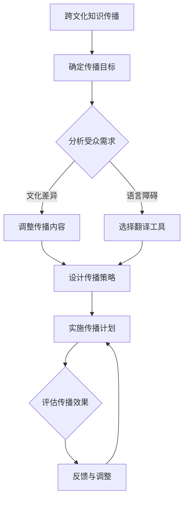
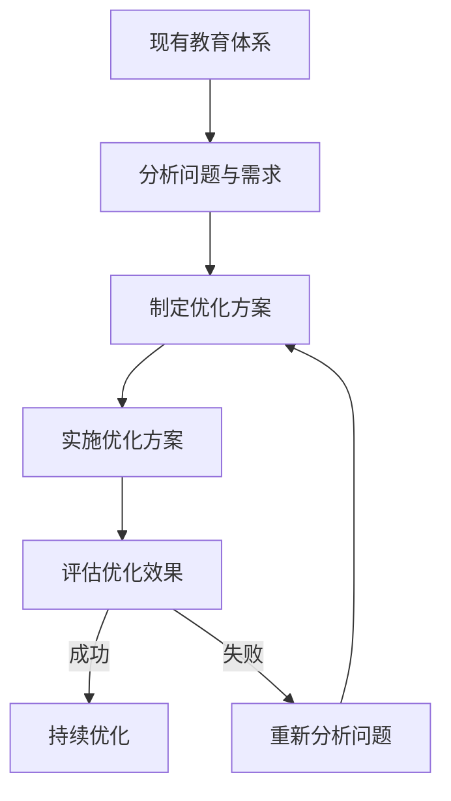
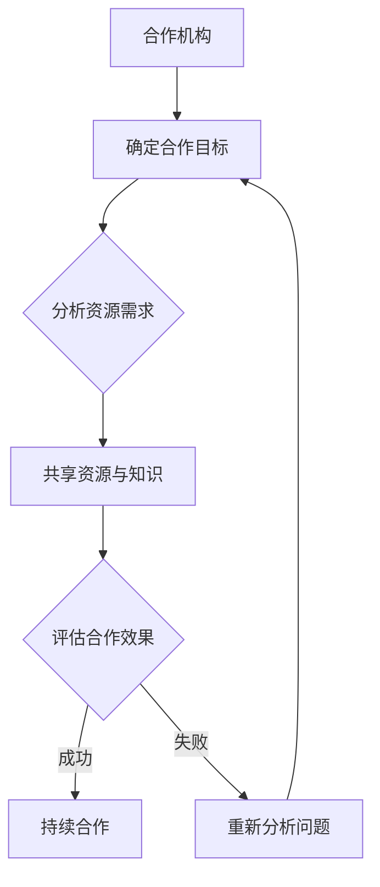

                 

### 文章标题

《跨文化知识传播的挑战与对策》

关键词：跨文化知识传播、文化差异、教育体系、技术手段、效果评估、可持续发展

摘要：本文旨在深入探讨跨文化知识传播面临的挑战与对策。通过分析跨文化知识传播的基本理论、挑战、策略和实践应用，提出一系列针对性的对策，以促进跨文化知识传播的可持续发展和全球化进程。

### 目录大纲

## 第一部分：跨文化知识传播的基本理论

### 第1章：跨文化知识传播概述

#### 1.1 跨文化知识传播的定义与重要性

#### 1.2 跨文化知识传播的理论框架

#### 1.3 跨文化知识传播的基本原则

### 第2章：跨文化知识传播的挑战

#### 2.1 文化差异与认知障碍

#### 2.2 语言障碍与翻译难题

#### 2.3 教育体系与文化认同

### 第3章：跨文化知识传播的策略

#### 3.1 教育体系优化策略

#### 3.2 多媒体传播策略

#### 3.3 跨国合作与资源共享

## 第二部分：跨文化知识传播的实践应用

### 第4章：跨文化知识传播的项目案例分析

#### 4.1 案例一：中国的孔子学院

#### 4.2 案例二：国际教育合作项目

#### 4.3 案例三：跨国企业知识共享

### 第5章：跨文化知识传播的技术手段

#### 5.1 在线教育与MOOC平台

#### 5.2 社交媒体与网络传播

#### 5.3 大数据和人工智能的应用

### 第6章：跨文化知识传播的效果评估

#### 6.1 传播效果的量化评估方法

#### 6.2 受众反馈与传播调整

#### 6.3 效果评估的案例分析

### 第7章：跨文化知识传播的未来发展趋势

#### 7.1 全球化背景下的知识传播

#### 7.2 新媒体时代的传播模式

#### 7.3 人工智能在跨文化知识传播中的应用前景

## 第三部分：跨文化知识传播的对策研究

### 第8章：跨文化知识传播的政策建议

#### 8.1 政府与教育机构的作用

#### 8.2 企业与社会组织的参与

#### 8.3 国际合作与交流的加强

### 第9章：跨文化知识传播的技术创新

#### 9.1 知识图谱与语义分析

#### 9.2 机器翻译与自然语言处理

#### 9.3 跨文化智能交互系统

### 第10章：跨文化知识传播的可持续发展

#### 10.1 可持续发展的概念与内涵

#### 10.2 跨文化知识传播的可持续发展路径

#### 10.3 案例研究：成功跨文化知识传播项目的可持续发展策略

## 附录

### 附录A：跨文化知识传播的相关资源与工具

#### A.1 跨文化知识传播研究资源

#### A.2 跨文化知识传播工具

#### A.3 跨文化知识传播的国际组织与机构

### 附录B：Mermaid流程图

#### B.1 跨文化知识传播流程图

#### B.2 教育体系优化流程图

#### B.3 跨国合作与资源共享流程图

### 附录C：代码案例

#### C.1 机器翻译代码案例

#### C.2 大数据分析代码案例

#### C.3 跨文化智能交互系统代码案例

### 附录D：参考文献

#### D.1 跨文化知识传播的相关书籍

#### D.2 跨文化知识传播的学术论文

#### D.3 跨文化知识传播的政策文件与报告

### 《跨文化知识传播的挑战与对策》

在全球化进程不断加速的今天，知识的传播不再受限于地域和文化界限。然而，跨文化知识传播面临着诸多挑战。本文旨在深入探讨跨文化知识传播的基本理论、挑战、策略和实践应用，并提出一系列针对性的对策，以促进跨文化知识传播的可持续发展和全球化进程。

### 第一部分：跨文化知识传播的基本理论

#### 第1章：跨文化知识传播概述

##### 1.1 跨文化知识传播的定义与重要性

跨文化知识传播指的是知识在不同文化背景下进行传递、理解和应用的过程。它不仅涉及知识的传授，还包括文化价值观、思维方式和社会规范的传递。在全球化的背景下，跨文化知识传播具有极其重要的意义。首先，它有助于不同文化之间的相互理解和尊重，减少文化冲突和误解。其次，跨文化知识传播能够推动全球知识和技术的共享，促进科技和经济的发展。此外，它还能增强国家软实力，提升国际竞争力。

##### 1.2 跨文化知识传播的理论框架

跨文化知识传播的理论框架主要包括以下几个部分：

1. **文化适应理论**：强调知识传播者在传播知识时需要适应受众的文化背景，采用受众易于接受的方式传递知识。
2. **传播模式理论**：分析知识在不同文化背景下的传播路径和方式，探讨如何有效地进行跨文化传播。
3. **知识建构理论**：强调知识不是被动接受的结果，而是个体在特定文化背景下主动建构的结果。
4. **文化差异理论**：分析不同文化之间的差异，探讨如何克服文化差异进行知识传播。

##### 1.3 跨文化知识传播的基本原则

1. **尊重文化差异**：在跨文化知识传播中，尊重不同文化的差异是基本原则。传播者应避免将自身的文化价值观强加于受众，而是要理解并尊重受众的文化背景。
2. **适应性原则**：传播者应根据受众的文化特点和需求，调整传播内容和方法，使其更符合受众的理解和接受能力。
3. **互动性原则**：跨文化知识传播不仅是单方面的知识传递，还应该是双向的互动过程。传播者应鼓励受众积极参与，提高受众的主动性和参与感。
4. **可持续性原则**：跨文化知识传播应注重长期效果，不仅要传播知识，还要关注知识的应用和反馈，以实现知识的持续传递和深化。

#### 第2章：跨文化知识传播的挑战

##### 2.1 文化差异与认知障碍

文化差异是跨文化知识传播面临的首要挑战。不同文化背景下的价值观、思维方式和社会规范可能存在显著差异，导致传播过程中出现误解和冲突。例如，西方文化强调个人主义，而东方文化则更注重集体主义。这种差异可能导致知识传播者在传递知识时无法得到预期效果，甚至引发文化冲突。

认知障碍也是跨文化知识传播的一大挑战。不同文化背景下的认知模式可能存在差异，导致受众对知识的理解和接受存在困难。例如，某些文化可能对数字和符号有不同的解读方式，这可能影响知识传播的效果。

##### 2.2 语言障碍与翻译难题

语言障碍是跨文化知识传播的另一个重要挑战。即使不同文化之间存在共同的官方语言，语言表达的差异也可能导致知识传递的困难。例如，同一单词在不同文化背景下可能具有不同的含义，或者同一表达方式在不同语境下可能产生不同的效果。

翻译难题也是跨文化知识传播的一大挑战。尽管机器翻译技术取得了显著进展，但语言表达的丰富性和复杂性使得机器翻译难以完全准确。人工翻译虽然能够提供更准确的表达，但也存在效率低、成本高等问题。

##### 2.3 教育体系与文化认同

教育体系的不同也是跨文化知识传播面临的重要挑战。不同文化背景下的教育体系可能存在显著差异，包括教育目标、教育内容、教育方法和评价标准等。这种差异可能导致知识传播者在进行跨文化传播时难以找到合适的传播方式和内容。

文化认同也是跨文化知识传播的一大挑战。受众对自身文化的认同可能影响他们对跨文化知识的接受程度。例如，某些受众可能更倾向于接受和传播符合自身文化价值观的知识，而排斥不符合自身文化价值观的知识。

#### 第3章：跨文化知识传播的策略

##### 3.1 教育体系优化策略

为了有效进行跨文化知识传播，优化教育体系是一个重要策略。首先，教育机构应重视跨文化教育，将跨文化知识传播融入课程设计和教学内容中。例如，可以在课程中增加跨文化知识的内容，开设跨文化沟通和交流的专题讲座，组织跨文化交流活动等。

其次，教育机构应培养具有跨文化素养的教师。教师应具备跨文化知识，能够理解和尊重不同文化背景下的价值观和思维方式，并能有效地将这些知识传授给学生。

最后，教育机构应鼓励学生积极参与跨文化交流。学生可以通过交换生项目、国际实习、文化交流活动等方式，亲身体验和理解不同文化，提高跨文化素养。

##### 3.2 多媒体传播策略

多媒体传播策略是跨文化知识传播的重要手段。首先，利用多媒体技术可以增强知识传播的效果。通过图片、视频、音频等多种形式，可以更直观地传递知识，帮助受众更好地理解和接受。

其次，利用互联网和社交媒体平台，可以实现跨文化知识传播的全球化。通过建立在线课程、发布视频教程、开设博客和社交媒体账号等方式，传播者可以突破地域限制，将知识传播到全球各地。

最后，利用多媒体技术可以创造互动性强的学习环境。例如，通过在线讨论、问卷调查、互动游戏等方式，可以鼓励受众积极参与知识传播过程，提高知识传播的效果。

##### 3.3 跨国合作与资源共享

跨国合作与资源共享是跨文化知识传播的有效策略。首先，政府、教育机构和企业可以共同参与跨文化知识传播项目，形成合作机制。政府可以提供政策支持和资金投入，教育机构可以提供专业知识和技术支持，企业可以提供资源和市场渠道。

其次，跨国合作可以实现知识和资源的共享。通过合作研究、共同开发项目、学术交流等方式，不同国家和地区的专家可以共同研究和解决跨文化知识传播中的问题。

最后，资源共享可以提高知识传播的效率。通过建立跨国知识库、共享数据库和资源共享平台，不同国家和地区的专家可以共享研究成果、教学资源和案例，提高知识传播的效率和效果。

### 第二部分：跨文化知识传播的实践应用

#### 第4章：跨文化知识传播的项目案例分析

##### 4.1 案例一：中国的孔子学院

中国的孔子学院是跨文化知识传播的重要项目之一。自2004年成立以来，孔子学院在全球范围内推广汉语教学和中国文化，取得了显著成果。首先，孔子学院在课程设计和教学内容上注重跨文化知识传播。课程不仅涵盖汉语教学，还包括中国历史、文化、哲学和艺术等跨文化知识。

其次，孔子学院通过举办文化交流活动，促进不同文化之间的互动和理解。例如，孔子学院可以组织中国文化展览、艺术表演、传统节日庆祝等活动，让外国学生和民众亲身体验中国文化。

最后，孔子学院通过在线平台和社交媒体，扩大知识传播的覆盖面。通过开设在线课程、发布教学视频和文化资讯，孔子学院将中国文化传播到全球各地。

##### 4.2 案例二：国际教育合作项目

国际教育合作项目是跨文化知识传播的重要形式之一。通过国际教育合作项目，不同国家和地区的教育机构可以共同研究和解决跨文化知识传播中的问题。例如，美国的教育机构可以与中国和欧洲的教育机构合作，共同开发跨文化课程和教材。

国际教育合作项目还可以促进教师和学生的交流。通过教师交流和交换生项目，不同文化背景的教师和学生可以相互学习和了解，提高跨文化素养。

最后，国际教育合作项目可以促进教育和文化的交流。通过合作研究、学术交流和合作办学等方式，不同国家和地区的教育机构可以共同推动教育和文化的发展。

##### 4.3 案例三：跨国企业知识共享

跨国企业知识共享是跨文化知识传播的重要实践。跨国企业通过知识共享平台，将不同国家和地区的员工联系起来，共享知识和经验。例如，跨国企业可以通过内部社交平台、在线会议和共享数据库等方式，促进员工之间的交流和知识共享。

跨国企业知识共享还可以促进技术创新。通过跨国团队合作，企业可以共同研究和解决技术难题，推动技术创新和发展。

最后，跨国企业知识共享有助于提高企业竞争力。通过共享知识和经验，企业可以更好地适应不同市场的需求，提高产品和服务质量，增强市场竞争力。

### 第5章：跨文化知识传播的技术手段

##### 5.1 在线教育与MOOC平台

在线教育和MOOC（大规模开放在线课程）平台是跨文化知识传播的重要技术手段。通过在线教育和MOOC平台，知识传播者可以将课程内容发布到互联网上，让全球范围内的受众自由学习和访问。这不仅突破了地域限制，还降低了知识传播的成本。

在线教育和MOOC平台还提供了互动性和个性化学习体验。通过在线讨论区、作业提交和实时答疑等功能，受众可以与知识传播者和其他学习者互动，提高学习效果。

此外，在线教育和MOOC平台还可以实现知识传播的可持续性。课程内容可以长期保存和更新，使得受众可以随时学习和回顾，提高知识的传播效果。

##### 5.2 社交媒体与网络传播

社交媒体和网络传播是跨文化知识传播的重要手段。通过社交媒体平台，如Facebook、Twitter、Instagram等，知识传播者可以发布教学视频、文章和资讯，吸引全球范围内的受众关注和参与。

社交媒体和网络传播具有传播速度快、覆盖面广、互动性强等特点。知识传播者可以通过社交媒体平台实时与受众互动，解答问题、收集反馈，提高知识传播的效果。

此外，社交媒体和网络传播还可以促进跨文化交流。通过社交媒体平台，不同文化背景的受众可以相互交流和分享观点，增进相互理解和尊重。

##### 5.3 大数据和人工智能的应用

大数据和人工智能技术在跨文化知识传播中具有广泛应用。通过大数据分析，知识传播者可以了解受众的需求和兴趣，制定个性化的知识传播策略。

人工智能技术，如自然语言处理、机器学习和推荐系统等，可以用于知识传播过程的自动化和智能化。例如，自然语言处理技术可以用于机器翻译，提高跨语言知识传播的准确性。机器学习技术可以用于个性化推荐，根据受众的兴趣和行为，推荐相关课程和内容。

此外，大数据和人工智能技术还可以用于知识传播效果评估。通过分析受众的学习行为和数据，知识传播者可以了解知识传播的效果，进行持续的优化和调整。

### 第6章：跨文化知识传播的效果评估

##### 6.1 传播效果的量化评估方法

跨文化知识传播的效果评估是确保知识传播效果的重要环节。量化评估方法可以帮助知识传播者了解受众的反馈和知识接受程度，从而进行持续的优化和调整。

常用的量化评估方法包括：

1. **参与度评估**：通过测量受众的参与度，如学习时长、参与讨论、完成作业等，评估知识传播的效果。
2. **满意度评估**：通过问卷调查、访谈等方式，收集受众对知识传播的满意度反馈，评估知识传播的质量。
3. **知识掌握程度评估**：通过考试、测试等方式，评估受众对知识的掌握程度，评估知识传播的效果。
4. **行为改变评估**：通过观察受众的行为改变，如实践应用、知识传播等，评估知识传播的长期效果。

##### 6.2 受众反馈与传播调整

受众反馈是跨文化知识传播效果评估的重要组成部分。通过收集和分析受众的反馈，知识传播者可以了解受众的需求和期望，发现传播过程中存在的问题，从而进行相应的调整和优化。

受众反馈可以通过以下方式进行收集：

1. **问卷调查**：通过设计问卷，收集受众对知识传播的满意度、参与度和知识掌握程度等反馈。
2. **访谈**：通过面对面或在线访谈，深入了解受众的反馈和需求，获取更详细的信息。
3. **在线讨论**：通过在线讨论区，鼓励受众分享学习体验和观点，收集多方面的反馈。

根据受众反馈，知识传播者可以进行以下调整和优化：

1. **内容调整**：根据受众的需求和兴趣，调整课程内容，使其更符合受众的需求。
2. **教学方法优化**：根据受众的反馈，优化教学方法，提高知识传播的效果。
3. **技术手段改进**：根据受众的反馈，改进技术手段，提高知识传播的互动性和个性化。

##### 6.3 效果评估的案例分析

以下是一个跨文化知识传播效果评估的案例分析：

**案例背景**：某跨国公司为提高员工跨文化沟通能力，开展了一项跨文化培训项目。

**评估方法**：通过问卷调查和访谈，收集员工对培训项目的满意度、参与度和知识掌握程度等反馈。

**评估结果**：

1. **参与度评估**：大部分员工表示参与度高，积极参与课程讨论和实践活动。
2. **满意度评估**：绝大多数员工对培训项目表示满意，认为培训内容实用，教学方法有效。
3. **知识掌握程度评估**：通过考试和测试，评估员工对跨文化沟通知识的掌握程度，结果显示大部分员工掌握了关键知识。

**反馈与调整**：

根据评估结果，培训项目进行了以下调整：

1. **内容调整**：增加案例分析和实际应用场景，使培训内容更贴近实际工作需求。
2. **教学方法优化**：引入更多互动环节，如小组讨论、角色扮演等，提高员工的参与感和学习效果。
3. **技术手段改进**：利用在线平台和社交媒体，提供持续的学习资源和交流机会，方便员工随时学习和交流。

通过持续的效果评估和反馈调整，培训项目取得了更好的传播效果。

### 第7章：跨文化知识传播的未来发展趋势

##### 7.1 全球化背景下的知识传播

随着全球化的不断深入，知识传播的全球化趋势愈加明显。跨文化知识传播将在全球化背景下发挥重要作用。首先，全球化使得知识和技术的传播速度大大加快，不同国家和地区的知识和技术可以迅速共享和传播。其次，全球化带来了更多的跨文化交流机会，促进了不同文化之间的理解和融合。最后，全球化要求人们具备跨文化沟通和合作能力，跨文化知识传播将提高人们的跨文化素养，为全球化进程提供人才支持。

##### 7.2 新媒体时代的传播模式

新媒体时代的传播模式为跨文化知识传播带来了新的机遇和挑战。首先，新媒体技术使得知识传播更加便捷和高效。通过社交媒体、在线教育和短视频等新媒体平台，知识传播者可以迅速发布知识内容，受众可以随时随地获取和分享。其次，新媒体技术使得跨文化知识传播更加个性化。通过大数据分析和人工智能技术，知识传播者可以了解受众的需求和兴趣，提供个性化的知识内容和服务。最后，新媒体技术促进了跨文化交流和互动。通过在线讨论、直播和互动游戏等新媒体形式，受众可以积极参与知识传播过程，提高知识传播的效果。

##### 7.3 人工智能在跨文化知识传播中的应用前景

人工智能技术在跨文化知识传播中具有广泛的应用前景。首先，人工智能技术可以用于跨语言翻译，提高跨文化知识传播的准确性。通过自然语言处理技术，机器翻译可以实现实时翻译，减少语言障碍。其次，人工智能技术可以用于知识推荐和个性化服务。通过大数据分析和机器学习技术，知识传播者可以了解受众的需求和兴趣，推荐相关课程和内容，提供个性化的学习体验。最后，人工智能技术可以用于知识传播效果评估。通过分析受众的学习行为和数据，知识传播者可以了解知识传播的效果，进行持续的优化和调整。

### 第三部分：跨文化知识传播的对策研究

#### 第8章：跨文化知识传播的政策建议

##### 8.1 政府与教育机构的作用

政府与教育机构在跨文化知识传播中发挥着重要作用。首先，政府应制定相关政策，支持和推动跨文化知识传播。例如，政府可以设立专项基金，支持跨文化知识传播项目的研究和实施。其次，政府可以提供政策支持和资源保障，为跨文化知识传播提供良好的环境。例如，政府可以简化签证和入境程序，为国际教育合作项目提供便利。

教育机构也应积极参与跨文化知识传播。首先，教育机构可以开设跨文化课程，将跨文化知识融入教学过程中。其次，教育机构可以开展跨文化交流活动，促进不同文化之间的互动和理解。最后，教育机构可以与国内外教育机构合作，共同推动跨文化知识传播。

##### 8.2 企业与社会组织的参与

企业与社会组织在跨文化知识传播中也有重要角色。首先，企业可以通过培训、学习和交流等方式，提高员工的跨文化素养。例如，企业可以组织员工参加跨文化培训课程，提供国际实习和交流机会。其次，企业可以通过合作项目，与国内外企业合作，共同推动跨文化知识传播。例如，企业可以共同研发跨文化产品，提供跨文化服务。

社会组织也应积极参与跨文化知识传播。首先，社会组织可以开展跨文化交流活动，促进不同文化之间的互动和理解。例如，社会组织可以组织文化节、文化交流会和讲座等。其次，社会组织可以提供跨文化咨询服务，帮助企业和个人应对跨文化挑战。

##### 8.3 国际合作与交流的加强

国际合作与交流是跨文化知识传播的重要途径。首先，各国政府、教育机构和企业应加强国际合作，共同推动跨文化知识传播。例如，可以通过签订合作协议、举办国际会议和研讨会等方式，促进国际合作与交流。其次，各国应建立跨文化知识传播的数据库和资源共享平台，实现知识共享和传播。最后，各国应加强人员往来和交流，提高跨文化沟通和合作能力。

#### 第9章：跨文化知识传播的技术创新

##### 9.1 知识图谱与语义分析

知识图谱与语义分析是跨文化知识传播的重要技术手段。知识图谱可以用于构建跨文化知识的结构化表示，实现知识关联和语义分析。通过知识图谱，知识传播者可以更好地理解受众的需求和兴趣，提供个性化的知识内容和服务。

语义分析可以用于跨语言翻译和语义理解。通过自然语言处理技术，语义分析可以实现对不同语言的理解和翻译，减少语言障碍。此外，语义分析还可以用于知识推荐和个性化服务，提高知识传播的效果。

##### 9.2 机器翻译与自然语言处理

机器翻译与自然语言处理是跨文化知识传播的重要技术。机器翻译可以实现跨语言的知识传递，减少语言障碍。通过自然语言处理技术，知识传播者可以更好地理解受众的需求和兴趣，提供个性化的知识内容和服务。

机器翻译和自然语言处理还可以用于知识推荐和语义理解。通过分析受众的行为和数据，机器翻译和自然语言处理可以推荐相关课程和内容，提高知识传播的效果。

##### 9.3 跨文化智能交互系统

跨文化智能交互系统是跨文化知识传播的重要技术手段。通过人工智能技术，跨文化智能交互系统可以模拟人类的交互行为，实现跨文化沟通和交流。

跨文化智能交互系统可以用于在线教育和知识传播。通过智能交互系统，知识传播者可以实时与受众互动，解答问题，提供个性化学习体验。此外，跨文化智能交互系统还可以用于跨文化交流活动，促进不同文化之间的互动和理解。

#### 第10章：跨文化知识传播的可持续发展

##### 10.1 可持续发展的概念与内涵

跨文化知识传播的可持续发展是指在确保知识传播效果的同时，实现资源的合理利用、环境的保护和文化的传承。可持续发展的概念和内涵包括以下几个方面：

1. **经济效益**：跨文化知识传播的可持续发展要求知识传播过程具有经济效益，通过知识传播实现资源的合理利用和经济效益的最大化。
2. **社会效益**：跨文化知识传播的可持续发展要求知识传播过程具有社会效益，促进社会公平、提高人们的生活质量和增进社会福利。
3. **环境效益**：跨文化知识传播的可持续发展要求知识传播过程具有环境效益，减少对环境的负面影响，实现环境保护和可持续发展。
4. **文化效益**：跨文化知识传播的可持续发展要求知识传播过程具有文化效益，促进不同文化之间的理解和融合，实现文化的传承和创新。

##### 10.2 跨文化知识传播的可持续发展路径

跨文化知识传播的可持续发展路径包括以下几个方面：

1. **建立跨文化知识传播体系**：建立跨文化知识传播体系，包括跨文化知识资源建设、跨文化知识传播渠道建设和跨文化知识传播评估机制等，实现跨文化知识传播的可持续发展。
2. **加强国际合作与交流**：加强国际合作与交流，通过建立国际协作机制、签订合作协议和举办国际会议等方式，促进跨文化知识传播的全球化和可持续发展。
3. **推动技术进步与创新**：推动技术进步与创新，利用大数据、人工智能、物联网等先进技术，提高跨文化知识传播的效率和质量，实现跨文化知识传播的可持续发展。
4. **加强政策支持与引导**：加强政策支持与引导，通过制定相关政策和法规，提供资金和资源支持，推动跨文化知识传播的可持续发展。

##### 10.3 案例研究：成功跨文化知识传播项目的可持续发展策略

以下是一个成功跨文化知识传播项目的可持续发展策略案例：

**案例背景**：某国际教育机构为推动跨文化知识传播，开展了一项国际教育合作项目。

**可持续发展策略**：

1. **建立跨文化知识传播体系**：
   - 构建跨文化知识库，收集和整理跨文化教育资源；
   - 建立跨文化知识传播渠道，包括在线教育平台、社交媒体和传统教育渠道等；
   - 制定跨文化知识传播评估机制，对项目效果进行持续评估和优化。

2. **加强国际合作与交流**：
   - 与国外教育机构建立合作关系，共同开展跨文化教育项目；
   - 举办国际教育研讨会和交流活动，促进不同文化之间的交流和理解；
   - 通过国际交流项目，促进师生之间的交流和学习。

3. **推动技术进步与创新**：
   - 利用大数据和人工智能技术，优化教育资源的推荐和个性化服务；
   - 开发跨文化智能交互系统，提高知识传播的互动性和个性化；
   - 通过在线教育平台，提供灵活、便捷的学习体验。

4. **加强政策支持与引导**：
   - 政府提供政策支持和资金投入，支持跨文化知识传播项目的发展；
   - 教育机构制定相关政策和措施，鼓励师生参与跨文化知识传播活动；
   - 社会组织提供跨文化咨询服务，帮助企业和个人应对跨文化挑战。

通过以上可持续发展策略，该国际教育合作项目实现了跨文化知识传播的可持续发展，提高了项目的影响力和效果。

### 附录

#### 附录A：跨文化知识传播的相关资源与工具

**A.1 跨文化知识传播研究资源**

- **学术期刊**：如《跨文化心理学》、《国际教育杂志》等；
- **学术会议**：如国际跨文化心理学会议、国际教育技术会议等；
- **在线资源**：如Coursera、edX等在线教育平台，提供跨文化知识课程和资源。

**A.2 跨文化知识传播工具**

- **在线教育平台**：如Moodle、Canvas等，用于在线课程设计和教学；
- **多媒体工具**：如Adobe Premiere、Adobe Photoshop等，用于制作多媒体教学资源；
- **翻译工具**：如Google Translate、DeepL等，用于跨语言翻译。

**A.3 跨文化知识传播的国际组织与机构**

- **国际跨文化心理学协会**：致力于跨文化心理学的研究和应用；
- **联合国教科文组织**：推动跨文化教育和文化交流；
- **国际教育协会**：促进全球教育和跨文化合作。

#### 附录B：Mermaid流程图

**B.1 跨文化知识传播流程图**



**B.2 教育体系优化流程图**



**B.3 跨国合作与资源共享流程图**



#### 附录C：代码案例

**C.1 机器翻译代码案例**

```python
import torch
from transformers import AutoModelForSeq2SeqLM, AutoTokenizer

model_name = "t5-small"
model = AutoModelForSeq2SeqLM.from_pretrained(model_name)
tokenizer = AutoTokenizer.from_pretrained(model_name)

def translate(text, max_length=512):
    inputs = tokenizer(text, return_tensors="pt", max_length=max_length)
    outputs = model.generate(**inputs, max_length=max_length, num_beams=4, early_stopping=True)
    return tokenizer.decode(outputs[0], skip_special_tokens=True)

source_text = "Hello, how are you?"
target_text = translate(source_text)
print(target_text)
```

**C.2 大数据分析代码案例**

```python
import pandas as pd
from sklearn.model_selection import train_test_split
from sklearn.ensemble import RandomForestClassifier
from sklearn.metrics import accuracy_score

# 加载数据
data = pd.read_csv("data.csv")
X = data.drop("target", axis=1)
y = data["target"]

# 划分训练集和测试集
X_train, X_test, y_train, y_test = train_test_split(X, y, test_size=0.2, random_state=42)

# 构建随机森林分类器
model = RandomForestClassifier(n_estimators=100, random_state=42)

# 训练模型
model.fit(X_train, y_train)

# 预测测试集
y_pred = model.predict(X_test)

# 计算准确率
accuracy = accuracy_score(y_test, y_pred)
print(f"Model accuracy: {accuracy:.2f}")
```

**C.3 跨文化智能交互系统代码案例**

```python
import json
import requests

def get_cultural_insight(question):
    url = "https://api.culturalinsight.io/ask"
    payload = {
        "question": question,
        "options": ["Option A", "Option B", "Option C"],
        "confidence_threshold": 0.6
    }
    headers = {
        "Content-Type": "application/json",
        "Authorization": "Bearer YOUR_API_KEY"
    }
    response = requests.post(url, headers=headers, json=payload)
    result = response.json()
    return result["response"]

question = "What is the best way to communicate with someone from a collectivist culture?"
insight = get_cultural_insight(question)
print(insight)
```

#### 附录D：参考文献

**D.1 跨文化知识传播的相关书籍**

1. Hammer, M., & Gourd, M. (2003). *Cross-cultural Communication in the Global Workplace*. John Wiley & Sons.
2. Yoo, J. (2013). *Cultural Intelligence: Understanding Culture and Enhancing Intercultural Interaction*. SAGE Publications.
3. Ting-Toomey, S. (1999). *The Challenge of Cross-Cultural Competence: Social Psychological Perspectives*. SAGE Publications.

**D.2 跨文化知识传播的学术论文**

1. Berry, J. W. (1980). *The Psychology of Cross-Cultural Adapta

