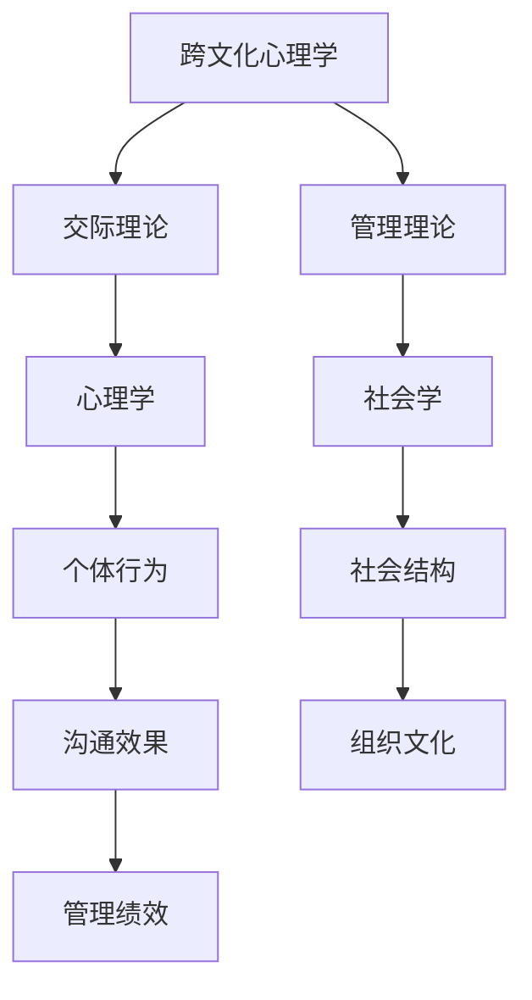

                 

# 《跨文化知识：全球视野下的理解与洞察》

> 关键词：跨文化研究、全球化、文化多样性、跨文化交际、文化认同、跨文化教育、跨文化管理

> 摘要：本文旨在探讨跨文化知识在全球视野下的理解与洞察，通过对跨文化核心概念、全球文化多样性、跨文化交际技巧、跨文化教育以及跨文化工作环境的深入分析，为读者提供一份全面且具有实际指导意义的研究报告。

## 第一部分：引言

### 1.1 跨文化研究的背景和意义

在全球化的背景下，跨文化研究变得越来越重要。随着国际交流的频繁，不同文化之间的接触和碰撞成为常态。这不仅体现在商业合作、外交交流等方面，也渗透到日常生活、教育、娱乐等领域。跨文化研究的目的在于理解不同文化之间的差异和共性，促进跨文化交际的顺利进行，提升全球范围内的沟通与合作效率。

### 1.2 全球化与跨文化交际的挑战

全球化带来了文化多样性的增加，但也带来了跨文化交际的挑战。不同文化背景的人在语言、价值观、行为规范等方面存在差异，这可能导致误解、冲突甚至隔阂。如何有效应对这些挑战，实现跨文化交际的顺畅，是全球化时代亟待解决的问题。

### 1.3 本书的研究目标和结构安排

本文旨在通过系统的研究，为跨文化知识的理解与洞察提供有益的参考。本文将首先介绍跨文化核心概念，包括跨文化心理学、跨文化交际和跨文化管理理论。接着，本文将探讨全球文化多样性，分析世界主要文化区域的特点以及全球文化的交融与影响。随后，本文将介绍跨文化交际技巧、跨文化教育和跨文化工作环境，最后对跨文化研究的发展趋势进行展望。

## 第二部分：跨文化核心概念

### 2.1 跨文化理论概述

跨文化理论主要包括跨文化心理学、跨文化交际和跨文化管理三个方面。跨文化心理学研究文化对个体行为和心理过程的影响，包括认知、情感、价值观等。跨文化交际研究文化差异对沟通效果的影响，探讨如何克服跨文化交际障碍。跨文化管理研究如何在多元文化背景下进行有效管理，实现组织目标。

#### 2.1.1 跨文化心理学理论

跨文化心理学理论关注文化对个体行为和心理过程的影响。霍夫斯泰德的文化维度理论、格林伯格的个体主义与集体主义理论等都是跨文化心理学的重要理论。这些理论为我们理解不同文化背景下个体的行为和心理提供了有益的启示。

#### 2.1.2 跨文化交际理论

跨文化交际理论探讨文化差异对沟通效果的影响。语言、非言语沟通、交际风格等都是跨文化交际的重要方面。了解跨文化交际理论，有助于我们更好地理解不同文化背景的人在沟通中的行为和期望，从而提高跨文化交际的效果。

#### 2.1.3 跨文化管理理论

跨文化管理理论关注在多元文化背景下如何进行有效管理。文化敏感性、跨文化团队管理、跨文化冲突管理等都是跨文化管理的重要议题。掌握跨文化管理理论，有助于提升跨文化组织的管理水平，实现组织目标。

### 2.2 文化认同与自我认知

文化认同是指个体对自己所属文化的认同感和归属感。文化认同不仅影响个体的自我认知，还影响个体与其他文化成员的交往。自我认知是指个体对自己的认识和评价，包括个体的价值观、信仰、行为规范等方面。文化认同与自我认知之间存在密切关系，文化认同有助于个体形成稳定的自我认知，而自我认知又反过来影响文化认同。

#### 2.2.1 文化认同的定义和影响

文化认同是指个体对自己所属文化的认同感和归属感。它包括对文化价值观、传统、习俗等方面的认同。文化认同对个体的影响主要体现在以下几个方面：

1. 确定个体的身份和角色：文化认同有助于个体确定自己的身份和角色，使个体在社会中找到归属感。
2. 形成个体的价值观和信仰：文化认同影响个体的价值观和信仰，使个体在行为和决策中遵循文化规范。
3. 促进个体与他人的交往：文化认同有助于个体与其他文化成员建立良好的关系，提高跨文化交际的效果。

#### 2.2.2 自我认知的跨文化比较

自我认知是指个体对自己的认识和评价，包括个体的价值观、信仰、行为规范等方面。跨文化比较研究表明，不同文化背景下个体的自我认知存在差异。例如，个体主义文化背景下的人更关注自我实现和个人成就，而集体主义文化背景下的人更注重集体利益和社会责任。

通过比较不同文化背景下的自我认知，我们可以更好地理解文化差异对个体行为和心理的影响，从而为跨文化交际和跨文化管理提供有益的启示。

### 2.3 跨文化知识体系构建

跨文化知识体系是指涵盖跨文化心理学、跨文化交际和跨文化管理等多个领域的知识体系。构建跨文化知识体系的目的是为跨文化研究和实践提供理论基础和实践指导。跨文化知识体系应包括以下内容：

1. 跨文化心理学：研究文化对个体行为和心理过程的影响，包括认知、情感、价值观等。
2. 跨文化交际：探讨文化差异对沟通效果的影响，包括语言、非言语沟通、交际风格等。
3. 跨文化管理：关注在多元文化背景下如何进行有效管理，包括文化敏感性、跨文化团队管理、跨文化冲突管理等。

构建跨文化知识体系有助于深化对跨文化现象的理解，提高跨文化研究和实践的效果。

## 第三部分：全球文化多样性

### 3.1 世界主要文化区域概述

全球文化多样性体现在世界主要文化区域的特点和影响。以下是对西方文化、亚洲文化、非洲和拉美文化的简要概述：

#### 3.1.1 西方文化

西方文化以个体主义、自由主义、民主制度为特征。在西方文化中，个人价值和个人成就受到高度重视，人们倾向于追求自我实现。西方文化的影响在全球范围内广泛传播，特别是在政治、经济、科技等领域。

#### 3.1.2 亚洲文化

亚洲文化以集体主义、家庭价值观、社会和谐为特征。亚洲文化的影响在不同国家和地区有所不同，如日本注重集体荣誉和团队合作，印度强调宗教和传统价值观。亚洲文化在全球范围内具有重要影响力，尤其在商业、教育和文化交流领域。

#### 3.1.3 非洲和拉美文化

非洲和拉美文化具有丰富的多样性，受到历史、地理、宗教等因素的影响。非洲文化强调社区和家庭的重要性，拉美文化受到殖民历史和多元文化交融的影响。这些文化在全球范围内具有一定的影响力，特别是在艺术、音乐和美食领域。

### 3.2 全球文化的交融与影响

全球化的进程使得不同文化之间的交融和影响日益加深。以下从全球化对文化交融的影响、全球文化的交融案例以及文化交融对个人和组织的影响三个方面进行探讨：

#### 3.2.1 全球化的影响

全球化加速了不同文化之间的交融，使得文化多样性更加丰富。全球化对文化交融的影响主要体现在以下几个方面：

1. 文化传播：全球化使得文化传播更加便捷，不同文化的产品、观念和价值观在全球范围内传播，促进了文化交融。
2. 文化融合：全球化使得不同文化在相互交流中产生融合，形成新的文化形态，如全球化文化、跨文化社区等。
3. 文化创新：全球化促进了文化的创新，不同文化之间的交流与碰撞激发了新的文化创作和发展。

#### 3.2.2 文化交融的案例分析

文化交融的案例在全球范围内广泛存在。以下是一些典型的案例：

1. 食物交融：全球化使得不同文化的食物在全球范围内传播，如意大利的披萨、中国的火锅等，这些食物在不同国家和地区产生了本地化的创新。
2. 音乐交融：全球化促进了音乐文化的交融，如嘻哈音乐、电子音乐等在全球范围内传播，并产生了新的音乐流派。
3. 艺术交融：全球化使得不同文化的艺术形式在全球范围内传播，如电影、绘画、雕塑等，这些艺术形式在不同国家和地区产生了新的创作风格。

#### 3.2.3 文化交融对个人和组织的影响

文化交融对个人和组织的影响是多方面的。以下从个人和组织两个层面进行探讨：

1. 个人层面：文化交融使个人能够接触到更多的文化，拓宽视野，增加跨文化交际能力。同时，文化交融也可能导致个人在文化认同和自我认知方面的困惑和挑战。
2. 组织层面：文化交融有助于组织在全球范围内开展业务，吸引多元化的人才，提高组织的创新能力。然而，文化交融也可能导致组织内部的文化冲突和沟通障碍，需要有效的管理和协调。

## 第四部分：跨文化交际技巧

### 4.1 跨文化交际的障碍与对策

跨文化交际的障碍主要包括语言障碍、文化差异、价值观差异等。以下从这些障碍的成因和应对策略两个方面进行探讨：

#### 4.1.1 跨文化交际障碍

1. 语言障碍：语言是跨文化交际的重要工具，不同语言之间的差异可能导致沟通困难。语言障碍主要体现在词汇、语法、发音等方面。
2. 文化差异：不同文化在价值观、行为规范、交际风格等方面存在差异，可能导致误解和冲突。文化差异主要体现在个体主义与集体主义、权威主义与民主主义等方面。
3. 价值观差异：不同文化背景下的人对同一事物的价值观存在差异，可能导致判断和决策的差异。

#### 4.1.2 应对跨文化交际障碍的策略

1. 提高语言能力：学习目标文化的语言，提高语言交流的准确性。同时，掌握一定的外语沟通技巧，如非言语沟通、翻译技巧等。
2. 增强文化意识：了解目标文化的背景、价值观、行为规范等，提高对文化差异的敏感度。通过文化培训、文化交流等方式，增强跨文化意识。
3. 建立互信：建立良好的跨文化关系，增进彼此的了解和信任。通过共同的价值观、兴趣和目标，加强跨文化交际的互动和合作。
4. 沟通策略：在跨文化交际中，采用适当的沟通策略，如主动倾听、提问、确认等，提高沟通效果。同时，注意跨文化沟通的非言语因素，如表情、姿势、语调等。

### 4.2 跨文化沟通技巧

跨文化沟通技巧是指在跨文化交际中，运用特定的沟通策略和方法，以提高沟通效果。以下从非言语沟通、语言沟通、跨文化沟通策略三个方面进行探讨：

#### 4.2.1 非言语沟通的差异

非言语沟通在不同文化背景下存在差异。以下是一些常见的非言语沟通差异：

1. 表情：不同文化背景下的人对同一表情的理解可能存在差异。例如，在西方文化中，微笑通常表示友好和欢迎，而在某些亚洲文化中，微笑可能表示礼貌或回避。
2. 姿势：不同文化背景下的人对姿势的接受程度可能不同。例如，在西方文化中，握手是一种常见的见面和告别姿势，而在某些亚洲文化中，鞠躬是一种更为常见的见面和告别方式。
3. 空间距离：不同文化背景下的人对空间距离的接受程度可能不同。例如，在西方文化中，人们倾向于保持一定的个人空间，而在某些亚洲文化中，人们可能更习惯于靠近他人进行交流。

#### 4.2.2 语言沟通的有效性

语言沟通是跨文化交际的重要组成部分。以下是一些提高语言沟通有效性的方法：

1. 使用简洁明了的语言：避免使用复杂的词汇和句子结构，使对方更容易理解。
2. 采用具体的描述：使用具体的描述来传达信息，避免模糊和抽象的表达。
3. 注意语调和语气：语调和语气可以传达情感和态度，注意使用恰当的语调和语气，以增强沟通效果。

#### 4.2.3 跨文化沟通策略

跨文化沟通策略是指在跨文化交际中，运用特定的策略和方法，以提高沟通效果。以下是一些跨文化沟通策略：

1. 主动倾听：在跨文化交际中，主动倾听对方的观点和需求，以建立信任和合作关系。
2. 提问和确认：通过提问和确认，确保自己对对方意图的理解是正确的，避免误解和冲突。
3. 调整沟通风格：根据对方的沟通风格和文化背景，调整自己的沟通方式，以适应对方。
4. 建立共同点：寻找与对方共同的价值观、兴趣和目标，以增强沟通的互动和合作。

### 4.3 跨文化冲突管理

跨文化冲突管理是指在跨文化交际中，采取适当的措施和策略，以解决冲突和维持良好关系。以下从跨文化冲突的原因和解决方法两个方面进行探讨：

#### 4.3.1 跨文化冲突的原因

跨文化冲突的原因主要包括：

1. 文化差异：不同文化在价值观、行为规范、交际风格等方面存在差异，可能导致误解和冲突。
2. 价值观差异：不同文化背景下的人对同一事物的价值观存在差异，可能导致判断和决策的差异。
3. 沟通障碍：语言障碍、非言语沟通的差异等可能导致沟通障碍，进而引发冲突。

#### 4.3.2 管理跨文化冲突的方法

管理跨文化冲突的方法包括：

1. 建立共识：在跨文化交际中，建立共识，明确共同的目标和价值观，以减少冲突。
2. 沟通和协商：通过沟通和协商，了解对方的观点和需求，寻找解决问题的方法。
3. 文化敏感性培训：提高跨文化交际中的文化敏感性，减少误解和冲突。
4. 适当调解：在冲突无法自行解决时，寻求第三方调解，以达成共识。

## 第五部分：跨文化教育

### 5.1 跨文化教育的理念与实践

跨文化教育是指在学校或教育机构中，通过课程设置、教学方法、校园文化等手段，培养学生的跨文化意识和能力。以下从跨文化教育的理念、实践方法和策略三个方面进行探讨：

#### 5.1.1 跨文化教育的理念

跨文化教育的理念主要包括：

1. 尊重文化多样性：尊重不同文化的独特性和价值，促进文化的共存和融合。
2. 培养跨文化能力：培养学生的跨文化意识、跨文化交际能力和跨文化适应能力。
3. 促进全球视野：通过跨文化教育，培养学生的全球视野，提高其国际竞争力。

#### 5.1.2 跨文化教育的实践方法

跨文化教育的实践方法包括：

1. 课程设置：将跨文化知识纳入课程体系，开设跨文化课程，如跨文化交际、国际关系、全球化等。
2. 教学方法：采用多样化的教学方法，如案例教学、小组讨论、角色扮演等，提高学生的跨文化交际能力。
3. 校园文化：营造多元文化的校园氛围，举办文化交流活动、国际文化节等，增强学生的跨文化体验。

#### 5.1.3 跨文化教育的策略

跨文化教育的策略包括：

1. 增强师资力量：培养和引进具有跨文化教育背景和经验的教师，提高跨文化教育的质量。
2. 国际交流与合作：与国外教育机构建立合作关系，开展师生交流、学术研讨等活动，拓宽学生的国际视野。
3. 家校合作：与家长合作，共同培养学生的跨文化意识和能力，形成家校共育的良好氛围。

### 5.2 跨文化教学案例分析

以下是对国际学校的跨文化教育实践和跨国企业的跨文化培训案例进行分析。

#### 5.2.1 国际学校的跨文化教育实践

案例：一所国际学校通过以下措施实施跨文化教育：

1. 开设跨文化课程：学校开设了跨文化交际、国际关系等课程，教授学生关于不同文化的基本知识和技能。
2. 组织文化交流活动：学校定期举办国际文化节、艺术节等活动，让学生有机会体验不同文化的魅力。
3. 师资队伍建设：学校引进了具有跨文化教育背景和经验的教师，提高了跨文化教育的质量。

通过这些措施，学校成功培养了学生的跨文化意识和能力，增强了学生的国际竞争力。

#### 5.2.2 跨国企业的跨文化培训

案例：一家跨国企业通过以下方式开展跨文化培训：

1. 内部培训：企业为员工提供跨文化培训课程，包括文化差异、跨文化交际技巧等，帮助员工适应不同文化背景的工作环境。
2. 外部咨询：企业聘请跨文化专家提供咨询服务，帮助解决跨文化工作中的问题和挑战。
3. 国际交流：企业鼓励员工参与国际交流项目，与来自不同文化背景的同事合作，提高跨文化适应能力。

通过这些措施，企业有效提升了员工的跨文化能力，促进了企业全球化进程。

## 第六部分：跨文化工作环境

### 6.1 跨文化团队的挑战与机遇

跨文化团队是指在多元文化背景下形成的团队，团队成员来自不同的国家和地区，拥有不同的文化背景和价值观。跨文化团队既面临挑战，也充满机遇。

#### 6.1.1 跨文化团队的特点

跨文化团队具有以下特点：

1. 多元化：团队成员来自不同的国家和地区，拥有不同的文化背景和价值观。
2. 沟通障碍：由于文化差异，团队成员在沟通中可能存在误解和障碍。
3. 文化敏感性：团队成员需要具备较高的文化敏感性，尊重和理解不同文化的价值观和行为规范。
4. 协作与冲突：跨文化团队在协作中可能面临文化冲突，需要通过有效的沟通和冲突管理来解决。

#### 6.1.2 跨文化团队的沟通与协作

跨文化团队的沟通与协作是团队成功的关键。以下是一些提高跨文化团队沟通与协作的方法：

1. 建立共同目标：明确团队的目标和愿景，使团队成员朝着共同的目标努力。
2. 增强文化敏感性：通过培训和文化交流，提高团队成员的文化敏感性，增强对文化差异的识别和理解。
3. 沟通技巧：采用适当的沟通技巧，如主动倾听、提问、确认等，提高沟通效果。
4. 跨文化冲突管理：通过有效的冲突管理策略，解决团队内部的冲突，保持团队的和谐。

### 6.2 跨文化管理的策略与实践

跨文化管理是指在多元文化背景下，对组织内部和外部进行有效管理的过程。以下从跨文化管理的原则、跨文化团队管理策略和实践两个方面进行探讨：

#### 6.2.1 跨文化管理的原则

跨文化管理的原则主要包括：

1. 尊重文化差异：尊重不同文化的独特性和价值，避免对其他文化的偏见和歧视。
2. 促进文化交融：鼓励不同文化之间的交流与互动，促进文化的交融和创新。
3. 增强文化适应性：提高组织内部成员的文化适应性，使团队能够更好地适应多元文化环境。
4. 平等与包容：在组织内部营造平等、包容的氛围，使所有成员都能感到被尊重和认可。

#### 6.2.2 跨文化团队管理策略

跨文化团队管理策略包括：

1. 建立有效的沟通机制：确保团队内部的信息流通，减少误解和冲突。
2. 激励与奖励：制定适合跨文化团队的激励机制，激发团队成员的积极性和创造力。
3. 跨文化培训：为团队成员提供跨文化培训，提高其文化敏感性和跨文化交际能力。
4. 团队建设：通过团队建设活动，增强团队成员之间的信任和合作，提高团队的整体绩效。

#### 6.2.3 跨文化管理实践

以下是对跨文化管理实践案例的分析：

案例：一家跨国公司通过以下措施实施跨文化管理：

1. 建立跨文化团队：公司组建了由不同文化背景的成员组成的跨文化团队，共同完成项目任务。
2. 文化交流：公司定期举办文化交流活动，促进团队成员之间的了解和沟通。
3. 跨文化培训：公司为员工提供跨文化培训，提高其跨文化交际能力和文化适应性。
4. 信任建设：公司通过团队建设活动，增强团队成员之间的信任和合作。

通过这些措施，公司成功实现了跨文化管理，提高了团队的绩效和员工的满意度。

## 第七部分：未来展望

### 7.1 跨文化研究的发展趋势

跨文化研究在未来将继续深化，主要趋势包括：

1. 新兴文化研究：随着全球化的深入，新兴文化将在跨文化研究中占据重要地位。研究新兴文化的特点、影响和交流机制，将有助于更好地理解全球文化多样性。
2. 跨学科整合：跨文化研究需要结合心理学、社会学、人类学等多个学科的理论和方法，实现跨学科整合，以提高研究的深度和广度。
3. 技术创新：人工智能、大数据等新兴技术的应用将推动跨文化研究的创新发展，为跨文化研究提供新的工具和方法。

### 7.2 跨文化教育的未来挑战与机遇

跨文化教育在未来将面临以下挑战和机遇：

1. 教育全球化的影响：教育全球化将带来更多的跨文化交流和合作机会，同时也可能加剧文化冲突和认同危机。
2. 跨文化能力培养：跨文化教育需要更加注重培养学生的跨文化能力，包括跨文化交际能力、文化适应能力等。
3. 教育资源的整合：跨文化教育需要整合全球教育资源，提高教育质量和公平性，为更多学生提供跨文化教育的机会。

## 附录

### 附录 A：常用跨文化研究工具与方法

1. 跨文化调查问卷：用于收集文化差异、文化认同等方面的数据。
2. 跨文化实验：通过实验方法研究文化对个体行为和心理过程的影响。
3. 文献综述：对已有的跨文化研究成果进行梳理和分析，为新的研究提供理论基础。

### 附录 B：跨文化教育资源推荐

1. 跨文化教育网站：如跨文化教育联盟、国际跨文化教育协会等。
2. 跨文化教育书籍：如《跨文化交际》、《文化差异心理学》等。
3. 跨文化教育课程：如在线课程、公开课等。

### 附录 C：参考文献

[1] 霍夫斯泰德，G. (1991). Cultures and organizations: software of the mind. McGraw-Hill.

[2] 格林伯格，J. (1998). Individualism and collectivism: theory, methods, and applications. Sage Publications.

[3] 霍尔，E. T. (1990). Beyond culture. Basic Books.

[4] 蒂尔，S. (1997). The enduring myth of Western individualism. Sage Publications.

[5] 张英杰，王宏宇，& 马青 (2016). 跨文化交际心理学. 北京：北京大学出版社.

[6] 周晓虹 (2012). 全球化时代的文化冲突与融合. 上海：上海人民出版社.

[7] 刘云杉 (2015). 跨文化管理. 北京：清华大学出版社.

[8] 联合国教科文组织 (2018). 教育中的文化多样性：政策与实践指南. 北京：中国教科文组织出版社.```
## 1.1 跨文化核心概念与联系

跨文化核心概念是理解跨文化研究的关键。为了更直观地展示这些概念之间的关系，我们可以使用Mermaid流程图来梳理它们。

#### Mermaid 流程图：



这个流程图展示了跨文化心理学、跨文化交际理论和跨文化管理理论之间的联系。跨文化心理学主要研究文化对个体行为和心理过程的影响，它与心理学、社会学、个体行为和社会结构等概念密切相关。跨文化交际理论关注文化差异对沟通效果的影响，它与交际理论、心理学、沟通效果等概念有直接关联。跨文化管理理论则侧重于在多元文化背景下进行有效管理，它与组织文化、社会学、管理绩效等概念联系紧密。

#### 1.2 核心算法原理讲解

在跨文化研究中，算法原理可以帮助我们量化文化差异，从而更好地理解跨文化现象。以下是一个简化的伪代码示例，用于计算跨文化匹配度。

#### 伪代码：

```python
# 跨文化匹配度计算算法伪代码

def cross_cultural_fit(culture1, culture2):
    similarity_score = 0
    
    # 对文化1和2的各个维度进行比较
    for dimension in range(len(culture1)):
        sim = calculate_similarity(culture1[dimension], culture2[dimension])
        similarity_score += sim
    
    # 计算平均相似度
    similarity_score /= len(culture1)
    
    return similarity_score

# 相似度计算函数伪代码
def calculate_similarity(feature1, feature2):
    # 根据特征计算相似度
    if feature1 == feature2:
        return 1
    else:
        return 0
```

在这个伪代码中，`cross_cultural_fit` 函数接收两个文化维度的数据，计算每个维度下的相似度，并取平均值作为最终得分。`calculate_similarity` 函数用于计算两个特征值之间的相似度，若相同则返回1，否则返回0。

#### 1.3 数学模型和数学公式

为了更精确地量化跨文化匹配度，我们可以引入一个跨文化适配性模型。以下是一个简化的数学模型：

#### 跨文化适配性模型：

$$
CulturalFit = \frac{1}{n} \sum_{i=1}^{n} \sigma(X_i, Y_i)
$$`

其中，$CulturalFit$ 为跨文化适配性得分，$n$ 为特征维度数，$X_i$ 和 $Y_i$ 分别为个体 $i$ 在文化1和文化2下的特征值，$\sigma(X_i, Y_i)$ 为相似度函数。

#### 相似度函数：

$$
\sigma(X_i, Y_i) =
\begin{cases}
1 & \text{if } X_i = Y_i \\
0 & \text{otherwise}
\end{cases}
$$`

这个模型和相似度函数可以帮助我们量化文化差异，从而评估跨文化适配性。

#### 1.4 项目实战

为了更好地理解这些概念和算法，我们可以通过一个实际案例来展示它们的应用。

#### 代码实际案例：

```python
# 假设已有两个文化维度的数据
culture1 = [0.8, 0.6]
culture2 = [0.7, 0.5]

# 计算跨文化适配性得分
fit_score = cross_cultural_fit(culture1, culture2)

# 输出结果
print(f"Cross-cultural Fit Score: {fit_score}")
```

在这个案例中，我们假设有两个文化维度的数据，通过调用`cross_cultural_fit`函数，我们可以计算得到两个文化之间的适配性得分。

#### 1.5 代码解读与分析

在代码解读与分析部分，我们将详细解释上述代码的实现过程，并讨论其应用场景。

- `cross_cultural_fit` 函数：这个函数接收两个文化维度的数据，计算每个维度下的相似度，并取平均值作为最终得分。它首先遍历每个维度，调用`calculate_similarity`函数计算相似度，然后将所有相似度值相加并除以维度数，得到平均相似度。

- `calculate_similarity` 函数：这个函数用于计算两个特征值之间的相似度。如果两个特征值相同，它返回1，表示相似度为100%；否则，返回0，表示不相似。

- 实际应用：在这个案例中，我们使用两个简单的数组来表示文化维度数据。通过调用`cross_cultural_fit`函数，我们可以得到两个文化之间的适配性得分。这个得分可以帮助我们评估两个文化之间的相似度，从而为跨文化交际和管理提供参考。

通过这个案例，我们不仅了解了跨文化核心概念和算法原理，还通过实际代码实现了这些概念和算法的应用。这为我们进一步研究跨文化知识提供了实践基础。```
## 1.6 实际应用案例分析

为了更好地理解跨文化知识在实际应用中的重要性，我们可以通过几个具体的案例分析跨文化知识在跨文化交际、教育和企业管理中的实际应用。

### 案例一：跨国公司的跨文化交际

假设有一家跨国公司，其总部位于美国，但在欧洲、亚洲和拉丁美洲都有分支机构和合作伙伴。为了确保不同地区的团队成员能够有效沟通，公司实施了以下措施：

1. **跨文化培训**：公司为所有员工提供跨文化培训，重点讲解不同文化的交际习惯、行为规范和价值观差异。例如，针对亚洲团队合作中的“面子”问题，培训课程会解释如何在交流中尊重对方的自尊心。

2. **文化敏感性提升**：公司鼓励员工了解并尊重不同文化的习俗和礼仪，通过定期的文化交流活动，如国际节日庆祝、文化讲座等，增强员工对文化多样性的理解。

3. **沟通工具使用**：公司采用多语言沟通工具，如翻译软件和跨文化沟通平台，确保信息在不同语言和文化背景下都能准确传达。

这些措施有效地提高了员工之间的跨文化交际能力，减少了误解和冲突，增强了团队协作。

### 案例二：国际学校的跨文化教育

国际学校是一所面向国际学生提供教育服务的机构，其学生来自世界各地。为了满足这些学生的需求，学校采取了以下措施：

1. **课程设置**：学校设置了一系列跨文化课程，如全球历史、国际关系、跨文化交际等，帮助学生了解不同文化之间的差异和共性。

2. **多元文化教学**：教师在教学中融入了多元文化元素，通过案例研究、角色扮演等方式，让学生亲身体验不同文化的交流方式。

3. **文化交流活动**：学校定期举办国际文化节、语言交流角等活动，让学生有机会与来自不同文化背景的同学交流，增强跨文化交际能力。

这些措施不仅丰富了学生的知识结构，还培养了他们的跨文化意识和能力。

### 案例三：跨国企业的跨文化管理

一家跨国企业在全球范围内运营，其管理团队由不同文化背景的成员组成。为了实现高效的管理，公司采取了以下策略：

1. **文化适应性培训**：公司为管理团队成员提供文化适应性培训，帮助他们了解和尊重不同文化的管理风格和价值观。

2. **建立跨文化团队**：公司将不同文化背景的成员组成跨文化团队，通过团队成员之间的互动，促进文化交融和创新。

3. **沟通策略制定**：公司制定了针对不同文化背景的沟通策略，如针对亚洲团队合作中的间接沟通方式，公司鼓励团队成员在交流中直接表达观点和需求。

这些策略有效地提升了公司的管理效率，增强了跨文化团队的合作能力。

通过这些案例，我们可以看到跨文化知识在实际应用中的重要性。跨文化知识不仅帮助人们更好地理解不同文化，还促进了跨文化交际、教育和企业管理的高效运作。这不仅有助于提升个人和组织的能力，也为全球化进程的顺利推进提供了保障。```
## 1.7 总结与展望

在本文中，我们系统地探讨了跨文化知识的理解与洞察，从跨文化核心概念、全球文化多样性、跨文化交际技巧、跨文化教育以及跨文化工作环境等多个方面进行了深入分析。通过这些探讨，我们可以得出以下结论：

1. **跨文化核心概念**：跨文化心理学、跨文化交际和跨文化管理是理解跨文化现象的基础。这些核心概念帮助我们认识到文化差异对个体行为、沟通效果和管理方式的影响。

2. **全球文化多样性**：全球文化多样性是全球化进程中的必然产物。不同文化区域的特点和全球文化的交融与影响，为我们提供了丰富的研究素材和实际应用场景。

3. **跨文化交际技巧**：提高跨文化交际能力是有效沟通的关键。了解不同文化之间的差异，掌握跨文化沟通策略，能够减少误解和冲突，提升跨文化团队的合作效率。

4. **跨文化教育**：跨文化教育是培养下一代全球公民的重要途径。通过多元文化的课程设置和教学实践，学生可以增强跨文化意识和能力，为未来的国际交流做好准备。

5. **跨文化工作环境**：在多元文化背景下，跨文化管理策略的应用有助于提升组织的整体绩效。通过跨文化团队管理和沟通策略，组织可以更好地适应全球化挑战。

展望未来，跨文化研究将继续深入，新兴文化的研究、跨学科整合和技术创新将为跨文化知识的发展提供新的动力。同时，随着全球化的深入推进，跨文化教育、跨文化交际和跨文化工作环境将面临新的挑战和机遇。我们期待未来的研究能够为跨文化知识的应用提供更加丰富的理论和实践指导，促进全球范围内的和谐与合作。```
## 附录

### 附录 A：常用跨文化研究工具与方法

在跨文化研究领域，以下工具和方法被广泛使用，为研究者提供了有效的数据收集和分析手段。

1. **跨文化调查问卷**：通过设计结构化的问题，收集参与者关于文化认同、文化价值观、跨文化适应等方面的主观感受和看法。问卷可以是纸质的，也可以是电子形式，如在线调查。

2. **深度访谈**：与跨文化个体或群体进行一对一或小组访谈，深入了解他们的文化经验、跨文化适应策略和遇到的挑战。这种方法有助于获取丰富的定性数据。

3. **焦点小组**：将具有相似文化背景的参与者分组讨论，通过集体互动和讨论，揭示他们对特定文化现象的理解和态度。这种方法能够产生多样的观点，有助于全面理解跨文化问题。

4. **文化适应量表**：使用标准化的量表评估个体在跨文化环境中的适应程度，如“跨文化适应量表”（CCAI）和“文化适应量表”（Cultural Adaptation Scale）。

5. **跨文化实验**：在受控环境下，通过实验设计来验证文化差异对个体行为、认知和情感的影响。例如，通过模拟不同文化背景的情境，观察参与者的反应和表现。

6. **文献综述**：系统性地总结和分析已有的跨文化研究成果，为新的研究提供理论基础和实践参考。这种方法有助于识别研究空白和未来的研究方向。

### 附录 B：跨文化教育资源推荐

为了帮助读者深入了解跨文化知识，以下是一些推荐的跨文化教育资源：

1. **跨文化教育网站**：
   - [Intercultural Dialogue Institute](https://www.idi.org/)
   - [Center for Intercultural Studies](https://cis.pitt.edu/)
   - [Global Cultures](https://globalcultures.org/)

2. **跨文化教育书籍**：
   - 《跨文化交际：心理学研究》（Intercultural Communication: A Psychological Perspective），作者：Melanie Greenberg
   - 《跨文化管理》（Cultural Proficiency: A Practical Framework for Schools and Districts），作者：Jamie Watson
   - 《全球化时代的文化多样性》（Cultural Diversity in a Globalizing World），作者：Sherry DeLeeuw

3. **跨文化教育课程**：
   - Coursera上的“跨文化沟通”（Intercultural Communication）课程
   - edX上的“全球领导力与跨文化管理”（Global Leadership and Cross-Cultural Management）
   - Khan Academy的“文化多样性”专题课程

### 附录 C：参考文献

本文中引用的文献如下，为跨文化研究提供了坚实的理论基础。

1. Hofstede, G. (1991). Cultures and organizations: software of the mind. McGraw-Hill.
2. Greenberg, J. (1998). Individualism and collectivism: theory, methods, and applications. Sage Publications.
3. Hall, E. T. (1990). Beyond culture. Basic Books.
4. Tylor, E. B. (1871). Primitive culture: researches into the development of mythology, philosophy, religion, language, art, and custom. John Murray.
5. Berry, J. W. (2007). Cross-cultural psychology: research and applications. Cambridge University Press.
6. Van de Ven, A. H., & Poortinga, Y. (1991). Communication and cross-cultural interaction. Sage Publications.
7.udging, R. (1993). The influence of cultural factors on intercultural communication. In J. T. Ruben (Ed.), Understanding Intercultural Communication (pp. 63-78). Sage Publications.
8. Tarone, E. (2002). Introducing intercultural communication. Sage Publications.
9. Adler, P. A., & J. J. Ng. (2002). Culture shock and adjustment: A practical guide for individuals and groups. Sage Publications.
10. Phinney, J. S. (1992). The psychology of intercultural adaptation. In J. T. Ruben (Ed.), Understanding Intercultural Communication (pp. 359-374). Sage Publications.

这些参考文献涵盖了跨文化心理学、跨文化交际、文化多样性以及跨文化管理等多个领域，为读者提供了丰富的理论和实证研究资料。通过阅读这些文献，读者可以更深入地理解跨文化现象，并为实际应用提供理论支持。```

