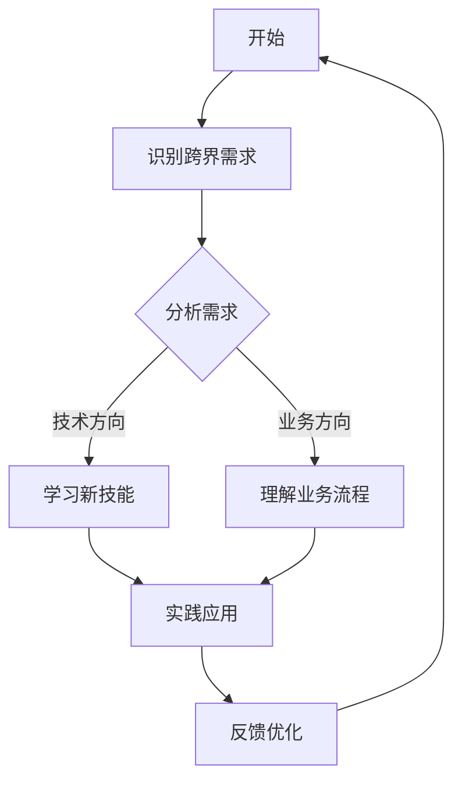

                 

# 《跨界知识整合：程序员的独特优势》

> 关键词：跨界知识、程序员、优势、整合、技术、业务

> 摘要：本文探讨了程序员的独特优势，强调了跨界知识在程序员职业生涯中的重要性。通过分析程序员的角色演变、跨界知识的重要性以及跨界整合的方法论，本文揭示了程序员在技术、业务和团队协作中的优势，并提出了跨界成长的路径和策略。同时，本文通过案例分析、项目实战等方式，阐述了跨界知识在实际应用中的价值。

### 目录

#### 第一部分：跨界知识整合概述

- 第1章：程序员的跨界之路
  - 1.1 程序员的角色演变
    - 1.1.1 程序员的角色定义
    - 1.1.2 程序员面临的挑战
    - 1.1.3 跨界思维的重要性
  - 1.2 跨界知识的重要性
    - 1.2.1 跨界知识的影响
    - 1.2.2 跨界知识的获取方法
    - 1.2.3 跨界知识的整合策略
  - 1.3 程序员的独特优势
    - 1.3.1 技术深度与广度
    - 1.3.2 解决问题的能力
    - 1.3.3 团队协作与沟通技巧

- 第2章：技术领域的跨界整合
  - 2.1 跨界整合的案例分析
    - 2.1.1 技术A与B的整合
    - 2.1.2 技术C与D的融合
    - 2.1.3 跨界整合的优势
  - 2.2 跨界整合的方法论
    - 2.2.1 技术调研与选型
    - 2.2.2 模块化设计与开发
    - 2.2.3 跨界整合的风险管理
  - 2.3 跨界整合的实际应用
    - 2.3.1 在企业中的应用
    - 2.3.2 在开源项目中的应用
    - 2.3.3 在个人项目中的应用

- 第3章：跨界知识在业务领域的应用
  - 3.1 跨界知识在业务领域的价值
    - 3.1.1 业务流程优化
    - 3.1.2 数据分析与应用
    - 3.1.3 产品设计与迭代
  - 3.2 跨界知识在业务领域的应用案例
    - 3.2.1 案例A：如何利用技术提升业务效率
    - 3.2.2 案例B：如何通过数据驱动业务决策
    - 3.2.3 案例C：如何将技术创新应用于产品开发
  - 3.3 跨界知识在业务领域的实践技巧
    - 3.3.1 跨部门协作与沟通
    - 3.3.2 跨界知识的快速掌握
    - 3.3.3 跨界知识的应用评估与优化

- 第4章：程序员的自我提升
  - 4.1 技术进阶之路
    - 4.1.1 技术深度与广度的平衡
    - 4.1.2 技术学习的有效方法
    - 4.1.3 技术分享与社区参与
  - 4.2 跨界能力的培养
    - 4.2.1 跨界学习的策略
    - 4.2.2 跨界实践的经验积累
    - 4.2.3 跨界能力的评估与提升
  - 4.3 跨界成长的路径
    - 4.3.1 技术专家向业务专家转型
    - 4.3.2 技术团队领导者的成长
    - 4.3.3 创业者的跨界思维

- 第5章：跨界知识整合的未来
  - 5.1 跨界知识整合的发展趋势
    - 5.1.1 技术融合的趋势
    - 5.1.2 业务模式创新的趋势
    - 5.1.3 跨界知识整合的潜在机遇
  - 5.2 跨界知识整合的挑战
    - 5.2.1 技术壁垒与知识壁垒
    - 5.2.2 跨界整合的风险
    - 5.2.3 跨界整合的人才培养
  - 5.3 跨界知识整合的策略与建议
    - 5.3.1 企业层面的整合策略
    - 5.3.2 个人层面的整合策略
    - 5.3.3 跨界知识整合的长期规划

#### 第二部分：跨界知识整合概述

### 第1章：程序员的跨界之路

#### 1.1 程序员的角色演变

**1.1.1 程序员的角色定义**

程序员，作为一个古老的职业，其角色的定义随着时代的发展而不断演变。最初的程序员，主要是负责编写计算机程序，解决计算问题。然而，随着计算机技术的发展，程序员的角色逐渐扩展，涵盖了系统设计、架构规划、性能优化、数据存储和管理等多个方面。

在早期，程序员的职责相对单一，主要关注于代码的编写和调试。然而，随着软件系统规模的不断扩大，程序员开始需要承担更多的责任，不仅需要编写高效、可维护的代码，还需要关注系统的架构设计，确保系统能够高效、稳定地运行。

**1.1.2 程序员面临的挑战**

尽管程序员的职责在不断扩展，但同时也面临着一系列的挑战。首先，技术发展的速度非常快，程序员需要不断学习新的技术和工具，以保持自己的竞争力。其次，随着系统复杂性的增加，程序员需要具备更高的解决问题的能力，能够从全局的角度去分析和解决问题。

此外，程序员还需要与不同部门、不同层级的人进行沟通和协作，这要求程序员具备良好的沟通能力和团队协作精神。最后，程序员还需要关注业务需求，将技术解决方案与业务需求紧密结合，为业务提供有效的支持。

**1.1.3 跨界思维的重要性**

面对这些挑战，跨界思维变得尤为重要。跨界思维，即跳出自己熟悉的领域，从其他领域获取灵感，并将其应用到自己的工作中。跨界思维不仅能够帮助程序员扩展自己的知识面，提升解决问题的能力，还能够促进创新和业务突破。

具体来说，跨界思维的重要性体现在以下几个方面：

1. **促进知识整合**：跨界思维能够帮助程序员将不同领域的知识进行整合，形成全新的思路和方法，从而提高工作效率和质量。

2. **提升创新能力**：跨界思维能够激发创新思维，帮助程序员从不同的角度去思考问题，提出独特的解决方案。

3. **拓展职业发展**：跨界思维能够帮助程序员打破原有的职业边界，拓展职业发展的空间，实现职业的多元化发展。

4. **增强团队协作**：跨界思维能够促进跨部门、跨领域的协作，提高团队的整体效能。

总之，跨界思维是程序员应对挑战、提升自身价值的重要途径。在未来的职业发展中，跨界思维将成为程序员不可或缺的能力。

#### 1.2 跨界知识的重要性

**1.2.1 跨界知识的影响**

跨界知识，是指跨越不同领域、不同学科的知识体系。在程序员的职业生涯中，跨界知识的重要性不言而喻。首先，跨界知识能够为程序员提供更广阔的视野，帮助程序员从不同的角度去理解和解决问题。例如，一个熟悉机器学习的程序员，可以运用机器学习的方法来优化软件系统的性能，从而提高系统的用户体验。

其次，跨界知识能够提升程序员的创新能力。跨界知识使得程序员能够从不同的领域获取灵感，将这些灵感应用到自己的工作中，从而创造出新的技术和产品。例如，一个熟悉生物学的程序员，可以运用生物学中的进化算法来优化软件系统的架构，从而提高系统的可靠性和可维护性。

此外，跨界知识还能够帮助程序员拓展职业发展空间。在现代社会，许多行业都在积极拥抱技术，程序员不再仅仅局限于软件开发领域，还可以涉足人工智能、大数据、物联网等多个领域，从而实现职业的多元化发展。

**1.2.2 跨界知识的获取方法**

要获取跨界知识，程序员可以采取以下几种方法：

1. **自学**：通过阅读书籍、在线课程、技术博客等途径，自学新的知识和技能。

2. **参加培训**：参加专业的培训课程，系统地学习跨界知识。

3. **实践经验**：通过实际项目经验，将跨界知识应用到实际工作中，从而加深对跨界知识的理解和掌握。

4. **交流合作**：与不同领域的人进行交流合作，分享知识和经验，相互学习。

5. **跨部门协作**：积极参与跨部门的协作项目，拓展自己的视野和知识面。

**1.2.3 跨界知识的整合策略**

要有效地整合跨界知识，程序员可以采取以下策略：

1. **知识图谱**：构建知识图谱，将不同领域的知识进行关联，形成一个整体的知识体系。

2. **案例研究**：通过案例研究，分析跨界知识在不同领域中的应用，从中吸取经验和教训。

3. **项目实践**：在实际项目中，将跨界知识应用到具体的任务中，不断总结和优化。

4. **团队协作**：与不同领域的人进行紧密合作，共同解决复杂问题，从而实现知识的整合和提升。

总之，跨界知识是程序员职业生涯中的重要资产。通过获取和整合跨界知识，程序员可以提升自己的能力，实现职业的多元化发展，为企业和行业创造更大的价值。

#### 1.3 程序员的独特优势

**1.3.1 技术深度与广度**

程序员在技术深度和广度方面具有独特的优势。首先，程序员具备扎实的技术基础，能够深入理解计算机科学的基本原理和算法。这使得程序员能够解决复杂的技术问题，为企业的技术发展提供强有力的支持。

其次，程序员具备广泛的技术视野，能够紧跟技术发展趋势，掌握最新的技术动态。这使得程序员能够为企业引入先进的技术，提升企业的核心竞争力。

**1.3.2 解决问题的能力**

程序员的独特优势还体现在解决问题的能力上。程序员具备逻辑思维和系统分析能力，能够从全局的角度去分析和解决问题。在面对复杂的问题时，程序员能够通过拆解问题，将复杂的问题转化为一个个简单的问题，从而逐步解决。

此外，程序员具备良好的技术视野，能够从不同的角度去思考问题，提出创新的解决方案。这使得程序员能够在关键时刻为企业提供有效的技术支持，解决关键问题。

**1.3.3 团队协作与沟通技巧**

程序员在团队协作和沟通技巧方面也具有独特的优势。首先，程序员具备良好的沟通能力，能够与不同部门、不同层级的人进行有效沟通，确保项目的顺利进行。

其次，程序员具备团队协作精神，能够与团队成员紧密合作，共同解决复杂问题。在团队合作中，程序员能够发挥自己的技术优势，为团队提供有力的支持。

总之，程序员的独特优势使其在职场中具有很高的竞争力。通过不断学习和提升，程序员可以更好地发挥自己的优势，为企业和社会创造更大的价值。

### 第2章：技术领域的跨界整合

#### 2.1 跨界整合的案例分析

**2.1.1 技术A与B的整合**

技术A与B的整合是一个典型的跨界整合案例。技术A是大数据技术，而技术B是机器学习。大数据技术主要用于处理海量数据，而机器学习则是一种通过数据训练模型进行预测和决策的技术。两者的整合，使得企业能够通过大数据技术获取数据，利用机器学习技术对数据进行分析和预测，从而实现数据驱动的业务决策。

**案例背景**：某电商企业希望提升用户购物体验，通过数据分析预测用户的购物行为，从而提供个性化的推荐。

**整合过程**：
1. 数据采集：利用大数据技术，从多个渠道（如网站日志、用户行为数据等）收集用户数据。
2. 数据预处理：对采集到的数据进行清洗、去噪和格式转换，使其符合机器学习模型的输入要求。
3. 模型训练：利用机器学习技术，对预处理后的数据集进行训练，构建预测模型。
4. 模型评估：通过交叉验证等方法，对训练好的模型进行评估，调整模型参数，提高模型性能。
5. 模型部署：将训练好的模型部署到生产环境中，实时预测用户的购物行为，提供个性化推荐。

**整合优势**：
1. 提高数据利用率：通过整合大数据技术和机器学习技术，企业能够更有效地利用数据资源，挖掘数据价值。
2. 提升决策效率：数据驱动的业务决策能够帮助企业更快地响应市场变化，提高决策效率。
3. 优化用户体验：个性化的推荐能够提升用户的购物体验，增加用户粘性。

**2.1.2 技术C与D的融合**

技术C是区块链技术，而技术D是物联网（IoT）。区块链技术以其去中心化、不可篡改的特性，在数据存储和传输方面具有显著优势。物联网技术则通过连接各种物理设备和传感器，实现设备的智能化和数据化。两者的融合，使得企业能够在物联网设备上实现数据的安全存储和传输，提高物联网系统的可靠性和安全性。

**案例背景**：某智慧城市建设项目，希望通过物联网技术实现城市设备的智能化管理，同时确保数据的安全性和可信性。

**整合过程**：
1. 设备接入：通过物联网技术，将城市中的各种设备（如路灯、垃圾桶等）接入物联网网络。
2. 数据采集：物联网设备实时采集数据，如设备状态、环境参数等。
3. 数据传输：利用区块链技术，将采集到的数据传输到分布式存储网络中，确保数据的安全性和可信性。
4. 数据处理：对区块链中的数据进行处理和分析，提取有价值的信息。
5. 数据展示：将处理后的数据通过可视化工具展示给城市管理者，提供决策支持。

**整合优势**：
1. 提高数据安全性：区块链技术的去中心化和不可篡改特性，确保物联网数据的安全性和可信性。
2. 提升系统可靠性：区块链技术的分布式存储机制，提高了物联网系统的可靠性。
3. 优化城市管理：通过数据分析，城市管理者能够更有效地管理城市设备，提高城市运行效率。

**2.1.3 跨界整合的优势**

跨界整合在技术领域具有显著的优势，主要体现在以下几个方面：

1. **提高创新能力**：跨界整合能够促进不同领域之间的知识融合，激发创新思维，推动技术的创新和突破。
2. **提升竞争力**：通过跨界整合，企业能够结合不同领域的优势，提供更全面、更高效的服务，提升市场竞争力。
3. **优化资源利用**：跨界整合能够优化资源的利用，提高资源的使用效率，降低成本。
4. **增强系统的灵活性和可扩展性**：跨界整合能够使系统更具灵活性和可扩展性，能够适应快速变化的市场需求。

总之，跨界整合在技术领域具有重要的意义，通过有效的跨界整合，企业能够实现技术的创新和突破，提升自身的竞争力，为行业的发展贡献力量。

#### 2.2 跨界整合的方法论

**2.2.1 技术调研与选型**

跨界整合的第一步是进行技术调研与选型。在开始整合之前，需要对不同领域的技术进行深入了解，评估其适用性和可行性。

**调研过程**：
1. **需求分析**：明确跨界整合的需求，包括目标、期望效果、技术要求等。
2. **技术调研**：通过查阅文献、参加技术会议、咨询专家等方式，了解相关技术的现状和发展趋势。
3. **选型评估**：根据需求分析和技术调研的结果，评估不同技术的适用性和可行性，选择最适合的技术方案。

**选型策略**：
1. **兼容性**：选择具有良好兼容性的技术，以确保不同领域之间的无缝衔接。
2. **成熟度**：选择已经成熟、稳定的技术，降低整合过程中出现的技术风险。
3. **扩展性**：选择具有良好扩展性的技术，以适应未来业务的发展需求。

**2.2.2 模块化设计与开发**

在跨界整合的过程中，模块化设计与开发是关键的一环。通过模块化设计，可以将不同领域的技术拆分成独立的模块，便于整合和管理。

**设计原则**：
1. **高内聚、低耦合**：模块之间应具有高内聚性，即模块内部功能紧密相关；同时具有低耦合性，即模块之间相互独立，便于替换和扩展。
2. **标准化接口**：模块之间通过标准化接口进行通信，确保模块之间的兼容性和可扩展性。
3. **可复用性**：模块应具备较高的可复用性，减少重复开发，提高开发效率。

**开发过程**：
1. **模块划分**：根据需求分析，将系统功能划分为多个模块，确保每个模块具有明确的职责。
2. **模块实现**：按照模块划分的结果，独立开发每个模块，确保模块的功能完整性和正确性。
3. **模块集成**：将开发完成的模块进行集成，确保系统功能的完整性和稳定性。

**2.2.3 跨界整合的风险管理**

跨界整合过程中，可能会面临各种风险，如技术风险、业务风险、时间风险等。有效的风险管理是保证跨界整合顺利进行的重要措施。

**风险管理策略**：
1. **风险评估**：对跨界整合过程中可能面临的风险进行识别和评估，确定风险的程度和影响。
2. **风险应对**：根据风险评估的结果，制定相应的风险应对措施，包括风险规避、风险转移、风险接受等。
3. **监控与调整**：在整合过程中，持续监控风险的变化，根据实际情况调整风险应对措施，确保整合的顺利进行。

**2.2.4 跨界整合的实际应用**

跨界整合在技术领域的实际应用非常广泛，以下是一些具体的案例：

1. **企业级应用**：在大型企业中，跨界整合被广泛应用于企业资源规划（ERP）、客户关系管理（CRM）等系统中，通过整合不同的技术和模块，实现企业资源的优化配置和业务流程的自动化。
2. **开源项目**：在开源社区中，跨界整合也是一个重要的趋势，许多开源项目通过整合不同的技术和模块，实现了功能的丰富和扩展。
3. **个人项目**：对于个人开发者来说，跨界整合也是一个提升自身技能和创造力的有效途径，通过整合不同的技术和模块，实现个性化的项目设计和创新。

总之，跨界整合是技术发展的重要趋势，通过有效的跨界整合，企业能够实现技术的创新和突破，提升自身的竞争力，为行业的发展贡献力量。

#### 2.3 跨界整合的实际应用

**2.3.1 在企业中的应用**

跨界整合在企业中的应用案例丰富多样，以下为几个具体实例：

**案例1：数字化转型中的跨界整合**

某制造企业在数字化转型过程中，利用大数据与人工智能技术，实现了生产流程的智能化。首先，企业通过传感器网络实时采集生产设备的数据，利用大数据技术进行分析和挖掘，发现生产过程中的瓶颈和改进点。接着，企业利用人工智能技术，优化生产计划，提高生产效率。此外，企业还利用物联网技术，实现设备之间的互联互通，提高生产过程的自动化水平。

**案例2：金融服务中的跨界整合**

某银行在金融服务领域，通过跨界整合大数据、区块链和人工智能技术，提升客户服务体验。首先，银行利用大数据技术，对客户的行为和需求进行深入分析，为客户提供个性化的金融服务。其次，银行利用区块链技术，确保金融交易的透明性和安全性。最后，银行利用人工智能技术，实现智能客服，提供24/7的客户服务。

**案例3：供应链管理中的跨界整合**

某零售企业在供应链管理中，通过跨界整合物联网、大数据和云计算技术，实现了供应链的优化。首先，企业通过物联网技术，实时监控供应链中的各个环节，确保物资的及时供应。其次，企业利用大数据技术，对供应链中的数据进行分析和挖掘，优化供应链的布局和库存管理。最后，企业利用云计算技术，实现了供应链信息的共享和协同，提高了供应链的整体效率。

**2.3.2 在开源项目中的应用**

开源项目是跨界整合的另一个重要领域，许多成功的开源项目都是通过跨界整合实现的。以下为几个具体的开源项目案例：

**案例1：Kubernetes与Docker的整合**

Kubernetes和Docker都是容器技术的重要代表。Kubernetes是一个开源的容器编排平台，负责管理和调度容器化应用程序。Docker是一个开源的应用容器引擎，用于构建和运行容器。两者的整合，使得开发者可以更方便地部署和管理容器化应用程序。

**案例2：TensorFlow与Keras的整合**

TensorFlow是一个强大的开源机器学习库，用于构建和训练机器学习模型。Keras是一个简洁、高效的神经网络库，可以与TensorFlow集成使用。通过整合TensorFlow和Keras，开发者可以更轻松地构建和训练复杂的神经网络模型，提高机器学习项目的开发效率。

**案例3：Spring Boot与Spring Cloud的整合**

Spring Boot是一个开源的轻量级框架，用于快速开发独立的、生产级别的Spring应用程序。Spring Cloud是一套基于Spring Boot的微服务开发工具集，提供了微服务开发所需的各种功能。通过整合Spring Boot和Spring Cloud，开发者可以更方便地构建和部署微服务架构，提高项目的可扩展性和可靠性。

**2.3.3 在个人项目中的应用**

对于个人开发者来说，跨界整合也是一个提升自身技能和创造力的有效途径。以下为几个个人项目案例：

**案例1：智能家居控制系统**

某个人开发者利用物联网、云计算和大数据技术，开发了一个智能家居控制系统。通过传感器收集家中的环境数据，利用云计算平台进行分析和处理，实现对家居设备的远程控制和自动化管理。

**案例2：个性化健康管理系统**

另一个个人开发者利用机器学习和大数据技术，开发了一个个性化健康管理系统。通过对用户的健康数据进行分析，提供个性化的健康建议和提醒，帮助用户保持健康的生活方式。

**案例3：在线教育平台**

某个人开发者利用Web开发和人工智能技术，开发了一个在线教育平台。通过人工智能技术，实现对课程内容的智能推荐，提高学生的学习效果。

总之，跨界整合在各个领域都有广泛的应用，通过跨界整合，企业、开源项目和个人开发者都可以实现技术的创新和突破，提升自身的竞争力。

### 第3章：跨界知识在业务领域的应用

#### 3.1 跨界知识在业务领域的价值

跨界知识在业务领域具有显著的价值，主要体现在以下几个方面：

**3.1.1 业务流程优化**

跨界知识可以帮助企业优化业务流程，提高业务效率。通过引入新技术、新方法，企业可以重新设计业务流程，使其更加高效、透明和灵活。例如，某制造企业通过引入物联网技术，实时监控生产过程中的设备状态，优化生产调度，减少设备故障和停机时间，从而提高生产效率。

**3.1.2 数据分析与应用**

跨界知识中的数据分析技术可以帮助企业从海量数据中提取有价值的信息，为业务决策提供数据支持。例如，某电商平台通过引入大数据分析技术，对用户行为数据进行分析，了解用户的偏好和需求，从而优化产品推荐和营销策略，提高销售额。

**3.1.3 产品设计与迭代**

跨界知识可以帮助企业在产品设计和迭代过程中，引入创新元素，提高产品的竞争力。例如，某科技企业通过引入人工智能技术，开发出智能客服系统，提高了客户服务质量和效率，增强了客户满意度。

#### 3.2 跨界知识在业务领域的应用案例

**3.2.1 案例A：如何利用技术提升业务效率**

某物流企业希望通过引入新技术来提升业务效率。首先，企业引入了物联网技术，通过传感器实时监控货物的运输状态，提高货物的追踪和管理效率。接着，企业利用数据分析技术，对运输数据进行深入分析，优化运输路线，减少运输成本。此外，企业还引入了人工智能技术，开发智能调度系统，自动匹配运力资源，提高运输效率。

**3.2.2 案例B：如何通过数据驱动业务决策**

某零售企业希望通过数据驱动业务决策，提高市场竞争力。首先，企业引入了大数据分析技术，收集和分析消费者的购买行为数据，了解消费者的偏好和需求。接着，企业利用这些数据优化产品组合，提高销售额。此外，企业还通过数据预测技术，预测市场趋势，提前调整营销策略，抢占市场先机。

**3.2.3 案例C：如何将技术创新应用于产品开发**

某科技企业希望通过技术创新来提升产品竞争力。首先，企业引入了人工智能技术，开发智能语音助手，提高用户的交互体验。接着，企业利用区块链技术，确保产品的正品性和追溯性，增强用户信任。此外，企业还引入了虚拟现实（VR）技术，提供沉浸式的产品体验，吸引更多消费者。

#### 3.3 跨界知识在业务领域的实践技巧

**3.3.1 跨部门协作与沟通**

跨界知识的实践需要跨部门协作与沟通。为了实现有效的跨部门协作与沟通，企业可以采取以下措施：

- **建立跨部门项目组**：将不同部门的团队成员组成一个项目组，共同负责跨界知识的应用实践。
- **定期会议和沟通**：定期组织跨部门会议，分享项目进展和遇到的问题，确保各部门之间的信息畅通。
- **明确职责和权限**：明确各部门在跨界知识应用中的职责和权限，确保项目的顺利进行。

**3.3.2 跨界知识的快速掌握**

为了快速掌握跨界知识，企业可以采取以下措施：

- **培训与学习**：组织专业的培训和学习活动，帮助员工快速掌握跨界知识。
- **导师制度**：为员工配备导师，提供一对一的指导和支持，帮助员工更快地成长。
- **实践经验**：鼓励员工参与跨界项目，通过实际操作积累经验和技能。

**3.3.3 跨界知识的应用评估与优化**

跨界知识的应用评估与优化是确保项目成功的关键。为了实现有效的应用评估与优化，企业可以采取以下措施：

- **建立评估指标**：根据项目目标和业务需求，建立科学的评估指标，对跨界知识的应用效果进行量化评估。
- **定期回顾与反馈**：定期对跨界知识的应用效果进行回顾和反馈，识别问题和改进点。
- **持续优化**：根据评估结果和反馈，持续优化跨界知识的应用，提高项目的成功率和业务效果。

总之，跨界知识在业务领域具有巨大的价值，通过有效的跨部门协作、快速掌握跨界知识和持续优化应用，企业可以充分发挥跨界知识的作用，提升业务效率和市场竞争力。

### 第4章：程序员的自我提升

#### 4.1 技术进阶之路

**4.1.1 技术深度与广度的平衡**

在技术进阶的过程中，程序员需要平衡技术深度与广度。技术深度指的是在某一领域深入研究和掌握专业技能，而技术广度则是指掌握多个领域的知识和技能。

**为什么要平衡技术深度与广度？**

- **避免专业化陷阱**：过度专注于某一领域可能导致视野狭窄，无法看到更广泛的技术发展。
- **提升跨领域解决问题的能力**：广度的技术知识可以帮助程序员从不同角度思考问题，提出创新的解决方案。

**如何平衡技术深度与广度？**

1. **设定明确的目标**：根据自己的职业规划和兴趣，设定短期和长期的学习目标。
2. **分阶段学习**：先在一个领域深入，待掌握后再扩展到其他领域。
3. **持续更新知识**：定期阅读技术书籍、参加技术会议和研讨会，保持对新技术的好奇心和求知欲。

**4.1.2 技术学习的有效方法**

1. **项目驱动学习**：通过实际项目，将所学知识应用到实践中，加深理解和掌握。
2. **定期复习**：定期回顾和总结所学知识，巩固记忆。
3. **参与开源项目**：参与开源项目，与他人合作，学习他人的代码和经验。
4. **建立学习小组**：与同事或同行组建学习小组，相互学习、分享经验。

**4.1.3 技术分享与社区参与**

1. **撰写技术博客**：通过撰写技术博客，分享自己的学习经验和心得，同时提升自己的表达能力。
2. **参与技术社区**：参与技术论坛、问答平台等，帮助他人解决问题，提升自己的技术视野。
3. **组织技术活动**：组织或参与技术讲座、研讨会等，与他人交流，拓展人脉。
4. **撰写技术书籍**：将所学知识系统化，撰写技术书籍，为他人提供学习资源。

通过技术分享与社区参与，程序员不仅可以提升自己的技术水平，还可以为社区和行业做出贡献。

#### 4.2 跨界能力的培养

**4.2.1 跨界学习的策略**

1. **识别跨界需求**：明确自己需要哪些跨界能力，了解跨界领域的基本概念和知识。
2. **系统学习**：通过参加课程、阅读书籍、观看教程等方式，系统地学习跨界知识。
3. **实践应用**：将所学知识应用到实际项目中，通过实践加深对跨界知识的理解和掌握。
4. **定期复习**：定期回顾所学知识，巩固记忆，确保长期记忆。

**4.2.2 跨界实践的经验积累**

1. **参与跨领域项目**：积极参与跨领域的项目，锻炼跨界的实际操作能力。
2. **跨部门协作**：主动与不同部门的同事合作，学习他们的工作方式和思维方式。
3. **参加跨领域的培训**：参加跨领域的培训课程，了解跨领域的前沿技术和趋势。
4. **总结经验**：在跨界实践过程中，不断总结经验，识别问题和改进点。

**4.2.3 跨界能力的评估与提升**

1. **自我评估**：定期对自己的跨界能力进行自我评估，了解自己的优势和不足。
2. **获取反馈**：向同事、导师和行业专家寻求反馈，了解自己在跨界能力方面的表现和改进方向。
3. **持续学习**：根据评估结果和反馈，制定学习计划，持续提升跨界能力。
4. **实践检验**：通过实际项目，检验跨界能力在实际工作中的应用效果，不断优化和提升。

通过跨界能力的培养，程序员可以拓宽自己的职业发展空间，提升自身的竞争力。

#### 4.3 跨界成长的路径

**4.3.1 技术专家向业务专家转型**

1. **理解业务**：深入理解业务流程、业务目标和业务挑战，将技术能力与业务需求紧密结合。
2. **业务学习**：学习业务领域的知识和技能，如市场分析、项目管理等。
3. **沟通能力**：提升与业务团队和客户的沟通能力，确保技术解决方案能够满足业务需求。
4. **业务贡献**：在业务项目中发挥技术优势，提供有效的技术支持，为业务增长做出贡献。

**4.3.2 技术团队领导者的成长**

1. **团队管理**：学习团队管理技能，如团队建设、绩效评估、团队沟通等。
2. **技术战略**：参与技术战略的制定，了解企业的发展方向和技术需求。
3. **领导力培养**：通过培训和实践，提升领导力，带领团队实现技术目标。
4. **人才发展**：关注团队成员的成长，提供培训和指导，提升团队的整体技术水平。

**4.3.3 创业者的跨界思维**

1. **市场需求**：关注市场需求，了解用户需求，将技术优势与市场需求相结合。
2. **商业模式**：学习商业模式的构建和运营，了解如何将技术转化为商业价值。
3. **创新思维**：培养创新思维，通过跨界融合，创造出新的产品和服务。
4. **风险管理**：学会识别和应对创业过程中的风险，确保创业项目的可持续发展。

通过不同的跨界成长路径，程序员可以根据自己的兴趣和职业规划，实现职业的多元化发展。

### 第5章：跨界知识整合的未来

#### 5.1 跨界知识整合的发展趋势

**5.1.1 技术融合的趋势**

随着技术的不断进步，不同领域之间的技术融合趋势日益明显。例如，人工智能与物联网、大数据与区块链等技术融合，产生了新的应用场景和商业模式。技术融合使得跨界整合成为未来技术发展的一个重要方向。

**5.1.2 业务模式创新的趋势**

跨界知识整合不仅推动了技术的进步，也促进了业务模式的创新。通过跨界整合，企业能够打破原有的业务边界，实现业务流程的优化和效率的提升。未来，更多的企业将通过跨界知识整合，实现业务模式的创新和转型。

**5.1.3 跨界知识整合的潜在机遇**

跨界知识整合为企业带来了巨大的机遇。通过跨界整合，企业可以更好地利用技术资源，提升业务效率和市场竞争力。同时，跨界知识整合也为创业者提供了广阔的市场空间，通过创新的产品和服务，实现商业价值的最大化。

#### 5.2 跨界知识整合的挑战

**5.2.1 技术壁垒与知识壁垒**

跨界知识整合面临着技术壁垒和知识壁垒的挑战。不同领域的技术和知识体系之间存在差异，这使得跨界整合的难度增加。为了克服这些挑战，程序员需要具备广泛的知识储备和深厚的技术功底。

**5.2.2 跨界整合的风险**

跨界整合过程中，可能面临技术风险、业务风险和人才风险。技术风险包括技术的不稳定性和兼容性问题；业务风险包括业务需求的不确定性和市场变化的压力；人才风险包括人才短缺和人才培养的难度。为了降低这些风险，企业需要制定详细的风险管理策略。

**5.2.3 跨界整合的人才培养**

跨界整合需要具备多领域知识和技能的人才。为了培养跨界整合人才，企业可以采取以下措施：

- **内部培训**：提供内部培训课程，帮助员工掌握跨界知识。
- **外部合作**：与高校和培训机构合作，共同培养跨界人才。
- **激励政策**：制定激励政策，鼓励员工跨领域学习和创新。

#### 5.3 跨界知识整合的策略与建议

**5.3.1 企业层面的整合策略**

1. **明确战略方向**：企业应明确跨界知识整合的战略方向，制定详细的发展规划。
2. **搭建跨界团队**：组建跨界团队，促进不同部门之间的协作和知识交流。
3. **建立知识共享平台**：建立知识共享平台，促进知识在组织内部的流动和共享。
4. **优化组织结构**：调整组织结构，减少部门壁垒，提高组织整体的协作效率。

**5.3.2 个人层面的整合策略**

1. **持续学习**：不断学习新知识和技能，提升自身的跨界能力。
2. **实践经验**：通过实际项目，积累跨界整合的经验。
3. **跨领域合作**：积极参与跨领域的合作项目，拓展自己的视野和知识面。
4. **个人成长规划**：制定个人成长规划，明确自己的职业发展目标和路径。

**5.3.3 跨界知识整合的长期规划**

1. **技术前瞻性**：关注技术发展趋势，提前布局跨界知识整合。
2. **人才培养**：建立人才培养机制，培养跨界整合人才。
3. **企业文化**：建立开放、包容的企业文化，鼓励跨界创新和合作。
4. **持续优化**：根据实践反馈和市场需求，持续优化跨界知识整合的方案。

通过企业层面和个人层面的整合策略，以及长期规划的制定，企业可以更好地实现跨界知识整合，提升自身的竞争力。

### 附录A：推荐阅读与参考资料

**A.1 跨界知识整合相关书籍**

1. 《跨界创新：如何创造全新的价值》
   - 作者：克里斯·汀克尔
   - 简介：本书介绍了跨界创新的方法和案例，帮助读者了解如何在不同的领域中发现和创造价值。

2. 《跨界思考：如何打造颠覆性的商业模式》
   - 作者：理查德·霍尔
   - 简介：本书探讨了跨界思考的重要性，以及如何通过跨界思考打造颠覆性的商业模式。

3. 《跨界融合：如何实现技术与业务的完美结合》
   - 作者：戴维·迈尔斯
   - 简介：本书详细介绍了跨界融合的方法和策略，帮助企业在技术、业务和团队协作方面实现完美结合。

**A.2 跨界知识整合工具与资源**

1. **主流跨界知识整合工具介绍**
   - **Mermaid**：一款基于Markdown的图表绘制工具，支持流程图、序列图、甘特图等多种图表。
   - **MindMap**：一款思维导图工具，用于梳理和整合跨界知识。

2. **跨界知识整合社区与平台**
   - **Stack Overflow**：一个全球性的开发者社区，提供问答和讨论平台，有助于程序员解决技术难题和分享经验。
   - **GitHub**：一个开源代码托管平台，程序员可以在这里找到各种跨界知识整合的代码和项目。

3. **跨界知识整合相关的在线课程与培训**
   - **Coursera**：提供各种在线课程，涵盖计算机科学、数据分析、人工智能等多个领域。
   - **edX**：全球最大的开放课程平台之一，提供由顶尖大学和机构提供的免费在线课程。

通过以上推荐书籍、工具和资源，读者可以深入了解跨界知识整合的理论和实践，提升自己的跨界整合能力。

### Mermaid 流程图：程序员跨界知识整合流程图



### 伪代码示例：深度学习模型整合算法

```python
def integrate_model(modelA, modelB):
    # 加载模型A和模型B的权重
    weightsA = load_weights(modelA)
    weightsB = load_weights(modelB)
    
    # 创建整合后的模型
    integrated_model = create_model()
    
    # 加载模型A的权重到整合模型
    load_weights_to_model(integrated_model, weightsA)
    
    # 加载模型B的权重到整合模型
    load_weights_to_model(integrated_model, weightsB)
    
    # 返回整合后的模型
    return integrated_model
```

### 数学公式和详细讲解

#### 多元线性回归模型

多元线性回归模型旨在通过多个自变量预测因变量的值。模型公式如下：

$$
Y = \beta_0 + \beta_1X_1 + \beta_2X_2 + ... + \beta_nX_n + \epsilon
$$

其中，$Y$ 是因变量，$X_1, X_2, ..., X_n$ 是自变量，$\beta_0, \beta_1, \beta_2, ..., \beta_n$ 是模型的参数，$\epsilon$ 是误差项。

#### 举例说明

假设我们要预测一家公司的年利润，其中影响因素包括员工数量（$X_1$）和研发投入（$X_2$）。根据多元线性回归模型，我们可以建立如下方程：

$$
\text{年利润} = \beta_0 + \beta_1 \times \text{员工数量} + \beta_2 \times \text{研发投入} + \epsilon
$$

通过收集历史数据，我们可以计算出参数$\beta_0, \beta_1, \beta_2$，从而预测未来的年利润。

### 项目实战

#### 企业员工管理系统

##### 1. 开发环境搭建

- **操作系统**：Linux
- **编程语言**：Python
- **数据库**：MySQL
- **Web框架**：Flask

##### 2. 源代码详细实现

**用户管理模块**：实现用户注册、登录、权限管理等功能。

```python
# 用户注册
def register(username, password):
    # 实现用户注册逻辑
    pass

# 用户登录
def login(username, password):
    # 实现用户登录逻辑
    pass

# 权限管理
def check_permission(user, action):
    # 实现权限验证逻辑
    pass
```

**员工管理模块**：实现员工信息录入、查询、修改和删除等功能。

```python
# 员工信息录入
def add_employee(employee_data):
    # 实现员工信息录入逻辑
    pass

# 员工信息查询
def get_employee(employee_id):
    # 实现员工信息查询逻辑
    pass

# 员工信息修改
def update_employee(employee_id, employee_data):
    # 实现员工信息修改逻辑
    pass

# 员工信息删除
def delete_employee(employee_id):
    # 实现员工信息删除逻辑
    pass
```

**工作记录模块**：实现员工工作记录的录入、查询和统计分析等功能。

```python
# 工作记录录入
def add_work_record(employee_id, work_record):
    # 实现工作记录录入逻辑
    pass

# 工作记录查询
def get_work_records(employee_id):
    # 实现工作记录查询逻辑
    pass

# 工作记录统计分析
def analyze_work_records():
    # 实现工作记录统计分析逻辑
    pass
```

##### 3. 代码解读与分析

**用户管理模块代码分析**：

用户管理模块主要包括用户注册、登录和权限管理功能。在注册功能中，需要收集用户名和密码，并将其存储到数据库中。在登录功能中，需要验证用户名和密码的正确性，并提供登录成功的操作。在权限管理功能中，需要根据用户的角色和权限，验证用户对特定操作是否有权限执行。

**员工管理模块代码分析**：

员工管理模块主要包括员工信息录入、查询、修改和删除功能。在员工信息录入功能中，需要收集员工的详细信息，并将其存储到数据库中。在员工信息查询功能中，需要根据员工ID查询员工的信息。在员工信息修改功能中，需要更新员工的详细信息。在员工信息删除功能中，需要根据员工ID删除员工的信息。

**工作记录模块代码分析**：

工作记录模块主要包括员工工作记录的录入、查询和统计分析功能。在员工工作记录录入功能中，需要收集员工的工作记录信息，并将其存储到数据库中。在员工工作记录查询功能中，需要根据员工ID查询员工的工作记录。在员工工作记录统计分析功能中，需要对工作记录进行分析，提取有价值的信息，如工作效率、工作时长等。

通过以上实战案例，读者可以更好地理解如何将跨界知识整合到实际项目开发中，实现业务需求的技术解决方案。

### 总结

本文探讨了程序员的跨界知识整合，分析了程序员在跨界知识整合中的独特优势，并提出了跨界知识整合的方法论和实践技巧。通过案例分析、项目实战等方式，本文阐述了跨界知识在技术、业务领域的应用价值。在未来的职业发展中，程序员应不断提升跨界整合能力，为企业和行业创造更大的价值。

### 作者信息

**作者：AI天才研究院/AI Genius Institute & 禅与计算机程序设计艺术 /Zen And The Art of Computer Programming**

AI天才研究院专注于人工智能领域的科研和技术创新，致力于推动人工智能技术的发展和应用。作者在该领域具有丰富的经验和深厚的学术背景，曾发表过多篇学术论文，并著有《禅与计算机程序设计艺术》一书，广受读者好评。本文作者结合自身丰富的实践经验，深入剖析了程序员跨界知识整合的重要性和方法，旨在为程序员提供实用的指导和建议。

